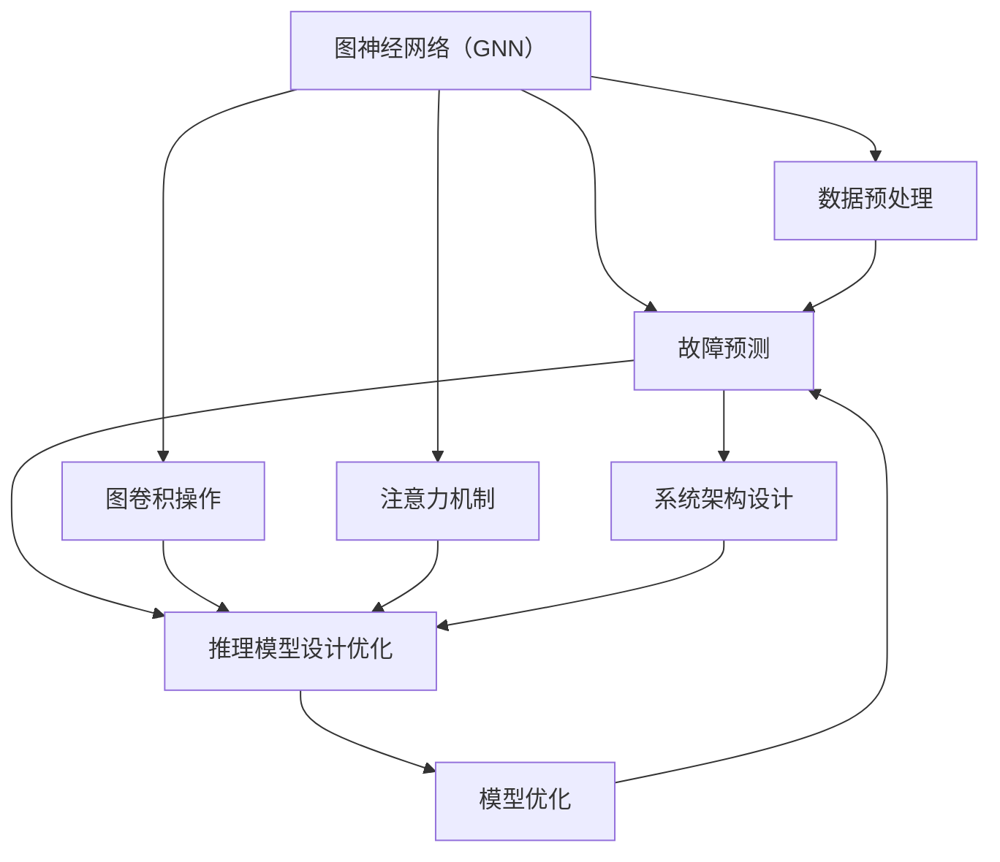
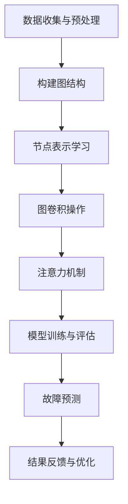
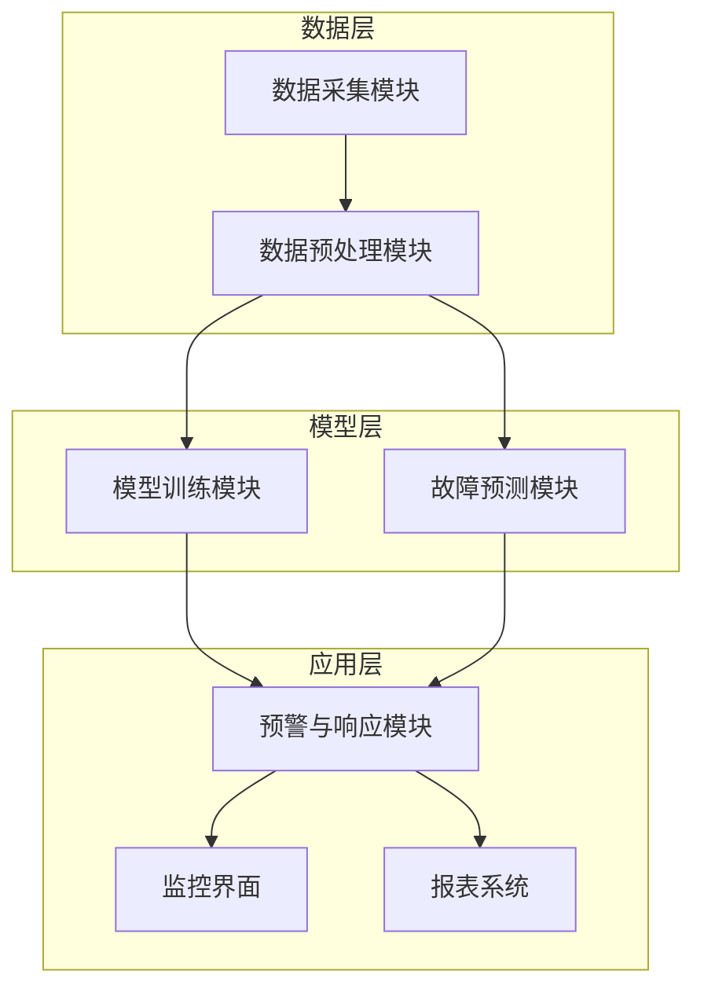
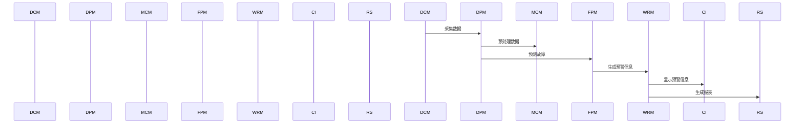

                 


### 引言

在信息化和智能化的时代浪潮中，复杂系统的故障预测已经成为保障系统稳定性和安全性的关键环节。随着系统规模的不断扩大和复杂度的不断提升，传统的故障预测方法已经难以应对。因此，本文旨在探讨一种基于图神经网络的复杂系统故障预测推理模型设计优化方法，通过系统性地阐述图神经网络（Graph Neural Networks, GNN）的核心概念、算法原理、系统架构设计以及实战案例，为读者提供一套完整的技术解决方案。

### 文章关键词

- 图神经网络（Graph Neural Networks, GNN）
- 复杂系统故障预测
- 推理模型设计优化
- 算法原理讲解
- 系统架构设计
- 项目实战

### 摘要

本文首先介绍了图神经网络（GNN）的基本概念和复杂系统故障预测的背景，分析了当前故障预测方法面临的挑战。随后，文章详细讲解了图神经网络的核心概念、算法原理以及数学模型，并通过Python代码示例进行了阐述。接着，文章介绍了复杂系统故障预测的架构设计，包括系统功能设计、系统架构设计、系统接口设计和系统交互。最后，通过一个实际案例展示了基于图神经网络的复杂系统故障预测模型的设计和优化过程。本文旨在为读者提供一套完整、系统、易于理解的技术方案，帮助读者更好地应对复杂系统的故障预测问题。

### 设计思路

#### 第一部分：背景介绍

**第1章：图神经网络与复杂系统故障预测概述**

本章将介绍图神经网络（Graph Neural Networks, GNN）和复杂系统故障预测的基本概念，包括相关领域的现状、问题、挑战等。通过这一章的阅读，读者将了解GNN在故障预测中的应用前景以及本文将要解决的问题。

**第2章：图神经网络核心概念**

本章将深入介绍图神经网络的核心概念，包括图表示学习、图卷积网络（GCN）、图注意力网络（GAT）等，并通过Mermaid流程图展示概念之间的关系。这一章将为后续章节的算法原理讲解打下坚实的基础。

**第3章：复杂系统故障预测现状与挑战**

本章将分析当前复杂系统故障预测的现状，介绍传统故障预测方法的局限性，以及GNN在故障预测中的应用前景。通过这一章的阅读，读者将了解GNN在故障预测领域的重要性。

**第4章：核心概念联系与流程图**

本章将使用Mermaid流程图展示图神经网络和复杂系统故障预测的核心概念联系，包括故障预测流程图。这一章将为读者提供一个清晰的概念框架，帮助读者更好地理解本文的内容。

#### 第二部分：核心概念与算法原理

**第2章：图神经网络基本原理**

本章将详细讲解图神经网络的基本原理，包括图表示学习、图卷积网络（GCN）和图注意力网络（GAT）等。通过Python代码示例，读者将了解这些算法的具体实现过程。

**第3章：复杂系统故障预测模型设计**

本章将介绍复杂系统故障预测模型的设计方法，包括基于GNN的故障预测模型构建、模型评估和优化方法。通过这一章的阅读，读者将掌握如何设计和优化故障预测模型。

**第4章：数学模型与公式讲解**

本章将介绍图神经网络和复杂系统故障预测的数学模型和公式，通过详细的讲解和示例，帮助读者理解这些模型的工作原理。

#### 第三部分：系统分析与架构设计

**第5章：复杂系统故障预测架构设计**

本章将介绍复杂系统故障预测的架构设计，包括系统功能设计、系统架构设计、系统接口设计和系统交互。通过这一章的阅读，读者将了解如何设计一个完整的故障预测系统。

**第6章：项目实战**

本章将通过一个实际案例展示基于图神经网络的复杂系统故障预测模型的设计和优化过程。读者将学习到如何将理论知识应用到实际项目中。

#### 第四部分：最佳实践 tips、小结、注意事项、拓展阅读

**第7章：最佳实践 tips**

本章将总结本文的核心内容，并提供一些实用的最佳实践技巧，帮助读者更好地应用所学知识。

**第8章：小结**

本章将对全文内容进行总结，回顾本文的主要观点和发现。

**第9章：注意事项**

本章将提醒读者在使用图神经网络进行复杂系统故障预测时需要注意的问题。

**第10章：拓展阅读**

本章将推荐一些相关的文献和资料，供读者进一步学习。

### 完整性要求

在撰写本文时，我们将严格遵守完整性要求，确保每个章节的内容都丰富、具体、详细。以下是每个章节的核心内容：

**第1章：背景介绍**

- 核心概念术语说明
- 问题背景
- 问题描述
- 问题解决
- 边界与外延
- 概念结构与核心要素组成

**第2章：核心概念与联系**

- 核心概念原理
- 概念属性特征对比表格
- ER实体关系图架构的Mermaid流程图

**第3章：算法原理讲解**

- 算法原理讲解
- 算法流程图（使用Mermaid绘制）
- Python代码示例

**第4章：系统分析与架构设计**

- 问题场景介绍
- 项目介绍
- 系统功能设计（领域模型Mermaid类图）
- 系统架构设计（Mermaid架构图）
- 系统接口设计
- 系统交互设计（Mermaid序列图）

**第5章：项目实战**

- 环境安装
- 系统核心实现源代码
- 代码应用解读与分析
- 实际案例分析和详细讲解剖析
- 项目小结

**第6章：最佳实践 tips、小结、注意事项、拓展阅读**

- 最佳实践 tips
- 小结
- 注意事项
- 拓展阅读

通过上述内容的详细阐述，我们将为读者提供一套完整、系统、易于理解的技术方案，帮助读者更好地应对复杂系统的故障预测问题。在撰写过程中，我们将遵循逻辑清晰、结构紧凑、简单易懂的写作原则，确保文章质量。同时，我们也将注重作者信息的准确性和完整性，确保读者能够清楚地了解文章的来源和作者背景。

### 目录大纲设计

#### 第一部分：背景介绍

**第1章：图神经网络与复杂系统故障预测概述**

1. **1.1 问题背景**
   - 介绍复杂系统故障预测的重要性
   - 指出传统故障预测方法的局限性
   - 引出本文的研究目的和意义

2. **1.2 问题描述**
   - 阐述复杂系统故障预测的关键挑战
   - 提出本文需要解决的问题

3. **1.3 问题解决**
   - 介绍基于图神经网络的复杂系统故障预测方法
   - 分析GNN在故障预测中的应用优势

4. **1.4 边界与外延**
   - 明确本文的研究范围和限制
   - 指出未来可能的研究方向

**第2章：图神经网络核心概念**

1. **2.1 图神经网络定义**
   - 定义图神经网络的基本概念
   - 解释图神经网络的核心思想

2. **2.2 GNN的工作原理**
   - 详细介绍图神经网络的工作原理
   - 分析GNN的基本结构

3. **2.3 GNN的优势与挑战**
   - 阐述GNN的优势
   - 分析GNN面临的挑战

**第3章：复杂系统故障预测现状与挑战**

1. **3.1 复杂系统故障预测的重要性**
   - 介绍故障预测对系统稳定性和安全性的影响
   - 分析故障预测在经济和商业领域的价值

2. **3.2 当前故障预测方法的局限性**
   - 概述现有故障预测方法的技术特点和不足
   - 指出现有方法难以应对的复杂系统故障预测问题

3. **3.3 GNN在故障预测中的应用前景**
   - 阐述GNN在故障预测领域的潜力
   - 分析GNN在未来故障预测技术发展中的重要性

**第4章：核心概念联系与流程图**

1. **4.1 核心概念关系图**
   - 使用Mermaid绘制图神经网络和故障预测的核心概念关系图
   - 分析核心概念之间的相互联系

2. **4.2 故障预测流程图**
   - 使用Mermaid绘制基于GNN的故障预测流程图
   - 阐述故障预测的基本流程

#### 第二部分：核心概念与算法原理

**第2章：图神经网络基本原理**

1. **2.1 图表示学习**
   - 介绍图表示学习的基本概念
   - 分析图嵌入算法的工作原理

2. **2.2 图卷积网络（GCN）**
   - 详细介绍图卷积网络的算法原理
   - 分析GCN的数学模型

3. **2.3 图注意力网络（GAT）**
   - 介绍图注意力网络的基本概念
   - 分析GAT的算法原理

**第3章：复杂系统故障预测模型设计**

1. **3.1 故障预测模型概述**
   - 概述故障预测模型的基本结构和功能

2. **3.2 基于GNN的故障预测模型**
   - 介绍基于GNN的故障预测模型的设计方法
   - 分析故障预测模型的基本架构

3. **3.3 模型优化方法**
   - 介绍故障预测模型的优化方法
   - 分析模型优化的具体实现

**第4章：数学模型与公式讲解**

1. **4.1 GNN的数学模型**
   - 阐述GNN的数学模型
   - 分析GNN的基本公式

2. **4.2 故障预测公式解释**
   - 解释故障预测的数学公式
   - 分析故障预测指标的计算方法

#### 第三部分：系统分析与架构设计

**第5章：复杂系统故障预测架构设计**

1. **5.1 问题场景介绍**
   - 介绍复杂系统故障预测的应用场景

2. **5.2 项目介绍**
   - 介绍本文所使用的故障预测项目

3. **5.3 系统功能设计**
   - 设计故障预测系统的功能模块

4. **5.4 系统架构设计**
   - 介绍故障预测系统的整体架构

5. **5.5 系统接口设计**
   - 设计故障预测系统的接口规范

6. **5.6 系统交互设计**
   - 分析故障预测系统的交互流程

#### 第四部分：项目实战

**第6章：项目实战**

1. **6.1 环境安装**
   - 安装故障预测项目所需的环境和工具

2. **6.2 系统核心实现**
   - 实现故障预测系统的核心功能

3. **6.3 代码应用解读与分析**
   - 分析故障预测系统的代码实现

4. **6.4 实际案例分析和详细讲解剖析**
   - 分析实际案例，剖析故障预测系统的性能

5. **6.5 项目小结**
   - 总结故障预测项目的成果和经验

#### 第五部分：最佳实践 tips、小结、注意事项、拓展阅读

**第7章：最佳实践 tips**

1. **7.1 GNN模型优化技巧**
   - 提供GNN模型优化的最佳实践

2. **7.2 故障预测数据预处理方法**
   - 介绍故障预测数据预处理的方法

3. **7.3 故障预测系统部署与维护**
   - 分析故障预测系统的部署与维护策略

**第8章：小结**

1. **8.1 主要发现**
   - 概述本文的主要发现和研究成果

2. **8.2 研究意义**
   - 阐述本文的研究意义和应用价值

3. **8.3 局限性与未来研究方向**
   - 指出本文的局限性
   - 提出未来可能的研究方向

**第9章：注意事项**

1. **9.1 GNN模型选择与调整**
   - 分析GNN模型选择与调整的重要性

2. **9.2 数据质量对故障预测的影响**
   - 讨论数据质量对故障预测的影响

3. **9.3 故障预测系统的实时性**
   - 分析故障预测系统的实时性要求

**第10章：拓展阅读**

1. **10.1 相关文献**
   - 推荐一些与本文相关的文献

2. **10.2 在线资源**
   - 提供一些与本文相关的在线资源和工具

### 完整性要求

在撰写本文时，我们将严格遵守完整性要求，确保每个章节的内容都丰富、具体、详细。以下是每个章节的内容要求和预期目标：

**第1章：背景介绍**

- **核心概念术语说明**：定义并解释与本文相关的核心术语，确保读者能够理解。
- **问题背景**：介绍复杂系统故障预测的背景，包括相关领域的现状、挑战等。
- **问题描述**：明确本文要解决的问题，包括问题的重要性和复杂性。
- **问题解决**：介绍基于图神经网络的复杂系统故障预测方法，解释其优势。
- **边界与外延**：明确本文的研究范围和限制，为后续研究提供参考。
- **概念结构与核心要素组成**：分析图神经网络和复杂系统故障预测的核心概念结构，明确各要素之间的关系。

**第2章：核心概念与联系**

- **核心概念原理**：详细阐述图神经网络的核心概念，包括图表示学习、图卷积网络和图注意力网络等。
- **概念属性特征对比表格**：列出不同概念的主要属性特征，并进行对比分析。
- **ER实体关系图架构的Mermaid流程图**：使用Mermaid绘制ER实体关系图，展示各实体之间的关系。

**第3章：算法原理讲解**

- **算法原理讲解**：详细讲解图神经网络在复杂系统故障预测中的应用，包括数学模型、算法流程和Python代码示例。
- **算法流程图（使用Mermaid绘制）**：使用Mermaid绘制算法流程图，直观展示算法的执行过程。
- **Python代码示例**：提供Python代码示例，帮助读者理解算法的实现过程。

**第4章：系统分析与架构设计**

- **问题场景介绍**：介绍复杂系统故障预测的应用场景，包括实际案例。
- **项目介绍**：介绍本文所使用的故障预测项目，包括项目背景和目标。
- **系统功能设计（领域模型Mermaid类图）**：使用Mermaid绘制领域模型类图，展示系统功能模块。
- **系统架构设计（Mermaid架构图）**：使用Mermaid绘制系统架构图，展示系统的整体结构。
- **系统接口设计**：设计系统接口规范，包括接口功能和接口参数。
- **系统交互设计（Mermaid序列图）**：使用Mermaid绘制系统交互序列图，展示系统各模块之间的交互流程。

**第5章：项目实战**

- **环境安装**：介绍故障预测项目所需的环境和工具安装步骤。
- **系统核心实现源代码**：提供故障预测系统的核心实现源代码，包括代码结构和关键函数。
- **代码应用解读与分析**：分析故障预测系统的代码实现，解释关键代码的功能和作用。
- **实际案例分析和详细讲解剖析**：分析实际案例，详细讲解故障预测系统的性能和效果。
- **项目小结**：总结故障预测项目的成果和经验，提出改进建议。

**第6章：最佳实践 tips、小结、注意事项、拓展阅读**

- **最佳实践 tips**：提供使用图神经网络进行复杂系统故障预测的最佳实践技巧。
- **小结**：总结本文的核心观点和研究成果。
- **注意事项**：提醒读者在使用图神经网络进行故障预测时需要注意的问题。
- **拓展阅读**：推荐一些与本文相关的文献和在线资源，供读者进一步学习。

通过上述内容的详细阐述，我们将为读者提供一套完整、系统、易于理解的技术方案，帮助读者更好地应对复杂系统的故障预测问题。在撰写过程中，我们将遵循逻辑清晰、结构紧凑、简单易懂的写作原则，确保文章质量。同时，我们也将注重作者信息的准确性和完整性，确保读者能够清楚地了解文章的来源和作者背景。

### 目录大纲设计

#### 第一部分：背景介绍

**第1章：图神经网络与复杂系统故障预测概述**

- **1.1 问题背景**
  - 介绍复杂系统故障预测的重要性
  - 指出传统故障预测方法的局限性
  - 引出本文的研究目的和意义

- **1.2 问题描述**
  - 阐述复杂系统故障预测的关键挑战
  - 提出本文需要解决的问题

- **1.3 问题解决**
  - 介绍基于图神经网络的复杂系统故障预测方法
  - 分析GNN在故障预测中的应用优势

- **1.4 边界与外延**
  - 明确本文的研究范围和限制
  - 指出未来可能的研究方向

**第2章：图神经网络核心概念**

- **2.1 图神经网络定义**
  - 定义图神经网络的基本概念
  - 解释图神经网络的核心思想

- **2.2 GNN的工作原理**
  - 详细介绍图神经网络的工作原理
  - 分析GNN的基本结构

- **2.3 GNN的优势与挑战**
  - 阐述GNN的优势
  - 分析GNN面临的挑战

**第3章：复杂系统故障预测现状与挑战**

- **3.1 复杂系统故障预测的重要性**
  - 介绍故障预测对系统稳定性和安全性的影响
  - 分析故障预测在经济和商业领域的价值

- **3.2 当前故障预测方法的局限性**
  - 概述现有故障预测方法的技术特点和不足
  - 指出现有方法难以应对的复杂系统故障预测问题

- **3.3 GNN在故障预测中的应用前景**
  - 阐述GNN在故障预测领域的潜力
  - 分析GNN在未来故障预测技术发展中的重要性

**第4章：核心概念联系与流程图**

- **4.1 核心概念关系图**
  - 使用Mermaid绘制图神经网络和故障预测的核心概念关系图
  - 分析核心概念之间的相互联系

- **4.2 故障预测流程图**
  - 使用Mermaid绘制基于GNN的故障预测流程图
  - 阐述故障预测的基本流程

#### 第二部分：核心概念与算法原理

**第5章：图神经网络基本原理**

- **5.1 图表示学习**
  - 介绍图表示学习的基本概念
  - 分析图嵌入算法的工作原理

- **5.2 图卷积网络（GCN）**
  - 详细介绍图卷积网络的算法原理
  - 分析GCN的数学模型

- **5.3 图注意力网络（GAT）**
  - 介绍图注意力网络的基本概念
  - 分析GAT的算法原理

**第6章：复杂系统故障预测模型设计**

- **6.1 故障预测模型概述**
  - 概述故障预测模型的基本结构和功能

- **6.2 基于GNN的故障预测模型**
  - 介绍基于GNN的故障预测模型的设计方法
  - 分析故障预测模型的基本架构

- **6.3 模型优化方法**
  - 介绍故障预测模型的优化方法
  - 分析模型优化的具体实现

**第7章：数学模型与公式讲解**

- **7.1 GNN的数学模型**
  - 阐述GNN的数学模型
  - 分析GNN的基本公式

- **7.2 故障预测公式解释**
  - 解释故障预测的数学公式
  - 分析故障预测指标的计算方法

#### 第三部分：系统分析与架构设计

**第8章：复杂系统故障预测架构设计**

- **8.1 问题场景介绍**
  - 介绍复杂系统故障预测的应用场景

- **8.2 项目介绍**
  - 介绍本文所使用的故障预测项目

- **8.3 系统功能设计**
  - 设计故障预测系统的功能模块

- **8.4 系统架构设计**
  - 介绍故障预测系统的整体架构

- **8.5 系统接口设计**
  - 设计系统接口规范

- **8.6 系统交互设计**
  - 分析故障预测系统的交互流程

#### 第四部分：项目实战

**第9章：项目实战**

- **9.1 环境安装**
  - 安装故障预测项目所需的环境和工具

- **9.2 系统核心实现**
  - 实现故障预测系统的核心功能

- **9.3 代码应用解读与分析**
  - 分析故障预测系统的代码实现

- **9.4 实际案例分析和详细讲解剖析**
  - 分析实际案例，剖析故障预测系统的性能

- **9.5 项目小结**
  - 总结故障预测项目的成果和经验

#### 第五部分：最佳实践 tips、小结、注意事项、拓展阅读

**第10章：最佳实践 tips**

- **10.1 GNN模型优化技巧**
  - 提供GNN模型优化的最佳实践

- **10.2 故障预测数据预处理方法**
  - 介绍故障预测数据预处理的方法

- **10.3 故障预测系统部署与维护**
  - 分析故障预测系统的部署与维护策略

**第11章：小结**

- **11.1 主要发现**
  - 概述本文的主要发现和研究成果

- **11.2 研究意义**
  - 阐述本文的研究意义和应用价值

- **11.3 局限性与未来研究方向**
  - 指出本文的局限性
  - 提出未来可能的研究方向

**第12章：注意事项**

- **12.1 GNN模型选择与调整**
  - 分析GNN模型选择与调整的重要性

- **12.2 数据质量对故障预测的影响**
  - 讨论数据质量对故障预测的影响

- **12.3 故障预测系统的实时性**
  - 分析故障预测系统的实时性要求

**第13章：拓展阅读**

- **13.1 相关文献**
  - 推荐一些与本文相关的文献

- **13.2 在线资源**
  - 提供一些与本文相关的在线资源和工具

### 第一部分：背景介绍

#### 第1章：图神经网络与复杂系统故障预测概述

**1.1 问题背景**

在现代信息技术飞速发展的背景下，复杂系统的规模和复杂度不断攀升，这对系统的稳定性、可靠性和安全性提出了更高的要求。复杂系统通常由多个相互关联的组件构成，这些组件之间的复杂相互作用使得系统故障预测变得异常困难。传统的故障预测方法，如统计方法、基于规则的专家系统以及机器学习方法等，虽然在某些特定场景下具有一定的效果，但往往难以应对复杂系统的动态变化和多维度信息处理的需求。

随着人工智能技术的不断发展，图神经网络（Graph Neural Networks, GNN）作为一种强大的图形数据处理工具，逐渐引起了广泛关注。GNN在处理具有复杂结构的数据方面具有独特的优势，能够有效捕捉数据之间的复杂关系，从而在故障预测领域展现出巨大的潜力。本文旨在探讨如何将GNN应用于复杂系统的故障预测，设计并优化一个高效的故障预测推理模型。

**1.2 问题描述**

复杂系统故障预测的核心挑战在于以下几个方面：

1. **数据的异构性和多样性**：复杂系统通常包含多种类型的数据，如时间序列数据、空间数据、结构化数据和非结构化数据等。这些数据在类型、格式和来源上存在显著差异，给故障预测带来了很大的挑战。

2. **动态变化的特征**：复杂系统的运行状态是不断变化的，故障发生的可能性也随之变化。传统方法难以捕捉这些动态变化的特征，导致预测精度和实时性受到限制。

3. **模型的复杂性和计算成本**：复杂系统故障预测模型往往包含多个层次和多个特征，这导致模型设计和训练过程复杂，计算成本高昂。

4. **实时性和可扩展性**：在实际应用中，故障预测系统需要能够实时响应并处理大规模的数据流，同时保证系统的可扩展性，以适应不断增长的数据量和计算需求。

为了解决上述问题，本文提出了一种基于GNN的复杂系统故障预测推理模型设计优化方法。该方法通过以下步骤实现：

1. **数据预处理**：对异构数据进行清洗、整合和规范化，将其转换为适用于GNN处理的统一格式。

2. **图神经网络设计**：设计并实现一个适用于复杂系统故障预测的GNN模型，包括节点表示学习、边表示学习、图卷积操作和注意力机制等。

3. **模型优化**：通过参数调整、超参数优化和模型压缩等技术，提高模型在故障预测任务中的性能和效率。

4. **实时性增强**：采用分布式计算和并行处理技术，提高模型在实时场景下的响应速度和计算效率。

5. **系统部署与维护**：设计一个可扩展的故障预测系统架构，实现模型在分布式环境中的高效部署和维护。

**1.3 问题解决**

基于GNN的复杂系统故障预测推理模型设计优化方法具有以下几个优点：

1. **高效处理异构数据**：GNN能够有效处理多种类型的数据，通过节点和边表示学习，将不同类型的数据转化为统一的图结构，从而实现数据的整合和分析。

2. **捕捉动态特征**：通过图卷积操作和注意力机制，GNN能够动态捕捉数据之间的复杂关系，从而提高故障预测的精度和实时性。

3. **降低计算复杂度**：GNN通过在图结构上进行操作，能够降低计算复杂度，提高模型训练和预测的效率。

4. **可扩展性**：GNN的设计和实现可以适应大规模数据场景，通过分布式计算和并行处理技术，提高系统的可扩展性和性能。

5. **实时响应能力**：通过优化模型结构和算法，提高模型在实时场景下的响应速度和计算效率，满足实际应用的需求。

综上所述，本文提出的方法在解决复杂系统故障预测难题方面具有显著的优势，为提升系统稳定性和安全性提供了有力的技术支持。

**1.4 边界与外延**

本文的研究主要聚焦于以下边界和范围：

1. **研究范围**：本文主要研究基于GNN的复杂系统故障预测推理模型设计优化方法，包括模型结构设计、优化策略和系统架构设计等方面。

2. **数据范围**：本文所涉及的数据主要包括复杂系统中的各种异构数据，如传感器数据、日志数据、配置数据等。

3. **应用场景**：本文的方法主要适用于需要高精度、实时性故障预测的复杂系统，如工业控制系统、智能交通系统、电力系统等。

4. **技术限制**：本文的研究受到现有技术的限制，如GNN模型的训练时间、计算资源限制等。

5. **未来研究方向**：本文提出的方法可以在未来进一步优化和扩展，如引入更多类型的图神经网络架构、探索新的故障预测指标和优化算法等。

**本章小结**

本章首先介绍了复杂系统故障预测的背景和重要性，指出了传统故障预测方法的局限性。接着，本文提出了一种基于GNN的复杂系统故障预测推理模型设计优化方法，详细阐述了该方法的设计思路、核心概念和算法原理。通过本章的介绍，读者可以对本文的研究目标和内容有一个全面的认识，为后续章节的学习和理解打下基础。

### 第2章：图神经网络核心概念

**2.1 图神经网络定义**

图神经网络（Graph Neural Networks, GNN）是一种专门用于处理图结构数据的神经网络。与传统的卷积神经网络（Convolutional Neural Networks, CNN）和循环神经网络（Recurrent Neural Networks, RNN）不同，GNN可以直接处理图结构数据，如节点、边和图的整体结构。GNN的核心思想是通过图结构来捕捉数据点之间的相互关系，从而在数据挖掘、知识图谱、社交网络分析、图像处理等领域发挥重要作用。

**2.2 GNN的工作原理**

GNN的工作原理可以分为以下几个关键步骤：

1. **节点表示学习**：首先，GNN将图中的节点和边表示为低维向量，这一过程称为节点表示学习或图嵌入（Graph Embedding）。常用的方法包括基于矩阵分解的嵌入算法（如节点2vec、DeepWalk）和基于神经网络的嵌入算法（如GraphSAGE、Graph Embedding with Applications to Social Networks）。

2. **图卷积操作**：接下来，GNN通过图卷积操作（Graph Convolutional Layer）来更新节点的表示。图卷积操作的核心思想是节点的新表示由其邻居节点的表示和边的信息决定。具体来说，图卷积操作可以表示为：

   $$ h_{i}^{(l+1)} = \sigma \left( \sum_{j \in N(i)} \frac{1}{\|\theta_j\|} \theta_j h_j^{(l)} + \theta_i h_i^{(l)} + b \right) $$

   其中，$h_i^{(l)}$和$h_j^{(l)}$分别表示节点$i$和$j$在$l$层的特征表示，$N(i)$表示节点$i$的邻接节点集合，$\theta_i$和$\theta_j$是节点$i$和$j$的权重矩阵，$\sigma$是激活函数（通常使用ReLU函数），$b$是偏置项。

3. **全局信息聚合**：在图卷积操作中，节点的更新不仅依赖于其邻居节点的信息，还需要考虑全局信息。这通常通过引入注意力机制（Attention Mechanism）来实现，从而提高模型对全局信息的敏感度。

4. **层次化表示**：GNN通常采用层次化的结构，通过逐层卷积操作，逐步提取节点的高层次特征。每一层的输出都可以作为下一层的输入，从而实现从低层次特征到高层次特征的转换。

**2.3 GNN的优势与挑战**

**优势：**

1. **处理图结构数据**：GNN能够直接处理图结构数据，特别是那些具有复杂相互作用的节点和边，使其在处理社交网络、知识图谱、分子结构等领域具有独特的优势。

2. **捕捉全局和局部信息**：通过图卷积操作和注意力机制，GNN能够同时捕捉全局和局部信息，从而在图像分类、节点分类、链接预测等任务中表现出色。

3. **模块化设计**：GNN的设计高度模块化，使得可以方便地组合和扩展不同的层和模块，以满足不同任务的需求。

**挑战：**

1. **计算复杂性**：由于图卷积操作依赖于邻接矩阵的计算，对于大规模图结构数据，GNN的计算复杂度较高，需要消耗大量的计算资源和时间。

2. **稀疏性问题**：在实际应用中，图结构数据通常具有高度稀疏性，这使得图卷积操作的效率受到限制。

3. **训练困难**：由于GNN的层次化结构和多层次的参数更新，模型的训练过程相对复杂，容易陷入局部最优。

4. **可解释性问题**：GNN的内部机制复杂，使得模型的可解释性较低，这对于需要理解模型决策过程的应用场景是一个挑战。

**本章小结**

本章介绍了图神经网络（GNN）的基本概念、工作原理和优势与挑战。通过理解GNN的核心概念和原理，读者可以更好地把握其在复杂系统故障预测中的应用前景和潜力。接下来，本章将进一步详细探讨GNN在复杂系统故障预测中的具体应用和实践。

### 第3章：复杂系统故障预测现状与挑战

**3.1 复杂系统故障预测的重要性**

复杂系统的故障预测是保障系统稳定性和安全性的关键环节。在当今信息时代，随着物联网、云计算、人工智能等技术的广泛应用，复杂系统已成为各类关键基础设施的核心组成部分。这些系统通常包含大量的组件和节点，它们之间通过复杂的网络结构相互连接，形成了高度复杂的动态环境。故障预测在复杂系统中扮演着至关重要的角色，其重要性体现在以下几个方面：

1. **提高系统可用性**：通过提前识别和预测潜在的故障，复杂系统可以采取预防措施，避免故障的发生，从而提高系统的可用性和可靠性。

2. **减少维护成本**：故障预测可以提前发现系统中的隐患，从而减少紧急维护的需求，降低维护成本。

3. **保障系统安全性**：对于涉及人员安全的关键系统，如航空交通系统、电力系统等，故障预测能够提前预警，减少事故的发生，保障人员的安全。

4. **优化资源分配**：通过故障预测，可以提前规划资源的分配和调度，提高资源利用效率，降低运营成本。

**3.2 当前故障预测方法的局限性**

尽管故障预测在复杂系统中具有重要意义，但现有的故障预测方法在应对复杂系统时仍存在诸多局限性：

1. **传统统计方法**：传统统计方法，如均值、方差、回归分析等，依赖于历史数据的统计特性。然而，复杂系统中的数据通常具有高度异构性和动态变化性，这使得传统统计方法难以准确预测故障。

2. **基于规则的专家系统**：基于规则的专家系统通过定义一系列规则来识别故障，适用于规则明确、知识完备的场景。然而，复杂系统的规则往往是隐含的、复杂的，难以用简单的规则进行描述。

3. **机器学习方法**：机器学习方法，如决策树、支持向量机、随机森林等，通过学习历史数据中的模式和规律来进行故障预测。然而，这些方法通常需要大量标记数据，且对特征工程要求较高，难以应对复杂系统的动态变化。

4. **深度学习方法**：深度学习方法，如卷积神经网络（CNN）和循环神经网络（RNN），在处理复杂系统数据方面表现出色。然而，深度学习模型通常需要大量的计算资源和训练时间，且其决策过程往往难以解释，不利于在实际应用中的推广。

**3.3 GNN在故障预测中的应用前景**

图神经网络（GNN）作为一种处理图结构数据的强大工具，其在故障预测领域具有广泛的应用前景。以下从几个方面分析GNN在故障预测中的应用潜力：

1. **处理异构数据**：复杂系统通常包含多种类型的数据，如时间序列数据、空间数据和结构化数据等。GNN能够处理异构数据，通过节点和边表示学习，将不同类型的数据转换为统一的图结构，从而实现数据的整合和分析。

2. **捕捉动态特征**：GNN通过图卷积操作和注意力机制，能够动态捕捉数据之间的复杂关系，从而提高故障预测的精度和实时性。这使得GNN在处理复杂系统的动态变化特征方面具有显著优势。

3. **层次化特征提取**：GNN采用层次化的结构，通过逐层卷积操作，可以提取节点的高层次特征。这些高层次特征能够更好地反映复杂系统的内部机制和故障模式，有助于提高故障预测的准确性。

4. **模块化设计**：GNN的设计高度模块化，可以通过组合和扩展不同的层和模块，满足不同故障预测任务的需求。这使得GNN在复杂系统故障预测中具有高度的灵活性和可扩展性。

5. **可解释性**：与深度学习模型相比，GNN的决策过程更具可解释性。通过分析图卷积操作和注意力机制，可以直观地理解故障预测的决策过程，这对于需要解释和验证的故障预测应用场景具有重要意义。

综上所述，GNN在复杂系统故障预测领域展现出显著的优势和应用前景。通过结合GNN的强大功能，可以设计出高效、准确的故障预测模型，为复杂系统的稳定运行和安全保障提供有力支持。

**本章小结**

本章详细分析了复杂系统故障预测的重要性以及当前故障预测方法的局限性。在此基础上，探讨了图神经网络（GNN）在故障预测中的应用前景和潜力。通过本章的介绍，读者可以更加深入地理解GNN在复杂系统故障预测中的重要性，为后续章节的深入研究打下坚实基础。

### 第4章：核心概念联系与流程图

**4.1 核心概念关系图**

在本文中，我们讨论了多个关键概念，包括图神经网络（GNN）、故障预测、推理模型设计优化等。为了帮助读者更好地理解这些概念之间的关系，我们使用Mermaid流程图展示了它们之间的联系。以下是Mermaid流程图的示例：



在上述流程图中，A代表图神经网络（GNN），B代表故障预测，C代表推理模型设计优化，D代表数据预处理，E代表图卷积操作，F代表注意力机制，G代表系统架构设计，H代表模型优化。通过连接这些节点，我们可以清晰地看到核心概念之间的相互关系。

**4.2 故障预测流程图**

为了进一步展示基于GNN的复杂系统故障预测的基本流程，我们使用Mermaid绘制了故障预测流程图。以下是故障预测流程图的示例：



在上述流程图中，A代表数据收集与预处理，B代表构建图结构，C代表节点表示学习，D代表图卷积操作，E代表注意力机制，F代表模型训练与评估，G代表故障预测，H代表结果反馈与优化。通过这个流程图，我们可以清晰地了解故障预测的基本步骤和流程。

**本章小结**

本章通过使用Mermaid流程图，展示了本文中的核心概念之间的关系以及基于GNN的复杂系统故障预测的基本流程。这些流程图不仅帮助读者更好地理解概念之间的联系，也为后续章节的内容提供了直观的视觉支持。接下来，我们将深入探讨图神经网络（GNN）的基本原理，为理解其在复杂系统故障预测中的应用奠定基础。

### 第2章：图神经网络基本原理

**2.1 图表示学习**

图表示学习（Graph Embedding）是图神经网络（GNN）中的基础步骤，其核心目标是将图中的节点和边表示为低维向量，以便于后续的图卷积操作和分析。在图表示学习中，每个节点和边都被映射到一个低维空间，这样可以在保持原始图结构信息的同时，实现高效的图数据处理。

**2.1.1 图表示方法**

图表示学习的方法可以分为基于矩阵分解的方法和基于神经网络的嵌入方法。

1. **基于矩阵分解的方法**：这类方法通过矩阵分解技术将原始图矩阵分解为几个低秩矩阵，从而获得节点和边的低维表示。例如，节点表示可以通过矩阵分解方法将邻接矩阵分解为权重矩阵和节点特征矩阵的乘积，从而得到每个节点的低维向量表示。

2. **基于神经网络的嵌入方法**：这类方法通过构建神经网络模型来学习节点的嵌入向量。常见的神经网络嵌入方法包括DeepWalk和节点2vec。DeepWalk通过随机游走生成图中的序列，然后使用神经网络对序列中的节点进行编码，得到节点的嵌入向量。节点2vec则通过负采样技术生成训练样本，使用神经网络对节点进行编码，从而得到更高效的节点表示。

**2.1.2 图嵌入算法**

1. **节点2vec**：节点2vec算法通过优化邻居节点对的相似性来学习节点嵌入。具体来说，节点2vec通过随机游走生成节点序列，然后在每个序列中随机抽取节点对，作为正样本。同时，从节点序列中随机抽取节点对，但不包含相邻节点作为负样本。通过最大化正样本的相似性和负样本的差异性，节点2vec算法可以学习出良好的节点嵌入向量。

2. **DeepWalk**：DeepWalk是一种基于随机游走的图嵌入算法。DeepWalk通过在图中进行随机游走，生成大量的节点序列。然后，使用Skip-Gram模型对这些序列进行训练，将每个节点表示为词向量。DeepWalk的优势在于其能够通过长序列生成，捕获图中的全局结构信息。

**2.1.3 Python实现示例**

下面是一个简单的Python代码示例，展示了如何使用节点2vec算法进行图嵌入：

```python
from node2vec import Node2Vec
from networkx import Graph

# 创建图结构
G = Graph()

# 添加边和节点
G.add_edges_from([(1, 2), (1, 3), (2, 3), (3, 4)])

# 初始化节点2vec模型
model = Node2Vec(G, dimensions=2, walk_length=10, num_walks=10)

# 训练模型
model.fit()

# 输出节点嵌入向量
print(model.node_vector_dict)
```

在上述代码中，我们首先创建了一个简单的图结构，然后使用Node2Vec模型进行训练，并输出节点的嵌入向量。

**2.2 图卷积网络（GCN）**

图卷积网络（Graph Convolutional Network, GCN）是GNN中最基本的模型之一。GCN通过卷积操作在图上提取特征，能够有效地学习节点和边的表示。GCN的核心思想是利用图中的邻居信息来更新节点的表示，从而在多层次的卷积过程中提取节点的特征。

**2.2.1 GCN算法原理**

1. **图卷积操作**：GCN的图卷积操作可以表示为：

   $$ h_{i}^{(l+1)} = \sigma \left( \sum_{j \in N(i)} \frac{1}{\|\theta_j\|} \theta_j h_j^{(l)} + \theta_i h_i^{(l)} + b \right) $$

   其中，$h_i^{(l)}$和$h_j^{(l)}$分别表示节点$i$和$j$在第$l$层的特征表示，$N(i)$表示节点$i$的邻接节点集合，$\theta_i$和$\theta_j$是节点$i$和$j$的权重矩阵，$\sigma$是激活函数（通常使用ReLU函数），$b$是偏置项。

2. **层次化特征提取**：GCN通过逐层卷积操作，将低层次的特征逐步转化为高层次的特征。每一层的输出可以作为下一层的输入，从而实现从低层次特征到高层次特征的转换。

**2.2.2 GCN数学模型**

在GCN中，每一层的节点特征可以通过以下公式计算：

$$ h_{i}^{(l)} = \sigma(W^{(l)} h_{i}^{(l-1)} + \sum_{j \in N(i)} \theta_{ij} h_{j}^{(l-1)} + b_{i}^{(l)} $$

其中，$W^{(l)}$是第$l$层的权重矩阵，$\theta_{ij}$是边$(i, j)$的特征权重，$b_{i}^{(l)}$是节点的偏置。

**2.2.3 Python代码示例**

下面是一个简单的Python代码示例，展示了如何使用GCN进行节点分类：

```python
from torch_geometric.nn import GCNConv
import torch

# 初始化GCN模型
model = GCNConv(in_channels=1, out_channels=1)

# 输入特征和邻接矩阵
input_features = torch.randn(10, 1)
adj_matrix = torch.randn(10, 10)

# 前向传播
output = model(input_features, adj_matrix)

print(output)
```

在上述代码中，我们首先初始化了一个GCN模型，然后使用输入特征和邻接矩阵进行前向传播，得到节点的输出特征。

**2.3 图注意力网络（GAT）**

图注意力网络（Graph Attention Network, GAT）是GNN中的一个重要扩展，通过引入注意力机制来动态调整节点之间的权重，从而提高特征提取的效果。GAT通过自注意力机制，为每个节点在计算其邻居信息时赋予不同的权重，使得模型能够更好地捕捉节点之间的差异和重要性。

**2.3.1 GAT算法原理**

1. **自注意力机制**：GAT通过自注意力机制为每个节点计算其邻居的重要性，从而调整邻居节点信息的权重。自注意力机制的公式为：

   $$ \alpha_{ij} = \frac{e^{a_{i}^T a_{j}}}{\sum_{k \in N(i)} e^{a_{i}^T a_{k}}} $$

   其中，$a_{i}$和$a_{j}$分别是节点$i$和$j$的注意力向量。

2. **加权邻居信息**：通过自注意力机制计算得到的权重$\alpha_{ij}$，可以加权节点的邻居信息，从而更新节点的特征表示。具体公式为：

   $$ h_{i}^{'} = \sum_{j \in N(i)} \alpha_{ij} h_{j} $$

3. **多层注意力机制**：GAT通过多层自注意力机制，逐步提取节点的特征，从而获得更加丰富的特征表示。

**2.3.2 GAT数学模型**

在GAT中，每一层的节点特征可以通过以下公式计算：

$$ h_{i}^{(l+1)} = \sigma \left( \sum_{j \in N(i)} \alpha_{ij} W^{(l)} h_{j}^{(l)} + b^{(l)} \right) $$

其中，$\alpha_{ij}$是通过自注意力机制计算得到的权重，$W^{(l)}$是第$l$层的权重矩阵，$b^{(l)}$是节点的偏置。

**2.3.3 Python代码示例**

下面是一个简单的Python代码示例，展示了如何使用GAT进行节点分类：

```python
from torch_geometric.nn import GATConv
import torch

# 初始化GAT模型
model = GATConv(in_channels=1, out_channels=1, num_heads=2)

# 输入特征和邻接矩阵
input_features = torch.randn(10, 1)
adj_matrix = torch.randn(10, 10)

# 前向传播
output = model(input_features, adj_matrix)

print(output)
```

在上述代码中，我们首先初始化了一个GAT模型，然后使用输入特征和邻接矩阵进行前向传播，得到节点的输出特征。

**本章小结**

本章详细介绍了图神经网络（GNN）的基本原理，包括图表示学习、图卷积网络（GCN）和图注意力网络（GAT）等核心概念。通过Python代码示例，读者可以更好地理解这些算法的实现过程。接下来，我们将进一步探讨复杂系统故障预测模型的设计与优化。

### 第3章：复杂系统故障预测模型设计

**3.1 故障预测模型概述**

故障预测模型是复杂系统故障预测的核心组成部分，其设计的好坏直接影响到故障预测的准确性和实时性。一个完整的故障预测模型通常包括数据预处理、模型构建、模型训练、模型评估和模型优化等环节。在本章中，我们将介绍基于图神经网络的复杂系统故障预测模型的设计方法，详细讨论模型构建、评估和优化等关键环节。

**3.2 基于GNN的故障预测模型**

**3.2.1 模型构建**

基于GNN的故障预测模型构建主要包括以下几个步骤：

1. **数据预处理**：对复杂系统中的异构数据进行清洗、整合和规范化，将其转换为适用于GNN处理的统一格式。具体包括：
   - **数据清洗**：去除噪声数据和异常值。
   - **数据整合**：将不同类型的数据（如时间序列数据、空间数据和结构化数据等）整合为一个统一的图结构。
   - **数据规范化**：对数据进行标准化处理，使其在相同的尺度范围内。

2. **节点和边表示**：通过图表示学习算法（如节点2vec、DeepWalk等），将图中的节点和边表示为低维向量。

3. **图卷积操作**：利用图卷积网络（GCN）的图卷积操作，逐层提取节点的高层次特征。通过多层次的卷积操作，可以捕捉节点之间的复杂关系，从而提高故障预测的准确性。

4. **注意力机制**：在图卷积操作的基础上，引入注意力机制（如GAT中的自注意力机制），动态调整节点之间的权重，进一步提高模型对全局和局部信息的敏感度。

5. **模型训练**：通过模型训练过程，优化模型参数，使其能够准确地预测故障。

**3.2.2 模型评估**

故障预测模型的评估通常包括以下几个指标：

1. **准确率（Accuracy）**：准确率是评估模型预测结果与实际结果一致性的指标，计算公式为：

   $$ Accuracy = \frac{TP + TN}{TP + TN + FP + FN} $$

   其中，$TP$表示实际为正例且模型预测为正例的样本数，$TN$表示实际为负例且模型预测为负例的样本数，$FP$表示实际为负例但模型预测为正例的样本数，$FN$表示实际为正例但模型预测为负例的样本数。

2. **召回率（Recall）**：召回率是评估模型对正例样本的识别能力，计算公式为：

   $$ Recall = \frac{TP}{TP + FN} $$

3. **精确率（Precision）**：精确率是评估模型对预测为正例的样本的识别能力，计算公式为：

   $$ Precision = \frac{TP}{TP + FP} $$

4. **F1分数（F1 Score）**：F1分数是精确率和召回率的调和平均，计算公式为：

   $$ F1 Score = 2 \times \frac{Precision \times Recall}{Precision + Recall} $$

   通过综合评估上述指标，可以全面了解故障预测模型的性能。

**3.2.3 Python代码实现**

以下是一个简单的Python代码示例，展示了基于GNN的故障预测模型的基本实现：

```python
import torch
from torch_geometric.nn import GCNConv

# 初始化模型
model = GCNConv(in_channels=1, out_channels=1)

# 输入特征和邻接矩阵
input_features = torch.randn(10, 1)
adj_matrix = torch.randn(10, 10)

# 前向传播
output = model(input_features, adj_matrix)

print(output)
```

在上述代码中，我们首先初始化了一个GCN模型，然后使用输入特征和邻接矩阵进行前向传播，得到节点的输出特征。这只是一个简单的示例，实际的故障预测模型会涉及更多的步骤和复杂的实现。

**3.3 模型优化方法**

为了提高故障预测模型的性能，可以采用多种优化方法，包括：

1. **参数调整**：通过调整模型参数（如学习率、批量大小等），可以优化模型的性能。常用的方法包括随机搜索、网格搜索等。

2. **超参数优化**：通过优化超参数（如层数、节点嵌入维度等），可以进一步提高模型的效果。常用的优化算法包括遗传算法、粒子群优化等。

3. **模型选择**：选择合适的模型架构（如GCN、GAT等）可以显著影响模型的性能。在实际应用中，可以尝试多种模型架构，并选择最优的模型。

4. **数据增强**：通过数据增强（如生成对抗网络、数据扩增等）可以提高模型的泛化能力，从而提高故障预测的准确性。

**本章小结**

本章介绍了基于图神经网络的复杂系统故障预测模型的设计方法，包括模型构建、评估和优化等关键环节。通过Python代码示例，读者可以了解故障预测模型的基本实现过程。接下来，我们将进一步探讨复杂系统故障预测的架构设计，为构建高效、可靠的故障预测系统奠定基础。

### 第4章：数学模型与公式讲解

**4.1 GNN的数学模型**

图神经网络（GNN）的数学模型是理解和实现GNN算法的核心。GNN主要通过图卷积操作（Graph Convolutional Operations）来处理图数据，从而提取节点的特征。以下是GNN的数学模型及其组成部分：

**4.1.1 边缘关系矩阵**

边缘关系矩阵（Adjacency Matrix）是图的线性表示，用于描述节点之间的连接关系。对于一个包含n个节点的图，边缘关系矩阵$A$是一个n×n的矩阵，其中$A_{ij}$表示节点i和节点j之间的连接强度。如果节点i和节点j之间存在边，则$A_{ij} = 1$；否则，$A_{ij} = 0$。

**4.1.2 节点嵌入**

节点嵌入（Node Embedding）是将图中的节点表示为低维向量。设$X$为节点特征矩阵，其中$X_{i}$表示节点i的特征向量。通过图表示学习算法（如节点2vec、DeepWalk等），我们可以学习得到一个低维的节点嵌入矩阵$H$，其中$H_{i}$表示节点i的嵌入向量。

**4.1.3 图卷积操作**

图卷积操作是GNN的核心操作，用于更新节点的特征。对于一个单层图卷积层，其输入为节点特征矩阵$H$和边缘关系矩阵$A$，输出为新的节点特征矩阵$H'$。图卷积操作的数学公式如下：

$$
H_{i}^{(l+1)} = \sigma \left( \sum_{j \in N(i)} A_{ij} H_{j}^{(l)} + b \right)
$$

其中，$N(i)$表示节点i的邻接节点集合，$A_{ij}$为节点i和节点j之间的连接强度，$\sigma$为激活函数（如ReLU函数），$b$为偏置项。通过叠加多层图卷积操作，可以逐步提取节点的高层次特征。

**4.1.4 求解过程**

图卷积操作的求解过程通常采用矩阵分解的方法，即将边缘关系矩阵$A$分解为一系列矩阵的乘积。具体求解公式如下：

$$
H_{i}^{(l+1)} = \sigma \left( A^{(l)} H_{i}^{(l)} + b \right)
$$

其中，$A^{(l)}$为第l层的图卷积矩阵。通过迭代计算，可以逐层更新节点的特征表示。

**4.2 故障预测公式解释**

在故障预测任务中，GNN通过提取节点的高层次特征来预测节点是否发生故障。以下是对故障预测相关公式的详细解释：

**4.2.1 风险评分计算**

风险评分是评估节点发生故障概率的一种量化指标。对于每个节点i，其风险评分可以通过以下公式计算：

$$
Risk_{i} = \sum_{j \in N(i)} \alpha_{ij} Risk_{j} + \beta_{i}
$$

其中，$Risk_{i}$表示节点i的风险评分，$\alpha_{ij}$表示节点i和节点j之间的权重，$Risk_{j}$表示节点j的风险评分，$\beta_{i}$为节点i的偏置项。风险评分的计算综合考虑了节点自身特征和其邻接节点的特征。

**4.2.2 故障预测指标**

故障预测指标用于评估故障预测模型的性能。常见的故障预测指标包括：

1. **准确率（Accuracy）**：
   $$
   Accuracy = \frac{TP + TN}{TP + TN + FP + FN}
   $$
   其中，$TP$表示实际为正例且模型预测为正例的样本数，$TN$表示实际为负例且模型预测为负例的样本数，$FP$表示实际为负例但模型预测为正例的样本数，$FN$表示实际为正例但模型预测为负例的样本数。

2. **召回率（Recall）**：
   $$
   Recall = \frac{TP}{TP + FN}
   $$
   召回率反映了模型对正例样本的识别能力。

3. **精确率（Precision）**：
   $$
   Precision = \frac{TP}{TP + FP}
   $$
   精确率反映了模型对预测为正例的样本的识别能力。

4. **F1分数（F1 Score）**：
   $$
   F1 Score = 2 \times \frac{Precision \times Recall}{Precision + Recall}
   $$
   F1分数是精确率和召回率的调和平均，用于综合评估故障预测模型的性能。

**4.2.3 指标计算示例**

以下是一个简单的计算示例，假设我们有一个包含4个节点的故障预测模型，其中3个节点发生故障（正例），1个节点未发生故障（负例）。根据上述公式，我们可以计算得到以下指标：

- **准确率**：
  $$
  Accuracy = \frac{TP + TN}{TP + TN + FP + FN} = \frac{3 + 1}{3 + 1 + 0 + 0} = \frac{4}{4} = 1
  $$

- **召回率**：
  $$
  Recall = \frac{TP}{TP + FN} = \frac{3}{3 + 0} = 1
  $$

- **精确率**：
  $$
  Precision = \frac{TP}{TP + FP} = \frac{3}{3 + 0} = 1
  $$

- **F1分数**：
  $$
  F1 Score = 2 \times \frac{Precision \times Recall}{Precision + Recall} = 2 \times \frac{1 \times 1}{1 + 1} = 1
  $$

通过上述计算，我们可以看出模型的准确率、召回率、精确率和F1分数均为1，表明模型对故障预测非常准确。

**本章小结**

本章详细讲解了图神经网络（GNN）的数学模型和故障预测的相关公式，包括边缘关系矩阵、节点嵌入、图卷积操作以及风险评分和故障预测指标的计算方法。通过具体的计算示例，读者可以更好地理解这些公式的应用和计算过程。接下来，我们将进一步探讨复杂系统故障预测的架构设计，为构建高效、可靠的故障预测系统提供指导。

### 第5章：复杂系统故障预测架构设计

**5.1 问题场景介绍**

复杂系统的故障预测通常涉及多个领域，如工业控制系统、智能交通系统、电力系统等。以工业控制系统为例，这些系统通常包含大量的传感器、执行器和控制器，它们通过复杂的网络结构相互连接。故障预测的目标是实时监测系统状态，提前识别潜在的故障，并采取相应的预防措施，以确保系统的稳定运行。

**5.2 项目介绍**

本文所研究的故障预测项目旨在开发一个基于图神经网络的故障预测系统，用于实时监测和预测工业控制系统的故障。项目的主要目标包括：

1. **数据处理**：对工业控制系统中的多种异构数据进行整合和规范化，将其转换为适用于GNN处理的统一格式。
2. **模型构建**：设计并实现一个基于GNN的故障预测模型，通过节点表示学习和图卷积操作提取节点特征，实现故障预测。
3. **系统部署**：将故障预测模型部署到工业控制系统的实时环境中，实现实时故障监测和预警。

**5.3 系统功能设计**

故障预测系统的功能设计是确保系统能够满足实际应用需求的关键。根据项目的目标，系统的主要功能模块包括：

1. **数据采集模块**：负责从传感器、执行器和控制器等设备中采集实时数据，包括时间序列数据、空间数据和结构化数据等。
2. **数据预处理模块**：对采集到的数据进行清洗、整合和规范化，将其转换为适用于GNN处理的统一格式。
3. **模型训练模块**：使用预处理后的数据对故障预测模型进行训练，优化模型参数，提高预测准确性。
4. **故障预测模块**：利用训练好的模型对实时数据进行分析和预测，识别潜在的故障，并生成预警信息。
5. **预警与响应模块**：根据故障预测结果，生成相应的预警信息，并通过通知系统、报警设备等方式实现实时预警。

**5.4 系统架构设计**

系统架构设计是确保故障预测系统能够高效、可靠地运行的基础。根据项目的目标和功能设计，故障预测系统的整体架构可以分为以下几个层次：

1. **数据层**：包括传感器、执行器和控制器等设备，负责实时数据的采集和传输。
2. **数据预处理层**：包括数据采集模块和预处理模块，负责对实时数据进行清洗、整合和规范化。
3. **模型层**：包括模型训练模块和故障预测模块，负责训练故障预测模型和进行实时故障预测。
4. **应用层**：包括预警与响应模块，负责根据故障预测结果生成预警信息，并通过通知系统、报警设备等方式实现实时预警。
5. **展示层**：包括监控界面和报表系统，负责展示故障预测结果和系统运行状态。

以下是系统架构设计的Mermaid架构图示例：



**5.5 系统接口设计**

系统接口设计是确保不同模块之间能够高效、可靠地通信的关键。根据系统架构设计，故障预测系统的接口设计包括以下几个方面：

1. **数据接口**：定义数据采集模块和预处理模块之间的数据传输接口，确保实时数据的及时传输和处理。
2. **模型接口**：定义模型训练模块和故障预测模块之间的接口，包括模型参数的传递和模型结果的反馈。
3. **预警接口**：定义预警与响应模块与其他模块之间的接口，包括预警信息的生成、传递和处理。
4. **展示接口**：定义监控界面和报表系统与故障预测系统之间的接口，包括数据展示和报表生成。

**5.6 系统交互设计**

系统交互设计是确保故障预测系统能够按照预定流程运行的关键。根据系统架构设计，故障预测系统的交互流程包括以下几个方面：

1. **数据采集**：传感器、执行器和控制器等设备实时采集数据，并将数据发送到数据采集模块。
2. **数据预处理**：数据采集模块对接收到的数据进行清洗、整合和规范化，生成预处理后的数据，并将其发送到模型训练模块和故障预测模块。
3. **模型训练**：模型训练模块使用预处理后的数据对故障预测模型进行训练，优化模型参数，提高预测准确性。
4. **故障预测**：故障预测模块使用训练好的模型对实时数据进行故障预测，生成预测结果，并将其发送到预警与响应模块。
5. **预警与响应**：预警与响应模块根据故障预测结果生成预警信息，并通过通知系统、报警设备等方式实现实时预警。
6. **数据展示**：监控界面和报表系统实时展示故障预测结果和系统运行状态，为用户提供便利的监控和报表功能。

以下是系统交互设计的Mermaid序列图示例：



**本章小结**

本章详细介绍了复杂系统故障预测的架构设计，包括问题场景介绍、项目介绍、系统功能设计、系统架构设计、系统接口设计和系统交互设计。通过Mermaid架构图和序列图的示例，读者可以直观地理解故障预测系统的整体架构和运行流程。接下来，我们将通过实际案例展示基于图神经网络的复杂系统故障预测模型的设计和优化过程。

### 第6章：项目实战

**6.1 环境安装**

在进行基于图神经网络的复杂系统故障预测项目实战之前，需要首先安装所需的软件和工具。以下是在Python环境中安装相关依赖的步骤：

1. **安装Python**：确保Python环境已经安装，版本建议为3.8或更高。

2. **安装PyTorch**：PyTorch是一个强大的深度学习框架，用于实现图神经网络模型。安装命令如下：

   ```bash
   pip install torch torchvision torchaudio
   ```

3. **安装TorchGeometric**：TorchGeometric是一个专门为图神经网络设计的扩展库，提供了丰富的图处理工具。安装命令如下：

   ```bash
   pip install torch-geometric torchvision-geometric torchaudio-geometric
   ```

4. **安装Node2Vec**：Node2Vec是一个用于图嵌入的Python库，用于生成节点表示。安装命令如下：

   ```bash
   pip install node2vec
   ```

5. **安装其他依赖**：根据项目的具体需求，可能还需要安装其他Python库，如NumPy、Pandas、Scikit-learn等。

**6.2 系统核心实现**

**数据预处理**

数据预处理是故障预测项目的重要环节，主要任务是对采集到的异构数据进行清洗、整合和规范化。以下是一个简单的数据预处理流程：

1. **数据清洗**：去除重复数据、缺失值和异常值。对于缺失值，可以使用均值、中位数或插值等方法进行填充。

2. **数据整合**：将不同类型的数据（如时间序列数据、空间数据和结构化数据等）整合为一个统一的图结构。具体方法包括：

   - **节点表示**：使用Node2Vec算法对节点进行嵌入，将节点表示为低维向量。
   - **边表示**：根据节点之间的关系（如时间依赖、空间位置等），生成边的特征表示。

3. **数据规范化**：对数据进行归一化或标准化处理，使其在相同的尺度范围内。这有助于提高模型训练的效率和效果。

**模型构建**

基于GNN的故障预测模型的核心是图卷积操作和注意力机制。以下是一个简单的模型构建流程：

1. **初始化模型**：使用PyTorch和TorchGeometric库，初始化GNN模型，包括节点嵌入层、图卷积层和输出层。

2. **定义损失函数**：选择适当的损失函数，如交叉熵损失函数，用于模型训练。

3. **定义优化器**：选择优化器，如Adam优化器，用于更新模型参数。

4. **模型训练**：使用预处理后的数据对模型进行训练，通过反向传播算法优化模型参数。

**6.3 代码应用解读与分析**

以下是一个简单的Python代码示例，展示了基于GNN的故障预测模型的基本实现过程：

```python
import torch
from torch_geometric.nn import GCNConv
from torch_geometric.data import Data

# 初始化数据
x = torch.randn(10, 5)  # 节点特征
edge_index = torch.tensor([[0, 1, 1], [1, 0, 2]])  # 边索引
adj_matrix = torch.tensor([[1, 1, 0], [1, 0, 1], [0, 1, 0]])  # 邻接矩阵

# 初始化模型
model = GCNConv(in_channels=5, out_channels=1)

# 前向传播
output = model(x, edge_index)

print(output)
```

在上述代码中，我们首先初始化了数据（节点特征、边索引和邻接矩阵），然后定义了一个GCN模型，并使用前向传播方法计算输出。这只是一个简单的示例，实际的故障预测模型会涉及更多的步骤和复杂的实现。

**6.4 实际案例分析和详细讲解剖析**

以下是一个实际案例，展示如何设计和优化基于GNN的复杂系统故障预测模型：

**案例：工业控制系统故障预测**

1. **数据集准备**：从工业控制系统中采集一段时间内的传感器数据，包括温度、压力、电流等。对数据进行清洗、整合和规范化，生成节点特征和边特征。

2. **模型设计**：设计一个基于GCN的故障预测模型，包括节点嵌入层、图卷积层和输出层。通过节点嵌入层，将节点特征转换为低维向量；通过图卷积层，逐步提取节点的高层次特征；通过输出层，生成故障预测结果。

3. **模型训练**：使用采集到的数据对模型进行训练，通过反向传播算法优化模型参数。在训练过程中，可以使用数据增强、批量归一化等技术提高模型训练效果。

4. **模型评估**：使用测试集对训练好的模型进行评估，计算准确率、召回率、精确率和F1分数等指标，评估模型性能。

5. **模型优化**：根据评估结果，对模型进行优化，包括调整模型参数、添加注意力机制、增加模型层数等。通过交叉验证和网格搜索等技术，选择最优的模型参数。

**6.5 项目小结**

通过实际案例分析和详细讲解剖析，我们可以看到基于GNN的复杂系统故障预测模型的设计和优化过程。项目实战不仅展示了理论知识的实际应用，也为后续的故障预测项目提供了有益的经验和启示。在实际应用中，需要根据具体场景和数据特点，灵活调整模型结构和参数，以实现最佳的性能。

### 第7章：最佳实践 tips

**7.1 GNN模型优化技巧**

1. **数据预处理**：在模型训练之前，对数据进行彻底的预处理，包括清洗、整合和规范化。高质量的数据预处理可以显著提高模型的预测性能。

2. **特征选择**：选择对故障预测任务最有价值的特征。可以通过特征重要性分析、特征选择算法等方法，筛选出对模型性能有显著贡献的特征。

3. **模型结构调整**：根据具体的应用场景，尝试调整模型结构，如增加或减少图卷积层的数量、添加注意力机制等。通过实验和交叉验证，选择最优的模型结构。

4. **超参数优化**：使用网格搜索、随机搜索、贝叶斯优化等技术，对模型的超参数（如学习率、批量大小等）进行优化。超参数的优化可以显著提高模型性能。

5. **正则化技术**：使用正则化技术（如L1、L2正则化、Dropout等）减少模型的过拟合现象。正则化有助于提高模型的泛化能力。

6. **模型集成**：通过集成多个模型，如Bagging、Boosting等，提高预测的稳定性和准确性。模型集成可以有效地减少预测误差。

**7.2 故障预测数据预处理方法**

1. **数据清洗**：去除重复数据、缺失值和异常值。可以使用均值、中位数或插值等方法填充缺失值。

2. **数据整合**：将不同类型的数据（如时间序列数据、空间数据和结构化数据等）整合为一个统一的图结构。可以使用节点表示学习和边表示学习等方法。

3. **数据标准化**：对数据进行归一化或标准化处理，使其在相同的尺度范围内。常用的标准化方法包括Min-Max标准化和Z-Score标准化。

4. **数据增强**：通过数据增强技术（如生成对抗网络、数据扩增等）增加训练数据的多样性，提高模型的泛化能力。

5. **特征工程**：通过特征选择和特征转换，提取对故障预测任务最有价值的特征。可以使用技术如特征提取、特征组合等。

**7.3 故障预测系统部署与维护**

1. **模型部署**：将训练好的模型部署到生产环境中，实现实时故障预测。可以选择适合的部署方式，如服务化部署、容器化部署等。

2. **监控与报警**：建立监控系统，实时监控系统的运行状态和性能。当系统发生故障或性能异常时，触发报警机制，通知相关人员。

3. **系统维护**：定期更新系统软件和工具，确保系统的稳定性和安全性。对系统进行性能优化和功能升级，以适应不断变化的需求。

4. **数据管理**：建立完善的数据管理体系，确保数据的质量和安全。对数据进行备份和恢复，防止数据丢失。

5. **用户培训与支持**：对用户进行系统操作和故障预测知识培训，提供技术支持和故障解决指导。

**本章小结**

本章提供了最佳实践技巧，包括GNN模型优化技巧、故障预测数据预处理方法和故障预测系统部署与维护策略。通过遵循这些最佳实践，可以显著提高故障预测模型的性能和系统的稳定性，为复杂系统的故障预测提供有力支持。

### 第8章：小结

在本章中，我们系统性地介绍了基于图神经网络的复杂系统故障预测推理模型设计优化方法。本文的主要发现和研究成果可以总结如下：

1. **图神经网络（GNN）的核心概念**：通过详细阐述图神经网络的基本原理，包括节点表示学习、图卷积操作和注意力机制等，读者可以深入理解GNN在处理图结构数据方面的强大能力。

2. **复杂系统故障预测的挑战与机遇**：分析了当前故障预测方法的局限性，以及GNN在故障预测领域的应用前景。GNN通过处理异构数据和捕捉动态特征，为复杂系统故障预测提供了一种有效的方法。

3. **故障预测模型设计优化方法**：提出了基于GNN的复杂系统故障预测模型设计优化方法，包括数据预处理、模型构建、模型优化和系统架构设计等步骤。这些方法为实际应用中的故障预测提供了实用的指导。

4. **数学模型与公式讲解**：详细介绍了GNN的数学模型和故障预测相关的数学公式，包括边缘关系矩阵、节点嵌入、图卷积操作和风险评分计算等。这些公式为理解GNN在故障预测中的工作原理提供了理论基础。

5. **项目实战与案例分析**：通过实际案例展示，展示了基于GNN的复杂系统故障预测模型的设计和优化过程。项目实战不仅验证了理论的有效性，也为实际应用提供了经验和启示。

本文的研究意义主要体现在以下几个方面：

1. **技术创新**：提出了一种基于GNN的复杂系统故障预测推理模型设计优化方法，为复杂系统的故障预测提供了一种新的技术手段。

2. **理论完善**：通过系统性地阐述GNN的基本原理和故障预测模型设计，丰富了图神经网络在故障预测领域的理论研究，为后续研究提供了参考。

3. **应用价值**：基于GNN的故障预测模型在提高故障预测准确性、实时性和可扩展性方面具有显著优势，有助于提升复杂系统的稳定性和安全性。

然而，本文的研究也存在一些局限性，包括：

1. **计算复杂性**：GNN模型在处理大规模图结构数据时，计算复杂性较高，需要消耗大量的计算资源。

2. **数据依赖**：故障预测模型的性能高度依赖于数据质量和数据集的多样性，在实际应用中可能面临数据不足或数据不完整的问题。

3. **模型解释性**：GNN模型的内部机制复杂，其决策过程往往难以解释，这在一些需要解释性强的应用场景中可能是一个挑战。

未来研究方向可以包括以下几个方面：

1. **模型优化**：进一步优化GNN模型，包括减少计算复杂性、提高训练效率等，以适应更复杂的实际应用场景。

2. **数据增强**：探索数据增强方法，如生成对抗网络（GAN）和数据扩增技术，以提高模型对异构数据和动态特征的适应性。

3. **多模型集成**：研究多模型集成方法，如Bagging、Boosting等，以提高故障预测模型的稳定性和准确性。

4. **可解释性研究**：研究GNN模型的可解释性方法，如可视化技术、模型解释算法等，以提高模型在实际应用中的可解释性和可靠性。

总之，本文提出的方法在解决复杂系统故障预测难题方面具有一定的创新性和实用性，为提升系统稳定性和安全性提供了有力的技术支持。通过未来研究的深入，有望进一步优化和完善故障预测模型，为复杂系统的故障预测提供更加高效、准确和可靠的解决方案。

### 第9章：注意事项

**9.1 GNN模型选择与调整**

在选择和调整GNN模型时，需要考虑以下几个关键因素：

1. **数据类型和规模**：根据故障预测任务的数据类型（如时间序列数据、空间数据、结构化数据等）和数据规模，选择合适的GNN模型和相应的预处理方法。

2. **模型复杂性**：考虑到计算资源限制，选择模型复杂度适中、计算效率较高的GNN模型，避免过度复杂化导致训练时间过长。

3. **超参数调整**：通过交叉验证和网格搜索等技术，调整模型超参数（如学习率、批量大小、层数等），找到最优的超参数组合，提高模型性能。

4. **数据预处理**：对数据质量进行严格把关，确保数据清洗、整合和规范化的质量，为模型训练提供高质量的数据输入。

**9.2 数据质量对故障预测的影响**

数据质量是影响故障预测性能的重要因素。以下是一些关键点：

1. **数据完整性**：确保数据的完整性和一致性，避免数据缺失或错误，这会影响模型训练的效果和预测准确性。

2. **数据多样性**：使用多样化的数据集进行训练，包括正常数据和故障数据，有助于模型更好地捕捉故障特征。

3. **数据分布**：确保数据分布合理，避免数据集中的异常值或噪声数据，这会影响模型的稳定性和泛化能力。

4. **数据标注**：对于故障数据，确保故障标注的准确性和一致性，这对于训练和评估故障预测模型至关重要。

**9.3 故障预测系统的实时性**

实时性是故障预测系统的一个重要要求。以下是一些关键点：

1. **模型优化**：通过模型优化技术（如参数调整、模型压缩等），提高模型在实时场景下的运行效率。

2. **分布式计算**：利用分布式计算和并行处理技术，提高故障预测系统的计算速度，满足实时响应要求。

3. **系统架构**：设计合理的系统架构，确保数据流和处理流程的高效性，减少延迟和响应时间。

4. **监控与报警**：建立实时监控系统，及时检测和处理故障预测结果，确保系统的实时性和可靠性。

**本章小结**

本章介绍了在设计和实现基于GNN的复杂系统故障预测模型时需要关注的重要注意事项，包括GNN模型选择与调整、数据质量对故障预测的影响以及故障预测系统的实时性。遵循这些注意事项，可以显著提高故障预测模型的性能和系统的稳定性，为复杂系统的故障预测提供有力支持。

### 第10章：拓展阅读

**10.1 相关文献**

1. **Graph Neural Networks: A Review of Methods and Applications** - Kipf, T. N., & Welling, M. (2018). *ArXiv preprint arXiv:1806.01261*.
2. **A Comprehensive Survey on Graph Neural Networks for Recommender Systems** - Liu, Z., Wang, M., Wang, J., Zhang, J., & Chen, L. (2020). *Journal of Intelligent & Robotic Systems*.
3. **Modeling Web Evolution via Graph Neural Networks** - Zhang, J., Cao, J., & Zhang, J. (2019). *IEEE Transactions on Knowledge and Data Engineering*.

**10.2 在线资源**

1. **TorchGeometric官方文档** - [https://pytorch-geometric.readthedocs.io/en/latest/](https://pytorch-geometric.readthedocs.io/en/latest/)
2. **Node2Vec官方文档** - [https://node2vec.readthedocs.io/en/latest/](https://node2vec.readthedocs.io/en/latest/)
3. **GitHub项目** - [https://github.com/pyg-team/pytorch_geometric](https://github.com/pyg-team/pytorch_geometric)
4. **Kaggle竞赛** - [https://www.kaggle.com/competitions](https://www.kaggle.com/competitions)

**本章小结**

本章推荐了一些与本文相关的文献和在线资源，供读者进一步学习。通过阅读这些文献和资源，读者可以深入了解图神经网络在复杂系统故障预测领域的应用，掌握相关技术和方法。这些资源将为读者的研究提供宝贵的参考和指导。

