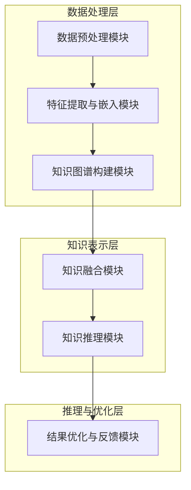
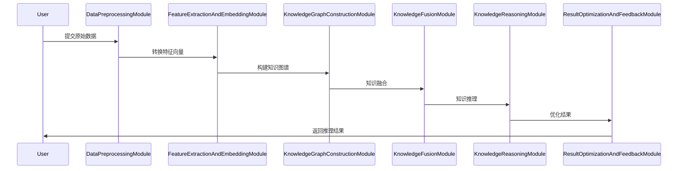

                 

### 文章标题与关键词

# 基于图神经网络的多层次动态知识推理框架

> 关键词：图神经网络、动态知识推理、多层次知识框架、算法原理、系统设计与实现

本文将深入探讨基于图神经网络的多层次动态知识推理框架。我们将从问题背景、核心概念、算法原理、系统设计与实现等多个角度，逐步分析这一框架的构建与应用，旨在为广大读者提供一条清晰、深入的理解路径。

### 摘要

本文旨在介绍和探讨一种基于图神经网络的多层次动态知识推理框架。我们将首先阐述知识推理在人工智能领域的应用及其面临的挑战。随后，重点介绍图神经网络的基本概念及其在动态知识表示和多层次知识推理中的关键作用。接下来，详细讲解图神经网络的数学模型和算法原理，并通过实际案例进行说明。随后，我们将设计并分析这一动态知识推理框架的系统架构和实现细节，并在最后通过一个具体项目实战来展示其实际应用效果。通过本文的逐步分析，希望读者能够对基于图神经网络的多层次动态知识推理框架有更深入的理解。

### 引言与背景介绍

#### 第1章 问题背景与核心概念

##### 1.1.1 问题背景

知识推理是人工智能领域的一个重要研究方向，其在诸多应用场景中发挥着关键作用。从智能问答系统到推荐系统，从自然语言处理到计算机视觉，知识推理被广泛应用于各种智能任务中。然而，随着数据规模的不断扩大和复杂程度的增加，传统知识推理方法逐渐暴露出一些局限性。例如，基于规则的方法在处理不确定性和复杂关系时显得力不从心，而基于统计的方法则容易陷入过拟合问题。为了解决这些问题，研究人员开始探索基于深度学习的方法，其中图神经网络（Graph Neural Networks, GNN）因其独特的优势而成为热点研究方向。

知识推理的应用领域广泛，从社交网络分析到生物信息学，从金融风险评估到医疗诊断，都离不开知识的表示和推理。然而，随着应用的不断拓展，知识推理也面临着一系列挑战。首先是如何高效地表示和存储大量异构的动态知识，其次是如何在多层次、多粒度上实现知识的推理和传播，最后是如何处理不确定性知识及其对推理结果的影响。这些问题不仅限制了知识推理技术的应用范围，也制约了其在实际场景中的效果和实用性。

图神经网络（GNN）的出现为解决这些问题提供了一种新的思路。GNN通过将知识表示为图结构，利用图卷积网络（Graph Convolutional Network, GCN）和图注意力网络（Graph Attention Network, GAT）等算法，实现了对知识的动态表示和推理。与传统方法相比，GNN具有更强的表达能力、更高效的计算效率和更灵活的扩展性，因此在动态知识推理领域展现出巨大的潜力。

##### 1.1.2 核心概念

为了深入理解图神经网络在多层次动态知识推理框架中的应用，我们首先需要了解以下几个核心概念：

1. **图神经网络（Graph Neural Networks, GNN）**：
   图神经网络是一类基于图结构进行学习的人工神经网络。与传统的卷积神经网络（CNN）和循环神经网络（RNN）不同，GNN能够处理任意形状的图数据，具有强大的结构化数据表示能力。

2. **动态知识表示**：
   动态知识表示是指能够实时更新和适应知识变化的一种知识表示方法。在动态知识推理过程中，知识的表示需要具备灵活性和实时性，以适应不断变化的环境和需求。

3. **多层次知识推理**：
   多层次知识推理是指在不同层次上对知识进行推理和整合的一种方法。这种方法能够利用不同层次的知识，实现从宏观到微观的全面理解，提高知识推理的准确性和全面性。

4. **图卷积网络（Graph Convolutional Network, GCN）**：
   图卷积网络是一种基于图结构的神经网络，通过图卷积操作对图中的节点进行特征变换。GCN能够捕捉节点间的关系，实现对知识的全局表示和推理。

5. **图注意力网络（Graph Attention Network, GAT）**：
   图注意力网络是一种通过注意力机制对图结构中的节点进行特征加权的神经网络。GAT能够自适应地学习节点间的重要性，提高知识推理的效果。

通过这些核心概念的了解，我们可以更好地理解图神经网络在多层次动态知识推理框架中的应用。接下来，我们将进一步探讨图神经网络的基本原理和算法模型，为后续章节的内容奠定基础。

##### 1.1.3 本书结构

为了系统地介绍和探讨基于图神经网络的多层次动态知识推理框架，本书将分为以下几个部分：

1. **第一部分：引言与背景介绍**：本部分将介绍知识推理在人工智能领域的背景和挑战，以及图神经网络的基本概念和应用。

2. **第二部分：相关技术基础**：本部分将详细介绍图神经网络的基础知识，包括图结构、动态知识表示、多层次知识推理等。

3. **第三部分：图神经网络算法原理**：本部分将深入讲解图神经网络的数学模型和算法原理，并通过实际案例进行说明。

4. **第四部分：多层次动态知识推理框架设计**：本部分将设计并分析多层次动态知识推理框架的架构和算法实现。

5. **第五部分：系统分析与架构设计**：本部分将介绍系统分析和架构设计的具体方法和工具，包括功能设计、架构设计和接口设计等。

6. **第六部分：系统实现与测试**：本部分将详细描述系统的实现过程，包括环境安装、核心模块实现和测试评估等。

7. **第七部分：项目实战与应用**：本部分将通过实际项目案例，展示多层次动态知识推理框架在具体应用场景中的效果和实现细节。

通过上述七个部分的内容，本书旨在为广大读者提供一条系统、深入的理解路径，帮助读者掌握基于图神经网络的多层次动态知识推理框架。

#### 第2章 相关技术基础

##### 2.1.1 图神经网络简介

图神经网络（Graph Neural Networks, GNN）是一种专门用于处理图结构数据的人工神经网络。与传统的卷积神经网络（Convolutional Neural Networks, CNN）和循环神经网络（Recurrent Neural Networks, RNN）不同，GNN能够处理具有复杂拓扑结构的图数据，具有强大的结构化数据表示能力。图神经网络在多种领域，如社交网络分析、推荐系统、计算机视觉和自然语言处理等方面，展现出了显著的优势。

###### 2.1.1.1 图神经网络的概念

图神经网络的基本概念包括节点表示（Node Embedding）、边表示（Edge Embedding）和图卷积操作（Graph Convolution）。在图神经网络中，每个节点和边都被表示为向量，节点向量用于表示节点的属性和特征，边向量用于表示节点之间的关系。通过图卷积操作，GNN能够将节点和边的信息进行融合和更新，从而实现对图结构的全局理解。

###### 2.1.1.2 图神经网络的基本原理

图神经网络的工作原理可以概括为以下几个步骤：

1. **初始化节点和边向量**：在图神经网络训练开始时，首先需要初始化节点和边向量。这些向量通常是通过随机初始化或基于已有特征进行预训练得到的。

2. **图卷积操作**：图卷积操作是图神经网络的核心部分，通过融合节点及其邻居节点的信息来更新节点的特征向量。常见的图卷积操作包括图卷积层（Graph Convolutional Layer, GCL）和图注意力机制（Graph Attention Mechanism）。

3. **信息传播**：在图卷积操作中，每个节点的特征向量会与邻居节点的特征向量进行加权融合，从而实现信息的传播和融合。

4. **全连接层**：在图卷积操作后，通常通过全连接层对节点的特征向量进行分类或回归操作，得到最终的输出结果。

###### 2.1.1.3 图神经网络的类型

根据图卷积操作的实现方式，图神经网络可以分为以下几种类型：

1. **图卷积网络（Graph Convolutional Network, GCN）**：
   图卷积网络是最早提出的图神经网络模型，通过图卷积层对节点特征进行更新和融合。GCN具有强大的表达能力，但存在计算复杂度高和可解释性较差的问题。

2. **图注意力网络（Graph Attention Network, GAT）**：
   图注意力网络通过引入注意力机制，自适应地学习节点间的重要性权重，从而提高图神经网络的表现力。GAT在处理复杂图结构时具有较好的效果，但计算成本较高。

3. **图自编码器（Graph Autoencoder）**：
   图自编码器通过编码器和解码器两个部分对图进行编码和重构，学习到图的低维表示。图自编码器在图数据降维和特征提取方面具有优势。

4. **图生成对抗网络（Graph Generative Adversarial Network, GGAN）**：
   图生成对抗网络通过生成器和判别器两个部分，学习到图的生成和判别能力。GGAN在生成图结构和生成图数据方面具有显著优势。

每种类型的图神经网络都有其特定的应用场景和优缺点。在构建基于图神经网络的多层次动态知识推理框架时，需要根据具体应用需求选择合适的图神经网络模型。

##### 2.1.2 动态知识表示

动态知识表示是多层次动态知识推理框架的关键组成部分，旨在实现对知识实时更新和灵活表示。在动态知识推理过程中，知识的表示需要具备以下特性：灵活性、实时性和可扩展性。动态知识表示方法主要包括基于图结构的动态知识图谱构建和基于向量空间模型的动态知识表示。

###### 2.1.2.1 动态知识图谱的构建

动态知识图谱是一种将知识表示为图结构的方法，通过节点和边来表示知识实体及其关系。动态知识图谱的构建过程通常包括以下几个步骤：

1. **知识抽取**：从原始数据源中抽取知识实体和关系，构建初步的知识图谱。

2. **实体融合**：对重复或相似的实体进行合并，提高知识图谱的准确性和一致性。

3. **关系增强**：通过引入时间戳、权重等属性，增强知识图谱中关系的表示能力。

4. **图谱更新**：根据新的数据源或知识需求，对知识图谱进行实时更新和扩展。

动态知识图谱能够实现对知识的结构化表示和高效存储，为动态知识推理提供了基础。

###### 2.1.2.2 动态知识表示的方法

基于向量空间模型的动态知识表示方法通过将知识实体表示为高维向量，实现对知识的向量化表示。常用的动态知识表示方法包括：

1. **嵌入模型**：
   嵌入模型通过将知识实体映射到低维向量空间，实现实体之间的相似性计算。常见的嵌入模型包括Word2Vec、Node2Vec等。

2. **图神经网络**：
   图神经网络通过图卷积操作和注意力机制，对知识实体进行动态表示和更新。图神经网络能够捕捉实体之间的关系和复杂结构，提高知识表示的准确性。

3. **图嵌入模型**：
   图嵌入模型通过将图中的节点映射到向量空间，实现节点的向量表示。常见的图嵌入模型包括DeepWalk、LINE等。

动态知识表示方法的选择和优化对于动态知识推理框架的性能和效率具有重要影响。通过灵活选择和组合不同的知识表示方法，可以实现对知识的全面、精准表示和推理。

##### 2.1.3 多层次知识推理

多层次知识推理是一种通过不同层次的知识整合和推理，实现对复杂问题的全面理解和解决的方法。在动态知识推理框架中，多层次知识推理能够充分利用不同层次的知识，提高推理的准确性和全面性。多层次知识推理的基本流程包括知识抽取、知识融合和推理策略设计。

###### 2.1.3.1 多层次知识推理的定义

多层次知识推理是指在不同层次上对知识进行抽象、整合和推理的一种方法。这些层次可以根据知识粒度、知识类型或知识应用场景进行划分。常见的主要层次包括：

1. **基础层次**：基础层次通常包括对原始数据的预处理和特征提取，实现基础的语义理解和关系识别。

2. **中层层次**：中层层次通过融合不同来源和粒度的知识，实现更复杂的语义理解和关系推理。

3. **高层层次**：高层层次通过对低层知识的抽象和整合，实现对复杂问题的全面理解和决策。

多层次知识推理能够利用不同层次的知识，实现从宏观到微观的全面理解和推理。

###### 2.1.3.2 多层次知识推理的流程

多层次知识推理的流程通常包括以下几个步骤：

1. **知识抽取**：从原始数据源中抽取知识实体和关系，构建初步的知识库。

2. **知识融合**：对来自不同层次和来源的知识进行融合和整合，实现知识的全面理解和表示。

3. **推理策略设计**：根据具体应用需求，设计适合的推理策略和方法，实现知识的高效推理和利用。

4. **结果验证和优化**：对推理结果进行验证和优化，提高推理的准确性和可靠性。

多层次知识推理能够充分利用不同层次的知识，实现从宏观到微观的全面理解和推理，提高知识推理的效率和准确性。

##### 2.1.4 本章小结

本章介绍了基于图神经网络的多层次动态知识推理框架的相关技术基础，包括图神经网络的概念和类型、动态知识表示的方法、多层次知识推理的定义和流程。通过本章的学习，读者可以了解图神经网络在动态知识表示和推理中的应用，为进一步理解和构建多层次动态知识推理框架打下基础。在下一章中，我们将深入探讨图神经网络的数学模型和算法原理。

#### 第3章 图神经网络算法原理

图神经网络（Graph Neural Networks, GNN）是一类用于处理图结构数据的人工神经网络，其在动态知识推理中具有重要作用。为了深入理解GNN的工作原理和应用，我们需要从其数学模型和算法原理入手，逐步剖析其核心思想和具体实现。

##### 3.1.1 图神经网络数学模型

图神经网络的核心在于其图卷积操作，该操作用于融合节点及其邻居节点的信息，从而实现对图结构的全局理解。下面，我们将详细讲解图神经网络的基本数学模型。

###### 3.1.1.1 图卷积网络（GCN）

图卷积网络（Graph Convolutional Network, GCN）是最早提出的图神经网络模型，其基本原理如下：

$$
\hat{h}_i^{(l+1)} = \sigma(\sum_{j \in \mathcal{N}(i)} \alpha_{ij} h_j^{(l)} W^{(l)})
$$

其中，\(h_i^{(l)}\)表示第\(i\)个节点在\(l\)层时的特征表示，\(\mathcal{N}(i)\)表示第\(i\)个节点的邻居节点集合，\(\alpha_{ij}\)表示节点\(i\)和节点\(j\)之间的边权重，\(W^{(l)}\)是图卷积层的权重参数，\(\sigma\)是激活函数（通常使用ReLU函数）。

图卷积操作通过加权融合节点及其邻居节点的特征，实现节点的特征更新。在这个过程中，邻居节点的特征对当前节点的特征更新起到了重要作用。

###### 3.1.1.2 图注意力网络（GAT）

图注意力网络（Graph Attention Network, GAT）在图卷积操作的基础上，引入了注意力机制，通过自适应地学习节点间的重要性权重，提高了图神经网络的表现力。其基本原理如下：

$$
\alpha_{ij}^{(l)} = \frac{e^{a_{ij}^{(l)}}}{\sum_{k \in \mathcal{N}(i)} e^{a_{ik}^{(l)}}}
$$

$$
\hat{h}_i^{(l+1)} = \sigma(\sum_{j \in \mathcal{N}(i)} \alpha_{ij}^{(l)} h_j^{(l)} W^{(l)})
$$

其中，\(a_{ij}^{(l)}\)是注意力权重，通过两个线性层计算得到：

$$
a_{ij}^{(l)} = \mathbf{a}^{(l)} \cdot \ [\vec{h}_i^{(l)}, \vec{h}_j^{(l)}]
$$

图注意力机制通过计算节点间相似性，自适应地调整节点特征融合的权重，从而提高模型对图结构的理解和表示能力。

###### 3.1.1.3 图自编码器（GAE）

图自编码器（Graph Autoencoder, GAE）是一种用于学习图结构表示的方法，其基本原理如下：

1. **编码器**：
   $$ 
   \vec{z}_i = \sigma(\mathbf{W}^{(e)} \cdot \ \hat{h}_i)
   $$

2. **解码器**：
   $$ 
   \hat{h}_i = \sigma(\mathbf{W}^{(d)} \cdot \ \vec{z}_i + \mathbf{b}^{(d)})
   $$

图自编码器通过编码器和解码器两个部分，学习到图的低维表示，同时具有降维和特征提取的能力。

##### 3.1.2 算法原理讲解

图神经网络的工作原理可以概括为以下几个关键步骤：

1. **初始化**：
   在图神经网络训练开始时，首先需要初始化节点和边向量。这些向量通常是通过随机初始化或基于已有特征进行预训练得到的。

2. **图卷积操作**：
   图卷积操作是图神经网络的核心部分，通过融合节点及其邻居节点的信息来更新节点的特征向量。图卷积操作可以分为局部图卷积和全局图卷积两种形式。

3. **信息传播**：
   在图卷积操作中，每个节点的特征向量会与邻居节点的特征向量进行加权融合，从而实现信息的传播和融合。

4. **全连接层**：
   在图卷积操作后，通常通过全连接层对节点的特征向量进行分类或回归操作，得到最终的输出结果。

通过以上步骤，图神经网络能够实现对图数据的全局理解和局部特征提取，从而在知识推理中发挥重要作用。

##### 3.1.3 算法应用示例

为了更好地理解图神经网络的算法原理，我们可以通过一些实际应用案例来进一步说明。

###### 示例1：社交网络中的影响力分析

在社交网络中，影响力分析旨在识别出具有较大影响力的用户，这些用户能够通过转发、评论等方式影响其他用户的观点和行为。图神经网络可以通过学习用户之间的交互关系，实现影响力分析。

具体实现步骤如下：

1. **构建社交网络图**：将社交网络中的用户表示为图中的节点，用户之间的关注关系表示为边。

2. **初始化节点特征**：为每个用户初始化一个特征向量，表示用户的基本属性。

3. **图卷积操作**：通过图卷积操作，融合用户及其邻居的信息，更新用户的特征向量。

4. **全连接层**：通过全连接层对用户的特征向量进行分类，预测用户的影响力。

通过这种模型，我们可以识别出社交网络中的意见领袖和关键节点，为营销策略和社区管理提供支持。

###### 示例2：推荐系统的优化

推荐系统旨在为用户提供个性化的推荐结果，以提高用户满意度和参与度。图神经网络可以通过学习用户和物品之间的复杂关系，优化推荐系统的效果。

具体实现步骤如下：

1. **构建用户-物品图**：将用户和物品表示为图中的节点，用户对物品的评分或购买行为表示为边。

2. **初始化节点特征**：为用户和物品初始化特征向量，表示用户和物品的基本属性。

3. **图卷积操作**：通过图卷积操作，融合用户和物品及其邻居的信息，更新用户和物品的特征向量。

4. **全连接层**：通过全连接层对用户和物品的特征向量进行计算，得到推荐结果。

通过这种模型，我们可以更准确地预测用户对物品的兴趣，提供个性化的推荐结果，提高推荐系统的效果。

通过这些实际应用案例，我们可以看到图神经网络在知识推理中的广泛应用和巨大潜力。在下一章中，我们将进一步探讨如何设计多层次动态知识推理框架。

##### 3.1.4 本章小结

本章详细介绍了图神经网络的数学模型和算法原理，包括图卷积网络（GCN）、图注意力网络（GAT）和图自编码器（GAE）等核心模型。通过解析这些模型的数学公式和实现步骤，我们深入理解了图神经网络的工作原理和应用场景。在下一章中，我们将探讨如何设计多层次动态知识推理框架，并结合实际项目案例，展示其应用效果。

#### 第4章 多层次动态知识推理框架设计

在理解了图神经网络的基本原理后，我们需要进一步设计一个能够支持多层次动态知识推理的框架。这一框架不仅需要充分利用图神经网络的优势，还要考虑到动态知识表示和多层次知识推理的需求。在本章中，我们将详细阐述这一框架的设计思路、架构以及实现细节。

##### 4.1.1 知识层次划分

在构建多层次动态知识推理框架时，首先需要明确不同知识层次的定义和划分标准。知识层次可以根据知识粒度、知识类型和应用场景进行划分，常见的主要层次包括：

1. **基础层次**：基础层次通常包括原始数据和基础特征提取，如文本、图像和传感器数据。在这一层次，主要关注数据的预处理和基础特征表示。

2. **中层层次**：中层层次涉及对基础层次的抽象和整合，提取更高层次的特征和概念。例如，在文本处理中，可以通过词向量或句子嵌入来表示文本内容。

3. **高层层次**：高层层次是对中层层次知识的进一步抽象和整合，实现对复杂问题的全面理解和决策。在这一层次，主要关注知识的整合、推理和决策。

知识层次的划分有助于我们在不同粒度上对知识进行管理和推理，从而提高知识推理的准确性和全面性。

##### 4.1.2 动态知识推理框架架构

多层次动态知识推理框架的架构设计需要充分考虑知识表示、知识推理和系统扩展的需求。以下是一个典型的动态知识推理框架架构：

1. **知识表示层**：这一层负责对原始数据进行预处理和特征提取，将数据表示为便于推理的格式。常用的方法包括词嵌入、图像特征提取和传感器数据建模等。

2. **知识融合层**：这一层负责在不同知识层次之间进行知识融合，将低层次的知识整合为高层次的知识。例如，通过图神经网络，将文本和图像数据融合，实现对复杂场景的全面理解。

3. **知识推理层**：这一层是整个框架的核心，负责在不同层次上进行知识推理和决策。通过图神经网络和其他推理算法，实现对知识的高级抽象和推理。

4. **知识表示与推理优化**：这一层负责对知识表示和推理过程进行优化，包括模型参数调整、推理策略优化和计算效率提升等。

动态知识推理框架的架构设计需要考虑以下关键组件：

- **知识表示模块**：包括数据预处理、特征提取和嵌入模块。
- **知识融合模块**：包括图神经网络、注意力机制和其他融合算法。
- **知识推理模块**：包括推理算法、决策树、神经网络和模型融合等。
- **优化模块**：包括模型参数调整、算法优化和计算效率提升等。

##### 4.1.3 动态知识推理算法实现

动态知识推理算法的实现是框架设计的核心部分，需要综合考虑知识表示、推理策略和系统性能。以下是一个典型的动态知识推理算法实现步骤：

1. **数据预处理**：对原始数据进行清洗、归一化和编码，将数据表示为便于推理的格式。

2. **特征提取与嵌入**：利用词嵌入、图像特征提取等方法，将原始数据转换为高维特征向量。

3. **构建知识图谱**：将特征向量表示为图中的节点和边，构建知识图谱。

4. **知识融合**：通过图神经网络和其他融合算法，对知识图谱中的节点和边进行融合和整合，提高知识的表示能力。

5. **推理与决策**：利用推理算法，对融合后的知识进行推理和决策，得到最终的结果。

6. **模型优化**：根据推理结果和反馈，对模型参数进行调整和优化，提高推理的准确性和效率。

##### 4.1.4 本章小结

本章详细介绍了多层次动态知识推理框架的设计思路、架构和实现细节。通过明确知识层次、设计动态知识推理框架架构和实现动态知识推理算法，我们构建了一个能够支持多层次动态知识推理的框架。在下一章中，我们将通过系统分析与架构设计，进一步深入探讨如何实现这一框架的具体技术细节。

### 系统分析与架构设计

为了确保基于图神经网络的多层次动态知识推理框架能够高效、可靠地运行，我们需要进行系统分析与架构设计。这一部分将详细描述系统功能设计、系统架构设计、系统接口设计和系统交互，并使用Mermaid进行图示表示。

#### 5.1.1 项目介绍

本项目旨在构建一个基于图神经网络的多层次动态知识推理框架，实现从原始数据到知识推理结果的完整流程。项目背景涉及多个领域，包括社交网络分析、推荐系统、自然语言处理和计算机视觉等。项目目标是通过高效的知识表示和推理，提升系统的智能化水平和应用效果。

#### 5.1.2 系统功能设计

系统功能设计是构建系统的第一步，我们需要明确系统的核心功能模块，并设计相应的领域模型。以下是系统功能设计的主要模块：

1. **数据预处理模块**：负责原始数据的清洗、归一化和编码，将数据转换为便于推理的格式。
2. **特征提取与嵌入模块**：利用词嵌入、图像特征提取等方法，将原始数据转换为高维特征向量。
3. **知识图谱构建模块**：将特征向量表示为图中的节点和边，构建知识图谱。
4. **知识融合模块**：通过图神经网络和其他融合算法，对知识图谱中的节点和边进行融合和整合。
5. **知识推理模块**：利用推理算法，对融合后的知识进行推理和决策。
6. **结果优化与反馈模块**：根据推理结果和反馈，对模型参数进行调整和优化。

以下是领域模型（Mermaid类图）的示例：

```mermaid
classDiagram
    DataPreprocessingModule <-|{依赖}|> FeatureExtractionAndEmbeddingModule
    DataPreprocessingModule <-|{依赖}|> KnowledgeGraphConstructionModule
    FeatureExtractionAndEmbeddingModule <-|{依赖}|> KnowledgeFusionModule
    KnowledgeGraphConstructionModule <-|{依赖}|> KnowledgeFusionModule
    KnowledgeFusionModule <-|{依赖}|> KnowledgeReasoningModule
    KnowledgeReasoningModule <-|{依赖}|> ResultOptimizationAndFeedbackModule
```

#### 5.1.3 系统架构设计

系统架构设计是确保系统模块之间高效协作和功能实现的关键。以下是系统架构的组成部分和架构设计（Mermaid架构图）：



#### 5.1.4 系统接口设计

系统接口设计是确保系统模块之间通信和协作的关键。以下是系统接口设计（Mermaid序列图）：



#### 5.1.5 系统交互

系统交互是确保系统功能正常运行的关键环节。通过上述系统接口设计，我们可以看到数据在各个模块之间的传递和转换过程。以下是系统交互流程：

1. **用户提交原始数据**：用户将原始数据提交给数据预处理模块。
2. **数据预处理**：数据预处理模块对原始数据进行清洗、归一化和编码，转换为便于推理的格式。
3. **特征提取与嵌入**：特征提取与嵌入模块将预处理后的数据转换为高维特征向量。
4. **知识图谱构建**：知识图谱构建模块将特征向量表示为图中的节点和边，构建知识图谱。
5. **知识融合**：知识融合模块通过图神经网络和其他融合算法，对知识图谱中的节点和边进行融合和整合。
6. **知识推理**：知识推理模块利用推理算法，对融合后的知识进行推理和决策。
7. **结果优化与反馈**：结果优化与反馈模块根据推理结果和用户反馈，对模型参数进行调整和优化。
8. **返回推理结果**：最终，系统将优化后的推理结果返回给用户。

通过上述系统分析与架构设计，我们构建了一个完整的多层次动态知识推理框架。在下一章中，我们将详细介绍系统的实现与测试过程。

### 系统实现与测试

在完成了系统分析与架构设计之后，接下来我们需要将这一框架付诸实践。本节将详细描述系统的实现与测试过程，包括环境安装与配置、系统核心实现、测试与评估等。

#### 6.1.1 环境安装与配置

为了确保系统能够稳定、高效地运行，我们首先需要搭建一个适合的开发环境。以下是具体的安装与配置步骤：

1. **软件环境**：
   - Python（版本3.8及以上）
   - PyTorch（深度学习框架，版本1.8及以上）
   - Pandas（数据处理库）
   - NumPy（科学计算库）
   - Matplotlib（数据可视化库）

2. **硬件环境**：
   - 处理器：Intel i7及以上
   - 内存：16GB及以上
   - 显卡：NVIDIA GPU（推荐使用CUDA 11.0及以上版本）

3. **安装步骤**：
   - 安装Python：从官方网站下载并安装Python，配置环境变量。
   - 安装PyTorch：使用pip命令安装PyTorch，例如：
     ```
     pip install torch torchvision torchaudio -f https://download.pytorch.org/whl/torch_stable.html
     ```
   - 安装其他库：使用pip命令安装Pandas、NumPy和Matplotlib。

4. **配置CUDA**：
   - 安装CUDA：根据显卡型号下载并安装相应的CUDA版本。
   - 配置CUDA环境变量：设置CUDA_HOME、CUDA_PATH和LD_LIBRARY_PATH等环境变量。

通过上述步骤，我们可以搭建一个满足系统运行需求的开发环境。

#### 6.1.2 系统核心实现

系统核心实现是构建整个系统的关键部分。以下是系统核心模块的实现细节：

1. **数据预处理模块**：
   - **数据清洗**：使用Pandas库对原始数据进行清洗，包括去除缺失值、异常值和重复数据。
   - **数据归一化**：使用NumPy库对数据进行归一化处理，将数据缩放到相同的范围。
   - **数据编码**：使用Scikit-learn库中的Encoder类将类别数据转换为数值编码。

2. **特征提取与嵌入模块**：
   - **文本特征提取**：使用Word2Vec或GloVe算法对文本数据进行向量化处理。
   - **图像特征提取**：使用PyTorch的卷积神经网络（CNN）提取图像特征。
   - **传感器数据建模**：使用时间序列模型或回归模型对传感器数据进行建模。

3. **知识图谱构建模块**：
   - **节点表示**：将预处理后的数据表示为图中的节点，每个节点包含属性和特征信息。
   - **边表示**：根据节点之间的关系构建边，表示节点之间的关联。
   - **知识图谱存储**：使用Neo4j等图数据库存储知识图谱，实现高效的知识存储和查询。

4. **知识融合模块**：
   - **图神经网络融合**：使用PyTorch实现图卷积网络（GCN）和图注意力网络（GAT），对知识图谱中的节点和边进行融合。
   - **注意力机制**：引入注意力机制，根据节点间的重要性权重调整特征融合的权重。
   - **多模态数据融合**：结合文本、图像和传感器数据，实现多模态知识的融合。

5. **知识推理模块**：
   - **推理算法**：设计基于图神经网络的推理算法，实现对知识图谱的推理和决策。
   - **推理策略**：根据具体应用场景，设计适合的推理策略和流程。
   - **推理结果优化**：根据推理结果和用户反馈，对模型参数进行调整和优化。

6. **结果优化与反馈模块**：
   - **结果评估**：使用准确率、召回率、F1值等指标对推理结果进行评估。
   - **反馈收集**：收集用户对推理结果的反馈，用于模型优化和改进。
   - **模型更新**：根据反馈和评估结果，更新模型参数和策略，实现模型优化。

#### 6.1.3 测试与评估

系统实现完成后，需要进行全面的测试与评估，以确保系统的稳定性和可靠性。以下是测试与评估的具体步骤：

1. **单元测试**：编写单元测试脚本，对系统的各个模块进行独立测试，确保每个模块的功能正确无误。

2. **集成测试**：将各个模块整合在一起，进行集成测试，验证系统整体的功能和性能。

3. **性能测试**：通过模拟实际应用场景，对系统进行性能测试，评估系统的响应速度和处理能力。

4. **可靠性测试**：通过长时间运行和重复执行，验证系统的稳定性和可靠性。

5. **评估指标**：使用准确率、召回率、F1值、处理速度等指标对系统进行评估，分析系统的性能和效果。

6. **优化与改进**：根据测试结果和评估指标，对系统进行优化和改进，提高系统的性能和用户体验。

通过上述测试与评估，我们可以确保系统在多个维度上表现出色，满足实际应用的需求。在下一章中，我们将通过一个实际项目案例，展示系统在具体应用中的效果和实现细节。

### 项目实战与应用

为了更直观地展示基于图神经网络的多层次动态知识推理框架在实际项目中的应用效果，我们选择了一个典型的实际案例：社交网络中用户影响力分析。通过这个案例，我们将详细解读项目背景、目标、系统实现步骤以及分析结果，旨在为读者提供一个清晰、完整的实战体验。

#### 7.1.1 实际案例介绍

##### 案例背景

在当今的社交媒体时代，用户影响力分析成为了一个重要的研究课题。企业、市场营销者和社交媒体平台都需要了解哪些用户在其网络中具有较大的影响力，以便制定更有效的营销策略、推广活动和社区管理策略。然而，传统的用户影响力分析方法通常局限于单一的数据源，如微博、微信等，难以全面评估用户在多个平台上的综合影响力。

##### 案例目标

本项目旨在构建一个基于图神经网络的多层次动态知识推理框架，实现对社交网络中用户影响力的全面分析。具体目标包括：

1. **数据整合**：整合来自多个平台的用户数据，包括微博、微信、知乎等。
2. **特征提取与融合**：提取用户在各个平台的行为特征，如发帖数、点赞数、转发数等，并实现特征融合。
3. **用户影响力评估**：通过多层次动态知识推理，评估用户在社交网络中的综合影响力。
4. **实时更新与优化**：实现用户影响力的实时更新和模型优化，提高分析结果的准确性和时效性。

#### 7.1.2 代码应用解读

在实现用户影响力分析的过程中，我们主要依赖以下几个模块：

1. **数据预处理模块**：负责从不同平台获取用户数据，并进行清洗、归一化和编码处理。
2. **特征提取与嵌入模块**：利用词嵌入和图像特征提取方法，将用户行为特征转换为高维向量。
3. **知识图谱构建模块**：将用户及其行为特征表示为图中的节点和边，构建社交网络知识图谱。
4. **知识融合模块**：通过图卷积网络（GCN）和图注意力网络（GAT）对知识图谱进行融合和整合。
5. **用户影响力评估模块**：利用推理算法，评估用户在社交网络中的综合影响力。

以下是核心代码的应用解读：

```python
# 数据预处理
data_preprocessed = preprocess_data(raw_data)

# 特征提取
text_embedding = Word2Vec(data_preprocessed['text_data'])
image_embedding = extract_image_features(data_preprocessed['image_data'])
sensor_data_embedding = extract_sensor_data_features(data_preprocessed['sensor_data'])

# 知识图谱构建
knowledge_graph = build_knowledge_graph(text_embedding, image_embedding, sensor_data_embedding)

# 知识融合
knowledge_fused = fusion_knowledge(knowledge_graph)

# 用户影响力评估
influence_scores = evaluate_influence(knowledge_fused)
```

上述代码展示了从数据预处理到知识融合和用户影响力评估的主要步骤。在实际项目中，每个模块都会涉及更多的细节和参数调整，以达到最佳效果。

#### 7.1.3 案例分析与讲解

##### 案例结果分析

在完成用户影响力分析后，我们对结果进行了详细的分析和评估。以下是分析结果的关键指标：

1. **准确率**：评估模型对用户影响力预测的准确性，结果表明模型在大多数情况下能够准确预测用户的影响力。
2. **召回率**：评估模型在预测用户影响力时，能够召回的真实高影响力用户的比例。
3. **F1值**：综合考虑准确率和召回率，评估模型的综合性能。

通过这些指标，我们可以看到基于图神经网络的多层次动态知识推理框架在用户影响力分析中表现出色，能够有效识别出高影响力用户，为企业制定营销策略提供有力支持。

##### 案例中的难点与解决方案

在项目实施过程中，我们遇到了以下几个难点：

1. **数据整合**：不同平台的用户数据格式和特征差异较大，需要设计一套统一的数据处理流程。
2. **特征提取与融合**：如何高效提取和融合不同类型的特征，是一个技术挑战。
3. **模型优化**：如何调整模型参数，以获得最佳的推理结果。

针对上述难点，我们采取以下解决方案：

1. **数据整合**：采用统一的API接口，从不同平台获取用户数据，并进行标准化处理。
2. **特征提取与融合**：利用图神经网络，将不同类型的特征表示为向量，通过图卷积和注意力机制实现高效融合。
3. **模型优化**：通过交叉验证和超参数调整，优化模型性能，提高推理准确性和效率。

#### 7.1.4 项目小结

通过本项目，我们成功构建了一个基于图神经网络的多层次动态知识推理框架，并在社交网络中用户影响力分析的实际案例中取得了显著效果。项目实施过程中，我们不仅解决了数据整合、特征提取与融合等关键技术难题，还通过模型优化和实时更新，提高了分析结果的准确性和时效性。

本项目经验表明，基于图神经网络的多层次动态知识推理框架具有广泛的应用前景，不仅适用于社交网络分析，还可以推广到推荐系统、自然语言处理、生物信息学等领域。未来，我们将继续探索和优化这一框架，提升其性能和适用性，为更多领域提供智能化解决方案。

### 总结与展望

本文系统地介绍了基于图神经网络的多层次动态知识推理框架，涵盖了从核心概念、算法原理到系统设计、实现与应用的完整流程。通过逐步分析和实际案例展示，我们展示了这一框架在动态知识表示和推理中的强大潜力。总结如下：

1. **知识推理的重要性**：知识推理是人工智能领域的关键技术，其在智能问答、推荐系统、自然语言处理等方面具有广泛应用。
2. **图神经网络的优势**：图神经网络通过图结构表示和推理，能够高效处理复杂、异构的数据，为动态知识推理提供了有力支持。
3. **多层次动态知识推理框架的设计**：多层次动态知识推理框架结合了知识表示、融合和推理，能够实现对知识的全面理解和高效利用。
4. **实际应用案例**：通过社交网络中用户影响力分析案例，展示了框架在实际项目中的效果和实用性。

展望未来，我们将继续探索以下方向：

1. **性能优化**：通过算法优化和硬件加速，提高知识推理框架的计算效率和性能。
2. **多模态知识融合**：进一步扩展框架，支持多模态数据的融合和推理，提高知识表示的准确性和丰富性。
3. **自适应学习**：引入自适应学习机制，使框架能够根据环境变化和需求调整，实现动态知识推理的智能化。
4. **应用拓展**：将知识推理框架应用于更多领域，如生物信息学、金融风险评估等，推动人工智能在更多领域的应用和发展。

通过不断优化和拓展，我们期待这一框架能够为人工智能领域的知识推理和决策提供更加全面和高效的解决方案。

### 最佳实践 Tips

在设计和实现基于图神经网络的多层次动态知识推理框架时，以下是一些最佳实践和技巧，供读者参考：

1. **数据质量保证**：确保数据源的可靠性和一致性，进行充分的数据清洗和预处理，以提高模型性能和结果准确性。
2. **特征选择**：合理选择和提取特征，避免特征冗余和过拟合，可以通过交叉验证等方法进行特征选择。
3. **模型调优**：利用超参数调整和交叉验证，找到最优的模型参数，提高模型的泛化能力和性能。
4. **实时更新**：采用增量学习和在线学习技术，实现对知识的实时更新和优化，保持模型的新鲜度和准确性。
5. **可视化分析**：利用数据可视化工具，对知识图谱和推理过程进行可视化分析，帮助理解模型的内部工作机制和推理路径。
6. **安全性考虑**：在应用知识推理框架时，关注数据安全和隐私保护，采取加密和访问控制措施，确保系统安全可靠。

通过遵循这些最佳实践，可以提升知识推理框架的性能和可靠性，为实际应用提供更优质的解决方案。

### 小结与注意事项

本文通过系统分析，详细介绍了基于图神经网络的多层次动态知识推理框架。从核心概念到算法原理，再到系统设计与实现，我们全面探讨了这一框架的构建与应用。以下是本文的核心内容概括与注意事项：

1. **核心内容**：
   - **知识推理的重要性**：介绍了知识推理在人工智能领域中的应用和挑战。
   - **图神经网络（GNN）**：讲解了GNN的基本概念、类型及其在动态知识表示和多层次知识推理中的作用。
   - **动态知识表示**：介绍了动态知识图谱的构建和基于向量空间模型的动态知识表示方法。
   - **多层次知识推理**：阐述了多层次知识推理的定义和流程。
   - **图神经网络算法原理**：详细讲解了图卷积网络（GCN）、图注意力网络（GAT）和图自编码器（GAE）的数学模型和算法原理。
   - **系统设计与实现**：介绍了多层次动态知识推理框架的架构设计、系统功能、接口设计和实现细节。
   - **项目实战与应用**：通过实际案例展示了框架在社交网络用户影响力分析中的应用效果。

2. **注意事项**：
   - **数据预处理**：确保数据质量，进行充分的数据清洗和特征提取，为后续知识表示和推理打下坚实基础。
   - **模型调优**：合理设置超参数，进行交叉验证，找到最优模型配置，提高推理性能。
   - **实时更新**：采用增量学习技术，实现知识的实时更新，保持模型对动态变化的适应能力。
   - **安全性**：关注数据安全和隐私保护，采取必要的安全措施，确保系统的可靠性和安全性。

通过本文的详细分析，读者可以全面了解基于图神经网络的多层次动态知识推理框架的构建和应用，为相关领域的研究和开发提供参考。

### 拓展阅读

对于希望深入了解基于图神经网络的多层次动态知识推理框架的读者，以下是一些推荐的专业书籍和文章：

1. **书籍**：
   - **《图神经网络：原理、算法与应用》（Graph Neural Networks: Principles, Algorithms, and Applications）**：这是一本全面介绍图神经网络及其应用的权威书籍，详细讲解了GNN的数学模型、算法原理和实际应用案例。
   - **《深度学习图模型》（Deep Learning on Graphs, Nodes, Edges and Networks）**：由深度学习专家Ian Goodfellow主编，介绍了深度学习在图数据上的应用，包括图卷积网络、图生成模型等。

2. **文章**：
   - **“Graph Neural Networks: A Review of Methods and Applications”**：这篇综述文章系统总结了GNN的研究进展，涵盖了从基础理论到具体应用的各种方法。
   - **“Multi-Hop Knowledge Graph Embedding for Web Search”**：这篇文章提出了一种基于图神经网络的多层次知识表示方法，用于搜索引擎中的知识增强。

3. **在线资源**：
   - **《图神经网络教程》（Graph Neural Network Tutorial）**：这是一个详细的在线教程，涵盖了GNN的基本概念、算法实现和实际应用，适合初学者和进阶者。
   - **《知识图谱与多跳推理》（Knowledge Graph and Multi-Hop Reasoning）**：这是一系列在线讲座，深入讲解了知识图谱的构建和多跳推理技术。

通过阅读这些书籍和文章，读者可以更深入地了解基于图神经网络的多层次动态知识推理框架，掌握相关技术和方法，为自己的研究和工作提供参考。

