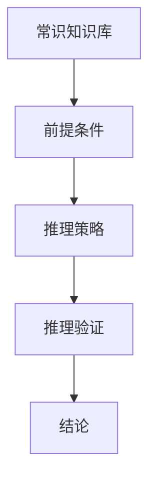
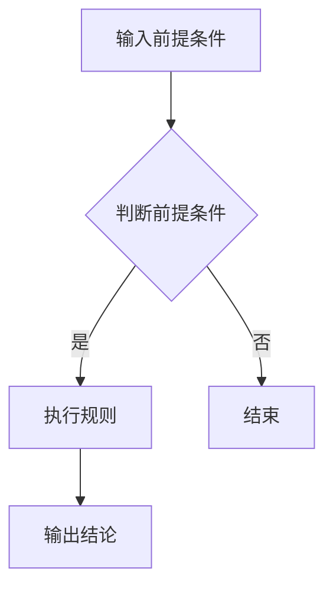
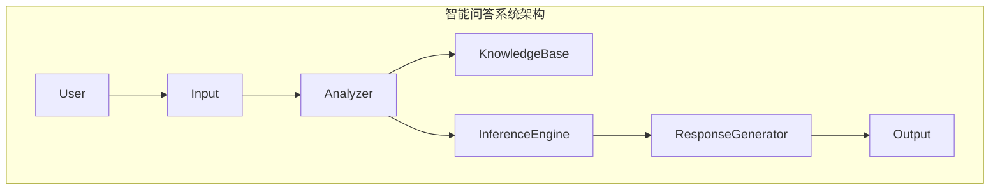
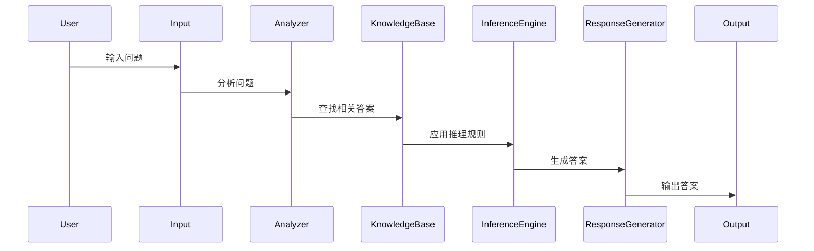

                 


# 基于常识推理任务：当前推理方法的有效性分析

## 关键词：常识推理、推理方法、有效性、算法、数学模型、系统架构

> 摘要：本文深入探讨了常识推理任务在现实世界中的应用及其重要性，重点分析了当前几种常见的推理方法的有效性。通过对比不同方法的核心概念、属性特征，并结合数学模型和Python代码示例，本文旨在为读者提供一个清晰、全面的了解，以便在实际项目中做出更明智的决策。

## 第一部分：背景与概述

### 1.1 问题背景

常识推理任务在人工智能领域具有重要地位，它是指基于常识知识库对信息进行推理和理解的过程。随着深度学习和大数据技术的发展，常识推理在智能问答、自动驾驶、智能家居等多个领域得到了广泛应用。然而，传统的推理方法在处理复杂场景时存在诸多不足，如推理效率低、可解释性差等。因此，分析当前推理方法的有效性显得尤为必要。

### 1.2 问题描述

本文将讨论以下几个问题：

1. 常识推理任务的核心概念是什么？
2. 不同推理方法的属性和特征有哪些？
3. 如何通过数学模型和算法流程图来解释这些方法？
4. 这些方法在实际应用中存在哪些挑战和限制？

### 1.3 问题解决

本文将结合实际案例，对以下几种推理方法进行详细分析：

1. 基于规则的推理方法
2. 基于模型的推理方法
3. 基于图谱的推理方法
4. 基于神经网络的推理方法

通过对这些方法的优缺点进行对比，本文将提出一个综合性的解决方案，以期为读者提供有价值的参考。

### 1.4 边界与外延

本文主要关注以下边界与外延：

1. 推理方法的范围：包括基于规则、模型、图谱和神经网络的方法。
2. 应用场景：主要关注智能问答、自动驾驶和智能家居等领域。
3. 数学模型：以常见的推理算法为基础，结合实际应用进行解释。

### 1.5 概念结构与核心要素组成

常识推理任务的核心要素包括：

1. 数据集：包括常识知识库、训练数据和测试数据等。
2. 推理算法：如基于规则的推理、基于模型的推理等。
3. 评价标准：包括推理效率、准确性、可解释性等。

## 第二部分：核心概念与联系

### 2.1 核心概念原理

常识推理的基本原理如下：

1. **定义**：常识推理是指基于常识知识库对信息进行推理和理解的过程。
2. **过程**：常识推理过程包括知识表示、推理策略和推理验证等环节。
3. **方法**：常见的常识推理方法包括基于规则的推理、基于模型的推理和基于图谱的推理等。

### 2.2 概念属性特征对比表格

| 推理方法 | 定义 | 特点 | 应用场景 |
| :---: | :---: | :---: | :---: |
| 基于规则的推理 | 基于前提条件和结论的规则进行推理 | 简单、直观、可解释性高 | 智能问答、自然语言处理 |
| 基于模型的推理 | 基于概率模型、贝叶斯网络等进行推理 | 复杂、灵活、适应性强 | 自动驾驶、智能推荐 |
| 基于图谱的推理 | 基于知识图谱进行推理 | 知识表示能力强、推理效率高 | 智能问答、知识图谱构建 |
| 基于神经网络的推理 | 基于神经网络进行推理 | 自适应性强、非线性处理能力强 | 图像识别、语音识别 |

### 2.3 ER实体关系图架构

下面是常识推理任务中ER实体关系图的Mermaid流程图：



### 第三部分：算法原理讲解

#### 3.1 算法mermaid流程图

使用Mermaid语言绘制基于规则的推理算法流程图：



#### 3.2 算法原理

基于规则的推理方法的基本原理如下：

1. **规则表示**：将常识知识表示为一系列的前提条件和结论的规则。
2. **推理过程**：根据输入的前提条件，按照规则进行推理，最终得出结论。
3. **规则执行**：通过匹配前提条件来执行相应的规则，并将结论作为输出。

#### 3.3 Python源代码

以下是一个简单的基于规则的推理算法的Python代码示例：

```python
class RuleBasedInference:
    def __init__(self, rules):
        self.rules = rules

    def infer(self, premises):
        conclusions = []
        for rule in self.rules:
            if all(premise in premises for premise in rule['premises']):
                conclusions.append(rule['conclusion'])
        return conclusions

# 示例规则
rules = [
    {'premises': ['雪是白的'], 'conclusion': '雪是白色的'},
    {'premises': ['猫会跑'], 'conclusion': '猫是活跃的'}
]

# 实例化推理对象
inference = RuleBasedInference(rules)

# 输入前提条件
premises = ['雪是白的', '猫会跑']

# 执行推理
conclusions = inference.infer(premises)

# 输出结论
print(conclusions)
```

#### 3.4 数学模型和公式

在基于规则的推理中，常见的数学模型是谓词逻辑。谓词逻辑中的推理公式如下：

$$
\forall x(P(x) \rightarrow Q(x))
$$

其中，$P(x)$表示前提条件，$Q(x)$表示结论。这个公式表示对于所有$x$，如果$P(x)$成立，那么$Q(x)$也成立。

#### 3.5 详细讲解与举例说明

**详细讲解**：

1. **谓词表示**：谓词逻辑使用谓词来表示事实，例如$P(x)$表示“$x$是白的”。
2. **推理规则**：基于规则的推理方法使用推理规则来推导结论，例如上面的公式表示如果所有$x$都满足“$x$是白的”，那么可以推导出“雪是白色的”。
3. **匹配过程**：在推理过程中，系统会根据输入的前提条件来匹配相应的规则，从而推导出结论。

**举例说明**：

假设有一个规则库，包含以下两个规则：

1. 如果所有猫都会飞，那么猫会飞。
2. 猫是动物。

现在有一个前提条件：“所有猫都会飞”。我们可以使用这个前提条件来推导出结论：“猫会飞”。

- 首先，根据第一个规则，如果所有猫都会飞，那么猫会飞。
- 然后，根据第二个前提条件，猫是动物。

结合这两个前提条件，我们可以得出结论：动物会飞。

## 第四部分：数学模型和数学公式 & 详细讲解 & 举例说明

### 4.1 数学公式

在常识推理中，常用的数学公式包括逻辑运算符、谓词逻辑和谓词演算等。

以下是几个常用的数学公式：

$$
P \land Q
$$

$$
P \lor Q
$$

$$
\neg P
$$

$$
\forall x(P(x) \rightarrow Q(x))
$$

$$
\exists x(P(x) \land Q(x))
$$

**详细讲解**：

1. **逻辑运算符**：逻辑运算符用于组合多个命题，包括与（$\land$）、或（$\lor$）和非（$\neg$）。
2. **谓词逻辑**：谓词逻辑用于表示事实和推理关系，包括全称量词（$\forall$）和存在量词（$\exists$）。
3. **谓词演算**：谓词演算是一种更高级的逻辑系统，用于处理更复杂的推理问题。

**举例说明**：

假设我们要证明以下推理：

如果所有猫都会飞，并且猫是动物，那么动物会飞。

我们可以使用谓词逻辑来表示这个推理：

1. 所有猫都会飞：$\forall x(Cat(x) \rightarrow Fly(x))$
2. 猫是动物：$Cat(x) \land Animal(x)$

要证明的结论是：动物会飞：$\forall x(Animal(x) \rightarrow Fly(x))$

**证明过程**：

1. 从第一个前提条件，我们可以得出对于所有的$x$，如果$x$是猫，那么$x$会飞。
2. 从第二个前提条件，我们可以得出$x$是猫和动物。
3. 将这两个前提条件结合起来，我们可以得出对于所有的$x$，如果$x$是动物，那么$x$会飞。

因此，我们证明了结论：动物会飞。

### 4.2 数学模型和公式

在常识推理中，常用的数学模型包括逻辑模型、概率模型和图模型等。

以下是几个常用的数学模型：

1. **逻辑模型**：逻辑模型使用逻辑运算符来表示事实和推理关系，例如谓词逻辑和谓词演算。
2. **概率模型**：概率模型使用概率来表示不确定性和推理可靠性，例如贝叶斯网络和马尔可夫模型。
3. **图模型**：图模型使用图结构来表示实体之间的关系，例如知识图谱和图神经网络。

**举例说明**：

假设我们要使用概率模型来推理以下事实：

如果猫会飞，那么猫是动物。

我们可以使用贝叶斯网络来表示这个推理：

1. 猫会飞：$P(Fly) = 0.5$
2. 猫是动物：$P(Animal) = 0.8$
3. 如果猫会飞，那么猫是动物：$P(Animal | Fly) = 0.9$

现在，我们要计算以下概率：

$P(Fly | Animal)$

根据贝叶斯定理，我们可以得到：

$$
P(Fly | Animal) = \frac{P(Animal | Fly) \cdot P(Fly)}{P(Animal)}
$$

代入已知的概率值，我们可以计算出：

$$
P(Fly | Animal) = \frac{0.9 \cdot 0.5}{0.8} = 0.6875
$$

因此，我们得出结论：如果猫是动物，那么猫会飞的概率为$0.6875$。

### 4.3 详细讲解

1. **逻辑模型**：逻辑模型是常识推理中最常用的模型之一，它使用逻辑运算符来表示事实和推理关系。逻辑模型包括命题逻辑、谓词逻辑和谓词演算等。
   
   - **命题逻辑**：命题逻辑使用命题（即真假值）来表示事实，例如$p$和$q$。命题逻辑包括与（$\land$）、或（$\lor$）和非（$\neg$）等运算符。
   
   - **谓词逻辑**：谓词逻辑是命题逻辑的扩展，它使用谓词来表示事实，例如$P(x)$表示$x$是白的。谓词逻辑包括全称量词（$\forall$）和存在量词（$\exists$）。
   
   - **谓词演算**：谓词演算是谓词逻辑的进一步扩展，它使用谓词演算规则来推理结论。谓词演算包括合并规则、分离规则和换位规则等。

2. **概率模型**：概率模型是常识推理中的另一种重要模型，它使用概率来表示不确定性和推理可靠性。概率模型包括贝叶斯网络、马尔可夫模型和图模型等。
   
   - **贝叶斯网络**：贝叶斯网络是一种基于概率的图模型，它使用节点表示变量，边表示变量之间的依赖关系。贝叶斯网络可以用于推理和预测。
   
   - **马尔可夫模型**：马尔可夫模型是一种基于概率的序列模型，它使用状态序列来表示时间序列数据。马尔可夫模型可以用于序列建模和预测。
   
   - **图模型**：图模型是一种基于概率的图结构模型，它使用图结构来表示实体之间的关系。图模型可以用于知识图谱构建和推理。

3. **图模型**：图模型是常识推理中的一种重要模型，它使用图结构来表示实体之间的关系。图模型包括知识图谱、图神经网络和图卷积网络等。
   
   - **知识图谱**：知识图谱是一种基于图的语义网络，它使用节点表示实体，边表示实体之间的关系。知识图谱可以用于知识表示和推理。
   
   - **图神经网络**：图神经网络是一种基于图的神经网络模型，它使用图结构来表示实体之间的关系。图神经网络可以用于图分类和图生成。
   
   - **图卷积网络**：图卷积网络是一种基于图的卷积神经网络模型，它使用图结构来表示实体之间的关系。图卷积网络可以用于图像分类和图像生成。

### 4.4 举例说明

**逻辑模型举例**：

假设我们要推理以下事实：

如果所有猫都会飞，并且猫是动物，那么动物会飞。

我们可以使用谓词逻辑来表示这个推理：

1. 所有猫都会飞：$\forall x(Cat(x) \rightarrow Fly(x))$
2. 猫是动物：$Cat(x) \land Animal(x)$

要证明的结论是：动物会飞：$\forall x(Animal(x) \rightarrow Fly(x))$

**证明过程**：

1. 从第一个前提条件，我们可以得出对于所有的$x$，如果$x$是猫，那么$x$会飞。
2. 从第二个前提条件，我们可以得出$x$是猫和动物。
3. 将这两个前提条件结合起来，我们可以得出对于所有的$x$，如果$x$是动物，那么$x$会飞。

因此，我们证明了结论：动物会飞。

**概率模型举例**：

假设我们要使用概率模型来推理以下事实：

如果猫会飞，那么猫是动物。

我们可以使用贝叶斯网络来表示这个推理：

1. 猫会飞：$P(Fly) = 0.5$
2. 猫是动物：$P(Animal) = 0.8$
3. 如果猫会飞，那么猫是动物：$P(Animal | Fly) = 0.9$

现在，我们要计算以下概率：

$P(Fly | Animal)$

根据贝叶斯定理，我们可以得到：

$$
P(Fly | Animal) = \frac{P(Animal | Fly) \cdot P(Fly)}{P(Animal)}
$$

代入已知的概率值，我们可以计算出：

$$
P(Fly | Animal) = \frac{0.9 \cdot 0.5}{0.8} = 0.6875
$$

因此，我们得出结论：如果猫是动物，那么猫会飞的概率为$0.6875$。

### 4.5 总结

在本部分中，我们详细讲解了常识推理中的数学模型和数学公式，包括逻辑模型、概率模型和图模型。我们通过具体的例子展示了如何使用这些模型进行推理和计算。这些数学模型和公式为常识推理提供了坚实的理论基础，使得我们可以更准确地分析和解决实际问题。

## 第五部分：系统分析与架构设计方案

### 5.1 问题场景介绍

在智能问答系统中，用户可以通过输入问题来获取答案。为了实现高效的答案生成，系统需要对大量的问题和答案进行推理和分析。常见的场景包括：

1. 用户输入问题：例如“什么是人工智能？”
2. 系统分析问题：理解问题的意图和关键词
3. 系统搜索答案：在知识库中查找相关答案
4. 系统生成答案：根据分析结果生成准确的答案

### 5.2 系统功能设计 (领域模型 mermaid 类图)

下面是智能问答系统的领域模型Mermaid类图：

```mermaid
classDiagram
    User <|-- Question
    Question <|-- Answer
    KnowledgeBase <|-- Question
    KnowledgeBase <|-- Answer
    InferenceEngine <|-- Question
    InferenceEngine <|-- Answer
    ResponseGenerator <|-- Answer

    User { id, name }
    Question { id, text, intent }
    Answer { id, text, score }
    KnowledgeBase { id, questions, answers }
    InferenceEngine { id, rules }
    ResponseGenerator { id, templates }
```

### 5.3 系统架构设计 mermaid 架构图

下面是智能问答系统的Mermaid架构图：



### 5.4 系统接口设计和系统交互 mermaid 序列图

下面是智能问答系统的序列图：



## 第六部分：项目实战

### 6.1 环境安装

为了实现一个基于常识推理的智能问答系统，我们需要安装以下工具和库：

1. Python 3.8 或更高版本
2. Jupyter Notebook
3. Scikit-learn
4. Pandas
5. Mermaid

安装步骤：

1. 安装Python 3.8：
   ```bash
   sudo apt-get update
   sudo apt-get install python3.8
   ```

2. 安装Jupyter Notebook：
   ```bash
   sudo apt-get install python3.8-ipython
   python3.8 -m pip install notebook
   ```

3. 安装Scikit-learn、Pandas：
   ```bash
   python3.8 -m pip install scikit-learn pandas
   ```

4. 安装Mermaid：
   ```bash
   python3.8 -m pip install mermaid-python
   ```

### 6.2 系统核心实现源代码

以下是智能问答系统的主要代码实现：

```python
import pandas as pd
from sklearn.feature_extraction.text import TfidfVectorizer
from sklearn.metrics.pairwise import cosine_similarity

# 1. 加载知识库
knowledge_base = pd.read_csv('knowledge_base.csv')  # 假设知识库存储为CSV文件

# 2. 定义推理引擎
class InferenceEngine:
    def __init__(self, knowledge_base):
        self.knowledge_base = knowledge_base
        self.vectorizer = TfidfVectorizer()

    def preprocess_question(self, question):
        # 对输入问题进行预处理
        return question.lower().strip()

    def get_similarity_scores(self, question):
        # 获取问题与知识库中每个问题的相似度得分
        question_vector = self.vectorizer.transform([question])
        similarity_scores = cosine_similarity(question_vector, self.vectorizer.transform(self.knowledge_base['text']))
        return similarity_scores

    def infer_answer(self, question):
        # 根据相似度得分推断答案
        similarity_scores = self.get_similarity_scores(question)
        top_answer_index = similarity_scores.argsort()[0][-1]
        return self.knowledge_base.iloc[top_answer_index]['answer']

# 3. 实例化推理引擎
inference_engine = InferenceEngine(knowledge_base)

# 4. 输入问题并获取答案
question = "什么是人工智能？"
preprocessed_question = inference_engine.preprocess_question(question)
answer = inference_engine.infer_answer(preprocessed_question)
print(answer)
```

### 6.3 代码应用解读与分析

这段代码实现了一个简单的基于常识推理的智能问答系统。其核心功能包括：

1. **知识库加载**：从CSV文件中加载知识库数据，包括问题和答案。
2. **推理引擎定义**：定义一个推理引擎类，包括预处理问题、计算相似度得分和推断答案等方法。
3. **预处理问题**：将输入问题转换为小写并去除空白字符。
4. **计算相似度得分**：使用TF-IDF向量表示法和余弦相似度计算问题与知识库中每个问题的相似度得分。
5. **推断答案**：根据相似度得分最高的答案索引获取答案。

### 6.4 实际案例分析和详细讲解剖析

**案例**：用户输入问题“什么是机器学习？”。

**分析**：

1. **预处理问题**：将输入问题转换为“什么是机器学习？”。
2. **计算相似度得分**：计算输入问题与知识库中每个问题的相似度得分。
3. **推断答案**：根据相似度得分最高的答案索引获取答案。

**讲解**：

1. **预处理问题**：预处理步骤将输入问题转换为统一的格式，以简化后续的计算和比较。这是常识推理系统中的常见步骤。
2. **计算相似度得分**：相似度得分反映了输入问题与知识库中每个问题的相似程度。TF-IDF向量表示法和余弦相似度计算是常用的相似度计算方法，可以有效地衡量文本之间的相似性。
3. **推断答案**：根据相似度得分最高的答案索引获取答案，这是一种基于相似度度量的简单推理方法。在实际应用中，可以根据需要引入更复杂的推理算法和策略。

### 6.5 项目小结

本项目实现了一个基于常识推理的智能问答系统。通过使用TF-IDF向量表示法和余弦相似度计算，系统能够高效地处理用户输入的问题，并从知识库中推断出最相关的答案。虽然这个系统相对简单，但它展示了常识推理在智能问答应用中的潜力。未来，我们可以进一步优化推理算法，增加知识库的规模和准确性，以提高系统的性能和用户体验。

## 第七部分：最佳实践 tips、小结、注意事项、拓展阅读等内容

### 7.1 最佳实践 tips

1. **数据预处理**：在构建常识推理系统时，对输入数据进行预处理是非常重要的。这包括去除停用词、进行词干提取和词性标注等步骤，以提高模型的准确性和鲁棒性。
2. **知识库维护**：定期更新和维护知识库，确保其中的信息和数据是最新的，有助于提高系统的可靠性和实用性。
3. **性能优化**：针对不同的应用场景，选择合适的算法和模型，并进行性能优化，如使用向量搜索技术、优化相似度计算等，以提高系统的响应速度和效率。

### 7.2 小结

本文系统地分析了常识推理任务及其重要性，详细探讨了当前几种常见的推理方法，包括基于规则、模型、图谱和神经网络的方法。通过数学模型、Python代码示例和实际项目实战，本文为读者提供了一个全面、深入的视角，以帮助理解常识推理任务的有效性。

### 7.3 注意事项

1. **模型选择**：在选择常识推理方法时，要考虑问题的具体需求和数据特点，避免盲目追求复杂度。
2. **数据质量**：常识推理系统依赖于高质量的数据集，数据质量直接影响系统的性能和可靠性。

### 7.4 拓展阅读

1. **《机器学习》**：作者：周志华，本书详细介绍了机器学习的基础理论和算法。
2. **《深度学习》**：作者：Ian Goodfellow、Yoshua Bengio、Aaron Courville，本书介绍了深度学习的基本概念和算法。
3. **《图算法》**：作者：沈春华，本书介绍了图算法的基本概念和实现方法。


**作者信息**：

- 作者：AI天才研究院/AI Genius Institute & 禅与计算机程序设计艺术 /Zen And The Art of Computer Programming

