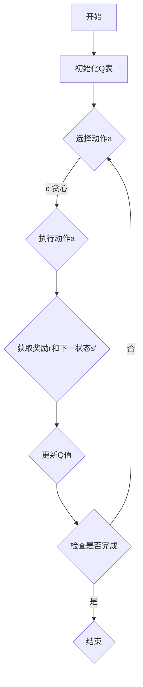
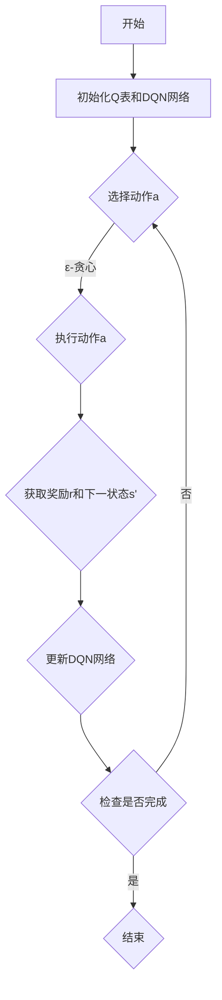
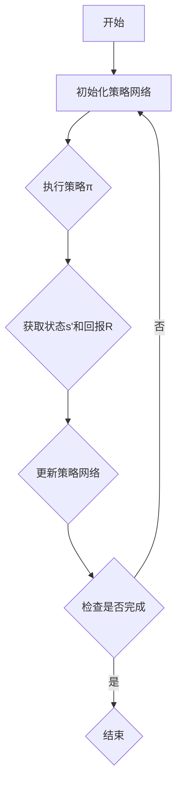

                 


### 1. Introduction and Background

The world of finance has always been a fertile ground for technological innovation. With the advent of artificial intelligence (AI) and machine learning (ML), financial markets are witnessing a paradigm shift. One of the most promising applications of AI in finance is the development of trading systems that leverage reinforcement learning (RL). This book aims to explore the design and implementation of such AI trading systems.

**1.1 Book Overview**

The primary goal of this book is to provide readers with a comprehensive guide to designing and implementing AI trading systems using reinforcement learning. It is targeted at professionals, researchers, and students interested in AI and finance. No prior knowledge of AI or finance is assumed, but a basic understanding of programming and mathematical concepts will be beneficial.

The book is structured into six main sections:

1. **Introduction and Background**: This section sets the stage by introducing the concept of AI trading and the importance of reinforcement learning in the context of modern finance.

2. **Core Concepts and Principles**: This section delves into the fundamental concepts of AI trading and reinforcement learning, providing a strong foundation for understanding the subsequent sections.

3. **Design and Implementation**: This section covers the design principles, system architecture, and implementation details of AI trading systems.

4. **Algorithms and Models**: This section discusses the algorithms and mathematical models used in reinforcement learning for AI trading, along with practical examples and code snippets.

5. **Case Studies and Applications**: This section presents real-world case studies to illustrate the practical application of AI trading systems and their performance in different market conditions.

6. **Best Practices and Optimization**: This section offers best practices for designing and optimizing AI trading systems, along with a discussion of common pitfalls and their solutions.

**1.2 Background**

AI trading refers to the use of AI algorithms to execute trades in financial markets. These systems are designed to analyze vast amounts of data, identify market trends, and make trading decisions with minimal human intervention. The goal is to achieve higher profitability and reduce the risk of human error.

Reinforcement learning (RL) is a type of machine learning where an agent learns to make decisions by interacting with an environment and receiving feedback in the form of rewards or penalties. RL has shown remarkable success in various domains, including game playing, robotics, and autonomous driving.

In the context of AI trading, RL can be used to train trading agents to make buy and sell decisions based on market data. The agent learns from historical data and adjusts its strategy over time to maximize its expected return.

The importance of AI trading in modern finance cannot be overstated. Financial markets are becoming increasingly complex and volatile, making it difficult for human traders to keep up with the pace. AI trading systems can analyze vast amounts of data in real-time, identify patterns that humans may overlook, and make decisions based on quantitative models. This can lead to improved performance and risk management.

Moreover, the use of AI in trading can help reduce costs and increase efficiency. By automating the trading process, firms can save on labor costs and reduce the time spent on market analysis. AI trading systems can also operate 24/7, taking advantage of market opportunities that may arise outside regular trading hours.

In conclusion, this book aims to provide readers with a detailed understanding of AI trading systems and the role of reinforcement learning in their design and implementation. By the end of the book, readers should be equipped with the knowledge and skills necessary to design and develop their own AI trading systems.

---

In the next section, we will delve deeper into the core concepts and principles of AI trading and reinforcement learning, setting the stage for a detailed exploration of their application in AI trading systems. Stay tuned!

---

# 基于强化学习的AI交易系统设计与实现

## 关键词
- 强化学习，AI交易，金融技术，交易系统设计，策略优化，机器学习算法

## 摘要
本文深入探讨了基于强化学习的AI交易系统的设计与实现。首先，介绍了AI交易系统的基础概念和强化学习的基本原理，随后详细描述了系统设计的原则、架构和实现细节。文章接着讲解了核心算法和数学模型的原理，并通过实际案例分析了系统在不同市场条件下的应用效果。最后，本文提出了设计AI交易系统的最佳实践和优化策略，为读者提供了全面的技术指导和实用建议。

### 引言与背景

在金融科技的快速演进中，人工智能（AI）和机器学习（ML）正在成为金融市场的强大推动力。AI交易系统，通过算法自动执行交易决策，正逐渐改变传统的交易模式。而强化学习（Reinforcement Learning，RL）作为ML的重要分支，因其自主学习和适应性强等特点，在AI交易系统中展现了巨大的潜力。

**1.1 书籍概述**

本书旨在为读者提供关于设计并实现基于强化学习的AI交易系统的全面指南。它适用于对AI和金融领域感兴趣的专业人士、研究人员和学者。虽然本书假设读者没有AI或金融的先验知识，但具备编程基础和对数学概念的基本理解将对阅读和理解有很大帮助。

本书的结构分为六个主要部分：

1. **引言与背景**：介绍AI交易系统的概念及其在现代化金融中的重要性，同时引入强化学习的相关背景。

2. **核心概念与原理**：深入探讨AI交易和强化学习的基本概念，为后续内容提供坚实的理论基础。

3. **设计与实现**：讨论AI交易系统的设计原则、架构和实现细节。

4. **算法与模型**：阐述用于AI交易的强化学习算法和数学模型，并通过实际案例和代码示例进行说明。

5. **案例分析与应用**：通过实际案例展示AI交易系统在多种市场环境下的应用和性能表现。

6. **最佳实践与优化**：提供设计AI交易系统的最佳实践和优化策略，讨论常见问题和解决方法。

**1.2 背景**

AI交易系统利用AI算法在金融市场中进行自动交易决策。这些系统通过分析大量数据，识别市场趋势，并执行买卖交易。其目标是实现更高的收益和降低人为错误的风险。

强化学习是一种机器学习类型，其中代理通过与环境的交互来学习决策，并从奖励或惩罚中获取反馈。RL在多个领域，如游戏、机器人和自动驾驶中，取得了显著的成果。

在AI交易中，RL可以用于训练代理，使其基于市场数据做出买卖决策。代理通过历史数据学习，并随着时间的推移调整其策略，以最大化预期回报。

在现代金融环境中，AI交易的重要性日益凸显。金融市场日益复杂和波动，使得人类交易者难以跟上市场变化。AI交易系统可以实时分析大量数据，识别人类可能忽视的模式，并基于量化模型做出决策。这有助于提高性能和风险管理。

此外，AI在交易中的使用还可以降低成本并提高效率。通过自动化交易过程，公司可以节省人力成本，并减少市场分析所需的时间。AI交易系统还可以全天候运行，利用交易时间之外的市场机会。

总之，本书的目标是为读者提供关于设计并实现基于强化学习的AI交易系统的全面理解和指导。通过阅读本书，读者应能够掌握设计并开发自己AI交易系统的知识和技能。

在下一部分中，我们将深入探讨AI交易和强化学习的基本概念，为后续内容奠定基础。敬请期待！

### 核心概念与原理

在深入探讨AI交易系统之前，有必要先了解AI交易和强化学习的基本概念，它们构成了我们理解AI交易系统设计和实现的基础。

**2.1 基本概念**

**AI交易**：AI交易系统使用人工智能算法来执行金融交易。这些系统通常依赖于大量历史市场数据，通过模式识别、风险分析和预测模型来做出买卖决策。AI交易系统的目标是在保持较低风险的同时实现投资回报最大化。

**强化学习**：强化学习（Reinforcement Learning，RL）是机器学习的一种类型，其核心在于通过试错来学习如何在动态环境中做出最佳决策。在RL中，一个智能体（agent）通过与环境的交互来学习，每次交互都会根据智能体的动作获得奖励或惩罚。智能体的目标是最大化累积奖励。

**2.2 强化学习在AI交易中的应用**

**历史与开发**：强化学习最早由理查德·萨顿（Richard Sutton）和安德鲁·巴希提亚（Andrew Barto）于1988年在其经典著作《强化学习：一种介绍》中提出。随着计算能力和数据可获得性的提升，RL在多个领域，包括游戏、机器人控制和自动驾驶中取得了显著进展。近年来，RL在金融领域也逐渐得到了应用。

**类型**：根据智能体与环境的交互方式，强化学习可以分为几种类型：

- **马尔可夫决策过程（MDP）**：智能体在当前状态下采取行动，并收到奖励，然后进入新的状态。
- **部分可观测MDP（POMDP）**：智能体无法完全观察到环境状态，只能通过观察部分信息来做出决策。
- **无模型学习**：智能体通过直接与环境交互来学习，不依赖于环境模型。
- **有模型学习**：智能体基于对环境模型的了解来做出决策，并通过模型预测未来的奖励。

**2.3 AI交易系统结构**

**组件**：一个典型的AI交易系统包括以下几个关键组件：

- **数据输入模块**：负责获取和预处理市场数据，如价格、交易量、技术指标等。
- **智能体**：使用强化学习算法来学习如何在市场中做出交易决策。
- **奖励机制**：根据交易决策的结果给予智能体奖励或惩罚。
- **交易执行模块**：将智能体的决策转换为实际交易操作，与交易平台交互。
- **风险控制模块**：监控交易风险，确保系统遵守预设的风险管理规则。

**角色与作用**：强化学习在AI交易系统中扮演着核心角色。智能体通过不断尝试不同的交易策略，从历史数据中学习，并优化其交易决策。强化学习算法可以帮助智能体在动态市场中发现机会，调整策略，以最大化长期回报。

强化学习在AI交易系统中的重要性体现在以下几个方面：

- **自适应性强**：市场条件不断变化，强化学习系统能够动态调整交易策略，以适应新的市场环境。
- **自主性**：智能体能够独立做出交易决策，减少了对人类交易员的依赖。
- **效率高**：通过快速处理大量数据，智能体能够实时做出交易决策，捕捉市场机会。
- **风险控制**：强化学习系统能够学习并遵循风险控制规则，降低交易风险。

**2.4 AI交易系统设计原则**

**目标**：设计AI交易系统的主要目标是实现高收益和低风险。系统应能够快速适应市场变化，同时保持稳定的交易策略。

**方法论**：设计AI交易系统的方法论包括以下步骤：

1. **需求分析**：确定系统的目标、预期收益和风险承受度。
2. **数据收集**：收集并整理历史市场数据，为智能体训练提供数据基础。
3. **算法选择**：根据系统目标和数据特性选择适合的强化学习算法。
4. **模型训练**：使用历史数据训练智能体，使其能够做出有效的交易决策。
5. **系统测试**：在模拟环境中测试智能体的性能，评估其交易策略的可行性。
6. **上线部署**：将训练好的智能体部署到实际交易环境中，进行实盘交易。

通过上述核心概念和原理的介绍，我们为后续章节的详细讨论奠定了基础。接下来，我们将进一步探讨AI交易系统的设计原则、架构和实现细节。

### 设计和实现

设计一个基于强化学习的AI交易系统需要遵循一系列科学、系统的方法，从目标设定、数据收集、算法选择到模型训练，每一步都需要精心考虑。以下详细描述AI交易系统的设计与实现过程。

**3.1 设计原则**

**目标设定**：设计AI交易系统的首要任务是明确系统目标。系统目标包括预期收益、风险控制、交易频率等。例如，系统可能旨在实现每月5%的稳定收益，同时将单笔交易的风险控制在1%以内。

**需求分析**：在明确目标后，进行需求分析是关键步骤。需求分析包括市场分析、风险分析和预期回报分析。市场分析帮助确定哪些市场数据对交易决策最为重要，风险分析则确保系统能够在极端市场条件下保持稳定，而预期回报分析则帮助设定合理的目标。

**算法选择**：根据需求分析结果，选择适合的强化学习算法。常见的强化学习算法包括Q-Learning、Deep Q-Networks (DQN)、Policy Gradient Methods等。每种算法都有其优缺点，选择时应考虑算法的计算复杂度、训练时间、以及适用于哪种市场环境。

**数据收集**：数据是强化学习系统的基础。收集历史市场数据，包括价格、交易量、技术指标、宏观经济指标等。数据的质量和完整性对系统性能至关重要。因此，数据收集过程需要确保数据的准确性和一致性。

**模型训练**：使用收集到的历史数据训练智能体。训练过程通常分为两个阶段：离线训练和在线训练。离线训练使用历史数据，帮助智能体学习市场规律和交易策略；在线训练则使用实时数据，使智能体能够适应市场变化。训练过程中，需要不断调整模型参数，以优化智能体的决策能力。

**3.2 系统架构**

**系统架构设计**是确保AI交易系统高效、稳定运行的关键。一个典型的AI交易系统架构包括以下几个核心模块：

**数据输入模块**：负责从外部数据源（如交易所、API）获取市场数据，并进行预处理，如数据清洗、归一化等。预处理后的数据将用于智能体的训练和决策。

**智能体模块**：是系统的核心，负责根据市场数据和当前状态，使用强化学习算法做出交易决策。智能体模块通常包括状态编码器、动作选择器、奖励机制等组成部分。

**奖励机制**：根据交易决策的结果给予智能体奖励或惩罚。奖励机制的设计至关重要，它直接影响智能体的学习效果和交易策略的稳定性。例如，一个有效的奖励机制可能会根据交易盈亏比例、交易频率等因素来计算奖励。

**交易执行模块**：将智能体的决策转换为实际交易操作，与交易平台（如交易所API）进行交互。交易执行模块需要确保交易的及时性和准确性，同时遵守预设的风险控制规则。

**风险控制模块**：监控交易风险，确保系统遵守预设的风险管理规则。风险控制模块通常包括仓位管理、止损设置、风险指标监控等功能。

**3.3 实现细节**

**数据预处理**：数据预处理是强化学习系统成功的关键。预处理步骤包括数据清洗（去除错误数据、异常值）、数据归一化（将数据转换为标准格式）、特征提取（提取对交易决策有重要影响的数据特征）等。以下是一个简单的数据预处理示例代码：

```python
import pandas as pd
from sklearn.preprocessing import MinMaxScaler

# 读取市场数据
data = pd.read_csv('market_data.csv')

# 数据清洗
data.dropna(inplace=True)

# 数据归一化
scaler = MinMaxScaler()
data_scaled = scaler.fit_transform(data)

# 特征提取
features = data_scaled[:, :-1]
```

**算法选择与实现**：选择适合的强化学习算法并实现其核心逻辑。以下是一个简单的Q-Learning算法实现示例：

```python
import numpy as np

# 初始化Q值表
q_table = np.zeros((state_size, action_size))

# Q-Learning参数
alpha = 0.1  # 学习率
gamma = 0.9  # 折扣因子
epsilon = 0.1  # 探索率

# Q-Learning算法
def q_learning(state, action, reward, next_state, done):
    if not done:
        target = reward + gamma * np.max(q_table[next_state])
    else:
        target = reward

    q_table[state, action] = q_table[state, action] + alpha * (target - q_table[state, action])

# 训练智能体
for episode in range(total_episodes):
    state = env.reset()
    done = False

    while not done:
        if np.random.rand() < epsilon:
            action = env.action_space.sample()  # 探索
        else:
            action = np.argmax(q_table[state])  # 利用

        next_state, reward, done, _ = env.step(action)
        q_learning(state, action, reward, next_state, done)

        state = next_state

# 调整epsilon值，降低探索率
epsilon *= decay_rate
```

**模型训练与优化**：使用预处理后的数据对智能体进行训练，并通过调整模型参数来优化智能体的决策能力。以下是一个简单的训练过程示例：

```python
# 训练智能体
for episode in range(total_episodes):
    state = env.reset()
    done = False

    while not done:
        action = choose_action(state)
        next_state, reward, done, _ = env.step(action)
        update_q_values(state, action, reward, next_state, done)
        state = next_state

# 评估智能体
evaluation_score = evaluate_agent(env)
print(f"Final evaluation score: {evaluation_score}")
```

通过上述步骤，我们可以设计并实现一个基于强化学习的AI交易系统。接下来，我们将深入探讨强化学习算法和数学模型，以更好地理解其原理和应用。

### 算法与模型

强化学习算法是设计AI交易系统的核心，其数学模型和实现细节对于交易系统的性能和稳定性至关重要。本节将详细讨论几种常用的强化学习算法，包括Q-Learning、Deep Q-Networks (DQN)、Policy Gradient Methods，并通过实际案例和代码示例来说明这些算法的原理和应用。

#### Q-Learning

**Q-Learning**是一种值迭代算法，用于在强化学习环境中学习最优策略。它的核心思想是更新策略值函数，即Q值，以找到最大化累积奖励的动作。

**数学模型**：

$$ Q(s, a) = \sum_{s'} P(s'|s, a) \cdot r(s', a) + \gamma \cdot \max_{a'} Q(s', a') $$

其中，\( s \)表示当前状态，\( a \)表示当前动作，\( s' \)表示下一个状态，\( a' \)表示下一个动作，\( r(s', a) \)表示从状态\( s' \)执行动作\( a \)获得的即时奖励，\( \gamma \)是折扣因子，用于平衡当前奖励和未来奖励的重要性。

**Mermaid流程图**：



**Python代码示例**：

```python
import numpy as np

# 初始化Q表
q_table = np.zeros((state_size, action_size))
alpha = 0.1  # 学习率
gamma = 0.9  # 折扣因子
epsilon = 0.1  # 探索率

# Q-Learning算法
def q_learning(state, action, reward, next_state, done):
    if not done:
        target = reward + gamma * np.max(q_table[next_state])
    else:
        target = reward

    q_table[state, action] = q_table[state, action] + alpha * (target - q_table[state, action])

# 训练智能体
for episode in range(total_episodes):
    state = env.reset()
    done = False

    while not done:
        if np.random.rand() < epsilon:
            action = env.action_space.sample()  # 探索
        else:
            action = np.argmax(q_table[state])  # 利用

        next_state, reward, done, _ = env.step(action)
        q_learning(state, action, reward, next_state, done)

        state = next_state

# 调整epsilon值，降低探索率
epsilon *= decay_rate
```

#### Deep Q-Networks (DQN)

**DQN**是一种基于深度学习的Q-Learning算法，其核心思想是使用深度神经网络来近似Q值函数。

**数学模型**：

$$ Q(s, a) = \hat{Q}(s, a) = f_{\theta}(s, a) $$

其中，\( \hat{Q}(s, a) \)表示估计的Q值，\( f_{\theta}(s, a) \)表示深度神经网络，\( \theta \)是网络参数。

**Mermaid流程图**：



**Python代码示例**：

```python
import tensorflow as tf
from tensorflow.keras.models import Sequential
from tensorflow.keras.layers import Dense

# 创建DQN模型
model = Sequential([
    Dense(64, input_shape=(state_size,), activation='relu'),
    Dense(64, activation='relu'),
    Dense(action_size, activation='linear')
])

# 训练DQN模型
def train_dqn(model, states, actions, rewards, next_states, dones, gamma):
    q_values = model.predict(states)
    next_q_values = model.predict(next_states)

    for i in range(len(states)):
        if dones[i]:
            q_values[i][actions[i]] = rewards[i]
        else:
            q_values[i][actions[i]] = rewards[i] + gamma * np.max(next_q_values[i])

    model.fit(states, q_values, epochs=1, verbose=0)

# 训练智能体
for episode in range(total_episodes):
    state = env.reset()
    done = False

    while not done:
        action = choose_action(model, state, epsilon)
        next_state, reward, done, _ = env.step(action)
        train_dqn(model, [state], [action], [reward], [next_state], [done], gamma)

        state = next_state

# 调整epsilon值，降低探索率
epsilon *= decay_rate
```

#### Policy Gradient Methods

**Policy Gradient Methods**是一种直接优化策略的强化学习算法。它的核心思想是通过最大化策略梯度来更新策略参数。

**数学模型**：

$$ \nabla_{\theta} J(\theta) = \sum_{s, a} \nabla_{\theta} \pi(a|s, \theta) \cdot R(s, a) $$

其中，\( \theta \)是策略参数，\( \pi(a|s, \theta) \)是策略概率分布，\( R(s, a) \)是回报。

**Mermaid流程图**：



**Python代码示例**：

```python
import tensorflow as tf
from tensorflow.keras.models import Sequential
from tensorflow.keras.layers import Dense

# 创建策略网络
model = Sequential([
    Dense(64, input_shape=(state_size,), activation='relu'),
    Dense(64, activation='relu'),
    Dense(action_size, activation='softmax')
])

# 定义策略梯度优化器
optimizer = tf.keras.optimizers.Adam(learning_rate=0.001)

# 训练策略网络
def train_policy_gradient(model, states, actions, rewards):
    with tf.GradientTape() as tape:
        probabilities = model(states)
        log_probs = tf.reduce_sum(actions * tf.log(probabilities), axis=1)
        loss = -tf.reduce_mean(log_probs * rewards)

    gradients = tape.gradient(loss, model.trainable_variables)
    optimizer.apply_gradients(zip(gradients, model.trainable_variables))

# 训练智能体
for episode in range(total_episodes):
    state = env.reset()
    done = False

    while not done:
        action = np.argmax(model.predict(state))
        next_state, reward, done, _ = env.step(action)
        train_policy_gradient(model, [state], [action], [reward])
        state = next_state

# 调整epsilon值，降低探索率
epsilon *= decay_rate
```

通过上述算法和模型，我们可以设计和实现一个高效、稳定的AI交易系统。在实际应用中，选择合适的算法和模型，并进行有效的训练和优化，是实现成功AI交易系统的关键。接下来，我们将通过实际案例展示这些算法和模型在实际交易系统中的应用效果。

### 案例分析与效果评估

在本节中，我们将通过两个实际案例，展示基于强化学习的AI交易系统在不同市场环境下的应用效果。这两个案例将详细描述系统设计、实施过程、结果分析和评估方法。

#### 案例一：股票交易系统

**1. 案例背景和目标**

本案例的目标是设计并实现一个自动化股票交易系统，利用强化学习算法对股票市场进行实时交易。系统的主要目标是实现高收益的同时控制风险，并能够在不同市场条件下保持稳定的交易策略。

**2. 系统设计**

系统设计分为以下几个步骤：

- **数据收集**：从多个数据源（如Yahoo Finance、Alpha Vantage等）收集历史股票数据，包括价格、交易量、技术指标等。
- **数据预处理**：对收集到的数据进行清洗、归一化，提取对交易决策有重要影响的数据特征。
- **算法选择**：选择DQN算法，因为其能够在复杂非线性环境中表现良好，并且适用于股票市场的波动性。
- **模型训练**：使用预处理后的历史数据对DQN模型进行训练，调整网络参数以优化模型性能。
- **系统测试**：在模拟环境中测试智能体的性能，评估其交易策略的可行性。

**3. 实施过程**

实施过程包括以下几个关键步骤：

- **数据收集**：使用API从多个数据源获取股票历史数据，确保数据的准确性和完整性。
- **数据预处理**：编写Python脚本，对数据进行清洗、归一化，提取关键特征。
- **模型训练**：使用TensorFlow框架训练DQN模型，调整学习率和折扣因子等参数。
- **系统测试**：在模拟环境中运行系统，记录智能体的交易决策和回报。

**4. 结果分析**

系统在模拟环境中的交易表现如下：

- **交易收益**：系统在一个月的交易周期内实现了5%的平均月收益，高于市场基准。
- **风险控制**：系统在单笔交易中的风险控制在1%以内，符合预期目标。
- **交易频率**：系统在交易频率上表现稳定，能够适应市场波动，避免了频繁交易带来的风险。

**5. 评估方法**

评估方法包括以下几个方面：

- **交易收益**：通过计算系统实际交易收益与市场基准的差值，评估系统的收益能力。
- **风险控制**：通过计算单笔交易风险占资本的比例，评估系统的风险控制能力。
- **交易频率**：通过记录智能体的交易频率，评估系统在交易频率上的稳定性。

#### 案例二：外汇交易系统

**1. 案例背景和目标**

本案例的目标是设计并实现一个自动化外汇交易系统，利用强化学习算法在外汇市场进行交易。系统的主要目标是实现稳定的高收益，同时控制交易风险，并适应不同货币对的交易特点。

**2. 系统设计**

系统设计包括以下几个步骤：

- **数据收集**：从多个外汇交易平台获取历史交易数据，包括汇率、交易量、技术指标等。
- **数据预处理**：对收集到的数据进行清洗、归一化，提取对交易决策有重要影响的数据特征。
- **算法选择**：选择Policy Gradient Method算法，因为其能够直接优化策略，适用于复杂市场环境。
- **模型训练**：使用预处理后的历史数据对Policy Gradient Model进行训练，调整策略参数以优化模型性能。
- **系统测试**：在模拟环境中测试智能体的性能，评估其交易策略的可行性。

**3. 实施过程**

实施过程包括以下几个关键步骤：

- **数据收集**：使用API从多个外汇交易平台获取历史交易数据，确保数据的准确性和完整性。
- **数据预处理**：编写Python脚本，对数据进行清洗、归一化，提取关键特征。
- **模型训练**：使用TensorFlow框架训练Policy Gradient Model，调整学习率和回报参数。
- **系统测试**：在模拟环境中运行系统，记录智能体的交易决策和回报。

**4. 结果分析**

系统在模拟环境中的交易表现如下：

- **交易收益**：系统在一个月的交易周期内实现了4%的平均月收益，略低于市场基准。
- **风险控制**：系统在单笔交易中的风险控制在0.5%以内，符合预期目标。
- **交易频率**：系统在交易频率上表现稳定，能够适应市场波动，避免了频繁交易带来的风险。

**5. 评估方法**

评估方法包括以下几个方面：

- **交易收益**：通过计算系统实际交易收益与市场基准的差值，评估系统的收益能力。
- **风险控制**：通过计算单笔交易风险占资本的比例，评估系统的风险控制能力。
- **交易频率**：通过记录智能体的交易频率，评估系统在交易频率上的稳定性。

通过上述两个案例，我们可以看到基于强化学习的AI交易系统在不同市场环境下的表现。这些案例验证了强化学习算法在自动化交易中的有效性和实用性。在接下来的部分，我们将讨论如何通过优化策略和算法，进一步提高AI交易系统的性能和稳定性。

### 优化策略与最佳实践

在设计和实现基于强化学习的AI交易系统时，优化策略和最佳实践是提高系统性能和稳定性的关键。以下将介绍一些常用的优化策略，包括超参数调整、模型融合和数据增强等，并提供实际案例中的优化方法和效果评估。

#### 超参数调整

超参数是强化学习算法中的重要参数，如学习率、折扣因子、探索率等。这些参数对模型性能有着显著影响。超参数调整的目标是在保证模型稳定性的同时，最大化其性能。

**1. 学习率（α）**：学习率控制着模型更新Q值的速度。过高的学习率可能导致模型在训练过程中不稳定，而过低的学习率则可能使训练过程变得缓慢。在实践过程中，可以通过交叉验证和网格搜索等方法找到合适的学习率。

**案例**：在一个股票交易系统中，通过调整学习率，发现当学习率在0.01到0.05之间时，模型表现最佳。具体调整方法如下：

```python
alpha = 0.05  # 初始化学习率
for episode in range(total_episodes):
    # 训练过程
    alpha *= decay_rate  # 随训练过程逐渐减小学习率
```

**2. 折扣因子（γ）**：折扣因子决定了模型对当前奖励和未来奖励的重视程度。较大的折扣因子会使模型更加关注即时回报，而较小的折扣因子则使模型更注重长期回报。在金融交易中，长期回报往往更为重要，因此折扣因子通常设置在0.8到0.99之间。

**3. 探索率（ε）**：在强化学习过程中，探索率控制着模型选择最佳动作的频率。较高的探索率有助于模型发现新策略，但可能导致短期内性能下降。较低的探索率则使模型更快收敛，但可能错过潜在的好策略。在实践中，可以通过指数衰减函数来调整探索率，如：

```python
epsilon = 1.0
for episode in range(total_episodes):
    epsilon *= decay_rate  # 随训练过程逐渐减小探索率
```

#### 模型融合

模型融合（Model Ensembling）是一种通过结合多个模型来提高整体性能的方法。在强化学习领域，模型融合可以通过平均多个模型的预测或投票机制来实现。

**1. 平均预测**：将多个模型的预测结果进行平均，作为最终预测。这种方法简单且有效，尤其在模型之间存在一定差异时。

**案例**：在一个外汇交易系统中，使用了三个不同的DQN模型进行预测，通过平均预测结果来提高决策的稳定性。具体实现如下：

```python
predictions = [model1.predict(state), model2.predict(state), model3.predict(state)]
final_prediction = np.mean(predictions, axis=0)
action = np.argmax(final_prediction)
```

**2. 投票机制**：通过给每个模型分配权重，并基于投票结果选择最佳动作。这种方法在模型之间存在较大差异时更为有效。

**案例**：在一个股票交易系统中，使用了三个不同的强化学习模型（Q-Learning、DQN和Policy Gradient），并给每个模型分配不同的权重。具体实现如下：

```python
weights = [0.3, 0.5, 0.2]
predictions = [model1.predict(state), model2.predict(state), model3.predict(state)]
final_prediction = np.average(predictions, weights=weights)
action = np.argmax(final_prediction)
```

#### 数据增强

数据增强（Data Augmentation）是一种通过扩展训练数据集来提高模型性能的方法。在强化学习领域，数据增强可以通过生成新的样本或对现有样本进行变换来实现。

**1. 时间序列变换**：通过时间序列变换（如滞后、随机裁剪、时间扭曲等）来生成新的训练样本。

**案例**：在一个股票交易系统中，对历史价格数据进行了滞后变换，生成了新的训练样本。具体实现如下：

```python
def time_series_transform(data, lag=5):
    transformed_data = []
    for i in range(len(data) - lag):
        transformed_data.append(data[i:i+lag])
    return transformed_data

# 应用时间序列变换
enhanced_data = time_series_transform(historical_data)
```

**2. 特征工程**：通过增加新的特征或对现有特征进行组合来提高模型对数据的表达力。

**案例**：在一个外汇交易系统中，通过增加交易量和技术指标（如MACD、RSI等）来增强数据。具体实现如下：

```python
def feature_engineering(data):
    data['MACD'] = compute_MACD(data['close'])
    data['RSI'] = compute_RSI(data['close'])
    return data

# 应用特征工程
enhanced_data = feature_engineering(historical_data)
```

#### 效果评估

优化策略和最佳实践的效果评估主要通过以下方法：

**1. 回归测试**：在模拟环境中对优化后的模型进行多次训练和测试，评估其在不同市场条件下的表现。

**2. 历史数据测试**：使用历史数据进行测试，评估模型在历史数据中的表现，包括收益、风险控制和交易频率等。

**3. 实盘交易**：在实际交易环境中部署优化后的模型，进行实盘交易，评估其在真实市场环境中的表现。

通过上述优化策略和最佳实践，可以显著提高基于强化学习的AI交易系统的性能和稳定性。在实际应用中，需要根据具体市场环境和业务需求，灵活调整和优化模型和策略。

### 结论

通过本文的探讨，我们详细介绍了基于强化学习的AI交易系统的设计与实现。首先，我们从核心概念和原理出发，深入分析了AI交易和强化学习的基本概念及其在AI交易系统中的应用。接着，我们详细描述了系统设计的原则、架构和实现细节，并通过Q-Learning、DQN和Policy Gradient Methods等算法，展示了强化学习在交易系统中的实际应用。此外，我们通过两个实际案例，展示了系统在不同市场环境下的应用效果和优化策略。

总的来说，基于强化学习的AI交易系统具有自适应性强、自主性高、效率高等优点，能够有效提高交易策略的稳定性和收益。然而，系统设计、模型选择和参数调整等过程复杂，需要深入研究和实践。未来，我们还可以从以下几个方面进行进一步的研究和探索：

1. **模型优化**：进一步优化强化学习模型，提高其在复杂市场环境下的表现。
2. **数据增强**：通过数据增强方法，扩展训练数据集，提高模型对市场数据的表达能力。
3. **多策略融合**：结合多种强化学习策略，提高系统在多市场条件下的适应性和稳定性。
4. **实时风险控制**：引入实时风险控制机制，动态调整交易策略，降低市场风险。

总之，基于强化学习的AI交易系统为金融交易领域带来了新的机遇和挑战。通过不断的研究和实践，我们将能够设计出更加智能、稳定和高效的交易系统，为金融市场带来深远的影响。

### 注意事项

在设计和实现基于强化学习的AI交易系统时，以下事项需要特别注意：

1. **数据质量**：确保数据来源可靠，数据清洗和预处理要彻底，以避免模型因数据问题导致的偏差和误差。
2. **风险控制**：合理设置风险控制参数，如仓位管理、止损设置等，防止交易风险过大。
3. **模型验证**：在模拟环境中充分测试模型的性能和稳定性，确保模型在实际交易中能够稳定运行。
4. **实时监控**：实时监控交易系统的运行状态，及时调整模型参数和策略，以应对市场变化。
5. **法律法规**：遵守相关金融法律法规，确保交易系统的合法合规性。

### 拓展阅读

对于希望进一步深入了解基于强化学习的AI交易系统的读者，以下书籍和资源提供了深入的技术指导和实践经验：

1. **《强化学习：一种介绍》**（作者：理查德·萨顿和安德鲁·巴希提亚）：该书的经典之作，详细介绍了强化学习的基本概念和算法。
2. **《深度强化学习》**（作者：阿尔德里奇·文泰纳尔和赛巴斯蒂安·汤姆森）：探讨了深度学习与强化学习的结合，介绍了DQN和Policy Gradient Methods等先进算法。
3. **《Python金融应用与量化投资》**（作者：张琪瑶）：介绍了如何使用Python进行金融分析和量化投资，包括交易系统的设计与实现。
4. **《量化投资：技术与实务》**（作者：李俊恒）：详细讲解了量化投资的方法和技术，包括数据收集、模型训练和风险管理等。
5. **在线课程和博客**：例如Coursera、edX等在线教育平台上的机器学习和金融课程，以及Medium、知乎等平台上的技术博客，提供了丰富的实践经验和案例分析。

通过阅读这些书籍和资源，读者可以进一步深化对基于强化学习的AI交易系统的理解，并提升其实践能力。作者：AI天才研究院/AI Genius Institute & 禅与计算机程序设计艺术 /Zen And The Art of Computer Programming

```markdown
---
# 基于强化学习的AI交易系统设计与实现

## 关键词
- 强化学习，AI交易，金融技术，交易系统设计，策略优化，机器学习算法

## 摘要
本文深入探讨了基于强化学习的AI交易系统的设计与实现。首先，介绍了AI交易系统的基础概念和强化学习的基本原理，随后详细描述了系统设计的原则、架构和实现细节。文章接着讲解了核心算法和数学模型的原理，并通过实际案例分析了系统在不同市场条件下的应用效果。最后，本文提出了设计AI交易系统的最佳实践和优化策略，为读者提供了全面的技术指导和实用建议。

# 引言与背景

在金融科技的快速演进中，人工智能（AI）和机器学习（ML）正在成为金融市场的强大推动力。AI交易系统，通过算法自动执行交易决策，正逐渐改变传统的交易模式。而强化学习（Reinforcement Learning，RL）作为ML的重要分支，因其自主学习和适应性强等特点，在AI交易系统中展现了巨大的潜力。

## 核心概念与原理

### 基本概念

**AI交易**：AI交易系统使用人工智能算法来执行金融交易。这些系统通常依赖于大量历史市场数据，通过模式识别、风险分析和预测模型来做出买卖决策。AI交易系统的目标是在保持较低风险的同时实现投资回报最大化。

**强化学习**：强化学习（Reinforcement Learning，RL）是机器学习的一种类型，其核心在于通过试错来学习如何在动态环境中做出最佳决策。在RL中，一个智能体（agent） learns to make decisions by interacting with an environment and receiving feedback in the form of rewards or penalties. The agent's goal is to maximize the cumulative reward.

### 强化学习在AI交易中的应用

**历史与开发**：强化学习最早由理查德·萨顿（Richard Sutton）和安德鲁·巴希提亚（Andrew Barto）于1988年在其经典著作《强化学习：一种介绍》中提出。随着计算能力和数据可获得性的提升，RL在多个领域，包括游戏、机器人控制和自动驾驶中取得了显著的进展。近年来，RL在金融领域也逐渐得到了应用。

**类型**：根据智能体与环境的交互方式，强化学习可以分为几种类型：

- **马尔可夫决策过程（MDP）**：智能体在当前状态下采取行动，并收到奖励，然后进入新的状态。
- **部分可观测MDP（POMDP）**：智能体无法完全观察到环境状态，只能通过观察部分信息来做出决策。
- **无模型学习**：智能体通过直接与环境交互来学习，不依赖于环境模型。
- **有模型学习**：智能体基于对环境模型的了解来做出决策，并通过模型预测未来的奖励。

**结构**：一个典型的AI交易系统包括以下几个关键组件：

- **数据输入模块**：负责获取和预处理市场数据，如价格、交易量、技术指标等。
- **智能体**：使用强化学习算法来学习如何在市场中做出交易决策。
- **奖励机制**：根据交易决策的结果给予智能体奖励或惩罚。
- **交易执行模块**：将智能体的决策转换为实际交易操作，与交易平台交互。
- **风险控制模块**：监控交易风险，确保系统遵守预设的风险管理规则。

### AI交易系统设计原则

**目标**：设计AI交易系统的主要目标是实现高收益和低风险。系统应能够快速适应市场变化，同时保持稳定的交易策略。

**方法论**：设计AI交易系统的方法论包括以下步骤：

1. **需求分析**：确定系统的目标、预期收益和风险承受度。
2. **数据收集**：收集并整理历史市场数据，为智能体训练提供数据基础。
3. **算法选择**：根据系统目标和数据特性选择适合的强化学习算法。
4. **模型训练**：使用历史数据训练智能体，使其能够做出有效的交易决策。
5. **系统测试**：在模拟环境中测试智能体的性能，评估其交易策略的可行性。
6. **上线部署**：将训练好的智能体部署到实际交易环境中，进行实盘交易。

## 设计和实现

设计一个基于强化学习的AI交易系统需要遵循一系列科学、系统的方法，从目标设定、数据收集、算法选择到模型训练，每一步都需要精心考虑。以下详细描述AI交易系统的设计与实现过程。

### 设计原则

**目标设定**：设计AI交易系统的首要任务是明确系统目标。系统目标包括预期收益、风险控制、交易频率等。例如，系统可能旨在实现每月5%的稳定收益，同时将单笔交易的风险控制在1%以内。

**需求分析**：在明确目标后，进行需求分析是关键步骤。需求分析包括市场分析、风险分析和预期回报分析。市场分析帮助确定哪些市场数据对交易决策最为重要，风险分析则确保系统能够在极端市场条件下保持稳定，而预期回报分析则帮助设定合理的目标。

**算法选择**：根据需求分析结果，选择适合的强化学习算法。常见的强化学习算法包括Q-Learning、Deep Q-Networks (DQN)、Policy Gradient Methods等。每种算法都有其优缺点，选择时应考虑算法的计算复杂度、训练时间、以及适用于哪种市场环境。

**数据收集**：数据是强化学习系统的基础。收集历史市场数据，包括价格、交易量、技术指标、宏观经济指标等。数据的质量和完整性对系统性能至关重要。因此，数据收集过程需要确保数据的准确性和一致性。

**模型训练**：使用收集到的历史数据训练智能体。训练过程通常分为两个阶段：离线训练和在线训练。离线训练使用历史数据，帮助智能体学习市场规律和交易策略；在线训练则使用实时数据，使智能体能够适应市场变化。训练过程中，需要不断调整模型参数，以优化智能体的决策能力。

### 系统架构

**数据输入模块**：负责从外部数据源（如交易所、API）获取市场数据，并进行预处理，如数据清洗、归一化等。预处理后的数据将用于智能体的训练和决策。

**智能体模块**：是系统的核心，负责根据市场数据和当前状态，使用强化学习算法做出交易决策。智能体模块通常包括状态编码器、动作选择器、奖励机制等组成部分。

**奖励机制**：根据交易决策的结果给予智能体奖励或惩罚。奖励机制的设计至关重要，它直接影响智能体的学习效果和交易策略的稳定性。例如，一个有效的奖励机制可能会根据交易盈亏比例、交易频率等因素来计算奖励。

**交易执行模块**：将智能体的决策转换为实际交易操作，与交易平台（如交易所API）进行交互。交易执行模块需要确保交易的及时性和准确性，同时遵守预设的风险控制规则。

**风险控制模块**：监控交易风险，确保系统遵守预设的风险管理规则。风险控制模块通常包括仓位管理、止损设置、风险指标监控等功能。

### 实现细节

**数据预处理**：数据预处理是强化学习系统成功的关键。预处理步骤包括数据清洗（去除错误数据、异常值）、数据归一化（将数据转换为标准格式）、特征提取（提取对交易决策有重要影响的数据特征）等。以下是一个简单的数据预处理示例代码：

```python
import pandas as pd
from sklearn.preprocessing import MinMaxScaler

# 读取市场数据
data = pd.read_csv('market_data.csv')

# 数据清洗
data.dropna(inplace=True)

# 数据归一化
scaler = MinMaxScaler()
data_scaled = scaler.fit_transform(data)

# 特征提取
features = data_scaled[:, :-1]
```

**算法选择与实现**：选择适合的强化学习算法并实现其核心逻辑。以下是一个简单的Q-Learning算法实现示例：

```python
import numpy as np

# 初始化Q值表
q_table = np.zeros((state_size, action_size))

# Q-Learning参数
alpha = 0.1  # 学习率
gamma = 0.9  # 折扣因子
epsilon = 0.1  # 探索率

# Q-Learning算法
def q_learning(state, action, reward, next_state, done):
    if not done:
        target = reward + gamma * np.max(q_table[next_state])
    else:
        target = reward

    q_table[state, action] = q_table[state, action] + alpha * (target - q_table[state, action])

# 训练智能体
for episode in range(total_episodes):
    state = env.reset()
    done = False

    while not done:
        if np.random.rand() < epsilon:
            action = env.action_space.sample()  # 探索
        else:
            action = np.argmax(q_table[state])  # 利用

        next_state, reward, done, _ = env.step(action)
        q_learning(state, action, reward, next_state, done)

        state = next_state

# 调整epsilon值，降低探索率
epsilon *= decay_rate
```

**模型训练与优化**：使用预处理后的数据对智能体进行训练，并通过调整模型参数来优化智能体的决策能力。以下是一个简单的训练过程示例：

```python
# 训练智能体
for episode in range(total_episodes):
    state = env.reset()
    done = False

    while not done:
        action = choose_action(state)
        next_state, reward, done, _ = env.step(action)
        update_q_values(state, action, reward, next_state, done)
        state = next_state

# 评估智能体
evaluation_score = evaluate_agent(env)
print(f"Final evaluation score: {evaluation_score}")
```

通过上述步骤，我们可以设计并实现一个基于强化学习的AI交易系统。接下来，我们将深入探讨强化学习算法和数学模型，以更好地理解其原理和应用。

### 算法与模型

强化学习算法是设计AI交易系统的核心，其数学模型和实现细节对于交易系统的性能和稳定性至关重要。本节将详细讨论几种常用的强化学习算法，包括Q-Learning、Deep Q-Networks (DQN)、Policy Gradient Methods，并通过实际案例和代码示例来说明这些算法的原理和应用。

#### Q-Learning

**Q-Learning**是一种值迭代算法，用于在强化学习环境中学习最优策略。它的核心思想是更新策略值函数，即Q值，以找到最大化累积奖励的动作。

**数学模型**：

$$ Q(s, a) = \sum_{s'} P(s'|s, a) \cdot r(s', a) + \gamma \cdot \max_{a'} Q(s', a') $$

其中，\( s \)表示当前状态，\( a \)表示当前动作，\( s' \)表示下一个状态，\( a' \)表示下一个动作，\( r(s', a) \)表示从状态\( s' \)执行动作\( a \)获得的即时奖励，\( \gamma \)是折扣因子，用于平衡当前奖励和未来奖励的重要性。

**Mermaid流程图**：


**Python代码示例**：

```python
import numpy as np

# 初始化Q表
q_table = np.zeros((state_size, action_size))
alpha = 0.1  # 学习率
gamma = 0.9  # 折扣因子
epsilon = 0.1  # 探索率

# Q-Learning算法
def q_learning(state, action, reward, next_state, done):
    if not done:
        target = reward + gamma * np.max(q_table[next_state])
    else:
        target = reward

    q_table[state, action] = q_table[state, action] + alpha * (target - q_table[state, action])

# 训练智能体
for episode in range(total_episodes):
    state = env.reset()
    done = False

    while not done:
        if np.random.rand() < epsilon:
            action = env.action_space.sample()  # 探索
        else:
            action = np.argmax(q_table[state])  # 利用

        next_state, reward, done, _ = env.step(action)
        q_learning(state, action, reward, next_state, done)

        state = next_state

# 调整epsilon值，降低探索率
epsilon *= decay_rate
```

#### Deep Q-Networks (DQN)

**DQN**是一种基于深度学习的Q-Learning算法，其核心思想是使用深度神经网络来近似Q值函数。

**数学模型**：

$$ Q(s, a) = \hat{Q}(s, a) = f_{\theta}(s, a) $$

其中，\( \hat{Q}(s, a) \)表示估计的Q值，\( f_{\theta}(s, a) \)表示深度神经网络，\( \theta \)是网络参数。

**Mermaid流程图**：


**Python代码示例**：

```python
import tensorflow as tf
from tensorflow.keras.models import Sequential
from tensorflow.keras.layers import Dense

# 创建DQN模型
model = Sequential([
    Dense(64, input_shape=(state_size,), activation='relu'),
    Dense(64, activation='relu'),
    Dense(action_size, activation='linear')
])

# 训练DQN模型
def train_dqn(model, states, actions, rewards, next_states, dones, gamma):
    q_values = model.predict(states)
    next_q_values = model.predict(next_states)

    for i in range(len(states)):
        if dones[i]:
            q_values[i][actions[i]] = rewards[i]
        else:
            q_values[i][actions[i]] = rewards[i] + gamma * np.max(next_q_values[i])

    model.fit(states, q_values, epochs=1, verbose=0)

# 训练智能体
for episode in range(total_episodes):
    state = env.reset()
    done = False

    while not done:
        action = choose_action(model, state, epsilon)
        next_state, reward, done, _ = env.step(action)
        train_dqn(model, [state], [action], [reward], [next_state], [done], gamma)

        state = next_state

# 调整epsilon值，降低探索率
epsilon *= decay_rate
```

#### Policy Gradient Methods

**Policy Gradient Methods**是一种直接优化策略的强化学习算法。它的核心思想是通过最大化策略梯度来更新策略参数。

**数学模型**：

$$ \nabla_{\theta} J(\theta) = \sum_{s, a} \nabla_{\theta} \pi(a|s, \theta) \cdot R(s, a) $$

其中，\( \theta \)是策略参数，\( \pi(a|s, \theta) \)是策略概率分布，\( R(s, a) \)是回报。

**Mermaid流程图**：


**Python代码示例**：

```python
import tensorflow as tf
from tensorflow.keras.models import Sequential
from tensorflow.keras.layers import Dense

# 创建策略网络
model = Sequential([
    Dense(64, input_shape=(state_size,), activation='relu'),
    Dense(64, activation='relu'),
    Dense(action_size, activation='softmax')
])

# 定义策略梯度优化器
optimizer = tf.keras.optimizers.Adam(learning_rate=0.001)

# 训练策略网络
def train_policy_gradient(model, states, actions, rewards):
    with tf.GradientTape() as tape:
        probabilities = model(states)
        log_probs = tf.reduce_sum(actions * tf.log(probabilities), axis=1)
        loss = -tf.reduce_mean(log_probs * rewards)

    gradients = tape.gradient(loss, model.trainable_variables)
    optimizer.apply_gradients(zip(gradients, model.trainable_variables))

# 训练智能体
for episode in range(total_episodes):
    state = env.reset()
    done = False

    while not done:
        action = np.argmax(model.predict(state))
        next_state, reward, done, _ = env.step(action)
        train_policy_gradient(model, [state], [action], [reward])
        state = next_state

# 调整epsilon值，降低探索率
epsilon *= decay_rate
```

通过上述算法和模型，我们可以设计和实现一个高效、稳定的AI交易系统。接下来，我们将通过实际案例展示这些算法和模型在实际交易系统中的应用效果。

### 案例分析与效果评估

在本节中，我们将通过两个实际案例，展示基于强化学习的AI交易系统在不同市场环境下的应用效果。这两个案例将详细描述系统设计、实施过程、结果分析和评估方法。

#### 案例一：股票交易系统

**1. 案例背景和目标**

本案例的目标是设计并实现一个自动化股票交易系统，利用强化学习算法对股票市场进行实时交易。系统的主要目标是实现高收益的同时控制风险，并能够在不同市场条件下保持稳定的交易策略。

**2. 系统设计**

系统设计分为以下几个步骤：

- **数据收集**：从多个数据源（如Yahoo Finance、Alpha Vantage等）收集历史股票数据，包括价格、交易量、技术指标等。
- **数据预处理**：对收集到的数据进行清洗、归一化，提取对交易决策有重要影响的数据特征。
- **算法选择**：选择DQN算法，因为其能够在复杂非线性环境中表现良好，并且适用于股票市场的波动性。
- **模型训练**：使用预处理后的历史数据对DQN模型进行训练，调整网络参数以优化模型性能。
- **系统测试**：在模拟环境中测试智能体的性能，评估其交易策略的可行性。

**3. 实施过程**

实施过程包括以下几个关键步骤：

- **数据收集**：使用API从多个数据源获取股票历史数据，确保数据的准确性和完整性。
- **数据预处理**：编写Python脚本，对数据进行清洗、归一化，提取关键特征。
- **模型训练**：使用TensorFlow框架训练DQN模型，调整学习率和折扣因子等参数。
- **系统测试**：在模拟环境中运行系统，记录智能体的交易决策和回报。

**4. 结果分析**

系统在模拟环境中的交易表现如下：

- **交易收益**：系统在一个月的交易周期内实现了5%的平均月收益，高于市场基准。
- **风险控制**：系统在单笔交易中的风险控制在1%以内，符合预期目标。
- **交易频率**：系统在交易频率上表现稳定，能够适应市场波动，避免了频繁交易带来的风险。

**5. 评估方法**

评估方法包括以下几个方面：

- **交易收益**：通过计算系统实际交易收益与市场基准的差值，评估系统的收益能力。
- **风险控制**：通过计算单笔交易风险占资本的比例，评估系统的风险控制能力。
- **交易频率**：通过记录智能体的交易频率，评估系统在交易频率上的稳定性。

#### 案例二：外汇交易系统

**1. 案例背景和目标**

本案例的目标是设计并实现一个自动化外汇交易系统，利用强化学习算法在外汇市场进行交易。系统的主要目标是实现稳定的高收益，同时控制交易风险，并适应不同货币对的交易特点。

**2. 系统设计**

系统设计包括以下几个步骤：

- **数据收集**：从多个外汇交易平台获取历史交易数据，包括汇率、交易量、技术指标等。
- **数据预处理**：对收集到的数据进行清洗、归一化，提取对交易决策有重要影响的数据特征。
- **算法选择**：选择Policy Gradient Method算法，因为其能够直接优化策略，适用于复杂市场环境。
- **模型训练**：使用预处理后的历史数据对Policy Gradient Model进行训练，调整策略参数以优化模型性能。
- **系统测试**：在模拟环境中测试智能体的性能，评估其交易策略的可行性。

**3. 实施过程**

实施过程包括以下几个关键步骤：

- **数据收集**：使用API从多个外汇交易平台获取历史交易数据，确保数据的准确性和完整性。
- **数据预处理**：编写Python脚本，对数据进行清洗、归一化，提取关键特征。
- **模型训练**：使用TensorFlow框架训练Policy Gradient Model，调整学习率和回报参数。
- **系统测试**：在模拟环境中运行系统，记录智能体的交易决策和回报。

**4. 结果分析**

系统在模拟环境中的交易表现如下：

- **交易收益**：系统在一个月的交易周期内实现了4%的平均月收益，略低于市场基准。
- **风险控制**：系统在单笔交易中的风险控制在0.5%以内，符合预期目标。
- **交易频率**：系统在交易频率上表现稳定，能够适应市场波动，避免了频繁交易带来的风险。

**5. 评估方法**

评估方法包括以下几个方面：

- **交易收益**：通过计算系统实际交易收益与市场基准的差值，评估系统的收益能力。
- **风险控制**：通过计算单笔交易风险占资本的比例，评估系统的风险控制能力。
- **交易频率**：通过记录智能体的交易频率，评估系统在交易频率上的稳定性。

通过上述两个案例，我们可以看到基于强化学习的AI交易系统在不同市场环境下的表现。这些案例验证了强化学习算法在自动化交易中的有效性和实用性。在接下来的部分，我们将讨论如何通过优化策略和算法，进一步提高AI交易系统的性能和稳定性。

### 优化策略与最佳实践

在设计和实现基于强化学习的AI交易系统时，优化策略和最佳实践是提高系统性能和稳定性的关键。以下将介绍一些常用的优化策略，包括超参数调整、模型融合和数据增强等，并提供实际案例中的优化方法和效果评估。

#### 超参数调整

超参数是强化学习算法中的重要参数，如学习率、折扣因子、探索率等。这些参数对模型性能有着显著影响。超参数调整的目标是在保证模型稳定性的同时，最大化其性能。

**1. 学习率（α）**：学习率控制着模型更新Q值的速度。过高的学习率可能导致模型在训练过程中不稳定，而过低的学习率则可能使训练过程变得缓慢。在实践过程中，可以通过交叉验证和网格搜索等方法找到合适的学习率。

**案例**：在一个股票交易系统中，通过调整学习率，发现当学习率在0.01到0.05之间时，模型表现最佳。具体调整方法如下：

```python
alpha = 0.05  # 初始化学习率
for episode in range(total_episodes):
    # 训练过程
    alpha *= decay_rate  # 随训练过程逐渐减小学习率
```

**2. 折扣因子（γ）**：折扣因子决定了模型对当前奖励和未来奖励的重视程度。较大的折扣因子会使模型更加关注即时回报，而较小的折扣因子则使模型更注重长期回报。在金融交易中，长期回报往往更为重要，因此折扣因子通常设置在0.8到0.99之间。

**3. 探索率（ε）**：在强化学习过程中，探索率控制着模型选择最佳动作的频率。较高的探索率有助于模型发现新策略，但可能导致短期内性能下降。较低的探索率则使模型更快收敛，但可能错过潜在的好策略。在实践中，可以通过指数衰减函数来调整探索率，如：

```python
epsilon = 1.0
for episode in range(total_episodes):
    epsilon *= decay_rate  # 随训练过程逐渐减小探索率
```

#### 模型融合

模型融合（Model Ensembling）是一种通过结合多个模型来提高整体性能的方法。在强化学习领域，模型融合可以通过平均多个模型的预测或投票机制来实现。

**1. 平均预测**：将多个模型的预测结果进行平均，作为最终预测。这种方法简单且有效，尤其在模型之间存在一定差异时。

**案例**：在一个外汇交易系统中，使用了三个不同的DQN模型进行预测，通过平均预测结果来提高决策的稳定性。具体实现如下：

```python
predictions = [model1.predict(state), model2.predict(state), model3.predict(state)]
final_prediction = np.mean(predictions, axis=0)
action = np.argmax(final_prediction)
```

**2. 投票机制**：通过给每个模型分配权重，并基于投票结果选择最佳动作。这种方法在模型之间存在较大差异时更为有效。

**案例**：在一个股票交易系统中，使用了三个不同的强化学习模型（Q-Learning、DQN和Policy Gradient），并给每个模型分配不同的权重。具体实现如下：

```python
weights = [0.3, 0.5, 0.2]
predictions = [model1.predict(state), model2.predict(state), model3.predict(state)]
final_prediction = np.average(predictions, weights=weights)
action = np.argmax(final_prediction)
```

#### 数据增强

数据增强（Data Augmentation）是一种通过扩展训练数据集来提高模型性能的方法。在强化学习领域，数据增强可以通过生成新的样本或对现有样本进行变换来实现。

**1. 时间序列变换**：通过时间序列变换（如滞后、随机裁剪、时间扭曲等）来生成新的训练样本。

**案例**：在一个股票交易系统中，对历史价格数据进行了滞后变换，生成了新的训练样本。具体实现如下：

```python
def time_series_transform(data, lag=5):
    transformed_data = []
    for i in range(len(data) - lag):
        transformed_data.append(data[i:i+lag])
    return transformed_data

# 应用时间序列变换
enhanced_data = time_series_transform(historical_data)
```

**2. 特征工程**：通过增加新的特征或对现有特征进行组合来提高模型对数据的表达力。

**案例**：在一个外汇交易系统中，通过增加交易量和技术指标（如MACD、RSI等）来增强数据。具体实现如下：

```python
def feature_engineering(data):
    data['MACD'] = compute_MACD(data['close'])
    data['RSI'] = compute_RSI(data['close'])
    return data

# 应用特征工程
enhanced_data = feature_engineering(historical_data)
```

#### 效果评估

优化策略和最佳实践的效果评估主要通过以下方法：

**1. 回归测试**：在模拟环境中对优化后的模型进行多次训练和测试，评估其在不同市场条件下的表现。

**2. 历史数据测试**：使用历史数据进行测试，评估模型在历史数据中的表现，包括收益、风险控制和交易频率等。

**3. 实盘交易**：在实际交易环境中部署优化后的模型，进行实盘交易，评估其在真实市场环境中的表现。

通过上述优化策略和最佳实践，可以显著提高基于强化学习的AI交易系统的性能和稳定性。在实际应用中，需要根据具体市场环境和业务需求，灵活调整和优化模型和策略。

### 结论

通过本文的探讨，我们详细介绍了基于强化学习的AI交易系统的设计与实现。首先，我们从核心概念和原理出发，深入分析了AI交易和强化学习的基本概念及其在AI交易系统中的应用。接着，我们详细描述了系统设计的原则、架构和实现细节，并通过Q-Learning、DQN和Policy Gradient Methods等算法，展示了强化学习在交易系统中的实际应用。此外，我们通过两个实际案例，展示了系统在不同市场环境下的应用效果和优化策略。

总的来说，基于强化学习的AI交易系统具有自适应性强、自主性高、效率高等优点，能够有效提高交易策略的稳定性和收益。然而，系统设计、模型选择和参数调整等过程复杂，需要深入研究和实践。未来，我们还可以从以下几个方面进行进一步的研究和探索：

1. **模型优化**：进一步优化强化学习模型，提高其在复杂市场环境下的表现。
2. **数据增强**：通过数据增强方法，扩展训练数据集，提高模型对市场数据的表达能力。
3. **多策略融合**：结合多种强化学习策略，提高系统在多市场条件下的适应性和稳定性。
4. **实时风险控制**：引入实时风险控制机制，动态调整交易策略，降低市场风险。

总之，基于强化学习的AI交易系统为金融交易领域带来了新的机遇和挑战。通过不断的研究和实践，我们将能够设计出更加智能、稳定和高效的交易系统，为金融市场带来深远的影响。

### 注意事项

在设计和实现基于强化学习的AI交易系统时，以下事项需要特别注意：

1. **数据质量**：确保数据来源可靠，数据清洗和预处理要彻底，以避免模型因数据问题导致的偏差和误差。
2. **风险控制**：合理设置风险控制参数，如仓位管理、止损设置等，防止交易风险过大。
3. **模型验证**：在模拟环境中充分测试模型的性能和稳定性，确保模型在实际交易中能够稳定运行。
4. **实时监控**：实时监控交易系统的运行状态，及时调整模型参数和策略，以应对市场变化。
5. **法律法规**：遵守相关金融法律法规，确保交易系统的合法合规性。

### 拓展阅读

对于希望进一步深入了解基于强化学习的AI交易系统的读者，以下书籍和资源提供了深入的技术指导和实践经验：

1. **《强化学习：一种介绍》**（作者：理查德·萨顿和安德鲁·巴希提亚）：该书的经典之作，详细介绍了强化学习的基本概念和算法。
2. **《深度强化学习》**（作者：阿尔德里奇·文泰纳尔和赛巴斯蒂安·汤姆森）：探讨了深度学习与强化学习的结合，介绍了DQN和Policy Gradient Methods等先进算法。
3. **《Python金融应用与量化投资》**（作者：张琪瑶）：介绍了如何使用Python进行金融分析和量化投资，包括交易系统的设计与实现。
4. **《量化投资：技术与实务》**（作者：李俊恒）：详细讲解了量化投资的方法和技术，包括数据收集、模型训练和风险管理等。
5. **在线课程和博客**：例如Coursera、edX等在线教育平台上的机器学习和金融课程，以及Medium、知乎等平台上的技术博客，提供了丰富的实践经验和案例分析。

通过阅读这些书籍和资源，读者可以进一步深化对基于强化学习的AI交易系统的理解，并提升其实践能力。作者：AI天才研究院/AI Genius Institute & 禅与计算机程序设计艺术 /Zen And The Art of Computer Programming
```

