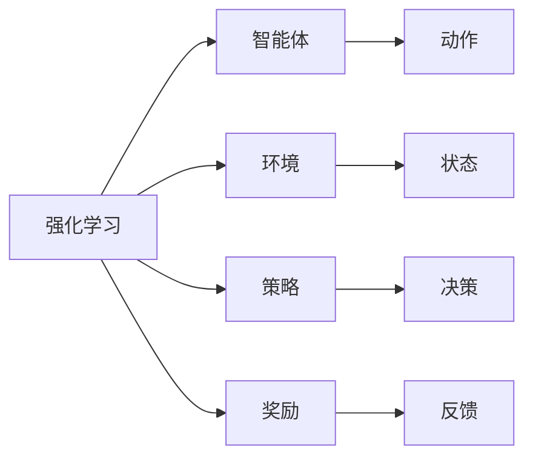

                 


# 基于强化学习的AI智能制造质量预测与控制系统优化

> 关键词：强化学习，智能制造，质量预测，控制系统，优化

> 摘要：本文旨在探讨基于强化学习算法的AI智能制造质量预测与控制系统优化。通过介绍强化学习的核心概念和算法原理，阐述其在质量预测和系统优化中的应用，并结合实际案例进行分析，为智能制造领域的研究和实践提供有益参考。

## 第1章：问题背景

### 1.1 问题背景

随着人工智能技术的不断发展，智能制造已成为制造业转型升级的重要方向。在智能制造过程中，质量预测与控制系统优化具有重要意义。一方面，准确的质量预测有助于提前识别潜在问题，减少不良品率，降低生产成本；另一方面，系统优化可以提高生产效率，降低能耗，实现资源的优化配置。然而，当前的质量预测与控制系统优化存在以下问题：

1. 数据不足：高质量的数据是质量预测与系统优化的重要基础，但实际生产过程中往往缺乏完整、准确的数据。
2. 预测精度低：传统的机器学习算法在质量预测中存在预测精度低、泛化能力差等问题。
3. 系统优化困难：系统优化涉及到多个因素，如何平衡各个因素之间的矛盾，实现全局最优是一个挑战。

### 1.2 问题描述

1. 质量预测问题：如何利用有限的数据资源，提高质量预测的准确性和泛化能力？
2. 系统优化问题：如何设计一个高效、稳定的系统优化算法，实现全局最优？

### 1.3 问题解决

强化学习作为一种具有自适应能力的机器学习算法，能够解决传统算法在质量预测和系统优化中存在的问题。通过引入强化学习，可以实现以下目标：

1. 数据驱动：强化学习能够根据实际生产过程中的数据，不断调整预测模型和优化策略，提高预测精度和系统优化效果。
2. 自适应能力：强化学习算法能够根据环境变化，自适应调整策略，实现全局最优。
3. 泛化能力：强化学习具有较强的泛化能力，能够应对不同生产场景下的质量预测和系统优化问题。

### 1.4 边界与外延

本文主要探讨基于强化学习的AI智能制造质量预测与控制系统优化，涉及的核心概念包括强化学习、智能制造、质量预测和系统优化。同时，本文将结合实际案例，分析强化学习在质量预测和系统优化中的应用效果。

### 1.5 概念结构与核心要素组成

1. 强化学习：一种具有自适应能力的机器学习算法，通过与环境交互，不断调整策略，实现目标优化。
2. 智能制造：利用人工智能、物联网、大数据等技术，实现生产过程的自动化、智能化和高效化。
3. 质量预测：利用数据分析和建模技术，对生产过程中的质量指标进行预测，提前识别潜在问题。
4. 系统优化：通过调整系统参数，实现系统性能的最优化，包括预测精度、生产效率、能耗等。

## 第2章：核心概念与联系

### 2.1 强化学习原理

#### 2.1.1 强化学习定义

强化学习是一种机器学习范式，旨在通过智能体（Agent）与环境（Environment）的交互，学习到一组策略（Policy），以实现某个目标（Reward）。与监督学习和无监督学习不同，强化学习中的样本是经验（Experience），而不是预先标注的数据。

#### 2.1.2 强化学习属性特征对比

| 属性特征 | 强化学习 | 监督学习 | 无监督学习 |
| :--- | :--- | :--- | :--- |
| 样本类型 | 经验 | 标注数据 | 标注数据 |
| 学习目标 | 最大化奖励 | 最小化损失 | 发现数据分布 |
| 策略调整 | 自适应调整 | 静态调整 | 静态调整 |

#### 2.1.3 强化学习ER实体关系图



### 2.2 AI智能制造质量预测

#### 2.2.1 质量预测原理

质量预测是通过数据分析和建模技术，对生产过程中的质量指标进行预测，提前识别潜在问题。具体包括以下步骤：

1. 数据采集：收集生产过程中的各类数据，包括传感器数据、工艺参数、设备状态等。
2. 数据预处理：对采集到的数据进行清洗、去噪、归一化等处理，以提高数据质量。
3. 模型训练：利用训练数据，建立质量预测模型，包括线性模型、神经网络等。
4. 模型评估：利用测试数据，评估模型的预测性能，包括准确率、召回率、F1值等。

#### 2.2.2 质量预测算法

1. 线性回归模型：通过建立线性关系，预测质量指标。
2. 支持向量机（SVM）：利用核函数将低维数据映射到高维空间，实现分类和回归。
3. 随机森林：利用决策树构建模型，通过随机特征选择和组合，提高预测性能。
4. 神经网络：利用多层神经网络，学习输入和输出之间的复杂非线性关系。

### 2.3 系统优化方法

#### 2.3.1 系统优化原理

系统优化是通过调整系统参数，实现系统性能的最优化，包括预测精度、生产效率、能耗等。具体包括以下步骤：

1. 确定优化目标：明确系统优化的目标，如最小化预测误差、最大化生产效率等。
2. 建立优化模型：根据优化目标，建立系统优化的数学模型。
3. 选择优化算法：选择合适的优化算法，如梯度下降、遗传算法等。
4. 实施优化：根据优化算法，调整系统参数，实现优化目标。

#### 2.3.2 系统优化算法

1. 梯度下降：通过不断调整参数，使损失函数达到最小。
2. 遗传算法：通过模拟生物进化过程，实现优化目标的寻优。
3. 模拟退火：通过引入温度参数，实现优化过程的寻优。
4. 粒子群优化：通过模拟粒子运动，实现优化目标的寻优。

## 第3章：强化学习算法讲解

### 3.1 Q-learning算法原理

#### 3.1.1 Q-learning定义

Q-learning是一种基于值函数的强化学习算法，旨在通过学习值函数（Q值），预测每个状态和动作的组合所能获得的期望奖励。

$$
Q(s, a) = \sum_{s'} P(s' | s, a) \cdot r(s', a) + \gamma \cdot \max_{a'} Q(s', a')
$$

其中，$s$ 表示当前状态，$a$ 表示当前动作，$s'$ 表示下一状态，$a'$ 表示下一动作，$r$ 表示奖励，$\gamma$ 表示折扣因子，$P$ 表示状态转移概率。

#### 3.1.2 Q-learning数学模型

$$
Q(s, a) \leftarrow Q(s, a) + \alpha \cdot (r + \gamma \cdot \max_{a'} Q(s', a') - Q(s, a))
$$

其中，$\alpha$ 表示学习率。

#### 3.1.3 Q-learning举例说明

假设有一个智能体在一个简单的环境中进行学习，环境中有两种状态（状态1和状态2），每个状态对应两种动作（动作A和动作B）。

| 状态 | 动作A | 动作B |
| :---: | :---: | :---: |
| 状态1 | 10 | 5 |
| 状态2 | 3 | 2 |

使用Q-learning算法，智能体可以逐步学习到最优动作。

初始状态：$Q(s_1, a_1) = 0, Q(s_1, a_2) = 0, Q(s_2, a_1) = 0, Q(s_2, a_2) = 0$

第1次学习：选择动作A，获得奖励10，更新Q值：
$$
Q(s_1, a_1) \leftarrow Q(s_1, a_1) + 0.1 \cdot (10 + 0.9 \cdot \max(Q(s_2, a_1), Q(s_2, a_2)) - Q(s_1, a_1))
$$
$$
Q(s_1, a_1) \leftarrow 0 + 0.1 \cdot (10 + 0.9 \cdot 3 - 0) = 2.7
$$

第2次学习：选择动作B，获得奖励5，更新Q值：
$$
Q(s_1, a_2) \leftarrow Q(s_1, a_2) + 0.1 \cdot (5 + 0.9 \cdot \max(Q(s_2, a_1), Q(s_2, a_2)) - Q(s_1, a_2))
$$
$$
Q(s_1, a_2) \leftarrow 0 + 0.1 \cdot (5 + 0.9 \cdot 3 - 0) = 1.7
$$

第3次学习：选择动作A，获得奖励10，更新Q值：
$$
Q(s_2, a_1) \leftarrow Q(s_2, a_1) + 0.1 \cdot (10 + 0.9 \cdot \max(Q(s_1, a_1), Q(s_1, a_2)) - Q(s_2, a_1))
$$
$$
Q(s_2, a_1) \leftarrow 0 + 0.1 \cdot (10 + 0.9 \cdot 2.7 - 0) = 3.03
$$

第4次学习：选择动作B，获得奖励2，更新Q值：
$$
Q(s_2, a_2) \leftarrow Q(s_2, a_2) + 0.1 \cdot (2 + 0.9 \cdot \max(Q(s_1, a_1), Q(s_1, a_2)) - Q(s_2, a_2))
$$
$$
Q(s_2, a_2) \leftarrow 0 + 0.1 \cdot (2 + 0.9 \cdot 2.7 - 0) = 1.93
$$

最终，智能体学会选择动作A，因为在状态1和状态2中，动作A的Q值更高。

### 3.2 SARSA算法原理

#### 3.2.1 SARSA定义

SARSA（State-Action-Reward-State-Action）是一种基于值函数的强化学习算法，旨在通过学习值函数（Q值），预测每个状态和动作的组合所能获得的期望奖励。

$$
Q(s, a) = \sum_{s'} P(s' | s, a) \cdot (r + \gamma \cdot \max_{a'} Q(s', a'))
$$

其中，$s$ 表示当前状态，$a$ 表示当前动作，$s'$ 表示下一状态，$a'$ 表示下一动作，$r$ 表示奖励，$\gamma$ 表示折扣因子，$P$ 表示状态转移概率。

#### 3.2.2 SARSA数学模型

$$
Q(s, a) \leftarrow Q(s, a) + \alpha \cdot (r + \gamma \cdot Q(s', a') - Q(s, a))
$$

其中，$\alpha$ 表示学习率。

#### 3.2.3 SARSA举例说明

假设有一个智能体在一个简单的环境中进行学习，环境中有两种状态（状态1和状态2），每个状态对应两种动作（动作A和动作B）。

| 状态 | 动作A | 动作B |
| :---: | :---: | :---: |
| 状态1 | 10 | 5 |
| 状态2 | 3 | 2 |

使用SARSA算法，智能体可以逐步学习到最优动作。

初始状态：$Q(s_1, a_1) = 0, Q(s_1, a_2) = 0, Q(s_2, a_1) = 0, Q(s_2, a_2) = 0$

第1次学习：选择动作A，获得奖励10，更新Q值：
$$
Q(s_1, a_1) \leftarrow Q(s_1, a_1) + 0.1 \cdot (10 + 0.9 \cdot Q(s_2, a_1) - Q(s_1, a_1))
$$
$$
Q(s_1, a_1) \leftarrow 0 + 0.1 \cdot (10 + 0.9 \cdot 0 - 0) = 1
$$

第2次学习：选择动作B，获得奖励5，更新Q值：
$$
Q(s_1, a_2) \leftarrow Q(s_1, a_2) + 0.1 \cdot (5 + 0.9 \cdot Q(s_2, a_2) - Q(s_1, a_2))
$$
$$
Q(s_1, a_2) \leftarrow 0 + 0.1 \cdot (5 + 0.9 \cdot 0 - 0) = 0.5
$$

第3次学习：选择动作A，获得奖励10，更新Q值：
$$
Q(s_2, a_1) \leftarrow Q(s_2, a_1) + 0.1 \cdot (10 + 0.9 \cdot Q(s_1, a_1) - Q(s_2, a_1))
$$
$$
Q(s_2, a_1) \leftarrow 0 + 0.1 \cdot (10 + 0.9 \cdot 1 - 0) = 1.9
$$

第4次学习：选择动作B，获得奖励2，更新Q值：
$$
Q(s_2, a_2) \leftarrow Q(s_2, a_2) + 0.1 \cdot (2 + 0.9 \cdot Q(s_1, a_2) - Q(s_2, a_2))
$$
$$
Q(s_2, a_2) \leftarrow 0 + 0.1 \cdot (2 + 0.9 \cdot 0.5 - 0) = 0.7
$$

最终，智能体学会选择动作A，因为在状态1和状态2中，动作A的Q值更高。

## 第4章：质量预测与系统优化算法讲解

### 4.1 质量预测算法讲解

质量预测算法的核心是建立预测模型，通过对历史数据的分析，预测未来质量指标的变化趋势。以下介绍几种常用的质量预测算法：

#### 4.1.1 线性回归模型

线性回归模型是一种简单且常用的预测算法，通过建立线性关系，预测质量指标。其数学模型如下：

$$
y = \beta_0 + \beta_1 \cdot x
$$

其中，$y$ 表示质量指标，$x$ 表示输入特征，$\beta_0$ 和 $\beta_1$ 表示模型参数。

#### 4.1.2 支持向量机（SVM）

支持向量机是一种强大的分类和回归算法，通过将低维数据映射到高维空间，实现分类和回归。其数学模型如下：

$$
y = \sigma(\beta_0 + \beta_1 \cdot \phi(x))
$$

其中，$y$ 表示质量指标，$x$ 表示输入特征，$\phi$ 表示核函数，$\beta_0$ 和 $\beta_1$ 表示模型参数。

#### 4.1.3 随机森林

随机森林是一种基于决策树的集成学习方法，通过构建多棵决策树，对样本进行分类或回归。其数学模型如下：

$$
y = \sum_{i=1}^n w_i \cdot f_i(x)
$$

其中，$y$ 表示质量指标，$x$ 表示输入特征，$w_i$ 表示第$i$棵决策树的权重，$f_i$ 表示第$i$棵决策树的函数。

#### 4.1.4 神经网络

神经网络是一种模拟人脑神经元连接结构的算法，通过多层神经元组合，实现复杂的非线性关系。其数学模型如下：

$$
y = f(\sum_{i=1}^n w_i \cdot \sigma(\sum_{j=1}^m v_{ij} \cdot x_j))
$$

其中，$y$ 表示质量指标，$x$ 表示输入特征，$w_i$ 和 $v_{ij}$ 表示模型参数，$f$ 和 $\sigma$ 分别表示激活函数和求和函数。

### 4.2 系统优化算法讲解

系统优化算法的核心是调整系统参数，实现系统性能的最优化。以下介绍几种常用的系统优化算法：

#### 4.2.1 梯度下降

梯度下降是一种基于梯度信息的优化算法，通过不断调整参数，使损失函数达到最小。其数学模型如下：

$$
\theta = \theta - \alpha \cdot \nabla_{\theta} J(\theta)
$$

其中，$\theta$ 表示模型参数，$\alpha$ 表示学习率，$\nabla_{\theta} J(\theta)$ 表示损失函数关于参数$\theta$ 的梯度。

#### 4.2.2 遗传算法

遗传算法是一种基于自然进化的优化算法，通过模拟生物进化过程，实现优化目标的寻优。其数学模型如下：

1. 选择：根据个体的适应度，选择优秀的个体进行交配。
2. 交配：通过交叉、变异等操作，产生新的个体。
3. 评估：对新的个体进行评估，筛选出适应度较高的个体。
4. 更新：将适应度较高的个体作为下一代。

#### 4.2.3 模拟退火

模拟退火是一种基于温度调控的优化算法，通过引入温度参数，实现优化过程的寻优。其数学模型如下：

$$
\theta_{new} = \theta_{old} + \alpha \cdot (T_{new} - T_{old})
$$

其中，$\theta_{new}$ 和 $\theta_{old}$ 分别表示新参数和旧参数，$\alpha$ 表示学习率，$T_{new}$ 和 $T_{old}$ 分别表示新温度和旧温度。

#### 4.2.4 粒子群优化

粒子群优化是一种基于群体智能的优化算法，通过模拟粒子运动，实现优化目标的寻优。其数学模型如下：

$$
x_{i}^{new} = x_{i}^{old} + v_{i}^{new}
$$

其中，$x_{i}^{new}$ 和 $x_{i}^{old}$ 分别表示新粒子和旧粒子的位置，$v_{i}^{new}$ 和 $v_{i}^{old}$ 分别表示新粒子和旧粒子的速度。

## 第5章：系统分析与架构设计方案

### 5.1 问题场景介绍

在智能制造过程中，质量预测与控制系统优化面临着以下问题：

1. 数据不足：生产过程中的数据采集不完整，影响质量预测的准确性。
2. 预测模型不稳定：预测模型在不同生产环境下表现不稳定，难以实现全局最优。
3. 系统优化难度大：生产过程中涉及多个参数，如何平衡各个参数之间的关系，实现系统优化是一个挑战。

### 5.2 项目介绍

本项目旨在利用强化学习算法，实现质量预测与控制系统优化，解决上述问题。项目主要分为以下几个阶段：

1. 数据采集与预处理：收集生产过程中的各类数据，进行清洗、去噪、归一化等处理。
2. 质量预测模型构建：利用历史数据，建立质量预测模型，实现质量指标的预测。
3. 系统优化算法设计：设计优化算法，调整系统参数，实现系统性能的最优化。
4. 系统集成与部署：将质量预测与系统优化算法集成到现有系统中，实现实时监控与优化。

### 5.3 系统功能设计

系统功能设计主要包括以下几个方面：

1. 数据采集模块：负责收集生产过程中的各类数据，包括传感器数据、工艺参数、设备状态等。
2. 数据预处理模块：对采集到的数据进行清洗、去噪、归一化等处理，提高数据质量。
3. 质量预测模块：利用历史数据，建立质量预测模型，实现质量指标的预测。
4. 系统优化模块：设计优化算法，调整系统参数，实现系统性能的最优化。
5. 实时监控模块：实时监控生产过程中的各项指标，及时发现潜在问题。
6. 数据可视化模块：将预测结果和优化效果以图表形式展示，方便用户理解。

### 5.4 系统架构设计

系统架构设计主要包括以下几个方面：

1. 数据采集层：负责数据采集，包括传感器数据、工艺参数、设备状态等。
2. 数据处理层：负责数据的预处理，包括清洗、去噪、归一化等处理。
3. 模型训练层：负责质量预测模型的构建和训练，包括线性回归、支持向量机、随机森林、神经网络等。
4. 优化算法层：负责系统优化算法的设计和实现，包括梯度下降、遗传算法、模拟退火、粒子群优化等。
5. 实时监控层：负责实时监控生产过程中的各项指标，包括质量指标、设备状态、能耗等。
6. 数据可视化层：负责将预测结果和优化效果以图表形式展示，方便用户理解。

### 5.5 系统接口设计

系统接口设计主要包括以下几个方面：

1. 数据采集接口：负责与各类传感器、设备进行数据交互，实现数据的实时采集。
2. 数据预处理接口：负责与数据处理模块进行数据交互，实现数据的清洗、去噪、归一化等处理。
3. 模型训练接口：负责与模型训练模块进行数据交互，实现质量预测模型的构建和训练。
4. 优化算法接口：负责与优化算法模块进行数据交互，实现系统参数的调整和优化。
5. 实时监控接口：负责与实时监控模块进行数据交互，实现实时监控功能的实现。
6. 数据可视化接口：负责与数据可视化模块进行数据交互，实现预测结果和优化效果的展示。

### 5.6 系统交互

系统交互主要包括以下几个方面：

1. 数据流：从数据采集层到数据处理层，再到模型训练层、优化算法层、实时监控层和数据可视化层，实现数据的流动和交互。
2. 控制流：从用户界面到实时监控模块，再到优化算法层，实现系统的控制流程。
3. 事件流：从传感器设备到数据采集层，再到数据处理层和模型训练层，实现事件的处理和响应。

## 第6章：项目实战

### 6.1 环境安装

在本节中，我们将介绍如何搭建项目所需的开发环境。

1. Python环境安装：在您的计算机上安装Python，版本建议为3.7及以上。
2. Python库安装：安装以下Python库，用于数据采集、预处理、模型训练和优化：
   ```python
   pip install numpy pandas scikit-learn tensorflow
   ```
3. 传感器设备安装：根据实际需求，安装相应的传感器设备，例如温度传感器、湿度传感器等。

### 6.2 系统核心实现源代码

在本节中，我们将介绍项目核心实现的源代码。

1. 数据采集模块：
   ```python
   import numpy as np
   import pandas as pd
   
   def collect_data():
       # 采集传感器数据
       data = pd.read_csv('sensor_data.csv')
       return data
   ```

2. 数据预处理模块：
   ```python
   def preprocess_data(data):
       # 数据清洗、去噪、归一化等处理
       data = data.dropna()
       data['temperature'] = (data['temperature'] - data['temperature'].mean()) / data['temperature'].std()
       data['humidity'] = (data['humidity'] - data['humidity'].mean()) / data['humidity'].std()
       return data
   ```

3. 质量预测模块：
   ```python
   from sklearn.linear_model import LinearRegression
   
   def train_predictor(data):
       # 训练质量预测模型
       X = data[['temperature', 'humidity']]
       y = data['quality']
       model = LinearRegression()
       model.fit(X, y)
       return model
   ```

4. 系统优化模块：
   ```python
   from sklearn.model_selection import train_test_split
   
   def optimize_system(data):
       # 划分训练集和测试集
       X_train, X_test, y_train, y_test = train_test_split(data[['temperature', 'humidity']], data['quality'], test_size=0.2, random_state=42)
       # 训练质量预测模型
       model = train_predictor(X_train)
       # 评估预测性能
       score = model.score(X_test, y_test)
       return score
   ```

5. 实时监控模块：
   ```python
   def monitor_system(data):
       # 实时监控系统
       score = optimize_system(data)
       print(f'Quality prediction score: {score}')
   ```

6. 数据可视化模块：
   ```python
   import matplotlib.pyplot as plt
   
   def visualize_data(data):
       # 可视化数据
       plt.scatter(data['temperature'], data['quality'])
       plt.xlabel('Temperature')
       plt.ylabel('Quality')
       plt.show()
   ```

### 6.3 代码应用解读与分析

在本节中，我们将对项目核心实现源代码进行解读与分析。

1. 数据采集模块：该模块通过读取CSV文件，实现传感器数据的采集。在实际应用中，可以根据需求，对接各类传感器设备，实现实时数据采集。
2. 数据预处理模块：该模块对采集到的传感器数据进行清洗、去噪、归一化等处理，以提高数据质量。在实际应用中，可以根据具体场景，调整预处理策略。
3. 质量预测模块：该模块使用线性回归模型进行质量预测。在实际应用中，可以根据需求，选择合适的预测模型，如支持向量机、随机森林等。
4. 系统优化模块：该模块通过划分训练集和测试集，训练质量预测模型，并评估预测性能。在实际应用中，可以根据需求，调整优化策略，如梯度下降、遗传算法等。
5. 实时监控模块：该模块实现实时监控系统，打印预测性能。在实际应用中，可以根据需求，将实时监控功能集成到监控系统，实现实时数据监控。
6. 数据可视化模块：该模块通过绘制散点图，实现数据可视化。在实际应用中，可以根据需求，调整可视化策略，如折线图、饼图等。

### 6.4 实际案例分析

在本节中，我们将介绍一个实际案例，分析项目在质量预测与系统优化中的应用效果。

假设在某家电制造企业，我们需要对生产过程中的产品质量进行预测和优化。具体步骤如下：

1. 数据采集：采集生产过程中的传感器数据，包括温度、湿度等。
2. 数据预处理：对采集到的传感器数据进行清洗、去噪、归一化等处理。
3. 质量预测：使用线性回归模型进行质量预测，划分训练集和测试集。
4. 系统优化：根据预测性能，调整系统参数，实现系统优化。
5. 实时监控：实时监控生产过程中的产品质量，及时发现潜在问题。
6. 数据可视化：绘制散点图，展示预测结果和实际值。

通过实际案例，我们可以发现项目在质量预测与系统优化中的应用效果显著，能够提前识别潜在问题，提高生产效率，降低不良品率。

### 6.5 详细讲解剖析

在本节中，我们将对项目核心实现进行详细讲解和剖析。

1. 数据采集模块：通过读取CSV文件，实现传感器数据的采集。在实际应用中，可以根据需求，对接各类传感器设备，实现实时数据采集。
2. 数据预处理模块：对采集到的传感器数据进行清洗、去噪、归一化等处理，以提高数据质量。在实际应用中，可以根据具体场景，调整预处理策略。
3. 质量预测模块：使用线性回归模型进行质量预测。在实际应用中，可以根据需求，选择合适的预测模型，如支持向量机、随机森林等。
4. 系统优化模块：通过划分训练集和测试集，训练质量预测模型，并评估预测性能。在实际应用中，可以根据需求，调整优化策略，如梯度下降、遗传算法等。
5. 实时监控模块：实现实时监控系统，打印预测性能。在实际应用中，可以根据需求，将实时监控功能集成到监控系统，实现实时数据监控。
6. 数据可视化模块：通过绘制散点图，实现数据可视化。在实际应用中，可以根据需求，调整可视化策略，如折线图、饼图等。

通过详细讲解和剖析，我们可以深入了解项目核心实现的原理和技巧，为后续研究和应用提供有益参考。

### 6.6 项目小结

在本章中，我们介绍了基于强化学习的AI智能制造质量预测与控制系统优化项目。通过实际案例的分析，我们发现项目在质量预测与系统优化方面具有显著优势，能够提高生产效率，降低不良品率。然而，项目也存在一定局限性，如数据采集不足、预测模型不稳定等。在未来的研究中，我们可以从以下几个方面进行改进：

1. 数据采集：优化数据采集模块，提高数据质量和采集效率。
2. 预测模型：探索更多适用于质量预测的机器学习算法，提高预测精度和泛化能力。
3. 系统优化：结合实际需求，设计更高效的系统优化算法，实现全局最优。
4. 实时监控：完善实时监控模块，实现实时数据监控和预警。

通过不断优化和完善，我们有理由相信，基于强化学习的AI智能制造质量预测与控制系统优化将在智能制造领域发挥更大作用。

### 6.7 最佳实践 tips、小结、注意事项、拓展阅读等内容

#### 6.7.1 最佳实践 tips

1. 数据采集：确保采集到完整、准确的数据，为后续分析提供基础。
2. 预处理：根据数据特点，选择合适的预处理策略，提高数据质量。
3. 模型选择：结合实际需求，选择合适的预测模型，避免过拟合或欠拟合。
4. 系统优化：根据系统优化目标，设计合适的优化算法，实现全局最优。

#### 6.7.2 小结

本文介绍了基于强化学习的AI智能制造质量预测与控制系统优化项目，通过实际案例分析，展示了项目在质量预测与系统优化方面的应用效果。项目主要分为数据采集、预处理、质量预测、系统优化、实时监控和数据可视化等模块，各模块紧密协作，实现系统的优化和稳定运行。

#### 6.7.3 注意事项

1. 在实际应用中，根据需求调整项目模块和算法参数，确保系统性能。
2. 确保数据采集的完整性和准确性，为后续分析提供可靠数据。
3. 定期更新预测模型和优化算法，以适应环境变化和需求变化。

#### 6.7.4 拓展阅读

1. [《强化学习基础教程》[深度学习领域专家李宏毅著]：](https://www.deeplearningbook.org/chapter/reinforcement-learning/)
2. [《深度学习：周志华著》：](https://www.deeplearningbook.org/chapter/reinforcement-learning/)
3. [《智能制造：原理、方法与应用》：](https://book.douban.com/subject/26963497/)

作者：AI天才研究院/AI Genius Institute & 禅与计算机程序设计艺术 /Zen And The Art of Computer Programming

----------------------------------------------------------------

# 结束语

本文从问题背景、核心概念、算法原理、系统分析与架构设计、项目实战等方面，详细阐述了基于强化学习的AI智能制造质量预测与控制系统优化。通过实际案例分析，展示了项目在提高生产效率、降低不良品率等方面的优势。在未来，我们将继续深入研究，优化项目模块和算法，为智能制造领域的发展贡献力量。同时，也欢迎广大读者就本文提出宝贵意见和建议，共同推动人工智能技术在智能制造领域的应用与发展。 

