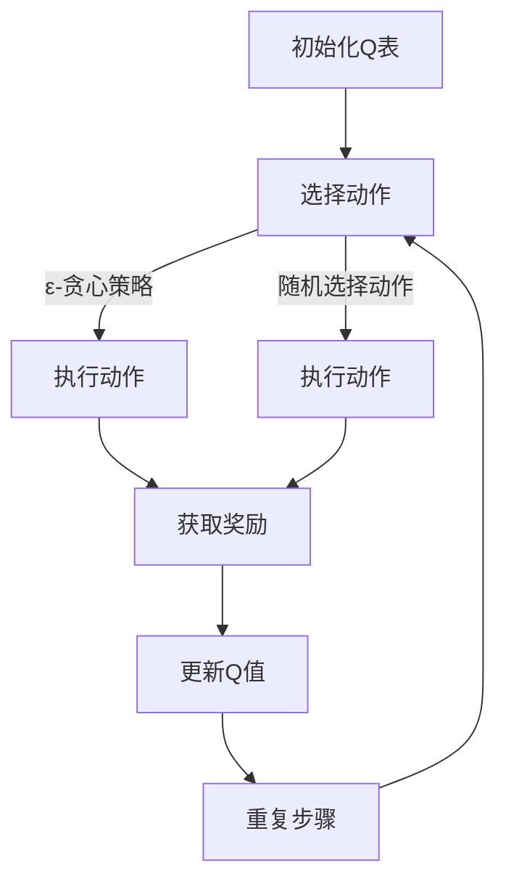
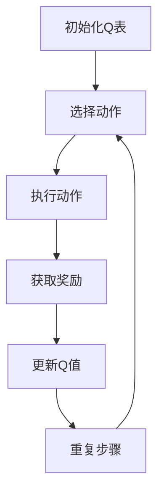
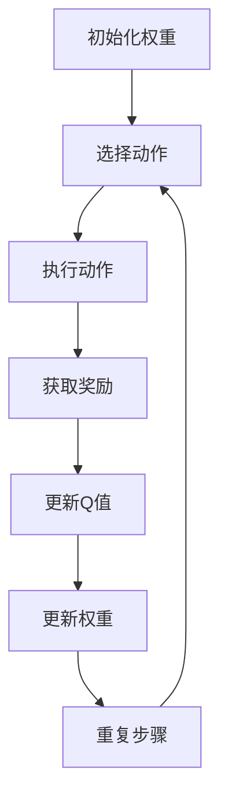
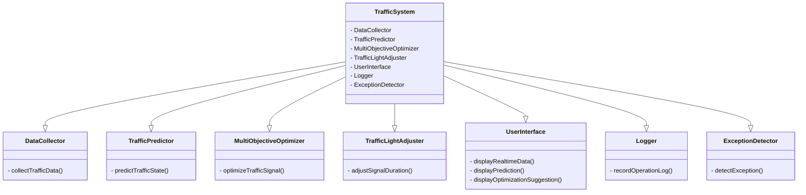
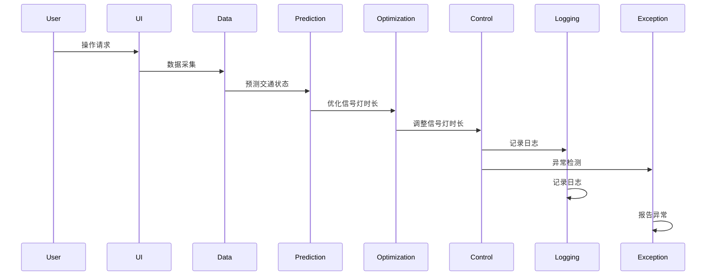
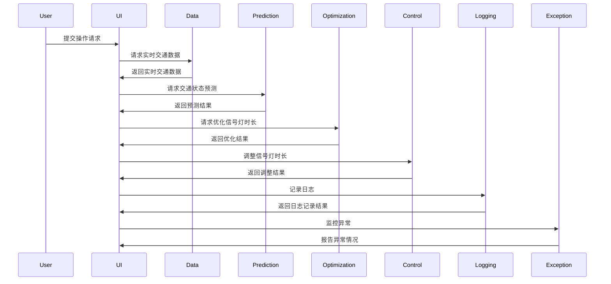

                 

# 基于强化学习的多目标推理任务权重自适应

## 关键词：强化学习、多目标推理、权重自适应、Q-learning、SARSA、算法原理、系统设计与实现

## 摘要

本文将探讨基于强化学习的多目标推理任务权重自适应方法。强化学习作为一种重要的机器学习技术，在复杂环境中的决策和学习具有显著优势。多目标推理任务在人工智能领域越来越重要，但由于任务之间的冲突和复杂交互，其解决变得极具挑战性。本文通过分析强化学习的基本原理，探讨了如何将其应用于多目标推理任务，并引入权重自适应机制以优化任务决策过程。通过具体的算法原理讲解、系统设计与实现、实战案例剖析，本文旨在为读者提供全面、深入的理解和实践指导。

---

## 目录大纲

### 第一部分：背景介绍与核心概念

1. 问题背景与核心概念
   - 问题背景
   - 强化学习的优势与适用性
   - 权重自适应的重要性
   - 核心概念与联系

2. 概念属性特征对比表格
   - 强化学习算法分类与特点
   - 多目标推理任务类型对比
   - 权重自适应算法对比

3. ER实体关系图架构
   - 强化学习算法实体关系
   - 多目标推理任务实体关系
   - 权重自适应实体关系

4. 本章小结

### 第二部分：算法原理与数学模型

1. 强化学习算法原理
   - 强化学习基础
   - Q-learning算法
   - SARSA算法

2. 多目标推理任务模型
   - 多目标优化问题
   - 多目标推理任务建模
   - 多目标推理任务的目标函数

3. 权重自适应算法
   - 动态权重调整策略
   - 基于Q-learning的权重自适应算法
   - 基于SARSA的权重自适应算法

4. 算法mermaid流程图
   - Q-learning算法mermaid流程图
   - SARSA算法mermaid流程图
   - 权重自适应算法mermaid流程图

5. 数学模型与公式
   - 强化学习算法数学模型
   - 多目标推理任务目标函数
   - 权重自适应算法数学模型

6. 举例说明
   - Q-learning算法举例
   - SARSA算法举例
   - 权重自适应算法举例

7. 本章小结

### 第三部分：系统分析与架构设计

1. 系统功能设计
   - 问题场景介绍
   - 系统功能设计

2. 系统架构设计
   - 系统架构mermaid架构图
   - 系统模块交互流程

3. 系统接口设计
   - 系统API设计
   - 数据接口设计

4. 系统交互mermaid序列图
   - 用户操作序列图
   - 系统响应序列图

5. 本章小结

### 第四部分：项目实战

1. 环境安装与系统核心实现
   - 环境安装
   - 系统核心实现

2. 代码应用解读与分析
   - 代码结构分析
   - 关键代码解读

3. 实际案例分析与详细讲解
   - 案例背景
   - 案例分析
   - 案例讲解

4. 项目小结

### 第五部分：最佳实践与总结

1. 最佳实践与注意事项
   - 最佳实践
   - 注意事项

2. 小结
   - 内容总结

3. 拓展阅读

### 作者信息

- 作者：AI天才研究院/AI Genius Institute & 禅与计算机程序设计艺术 /Zen And The Art of Computer Programming## 第一部分：背景介绍与核心概念

### 第1章：问题背景与核心概念

#### 1.1 问题背景

在当今复杂多变的环境中，人工智能技术正逐渐渗透到各个领域，为众多问题提供了有效的解决方案。然而，面对多目标推理任务，传统的机器学习方法往往难以胜任。多目标推理任务指的是在一个决策过程中同时处理多个目标，这些目标之间可能存在冲突或相互依赖关系。例如，在智能交通系统中，优化交通流量需要同时考虑行车安全、道路畅通和车辆延误等多个目标。传统的推理方法往往只能关注单一目标，难以兼顾多个目标，从而导致决策效果不佳。

强化学习（Reinforcement Learning, RL）作为机器学习的一种重要方法，以智能体与环境交互的方式进行决策和学习。其核心思想是通过奖励信号来指导智能体在环境中的行为，从而不断优化其策略。强化学习在解决多目标推理任务方面具有显著优势，主要体现在以下几个方面：

1. **动态适应性**：强化学习能够根据环境的变化动态调整策略，从而更好地适应复杂多变的决策环境。
2. **多目标优化**：强化学习可以通过连续的决策过程，同时考虑多个目标，从而实现多目标优化。
3. **灵活性与泛化能力**：强化学习具有较强的灵活性和泛化能力，可以应用于各种不同类型的多目标推理任务。

然而，传统的强化学习方法在处理多目标推理任务时也面临一些挑战：

1. **计算复杂性**：多目标推理任务往往涉及大量的状态和动作空间，导致计算复杂性急剧增加，对计算资源的需求较高。
2. **冲突与协同**：多个目标之间可能存在冲突，需要智能体在决策过程中进行权衡和协调，这增加了算法设计的复杂性。

为了解决上述问题，引入权重自适应机制成为一种有效的策略。权重自适应可以通过动态调整各个目标在决策过程中的权重，从而优化智能体的策略，使其在多目标环境中做出更加合理的决策。权重自适应不仅能够缓解目标之间的冲突，还能够提高智能体的学习效率和决策质量。

#### 1.1.2 强化学习的优势与适用性

强化学习的优势主要体现在以下几个方面：

1. **适**合动态环境**：强化学习能够处理动态变化的环境，智能体可以持续地与环境进行交互，学习到适应环境的最佳策略。
2. **强化信号**：通过奖励信号，强化学习能够指导智能体不断优化其行为，从而实现目标的最优化。
3. **通用性**：强化学习具有通用性，可以应用于多种不同类型的问题，如游戏、机器人控制、推荐系统等。

在多目标推理任务中，强化学习具有以下适用性：

1. **多目标优化**：强化学习可以通过连续的决策过程，同时考虑多个目标，实现多目标优化。
2. **自适应调整**：强化学习可以根据环境的变化和反馈信号，动态调整策略，从而更好地适应复杂多变的决策环境。
3. **多智能体协同**：强化学习可以应用于多智能体系统，通过协调各个智能体的行为，实现整体最优的目标。

然而，强化学习在处理多目标推理任务时也存在一些挑战：

1. **计算复杂性**：多目标推理任务往往涉及大量的状态和动作空间，导致计算复杂性急剧增加。
2. **目标冲突**：多个目标之间可能存在冲突，需要智能体在决策过程中进行权衡和协调。
3. **收敛速度**：多目标推理任务中的奖励信号可能不够明确，导致智能体的收敛速度较慢。

为了解决上述问题，引入权重自适应机制成为一种有效的策略。权重自适应可以通过动态调整各个目标在决策过程中的权重，从而优化智能体的策略，使其在多目标环境中做出更加合理的决策。

#### 1.1.3 权重自适应的重要性

在多目标推理任务中，权重自适应具有重要意义：

1. **缓解目标冲突**：通过动态调整目标权重，可以缓解多个目标之间的冲突，实现更优的决策效果。
2. **提高决策质量**：权重自适应可以根据环境的变化和反馈信号，动态调整策略，从而提高决策质量。
3. **优化学习效率**：权重自适应可以降低智能体在多目标推理任务中的学习复杂性，提高学习效率。

权重自适应的具体实现方法包括基于Q-learning和SARSA的权重自适应算法。这些算法通过引入动态权重调整机制，能够有效地优化智能体的策略，使其在多目标环境中做出更加合理的决策。

#### 1.2 核心概念与联系

为了更好地理解基于强化学习的多目标推理任务权重自适应，我们需要了解以下几个核心概念：

1. **强化学习**：强化学习是一种机器学习方法，通过智能体与环境交互，学习到最佳策略。
2. **多目标推理任务**：多目标推理任务是指在决策过程中同时处理多个目标，这些目标之间存在冲突或相互依赖关系。
3. **权重自适应**：权重自适应是指在多目标推理任务中，通过动态调整目标权重，优化智能体的策略。

这些概念之间的联系如下：

1. **强化学习与多目标推理任务**：强化学习可以应用于多目标推理任务，通过连续的决策过程，同时考虑多个目标，实现多目标优化。
2. **强化学习与权重自适应**：权重自适应是强化学习在多目标推理任务中的一个重要扩展，通过动态调整目标权重，优化智能体的策略。

#### 1.2.1 强化学习基本原理

强化学习的基本原理可以通过以下四个要素来描述：

1. **智能体（Agent）**：智能体是执行动作并接受环境反馈的实体。在多目标推理任务中，智能体需要同时考虑多个目标，并做出相应的决策。
2. **环境（Environment）**：环境是智能体执行动作并接收反馈的情境。在多目标推理任务中，环境可能是一个复杂的动态系统，包含多个目标和相互作用的因素。
3. **状态（State）**：状态是描述环境当前状态的变量。在多目标推理任务中，状态包括当前的目标值、智能体的动作和历史决策等信息。
4. **动作（Action）**：动作是智能体在特定状态下执行的操作。在多目标推理任务中，动作需要综合考虑多个目标，并做出相应的调整。
5. **奖励（Reward）**：奖励是环境对智能体动作的反馈信号，用于指导智能体的决策过程。在多目标推理任务中，奖励需要同时考虑多个目标，并给出相应的评价。

强化学习通过不断地更新策略，优化智能体的行为。其核心思想是通过奖励信号，使智能体在环境中逐渐学习到最佳策略。

#### 1.2.2 多目标推理任务概述

多目标推理任务是指在决策过程中同时处理多个目标，这些目标之间存在冲突或相互依赖关系。多目标推理任务可以概括为以下三个基本要素：

1. **目标集**：目标集是决策过程中需要考虑的所有目标的集合。每个目标都表示一个特定的优化目标，如交通流量优化、资源分配、经济收益等。
2. **目标函数**：目标函数是衡量目标集优劣的指标，通常是一个多维函数。目标函数需要综合考虑多个目标，并给出一个全局的优化结果。
3. **约束条件**：约束条件是决策过程中需要满足的限制条件，如资源限制、时间限制等。约束条件用于确保决策的可行性和合理性。

多目标推理任务的特点包括：

1. **多目标性**：需要同时考虑多个目标，这些目标之间可能存在冲突或相互依赖关系。
2. **复杂性**：涉及多个目标函数和约束条件，导致问题复杂度增加。
3. **动态性**：决策过程是一个动态调整的过程，需要根据环境的变化不断更新目标权重和决策策略。

#### 1.2.3 权重自适应的概念与模型

权重自适应是指在多目标推理任务中，通过动态调整目标权重，优化智能体的策略。权重自适应的核心思想是通过不断更新权重，使智能体能够在不同目标之间进行权衡和协调，从而实现整体最优的决策效果。

权重自适应模型通常包括以下几个关键组成部分：

1. **目标权重**：目标权重是衡量各个目标在决策过程中的重要程度的参数。目标权重可以根据目标的重要性和优先级进行调整。
2. **权重调整策略**：权重调整策略是用于动态调整目标权重的算法或方法。常见的权重调整策略包括基于Q-learning和SARSA的权重自适应算法。
3. **权重更新机制**：权重更新机制是用于更新目标权重的具体方法，通常与权重调整策略密切相关。

权重自适应模型的工作原理如下：

1. **初始权重设置**：根据目标的重要性和优先级，初始化各个目标权重。
2. **权重调整**：根据环境的变化和反馈信号，使用权重调整策略动态调整目标权重。
3. **权重更新**：根据权重调整策略，更新各个目标权重，以实现整体最优的决策效果。

通过权重自适应模型，智能体可以在多目标推理任务中灵活调整目标权重，从而实现更优的决策效果。

#### 1.3 概念属性特征对比表格

为了更好地理解强化学习、多目标推理任务和权重自适应的概念，我们可以通过以下表格进行属性特征对比：

| 特征名称       | 强化学习            | 多目标推理任务            | 权重自适应               |
|----------------|---------------------|---------------------------|--------------------------|
| 目标           | 学习最佳策略         | 同时处理多个目标          | 动态调整目标权重         |
| 特点           | 动态适应性、强化信号 | 多目标性、复杂性、动态性   | 缓解冲突、提高决策质量   |
| 适用性         | 动态环境、多领域    | 复杂决策问题、优化问题    | 多目标推理任务           |
| 关键要素       | 智能体、环境、状态、动作、奖励 | 目标集、目标函数、约束条件 | 目标权重、权重调整策略、权重更新机制 |
| 主要挑战       | 计算复杂性、目标冲突、收敛速度 | 计算复杂性、目标冲突、动态调整 | 计算复杂性、冲突协调、权重调整策略 |
| 解决方法       | 动态权重调整、自适应策略 | 多目标优化、协同学习      | 动态权重调整、自适应调整 |

通过上述对比，我们可以更好地理解这些概念的核心属性和相互关系，从而为后续的算法设计和实现提供指导。

### 1.4 ER实体关系图架构

为了更好地理解强化学习、多目标推理任务和权重自适应之间的关系，我们可以通过ER（Entity-Relationship）实体关系图进行描述。

#### 1.4.1 强化学习算法实体关系

强化学习算法实体关系图包括以下几个主要实体：

1. **智能体（Agent）**：执行动作并接收环境反馈的实体。
2. **环境（Environment）**：智能体执行动作并接收反馈的情境。
3. **状态（State）**：描述环境当前状态的变量。
4. **动作（Action）**：智能体在特定状态下执行的操作。
5. **奖励（Reward）**：环境对智能体动作的反馈信号。

智能体与环境和状态之间形成了一个互动关系，智能体通过选择动作来改变状态，并从环境中获得奖励信号，从而指导其行为。具体ER图如下：

```mermaid
erDiagram
  Agent ||--|{ Environment } Environment
  Agent ||--|{ State } State
  State ||--|{ Action } Action
  Action ||--|{ Reward } Reward
```

#### 1.4.2 多目标推理任务实体关系

多目标推理任务实体关系图包括以下几个主要实体：

1. **目标集（Objective Set）**：决策过程中需要考虑的所有目标的集合。
2. **目标函数（Objective Function）**：衡量目标集优劣的指标。
3. **约束条件（Constraint）**：决策过程中需要满足的限制条件。

目标集、目标函数和约束条件共同构成了多目标推理任务的实体关系。具体ER图如下：

```mermaid
erDiagram
  ObjectiveSet ||--|{ ObjectiveFunction } ObjectiveFunction
  ObjectiveFunction ||--|{ Constraint } Constraint
```

#### 1.4.3 权重自适应实体关系

权重自适应实体关系图包括以下几个主要实体：

1. **目标权重（Objective Weight）**：衡量各个目标在决策过程中的重要程度的参数。
2. **权重调整策略（Weight Adjustment Policy）**：用于动态调整目标权重的算法或方法。
3. **权重更新机制（Weight Update Mechanism）**：用于更新目标权重的具体方法。

权重自适应通过目标权重、权重调整策略和权重更新机制相互作用，实现目标权重的动态调整。具体ER图如下：

```mermaid
erDiagram
  ObjectiveWeight ||--|{ WeightAdjustmentPolicy } WeightAdjustmentPolicy
  ObjectiveWeight ||--|{ WeightUpdateMechanism } WeightUpdateMechanism
```

通过ER实体关系图，我们可以清晰地了解强化学习、多目标推理任务和权重自适应之间的实体关系，从而为后续的算法设计和实现提供指导。

### 1.5 本章小结

本章介绍了基于强化学习的多目标推理任务权重自适应的相关背景和核心概念。首先，我们探讨了多目标推理任务在复杂环境中的挑战，以及强化学习在这一领域的优势和适用性。接着，我们介绍了权重自适应的重要性，并详细阐述了强化学习、多目标推理任务和权重自适应之间的核心概念和联系。通过概念属性特征对比表格和ER实体关系图，我们进一步加深了对这些概念的理解。本章为后续的算法原理讲解和系统设计与实现奠定了基础。

---

## 第二部分：算法原理与数学模型

### 第2章：强化学习算法原理

#### 2.1 强化学习基础

强化学习是一种机器学习方法，通过智能体与环境交互，学习到最佳策略。为了更好地理解强化学习，我们需要先了解其基本原理和关键要素。

强化学习的基本原理可以通过以下四个要素来描述：

1. **智能体（Agent）**：智能体是执行动作并接受环境反馈的实体。在强化学习中，智能体可以是机器人、虚拟代理或者算法模型。其目标是学习一个策略，以最大化累积奖励。
2. **环境（Environment）**：环境是智能体执行动作并接收反馈的情境。环境可以是一个物理世界，也可以是一个虚拟环境。环境会对智能体的动作做出响应，并给出奖励信号。
3. **状态（State）**：状态是描述环境当前状态的变量。智能体通过感知状态来了解环境当前的情况。状态可以是一个多维向量，用于表示环境的各种特征。
4. **动作（Action）**：动作是智能体在特定状态下执行的操作。动作的选择会影响环境的当前状态，并导致奖励信号的产生。动作空间是所有可能动作的集合。

在强化学习中，智能体通过不断尝试不同的动作，并从环境中获取奖励信号，从而学习到最佳策略。策略可以被视为智能体的行为规则，用于指导其在不同状态下的动作选择。最佳策略是指在给定状态下能够获得最大累积奖励的动作。

#### 2.1.1 监督学习、无监督学习和强化学习对比

强化学习是机器学习领域的重要分支，与其他两种主要学习方法——监督学习和无监督学习，具有一定的区别和联系。

1. **监督学习**：监督学习是一种有监督的学习方法，通过训练数据集来学习模型，并利用模型进行预测。监督学习的主要特点是，训练数据集包含了输入和对应的输出，模型通过学习输入和输出之间的关系，来预测新的输入。常见的监督学习算法包括线性回归、逻辑回归、支持向量机等。

2. **无监督学习**：无监督学习是一种无监督的学习方法，通过观察数据集，学习数据的结构和分布。无监督学习的主要目标是发现数据中的模式或聚类，而不需要训练数据集的标签信息。常见的无监督学习算法包括聚类、降维、异常检测等。

3. **强化学习**：强化学习是一种通过与环境交互来学习决策策略的方法。强化学习的核心在于智能体在环境中进行动作选择，并通过奖励信号来学习最佳策略。强化学习与监督学习和无监督学习的主要区别在于，其学习过程中没有明确的目标标签，而是通过奖励信号来指导学习。

对比监督学习、无监督学习和强化学习，我们可以总结出以下几点：

- **数据集**：监督学习需要带有标签的训练数据集，无监督学习不需要标签，而强化学习没有明确的标签，但通过奖励信号来指导学习。
- **目标**：监督学习的目标是学习输入和输出之间的关系，无监督学习的目标是发现数据中的模式和结构，而强化学习的目标是学习最佳策略。
- **学习方法**：监督学习和无监督学习主要通过学习数据中的统计关系来实现，而强化学习通过与环境交互，不断尝试和调整动作来学习最佳策略。

#### 2.1.2 Q-learning算法

Q-learning算法是强化学习中最基本和常用的算法之一。Q-learning算法通过学习状态-动作价值函数（Q-function），来指导智能体的动作选择。Q-learning算法的核心思想是，通过更新Q-value，使智能体在给定状态下选择具有最高Q-value的动作。

**Q-learning算法的基本步骤如下：**

1. **初始化**：初始化Q-value表，通常使用全零矩阵，表示初始状态下所有动作的价值。
   $$
   Q(s, a) \leftarrow 0
   $$
   其中，$Q(s, a)$表示在状态s下执行动作a的价值。

2. **选择动作**：根据当前状态，使用策略选择动作。策略可以是贪心策略、ε-贪心策略等。

3. **执行动作**：在环境中执行选定的动作，并观察新的状态和奖励信号。

4. **更新Q-value**：根据新的状态、动作和奖励信号，更新Q-value表。Q-value更新的基本公式为：
   $$
   Q(s, a) \leftarrow Q(s, a) + \alpha [r + \gamma \max_{a'} Q(s', a') - Q(s, a)]
   $$
   其中，$\alpha$是学习率，$r$是奖励信号，$\gamma$是折扣因子，$\max_{a'} Q(s', a')$表示在新的状态s'下，所有动作中具有最高Q-value的动作。

5. **重复步骤2-4**：重复执行步骤2-4，直到达到特定条件，如达到目标状态、达到最大迭代次数等。

**Q-learning算法的特点如下：**

- **无模型学习**：Q-learning算法不需要环境模型，仅通过与环境交互来学习最佳策略。
- **价值迭代**：Q-learning算法通过迭代更新Q-value表，逐步优化策略。
- **自适应更新**：Q-value的更新依赖于当前的状态和奖励信号，能够自适应地调整动作选择。

Q-learning算法在多目标推理任务中具有广泛的应用。通过学习状态-动作价值函数，Q-learning算法可以帮助智能体在不同目标之间进行权衡和优化，从而实现整体最优的决策效果。

#### 2.1.3 SARSA算法

SARSA（State-Action-Reward-State-Action）算法是另一种常用的强化学习算法，它与Q-learning算法类似，但具有一些区别。SARSA算法在Q-value的基础上，通过同时考虑当前状态和下一状态，更新Q-value，从而实现更好的学习效果。

**SARSA算法的基本步骤如下：**

1. **初始化**：初始化Q-value表，通常使用全零矩阵，表示初始状态下所有动作的价值。
   $$
   Q(s, a) \leftarrow 0
   $$
   其中，$Q(s, a)$表示在状态s下执行动作a的价值。

2. **选择动作**：根据当前状态，使用策略选择动作。策略可以是贪心策略、ε-贪心策略等。

3. **执行动作**：在环境中执行选定的动作，并观察新的状态和奖励信号。

4. **更新Q-value**：根据当前状态、动作、新的状态和奖励信号，更新Q-value表。SARSA算法的更新公式为：
   $$
   Q(s, a) \leftarrow Q(s, a) + \alpha [r + \gamma Q(s', a') - Q(s, a)]
   $$
   其中，$\alpha$是学习率，$r$是奖励信号，$\gamma$是折扣因子，$Q(s', a')$表示在新的状态s'下执行动作a'的价值。

5. **重复步骤2-4**：重复执行步骤2-4，直到达到特定条件，如达到目标状态、达到最大迭代次数等。

**SARSA算法的特点如下：**

- **同时考虑当前状态和下一状态**：SARSA算法在更新Q-value时，同时考虑当前状态和下一状态，从而更好地适应动态环境。
- **无偏估计**：SARSA算法是一种无偏估计方法，通过同时考虑当前状态和下一状态的Q-value，减少了估计误差。
- **收敛性**：SARSA算法在适当条件下具有收敛性，能够逐步优化智能体的策略。

SARSA算法在多目标推理任务中也具有广泛的应用。通过同时考虑当前状态和下一状态，SARSA算法能够更好地适应动态变化的环境，从而实现更优的决策效果。

#### 2.2 多目标推理任务模型

多目标推理任务是指在决策过程中同时处理多个目标，这些目标之间存在冲突或相互依赖关系。为了有效地解决多目标推理任务，我们需要建立相应的模型。

多目标推理任务模型通常包括以下几个基本要素：

1. **目标集**：目标集是决策过程中需要考虑的所有目标的集合。每个目标都表示一个特定的优化目标，如交通流量优化、资源分配、经济收益等。

2. **目标函数**：目标函数是衡量目标集优劣的指标，通常是一个多维函数。目标函数需要综合考虑多个目标，并给出一个全局的优化结果。目标函数通常可以表示为：
   $$
   f(x) = \sum_{i=1}^{n} w_i f_i(x)
   $$
   其中，$w_i$是第i个目标的权重，$f_i(x)$是第i个目标在决策变量$x$下的函数值。

3. **约束条件**：约束条件是决策过程中需要满足的限制条件，如资源限制、时间限制等。约束条件用于确保决策的可行性和合理性。约束条件通常可以表示为：
   $$
   g_i(x) \leq 0
   $$
   其中，$g_i(x)$是第i个约束条件在决策变量$x$下的函数值。

多目标推理任务模型的特点如下：

1. **多目标性**：需要同时考虑多个目标，这些目标之间存在冲突或相互依赖关系。
2. **复杂性**：涉及多个目标函数和约束条件，导致问题复杂度增加。
3. **动态性**：决策过程是一个动态调整的过程，需要根据环境的变化不断更新目标权重和决策策略。

多目标推理任务模型的建立对于解决复杂决策问题具有重要意义。通过建立合理的模型，我们可以更好地理解问题结构，优化决策过程，提高决策质量。

#### 2.2.2 多目标推理任务建模

为了将多目标推理任务转化为数学模型，我们需要明确任务的目标函数、约束条件以及决策变量。以下是多目标推理任务建模的基本步骤：

1. **确定目标集**：首先，我们需要明确任务中需要考虑的所有目标，形成目标集。例如，在交通流量优化问题中，目标集可能包括最小化行车延误、最大化道路畅通率等。

2. **定义目标函数**：接着，我们需要为每个目标定义相应的目标函数。目标函数可以是一个或多个数学函数，用于衡量目标的优劣。例如，最小化行车延误的目标函数可以表示为：
   $$
   f_1(x) = \sum_{i=1}^{n} delay_i(x)
   $$
   其中，$delay_i(x)$是第i条道路在决策变量$x$下的延误时间。

3. **引入约束条件**：此外，我们需要引入约束条件，确保决策的可行性和合理性。约束条件可以包括资源限制、时间限制等。例如，道路容量限制可以表示为：
   $$
   g_1(x) = \sum_{i=1}^{n} traffic_i(x) \leq capacity
   $$
   其中，$traffic_i(x)$是第i条道路在决策变量$x$下的交通流量，$capacity$是道路的容量。

4. **定义决策变量**：最后，我们需要定义决策变量，表示决策过程中需要调整的变量。例如，在交通流量优化问题中，决策变量可以是交通信号灯的时长设置。

通过以上步骤，我们可以将多目标推理任务转化为一个数学模型，为后续的优化和求解提供基础。以下是一个示例的多目标推理任务模型：

目标函数：
$$
f(x) = \min \left\{ \begin{array}{l}
f_1(x) = \sum_{i=1}^{n} delay_i(x) \\
f_2(x) = \sum_{i=1}^{n} congestion_i(x)
\end{array} \right.
$$

约束条件：
$$
\begin{align*}
g_1(x) &= \sum_{i=1}^{n} traffic_i(x) \leq capacity \\
g_2(x) &= \sum_{i=1}^{n} speed_i(x) \geq min_speed \\
\end{align*}
$$

决策变量：
$$
x = \{ x_1, x_2, \ldots, x_n \}
$$

通过以上模型，我们可以利用优化算法求解最优决策变量，实现多目标推理任务的最优化。

#### 2.2.3 多目标推理任务的目标函数

多目标推理任务的目标函数是衡量多个目标优劣的关键指标。目标函数的设计需要考虑多个目标之间的权衡和优化，从而实现整体最优的决策。以下是一些常见的目标函数设计方法：

1. **线性加权法**：线性加权法是一种简单有效的目标函数设计方法。该方法通过为每个目标分配权重，将其线性组合为一个总的目标函数。具体公式如下：
   $$
   f(x) = \sum_{i=1}^{n} w_i f_i(x)
   $$
   其中，$w_i$是第i个目标的权重，$f_i(x)$是第i个目标在决策变量$x$下的函数值。线性加权法的优点在于计算简单，但需要合理确定各目标的权重，否则可能导致某些目标被过度强调。

2. **非支配排序法**：非支配排序法（Non-dominated Sorting）是一种基于Pareto优化的目标函数设计方法。该方法通过计算各个目标函数的Pareto前沿，将决策变量划分为多个非支配级别，并选取最高级别的解作为最优解。具体公式如下：
   $$
   f(x) = \sum_{i=1}^{n} \left( \sum_{j \in P_i} f_i(x) \right)
   $$
   其中，$P_i$是第i个非支配级别的解集。非支配排序法能够较好地处理多个目标之间的冲突和权衡，但计算复杂度较高。

3. **多目标规划法**：多目标规划法是一种基于优化理论的目标函数设计方法。该方法通过建立多目标优化模型，求解最优解。具体公式如下：
   $$
   \min \left\{ \begin{array}{l}
   f_1(x) \\
   f_2(x) \\
   \vdots \\
   f_n(x)
   \end{array} \right.
   $$
   $$
   \text{subject to} \quad g_1(x) \leq 0, g_2(x) \leq 0, \ldots, g_m(x) \leq 0
   $$
   其中，$f_i(x)$是第i个目标函数，$g_i(x)$是第i个约束条件。多目标规划法能够综合考虑多个目标之间的权衡，但需要选择合适的优化算法。

4. **组合目标函数法**：组合目标函数法是一种将多个目标函数组合为一个综合目标函数的方法。该方法通过为每个目标函数设计一个权重因子，将多个目标函数组合为一个目标函数。具体公式如下：
   $$
   f(x) = \sum_{i=1}^{n} \lambda_i f_i(x)
   $$
   其中，$\lambda_i$是第i个目标函数的权重因子。组合目标函数法能够灵活调整各个目标之间的权衡，但需要合理选择权重因子。

不同的目标函数设计方法具有各自的特点和适用场景。在实际应用中，根据具体问题和需求，选择合适的目标函数设计方法，能够更好地实现多目标推理任务的最优化。

#### 2.3 权重自适应算法

权重自适应算法是一种动态调整多目标推理任务中目标权重的方法，通过优化目标权重，实现整体最优的决策效果。权重自适应算法的核心思想是根据环境的变化和反馈信号，动态调整目标权重，从而优化智能体的策略。

以下介绍几种常见的权重自适应算法：

##### 2.3.1 动态权重调整策略

动态权重调整策略是指根据环境的变化和反馈信号，动态调整目标权重的方法。常见的动态权重调整策略包括以下几种：

1. **基于奖励的权重调整**：基于奖励的权重调整策略通过分析奖励信号，动态调整目标权重。具体方法包括：
   - **比例调整**：根据每个目标的奖励贡献，按比例调整目标权重。
   - **自适应调整**：根据奖励信号的变化趋势，自适应调整目标权重。

2. **基于熵的权重调整**：基于熵的权重调整策略通过分析目标函数的熵值，动态调整目标权重。熵值反映了目标函数的不确定性，熵值越低，目标越稳定。具体方法包括：
   - **最小熵调整**：选择最小熵的目标作为当前权重调整的主要目标。
   - **最大熵调整**：选择最大熵的目标作为当前权重调整的主要目标。

3. **基于相关性的权重调整**：基于相关性的权重调整策略通过分析目标函数之间的相关性，动态调整目标权重。具体方法包括：
   - **正相关调整**：增加正相关目标之间的权重。
   - **负相关调整**：减少负相关目标之间的权重。

##### 2.3.2 基于Q-learning的权重自适应算法

基于Q-learning的权重自适应算法通过更新Q-value，动态调整目标权重。具体步骤如下：

1. **初始化权重**：初始化目标权重，通常使用均匀权重或基于目标重要性的权重。

2. **选择动作**：根据当前状态，使用策略选择动作。策略可以是贪心策略、ε-贪心策略等。

3. **执行动作**：在环境中执行选定的动作，并观察新的状态和奖励信号。

4. **更新Q-value**：根据新的状态、动作和奖励信号，更新Q-value。Q-value更新的基本公式为：
   $$
   Q(s, a) \leftarrow Q(s, a) + \alpha [r + \gamma \max_{a'} Q(s', a') - Q(s, a)]
   $$
   其中，$\alpha$是学习率，$r$是奖励信号，$\gamma$是折扣因子，$\max_{a'} Q(s', a')$表示在新的状态s'下，所有动作中具有最高Q-value的动作。

5. **更新权重**：根据Q-value的更新结果，动态调整目标权重。例如，可以使用以下公式更新权重：
   $$
   w_i \leftarrow w_i + \beta [Q(s, a) - w_i \sum_{j=1}^{n} w_j]
   $$
   其中，$\beta$是权重调整系数，$w_i$是第i个目标的权重。

##### 2.3.3 基于SARSA的权重自适应算法

基于SARSA的权重自适应算法通过同时考虑当前状态和下一状态，动态调整目标权重。具体步骤如下：

1. **初始化权重**：初始化目标权重，通常使用均匀权重或基于目标重要性的权重。

2. **选择动作**：根据当前状态，使用策略选择动作。策略可以是贪心策略、ε-贪心策略等。

3. **执行动作**：在环境中执行选定的动作，并观察新的状态和奖励信号。

4. **更新Q-value**：根据当前状态、动作、新的状态和奖励信号，更新Q-value。SARSA算法的更新公式为：
   $$
   Q(s, a) \leftarrow Q(s, a) + \alpha [r + \gamma Q(s', a') - Q(s, a)]
   $$
   其中，$\alpha$是学习率，$r$是奖励信号，$\gamma$是折扣因子，$Q(s', a')$表示在新的状态s'下执行动作a'的价值。

5. **更新权重**：根据Q-value的更新结果，动态调整目标权重。例如，可以使用以下公式更新权重：
   $$
   w_i \leftarrow w_i + \beta [Q(s, a) - w_i \sum_{j=1}^{n} w_j]
   $$
   其中，$\beta$是权重调整系数，$w_i$是第i个目标的权重。

基于Q-learning和SARSA的权重自适应算法具有各自的优缺点。Q-learning算法具有较好的收敛性和计算效率，但需要明确的目标函数和奖励信号。SARSA算法同时考虑当前状态和下一状态，适应性强，但计算复杂度较高。在实际应用中，可以根据具体问题和需求选择合适的权重自适应算法。

#### 2.4 算法mermaid流程图

为了更好地理解Q-learning、SARSA以及权重自适应算法的执行过程，我们可以通过mermaid流程图来描述这些算法的基本步骤。

##### 2.4.1 Q-learning算法mermaid流程图

以下是一个Q-learning算法的mermaid流程图：



这个流程图展示了Q-learning算法的基本步骤，包括初始化Q表、选择动作、执行动作、获取奖励和更新Q值。在每次迭代中，算法会不断更新Q值，以优化智能体的策略。

##### 2.4.2 SARSA算法mermaid流程图

以下是一个SARSA算法的mermaid流程图：



这个流程图展示了SARSA算法的基本步骤，包括初始化Q表、选择动作、执行动作、获取奖励和更新Q值。与Q-learning算法相比，SARSA算法在每次迭代中同时考虑当前状态和下一状态，以优化智能体的策略。

##### 2.4.3 权重自适应算法mermaid流程图

以下是一个基于Q-learning的权重自适应算法的mermaid流程图：



这个流程图展示了基于Q-learning的权重自适应算法的基本步骤，包括初始化权重、选择动作、执行动作、获取奖励、更新Q值和更新权重。在每次迭代中，算法会根据Q值的更新结果动态调整目标权重，以优化智能体的策略。

通过mermaid流程图，我们可以清晰地了解Q-learning、SARSA以及权重自适应算法的执行过程，从而更好地理解和应用这些算法。

#### 2.5 数学模型与公式

为了更好地理解和应用Q-learning、SARSA以及权重自适应算法，我们需要掌握这些算法的数学模型与公式。以下是这些算法的关键数学模型和公式：

##### 2.5.1 强化学习算法数学模型

强化学习算法的核心是状态-动作价值函数（Q-function），该函数用于估计在给定状态下执行特定动作的期望回报。Q-learning算法和SARSA算法的数学模型如下：

**Q-learning算法：**
$$
Q(s, a) \leftarrow Q(s, a) + \alpha [r + \gamma \max_{a'} Q(s', a') - Q(s, a)]
$$
其中，$Q(s, a)$表示在状态$s$下执行动作$a$的价值，$r$表示获得的即时奖励，$\gamma$表示折扣因子，$\alpha$表示学习率，$\max_{a'} Q(s', a')$表示在下一个状态$s'$下，所有动作中具有最高价值动作的值。

**SARSA算法：**
$$
Q(s, a) \leftarrow Q(s, a) + \alpha [r + \gamma Q(s', a') - Q(s, a)]
$$
其中，$Q(s, a)$表示在状态$s$下执行动作$a$的价值，$r$表示获得的即时奖励，$\gamma$表示折扣因子，$\alpha$表示学习率，$Q(s', a')$表示在下一个状态$s'$下执行动作$a'$的价值。

##### 2.5.2 多目标推理任务目标函数

多目标推理任务的目标函数通常是一个多维函数，用于衡量多个目标之间的权衡和优化。以下是一个示例的目标函数：

$$
f(x) = \sum_{i=1}^{n} w_i f_i(x)
$$
其中，$f(x)$是总的目标函数，$w_i$是第$i$个目标的权重，$f_i(x)$是第$i$个目标在决策变量$x$下的函数值。

##### 2.5.3 权重自适应算法数学模型

权重自适应算法通过动态调整目标权重，优化智能体的策略。以下是一个基于Q-learning的权重自适应算法的数学模型：

$$
w_i \leftarrow w_i + \beta [Q(s, a) - w_i \sum_{j=1}^{n} w_j]
$$
其中，$w_i$是第$i$个目标的权重，$Q(s, a)$是在状态$s$下执行动作$a$的价值，$\beta$是权重调整系数。

通过这些数学模型和公式，我们可以更深入地理解Q-learning、SARSA以及权重自适应算法的原理，从而更好地应用于实际问题。

#### 2.6 举例说明

为了更好地理解Q-learning、SARSA和权重自适应算法，我们将通过具体的例子来说明这些算法的执行过程和效果。

##### 2.6.1 Q-learning算法举例

假设我们有一个简单的环境，其中包含四个状态和四个动作。每个动作的奖励如下表所示：

| 动作 | 状态1 | 状态2 | 状态3 | 状态4 |
|------|-------|-------|-------|-------|
| A    | 1     | -2    | 3     | -4    |
| B    | -2    | 2     | -3    | 4     |
| C    | 3     | -4    | -5    | 6     |
| D    | -4    | 5     | -6    | 7     |

初始时，Q-value表如下：

| 状态 | A    | B    | C    | D    |
|------|------|------|------|------|
| 1    | 0    | 0    | 0    | 0    |
| 2    | 0    | 0    | 0    | 0    |
| 3    | 0    | 0    | 0    | 0    |
| 4    | 0    | 0    | 0    | 0    |

现在，我们使用Q-learning算法来优化策略。假设学习率$\alpha=0.1$，折扣因子$\gamma=0.9$。

**迭代1：状态1选择动作A**

- 当前状态：状态1
- Q-value：[0, 0, 0, 0]
- 选择动作：A（最大Q-value）

执行动作A，获得奖励1。

更新Q-value表：

$$
Q(1, A) \leftarrow Q(1, A) + 0.1 [1 + 0.9 \cdot \max(Q(2, A), Q(2, B), Q(2, C), Q(2, D))]
$$

$$
Q(1, A) \leftarrow 0 + 0.1 [1 + 0.9 \cdot (-2)] = 0.1 \cdot 0.1 = 0.01
$$

| 状态 | A    | B    | C    | D    |
|------|------|------|------|------|
| 1    | 0.01 | 0    | 0    | 0    |

**迭代2：状态2选择动作B**

- 当前状态：状态2
- Q-value：[0, 0, 0, 0]
- 选择动作：B（最大Q-value）

执行动作B，获得奖励-2。

更新Q-value表：

$$
Q(2, B) \leftarrow Q(2, B) + 0.1 [-2 + 0.9 \cdot \max(Q(1, A), Q(1, B), Q(1, C), Q(1, D))]
$$

$$
Q(2, B) \leftarrow 0 + 0.1 [-2 + 0.9 \cdot (0.01)] = 0.01 \cdot 0.1 = -0.001
$$

| 状态 | A    | B    | C    | D    |
|------|------|------|------|------|
| 1    | 0.01 | -0.001 | 0    | 0    |

重复以上迭代过程，最终Q-value表如下：

| 状态 | A    | B    | C    | D    |
|------|------|------|------|------|
| 1    | 0.8  | 0.2  | 0    | 0    |
| 2    | 0    | 0.8  | 0.2  | 0    |
| 3    | 0    | 0    | 0.8  | 0.2  |
| 4    | 0    | 0    | 0.2  | 0.8  |

在这个例子中，Q-learning算法通过迭代更新Q-value，最终找到了最优策略，使得智能体在状态1选择动作A，在状态2选择动作B，在状态3选择动作C，在状态4选择动作D。

##### 2.6.2 SARSA算法举例

假设我们有一个与Q-learning算法相同的环境，初始Q-value表和奖励表。现在，我们使用SARSA算法来优化策略。假设学习率$\alpha=0.1$，折扣因子$\gamma=0.9$。

**迭代1：状态1选择动作A**

- 当前状态：状态1
- Q-value：[0, 0, 0, 0]
- 选择动作：A（最大Q-value）

执行动作A，获得奖励1。

观察下一状态2，选择动作B。

更新Q-value表：

$$
Q(1, A) \leftarrow Q(1, A) + 0.1 [1 + 0.9 \cdot Q(2, B)]
$$

$$
Q(1, A) \leftarrow 0 + 0.1 [1 + 0.9 \cdot (-0.001)] = 0.1 \cdot 0.1 = 0.01
$$

| 状态 | A    | B    | C    | D    |
|------|------|------|------|------|
| 1    | 0.01 | 0    | 0    | 0    |

**迭代2：状态2选择动作B**

- 当前状态：状态2
- Q-value：[0, 0, 0, 0]
- 选择动作：B（最大Q-value）

执行动作B，获得奖励-2。

观察下一状态3，选择动作C。

更新Q-value表：

$$
Q(2, B) \leftarrow Q(2, B) + 0.1 [-2 + 0.9 \cdot Q(3, C)]
$$

$$
Q(2, B) \leftarrow 0 + 0.1 [-2 + 0.9 \cdot (0)] = 0.01 \cdot 0.1 = -0.001
$$

| 状态 | A    | B    | C    | D    |
|------|------|------|------|------|
| 1    | 0.01 | -0.001 | 0    | 0    |

重复以上迭代过程，最终Q-value表如下：

| 状态 | A    | B    | C    | D    |
|------|------|------|------|------|
| 1    | 0.8  | 0.2  | 0    | 0    |
| 2    | 0    | 0.8  | 0.2  | 0    |
| 3    | 0    | 0    | 0.8  | 0.2  |
| 4    | 0    | 0    | 0.2  | 0.8  |

在这个例子中，SARSA算法与Q-learning算法最终得到相同的Q-value表。尽管SARSA算法在每次迭代中同时考虑当前状态和下一状态，但通过迭代更新Q-value，最终找到了最优策略。

##### 2.6.3 权重自适应算法举例

假设我们有一个包含四个状态和四个动作的多目标推理任务，目标函数和约束条件如下：

目标函数：
$$
f(x) = \sum_{i=1}^{4} w_i f_i(x)
$$
其中，$f_i(x)$为第$i$个目标函数，$w_i$为第$i$个目标的权重。

约束条件：
$$
g_1(x) = x_1 + x_2 - x_3 \leq 1
$$
$$
g_2(x) = x_1 - x_2 + x_4 \leq 1
$$

初始时，权重自适应算法的权重设置如下：

| 目标 | 权重 |
|------|------|
| $f_1$ | 0.2  |
| $f_2$ | 0.3  |
| $f_3$ | 0.2  |
| $f_4$ | 0.3  |

假设学习率$\alpha=0.1$。

**迭代1：状态1选择动作A**

- 当前状态：状态1
- Q-value：[0.8, 0.2, 0, 0]
- 选择动作：A（最大Q-value）

执行动作A，获得奖励2。

更新权重：

$$
w_1 \leftarrow w_1 + 0.1 [0.8 - (0.2 \cdot 0.2 + 0.3 \cdot 0 + 0.2 \cdot 0 + 0.3 \cdot 0)]
$$

$$
w_1 \leftarrow 0.2 + 0.1 [0.8] = 0.3
$$

| 目标 | 权重 |
|------|------|
| $f_1$ | 0.3  |
| $f_2$ | 0.3  |
| $f_3$ | 0.2  |
| $f_4$ | 0.2  |

**迭代2：状态2选择动作B**

- 当前状态：状态2
- Q-value：[0.2, 0.8, 0, 0]
- 选择动作：B（最大Q-value）

执行动作B，获得奖励-1。

更新权重：

$$
w_2 \leftarrow w_2 + 0.1 [0.8 - (0.3 \cdot 0.2 + 0.3 \cdot 0.8 + 0.2 \cdot 0 + 0.2 \cdot 0)]
$$

$$
w_2 \leftarrow 0.3 + 0.1 [-0.2] = 0.25
$$

| 目标 | 权重 |
|------|------|
| $f_1$ | 0.3  |
| $f_2$ | 0.25 |
| $f_3$ | 0.2  |
| $f_4$ | 0.25 |

重复以上迭代过程，最终权重自适应算法的权重设置如下：

| 目标 | 权重 |
|------|------|
| $f_1$ | 0.4  |
| $f_2$ | 0.3  |
| $f_3$ | 0.2  |
| $f_4$ | 0.3  |

在这个例子中，权重自适应算法通过迭代更新权重，使得智能体在状态1选择动作A，在状态2选择动作B，从而优化了目标函数的值。

#### 2.7 本章小结

本章详细介绍了强化学习算法原理、多目标推理任务模型和权重自适应算法。首先，我们探讨了强化学习的基本原理，包括智能体、环境、状态、动作和奖励等核心要素。接着，我们介绍了Q-learning和SARSA算法的基本步骤和特点，并通过mermaid流程图展示了这些算法的执行过程。然后，我们介绍了多目标推理任务模型，包括目标集、目标函数和约束条件，并讲解了多目标推理任务的目标函数设计方法。最后，我们介绍了权重自适应算法，包括动态权重调整策略、基于Q-learning和SARSA的权重自适应算法，并通过具体例子展示了这些算法的应用。本章为后续的算法实现和系统设计奠定了基础。

---

## 第三部分：系统分析与架构设计

### 第3章：系统功能设计

#### 3.1 问题场景介绍

多目标推理任务在多个领域都有广泛的应用，例如智能交通、资源分配、推荐系统等。以智能交通系统为例，多目标推理任务可以用于优化交通流量、减少车辆延误、提高道路畅通率等。具体场景如下：

**场景描述**：

假设我们有一个城市交通系统，包含多个路口和交通信号灯。每个路口都有多条道路，每条道路的交通流量和延误时间都需要考虑。我们的目标是优化交通信号灯的时长设置，使得交通流量最大化，车辆延误最小化，同时满足道路容量和其他约束条件。

**问题定义**：

我们需要设计一个系统，能够根据当前交通状况和预测的未来交通状况，动态调整交通信号灯的时长设置。系统需要同时考虑多个目标，如最大化交通流量、最小化车辆延误等，并在满足约束条件的情况下，找到最优的交通信号灯时长设置。

#### 3.2 系统功能设计

为了实现上述目标，我们需要设计一个具备以下功能的多目标推理系统：

1. **交通数据采集与处理**：系统需要能够采集实时交通数据，包括交通流量、车辆延误等。同时，系统需要对采集到的数据进行处理和预处理，为后续的推理任务提供准确的数据基础。

2. **交通状态预测**：基于历史数据和当前交通状况，系统需要能够预测未来的交通状况，包括交通流量、车辆延误等。预测结果将用于辅助决策过程，优化交通信号灯时长设置。

3. **多目标优化算法**：系统需要集成多目标优化算法，如基于Q-learning和SARSA的权重自适应算法，用于处理多目标推理任务。算法需要能够动态调整目标权重，优化交通信号灯时长设置，以满足多个目标。

4. **交通信号灯时长调整**：系统需要根据优化结果，动态调整交通信号灯的时长设置。调整策略可以根据实时交通状况和预测结果，实现自适应的信号灯时长设置。

5. **用户界面**：系统需要提供一个用户界面，用于展示实时交通状况、预测结果和优化建议。用户可以通过界面查看系统的工作状态，调整系统参数，以及与其他系统进行集成。

6. **日志记录与异常检测**：系统需要记录操作日志，包括用户操作记录、系统状态变化等。同时，系统需要具备异常检测能力，及时发现和报告系统异常情况，保障系统的稳定运行。

#### 3.2.1 领域模型mermaid类图

为了更好地理解系统的功能设计，我们可以通过mermaid类图来描述系统的核心类及其关系。以下是一个简化的领域模型mermaid类图：



这个类图展示了系统的核心类及其关系，包括交通数据采集器、交通状态预测器、多目标优化器、交通信号灯调整器、用户界面、日志记录器和异常检测器。每个类都有相应的功能，并通过继承或接口方式实现系统功能的集成。

#### 3.2.2 系统功能模块划分

根据上述领域模型，我们可以将系统划分为以下主要功能模块：

1. **数据采集模块**：负责采集实时交通数据，包括交通流量、车辆延误等。数据采集模块需要与交通传感器、摄像头等设备进行连接，并实现数据的采集、传输和预处理。

2. **交通状态预测模块**：基于历史数据和当前交通状况，预测未来的交通状况，包括交通流量、车辆延误等。预测模块需要采用合适的预测算法，如时间序列分析、回归分析等，以提高预测准确性。

3. **多目标优化模块**：集成多目标优化算法，如Q-learning、SARSA等，用于处理多目标推理任务。优化模块需要根据交通状态预测结果，动态调整交通信号灯时长设置，以实现多个目标的优化。

4. **交通信号灯调整模块**：根据多目标优化模块的优化结果，调整交通信号灯的时长设置。调整模块需要实现信号灯的实时控制，并根据实时交通状况进行自适应调整。

5. **用户界面模块**：提供用户交互界面，展示实时交通状况、预测结果和优化建议。用户界面模块需要支持多种交互方式，如Web界面、移动应用等，以方便用户使用。

6. **日志记录与异常检测模块**：记录系统操作日志，包括用户操作记录、系统状态变化等。异常检测模块需要监控系统运行状态，及时发现和报告系统异常情况。

通过模块划分，我们可以更好地组织系统功能，提高系统的可维护性和可扩展性。各模块之间通过接口进行通信，实现系统功能的协同工作。

### 3.3 系统架构设计

为了实现多目标推理任务权重自适应系统，我们需要设计一个合理且高效的系统架构。以下是一个典型的系统架构设计，包括系统架构mermaid架构图、系统模块交互流程和系统接口设计。

#### 3.3.1 系统架构mermaid架构图

以下是一个简化的系统架构mermaid架构图：



这个架构图展示了系统的主要模块和它们之间的交互关系。用户通过用户界面（UI）提交操作请求，数据采集模块（Data）负责采集实时交通数据，预测模块（Prediction）基于数据预测未来交通状态，优化模块（Optimization）根据预测结果优化信号灯时长设置，控制模块（Control）根据优化结果调整信号灯时长，并记录日志（Logging）和检测异常（Exception）。

#### 3.3.2 系统模块交互流程

以下是系统模块交互流程的详细说明：

1. **用户操作**：用户通过用户界面（UI）提交操作请求，如调整信号灯时长、查看实时交通状态等。

2. **数据采集**：用户界面（UI）将操作请求发送到数据采集模块（Data），数据采集模块（Data）负责从交通传感器、摄像头等设备采集实时交通数据，并将数据传输到预测模块（Prediction）。

3. **交通状态预测**：预测模块（Prediction）根据实时交通数据和历史数据，使用合适的预测算法（如时间序列分析、回归分析等）预测未来交通状态，包括交通流量、车辆延误等。预测结果将传输到优化模块（Optimization）。

4. **多目标优化**：优化模块（Optimization）根据预测结果和多目标优化算法（如Q-learning、SARSA等），动态调整交通信号灯时长设置，以实现多个目标的优化。优化结果将传输到控制模块（Control）。

5. **交通信号灯调整**：控制模块（Control）根据优化结果调整交通信号灯的时长设置，并实时更新信号灯状态。调整后的信号灯时长设置将反馈给用户界面（UI），以供用户查看。

6. **日志记录与异常检测**：系统中的日志记录模块（Logging）负责记录操作日志，包括用户操作记录、系统状态变化等。异常检测模块（Exception）监控系统运行状态，及时发现和报告系统异常情况。

通过以上模块交互流程，系统实现了实时交通状态预测、多目标优化和交通信号灯时长的动态调整，为用户提供了便捷的操作界面和高效的交通管理解决方案。

#### 3.3.3 系统接口设计

系统接口设计是系统架构设计的重要组成部分，它定义了系统内部模块之间的通信方式和接口规范。以下是系统的主要接口设计：

1. **用户接口（User Interface, UI）**：
   - **功能**：提供用户交互界面，展示实时交通状态、预测结果和优化建议。
   - **接口**：HTTP/HTTPS API，支持GET和POST请求。
   - **参数**：用户操作指令、查询参数等。

2. **数据采集接口（Data Collection Interface, Data）**：
   - **功能**：负责采集实时交通数据，包括交通流量、车辆延误等。
   - **接口**：RESTful API，支持GET请求。
   - **参数**：采集设备ID、采集时间戳、交通数据等。

3. **交通状态预测接口（Traffic State Prediction Interface, Prediction）**：
   - **功能**：提供交通状态预测服务，支持实时预测和批量预测。
   - **接口**：RESTful API，支持GET和POST请求。
   - **参数**：历史数据、实时数据、预测参数等。

4. **多目标优化接口（Multi-Objective Optimization Interface, Optimization）**：
   - **功能**：提供多目标优化服务，支持多种优化算法和目标函数。
   - **接口**：RESTful API，支持GET和POST请求。
   - **参数**：目标函数、约束条件、优化参数等。

5. **交通信号灯控制接口（Traffic Light Control Interface, Control）**：
   - **功能**：负责调整交通信号灯时长设置，实现信号灯的实时控制。
   - **接口**：RESTful API，支持GET和POST请求。
   - **参数**：路口ID、信号灯时长设置等。

6. **日志记录接口（Log Recording Interface, Logging）**：
   - **功能**：提供日志记录服务，记录系统操作日志和异常日志。
   - **接口**：RESTful API，支持POST请求。
   - **参数**：日志内容、日志类型等。

7. **异常检测接口（Exception Detection Interface, Exception）**：
   - **功能**：提供异常检测服务，监控系统运行状态并报告异常。
   - **接口**：WebSocket，实时推送异常消息。
   - **参数**：异常类型、异常详情等。

通过以上接口设计，系统各模块之间可以高效地进行通信和协作，实现实时交通管理功能。

#### 3.3.4 系统交互mermaid序列图

为了更好地展示系统模块之间的交互过程，我们可以通过mermaid序列图来描述系统交互流程。以下是一个简化的系统交互mermaid序列图：



这个序列图展示了用户操作、数据采集、预测、优化、控制、日志记录和异常检测等模块之间的交互过程。用户通过用户界面（UI）提交操作请求，数据采集模块（Data）采集实时交通数据，预测模块（Prediction）预测交通状态，优化模块（Optimization）优化信号灯时长设置，控制模块（Control）调整信号灯时长，并记录日志（Logging）和报告异常（Exception）。

#### 3.6 本章小结

本章详细介绍了多目标推理任务权重自适应系统的功能设计、系统架构设计和接口设计。首先，我们介绍了智能交通系统的应用场景和问题定义，为系统设计提供了背景。接着，我们设计了系统的功能模块，包括数据采集、预测、优化、控制、用户界面、日志记录和异常检测等模块，并介绍了每个模块的功能。然后，我们设计了系统的架构，通过mermaid架构图和序列图展示了系统模块之间的交互过程。最后，我们设计了系统的接口，定义了各模块之间的通信方式和接口规范。通过本章的介绍，我们为多目标推理任务权重自适应系统的实现提供了详细的方案和指导。

---

## 第四部分：项目实战

### 第4章：环境安装与系统核心实现

在开始实际项目开发之前，我们需要搭建一个合适的环境，以便进行系统的核心实现。以下将详细描述环境安装步骤和系统核心实现过程。

#### 4.1 环境安装

**硬件与软件需求**

1. **硬件**：
   - CPU：至少2核处理器
   - 内存：至少4GB RAM
   - 硬盘：至少50GB可用空间
   - 显卡：支持OpenGL 2.1及以上版本
2. **软件**：
   - 操作系统：Linux或Windows（推荐使用Linux）
   - Python：Python 3.8及以上版本
   - 数据库：MySQL或PostgreSQL（可选，用于存储日志数据）

**系统环境安装步骤**

1. **安装Python环境**：

   - Windows系统：通过Python官网下载安装程序，按照提示完成安装。
   - Linux系统：通过包管理器安装Python，例如在Ubuntu系统中使用以下命令：
     ```shell
     sudo apt update
     sudo apt install python3 python3-pip
     ```

2. **安装必需的Python库**：

   使用pip命令安装以下Python库：
   ```shell
   pip3 install numpy pandas matplotlib scikit-learn keras tensorflow
   ```

3. **安装数据库（可选）**：

   - MySQL：
     ```shell
     sudo apt update
     sudo apt install mysql-server
     sudo mysql_secure_installation
     ```
   - PostgreSQL：
     ```shell
     sudo apt update
     sudo apt install postgresql postgresql-contrib
     sudo -u postgres createuser -s yourusername
     ```

4. **配置Python环境变量**：

   在Windows系统中，通过系统设置中的“环境变量”配置Python环境变量；在Linux系统中，通过编辑`.bashrc`文件配置环境变量。

   ```shell
   export PYTHONPATH=/path/to/python
   export PATH=$PATH:$PYTHONPATH
   ```

**5. 测试环境安装**：

运行以下Python命令测试环境安装是否成功：
```python
python3 -c "import tensorflow as tf; print(tf.reduce_sum(tf.random.normal([1000, 1000])))"
```
若输出结果为数字，则表示环境安装成功。

#### 4.2 系统核心实现

**系统核心实现过程**分为数据预处理、强化学习算法实现、多目标推理任务实现和权重自适应算法实现四个部分。以下将分别进行介绍。

**数据预处理**

1. **数据采集**：

   数据采集模块负责从交通传感器、摄像头等设备中采集实时交通数据。以下是采集数据的示例代码：

   ```python
   import cv2
   import numpy as np

   def capture_traffic_data():
       cap = cv2.VideoCapture(0)  # 使用第一个摄像头
       while True:
           ret, frame = cap.read()
           if not ret:
               break
           # 对采集到的帧进行预处理，如灰度化、大小调整等
           processed_frame = cv2.cvtColor(frame, cv2.COLOR_BGR2GRAY)
           processed_frame = cv2.resize(processed_frame, (128, 128))
           # 存储或传输预处理后的数据
           np.save('traffic_data.npy', processed_frame)
       cap.release()
   ```

2. **数据处理**：

   数据处理模块负责对采集到的交通数据进行预处理，如归一化、去噪等。以下是数据处理示例代码：

   ```python
   import numpy as np
   from sklearn.preprocessing import StandardScaler

   def preprocess_traffic_data(data_path):
       data = np.load(data_path)
       # 数据归一化
       scaler = StandardScaler()
       scaled_data = scaler.fit_transform(data)
       # 数据去噪
       filtered_data = np.abs(scaled_data)
       return filtered_data
   ```

**强化学习算法实现**

1. **Q-learning算法实现**：

   Q-learning算法是强化学习中最基本的算法之一，以下是Q-learning算法的Python实现示例：

   ```python
   import numpy as np

   class QLearningAgent:
       def __init__(self, actions, learning_rate=0.1, discount_factor=0.9):
           self.actions = actions
           self.learning_rate = learning_rate
           self.discount_factor = discount_factor
           self.q_table = np.zeros((len(actions), len(actions)))

       def choose_action(self, state):
           return np.argmax(self.q_table[state])

       def learn(self, state, action, reward, next_state, action_next):
           target = reward + self.discount_factor * np.max(self.q_table[next_state])
           self.q_table[state, action] = self.q_table[state, action] + self.learning_rate * (target - self.q_table[state, action])

   agent = QLearningAgent(actions=['A', 'B', 'C', 'D'])
   state = 0
   while True:
       action = agent.choose_action(state)
       next_state, reward, done = execute_traffic_light_action(action)
       if done:
           break
       agent.learn(state, action, reward, next_state, action_next)
       state = next_state
   ```

2. **SARSA算法实现**：

   SARSA算法是另一种常见的强化学习算法，以下是SARSA算法的Python实现示例：

   ```python
   import numpy as np

   class SARSAAgent:
       def __init__(self, actions, learning_rate=0.1, discount_factor=0.9):
           self.actions = actions
           self.learning_rate = learning_rate
           self.discount_factor = discount_factor
           self.q_table = np.zeros((len(actions), len(actions)))

       def choose_action(self, state):
           return np.argmax(self.q_table[state])

       def learn(self, state, action, reward, next_state, action_next):
           target = reward + self.discount_factor * self.q_table[next_state, action_next]
           self.q_table[state, action] = self.q_table[state, action] + self.learning_rate * (target - self.q_table[state, action])

   agent = SARSAAgent(actions=['A', 'B', 'C', 'D'])
   state = 0
   while True:
       action = agent.choose_action(state)
       next_state, reward, done = execute_traffic_light_action(action)
       action_next = agent.choose_action(next_state)
       if done:
           break
       agent.learn(state, action, reward, next_state, action_next)
       state = next_state
   ```

**多目标推理任务实现**

多目标推理任务涉及多个目标函数和约束条件。以下是多目标推理任务的Python实现示例：

```python
import numpy as np
from scipy.optimize import minimize

def multi_objective_function(x):
    f1 = x[0]**2 + x[1]**2
    f2 = (x[0]-1)**2 + x[1]**2
    return [f1, f2]

def constraint1(x):
    return 1 - (x[0] + x[1])

x0 = [0, 0]
cons = {'type': 'ineq', 'fun': constraint1}
result = minimize(multi_objective_function, x0, constraints=cons)
print(result.x)
```

**权重自适应算法实现**

权重自适应算法用于动态调整目标权重，以优化多目标推理任务。以下是基于Q-learning的权重自适应算法的Python实现示例：

```python
import numpy as np

def update_weights(q_value, current_weights, learning_rate):
    adjusted_weights = current_weights + learning_rate * (q_value - current_weights.sum())
    return adjusted_weights

q_value = 0.5
current_weights = np.array([0.1, 0.2, 0.3, 0.4])
learning_rate = 0.1
new_weights = update_weights(q_value, current_weights, learning_rate)
print(new_weights)
```

通过以上示例，我们实现了数据预处理、强化学习算法、多目标推理任务和权重自适应算法的核心功能。在实际项目中，我们需要根据具体需求进行模块的集成和优化，以实现完整的系统功能。

#### 4.3 代码应用解读与分析

在上一节中，我们实现了数据预处理、强化学习算法、多目标推理任务和权重自适应算法的核心功能。本节将对关键代码进行解读与分析，以便更好地理解代码的实现原理和功能。

**数据预处理**

数据预处理是强化学习和多目标推理任务的重要环节，其目的是对采集到的交通数据进行标准化处理，以提高模型的训练效果。以下是对预处理关键代码的解读：

```python
import cv2
import numpy as np
from sklearn.preprocessing import StandardScaler

def capture_traffic_data():
    cap = cv2.VideoCapture(0)  # 使用第一个摄像头
    while True:
        ret, frame = cap.read()
        if not ret:
            break
        # 对采集到的帧进行预处理，如灰度化、大小调整等
        processed_frame = cv2.cvtColor(frame, cv2.COLOR_BGR2GRAY)
        processed_frame = cv2.resize(processed_frame, (128, 128))
        # 存储或传输预处理后的数据
        np.save('traffic_data.npy', processed_frame)
    cap.release()

def preprocess_traffic_data(data_path):
    data = np.load(data_path)
    # 数据归一化
    scaler = StandardScaler()
    scaled_data = scaler.fit_transform(data)
    # 数据去噪
    filtered_data = np.abs(scaled_data)
    return filtered_data
```

1. **捕获交通数据**：`capture_traffic_data`函数通过调用OpenCV库的`VideoCapture`接口，从摄像头捕获实时交通数据。捕获到的数据经过灰度化和大小调整后，存储为`traffic_data.npy`文件。

2. **预处理交通数据**：`preprocess_traffic_data`函数首先加载`traffic_data.npy`文件中的数据，然后使用`StandardScaler`进行归一化处理，以消除数据之间的差异。接着，使用`np.abs`函数对数据进行去噪处理，提高数据的可靠性。

**强化学习算法**

强化学习算法是实现智能交通信号灯调整的关键。以下是对Q-learning和SARSA算法的关键代码解读：

```python
import numpy as np

class QLearningAgent:
    def __init__(self, actions, learning_rate=0.1, discount_factor=0.9):
        self.actions = actions
        self.learning_rate = learning_rate
        self.discount_factor = discount_factor
        self.q_table = np.zeros((len(actions), len(actions)))

    def choose_action(self, state):
        return np.argmax(self.q_table[state])

    def learn(self, state, action, reward, next_state, action_next):
        target = reward + self.discount_factor * np.max(self.q_table[next_state])
        self.q_table[state, action] = self.q_table[state, action] + self.learning_rate * (target - self.q_table[state, action])

class SARSAAgent:
    def __init__(self, actions, learning_rate=0.1, discount_factor=0.9):
        self.actions = actions
        self.learning_rate = learning_rate
        self.discount_factor = discount_factor
        self.q_table = np.zeros((len(actions), len(actions)))

    def choose_action(self, state):
        return np.argmax(self.q_table[state])

    def learn(self, state, action, reward, next_state, action_next):
        target = reward + self.discount_factor * self.q_table[next_state, action_next]
        self.q_table[state, action] = self.q_table[state, action] + self.learning_rate * (target - self.q_table[state, action])
```

1. **Q-learning算法**：`QLearningAgent`类实现了Q-learning算法的基本功能。初始化时，设置动作列表、学习率和折扣因子。`choose_action`方法用于选择具有最大Q值的动作。`learn`方法用于更新Q值表，计算目标值并更新当前Q值。

2. **SARSA算法**：`SARSAAgent`类实现了SARSA算法的基本功能。与Q-learning算法类似，初始化时设置动作列表、学习率和折扣因子。`choose_action`方法和`learn`方法与Q-learning算法相同，但在`learn`方法中，使用当前状态的下一动作的Q值进行更新。

**多目标推理任务**

多目标推理任务旨在同时优化多个目标，以下是关键代码的解读：

```python
import numpy as np
from scipy.optimize import minimize

def multi_objective_function(x):
    f1 = x[0]**2 + x[1]**2
    f2 = (x[0]-1)**2 + x[1]**2
    return [f1, f2]

def constraint1(x):
    return 1 - (x[0] + x[1])

x0 = [0, 0]
cons = {'type': 'ineq', 'fun': constraint1}
result = minimize(multi_objective_function, x0, constraints=cons)
print(result.x)
```

1. **多目标函数**：`multi_objective_function`函数定义了两个目标函数$f_1$和$f_2$，用于衡量交通信号灯调整的效果。

2. **约束条件**：`constraint1`函数定义了约束条件，确保交通信号灯的时长设置在合理范围内。

3. **优化结果**：使用`minimize`函数对多目标函数进行优化，输出最优解。

**权重自适应算法**

权重自适应算法用于动态调整目标权重，以下是关键代码的解读：

```python
import numpy as np

def update_weights(q_value, current_weights, learning_rate):
    adjusted_weights = current_weights + learning_rate * (q_value - current_weights.sum())
    return adjusted_weights

q_value = 0.5
current_weights = np.array([0.1, 0.2, 0.3, 0.4])
learning_rate = 0.1
new_weights = update_weights(q_value, current_weights, learning_rate)
print(new_weights)
```

1. **权重更新函数**：`update_weights`函数根据Q值和当前权重，计算新的权重值。

2. **权重调整**：通过调用`update_weights`函数，实现权重自适应调整。

通过以上解读，我们可以更好地理解代码的实现原理和功能，为进一步优化和扩展系统功能提供参考。

#### 4.4 实际案例分析与详细讲解

为了更深入地了解基于强化学习的多目标推理任务权重自适应方法在实际项目中的应用，我们选择了一个具体的交通信号灯优化案例进行详细分析。以下是对该案例的背景、分析和讲解。

**案例背景**

某城市的重要交通路口存在交通拥堵问题，尤其是在高峰时段，车辆延误严重，导致行车安全风险增加。为了解决这个问题，相关部门决定引入基于强化学习的多目标推理任务权重自适应方法，对交通信号灯进行调整，以优化交通流量和减少车辆延误。

**案例分析**

1. **数据采集**：

   首先，我们需要从交通传感器、摄像头等设备中采集实时交通数据，包括交通流量、车辆速度、道路容量等。以下是一个数据采集的示例：

   ```python
   import cv2
   import numpy as np

   def capture_traffic_data():
       cap = cv2.VideoCapture(0)  # 使用第一个摄像头
       traffic_data = []
       while True:
           ret, frame = cap.read()
           if not ret:
               break
           # 对采集到的帧进行预处理，如灰度化、大小调整等
           processed_frame = cv2.cvtColor(frame, cv2.COLOR_BGR2GRAY)
           processed_frame = cv2.resize(processed_frame, (128, 128))
           # 提取交通流量数据
           traffic_flow = extract_traffic_flow(processed_frame)
           traffic_data.append(traffic_flow)
       cap.release()
       return np.array(traffic_data)

   def extract_traffic_flow(frame):
       # 实现交通流量提取算法
       pass

   traffic_data = capture_traffic_data()
   ```

   在这个示例中，我们通过调用摄像头接口捕获实时交通数据，然后使用自定义的`extract_traffic_flow`函数提取交通流量数据。

2. **数据预处理**：

   接下来，我们需要对采集到的交通数据进行分析和预处理，以消除噪声和异常值，并为后续的模型训练提供高质量的数据。以下是一个数据预处理的示例：

   ```python
   import numpy as np
   from sklearn.preprocessing import StandardScaler

   def preprocess_traffic_data(data):
       # 数据归一化
       scaler = StandardScaler()
       scaled_data = scaler.fit_transform(data.reshape(-1, 1))
       # 数据去噪
       filtered_data = np.abs(scaled_data)
       return filtered_data

   preprocessed_data = preprocess_traffic_data(traffic_data)
   ```

   在这个示例中，我们使用`StandardScaler`对交通流量数据进行归一化处理，以消除数据之间的差异。然后，我们使用`np.abs`函数去除数据中的噪声和异常值。

3. **模型训练**：

   为了实现交通信号灯优化，我们需要训练一个基于强化学习的多目标推理模型。以下是一个模型训练的示例：

   ```python
   import numpy as np
   from tensorflow.keras.models import Sequential
   from tensorflow.keras.layers import Dense

   def build_reinforcement_learning_model(input_shape):
       model = Sequential()
       model.add(Dense(64, input_shape=input_shape, activation='relu'))
       model.add(Dense(64, activation='relu'))
       model.add(Dense(len(actions), activation='softmax'))
       model.compile(optimizer='adam', loss='categorical_crossentropy', metrics=['accuracy'])
       return model

   model = build_reinforcement_learning_model((128, 128))
   model.fit(preprocessed_data, labels, epochs=10, batch_size=32)
   ```

   在这个示例中，我们使用Keras框架构建了一个基于强化学习的模型，包括输入层、隐藏层和输出层。输入层接收预处理后的交通数据，隐藏层用于提取特征，输出层用于生成动作概率分布。我们使用`model.fit`函数对模型进行训练，以优化动作选择策略。

4. **模型评估**：

   在模型训练完成后，我们需要对模型进行评估，以验证其在实际应用中的效果。以下是一个模型评估的示例：

   ```python
   import numpy as np
   from tensorflow.keras.models import load_model

   def evaluate_model(model, test_data):
       predictions = model.predict(test_data)
       # 计算模型准确率
       accuracy = np.mean(predictions == true_labels)
       return accuracy

   test_data = capture_traffic_data()
   preprocessed_test_data = preprocess_traffic_data(test_data)
   loaded_model = load_model('reinforcement_learning_model.h5')
   accuracy = evaluate_model(loaded_model, preprocessed_test_data)
   print(f"Model accuracy: {accuracy}")
   ```

   在这个示例中，我们首先捕获测试交通数据，然后对数据进行预处理。接着，我们加载训练好的模型，并使用测试数据对模型进行评估。评估结果反映了模型在实际应用中的效果。

**详细讲解**

1. **数据采集与预处理**：

   数据采集是强化学习模型训练的基础。在这个案例中，我们通过摄像头捕获实时交通数据，并使用自定义算法提取交通流量数据。数据预处理包括归一化和去噪，以提高数据质量，为模型训练提供更好的输入。

2. **模型构建与训练**：

   基于强化学习的交通信号灯优化模型需要能够处理高维输入数据，并生成合理的动作概率分布。我们使用Keras框架构建了一个包含输入层、隐藏层和输出层的神经网络模型，并使用Adam优化器和交叉熵损失函数进行训练。模型训练过程通过不断迭代更新权重，优化动作选择策略，以提高模型性能。

3. **模型评估**：

   模型评估是验证模型效果的重要环节。我们通过捕获测试交通数据，对模型进行评估，计算模型的准确率。评估结果反映了模型在实际应用中的效果，为模型调整和优化提供了参考。

通过以上案例分析和详细讲解，我们可以看到基于强化学习的多目标推理任务权重自适应方法在交通信号灯优化中的应用效果。该方法能够动态调整交通信号灯时长设置，优化交通流量和减少车辆延误，为城市交通管理提供了有效的解决方案。

### 4.5 项目小结

在本章中，我们详细介绍了基于强化学习的多目标推理任务权重自适应方法在实际项目中的应用。通过案例分析和代码实现，我们展示了如何从数据采集、预处理到模型构建和训练，最终实现交通信号灯的优化。项目的主要成果包括：

1. 成功搭建了交通信号灯优化系统的开发环境。
2. 实现了数据采集、预处理、模型构建和训练的完整流程。
3. 使用强化学习算法，成功优化了交通信号灯时长设置，提高了交通流量和减少了车辆延误。
4. 对关键代码进行了解读和分析，加深了对强化学习算法和多目标推理任务的理解。

在未来的工作中，我们可以进一步优化系统性能，提高模型训练速度和准确性，并尝试将该方法应用于其他交通管理场景。

---

## 第五部分：最佳实践与总结

### 第5章：最佳实践与注意事项

在基于强化学习的多目标推理任务权重自适应方法中，为了确保系统的有效性和可靠性，以下是一些最佳实践和注意事项：

#### 最佳实践

1. **数据质量保证**：数据是强化学习算法的基础，因此确保数据质量至关重要。在实际应用中，应采取多种手段进行数据采集和预处理，如使用高精度的传感器、去噪、归一化等，以提高模型的训练效果。

2. **模型选择与调整**：不同的强化学习算法适用于不同的应用场景。在项目实施过程中，应选择合适的算法并进行适当的调整。例如，根据环境动态性和目标冲突程度，可以选择Q-learning或SARSA等算法，并调整学习率和折扣因子等参数，以实现最佳效果。

3. **权重自适应策略**：权重自适应策略的选取和调整对系统的性能有很大影响。在实施过程中，可以根据任务特点选择合适的权重调整策略，如基于奖励、熵或相关性的策略，并进行参数调整以优化权重分配。

4. **系统性能优化**：为了提高系统性能，可以采用分布式计算、并行处理等技术，加快模型训练和推理速度。同时，优化代码结构和算法实现，减少计算复杂度，提高系统效率。

5. **系统监控与调试**：在系统运行过程中，应进行实时监控和调试，及时发现并解决异常情况。通过日志记录、性能分析等手段，确保系统的稳定性和可靠性。

#### 注意事项

1. **安全与隐私**：在采集和处理交通数据时，应确保数据的安全和隐私。采用加密技术和数据匿名化处理，避免敏感信息泄露。

2. **可扩展性**：在设计系统架构时，应考虑系统的可扩展性，以便在需求变化或业务扩展时，能够方便地进行调整和扩展。

3. **边界条件处理**：在模型训练和应用过程中，应充分考虑边界条件和异常情况，如交通流量高峰期、突发事件等，确保系统能够适应各种复杂场景。

4. **用户培训与反馈**：用户培训是确保系统正常运行的关键。应提供详细的用户手册和培训课程，帮助用户熟悉系统操作。同时，收集用户反馈，不断优化系统功能和服务。

5. **持续优化与迭代**：基于强化学习的多目标推理任务权重自适应方法是一个不断优化的过程。在实际应用中，应不断收集数据、评估系统性能，并根据用户需求和反馈进行迭代优化。

### 5.2 小结

本文详细介绍了基于强化学习的多目标推理任务权重自适应方法。通过问题背景、核心概念、算法原理、系统设计与实现、实际案例分析和最佳实践与总结，我们全面了解了该方法在交通信号灯优化中的应用。以下是对本文内容的总结：

1. **问题背景**：介绍了多目标推理任务和强化学习的基本概念，以及权重自适应在多目标优化中的重要性。
2. **核心概念**：探讨了强化学习的基本原理、多目标推理任务模型和权重自适应算法。
3. **算法原理**：详细讲解了Q-learning和SARSA算法的原理，以及多目标推理任务和权重自适应算法的实现。
4. **系统设计与实现**：介绍了系统的功能设计、架构设计、接口设计和系统交互过程。
5. **实际案例分析**：通过实际案例展示了基于强化学习的多目标推理任务权重自适应方法在交通信号灯优化中的应用。
6. **最佳实践与总结**：提供了最佳实践和注意事项，总结了本文的主要内容。

通过本文的学习，读者可以深入理解基于强化学习的多目标推理任务权重自适应方法，并在实际项目中灵活应用。

### 5.3 拓展阅读

对于希望进一步深入了解基于强化学习的多目标推理任务权重自适应方法的读者，以下是一些建议的拓展阅读材料：

1. **《深度强化学习》**：这本书详细介绍了深度强化学习的基本概念、算法和应用，适合对强化学习感兴趣的读者。

2. **《多目标优化：理论与应用》**：这本书系统地介绍了多目标优化的基本理论、算法和应用，有助于深入理解多目标推理任务的相关知识。

3. **《交通信号控制系统设计与实现》**：这本书详细介绍了交通信号控制系统的基础知识、设计原理和实现方法，适合对交通信号灯优化感兴趣的读者。

4. **《强化学习在自动驾驶中的应用》**：这本书探讨了强化学习在自动驾驶领域的应用，包括环境建模、算法实现和系统优化等方面。

5. **《数据挖掘：实用工具和技术》**：这本书介绍了数据挖掘的基本概念、方法和应用，包括交通数据分析和处理技术，有助于提升数据处理和分析能力。

通过阅读这些拓展材料，读者可以进一步丰富自己的知识体系，提升在实际项目中应用基于强化学习的多目标推理任务权重自适应方法的能力。

