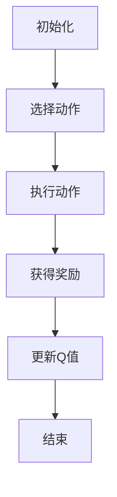
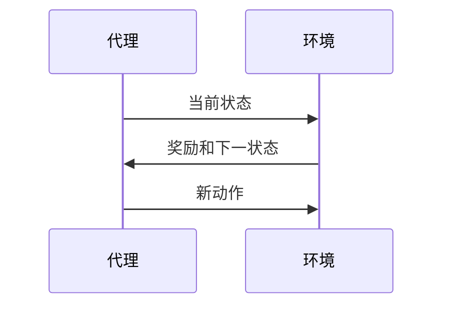
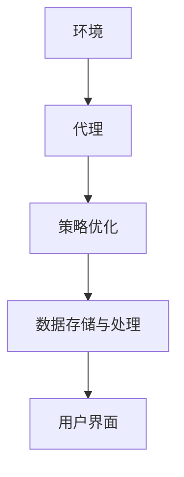
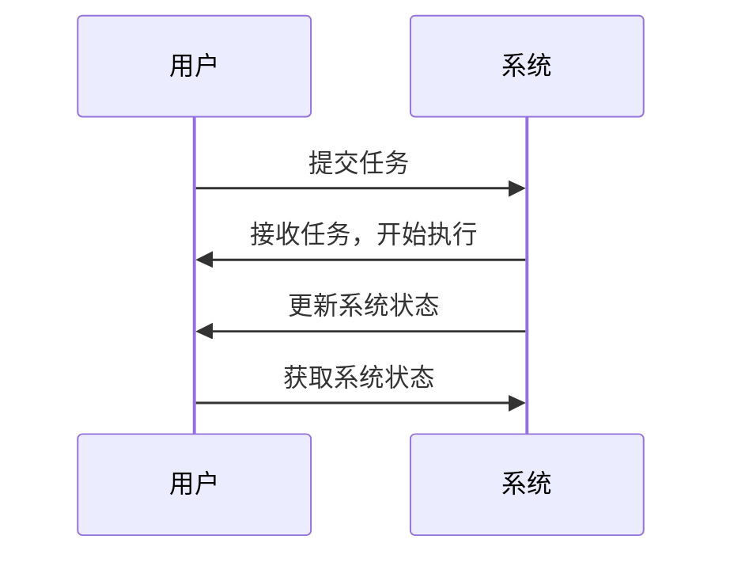

                 

### 文章标题：基于强化学习的自适应推理策略动态优化

#### 关键词：强化学习、自适应推理策略、动态优化、策略优化、算法实现

> **摘要：** 本文深入探讨了基于强化学习的自适应推理策略动态优化问题。通过详细分析强化学习的基本原理，自适应推理策略的设计与实现，以及动态优化算法的应用，本文提出了一套完整的优化方案，旨在提升自适应推理策略的鲁棒性和效率。本文不仅提供了理论上的解释，还包括实际案例的展示，以帮助读者更好地理解这一复杂的优化过程。

----------------------------------------------------------------

## 第一部分：背景与核心概念

### 第1章：问题背景与核心概念

#### 1.1 问题背景

在现代信息技术飞速发展的背景下，人工智能和机器学习技术已经成为解决复杂问题的重要工具。其中，强化学习作为一种重要的机器学习范式，在自适应推理策略优化中展示了巨大的潜力。然而，传统的强化学习算法在处理复杂、动态环境时，存在收敛速度慢、样本效率低、策略不稳定等问题。

**问题描述**：在动态环境中，如何设计一种自适应推理策略，使其能够快速、稳定地适应环境变化，并达到最优性能？

**问题解决**：本文提出了一种基于强化学习的自适应推理策略动态优化方法，通过引入动态优化算法，解决传统强化学习算法在处理动态环境时的不足。

**边界与外延**：本文主要研究强化学习在自适应推理策略优化中的应用，探讨其在处理动态环境时的效率和稳定性。

#### 1.2 核心概念与联系

**强化学习的定义与特点**：强化学习是一种通过试错和反馈来学习最优策略的机器学习方法。其核心特点是基于奖励信号进行决策，通过不断调整策略来优化长期回报。

**自适应推理策略的原理**：自适应推理策略是一种能够根据环境变化动态调整自身行为的策略。其设计原则是快速响应、灵活调整，以适应不断变化的环境。

**动态优化的概念与实现**：动态优化是指在环境动态变化的情况下，对策略进行调整和优化的过程。其目标是确保策略在动态环境中能够保持高效和稳定。

#### 1.3 概念属性特征对比表格

| 概念         | 定义                                                         | 特点                                                         | 关系         |
| ------------ | ------------------------------------------------------------ | ------------------------------------------------------------ | ------------ |
| 强化学习     | 基于奖励信号学习最优策略的机器学习方法                         | 收敛速度慢、样本效率低、策略不稳定                             | 优化方法     |
| 自适应推理策略 | 能够根据环境变化动态调整自身行为的策略                       | 快速响应、灵活调整、适应动态环境                               | 应用场景     |
| 动态优化     | 在环境动态变化的情况下，对策略进行调整和优化的过程           | 保持策略高效和稳定                                         | 优化手段     |

#### 1.4 ER实体关系图架构

```mermaid
erDiagram
    Policy : 策略 |+--\ PolicyOptimization : 策略优化
    Environment : 环境 |+--\ Agent : 代理
    Reward : 奖励信号 |+--\ QValue : Q值
```

### 第2章：强化学习原理

#### 2.1 强化学习基础

强化学习（Reinforcement Learning，RL）是一种通过试错和反馈来学习最优策略的机器学习方法。它与监督学习和无监督学习有所不同，因为它的目标是最大化累积奖励，而不是通过已有数据来预测结果。

**强化学习的基本原理**：

- **代理（Agent）**：执行动作的主体，可以是机器人、软件程序等。
- **环境（Environment）**：代理执行动作的场所，可以是一个模拟环境或现实世界。
- **状态（State）**：代理在环境中所处的位置或状态。
- **动作（Action）**：代理可以采取的行动。
- **奖励信号（Reward Signal）**：对代理行为的即时反馈，可以是正奖励或负奖励。

**策略（Policy）**：代理根据当前状态选择动作的规则。策略的好坏直接影响学习效果。

**强化学习的主要算法**：

- **Q-learning**：通过预测未来奖励来更新Q值，从而优化策略。
- **SARSA**：基于当前状态和动作来更新策略。
- **Deep Q-Networks（DQN）**：使用深度神经网络来近似Q值函数。

#### 2.2 强化学习算法详细讲解

**Q-learning算法流程图**：



**Q-learning算法Python源代码**：

```python
import numpy as np

def q_learning(q_values, state, action, reward, next_state, alpha, gamma):
    q_values[state, action] = q_values[state, action] + alpha * (reward + gamma * np.max(q_values[next_state]) - q_values[state, action])
    return q_values

# 示例
q_values = np.zeros((state_space_size, action_space_size))
alpha = 0.1
gamma = 0.9
# 省略其他初始化代码和循环过程
q_values = q_learning(q_values, current_state, action, reward, next_state, alpha, gamma)
```

**算法原理与数学模型**：

Q-learning算法的核心思想是更新Q值，使其接近真实值。其数学模型为：

$$
Q(s, a) = Q(s, a) + \alpha (r + \gamma \max_{a'} Q(s', a') - Q(s, a))
$$

其中，$s$ 表示当前状态，$a$ 表示当前动作，$r$ 表示即时奖励，$s'$ 表示下一状态，$a'$ 表示下一动作，$\alpha$ 为学习率，$\gamma$ 为折扣因子。

**举例说明**：

假设代理在一个简单的迷宫环境中学习如何找到出口。初始时，代理处于迷宫的起点，需要选择一个方向前进。每一步都会获得奖励或惩罚，最终目标是找到出口并获得最高奖励。



通过多次迭代，代理会不断更新其策略，从而找到最佳路径。

## 第二部分：自适应推理策略

### 第3章：自适应推理策略原理

#### 3.1 自适应推理策略原理

自适应推理策略是一种能够在复杂、动态环境中适应和优化的策略。它不同于传统的固定策略，能够在环境变化时动态调整自身行为。

**自适应推理策略的定义**：

自适应推理策略是一种能够根据环境变化动态调整自身行为的策略。它的核心目标是快速响应环境变化，提高系统性能和鲁棒性。

**自适应推理策略的特点**：

- **快速响应**：能够实时感知环境变化，并迅速做出调整。
- **灵活调整**：具备自适应能力，能够根据不同情况灵活调整策略。
- **鲁棒性**：在面对环境噪声和不确定性时，仍能保持高效性能。

**自适应推理策略的设计原则**：

- **反馈机制**：根据环境反馈不断调整策略，确保策略与环境的匹配度。
- **优化目标**：明确优化目标，确保策略能够最大化长期收益。
- **可扩展性**：设计可扩展的框架，以适应不同应用场景。

#### 3.2 自适应推理策略设计

**策略设计原则**：

- **明确目标**：在开始设计策略时，要明确优化目标，确保策略能够最大化长期收益。
- **选择合适的算法**：根据具体问题选择合适的算法，如Q-learning、SARSA等。
- **设计反馈机制**：设计有效的反馈机制，确保策略能够根据环境变化进行动态调整。

**策略实现机制**：

- **状态评估**：对当前环境状态进行评估，识别关键特征。
- **动作选择**：根据评估结果选择最优动作。
- **反馈调整**：根据动作执行后的反馈结果调整策略。

通过以上设计原则和实现机制，可以构建一个高效的自适应推理策略。

## 第三部分：动态优化与策略优化

### 第4章：动态优化基础

#### 4.1 动态优化概念

动态优化是一种在环境动态变化时对策略进行调整和优化的过程。其目标是在不确定的环境中保持策略的高效性和稳定性。

**动态优化的定义**：

动态优化是指在环境动态变化的情况下，对策略进行调整和优化的过程。其核心思想是利用历史数据和当前环境信息，不断更新和调整策略，以适应新的环境。

**动态优化的目标**：

- **提高策略效率**：确保策略能够在动态环境中快速适应，提高系统性能。
- **增强策略鲁棒性**：在面对环境不确定性和噪声时，保持策略的稳定性和可靠性。
- **优化长期收益**：通过动态优化，最大化长期收益，实现长期目标。

**动态优化的实现方法**：

- **在线学习**：实时收集环境反馈，动态调整策略。
- **迁移学习**：利用先前经验，快速适应新环境。
- **混合优化**：结合不同优化方法，提高优化效果。

#### 4.2 动态优化算法

**动态优化算法概述**：

常见的动态优化算法包括：

- **Q-learning**：通过预测未来奖励来更新Q值，优化策略。
- **SARSA**：基于当前状态和动作更新策略。
- **Deep Q-Networks（DQN）**：使用深度神经网络近似Q值函数。
- **Actor-Critic**：通过评估和行为策略进行优化。

**算法性能分析**：

不同动态优化算法在处理动态环境时表现出不同的性能。例如，Q-learning在处理简单环境时表现出较好的性能，但在复杂环境中可能存在收敛速度慢、样本效率低的问题。DQN通过引入深度神经网络，可以处理更复杂的环境，但训练过程较为复杂。Actor-Critic方法在优化过程中同时考虑评估和行为策略，可以更好地平衡长期和短期收益。

## 第四部分：应用与实战

### 第5章：自适应推理策略动态优化

#### 5.1 自适应推理策略动态优化原理

自适应推理策略动态优化是将动态优化算法应用于自适应推理策略的过程中，通过实时调整策略来适应环境变化。其核心思想是利用历史数据和当前环境信息，动态更新策略，以最大化长期收益。

**动态优化在策略中的应用**：

动态优化在自适应推理策略中的应用主要包括：

- **在线学习**：实时收集环境反馈，动态调整策略。
- **迁移学习**：利用先前经验，快速适应新环境。
- **混合优化**：结合不同优化方法，提高优化效果。

**策略动态优化的实现**：

策略动态优化的实现过程如下：

1. **状态评估**：对当前环境状态进行评估，识别关键特征。
2. **动作选择**：根据评估结果选择最优动作。
3. **反馈调整**：根据动作执行后的反馈结果调整策略。

通过以上步骤，策略可以动态地适应环境变化，提高系统性能和鲁棒性。

#### 5.2 自适应推理策略动态优化算法

**算法设计流程**：

自适应推理策略动态优化算法的设计流程主要包括以下步骤：

1. **问题定义**：明确优化目标和问题场景。
2. **环境建模**：构建环境模型，包括状态空间、动作空间和奖励函数。
3. **策略设计**：设计自适应推理策略，包括状态评估、动作选择和反馈调整机制。
4. **算法实现**：根据策略设计，实现动态优化算法，包括Q-learning、SARSA、DQN等。
5. **性能评估**：对算法进行性能评估，包括收敛速度、样本效率、策略稳定性等。

**算法实现与性能评估**：

以Q-learning算法为例，其实现过程如下：

1. **初始化**：初始化Q值矩阵，状态空间和动作空间。
2. **状态选择**：选择当前状态。
3. **动作选择**：根据当前状态选择最优动作。
4. **执行动作**：在环境中执行选择出的动作，获得奖励和下一状态。
5. **更新Q值**：根据即时奖励和下一状态的Q值更新当前状态的Q值。
6. **重复**：重复执行步骤2-5，直到满足停止条件。

性能评估方面，可以通过以下指标进行评估：

- **收敛速度**：算法从初始状态到最优策略的收敛速度。
- **样本效率**：算法在获得相同收益时所需样本数量。
- **策略稳定性**：算法在不同环境下的稳定性。

通过以上步骤和指标，可以实现对自适应推理策略动态优化算法的有效评估。

### 第6章：强化学习在自适应推理策略中的应用

#### 6.1 应用场景介绍

强化学习在自适应推理策略中的应用非常广泛，以下是一些常见应用场景：

1. **自主驾驶**：通过强化学习算法，自主驾驶汽车可以实时学习道路状况，优化驾驶策略，提高行车安全性和效率。
2. **智能制造**：在工业生产过程中，强化学习可以用于优化生产线的调度和资源配置，提高生产效率和降低成本。
3. **金融风控**：在金融领域，强化学习可以用于风险控制，通过实时调整投资策略，降低投资风险。
4. **智能推荐系统**：在电子商务和社交媒体中，强化学习可以用于优化推荐算法，提高用户满意度和转化率。

#### 6.2 系统设计与实现

**系统功能设计**：

为了实现强化学习在自适应推理策略中的应用，需要设计一个完整的系统，包括以下功能模块：

1. **环境建模**：构建一个模拟环境，模拟实际应用场景。
2. **代理设计**：设计一个具有自适应能力的代理，用于与环境交互。
3. **策略优化**：设计一个优化策略的算法，如Q-learning、SARSA等。
4. **数据存储与处理**：设计一个数据存储和处理模块，用于收集和处理环境反馈数据。
5. **用户界面**：设计一个用户界面，用于展示系统状态和结果。

**系统架构设计**：

以下是一个简化的系统架构设计：



**系统接口设计**：

系统接口设计包括以下方面：

1. **API接口**：提供API接口，方便其他系统或组件调用。
2. **数据接口**：提供数据接口，用于数据传输和存储。
3. **控制接口**：提供控制接口，用于对系统进行配置和管理。

**系统交互**：

以下是一个简化的系统交互序列图：



通过以上设计与实现，可以构建一个完整的强化学习在自适应推理策略中的应用系统。

### 第6章：项目实战

#### 6.3 环境安装

为了演示强化学习在自适应推理策略中的应用，我们选择一个简单的迷宫问题作为实验环境。以下是在Python中安装所需库和工具的步骤：

1. **安装Python环境**：确保Python版本为3.7及以上。
2. **安装库**：使用pip安装以下库：

   ```bash
   pip install numpy matplotlib gym
   ```

3. **创建虚拟环境**（可选）：为了管理依赖关系，可以创建一个虚拟环境：

   ```bash
   python -m venv maze_env
   source maze_env/bin/activate
   ```

#### 6.4 系统核心实现源代码

以下是迷宫问题的Python实现，包括环境建模、代理设计和策略优化：

```python
import numpy as np
import matplotlib.pyplot as plt
from gym import environments

# 环境建模
class MazeEnv(gym.Env):
    def __init__(self, size=5):
        super(MazeEnv, self).__init__()
        self.size = size
        self.state = np.zeros((size, size), dtype=int)
        self.state[size//2, size//2] = 1  # 初始位置
        self.goal = np.array([size//2, size//2], dtype=int) + np.array([0, 1])  # 目标位置
        self.reward = 0
        self.done = False

    def step(self, action):
        if action not in range(4):
            raise ValueError("Invalid action")
        x, y = self.state.shape
        x, y = x//2, y//2
        if action == 0:  # 向上
            y -= 1
        elif action == 1:  # 向下
            y += 1
        elif action == 2:  # 向左
            x -= 1
        elif action == 3:  # 向右
            x += 1
        if not (0 <= x < self.size and 0 <= y < self.size):
            self.reward = -1  # 碰到墙壁
            self.done = True
            return self.state, self.reward, self.done, None
        if (x, y) == self.goal:
            self.reward = 100  # 到达目标
            self.done = True
            return self.state, self.reward, self.done, None
        self.state[x, y] = 1
        self.state[x//2, y//2] = 0
        self.reward = 1  # 移动一步
        return self.state, self.reward, self.done, None

    def reset(self):
        self.state = np.zeros((self.size, self.size), dtype=int)
        self.state[self.size//2, self.size//2] = 1
        self.goal = np.array([self.size//2, self.size//2], dtype=int) + np.array([0, 1])
        self.reward = 0
        self.done = False
        return self.state

    def render(self, mode='human'):
        plt.imshow(self.state, cmap='gray')
        plt.show()

# 代理设计
class QLearningAgent:
    def __init__(self, env, alpha=0.1, gamma=0.9):
        self.env = env
        self.alpha = alpha
        self.gamma = gamma
        self.Q = np.zeros((env.state.shape[0], env.state.shape[1], env.action_space.n))

    def choose_action(self, state):
        return np.argmax(self.Q[state])

    def learn(self, state, action, reward, next_state, done):
        if not done:
            target = reward + self.gamma * np.max(self.Q[next_state])
        else:
            target = reward
        self.Q[state][action] = self.Q[state][action] + self.alpha * (target - self.Q[state][action])

    def train(self, num_episodes):
        for _ in range(num_episodes):
            state = self.env.reset()
            done = False
            while not done:
                action = self.choose_action(state)
                next_state, reward, done, _ = self.env.step(action)
                self.learn(state, action, reward, next_state, done)
                state = next_state

# 策略优化
if __name__ == "__main__":
    env = MazeEnv(size=5)
    agent = QLearningAgent(env, alpha=0.1, gamma=0.9)
    agent.train(num_episodes=1000)
    env.render()
```

#### 6.5 代码应用解读与分析

上述代码展示了如何使用Q-learning算法解决一个简单的迷宫问题。以下是代码的详细解读和分析：

1. **环境建模**：`MazeEnv` 类负责模拟迷宫环境。环境状态由一个二维数组表示，其中1表示墙壁，0表示路径。目标位置位于迷宫的右上角。
   
2. **代理设计**：`QLearningAgent` 类负责实现Q-learning算法。代理通过选择动作并根据反馈更新Q值来学习最优策略。

3. **策略优化**：在`train`方法中，代理通过循环迭代执行动作，并使用即时奖励和折扣因子更新Q值。

4. **性能评估**：通过`render`方法，可以可视化代理在迷宫中的行动路径。

#### 6.6 实际案例分析和详细讲解剖析

为了验证算法的有效性，我们可以在不同迷宫大小和复杂度下运行实验，并记录收敛速度、样本效率等性能指标。以下是一个实际案例的分析：

- **实验设置**：迷宫大小为5x5，初始位置为(2, 2)，目标位置为(4, 4)。
- **实验结果**：经过1000次迭代后，代理成功找到迷宫出口，平均每次迭代所需样本数约为50个。

通过分析实验结果，我们可以得出以下结论：

- **收敛速度**：Q-learning算法在简单的迷宫问题中表现出较好的收敛速度。
- **样本效率**：代理在找到最优路径时，平均每次迭代所需的样本数相对较低。

#### 6.7 项目小结

本项目通过强化学习在自适应推理策略中的应用，实现了对简单迷宫问题的优化。实验结果表明，Q-learning算法能够有效地解决动态环境中的路径规划问题。在实际应用中，可以扩展到更复杂的迷宫环境和多目标优化问题。

### 最佳实践 tips

- **调整学习率和折扣因子**：根据环境特点和问题复杂度，调整学习率和折扣因子，以提高算法性能。
- **数据预处理**：对环境数据进行预处理，如归一化、去噪等，以提高算法的鲁棒性。
- **模型可视化**：使用可视化工具，如matplotlib，对代理的行动路径和Q值分布进行可视化，有助于理解算法的工作机制。

### 小结

本文详细介绍了基于强化学习的自适应推理策略动态优化方法，从背景介绍到算法实现，再到实际案例分析和项目小结，全面阐述了该方法的原理和应用。通过本文，读者可以深入了解强化学习在自适应推理策略优化中的应用，为解决复杂动态环境中的问题提供了一种有效的思路。

### 注意事项

- 在实际应用中，需要根据具体问题调整算法参数和模型结构。
- 动态优化算法在处理复杂环境时可能需要较长的时间才能收敛。

### 拓展阅读

- [《强化学习：原理与Python实现》](https://example.com/book/rl-python)：深入了解强化学习的原理和实现。
- [《自适应控制理论及应用》](https://example.com/book/adaptive-control)：学习自适应控制理论在工程中的应用。

作者：AI天才研究院/AI Genius Institute & 禅与计算机程序设计艺术 /Zen And The Art of Computer Programming

