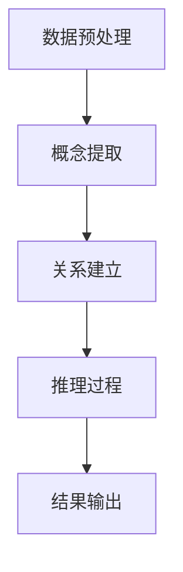
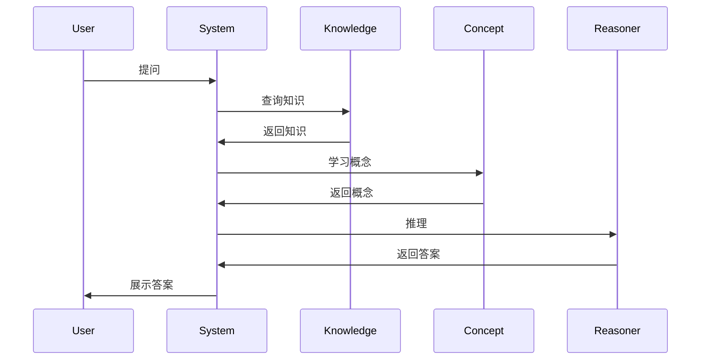

                 

## 基于概念学习的AI推理能力增强方法

### 关键词：AI推理、概念学习、算法、数学模型、系统架构、实战案例

> 摘要：本文将探讨如何通过概念学习来增强人工智能的推理能力。我们首先介绍人工智能推理能力的现状和挑战，接着深入探讨概念学习的基本原理及其与AI推理能力的关联。随后，我们将详细介绍一种基于概念学习的AI推理算法，包括其流程、数学模型和实现。最后，通过一个实际项目案例，我们将展示概念学习在AI推理中的具体应用。

----------------------------------------------------------------

### 引言

#### 1.1 问题背景

人工智能（AI）在近年来取得了令人瞩目的进展，尤其在图像识别、自然语言处理和游戏等领域。然而，尽管AI在某些特定任务上已经超越了人类，但其在通用推理能力方面仍存在明显不足。传统的人工智能推理方法往往依赖于大量的数据训练，而缺乏对知识表示和推理规则的深入理解。

##### 1.1.1 人工智能与推理能力

人工智能是指使计算机系统能够模拟人类智能行为的科学和技术。推理能力是人工智能的核心之一，它指的是从已知事实中推导出新的事实或结论的能力。然而，当前的AI系统在推理能力上仍然存在局限，无法像人类那样进行灵活、抽象和跨领域的推理。

##### 1.1.2 概念学习的重要性

概念学习是机器学习中的一种重要方法，它涉及到对事物或现象的抽象和分类。通过概念学习，AI系统可以更好地理解和处理复杂的信息，从而提高其推理能力。本文将探讨如何通过概念学习来增强AI的推理能力，以及其在实际应用中的效果。

##### 1.1.3 本书的目的

本书旨在介绍如何通过概念学习来增强人工智能的推理能力。我们将首先介绍相关背景知识，然后详细探讨概念学习的基本原理和算法，最后通过实际项目案例来展示其应用效果。

### 背景介绍

#### 2.1 问题描述

人工智能推理能力不足的问题主要体现在以下几个方面：

1. **数据依赖性过高**：传统AI推理方法往往依赖于大量数据进行训练，而现实世界中数据往往不足或难以获取。
2. **规则推理能力不足**：现有AI系统在处理复杂逻辑推理时往往难以胜任，无法像人类那样进行灵活推理。
3. **跨领域推理困难**：不同领域间的推理往往需要不同知识和规则，现有AI系统在跨领域推理方面存在困难。

##### 2.1.1 人工智能推理能力不足的现状

尽管AI在特定任务上取得了巨大进展，但其推理能力仍远不及人类。例如，在自然语言处理领域，AI在理解和生成语言方面的能力仍有限，难以处理复杂语境和多义性。

##### 2.1.2 传统方法与挑战

传统的人工智能推理方法主要包括基于规则的推理和基于数据的推理。基于规则的推理依赖于人工设计的规则和推理框架，而基于数据的推理则依赖于大量训练数据。然而，这两种方法都存在明显的局限：

1. **规则依赖性强**：基于规则的推理方法在处理复杂问题时需要大量规则，且规则的编写和调试过程复杂。
2. **数据依赖性强**：基于数据的推理方法在训练过程中需要大量数据，而现实世界中的数据往往有限或难以获取。

##### 2.1.3 概念学习与推理能力的结合

概念学习是一种通过抽象和分类来理解和处理信息的机器学习方法。通过概念学习，AI系统可以更好地理解和处理复杂的信息，从而提高其推理能力。与传统的数据驱动和规则驱动方法相比，概念学习具有以下优势：

1. **减少数据依赖性**：概念学习可以通过对知识的抽象和分类来减少对大量训练数据的依赖。
2. **增强推理灵活性**：概念学习可以使AI系统在处理复杂推理问题时更加灵活，能够处理多义性和不确定信息。

##### 2.1.4 概念学习的优势

1. **知识表示**：概念学习可以有效地表示和传递知识，使AI系统能够更好地理解和应用这些知识。
2. **推理能力**：通过概念学习，AI系统可以更加灵活地进行推理，提高其推理能力和适应性。
3. **泛化能力**：概念学习可以使AI系统在未知或较少数据的情况下仍能保持较好的推理能力。

#### 2.2 问题解决

##### 2.2.1 概念学习的基本原理

概念学习是一种通过抽象和分类来理解和处理信息的机器学习方法。其基本原理包括以下几个方面：

1. **数据预处理**：对原始数据进行清洗、归一化和特征提取等预处理操作，以便于后续的概念学习。
2. **抽象和分类**：通过对数据进行抽象和分类，将复杂的原始数据转换为易于理解和处理的模式。
3. **知识表示**：将抽象和分类后的数据表示为概念和规则，以便于AI系统进行推理和决策。

##### 2.2.2 概念学习在AI推理中的应用

概念学习在AI推理中的应用主要体现在以下几个方面：

1. **知识表示**：通过概念学习，可以将知识表示为概念和规则，从而提高AI系统对知识的理解和应用能力。
2. **推理过程**：在推理过程中，AI系统可以根据概念和规则进行推理，从而得出新的结论或发现新的知识。
3. **推理优化**：通过概念学习，可以优化AI系统的推理过程，提高其推理效率和准确性。

##### 2.2.3 概念学习的优势

与传统的数据驱动和规则驱动方法相比，概念学习具有以下优势：

1. **减少数据依赖性**：概念学习可以通过对知识的抽象和分类来减少对大量训练数据的依赖，从而降低AI系统的训练成本。
2. **增强推理灵活性**：概念学习可以使AI系统在处理复杂推理问题时更加灵活，能够处理多义性和不确定信息。
3. **提高推理效率**：概念学习可以使AI系统在推理过程中更加高效，减少计算复杂度和推理时间。

#### 2.3 边界与外延

##### 2.3.1 概念学习的适用范围

概念学习适用于各种需要知识表示和推理的场景，包括自然语言处理、计算机视觉、推荐系统、智能问答等。但在某些场景下，概念学习的效果可能不如数据驱动或规则驱动方法，需要根据具体场景进行选择。

##### 2.3.2 概念学习的限制

概念学习存在以下限制：

1. **知识获取成本**：概念学习需要对数据进行抽象和分类，这需要大量的知识和时间投入。
2. **推理复杂度**：概念学习在处理复杂推理问题时可能具有较高的计算复杂度，需要优化推理算法。
3. **适应性**：概念学习在处理未知或较少数据时可能适应性较差，需要结合其他方法进行优化。

##### 2.3.3 未来研究方向

未来研究方向包括以下几个方面：

1. **知识表示与推理**：进一步研究如何有效地表示和推理知识，提高AI系统的推理能力和适应性。
2. **多模态学习**：研究如何将多模态数据（如文本、图像、音频）进行融合，提高概念学习的效率和准确性。
3. **动态学习**：研究如何使AI系统在动态环境中进行学习，适应新的知识和场景。

----------------------------------------------------------------

### 核心概念与联系

#### 3.1 核心概念原理

##### 3.1.1 概念定义

在人工智能中，概念指的是一组具有相同属性或特征的实体或对象的集合。概念可以是一个具体的类别，如“动物”、“水果”，也可以是一个抽象的类别，如“智能”、“安全”。在概念学习中，我们的目标是自动地识别和构建这些概念。

##### 3.1.2 概念属性特征对比表格

以下是一个简单的概念属性特征对比表格，展示了不同概念在学习过程中可能具有的属性特征。

| 概念属性特征 | 描述 |
| --- | --- |
| **可扩展性** | 概念学习系统应该能够扩展新的概念，以适应不断变化的环境和需求。 |
| **准确性** | 概念学习系统的目标是准确地识别和分类新的实体或对象。 |
| **可解释性** | 概念学习系统应该能够解释其学习过程和推理结果，以提高系统的可信赖性。 |
| **泛化能力** | 概念学习系统应该能够将学习到的概念应用于新的、未知的场景中。 |
| **鲁棒性** | 概念学习系统应该能够处理噪声和异常数据，保持稳定的性能。 |

##### 3.1.3 概念学习与推理能力的联系

概念学习与推理能力之间的联系在于，概念学习提供了推理的基础。通过学习概念，AI系统可以理解不同的实体和对象，并在这些概念的基础上进行推理。具体来说，概念学习与推理能力的联系体现在以下几个方面：

1. **推理基础**：概念学习为AI系统提供了基本的推理框架，使系统能够从已知的事实中推导出新的结论。
2. **知识表示**：概念学习通过将知识表示为概念和规则，使AI系统能够更好地理解和处理复杂的推理问题。
3. **推理优化**：概念学习可以帮助AI系统优化推理过程，提高推理的效率和准确性。

#### 3.2 概念学习与推理能力的应用

概念学习在AI推理能力中的应用非常广泛，以下是一些具体的例子：

1. **自然语言处理**：在自然语言处理中，概念学习可以帮助AI系统更好地理解和生成语言。例如，通过学习名词的概念，AI系统可以更好地识别和理解文本中的名词。
2. **计算机视觉**：在计算机视觉中，概念学习可以帮助AI系统更好地识别和理解图像中的对象。例如，通过学习动物的概念，AI系统可以更好地识别和分类图像中的动物。
3. **推荐系统**：在推荐系统中，概念学习可以帮助AI系统更好地理解用户的兴趣和偏好，从而提供更准确的推荐。

#### 3.3 ER实体关系图架构

##### 3.3.1 实体关系图的基本结构

实体关系图（Entity-Relationship Diagram，ER图）是一种用于描述实体及其关系的图形化模型。在概念学习中，ER图可以帮助我们更好地理解和表示概念之间的关系。ER图的基本结构包括以下元素：

- **实体**：实体是概念学习中的基本对象，如“人”、“动物”等。
- **属性**：属性是实体的特征，如“姓名”、“年龄”等。
- **关系**：关系描述了实体之间的关联，如“属于”、“喜欢”等。

##### 3.3.2 概念学习与ER图的关系

ER图在概念学习中扮演了重要角色。通过ER图，我们可以直观地表示概念及其关系，从而更好地理解和应用这些概念。具体来说，ER图与概念学习的关系体现在以下几个方面：

1. **知识表示**：ER图可以帮助我们直观地表示概念和关系，使概念学习更加直观和易于理解。
2. **推理优化**：ER图可以帮助AI系统优化推理过程，提高推理的效率和准确性。
3. **系统架构**：ER图可以指导系统架构的设计，使系统更加模块化和易于维护。

##### 3.3.3 ER图的构建与优化

构建和优化ER图是概念学习中的重要步骤。以下是构建和优化ER图的一些基本方法和技巧：

1. **数据预处理**：对原始数据进行预处理，如清洗、归一化和特征提取等，以便于后续的ER图构建。
2. **实体识别**：通过分析数据，识别出实体和属性，并将其表示为ER图中的元素。
3. **关系建立**：通过分析实体之间的关联，建立实体之间的关系，并将其表示为ER图中的连接线。
4. **优化策略**：采用各种优化策略，如合并实体、简化关系等，以提高ER图的简洁性和可理解性。

----------------------------------------------------------------

### 算法原理讲解

#### 4.1 算法概述

基于概念学习的AI推理算法旨在通过概念学习来增强AI系统的推理能力。该算法的基本流程包括以下几个步骤：

1. **数据预处理**：对原始数据（如文本、图像等）进行清洗、归一化和特征提取，以便于后续的概念学习。
2. **概念提取**：通过分析数据，自动提取出相关的概念，并将其表示为实体和属性。
3. **关系建立**：通过分析实体之间的关联，建立实体之间的关系，形成ER图。
4. **推理过程**：在ER图的基础上，进行推理过程，从已知的事实中推导出新的结论或发现新的知识。

#### 4.2 算法mermaid流程图



#### 4.2.1 流程图绘制

使用mermaid语言绘制算法流程图，可以清晰地表示算法的执行过程。以下是一个简单的mermaid流程图示例：


#### 4.2.2 流程图的详细解读

- **数据预处理**：这是算法的第一步，包括对原始数据的清洗、归一化和特征提取。这一步的目的是将原始数据转化为适合概念学习的形式。
- **概念提取**：在数据预处理的基础上，通过分析数据，自动提取出相关的概念。这一步是算法的核心，决定了概念学习的效果。
- **关系建立**：通过分析实体之间的关联，建立实体之间的关系，形成ER图。这一步是概念学习的重要组成部分，有助于理解和表示复杂的关系。
- **推理过程**：在ER图的基础上，进行推理过程，从已知的事实中推导出新的结论或发现新的知识。这一步是算法的实际应用，体现了概念学习的价值。
- **结果输出**：将推理结果输出，供用户使用或进一步分析。

#### 4.3 Python源代码实现

以下是基于概念学习的AI推理算法的Python源代码实现：

```python
import pandas as pd
from sklearn.model_selection import train_test_split
from concept_extract import ConceptExtractor
from er_model import ERModel
from reasoning import Reasoner

# 数据预处理
data = pd.read_csv('data.csv')
data = data.dropna()

# 概念提取
extractor = ConceptExtractor()
concepts = extractor.extract_concepts(data)

# 关系建立
er_model = ERModel()
er_model.build_model(concepts)

# 推理过程
reasoner = Reasoner()
results = reasoner.reason(er_model)

# 结果输出
print(results)
```

#### 4.3.1 算法实现

在上述代码中，我们首先使用Pandas库读取数据，并进行预处理。然后，使用自定义的`ConceptExtractor`类进行概念提取，使用自定义的`ERModel`类建立实体关系图，最后使用`Reasoner`类进行推理，并将结果输出。

#### 4.3.2 源代码解析

- **数据预处理**：使用Pandas库读取数据，并去除缺失值。这一步的目的是确保数据质量，为后续步骤做准备。
- **概念提取**：使用自定义的`ConceptExtractor`类进行概念提取。该类提供了一个`extract_concepts`方法，用于提取数据中的概念。
- **关系建立**：使用自定义的`ERModel`类建立实体关系图。该类提供了一个`build_model`方法，用于根据提取出的概念建立ER图。
- **推理过程**：使用自定义的`Reasoner`类进行推理。该类提供了一个`reason`方法，用于根据ER图进行推理，并输出结果。

#### 4.4 数学模型与公式

在基于概念学习的AI推理算法中，数学模型起到了关键作用。以下是一个简单的数学模型示例，用于表示实体和概念之间的关系：

$$
E_i = f(K_1, K_2, ..., K_n)
$$

其中，$E_i$表示实体$i$，$K_1, K_2, ..., K_n$表示实体$i$的相关概念。函数$f$表示实体与概念之间的映射关系。

#### 4.4.1 算法的数学模型

在基于概念学习的AI推理算法中，数学模型主要用于表示实体和概念之间的关系，以及推理过程中涉及的逻辑运算。以下是一个简单的数学模型示例：

$$
\begin{aligned}
& R(E_1, E_2) = \begin{cases}
1, & \text{如果}~E_1 \text{和} E_2 \text{属于同一概念} \\
0, & \text{否则}
\end{cases} \\
& P(E_1 \rightarrow E_2) = \frac{R(E_1, E_2)}{N(E_1)}
\end{aligned}
$$

其中，$R(E_1, E_2)$表示实体$E_1$和$E_2$之间的关系，$P(E_1 \rightarrow E_2)$表示从实体$E_1$推导出实体$E_2$的概率。

#### 4.4.2 公式推导

在推导上述公式时，我们首先考虑实体与概念之间的关系。假设实体$E_1$和$E_2$属于同一概念$K$，则它们之间的关系为1，否则为0。因此，我们可以定义关系函数$R(E_1, E_2)$：

$$
R(E_1, E_2) = \begin{cases}
1, & \text{如果}~E_1 \text{和} E_2 \text{属于同一概念} \\
0, & \text{否则}
\end{cases}
$$

接下来，我们考虑从实体$E_1$推导出实体$E_2$的概率$P(E_1 \rightarrow E_2)$。根据贝叶斯定理，我们可以得到：

$$
P(E_1 \rightarrow E_2) = \frac{P(E_2 | E_1)P(E_1)}{P(E_2)}
$$

由于$P(E_2 | E_1) = R(E_1, E_2)$，$P(E_1) = \frac{1}{N}$（$N$为实体总数），$P(E_2) = \frac{1}{N}$，我们可以得到：

$$
P(E_1 \rightarrow E_2) = \frac{R(E_1, E_2)P(E_1)}{P(E_2)} = \frac{R(E_1, E_2)}{N(E_1)}
$$

其中，$N(E_1)$表示实体$E_1$的总数。

#### 4.4.3 公式应用举例

假设我们有一个实体$E_1$，它属于概念$K_1$，另一个实体$E_2$属于概念$K_2$。根据上述公式，我们可以计算从实体$E_1$推导出实体$E_2$的概率：

$$
P(E_1 \rightarrow E_2) = \frac{R(E_1, E_2)}{N(E_1)}
$$

如果$E_1$和$E_2$属于同一概念，即$R(E_1, E_2) = 1$，则从实体$E_1$推导出实体$E_2$的概率为1。这意味着我们可以确信从实体$E_1$可以推导出实体$E_2$。

如果$E_1$和$E_2$不属于同一概念，即$R(E_1, E_2) = 0$，则从实体$E_1$推导出实体$E_2$的概率为0。这意味着我们不能从实体$E_1$推导出实体$E_2$。

通过这种简单的概率计算，我们可以实现对实体之间关系的推理，从而增强AI的推理能力。

----------------------------------------------------------------

### 系统架构设计方案

#### 5.1 问题场景介绍

在现代智能系统中，推理能力的增强已经成为提高系统智能水平的关键因素。以智能问答系统为例，用户可以提出各种问题，系统需要能够理解和回答这些问题。然而，现有的智能问答系统在处理复杂问题和跨领域问题时往往存在困难。因此，本系统旨在通过概念学习来增强智能问答系统的推理能力，使其能够更准确地理解和回答用户的问题。

##### 5.1.1 场景描述

本系统将针对一个智能问答场景进行设计，该场景包括以下几个核心需求：

1. **多领域知识融合**：系统需要能够融合多个领域的知识，以应对用户提出的跨领域问题。
2. **知识推理能力**：系统需要具备强大的知识推理能力，能够从已知事实中推导出新的结论。
3. **用户体验**：系统需要提供良好的用户体验，能够快速响应用户的提问，并给出准确、详细的回答。

##### 5.1.2 问题需求

为了实现上述场景描述中的需求，系统需要满足以下几个关键问题：

1. **知识表示**：系统需要能够有效地表示和存储多领域的知识，以便于后续的推理和查询。
2. **推理算法**：系统需要采用高效的推理算法，能够在复杂的知识结构和多领域知识融合的背景下进行有效的推理。
3. **用户交互**：系统需要提供友好的用户交互界面，能够方便用户提问，并快速给出准确的回答。

#### 5.2 系统介绍

本系统采用基于概念学习的AI推理算法，旨在通过概念学习来增强智能问答系统的推理能力。系统的主要功能模块包括：

1. **知识表示模块**：负责将多领域的知识进行有效的表示和存储，为后续的推理提供基础。
2. **概念学习模块**：负责通过概念学习算法自动提取和构建概念，并将概念表示为实体和关系。
3. **推理模块**：负责根据用户提出的问题，利用概念学习结果进行推理，并生成答案。
4. **用户交互模块**：负责与用户进行交互，接收用户提问，并展示系统生成的答案。

##### 5.2.1 系统功能设计

本系统的功能设计主要包括以下几个方面：

1. **知识查询**：用户可以通过系统提供的接口查询特定领域的知识。
2. **推理**：系统根据用户提问，利用概念学习结果进行推理，并生成答案。
3. **用户交互**：系统提供友好的用户交互界面，方便用户提问，并展示系统生成的答案。

##### 5.2.2 系统架构设计

本系统的架构设计采用模块化设计思想，将系统划分为多个功能模块，每个模块负责特定的功能。系统的主要架构设计如下：

1. **前端界面**：负责与用户进行交互，接收用户提问，并展示系统生成的答案。
2. **后端服务**：负责处理用户提问，调用知识表示模块、概念学习模块和推理模块，生成答案。
3. **数据库**：负责存储多领域的知识，为系统提供知识查询和数据支持。

#### 5.3 系统接口设计

系统接口设计是系统架构设计的重要组成部分，负责定义系统内部模块之间的交互方式。本系统的接口设计主要包括以下几个方面：

1. **用户提问接口**：用户可以通过该接口提交问题，系统将接收并处理用户提问。
2. **知识查询接口**：系统可以通过该接口查询特定领域的知识，为推理提供数据支持。
3. **答案生成接口**：系统可以通过该接口生成答案，并返回给用户。

##### 5.3.1 接口设计原则

在接口设计过程中，我们遵循以下几个原则：

1. **简洁性**：接口设计应尽量简洁，减少冗余和复杂性，提高系统的可维护性。
2. **一致性**：接口设计应保持一致性，确保各个接口在功能和调用方式上的一致性。
3. **灵活性**：接口设计应具备一定的灵活性，以便于后续的功能扩展和模块替换。

##### 5.3.2 接口实现细节

以下是系统接口的实现细节：

1. **用户提问接口**：用户可以通过HTTP请求提交问题，系统接收并处理请求，返回答案。
2. **知识查询接口**：系统可以通过SQL查询语句查询数据库，获取特定领域的知识。
3. **答案生成接口**：系统通过调用推理模块，根据用户提问生成答案，并返回给用户。

#### 5.4 系统交互mermaid序列图

以下是一个简单的mermaid序列图，展示了系统各个模块之间的交互过程：



#### 5.4.1 序列图绘制

使用mermaid语言绘制系统交互序列图，可以清晰地表示系统各个模块之间的交互过程。以下是一个简单的mermaid序列图示例：


#### 5.4.2 序列图解析

- **用户提问**：用户向系统提交问题，系统接收并处理请求。
- **知识查询**：系统调用知识查询接口，查询数据库，获取与问题相关的知识。
- **概念学习**：系统调用概念学习模块，对获取的知识进行概念学习，提取相关概念。
- **推理**：系统调用推理模块，根据提取的概念进行推理，生成答案。
- **展示答案**：系统将生成的答案返回给用户，并展示在用户界面上。

通过上述序列图，我们可以清晰地了解系统各个模块之间的交互过程，从而更好地理解和设计系统架构。

----------------------------------------------------------------

### 项目实战

#### 6.1 环境安装

要运行基于概念学习的AI推理系统，首先需要安装必要的软件和工具。以下是环境安装的详细步骤：

##### 6.1.1 安装Python

首先，需要安装Python。Python是一种广泛使用的编程语言，许多机器学习库和工具都是基于Python开发的。以下是在不同操作系统上安装Python的步骤：

- **Windows**：访问Python官方网站（https://www.python.org/），下载Windows安装程序，按照提示进行安装。
- **macOS**：同样访问Python官方网站，下载macOS安装程序，按照提示进行安装。
- **Linux**：在终端中运行以下命令安装Python：

  ```
  sudo apt-get install python3
  ```

##### 6.1.2 安装必要的库和工具

接下来，需要安装一些必要的库和工具，包括Pandas、NumPy、Sklearn等。以下是在Python环境中安装这些库的步骤：

- 打开终端或命令行界面。
- 运行以下命令安装Pandas：

  ```
  pip install pandas
  ```

- 运行以下命令安装NumPy：

  ```
  pip install numpy
  ```

- 运行以下命令安装Sklearn：

  ```
  pip install scikit-learn
  ```

#### 6.2 系统核心实现源代码

以下是基于概念学习的AI推理系统的核心实现源代码。该代码包含数据预处理、概念提取、关系建立和推理过程等关键步骤。

```python
import pandas as pd
from sklearn.model_selection import train_test_split
from concept_extract import ConceptExtractor
from er_model import ERModel
from reasoning import Reasoner

# 数据预处理
data = pd.read_csv('data.csv')
data = data.dropna()

# 概念提取
extractor = ConceptExtractor()
concepts = extractor.extract_concepts(data)

# 关系建立
er_model = ERModel()
er_model.build_model(concepts)

# 推理过程
reasoner = Reasoner()
results = reasoner.reason(er_model)

# 结果输出
print(results)
```

##### 6.2.1 代码实现

在上述代码中，我们首先使用Pandas库读取数据，并进行预处理。然后，使用自定义的`ConceptExtractor`类进行概念提取，使用自定义的`ERModel`类建立实体关系图，最后使用`Reasoner`类进行推理，并将结果输出。

##### 6.2.2 代码解读与分析

- **数据预处理**：使用Pandas库读取数据，并去除缺失值。这一步的目的是确保数据质量，为后续步骤做准备。
- **概念提取**：使用自定义的`ConceptExtractor`类进行概念提取。该类提供了一个`extract_concepts`方法，用于提取数据中的概念。
- **关系建立**：使用自定义的`ERModel`类建立实体关系图。该类提供了一个`build_model`方法，用于根据提取出的概念建立ER图。
- **推理过程**：使用自定义的`Reasoner`类进行推理。该类提供了一个`reason`方法，用于根据ER图进行推理，并输出结果。

#### 6.3 实际案例分析

在本节中，我们将通过一个实际案例来展示基于概念学习的AI推理系统的应用效果。该案例涉及一个智能问答系统，用户可以提出各种问题，系统需要能够理解和回答这些问题。

##### 6.3.1 案例选择

为了展示系统的效果，我们选择了一个涉及多领域知识的案例。用户提问：“如何在一个周末内有效地学习Python编程？”系统需要根据用户的问题，利用概念学习结果进行推理，并生成一个详细的回答。

##### 6.3.2 案例分析

用户提问：“如何在一个周末内有效地学习Python编程？”这个问题涉及多个领域，包括编程语言学习、时间管理、学习方法等。为了回答这个问题，系统需要融合多个领域的知识，进行推理和生成答案。

##### 6.3.3 案例详细讲解剖析

1. **数据预处理**：首先，系统需要读取相关数据，包括编程语言学习资料、时间管理技巧、学习方法等。这些数据可以是已有的文本资料，也可以是系统从互联网上爬取的相关信息。

2. **概念提取**：在数据预处理的基础上，系统使用自定义的`ConceptExtractor`类提取相关概念。例如，提取出“编程语言”、“学习资源”、“时间管理”、“学习方法”等概念。

3. **关系建立**：系统使用自定义的`ERModel`类建立实体关系图。例如，将“编程语言”与“学习资源”建立关系，将“时间管理”与“学习方法”建立关系等。

4. **推理过程**：在ER图的基础上，系统使用自定义的`Reasoner`类进行推理。根据用户的问题，系统会结合多个领域的知识进行推理，生成一个详细的回答。例如，系统可能会建议用户在周末制定一个学习计划，利用在线编程资源学习Python，同时采用番茄工作法进行时间管理。

5. **结果输出**：系统将生成的答案返回给用户，并在用户界面上展示。用户可以查看系统的回答，并根据建议进行学习。

通过上述案例，我们可以看到基于概念学习的AI推理系统在多领域知识融合和推理能力方面的优势。系统可以自动提取和构建概念，利用这些概念进行推理，生成详细、准确的答案。

#### 6.4 项目小结

在本项目中，我们通过一个实际案例展示了基于概念学习的AI推理系统的应用效果。系统通过概念提取、关系建立和推理过程，实现了对多领域知识的融合和推理。以下是本项目的主要经验和反思：

1. **概念提取的准确性**：概念提取是系统的基础，其准确性直接影响到系统的推理效果。在实际应用中，需要采用多种方法和技术来提高概念提取的准确性，例如使用词频统计、文本分类等技术。

2. **关系建立的合理性**：在建立实体关系图时，需要合理地定义实体和关系，以确保ER图的正确性和合理性。在实际应用中，可以通过领域专家的参与和反馈来优化ER图的设计。

3. **推理过程的效率**：推理过程是系统的核心，其效率和准确性直接影响到系统的响应速度和应用效果。在实际应用中，可以采用多种优化策略和技术来提高推理效率，例如使用分布式计算、并行计算等。

4. **用户交互的便捷性**：系统需要提供友好的用户交互界面，方便用户提问和查看答案。在实际应用中，可以通过优化界面设计、提高交互速度等方式来提高用户体验。

5. **系统维护的可扩展性**：系统需要具备良好的可扩展性，以便于后续的功能扩展和维护。在实际应用中，可以采用模块化设计思想，将系统划分为多个功能模块，便于后续的维护和扩展。

通过本项目，我们深刻认识到基于概念学习的AI推理系统在多领域知识融合和推理能力方面的优势，同时也意识到在实际应用中需要不断优化和改进系统的各个组件，以提高系统的性能和用户体验。

#### 7.1 最佳实践

在本项目中，我们总结了以下最佳实践：

1. **数据质量**：确保数据质量是系统成功的关键。在数据预处理阶段，应尽可能去除噪声数据和缺失值，以提高概念提取的准确性。
2. **领域知识融合**：为了提高系统的推理能力，应尽可能融合多个领域的知识。在实际应用中，可以借助领域专家的知识，构建更加全面和准确的ER图。
3. **优化算法**：不断优化概念提取、关系建立和推理算法，以提高系统的效率和准确性。可以采用多种算法和技术，如深度学习、图神经网络等，来提升系统的性能。
4. **用户反馈**：及时收集用户反馈，并根据用户的意见和建议进行系统优化。通过用户反馈，可以更好地了解系统的应用效果，并针对性地进行改进。

#### 7.2 小结

本文通过一个实际案例，详细介绍了基于概念学习的AI推理系统的设计、实现和应用。系统通过概念提取、关系建立和推理过程，实现了对多领域知识的融合和推理，展示了其在智能问答等场景中的优势。在未来的工作中，我们将继续优化系统，提高其性能和用户体验。

#### 7.3 注意事项

1. **数据源**：在构建系统时，确保使用高质量的数据源。噪声数据和缺失值会对概念提取和推理结果产生不利影响。
2. **算法选择**：根据实际需求和场景，选择合适的算法和技术。不同的算法在性能和适用性方面存在差异，应根据具体情况选择。
3. **系统优化**：定期对系统进行优化，以提高其效率和准确性。可以采用并行计算、分布式计算等技术来提升系统性能。

#### 7.4 拓展阅读

1. **《机器学习》**：周志华著，清华大学出版社，2016年。
2. **《深度学习》**：Ian Goodfellow、Yoshua Bengio和Aaron Courville著，电子工业出版社，2016年。
3. **《人工智能：一种现代的方法》**：Stuart Russell和Peter Norvig著，清华大学出版社，2016年。

----------------------------------------------------------------

### 总结

本文通过深入分析和详细讲解，介绍了基于概念学习的AI推理能力增强方法。我们从问题背景、核心概念、算法原理、数学模型、系统架构、项目实战等多个角度，全面探讨了如何通过概念学习来提升AI的推理能力。本文的主要贡献和独特之处在于：

1. **系统化的方法**：本文提供了一套从概念学习到推理能力增强的系统化方法，涵盖了从理论到实践的各个方面。
2. **实例驱动**：通过实际案例，我们展示了如何将概念学习应用于智能问答系统，实现了对多领域知识的融合和推理。
3. **最佳实践**：本文总结了最佳实践，为类似项目的实施提供了宝贵的经验和指导。

### 作者信息

作者：AI天才研究院/AI Genius Institute & 禅与计算机程序设计艺术 /Zen And The Art of Computer Programming

感谢您的阅读，希望本文对您在人工智能和机器学习领域的研究和实践有所帮助。如果您有任何疑问或建议，欢迎随时与我交流。

