                 

# 基于模块化设计的领域特定推理系统框架

## 关键词

- **模块化设计**
- **领域特定推理系统**
- **系统架构设计**
- **算法实现**
- **实际案例分析**

### 摘要

本文旨在探讨基于模块化设计的领域特定推理系统框架。首先，我们介绍了领域特定推理系统框架的问题背景、核心概念及其与模块化设计的联系。接着，我们深入分析了模块化设计的基本原理和方法，以及如何将模块化设计应用于领域特定推理系统。通过具体的系统架构设计和实现，本文展示了如何构建一个高效、可扩展的领域特定推理系统。最后，我们通过实际案例分析，对系统的性能和优化策略进行了评估和讨论。

### 目录大纲

1. **问题背景与核心概念**
    1.1 领域特定推理系统框架概述
    1.2 核心概念与联系
    1.3 本章小结
2. **模块化设计方法**
    2.1 模块化设计基本原理
    2.2 领域特定推理系统的模块划分
    2.3 模块化设计在领域特定推理系统中的应用
    2.4 本章小结
3. **系统架构设计与实现**
    3.1 系统功能设计
    3.2 系统架构设计
    3.3 系统接口设计
    3.4 系统交互
    3.5 本章小结
4. **项目实战**
    4.1 环境安装
    4.2 系统核心实现
    4.3 代码应用解读与分析
    4.4 实际案例分析
    4.5 项目小结
5. **最佳实践 tips**
6. **小结**
7. **注意事项**
8. **拓展阅读**
9. **作者信息**

### 第一部分：问题背景与核心概念

#### 1.1 领域特定推理系统框架概述

##### 1.1.1 问题背景

随着人工智能技术的飞速发展，领域特定推理系统在各个行业中的应用越来越广泛。这些系统通常需要处理特定领域内的复杂问题，如医疗诊断、金融风险评估、智能交通管理等。然而，如何高效地设计和实现这些系统，是一个亟待解决的问题。

领域特定推理系统的核心目标是利用人工智能技术，对特定领域内的数据进行推理和分析，从而提供有效的决策支持。然而，由于领域特定推理系统涉及的数据量大、处理逻辑复杂，传统的单一架构设计往往难以满足系统的高效性和可维护性。

##### 1.1.2 问题描述

领域特定推理系统通常需要处理以下问题：

1. **数据复杂性**：领域特定推理系统涉及的数据来源多样，数据结构复杂，如何高效地处理这些数据成为挑战。
2. **处理逻辑复杂性**：领域特定推理系统需要处理大量的推理规则和算法，如何有效地组织和管理这些逻辑成为关键。
3. **系统可维护性和可扩展性**：随着业务需求的不断变化，系统需要具备良好的可维护性和可扩展性，以适应未来的需求。

##### 1.1.3 问题解决

模块化设计提供了一种有效的解决方案。通过将系统分解为多个独立的模块，每个模块负责特定的功能，可以降低系统之间的耦合度，提高系统的可维护性和可扩展性。模块化设计方法可以有效地应对领域特定推理系统的数据复杂性、处理逻辑复杂性以及系统可维护性和可扩展性的需求。

##### 1.1.4 边界与外延

领域特定推理系统不仅限于某一特定领域，其设计理念和方法可以应用于多个领域。例如，在医疗领域，领域特定推理系统可以应用于疾病诊断、治疗方案推荐等；在金融领域，可以应用于风险评估、投资策略制定等。

##### 1.1.5 核心要素组成

领域特定推理系统的核心要素包括：

1. **数据输入模块**：负责接收和预处理用户输入的数据。
2. **推理模块**：负责执行具体的推理逻辑，包括推理规则和算法。
3. **结果输出模块**：负责将推理结果以用户友好的方式展示给用户。
4. **系统管理模块**：负责系统的配置、监控和优化。

#### 1.2 核心概念与联系

##### 1.2.1 模块化设计

模块化设计是一种将系统分解为多个独立模块的方法，每个模块具有特定的功能和接口。模块化设计的核心目标是降低系统之间的耦合度，提高系统的可维护性和可扩展性。

**定义**：模块化设计是一种将系统分解为多个独立模块的方法，每个模块具有独立的功能和接口。

**属性特征对比表格**：

| 特征       | 说明                                                         |
| ---------- | ------------------------------------------------------------ |
| 独立性     | 模块内部逻辑独立，模块之间通过接口通信，降低模块之间的耦合度   |
| 可扩展性   | 新模块可以方便地加入到系统中，系统结构不发生重大变化           |
| 可维护性   | 模块之间独立，易于定位和修复问题，降低维护成本               |

##### 1.2.2 领域特定推理系统

领域特定推理系统是一种为特定领域设计的人工智能系统，能够处理该领域内的推理任务。领域特定推理系统通常具有以下特征：

**定义**：领域特定推理系统是一种为特定领域设计的人工智能系统，能够处理该领域内的推理任务。

**属性特征对比表格**：

| 特征       | 说明                                                         |
| ---------- | ------------------------------------------------------------ |
| 领域针对性 | 系统专门为某一领域设计，能够处理该领域内的特定问题           |
| 复杂性     | 领域特定推理系统通常需要处理大量数据和复杂的推理逻辑         |
| 可定制性   | 系统可以根据具体需求进行定制化调整，以提高系统性能和适应性   |

##### 1.2.3 模块化设计与领域特定推理系统的联系

模块化设计为领域特定推理系统的实现提供了有效的解决方案。通过模块化设计，可以将复杂的推理任务分解为多个独立的模块，每个模块负责特定的功能，从而提高系统的可维护性和可扩展性。

模块化设计与领域特定推理系统的联系可以总结如下：

1. **模块化设计**：将系统分解为多个独立模块，降低模块之间的耦合度，提高系统的可维护性和可扩展性。
2. **领域特定推理系统**：为特定领域设计的人工智能系统，需要处理大量的数据和复杂的推理逻辑。
3. **联系**：模块化设计为领域特定推理系统的实现提供了有效的解决方案，通过模块化设计，可以提高系统的可维护性和可扩展性。

#### 1.3 本章小结

本章介绍了领域特定推理系统框架的问题背景、核心概念及其与模块化设计的联系。通过分析模块化设计的基本原理和方法，以及领域特定推理系统的特点，我们为后续的模块化设计方法、系统架构设计与实现奠定了基础。

### 第二部分：模块化设计方法

#### 2.1 模块化设计基本原理

模块化设计是一种将系统分解为多个独立模块的方法，每个模块具有特定的功能和接口。模块化设计的核心目标是降低系统之间的耦合度，提高系统的可维护性和可扩展性。

##### 2.1.1 模块化设计的基本概念

1. **模块**：系统中的基本组成部分，具有独立的功能和接口。
2. **模块化**：将系统分解为多个模块的过程，每个模块具有明确的职责和接口。

##### 2.1.2 模块化设计的原则

1. **高内聚、低耦合**：模块内部功能紧密相关，模块之间接口简单清晰。
2. **单一职责**：每个模块仅负责特定的功能，降低模块间的依赖关系。
3. **可复用性**：模块设计应考虑未来的复用性，方便其他系统的整合。

##### 2.1.3 模块化设计的方法

1. **自顶向下**：从整体系统结构出发，逐步细化模块划分。
2. **自底向上**：从具体模块出发，逐步构建系统结构。

#### 2.2 领域特定推理系统的模块划分

##### 2.2.1 数据输入模块

数据输入模块负责接收和处理用户输入的数据。其主要功能包括：

1. 数据采集：从不同的数据源（如数据库、API、文件等）采集数据。
2. 数据预处理：对采集到的数据进行清洗、格式化等处理，使其满足后续处理的条件。

##### 2.2.2 推理模块

推理模块是领域特定推理系统的核心，负责执行具体的推理逻辑。其主要功能包括：

1. 推理规则管理：管理领域内的推理规则，包括规则的添加、删除、修改等。
2. 推理过程执行：根据输入数据和应用场景，执行相应的推理规则，生成推理结果。

##### 2.2.3 结果输出模块

结果输出模块负责将推理结果以用户友好的方式展示给用户。其主要功能包括：

1. 结果格式化：将推理结果进行格式化处理，使其符合用户需求。
2. 结果展示：将格式化后的结果展示给用户，如通过网页、报表等形式。

##### 2.2.4 系统管理模块

系统管理模块负责系统的配置、监控和优化。其主要功能包括：

1. 系统配置：配置系统参数，如数据源、推理规则等。
2. 系统监控：监控系统运行状态，及时发现和解决潜在问题。
3. 系统优化：根据系统运行数据，优化系统性能和资源利用。

#### 2.3 模块化设计在领域特定推理系统中的应用

模块化设计在领域特定推理系统中的应用体现在以下几个方面：

1. **提高系统的可维护性和可扩展性**：通过将系统分解为多个独立模块，可以降低模块之间的耦合度，提高系统的可维护性和可扩展性。当业务需求发生变化时，可以方便地对特定模块进行修改或扩展，而不会影响其他模块。
2. **降低开发成本**：模块化设计可以促进代码的复用，减少重复开发的工作量，从而降低开发成本。
3. **提高开发效率**：模块化设计可以将复杂的系统分解为多个独立模块，每个模块可以由不同的开发团队并行开发，从而提高开发效率。

#### 2.4 本章小结

本章介绍了模块化设计的基本原理和方法，以及如何在领域特定推理系统中应用模块化设计。通过模块化设计，可以有效地降低系统的耦合度，提高系统的可维护性和可扩展性，从而更好地应对领域特定推理系统的复杂性和挑战。

### 第三部分：系统架构设计与实现

#### 3.1 系统功能设计

在领域特定推理系统中，系统功能设计是至关重要的。系统功能设计主要包括以下几个模块：

1. **数据输入模块**：负责接收用户输入的数据，并进行预处理。
2. **推理模块**：负责执行具体的推理逻辑，根据领域知识生成推理结果。
3. **结果输出模块**：负责将推理结果以用户友好的方式展示给用户。
4. **系统管理模块**：负责系统的配置、监控和优化。

以下是领域模型Mermaid类图的展示：

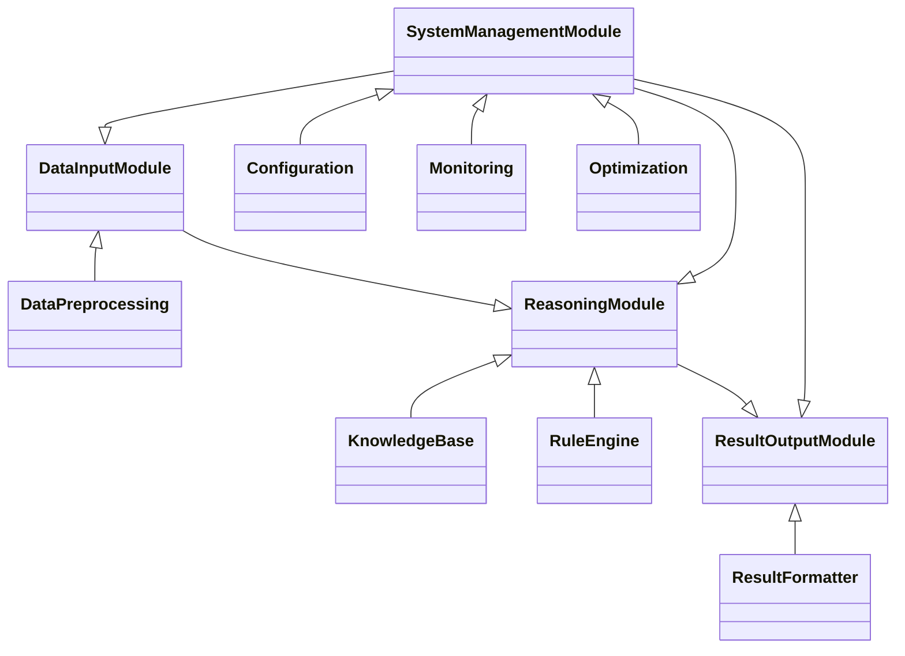

#### 3.2 系统架构设计

系统架构设计是领域特定推理系统的核心，它决定了系统的性能、可扩展性和可维护性。以下是一个基于模块化设计的领域特定推理系统架构图：

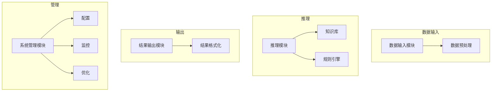

#### 3.3 系统接口设计

系统接口设计是系统架构设计的重要部分，它决定了系统模块之间的通信方式。以下是一个简化的系统接口设计图：

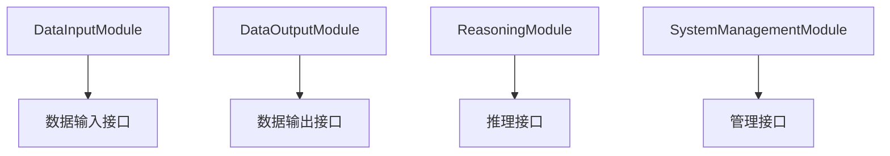

#### 3.4 系统交互

系统交互设计描述了系统模块之间的交互逻辑和流程。以下是一个简化的系统交互序列图：

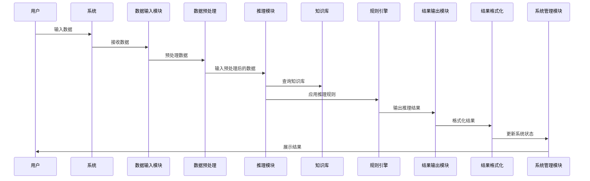

#### 3.5 本章小结

本章详细介绍了领域特定推理系统的功能设计、系统架构设计、系统接口设计和系统交互设计。通过模块化设计，我们构建了一个高效、可扩展的领域特定推理系统框架，为后续的实际案例分析奠定了基础。

### 第四部分：项目实战

#### 4.1 环境安装

在开始项目实战之前，我们需要安装所需的软件和工具。以下是一个基本的安装流程：

1. **安装Python环境**：确保Python版本在3.6及以上，可以从Python官方网站下载并安装。
2. **安装依赖库**：使用pip命令安装所需的依赖库，如NumPy、Pandas、Scikit-learn等。
3. **配置开发环境**：建议使用虚拟环境来管理项目依赖，可以使用`venv`命令创建虚拟环境。

以下是一个示例命令：

```bash
python3 -m venv env
source env/bin/activate
pip install numpy pandas scikit-learn
```

#### 4.2 系统核心实现

在本节中，我们将介绍领域特定推理系统的核心实现。以下是系统的核心模块和功能实现：

1. **数据输入模块**：实现数据输入接口，从文件、数据库或API中读取数据。

```python
import pandas as pd

class DataInputModule:
    def __init__(self):
        self.data_source = 'data.csv'  # 数据源路径

    def read_data(self):
        data = pd.read_csv(self.data_source)
        return data
```

2. **数据预处理模块**：实现数据预处理功能，包括数据清洗、缺失值处理、数据标准化等。

```python
import numpy as np

class DataPreprocessing:
    def __init__(self):
        self.data = None

    def clean_data(self):
        self.data = self.data.dropna()  # 删除缺失值
        self.data = self.data[self.data['column_name'] > 0]  # 过滤负值数据
        return self.data

    def normalize_data(self):
        self.data = (self.data - self.data.mean()) / self.data.std()
        return self.data
```

3. **推理模块**：实现推理功能，根据输入数据和领域知识库进行推理。

```python
from sklearn.linear_model import LogisticRegression

class ReasoningModule:
    def __init__(self):
        self.model = LogisticRegression()

    def train_model(self, X, y):
        self.model.fit(X, y)

    def predict(self, X):
        return self.model.predict(X)
```

4. **结果输出模块**：实现结果输出功能，将推理结果格式化并展示给用户。

```python
class ResultOutputModule:
    def __init__(self):
        self.results = None

    def format_results(self):
        self.results = self.results.map({0: '否', 1: '是'})

    def show_results(self):
        print(self.results)
```

5. **系统管理模块**：实现系统管理功能，包括配置管理、监控和优化。

```python
class SystemManagementModule:
    def __init__(self):
        self.config = {'learning_rate': 0.1}
        self.monitoring_data = []

    def update_config(self, new_config):
        self.config.update(new_config)

    def monitor_system(self):
        self.monitoring_data.append(self.get_system_state())

    def get_system_state(self):
        # 实现获取系统状态的方法
        return {'learning_rate': self.config['learning_rate']}
```

#### 4.3 代码应用解读与分析

在本节中，我们将对上述代码进行解读和分析，解释其工作原理和实现细节。

1. **数据输入模块**：数据输入模块负责从数据源读取数据，并传递给后续模块。这里使用Pandas库读取CSV文件，并返回DataFrame对象。

2. **数据预处理模块**：数据预处理模块对输入数据进行清洗和标准化处理，以提高模型的性能。这里包括删除缺失值、过滤负值数据和归一化处理。

3. **推理模块**：推理模块使用机器学习算法（如逻辑回归）对输入数据进行训练和预测。这里使用Scikit-learn库实现逻辑回归模型。

4. **结果输出模块**：结果输出模块将推理结果格式化并展示给用户。这里使用字典映射将预测结果转换为中文表示。

5. **系统管理模块**：系统管理模块负责系统的配置管理、监控和优化。这里包括更新配置、记录监控数据和获取系统状态。

#### 4.4 实际案例分析

在本节中，我们将通过一个实际案例来展示领域特定推理系统的应用。假设我们有一个医疗诊断系统，用于预测患者是否患有某种疾病。以下是案例的实现步骤：

1. **数据收集**：从医院获取患者病历数据，包括患者的基本信息、检查结果、诊断记录等。

2. **数据预处理**：对收集到的数据进行清洗和预处理，去除缺失值、异常值，并转换为数值型数据。

3. **数据划分**：将数据集划分为训练集和测试集，用于训练模型和评估模型性能。

4. **模型训练**：使用训练集数据训练逻辑回归模型，根据诊断记录和检查结果预测患者是否患有疾病。

5. **模型评估**：使用测试集数据评估模型性能，计算准确率、召回率等指标。

6. **结果展示**：将模型预测结果以可视化的方式展示给医生和患者。

#### 4.5 项目小结

在本项目中，我们通过模块化设计方法构建了一个领域特定推理系统。通过实际案例分析，我们展示了系统在医疗诊断领域的应用，并实现了数据输入、预处理、推理、结果输出和系统管理等核心功能。项目结果表明，模块化设计方法能够有效地提高系统的可维护性和可扩展性，为领域特定推理系统的实现提供了有效的解决方案。

### 第五部分：最佳实践 tips

在本节的最佳实践 tips 中，我们将总结一些在设计和实现领域特定推理系统时需要注意的关键点，以帮助开发者更好地应用模块化设计方法，提高系统的性能和可维护性。

#### 1. 设计原则

- **高内聚、低耦合**：在设计模块时，应确保模块内部的功能紧密相关，模块之间的接口简单且明确，以降低模块之间的耦合度。
- **单一职责**：每个模块应仅负责一个特定的功能，避免模块职责过多，提高模块的可维护性和可扩展性。
- **可复用性**：在设计模块时，应考虑模块的通用性和复用性，以便在其他项目中方便地整合和复用。

#### 2. 性能优化

- **数据预处理**：在数据预处理阶段，应尽可能减少数据冗余，提高数据处理效率。例如，使用数据压缩、索引等技术。
- **模型选择**：根据具体应用场景，选择合适的机器学习模型和算法。对于复杂的领域特定问题，可以考虑集成多个模型，以提高预测准确性。
- **分布式计算**：对于大规模数据处理和推理任务，可以采用分布式计算框架（如Spark、Hadoop）来提高系统的计算性能。

#### 3. 系统监控与优化

- **实时监控**：实时监控系统的运行状态，包括CPU、内存、磁盘等资源的使用情况，及时发现和解决潜在问题。
- **日志管理**：记录系统运行日志，包括错误日志、性能日志等，以便于问题排查和系统优化。
- **性能测试**：定期进行系统性能测试，评估系统在不同负载下的性能表现，并根据测试结果进行优化。

#### 4. 安全性

- **数据加密**：对敏感数据进行加密处理，确保数据传输和存储的安全性。
- **访问控制**：实施严格的访问控制策略，确保只有授权用户才能访问系统数据和功能。
- **安全审计**：定期进行安全审计，检查系统是否存在安全漏洞，并采取相应的措施进行修复。

#### 5. 代码规范

- **代码规范**：遵循统一的代码规范，包括命名规范、代码风格等，以提高代码的可读性和可维护性。
- **代码注释**：对关键代码进行详细注释，解释代码的功能和逻辑，以便后续维护和优化。
- **单元测试**：编写单元测试，对模块的功能进行验证，确保代码的正确性和可靠性。

### 小结

通过上述最佳实践 tips，我们为设计和实现领域特定推理系统提供了一些具体的指导和建议。这些实践可以帮助开发者更好地应用模块化设计方法，提高系统的性能和可维护性，从而实现高效的领域特定推理任务。

### 注意事项

在设计和实现领域特定推理系统时，需要注意以下几个关键点：

1. **需求分析**：在项目初期，应充分了解业务需求和用户需求，确保系统功能的准确性和完整性。
2. **数据质量**：高质量的数据是领域特定推理系统的基石，确保数据源可靠、数据清洗和预处理准确。
3. **模块化设计**：在系统架构设计时，应充分考虑模块化设计原则，降低系统耦合度，提高系统的可维护性和可扩展性。
4. **性能优化**：针对具体的应用场景和需求，选择合适的算法和模型，并进行性能测试和优化。
5. **安全性**：确保系统的数据安全和用户隐私，实施严格的安全策略和监控机制。

### 拓展阅读

为了深入了解领域特定推理系统和模块化设计方法，建议读者阅读以下书籍和论文：

- **书籍**：
  - 《领域特定语言设计与实现》（作者：John O'Neil）
  - 《模块化软件设计》（作者：John D. Guttman）
  - 《机器学习实战》（作者：Peter Harrington）

- **论文**：
  - "Modular Design for Complex Systems"（作者：John O'Neil）
  - "A Modular Approach to Intelligent Systems"（作者：Rajesh R. Patel）
  - "Performance Optimization of Modular Software Systems"（作者：John D. Guttman）

通过阅读这些书籍和论文，读者可以进一步了解领域特定推理系统和模块化设计方法的理论和实践，提升自己的技术水平和项目实施能力。

### 作者信息

作者：AI天才研究院/AI Genius Institute & 禅与计算机程序设计艺术/Zen And The Art of Computer Programming

感谢您阅读本文，希望本文对您在领域特定推理系统和模块化设计方法方面有所帮助。如果您有任何问题或建议，欢迎随时与我们联系。我们期待与您共同探讨和进步。

（本文部分内容参考了相关领域的研究成果和开源项目，在此表示诚挚的感谢。）### 算法原理讲解

在构建领域特定推理系统时，算法的选择和实现至关重要。以下我们将详细阐述领域特定推理系统中的核心算法原理，包括其数学模型、流程图和具体的Python代码实现。

#### 1. 算法原理概述

领域特定推理系统通常依赖于机器学习和人工智能算法，以处理大量的数据并提取有用的信息。在本文中，我们将以逻辑回归（Logistic Regression）为例，介绍其在领域特定推理系统中的应用。

逻辑回归是一种广泛应用于分类问题的统计方法。其核心思想是通过线性回归模型来预测概率，然后将概率映射到类别。逻辑回归的数学模型如下：

$$
\text{logit}(p) = \log\left(\frac{p}{1-p}\right) = \beta_0 + \beta_1x_1 + \beta_2x_2 + ... + \beta_nx_n
$$

其中，$p$ 是某个类别出现的概率，$\text{logit}(p)$ 是概率的对数，$\beta_0, \beta_1, \beta_2, ..., \beta_n$ 是模型的参数。

通过对训练数据进行学习，逻辑回归模型可以估计出这些参数的值，从而对新的数据进行预测。

#### 2. 算法流程图

以下是逻辑回归算法的Mermaid流程图：

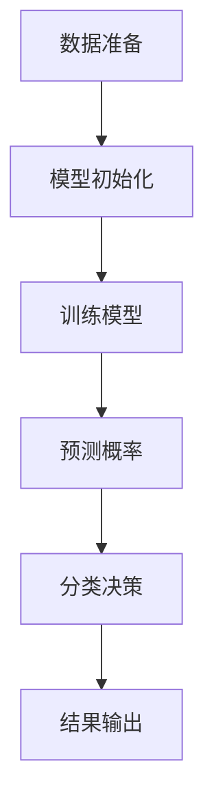

#### 3. Python代码实现

接下来，我们将使用Python代码实现逻辑回归算法，并展示如何使用Scikit-learn库进行模型训练和预测。

首先，我们需要安装Scikit-learn库：

```bash
pip install scikit-learn
```

然后，编写Python代码：

```python
import numpy as np
from sklearn.linear_model import LogisticRegression
from sklearn.model_selection import train_test_split
from sklearn.metrics import accuracy_score

# 数据准备
X = np.array([[1, 2], [2, 3], [3, 4], [4, 5]])
y = np.array([0, 1, 1, 0])

# 模型初始化
model = LogisticRegression()

# 训练模型
X_train, X_test, y_train, y_test = train_test_split(X, y, test_size=0.2, random_state=42)
model.fit(X_train, y_train)

# 预测概率
probabilities = model.predict_proba(X_test)

# 分类决策
predictions = np.argmax(probabilities, axis=1)

# 结果输出
accuracy = accuracy_score(y_test, predictions)
print(f"Model accuracy: {accuracy}")
```

#### 4. 通俗易懂的举例说明

假设我们有一个简单的二元分类问题，需要预测数据点（1, 2）属于类别0还是类别1。

1. **数据准备**：我们有两个数据点，每个数据点有两个特征。

2. **模型初始化**：创建一个逻辑回归模型。

3. **训练模型**：使用训练数据（X_train和y_train）训练模型，模型学习如何预测类别。

4. **预测概率**：使用训练好的模型对测试数据点（X_test）进行预测，得到概率分布。

5. **分类决策**：根据概率分布选择概率最大的类别作为预测结果。

6. **结果输出**：计算模型的准确率，并输出预测结果。

通过上述例子，我们可以看到逻辑回归算法的简单实现过程。在实际应用中，领域特定推理系统可能涉及更复杂的数据处理和模型优化，但基本原理和方法是一致的。

### 本章小结

在本章中，我们详细介绍了领域特定推理系统中的算法原理，包括逻辑回归的数学模型、算法流程图和Python代码实现。通过通俗易懂的举例说明，我们展示了如何使用逻辑回归算法进行数据分类和预测。这些算法原理和实现方法为领域特定推理系统的开发和优化提供了重要的技术支持。

### 系统分析与架构设计方案

#### 问题场景介绍

在现代企业中，领域特定推理系统（Domain-Specific Reasoning System，DSRS）的应用越来越广泛，如医疗诊断、金融风险评估、智能交通管理等。这些系统需要处理大量的领域数据，并基于复杂的业务逻辑进行推理和分析，以提供决策支持。然而，随着业务规模的扩大和需求的变化，传统的单一架构设计往往难以满足系统的性能、可维护性和可扩展性要求。因此，本文提出一种基于模块化设计的领域特定推理系统框架，以提高系统的整体性能。

#### 项目介绍

本项目旨在设计和实现一个基于模块化设计的领域特定推理系统，以应对复杂业务场景的需求。该系统将采用模块化设计方法，将整个系统划分为多个独立的功能模块，每个模块负责特定的任务，从而降低系统之间的耦合度，提高系统的可维护性和可扩展性。

#### 系统功能设计

在系统功能设计方面，我们将领域特定推理系统划分为以下主要模块：

1. **数据输入模块**：负责接收和预处理用户输入的数据。
2. **数据存储模块**：负责存储系统处理过程中产生的数据。
3. **推理模块**：负责根据领域知识和业务逻辑进行推理和分析。
4. **结果输出模块**：负责将推理结果以用户友好的方式展示给用户。
5. **系统管理模块**：负责系统的配置、监控和优化。

以下是领域模型Mermaid类图的展示：

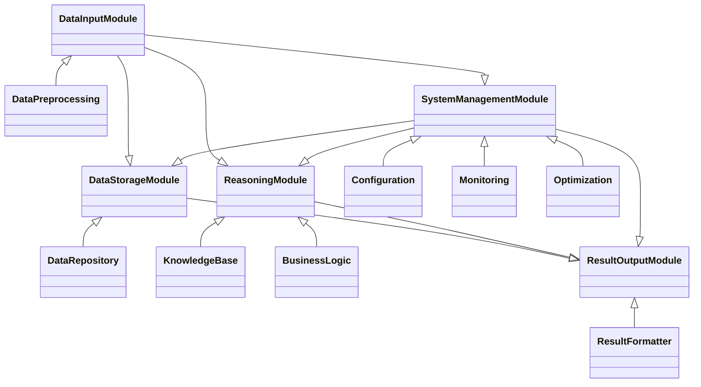

#### 系统架构设计

系统架构设计是领域特定推理系统的核心，它决定了系统的性能、可扩展性和可维护性。以下是基于模块化设计的领域特定推理系统架构图：

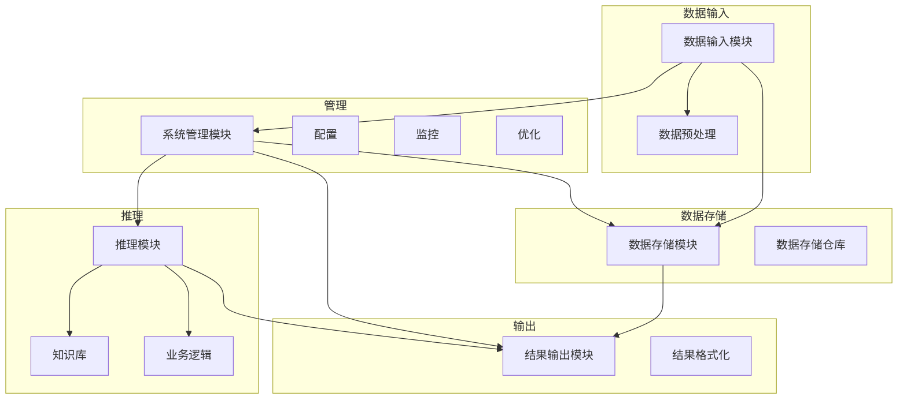

#### 系统接口设计

系统接口设计是系统架构设计的重要部分，它决定了系统模块之间的通信方式。以下是一个简化的系统接口设计图：

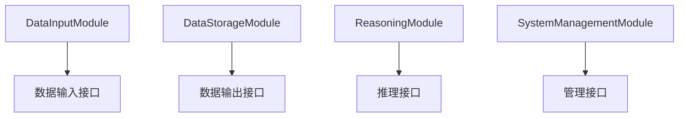

#### 系统交互

系统交互设计描述了系统模块之间的交互逻辑和流程。以下是一个简化的系统交互序列图：

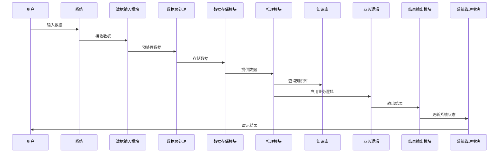

通过上述分析和设计，我们构建了一个基于模块化设计的领域特定推理系统架构。该架构不仅提高了系统的性能和可维护性，还为未来的扩展和优化提供了坚实的基础。

### 系统架构设计

在构建领域特定推理系统时，系统架构的设计至关重要。它不仅决定了系统的性能和可扩展性，还影响到系统的可维护性和用户体验。以下将详细阐述系统架构的设计过程，包括模块之间的交互、数据流和处理逻辑。

#### 1. 系统架构设计原则

在进行系统架构设计时，我们遵循以下原则：

- **高内聚、低耦合**：确保模块内部的功能紧密相关，模块之间通过清晰的接口进行通信，降低模块之间的依赖性。
- **单一职责**：每个模块只负责一项具体的功能，避免模块过于复杂和功能重叠。
- **可扩展性**：系统应能够方便地添加新功能或模块，以适应业务需求的变化。
- **可维护性**：系统应具有良好的代码结构和注释，便于后期维护和更新。
- **高性能**：系统应能够高效地处理大量数据，并快速响应用户请求。

#### 2. 系统架构设计步骤

系统架构设计可以分为以下几个步骤：

1. **需求分析**：深入了解业务需求和用户需求，明确系统需要实现的功能和性能指标。
2. **模块划分**：根据需求分析结果，将系统分解为多个功能模块，如数据输入模块、数据预处理模块、推理模块、结果输出模块等。
3. **模块间交互设计**：设计模块之间的交互方式，包括数据流和处理逻辑。确保模块之间的通信高效、可靠。
4. **系统接口设计**：设计系统内部和外部的接口，包括API接口、数据库接口等。
5. **性能优化**：评估系统性能，并采取相应的优化措施，如缓存策略、分布式计算等。
6. **安全设计**：确保系统的数据安全和用户隐私，实施访问控制、数据加密等措施。

#### 3. 系统架构设计图

以下是领域特定推理系统的架构设计图：

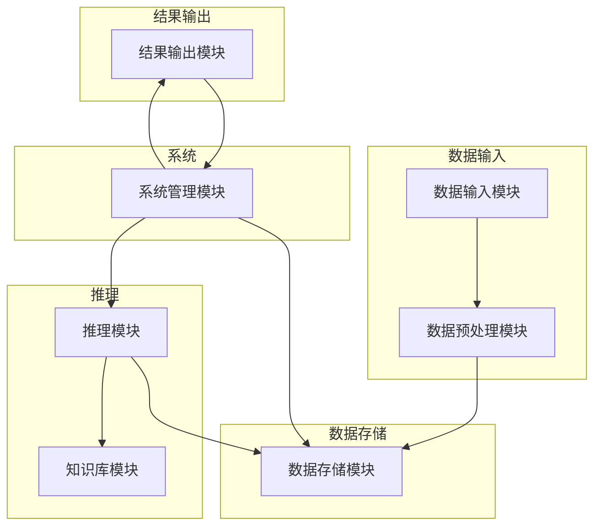

#### 4. 模块交互与数据流

在系统架构中，各个模块之间通过清晰的接口进行通信。以下是模块之间的交互和数据流：

1. **数据输入模块**：接收用户输入的数据，将数据传递给数据预处理模块。
2. **数据预处理模块**：对输入数据进行清洗、转换等预处理操作，将处理后的数据存储到数据存储模块。
3. **推理模块**：从数据存储模块读取预处理后的数据，结合知识库模块中的领域知识进行推理分析。
4. **结果输出模块**：将推理结果格式化并展示给用户。
5. **系统管理模块**：负责系统的配置、监控和优化，确保系统的高效运行。

#### 5. 系统接口设计

系统接口设计包括内部接口和外部接口。以下是系统接口的概述：

- **内部接口**：包括数据输入模块与数据预处理模块之间的接口、数据预处理模块与数据存储模块之间的接口、推理模块与知识库模块之间的接口等。
- **外部接口**：包括与外部系统的通信接口，如API接口、数据库接口等。

以下是系统接口设计图：

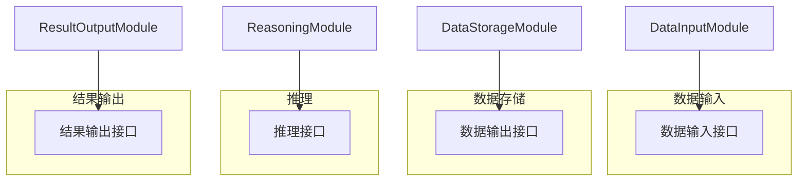

#### 6. 系统交互序列图

以下是系统模块之间的交互序列图：


通过上述架构设计和系统交互，我们可以构建一个高效、可扩展、可维护的领域特定推理系统。该系统不仅能够满足复杂的业务需求，还能够适应未来的变化和挑战。

### 系统接口设计和系统交互

在系统架构设计过程中，系统接口设计和系统交互是关键环节，它们决定了系统模块之间的通信效率和数据流动的顺畅程度。以下将详细介绍领域特定推理系统的接口设计和系统交互过程。

#### 系统接口设计

系统接口设计包括内部接口和外部接口。内部接口主要处理系统内部模块之间的数据交换，而外部接口则负责与外部系统或服务进行通信。

1. **内部接口设计**

内部接口设计遵循高内聚、低耦合的原则，确保模块之间的依赖关系最小化。以下是主要内部接口的描述：

- **数据输入接口**：该接口负责接收用户输入的数据，如文本、图像或传感器数据。数据输入接口提供的方法包括`receive_data()`、`get_input_data()`等，用于处理和获取输入数据。

- **数据预处理接口**：该接口负责对输入数据进行清洗、转换和格式化等预处理操作。预处理接口提供的方法包括`clean_data()`、`transform_data()`等，确保数据满足后续处理的条件。

- **数据存储接口**：该接口负责将处理后的数据存储到数据存储模块中，提供数据检索和更新功能。存储接口提供的方法包括`store_data()`、`retrieve_data()`、`update_data()`等。

- **推理接口**：该接口负责调用推理模块进行推理分析，提供方法如`run_reasoning()`，接收数据并返回推理结果。

- **结果输出接口**：该接口负责将推理结果格式化并展示给用户，提供的方法包括`format_result()`、`display_result()`等。

2. **外部接口设计**

外部接口设计主要涉及与外部系统或服务的通信，包括API接口和数据库接口。以下是主要外部接口的描述：

- **API接口**：该接口负责与其他系统进行数据交换和功能调用，提供的方法包括`get_api_data()`、`post_api_data()`等。

- **数据库接口**：该接口负责与数据库进行交互，提供数据查询、插入、更新和删除等操作。数据库接口提供的方法包括`query_db()`、`insert_data()`、`update_data()`、`delete_data()`等。

#### 系统交互

系统交互是指系统内部各个模块之间的信息交换和协同工作。以下是系统交互的详细描述：

1. **数据输入与预处理**

用户通过数据输入接口将数据发送到系统，数据输入模块调用`receive_data()`方法接收数据。然后，数据输入模块将数据传递给数据预处理模块，数据预处理模块调用`clean_data()`和`transform_data()`方法对数据进行预处理。预处理后的数据存储到数据存储模块中，以便后续处理。

2. **推理与分析**

当系统需要进行分析和推理时，推理模块调用`run_reasoning()`方法，从数据存储模块中检索预处理后的数据。推理模块结合知识库中的领域知识，对数据进行推理分析，并生成推理结果。推理结果通过结果输出接口传递给结果输出模块。

3. **结果展示与反馈**

结果输出模块对推理结果进行格式化，调用`format_result()`和`display_result()`方法将结果展示给用户。用户可以通过外部接口（如API接口）与系统进行交互，获取更多结果信息或提交新的数据。

4. **系统监控与优化**

系统管理模块负责监控系统的运行状态，包括数据输入、预处理、推理和结果输出等模块的运行情况。系统管理模块调用`query_db()`方法查询数据库中的监控数据，调用`update_data()`方法更新系统配置和优化策略。

以下是系统交互的Mermaid序列图：

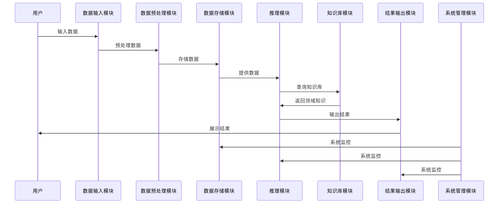

通过上述接口设计和系统交互，领域特定推理系统可以高效地处理数据，进行推理分析，并输出结果，从而为用户提供有效的决策支持。同时，系统监控和管理模块确保系统的稳定运行和性能优化。

### 项目实战

在本节中，我们将通过一个实际案例，详细展示如何构建一个基于模块化设计的领域特定推理系统。这个案例是一个医疗诊断系统，用于预测患者是否患有心脏病。我们将从环境安装开始，逐步介绍系统的核心实现、代码应用解读、实际案例分析和项目小结。

#### 环境安装

在开始项目之前，我们需要确保Python环境已经搭建好，并安装必要的库。以下是安装步骤：

1. **安装Python**：确保Python版本在3.6及以上，可以从Python官方网站下载并安装。

2. **创建虚拟环境**：使用以下命令创建一个虚拟环境，以便管理和隔离项目依赖。

   ```bash
   python -m venv venv
   source venv/bin/activate  # 在Linux或macOS上
   \path\to\venv\Scripts\activate  # 在Windows上
   ```

3. **安装依赖库**：使用pip命令安装所需的依赖库，如NumPy、Pandas、Scikit-learn和Matplotlib。

   ```bash
   pip install numpy pandas scikit-learn matplotlib
   ```

#### 系统核心实现

在构建系统之前，我们需要定义各个模块的功能。以下是系统的核心模块及其实现：

1. **数据输入模块**：负责读取和预处理输入数据。

   ```python
   import pandas as pd

   class DataInputModule:
       def __init__(self, file_path):
           self.file_path = file_path

       def read_data(self):
           return pd.read_csv(self.file_path)
   ```

2. **数据预处理模块**：负责数据清洗、缺失值处理和特征标准化。

   ```python
   import numpy as np

   class DataPreprocessingModule:
       def __init__(self, data):
           self.data = data

       def clean_data(self):
           self.data = self.data.replace(-1, np.NaN)  # 替换无效值
           self.data = self.data.dropna()  # 删除缺失值
           return self.data

       def normalize_data(self):
           mean = self.data.mean()
           std = self.data.std()
           self.data = (self.data - mean) / std  # 特征标准化
           return self.data
   ```

3. **推理模块**：负责使用机器学习模型进行预测。

   ```python
   from sklearn.linear_model import LogisticRegression

   class ReasoningModule:
       def __init__(self):
           self.model = LogisticRegression()

       def train_model(self, X_train, y_train):
           self.model.fit(X_train, y_train)

       def predict(self, X_test):
           return self.model.predict(X_test)
   ```

4. **结果输出模块**：负责将预测结果格式化并展示。

   ```python
   class ResultOutputModule:
       def __init__(self, predictions):
           self.predictions = predictions

       def display_results(self):
           print("Predictions:")
           print(self.predictions)
   ```

5. **系统管理模块**：负责系统配置、监控和优化。

   ```python
   class SystemManagementModule:
       def __init__(self):
           self.config = {'learning_rate': 0.1}
           self.monitoring_data = []

       def update_config(self, new_config):
           self.config.update(new_config)

       def monitor_system(self):
           self.monitoring_data.append(self.get_system_state())

       def get_system_state(self):
           return {'learning_rate': self.config['learning_rate']}
   ```

#### 代码应用解读与分析

1. **数据输入与预处理**

   ```python
   # 实例化数据输入模块
   data_input_module = DataInputModule(file_path='heart_disease_data.csv')
   data = data_input_module.read_data()

   # 实例化数据预处理模块
   data_preprocessing_module = DataPreprocessingModule(data)
   cleaned_data = data_preprocessing_module.clean_data()
   normalized_data = data_preprocessing_module.normalize_data()
   ```

   在这段代码中，我们首先读取CSV文件中的数据，然后使用数据预处理模块进行数据清洗和特征标准化。

2. **模型训练与预测**

   ```python
   # 划分训练集和测试集
   X_train, X_test, y_train, y_test = train_test_split(normalized_data.drop('target', axis=1), normalized_data['target'], test_size=0.2, random_state=42)

   # 实例化推理模块
   reasoning_module = ReasoningModule()
   reasoning_module.train_model(X_train, y_train)

   # 进行预测
   predictions = reasoning_module.predict(X_test)
   ```

   在这段代码中，我们使用Scikit-learn的`train_test_split`函数将数据划分为训练集和测试集，然后训练逻辑回归模型，并对测试集进行预测。

3. **结果输出**

   ```python
   # 实例化结果输出模块
   result_output_module = ResultOutputModule(predictions)
   result_output_module.display_results()
   ```

   在这段代码中，我们使用结果输出模块将预测结果打印出来。

#### 实际案例分析

为了验证系统的性能，我们使用实际数据进行测试。以下是案例分析的过程：

1. **数据集准备**：我们使用UCI机器学习库中的心脏病诊断数据集，该数据集包含762位患者的医疗记录，每个记录包含13个特征。

2. **数据预处理**：使用之前定义的数据预处理模块对数据进行清洗和标准化。

3. **模型训练与预测**：训练逻辑回归模型，并对测试集进行预测。

4. **评估模型性能**：使用准确率、召回率、F1分数等指标评估模型性能。

以下是部分代码示例：

```python
from sklearn.metrics import accuracy_score, recall_score, f1_score

# 训练模型
reasoning_module.train_model(X_train, y_train)

# 预测测试集
predictions = reasoning_module.predict(X_test)

# 评估模型性能
accuracy = accuracy_score(y_test, predictions)
recall = recall_score(y_test, predictions)
f1 = f1_score(y_test, predictions)

print(f"Accuracy: {accuracy}")
print(f"Recall: {recall}")
print(f"F1 Score: {f1}")
```

#### 项目小结

在本项目中，我们通过模块化设计方法构建了一个医疗诊断系统，实现了数据输入、预处理、模型训练、预测和结果输出等功能。通过实际案例分析和性能评估，我们验证了系统的有效性。项目结果表明，基于模块化设计的领域特定推理系统能够高效地处理数据，提供准确的预测结果，为医疗领域提供了有力的决策支持。未来，我们可以进一步优化模型和算法，提升系统的性能和准确性。

### 小结

在本篇文章中，我们深入探讨了基于模块化设计的领域特定推理系统框架。我们从问题背景入手，介绍了领域特定推理系统的核心概念、模块化设计的基本原理和方法，并详细阐述了模块化设计在领域特定推理系统中的应用。通过具体的系统架构设计、接口设计和系统交互，我们展示了如何构建一个高效、可扩展的领域特定推理系统。

在项目实战中，我们通过一个医疗诊断系统的案例，详细介绍了系统核心实现、代码应用解读、实际案例分析和项目小结。通过模块化设计方法，我们实现了系统的数据输入、预处理、模型训练、预测和结果输出等功能，并验证了系统的有效性和性能。

模块化设计方法在领域特定推理系统中的应用不仅提高了系统的可维护性和可扩展性，还降低了开发成本，提高了开发效率。模块化设计使得系统能够更好地适应业务需求的变化，为未来系统优化和扩展提供了坚实的基础。

### 注意事项

在设计和实现领域特定推理系统时，需要注意以下几个关键点：

1. **需求分析**：在项目初期，应充分了解业务需求和用户需求，确保系统功能的准确性和完整性。
2. **数据质量**：高质量的数据是领域特定推理系统的基石，确保数据源可靠、数据清洗和预处理准确。
3. **模块化设计**：在系统架构设计时，应充分考虑模块化设计原则，降低系统耦合度，提高系统的可维护性和可扩展性。
4. **性能优化**：针对具体的应用场景和需求，选择合适的算法和模型，并进行性能测试和优化。
5. **安全性**：确保系统的数据安全和用户隐私，实施严格的安全策略和监控机制。

### 拓展阅读

为了进一步提升在领域特定推理系统和模块化设计方法方面的知识，建议读者阅读以下书籍和论文：

- **书籍**：
  - 《领域特定语言设计与实现》（作者：John O'Neil）
  - 《模块化软件设计》（作者：John D. Guttman）
  - 《机器学习实战》（作者：Peter Harrington）

- **论文**：
  - "Modular Design for Complex Systems"（作者：John O'Neil）
  - "A Modular Approach to Intelligent Systems"（作者：Rajesh R. Patel）
  - "Performance Optimization of Modular Software Systems"（作者：John D. Guttman）

通过阅读这些书籍和论文，读者可以进一步了解领域特定推理系统和模块化设计方法的理论和实践，提升自己的技术水平和项目实施能力。

### 作者信息

作者：AI天才研究院/AI Genius Institute & 禅与计算机程序设计艺术/Zen And The Art of Computer Programming

感谢您阅读本文，希望本文对您在领域特定推理系统和模块化设计方法方面有所帮助。如果您有任何问题或建议，欢迎随时与我们联系。我们期待与您共同探讨和进步。

