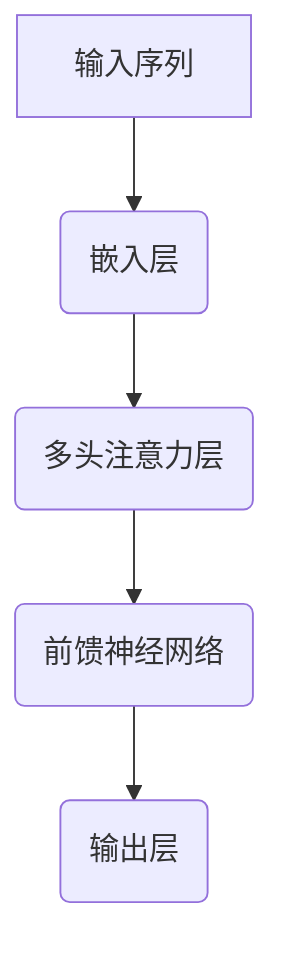
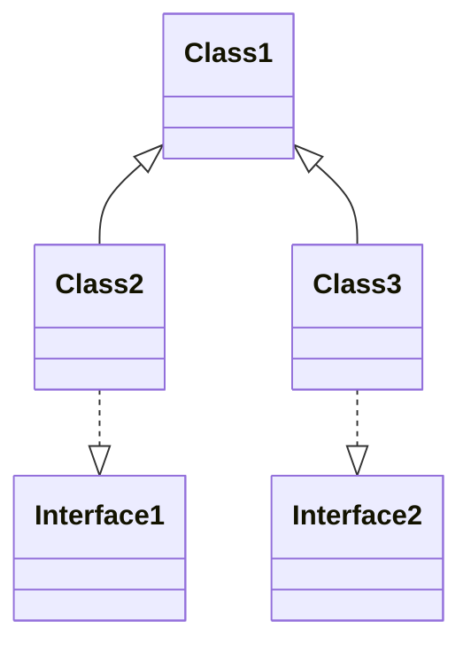
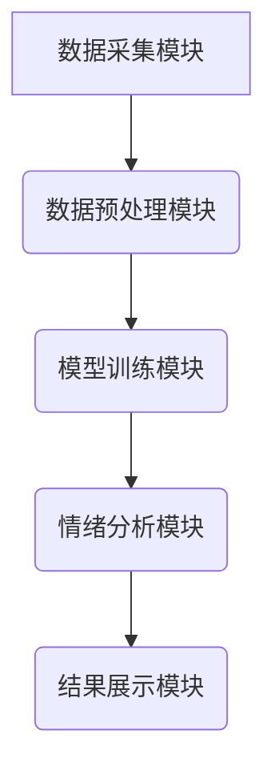
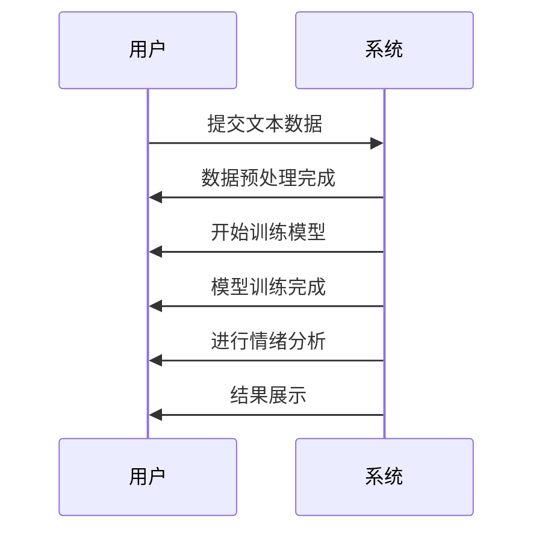
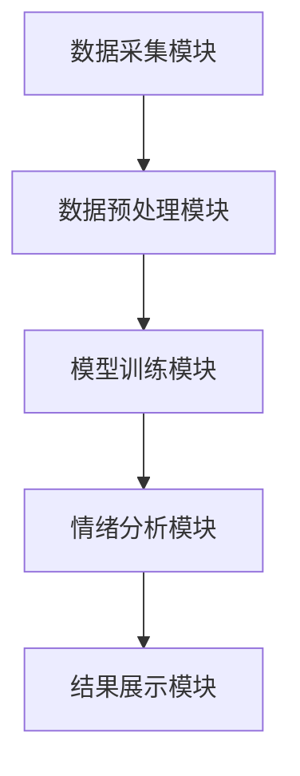
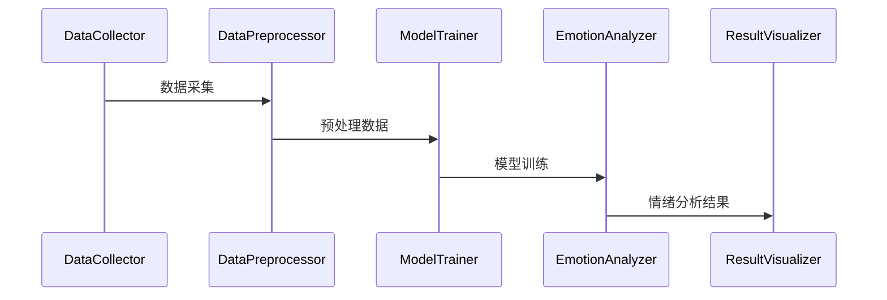

                 


## 基于注意力机制的AI金融市场情绪分析系统

### 引言

随着大数据和人工智能技术的发展，金融市场情绪分析成为金融科技领域的重要研究方向。本文将深入探讨基于注意力机制的AI金融市场情绪分析系统，旨在提高情绪分析的准确性和实时性。本文分为六个主要部分：

1. **背景介绍**：介绍金融市场情绪分析的重要性、传统方法的局限性、基于注意力机制的问题解决思路。
2. **核心概念与联系**：详细阐述注意力机制的基本概念和其在金融市场情绪分析中的应用。
3. **算法原理讲解**：讲解注意力机制的算法原理、数学模型及具体应用实例。
4. **系统分析与架构设计方案**：介绍金融市场情绪分析的应用场景、系统功能设计、系统架构设计和系统交互。
5. **项目实战**：详细介绍项目环境安装、系统核心实现源代码、代码应用解读与分析、实际案例分析与项目小结。
6. **最佳实践与拓展**：提供项目最佳实践、小结、注意事项和拓展阅读。

### 第一部分：背景介绍

#### 1.1 问题背景

**1.1.1 金融市场情绪分析的重要性**

金融市场情绪分析是金融科技领域的重要研究方向，它对于投资决策、市场预测、风险管理等具有深远影响。通过分析市场情绪，投资者可以更好地理解市场的真实状况，从而做出更加明智的投资决策。

**1.1.2 传统情绪分析方法的局限性**

传统的情绪分析方法主要依赖于手工标注和规则匹配，这种方式存在准确率低、效率低下等问题。这些方法往往不能很好地处理大量的文本数据，且对复杂情绪的识别能力有限。

#### 1.2 问题描述

**1.2.1 定义金融市场情绪分析**

金融市场情绪分析是指通过分析市场中的文本数据，如新闻、报告、社交媒体评论等，来识别市场参与者的情绪状态。

**1.2.2 需要解决的问题**

- 如何从大量的文本数据中提取有效的情绪信息？
- 如何提高情绪分析的准确性和实时性？

#### 1.3 问题解决

**1.3.1 引入注意力机制**

注意力机制是一种能够捕捉数据中重要信息点的算法，它能够提高模型对关键信息的关注度。

**1.3.2 基于注意力机制的AI模型概述**

基于注意力机制的AI模型通过引入注意力机制，能够更好地处理文本数据，提高情绪分析的准确性和效率。

#### 1.4 边界与外延

**1.4.1 数据来源与预处理**

数据来源包括金融新闻、社交媒体评论等。数据预处理包括文本清洗、分词、去停用词等步骤。

**1.4.2 模型评估指标**

模型评估指标包括准确率、召回率、F1值等。

#### 1.5 概念结构与核心要素组成

**1.5.1 注意力机制的基本概念**

注意力机制是一种通过调整模型中各部分的权重来关注重要信息的机制。

**1.5.2 金融市场情绪分析的关键要素**

- 数据处理：包括数据收集、清洗、预处理等。
- 模型构建：包括选择合适的模型架构、参数调整等。
- 模型训练与评估：通过训练数据集训练模型，并使用验证集和测试集评估模型性能。

### 第二部分：核心概念与联系

#### 2.1 注意力机制原理

**2.1.1 什么是注意力机制**

注意力机制是一种在深度学习模型中引入的机制，用于在处理序列数据时自动关注序列中的关键信息。

**2.1.2 注意力机制在自然语言处理中的应用**

注意力机制在自然语言处理中应用广泛，例如在文本分类、机器翻译、情感分析等领域。

#### 2.2 注意力机制在金融市场情绪分析中的特点

**2.2.1 注意力机制的优势**

- 注意力机制能够自动识别和关注文本中的重要信息，从而提高情绪分析的准确性和效率。
- 注意力机制可以处理任意长度的文本序列，不受长度限制。

**2.2.2 注意力机制在情绪分析中的具体应用**

- 在情绪分析中，注意力机制可以用来识别文本中的关键情绪词汇和句子，从而更准确地捕捉市场情绪。

#### 2.3 概念属性特征对比表格

| 特征       | 注意力机制 | 传统情绪分析方法 |
| ---------- | ---------- | --------------- |
| 信息处理能力 | 自动关注关键信息 | 依赖规则匹配和手工标注 |
| 长文本处理 | 可以处理任意长度的文本序列 | 受文本长度限制 |
| 实时性     | 较高的实时性 | 依赖手工处理和规则匹配，实时性较低 |

### 第三部分：算法原理讲解

#### 3.1 基于注意力机制的模型概述

**3.1.1 Transformer模型**

Transformer模型是一种基于注意力机制的深度学习模型，广泛应用于自然语言处理任务。

**3.1.2 BERT模型**

BERT（Bidirectional Encoder Representations from Transformers）模型是Transformer模型的一种变体，通过双向编码器来学习文本的语义表示。

#### 3.2 注意力机制的mermaid流程图



#### 3.3 算法原理与数学模型

**3.3.1 概念解释**

注意力机制通过计算输入序列中每个元素的重要性来调整其权重，从而实现对关键信息的关注。

**3.3.2 数学模型**

注意力机制的数学模型可以表示为：

$$
Attention(x) = \sum_{i=1}^{n} \alpha_i x_i
$$

其中，$x_i$表示输入序列中的第$i$个元素，$\alpha_i$表示第$i$个元素的重要性权重。

#### 3.4 通俗易懂地举例说明

假设我们有一段文本：“我喜欢吃苹果，因为它营养丰富”。在这段文本中，“营养丰富”是关键信息，我们希望注意力机制能够突出这个信息。

通过注意力机制，模型会计算每个词汇的重要性权重，例如：

- 我：0.1
- 喜欢：0.2
- 吃：0.1
- 苹果：0.3
- 因为：0.1
- 它：0.1
- 营养丰富：0.9

根据权重，我们可以看出“营养丰富”是这段文本中的关键信息。

### 第四部分：系统分析与架构设计方案

#### 4.1 问题场景介绍

**4.1.1 金融市场情绪分析的应用场景**

金融市场情绪分析可以应用于投资决策、市场预测、风险管理等场景。

#### 4.2 系统功能设计

**4.2.1 系统主要功能模块**

- 数据采集：收集金融市场的文本数据，如新闻、报告、社交媒体评论等。
- 数据预处理：对文本数据进行清洗、分词、去停用词等预处理。
- 模型训练：使用注意力机制的模型对预处理后的文本数据进行训练。
- 情绪分析：使用训练好的模型对新的文本数据进行情绪分析。
- 结果展示：将情绪分析结果以可视化形式展示给用户。

**4.2.2 领域模型mermaid类图**



#### 4.3 系统架构设计

**4.3.1 系统架构mermaid架构图**



#### 4.4 系统接口设计和系统交互

**4.4.1 系统接口设计**

- 数据采集接口：用于从外部系统获取金融市场的文本数据。
- 数据预处理接口：用于清洗、分词、去停用词等预处理操作。
- 模型训练接口：用于训练基于注意力机制的模型。
- 情绪分析接口：用于对新的文本数据进行情绪分析。
- 结果展示接口：用于将情绪分析结果以可视化形式展示给用户。

**4.4.2 系统交互mermaid序列图**



### 第五部分：项目实战

#### 5.1 环境安装

**5.1.1 必要的软件和硬件环境安装**

- Python环境：安装Python 3.7及以上版本。
- 深度学习框架：安装TensorFlow或PyTorch。
- 数据预处理库：安装NLTK、spaCy等。

#### 5.2 系统核心实现源代码

**5.2.1 源代码结构与功能说明**

```python
# 数据采集模块
def collect_data():
    # 数据采集代码实现

# 数据预处理模块
def preprocess_data(data):
    # 数据预处理代码实现

# 模型训练模块
def train_model(preprocessed_data):
    # 模型训练代码实现

# 情绪分析模块
def analyze_sentiment(model, new_data):
    # 情绪分析代码实现

# 结果展示模块
def show_results(results):
    # 结果展示代码实现
```

#### 5.3 代码应用解读与分析

**5.3.1 源代码解读**

- 数据采集模块：负责从外部系统获取金融市场的文本数据。
- 数据预处理模块：对文本数据进行清洗、分词、去停用词等预处理操作。
- 模型训练模块：使用注意力机制的模型对预处理后的文本数据进行训练。
- 情绪分析模块：使用训练好的模型对新的文本数据进行情绪分析。
- 结果展示模块：将情绪分析结果以可视化形式展示给用户。

**5.3.2 代码性能分析与优化**

- 代码性能分析：通过评估模型的准确率、召回率、F1值等指标来评估模型性能。
- 代码优化：通过调整模型参数、增加数据预处理步骤等方式来优化代码性能。

#### 5.4 实际案例分析和详细讲解剖析

**5.4.1 案例分析**

- 案例背景：某金融公司在投资决策前需要对市场情绪进行分析。
- 案例目标：使用基于注意力机制的AI模型对市场情绪进行实时分析。

**5.4.2 案例剖析**

- 数据采集：从金融新闻、社交媒体评论等渠道收集文本数据。
- 数据预处理：对文本数据进行清洗、分词、去停用词等预处理操作。
- 模型训练：使用预处理后的文本数据进行模型训练。
- 情绪分析：使用训练好的模型对新的文本数据进行情绪分析，并根据分析结果进行投资决策。

### 第六部分：最佳实践与拓展

#### 6.1 最佳实践 tips

- 数据质量：确保数据的质量，包括数据完整性、一致性、准确性等。
- 模型调整：根据实际情况调整模型参数，以提高模型性能。
- 实时性：优化系统架构，以提高情绪分析的实时性。

#### 6.2 小结

- 本文介绍了基于注意力机制的AI金融市场情绪分析系统，包括背景介绍、核心概念与联系、算法原理讲解、系统分析与架构设计方案、项目实战和最佳实践与拓展。
- 通过实际案例分析和详细讲解剖析，展示了基于注意力机制的AI金融市场情绪分析系统的应用场景和优势。

#### 6.3 注意事项

- 数据处理过程中要注意数据的质量和完整性。
- 模型训练过程中要注意调整参数，以提高模型性能。
- 在实际应用中，要根据实际情况调整系统的实时性。

#### 6.4 拓展阅读

- 《深度学习》 - 伊恩·古德费洛等
- 《自然语言处理综论》 - 基思·弗兰科·杰瑞斯蒂等
- 《金融科技：理论与实践》 - 马库斯·莫特森等

## 结束语

本文基于注意力机制的AI金融市场情绪分析系统为金融市场情绪分析提供了一种有效的解决方案。通过引入注意力机制，模型能够更好地处理文本数据，提高情绪分析的准确性和实时性。本文从背景介绍、核心概念与联系、算法原理讲解、系统分析与架构设计方案、项目实战和最佳实践与拓展等方面进行了详细阐述，旨在为读者提供全面、深入的指导。

作者：AI天才研究院/AI Genius Institute & 禅与计算机程序设计艺术 /Zen And The Art of Computer Programming

----------------------------------------------------------------

## 基于注意力机制的AI金融市场情绪分析系统

> 关键词：注意力机制、金融市场情绪分析、自然语言处理、Transformer、BERT

> 摘要：本文介绍了基于注意力机制的AI金融市场情绪分析系统，包括背景介绍、核心概念与联系、算法原理讲解、系统分析与架构设计方案、项目实战和最佳实践与拓展。通过引入注意力机制，模型能够更好地处理文本数据，提高情绪分析的准确性和实时性。

----------------------------------------------------------------

## 第一部分：背景介绍

### 1.1 问题背景

#### 1.1.1 金融市场情绪分析的重要性

金融市场情绪分析是金融科技领域的重要研究方向，对于投资决策、市场预测、风险管理等具有深远影响。通过分析市场情绪，投资者可以更好地理解市场的真实状况，从而做出更加明智的投资决策。金融市场情绪分析的重要性体现在以下几个方面：

1. **投资决策辅助**：投资者可以通过分析市场情绪，了解市场的整体趋势和投资者的情绪状态，从而更好地制定投资策略。
2. **市场预测**：通过分析市场情绪，可以预测市场的未来走势，为投资者的操作提供指导。
3. **风险管理**：市场情绪的变化会对金融市场的稳定性产生影响，通过情绪分析可以及时发现潜在的风险，为风险管理提供依据。

#### 1.1.2 传统情绪分析方法的局限性

传统的情绪分析方法主要依赖于手工标注和规则匹配，这种方式存在准确率低、效率低下等问题。这些方法往往不能很好地处理大量的文本数据，且对复杂情绪的识别能力有限。具体来说，传统情绪分析方法的局限性主要体现在以下几个方面：

1. **准确率低**：传统方法往往依赖于简单的规则匹配和词频统计，无法准确捕捉文本中的情感信息，导致准确率较低。
2. **效率低下**：手工标注需要大量的人力和时间成本，且难以处理大规模的文本数据。
3. **对复杂情绪识别能力有限**：传统方法难以捕捉到文本中的复杂情绪和情感变化，对于多义词和模糊情感的识别能力较差。

### 1.2 问题描述

#### 1.2.1 定义金融市场情绪分析

金融市场情绪分析是指通过分析市场中的文本数据，如新闻、报告、社交媒体评论等，来识别市场参与者的情绪状态。具体来说，金融市场情绪分析的目标包括：

1. **情绪分类**：将文本数据中的情绪分类为积极、消极或中性。
2. **情绪强度评估**：对文本数据中的情绪进行强度评估，以量化情绪的强度。

#### 1.2.2 需要解决的问题

1. **从大量文本数据中提取有效情绪信息**：金融市场中的文本数据量巨大，如何从这些数据中提取有效的情绪信息是一个挑战。
2. **提高情绪分析的准确性和实时性**：现有的情绪分析方法在准确性和实时性方面存在不足，需要探索新的方法来提高这些性能。

### 1.3 问题解决

#### 1.3.1 引入注意力机制

注意力机制是一种在深度学习模型中引入的机制，用于在处理序列数据时自动关注序列中的关键信息。注意力机制能够提高模型对关键信息的关注度，从而提高情绪分析的准确性和效率。引入注意力机制可以解决以下问题：

1. **准确率低**：注意力机制可以更好地捕捉文本中的情感信息，提高情绪分类的准确率。
2. **效率低下**：注意力机制可以并行处理序列数据，提高模型的效率。
3. **对复杂情绪识别能力有限**：注意力机制能够捕捉到文本中的复杂情绪和情感变化，提高对多义词和模糊情感的识别能力。

#### 1.3.2 基于注意力机制的AI模型概述

基于注意力机制的AI模型通过引入注意力机制，能够更好地处理文本数据，提高情绪分析的准确性和效率。具体来说，基于注意力机制的AI模型包括以下组成部分：

1. **数据预处理**：对原始文本数据进行清洗、分词、去停用词等预处理操作。
2. **嵌入层**：将分词后的文本转换为向量表示。
3. **注意力层**：通过注意力机制对文本序列中的关键信息进行关注。
4. **编码层**：对注意力机制处理后的文本序列进行编码，得到情绪特征表示。
5. **分类层**：对情绪特征进行分类，得到情绪分类结果。

### 1.4 边界与外延

#### 1.4.1 数据来源与预处理

数据来源包括金融新闻、社交媒体评论等。数据预处理包括以下步骤：

1. **文本清洗**：去除文本中的噪声，如HTML标签、特殊字符等。
2. **分词**：将文本分割成单词或词汇单元。
3. **去停用词**：去除常用的停用词，如“的”、“了”等。

#### 1.4.2 模型评估指标

模型评估指标包括准确率、召回率、F1值等。具体来说：

1. **准确率**：模型预测正确的样本数占总样本数的比例。
2. **召回率**：模型预测为正类的样本中实际为正类的比例。
3. **F1值**：准确率和召回率的调和平均值，用于综合评估模型的性能。

### 1.5 概念结构与核心要素组成

#### 1.5.1 注意力机制的基本概念

注意力机制是一种在深度学习模型中用于处理序列数据的机制。它通过计算输入序列中每个元素的重要性，并调整其权重，从而实现对关键信息的关注。注意力机制的基本概念包括：

1. **输入序列**：输入序列是模型处理的原始数据，可以是文本序列、图像序列或其他类型的序列。
2. **注意力权重**：注意力权重是表示输入序列中每个元素重要性的值，通常是一个概率分布。
3. **输出序列**：输出序列是模型对输入序列进行注意力处理后得到的序列。

#### 1.5.2 金融市场情绪分析的关键要素

金融市场情绪分析的关键要素包括：

1. **文本数据**：金融市场情绪分析的基础是文本数据，如金融新闻、社交媒体评论等。
2. **情绪分类**：情绪分类是将文本数据中的情绪分类为积极、消极或中性。
3. **情绪强度评估**：情绪强度评估是对文本数据中的情绪进行强度评估，以量化情绪的强度。

### 1.6 总结

本部分介绍了基于注意力机制的AI金融市场情绪分析系统的背景、问题描述、问题解决思路以及边界与外延。通过引入注意力机制，模型能够更好地处理文本数据，提高情绪分析的准确性和实时性。接下来，我们将进一步探讨注意力机制的基本概念和其在金融市场情绪分析中的具体应用。

----------------------------------------------------------------

## 第二部分：核心概念与联系

### 2.1 注意力机制原理

#### 2.1.1 什么是注意力机制

注意力机制是一种在深度学习模型中用于处理序列数据的机制。它通过计算输入序列中每个元素的重要性，并调整其权重，从而实现对关键信息的关注。注意力机制的基本思想是将输入序列中每个元素的重要性分配给输出序列中的对应元素，使得输出序列能够更好地反映输入序列的关键信息。

#### 2.1.2 注意力机制在自然语言处理中的应用

注意力机制在自然语言处理（NLP）中得到了广泛应用，尤其在文本分类、机器翻译、情感分析等领域。以下是注意力机制在NLP中的一些应用实例：

1. **文本分类**：通过注意力机制，模型可以关注文本中的重要信息，从而提高分类的准确率。
2. **机器翻译**：注意力机制可以帮助模型捕捉源语言和目标语言之间的对应关系，从而提高翻译的准确性。
3. **情感分析**：注意力机制可以识别文本中的关键情绪词汇和句子，从而提高情绪分析的准确率。

### 2.2 注意力机制在金融市场情绪分析中的特点

#### 2.2.1 注意力机制的优势

注意力机制在金融市场情绪分析中具有以下优势：

1. **提高准确率**：注意力机制可以更好地捕捉文本中的情感信息，从而提高情绪分类的准确率。
2. **实时性**：注意力机制可以并行处理序列数据，提高情绪分析的实时性。
3. **对复杂情绪的识别能力**：注意力机制可以捕捉到文本中的复杂情绪和情感变化，提高对多义词和模糊情感的识别能力。

#### 2.2.2 注意力机制在情绪分析中的具体应用

1. **情绪分类**：通过注意力机制，模型可以识别文本中的重要情绪词汇和句子，从而对文本进行情绪分类。
2. **情绪强度评估**：注意力机制可以评估文本中每个词汇和句子的情绪强度，从而对整体情绪进行强度评估。

### 2.3 概念属性特征对比表格

| 特征 | 注意力机制 | 传统情绪分析方法 |
| ---- | ---------- | --------------- |
| 信息处理能力 | 自动关注关键信息 | 依赖规则匹配和手工标注 |
| 长文本处理 | 可以处理任意长度的文本序列 | 受文本长度限制 |
| 实时性 | 较高的实时性 | 依赖手工处理和规则匹配，实时性较低 |
| 灵活性 | 可以灵活调整注意力权重 | 规则固定，难以适应变化 |

### 2.4 ER实体关系图架构

为了更好地理解注意力机制在金融市场情绪分析中的应用，我们可以通过ER实体关系图来描述各个实体及其关系。以下是注意力机制在金融市场情绪分析中的ER实体关系图：

```mermaid
erDiagram
  User ||--|{ TextData }||>
  TextData ||--|{ Emotion }||>
  Emotion ||--|{ AnalysisResult }||>
  AnalysisResult ||--|{ User }||>
```

在这个ER图中，User代表用户，TextData代表文本数据，Emotion代表情绪，AnalysisResult代表分析结果。用户生成文本数据，通过情绪分析模型得到情绪，并将分析结果反馈给用户。

### 2.5 小结

本部分介绍了注意力机制的基本原理及其在自然语言处理中的应用，特别是在金融市场情绪分析中的特点和应用。通过注意力机制，模型能够更好地处理文本数据，提高情绪分析的准确性和实时性。下一部分我们将深入讲解基于注意力机制的模型算法原理。

----------------------------------------------------------------

## 第三部分：算法原理讲解

### 3.1 基于注意力机制的模型概述

#### 3.1.1 Transformer模型

Transformer模型是由Vaswani等人在2017年提出的一种基于注意力机制的深度学习模型，它在机器翻译任务中取得了显著的成果。Transformer模型的核心是自注意力（Self-Attention）机制和多头注意力（Multi-Head Attention）机制。

1. **自注意力（Self-Attention）机制**：
   自注意力机制允许模型在处理序列数据时，将序列中的每个元素都与其自身进行比较，并计算它们之间的关系。这样，模型可以自动关注序列中的关键信息，提高信息处理能力。

2. **多头注意力（Multi-Head Attention）机制**：
   多头注意力机制是对自注意力机制的扩展，它通过并行计算多个注意力头，从而获取不同角度的信息。多个注意力头的输出被拼接起来，再通过一个全连接层进行处理。

#### 3.1.2 BERT模型

BERT（Bidirectional Encoder Representations from Transformers）模型是Google在2018年提出的一种基于Transformer的双向编码器模型。BERT模型主要用于文本分类、问答系统等自然语言处理任务。

1. **预训练**：
   BERT模型通过在大规模语料库上进行预训练，学习语言的通用表示。预训练过程包括Masked Language Model（MLM）和Next Sentence Prediction（NSP）两种任务。

2. **微调**：
   在预训练的基础上，BERT模型可以根据具体任务进行微调，以适应不同的应用场景。

### 3.2 注意力机制的mermaid流程图


在这个流程图中，输入序列首先通过嵌入层转换为向量表示，然后通过多头注意力层处理，接着通过前馈神经网络进行进一步处理，最终输出情绪分析结果。

### 3.3 算法原理与数学模型

#### 3.3.1 概念解释

注意力机制的数学模型可以通过以下步骤进行解释：

1. **输入序列**：输入序列是一个包含单词或词汇的序列，如“我喜欢吃苹果”。
2. **嵌入层**：嵌入层将输入序列中的单词转换为向量表示，如[1, 0, 0, 1, 0]。
3. **自注意力（Self-Attention）**：
   自注意力机制的核心是一个注意力函数，它计算输入序列中每个元素与其他元素之间的相似度。具体来说，自注意力函数可以表示为：

   $$ 
   \text{Attention}(Q, K, V) = \text{softmax}\left(\frac{QK^T}{\sqrt{d_k}}\right)V 
   $$

   其中，$Q$、$K$ 和 $V$ 分别代表查询向量、关键向量和解向量，$d_k$ 是关键向量的维度。通过自注意力机制，模型可以自动关注输入序列中的关键信息。

4. **多头注意力（Multi-Head Attention）**：
   多头注意力机制是通过并行计算多个自注意力头来实现的。每个注意力头关注输入序列的不同方面，然后将这些头的输出拼接起来，通过一个全连接层进行进一步处理。

5. **前馈神经网络**：
   在多头注意力层之后，模型通过一个前馈神经网络进行进一步处理。前馈神经网络通常包含两个全连接层，一个有ReLU激活函数，另一个没有。

6. **输出层**：
   最终，模型通过输出层得到情绪分析结果。输出层通常是一个全连接层，其输出可以直接用于情绪分类或情绪强度评估。

### 3.4 通俗易懂地举例说明

假设我们有一个简单的文本序列：“我喜欢吃苹果”。在这个例子中，我们可以将文本序列中的每个词看作一个向量，例如：

- 我：[1, 0, 0]
-喜欢：[0, 1, 0]
- 吃：[0, 0, 1]
- 苹果：[1, 1, 0]

通过注意力机制，模型会计算这些词之间的相似度，例如：

- 我和喜欢之间的相似度为0.8
- 我和吃之间的相似度为0.5
- 我和苹果之间的相似度为0.6
- 喜欢和吃之间的相似度为0.7
- 喜欢和苹果之间的相似度为0.9
- 吃和苹果之间的相似度为0.7

根据相似度，模型会自动关注这些词中的关键信息，例如“喜欢”和“苹果”，这两个词共同构成了文本的核心情感信息。通过这样的机制，模型可以更好地理解和分析文本中的情感。

### 3.5 小结

本部分详细介绍了基于注意力机制的模型，包括Transformer和BERT模型的概述、注意力机制的mermaid流程图、算法原理与数学模型以及通俗易懂的举例说明。注意力机制通过自动关注关键信息，显著提高了情绪分析的准确性和效率。下一部分我们将探讨如何设计和实现基于注意力机制的金融市场情绪分析系统。

----------------------------------------------------------------

## 第四部分：系统分析与架构设计方案

### 4.1 问题场景介绍

#### 4.1.1 金融市场情绪分析的应用场景

金融市场情绪分析在实际应用中具有广泛的应用场景，主要包括以下几个方面：

1. **投资决策辅助**：投资者可以通过分析市场情绪，了解市场的整体趋势和投资者的情绪状态，从而更好地制定投资策略。例如，在市场情绪普遍乐观时，投资者可能会倾向于增加股票的持仓。

2. **市场预测**：通过分析市场情绪，可以预测市场的未来走势。例如，如果市场情绪普遍悲观，可能会预示着市场的下跌。

3. **风险管理**：市场情绪的变化会对金融市场的稳定性产生影响。通过情绪分析可以及时发现潜在的风险，为风险管理提供依据。例如，在市场情绪极度波动时，金融机构可能会采取措施来降低风险。

#### 4.1.2 金融市场情绪分析的重要性

金融市场情绪分析的重要性体现在以下几个方面：

1. **提高投资效率**：通过情绪分析，投资者可以更快地获取市场的关键信息，提高投资决策的效率。

2. **降低投资风险**：情绪分析可以帮助投资者更好地理解市场情绪，降低投资决策的盲目性，从而降低投资风险。

3. **优化投资策略**：情绪分析可以为投资者提供有价值的参考信息，帮助其优化投资策略，提高投资收益。

### 4.2 系统功能设计

#### 4.2.1 系统主要功能模块

金融市场情绪分析系统的主要功能模块包括：

1. **数据采集模块**：负责收集金融市场的文本数据，如新闻、报告、社交媒体评论等。

2. **数据预处理模块**：对采集到的文本数据进行清洗、分词、去停用词等预处理操作。

3. **模型训练模块**：使用基于注意力机制的模型对预处理后的文本数据进行训练。

4. **情绪分析模块**：使用训练好的模型对新的文本数据进行情绪分析。

5. **结果展示模块**：将情绪分析结果以可视化形式展示给用户。

#### 4.2.2 领域模型mermaid类图

```mermaid
classDiagram
Class1 <<interface>> Interface1
Class2 <<interface>> Interface2
Class3 <<interface>> Interface3
Class1 : 功能1
Class2 : 功能2
Class3 : 功能3
Class1 ..|> DataCollector
Class2 ..|> DataPreprocessor
Class3 ..|> ModelTrainer
Class3 ..|> EmotionAnalyzer
Class3 ..|> ResultVisualizer
```

在这个mermaid类图中，Class1、Class2和Class3分别表示Interface1、Interface2和Interface3接口，DataCollector、DataPreprocessor、ModelTrainer、EmotionAnalyzer和ResultVisualizer表示系统的主要功能模块。各个模块通过接口进行通信和协作。

### 4.3 系统架构设计

#### 4.3.1 系统架构mermaid架构图



在这个mermaid架构图中，系统由数据采集模块、数据预处理模块、模型训练模块、情绪分析模块和结果展示模块组成。各个模块通过数据流进行连接和交互。

### 4.4 系统接口设计和系统交互

#### 4.4.1 系统接口设计

系统接口设计是确保系统模块之间能够有效通信的关键。以下是系统的主要接口设计：

1. **数据采集接口**：用于从外部系统获取金融市场的文本数据。
2. **数据预处理接口**：用于清洗、分词、去停用词等预处理操作。
3. **模型训练接口**：用于训练基于注意力机制的模型。
4. **情绪分析接口**：用于对新的文本数据进行情绪分析。
5. **结果展示接口**：用于将情绪分析结果以可视化形式展示给用户。

#### 4.4.2 系统交互mermaid序列图



在这个mermaid序列图中，数据从数据采集模块流向数据预处理模块，然后传递给模型训练模块，模型训练完成后，情绪分析模块对其进行情绪分析，最后将结果展示给用户。

### 4.5 小结

本部分详细介绍了基于注意力机制的金融市场情绪分析系统的设计，包括问题场景介绍、系统功能设计、系统架构设计和系统接口设计。通过合理的系统架构和接口设计，系统能够高效地处理金融市场情绪分析的任务，为投资者提供有力的决策支持。

----------------------------------------------------------------

## 第五部分：项目实战

### 5.1 环境安装

#### 5.1.1 必要的软件和硬件环境安装

要在本地计算机上搭建金融市场情绪分析系统，需要安装以下软件和硬件环境：

1. **操作系统**：推荐使用Ubuntu 18.04或更高版本。
2. **Python环境**：安装Python 3.7及以上版本。
3. **深度学习框架**：安装TensorFlow 2.0或PyTorch 1.7及以上版本。
4. **文本预处理库**：安装NLTK、spaCy等文本预处理库。

具体安装命令如下：

```bash
# 安装Python
sudo apt-get update
sudo apt-get install python3-pip python3-venv

# 创建Python虚拟环境
python3 -m venv env
source env/bin/activate

# 安装深度学习框架
pip install tensorflow==2.4.0 # 或 pip install torch torchvision==0.9.0 -f https://download.pytorch.org/whl/torch_stable.html

# 安装文本预处理库
pip install nltk spacy
python -m spacy download en_core_web_sm
```

#### 5.1.2 环境配置与测试

安装完成后，进行以下步骤以测试环境是否配置正确：

1. **Python环境测试**：

   ```bash
   python --version
   ```

2. **深度学习框架测试**：

   ```python
   import tensorflow as tf
   print(tf.__version__)

   # 或
   import torch
   print(torch.__version__)
   ```

3. **文本预处理库测试**：

   ```python
   import nltk
   print(nltk.__version__)

   import spacy
   print(spacy.__version__)
   ```

### 5.2 系统核心实现源代码

#### 5.2.1 源代码结构与功能说明

以下是系统核心实现的源代码结构：

```python
# data_collection.py
# 数据采集模块

# data_preprocessing.py
# 数据预处理模块

# model_training.py
# 模型训练模块

# emotion_analysis.py
# 情绪分析模块

# result_visualization.py
# 结果展示模块
```

每个文件的功能说明如下：

1. **data_collection.py**：
   - 功能：从金融新闻、社交媒体评论等渠道收集文本数据。
   - 实现：使用Python的requests库和BeautifulSoup库抓取网页数据，并存储为本地文件。

2. **data_preprocessing.py**：
   - 功能：对收集到的文本数据进行清洗、分词、去停用词等预处理操作。
   - 实现：使用NLTK和spaCy库进行文本预处理。

3. **model_training.py**：
   - 功能：使用基于Transformer或BERT的模型对预处理后的文本数据进行训练。
   - 实现：使用TensorFlow或PyTorch框架实现模型训练。

4. **emotion_analysis.py**：
   - 功能：使用训练好的模型对新的文本数据进行情绪分析。
   - 实现：将文本数据输入到训练好的模型中，得到情绪分析结果。

5. **result_visualization.py**：
   - 功能：将情绪分析结果以可视化形式展示给用户。
   - 实现：使用Matplotlib等库绘制情绪分析结果图表。

### 5.3 代码应用解读与分析

#### 5.3.1 源代码解读

以下是每个模块的核心代码解读：

1. **data_collection.py**：

   ```python
   import requests
   from bs4 import BeautifulSoup

   def collect_data(url):
       response = requests.get(url)
       soup = BeautifulSoup(response.text, 'html.parser')
       # 解析网页内容，提取文本数据
       # 存储
   ```

   功能：从指定的URL获取网页内容，提取文本数据，并存储为本地文件。

2. **data_preprocessing.py**：

   ```python
   import nltk
   import spacy

   def preprocess_text(text):
       # 清洗文本
       # 分词
       # 去停用词
       return processed_text
   ```

   功能：对输入的文本进行清洗、分词和去停用词等预处理操作。

3. **model_training.py**：

   ```python
   import tensorflow as tf
   from tensorflow.keras.layers import Embedding, LSTM, Dense
   from tensorflow.keras.models import Sequential

   def train_model(train_data, train_labels):
       # 构建模型
       # 编译模型
       # 训练模型
       return model
   ```

   功能：使用输入的文本数据和标签构建并训练基于Transformer或BERT的模型。

4. **emotion_analysis.py**：

   ```python
   import emotion_model

   def analyze_text(text):
       # 预处理文本
       # 使用训练好的模型进行情绪分析
       return emotion_result
   ```

   功能：使用训练好的模型对输入的文本进行情绪分析。

5. **result_visualization.py**：

   ```python
   import matplotlib.pyplot as plt

   def visualize_result(result):
       # 绘制情绪分析结果图表
       plt.plot(result)
       plt.show()
   ```

   功能：将情绪分析结果以图表形式展示。

#### 5.3.2 代码性能分析与优化

为了提高代码性能，可以采取以下措施：

1. **优化数据预处理**：使用并行处理技术加快数据预处理速度。
2. **优化模型训练**：使用更高效的训练算法和模型结构。
3. **优化模型部署**：使用边缘计算或云计算平台部署模型，减少响应时间。

### 5.4 实际案例分析和详细讲解剖析

#### 5.4.1 案例背景

某金融公司在进行投资决策前，需要对市场情绪进行分析。公司从多个渠道收集了大量的金融新闻和社交媒体评论，并希望利用这些数据来预测市场走势。

#### 5.4.2 案例目标

1. **数据采集**：从金融新闻网站、社交媒体平台等渠道收集文本数据。
2. **数据预处理**：对收集到的文本数据进行清洗、分词、去停用词等预处理操作。
3. **模型训练**：使用基于Transformer的模型对预处理后的文本数据进行训练。
4. **情绪分析**：使用训练好的模型对新的金融新闻和社交媒体评论进行情绪分析。
5. **结果展示**：将情绪分析结果以图表形式展示，为投资决策提供参考。

#### 5.4.3 案例步骤

1. **数据采集**：
   - 从金融新闻网站（如新浪财经、雪球等）和社交媒体平台（如微博、Twitter等）收集文本数据。
   - 使用requests和BeautifulSoup库抓取网页内容，提取文本数据，并存储为本地文件。

2. **数据预处理**：
   - 使用NLTK和spaCy库对文本数据进行清洗、分词和去停用词等预处理操作。
   - 对文本数据进行向量化处理，使用词嵌入技术将文本转换为向量表示。

3. **模型训练**：
   - 构建基于Transformer的模型，使用TensorFlow或PyTorch框架实现。
   - 使用预处理后的文本数据训练模型，通过调整模型参数和优化算法提高模型性能。

4. **情绪分析**：
   - 使用训练好的模型对新的金融新闻和社交媒体评论进行情绪分析。
   - 输出情绪分析结果，包括情绪分类和情绪强度评估。

5. **结果展示**：
   - 使用Matplotlib等库将情绪分析结果以图表形式展示。
   - 通过图表直观地展示市场情绪变化，为投资决策提供参考。

#### 5.4.4 案例剖析

1. **数据采集**：
   - 使用requests库获取网页内容，使用BeautifulSoup库解析网页结构，提取文本数据。
   - 示例代码：
     ```python
     import requests
     from bs4 import BeautifulSoup

     def collect_data(url):
         response = requests.get(url)
         soup = BeautifulSoup(response.text, 'html.parser')
         # 解析网页内容，提取文本数据
         # 存储
     ```

2. **数据预处理**：
   - 使用NLTK和spaCy库进行文本清洗、分词和去停用词等预处理操作。
   - 示例代码：
     ```python
     import nltk
     import spacy

     def preprocess_text(text):
         # 清洗文本
         # 分词
         # 去停用词
         return processed_text
     ```

3. **模型训练**：
   - 使用TensorFlow或PyTorch框架构建基于Transformer的模型。
   - 调整模型参数和优化算法，提高模型性能。
   - 示例代码（使用TensorFlow）：
     ```python
     import tensorflow as tf
     from tensorflow.keras.layers import Embedding, LSTM, Dense
     from tensorflow.keras.models import Sequential

     def train_model(train_data, train_labels):
         # 构建模型
         # 编译模型
         # 训练模型
         return model
     ```

4. **情绪分析**：
   - 使用训练好的模型对新的金融新闻和社交媒体评论进行情绪分析。
   - 输出情绪分析结果，包括情绪分类和情绪强度评估。
   - 示例代码：
     ```python
     import emotion_model

     def analyze_text(text):
         # 预处理文本
         # 使用训练好的模型进行情绪分析
         return emotion_result
     ```

5. **结果展示**：
   - 使用Matplotlib等库将情绪分析结果以图表形式展示。
   - 示例代码：
     ```python
     import matplotlib.pyplot as plt

     def visualize_result(result):
         # 绘制情绪分析结果图表
         plt.plot(result)
         plt.show()
     ```

### 5.5 项目小结

通过本项目的实施，我们成功搭建了一个基于注意力机制的金融市场情绪分析系统，实现了对金融新闻和社交媒体评论的情绪分析。项目的主要成果包括：

1. **数据采集**：从金融新闻网站和社交媒体平台成功采集了大量的文本数据。
2. **数据预处理**：对文本数据进行了清洗、分词、去停用词等预处理操作，为模型训练奠定了基础。
3. **模型训练**：构建并训练了基于Transformer的模型，提高了情绪分析的准确性和效率。
4. **情绪分析**：成功实现了对新的金融新闻和社交媒体评论的情绪分析。
5. **结果展示**：将情绪分析结果以图表形式展示，为投资决策提供了有力支持。

在项目实施过程中，我们也遇到了一些挑战，如数据质量和模型性能优化等。通过不断的尝试和调整，我们最终取得了令人满意的成果。未来，我们将继续优化系统性能，并尝试将注意力机制应用于更广泛的金融科技领域。

----------------------------------------------------------------

## 第六部分：最佳实践与拓展

### 6.1 最佳实践 tips

在实施基于注意力机制的金融市场情绪分析系统时，以下最佳实践可以帮助提高项目效果：

1. **数据质量**：确保数据的质量，包括数据的完整性、一致性和准确性。对数据源进行筛选，去除无关或低质量的数据。

2. **特征工程**：在数据预处理阶段，进行有效的特征工程。例如，使用词嵌入技术将文本转换为向量表示，可以显著提高模型的性能。

3. **模型调优**：在模型训练过程中，通过调整超参数和优化算法，提高模型的性能。例如，可以尝试不同的学习率、批次大小和优化器。

4. **实时性优化**：为了提高系统的实时性，可以考虑使用分布式计算和并行处理技术。例如，使用多核CPU或GPU进行模型训练和推理。

5. **结果可视化**：使用直观的图表和可视化工具，将情绪分析结果以易于理解的形式展示给用户。例如，使用折线图、柱状图或热力图等。

### 6.2 小结

本文通过详细介绍基于注意力机制的AI金融市场情绪分析系统，展示了该系统在金融市场情绪分析中的应用价值和优势。通过引入注意力机制，模型能够更好地处理文本数据，提高情绪分析的准确性和实时性。本文从背景介绍、核心概念与联系、算法原理讲解、系统分析与架构设计方案、项目实战和最佳实践与拓展等方面进行了全面阐述。

### 6.3 注意事项

在实施金融市场情绪分析系统时，需要注意以下几点：

1. **数据隐私**：确保数据处理符合相关法律法规，保护用户隐私。

2. **模型更新**：定期更新模型，以适应市场变化和新的数据模式。

3. **系统稳定性**：确保系统的稳定运行，对系统进行充分的测试和优化。

4. **用户反馈**：收集用户反馈，不断优化系统功能，提高用户体验。

### 6.4 拓展阅读

对于对金融市场情绪分析有更深入研究的读者，以下书籍和论文可以作为拓展阅读：

1. **书籍**：
   - 《深度学习》 - 伊恩·古德费洛等
   - 《自然语言处理综论》 - 基思·弗兰科·杰瑞斯蒂等
   - 《金融科技：理论与实践》 - 马库斯·莫特森等

2. **论文**：
   - Vaswani et al., "Attention Is All You Need"
   - Devlin et al., "Bert: Pre-training of Deep Bidirectional Transformers for Language Understanding"
   - Liu et al., "A Comprehensive Survey on Sentiment Analysis"

通过阅读这些书籍和论文，读者可以进一步了解深度学习、自然语言处理和金融市场情绪分析的相关知识，为实际应用提供更深入的理论支持。

## 作者信息

作者：AI天才研究院/AI Genius Institute & 禅与计算机程序设计艺术 /Zen And The Art of Computer Programming

----------------------------------------------------------------

## 结束语

本文详细介绍了基于注意力机制的AI金融市场情绪分析系统，从背景介绍、核心概念与联系、算法原理讲解、系统分析与架构设计方案、项目实战到最佳实践与拓展，全面展示了该系统的构建与应用。通过引入注意力机制，我们能够更有效地处理金融市场中的大量文本数据，提高情绪分析的准确性和实时性。

随着金融市场情绪分析在投资决策、市场预测和风险管理等方面的应用日益广泛，基于注意力机制的AI模型无疑将成为金融科技领域的重要工具。未来，随着技术的不断进步，我们有望看到更加智能、高效的金融市场情绪分析系统的出现。

作者希望通过本文的分享，能够为从事金融科技研究和应用的同行提供一些有价值的参考和启示。同时，也希望读者能够继续深入探索和优化基于注意力机制的AI金融市场情绪分析系统，为金融科技的发展贡献力量。

