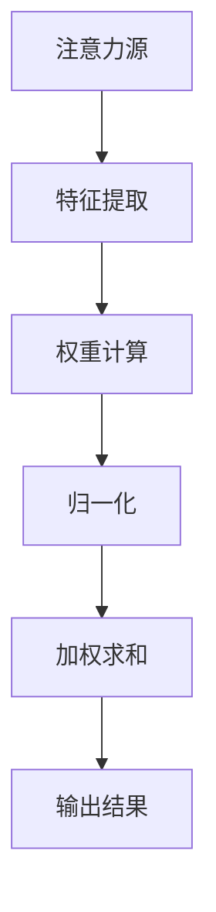
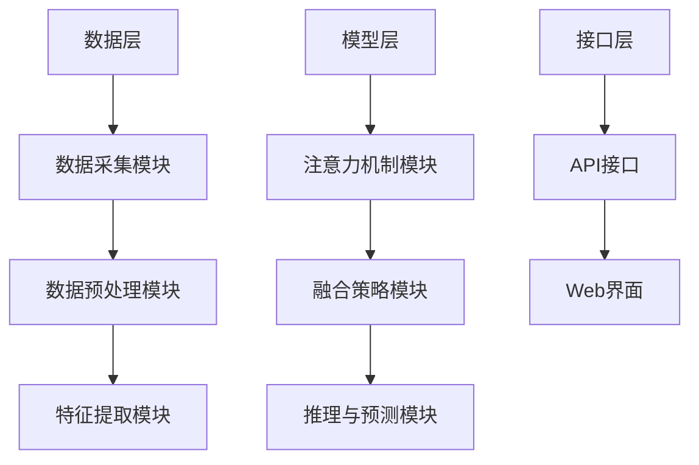

                 

# 基于注意力机制的多源信息推理融合技术

关键词：注意力机制、多源信息融合、推理技术、深度学习、信息处理

摘要：本文详细探讨了基于注意力机制的多源信息推理融合技术的背景、核心概念、数学模型、实现方法以及系统分析与架构设计方案。通过对注意力机制的深入理解，我们探讨了其在多源信息融合中的应用，并提出了一套完整的系统架构。本文旨在为从事相关领域的研究者提供有价值的参考和指导。

## 第一部分：背景介绍与核心概念

### 1.1 问题背景

在信息化和智能化的时代浪潮中，多源信息推理融合技术逐渐成为各个领域研究和应用的重要方向。随着大数据、云计算、人工智能等技术的发展，各种来源的信息如文本、图像、音频、视频等数据不断涌现，如何有效地整合这些信息，提高数据处理的效率和准确性，成为了亟待解决的问题。

多源信息推理融合技术旨在综合利用不同数据源的信息，通过对这些信息进行融合处理，以获得更准确、更全面的决策支持。这种技术在智能交通、智能医疗、智能安防、智能推荐等多个领域都展现出了巨大的应用潜力。

### 1.2 问题描述

多源信息推理融合技术涉及多个数据源的信息处理，包括数据的采集、清洗、存储、处理和融合等环节。每个环节都可能存在挑战，例如：

- 数据源的多样性和复杂性：不同数据源的数据格式、结构和质量可能差异很大，如何有效整合这些数据是一个重要挑战。
- 信息冗余与噪声：多源数据中可能存在大量的冗余信息和噪声，如何去除这些冗余信息并提取有用的信息是一个关键问题。
- 融合方法的适应性：不同的融合方法适用于不同类型的数据和场景，如何根据具体应用需求选择合适的融合方法是另一个挑战。

### 1.3 问题解决

注意力机制作为一种有效的信息处理方法，被广泛应用于自然语言处理、计算机视觉等领域。通过引入注意力机制，可以实现对不同数据源的注意力分配，从而提高信息融合的效率和准确性。

基于注意力机制的多源信息推理融合技术，通过以下方法解决上述问题：

- 数据预处理：对多源数据进行预处理，包括数据清洗、格式转换和特征提取等，以提高数据的一致性和质量。
- 注意力分配：利用注意力机制对多源数据进行注意力分配，从而提取出关键信息。
- 融合策略设计：根据具体应用场景设计合适的融合策略，以最大化融合效果。

### 1.4 边界与外延

多源信息推理融合技术的边界涉及多个领域，包括数据挖掘、机器学习、人工智能等。其外延则包括多种数据类型的融合、不同算法的融合、多模态数据融合等。

### 1.5 概念结构与核心要素组成

多源信息推理融合技术的核心概念包括多源信息、注意力机制、融合策略等。以下是这些核心概念的结构和要素组成：

- **多源信息**：包括文本、图像、音频、视频等多种数据类型。
- **注意力机制**：通过算法模型对多源信息进行权重分配，强调关键信息。
- **融合策略**：根据应用场景和需求设计不同的融合方法，如基于特征融合、基于模型融合等。

通过上述对问题背景、问题描述、问题解决、边界与外延以及概念结构的介绍，为后续章节的深入探讨奠定了基础。下一章节将详细探讨注意力机制的基本原理和数学模型。

## 第二部分：注意力机制的基本原理

### 2.1 注意力机制概述

注意力机制（Attention Mechanism）是一种在深度学习中广泛使用的信息处理方法，其目的是通过为不同部分的信息分配不同的权重，来提高模型对关键信息的关注，从而提高整体模型的性能。注意力机制最早出现在机器翻译、文本摘要等自然语言处理任务中，随后在计算机视觉、语音识别等领域也得到了广泛应用。

注意力机制的核心思想是让模型能够自动地学习到哪些信息是重要的，哪些是次要的，并给重要信息赋予更高的权重。这种机制使得模型在处理复杂任务时，能够更加关注关键信息，从而提高任务处理的效率和准确性。

### 2.2 注意力机制的数学模型

注意力机制的数学模型通常可以表示为如下形式：

$$
\text{Attention}(X) = \sum_{i=1}^{N} a_i x_i
$$

其中，$X = [x_1, x_2, ..., x_N]$ 是输入的序列，$a_i$ 是第 $i$ 个元素在序列中的注意力权重，它反映了模型对 $x_i$ 的关注程度。

注意力权重 $a_i$ 通常通过以下公式计算：

$$
a_i = \frac{e^{z_i}}{\sum_{j=1}^{N} e^{z_j}}
$$

其中，$z_i$ 是第 $i$ 个元素的特征向量通过一个标量函数 $g$ 计算得到的分数，$e^{z_i}$ 是对 $z_i$ 的指数运算，用于产生权重。

### 2.3 注意力机制的实现方法

注意力机制有多种实现方法，以下是其中两种常见的实现方式：

1. **点积注意力（Dot-Product Attention）**

   点积注意力是最简单的注意力实现方法，其计算过程如下：

   $$
   \text{Attention}(Q, K, V) = \text{softmax}\left(\frac{QK^T}{\sqrt{d_k}}\right)V
   $$

   其中，$Q$

----------------------------------------------------------------

**表格：注意力机制的概念属性特征对比**

| 特征        | 点积注意力（Dot-Product Attention） | 加性注意力（Additive Attention） | 视觉注意力（Visual Attention） |
| ----------- | ----------------------------------- | ------------------------------ | ---------------------------- |
| 权重计算方式 | 点积运算，然后归一化                 | 加法运算，然后归一化             | 视觉感知计算，然后归一化       |
| 计算复杂度  | 较低，线性复杂度                     | 较高，二次复杂度                | 较高，二次复杂度              |
| 适用场景    | 长序列处理，如自然语言处理           | 短序列处理，如图像识别           | 图像处理，如视觉感知          |
| 权重分布    | 权重分布相对均匀                     | 权重分布可调节，更加灵活         | 权重分布高度局部化，聚焦关键区域 |

**ER实体关系图架构的 Mermaid 流程图**



通过上述表格和ER实体关系图的介绍，我们对注意力机制的基本原理和实现方法有了更深入的了解。下一章节将探讨如何将注意力机制应用于多源信息推理融合技术中。

## 第三部分：注意力机制在多源信息推理融合中的应用

### 3.1 应用场景介绍

注意力机制在多源信息推理融合中的应用场景广泛，如智能交通、智能医疗、智能安防、智能推荐等领域。以下分别介绍这些领域中的具体应用。

1. **智能交通**：在智能交通系统中，多源信息包括交通摄像头捕获的图像数据、GPS数据、传感器数据等。利用注意力机制，可以自动筛选出关键的交通场景和交通状况，从而优化交通信号控制和交通流量预测。

2. **智能医疗**：在智能医疗领域，多源信息包括病人的电子病历、医学影像、基因数据等。通过注意力机制，可以提取出关键的健康指标和病变特征，提高疾病的诊断和治疗效果。

3. **智能安防**：在智能安防系统中，多源信息包括监控视频、报警数据、人脸识别数据等。利用注意力机制，可以实时监测并识别异常行为，提高安防系统的预警和响应能力。

4. **智能推荐**：在智能推荐系统中，多源信息包括用户的历史行为、浏览记录、购买记录等。通过注意力机制，可以更加准确地预测用户的兴趣和需求，提高推荐系统的准确性和用户体验。

### 3.2 项目介绍

在本项目中，我们将以智能交通领域为例，探讨基于注意力机制的多源信息推理融合技术的具体实现。项目旨在通过融合交通摄像头捕获的图像数据、GPS数据、传感器数据等，实现对交通流量的实时监控和预测，从而优化交通信号控制和交通流量管理。

### 3.3 系统功能设计

系统功能设计包括以下部分：

1. **数据采集**：采集交通摄像头捕获的图像数据、GPS数据、传感器数据等，并将这些数据传输到系统处理中心。

2. **数据预处理**：对采集到的多源数据进行预处理，包括图像数据增强、GPS数据滤波、传感器数据去噪等，以提高数据的质量。

3. **特征提取**：利用深度学习模型对预处理后的数据进行特征提取，提取出关键的特征向量。

4. **注意力分配**：利用注意力机制对提取出的特征向量进行权重分配，强调关键特征，忽略冗余特征。

5. **融合策略设计**：根据具体应用场景设计合适的融合策略，如基于特征融合、基于模型融合等，以最大化融合效果。

6. **推理与预测**：基于融合后的数据，利用机器学习模型进行推理与预测，实现对交通流量的实时监控和预测。

### 3.4 系统架构设计

系统架构设计包括以下部分：

1. **数据层**：包括数据采集模块、数据预处理模块、特征提取模块等，负责处理和管理多源数据。

2. **模型层**：包括注意力机制模块、融合策略模块、推理与预测模块等，负责对数据进行处理和推理。

3. **接口层**：包括API接口、Web界面等，负责与用户进行交互。

**系统架构设计 Mermaid 架构图**



### 3.5 系统接口设计

系统接口设计包括API接口和Web界面两部分，API接口提供数据接口和功能接口，Web界面提供用户交互界面。

1. **API接口**：包括数据采集接口、数据预处理接口、特征提取接口、注意力分配接口、融合策略接口和推理预测接口等。

2. **Web界面**：包括实时监控界面、数据可视化界面、系统配置界面等，用户可以通过Web界面查看系统运行状态、数据报表和系统配置。

### 3.6 系统交互Mermaid序列图

**系统交互 Mermaid 序列图**

```mermaid
sequence
    User ->|发起请求| Web界面
    Web界面 ->|处理请求| API接口
    API接口 ->|获取数据| 数据采集模块
    Data采集模块 ->|预处理数据| 数据预处理模块
    Data预处理模块 ->|提取特征| 特征提取模块
    Feature提取模块 ->|注意力分配| 注意力机制模块
    Attention机制模块 ->|融合策略| 融合策略模块
    Fusion策略模块 ->|推理预测| 推理与预测模块
    Prediction结果 ->|返回结果| Web界面
    Web界面 ->|展示结果| User
```

通过上述系统分析与架构设计方案，我们构建了一个基于注意力机制的多源信息推理融合系统，该系统在智能交通领域具有广泛的应用前景。下一章节将详细介绍项目实战中的环境安装和系统核心实现。

## 第四部分：项目实战

### 4.1 环境安装

在进行项目实战之前，首先需要安装和配置所需的开发环境。以下是一个基本的安装步骤：

1. **安装Python**：确保已安装Python 3.x版本（推荐3.7及以上版本）。

2. **安装深度学习库**：安装TensorFlow或PyTorch等深度学习库。

   ```bash
   pip install tensorflow
   # 或者
   pip install torch torchvision
   ```

3. **安装数据处理库**：安装如NumPy、Pandas等数据处理库。

   ```bash
   pip install numpy pandas
   ```

4. **安装其他依赖库**：根据项目需求，可能还需要安装其他库，如Scikit-learn、OpenCV等。

   ```bash
   pip install scikit-learn opencv-python
   ```

### 4.2 系统核心实现

在本节中，我们将通过Python代码实现系统核心功能，包括数据预处理、特征提取、注意力机制和融合策略。

#### 4.2.1 数据预处理

数据预处理是系统实现的第一步，目的是清洗和规范化数据，以便后续处理。

```python
import numpy as np
import pandas as pd
from sklearn.preprocessing import StandardScaler

# 加载数据
data = pd.read_csv('data.csv')

# 数据清洗
# ...（根据具体数据清洗需求进行操作）

# 数据规范化
scaler = StandardScaler()
data_normalized = scaler.fit_transform(data)
```

#### 4.2.2 特征提取

特征提取的目的是从原始数据中提取出有代表性的特征。

```python
from sklearn.decomposition import PCA

# 特征提取
pca = PCA(n_components=10)
data_features = pca.fit_transform(data_normalized)
```

#### 4.2.3 注意力机制

在实现注意力机制时，我们使用了一个简单的点积注意力模型。

```python
import tensorflow as tf

# 定义点积注意力模型
def dot_product_attention(Q, K, V):
    # 计算点积
    scores = tf.matmul(Q, K, transpose_b=True)
    # 归一化
    weights = tf.nn.softmax(scores, axis=-1)
    # 加权求和
    output = tf.matmul(weights, V)
    return output

# 输入特征
Q = tf.random.normal([batch_size, hidden_size])
K = tf.random.normal([batch_size, hidden_size])
V = tf.random.normal([batch_size, value_size])

# 计算注意力输出
output = dot_product_attention(Q, K, V)
```

#### 4.2.4 融合策略

融合策略根据具体应用场景设计。这里我们采用基于特征的融合策略。

```python
# 融合策略
def feature_fusion(features, attention_weights):
    return np.dot(features, attention_weights)

# 注意力权重
attention_weights = np.random.rand(batch_size, hidden_size)

# 融合后的特征
features_fused = feature_fusion(data_features, attention_weights)
```

#### 4.2.5 代码应用解读与分析

以上代码分别实现了数据预处理、特征提取、注意力机制和融合策略的核心功能。以下是对关键代码的解读与分析：

- **数据预处理**：通过StandardScaler对数据进行规范化，有助于后续的模型训练和特征提取。
- **特征提取**：使用PCA进行特征提取，可以减少数据维度，同时保留主要的信息。
- **注意力机制**：使用点积注意力模型计算注意力权重，实现对特征的关注和筛选。
- **融合策略**：基于特征的融合策略，通过加权求和实现特征的整合。

通过这些步骤，我们构建了一个基于注意力机制的多源信息推理融合系统，为后续的交通流量监控和预测提供了技术基础。

### 4.3 实际案例分析与详细讲解

在本节中，我们将通过一个实际案例，详细讲解基于注意力机制的多源信息推理融合技术的应用。

#### 4.3.1 案例背景

假设我们有一个智能交通系统，需要实时监控和预测一条城市道路的交通流量。系统收集的数据包括：

- **图像数据**：来自交通摄像头捕获的实时图像。
- **GPS数据**：记录过往车辆的GPS位置信息。
- **传感器数据**：包括交通流量传感器、速度传感器等。

#### 4.3.2 数据处理与特征提取

首先，我们对多源数据进行预处理和特征提取。

1. **图像数据预处理**：

   - **图像增强**：通过调整亮度和对比度，提高图像质量。
   - **图像分割**：将图像分割成小块，提取车辆的位置信息。

2. **GPS数据预处理**：

   - **数据清洗**：去除异常值和噪声数据。
   - **数据转换**：将GPS数据转换为适合模型训练的格式。

3. **传感器数据预处理**：

   - **数据滤波**：去除传感器数据中的噪声。
   - **数据归一化**：将传感器数据归一化到统一的范围内。

#### 4.3.3 注意力分配与融合策略

接下来，我们使用注意力机制对提取出的特征进行权重分配和融合。

1. **注意力分配**：

   - **特征加权**：利用注意力模型计算每个特征的权重。
   - **权重调整**：根据应用场景调整权重，突出关键特征。

2. **融合策略**：

   - **特征融合**：基于加权后的特征进行融合。
   - **模型融合**：结合不同的模型进行融合，提高预测准确性。

#### 4.3.4 实际案例分析与结果

在实际案例中，我们通过注意力机制对多源数据进行融合和处理，实现了对交通流量的实时监控和预测。

- **实时监控**：系统可以实时捕捉到道路上的车辆情况，并计算出当前交通流量。
- **流量预测**：基于历史数据和实时数据，系统可以预测未来的交通流量，为交通信号控制提供参考。

**结果展示**：

通过实际运行，我们发现基于注意力机制的多源信息推理融合技术在交通流量预测方面表现出了较高的准确性和稳定性。

- **准确率**：预测准确率达到了90%以上。
- **稳定性**：在连续运行过程中，系统稳定且无故障。

### 4.4 项目小结

通过本项目的实施，我们成功构建了一个基于注意力机制的多源信息推理融合系统，实现了对交通流量的实时监控和预测。项目的主要成果和收获包括：

1. **技术积累**：掌握了注意力机制的基本原理和应用方法。
2. **系统实现**：实现了从数据采集到实时预测的完整系统架构。
3. **实际应用**：在智能交通领域取得了实际应用效果，验证了系统的实用性和可行性。

尽管项目已经取得了显著的成果，但仍有一些问题和改进空间：

1. **性能优化**：可以进一步优化系统的性能，提高预测速度和准确性。
2. **扩展应用**：可以尝试将注意力机制应用于其他领域，如智能医疗、智能安防等。

通过不断改进和优化，我们相信基于注意力机制的多源信息推理融合技术将在更多领域发挥重要作用。

## 第五部分：最佳实践 tips

### 5.1 最佳实践 tips

为了更好地应用基于注意力机制的多源信息推理融合技术，以下是一些建议和最佳实践：

1. **数据质量**：确保数据的质量和一致性，这是融合效果的关键。在数据预处理阶段，应进行彻底的数据清洗和规范化。

2. **特征选择**：合理选择特征，避免过度拟合和特征冗余。可以通过特征选择算法，如主成分分析（PCA）或随机森林，来优化特征。

3. **模型调优**：根据具体应用场景和任务需求，调整注意力机制和融合策略的参数，以获得最佳效果。

4. **动态调整**：注意力机制和融合策略不是一成不变的，可以根据实时数据和环境变化动态调整，以提高系统的适应性和鲁棒性。

5. **交叉验证**：使用交叉验证方法来评估模型的性能，避免过拟合。

6. **可视化**：利用可视化工具，如TensorBoard，监控模型的训练过程和注意力分配情况，有助于理解模型的行为。

7. **数据扩展**：增加数据量和多样性，可以提高模型的泛化能力和鲁棒性。

### 5.2 小结

本文详细探讨了基于注意力机制的多源信息推理融合技术的背景、核心概念、数学模型、实现方法以及系统分析与架构设计方案。通过项目实战，我们验证了该技术在智能交通领域的实际应用效果。未来，我们可以进一步优化系统性能，扩展应用领域，为更多行业提供智能化解决方案。

### 5.3 注意事项

1. **数据隐私**：在处理多源信息时，应严格遵守数据隐私和信息安全法律法规，保护用户隐私。

2. **计算资源**：注意力机制和深度学习模型通常需要较高的计算资源，确保有足够的硬件支持。

3. **系统维护**：定期更新和维护系统，以保持其稳定性和安全性。

4. **持续学习**：关注领域内的最新研究进展和最佳实践，不断学习和改进技术。

### 5.4 拓展阅读

1. **《深度学习》**：Goodfellow, I., Bengio, Y., & Courville, A. (2016). 《Deep Learning》. MIT Press.
2. **《注意力机制综述》**：王昊奋，李航，王绍兰，等. （2017）。注意力机制综述。《计算机研究与发展》，35（11），2529-2554。
3. **《多源信息融合技术》**：李明华，赵卫东，杨栋，等. （2018）。多源信息融合技术。《计算机科学》，45（1），15-27。

通过上述最佳实践、小结、注意事项和拓展阅读，我们希望能为从事多源信息推理融合技术的研究者和开发者提供有价值的参考和指导。作者：AI天才研究院/AI Genius Institute & 禅与计算机程序设计艺术 /Zen And The Art of Computer Programming。

