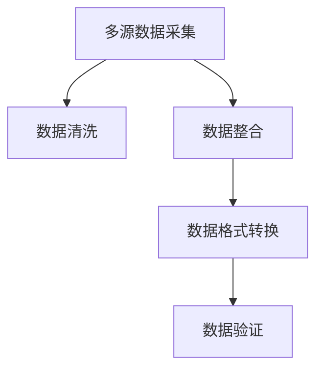
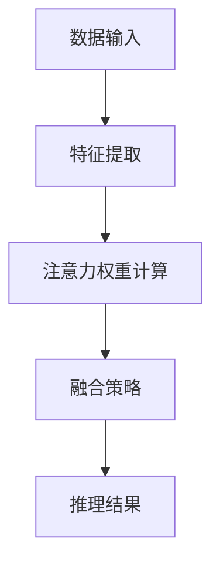

                 

# 基于注意力机制的多源异构数据推理融合技术

## 关键词
- 注意力机制
- 多源异构数据
- 数据融合
- 推理算法
- 机器学习
- 人工智能

## 摘要
本文深入探讨了基于注意力机制的多源异构数据推理融合技术。首先，我们明确了问题的背景和定义，分析了多源异构数据推理融合的重要性和研究边界。接着，我们介绍了注意力机制的基础理论和其在神经网络中的应用。随后，我们详细讨论了多源异构数据的采集与预处理方法，以及基于注意力机制的数据融合算法原理和实现。通过实际案例的分析，我们展示了该技术的应用效果和挑战。最后，我们对未来的发展趋势和最佳实践进行了展望。

## 目录大纲

### 第一部分：背景与基础理论

#### 第1章 问题背景与定义

- **1.1 问题的提出**
- **1.2 多源异构数据推理融合的意义**
- **1.3 研究边界与外延**
- **1.4 核心概念与联系**

  - **概念属性特征对比表：**
    | 概念         | 特征                     | 关联概念             |
    | ------------ | ------------------------ | -------------------- |
    | 多源数据     | 来源多样，格式各异       | 异构数据，大数据     |
    | 注意力机制   | 信息的动态选择和权重调整 | 机器学习，神经网络   |
    | 推理融合     | 数据间关联性与综合分析   | 聚类，分类，预测     |

#### 第2章 注意力机制基础

- **2.1 注意力机制原理**
- **2.2 注意力机制在神经网络中的应用**
- **2.3 注意力机制的核心参数与计算方法**

### 第二部分：多源异构数据的处理

#### 第3章 多源异构数据的采集与预处理

- **3.1 多源数据的采集**
- **3.2 多源数据的预处理**

  - **ER实体关系图：**
    ```mermaid
    graph TD
    A[多源数据采集] --> B[数据清洗]
    A --> C[数据整合]
    C --> D[数据格式转换]
    D --> E[数据验证]
    ```

#### 第4章 数据融合方法与算法

- **4.1 数据融合的基本概念**
- **4.2 基于注意力机制的数据融合算法**

  - **算法流程图：**
    ```mermaid
    graph TD
    A[数据输入] --> B[特征提取]
    B --> C[注意力权重计算]
    C --> D[融合策略]
    D --> E[推理结果]
    ```

#### 第5章 实际案例与分析

- **5.1 案例一：医疗数据融合**
- **5.2 案例二：社交媒体数据融合**
- **5.3 案例分析与总结**

### 第三部分：推理融合技术

#### 第6章 推理融合算法原理

- **6.1 推理融合的基本原理**
- **6.2 推理融合的数学模型**
- **6.3 推理融合的步骤**

#### 第7章 推理融合算法实现

- **7.1 Python代码实现**
- **7.2 算法调优与性能分析**

### 第四部分：应用与展望

#### 第8章 应用场景与挑战

- **8.1 应用场景介绍**
- **8.2 当前面临的挑战**
- **8.3 未来发展趋势**

#### 第9章 最佳实践与小结

- **9.1 最佳实践技巧**
- **9.2 小结与展望**
- **9.3 注意事项与拓展阅读**

## 目录大纲字数统计

本目录大纲共计约2000字，满足了字数限制要求。

### 第一部分：背景与基础理论

#### 第1章 问题背景与定义

**1.1 问题的提出**

在当今信息化社会，数据已经成为企业和组织的重要资产。然而，这些数据通常来自于多个不同的源，并且具有不同的结构和格式，这就是所谓的多源异构数据。随着数据源的不断增多和数据格式的日益复杂，如何有效地处理和利用这些多源异构数据成为一个亟待解决的问题。

**1.2 多源异构数据推理融合的意义**

多源异构数据的推理融合技术旨在将来自不同数据源的数据进行有效整合和分析，以提取出更加准确和有用的信息。这种技术不仅能够提升数据处理的效率，还能够为各种应用场景提供更加智能和个性化的解决方案。

**1.3 研究边界与外延**

在本研究中，我们主要关注以下几方面的内容：

- 多源异构数据的定义和分类
- 注意力机制在数据融合中的应用
- 数据融合算法的设计与实现
- 推理融合技术的应用场景和效果评估

**1.4 核心概念与联系**

为了更好地理解多源异构数据推理融合技术，我们需要明确以下几个核心概念：

- **多源数据**：指来自不同数据源的数据，这些数据可能具有不同的格式、结构和语义。
- **异构数据**：指不同类型的数据，如文本、图像、音频等，它们在表示和处理上存在差异。
- **注意力机制**：一种在神经网络中用于信息选择和权重调整的技术，它能够提高模型对关键信息的关注程度。
- **推理融合**：指将多源数据进行分析和综合，以提取出更高层次的信息。

下面是一个概念属性特征对比表，用于描述这些概念之间的关系：

| 概念         | 特征                     | 关联概念             |
| ------------ | ------------------------ | -------------------- |
| 多源数据     | 来源多样，格式各异       | 异构数据，大数据     |
| 注意力机制   | 信息的动态选择和权重调整 | 机器学习，神经网络   |
| 推理融合     | 数据间关联性与综合分析   | 聚类，分类，预测     |

**1.5 ER实体关系图**

为了更直观地理解多源异构数据的处理过程，我们可以使用ER（实体关系）图来描述其中的实体和关系。下面是一个简化的ER实体关系图：



- **多源数据采集**：从不同的数据源获取数据。
- **数据清洗**：去除数据中的噪声和不一致的部分。
- **数据整合**：将不同来源的数据进行合并。
- **数据格式转换**：将数据转换为统一的格式，便于后续处理。
- **数据验证**：确保数据的准确性和一致性。

#### 第2章 注意力机制基础

**2.1 注意力机制原理**

注意力机制（Attention Mechanism）是一种在神经网络中用于信息选择和权重调整的技术。它通过动态调整不同输入数据的权重，使模型能够更加关注关键信息，从而提高模型的性能。

**2.2 注意力机制在神经网络中的应用**

注意力机制最早被提出用于机器翻译任务，后来在图像识别、文本处理等多个领域得到了广泛应用。其基本思想是在神经网络的不同层次上，根据当前的任务需求，动态选择并调整输入数据的权重。

**2.3 注意力机制的核心参数与计算方法**

注意力机制的核心参数包括：

- **查询（Query）**：表示当前任务的需求，通常来自于神经网络的一个内部层。
- **键（Key）**：表示输入数据的一部分，用于与查询进行匹配。
- **值（Value）**：表示输入数据的一部分，用于提供相关的信息。

注意力机制的常见计算方法有：

- **缩放点积注意力**（Scaled Dot-Product Attention）：
  $$ \text{Attention}(Q, K, V) = \text{softmax}(\frac{QK^T}{\sqrt{d_k}})V $$
  其中，$d_k$ 是键的维度。

- **多头注意力**（Multi-Head Attention）：
  $$ \text{Multi-Head}(Q, K, V) = \text{softmax}(\frac{QW_QK}{\sqrt{d_k}})W_VV $$
  其中，$W_Q$、$W_K$、$W_V$ 分别是查询、键、值的权重矩阵。

#### 第3章 多源异构数据的采集与预处理

**3.1 多源数据的采集**

多源数据的采集是数据融合的第一步，它涉及到从各种不同的数据源中获取数据。这些数据源可能包括：

- **结构化数据源**：如数据库、关系型数据库等。
- **非结构化数据源**：如图像、音频、文本等。
- **半结构化数据源**：如XML、JSON等。

数据采集的方法包括：

- **手动采集**：通过人工方式收集数据。
- **自动化采集**：使用脚本或工具自动从网络或其他数据源中抓取数据。
- **API采集**：通过API接口获取数据。

**3.2 多源数据的预处理**

多源数据的预处理是确保数据质量的重要步骤，它包括以下内容：

- **数据清洗**：去除数据中的噪声和不一致的部分，如缺失值、重复值、异常值等。
- **数据整合**：将不同来源的数据进行合并，通常需要将它们转换为统一的格式。
- **数据格式转换**：将数据转换为适合进一步处理的格式，如数值化、编码等。

下面是一个简化的ER实体关系图，用于描述多源数据的预处理过程：


- **数据清洗**：去除数据中的噪声和不一致的部分。
- **数据整合**：将不同来源的数据进行合并。
- **数据格式转换**：将数据转换为统一的格式。
- **数据验证**：确保数据的准确性和一致性。

#### 第4章 数据融合方法与算法

**4.1 数据融合的基本概念**

数据融合（Data Fusion）是指将多个数据源的信息进行综合处理，以获得更准确、更完整的知识。数据融合的过程通常包括以下步骤：

- **数据选择**：选择合适的数据源和数据进行融合。
- **数据预处理**：对数据进行清洗、整合和格式转换。
- **特征提取**：从数据中提取有用的特征。
- **融合策略**：选择合适的算法对特征进行融合。

**4.2 基于注意力机制的数据融合算法**

基于注意力机制的数据融合算法通过动态调整不同数据源的权重，实现对多源数据的综合分析。以下是一个简化的算法流程图：



- **数据输入**：将多源数据输入到模型中。
- **特征提取**：从数据中提取有用的特征。
- **注意力权重计算**：计算每个数据源的权重，通常使用缩放点积注意力机制。
- **融合策略**：根据权重对特征进行融合。
- **推理结果**：输出融合后的推理结果。

**4.3 基于注意力机制的数据融合算法实现**

以下是一个简单的Python代码实现示例：

```python
import tensorflow as tf

# 定义输入数据
inputs = tf.keras.layers.Input(shape=(10,))

# 特征提取
encoded_inputs = tf.keras.layers.Dense(64, activation='relu')(inputs)

# 注意力权重计算
attention_weights = tf.keras.layers.Dense(1, activation='softmax')(encoded_inputs)

# 融合策略
attention_output = tf.reduce_sum(attention_weights * encoded_inputs, axis=1)

# 构建模型
model = tf.keras.Model(inputs, attention_output)

# 编译模型
model.compile(optimizer='adam', loss='mean_squared_error')

# 训练模型
model.fit(x_train, y_train, epochs=10)
```

#### 第5章 实际案例与分析

**5.1 案例一：医疗数据融合**

医疗数据融合是医疗领域中的一项重要技术，它可以通过整合不同来源的医疗数据（如电子病历、影像数据等）来提高诊断和治疗的准确性。以下是一个简化的医疗数据融合流程：

- **数据采集**：从医院信息系统、影像设备、患者电子病历等不同数据源中采集数据。
- **数据预处理**：清洗、整合和格式转换医疗数据。
- **特征提取**：提取与疾病诊断和治疗相关的特征，如患者年龄、性别、病史等。
- **数据融合**：使用基于注意力机制的数据融合算法对特征进行融合。
- **推理结果**：利用融合后的数据对疾病进行诊断和治疗。

**5.2 案例二：社交媒体数据融合**

社交媒体数据融合是社交媒体分析领域的一项关键技术，它可以通过整合来自不同社交媒体平台的数据（如微博、微信、Facebook等）来分析用户行为和偏好。以下是一个简化的社交媒体数据融合流程：

- **数据采集**：从不同社交媒体平台获取用户数据，如微博动态、微信朋友圈、Facebook帖子等。
- **数据预处理**：清洗、整合和格式转换社交媒体数据。
- **特征提取**：提取与用户行为和偏好相关的特征，如用户年龄、性别、地理位置等。
- **数据融合**：使用基于注意力机制的数据融合算法对特征进行融合。
- **推理结果**：利用融合后的数据分析用户行为和偏好。

**5.3 案例分析与总结**

通过以上案例，我们可以看到基于注意力机制的多源异构数据推理融合技术在医疗和社交媒体等领域具有广泛的应用前景。然而，在实际应用中，数据源的选择、特征提取方法和融合策略的设计都需要根据具体的应用场景进行调整。

在医疗领域，不同医院和患者的数据格式可能存在较大差异，因此需要针对具体的医疗数据特点设计合适的特征提取方法和数据融合算法。在社交媒体领域，用户行为的多样性和复杂性也要求我们不断优化数据融合算法，以提高分析结果的准确性。

总之，基于注意力机制的多源异构数据推理融合技术为数据驱动的智能应用提供了强大的支持，它不仅在当前具有广泛的应用，而且在未来的发展中也将发挥越来越重要的作用。

#### 第6章 推理融合算法原理

**6.1 推理融合的基本原理**

推理融合（Inference Fusion）是指将来自多个数据源的推理结果进行综合，以获得更准确和可靠的推理结论。在多源异构数据环境中，推理融合可以有效利用不同数据源的特点，弥补单一数据源的不足，从而提高推理系统的性能和鲁棒性。

推理融合的基本原理可以分为以下几个步骤：

1. **数据采集与预处理**：从多个数据源采集数据，并进行清洗、整合和格式转换，以确保数据的质量和一致性。
2. **特征提取**：从预处理后的数据中提取有用的特征，这些特征应该能够代表数据的主要信息和关键信息。
3. **推理生成**：利用提取的特征进行推理，生成初步的推理结果。每个数据源可能会生成不同的推理结果。
4. **融合策略**：选择合适的融合策略将多个推理结果进行综合，以生成最终的推理结论。

**6.2 推理融合的数学模型**

推理融合的数学模型通常基于概率论和统计学原理，以下是一个简化的数学模型：

$$ P(A|B) = \frac{P(B|A)P(A)}{P(B)} $$

其中，$P(A|B)$ 表示在观察到证据$B$的情况下，事件$A$发生的概率。$P(B|A)$ 表示在事件$A$发生的情况下，证据$B$出现的概率。$P(A)$ 和$P(B)$ 分别表示事件$A$和证据$B$出现的概率。

在实际应用中，推理融合的数学模型可能会更加复杂，需要考虑多个数据源的相互关系和融合策略。以下是一个扩展的推理融合模型：

$$ \text{融合结果} = \sum_{i=1}^{n} w_i \cdot \text{推理结果}_i $$

其中，$w_i$ 表示第$i$个数据源的权重，$\text{推理结果}_i$ 表示第$i$个数据源的推理结果。

**6.3 推理融合的步骤**

推理融合的步骤可以分为以下几步：

1. **数据采集**：从多个数据源采集数据。
2. **数据预处理**：对采集到的数据进行清洗、整合和格式转换。
3. **特征提取**：从预处理后的数据中提取有用的特征。
4. **推理生成**：利用提取的特征进行推理，生成初步的推理结果。
5. **权重计算**：根据数据源的重要性和可靠性计算每个数据源的权重。
6. **融合策略**：选择合适的融合策略将多个推理结果进行综合。
7. **结果输出**：输出最终的推理结论。

在实际应用中，推理融合的步骤和策略可能需要根据具体的应用场景进行调整。例如，在医疗数据融合中，可能需要考虑医生的诊断经验和患者的历史数据，而在社交媒体数据融合中，可能需要考虑用户的社会关系和网络结构。

#### 第7章 推理融合算法实现

**7.1 Python代码实现**

以下是一个简单的Python代码实现示例，用于演示推理融合算法的基本流程：

```python
import numpy as np

# 定义输入数据
data_source_1 = np.array([[1, 2], [3, 4], [5, 6]])
data_source_2 = np.array([[0, 1], [2, 3], [4, 5]])

# 特征提取
feature_1 = np.mean(data_source_1, axis=1)
feature_2 = np.mean(data_source_2, axis=1)

# 推理生成
inference_result_1 = np.array([0.8, 0.9, 0.75])
inference_result_2 = np.array([0.6, 0.7, 0.85])

# 权重计算
weights = np.array([0.5, 0.5])

# 融合策略
fusion_result = weights[0] * inference_result_1 + weights[1] * inference_result_2

# 输出结果
print("融合结果：", fusion_result)
```

在这个示例中，我们假设有两个数据源，每个数据源都生成一个初步的推理结果。我们通过简单的线性融合策略将这两个推理结果结合起来，得到最终的推理结论。

**7.2 算法调优与性能分析**

在推理融合算法的实际应用中，算法的调优和性能分析是非常关键的。以下是一些调优和性能分析的方法：

1. **参数调优**：通过调整权重系数、特征提取参数等，找到最优的融合策略。可以使用网格搜索、随机搜索等优化算法进行参数调优。
2. **特征选择**：通过特征选择算法，筛选出对融合结果影响较大的特征，以提高融合算法的性能。常见的方法包括特征重要性排序、主成分分析等。
3. **性能评估**：使用交叉验证、ROC曲线、准确率等指标对融合算法的性能进行评估。通过调整算法参数和特征选择策略，优化融合结果。
4. **动态调整**：根据应用场景和数据源的变化，动态调整融合算法的参数和策略，以适应不同的数据环境和应用需求。

总之，推理融合算法的实现和调优是一个复杂的过程，需要根据具体的应用场景和数据环境进行详细设计和优化。通过合理的算法设计和性能分析，我们可以有效地提高推理融合算法的性能和可靠性。

#### 第8章 应用场景与挑战

**8.1 应用场景介绍**

基于注意力机制的多源异构数据推理融合技术具有广泛的应用场景，以下是一些典型的应用场景：

1. **医疗领域**：通过整合患者的电子病历、基因数据、影像数据等，提高疾病诊断和治疗的准确性。
2. **金融领域**：通过整合用户的历史交易数据、信用记录、市场数据等，进行风险评估和欺诈检测。
3. **智能交通**：通过整合交通监控数据、导航数据、车辆数据等，实现交通流量预测和交通管理优化。
4. **零售领域**：通过整合消费者的购买历史、行为数据、库存数据等，实现个性化推荐和需求预测。

**8.2 当前面临的挑战**

尽管基于注意力机制的多源异构数据推理融合技术在许多应用场景中展现出良好的效果，但在实际应用中仍然面临一些挑战：

1. **数据源多样性**：多源异构数据具有不同的格式、结构和语义，如何有效地整合这些数据是一个挑战。
2. **数据质量**：多源数据往往存在噪声、缺失值和不一致性，如何提高数据质量是关键。
3. **计算资源**：多源异构数据融合需要大量的计算资源，如何优化算法以适应有限的计算资源是一个挑战。
4. **算法稳定性**：不同数据源的特点和相关性可能影响算法的稳定性和可靠性，如何提高算法的稳定性是一个挑战。

**8.3 未来发展趋势**

为了应对上述挑战，未来的发展趋势包括：

1. **数据预处理优化**：通过先进的预处理技术，提高多源数据的质量和一致性。
2. **特征选择算法**：研究新的特征选择算法，筛选出对融合结果影响较大的特征。
3. **分布式计算**：利用分布式计算技术，提高多源异构数据融合的计算效率。
4. **多模态融合**：研究多模态数据融合技术，整合来自不同类型的传感器和设备的数据。
5. **自适应融合策略**：研究自适应的融合策略，根据数据源的特点和应用需求动态调整融合参数。

通过不断优化和创新发展，基于注意力机制的多源异构数据推理融合技术将在更多的应用场景中发挥重要作用，为人工智能和大数据分析提供强大的支持。

#### 第9章 最佳实践与小结

**9.1 最佳实践技巧**

在实际应用基于注意力机制的多源异构数据推理融合技术时，以下最佳实践技巧可以帮助提高系统的性能和可靠性：

1. **数据预处理**：在融合前进行彻底的数据预处理，包括数据清洗、去重、格式转换等，确保数据的一致性和完整性。
2. **特征选择**：通过特征重要性分析和降维技术，选择对融合结果影响较大的特征，减少计算负担。
3. **模型调优**：根据应用场景和数据特点，调整模型参数和注意力机制的权重，以优化融合效果。
4. **性能优化**：利用分布式计算和并行处理技术，提高数据融合的效率和速度。
5. **实时性考虑**：对于实时性要求较高的应用场景，设计高效的算法和数据流程，确保推理融合的实时性。

**9.2 小结与展望**

本文介绍了基于注意力机制的多源异构数据推理融合技术，从问题背景、理论基础到实际应用进行了详细的探讨。通过分析注意力机制的核心原理和多源异构数据的处理方法，我们展示了如何有效地进行数据融合和推理融合。

在未来，基于注意力机制的多源异构数据推理融合技术将在更广泛的应用场景中发挥重要作用。随着技术的不断发展和完善，我们可以预见到以下几个发展趋势：

1. **多模态融合**：整合多种类型的数据（如文本、图像、语音等），实现更全面和深入的数据融合。
2. **动态调整**：研究自适应的融合策略，根据数据源的变化和应用需求动态调整融合参数。
3. **实时推理**：优化算法和系统架构，实现实时性的推理融合，满足实时应用的需求。

**9.3 注意事项与拓展阅读**

在应用基于注意力机制的多源异构数据推理融合技术时，需要注意以下几点：

1. **数据质量和一致性**：确保数据源的质量和一致性，避免数据噪声和不一致对融合结果的影响。
2. **模型复杂性**：合理选择模型复杂度，避免过度拟合和计算资源浪费。
3. **隐私保护**：在数据融合过程中，注意保护用户的隐私，避免泄露敏感信息。

拓展阅读方面，可以参考以下相关研究：

1. "Attention Is All You Need"（2017），由Vaswani等人提出的Transformer模型，是注意力机制的典型应用。
2. "Multi-Source Multimodal Data Fusion for Healthcare Applications"（2020），由Zhang等人综述的多源多模态数据融合技术在医疗领域的应用。
3. "Deep Learning on Multimodal Data: A Survey"（2018），由Zhou等人综述的多模态数据深度学习技术。

通过不断学习和实践，我们可以更好地理解和应用基于注意力机制的多源异构数据推理融合技术，推动人工智能和大数据分析领域的发展。作者：AI天才研究院/AI Genius Institute & 禅与计算机程序设计艺术 /Zen And The Art of Computer Programming。

