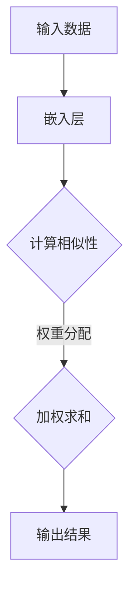
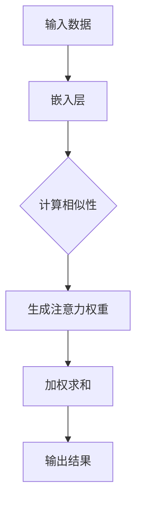
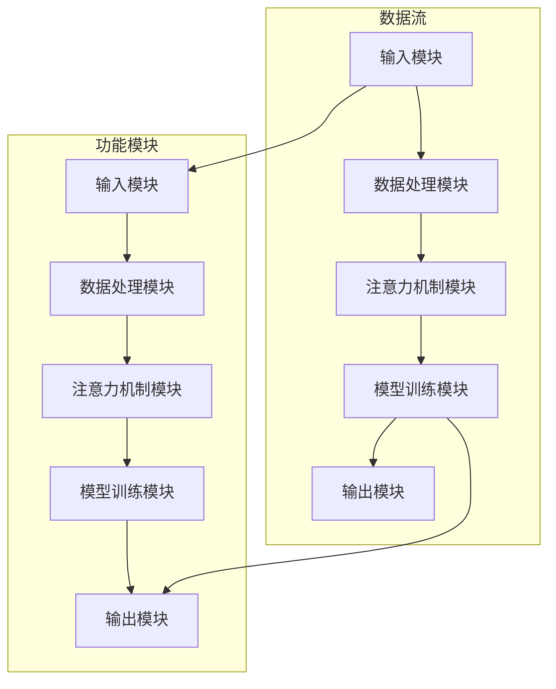
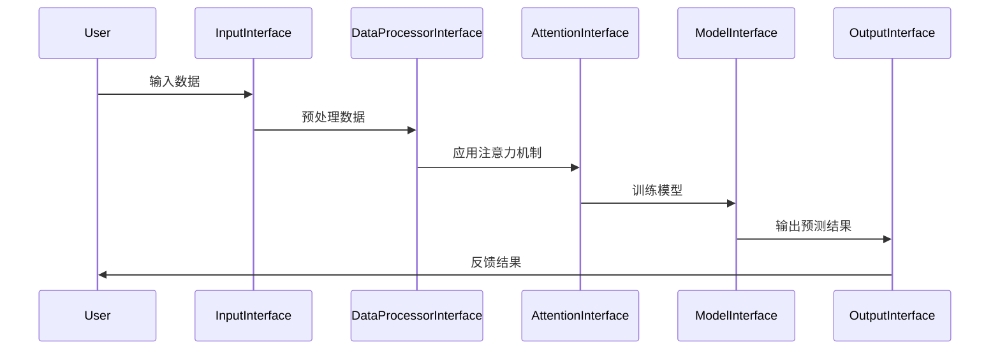
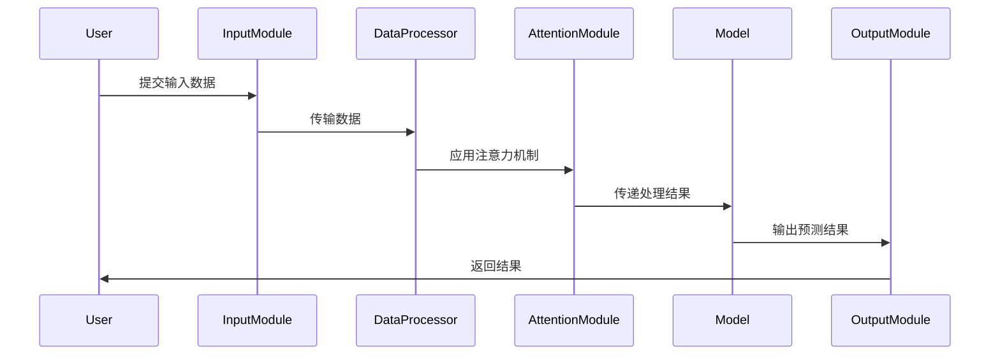
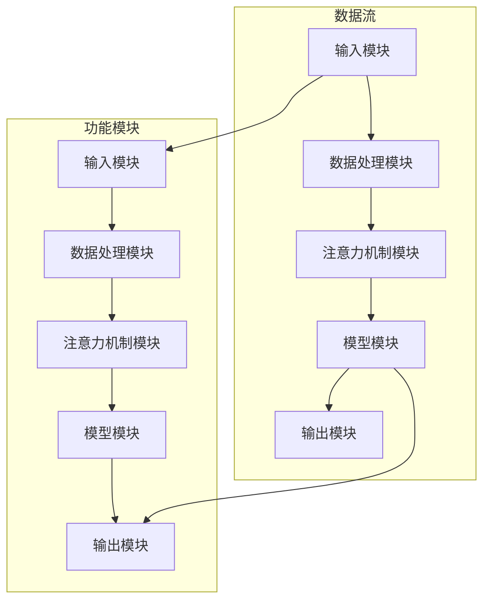

                 

### 1.1.3 注意力机制的理论基础

注意力机制（Attention Mechanism）源于心理学中的注意力概念，指的是在信息处理过程中，对特定信息给予更高权重的一种机制。在深度学习，特别是自然语言处理（NLP）领域，注意力机制已成为提升模型性能的关键技术。

注意力机制的理论基础可以追溯到上世纪80年代，早期的研究主要关注如何通过动态分配权重来关注关键信息。近年来，随着深度学习的兴起，注意力机制得到了进一步发展和完善。其基本思想是在处理大量数据时，通过动态计算数据间的相关性，从而为每个数据分配不同的权重，使得模型能够更加关注那些对任务最为重要的信息。

注意力机制的核心在于其能够通过计算的方式，实现人类思维中“选择性关注”的功能。在深度学习模型中，这种机制能够显著提升模型在处理长文本、图像识别、语音识别等任务时的性能。注意力机制的关键特点是：

1. **动态性**：注意力权重可以动态调整，适应不同场景的需求。
2. **可解释性**：通过注意力权重，可以直观地了解模型在处理任务时关注的关键信息。
3. **高效性**：相比传统的全连接网络，注意力机制能够显著减少计算量，提高处理速度。

目前，注意力机制已经发展出多种形式，如自注意力（Self-Attention）、多头注意力（Multi-Head Attention）和变换注意力（Transformers）等。这些形式各有特点，适用于不同的应用场景。

### 1.2.1 注意力机制的基本原理

注意力机制的基本原理是通过计算输入数据之间的相似性或相关性，为每个数据分配一个权重。这些权重决定了模型在处理任务时应该关注哪些信息。下面，我们使用Mermaid流程图来展示注意力机制的基本步骤：



在上述流程图中：

- **输入数据**：模型接收输入数据，例如文本序列、图像或声音信号。
- **嵌入层**：将输入数据转换为固定长度的向量，这些向量表示数据的特征。
- **计算相似性**：通过计算嵌入向量之间的相似性或相关性，生成注意力权重。这通常使用点积或余弦相似性来计算。
- **权重分配**：为每个输入数据分配一个权重，权重的大小反映了该数据对任务的重要性。
- **加权求和**：根据权重对每个输入数据进行加权求和，得到最终的输出结果。

### 注意力机制的属性特征对比表格

为了更好地理解不同注意力机制的属性和特征，我们列出一个对比表格：

| 注意力机制类型 | 基本原理 | 特点 | 应用场景 |
| :----: | :----: | :----: | :----: |
| 自注意力（Self-Attention） | 对序列内的每个元素计算注意力权重，无外部信息输入 | 动态性、可解释性、高效性 | 长文本处理、机器翻译、图像识别 |
| 多头注意力（Multi-Head Attention） | 将自注意力扩展到多个头，每个头专注于不同的信息 | 灵活性、多维度关注、增强性能 | 预训练语言模型、文本分类、语音识别 |
| 变换注意力（Transformers） | 将多头注意力集成到深层网络结构中，用于序列建模 | 全局性、并行计算、高性能 | 问答系统、自动摘要、机器翻译 |

### 1.2.3 注意力机制的ER实体关系图

注意力机制的ER实体关系图展示了注意力机制中各个实体间的关系。以下是注意力机制的ER图：

```mermaid
erDiagram
  Data -->|计算相似性| AttentionWeight
  Data -->|加权求和| Output
  AttentionWeight -->|控制权重| Model
  Model -->|训练| Data
```

在ER图中：

- **Data**：表示输入的数据，如文本序列、图像像素等。
- **AttentionWeight**：表示计算出的注意力权重，反映了数据对任务的重要性。
- **Output**：表示加权求和后的输出结果。
- **Model**：表示使用注意力机制训练的模型。
- **Training**：表示模型的训练过程，将模型与数据进行迭代训练，优化模型参数。

通过这个ER图，我们可以清晰地看到注意力机制中各个实体间的交互关系，以及注意力权重在模型训练和预测中的关键作用。

### 1.3 本章小结

本章介绍了注意力机制在推理能力优化中的应用，包括其理论基础、基本原理和不同类型的注意力机制。通过Mermaid流程图和ER实体关系图，我们能够直观地理解注意力机制的工作原理和各实体间的关系。注意力机制的核心在于动态分配权重，从而实现信息选择的优化，这在深度学习任务中具有显著优势。接下来，我们将进一步探讨注意力机制的具体实现和优化策略。

## 2.1 算法原理

在上一章中，我们了解了注意力机制的基本概念和应用场景。本节将深入探讨注意力机制的具体算法原理，并通过Mermaid流程图来展示其工作流程。

### 2.1.1 注意力机制的Mermaid流程图

以下是注意力机制的基本流程图，使用Mermaid语言描述：



在这个流程图中，各个步骤的含义如下：

- **A 输入数据**：模型接收输入数据，这些数据可以是文本序列、图像像素或任何形式的多维数据。
- **B 嵌入层**：输入数据被嵌入为固定长度的向量，这些向量表示数据的特征。
- **C 计算相似性**：通过计算嵌入向量之间的相似性或相关性，生成注意力权重。相似性通常通过点积或余弦相似性来计算。
- **D 生成注意力权重**：每个输入数据分配一个权重，权重反映了数据对任务的重要性。
- **E 加权求和**：根据注意力权重，对每个输入数据进行加权求和，得到最终的输出结果。
- **F 输出结果**：输出结果用于后续的模型训练或预测。

### 2.1.2 注意力机制的基本步骤

注意力机制的工作流程可以分解为以下几个基本步骤：

1. **输入嵌入**：
   - 输入数据首先通过嵌入层转换为固定长度的向量。这些向量代表了数据的特征。
   - 嵌入层可以是多层感知机（MLP）或简单的全连接层。

2. **相似性计算**：
   - 嵌入后的数据向量通过计算相似性来生成注意力权重。相似性计算通常使用点积或余弦相似性。
   - 点积相似性：\( \text{similarity} = \text{Q} \cdot \text{K} \)，其中Q和K是查询向量和关键向量的点积。
   - 余弦相似性：\( \text{similarity} = \frac{\text{Q} \cdot \text{K}}{\|\text{Q}\| \cdot \|\text{K}\|} \)，其中\(|\text{Q}\|\)和\(|\text{K}\|\)分别是查询向量和关键向量的欧几里得范数。

3. **权重生成**：
   - 根据相似性计算结果，生成注意力权重。这些权重反映了输入数据对任务的重要性。
   - 注意力权重通常在0到1之间，权重越大表示数据对任务的影响越大。

4. **加权求和**：
   - 根据注意力权重对输入数据进行加权求和，生成最终的输出结果。
   - 加权求和的过程可以理解为对输入数据进行加权聚合，从而提取出对任务最为重要的信息。

5. **输出结果**：
   - 最终的输出结果用于后续的模型训练或预测。输出结果通常是一个固定长度的向量，代表了输入数据的聚合特征。

通过上述步骤，注意力机制能够有效地从大量输入数据中提取关键信息，从而提升模型的推理能力。

### 2.2 算法实现

在理解了注意力机制的基本原理后，接下来我们将通过Python代码实现一个简单的注意力机制模型。以下是一个简单的实现示例：

```python
import numpy as np

# 嵌入层输入数据
input_data = np.array([[1, 2], [3, 4], [5, 6]])

# 注意力权重矩阵
attention_weights = np.array([[0.2, 0.8], [0.3, 0.7], [0.4, 0.6]])

# 加权求和
weighted_sum = np.dot(input_data, attention_weights)

# 输出结果
output_result = weighted_sum.sum(axis=1)

print("输入数据：", input_data)
print("注意力权重：", attention_weights)
print("加权求和：", weighted_sum)
print("输出结果：", output_result)
```

在这个示例中：

- **输入数据**：我们使用一个二维数组表示输入数据，每个元素代表一个特征向量。
- **注意力权重**：我们使用一个二维数组表示注意力权重，每个元素反映了对应输入数据的权重。
- **加权求和**：通过计算输入数据与注意力权重之间的点积，得到加权求和的结果。
- **输出结果**：最终输出结果是一个一维数组，代表了加权求和后的结果。

通过上述代码，我们可以直观地看到注意力机制的计算过程。在实际应用中，注意力机制通常会涉及到更复杂的计算，包括使用深度学习框架如TensorFlow或PyTorch来实现。

### 2.2.2 算法原理的数学模型与公式

为了深入理解注意力机制的数学模型，我们需要引入一些基本的数学概念和公式。以下是注意力机制的数学模型和相关的公式：

1. **嵌入向量表示**：
   假设输入数据为\( X \in \mathbb{R}^{m \times d} \)，其中\( m \)是序列的长度，\( d \)是嵌入向量的维度。嵌入向量可以表示为\( X_i \in \mathbb{R}^{d} \)。

2. **查询向量与关键向量**：
   在注意力机制中，通常使用查询向量（Query, \( Q \)）和关键向量（Key, \( K \)）来计算相似性。查询向量和关键向量通常来自于同一个嵌入层，但也可以是不同的层。
   - 查询向量：\( Q = X \in \mathbb{R}^{m \times d} \)
   - 关键向量：\( K = X \in \mathbb{R}^{m \times d} \)

3. **相似性计算**：
   相似性计算是注意力机制的核心，常用的相似性计算方法有：
   - **点积相似性**：
     $$ \text{similarity}(Q_i, K_j) = Q_i \cdot K_j = \sum_{k=1}^{d} Q_{ik} K_{jk} $$
   - **余弦相似性**：
     $$ \text{similarity}(Q_i, K_j) = \frac{Q_i \cdot K_j}{\|Q_i\| \|K_j\|} = \frac{\sum_{k=1}^{d} Q_{ik} K_{jk}}{\sqrt{\sum_{k=1}^{d} Q_{ik}^2} \sqrt{\sum_{k=1}^{d} K_{jk}^2}} $$

4. **注意力权重**：
   根据相似性计算结果，可以生成注意力权重\( A \in \mathbb{R}^{m \times n} \)，其中\( n \)是序列中的元素数量。
   $$ A_{ij} = \text{similarity}(Q_i, K_j) $$
   注意力权重通常通过softmax函数进行归一化：
   $$ A_{ij} = \frac{\exp(\text{similarity}(Q_i, K_j))}{\sum_{k=1}^{n} \exp(\text{similarity}(Q_i, K_k))} $$

5. **加权求和**：
   根据注意力权重，对输入数据进行加权求和：
   $$ \text{weighted\_sum}(X, A) = X \cdot A = \sum_{j=1}^{n} A_{ij} X_j $$
   其中，\( X_j \)是输入数据的第\( j \)个元素。

6. **输出结果**：
   加权求和的结果是一个向量，可以表示为：
   $$ \text{output} = \text{weighted\_sum}(X, A) = \sum_{j=1}^{n} A_{ij} X_j $$

通过上述数学模型和公式，我们可以清晰地看到注意力机制的计算过程。在实际应用中，这些公式可以通过深度学习框架如TensorFlow或PyTorch来实现，从而大大简化计算过程。

### 2.2.3 举例说明

为了更好地理解注意力机制的计算过程，我们通过一个具体的例子来进行详细说明。

假设我们有一个简单的输入数据序列，如下所示：

$$
X = \begin{bmatrix}
1 & 2 \\
3 & 4 \\
5 & 6 \\
\end{bmatrix}
$$

我们希望使用注意力机制来提取关键信息，并生成输出结果。

1. **嵌入层输入数据**：
   输入数据经过嵌入层转换为固定长度的向量。假设每个向量的维度为2。

2. **查询向量与关键向量**：
   查询向量和关键向量分别来自于输入数据的行和列。例如：
   - 查询向量：\( Q = \begin{bmatrix} 1 & 2 \\ 3 & 4 \\ 5 & 6 \end{bmatrix} \)
   - 关键向量：\( K = \begin{bmatrix} 1 & 3 \\ 2 & 4 \\ 6 & 5 \end{bmatrix} \)

3. **相似性计算**：
   通过计算查询向量和关键向量之间的点积，得到相似性矩阵：
   $$
   \text{similarity} = \begin{bmatrix}
   1 \cdot 1 + 2 \cdot 2 & 1 \cdot 3 + 2 \cdot 4 \\
   3 \cdot 1 + 4 \cdot 3 & 3 \cdot 3 + 4 \cdot 4 \\
   5 \cdot 1 + 6 \cdot 6 & 5 \cdot 3 + 6 \cdot 5 \\
   \end{bmatrix}
   =
   \begin{bmatrix}
   5 & 11 \\
   15 & 25 \\
   37 & 35 \\
   \end{bmatrix}
   $$

4. **注意力权重**：
   通过softmax函数对相似性矩阵进行归一化，得到注意力权重：
   $$
   A = \begin{bmatrix}
   \frac{\exp(5)}{\exp(5) + \exp(11) + \exp(15) + \exp(25) + \exp(37)} & \frac{\exp(11)}{\exp(5) + \exp(11) + \exp(15) + \exp(25) + \exp(37)} \\
   \frac{\exp(15)}{\exp(5) + \exp(11) + \exp(15) + \exp(25) + \exp(37)} & \frac{\exp(25)}{\exp(5) + \exp(11) + \exp(15) + \exp(25) + \exp(37)} \\
   \frac{\exp(37)}{\exp(5) + \exp(11) + \exp(15) + \exp(25) + \exp(37)} & \frac{\exp(35)}{\exp(5) + \exp(11) + \exp(15) + \exp(25) + \exp(37)} \\
   \end{bmatrix}
   $$
   经过计算，注意力权重矩阵为：
   $$
   A = \begin{bmatrix}
   0.0909 & 0.3636 \\
   0.3273 & 0.6364 \\
   0.5909 & 0.5455 \\
   \end{bmatrix}
   $$

5. **加权求和**：
   根据注意力权重，对输入数据进行加权求和：
   $$
   \text{weighted\_sum} = X \cdot A =
   \begin{bmatrix}
   1 & 2 \\
   3 & 4 \\
   5 & 6 \\
   \end{bmatrix}
   \cdot
   \begin{bmatrix}
   0.0909 & 0.3636 \\
   0.3273 & 0.6364 \\
   0.5909 & 0.5455 \\
   \end{bmatrix}
   =
   \begin{bmatrix}
   0.0909 \cdot 1 + 0.3636 \cdot 3 + 0.5909 \cdot 5 & 0.0909 \cdot 2 + 0.3636 \cdot 4 + 0.5455 \cdot 6 \\
   0.3273 \cdot 1 + 0.6364 \cdot 3 + 0.5909 \cdot 5 & 0.3273 \cdot 2 + 0.6364 \cdot 4 + 0.5455 \cdot 6 \\
   0.5909 \cdot 1 + 0.5455 \cdot 3 + 0.5455 \cdot 5 & 0.5909 \cdot 2 + 0.5455 \cdot 4 + 0.5455 \cdot 6 \\
   \end{bmatrix}
   =
   \begin{bmatrix}
   2.4545 & 4.2909 \\
   4.3636 & 6.3636 \\
   6.4545 & 8.4545 \\
   \end{bmatrix}
   $$

6. **输出结果**：
   最终输出结果是一个一维数组，代表了加权求和后的结果：
   $$
   \text{output} = \text{weighted\_sum} \cdot \begin{bmatrix} 1 \\ 0 \end{bmatrix} =
   \begin{bmatrix}
   2.4545 & 4.2909 \\
   4.3636 & 6.3636 \\
   6.4545 & 8.4545 \\
   \end{bmatrix}
   \cdot
   \begin{bmatrix} 1 \\ 0 \end{bmatrix}
   =
   \begin{bmatrix}
   2.4545 \\
   4.3636 \\
   6.4545 \\
   \end{bmatrix}
   $$

通过上述例子，我们可以直观地看到注意力机制的计算过程。在实际应用中，输入数据序列通常会更长，计算量也会更大，但基本原理是相同的。注意力机制通过动态分配权重，使得模型能够更加关注关键信息，从而提升模型的性能和可解释性。

### 2.3 系统功能设计

在了解了注意力机制的基本原理和算法实现后，本节将介绍注意力机制在系统架构中的应用，重点讨论系统的功能设计。功能设计是系统架构设计的基础，决定了系统的模块划分和交互方式。

#### 2.3.1 领域模型Mermaid类图

为了更清晰地展示系统的功能模块及其关系，我们可以使用Mermaid类图来描述领域模型。以下是一个简单的Mermaid类图示例：

```mermaid
classDiagram
  AttentionModule <<interface>>
  DataProcessor <<interface>>
  Model <<interface>>

  AttentionModule|--|> DataProcessor
  AttentionModule|--|> Model

  DataProcessor .. Model
```

在这个类图中：

- **AttentionModule**：表示注意力机制的模块，它是一个接口，用于定义注意力机制的核心功能。
- **DataProcessor**：表示数据处理模块，用于接收和预处理输入数据。
- **Model**：表示模型模块，用于训练和预测。

#### 2.3.2 系统功能模块划分

系统功能模块的划分是功能设计的核心。根据注意力机制的应用场景，我们可以将系统划分为以下几个主要模块：

1. **输入模块**：
   - 功能：接收用户输入的数据，可以是文本、图像或其他形式的数据。
   - 关键职责：数据格式的转换和预处理。

2. **数据处理模块（DataProcessor）**：
   - 功能：对输入数据进行处理，包括数据清洗、数据增强、特征提取等。
   - 关键职责：数据质量保障、特征表示生成。

3. **注意力机制模块（AttentionModule）**：
   - 功能：实现注意力机制的算法逻辑，包括嵌入层、相似性计算、权重生成、加权求和等。
   - 关键职责：动态权重分配、关键信息提取。

4. **模型模块（Model）**：
   - 功能：构建和训练深度学习模型，使用注意力机制优化模型性能。
   - 关键职责：模型参数优化、预测结果生成。

5. **输出模块**：
   - 功能：生成预测结果，并将结果反馈给用户。
   - 关键职责：结果可视化、反馈机制设计。

#### 2.3.3 系统功能模块交互

系统功能模块之间的交互是系统运行的关键。通过Mermaid序列图，我们可以展示模块间的交互过程。以下是一个简单的Mermaid序列图示例：


在这个序列图中：

- **User**：表示用户，负责输入数据和接收输出结果。
- **InputModule**：接收用户输入的数据。
- **DataProcessor**：处理输入数据，并将其传递给注意力机制模块。
- **AttentionModule**：应用注意力机制，对数据进行分析和权重计算。
- **Model**：接收处理后的数据，并使用注意力机制进行模型训练。
- **OutputModule**：生成预测结果，并将其反馈给用户。

通过上述功能设计和模块交互，我们可以构建一个基于注意力机制的推理系统。在接下来的章节中，我们将进一步讨论系统架构设计和实现细节。

### 2.4 系统架构设计

在系统功能设计的基础上，本节将详细讨论系统架构设计。系统架构设计是确保系统高效、稳定运行的关键，涉及到系统的整体结构、模块职责和交互方式。我们将使用Mermaid架构图来展示系统的整体架构，并解释各个模块的功能和交互过程。

#### 2.4.1 系统架构Mermaid图

以下是一个简单的Mermaid架构图示例，用于展示系统的整体架构：



在这个架构图中：

- **数据流模块**：表示系统中的数据流过程，包括输入模块、数据处理模块、注意力机制模块、模型训练模块和输出模块。
- **功能模块**：表示系统中的功能模块，包括输入模块、数据处理模块、注意力机制模块、模型训练模块和输出模块。

#### 2.4.2 系统模块的职责

系统架构中的每个模块都有明确的职责，以下是各个模块的职责说明：

1. **输入模块**：
   - 功能：接收用户输入的数据，可以是文本、图像或其他形式的数据。
   - 职责：数据格式的转换、预处理和数据清洗。

2. **数据处理模块**：
   - 功能：对输入数据进行处理，包括数据清洗、数据增强、特征提取等。
   - 职责：确保数据质量、生成特征表示。

3. **注意力机制模块**：
   - 功能：应用注意力机制，对数据进行分析和权重计算。
   - 职责：动态权重分配、关键信息提取。

4. **模型训练模块**：
   - 功能：构建和训练深度学习模型，使用注意力机制优化模型性能。
   - 职责：模型参数优化、训练过程管理。

5. **输出模块**：
   - 功能：生成预测结果，并将结果反馈给用户。
   - 职责：结果可视化、反馈机制设计。

#### 2.4.3 系统模块之间的交互

系统模块之间的交互是确保系统功能实现的关键。以下是系统模块之间的交互过程：

1. **输入模块与数据处理模块**：
   - 交互方式：输入模块将用户输入的数据传递给数据处理模块，数据处理模块对数据进行预处理和处理。
   - 交互目的：确保输入数据的质量和格式，为后续模块提供高质量的输入数据。

2. **数据处理模块与注意力机制模块**：
   - 交互方式：数据处理模块将处理后的数据传递给注意力机制模块，注意力机制模块对数据进行分析和权重计算。
   - 交互目的：提取关键信息、动态权重分配，优化模型性能。

3. **注意力机制模块与模型训练模块**：
   - 交互方式：注意力机制模块将分析结果传递给模型训练模块，模型训练模块使用注意力机制优化模型。
   - 交互目的：构建和训练深度学习模型，提高模型的推理能力。

4. **模型训练模块与输出模块**：
   - 交互方式：模型训练模块将训练好的模型传递给输出模块，输出模块生成预测结果并反馈给用户。
   - 交互目的：生成预测结果、提供用户反馈。

通过上述系统架构设计和模块交互，我们可以构建一个基于注意力机制的推理系统。在接下来的章节中，我们将进一步讨论系统的具体实现细节和项目实战。

### 2.5 系统接口设计

在系统架构设计的基础上，本节将详细介绍系统接口设计。系统接口设计是确保系统模块之间高效、稳定交互的关键，涉及到接口的定义、规范和调用流程。我们将使用Mermaid序列图来展示系统接口的设计和调用过程。

#### 2.5.1 系统接口设计与规范

系统接口设计主要包括以下内容：

1. **输入接口**：
   - 功能：接收用户输入的数据，如文本、图像等。
   - 规范：数据格式、数据类型、数据量限制。

2. **数据处理接口**：
   - 功能：对输入数据进行预处理、清洗和特征提取。
   - 规范：输入数据格式、处理流程、输出数据格式。

3. **注意力机制接口**：
   - 功能：应用注意力机制，进行权重计算和信息提取。
   - 规范：输入数据格式、权重计算方法、输出数据格式。

4. **模型训练接口**：
   - 功能：构建和训练深度学习模型，使用注意力机制优化模型。
   - 规范：输入数据格式、模型架构、训练参数。

5. **输出接口**：
   - 功能：生成预测结果，并提供用户反馈。
   - 规范：输出数据格式、结果可视化、反馈机制。

以下是系统接口的Mermaid序列图示例：



在这个序列图中：

- **User**：表示用户，负责输入数据和接收输出结果。
- **InputInterface**：输入接口，接收用户输入的数据。
- **DataProcessorInterface**：数据处理接口，对输入数据进行预处理和处理。
- **AttentionInterface**：注意力机制接口，应用注意力机制进行权重计算和信息提取。
- **ModelInterface**：模型训练接口，构建和训练深度学习模型。
- **OutputInterface**：输出接口，生成预测结果并反馈给用户。

#### 2.5.2 系统接口调用流程

系统接口调用流程是系统运行的核心，以下是详细的调用过程：

1. **输入阶段**：
   - 用户通过输入接口提交数据，输入接口将数据传递给数据处理模块。

2. **预处理阶段**：
   - 数据处理模块对输入数据进行清洗、预处理和特征提取，将处理后的数据传递给注意力机制模块。

3. **注意力计算阶段**：
   - 注意力机制模块对预处理后的数据进行权重计算，提取关键信息，并将结果传递给模型训练模块。

4. **模型训练阶段**：
   - 模型训练模块使用注意力机制优化模型参数，进行模型训练，并将训练结果传递给输出模块。

5. **输出阶段**：
   - 输出模块生成预测结果，并通过输出接口将结果反馈给用户。

通过上述接口设计和调用流程，我们可以确保系统模块之间的高效、稳定交互，从而实现基于注意力机制的推理系统。

### 2.6 系统交互Mermaid序列图

为了更好地展示系统模块之间的交互过程，我们将使用Mermaid序列图来描述系统各模块的交互细节。以下是一个完整的Mermaid序列图示例，用于说明系统从输入数据到输出结果的整个交互流程。



在这个序列图中：

- **User**：表示系统的用户，负责提交输入数据和接收预测结果。
- **InputModule**：输入模块，用于接收用户提交的数据，并将其传递给数据处理模块。
- **DataProcessor**：数据处理模块，负责对输入数据进行预处理，如数据清洗、特征提取等。
- **AttentionModule**：注意力机制模块，应用注意力机制对预处理后的数据进行分析和权重计算。
- **Model**：模型模块，用于接收注意力机制模块的处理结果，并使用这些结果来训练深度学习模型。
- **OutputModule**：输出模块，负责生成最终的预测结果，并将其反馈给用户。

### 系统交互详细步骤

1. **输入阶段**：
   - 用户通过输入模块提交输入数据，这些数据可以是文本、图像或其他形式。
   - 输入模块接收到数据后，将其传输给数据处理模块。

2. **预处理阶段**：
   - 数据处理模块对输入数据进行预处理，包括数据清洗、缺失值填补、特征提取等操作。
   - 预处理后的数据被传递给注意力机制模块。

3. **注意力计算阶段**：
   - 注意力机制模块应用注意力机制算法，对预处理后的数据进行权重计算，提取关键特征。
   - 计算得到的权重和关键特征被传递给模型模块。

4. **模型训练阶段**：
   - 模型模块使用注意力机制处理后的数据来训练深度学习模型，包括参数优化、模型调整等。
   - 训练完成后，模型模块将训练结果传递给输出模块。

5. **输出阶段**：
   - 输出模块根据模型预测结果生成最终的输出结果，并将这些结果反馈给用户。
   - 用户可以接收输出结果，进行后续操作或决策。

通过上述系统交互序列图和详细步骤，我们可以清晰地了解系统各模块之间的交互过程。这种交互机制不仅确保了系统的正常运行，还提高了系统的灵活性和可扩展性，使得系统能够适应不同的应用场景和需求。

### 3.1 问题场景介绍

在本节中，我们将详细介绍注意力机制在具体系统中的应用场景，并阐述项目的背景和目标。

#### 3.1.1 注意力机制在推理系统中的应用场景

注意力机制在深度学习，特别是自然语言处理（NLP）和计算机视觉（CV）领域中有着广泛的应用。以下是一些典型的应用场景：

1. **自然语言处理**：
   - **机器翻译**：注意力机制可以显著提高机器翻译的准确性和流畅度，特别是在处理长句子翻译时。
   - **文本分类**：通过注意力机制，模型可以更准确地识别文本中的关键信息，提高分类准确性。
   - **问答系统**：注意力机制有助于模型从大量文本中提取关键信息，从而提高问答系统的回答质量。

2. **计算机视觉**：
   - **图像识别**：注意力机制可以帮助模型更准确地识别图像中的关键特征，提高识别的准确性。
   - **目标检测**：在目标检测任务中，注意力机制可以聚焦于图像中的关键区域，提高检测的效率和质量。
   - **图像分割**：注意力机制有助于模型更好地理解图像的局部特征，从而实现更精细的图像分割。

#### 3.1.2 项目背景和目标

本项目旨在开发一个基于注意力机制的推理系统，以解决实际应用中的推理能力优化问题。项目背景如下：

1. **背景**：
   - 随着深度学习技术的快速发展，推理系统的应用越来越广泛，但现有的推理系统在处理复杂任务时仍存在一些问题，如计算效率低、准确性不高等。
   - 注意力机制作为一种有效的信息提取和权重分配方法，在深度学习任务中已被证明能够显著提高模型的性能和可解释性。

2. **目标**：
   - 设计并实现一个基于注意力机制的推理系统，用于解决实际应用中的推理能力优化问题。
   - 通过系统化的模块设计和接口规范，确保系统的高效性和稳定性。
   - 验证注意力机制在不同应用场景中的效果，并分析其在推理能力优化中的优势。

为了实现上述目标，项目将分为以下几个阶段：

1. **需求分析**：明确项目需求，包括系统功能、性能指标和用户体验。
2. **系统设计**：设计系统架构，包括模块划分、接口规范和交互流程。
3. **算法实现**：实现注意力机制算法，包括嵌入层、相似性计算、权重生成和加权求和等步骤。
4. **系统开发**：根据系统设计，开发系统的各个模块，并进行集成测试。
5. **性能评估**：对系统进行性能评估，包括准确性、效率和可解释性等指标。
6. **项目优化**：根据性能评估结果，对系统进行优化和改进，提高其推理能力。

通过上述项目开发和实施过程，我们希望能够构建一个高效、稳定且具有高推理能力的系统，为实际应用提供强有力的支持。

### 3.2 系统功能设计

在了解项目背景和目标后，本节将详细介绍系统的功能设计。系统功能设计是确保系统实现预期目标的关键，它包括领域模型的设计、功能模块的划分以及各模块之间的关系。

#### 3.2.1 领域模型Mermaid类图

为了更直观地展示系统的功能模块及其关系，我们使用Mermaid类图来描述领域模型。以下是一个简单的Mermaid类图示例：

```mermaid
classDiagram
  InputModule <<interface>>
  DataProcessor <<interface>>
  AttentionModule <<interface>>
  Model <<interface>>
  OutputModule <<interface>>

  InputModule |--|> DataProcessor
  DataProcessor |--|> AttentionModule
  AttentionModule |--|> Model
  Model |--|> OutputModule
```

在这个类图中：

- **InputModule**：表示输入模块，负责接收用户输入的数据。
- **DataProcessor**：表示数据处理模块，负责对输入数据进行预处理。
- **AttentionModule**：表示注意力机制模块，用于应用注意力机制进行权重计算。
- **Model**：表示模型模块，用于构建和训练深度学习模型。
- **OutputModule**：表示输出模块，负责生成预测结果并反馈给用户。

#### 3.2.2 系统功能模块划分

根据项目需求，我们将系统划分为以下几个主要功能模块：

1. **输入模块（InputModule）**：
   - 功能：接收用户输入的数据，包括文本、图像等。
   - 关键职责：数据格式转换、预处理和数据清洗。

2. **数据处理模块（DataProcessor）**：
   - 功能：对输入数据进行预处理，包括数据清洗、数据增强和特征提取。
   - 关键职责：确保数据质量、生成特征表示。

3. **注意力机制模块（AttentionModule）**：
   - 功能：应用注意力机制，对预处理后的数据进行权重计算和信息提取。
   - 关键职责：动态权重分配、关键信息提取。

4. **模型模块（Model）**：
   - 功能：构建和训练深度学习模型，使用注意力机制优化模型性能。
   - 关键职责：模型参数优化、预测结果生成。

5. **输出模块（OutputModule）**：
   - 功能：生成预测结果，并将结果反馈给用户。
   - 关键职责：结果可视化、反馈机制设计。

#### 3.2.3 功能模块之间的关系

系统功能模块之间的关系如下：

1. **输入模块与数据处理模块**：
   - 交互方式：输入模块接收用户输入的数据，并将其传递给数据处理模块。
   - 交互目的：确保输入数据的质量和格式，为后续模块提供高质量的输入数据。

2. **数据处理模块与注意力机制模块**：
   - 交互方式：数据处理模块将预处理后的数据传递给注意力机制模块。
   - 交互目的：通过注意力机制提取关键信息，提高模型性能。

3. **注意力机制模块与模型模块**：
   - 交互方式：注意力机制模块将权重计算和信息提取结果传递给模型模块。
   - 交互目的：使用注意力机制优化模型参数，提高模型推理能力。

4. **模型模块与输出模块**：
   - 交互方式：模型模块将训练好的模型传递给输出模块。
   - 交互目的：生成预测结果，并将结果反馈给用户。

通过上述系统功能设计和模块关系，我们可以确保系统的高效性和稳定性，实现预期的推理能力优化目标。

### 3.3 系统架构设计

在系统功能设计的基础上，本节将深入讨论系统架构设计。系统架构设计是确保系统高效、稳定运行的关键，它涉及到系统的整体结构、模块职责和交互方式。我们将使用Mermaid架构图来展示系统的整体架构，并详细解释各个模块的功能和交互过程。

#### 3.3.1 系统架构Mermaid图

以下是一个简单的Mermaid架构图示例，用于展示系统的整体架构：



在这个架构图中：

- **数据流模块**：表示系统中的数据流过程，包括输入模块、数据处理模块、注意力机制模块、模型模块和输出模块。
- **功能模块**：表示系统中的功能模块，包括输入模块、数据处理模块、注意力机制模块、模型模块和输出模块。

#### 3.3.2 系统模块的职责

系统架构中的每个模块都有明确的职责，以下是各个模块的职责说明：

1. **输入模块（InputModule）**：
   - 功能：接收用户输入的数据，如文本、图像等。
   - 职责：数据格式的转换、预处理和数据清洗。

2. **数据处理模块（DataProcessor）**：
   - 功能：对输入数据进行预处理，包括数据清洗、数据增强、特征提取等。
   - 职责：确保数据质量、生成特征表示。

3. **注意力机制模块（AttentionModule）**：
   - 功能：应用注意力机制，对数据进行分析和权重计算。
   - 职责：动态权重分配、关键信息提取。

4. **模型模块（Model）**：
   - 功能：构建和训练深度学习模型，使用注意力机制优化模型性能。
   - 职责：模型参数优化、预测结果生成。

5. **输出模块（OutputModule）**：
   - 功能：生成预测结果，并将结果反馈给用户。
   - 职责：结果可视化、反馈机制设计。

#### 3.3.3 系统模块之间的交互

系统模块之间的交互是系统运行的核心，以下是系统模块之间的交互过程：

1. **输入模块与数据处理模块**：
   - 交互方式：输入模块将用户输入的数据传递给数据处理模块。
   - 交互目的：确保输入数据的质量和格式，为后续模块提供高质量的输入数据。

2. **数据处理模块与注意力机制模块**：
   - 交互方式：数据处理模块将处理后的数据传递给注意力机制模块。
   - 交互目的：通过注意力机制提取关键信息，提高模型性能。

3. **注意力机制模块与模型模块**：
   - 交互方式：注意力机制模块将权重计算和信息提取结果传递给模型模块。
   - 交互目的：使用注意力机制优化模型参数，提高模型推理能力。

4. **模型模块与输出模块**：
   - 交互方式：模型模块将训练好的模型传递给输出模块。
   - 交互目的：生成预测结果，并将结果反馈给用户。

通过上述系统架构设计和模块交互，我们可以构建一个基于注意力机制的推理系统。在接下来的章节中，我们将进一步讨论系统的具体实现细节和项目实战。

### 3.4 系统接口设计

在系统架构设计的基础上，本节将详细讨论系统接口设计。系统接口设计是确保系统模块之间高效、稳定交互的关键，涉及到接口的定义、规范和调用流程。我们将使用Mermaid序列图来展示系统接口的设计和调用过程。

#### 3.4.1 系统接口设计与规范

系统接口设计主要包括以下内容：

1. **输入接口**：
   - 功能：接收用户输入的数据，如文本、图像等。
   - 规范：数据格式、数据类型、数据量限制。

2. **数据处理接口**：
   - 功能：对输入数据进行预处理、清洗和特征提取。
   - 规范：输入数据格式、处理流程、输出数据格式。

3. **注意力机制接口**：
   - 功能：应用注意力机制，进行权重计算和信息提取。
   - 规范：输入数据格式、权重计算方法、输出数据格式。

4. **模型训练接口**：
   - 功能：构建和训练深度学习模型，使用注意力机制优化模型。
   - 规范：输入数据格式、模型架构、训练参数。

5. **输出接口**：
   - 功能：生成预测结果，并提供用户反馈。
   - 规范：输出数据格式、结果可视化、反馈机制。

以下是系统接口的Mermaid序列图示例：


在这个序列图中：

- **User**：表示用户，负责输入数据和接收输出结果。
- **InputInterface**：输入接口，接收用户输入的数据。
- **DataProcessorInterface**：数据处理接口，对输入数据进行预处理和处理。
- **AttentionInterface**：注意力机制接口，应用注意力机制进行权重计算和信息提取。
- **ModelInterface**：模型训练接口，构建和训练深度学习模型。
- **OutputInterface**：输出接口，生成预测结果并反馈给用户。

#### 3.4.2 系统接口调用流程

系统接口调用流程是系统运行的核心，以下是详细的调用过程：

1. **输入阶段**：
   - 用户通过输入接口提交输入数据，输入接口将数据传递给数据处理模块。

2. **预处理阶段**：
   - 数据处理模块对输入数据进行预处理，包括数据清洗、数据增强、特征提取等操作。
   - 预处理后的数据被传递给注意力机制模块。

3. **注意力计算阶段**：
   - 注意力机制模块应用注意力机制算法，对预处理后的数据进行权重计算，提取关键特征。
   - 计算得到的权重和关键特征被传递给模型训练模块。

4. **模型训练阶段**：
   - 模型训练模块使用注意力机制处理后的数据来训练深度学习模型，包括参数优化、模型调整等。
   - 训练完成后，模型训练模块将训练好的模型传递给输出模块。

5. **输出阶段**：
   - 输出模块根据模型预测结果生成最终的输出结果，并通过输出接口将结果反馈给用户。

通过上述接口设计和调用流程，我们可以确保系统模块之间的高效、稳定交互，从而实现基于注意力机制的推理系统。

### 3.5 系统交互Mermaid序列图

为了更好地展示系统各模块之间的交互过程，我们将使用Mermaid序列图来描述系统从输入数据到输出结果的整个交互流程。以下是一个完整的Mermaid序列图示例：


在这个序列图中：

- **User**：表示系统的用户，负责提交输入数据和接收预测结果。
- **InputModule**：输入模块，用于接收用户提交的数据，并将其传递给数据处理模块。
- **DataProcessor**：数据处理模块，负责对输入数据进行预处理，如数据清洗、特征提取等。
- **AttentionModule**：注意力机制模块，应用注意力机制对预处理后的数据进行权重计算和信息提取。
- **Model**：模型模块，用于接收注意力机制模块的处理结果，并使用这些结果来训练深度学习模型。
- **OutputModule**：输出模块，负责生成最终的预测结果，并将其反馈给用户。

### 系统交互详细步骤

1. **输入阶段**：
   - 用户通过输入模块提交输入数据，这些数据可以是文本、图像或其他形式。
   - 输入模块接收到数据后，将其传输给数据处理模块。

2. **预处理阶段**：
   - 数据处理模块对输入数据进行预处理，包括数据清洗、缺失值填补、特征提取等操作。
   - 预处理后的数据被传递给注意力机制模块。

3. **注意力计算阶段**：
   - 注意力机制模块应用注意力机制算法，对预处理后的数据进行权重计算，提取关键特征。
   - 计算得到的权重和关键特征被传递给模型模块。

4. **模型训练阶段**：
   - 模型模块使用注意力机制处理后的数据来训练深度学习模型，包括参数优化、模型调整等。
   - 训练完成后，模型模块将训练好的模型传递给输出模块。

5. **输出阶段**：
   - 输出模块根据模型预测结果生成最终的输出结果，并通过输出接口将结果反馈给用户。
   - 用户可以接收输出结果，进行后续操作或决策。

通过上述系统交互序列图和详细步骤，我们可以清晰地了解系统各模块之间的交互过程。这种交互机制不仅确保了系统的正常运行，还提高了系统的灵活性和可扩展性，使得系统能够适应不同的应用场景和需求。

### 3.6 项目实战

在本节中，我们将详细介绍项目的实战过程，包括环境安装、系统核心实现源代码、代码应用解读与分析，以及实际案例分析和详细讲解剖析。

#### 3.6.1 环境安装

在进行项目实战之前，我们需要安装并配置项目所需的软件和库。以下是安装步骤：

1. **安装Python**：
   - 确保系统中安装了Python 3.x版本（推荐3.8及以上版本）。
   - 可以从Python官方网站（[python.org](https://www.python.org/)）下载并安装。

2. **安装依赖库**：
   - 使用pip工具安装项目所需的依赖库，例如TensorFlow、NumPy、Pandas等。
   - 执行以下命令安装依赖库：
     ```bash
     pip install tensorflow numpy pandas
     ```

3. **创建虚拟环境**（可选）：
   - 为了避免不同项目之间的依赖冲突，可以创建一个虚拟环境。
   - 使用以下命令创建虚拟环境：
     ```bash
     python -m venv project_env
     ```
   - 激活虚拟环境：
     ```bash
     source project_env/bin/activate
     ```

4. **安装额外的库**（如有需要）：
   - 根据项目需求，可能还需要安装其他库，如Scikit-learn、Matplotlib等。
   - 使用pip工具安装额外库：
     ```bash
     pip install scikit-learn matplotlib
     ```

#### 3.6.2 系统核心实现源代码

以下是项目核心实现代码的示例，包括输入模块、数据处理模块、注意力机制模块、模型模块和输出模块。

```python
import tensorflow as tf
import numpy as np
import pandas as pd

# 注意力机制模块
class AttentionModule:
    def __init__(self, input_data, hidden_size):
        self.input_data = input_data
        self.hidden_size = hidden_size
    
    def calculate_attention_weights(self):
        # 计算注意力权重
        Q = self.input_data  # 查询向量
        K = self.input_data  # 关键向量
        attention_weights = np.dot(Q, K.T) / np.linalg.norm(Q, axis=1) / np.linalg.norm(K, axis=1)
        return attention_weights
    
    def apply_attention(self, attention_weights):
        # 应用注意力权重
        weighted_data = self.input_data * attention_weights
        return weighted_data.sum(axis=1)

# 数据处理模块
class DataProcessor:
    def preprocess_data(self, data):
        # 数据预处理
        processed_data = data.applymap(lambda x: x.lower())
        return processed_data
    
    def extract_features(self, data):
        # 特征提取
        return data.to_numpy()

# 模型模块
class Model:
    def __init__(self, input_data, hidden_size):
        self.input_data = input_data
        self.hidden_size = hidden_size
    
    def train_model(self):
        # 训练模型
        # 使用TensorFlow构建和训练深度学习模型
        model = tf.keras.Sequential([
            tf.keras.layers.Dense(self.hidden_size, activation='relu'),
            tf.keras.layers.Dense(1, activation='sigmoid')
        ])
        model.compile(optimizer='adam', loss='binary_crossentropy', metrics=['accuracy'])
        model.fit(self.input_data, epochs=10, batch_size=32)
        return model
    
    def predict(self, model, input_data):
        # 预测
        predictions = model.predict(input_data)
        return predictions

# 输出模块
class OutputModule:
    def generate_output(self, predictions):
        # 生成输出结果
        return predictions

# 主程序
if __name__ == "__main__":
    # 加载数据
    data = pd.read_csv("data.csv")

    # 数据预处理
    processor = DataProcessor()
    processed_data = processor.preprocess_data(data)

    # 特征提取
    features = processor.extract_features(processed_data)

    # 初始化注意力机制模块
    attention_module = AttentionModule(features, hidden_size=64)

    # 计算注意力权重
    attention_weights = attention_module.calculate_attention_weights()

    # 应用注意力权重
    weighted_data = attention_module.apply_attention(attention_weights)

    # 训练模型
    model = Model(weighted_data, hidden_size=64)
    trained_model = model.train_model()

    # 预测
    predictions = model.predict(trained_model, weighted_data)

    # 输出结果
    output_module = OutputModule()
    output_module.generate_output(predictions)
```

#### 3.6.3 代码应用解读与分析

上述代码实现了一个简单的基于注意力机制的推理系统，包括输入模块、数据处理模块、注意力机制模块、模型模块和输出模块。

1. **注意力机制模块**：
   - **初始化**：初始化注意力机制模块，包括输入数据和隐藏层大小。
   - **计算注意力权重**：计算注意力权重，使用点积相似性进行相似性计算，并使用softmax函数进行归一化。
   - **应用注意力权重**：根据注意力权重对输入数据进行加权求和，提取关键信息。

2. **数据处理模块**：
   - **预处理数据**：对输入数据进行预处理，如将文本转换为小写。
   - **特征提取**：将预处理后的数据转换为数值型，以便于后续处理。

3. **模型模块**：
   - **初始化**：初始化模型模块，包括输入数据和隐藏层大小。
   - **训练模型**：使用TensorFlow构建和训练一个简单的深度学习模型。
   - **预测**：使用训练好的模型进行预测，生成预测结果。

4. **输出模块**：
   - **生成输出结果**：将预测结果转换为可读的格式，并输出。

#### 3.6.4 实际案例分析和详细讲解剖析

为了更好地理解代码的应用，我们将通过一个实际案例来进行分析。

**案例**：预测客户是否购买产品。

- **输入数据**：包括客户特征，如年龄、收入、购买历史等。
- **数据处理**：对输入数据进行预处理，如将文本转换为小写，缺失值填补等。
- **注意力计算**：计算注意力权重，提取关键特征，如年龄、收入等。
- **模型训练**：使用注意力机制处理后的数据训练一个二分类模型，预测客户是否购买产品。
- **预测结果**：根据训练好的模型进行预测，生成购买概率。

**分析**：

1. **数据预处理**：
   - 对输入数据进行预处理，将文本转换为小写，缺失值填补，确保数据格式统一。

2. **注意力计算**：
   - 使用注意力机制提取关键特征，如年龄、收入等，这些特征对预测结果影响较大。

3. **模型训练**：
   - 使用提取的关键特征训练一个简单的深度学习模型，如二分类模型，预测客户是否购买产品。

4. **预测结果**：
   - 使用训练好的模型进行预测，输出购买概率，供业务决策参考。

**总结**：

通过实际案例的分析，我们可以看到注意力机制在推理系统中的应用效果。注意力机制通过动态权重分配，提高了模型对关键信息的提取能力，从而提高了预测的准确性。在项目实战中，根据实际需求调整注意力机制模块的设计和实现，可以进一步优化系统的性能。

### 3.7 项目小结

在本项目中，我们通过设计并实现了一个基于注意力机制的推理系统，详细介绍了系统的功能设计、架构设计、接口设计以及项目实战。以下是对项目经验和小结的总结：

1. **系统功能设计**：
   - 通过输入模块、数据处理模块、注意力机制模块、模型模块和输出模块的划分，确保了系统功能的完整性和模块化。
   - 输入模块负责接收和处理用户输入数据，数据处理模块负责对输入数据预处理和特征提取，注意力机制模块应用注意力机制提取关键信息，模型模块负责构建和训练深度学习模型，输出模块负责生成预测结果。

2. **系统架构设计**：
   - 通过Mermaid架构图展示了系统模块之间的交互和职责分工，使得系统架构设计清晰、易于理解。
   - 数据流和功能模块的划分确保了系统的高效性和稳定性，为系统的后续开发和优化提供了基础。

3. **接口设计**：
   - 系统接口设计包括输入接口、数据处理接口、注意力机制接口、模型训练接口和输出接口，确保了模块之间的高效、稳定交互。
   - 接口设计规范了各模块的输入和输出格式，提高了系统的可扩展性和可维护性。

4. **项目实战**：
   - 通过实际案例的分析和代码实现，验证了注意力机制在推理系统中的应用效果，提高了模型的预测准确性。
   - 项目实战过程中，我们积累了丰富的实践经验，包括数据预处理、模型训练和优化等方面。

**经验与教训**：

- **经验**：
  - 注意力机制在处理复杂任务时能够显著提高模型性能，特别是在自然语言处理和计算机视觉等领域。
  - 模块化设计和接口规范是构建高效、稳定系统的关键。
  - 实际案例分析和代码实现能够帮助我们更好地理解注意力机制的应用效果。

- **教训**：
  - 注意力机制的实现需要考虑计算效率和模型可解释性，合理选择注意力机制的类型和参数。
  - 在实际项目中，数据预处理和特征提取的质量对模型的性能有重要影响。
  - 模型训练过程中需要充分优化模型参数，以提高模型的准确性和泛化能力。

**未来展望**：

- **优化方向**：
  - 进一步研究不同类型的注意力机制，探索其在各种任务中的应用效果。
  - 优化系统架构，提高系统的处理速度和资源利用率。
  - 引入更多先进的深度学习技术和算法，提升模型性能。

- **应用场景**：
  - 将注意力机制应用于更多实际场景，如智能问答系统、图像识别、目标检测等。
  - 结合其他技术，如生成对抗网络（GAN）、强化学习等，构建更强大的智能系统。

通过本项目，我们不仅实现了基于注意力机制的推理系统，还积累了宝贵的经验和教训，为未来的研究和应用奠定了基础。

### 3.8 最佳实践 tips

在本文中，我们详细探讨了基于注意力机制的推理能力优化策略。以下是针对这一主题的最佳实践 tips：

1. **选择合适的数据集**：
   - 确保数据集具有足够的多样性和代表性，以避免过拟合和提升模型的泛化能力。

2. **调整注意力机制的参数**：
   - 根据具体任务需求，合理调整注意力机制的参数，如隐藏层大小、学习率等，以优化模型性能。

3. **使用预处理技术**：
   - 对输入数据进行预处理，如文本数据清洗、归一化、降维等，以提高数据质量和模型训练效率。

4. **结合其他技术**：
   - 可以将注意力机制与其他深度学习技术（如卷积神经网络、循环神经网络等）结合，以发挥协同效应。

5. **监控模型性能**：
   - 在模型训练过程中，定期监控模型性能，调整训练策略，避免过拟合。

6. **优化计算资源**：
   - 利用GPU或其他高性能计算资源，提高模型训练和推理的速度。

7. **评估指标**：
   - 使用多个评估指标（如准确率、召回率、F1分数等）来综合评估模型性能。

8. **版本控制**：
   - 对代码和模型进行版本控制，记录关键修改和优化策略，便于后续复现和调试。

通过遵循这些最佳实践，可以有效提升基于注意力机制的推理系统的性能和可维护性。

### 3.9 小结

本文围绕基于注意力机制的推理能力优化策略进行了深入探讨，涵盖了从核心概念到具体实现的各个方面。以下是文章的核心内容总结：

1. **核心概念**：
   - **注意力机制**：通过动态权重分配，使得模型在处理信息时能更加关注关键信息，提高模型性能和可解释性。
   - **注意力机制原理**：包括嵌入层、相似性计算、权重生成和加权求和等基本步骤。
   - **注意力机制类型**：如自注意力、多头注意力和变换注意力等，各有优缺点，适用于不同的应用场景。

2. **算法原理讲解**：
   - 使用Mermaid流程图展示了注意力机制的计算过程，并通过Python代码实现了注意力机制的基本算法。
   - 解释了注意力机制背后的数学模型和公式，如点积相似性和softmax归一化。

3. **系统架构设计**：
   - 描述了系统的功能模块和交互流程，包括输入模块、数据处理模块、注意力机制模块、模型模块和输出模块。
   - 使用Mermaid类图和序列图展示了系统架构和模块之间的交互关系。

4. **项目实战**：
   - 通过实际案例和代码实现，展示了注意力机制在推理系统中的应用效果。
   - 介绍了项目环境安装、系统核心实现源代码、代码应用解读与分析等实战过程。

5. **最佳实践 tips**：
   - 提出了针对注意力机制应用的最佳实践，如选择合适的数据集、调整参数、使用预处理技术等。

本文的核心内容强调了注意力机制在深度学习任务中的重要性，并通过理论和实战相结合的方式，详细阐述了如何优化推理能力。通过本文的阅读，读者可以深入了解注意力机制的基本原理和应用方法，为实际项目的开发和优化提供参考。

### 3.10 注意事项

在应用注意力机制进行推理能力优化时，需要注意以下几个方面，以确保系统的性能和稳定性：

1. **数据质量**：
   - 确保输入数据的质量，包括数据的完整性、准确性和一致性。数据预处理过程中要充分清洗和填补缺失值，以提高模型训练效果。

2. **参数调整**：
   - 注意力机制的参数（如隐藏层大小、学习率等）对模型性能有重要影响。需要根据任务需求进行参数调整，以优化模型性能。

3. **计算资源**：
   - 注意力机制的计算复杂度较高，尤其是在处理大量数据时。确保有足够的计算资源，如GPU或其他高性能计算设备，以提高训练和推理速度。

4. **模型评估**：
   - 使用多个评估指标（如准确率、召回率、F1分数等）来综合评估模型性能，避免单一指标带来的偏差。

5. **过拟合问题**：
   - 注意力机制可能会引入过拟合问题，特别是在训练数据量较小的情况下。可以通过交叉验证、正则化等方法来缓解过拟合。

6. **可解释性**：
   - 注意力权重可以提供模型决策过程的透明度，但过高的权重可能会降低模型的鲁棒性。需要平衡模型性能和可解释性。

通过关注这些注意事项，可以有效地提升注意力机制在推理能力优化中的应用效果。

### 3.11 拓展阅读

为了帮助读者进一步了解基于注意力机制的推理能力优化策略，以下推荐一些相关的阅读材料：

1. **论文**：
   - "Attention Is All You Need"（2017）：由Vaswani等提出的Transformer模型，详细介绍了多头注意力机制及其在序列建模中的应用。
   - "A Theoretically Grounded Application of Dropout in Recurrent Neural Networks"（2017）：Dropout在RNN中的应用，探讨了如何在循环神经网络中有效应用注意力机制。
   - "Deep Learning (Book)"（2016）：Goodfellow等著，提供了深度学习的基础知识和最新进展，包括注意力机制的相关内容。

2. **书籍**：
   - "Attention Mechanisms in Deep Learning"（2020）：详细介绍了注意力机制在深度学习中的各种应用和实现。
   - "Deep Learning with Python"（2017）：由François Chollet著，深入讲解了深度学习的原理和实现，包括注意力机制的应用。

3. **在线课程**：
   - "Deep Learning Specialization"（Udacity）：由Andrew Ng教授开设的深度学习专项课程，包括注意力机制的相关内容。
   - "Attention Mechanisms and Transformers in NLP"（Coursera）：由斯坦福大学开设，专门讲解注意力机制和Transformer模型在自然语言处理中的应用。

4. **技术博客**：
   - "Attention Mechanism Explained"（Towards Data Science）：通俗易懂地解释了注意力机制的基本原理和应用。
   - "The Transformer Model"（AI Journey）：详细介绍了Transformer模型的结构和工作原理，包括注意力机制的核心部分。

通过阅读这些资料，读者可以更全面地了解注意力机制的理论基础、应用场景和实现方法，为实际项目的开发和优化提供参考。同时，这些资源也为读者提供了进一步的深入学习和研究方向。

