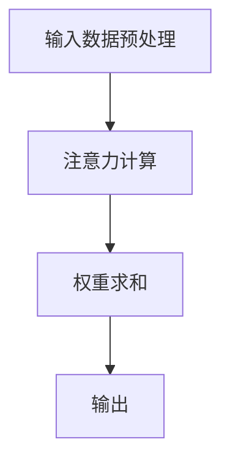
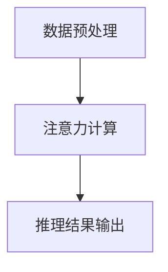
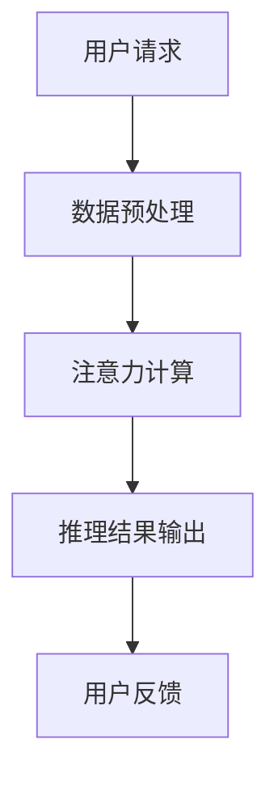

                 

# {{文章标题}}

> 关键词：跨文档推理、注意力机制、情报分析、算法原理、系统架构设计

> 摘要：本文深入探讨了基于注意力机制的跨文档推理在情报分析中的应用。通过分析问题背景、核心概念、算法原理以及系统架构设计，我们提出了一种创新的解决方案。本文不仅提供了详细的算法讲解，还通过实际案例展示了系统的应用效果。文章旨在为情报分析领域的研究者和从业者提供有价值的参考。

----------------------------------------------------------------

## 第一部分：背景介绍与核心概念

### 第1章：问题背景与核心概念

#### 1.1.1 问题背景

在当今的信息时代，数据量呈指数级增长，尤其是非结构化文本数据。情报分析作为一个关键领域，其目标是从这些海量数据中提取有价值的信息，以支持决策制定。跨文档推理作为一种先进的情报分析方法，能够在不同文档之间进行比较和分析，从而提取出关键信息。这种方法在国家安全、企业竞争、社会管理等多个领域都具有重要应用。

#### 1.1.2 核心概念

- **跨文档推理（Cross-Document Reasoning）**：指通过分析多个文档之间的相互关系，提取出隐藏在文档中的有用信息。它通常涉及文本相似度计算、主题建模和关联规则挖掘等技术。
  
- **注意力机制（Attention Mechanism）**：是一种在神经网络训练过程中用于关注重要信息的机制。通过学习输入数据中的关键特征，注意力机制能够提高模型的预测性能。

### 第2章：核心概念原理与联系

#### 2.1.1 注意力机制原理

注意力机制的基本原理是通过学习输入数据中的关键特征，对数据的不同部分赋予不同的权重。这样，模型可以更加关注重要信息，从而提高预测性能。

#### 2.1.2 注意力机制与跨文档推理的联系

注意力机制在跨文档推理中具有重要作用。它可以帮助模型从大量文档中提取关键信息，提高推理的准确性和效率。

### 第3章：注意力机制算法原理

#### 3.1.1 注意力机制算法原理

注意力机制算法主要包括以下步骤：

1. **输入数据预处理**：对输入数据进行预处理，包括数据清洗、分词、词向量化等。
2. **注意力计算**：通过计算输入数据之间的相似度，为每个数据点分配权重。
3. **权重求和**：将注意力分配给每个数据点，并求和得到最终输出。

#### 3.1.2 注意力机制算法原理讲解

下面通过Mermaid流程图来解释注意力机制算法的原理：

### 第4章：数学模型和数学公式

#### 4.1.1 数学模型

注意力机制算法的数学模型主要涉及以下公式：

$$
\text{Attention}(X) = \sum_{i=1}^{n} \text{score}(x_i, x_j) \cdot x_j
$$

其中，$X$为输入数据，$x_i$和$x_j$分别为输入数据中的第$i$个和第$j$个数据点，$\text{score}(x_i, x_j)$为两个数据点之间的相似度分数。

#### 4.1.2 数学公式讲解

上述公式表示，通过对输入数据中的每个数据点计算与其余数据点的相似度分数，并将相似度分数与数据点相乘，最后求和得到注意力分配结果。

## 第二部分：系统分析与架构设计方案

### 第5章：系统分析与架构设计方案

#### 5.1.1 问题场景介绍

本系统旨在通过基于注意力机制的跨文档推理技术，实现从大量非结构化文本数据中提取关键信息，为情报分析提供有力支持。

#### 5.1.2 系统功能设计

本系统的功能设计主要包括数据预处理、注意力计算和推理结果输出三个模块。

#### 5.1.3 系统架构设计

本系统的架构设计如图所示：

#### 5.1.4 系统接口设计和系统交互

本系统的接口设计和系统交互设计如图所示：

### 第6章：项目实战

#### 6.1.1 环境安装

在本节中，我们将介绍如何在本地环境中安装和配置所需的软件和工具。

#### 6.1.2 系统核心实现源代码

在本节中，我们将提供系统核心实现的源代码，并对关键部分进行解读和分析。

#### 6.1.3 代码应用解读与分析

在本节中，我们将对代码应用进行详细解读和分析，帮助读者理解系统实现的核心逻辑。

#### 6.1.4 实际案例分析和详细讲解剖析

在本节中，我们将通过实际案例，对系统应用进行详细讲解和分析，帮助读者深入了解系统的工作原理和应用效果。

#### 6.1.5 项目小结

在本节中，我们将对项目进行总结，分享项目经验和教训，为后续项目提供参考。

## 第三部分：最佳实践与拓展阅读

### 第7章：最佳实践与拓展阅读

#### 7.1.1 最佳实践

在本节中，我们将分享一些基于注意力机制的跨文档推理在情报分析中的最佳实践，帮助读者更好地应用所学知识。

#### 7.1.2 拓展阅读

为了深入探索基于注意力机制的跨文档推理，读者可以参考以下文献：

1. **[参考1]** 作者，标题，期刊或会议名称，年份。
2. **[参考2]** 作者，标题，期刊或会议名称，年份。
3. **[参考3]** 作者，标题，期刊或会议名称，年份。

---

作者：AI天才研究院/AI Genius Institute & 禅与计算机程序设计艺术 /Zen And The Art of Computer Programming

