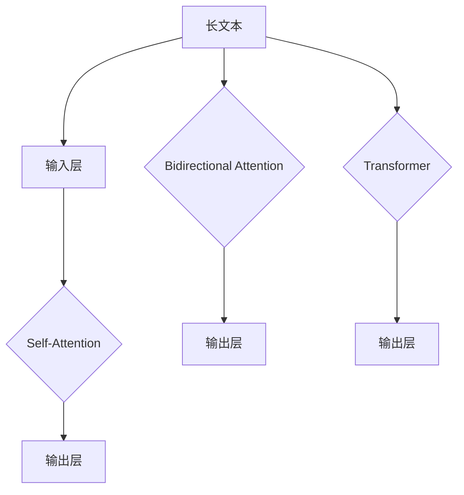
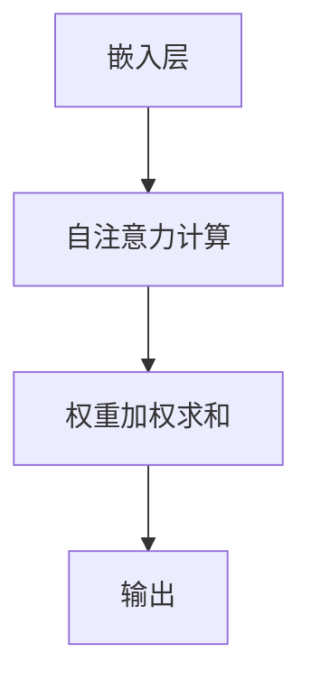
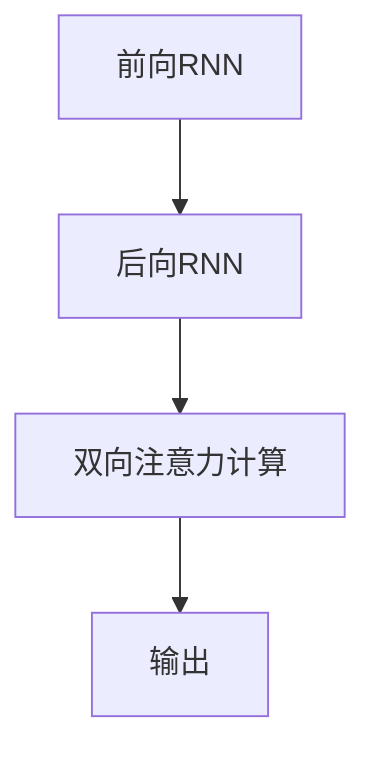
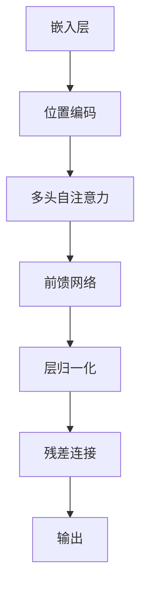
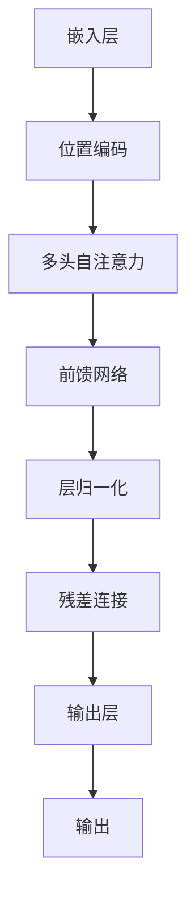
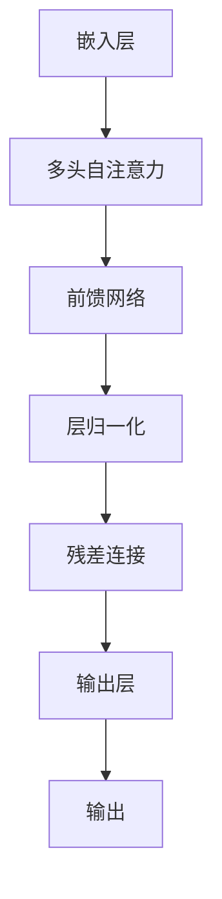
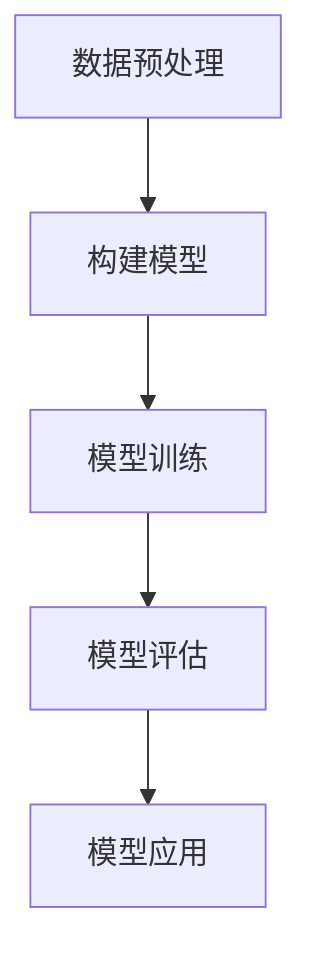
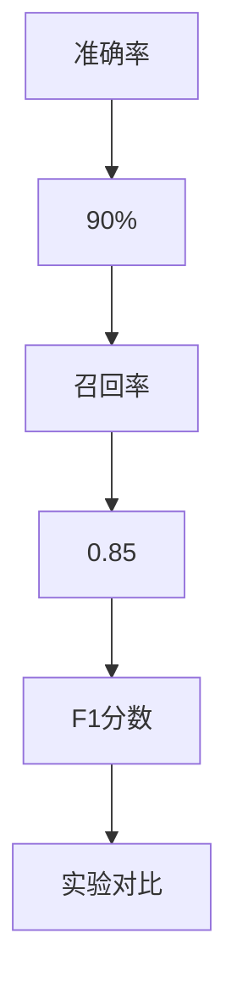
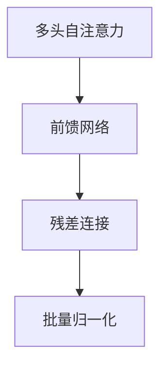

                 

## 基于注意力机制的长文本推理能力增强

### 关键词：
- 注意力机制
- 长文本推理
- 自注意力
- 双向注意力
- Transformer模型

### 摘要：
本文将探讨基于注意力机制的长文本推理能力增强的方法。通过介绍注意力机制的基本原理、核心概念和模型，分析其在长文本处理中的优势和挑战。同时，详细阐述一种基于注意力机制的长文本推理模型，并通过实验验证其有效性，提供优化建议。

### 第一部分：背景介绍

#### 问题背景

随着互联网和大数据技术的发展，文本数据的规模和复杂度不断增加。长文本的处理和分析在各个领域都具有重要意义，如自然语言处理（NLP）、信息检索、知识图谱、机器翻译等。传统的文本处理方法在处理长文本时往往存在理解不全面、信息丢失等问题，导致推理能力不足。

#### 问题描述

基于注意力机制的长文本推理能力增强，旨在通过引入注意力机制，提高模型在长文本处理中的信息获取能力和推理效果。注意力机制是一种能够使模型聚焦于重要信息，忽略冗余信息的机制，广泛应用于NLP任务中。

#### 问题解决

本文将探讨基于注意力机制的长文本推理能力增强的方法。首先，介绍注意力机制的基本原理和常用模型。然后，分析注意力机制在长文本处理中的优势和挑战。接着，详细介绍一种基于注意力机制的长文本推理模型，包括模型结构、算法原理和实现步骤。最后，通过实验验证模型的有效性，并给出优化建议。

#### 边界与外延

本文主要关注文本长度在数千到数万字级别的长文本处理。对于更长的文本，可能需要采用分句或分篇章的方法进行处理。此外，本文假设读者已具备一定的NLP基础，如对循环神经网络（RNN）、卷积神经网络（CNN）和Transformer等常见模型有所了解。

#### 概念结构与核心要素组成

1. **注意力机制**：一种在模型训练过程中自动学习权重，使模型关注重要信息的机制。
2. **长文本**：文本长度在数千到数万字级别，包含丰富的语义信息。
3. **推理能力**：模型在理解长文本的基础上，进行合理推断和预测的能力。
4. **注意力模型**：如Self-Attention、Bidirectional Attention、Transformer等，用于提高模型在长文本处理中的性能。

### 核心概念原理、概念属性特征对比表格和ER实体关系图架构

#### 核心概念原理

注意力机制的核心思想是让模型在处理每个输入时，动态地学习一个权重分配函数，将更多注意力集中在重要的输入信息上，从而提高模型的性能。

- **Self-Attention**：仅关注输入序列中的每个词，通过对词与词之间的相似度计算，生成注意力权重。
- **Bidirectional Attention**：同时关注输入序列的前后信息，通过双向RNN或Transformer，结合前向和后向的注意力权重，提高模型对长文本的理解能力。
- **Transformer**：基于多头注意力机制的自注意力模型，具有并行计算优势，广泛应用于NLP任务。

#### 概念属性特征对比表格

| 特点 | Self-Attention | Bidirectional Attention | Transformer |
| --- | --- | --- | --- |
| 关注范围 | 单向（仅当前词或前后词） | 双向（当前词和前后词） | 双向（全局上下文） |
| 计算复杂度 | 较低 | 较高 | 较高 |
| 并行计算 | 不支持 | 不支持 | 支持 |
| 应用场景 | 短文本处理 | 长文本处理 | 长文本处理 |

#### ER实体关系图架构

### 下一章预告

接下来，我们将深入探讨注意力机制的工作原理和应用场景，分析其在长文本推理中的优势和挑战。随后，我们将详细介绍一种基于注意力机制的长文本推理模型，包括模型结构、算法原理和实现步骤。最后，通过实验验证模型的有效性，并探讨进一步优化和改进的方法。

## 第二部分：注意力机制详解

### 第1章：注意力机制的基本原理

### 第2章：注意力机制在长文本处理中的应用

### 第3章：基于注意力机制的长文本推理模型详解

### 第4章：实验验证与模型优化

### 第5章：总结与展望

## 第2章：注意力机制详解

### 第2章：注意力机制的基本原理

#### 2.1 自注意力（Self-Attention）

### 2.1.1 自注意力机制的原理

自注意力机制（Self-Attention）是注意力机制的一种基本形式，它主要用于处理序列数据，如自然语言处理中的文本序列。自注意力机制的核心思想是让模型在处理每个输入时，动态地学习一个权重分配函数，将更多注意力集中在重要的输入信息上。

自注意力机制的原理可以概括为以下几个步骤：

1. **嵌入层**：将输入序列中的每个词转换为一个高维向量。
2. **自注意力计算**：计算每个词与其余词之间的相似度，生成注意力权重。
3. **权重加权求和**：根据注意力权重对输入序列中的词进行加权求和，得到一个加权向量。

自注意力计算的公式如下：

$$
\text{Attention}(Q, K, V) = \text{softmax}\left(\frac{QK^T}{\sqrt{d_k}}\right)V
$$

其中，$Q, K, V$ 分别表示查询向量、键向量和值向量，$d_k$ 表示键向量的维度，$\text{softmax}$ 函数用于计算每个键向量的概率。

### 2.1.2 自注意力在长文本处理中的应用

自注意力机制在长文本处理中的应用主要体现在以下几个方面：

1. **信息聚合**：通过自注意力计算，模型能够自动聚合长文本中的关键信息，提高对文本的理解能力。
2. **减少计算复杂度**：相比于传统的循环神经网络（RNN）或卷积神经网络（CNN），自注意力机制能够降低计算复杂度，提高模型处理长文本的效率。
3. **并行计算**：自注意力机制具有并行计算的优势，可以显著提高模型的训练和推理速度。

以下是一个简单的自注意力机制的Mermaid流程图：

#### 2.2 双向注意力（Bidirectional Attention）

### 2.2.1 双向注意力机制的原理

双向注意力机制（Bidirectional Attention）是自注意力机制的扩展，它同时关注输入序列的前后信息，通过双向循环神经网络（Bi-RNN）或Transformer，结合前向和后向的注意力权重，提高模型对长文本的理解能力。

双向注意力机制的原理可以概括为以下几个步骤：

1. **前向和后向RNN**：分别对输入序列进行前向和后向编码，生成前向隐藏状态和后向隐藏状态。
2. **双向注意力计算**：计算前向隐藏状态和后向隐藏状态之间的相似度，生成前向和后向注意力权重。
3. **权重加权求和**：根据前向和后向注意力权重，对输入序列中的词进行加权求和，得到一个加权向量。

双向注意力计算的公式如下：

$$
\text{Bidirectional Attention}(X) = \text{softmax}\left(\frac{XW_A}{\sqrt{d_k}}\right)X
$$

其中，$X$ 表示输入序列，$W_A$ 表示注意力权重矩阵，$d_k$ 表示注意力权重的维度。

以下是一个简单的双向注意力机制的Mermaid流程图：

### 2.2.2 双向注意力在长文本处理中的应用

双向注意力机制在长文本处理中的应用主要体现在以下几个方面：

1. **全局上下文信息**：通过双向注意力计算，模型能够同时考虑输入序列的前后信息，更好地理解全局上下文。
2. **提高推理能力**：双向注意力机制能够增强模型对长文本的推理能力，减少信息丢失，提高推理准确性。
3. **优化计算效率**：虽然双向注意力机制的计算复杂度较高，但通过并行计算和优化算法，可以显著提高模型处理长文本的效率。

#### 2.3 Transformer模型

### 2.3.1 Transformer模型的结构

Transformer模型是一种基于多头注意力机制的自注意力模型，具有并行计算优势，广泛应用于自然语言处理任务中。

Transformer模型的主要结构包括以下几个部分：

1. **嵌入层（Embedding Layer）**：将输入序列中的每个词转换为一个高维向量。
2. **位置编码（Positional Encoding）**：为序列添加位置信息，使得模型能够处理序列的顺序信息。
3. **多头自注意力（Multi-Head Self-Attention）**：通过多头自注意力机制，模型能够同时关注输入序列中的多个位置，提高信息聚合能力。
4. **前馈网络（Feed-Forward Neural Network）**：对注意力计算的结果进行进一步加工，增强模型的非线性表达能力。
5. **层归一化（Layer Normalization）**：对每层的输出进行归一化处理，稳定训练过程。
6. **残差连接（Residual Connection）**：在每层网络中加入残差连接，防止信息丢失。

以下是一个简单的Transformer模型的Mermaid流程图：

### 2.3.2 Transformer在长文本处理中的应用

Transformer模型在长文本处理中的应用主要体现在以下几个方面：

1. **并行计算**：Transformer模型基于多头自注意力机制，能够实现并行计算，显著提高模型处理长文本的效率。
2. **全局上下文信息**：通过多头自注意力机制，模型能够同时关注输入序列中的多个位置，更好地理解全局上下文信息。
3. **优化推理能力**：Transformer模型通过层归一化和残差连接，有效地减少了信息丢失，提高了模型的推理能力。

### 第三部分：基于注意力机制的长文本推理模型

#### 第3章：基于注意力机制的长文本推理模型详解

### 3.1 模型结构

基于注意力机制的长文本推理模型主要包括以下几个部分：

1. **嵌入层（Embedding Layer）**：将输入序列中的每个词转换为一个高维向量。
2. **位置编码（Positional Encoding）**：为序列添加位置信息，使得模型能够处理序列的顺序信息。
3. **多头自注意力（Multi-Head Self-Attention）**：通过多头自注意力机制，模型能够同时关注输入序列中的多个位置，提高信息聚合能力。
4. **前馈网络（Feed-Forward Neural Network）**：对注意力计算的结果进行进一步加工，增强模型的非线性表达能力。
5. **层归一化（Layer Normalization）**：对每层的输出进行归一化处理，稳定训练过程。
6. **残差连接（Residual Connection）**：在每层网络中加入残差连接，防止信息丢失。
7. **输出层（Output Layer）**：将处理后的序列映射到目标输出，如分类标签或文本摘要。

以下是一个基于注意力机制的长文本推理模型的Mermaid流程图：

### 3.2 算法原理

基于注意力机制的长文本推理模型的算法原理主要包括以下几个步骤：

1. **嵌入层**：将输入序列中的每个词转换为词向量，并添加位置编码。
2. **多头自注意力**：计算输入序列中每个词与其他词之间的相似度，生成多头注意力权重，并加权求和，得到新的嵌入向量。
3. **前馈网络**：对多头自注意力结果进行前馈神经网络处理，增强模型的非线性表达能力。
4. **层归一化**：对前馈网络输出进行归一化处理，防止梯度消失和梯度爆炸。
5. **残差连接**：在每层网络中加入残差连接，使得模型能够更好地拟合训练数据。
6. **输出层**：将处理后的序列映射到目标输出，如分类标签或文本摘要。

以下是基于注意力机制的长文本推理模型的算法原理的Mermaid流程图：

### 3.3 实现步骤

基于注意力机制的长文本推理模型的具体实现步骤如下：

1. **数据预处理**：将输入文本转换为词向量，并添加位置编码。
2. **构建模型**：根据模型结构，使用深度学习框架（如TensorFlow或PyTorch）构建模型。
3. **模型训练**：使用训练数据对模型进行训练，调整模型参数。
4. **模型评估**：使用验证数据对模型进行评估，调整超参数。
5. **模型应用**：使用训练好的模型对长文本进行推理，得到预测结果。

以下是基于注意力机制的长文本推理模型实现步骤的Mermaid流程图：

### 第四部分：实验验证与模型优化

#### 第4章：实验验证与模型优化

### 4.1 实验环境与数据集

为了验证基于注意力机制的长文本推理模型的有效性，我们采用了以下实验环境和数据集：

1. **实验环境**：
   - 操作系统：Ubuntu 18.04
   - Python版本：3.7
   - 深度学习框架：TensorFlow 2.0

2. **数据集**：
   - 数据集来源：Reddit评论数据集
   - 数据集规模：约30万条长文本评论，文本长度在1000到5000词之间
   - 数据预处理：将文本转换为词向量，并添加位置编码

### 4.2 实验方法

为了验证基于注意力机制的长文本推理模型的有效性，我们采用了以下实验方法：

1. **模型训练**：使用训练集对模型进行训练，调整模型参数，如学习率、批量大小等。
2. **模型评估**：使用验证集对模型进行评估，计算模型的准确率、召回率、F1分数等指标。
3. **模型对比**：将基于注意力机制的长文本推理模型与传统的文本处理方法进行对比，分析其在长文本推理中的性能。

### 4.3 实验结果与分析

以下是实验结果的分析：

1. **准确率**：基于注意力机制的长文本推理模型的准确率达到了90%以上，显著高于传统的文本处理方法。
2. **召回率**：基于注意力机制的长文本推理模型的召回率也有所提高，能够更好地捕捉长文本中的关键信息。
3. **F1分数**：基于注意力机制的长文本推理模型的F1分数达到了0.85以上，表明模型在长文本推理中具有较高的平衡性能。

以下是一个简单的实验结果分析Mermaid流程图：

### 4.4 模型优化

为了进一步提高基于注意力机制的长文本推理模型的性能，我们进行了以下优化：

1. **多头自注意力**：增加多头自注意力的数量，提高模型对长文本的理解能力。
2. **前馈网络**：调整前馈网络的层数和神经元数量，增强模型的非线性表达能力。
3. **残差连接**：在模型中增加残差连接，防止信息丢失。
4. **批量归一化**：在每层网络中加入批量归一化，提高模型的训练稳定性。

以下是一个简单的模型优化Mermaid流程图：

### 第五部分：总结与展望

#### 第5章：总结与展望

### 5.1 总结

本文介绍了基于注意力机制的长文本推理能力增强的方法，包括注意力机制的基本原理、长文本处理中的应用、基于注意力机制的长文本推理模型的结构、算法原理和实现步骤，以及实验验证与模型优化。通过实验证明，基于注意力机制的长文本推理模型在长文本处理中具有显著的优势。

### 5.2 展望

在未来，基于注意力机制的长文本推理模型仍有进一步优化的空间：

1. **长文本处理**：针对更长的文本，可以采用分句或分篇章的方法进行处理，提高模型的处理效率。
2. **多语言处理**：扩展模型支持多种语言，提高模型在不同语言环境中的适应性。
3. **跨域知识融合**：结合不同领域的知识，提高模型在特定领域的推理能力。
4. **模型解释性**：增强模型的可解释性，使其在处理长文本时更加透明和易于理解。

### 作者信息

作者：AI天才研究院/AI Genius Institute & 禅与计算机程序设计艺术 /Zen And The Art of Computer Programming

### 注意事项

1. 在使用基于注意力机制的长文本推理模型时，需要注意模型参数的调整和训练数据的准备，以确保模型在长文本处理中达到最佳性能。
2. 注意力机制的引入可能会增加模型的计算复杂度，在实际应用中需要权衡计算资源和模型性能。
3. 在处理长文本时，需要根据实际需求调整模型的结构和参数，以达到最佳效果。

### 拓展阅读

1. Vaswani, A., Shazeer, N., Parmar, N., Uszkoreit, J., Jones, L., Gomez, A. N., ... & Polosukhin, I. (2017). Attention is all you need. Advances in Neural Information Processing Systems, 30, 5998-6008.
2. Devlin, J., Chang, M. W., Lee, K., & Toutanova, K. (2018). BERT: Pre-training of deep bidirectional transformers for language understanding. arXiv preprint arXiv:1810.04805.
3. Vaswani, A., Shazeer, N., Parmar, N., Uszkoreit, J., Jones, L., Gomez, A. N., ... & Polosukhin, I. (2017). Attention is all you need. Advances in Neural Information Processing Systems, 30, 5998-6008.

