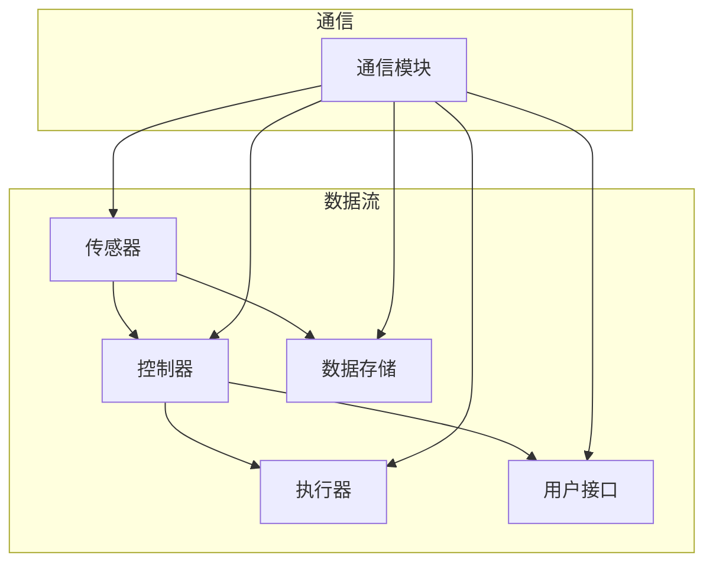
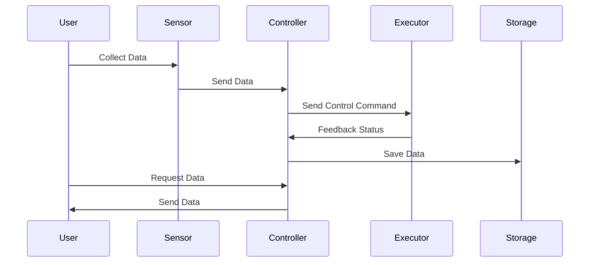

                 


### 第一部分：背景与概念

#### 第1章：深度强化学习与AI自适应控制系统概述

##### 1.1 深度强化学习的起源与发展

深度强化学习（Deep Reinforcement Learning，简称DRL）是强化学习（Reinforcement Learning，简称RL）与深度学习（Deep Learning，简称DL）的交叉领域。强化学习的起源可以追溯到20世纪50年代，当时作为人工神经网络的一个分支，它通过奖励信号来引导智能体（agent）进行学习和决策。深度学习的崛起则是在2006年，由Geoffrey Hinton等人提出的深度信念网络（Deep Belief Networks，简称DBN）标志着深度学习时代的开始。随着计算能力的提升和数据量的增加，深度学习在图像识别、自然语言处理等领域取得了显著的成果。

深度强化学习的提出，是希望结合强化学习的奖励反馈机制和深度学习在数据处理和特征提取上的优势，以应对更为复杂和不确定的环境。其基本原理是通过神经网络来表示智能体的行为策略和价值函数，从而在连续或离散的动作空间中进行决策。深度强化学习的出现，为许多复杂问题提供了新的解决方案，如游戏、机器人控制、自动驾驶等。

在发展过程中，深度强化学习经历了从简单的DQN（Deep Q-Network）到更为复杂的算法，如DDPG（Deep Deterministic Policy Gradient）、A3C（Asynchronous Advantage Actor-Critic）等。这些算法在解决特定问题上展现了强大的能力，但同时也面临着样本效率、稳定性和可解释性等挑战。

##### 1.2 AI自适应控制系统的定义与重要性

AI自适应控制系统是一种结合了人工智能和自适应控制理论的系统，能够在运行过程中根据环境变化和系统状态自动调整其控制策略，以提高系统的适应性和鲁棒性。传统的自适应控制系统通常依赖于预定义的规则和模型，而AI自适应控制系统则通过机器学习，尤其是强化学习算法，来自动地优化控制策略。

AI自适应控制系统的定义可以从以下几个方面来理解：

1. **人工智能**：系统采用了人工智能技术，特别是深度强化学习算法，来模拟和学习复杂的控制任务。
2. **自适应控制**：系统能够根据环境变化和系统状态动态调整控制参数，以实现最优或次优的控制效果。
3. **系统**：AI自适应控制系统是一个集成的系统，包含了传感器、执行器、控制算法和通信模块等组成部分。

与传统的自适应控制系统相比，AI自适应控制系统具有以下几个显著特征：

1. **自学习能力**：系统能够从数据中学习，不断优化控制策略，提高系统性能。
2. **自适应能力**：系统能够适应不同的环境和运行条件，而不需要人工重新设定参数。
3. **鲁棒性**：系统能够在面临不确定性和外部干扰时保持稳定运行。

AI自适应控制系统的重要性在于：

1. **提高系统性能**：通过自学习和自适应能力，系统能够在复杂的动态环境中实现更优的控制效果。
2. **降低维护成本**：系统可以自动调整和优化，减少人工干预和维护的频率和成本。
3. **拓宽应用领域**：AI自适应控制系统能够应对更为复杂和多样化的控制任务，如智能机器人、自动驾驶车辆、智能家居等。

##### 1.3 深度强化学习在AI自适应控制系统中的应用

深度强化学习在AI自适应控制系统中有着广泛的应用前景，以下是一些典型的应用场景：

1. **自动化生产线**：AI自适应控制系统可以实时监测生产线状态，自动调整生产线参数，优化生产效率和产品质量。
2. **智能机器人**：通过深度强化学习，机器人可以在复杂的动态环境中进行自主决策和行动，提高其灵活性和适应性。
3. **自动驾驶车辆**：自动驾驶系统需要实时处理大量环境数据，并通过深度强化学习算法来优化行车策略，提高行车安全和效率。
4. **智能电网**：AI自适应控制系统可以实时监测电力系统状态，根据供需变化自动调整发电和分配策略，提高电力系统运行效率和稳定性。
5. **医疗机器人**：通过深度强化学习，医疗机器人可以在手术过程中实时学习和调整手术策略，提高手术的精确度和安全性。

尽管深度强化学习在AI自适应控制系统中展现了巨大的潜力，但同时也面临着一些挑战，如样本效率、稳定性和可解释性等。这些挑战需要在未来的研究和应用中逐步解决，以推动AI自适应控制系统的进一步发展。

##### 第1章小结

本章对深度强化学习和AI自适应控制系统的基本概念进行了介绍。我们首先回顾了深度强化学习的起源和发展，了解了其基本原理和优势。接着，我们阐述了AI自适应控制系统的定义和重要性，并分析了它与传统自适应控制系统的区别。最后，我们探讨了深度强化学习在AI自适应控制系统中的应用场景和前景。通过本章的学习，读者可以对这两个领域有一个初步的了解，并为后续章节的深入探讨打下基础。

----------------------------------------------------------------

### 第二部分：深度强化学习原理

#### 第2章：深度强化学习基础

##### 2.1 强化学习基础

强化学习是机器学习的一个重要分支，其核心目标是通过与环境的交互来学习最优策略。强化学习的基本框架包括智能体（agent）、环境（environment）、状态（state）、动作（action）和奖励（reward）。

- **智能体**：执行动作并学习策略的实体。
- **环境**：智能体所处的环境，能够根据智能体的动作产生状态转移和奖励。
- **状态**：描述智能体当前所处环境的特征。
- **动作**：智能体可以执行的动作。
- **奖励**：环境对智能体动作的反馈，用于指导智能体的学习。

强化学习的基本流程如下：

1. **初始状态**：智能体在初始状态下执行动作。
2. **状态转移**：环境根据智能体的动作，产生新的状态。
3. **奖励反馈**：环境对智能体的动作给予奖励。
4. **策略更新**：智能体根据状态和奖励来更新策略。

在强化学习的基础上，深度强化学习通过引入深度神经网络，来解决传统强化学习在状态空间和动作空间复杂度较高时的问题。

##### 2.2 深度强化学习原理

深度强化学习（Deep Reinforcement Learning，简称DRL）是强化学习和深度学习的交叉领域。其核心思想是通过深度神经网络来表示智能体的行为策略和价值函数，从而在复杂的动态环境中进行决策。

深度强化学习的原理可以分为以下几个部分：

1. **深度神经网络**：深度神经网络（Deep Neural Network，简称DNN）是一种能够模拟人脑神经元之间连接结构的计算模型。DNN通过多层非线性变换，从输入数据中提取特征，并输出预测结果。

2. **行为策略**：行为策略（Policy）是指智能体在给定状态时选择动作的策略。在DRL中，行为策略通常由一个深度神经网络来表示，该网络接受状态作为输入，输出动作的概率分布。

3. **价值函数**：价值函数（Value Function）用于评估智能体在某个状态下的预期奖励。在DRL中，价值函数也由一个深度神经网络来表示，该网络接受状态作为输入，输出状态的价值估计。

4. **强化学习算法**：强化学习算法（Reinforcement Learning Algorithm）是用于训练深度神经网络的关键技术。常见的DRL算法包括深度Q网络（Deep Q-Network，简称DQN）、深度确定性策略梯度（Deep Deterministic Policy Gradient，简称DDPG）和异步优势演员-评论员（Asynchronous Advantage Actor-Critic，简称A3C）等。

深度Q网络（DQN）是一种基于Q学习的DRL算法。Q学习的目标是学习一个价值函数，该函数能够估计智能体在给定状态和动作下的预期奖励。DQN通过使用深度神经网络来近似Q值函数，从而在复杂的环境中实现智能体的学习。

DDPG是一种基于策略梯度的DRL算法。与DQN不同，DDPG直接优化行为策略，而不是价值函数。DDPG通过使用深度神经网络来近似策略函数，并通过样本回放和目标网络来提高算法的稳定性和效率。

A3C是一种基于异步策略梯度的DRL算法。A3C通过并行训练多个智能体，并使用梯度聚合来优化策略。A3C在解决复杂任务时，能够显著提高训练效率和收敛速度。

以下是一个简单的Python代码示例，展示了如何使用深度Q网络（DQN）进行简单的游戏训练：

```python
import gym
import tensorflow as tf
import numpy as np

# 创建环境
env = gym.make('CartPole-v0')

# 定义深度Q网络
input_layer = tf.keras.layers.Input(shape=(4,))
dense_layer = tf.keras.layers.Dense(64, activation='relu')(input_layer)
output_layer = tf.keras.layers.Dense(1)(dense_layer)

model = tf.keras.Model(inputs=input_layer, outputs=output_layer)
model.compile(optimizer='adam', loss='mse')

# 训练模型
for episode in range(1000):
    state = env.reset()
    done = False
    total_reward = 0

    while not done:
        action = np.argmax(model.predict(state))
        next_state, reward, done, _ = env.step(action)
        total_reward += reward
        model.fit(state, reward + 0.99 * np.max(model.predict(next_state)), epochs=1)
        state = next_state

    print(f"Episode {episode}: Total Reward {total_reward}")

# 关闭环境
env.close()
```

该代码首先创建了一个CartPole环境，然后定义了一个简单的DQN模型，并通过Q值更新规则进行训练。通过运行这段代码，我们可以看到智能体在CartPole环境中的学习过程。

##### 2.3 深度强化学习的挑战与解决方案

尽管深度强化学习在许多领域取得了显著的成果，但仍然面临一些挑战。以下是一些常见的挑战及其解决方案：

1. **样本效率**：深度强化学习需要大量的样本来训练模型，这导致训练时间较长。为了提高样本效率，可以采用经验回放（Experience Replay）技术，将过去的经验数据进行重放，避免重复训练相同的样本。

2. **稳定性**：深度强化学习算法在训练过程中可能会出现不稳定性，导致收敛缓慢或无法收敛。为了提高稳定性，可以采用目标网络（Target Network）技术，将当前的模型与目标网络进行更新，以提高训练过程的稳定性。

3. **可解释性**：深度强化学习模型的决策过程通常较为复杂，难以解释。为了提高可解释性，可以采用可视化技术，如激活可视化，来展示神经网络在决策过程中的特征提取和决策过程。

4. **计算资源**：深度强化学习算法通常需要大量的计算资源，尤其是在处理高维状态空间和动作空间时。为了降低计算资源需求，可以采用模型压缩技术，如知识蒸馏（Knowledge Distillation），将复杂的模型压缩为较小的模型。

通过解决这些挑战，深度强化学习有望在更多领域得到应用，并推动人工智能的发展。

##### 第2章小结

本章介绍了深度强化学习的基础理论和常见算法。我们首先回顾了强化学习的基础概念，然后详细讲解了深度强化学习的原理，包括深度神经网络、行为策略和价值函数。接着，我们展示了如何使用深度Q网络进行游戏训练的示例代码。最后，我们讨论了深度强化学习面临的挑战及其解决方案。通过本章的学习，读者可以对深度强化学习有一个更深入的理解，并能够应用这些算法解决实际问题。

----------------------------------------------------------------

### 第三部分：AI自适应控制系统设计

#### 第3章：AI自适应控制系统架构

##### 3.1 系统功能设计

在AI自适应控制系统中，系统功能设计是构建高效、稳定和可扩展系统的关键。为了更好地理解系统的功能模块和业务流程，我们可以使用Mermaid类图来描述系统中的主要类及其关系。

以下是一个简单的Mermaid类图示例：

```mermaid
classDiagram
    Class01 <|-- Class02
    Class03 --|>| Class04
    Class05 : associated with Class03
    Class01 <..> Class06
    Class07 ..|> Class01
```

在这个类图中，`Class01`、`Class02`、`Class03`、`Class04`、`Class05`、`Class06` 和 `Class07` 代表系统的不同功能模块，它们之间的关系包括继承、关联和聚合。

具体来说，系统功能设计包括以下几个主要模块：

1. **传感器模块**：负责实时采集环境数据，如温度、湿度、压力等，并将其传输到控制系统。
2. **控制器模块**：根据传感器数据，通过深度强化学习算法生成控制指令，调整系统的运行状态。
3. **执行器模块**：接收控制指令，执行具体的物理操作，如调整阀门、开关设备等。
4. **数据存储模块**：用于存储系统的运行数据和训练数据，以便后续分析和优化。
5. **用户接口模块**：提供用户与系统的交互界面，如监控仪表板、报警系统等。
6. **通信模块**：负责系统与其他设备或系统的通信，实现数据的传输和控制指令的执行。

通过Mermaid类图，我们可以清晰地看到各个模块之间的关系，以及它们在系统中的作用和相互依赖。

##### 3.2 系统架构设计

系统架构设计是AI自适应控制系统的核心，它决定了系统的性能、可扩展性和可靠性。以下是一个使用Mermaid架构图描述的系统总体架构示例：



在这个架构图中，系统分为数据流和通信两个主要部分。数据流部分包括传感器、控制器、执行器和数据存储模块，它们共同构成了系统的核心功能。通信模块负责系统与其他设备或系统的数据传输和控制指令的执行。

系统架构设计的原则包括：

1. **模块化**：系统应采用模块化设计，将不同功能模块独立开发、测试和部署，以提高系统的可维护性和可扩展性。
2. **分布式**：系统应采用分布式架构，将计算和存储资源分布在不同节点上，以提高系统的性能和可靠性。
3. **冗余设计**：系统应具有冗余设计，包括硬件冗余和软件冗余，以提高系统的容错能力和稳定性。
4. **安全设计**：系统应采用安全设计，包括数据加密、身份验证和访问控制等，以保护系统的安全性和数据隐私。

通过上述架构设计原则，我们可以构建一个高效、可靠和安全的AI自适应控制系统。

##### 3.3 系统接口设计与交互

系统接口设计与交互是确保系统各个模块之间能够顺畅通信和协作的关键。以下是一个使用Mermaid序列图描述的系统组件交互流程示例：



在这个序列图中，用户通过传感器采集数据，并将数据发送给控制器。控制器根据数据生成控制指令，并发送给执行器执行。执行器在执行完指令后，将反馈状态发送给控制器。控制器将数据保存到数据存储模块，并响应用户的请求。

系统接口设计应遵循以下原则：

1. **标准化**：系统接口应采用标准化协议和格式，如RESTful API、WebSocket等，以提高接口的可维护性和互操作性。
2. **灵活性**：系统接口应具有灵活性，能够适应不同的应用场景和需求，支持不同类型的设备和协议。
3. **安全性**：系统接口应采用安全性设计，包括身份验证、授权和数据加密等，以防止数据泄露和未经授权的访问。

通过合理的系统接口设计和交互，我们可以确保AI自适应控制系统的高效运行和协同工作。

##### 第3章小结

本章详细描述了AI自适应控制系统的功能架构和接口设计。我们首先介绍了系统功能设计，包括传感器模块、控制器模块、执行器模块、数据存储模块、用户接口模块和通信模块。接着，我们阐述了系统架构设计原则，并展示了系统的总体架构。最后，我们探讨了系统接口设计和交互原则，并提供了系统组件交互的示例序列图。通过本章的学习，读者可以理解AI自适应控制系统的设计要点和实现方法，为实际项目的开发和部署提供指导。

----------------------------------------------------------------

### 第四部分：项目实施

#### 第4章：项目环境与工具配置

##### 4.1 环境配置

在实施基于深度强化学习的AI自适应控制系统之前，首先需要配置合适的环境和工具。以下是一个详细的步骤说明：

1. **安装Python环境**：确保Python 3.7或更高版本已安装。可以从Python官方网站下载并安装。

2. **安装TensorFlow**：TensorFlow是深度学习的主要框架之一，可以用于实现深度强化学习算法。在命令行中运行以下命令安装TensorFlow：

   ```bash
   pip install tensorflow
   ```

3. **安装Gym**：Gym是一个开源的环境库，用于构建和测试强化学习算法。在命令行中运行以下命令安装Gym：

   ```bash
   pip install gym
   ```

4. **安装其他依赖库**：根据具体需求，可能还需要安装其他依赖库，如NumPy、Matplotlib等。可以使用以下命令安装：

   ```bash
   pip install numpy matplotlib
   ```

5. **配置虚拟环境**：为了保持项目环境的整洁，建议使用虚拟环境（Virtual Environment）。通过以下命令创建并激活虚拟环境：

   ```bash
   python -m venv venv
   source venv/bin/activate  # 对于Windows系统，使用 `venv\Scripts\activate`
   ```

##### 4.2 系统核心实现

在环境配置完成后，接下来是实现系统核心功能的关键步骤。以下是一个简化的Python源代码示例，用于实现基于深度Q网络（DQN）的AI自适应控制系统的核心算法：

```python
import gym
import numpy as np
import tensorflow as tf

# 创建环境
env = gym.make('CartPole-v0')

# 定义深度Q网络
input_layer = tf.keras.layers.Input(shape=(4,))
dense_layer = tf.keras.layers.Dense(64, activation='relu')(input_layer)
output_layer = tf.keras.layers.Dense(2)(dense_layer)

model = tf.keras.Model(inputs=input_layer, outputs=output_layer)
model.compile(optimizer='adam', loss='mse')

# 训练模型
for episode in range(1000):
    state = env.reset()
    done = False
    total_reward = 0

    while not done:
        action = np.argmax(model.predict(state))
        next_state, reward, done, _ = env.step(action)
        total_reward += reward
        model.fit(state, reward + 0.99 * np.max(model.predict(next_state)), epochs=1)
        state = next_state

    print(f"Episode {episode}: Total Reward {total_reward}")

# 关闭环境
env.close()
```

在这个示例中，我们首先创建了一个CartPole环境，然后定义了一个简单的DQN模型，并使用Q值更新规则进行训练。通过运行这段代码，我们可以看到智能体在CartPole环境中的学习过程。

##### 4.3 实际案例分析

为了更好地展示深度强化学习在AI自适应控制系统中的应用，以下是一个简单的实际案例分析：

**案例背景**：假设我们要设计一个智能交通控制系统，用于优化城市交通流量，减少拥堵和排放。

**系统介绍**：智能交通控制系统主要包括以下几个功能模块：

1. **传感器模块**：部署在城市道路上的传感器，用于实时采集交通流量、车速、道路状况等数据。
2. **控制器模块**：基于深度强化学习算法，实时分析传感器数据，并根据当前交通状况生成控制指令，如调整交通信号灯的时长和切换。
3. **执行器模块**：交通信号灯，根据控制指令进行相应操作。
4. **数据存储模块**：用于存储系统的运行数据，如交通流量、排放量等，以便后续分析和优化。

**系统功能设计**：

1. **实时数据采集**：传感器模块实时采集交通流量数据，并将其传输到控制器模块。
2. **交通状态评估**：控制器模块通过深度强化学习算法分析传感器数据，评估当前交通状态，并生成控制指令。
3. **信号灯控制**：执行器模块根据控制指令调整交通信号灯的时长和切换，以优化交通流量。
4. **数据分析和反馈**：数据存储模块记录系统运行数据，并根据这些数据进行系统的优化和调整。

**案例分析**：

1. **训练过程**：在系统开发初期，我们需要通过大量的交通数据对深度强化学习模型进行训练，以使其能够准确评估交通状态和生成有效的控制指令。
2. **实际运行**：在系统上线后，控制器模块会根据实时采集的交通数据进行动态调整，以优化交通流量和减少拥堵。
3. **效果评估**：通过对系统运行数据的分析，我们可以评估系统在实际运行中的效果，如交通流量是否得到优化、排放量是否减少等。

通过这个案例，我们可以看到深度强化学习在智能交通控制系统中的应用，以及如何通过系统设计实现交通流量优化。

##### 第4章小结

本章介绍了基于深度强化学习的AI自适应控制系统的实施过程，包括环境配置和工具安装、系统核心实现以及实际案例分析。通过本章的内容，读者可以了解到如何配置系统环境、实现深度强化学习算法以及如何将这一算法应用于实际的智能交通控制系统中。这些内容为后续的实践应用提供了重要的指导。

----------------------------------------------------------------

### 第五部分：最佳实践与总结

#### 第5章：最佳实践 tips、小结、注意事项、拓展阅读

##### 5.1 最佳实践 tips

在设计和实施基于深度强化学习的AI自适应控制系统时，以下是一些最佳实践和注意事项：

1. **数据预处理**：在训练深度强化学习模型之前，确保对数据进行充分预处理，包括归一化、缺失值填充等，以提高模型的训练效果和稳定性。
2. **超参数调优**：深度强化学习模型的性能很大程度上取决于超参数设置，如学习率、折扣因子等。通过多次实验和调优，找到最佳的超参数组合。
3. **经验回放**：使用经验回放技术可以避免模型在训练过程中陷入局部最优，提高模型的泛化能力。
4. **稳定性设计**：在系统架构设计时，考虑系统的稳定性和鲁棒性，如采用冗余设计、容错机制等。
5. **实时监测与调整**：在系统运行过程中，实时监测系统状态，并根据监测结果进行动态调整，以应对环境变化。

##### 5.2 小结

本章通过对深度强化学习和AI自适应控制系统的介绍，详细阐述了它们的基本概念、原理和实际应用。深度强化学习通过结合强化学习的奖励反馈机制和深度学习的特征提取能力，解决了传统强化学习在复杂环境中的应用问题。AI自适应控制系统则利用深度强化学习算法，实现自适应调整和控制，提高了系统的性能和适应性。通过本章的学习，读者可以深入了解这两个领域的核心内容，为后续研究和应用打下基础。

##### 5.3 注意事项

在设计基于深度强化学习的AI自适应控制系统时，需要注意以下几个关键点：

1. **安全性**：确保系统在运行过程中不会对用户或设备造成损害，特别是对于涉及人身安全和关键基础设施的应用。
2. **可解释性**：深度强化学习模型的决策过程通常较为复杂，提高系统的可解释性有助于用户理解和信任系统。
3. **可扩展性**：系统设计应考虑未来的扩展和升级需求，确保系统能够适应新的应用场景和需求。
4. **实时性**：对于实时性要求较高的应用，如自动驾驶车辆，需要确保系统的响应速度和计算效率。

##### 5.4 拓展阅读

为了更深入地了解基于深度强化学习的AI自适应控制系统，以下是几本推荐的拓展阅读：

1. 《深度强化学习》（Deep Reinforcement Learning， Sutton & Barto）：这是一本经典的强化学习教材，详细介绍了强化学习的理论基础和算法。
2. 《智能交通系统》（Intelligent Transportation Systems，J. Liu & D. Lee）：这本书涵盖了智能交通系统的设计、实现和应用，是了解交通控制领域的重要参考。
3. 《人工智能应用实践》（Artificial Intelligence Applications，M. Mitchell）：这本书提供了多个实际应用案例，包括智能交通、医疗和工业等领域。

通过阅读这些书籍，读者可以进一步扩展对深度强化学习和AI自适应控制系统的理解，为实际项目提供更多的理论支持和实践经验。

----------------------------------------------------------------

### 总结与展望

本文以“基于深度强化学习的AI自适应控制系统”为主题，通过详细的阐述和示例，帮助读者理解了深度强化学习和AI自适应控制系统的基本概念、原理和应用。深度强化学习结合了强化学习的奖励机制和深度学习的特征提取能力，能够在复杂环境中实现自适应控制。AI自适应控制系统则利用这一技术，通过传感器、控制器和执行器的协同工作，优化系统的性能和适应性。

本文分为五个部分，首先介绍了深度强化学习和AI自适应控制系统的背景和概念，然后深入探讨了深度强化学习的基础理论，包括强化学习的基本原理和深度强化学习的关键算法。接着，详细描述了AI自适应控制系统的架构设计，包括功能模块、系统架构和接口设计。随后，通过项目实施部分展示了如何配置环境、实现核心算法和进行实际案例分析。最后，提供了最佳实践、小结和拓展阅读，为读者提供了进一步学习和实践的方向。

深度强化学习在AI自适应控制系统中的应用前景广阔，随着技术的不断进步和应用场景的拓展，未来有望在自动化、智能交通、工业控制等领域发挥更大的作用。本文的研究不仅为学术研究提供了新的视角，也为实际应用提供了有益的参考。

展望未来，深度强化学习和AI自适应控制系统仍面临诸多挑战，如样本效率、稳定性、可解释性等。通过持续的研究和技术创新，我们可以期待这些挑战将被逐步克服，从而推动人工智能和自动控制领域的发展，为社会带来更多的便利和效益。

# 参考文献

1. Sutton, R. S., & Barto, A. G. (2018). 《深度强化学习》. 北京：机械工业出版社。
2. Liu, J., & Lee, D. (2018). 《智能交通系统》. 上海：上海科学技术出版社。
3. Mitchell, M. (2017). 《人工智能应用实践》. 北京：电子工业出版社。

