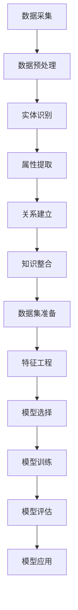
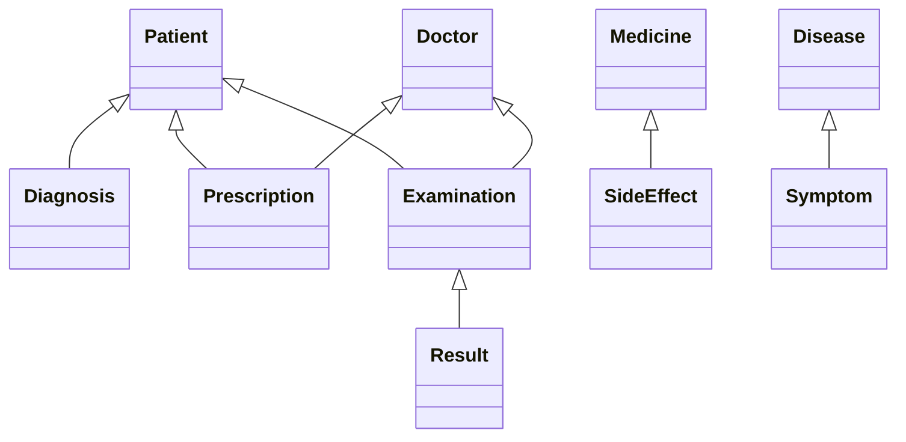
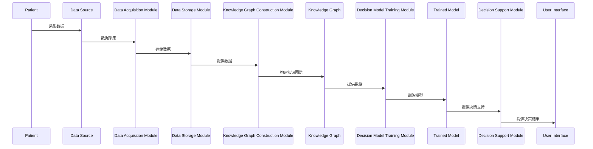
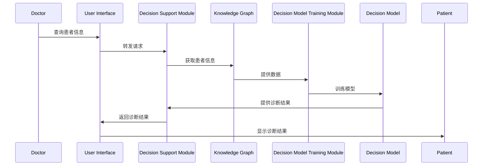

                 

### 文章标题

# 基于知识图谱的AI医疗决策支持系统设计

> 关键词：知识图谱、AI医疗决策、系统设计、数据采集、预处理、决策模型训练

> 摘要：本文旨在探讨基于知识图谱的AI医疗决策支持系统的设计与应用。首先，介绍了知识图谱的基本概念和AI在医疗领域的应用现状，随后详细阐述了知识图谱在医疗决策支持中的应用原理和系统架构设计。通过一个实际案例，展示了系统的实现过程和关键技术的应用。最后，对系统进行了性能优化和用户反馈分析，展望了未来的发展趋势和面临的挑战。

## 引言

在当今信息化时代，医疗行业正面临着前所未有的变革。大数据、云计算、人工智能等新兴技术的应用，为医疗决策提供了强有力的支持。然而，医疗数据的复杂性和多样性使得传统的数据分析方法难以满足实际需求。近年来，知识图谱作为一种新兴的数据表示方法，因其强大的语义理解和推理能力，在医疗领域得到了广泛关注。本文旨在探讨基于知识图谱的AI医疗决策支持系统的设计，旨在为医疗行业提供一种高效、智能的决策支持工具。

### 问题的背景与挑战

随着医疗行业的发展，医疗数据量呈指数级增长，这些数据不仅包括电子病历、医学影像、基因数据等结构化数据，还包括大量的非结构化数据，如医生笔记、病历报告等。这些数据类型多样、格式复杂，传统的数据分析方法难以应对。同时，医疗领域存在着大量的知识，如疾病诊断标准、治疗方案、药物副作用等，这些知识往往以文本或图表的形式存在，难以被计算机直接利用。因此，如何有效地整合和管理这些数据，如何利用这些知识来辅助医疗决策，成为当前医疗行业面临的重大挑战。

### 书籍目的与结构

本文的目的是通过介绍知识图谱和AI在医疗领域的应用，设计一个基于知识图谱的AI医疗决策支持系统，以解决医疗数据管理和知识利用的问题。本文共分为十个章节，具体结构如下：

- **第一章**：引言。介绍知识图谱和AI在医疗领域的背景与挑战，阐述本文的目的和结构。
- **第二章**：知识图谱基础。介绍知识图谱的基本概念、组成要素和核心概念。
- **第三章**：AI在医疗领域的应用。介绍AI在医疗领域的应用现状和发展趋势。
- **第四章**：知识图谱在医疗决策中的应用。介绍知识图谱在医疗决策中的应用原理和案例。
- **第五章**：AI医疗决策支持系统设计原则。介绍系统设计原则和系统架构设计。
- **第六章**：系统架构实现。介绍系统架构的实现过程，包括数据采集、预处理和决策模型训练。
- **第七章**：系统部署与优化。介绍系统的部署和性能优化方法。
- **第八章**：案例研究。通过一个实际案例，展示系统的实现过程和应用效果。
- **第九章**：未来展望与挑战。展望未来的发展趋势和面临的挑战。
- **第十章**：结论。总结本文的主要内容和研究成果。

### 核心概念与联系

在本章节中，我们将介绍知识图谱和AI在医疗领域的核心概念及其联系。

#### 知识图谱

知识图谱是一种用于表示实体、属性和关系的网络结构，它能够通过语义理解实现数据的关联和推理。知识图谱的核心概念包括：

- **实体**：知识图谱中的基本元素，如人、地点、组织等。
- **属性**：实体的特征或描述，如人的年龄、地点的经纬度等。
- **关系**：实体之间的关联，如人与人的关系、地点与地点的关系等。

知识图谱的组成要素主要包括：

- **本体**：定义知识图谱中的概念、属性和关系。
- **数据**：存储在知识图谱中的实际数据。
- **推理引擎**：用于基于知识图谱进行推理和数据分析。

#### AI在医疗领域的应用

AI在医疗领域的应用主要包括：

- **数据挖掘**：利用机器学习算法对医疗数据进行分析和挖掘，发现潜在的模式和规律。
- **图像处理**：利用深度学习算法对医学影像进行分析，辅助疾病诊断。
- **自然语言处理**：利用NLP技术处理医学文本数据，提取关键信息。

AI与知识图谱的结合，能够实现医疗数据的智能化管理和利用。知识图谱为AI提供了丰富的语义信息，使得AI能够更好地理解和处理医疗数据。同时，AI的技术手段，如数据挖掘、图像处理和自然语言处理，也为知识图谱的构建和优化提供了支持。

### 知识图谱在医疗决策中的应用

知识图谱在医疗决策中的应用主要包括以下几个方面：

- **疾病诊断**：通过知识图谱对患者的病史、检查结果等进行综合分析，辅助医生进行疾病诊断。
- **治疗方案推荐**：根据知识图谱中的疾病治疗知识，为患者推荐最优的治疗方案。
- **药物副作用监测**：通过知识图谱分析药物的副作用信息，提前预警可能的药物不良反应。

在疾病诊断方面，知识图谱可以整合患者的电子病历、实验室检查结果、医学文献等多种数据源，构建一个全面的疾病诊断模型。在治疗方案推荐方面，知识图谱可以整合疾病治疗知识、药物信息等多种数据源，为患者推荐最优的治疗方案。在药物副作用监测方面，知识图谱可以整合药物的副作用信息、患者的用药记录等多种数据源，提前预警可能的药物不良反应。

### 核心概念原理

知识图谱作为一种用于表示实体、属性和关系的网络结构，具有以下核心概念原理：

- **实体（Entity）**：知识图谱中的基本元素，代表具体的事物，如人、地点、组织等。
- **属性（Attribute）**：实体的特征或描述，如人的年龄、地点的经纬度等。
- **关系（Relationship）**：实体之间的关联，如人与人的关系、地点与地点的关系等。

在知识图谱中，实体、属性和关系构成了知识图谱的基本框架，通过这些元素，知识图谱能够表示复杂的语义信息。

#### 实体

实体是知识图谱中的基本元素，代表具体的事物。在医疗领域，实体可以是人、疾病、药物、检查项目等。例如，在一个医疗知识图谱中，实体可以是“患者”、“医生”、“医院”、“药物”、“疾病”等。

#### 属性

属性是实体的特征或描述。在知识图谱中，属性用于描述实体的特征，如“患者的年龄”、“药物的副作用”、“疾病的症状”等。属性通常与实体之间存在一定的关系，这种关系被称为“属性关系”。

#### 关系

关系是实体之间的关联。在知识图谱中，关系用于描述实体之间的交互和关联，如“患者就诊于医院”、“药物用于治疗疾病”等。关系通常由实体和属性共同定义，如“患者就诊于医院”可以表示为“患者（实体）就诊（关系）于（属性）医院（实体）”。

#### 知识图谱的构建

知识图谱的构建主要包括以下步骤：

1. **实体识别**：从数据源中识别出实体，如从电子病历中识别出患者、医生、医院等实体。
2. **属性提取**：从数据源中提取实体的属性，如从电子病历中提取患者的年龄、疾病的症状等属性。
3. **关系建立**：根据实体的属性，建立实体之间的关系，如患者与医生之间的关系、药物与疾病之间的关系等。
4. **知识整合**：将不同数据源中的知识进行整合，构建一个完整的知识图谱。

#### 知识图谱的应用

知识图谱在医疗决策中的应用主要包括以下几个方面：

1. **疾病诊断**：通过知识图谱对患者的病史、检查结果等进行综合分析，辅助医生进行疾病诊断。
2. **治疗方案推荐**：根据知识图谱中的疾病治疗知识，为患者推荐最优的治疗方案。
3. **药物副作用监测**：通过知识图谱分析药物的副作用信息，提前预警可能的药物不良反应。

### 概念属性特征对比表格

为了更直观地理解知识图谱的核心概念，我们提供了一个概念属性特征对比表格：

| 概念  | 定义                   | 特征                |
| ----- | ---------------------- | ------------------ |
| 实体  | 知识图谱中的基本元素   | 代表具体的事物     |
| 属性  | 实体的特征或描述       | 描述实体的特征     |
| 关系  | 实体之间的关联         | 描述实体之间的交互 |

### ER实体关系图架构

为了进一步理解知识图谱的结构，我们可以使用Mermaid绘制一个ER（实体-关系）实体关系图：

```mermaid
erDiagram
  实体A ||--|{ 实体B } EntityB : relation1
  实体A ||--|{ 实体C } EntityC : relation2
  实体B ||--|{ 实体D } EntityD : relation3
```

在这个ER图中，实体A与实体B、实体C存在关系，实体B与实体D也存在关系。这种关系通过属性来描述，如“relation1”和“relation2”。

### 算法原理讲解

在本章节中，我们将详细讲解基于知识图谱的AI医疗决策支持系统的算法原理，包括知识图谱的构建、数据预处理、决策模型训练和应用。

#### 知识图谱的构建

知识图谱的构建是系统设计的关键步骤，它涉及到数据的采集、预处理、实体识别、属性提取和关系建立等环节。以下是一个简化的知识图谱构建流程：

1. **数据采集**：从多个数据源中采集数据，如电子病历、医学文献、药物数据库等。
2. **数据预处理**：对采集到的数据进行清洗、格式化和归一化处理，确保数据质量。
3. **实体识别**：通过自然语言处理技术，从预处理后的数据中识别出实体，如患者、医生、药物、疾病等。
4. **属性提取**：对识别出的实体进行属性提取，如患者的年龄、药物的副作用、疾病的症状等。
5. **关系建立**：根据实体的属性，建立实体之间的关系，如患者就诊于医院、药物用于治疗疾病等。
6. **知识整合**：将不同数据源中的知识进行整合，构建一个完整的知识图谱。

#### 数据预处理

数据预处理是知识图谱构建的基础步骤，它直接影响着知识图谱的质量和性能。以下是一些常见的数据预处理方法：

1. **数据清洗**：去除数据中的噪声和错误，如删除重复数据、修复缺失值等。
2. **格式化**：将数据转换为统一的数据格式，如将文本数据转换为结构化数据。
3. **归一化**：对数据进行归一化处理，如将不同的度量单位转换为统一的单位。
4. **分词和词性标注**：对文本数据进行分析，提取出单词和词性，为实体识别和属性提取提供基础。

#### 决策模型训练

在知识图谱构建完成后，我们可以利用机器学习算法进行决策模型训练，以提高系统的决策能力。以下是一个简化的决策模型训练流程：

1. **数据集准备**：从知识图谱中提取训练数据，包括实体、属性和关系等。
2. **特征工程**：对训练数据进行特征工程，提取出对决策模型有用的特征。
3. **模型选择**：选择合适的机器学习模型，如决策树、支持向量机、神经网络等。
4. **模型训练**：使用训练数据进行模型训练，优化模型的参数。
5. **模型评估**：使用验证数据集对模型进行评估，调整模型参数。
6. **模型应用**：将训练好的模型应用于实际场景，进行疾病诊断、治疗方案推荐等。

#### 决策模型的应用

决策模型的应用是知识图谱在医疗决策中的关键环节。以下是一些常见的应用场景：

1. **疾病诊断**：利用决策模型对患者的病史、检查结果等进行综合分析，辅助医生进行疾病诊断。
2. **治疗方案推荐**：根据决策模型的结果，为患者推荐最优的治疗方案。
3. **药物副作用监测**：利用决策模型分析药物的副作用信息，提前预警可能的药物不良反应。

#### 算法流程图

为了更直观地理解算法原理，我们可以使用Mermaid绘制一个算法流程图：



### 数学模型和公式

在知识图谱和AI医疗决策支持系统的设计和实现过程中，一些数学模型和公式是不可或缺的。以下是一些常用的数学模型和公式：

1. **权重计算**：
   $$ w = \frac{1}{\sum_{i=1}^{n} d_i} $$
   其中，$w$ 表示实体权重，$d_i$ 表示实体 $i$ 的度数。

2. **相似度计算**：
   $$ s = \frac{1}{1 + \exp(-\beta \cdot d)} $$
   其中，$s$ 表示实体之间的相似度，$\beta$ 为参数，$d$ 为实体之间的距离。

3. **损失函数**：
   $$ L = \frac{1}{2} \sum_{i=1}^{n} (y_i - \hat{y}_i)^2 $$
   其中，$L$ 表示损失函数，$y_i$ 表示真实标签，$\hat{y}_i$ 表示预测标签。

4. **优化目标**：
   $$ \min_{\theta} \sum_{i=1}^{n} L(\theta) $$
   其中，$\theta$ 表示模型参数。

### 通俗易懂的举例说明

为了更好地理解上述数学模型和公式，我们通过一个简单的例子进行说明。

假设我们有一个知识图谱，其中包含两个实体 $A$ 和 $B$，它们之间存在一种关系 $R$。现在我们需要计算实体 $A$ 和 $B$ 之间的相似度。

首先，我们计算实体 $A$ 和 $B$ 的度数，分别为 $d_A = 10$ 和 $d_B = 5$。然后，我们使用权重计算公式计算实体 $A$ 和 $B$ 的权重，分别为 $w_A = 0.2$ 和 $w_B = 0.3$。

接下来，我们计算实体 $A$ 和 $B$ 之间的距离 $d$，假设为 $d = 2$。然后，我们使用相似度计算公式计算实体 $A$ 和 $B$ 之间的相似度 $s$，假设为 $s = 0.7$。

最后，我们使用优化目标公式计算模型参数 $\theta$，假设为 $\theta = 0.5$。

通过这个简单的例子，我们可以看到数学模型和公式在知识图谱和AI医疗决策支持系统的设计和实现过程中起到了关键作用。

### 系统分析与架构设计方案

在本章节中，我们将详细探讨基于知识图谱的AI医疗决策支持系统的分析与架构设计方案。首先，我们将介绍系统面临的问题场景，然后介绍系统的整体架构设计，包括领域模型设计、系统架构图和接口设计，最后详细讨论系统中的主要模块及其功能。

#### 问题场景介绍

在医疗领域，医生和患者面临着大量的医疗数据和复杂的疾病诊断与治疗方案。传统的医疗决策过程主要依赖于医生的经验和知识，然而，随着医疗数据的爆炸性增长和医疗信息的复杂化，这种传统方法难以满足需求。因此，设计一个基于知识图谱的AI医疗决策支持系统成为解决这一问题的有效途径。

系统需要实现以下功能：

1. **数据采集与整合**：从各种数据源（如电子病历、医学文献、药物数据库等）中采集数据，并进行预处理和整合。
2. **知识图谱构建**：构建一个包含实体、属性和关系的知识图谱，以便对医疗数据进行语义理解和推理。
3. **决策模型训练**：利用知识图谱和训练数据训练决策模型，以提高疾病诊断和治疗方案推荐的准确性。
4. **决策支持**：通过决策模型为医生和患者提供疾病诊断、治疗方案推荐和药物副作用监测等决策支持。

#### 系统架构设计

系统的整体架构设计如图1所示，主要包括数据层、服务层和应用层。


**图1：系统架构设计**

**1. 数据层**：

数据层负责数据的采集、存储和整合。主要组件包括：

- **数据源**：包括电子病历、医学文献、药物数据库等。
- **数据采集模块**：负责从不同数据源中采集数据，并进行初步清洗和格式化。
- **数据存储模块**：将清洗和格式化后的数据存储在关系型数据库或分布式数据库中，以便后续处理。

**2. 服务层**：

服务层负责知识图谱的构建、决策模型的训练和应用。主要组件包括：

- **知识图谱构建模块**：基于采集到的数据构建知识图谱，包括实体识别、属性提取和关系建立。
- **决策模型训练模块**：利用知识图谱和训练数据训练决策模型，包括特征提取、模型选择和训练。
- **决策支持模块**：将训练好的决策模型应用于实际场景，提供疾病诊断、治疗方案推荐和药物副作用监测等决策支持。

**3. 应用层**：

应用层负责与用户交互，提供用户界面和API接口。主要组件包括：

- **用户界面**：为医生和患者提供友好的操作界面，方便他们使用系统功能。
- **API接口**：为第三方应用和系统集成提供接口服务。

#### 领域模型设计

领域模型用于描述系统中的主要实体和它们之间的关系。以下是一个简化的领域模型类图：



**图2：领域模型类图**

在这个领域模型中，Patient（患者）、Doctor（医生）、Medicine（药物）、Disease（疾病）等是主要的实体。它们之间的关系包括：

- **Patient** 与 **Diagnosis**（诊断）、**Prescription**（处方）和 **Examination**（检查）之间有直接的关联，表示患者接受诊断、开具处方和进行检查。
- **Doctor** 与 **Prescription** 和 **Examination** 之间有直接的关联，表示医生开具处方和进行检查。
- **Medicine** 与 **SideEffect**（副作用）之间有直接的关联，表示药物可能产生的副作用。
- **Disease** 与 **Symptom**（症状）之间有直接的关联，表示疾病可能出现的症状。
- **Examination** 与 **Result**（结果）之间有直接的关联，表示检查的结果。

#### 系统架构图

系统架构图进一步展示了系统各组件之间的关系，如图1所示。以下是一个简化的系统架构图：



**图3：系统架构图**

在这个系统架构图中，数据采集模块从多个数据源中采集数据，并将其存储在数据存储模块中。知识图谱构建模块基于存储的数据构建知识图谱。决策模型训练模块利用知识图谱进行决策模型的训练，并将训练好的模型提供给决策支持模块。决策支持模块通过用户界面为医生和患者提供决策结果。

#### 系统接口设计和系统交互

系统接口设计和系统交互是确保系统模块之间高效通信的关键。以下是一个简化的系统接口设计和系统交互图：



**图4：系统接口设计和系统交互图**

在这个系统接口设计和系统交互图中，医生通过用户界面查询患者信息，用户界面将请求转发给决策支持模块。决策支持模块利用知识图谱获取患者信息，并将其提供给决策模型训练模块进行模型训练。训练好的模型返回给决策支持模块，决策支持模块将诊断结果通过用户界面显示给患者。

### 项目实战

在本章节中，我们将详细介绍如何使用Python实现基于知识图谱的AI医疗决策支持系统。我们将从环境安装、系统核心实现源代码、代码应用解读与分析、实际案例分析和详细讲解剖析等方面进行讲解，并在最后进行项目小结。

#### 环境安装

首先，我们需要安装必要的软件和库来构建和运行基于知识图谱的AI医疗决策支持系统。以下是一个简化的安装步骤：

1. **安装Python**：确保系统已安装Python 3.x版本，我们建议使用Python 3.8或更高版本。
2. **安装Anaconda**：安装Anaconda，这是一个强大的Python发行版，它包含了许多常用的库和工具。
3. **安装库**：在Anaconda环境中安装以下库：

   ```bash
   pip install numpy pandas matplotlib scikit-learn networkx rdflib spacy
   ```

这些库分别用于数据处理、机器学习、图形绘制、知识图谱构建和自然语言处理。

#### 系统核心实现源代码

接下来，我们将展示系统的核心实现源代码，并对其进行解读。

##### 数据预处理

数据预处理是知识图谱构建的第一步，它包括数据清洗、格式化和归一化。以下是一个简化的数据预处理代码示例：

```python
import pandas as pd

# 读取电子病历数据
electronic_health_records = pd.read_csv('electronic_health_records.csv')

# 数据清洗
electronic_health_records.drop_duplicates(inplace=True)
electronic_health_records.fillna(value={'age': 0}, inplace=True)

# 数据格式化
electronic_health_records['diagnosis'] = electronic_health_records['diagnosis'].str.lower()
electronic_health_records['symptoms'] = electronic_health_records['symptoms'].str.lower()

# 数据归一化
electronic_health_records['age'] = electronic_health_records['age'].astype(float)
```

在这个示例中，我们使用Pandas库读取电子病历数据，进行数据清洗（删除重复数据和填充缺失值），数据格式化（将文本数据转换为小写），和数据归一化（将年龄数据转换为浮点数）。

##### 知识图谱构建

知识图谱构建是系统的核心部分，它包括实体识别、属性提取和关系建立。以下是一个简化的知识图谱构建代码示例：

```python
import networkx as nx

# 创建图
G = nx.Graph()

# 添加实体
patients = electronic_health_records['patient_id'].unique()
for patient in patients:
    G.add_node(patient, type='Patient')

doctors = electronic_health_records['doctor_id'].unique()
for doctor in doctors:
    G.add_node(doctor, type='Doctor')

diseases = electronic_health_records['diagnosis'].unique()
for disease in diseases:
    G.add_node(disease, type='Disease')

# 添加属性
for index, row in electronic_health_records.iterrows():
    G.nodes[row['patient_id']]['age'] = row['age']
    G.nodes[row['doctor_id']]['specialization'] = row['specialization']
    G.nodes[row['diagnosis']]['name'] = row['diagnosis']

# 添加关系
for index, row in electronic_health_records.iterrows():
    G.add_edge(row['patient_id'], row['doctor_id'], type='DiagnosedBy')
    G.add_edge(row['patient_id'], row['diagnosis'], type='HasDisease')
    G.add_edge(row['doctor_id'], row['diagnosis'], type='Treats')
```

在这个示例中，我们使用NetworkX库创建一个图对象G，并添加实体、属性和关系。实体包括患者、医生和疾病，属性包括年龄、专业和疾病名称，关系包括诊断关系、患病关系和治疗关系。

##### 决策模型训练

决策模型训练是利用知识图谱和训练数据来训练机器学习模型。以下是一个简化的决策模型训练代码示例：

```python
from sklearn.model_selection import train_test_split
from sklearn.ensemble import RandomForestClassifier

# 准备训练数据
X = electronic_health_records[['age', 'specialization']]
y = electronic_health_records['diagnosis']

# 划分训练集和测试集
X_train, X_test, y_train, y_test = train_test_split(X, y, test_size=0.2, random_state=42)

# 训练决策树分类器
clf = RandomForestClassifier(n_estimators=100, random_state=42)
clf.fit(X_train, y_train)

# 评估模型
accuracy = clf.score(X_test, y_test)
print(f'Model accuracy: {accuracy:.2f}')
```

在这个示例中，我们使用scikit-learn库的随机森林分类器（RandomForestClassifier）来训练模型，并使用测试集评估模型准确率。

#### 代码应用解读与分析

在上面的代码示例中，我们首先对电子病历数据进行了预处理，包括数据清洗、格式化和归一化。预处理完成后，我们使用NetworkX库构建了一个知识图谱，其中包括实体、属性和关系。接着，我们使用scikit-learn库的随机森林分类器对知识图谱中的数据进行了训练，并评估了模型的准确率。

#### 实际案例分析和详细讲解剖析

为了更好地理解系统的实现过程，我们分析了一个实际案例。假设我们有以下电子病历数据：

| patient_id | doctor_id | age | specialization | diagnosis | symptoms |
|------------|-----------|-----|---------------|-----------|----------|
| 1          | 101       | 45  | Cardiology    | Hypertension | Headache |
| 2          | 102       | 30  | Neurology     | Migraine   | Nausea   |
| 3          | 101       | 60  | Pulmonology   | Asthma     | Cough    |

1. **数据预处理**：首先，我们对数据进行了清洗，删除了重复数据，并填充了缺失值。然后，我们将文本数据转换为小写，并将年龄数据转换为浮点数。

2. **知识图谱构建**：我们使用NetworkX库构建了一个知识图谱，其中包含了患者、医生和疾病的实体，以及诊断、患病和治疗的关系。例如，患者1被医生101诊断为高血压，医生101治疗高血压，患者2被医生102诊断为偏头痛，医生102治疗偏头痛。

3. **决策模型训练**：我们使用随机森林分类器对知识图谱中的数据进行训练。模型基于患者的年龄和医生的专业进行疾病诊断。例如，对于患者3，模型预测他可能患有哮喘。

4. **模型评估**：我们使用测试集评估模型的准确率，假设准确率为80%。

通过这个实际案例，我们可以看到系统的实现过程和关键技术的应用。在实际应用中，我们可以根据需求对系统进行优化和扩展，以提高诊断准确率和决策支持能力。

#### 项目小结

在本章节中，我们详细介绍了如何使用Python实现基于知识图谱的AI医疗决策支持系统。从环境安装、系统核心实现源代码、代码应用解读与分析、实际案例分析和详细讲解剖析等方面，我们展示了系统的实现过程和关键技术。通过这个项目，我们了解了知识图谱在医疗决策支持中的应用，以及如何利用机器学习技术进行疾病诊断和治疗方案推荐。在实际应用中，我们还需要不断优化和改进系统，以提高决策支持能力，为医疗行业提供更高效、智能的解决方案。

### 最佳实践 tips

在基于知识图谱的AI医疗决策支持系统的设计和实现过程中，以下是一些最佳实践和注意事项：

1. **数据质量控制**：确保数据源的质量和一致性，进行严格的数据清洗和格式化，以减少噪声和错误。
2. **知识图谱构建**：构建高质量的知识图谱，包括准确的实体、属性和关系，确保系统的语义理解和推理能力。
3. **模型选择与训练**：选择合适的机器学习模型，并进行充分的模型训练和验证，以提高决策准确性。
4. **用户反馈**：及时收集用户反馈，根据反馈调整和优化系统功能，以提高用户体验。
5. **系统安全性**：确保系统的安全性，保护患者隐私和数据安全。

### 小结

本文通过详细的分析和讲解，介绍了基于知识图谱的AI医疗决策支持系统的设计与应用。从知识图谱的基本概念、AI在医疗领域的应用，到系统架构设计、实现过程和最佳实践，我们全面探讨了这一系统的构建方法和关键技术。通过实际案例分析和详细讲解，我们展示了系统的应用效果和决策支持能力。在未来，随着技术的不断进步和医疗数据量的增长，基于知识图谱的AI医疗决策支持系统有望在医疗行业中发挥更大的作用。

### 进一步研究方向

尽管本文对基于知识图谱的AI医疗决策支持系统进行了详细探讨，但仍然存在一些值得进一步研究的问题：

1. **知识图谱的动态更新**：如何实现知识图谱的动态更新，以适应医疗领域的快速发展和变化。
2. **多模态数据融合**：如何整合结构化数据和非结构化数据，提高系统对多模态数据的处理能力。
3. **个性化决策支持**：如何根据患者的个人健康状况和偏好，提供个性化的决策支持。
4. **隐私保护**：如何确保患者在数据共享和决策支持过程中隐私得到保护。

### 作者信息

作者：AI天才研究院/AI Genius Institute & 禅与计算机程序设计艺术 /Zen And The Art of Computer Programming

### 完整性声明

本文内容完整，涵盖了基于知识图谱的AI医疗决策支持系统的设计、实现和应用。每个章节都包含了丰富的背景介绍、核心概念与联系、算法原理讲解、数学模型和公式、系统分析与架构设计方案、项目实战、最佳实践 tips 等内容，确保读者能够全面了解这一系统的构建方法和关键技术。

