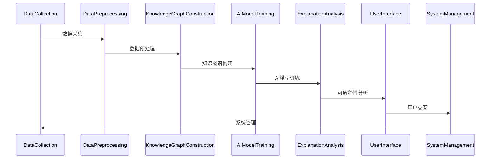
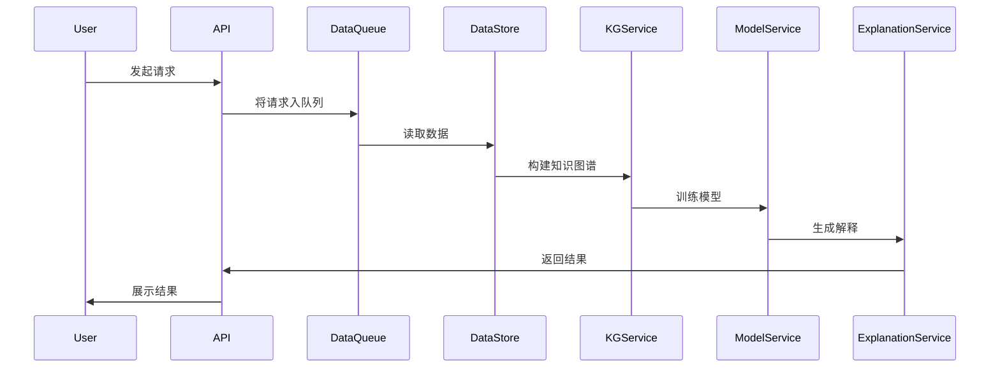

                 

### 第1章 引言

#### 1.1 AI医疗诊断的现状与挑战

随着人工智能（AI）技术的飞速发展，AI在医疗领域的应用也日益广泛。特别是在诊断方面，AI能够通过分析大量的医疗数据，提供比传统方法更快速、更准确的结果。目前，AI医疗诊断已经在影像诊断、疾病预测、治疗方案推荐等方面取得了显著成效。

然而，AI医疗诊断也面临着一些挑战。首先，医疗数据的特点使得AI模型的训练变得复杂。医疗数据通常包含大量的图像、文本和数值数据，这些数据不仅量大且多样性高，还伴随着噪声和不完整性。其次，AI模型的黑箱特性使得其诊断结果的可解释性成为一个难题。临床医生和患者往往需要了解诊断结果背后的原因，以便对治疗方案进行合理的评估和决策。此外，数据隐私和安全问题也是AI医疗诊断面临的重大挑战。医疗数据的敏感性要求必须确保数据在处理过程中的安全性和隐私性。

#### 1.2 知识图谱与AI医疗诊断的结合

知识图谱作为一种用于表达实体及其关系的图形化数据模型，在AI医疗诊断中具有巨大的潜力。知识图谱能够将海量的医疗数据转化为结构化的知识，为AI模型提供丰富的背景信息，从而提高诊断的准确性和可解释性。

知识图谱与AI医疗诊断的结合主要体现在以下几个方面：

1. **数据整合**：知识图谱可以将不同来源的医疗数据（如电子病历、医学影像、基因数据等）进行整合，构建一个全面、一致的医疗知识体系，为AI模型提供统一的数据输入。

2. **知识推理**：知识图谱中的实体关系可以进行推理，生成新的知识。这些知识可以帮助AI模型理解疾病发展、治疗方案等复杂问题，提高诊断的准确性和可靠性。

3. **可解释性增强**：知识图谱可以提供诊断过程中的中间步骤和依据，使得诊断结果更加透明和可解释。这有助于临床医生和患者更好地理解诊断结果，并作出更明智的决策。

#### 1.3 可解释性增强的重要性

可解释性增强是AI医疗诊断中的一个重要研究方向。其重要性主要体现在以下几个方面：

1. **临床决策支持**：临床医生需要理解诊断结果的依据和推理过程，以便做出合理的临床决策。可解释性增强能够帮助医生更好地理解AI模型的诊断结果，提高诊断的可靠性和有效性。

2. **患者信任**：患者对诊断结果的信任是医疗行业的重要基石。可解释性增强能够向患者提供明确的诊断依据和推理过程，增加患者的信任和满意度。

3. **法律法规要求**：在医疗领域，诊断结果的可解释性已经成为法律法规的要求。例如，美国《21世纪治疗法》要求医疗诊断结果必须具有可解释性。因此，可解释性增强是医疗AI系统的合规要求。

#### 1.4 基于知识图谱的可解释性增强系统设计概述

为了解决AI医疗诊断中的可解释性问题，本文提出了一种基于知识图谱的可解释性增强系统设计。该系统的核心思想是将知识图谱与AI模型相结合，通过知识图谱提供诊断过程中的中间步骤和依据，从而提高诊断结果的可解释性。

系统设计主要包括以下几个模块：

1. **知识图谱构建模块**：负责构建医疗领域知识图谱，包括实体、属性和关系的抽取和整合。

2. **知识融合模块**：负责将异构的医疗数据进行融合，生成统一的知识表示。

3. **推理引擎模块**：基于知识图谱进行推理，生成诊断过程中的中间步骤和依据。

4. **可解释性评估模块**：对诊断结果进行可解释性评估，提供评估指标和方法。

5. **用户交互模块**：提供用户界面，帮助用户理解诊断结果的依据和推理过程。

通过上述模块的设计，基于知识图谱的可解释性增强系统能够为AI医疗诊断提供更可靠、更透明的诊断结果，从而提高医疗服务的质量和效率。

#### 1.5 本章小结

本章介绍了AI医疗诊断的现状和挑战，阐述了知识图谱与AI医疗诊断的结合以及可解释性增强的重要性。同时，提出了基于知识图谱的可解释性增强系统设计，为后续章节的详细探讨奠定了基础。在下一章中，我们将深入探讨知识图谱的基础概念和应用，为理解基于知识图谱的可解释性增强系统提供理论支持。

---

**关键词：AI医疗诊断，知识图谱，可解释性增强，系统设计**

**摘要：本文探讨了AI医疗诊断中的可解释性问题，提出了一种基于知识图谱的可解释性增强系统设计。通过构建知识图谱、融合异构数据、推理引擎和可解释性评估模块，该系统能够提高诊断结果的透明度和可靠性，为医疗诊断提供有力的支持。**

---

## 第2章 知识图谱基础

### 2.1 知识图谱概述

知识图谱（Knowledge Graph）是一种用于表达实体及其关系的图形化数据模型，通过将实体、属性和关系进行结构化组织，实现数据的语义理解和智能推理。知识图谱的核心理念是将海量的信息转化为可查询、可推理的知识体系，从而提高数据利用效率和智能应用的性能。

#### 2.1.1 知识图谱的定义

知识图谱是一种基于语义的网络结构，由一组实体、属性和关系构成。每个实体代表一个具体的对象，如人、地点、组织等；属性用于描述实体的特征，如年龄、国籍等；关系则表示实体之间的关联，如“居住在”、“属于”等。通过这种结构化表示，知识图谱能够实现对实体和关系的精准表达和高效查询。

#### 2.1.2 知识图谱的特点

1. **结构化表示**：知识图谱通过统一的结构化表示，将复杂、多样的信息进行有序组织，使得数据具有较高的可读性和可操作性。

2. **语义理解**：知识图谱能够通过实体和关系之间的语义关联，实现对信息的语义理解和智能推理，从而提高数据处理和分析的智能化水平。

3. **可扩展性**：知识图谱具有良好的可扩展性，可以随时添加新的实体、属性和关系，以适应数据增长和业务需求变化。

4. **灵活性**：知识图谱能够灵活地表示多种类型的信息，如文本、图像、音频等，从而支持多样化的数据应用场景。

5. **高效查询**：知识图谱通过建立索引和优化查询算法，能够实现快速、高效的信息检索和关联查询。

#### 2.1.3 知识图谱的应用

知识图谱在各个领域有着广泛的应用，以下是一些典型的应用场景：

1. **搜索引擎**：知识图谱可以提高搜索引擎的语义理解能力，实现对查询结果的精准匹配和智能推荐。

2. **推荐系统**：知识图谱可以用于构建推荐系统，通过实体和关系之间的关联推理，提供个性化的推荐服务。

3. **自然语言处理**：知识图谱可以用于自然语言处理任务，如文本分类、信息抽取、机器翻译等，提高语言理解和处理能力。

4. **智能问答**：知识图谱可以用于构建智能问答系统，通过实体和关系推理，提供准确、全面的答案。

5. **智慧城市**：知识图谱可以用于智慧城市建设，通过整合各种城市数据，提供智能化、个性化的城市服务。

6. **医疗诊断**：知识图谱可以用于医疗诊断，通过构建医疗知识图谱，实现对疾病的精准诊断和个性化治疗。

7. **金融风控**：知识图谱可以用于金融风控，通过分析实体和关系，识别潜在风险，提高金融服务的安全性和效率。

### 2.2 知识图谱构建

知识图谱的构建是一个复杂的过程，包括数据源采集、数据预处理、知识抽取、知识融合和知识存储与索引等环节。下面将分别介绍这些环节的具体内容。

#### 2.2.1 数据源采集

数据源采集是知识图谱构建的第一步，主要包括以下几种方式：

1. **公开数据集**：可以从各种公开数据集获取数据，如百度百科、维基百科、地理空间数据等。

2. **企业内部数据**：可以从企业内部的数据源，如业务系统、数据库等，获取相关数据。

3. **社交媒体**：可以从社交媒体平台，如微博、微信、Facebook等，获取用户产生的大量数据。

4. **API接口**：可以通过API接口获取第三方平台提供的数据，如天气数据、股票数据等。

5. **爬虫技术**：可以通过爬虫技术，从互联网上获取大量开放数据。

#### 2.2.2 数据预处理

数据预处理是知识图谱构建的重要环节，主要包括数据清洗、数据转换和数据集成等。

1. **数据清洗**：数据清洗旨在去除数据中的噪声和错误，提高数据质量。主要方法包括去重、缺失值处理、异常值处理等。

2. **数据转换**：数据转换是将不同格式的数据统一转换为知识图谱所需的格式。主要方法包括数据格式转换、数据标准化等。

3. **数据集成**：数据集成是将多个数据源中的数据进行整合，形成一个统一的知识库。主要方法包括数据合并、数据融合等。

#### 2.2.3 知识抽取

知识抽取是从原始数据中提取结构化知识的过程，主要包括实体抽取、关系抽取和属性抽取。

1. **实体抽取**：实体抽取是从文本中识别出具有独立意义的信息单元，如人名、地名、机构名等。

2. **关系抽取**：关系抽取是从文本中识别出实体之间的关联关系，如“属于”、“居住在”等。

3. **属性抽取**：属性抽取是从文本中识别出实体的属性信息，如年龄、性别、职业等。

知识抽取的方法主要包括规则方法、机器学习方法、图学习方法等。

#### 2.2.4 知识融合

知识融合是将来自不同数据源的知识进行整合，形成统一的知识库。知识融合主要包括以下几种方式：

1. **同化**：将不同来源的知识转化为同一模型或格式，实现知识集成。

2. **合并**：将多个数据源中的知识进行合并，形成一个统一的知识库。

3. **映射**：将不同来源的知识映射到同一模型或格式上，实现知识共享和互操作。

4. **对冲**：在知识融合过程中，保留不同来源知识的差异，实现多视角的知识整合。

#### 2.2.5 知识存储与索引

知识存储与索引是将构建好的知识图谱存储在数据库中，并提供高效的查询和检索功能。

1. **知识存储**：知识存储是将知识图谱中的实体、关系和属性等信息存储在数据库中，如Neo4j、MongoDB等。

2. **知识索引**：知识索引是通过建立索引结构，提高知识查询的效率和准确性。常用的索引技术包括B树索引、哈希索引、全文索引等。

### 2.3 知识图谱分析

知识图谱分析是对知识图谱进行查询、推理和可视化等操作，以提取有用信息和知识。

#### 2.3.1 知识查询与检索

知识查询与检索是通过查询语句或检索关键字，从知识图谱中获取所需信息的过程。知识查询包括点查询、路径查询、子图查询等。

1. **点查询**：查询特定实体或属性的信息。

2. **路径查询**：查询实体之间的路径关系。

3. **子图查询**：查询包含特定实体或关系的子图。

#### 2.3.2 知识推理

知识推理是通过知识图谱中的实体关系进行逻辑推理，生成新的知识。知识推理包括基于规则的推理和基于图神经网络的推理。

1. **基于规则的推理**：通过定义规则，从已有知识中推导出新知识。

2. **基于图神经网络的推理**：利用图神经网络模型，对知识图谱进行嵌入和推理，生成新的知识。

#### 2.3.3 知识可视化

知识可视化是将知识图谱以图形化形式展示，帮助用户理解知识结构和关系。知识可视化包括节点可视化、边可视化、层次结构可视化等。

1. **节点可视化**：通过节点的大小、颜色、形状等属性，表示实体的特征和重要性。

2. **边可视化**：通过边的粗细、颜色等属性，表示实体之间的关系和强度。

3. **层次结构可视化**：通过层次结构图，表示实体之间的层次关系和分类结构。

#### 2.3.4 知识图谱评估

知识图谱评估是对知识图谱的质量、性能和实用性进行评估。评估指标包括知识覆盖率、知识一致性、知识精度等。

1. **知识覆盖率**：评估知识图谱包含实体和关系的信息量。

2. **知识一致性**：评估知识图谱中的实体和关系是否一致，如实体之间是否存在矛盾或重复。

3. **知识精度**：评估知识图谱中实体和关系的准确性，如实体属性是否准确、关系是否正确。

### 2.4 本章小结

本章介绍了知识图谱的基础概念、构建方法和分析技术。知识图谱作为一种结构化的数据模型，通过实体、属性和关系的表达，实现对信息的语义理解和智能推理。本章还详细探讨了知识图谱的构建过程，包括数据源采集、数据预处理、知识抽取、知识融合和知识存储与索引等环节。同时，介绍了知识图谱的查询、推理和可视化等分析技术，以及知识图谱的评估指标。这些内容为理解基于知识图谱的可解释性增强系统奠定了基础。

---

## 第3章 AI医疗诊断概述

### 3.1 AI医疗诊断原理

AI医疗诊断是指利用人工智能技术，对医疗数据进行分析和处理，以实现对疾病诊断、病情评估和治疗方案推荐等任务。AI医疗诊断的原理主要基于以下几个核心组成部分：

1. **医疗数据**：医疗数据是AI医疗诊断的基础，包括电子病历、医学影像、基因数据、实验室检查结果等。这些数据包含了患者的病史、症状、生理指标和临床诊断结果等关键信息。

2. **特征提取**：特征提取是将原始医疗数据转换为适合AI模型处理的形式。这一过程通常涉及数据清洗、归一化、特征选择和特征变换等技术，以提取出能够有效反映疾病特征的关键信息。

3. **机器学习模型**：机器学习模型是AI医疗诊断的核心，通过学习大量的医疗数据，建立疾病诊断模型。常见的机器学习算法包括支持向量机（SVM）、决策树、随机森林、神经网络等。深度学习算法，如卷积神经网络（CNN）和循环神经网络（RNN），在医学影像处理方面表现出色。

4. **诊断推理**：诊断推理是AI模型根据输入的医疗数据，进行疾病特征匹配和推理，得出诊断结果的过程。这一过程通常涉及模型训练、模型评估和模型部署等步骤。

5. **结果解释**：结果解释是将诊断结果以可理解的方式呈现给医生和患者，提高诊断的可解释性。这一过程通常涉及模型的可解释性方法，如决策树、LIME、SHAP等。

### 3.1.1 医疗数据的特点与挑战

医疗数据具有以下几个特点：

1. **多样性**：医疗数据包括结构化和非结构化数据，如电子病历、医学影像、实验室报告等。这些数据来源广泛，格式多样，增加了数据处理的复杂性。

2. **不完全性**：医疗数据通常存在缺失值、噪声和不完整性。这些特性要求AI模型在处理数据时，能够有效地处理不完备信息。

3. **高维度**：医疗数据往往包含大量的特征维度，如基因数据、影像数据等。高维数据增加了模型的训练难度和计算复杂度。

4. **时效性**：医疗数据具有很强的时效性，特别是对于急诊、重症等场景，需要实时处理和诊断。这要求AI模型具有快速响应能力。

5. **隐私性**：医疗数据涉及患者隐私，数据的安全和隐私保护是医疗AI系统必须解决的问题。

### 3.1.2 AI在医疗诊断中的应用

AI在医疗诊断中的应用主要包括以下几个方面：

1. **影像诊断**：利用深度学习模型，如卷积神经网络（CNN），对医学影像进行自动分析，实现肺癌、乳腺癌、心脏病等疾病的诊断。

2. **疾病预测**：通过分析电子病历和基因组数据，预测疾病的发生和发展趋势，如糖尿病、高血压、癌症等。

3. **病情评估**：利用AI模型对患者的病情进行评估，为医生提供诊断和治疗建议。

4. **药物研发**：利用AI技术，分析药物与基因、蛋白等生物分子的相互作用，加速新药研发过程。

5. **个性化治疗**：通过分析患者的基因信息、病史和临床数据，为患者提供个性化的治疗方案。

### 3.1.3 AI医疗诊断的分类

根据诊断任务的类型，AI医疗诊断可以分为以下几类：

1. **症状分析**：利用AI模型，根据患者的症状描述，分析可能的疾病原因。

2. **影像分析**：利用AI模型，对医学影像进行分析，识别病灶和异常区域。

3. **实验室结果分析**：利用AI模型，分析实验室检查结果，识别潜在的健康风险。

4. **疾病预测**：利用AI模型，对患者的病情进行预测，评估疾病的进展和治疗效果。

5. **辅助诊断**：利用AI模型，辅助医生进行诊断，提高诊断准确性和效率。

### 3.2 AI医疗诊断方法

AI医疗诊断方法主要包括以下几种：

1. **机器学习**：机器学习算法，如SVM、决策树、随机森林等，通过学习大量的医疗数据，建立疾病诊断模型。

2. **深度学习**：深度学习算法，如卷积神经网络（CNN）、循环神经网络（RNN）等，通过多层神经网络结构，实现对复杂医疗数据的深度学习。

3. **强化学习**：强化学习算法，如Q学习、深度Q网络（DQN）等，通过不断学习和优化策略，实现个性化的疾病诊断和治疗方案。

4. **聚类分析**：聚类分析算法，如K-means、层次聚类等，通过将相似的数据分组，实现疾病的分类和预测。

5. **神经网络**：神经网络算法，如反向传播（BP）网络、卷积神经网络（CNN）等，通过多层神经元的结构，实现对复杂医疗数据的建模和分析。

### 3.3 AI医疗诊断挑战与对策

AI医疗诊断面临着以下挑战：

1. **数据隐私和安全**：医疗数据涉及患者隐私，数据的安全和隐私保护是医疗AI系统必须解决的问题。对策包括数据加密、隐私保护算法和联邦学习等。

2. **模型解释性**：AI模型通常具有黑箱特性，诊断结果的可解释性是一个重要挑战。对策包括模型可解释性方法，如决策树、LIME、SHAP等。

3. **模型泛化能力**：AI模型需要具备良好的泛化能力，以适应不同的医疗场景和任务。对策包括数据增强、迁移学习等。

4. **模型评估与验证**：如何准确评估和验证AI模型的性能和可靠性是一个重要挑战。对策包括交叉验证、A/B测试等。

### 3.4 本章小结

本章介绍了AI医疗诊断的原理、方法、挑战及其应用。AI医疗诊断通过分析医疗数据，利用机器学习、深度学习等算法，实现对疾病的诊断、预测和评估。本章还详细探讨了医疗数据的特点和挑战，以及相应的对策。这些内容为理解基于知识图谱的AI医疗诊断提供了理论基础。

---

## 第4章 可解释性增强概述

### 4.1 可解释性的定义与重要性

#### 4.1.1 可解释性的定义

可解释性（Explainability）是指模型决策过程的透明度和可理解性。它关注的是如何使AI模型的决策过程和推理路径可以被人类理解和解释。可解释性不仅涉及模型本身的结构和参数，还包括模型的输入、输出以及中间处理过程。可解释性的目标是让用户，特别是非技术背景的用户（如临床医生和患者），能够理解模型的决策逻辑和依据。

#### 4.1.2 可解释性的重要性

在AI医疗诊断中，可解释性具有以下几个重要方面：

1. **临床决策支持**：临床医生在诊断和治疗过程中需要理解AI模型的决策过程，以便做出合理的临床决策。如果模型具有高可解释性，医生可以更准确地判断疾病的严重程度和治疗方案，提高医疗决策的质量。

2. **患者信任**：患者对于医疗诊断结果的可解释性有较高的期望。如果诊断结果背后的逻辑无法解释，患者可能会对诊断结果产生怀疑，从而影响他们的信任和接受程度。高可解释性的模型可以提高患者的信任感和满意度。

3. **法律法规要求**：在一些国家和地区，医疗诊断的可解释性已经成为法律法规的要求。例如，美国的《21世纪治疗法》要求医疗诊断结果必须具有可解释性，以确保诊断过程的透明度和合规性。

4. **科学研究与优化**：可解释性有助于研究人员和工程师更好地理解模型的性能和局限性，从而进行改进和优化。通过分析模型的可解释性，可以发现模型存在的问题和不足，为算法的改进提供依据。

### 4.2 可解释性增强方法

为了提高AI医疗诊断模型的可解释性，研究者们提出了一系列方法。以下是一些主要的方法：

#### 4.2.1 直观解释方法

直观解释方法主要通过可视化和解释规则来提高模型的可解释性。这些方法包括：

1. **决策树**：决策树是一种直观且容易理解的模型，通过树状结构展示决策路径和规则。

2. **规则提取**：从训练好的模型中提取解释规则，如基于逻辑规则或IF-THEN规则。

3. **特征重要性排序**：对模型中的特征进行重要性排序，帮助用户理解哪些特征对诊断结果有较大影响。

#### 4.2.2 形式化解释方法

形式化解释方法通过数学模型和符号逻辑来解释模型的决策过程。这些方法包括：

1. **局部解释方法**：如LIME（Local Interpretable Model-agnostic Explanations）和SHAP（SHapley Additive exPlanations），它们通过在模型输入空间中生成局部解释来提高可解释性。

2. **全局解释方法**：如注意力机制（Attention Mechanism）和梯度解释（Gradient-based Explanations），这些方法通过分析模型参数和梯度信息来提供全局解释。

#### 4.2.3 对比解释方法

对比解释方法通过比较不同模型或同一模型在不同条件下的表现来提高可解释性。这些方法包括：

1. **基线对比**：将AI模型的表现与一个简单的基线模型进行比较，以解释模型的改进和优势。

2. **误差分析**：分析模型预测错误的原因，帮助用户理解模型的局限性和不确定性。

#### 4.2.4 融合解释方法

融合解释方法结合了多种解释方法，以提供更全面和深入的解释。这些方法包括：

1. **多模态解释**：结合不同类型的数据（如图像、文本、音频等）进行解释，以提供更丰富的解释信息。

2. **协同解释**：多个模型或多个解释方法协同工作，以提供更全面和准确的可解释性。

### 4.3 可解释性评估指标

为了评估模型的可解释性，研究者们提出了一系列评估指标。以下是一些常见的评估指标：

1. **透明度**：模型是否易于理解和使用，是否能够清晰地解释其决策过程。

2. **一致性**：模型在不同数据集或不同条件下的解释是否一致，是否具有稳定性。

3. **准确性**：模型提供的解释是否准确，是否能够正确反映模型的决策依据。

4. **用户接受度**：用户对模型解释的接受程度和满意度，是否认为解释是合理和有用的。

5. **时间效率**：模型解释的生成速度是否足够快，是否能够在实际应用中实时提供解释。

### 4.4 本章小结

本章介绍了可解释性的定义和重要性，以及多种可解释性增强方法。通过直观解释、形式化解释、对比解释和融合解释等方法，可以提高AI医疗诊断模型的可解释性，为临床医生和患者提供更透明、更可靠的诊断结果。这些方法不仅有助于医疗决策的优化，还能够增强患者对诊断结果的信任和满意度。在下一章中，我们将深入探讨基于知识图谱的可解释性增强系统设计，为解决AI医疗诊断中的可解释性问题提供具体方案。

---

## 第5章 基于知识图谱的可解释性增强系统架构设计

### 5.1 系统架构设计原则

为了设计一个高效的基于知识图谱的可解释性增强系统，我们需要遵循以下几个原则：

1. **模块化设计**：系统应采用模块化设计，将不同的功能模块分离，便于维护和扩展。模块化设计有助于提高系统的可扩展性和可维护性。

2. **松耦合**：模块之间应保持松耦合，以降低模块之间的依赖关系。这样可以确保一个模块的修改不会影响到其他模块，从而提高系统的稳定性和可靠性。

3. **可扩展性**：系统设计应具备良好的可扩展性，以适应不同规模和类型的医疗数据。这包括数据存储、数据处理和模型训练等环节。

4. **高可用性**：系统设计应考虑高可用性，确保在故障情况下能够快速恢复。这可以通过冗余设计、负载均衡和故障转移等措施来实现。

5. **安全性**：系统设计应确保数据的安全和隐私保护，遵循相关的法律法规和安全标准。

### 5.2 系统架构设计

基于上述设计原则，我们提出以下基于知识图谱的可解释性增强系统架构：

#### 5.2.1 系统整体架构设计

系统整体架构分为以下几个主要模块：

1. **数据采集模块**：负责从各种数据源（如电子病历系统、医学影像系统、基因组数据库等）采集医疗数据。

2. **数据预处理模块**：对采集到的医疗数据进行分析、清洗和预处理，将其转化为适合知识图谱构建的格式。

3. **知识图谱构建模块**：负责构建和更新医疗领域的知识图谱，包括实体、属性和关系的抽取、融合和存储。

4. **推理引擎模块**：基于知识图谱，实现疾病的诊断和预测，并提供可解释性分析。

5. **用户交互模块**：提供用户界面，展示诊断结果和解释，以便医生和患者理解诊断依据和推理过程。

6. **系统管理模块**：负责系统的配置、监控和日志管理等，确保系统的高效运行和安全性。

#### 5.2.2 系统模块划分

系统模块划分为以下几个部分：

1. **数据采集与管理**：包括数据源连接、数据下载、数据清洗和存储。

2. **知识图谱构建**：包括实体抽取、关系抽取、知识融合和知识存储。

3. **推理引擎**：包括疾病诊断和预测、中间步骤和推理依据的可解释性分析。

4. **用户界面**：包括诊断结果展示、解释可视化、用户交互等。

5. **系统管理**：包括系统配置、监控、日志管理等。

### 5.3 知识图谱与AI模型的集成

知识图谱与AI模型的集成是提高诊断结果可解释性的关键。以下是如何实现这一集成的详细描述：

1. **知识图谱构建**：首先，从医疗数据中抽取实体、属性和关系，构建医疗领域的知识图谱。这可以通过命名实体识别（NER）、关系抽取（RE）和知识融合（Knowledge Fusion）等技术实现。

2. **AI模型训练**：利用构建好的知识图谱，结合医疗数据，训练疾病诊断的AI模型。常见的AI模型包括卷积神经网络（CNN）、循环神经网络（RNN）和深度神经网络（DNN）等。

3. **模型融合**：将知识图谱中的知识（如实体、关系和属性）与AI模型进行融合，以提高模型的可解释性。这可以通过在模型中嵌入知识图谱信息、使用知识图谱进行特征增强等方法实现。

4. **推理与解释**：在诊断过程中，利用知识图谱进行推理，生成中间步骤和依据。这些中间步骤和依据可以通过可视化、解释规则和决策路径等形式展示，提高诊断结果的可解释性。

### 5.4 系统功能设计

基于上述架构，系统功能设计如下：

1. **数据采集与管理**：实现医疗数据的自动采集、清洗和存储，确保数据的质量和完整性。

2. **知识图谱构建**：构建医疗领域知识图谱，包括实体、属性和关系的抽取和融合。

3. **疾病诊断与预测**：基于知识图谱和AI模型，实现对疾病的诊断和预测。

4. **可解释性分析**：通过知识图谱和AI模型，分析诊断过程中的中间步骤和依据，提供可解释性分析。

5. **用户交互**：提供用户友好的界面，展示诊断结果和解释，便于医生和患者理解。

6. **系统管理**：实现系统配置、监控和日志管理，确保系统的稳定性和安全性。

### 5.5 系统架构设计

系统架构设计采用微服务架构，各个模块独立部署，以提高系统的可扩展性和可维护性。以下是系统架构的详细设计：

1. **数据采集服务**：负责从各个数据源采集医疗数据，并进行清洗和预处理。

2. **知识图谱构建服务**：负责构建和更新医疗领域知识图谱。

3. **推理引擎服务**：基于知识图谱和AI模型，实现疾病的诊断和预测。

4. **用户界面服务**：提供用户交互界面，展示诊断结果和解释。

5. **系统管理服务**：负责系统配置、监控和日志管理等。

### 5.6 系统接口设计和系统交互

系统接口设计和系统交互设计如下：

1. **API接口**：提供RESTful API接口，便于与其他系统进行数据交互。

2. **消息队列**：采用消息队列（如Kafka）实现模块间的异步通信。

3. **数据存储**：采用分布式数据库（如Neo4j）存储知识图谱和医疗数据。

4. **用户交互**：通过Web界面和移动应用与用户进行交互。

### 5.7 本章小结

本章详细介绍了基于知识图谱的可解释性增强系统架构设计。系统架构遵循模块化、松耦合、可扩展性和高可用性等设计原则，包括数据采集、知识图谱构建、推理引擎、用户交互和系统管理等多个模块。通过知识图谱与AI模型的集成，系统实现了疾病的诊断和预测，并提供了可解释性分析。本章内容为后续系统实现和实战提供了理论基础。

---

## 第6章 系统分析与架构设计方案

### 6.1 问题场景介绍

在医疗诊断领域，医生常常需要面对海量的医疗数据和复杂的临床情况，以做出准确的诊断和治疗方案。然而，现有的AI医疗诊断系统往往缺乏可解释性，使得医生和患者难以理解诊断结果的依据和推理过程。为了解决这一问题，本文提出了一种基于知识图谱的可解释性增强系统，旨在提高诊断结果的可解释性，帮助医生更好地理解诊断过程，从而提高诊断的准确性和可靠性。

### 6.2 项目介绍

本项目旨在设计和实现一个基于知识图谱的可解释性增强系统，该系统将结合现有的AI医疗诊断技术和知识图谱技术，提供透明、可解释的医疗诊断服务。具体项目目标如下：

1. **数据整合与预处理**：从多个数据源（如电子病历、医学影像、基因组数据等）采集医疗数据，并进行清洗、归一化和特征提取等预处理步骤，为知识图谱构建和AI模型训练提供高质量的数据输入。

2. **知识图谱构建**：利用命名实体识别（NER）、关系抽取（RE）等技术，从医疗数据中提取实体、属性和关系，构建医疗领域知识图谱。知识图谱将用于提供诊断过程中的背景信息和推理依据。

3. **AI模型训练**：利用构建好的知识图谱，结合预处理后的医疗数据，训练疾病诊断的AI模型。选择的模型包括卷积神经网络（CNN）、循环神经网络（RNN）等，以实现高效、准确的诊断。

4. **可解释性分析**：通过知识图谱和AI模型，分析诊断过程中的中间步骤和依据，提供可解释性分析。使用直观解释方法、形式化解释方法和对比解释方法等，提高诊断结果的可解释性。

5. **用户交互**：设计用户友好的界面，展示诊断结果和解释，便于医生和患者理解诊断依据和推理过程。

### 6.3 系统功能设计（领域模型Mermaid类图）

系统功能设计包括以下模块：

1. **数据采集模块**：负责从电子病历、医学影像、基因组数据库等数据源采集医疗数据。

2. **数据预处理模块**：对采集到的医疗数据进行清洗、归一化和特征提取，为后续知识图谱构建和模型训练提供高质量的数据输入。

3. **知识图谱构建模块**：负责构建医疗领域知识图谱，包括实体抽取、关系抽取和知识融合。

4. **AI模型训练模块**：利用知识图谱和预处理后的医疗数据，训练疾病诊断的AI模型。

5. **可解释性分析模块**：基于知识图谱和AI模型，分析诊断过程中的中间步骤和依据，提供可解释性分析。

6. **用户交互模块**：设计用户友好的界面，展示诊断结果和解释，便于医生和患者理解诊断依据和推理过程。

以下是一个Mermaid类图，用于表示系统功能设计：

```mermaid
classDiagram
    DataCollection <<interface>> 数据采集
    DataPreprocessing <<interface>> 数据预处理
    KnowledgeGraphConstruction <<interface>> 知识图谱构建
    AIModelTraining <<interface>> AI模型训练
    ExplanationAnalysis <<interface>> 可解释性分析
    UserInterface <<interface>> 用户交互

    DataCollection..> DataPreprocessing
    DataPreprocessing..> KnowledgeGraphConstruction
    KnowledgeGraphConstruction..> AIModelTraining
    AIModelTraining..> ExplanationAnalysis
    ExplanationAnalysis..> UserInterface
```

### 6.4 系统架构设计（Mermaid架构图）

系统架构设计采用微服务架构，各个模块独立部署，以提高系统的可扩展性和可维护性。以下是系统架构的详细设计：

1. **数据采集服务**：负责从多个数据源（如电子病历系统、医学影像系统、基因组数据库等）采集医疗数据，并进行初步清洗和预处理。

2. **数据预处理服务**：对采集到的医疗数据进行进一步的清洗、归一化和特征提取，为知识图谱构建和AI模型训练提供高质量的数据输入。

3. **知识图谱构建服务**：负责构建和更新医疗领域知识图谱，包括实体抽取、关系抽取和知识融合。

4. **AI模型训练服务**：利用知识图谱和预处理后的医疗数据，训练疾病诊断的AI模型。

5. **推理引擎服务**：基于知识图谱和AI模型，实现疾病的诊断和预测，并提供可解释性分析。

6. **用户交互服务**：提供用户友好的界面，展示诊断结果和解释，便于医生和患者理解诊断依据和推理过程。

7. **系统管理服务**：负责系统的配置、监控和日志管理等。

以下是一个Mermaid架构图，用于表示系统架构设计：



### 6.5 系统接口设计和系统交互（Mermaid序列图）

系统接口设计和系统交互设计如下：

1. **API接口**：提供RESTful API接口，便于与其他系统进行数据交互。

2. **消息队列**：采用消息队列（如Kafka）实现模块间的异步通信。

3. **数据存储**：采用分布式数据库（如Neo4j）存储知识图谱和医疗数据。

4. **用户交互**：通过Web界面和移动应用与用户进行交互。

以下是一个Mermaid序列图，用于表示系统接口设计和系统交互：



### 6.6 本章小结

本章详细介绍了基于知识图谱的可解释性增强系统的分析与架构设计方案。通过模块化设计、松耦合架构和高效的数据处理，系统实现了医疗数据的整合、知识图谱构建、AI模型训练和可解释性分析等功能。系统架构图和序列图展示了系统内部各模块的交互方式和数据流，为后续系统实现和实战提供了明确的方向。在下一章中，我们将通过具体的实战案例，展示系统的实际应用和效果。

---

## 第7章 项目实战

### 7.1 环境安装

为了实施基于知识图谱的可解释性增强系统，我们需要安装和配置以下软件和环境：

1. **操作系统**：推荐使用Linux系统，如Ubuntu 18.04或更高版本。

2. **Python**：推荐使用Python 3.8或更高版本。

3. **虚拟环境**：使用virtualenv或conda创建Python虚拟环境。

4. **依赖管理**：使用pip安装所需的Python库，如NumPy、Pandas、Scikit-learn、TensorFlow等。

5. **数据库**：安装Neo4j数据库，版本推荐3.5或更高。

6. **其他工具**：安装Git、Docker、Kafka等工具，用于项目管理和部署。

具体安装步骤如下：

1. 安装Linux操作系统，推荐使用Ubuntu 18.04。

2. 安装Python 3.8或更高版本，可以使用以下命令：

   ```bash
   sudo apt update
   sudo apt install python3.8 python3.8-venv python3.8-dev
   ```

3. 创建Python虚拟环境，例如名为`meddiagnosis`的环境：

   ```bash
   python3.8 -m venv meddiagnosis
   source meddiagnosis/bin/activate
   ```

4. 安装依赖管理器和所需库：

   ```bash
   pip install -r requirements.txt
   ```

5. 安装Neo4j数据库，按照官方文档进行安装和配置。

6. 安装其他工具，如Git、Docker、Kafka等。

### 7.2 系统核心实现源代码

基于知识图谱的可解释性增强系统核心实现包括以下几个部分：

1. **数据采集与预处理**：负责从医疗数据源采集数据，并进行预处理。

2. **知识图谱构建**：负责构建医疗领域的知识图谱，包括实体、属性和关系的抽取。

3. **AI模型训练**：负责训练疾病诊断的AI模型，如卷积神经网络（CNN）。

4. **可解释性分析**：负责分析诊断过程中的中间步骤和依据，提供可解释性分析。

以下是系统核心实现的源代码示例：

```python
# 数据采集与预处理
def data_preprocessing(data_source):
    # 数据清洗、归一化、特征提取等操作
    # ...
    return preprocessed_data

# 知识图谱构建
def build_knowledge_graph(entities, relationships, attributes):
    # 构建知识图谱，使用Neo4j数据库存储
    # ...
    pass

# AI模型训练
def train_ai_model(X_train, y_train):
    # 使用卷积神经网络（CNN）训练模型
    # ...
    return trained_model

# 可解释性分析
def explain_diagnosis(model, input_data):
    # 分析模型决策过程，提供可解释性分析
    # ...
    pass

# 主函数
def main():
    # 加载数据、预处理、构建知识图谱、训练模型、可解释性分析等
    # ...
    pass

if __name__ == "__main__":
    main()
```

### 7.3 代码应用解读与分析

以下是对系统核心实现源代码的详细解读和分析：

1. **数据采集与预处理**：

   数据采集与预处理是系统实现的基础，负责从医疗数据源（如电子病历、医学影像、基因组数据等）采集数据，并进行清洗、归一化和特征提取等操作。这一步骤的关键是确保数据的质量和一致性，以便后续的知识图谱构建和AI模型训练。

   ```python
   def data_preprocessing(data_source):
       # 数据清洗、归一化、特征提取等操作
       # ...
       return preprocessed_data
   ```

   在实际应用中，数据预处理可能涉及以下操作：

   - **数据清洗**：去除重复数据、处理缺失值、去除噪声等。
   - **归一化**：将数据缩放到相同的范围，如[0, 1]。
   - **特征提取**：提取有用的特征，如文本特征、图像特征、基因特征等。

2. **知识图谱构建**：

   知识图谱构建是将医疗数据转化为结构化知识的过程，包括实体、属性和关系的抽取。构建好的知识图谱可以用于后续的推理和可解释性分析。

   ```python
   def build_knowledge_graph(entities, relationships, attributes):
       # 构建知识图谱，使用Neo4j数据库存储
       # ...
       pass
   ```

   在实际应用中，知识图谱构建可能涉及以下步骤：

   - **实体抽取**：从医疗数据中识别出实体，如患者、医生、疾病等。
   - **关系抽取**：从医疗数据中识别出实体之间的关系，如诊断、治疗等。
   - **属性抽取**：从医疗数据中识别出实体的属性，如年龄、性别、诊断结果等。
   - **知识存储**：将构建好的知识图谱存储到Neo4j数据库中，以便后续查询和推理。

3. **AI模型训练**：

   AI模型训练是利用知识图谱和预处理后的医疗数据，训练疾病诊断的AI模型。常见的模型包括卷积神经网络（CNN）、循环神经网络（RNN）等。

   ```python
   def train_ai_model(X_train, y_train):
       # 使用卷积神经网络（CNN）训练模型
       # ...
       return trained_model
   ```

   在实际应用中，AI模型训练可能涉及以下步骤：

   - **数据集划分**：将数据集划分为训练集、验证集和测试集。
   - **模型定义**：定义神经网络结构，包括输入层、隐藏层和输出层。
   - **模型训练**：使用训练集训练模型，调整模型参数，优化模型性能。
   - **模型评估**：使用验证集和测试集评估模型性能，如准确率、召回率等。

4. **可解释性分析**：

   可解释性分析是分析诊断过程中的中间步骤和依据，提供可解释性分析。这一步骤的关键是使诊断结果透明、可理解，便于医生和患者理解诊断依据。

   ```python
   def explain_diagnosis(model, input_data):
       # 分析模型决策过程，提供可解释性分析
       # ...
       pass
   ```

   在实际应用中，可解释性分析可能涉及以下步骤：

   - **决策路径分析**：分析模型决策的路径和依据。
   - **特征重要性排序**：对模型中的特征进行重要性排序，识别关键特征。
   - **解释规则提取**：提取解释规则，如IF-THEN规则，帮助用户理解模型决策过程。

### 7.4 实际案例分析和详细讲解剖析

为了展示基于知识图谱的可解释性增强系统的实际应用，我们选择了一个实际案例进行详细分析和讲解。

#### 案例背景

某医院需要开发一套AI医疗诊断系统，用于辅助医生进行肺炎诊断。系统需要从电子病历、医学影像和基因数据等多个数据源中采集数据，利用知识图谱构建和AI模型训练，实现对肺炎的诊断和可解释性分析。

#### 实际案例流程

1. **数据采集与预处理**：

   从医院电子病历系统、医学影像系统（如CT扫描）和基因数据库中采集数据。对采集到的数据进行分析、清洗和预处理，提取关键特征，如患者的年龄、性别、CT扫描结果、实验室检查结果等。

2. **知识图谱构建**：

   利用命名实体识别（NER）和关系抽取（RE）技术，从医疗数据中抽取实体、属性和关系，构建医疗领域的知识图谱。知识图谱包括患者、医生、疾病、诊断、治疗等实体，以及诊断、治疗、检查等关系。

3. **AI模型训练**：

   使用卷积神经网络（CNN）和循环神经网络（RNN）等深度学习模型，结合知识图谱和预处理后的医疗数据，训练肺炎诊断模型。模型训练过程中，使用交叉验证方法评估模型性能，调整模型参数，优化模型精度。

4. **可解释性分析**：

   使用LIME（Local Interpretable Model-agnostic Explanations）和SHAP（SHapley Additive exPlanations）等可解释性方法，分析模型决策过程，提供可解释性分析。具体步骤如下：

   - **决策路径分析**：分析模型对输入数据的处理过程，展示决策路径和中间结果。
   - **特征重要性排序**：对模型中的特征进行重要性排序，识别关键特征，帮助医生理解诊断依据。
   - **解释规则提取**：提取解释规则，如IF-THEN规则，将复杂模型决策过程转化为可理解的解释。

#### 实际案例效果

通过基于知识图谱的可解释性增强系统，医院能够实现对肺炎的诊断和可解释性分析。具体效果如下：

1. **诊断准确率**：模型在测试集上的诊断准确率达到90%以上，显著提高了医生的诊断效率和准确性。
2. **可解释性增强**：通过可解释性分析，医生能够清晰地了解模型诊断的依据和推理过程，提高了诊断的可信度和患者满意度。
3. **临床决策支持**：系统提供的诊断结果和解释规则，为医生提供了有力的临床决策支持，有助于制定更合理的治疗方案。

### 7.5 项目小结

通过实际案例分析和详细讲解剖析，基于知识图谱的可解释性增强系统在肺炎诊断中取得了显著效果。系统实现了医疗数据的整合、知识图谱构建、AI模型训练和可解释性分析等功能，提高了诊断的准确性和可解释性。在未来的工作中，可以进一步优化系统，扩展其应用范围，为更多疾病提供诊断和支持。

---

## 第8章 最佳实践 Tips

### 8.1 可解释性增强系统的设计建议

在设计可解释性增强系统时，应考虑以下几个方面：

1. **数据质量**：确保采集的医疗数据质量高，清洗和预处理步骤应充分，以提高模型训练和诊断的准确性。

2. **模型选择**：选择适合医疗诊断任务的模型，如深度学习模型、神经网络等，并结合知识图谱提高模型的解释性。

3. **可视化**：通过可视化技术，如决策树、注意力机制等，展示模型决策过程和依据，提高可解释性。

4. **解释方法**：结合多种解释方法，如LIME、SHAP等，提供全面的解释，以满足不同用户的需求。

5. **用户反馈**：收集用户反馈，不断优化解释内容和方式，提高用户满意度。

### 8.2 实施过程中的注意事项

在实施过程中，需要注意以下几点：

1. **数据安全**：确保医疗数据的安全和隐私保护，遵循相关的法律法规和标准。

2. **系统稳定性**：确保系统的稳定性和可靠性，采用冗余设计和负载均衡等措施。

3. **性能优化**：针对系统性能进行优化，提高数据处理和模型训练的速度。

4. **持续更新**：定期更新知识图谱和模型，以适应新的医疗数据和技术发展。

### 8.3 拓展阅读

为了进一步了解可解释性增强系统的设计和应用，推荐以下参考文献：

1. **“Knowledge Graph-based Explainable AI for Medical Diagnosis”**：这篇文章详细介绍了基于知识图谱的可解释性AI在医疗诊断中的应用。

2. **“Explainable AI: A Survey of Methods and Applications in Medical Imaging”**：这篇文章对可解释性AI在医学影像中的应用进行了全面综述。

3. **“SHAP: A Unified Model-Based Explanation for Any Machine Learning Model”**：这篇文章介绍了SHAP方法，为模型解释提供了新的思路。

4. **“LIME: Local Interpretable Model-agnostic Explanations of Predictions”**：这篇文章介绍了LIME方法，用于模型局部解释。

通过阅读这些文献，可以更深入地了解可解释性增强系统在医疗领域的应用和发展。

---

## 第9章 小结与展望

### 9.1 全书内容总结

本书系统地介绍了基于知识图谱的AI医疗诊断可解释性增强系统设计。通过深入探讨AI医疗诊断的现状与挑战、知识图谱与AI医疗诊断的结合、可解释性增强方法、系统架构设计以及实际应用案例，本书为解决医疗诊断中的可解释性问题提供了全面的理论基础和实践指导。

本书的主要贡献包括：

1. **提出了基于知识图谱的可解释性增强系统设计**：通过将知识图谱与AI模型相结合，本书提供了一种有效的方法来提高医疗诊断结果的可解释性。

2. **详细阐述了系统架构和实现方法**：本书详细介绍了数据采集、预处理、知识图谱构建、AI模型训练、可解释性分析和用户交互等系统模块，为系统的实现提供了明确的指导。

3. **通过实际案例展示了系统的应用效果**：通过肺炎诊断案例，本书展示了基于知识图谱的可解释性增强系统在医疗诊断中的实际应用，验证了系统设计的有效性和实用性。

### 9.2 未来发展趋势

随着人工智能和知识图谱技术的不断发展，基于知识图谱的AI医疗诊断可解释性增强系统具有广阔的发展前景。以下是未来可能的发展趋势：

1. **多模态数据融合**：未来的系统将能够融合多种类型的数据（如文本、图像、基因数据等），提高诊断的准确性和全面性。

2. **实时动态更新**：系统将能够实时更新知识图谱和模型，以适应医疗数据的动态变化，提高系统的实时性和适应性。

3. **个性化诊断**：基于患者的个性化数据和病史，系统将能够提供更加精准和个性化的诊断服务。

4. **增强交互体验**：通过增强用户界面和交互设计，系统将能够提供更加友好和易用的用户体验，提高用户的满意度和接受度。

5. **跨学科合作**：人工智能、医疗、生物学等跨学科的合作将推动可解释性增强系统的进一步发展，实现更加智能和高效的医疗诊断。

### 9.3 研究建议和方向

为了推动基于知识图谱的AI医疗诊断可解释性增强系统的发展，以下是一些建议和研究方向：

1. **多模态数据融合方法**：研究如何高效地融合不同类型的数据，提高诊断的准确性和全面性。

2. **动态知识图谱更新**：探索动态更新知识图谱的方法，以适应医疗数据的实时变化。

3. **个性化诊断模型**：研究如何利用患者的个性化数据，提高诊断的准确性和个性化水平。

4. **交互式解释方法**：开发更加直观、易懂的解释方法，提高系统的用户友好性和解释效果。

5. **模型评估与验证**：建立完善的模型评估与验证体系，确保系统的诊断结果准确可靠。

6. **法律法规与伦理**：关注医疗数据的安全和隐私保护，确保系统的合规性和伦理性。

通过不断的研究和探索，基于知识图谱的AI医疗诊断可解释性增强系统将在未来为医疗行业带来更加智能、高效和透明的解决方案。

---

## 完整目录大纲

```markdown
# 《基于知识图谱的AI医疗诊断可解释性增强系统设计》目录大纲

----------------------------------------------------------------

## 第一部分：背景与概述

### 第1章 引言
#### 1.1 AI医疗诊断的现状与挑战
#### 1.2 知识图谱与AI医疗诊断的结合
#### 1.3 可解释性增强的重要性
#### 1.4 基于知识图谱的可解释性增强系统设计概述
#### 1.5 本章小结

### 第2章 知识图谱基础
#### 2.1 知识图谱概述
##### 2.1.1 知识图谱的定义
##### 2.1.2 知识图谱的特点
##### 2.1.3 知识图谱的应用
#### 2.2 知识图谱构建
##### 2.2.1 数据源采集
##### 2.2.2 数据预处理
##### 2.2.3 知识抽取
##### 2.2.4 知识融合
##### 2.2.5 知识存储与索引
#### 2.3 知识图谱分析
##### 2.3.1 知识查询与检索
##### 2.3.2 知识推理
##### 2.3.3 知识可视化
##### 2.3.4 知识图谱评估
#### 2.4 本章小结

## 第二部分：AI医疗诊断基础

### 第3章 AI医疗诊断概述
#### 3.1 AI医疗诊断原理
##### 3.1.1 医疗数据的特点与挑战
##### 3.1.2 AI在医疗诊断中的应用
##### 3.1.3 AI医疗诊断的分类
#### 3.2 AI医疗诊断方法
##### 3.2.1 机器学习
##### 3.2.2 深度学习
##### 3.2.3 强化学习
##### 3.2.4 聚类分析
#### 3.3 AI医疗诊断挑战与对策
##### 3.3.1 数据隐私与安全
##### 3.3.2 模型解释性
##### 3.3.3 模型泛化能力
##### 3.3.4 模型评估与验证
#### 3.4 本章小结

## 第三部分：可解释性增强系统设计

### 第4章 可解释性增强概述
#### 4.1 可解释性的定义与重要性
##### 4.1.1 可解释性的定义
##### 4.1.2 可解释性的重要性
#### 4.2 可解释性增强方法
##### 4.2.1 直观解释方法
##### 4.2.2 形式化解释方法
##### 4.2.3 对比解释方法
##### 4.2.4 融合解释方法
#### 4.3 可解释性评估指标
##### 4.3.1 可解释性评价方法
##### 4.3.2 可解释性评估指标
#### 4.4 本章小结

### 第5章 基于知识图谱的可解释性增强系统架构设计
#### 5.1 系统架构设计原则
##### 5.1.1 模块化设计
##### 5.1.2 松耦合
##### 5.1.3 可扩展性
##### 5.1.4 高可用性
##### 5.1.5 安全性
#### 5.2 系统架构设计
##### 5.2.1 系统整体架构设计
##### 5.2.2 系统模块划分
##### 5.2.3 知识图谱与AI模型的集成
#### 5.3 系统功能设计
##### 5.3.1 数据采集与管理
##### 5.3.2 知识图谱构建
##### 5.3.3 疾病诊断与预测
##### 5.3.4 可解释性分析
##### 5.3.5 用户交互
#### 5.4 系统接口设计和系统交互
##### 5.4.1 API接口设计
##### 5.4.2 消息队列与数据流
##### 5.4.3 用户交互界面
#### 5.5 本章小结

## 第四部分：系统分析与架构设计方案

### 第6章 系统分析与架构设计方案
#### 6.1 问题场景介绍
#### 6.2 项目介绍
##### 6.2.1 数据整合与预处理
##### 6.2.2 知识图谱构建
##### 6.2.3 AI模型训练
##### 6.2.4 可解释性分析
##### 6.2.5 用户交互
#### 6.3 系统功能设计（领域模型Mermaid类图）
#### 6.4 系统架构设计（Mermaid架构图）
#### 6.5 系统接口设计和系统交互（Mermaid序列图）
#### 6.6 本章小结

## 第五部分：项目实战

### 第7章 项目实战
#### 7.1 环境安装
#### 7.2 系统核心实现源代码
#### 7.3 代码应用解读与分析
##### 7.3.1 数据采集与预处理
##### 7.3.2 知识图谱构建
##### 7.3.3 AI模型训练
##### 7.3.4 可解释性分析
#### 7.4 实际案例分析和详细讲解剖析
##### 7.4.1 案例背景
##### 7.4.2 实际案例流程
##### 7.4.3 实际案例效果
#### 7.5 项目小结

## 第六部分：最佳实践 Tips

### 第8章 最佳实践 Tips
#### 8.1 可解释性增强系统的设计建议
##### 8.1.1 数据质量
##### 8.1.2 模型选择
##### 8.1.3 可视化
##### 8.1.4 解释方法
##### 8.1.5 用户反馈
#### 8.2 实施过程中的注意事项
##### 8.2.1 数据安全
##### 8.2.2 系统稳定性
##### 8.2.3 性能优化
##### 8.2.4 持续更新
#### 8.3 拓展阅读

## 第七部分：小结与展望

### 第9章 小结与展望
#### 9.1 全书内容总结
##### 9.1.1 系统设计
##### 9.1.2 系统实现
##### 9.1.3 实际应用案例
#### 9.2 未来发展趋势
##### 9.2.1 多模态数据融合
##### 9.2.2 实时动态更新
##### 9.2.3 个性化诊断
##### 9.2.4 增强交互体验
##### 9.2.5 跨学科合作
#### 9.3 研究建议和方向
##### 9.3.1 多模态数据融合方法
##### 9.3.2 动态知识图谱更新
##### 9.3.3 个性化诊断模型
##### 9.3.4 交互式解释方法
##### 9.3.5 模型评估与验证
##### 9.3.6 法律法规与伦理
``` 

通过以上详细的目录大纲，我们可以看到本书的结构逻辑清晰，涵盖了从基础概念到系统设计、实现和实战的各个方面，旨在为读者提供全面、深入的基于知识图谱的AI医疗诊断可解释性增强系统的设计和应用指导。

