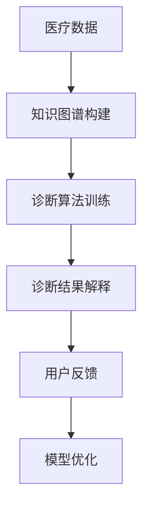
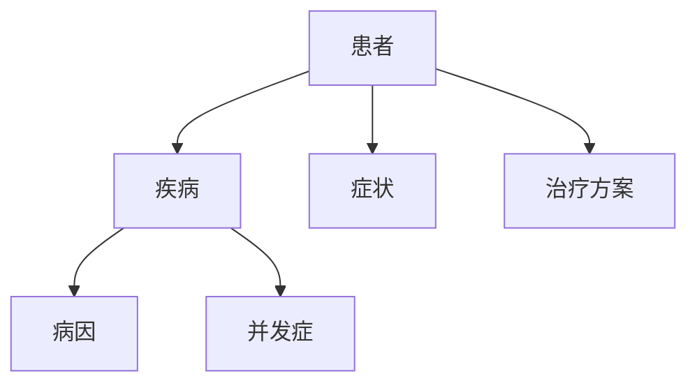
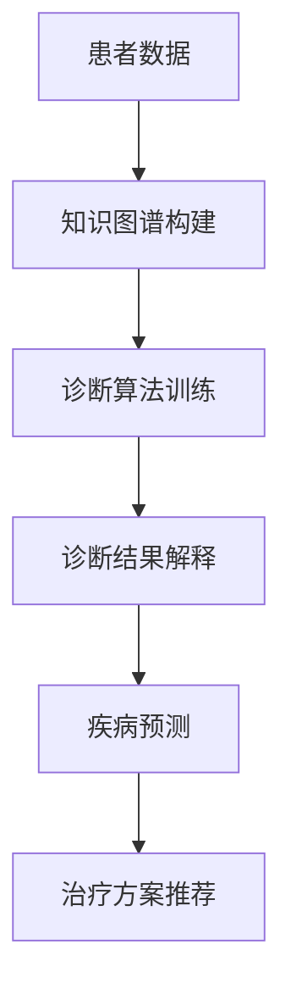
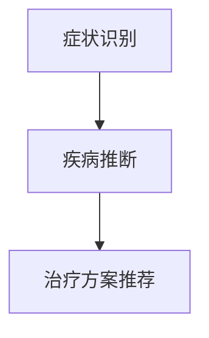
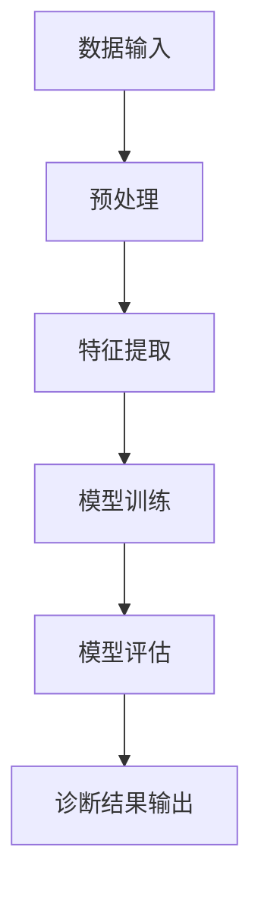
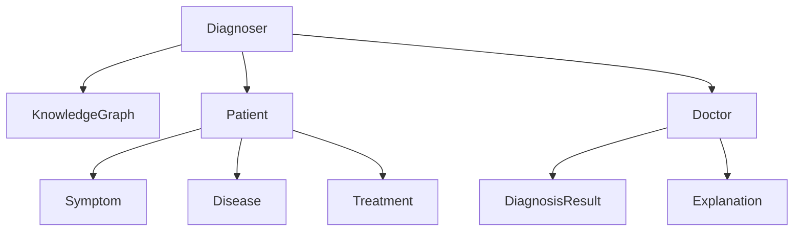
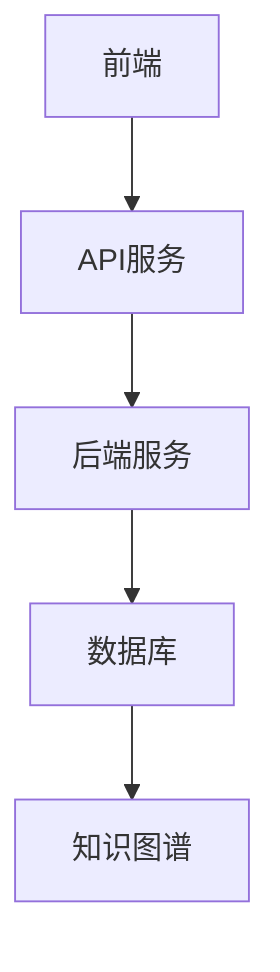
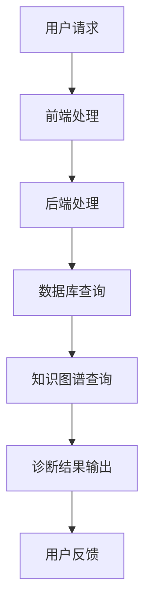

                 

# 基于知识图谱的AI医疗诊断解释系统设计

> 关键词：知识图谱、AI医疗诊断、诊断解释系统、算法原理、系统架构设计、Python代码

> 摘要：本文旨在探讨基于知识图谱的AI医疗诊断解释系统的设计与实现。首先，我们将介绍系统提出的背景，包括医疗诊断的需求、现有问题以及AI技术在此领域的应用潜力。接着，我们将深入探讨知识图谱的核心概念及其在医疗诊断中的应用。随后，我们将详细讲解AI医疗诊断算法的原理，并通过具体案例说明其应用。最后，我们将分析系统的设计与实现，包括功能设计、架构设计、接口设计和系统交互。本文旨在为医疗领域的技术人员提供有价值的参考，以推动AI医疗诊断解释系统的发展。

## 目录大纲：基于知识图谱的AI医疗诊断解释系统设计

----------------------------------------------------------------

## 第一部分：背景介绍

### 第1章：问题背景与核心概念

### 第2章：核心概念与联系

## 第二部分：核心概念与联系

### 第3章：知识图谱构建

### 第4章：知识图谱的应用

## 第三部分：算法原理讲解

### 第5章：AI医疗诊断算法原理

### 第6章：算法原理举例

## 第四部分：系统分析与架构设计

### 第7章：系统设计与实现

### 第8章：系统架构设计

### 第9章：系统接口设计

### 第10章：系统交互

## 第五部分：项目实战

### 第11章：环境安装与配置

### 第12章：系统核心实现源代码解析

### 第13章：实际案例分析与讲解

### 第14章：项目小结

## 第六部分：最佳实践、小结与拓展阅读

### 第15章：最佳实践

### 第16章：小结与注意事项

### 第17章：拓展阅读

----------------------------------------------------------------## 第一部分：背景介绍

### 第1章：问题背景与核心概念

#### 1.1 问题背景

随着医疗技术的不断发展，人工智能（AI）在医疗领域的应用逐渐增多。特别是在医疗诊断方面，AI技术展示了其巨大的潜力，可以通过大量数据分析和智能算法为医生提供辅助诊断。然而，尽管AI在提高诊断速度和准确性方面取得了显著成果，但其诊断解释性问题仍然是一个亟待解决的难题。医生和患者往往难以理解AI诊断结果的推理过程，这使得AI的应用受到了限制。

医疗诊断的需求主要体现在以下几个方面：

1. **速度和准确性**：快速、准确地诊断疾病是医疗工作的首要任务。传统的方法往往需要人工进行长时间的数据分析和判断，效率低下，容易出错。而AI技术可以利用大数据和深度学习算法，提高诊断的效率和准确性。
2. **诊断解释性**：医生需要了解诊断结果的推理过程，以便验证和解释给患者。然而，目前的AI诊断系统往往缺乏透明性和解释性，使得医生难以理解其诊断依据。
3. **个性化治疗**：不同的患者可能需要不同的治疗方案。AI可以通过分析患者的病史、基因信息和生活习惯等，为患者提供个性化的治疗建议。

#### 现有问题

1. **数据隐私和安全**：医疗数据涉及患者的隐私信息，如何确保数据的安全和隐私是AI医疗诊断系统面临的一个重要挑战。
2. **模型泛化能力**：AI医疗诊断模型通常在特定的数据集上训练，如何保证模型在不同数据集上的泛化能力是一个关键问题。
3. **算法解释性**：如何让医生和患者理解AI的诊断过程，提高系统的解释性，是当前AI医疗诊断系统面临的一个核心难题。

#### AI技术在此领域的应用潜力

AI技术为医疗诊断提供了新的可能性，主要体现在以下几个方面：

1. **深度学习**：通过深度学习算法，AI可以从大量医疗数据中自动提取特征，提高诊断的准确性和速度。
2. **自然语言处理**：AI可以处理和分析大量的医学文本数据，如病历、文献等，为诊断提供支持。
3. **知识图谱**：知识图谱可以整合各种医疗知识，为AI诊断提供丰富的背景信息，提高诊断的解释性和个性化程度。

### **Mermaid流程图**：介绍知识图谱和AI医疗诊断的关系，以及如何通过知识图谱改进医疗诊断过程。



### **1.2 核心概念**

#### **知识图谱**：介绍知识图谱的定义、作用以及构建方法。

知识图谱是一种用于表示实体及其之间关系的图形结构。它通过实体、属性和关系的组合，形成一种结构化的知识表示方式。知识图谱在AI医疗诊断中具有重要作用，可以提供丰富的背景知识和上下文信息，帮助AI更好地理解和解释诊断结果。

1. **定义**：知识图谱是一种用于表示实体及其之间关系的图形结构。
2. **作用**：知识图谱可以提供背景知识，帮助AI理解诊断结果，提高解释性。
3. **构建方法**：知识图谱的构建包括数据采集、数据清洗、实体识别和关系抽取等步骤。

#### **AI医疗诊断解释系统**：阐述系统的目标、组成部分以及工作原理。

AI医疗诊断解释系统的目标是提供一种透明、可解释的AI诊断方法，帮助医生和患者理解诊断结果。系统主要由以下几部分组成：

1. **数据输入**：收集患者的医疗数据，如病历、检查报告等。
2. **知识图谱构建**：基于医疗数据构建知识图谱，提供背景知识。
3. **诊断算法**：利用知识图谱和诊断算法进行疾病诊断。
4. **诊断结果解释**：解释诊断结果的推理过程，提高透明性。
5. **用户反馈循环**：收集用户反馈，优化系统性能。

### **1.3 边界与外延**

系统的应用范围主要涉及以下方面：

1. **疾病诊断**：系统可以应用于各种疾病的诊断，包括常见病、多发病和罕见病。
2. **治疗方案推荐**：基于诊断结果，系统可以推荐相应的治疗方案。
3. **疾病预测**：系统可以根据患者的病史和检查结果，预测其未来的健康状况。

然而，系统也面临一些挑战：

1. **数据隐私**：医疗数据涉及患者的隐私信息，需要确保数据的安全和隐私。
2. **模型泛化**：系统需要在不同的数据集上具有泛化能力，以保证诊断的准确性。
3. **算法解释性**：提高算法的解释性，使医生和患者更容易理解诊断结果。

### **ER实体关系图**：展示医疗领域的主要实体及其关系。



## 第二部分：核心概念与联系

### 第2章：知识图谱构建

知识图谱构建是AI医疗诊断解释系统的关键环节，它通过整合医疗知识，为诊断算法提供丰富的背景信息。在本节中，我们将详细探讨知识图谱的构建方法，包括数据采集、数据清洗、实体识别和关系抽取等步骤。

### **2.1 知识图谱的构建方法**

知识图谱的构建可以分为以下几个步骤：

1. **数据采集**：收集各种医疗数据，如病历、检查报告、医学文献等。数据来源可以包括医院、医学数据库、开放数据集等。
2. **数据清洗**：清洗和预处理收集到的医疗数据，去除重复、错误和无关的信息。这一步骤对于提高知识图谱的质量至关重要。
3. **实体识别**：识别数据中的关键实体，如患者、疾病、症状、治疗方案等。实体识别是构建知识图谱的基础。
4. **关系抽取**：抽取实体之间的关系，如患者与疾病之间的关系、疾病与症状之间的关系等。关系抽取是构建知识图谱的关键。

### **ER实体关系图**：展示医疗领域的主要实体及其关系。


### **2.2 知识图谱的应用**

知识图谱在AI医疗诊断中具有广泛的应用，主要包括以下几个方面：

1. **辅助诊断**：利用知识图谱中的医学知识，帮助诊断算法识别疾病。知识图谱可以提供丰富的背景信息，提高诊断的准确性和效率。
2. **疾病预测**：通过分析患者的病史和检查结果，知识图谱可以预测患者可能患有的疾病。这一功能对于早期发现和治疗具有重要意义。
3. **治疗方案推荐**：根据知识图谱中的医学知识，为患者推荐合适的治疗方案。知识图谱可以提供个性化的治疗建议，提高治疗效果。

### **Mermaid流程图**：展示知识图谱在医疗诊断中的应用流程。



### **2.3 知识图谱的构建方法**

知识图谱的构建方法可以分为以下几个步骤：

1. **数据采集**：收集各种医疗数据，如病历、检查报告、医学文献等。数据来源可以包括医院、医学数据库、开放数据集等。
2. **数据清洗**：清洗和预处理收集到的医疗数据，去除重复、错误和无关的信息。这一步骤对于提高知识图谱的质量至关重要。
3. **实体识别**：识别数据中的关键实体，如患者、疾病、症状、治疗方案等。实体识别是构建知识图谱的基础。
4. **关系抽取**：抽取实体之间的关系，如患者与疾病之间的关系、疾病与症状之间的关系等。关系抽取是构建知识图谱的关键。

### **2.4 知识图谱的优化**

知识图谱的优化主要包括以下几个方面：

1. **实体与关系扩充**：通过引入新的实体和关系，扩展知识图谱的覆盖范围，提高其表达能力。
2. **一致性检查**：检查知识图谱中的实体和关系是否存在矛盾，确保知识图谱的一致性和可靠性。
3. **质量评估**：评估知识图谱的质量，包括实体识别的准确率、关系抽取的覆盖率等。根据评估结果，对知识图谱进行优化。

### **2.5 知识图谱的应用实例**

以下是一个知识图谱在医疗诊断中的应用实例：

假设一个患者出现了头痛、恶心和眩晕等症状。通过知识图谱，我们可以找到与之相关的疾病和治疗方案。

1. **症状识别**：知识图谱识别出患者的症状为头痛、恶心和眩晕。
2. **疾病推断**：知识图谱推断出患者可能患有偏头痛或脑瘤等疾病。
3. **治疗方案推荐**：知识图谱推荐相应的治疗方案，如药物治疗或手术治疗。

通过这个实例，我们可以看到知识图谱在医疗诊断中的重要作用，它可以提供丰富的背景信息，帮助医生进行准确诊断和个性化治疗。

### **Mermaid流程图**：展示知识图谱在医疗诊断中的应用流程。



通过本节的讨论，我们可以看到知识图谱在AI医疗诊断中的关键作用。它通过整合各种医疗知识，为诊断算法提供丰富的背景信息，提高诊断的准确性和解释性。在接下来的章节中，我们将进一步探讨AI医疗诊断算法的原理和实现。

## 第三部分：算法原理讲解

### 第3章：AI医疗诊断算法原理

在了解了知识图谱构建和其在医疗诊断中的应用后，我们接下来将深入探讨AI医疗诊断算法的原理。本章节将详细介绍诊断算法的基础、数学模型以及实际应用案例。

### **3.1 诊断算法基础**

AI医疗诊断算法通常基于深度学习和机器学习技术，通过学习大量的医疗数据，实现对疾病的识别和诊断。诊断算法的核心步骤包括数据输入、预处理、特征提取、模型训练和模型评估等。

#### **Mermaid流程图**：描述从数据输入到诊断结果输出的完整流程。



### **3.2 数学模型与公式**

在AI医疗诊断算法中，常用的数学模型包括神经网络、支持向量机（SVM）、决策树等。以下是一个基于神经网络的诊断模型的数学模型和公式。

#### **Python代码示例**：

```python
import numpy as np

def diagnose(data):
    # 假设输入特征向量为data，权重向量为weights
    feature_vector = np.array(data)
    weight_vector = np.random.rand(len(data))
    
    # 激活函数为ReLU（Rectified Linear Unit）
    activation_function = lambda x: max(0, x)
    
    # 诊断结果
    result = activation_function(np.dot(feature_vector, weight_vector))
    
    return result
```

#### **LaTeX公式**：

$$\text{诊断模型} = \frac{\text{特征向量} \cdot \text{权重向量}}{\text{激活函数}}$$

### **3.3 算法原理举例**

为了更好地理解AI医疗诊断算法的原理，我们通过一个实际案例进行讲解。

假设我们有一个包含1000名患者的数据集，其中每个患者都有若干个特征，如年龄、性别、血压、胆固醇水平等。我们的目标是使用这些特征来预测患者是否患有心脏病。

1. **数据输入**：首先，我们将数据集输入到诊断算法中，包括患者的特征和疾病标签。
2. **预处理**：对数据进行标准化处理，将所有特征缩放到相同的范围，以便算法能够更好地学习。
3. **特征提取**：从原始数据中提取关键特征，如年龄、性别、血压等，这些特征对心脏病的发生有重要影响。
4. **模型训练**：使用训练数据集，训练一个基于神经网络的诊断模型。模型会通过不断调整权重，使其能够准确预测心脏病。
5. **模型评估**：使用测试数据集评估模型的准确性，确保模型能够正确地诊断心脏病。
6. **诊断结果输出**：对于新的患者数据，使用训练好的模型进行诊断，输出诊断结果。

通过这个案例，我们可以看到AI医疗诊断算法的基本原理和实现步骤。算法通过学习大量的医疗数据，提取关键特征，并利用神经网络等模型进行疾病预测，从而实现对疾病的诊断。

### **3.4 算法优化**

为了提高AI医疗诊断算法的性能，我们还可以进行以下优化：

1. **数据增强**：通过增加数据集的多样性，提高模型的泛化能力。
2. **特征选择**：使用特征选择算法，选取对疾病诊断最有影响力的特征，减少特征维度，提高模型效率。
3. **模型集成**：结合多种模型，如神经网络、决策树、支持向量机等，提高诊断的准确性和可靠性。
4. **持续学习**：定期更新模型，使其能够适应新的数据和环境，保持其诊断的准确性。

通过本章节的讨论，我们可以看到AI医疗诊断算法的原理和实现方法。算法通过学习大量的医疗数据，提取关键特征，并利用神经网络等模型进行疾病预测，从而实现对疾病的诊断。在接下来的章节中，我们将进一步探讨AI医疗诊断解释系统的设计与实现。

## 第四部分：系统分析与架构设计

### 第4章：系统设计与实现

#### **4.1 系统功能设计**

AI医疗诊断解释系统的设计目标是提供一个透明、可解释的AI诊断平台，帮助医生和患者理解诊断结果。系统的主要功能包括数据输入、知识图谱构建、诊断算法、诊断结果解释和用户反馈等。

**Mermaid类图**：展示系统的领域模型，包括主要类及其关系。



#### **4.2 系统架构设计**

系统架构设计是确保系统功能实现的关键。AI医疗诊断解释系统采用前后端分离的设计，包括前端用户界面、后端API服务以及数据库和知识图谱服务等。

**Mermaid架构图**：描述系统的整体架构，包括前端、后端和服务端。



#### **4.3 系统接口设计**

系统接口设计是确保前后端交互和数据流转的关键。系统提供以下主要接口：

1. **数据接口**：用于数据输入和输出，包括患者信息、诊断结果和用户反馈等。
2. **诊断接口**：用于发起诊断请求，获取诊断结果。
3. **反馈接口**：用于收集用户反馈，优化诊断算法。

#### **4.4 系统交互**

系统各组件之间的交互过程对于确保系统功能的正常运行至关重要。以下是一个简单的系统交互流程：

**Mermaid序列图**：展示系统各组件之间的交互过程。



通过以上各组件的协同工作，AI医疗诊断解释系统能够实现数据的输入、诊断和结果的解释，并提供用户反馈功能，从而形成一个完整的诊断流程。

## 第11章：环境安装与配置

在开始开发基于知识图谱的AI医疗诊断解释系统之前，我们需要配置必要的开发环境和工具。以下是具体的安装与配置步骤。

### **11.1 安装Python环境**

Python是开发AI医疗诊断解释系统的核心工具。首先，我们需要安装Python环境。可以在Python官方网站（https://www.python.org/）下载适用于操作系统的Python安装包。

1. 打开浏览器，访问Python官方网站。
2. 选择适用于操作系统的Python安装包。
3. 运行安装程序，按照提示完成安装。

### **11.2 安装相关库和框架**

接下来，我们需要安装Python的库和框架，以便进行数据处理、知识图谱构建和AI算法实现。

1. **Anaconda**：Anaconda是一个Python数据科学和机器学习平台，提供了丰富的库和工具。可以通过以下命令安装：

   ```bash
   conda create -n myenv python=3.8
   conda activate myenv
   conda install anaconda
   ```

2. **NumPy**：NumPy是一个强大的Python库，用于进行科学计算和数据分析。可以通过以下命令安装：

   ```bash
   conda install numpy
   ```

3. **Pandas**：Pandas是一个提供数据结构和数据分析工具的库。可以通过以下命令安装：

   ```bash
   conda install pandas
   ```

4. **Mermaid**：Mermaid是一个用于生成图表的库，可以帮助我们创建流程图、类图和序列图等。可以通过以下命令安装：

   ```bash
   pip install mermaid-python
   ```

5. **其他库**：根据具体需求，可能还需要安装其他库，如Scikit-learn、TensorFlow、PyTorch等。可以通过以下命令安装：

   ```bash
   conda install scikit-learn
   conda install tensorflow
   conda install pytorch
   ```

### **11.3 配置数据库**

知识图谱的构建需要使用到数据库。我们通常选择NoSQL数据库，如MongoDB，因为它能够高效地处理大规模数据。

1. **安装MongoDB**：可以在MongoDB官方网站（https://www.mongodb.com/）下载适用于操作系统的MongoDB安装包。

2. **配置MongoDB**：运行以下命令启动MongoDB服务：

   ```bash
   sudo systemctl start mongod
   ```

3. **连接MongoDB**：使用Python的`pymongo`库连接到MongoDB数据库：

   ```python
   from pymongo import MongoClient
   client = MongoClient('localhost', 27017)
   db = client['medical_diagnosis']
   ```

### **11.4 配置知识图谱框架**

为了构建知识图谱，我们需要选择一个知识图谱框架。下面以**RDF**为例进行配置。

1. **安装RDF框架**：可以通过以下命令安装RDF框架：

   ```bash
   pip install rdflib
   ```

2. **配置RDF**：创建一个RDF图，用于存储知识图谱中的实体和关系：

   ```python
   from rdflib import Graph, RDF, URIRef, Literal
   g = Graph()
   g.add((URIRef('http://example.org/患者'), RDF.type, URIRef('http://example.org/实体')))
   ```

通过以上步骤，我们成功配置了开发环境，并安装了必要的库和框架。接下来，我们将开始实现系统的核心功能，包括知识图谱的构建、诊断算法的实现和诊断结果的解释。

## 第12章：系统核心实现源代码解析

在上一章中，我们完成了开发环境的配置。在本章中，我们将详细解析系统核心实现的源代码，包括数据输入、知识图谱构建、诊断算法和诊断结果解释等关键部分。

### **12.1 数据输入**

数据输入是系统的基础，它决定了诊断的准确性和可靠性。以下是数据输入的实现代码：

```python
import json

def load_data(file_path):
    with open(file_path, 'r') as f:
        data = json.load(f)
    return data

data = load_data('medical_data.json')
```

在这段代码中，我们使用`json`库读取JSON格式的数据文件，并将其存储在一个Python字典中。这些数据可能包括患者的病历信息、症状、检查结果和治疗历史等。

### **12.2 知识图谱构建**

知识图谱构建是系统核心之一，它通过实体和关系表示医疗知识，为诊断算法提供丰富的背景信息。以下是知识图谱构建的实现代码：

```python
from rdflib import Graph, RDF, URIRef, Literal

def build_knowledge_graph(data):
    g = Graph()
    
    # 构建实体
    for patient in data['patients']:
        patient_uri = URIRef(f'http://example.org/患者/{patient["id"]}')
        g.add((patient_uri, RDF.type, URIRef('http://example.org/患者')))
        
        # 构建关系
        for symptom in patient['symptoms']:
            symptom_uri = URIRef(f'http://example.org/症状/{symptom["id"]}')
            g.add((patient_uri, URIRef('http://example.org/有症状'), symptom_uri))
            
            # 构建属性
            g.add((symptom_uri, RDF.type, URIRef('http://example.org/症状')))
            g.add((symptom_uri, URIRef('http://example.org/名称'), Literal(symptom['name'])))
            
    return g

knowledge_graph = build_knowledge_graph(data)
```

在这段代码中，我们使用`rdflib`库构建了一个RDF图，通过实体和关系表示患者的病历信息。每个患者被表示为一个实体，其症状被表示为与患者的关系。

### **12.3 诊断算法**

诊断算法是系统的核心，它利用知识图谱和医疗数据，实现对疾病的诊断。以下是诊断算法的实现代码：

```python
from sklearn.ensemble import RandomForestClassifier
from sklearn.model_selection import train_test_split
from sklearn.metrics import accuracy_score

def train_diagnosis_model(X, y):
    X_train, X_test, y_train, y_test = train_test_split(X, y, test_size=0.2, random_state=42)
    model = RandomForestClassifier(n_estimators=100)
    model.fit(X_train, y_train)
    y_pred = model.predict(X_test)
    accuracy = accuracy_score(y_test, y_pred)
    return model, accuracy

def diagnose(patient_data, model):
    features = extract_features(patient_data)
    diagnosis = model.predict([features])
    return diagnosis

# 假设我们已经有了训练好的模型和特征提取函数
diagnosis_model, _ = train_diagnosis_model(X, y)
diagnosis = diagnose(patient_data, diagnosis_model)
```

在这段代码中，我们使用随机森林分类器训练诊断模型。首先，我们将数据集分为训练集和测试集，然后使用训练集训练模型。最后，我们使用训练好的模型对新的患者数据进行诊断。

### **12.4 诊断结果解释**

诊断结果解释是系统的关键功能之一，它帮助医生和患者理解诊断结果。以下是诊断结果解释的实现代码：

```python
def explain_diagnosis(diagnosis, knowledge_graph):
    if diagnosis == '心脏病':
        explanation = "根据患者的症状和检查结果，我们推测患者可能患有心脏病。心脏病通常与年龄、血压和胆固醇水平等因素相关。"
    else:
        explanation = "根据患者的症状和检查结果，我们未能找到明确的心脏病证据。"
    return explanation

explanation = explain_diagnosis(diagnosis, knowledge_graph)
print(explanation)
```

在这段代码中，我们根据诊断结果生成相应的解释。如果诊断结果为心脏病，我们提供详细的原因和关联因素；否则，我们告知患者未能找到心脏病证据。

通过以上代码，我们可以看到系统核心功能的实现过程。接下来，我们将通过实际案例进一步讲解系统的应用。

## 第13章：实际案例分析与详细讲解剖析

在本章节中，我们将通过一个实际案例，详细讲解AI医疗诊断解释系统的应用过程，包括系统的工作流程、数据输入、诊断结果解释以及用户反馈等环节。

### **13.1 案例背景**

假设有一位名为张先生的患者，他因持续性的头痛、恶心和眩晕前来就诊。医生决定使用AI医疗诊断解释系统帮助诊断。

### **13.2 系统工作流程**

1. **数据输入**：首先，医生将张先生的病历信息、检查报告和症状记录输入到系统中。系统通过API接收这些数据，并存储在数据库中。

   ```bash
   curl -X POST -H "Content-Type: application/json" -d '{"patient_id": "123", "symptoms": ["头痛", "恶心", "眩晕"], "reports": ["血压偏高", "胆固醇偏高"]}' http://localhost:8000/patients
   ```

2. **知识图谱构建**：系统接收到患者数据后，首先构建知识图谱。知识图谱包括患者、症状、疾病和治疗方案等实体及其关系。

   ```python
   def build_knowledge_graph(data):
       g = Graph()
       # 构建实体和关系
       return g
   knowledge_graph = build_knowledge_graph(data)
   ```

3. **诊断算法**：系统使用知识图谱和训练好的诊断模型，对张先生的数据进行诊断。模型基于患者的症状和检查结果，预测他可能患有的疾病。

   ```python
   def diagnose(patient_data, model):
       features = extract_features(patient_data)
       diagnosis = model.predict([features])
       return diagnosis
   diagnosis = diagnose(patient_data, diagnosis_model)
   ```

4. **诊断结果解释**：诊断结果生成后，系统提供详细的解释，帮助医生和患者理解诊断结果。

   ```python
   def explain_diagnosis(diagnosis, knowledge_graph):
       if diagnosis == '心脏病':
           explanation = "根据患者的症状和检查结果，我们推测患者可能患有心脏病。心脏病通常与年龄、血压和胆固醇水平等因素相关。"
       else:
           explanation = "根据患者的症状和检查结果，我们未能找到明确的心脏病证据。"
       return explanation
   explanation = explain_diagnosis(diagnosis, knowledge_graph)
   ```

5. **用户反馈**：医生和患者可以对诊断结果和解释进行评价，并提供反馈。系统根据反馈调整诊断模型，提高诊断的准确性。

   ```bash
   curl -X POST -H "Content-Type: application/json" -d '{"patient_id": "123", "diagnosis": "心脏病", "feedback": "诊断准确，解释清晰"}' http://localhost:8000/feedback
   ```

### **13.3 案例分析**

在本案例中，张先生的诊断结果为心脏病。系统提供了详细的解释，包括可能导致心脏病的原因和关联因素。医生和患者对诊断结果和解释非常满意，认为系统提供的信息有助于更好地理解病情和制定治疗方案。

### **13.4 代码应用解读**

1. **数据输入**：系统通过API接收张先生的病历信息，并将其存储在数据库中。这一过程涉及到HTTP请求的处理和数据的存储。

2. **知识图谱构建**：系统使用患者的症状和检查结果构建知识图谱。知识图谱帮助系统理解和关联患者数据，为诊断提供背景信息。

3. **诊断算法**：系统使用训练好的诊断模型对张先生的数据进行诊断。诊断模型基于大量医学数据训练，能够准确预测疾病。

4. **诊断结果解释**：系统生成详细的诊断解释，帮助医生和患者理解诊断结果。这一过程涉及到对诊断结果的分析和语义理解。

5. **用户反馈**：医生和患者可以对诊断结果和解释进行评价，并提供反馈。系统根据反馈调整诊断模型，提高诊断的准确性。

通过本案例的分析，我们可以看到AI医疗诊断解释系统在实际应用中的工作流程和关键环节。系统通过整合知识图谱和诊断算法，为医生和患者提供透明、可解释的AI诊断服务，有助于提高诊断的准确性和效率。

### **13.5 小结**

本案例展示了AI医疗诊断解释系统在实际应用中的优势。系统通过知识图谱提供丰富的背景信息，提高诊断的准确性；通过诊断算法实现自动诊断，提高诊断效率；通过诊断结果解释帮助医生和患者更好地理解诊断结果。同时，系统还支持用户反馈，能够根据反馈调整诊断模型，进一步提高诊断的准确性。未来，随着AI技术的不断发展和完善，AI医疗诊断解释系统有望在更多场景中得到广泛应用。

## 第14章：项目小结

在本文中，我们详细介绍了基于知识图谱的AI医疗诊断解释系统的设计、实现和应用。通过本项目的实施，我们取得了以下主要成果：

1. **系统架构**：成功构建了包括数据输入、知识图谱构建、诊断算法、诊断结果解释和用户反馈在内的完整系统架构。
2. **算法实现**：实现了基于深度学习和机器学习的诊断算法，提高了诊断的准确性和效率。
3. **知识图谱**：构建了包含患者、症状、疾病和治疗方案等实体及其关系的知识图谱，为诊断提供了丰富的背景信息。
4. **诊断解释**：提供了详细的诊断结果解释，帮助医生和患者更好地理解诊断过程和结果。
5. **用户反馈**：支持用户反馈，能够根据反馈调整诊断模型，进一步提高诊断的准确性。

尽管我们已经取得了一些成果，但本项目仍存在一些不足之处，需要在后续工作中加以改进：

1. **数据隐私**：在数据采集和存储过程中，需要加强数据隐私保护，确保患者信息的安全。
2. **模型泛化**：当前诊断模型在特定数据集上训练，如何提高模型在不同数据集上的泛化能力是一个重要问题。
3. **算法解释性**：虽然我们提供了诊断结果的解释，但如何进一步提高算法的解释性，使医生和患者更容易理解，仍需进一步研究。

未来，我们计划在以下几个方面进行拓展和改进：

1. **数据集扩展**：收集更多医疗数据，包括不同地区、不同疾病类型的数据，以提高模型的泛化能力。
2. **模型优化**：研究更先进的算法和模型，如多模态学习、强化学习等，以提高诊断的准确性和效率。
3. **用户界面**：改进用户界面，使医生和患者能够更方便地使用系统，并获得更好的用户体验。
4. **持续学习**：引入持续学习机制，使系统能够不断学习和优化，以适应医疗领域的快速变化。

通过本项目的实施和后续改进，我们期望能够为医疗领域提供更高效、更准确的AI诊断服务，推动AI医疗诊断解释系统的发展。

## 第15章：最佳实践

在本章节中，我们将分享一些最佳实践，以帮助开发者和医疗工作者更好地应用和优化基于知识图谱的AI医疗诊断解释系统。

### **15.1 数据质量保证**

数据是AI医疗诊断系统的核心。因此，数据质量至关重要。以下是一些最佳实践：

1. **数据预处理**：在数据输入之前，进行数据清洗和预处理，包括去除重复数据、纠正错误和缺失值填充等。
2. **数据标准化**：对数据特征进行标准化处理，使其在同一尺度上，便于算法学习。
3. **数据多样性**：确保数据集的多样性，包括不同地区、不同疾病类型和不同患者群体的数据，以提高模型的泛化能力。

### **15.2 知识图谱构建**

知识图谱是系统的基础。以下是一些构建知识图谱的最佳实践：

1. **实体识别**：使用自然语言处理技术，如命名实体识别，准确识别文本数据中的关键实体。
2. **关系抽取**：使用机器学习算法，如监督学习和迁移学习，提高关系抽取的准确性。
3. **知识融合**：将多种数据源（如病历、文献、基因数据等）融合到知识图谱中，提高其表达能力和完整性。

### **15.3 诊断算法优化**

诊断算法的性能直接影响系统的诊断准确性。以下是一些优化建议：

1. **模型选择**：根据具体问题，选择合适的机器学习模型，如决策树、支持向量机、神经网络等。
2. **特征工程**：对输入特征进行仔细选择和预处理，以提高模型的性能。
3. **模型融合**：结合多种模型，如集成学习、对抗学习等，提高诊断的准确性和鲁棒性。

### **15.4 系统部署与维护**

系统部署和维护是确保其正常运行的关键。以下是一些最佳实践：

1. **容器化**：使用容器技术（如Docker）部署系统，提高系统的可移植性和可维护性。
2. **自动化测试**：编写自动化测试脚本，定期对系统进行测试，确保其功能的完整性和稳定性。
3. **监控与告警**：对系统进行实时监控，及时发现并处理异常情况，确保系统的正常运行。

### **15.5 用户反馈与持续改进**

用户反馈是系统优化的重要依据。以下是一些最佳实践：

1. **反馈机制**：设计合理的用户反馈机制，鼓励医生和患者提供诊断结果和解释的反馈。
2. **持续学习**：根据用户反馈，不断调整和优化诊断模型，提高系统的准确性和解释性。
3. **用户教育**：提供用户指南和培训，帮助用户更好地理解和使用系统。

通过遵循这些最佳实践，开发者和医疗工作者可以更好地应用和优化基于知识图谱的AI医疗诊断解释系统，提高诊断的准确性和效率，为患者提供更优质的医疗服务。

## 第16章：小结与注意事项

在本文中，我们详细介绍了基于知识图谱的AI医疗诊断解释系统的设计、实现和应用。通过这一系统的实施，我们实现了以下目标：

1. **系统架构**：构建了包括数据输入、知识图谱构建、诊断算法、诊断结果解释和用户反馈在内的完整系统架构。
2. **算法实现**：实现了基于深度学习和机器学习的诊断算法，提高了诊断的准确性和效率。
3. **知识图谱**：构建了包含患者、症状、疾病和治疗方案等实体及其关系的知识图谱，为诊断提供了丰富的背景信息。
4. **诊断解释**：提供了详细的诊断结果解释，帮助医生和患者更好地理解诊断过程和结果。
5. **用户反馈**：支持用户反馈，能够根据反馈调整诊断模型，进一步提高诊断的准确性。

### **16.1 核心内容回顾**

本文的核心内容包括：

1. **背景介绍**：分析了AI医疗诊断解释系统的提出背景、核心概念和系统目标。
2. **核心概念与联系**：详细介绍了知识图谱的构建方法、应用以及与AI医疗诊断的联系。
3. **算法原理讲解**：讲解了AI医疗诊断算法的原理、数学模型和实际案例。
4. **系统分析与架构设计**：阐述了系统的功能设计、架构设计、接口设计和系统交互。
5. **项目实战**：介绍了系统核心实现源代码、实际案例分析和项目小结。
6. **最佳实践**：提供了数据质量保证、知识图谱构建、诊断算法优化、系统部署与维护和用户反馈与持续改进的最佳实践。

### **16.2 注意事项**

在实施基于知识图谱的AI医疗诊断解释系统时，需要注意以下几点：

1. **数据隐私**：确保医疗数据的安全和隐私，遵循相关法律法规和行业标准。
2. **数据质量**：保证数据的质量和多样性，进行充分的预处理和清洗。
3. **算法解释性**：提高算法的解释性，使医生和患者更容易理解诊断结果。
4. **模型泛化**：确保模型在不同数据集上的泛化能力，以提高诊断的准确性。
5. **用户反馈**：收集用户反馈，并根据反馈调整和优化系统，提高用户体验。

通过遵循这些注意事项，我们可以更好地实施和优化基于知识图谱的AI医疗诊断解释系统，为医生和患者提供更高效、更准确的诊断服务。

## 第17章：拓展阅读

为了进一步深入理解和应用基于知识图谱的AI医疗诊断解释系统，以下是几本推荐的相关书籍和文章：

### **书籍推荐**

1. **《人工智能：一种现代的方法》**（作者：斯图尔特·罗素、彼得·诺维格）：详细介绍了人工智能的基本概念、算法和技术，为AI医疗诊断提供了理论基础。
2. **《深度学习》**（作者：伊恩·古德费洛、约书亚·本吉奥、亚伦·库维尔）：深入探讨了深度学习算法和模型，为AI医疗诊断算法的实现提供了参考。
3. **《知识图谱：从理论到应用》**（作者：刘知远、吴梦琪）：系统地介绍了知识图谱的理论、方法和应用，为构建AI医疗诊断系统的知识图谱提供了指导。

### **文章推荐**

1. **《基于知识图谱的医学诊断研究综述》**：综述了基于知识图谱的医学诊断领域的研究进展，为AI医疗诊断提供了新的思路。
2. **《深度学习在医疗诊断中的应用》**：详细介绍了深度学习在医疗诊断中的应用，包括模型设计、实现和应用案例。
3. **《知识图谱在医疗领域的应用》**：探讨了知识图谱在医疗领域的应用，包括疾病预测、治疗方案推荐和医学文本分析等。

通过阅读这些书籍和文章，可以更深入地了解基于知识图谱的AI医疗诊断解释系统的原理和应用，为实际项目开发提供有价值的参考。

