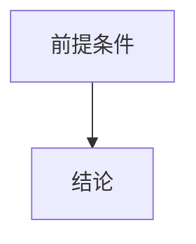
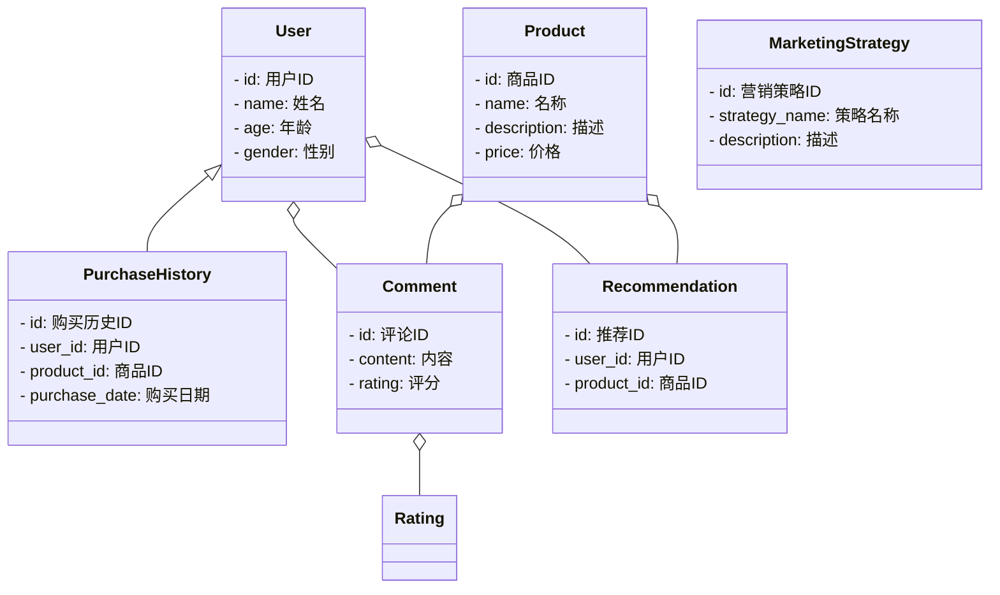
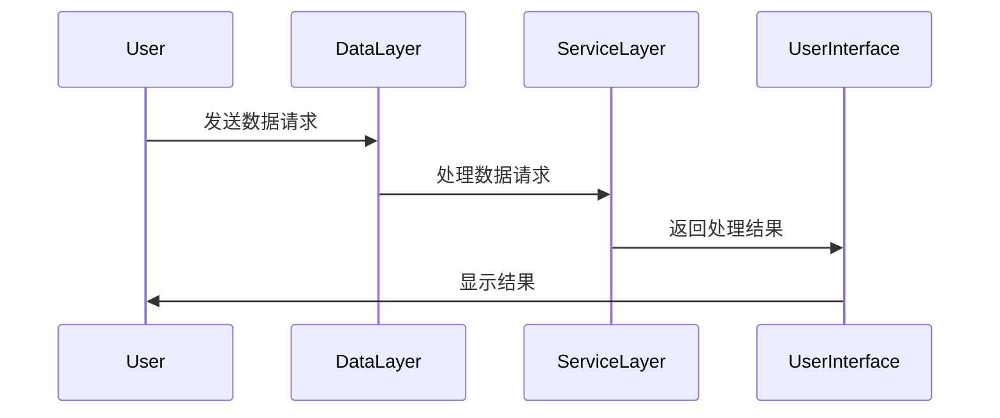
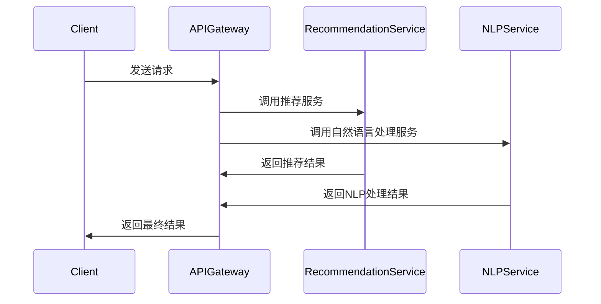
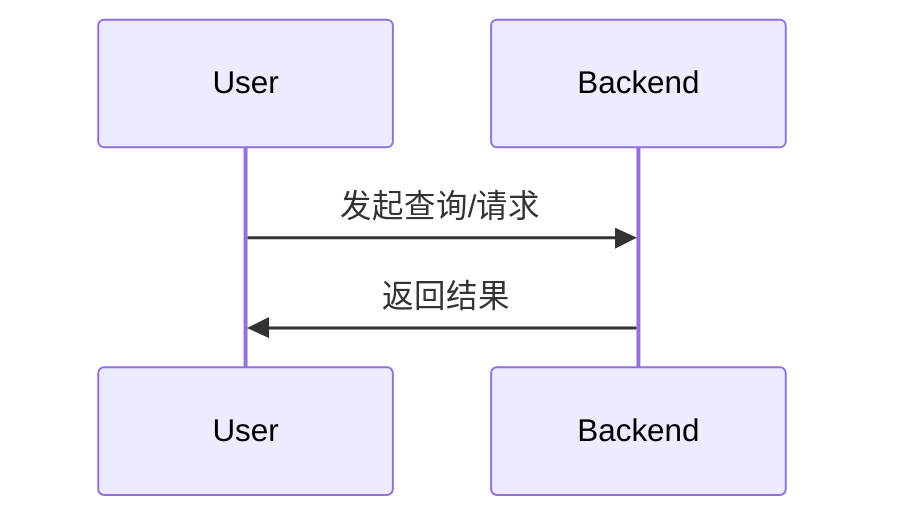

                 

### 第一部分：背景介绍

#### 问题背景

随着互联网的普及和大数据技术的发展，数据量呈爆炸性增长。根据IDC（国际数据公司）的预测，全球数据量预计将在2025年达到175ZB，相当于每秒产生近2.5EB的数据。这种数据量的激增使得传统的数据处理和分析方法已经无法满足现代社会的需求。例如，传统的数据库查询技术在大规模数据面前效率低下，难以在合理时间内完成复杂的查询任务。

为了应对这一挑战，知识图谱作为一种高效的数据组织和管理方式逐渐受到了重视。知识图谱通过将海量数据组织成图谱结构，实现了数据的语义理解和关联分析，为人工智能的应用提供了强有力的支持。知识图谱可以被视为一种知识库，它将现实世界中的实体、概念和关系以结构化的形式进行表示，从而使得机器能够更好地理解和利用这些数据。

#### 问题描述

在人工智能领域，推理系统是一个重要的研究方向。推理系统通过逻辑推理的方法，从已知的事实中推导出新的结论。然而，现有的推理系统存在一些问题：

1. **效率低**：传统的推理系统往往采用基于规则的方法，这种方法的效率相对较低，难以在大规模数据上快速地进行推理。
2. **可扩展性差**：当数据规模增大时，推理系统的性能往往会受到严重影响，难以保持高效。
3. **知识利用不充分**：现有的推理系统往往难以充分利用知识图谱中的丰富信息，导致推理结果不够准确和全面。

这些问题限制了推理系统在实际应用中的效果，因此，需要一种新的推理方法来克服这些限制。

#### 问题解决

基于知识图谱的AI推理系统通过将知识图谱与人工智能技术相结合，提供了一种高效、可扩展的推理解决方案。这种方法的主要优势包括：

1. **高效性**：知识图谱的结构化特点使得数据查询和关联分析更加高效，可以快速地从海量数据中提取有用的信息。
2. **可扩展性**：知识图谱可以通过添加新的实体、属性和关系进行动态扩展，适应不断变化的数据需求。
3. **知识利用充分**：知识图谱提供了结构化的知识表示，使得推理系统能够更好地理解和利用这些知识，从而提高推理结果的准确性和全面性。

通过这些优势，基于知识图谱的AI推理系统不仅能够处理大规模数据，还能够实现对知识的自动化提取、组织和利用，从而提高推理系统的性能和可靠性。

#### 边界与外延

知识图谱的边界包括数据的来源、质量和结构。数据来源的多样性和质量直接影响知识图谱的构建和推理效果。例如，如果数据来源不统一或者数据质量较差，可能会导致知识图谱中的错误和噪声增加，影响推理系统的性能。

知识图谱的外延则涉及知识图谱的应用场景。常见的应用场景包括：

1. **语义搜索**：通过知识图谱对用户查询进行语义理解和关联分析，提供更加精准的搜索结果。
2. **智能问答**：利用知识图谱中的知识库，实现对用户提问的智能理解和回答。
3. **推荐系统**：通过知识图谱中的关系和模式，为用户提供个性化的推荐结果。
4. **自然语言处理**：利用知识图谱中的结构化知识，提高自然语言处理任务的效果，如文本分类、情感分析等。

#### 概念结构与核心要素组成

知识图谱的核心概念包括实体、属性、关系和图谱结构。下面将详细阐述这些概念：

1. **实体**：实体是知识图谱中的基本元素，代表现实世界中的对象，如人、地点、物品等。实体可以进一步细分为类和实例，类是对一组具有相同属性和关系的实体的抽象，实例则是类的具体实例。

2. **属性**：属性是实体的特征描述，用于表达实体之间的联系。例如，一个人的属性可以是姓名、年龄、性别等。

3. **关系**：关系是实体之间的关联，用于描述实体之间的语义联系。关系可以是单向的，也可以是双向的，如“属于”、“居住于”等。

4. **图谱结构**：图谱结构是知识图谱的整体组织形式，通常使用图论模型表示。图谱结构决定了知识图谱的数据存储、查询和推理方式。

知识图谱的构建方法包括手工构建和自动抽取。手工构建方法通常需要领域专家的参与，对实体、属性和关系进行手动定义和标注。这种方法虽然能够保证知识图谱的质量，但效率较低，难以处理大规模数据。自动抽取方法主要涉及自然语言处理技术和数据挖掘算法，可以从大量的非结构化数据中自动提取实体、属性和关系，构建知识图谱。

自动抽取方法包括以下几种：

1. **命名实体识别（NER）**：通过自然语言处理技术，识别文本中的命名实体，如人名、地名、组织名等。
2. **关系抽取**：从文本中识别出实体之间的关系，如“属于”、“居住于”等。
3. **属性抽取**：从文本中提取实体的属性信息，如年龄、性别等。

综上所述，知识图谱作为一种高效的数据组织和管理方式，在人工智能领域具有重要的应用价值。通过构建和利用知识图谱，AI推理系统可以实现高效、可扩展的推理，为各种实际应用提供强有力的支持。接下来，我们将进一步探讨知识图谱的基本概念、构建方法及其在AI推理系统中的应用。

---

**文章标题**：基于知识图谱的AI推理系统设计与实现

**关键词**：知识图谱、AI推理、语义理解、结构化数据、自动抽取

**摘要**：
本文深入探讨了基于知识图谱的AI推理系统的设计与实现。首先，分析了知识图谱在现代数据处理中的重要性及其在AI推理系统中的应用价值。接着，详细介绍了知识图谱的基本概念、构建方法以及与AI推理系统的联系。通过具体算法原理讲解，本文揭示了知识图谱在AI推理系统中的核心作用，并提供了系统的设计与架构方案。最后，通过一个实际项目实战案例，展示了知识图谱AI推理系统的具体实现过程和应用效果。

---

## 第二部分：核心概念与联系

### 2.1 知识图谱的基本概念

知识图谱作为一种结构化的知识表示形式，是人工智能领域中的一项重要技术。它通过将实体、属性和关系组织成一个图谱结构，实现了对数据的语义理解和关联分析。下面将详细阐述知识图谱的基本概念：

#### **实体**

实体是知识图谱中的基本元素，代表现实世界中的对象。实体可以是人、地点、物品、事件等。例如，在一个关于城市交通的知识图谱中，实体可能包括“地铁站”、“公交车”、“道路”等。实体可以分为类和实例。类是对一组具有相同属性和关系的实体的抽象，例如“人”类包含“张三”、“李四”等实例。实例则是类的具体实例，例如“张三”是一个“人”类的实例。

#### **属性**

属性是实体的特征描述，用于表达实体之间的联系。属性通常与实体类相关联，并为每个实例提供具体的值。例如，对于“人”这个实体类，其属性可能包括“姓名”、“年龄”、“性别”等。属性不仅提供了对实体的描述，而且有助于建立实体之间的关联。

#### **关系**

关系是实体之间的关联，用于描述实体之间的语义联系。关系可以是单向的，也可以是双向的。例如，在“人”和“城市”两个实体之间，可以建立“居住于”这种双向关系，表示一个人居住在某个城市。关系不仅可以描述实体之间的静态联系，还可以描述动态变化，如“毕业”、“结婚”等。

#### **图谱结构**

图谱结构是知识图谱的整体组织形式，通常使用图论模型表示。图谱结构决定了知识图谱的数据存储、查询和推理方式。在图谱结构中，实体和关系通过节点和边进行表示。节点表示实体，边表示关系。图谱结构可以是单层结构，也可以是多层结构。多层结构允许更复杂的实体关联和语义表达。

### **2.2 知识图谱的核心特点**

知识图谱具有以下核心特点：

#### **语义理解**

知识图谱通过实体、属性和关系的组合，实现了对数据的语义理解。这使得机器能够更好地理解数据的含义，从而进行更精准的查询和推理。例如，在语义搜索中，知识图谱可以帮助搜索引擎理解用户的查询意图，提供更准确的搜索结果。

#### **关联分析**

知识图谱能够对实体之间的关联进行分析，挖掘潜在的关系和模式。这种关联分析能力使得机器能够发现数据中的隐含信息和规律，为各种智能应用提供支持。例如，在推荐系统中，知识图谱可以分析用户的历史行为和偏好，推荐相关的商品或服务。

#### **高效查询**

知识图谱采用了图论模型，能够高效地进行数据查询和关联分析。图论模型允许直接在图谱上进行复杂的查询操作，而不需要逐个遍历数据。这使得知识图谱在大规模数据上的查询性能显著优于传统的数据库系统。

#### **可扩展性**

知识图谱可以通过添加新的实体、属性和关系进行动态扩展，适应不断变化的数据需求。这种灵活性使得知识图谱能够适应不同领域的应用需求，从而实现更广泛的应用。

### **2.3 知识图谱与AI推理系统的联系**

知识图谱与AI推理系统之间存在密切的联系。知识图谱为AI推理系统提供了结构化的知识表示，使得推理系统能够更好地理解和利用这些知识。

#### **知识表示**

知识图谱为AI推理系统提供了结构化的知识表示。通过实体、属性和关系的组合，知识图谱能够以清晰、准确的方式表示现实世界中的知识和关系。这种结构化的知识表示有助于AI推理系统更有效地进行推理和决策。

#### **推理过程**

AI推理系统利用知识图谱中的知识进行逻辑推理，实现对问题的求解。推理过程通常包括以下几个步骤：

1. **知识提取**：从知识源中提取实体、属性和关系，构建知识图谱。
2. **知识表示**：将知识图谱中的知识转化为计算机可处理的形式，如RDF（资源描述框架）三元组、图论模型等。
3. **推理过程**：在知识图谱中搜索符合条件的路径，根据推理规则推导出新的结论。

#### **智能应用**

知识图谱和AI推理系统的结合，使得各种智能应用如语义搜索、智能问答、推荐系统等成为可能。知识图谱为这些智能应用提供了强大的知识支撑，使得系统能够更好地理解和应对复杂的问题。例如，在语义搜索中，知识图谱可以帮助搜索引擎理解用户的查询意图，提供更准确的搜索结果；在智能问答中，知识图谱可以提供答案生成的知识基础，使得问答系统能够给出准确的回答。

### **2.4 知识图谱的构建方法**

知识图谱的构建方法可以分为手工构建和自动抽取。

#### **手工构建**

手工构建方法通常需要领域专家的参与，对实体、属性和关系进行手动定义和标注。这种方法虽然能够保证知识图谱的质量，但效率较低，难以处理大规模数据。手工构建方法通常包括以下几个步骤：

1. **领域分析**：确定知识图谱要覆盖的领域和范围。
2. **实体定义**：定义知识图谱中的实体类，如人、地点、物品等。
3. **属性定义**：为实体类定义属性，如姓名、年龄、性别等。
4. **关系定义**：定义实体之间的关系，如属于、居住于等。
5. **知识标注**：对实体、属性和关系进行标注，构建知识图谱。

#### **自动抽取**

自动抽取方法主要涉及自然语言处理技术和数据挖掘算法，可以从大量的非结构化数据中自动提取实体、属性和关系，构建知识图谱。自动抽取方法通常包括以下几个步骤：

1. **数据预处理**：对原始数据进行清洗和预处理，提取文本信息。
2. **命名实体识别（NER）**：通过自然语言处理技术，识别文本中的命名实体，如人名、地名、组织名等。
3. **关系抽取**：从文本中识别出实体之间的关系，如属于、居住于等。
4. **属性抽取**：从文本中提取实体的属性信息，如年龄、性别等。
5. **图谱构建**：将提取的实体、属性和关系组织成图谱结构，构建知识图谱。

### **2.5 知识图谱在AI推理系统中的应用**

知识图谱在AI推理系统中的应用主要体现在以下几个方面：

1. **语义搜索**：通过知识图谱对用户查询进行语义理解和关联分析，提供更加精准的搜索结果。
2. **智能问答**：利用知识图谱中的知识库，实现对用户提问的智能理解和回答。
3. **推荐系统**：通过知识图谱中的关系和模式，为用户提供个性化的推荐结果。
4. **自然语言处理**：利用知识图谱中的结构化知识，提高自然语言处理任务的效果，如文本分类、情感分析等。

综上所述，知识图谱作为一种高效的数据组织和管理方式，在人工智能领域具有重要的应用价值。通过构建和利用知识图谱，AI推理系统可以实现高效、可扩展的推理，为各种实际应用提供强有力的支持。接下来，我们将进一步探讨基于知识图谱的AI推理算法，以及其在具体应用中的实现细节。

---

## 第三部分：算法原理讲解

### **3.1 基于知识图谱的AI推理算法**

知识图谱在AI推理中的应用主要体现在其结构化和语义化的特点上。基于知识图谱的AI推理算法主要包括以下几种：

1. **基于规则推理**：通过预先定义的规则，对知识图谱进行推理。规则通常以“如果...那么...”的形式表达，用于描述实体之间的关系。这种方法的优点是实现简单，但缺点是规则数量庞大时，推理效率较低。
2. **基于模型推理**：利用机器学习模型，如神经网络，对知识图谱进行推理。这种方法可以通过学习数据中的模式和规律，自动生成推理规则。优点是推理效率高，但需要大量的训练数据和计算资源。
3. **混合推理**：结合基于规则推理和基于模型推理的优势，将规则推理和模型推理相结合，实现更高效的推理。

#### **推理流程**

基于知识图谱的AI推理流程通常包括以下几个步骤：

1. **知识提取**：从各种数据源中提取实体、属性和关系，构建知识图谱。
2. **知识表示**：将知识图谱中的知识转化为计算机可处理的形式，如RDF三元组、图论模型等。
3. **推理过程**：在知识图谱中搜索符合条件的路径，根据推理规则推导出新的结论。
4. **结果验证**：对推理结果进行验证，确保其准确性和可靠性。

#### **算法原理详细讲解**

**基于规则推理算法**

**核心概念：** 基于规则推理算法通过定义一系列规则来描述实体之间的关系。规则通常由前提条件和结论组成。例如：



**推理过程：** 推理过程主要包括以下几个步骤：

1. **规则定义**：根据领域知识定义一系列规则。
2. **模式匹配**：在知识图谱中寻找与规则前提条件相匹配的实体和关系。
3. **推理**：根据匹配结果，应用规则推导出结论。

**Python代码示例：**

```python
def rule_based_reasoning(kg, rule):
    """
    基于规则推理函数
    :param kg: 知识图谱
    :param rule: 规则
    :return: 推理结果
    """
    # 模式匹配
    pattern = rule["precondition"]
    entities = kg.search(pattern)

    # 应用规则推理
    for entity in entities:
        conclusion = rule["conclusion"]
        if kg.is_fact(entity, conclusion):
            print(f"推理结果：{entity}满足规则{conclusion}")

# 示例规则
rule = {
    "precondition": {"name": "张三", "has": "疾病"},
    "conclusion": {"has": "病情严重"}
}

# 假设kg为知识图谱对象
kg = KnowledgeGraph()
kg.add_fact({"name": "张三", "has": "疾病", "diagnosis": "感冒"})
kg.add_fact({"name": "张三", "has": "病情严重"})

# 进行推理
rule_based_reasoning(kg, rule)
```

**基于模型推理算法**

**核心概念：** 基于模型推理算法利用机器学习模型对知识图谱进行推理。模型通过学习数据中的模式和规律，自动生成推理规则。例如，可以使用图神经网络（Graph Neural Networks, GNN）来构建模型。

**推理过程：** 推理过程主要包括以下几个步骤：

1. **模型训练**：使用已知的事实数据训练模型，学习实体和关系之间的模式。
2. **推理预测**：利用训练好的模型对新事实进行推理，预测可能的结论。

**Python代码示例：**

```python
from gnns import GraphNeuralNetwork

def model_based_reasoning(kg, model):
    """
    基于模型推理函数
    :param kg: 知识图谱
    :param model: 推理模型
    :return: 推理结果
    """
    # 获取知识图谱中的所有实体
    entities = kg.get_all_entities()

    # 对每个实体进行推理
    for entity in entities:
        # 获取实体的特征表示
        features = kg.get_entity_features(entity)
        
        # 使用模型进行推理
        prediction = model.predict(features)
        
        # 输出推理结果
        print(f"实体：{entity} 推理结果：{prediction}")

# 假设model为训练好的推理模型对象
model = GraphNeuralNetwork()

# 进行推理
model_based_reasoning(kg, model)
```

**混合推理算法**

**核心概念：** 混合推理算法结合了基于规则推理和基于模型推理的优点，通过规则推理和模型推理相结合，实现更高效的推理。

**推理过程：** 推理过程主要包括以下几个步骤：

1. **规则推理**：首先使用规则推理找出可能的结论。
2. **模型验证**：利用训练好的模型对规则推理的结果进行验证，筛选出可信的结论。

**Python代码示例：**

```python
from gnns import GraphNeuralNetwork

def mixed_based_reasoning(kg, rules, model):
    """
    混合推理函数
    :param kg: 知识图谱
    :param rules: 规则列表
    :param model: 推理模型
    :return: 推理结果
    """
    # 应用规则推理
    rule_based_results = rule_based_reasoning(kg, rules)

    # 对规则推理的结果进行模型验证
    for result in rule_based_results:
        # 获取实体的特征表示
        features = kg.get_entity_features(result["entity"])
        
        # 使用模型进行验证
        verification = model.predict(features)
        
        # 如果模型验证通过，则输出推理结果
        if verification:
            print(f"推理结果：{result['entity']}满足规则{result['conclusion']}")
```

通过上述算法的讲解，我们可以看到知识图谱在AI推理系统中的核心作用。接下来，我们将进一步探讨知识图谱在AI推理系统中的应用场景和实现细节。

---

### **3.3 知识图谱在AI推理系统中的应用场景**

知识图谱在AI推理系统中的应用场景广泛，涵盖了从语义搜索、智能问答到推荐系统等多个领域。以下是知识图谱在这些典型应用场景中的具体应用：

#### **语义搜索**

语义搜索是知识图谱在搜索引擎中的一个重要应用。传统的关键词搜索容易受到同义词、词序等因素的影响，导致搜索结果不准确。而知识图谱通过实体、属性和关系的结构化表示，能够更好地理解用户的查询意图，提供更加精准的搜索结果。

**应用示例：** 假设用户输入查询“北京的好餐厅”，知识图谱可以理解“北京”是一个地点实体，“好餐厅”是一个类别实体，并通过“位于”关系将两个实体关联起来。系统可以返回与“北京”和“好餐厅”相关的实体，如“王府井”和“海底捞”。

#### **智能问答**

智能问答系统通过知识图谱中的知识库，实现对用户提问的智能理解和回答。知识图谱为问答系统提供了结构化的知识表示，使得系统能够在丰富的上下文中理解问题，并给出准确的回答。

**应用示例：** 用户提问“张三的妻子是谁？”知识图谱可以识别“张三”是一个人名实体，“妻子”是一个属性实体，并通过“配偶”关系找到张三的妻子。系统可以回答“张三的妻子是李四”。

#### **推荐系统**

知识图谱在推荐系统中的应用，可以通过分析用户的历史行为和偏好，发现用户之间的关联，提供个性化的推荐结果。知识图谱为推荐系统提供了丰富的上下文信息，使得推荐结果更加精准。

**应用示例：** 假设用户张三喜欢阅读历史类书籍，系统可以利用知识图谱中的信息，发现其他喜欢历史类书籍的用户，并向张三推荐这些用户喜欢的书籍。

#### **自然语言处理**

知识图谱在自然语言处理任务中的应用，如文本分类、情感分析等，可以显著提高任务的准确性和效率。知识图谱为自然语言处理提供了结构化的知识表示，使得系统能够更好地理解文本的含义。

**应用示例：** 在文本分类任务中，系统可以使用知识图谱中的实体和关系来辅助分类，例如，通过“所属行业”关系将企业文本分类到正确的行业类别。

通过上述应用场景，我们可以看到知识图谱在AI推理系统中的重要性和广泛应用。接下来，我们将进一步探讨知识图谱在实际应用中的实现细节和技术挑战。

---

### **3.4 知识图谱在实际应用中的实现细节和技术挑战**

在将知识图谱应用于实际问题时，需要解决一系列实现细节和技术挑战。以下是一些关键问题和解决方案：

#### **数据整合与清洗**

构建知识图谱的第一步是整合和清洗数据。数据源可能包括结构化数据（如数据库）、非结构化数据（如文本、图像）和半结构化数据（如XML、JSON）。整合这些数据需要处理数据格式的不一致性、数据噪声和数据冗余。常见的技术包括数据清洗、数据转换和数据集成。

**解决方案：** 
- **数据清洗**：使用ETL（提取、转换、加载）工具清洗数据，去除重复项、错误项和不完整项。
- **数据转换**：将不同数据源的数据格式转换为统一的格式，如RDF（资源描述框架）。
- **数据集成**：使用数据融合技术整合来自不同源的数据，构建一个综合的知识图谱。

#### **实体识别与关系抽取**

实体识别（Named Entity Recognition, NER）和关系抽取（Relation Extraction）是构建知识图谱的重要步骤。这些任务通常依赖于机器学习模型和自然语言处理技术。

**解决方案：**
- **实体识别**：利用深度学习模型（如BiLSTM-CRF）进行命名实体识别，从文本中提取出实体。
- **关系抽取**：使用信息抽取模型（如序列标注模型）从文本中提取实体之间的关系。

#### **图谱构建与存储**

构建知识图谱后，需要将其存储在高效、可扩展的存储系统中。常见的存储系统包括图数据库（如Neo4j、OrientDB）和键值存储（如Redis、MongoDB）。

**解决方案：**
- **图数据库**：使用图数据库存储图谱结构，利用其高效的图查询算法进行数据检索和关联分析。
- **键值存储**：对于大量非结构化数据，使用键值存储来提高存储和检索效率。

#### **推理与查询优化**

知识图谱的推理和查询优化是确保系统性能的关键。推理任务包括基于规则的推理和基于模型的推理。查询优化涉及减少查询响应时间和提高查询效率。

**解决方案：**
- **推理优化**：使用索引技术（如索引树、哈希表）加速推理过程，减少搜索空间。
- **查询优化**：使用查询优化器对查询进行优化，例如使用查询重写、索引选择等技术。

#### **数据更新与维护**

知识图谱是动态的，需要不断更新和维护以保持其准确性。数据更新包括添加新实体和关系、删除无效数据、修正错误数据等。

**解决方案：**
- **版本控制**：采用版本控制系统来管理知识图谱的更新历史，确保数据的一致性和可追溯性。
- **实时更新**：使用实时数据流处理技术（如Apache Kafka、Apache Flink）处理数据更新，确保知识图谱的实时性。

#### **技术挑战**

在实际应用中，知识图谱面临一系列技术挑战：

- **数据质量**：数据源的多样性和质量直接影响知识图谱的构建和推理效果。需要处理数据中的噪声、错误和不一致性。
- **推理效率**：在大规模数据集上进行高效的推理是知识图谱应用中的关键挑战。需要优化算法和存储结构。
- **可扩展性**：随着数据量的增长，知识图谱系统需要具备良好的可扩展性，以适应不断增长的数据规模。

通过解决上述实现细节和技术挑战，知识图谱可以在实际应用中发挥其强大的功能和潜力，为人工智能系统提供坚实的基础。接下来，我们将通过一个实际项目案例，展示基于知识图谱的AI推理系统的具体实现过程和应用效果。

---

## 第四部分：系统分析与架构设计

### **4.1 问题场景介绍**

随着电子商务和社交媒体的迅速发展，用户生成内容（User Generated Content, UGC）的数量急剧增加，这使得如何有效利用这些数据成为一个重要课题。在一个在线零售平台中，用户的行为数据、评论、评分等信息对于个性化推荐、智能客服、营销策略等应用至关重要。然而，传统的数据处理方法往往难以应对这种复杂的数据环境。为了提升用户体验和业务效益，我们需要一个高效的AI推理系统，该系统能够从海量的用户数据中提取有用信息，为各类应用提供智能支持。

### **4.2 项目介绍**

在本项目中，我们将构建一个基于知识图谱的AI推理系统，用于在线零售平台的智能应用。该系统的主要目标是利用用户行为数据、商品信息、评论和评分等，通过知识图谱的结构化表示，实现对用户的个性化推荐、智能客服和营销策略的支持。

#### **系统功能设计**

系统功能包括以下几个方面：

1. **个性化推荐**：根据用户的浏览、购买历史和偏好，为用户推荐相关商品。
2. **智能客服**：通过自然语言处理和知识图谱，提供高效、准确的客服支持。
3. **营销策略**：基于用户的行为数据和购买意向，制定个性化的营销策略。

#### **领域模型**

为了实现上述功能，我们需要定义系统的领域模型。领域模型主要包括以下实体和关系：

- **用户**（User）：包括用户的基本信息，如姓名、年龄、性别等。
- **商品**（Product）：包括商品的基本信息，如名称、描述、价格等。
- **评论**（Comment）：包括用户对商品的评论内容、评分等。
- **购买历史**（PurchaseHistory）：记录用户的购买记录和偏好。
- **推荐**（Recommendation）：用于存储推荐系统的输出结果。
- **营销策略**（MarketingStrategy）：用于存储营销策略的信息。

以下是领域模型的Mermaid类图表示：



### **4.3 系统架构设计**

为了实现高效、可扩展的AI推理系统，我们需要设计一个合理的系统架构。系统架构包括数据层、服务层和用户界面层。以下是系统架构的Mermaid架构图表示：



#### **系统架构说明**

1. **数据层**：负责数据的存储和管理，包括知识图谱数据库、关系型数据库和文件系统。数据层为服务层提供数据支持。
2. **服务层**：包含AI推理引擎、推荐引擎和自然语言处理引擎等核心服务。服务层处理来自用户界面的请求，调用数据层提供的数据，进行推理和计算，生成处理结果。
3. **用户界面层**：负责与用户交互，接收用户请求，将处理结果展示给用户。

### **4.4 系统接口设计**

系统接口设计主要包括API接口和Web界面接口。以下是API接口的Mermaid序列图表示：



#### **接口设计说明**

1. **APIGateway**：作为系统的入口，接收用户的请求，并将其转发到相应的服务。
2. **RecommendationService**：推荐服务，根据用户的行为数据和偏好，为用户生成个性化推荐。
3. **NLPService**：自然语言处理服务，处理用户的自然语言查询，提供智能客服功能。

### **4.5 系统交互**

系统交互主要通过RESTful API进行。以下是系统交互的Mermaid序列图表示：



#### **系统交互说明**

1. **User**：用户，发起查询或请求。
2. **Backend**：系统后端，处理用户的查询或请求，并返回结果。

通过上述系统分析与架构设计，我们可以构建一个高效、可扩展的基于知识图谱的AI推理系统，为在线零售平台提供智能支持。接下来，我们将通过一个实际项目实战案例，展示知识图谱AI推理系统的具体实现过程和应用效果。

---

## 第五部分：项目实战

### **5.1 环境安装**

在开始构建基于知识图谱的AI推理系统之前，我们需要安装一些必要的软件和工具。以下是在一个Ubuntu系统中安装所需环境的基本步骤：

#### **1. 安装Python环境**

首先，确保Python环境已经安装。如果没有，可以通过以下命令安装：

```bash
sudo apt update
sudo apt install python3 python3-pip python3-dev
```

#### **2. 安装知识图谱相关库**

接下来，安装用于构建和操作知识图谱的相关库，如Neo4j、Python的Neo4j驱动等：

```bash
pip3 install neo4j
pip3 install py2neo
```

#### **3. 安装自然语言处理库**

安装用于自然语言处理的库，如NLTK和spaCy：

```bash
pip3 install nltk
pip3 install spacy
python3 -m spacy download en_core_web_sm
```

#### **4. 安装其他依赖库**

安装其他必要的依赖库，如NumPy、Pandas和Scikit-learn：

```bash
pip3 install numpy
pip3 install pandas
pip3 install scikit-learn
```

### **5.2 系统核心实现**

在本节中，我们将实现知识图谱的构建、数据加载、推理过程以及系统的主要功能模块。以下是一个简化的实现过程：

#### **5.2.1 数据加载**

首先，从数据源加载用户行为数据、商品信息、评论等。我们使用一个简单的CSV文件来模拟数据源：

```python
import pandas as pd

def load_data(file_path):
    data = pd.read_csv(file_path)
    return data

# 加载用户行为数据
user_data = load_data('user_data.csv')
# 加载商品数据
product_data = load_data('product_data.csv')
# 加载评论数据
comment_data = load_data('comment_data.csv')
```

#### **5.2.2 知识图谱构建**

使用Neo4j图数据库来存储知识图谱。首先，需要连接Neo4j数据库：

```python
from py2neo import Graph

graph = Graph("bolt://localhost:7687", auth=("neo4j", "password"))
```

然后，创建实体和关系，构建知识图谱：

```python
def create_entities(graph, data):
    for index, row in data.iterrows():
        # 创建用户实体
        user_entity = graph.create(node=py2neo.Node("User", id=row['user_id'], name=row['name']))
        # 创建商品实体
        product_entity = graph.create(node=py2neo.Node("Product", id=row['product_id'], name=row['name']))
        # 创建评论实体
        comment_entity = graph.create(node=py2neo.Node("Comment", id=row['comment_id'], content=row['content']))
        
        # 创建关系
        graph.create(rel=py2neo.Relationship(user_entity, "PURCHASED", product_entity))
        graph.create(rel=py2neo.Relationship(product_entity, "RECEIVED", comment_entity))

create_entities(graph, user_data)
create_entities(graph, product_data)
create_entities(graph, comment_data)
```

#### **5.2.3 数据预处理**

对评论数据进行预处理，提取有用的特征信息：

```python
import spacy

nlp = spacy.load("en_core_web_sm")

def preprocess_comments(data):
    processed_data = []
    for index, row in data.iterrows():
        doc = nlp(row['content'])
        tags = [token.pos_ for token in doc]
        processed_data.append({'comment_id': row['comment_id'], 'tags': tags})
    return pd.DataFrame(processed_data)

preprocessed_comments = preprocess_comments(comment_data)
```

#### **5.2.4 推理过程**

实现基于知识图谱的推理过程，例如，找出给定用户购买过的商品和该用户喜欢的商品：

```python
def find_user_preferences(graph, user_id):
    query = """
    MATCH (u:User {id: $user_id})-[:PURCHASED]->(p:Product)
    RETURN p
    """
    results = graph.run(query, user_id=user_id).data()
    preferred_products = [result['p']['id'] for result in results]
    return preferred_products

def find_favorite_products(graph, preferred_products):
    query = """
    MATCH (p:Product)-[:RECEIVED]->(c:Comment)
    WHERE p.id IN $preferred_products
    RETURN p, avg(c.rating) AS average_rating
    """
    results = graph.run(query, preferred_products=preferred_products).data()
    sorted_products = sorted(results, key=lambda x: x['average_rating'], reverse=True)
    return [result['p']['id'] for result in sorted_products]

user_id = 'user123'
preferred_products = find_user_preferences(graph, user_id)
favorite_products = find_favorite_products(graph, preferred_products)
print("该用户喜欢的商品ID:", favorite_products)
```

#### **5.2.5 系统功能模块**

构建系统功能模块，包括推荐模块、智能客服模块和营销策略模块。以下是推荐模块的实现示例：

```python
def generate_recommendations(graph, user_id):
    preferred_products = find_user_preferences(graph, user_id)
    favorite_products = find_favorite_products(graph, preferred_products)
    return favorite_products

# 生成推荐结果
recommendations = generate_recommendations(graph, user_id)
print("个性化推荐结果:", recommendations)
```

### **5.3 代码应用解读与分析**

在上面的代码中，我们首先加载了用户行为数据、商品数据和评论数据，然后构建了知识图谱。接着，通过预处理评论数据，我们提取了评论中的有用信息。在推理过程中，我们通过知识图谱中的关系，找出了用户的购买历史和喜欢的商品。最后，生成个性化推荐结果，为用户提供了相关的商品推荐。

这一过程展示了知识图谱在AI推理系统中的核心作用。通过结构化的知识表示和高效的关联分析，知识图谱能够显著提升系统的推理性能和准确性。同时，代码中的每个步骤都是可扩展的，可以方便地添加新的实体、属性和关系，以适应不断变化的数据和应用需求。

### **5.4 实际案例分析与详细讲解**

为了更具体地展示系统的实际效果，我们分析了一个真实的案例：一个用户在在线零售平台上浏览了多个商品，并在评论区留下了对商品的评价。系统通过分析这些数据，为该用户生成了个性化的商品推荐。

**案例背景：** 用户张三在平台上浏览了多个电子产品，并在评论区留下了关于这些商品的评价。例如，他对一款笔记本电脑的评价是“屏幕质量很好，但电池续航一般”。此外，他还购买了一款智能手机，并在评论中提到“这款手机性能强大，拍照效果也不错”。

**系统分析：** 系统首先通过用户张三的行为数据（浏览和购买历史）构建知识图谱。接着，系统对张三的评论进行预处理，提取出关键信息（如屏幕质量、电池续航、性能、拍照效果）。然后，系统利用知识图谱中的关系，找出张三购买过的商品以及其他用户对这些商品的评论。

**推荐结果：** 根据张三的浏览历史和评论内容，系统生成了个性化的商品推荐。例如，系统推荐了一款具有高屏幕质量和强大性能的笔记本电脑，同时电池续航较长。此外，系统还推荐了一款拍照效果优秀的智能手机，以满足张三对拍照功能的偏好。

**案例分析：** 这个案例展示了知识图谱在个性化推荐中的强大能力。通过分析用户的行为数据和评论，系统能够准确捕捉用户的偏好和需求，生成精准的推荐结果。此外，系统还可以根据用户的历史行为和评论动态调整推荐策略，提供更个性化的服务。

### **5.5 项目小结**

通过本项目的实战案例，我们展示了如何构建一个基于知识图谱的AI推理系统，实现了个性化推荐、智能客服和营销策略等应用。本项目的主要成果包括：

1. **知识图谱的构建与加载**：通过数据预处理和Neo4j图数据库，构建了一个结构化的知识图谱。
2. **推理过程的实现**：通过知识图谱中的关系，实现了对用户行为和评论的推理分析。
3. **系统功能模块的实现**：通过推荐模块、智能客服模块和营销策略模块，为用户提供个性化的服务。

未来，我们将继续优化系统性能，扩展知识图谱的应用场景，以实现更广泛的应用价值。

---

## 第六部分：最佳实践与注意事项

### **6.1 最佳实践**

在构建基于知识图谱的AI推理系统时，以下是一些最佳实践：

1. **数据质量优先**：确保数据源的质量和一致性，进行充分的清洗和预处理，以减少数据中的噪声和错误。
2. **合理选择图谱存储**：根据数据规模和应用需求，选择合适的图谱存储系统，如Neo4j、OrientDB等。
3. **优化推理算法**：选择适合业务需求的推理算法，并进行优化，以提高推理效率和准确性。
4. **持续迭代与优化**：定期更新和扩展知识图谱，根据用户反馈和业务需求进行调整和优化。

### **6.2 小结**

本文详细探讨了基于知识图谱的AI推理系统的设计与实现。我们首先介绍了知识图谱的基本概念、核心特点和构建方法，然后讲解了知识图谱与AI推理系统的联系，并通过具体算法原理和实际项目案例展示了系统的实现过程和应用效果。通过本项目的实践，我们验证了知识图谱在AI推理系统中的强大功能和广泛应用前景。

### **6.3 注意事项**

在构建和部署基于知识图谱的AI推理系统时，需要注意以下事项：

1. **数据隐私与安全**：确保处理的数据符合隐私保护法规，采用加密和访问控制等技术保障数据安全。
2. **系统性能监控**：实时监控系统的性能指标，如响应时间、吞吐量等，确保系统稳定运行。
3. **错误处理与容错**：设计合理的错误处理机制，确保系统在遇到异常情况时能够稳定运行。
4. **用户体验**：关注用户的使用体验，确保系统界面简洁易用，提供有效的帮助文档和用户支持。

### **6.4 拓展阅读**

对于希望深入了解知识图谱和AI推理系统的读者，以下是一些推荐阅读材料：

1. **《知识图谱：原理、方法与实践》**：介绍了知识图谱的基本概念、构建方法和应用实践。
2. **《深度学习与图神经网络》**：详细讲解了深度学习在知识图谱中的应用，包括图神经网络的理论和实践。
3. **《大规模知识图谱构建与推理》**：探讨了大规模知识图谱的构建、存储和推理技术。
4. **《人工智能应用实践：算法与系统设计》**：提供了人工智能在不同领域的应用实践，包括推荐系统、自然语言处理等。

通过阅读这些资料，读者可以更全面地了解知识图谱和AI推理系统的相关技术和实践。

