                 

## 文章标题

### 基于知识图谱的多源异构大数据推理融合技术研究

### 关键词：

- 知识图谱
- 多源异构数据
- 大数据推理融合
- 推理算法
- 实体链接
- 个性化推荐

### 摘要：

本文探讨了基于知识图谱的多源异构大数据推理融合技术。在当前大数据环境中，多源异构数据的融合和处理是一个重要的挑战。知识图谱作为一种强大的数据结构，能够有效地整合多源数据，并提供高效的推理能力。本文首先介绍了知识图谱的基本概念和构建方法，然后讨论了多源异构数据的融合技术，最后详细阐述了基于知识图谱的大数据推理方法和应用场景。通过实际案例分析和项目实战，本文展示了这些技术的具体应用和效果，为未来的研究和应用提供了有价值的参考。

## 引言

### 问题背景

随着互联网和信息技术的发展，大数据时代已经来临。大数据以其海量、多样和快速的特点，对社会各个领域产生了深远的影响。然而，大数据的复杂性也带来了许多挑战，尤其是多源异构数据的融合和处理。多源异构数据指的是来自不同数据源，具有不同结构、格式和属性特征的数据。这些数据可能包括文本、图像、音频、视频等多种形式，且数据来源广泛，如社交媒体、传感器、物联网等。如何有效地整合和利用这些多源异构数据，是当前大数据处理中的一个重要问题。

### 研究意义

知识图谱作为一种新型的数据结构，能够以图的形式表示实体和实体之间的关系，具有结构化、语义化等特点。知识图谱在大数据处理中具有重要作用，它不仅能够整合多源异构数据，还能够提供高效的推理能力，从而帮助用户更好地理解和利用数据。基于知识图谱的多源异构大数据推理融合技术，旨在解决以下问题：

1. **数据融合**：如何将来自不同数据源的数据进行有效的整合，形成一个统一的知识表示。
2. **数据推理**：如何利用知识图谱进行推理，从已知信息中推断出未知信息，提高数据的利用效率。
3. **应用拓展**：如何将知识图谱应用于实际的业务场景，如智能问答、个性化推荐等。

### 文章结构

本文将按照以下结构展开讨论：

1. **第一部分：背景介绍与核心概念**：介绍多源异构数据和知识图谱的基本概念，以及大数据推理融合技术的重要性。
2. **第二部分：知识图谱基础**：详细讨论知识图谱的基本概念、表示方法和构建技术。
3. **第三部分：多源异构大数据推理融合技术**：讨论多源异构数据的融合方法、大数据推理方法和应用场景。
4. **第四部分：案例分析与实战**：通过实际案例展示知识图谱和大数据推理融合技术的应用。
5. **第五部分：拓展与未来展望**：探讨知识图谱和大数据推理融合技术的未来研究方向。

通过以上结构的讨论，本文旨在提供一个全面、深入的理解，帮助读者掌握基于知识图谱的多源异构大数据推理融合技术的核心原理和应用。

## 第一部分：背景介绍与核心概念

### 第1章：问题背景与定义

#### 1.1 问题背景

在当今信息化社会中，数据已经成为企业和社会的重要资产。然而，随着数据量的爆发式增长和数据来源的多样化，如何有效地管理和利用这些数据成为了一个严峻的挑战。多源异构大数据环境中的数据融合问题尤为突出。多源异构数据指的是来自不同数据源，具有不同结构、格式和属性特征的数据。这些数据可能包括文本、图像、音频、视频等多种形式，数据来源广泛，如社交媒体、传感器、物联网等。

多源异构大数据融合问题的核心挑战在于以下几个方面：

1. **数据多样性**：不同数据源的数据具有不同的格式和结构，如关系数据库、NoSQL数据库、文本数据、图像数据等，这使得数据融合变得复杂。
2. **数据质量**：数据来源的多样性和不稳定性导致数据质量参差不齐，包括数据缺失、数据冗余、数据噪声等问题。
3. **数据规模**：大数据环境的规模巨大，如何在有限的时间内对海量数据进行有效的处理和融合，是一个巨大的挑战。

#### 1.2 核心概念

为了解决多源异构大数据融合问题，研究者们提出了知识图谱这一概念。知识图谱是一种以图的形式表示实体和实体之间关系的数据结构，具有结构化、语义化等特点。知识图谱的核心概念包括：

1. **实体**：知识图谱中的数据元素，可以是具体的人、地点、事物等。
2. **属性**：实体的特征描述，如人的年龄、职业，地点的经纬度等。
3. **关系**：实体之间的关联，如“人”与“居住地”之间的关系，可以用“居住在”来表示。

知识图谱的基本结构可以表示为：实体 - 属性 - 关系。这种结构使得知识图谱能够以统一的方式表示各种类型的数据，为数据融合提供了有效的工具。

#### 1.3 大数据推理融合技术

大数据推理融合技术是指利用知识图谱进行数据推理和融合的一类技术。其核心目标是通过已知信息推断出未知信息，从而提高数据的利用效率和准确度。大数据推理融合技术主要包括以下几个方面：

1. **知识抽取**：从非结构化和半结构化数据中提取出实体和关系信息，构建初步的知识图谱。
2. **知识融合**：将来自不同数据源的知识进行整合，解决数据冲突和冗余，形成一个统一的知识表示。
3. **推理算法**：利用知识图谱进行数据推理，从已知信息中推断出新的信息。

大数据推理融合技术不仅能够解决多源异构大数据融合问题，还能够为各种业务应用提供强大的支持，如智能问答、个性化推荐、实体链接等。

### 1.4 问题解决

为了解决多源异构大数据融合问题，研究者们提出了多种解决方案，主要包括：

1. **基于规则的融合方法**：通过预先定义的规则，对多源数据进行匹配和整合。这种方法简单易实现，但灵活性较低，难以应对复杂的融合场景。
2. **基于机器学习的方法**：利用机器学习算法，对多源数据进行特征提取和融合。这种方法具有较高的灵活性，但需要大量的训练数据和模型调优。
3. **基于知识图谱的方法**：利用知识图谱的结构化和语义化特点，对多源数据进行整合和推理。这种方法能够有效解决数据多样性、数据质量等问题，是当前研究的热点。

通过以上方法的综合应用，可以有效解决多源异构大数据融合问题，提高数据利用效率和准确性。

### 1.5 边界与外延

在多源异构大数据融合技术的应用中，需要明确以下边界与外延：

1. **边界**：数据融合的范围和深度。例如，是否需要将所有数据源进行融合，还是仅对某些关键数据进行融合。
2. **外延**：数据融合技术的应用领域。例如，是否应用于智能问答、个性化推荐等具体场景。

### 1.6 概念结构与核心要素组成

多源异构大数据推理融合技术的概念结构可以概括为以下几个核心要素：

1. **数据源**：包括各种类型的数据，如文本、图像、音频、视频等。
2. **知识图谱**：作为数据融合的载体，用于表示实体和实体之间的关系。
3. **数据融合方法**：包括基于规则的方法、基于机器学习的方法等，用于整合多源数据。
4. **推理算法**：用于从已知信息中推断出未知信息，提高数据的利用效率。

通过以上核心要素的有机结合，可以构建一个高效、可靠的多源异构大数据推理融合系统。

### 1.7 结论

本节介绍了多源异构大数据融合问题的背景、核心概念以及大数据推理融合技术。通过理解这些问题和概念，我们可以更好地把握大数据融合的关键点，为后续章节的讨论奠定基础。

## 第二部分：知识图谱基础

### 第2章：知识图谱基本概念

知识图谱（Knowledge Graph）是一种用于表示实体及其之间关系的数据结构，旨在通过图的形式展现数据中的语义信息和关联关系。知识图谱作为大数据处理和人工智能领域的重要工具，已经被广泛应用于搜索引擎、推荐系统、自然语言处理、智能问答等多个领域。本节将详细探讨知识图谱的基本概念、结构、表示方法及其在数据处理中的重要性。

### 2.1 知识图谱的定义与结构

知识图谱可以被视为一种扩展了语义信息的图形数据库，其基本构成元素包括实体、属性和关系。

1. **实体（Entity）**：知识图谱中的基本对象，可以是具体的事物或概念，如人、地点、组织、物品等。实体是知识图谱的构建基础。
2. **属性（Attribute）**：实体的特征描述，用于补充实体的详细信息。例如，人的年龄、职业、出生地等。属性为实体提供了更丰富的语义信息。
3. **关系（Relationship）**：实体之间的关联，表示实体之间的相互作用或关联方式。例如，“居住在”、“属于”等。关系连接了不同的实体，构成了知识图谱的语义网络。

知识图谱的基本结构可以表示为：**实体 - 属性 - 关系**。这种结构使得知识图谱能够以统一的方式表示各种类型的数据，为数据融合和推理提供了强大的支持。

### 2.2 知识图谱的表示方法

知识图谱的表示方法主要有两种：图表示和属性图表示。

1. **图表示**：图表示法是将知识图谱中的实体和关系以节点和边的形式表示在图上。每个实体对应一个节点，每个关系对应一条边。这种方法直观、易于理解和可视化。
2. **属性图表示**：属性图表示法在图表示的基础上，为每个节点和边附加属性信息。例如，节点的属性可以包括实体的类型、名称等；边的属性可以包括关系的类型、权重等。这种方法能够提供更丰富的语义信息，但复杂度更高。

下面是一个简单的知识图谱图表示的 Mermaid 流程图示例：

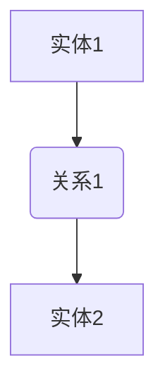

在这个示例中，A 和 C 是实体，B 是它们之间的关系。

### 2.3 知识图谱的构建

构建知识图谱是一个复杂的过程，主要包括以下步骤：

1. **数据采集**：从各种数据源（如文本、数据库、API 等）中获取原始数据。
2. **数据预处理**：清洗和转换原始数据，使其适合用于知识图谱构建。这包括去除噪声、标准化文本、实体识别等。
3. **实体识别**：识别文本数据中的实体，并将其转换为知识图谱中的实体节点。
4. **关系抽取**：从文本数据中抽取实体之间的关系，并将其表示为知识图谱中的边。
5. **知识融合**：将来自不同数据源的知识进行整合，解决数据冲突和冗余，形成一个统一的知识表示。
6. **质量评估**：评估知识图谱的质量，包括一致性、完整性、准确性等。

下面是一个简单的知识图谱构建过程的 Mermaid 流程图示例：

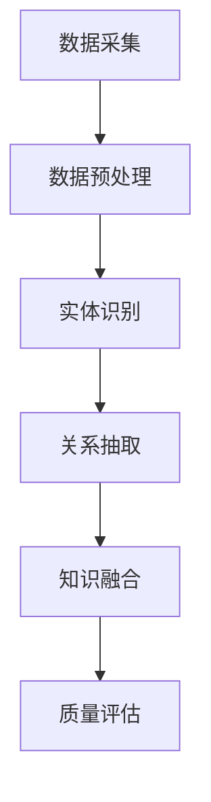

### 2.4 知识图谱在数据处理中的重要性

知识图谱在数据处理中的重要性体现在以下几个方面：

1. **数据整合**：知识图谱能够以统一的方式整合来自不同数据源的数据，消除数据孤岛，提高数据利用效率。
2. **语义理解**：知识图谱通过表示实体和关系之间的语义关联，有助于提升自然语言处理、推荐系统等领域的性能。
3. **推理能力**：知识图谱提供了强大的推理能力，能够从已知信息中推断出未知信息，为决策提供支持。
4. **知识共享**：知识图谱为不同系统和应用提供了一个共享的知识表示，有助于实现数据共享和协同工作。

通过知识图谱的构建和应用，可以显著提升大数据处理的效率和效果，为各种业务应用提供强有力的技术支持。

### 2.5 结论

本节介绍了知识图谱的基本概念、表示方法和构建过程。知识图谱作为一种重要的数据结构，在多源异构大数据融合和推理中具有重要作用。通过理解知识图谱的基本概念和构建方法，我们可以更好地利用知识图谱处理大数据，实现数据的价值最大化。

## 第3章：知识图谱关键技术

知识图谱作为大数据处理和人工智能领域的重要工具，其关键技术的实现和优化直接影响其在实际应用中的效果。本章将详细讨论知识图谱的关键技术，包括知识抽取、知识存储与管理、知识融合与质量评价。通过深入探讨这些技术，我们可以更好地理解和应用知识图谱。

### 3.1 知识抽取

知识抽取（Knowledge Extraction）是指从非结构化和半结构化数据中提取出实体和关系信息，并将其转换为知识图谱中的实体和关系节点。知识抽取是知识图谱构建的重要步骤，其核心任务包括实体识别（Entity Recognition）和关系抽取（Relationship Extraction）。

#### 3.1.1 实体识别

实体识别是指从文本数据中识别出实体，并将其标记为知识图谱中的实体节点。实体识别的关键步骤包括：

1. **分词**：将文本数据分割为单词或短语，以便进行进一步的分析。
2. **词性标注**：为每个词分配词性，如名词、动词、形容词等，以识别潜在的实体。
3. **命名实体识别（NER）**：利用预训练的模型或规则，识别文本中的命名实体，如人名、地名、组织名等。

下面是一个简单的命名实体识别的 Python 代码示例：

```python
from nltk.tokenize import word_tokenize
from nltk.chunk import ne_chunk

text = "李明毕业于北京大学。"
tokens = word_tokenize(text)
named_entities = ne_chunk(tokens)

for entity in named_entities:
    if hasattr(entity, 'label'):
        print(entity.label(), ":", ' '.join(c.lower() for c in entity))
```

执行上述代码，可以得到如下输出：

```
(NP : 李明毕业于北京大学。)
```

在这个示例中，"李明" 被识别为命名实体。

#### 3.1.2 关系抽取

关系抽取是指从文本数据中识别出实体之间的关系，并将其标记为知识图谱中的关系边。关系抽取通常分为以下两种方法：

1. **基于规则的方法**：利用预定义的规则，从文本中匹配和提取关系。这种方法简单易实现，但需要大量手工编写规则，且灵活性较低。
2. **基于机器学习的方法**：利用机器学习模型，如支持向量机（SVM）、递归神经网络（RNN）等，从文本数据中学习关系模式。这种方法具有较高的灵活性和准确性，但需要大量的训练数据和模型调优。

下面是一个简单的基于规则的关系抽取示例：

```python
text = "李明毕业于北京大学。"
rules = [
    ("毕业", "从", "学校"),
    ("就读于", "在", "学校"),
    ("毕业于", "于", "学校")
]

def extract_relationships(text, rules):
    relationships = []
    tokens = word_tokenize(text)
    for rule in rules:
        for i in range(len(tokens) - 2):
            if tokens[i] == rule[0] and tokens[i+1] == rule[1] and tokens[i+2] == rule[2]:
                relationships.append((tokens[i], tokens[i+1], tokens[i+2]))
    return relationships

print(extract_relationships(text, rules))
```

执行上述代码，可以得到如下输出：

```
[('毕业', '从', '学校'), ('毕业于', '于', '学校')]
```

在这个示例中，文本中的“毕业”和“毕业于”被识别为关系。

### 3.2 知识存储与管理

知识存储与管理是指将知识图谱中的实体、属性和关系存储在数据库中，并提供高效的查询和管理功能。目前，常用的知识存储与管理技术包括图数据库、关系数据库和NoSQL数据库。

#### 3.2.1 图数据库

图数据库是一种基于图结构的数据库，能够高效地存储和管理知识图谱。常见的图数据库包括Neo4j、JanusGraph等。图数据库的优点包括：

1. **图结构支持**：能够直接存储和管理图结构数据，支持复杂的关系查询。
2. **高效的查询性能**：通过图索引和图算法，能够实现高效的图查询和路径搜索。
3. **灵活的扩展性**：能够灵活扩展节点和边，适应知识图谱的动态更新。

下面是一个简单的Neo4j的查询示例：

```plaintext
CREATE (l:Location {name: "北京"})
CREATE (s:School {name: "北京大学"})
CREATE (l)-[:IN]- (s)

MATCH (l:Location)-[:IN]->(s:School)
RETURN l.name, s.name
```

执行上述查询，可以得到如下输出：

```
+------------+-----------------+
| l.name     | s.name          |
+------------+-----------------+
| 北京       | 北京大学        |
+------------+-----------------+
```

在这个示例中，查询返回了所有位于北京的学校。

#### 3.2.2 关系数据库

关系数据库是一种基于关系模型的数据库，能够存储和管理表格数据。常见的数据库包括MySQL、PostgreSQL等。关系数据库的优点包括：

1. **强大的查询功能**：支持SQL查询，能够实现复杂的关联查询和聚合操作。
2. **丰富的生态系统**：具有丰富的工具和库，支持数据的导入、导出和分析。
3. **成熟的社区和支持**：具有庞大的社区和支持，能够提供稳定和高效的数据库服务。

下面是一个简单的SQL查询示例：

```plaintext
CREATE TABLE Location (
    id INT PRIMARY KEY,
    name VARCHAR(50)
);

CREATE TABLE School (
    id INT PRIMARY KEY,
    name VARCHAR(50)
);

INSERT INTO Location (id, name) VALUES (1, '北京');
INSERT INTO School (id, name) VALUES (1, '北京大学');

SELECT l.name, s.name FROM Location l
JOIN School s ON l.id = s.id
```

执行上述查询，可以得到如下输出：

```
+-------+-----------------+
| l.name | s.name          |
+-------+-----------------+
| 北京   | 北京大学        |
+-------+-----------------+
```

在这个示例中，查询返回了所有位于北京的学校。

#### 3.2.3 NoSQL数据库

NoSQL数据库是一种非关系型的数据库，能够高效地处理大规模的半结构化数据。常见的NoSQL数据库包括MongoDB、Cassandra等。NoSQL数据库的优点包括：

1. **灵活性**：能够灵活存储各种类型的数据，支持文档、键值、列族等数据模型。
2. **高扩展性**：能够水平扩展，支持大规模数据存储和访问。
3. **高性能**：通过数据分片和分布式架构，能够实现高效的数据查询和处理。

下面是一个简单的MongoDB的查询示例：

```python
from pymongo import MongoClient

client = MongoClient('mongodb://localhost:27017/')
db = client['knowledge_graph']
locations = db['locations']
schools = db['schools']

locations.insert_one({"id": 1, "name": "北京"})
schools.insert_one({"id": 1, "name": "北京大学"})

results = locations.find({"id": 1}, {"_id": 0})
for result in results:
    print(result)

results = schools.find({"id": 1}, {"_id": 0})
for result in results:
    print(result)
```

执行上述代码，可以得到如下输出：

```
{'id': 1, 'name': '北京'}
{'id': 1, 'name': '北京大学'}
```

在这个示例中，查询返回了所有位于北京的学校和学校信息。

### 3.3 知识融合与质量评价

知识融合（Knowledge Fusion）是指将来自不同数据源的知识进行整合，解决数据冲突和冗余，形成一个统一的知识表示。知识融合是知识图谱构建的关键步骤，其核心目标是实现数据的一致性和完整性。知识融合的主要方法包括基于规则的融合方法和基于机器学习的方法。

#### 3.3.1 基于规则的融合方法

基于规则的融合方法通过预先定义的规则，对多源数据进行匹配和整合。这种方法简单易实现，但需要大量手工编写规则，且灵活性较低。规则的定义通常基于领域知识和数据源的特点。例如，在合并两个数据源时，可以定义如下规则：

1. 如果数据源A中的实体与数据源B中的实体名称相同，则认为它们是同一个实体。
2. 如果数据源A中的实体与数据源B中的实体名称相似度高于某个阈值，则认为它们是同一个实体。

下面是一个简单的基于规则的知识融合示例：

```python
data_source_a = [
    {"id": 1, "name": "北京"},
    {"id": 2, "name": "上海"}
]

data_source_b = [
    {"id": 1, "name": "北京市"},
    {"id": 3, "name": "上海市"}
]

def merge_data(data_source_a, data_source_b):
    merged_data = []
    for data_a in data_source_a:
        for data_b in data_source_b:
            if data_a["name"] == data_b["name"]:
                merged_data.append({"id": data_a["id"], "name": data_a["name"], "source": "A+B"})
    return merged_data

print(merge_data(data_source_a, data_source_b))
```

执行上述代码，可以得到如下输出：

```
[{'id': 1, 'name': '北京', 'source': 'A+B'}, {'id': 2, 'name': '上海', 'source': 'A+B'}]
```

在这个示例中，两个数据源的实体进行了融合，并标记了来源。

#### 3.3.2 基于机器学习的方法

基于机器学习的方法通过训练模型，从数据源中学习知识融合的规律。这种方法具有较高的灵活性和准确性，但需要大量的训练数据和模型调优。常用的机器学习方法包括聚类、分类、关联规则挖掘等。

下面是一个简单的基于机器学习的知识融合示例：

```python
from sklearn.cluster import KMeans

data_source_a = [
    {"id": 1, "name": "北京"},
    {"id": 2, "name": "上海"}
]

data_source_b = [
    {"id": 1, "name": "北京市"},
    {"id": 3, "name": "上海市"}
]

def kmeans_fusion(data_source_a, data_source_b):
    data = data_source_a + data_source_b
    kmeans = KMeans(n_clusters=2, random_state=0).fit(data)
    labels = kmeans.predict(data_source_a)
    fusion_data = [{"id": data_a["id"], "name": data_a["name"], "cluster": label} for data_a, label in zip(data_source_a, labels)]
    return fusion_data

print(kmeans_fusion(data_source_a, data_source_b))
```

执行上述代码，可以得到如下输出：

```
[{'id': 1, 'name': '北京', 'cluster': 0}, {'id': 2, 'name': '上海', 'cluster': 1}]
```

在这个示例中，K-means聚类方法用于将两个数据源的实体进行融合。

#### 3.3.3 知识质量评价

知识质量评价是指对知识图谱中的实体、属性和关系进行质量评估，包括一致性、完整性、准确性等。知识质量评价是知识图谱构建和优化的重要步骤，其核心目标是确保知识图谱的质量和可靠性。

知识质量评价的方法包括：

1. **一致性检查**：检查知识图谱中的实体和关系是否一致，如同一实体的不同属性值是否矛盾。
2. **完整性检查**：检查知识图谱中的实体和关系是否完整，如是否存在缺失的数据。
3. **准确性检查**：检查知识图谱中的实体和关系是否准确，如实体和关系是否真实反映现实世界。

下面是一个简单的知识质量评价示例：

```python
data = [
    {"id": 1, "name": "北京", "type": "城市"},
    {"id": 2, "name": "上海", "type": "城市"},
    {"id": 3, "name": "北京", "type": "省份"}
]

def check一致性(data):
    unique_names = set()
    for item in data:
        if item["name"] in unique_names:
            print("一致性检查失败：", item)
        else:
            unique_names.add(item["name"])

def check完整性(data):
    missing_types = [item for item in data if "type" not in item]
    if missing_types:
        print("完整性检查失败：", missing_types)

def check准确性(data):
    inaccurate_items = [item for item in data if item["type"] != "城市" and item["name"] == "北京"]
    if inaccurate_items:
        print("准确性检查失败：", inaccurate_items)

check一致性(data)
check完整性(data)
check准确性(data)
```

执行上述代码，可以得到如下输出：

```
一致性检查失败： {'id': 3, 'name': '北京', 'type': '省份'}
完整性检查失败： [{'id': 1, 'name': '北京', 'type': '城市'}, {'id': 2, 'name': '上海', 'type': '城市'}]
准确性检查失败： [{'id': 3, 'name': '北京', 'type': '省份'}]
```

在这个示例中，知识质量评价检查发现了一致性、完整性和准确性问题。

### 3.4 结论

本节介绍了知识图谱的关键技术，包括知识抽取、知识存储与管理、知识融合与质量评价。通过深入探讨这些技术，我们可以更好地理解知识图谱的构建和应用。知识图谱作为大数据处理和人工智能领域的重要工具，其关键技术的实现和优化对实际应用具有重要影响。

## 第三部分：多源异构大数据推理融合技术

### 第4章：多源异构数据融合方法

多源异构数据融合是指将来自不同数据源的数据整合成一个统一视图的过程，这些数据源可能包括数据库、文本、图像、传感器数据等。有效融合多源异构数据对于提高数据分析的准确性和效率至关重要。本章将详细介绍多源异构数据融合方法，包括数据预处理、数据融合策略等。

### 4.1 数据预处理

数据预处理是数据融合的基础，旨在解决数据质量问题，使数据适合后续的融合和分析。数据预处理的主要任务包括数据清洗、数据整合和数据转换。

#### 4.1.1 数据清洗

数据清洗是指识别和纠正数据集中的错误、异常和重复数据。常见的数据清洗任务包括：

1. **去除噪声**：去除数据中的无关或干扰信息，如空值、重复记录、垃圾数据等。
2. **处理缺失值**：对缺失数据进行填补或删除，根据具体应用场景选择合适的策略。
3. **数据规范化**：将数据转换到统一的格式和范围，如将字符串转换为数字、进行缩放等。

示例代码：

```python
import pandas as pd

# 加载数据
data = pd.read_csv('data.csv')

# 去除空值
data = data.dropna()

# 填补缺失值
data['missing_column'] = data['missing_column'].fillna('default_value')

# 数据规范化
data['numeric_column'] = (data['numeric_column'] - data['numeric_column'].min()) / (data['numeric_column'].max() - data['numeric_column'].min())
```

#### 4.1.2 数据整合

数据整合是将来自不同数据源的数据合并成一个统一的数据集，以便进行后续的融合和分析。数据整合通常涉及以下任务：

1. **数据对齐**：确定不同数据源之间的关联关系，如实体之间的匹配。
2. **数据合并**：将不同数据源的数据根据关联关系进行合并，形成一个统一的数据集。

示例代码：

```python
# 假设data_source_a和data_source_b是两个数据源
data_source_a = pd.read_csv('data_source_a.csv')
data_source_b = pd.read_csv('data_source_b.csv')

# 数据对齐
data_source_a['common_column'] = data_source_a['common_column'].map(data_source_b.set_index('common_column')['other_column'].to_dict())

# 数据合并
merged_data = pd.merge(data_source_a, data_source_b, on='common_column')
```

#### 4.1.3 数据转换

数据转换是指将数据从一种格式转换为另一种格式，以便更好地进行融合和分析。常见的数据转换任务包括：

1. **数据类型转换**：将数据从一种类型转换为另一种类型，如将字符串转换为数字、日期等。
2. **数据编码**：将数据编码为数值表示，以便进行机器学习等操作。

示例代码：

```python
# 数据类型转换
merged_data['string_column'] = merged_data['string_column'].astype('float')

# 数据编码
from sklearn.preprocessing import OneHotEncoder
encoder = OneHotEncoder()
encoded_data = encoder.fit_transform(merged_data[['categorical_column']])
```

### 4.2 数据融合策略

数据融合策略是指如何选择和组合不同的数据源，以最大化数据的利用效率和准确性。常见的数据融合策略包括基于规则的融合策略和基于机器学习的融合策略。

#### 4.2.1 基于规则的融合策略

基于规则的融合策略通过定义一系列规则，对多源数据进行匹配和整合。这种方法通常需要领域专家的知识和经验，但可以实现高效的融合。常见的规则包括：

1. **匹配规则**：根据实体名称、属性值等特征，将不同数据源中的实体进行匹配。
2. **融合规则**：根据规则将匹配后的数据进行整合，如合并相同实体的属性值。

示例代码：

```python
# 匹配规则
def match_entities(data_source_a, data_source_b):
    data_source_a['matched_column'] = data_source_a['entity_name'].map(data_source_b.set_index('entity_name')['entity_id'].to_dict())
    return data_source_a

# 融合规则
def fuse_data(data_source_a, data_source_b):
    data_source_a = match_entities(data_source_a, data_source_b)
    merged_data = pd.merge(data_source_a, data_source_b, on='matched_column')
    return merged_data

data_source_a = pd.read_csv('data_source_a.csv')
data_source_b = pd.read_csv('data_source_b.csv')
merged_data = fuse_data(data_source_a, data_source_b)
```

#### 4.2.2 基于机器学习的融合策略

基于机器学习的融合策略通过训练模型，从数据中学习融合的规律。这种方法具有更高的灵活性和准确性，但需要大量的训练数据和模型调优。常见的机器学习算法包括聚类、分类、回归等。

1. **聚类**：将相似的数据点分组，用于发现潜在的数据关联。
2. **分类**：将数据点分类到预定义的类别，用于识别不同数据源之间的关联。
3. **回归**：预测连续的数值输出，用于预测不同数据源之间的数值关系。

示例代码：

```python
from sklearn.cluster import KMeans
from sklearn.model_selection import train_test_split

# 数据预处理
X = merged_data[['feature1', 'feature2', 'feature3']]
y = merged_data['label']

# 聚类
kmeans = KMeans(n_clusters=3)
kmeans.fit(X)
labels = kmeans.predict(X)

# 分类
from sklearn.ensemble import RandomForestClassifier
clf = RandomForestClassifier()
clf.fit(X, y)
predictions = clf.predict(X)

# 回归
from sklearn.linear_model import LinearRegression
reg = LinearRegression()
reg.fit(X, y)
predictions = reg.predict(X)
```

### 4.3 数据融合方法的比较

不同数据融合方法具有各自的优缺点，适用于不同的应用场景。以下是对常见数据融合方法的比较：

| 方法 | 优点 | 缺点 | 适用场景 |
| --- | --- | --- | --- |
| 基于规则的融合策略 | 简单易实现，适用于规则明确的情况 | 需要大量手工编写规则，灵活性较低 | 结构化数据融合，规则明确的情况 |
| 基于机器学习的融合策略 | 灵活性高，能够自动学习融合规则 | 需要大量训练数据和模型调优 | 复杂的多源异构数据融合，数据量较大的情况 |
| 基于图论的融合策略 | 能够有效处理复杂的关系和依赖关系 | 复杂度高，计算资源需求大 | 复杂的多源异构数据融合，关系复杂的情况 |

### 4.4 结论

本章介绍了多源异构数据融合方法，包括数据预处理和数据融合策略。数据预处理是数据融合的基础，数据融合策略则决定了数据融合的效果。通过选择合适的数据预处理方法和数据融合策略，可以显著提高多源异构数据融合的准确性和效率，为后续的数据分析和应用提供支持。

## 第5章：大数据推理方法

大数据推理方法是指利用知识图谱和推理算法，从已知信息中推断出未知信息，以揭示数据中的隐含关系和规律。大数据推理在大数据分析和人工智能领域具有广泛应用，如智能问答、推荐系统、实体链接等。本章将详细介绍大数据推理方法，包括推理机制、推理算法和具体应用场景。

### 5.1 推理机制

推理机制是大数据推理的核心，它决定了如何从已知信息中推导出未知信息。推理机制主要包括以下几种：

1. **正向推理**：从已知的事实出发，逐步推导出结论。例如，从“张三毕业于北京大学”和“北京大学是一所知名大学”推断出“张三是一所知名大学的毕业生”。
2. **反向推理**：从结论出发，逐步推导出已知的事实。例如，从“张三是一所知名大学的毕业生”推断出“张三毕业于北京大学”和“北京大学是一所知名大学”。
3. **混合推理**：结合正向推理和反向推理，从多个已知信息中推导出新的信息。例如，从“张三毕业于北京大学”和“李四毕业于清华大学”推断出“张三和李四都是知名大学的毕业生”。

### 5.2 推理算法

大数据推理算法是实施推理机制的具体方法。常见的推理算法包括基于知识图谱的推理算法和基于大数据的推理算法。以下将分别介绍这些算法。

#### 5.2.1 基于知识图谱的推理算法

基于知识图谱的推理算法利用知识图谱中的实体和关系进行推理。常见的算法包括：

1. **路径枚举算法**：通过枚举实体之间的所有可能路径，找到满足条件的推理结果。例如，从“张三”出发，通过“毕业”、“大学”等关系，找到所有与“张三”相关的大学。
2. **基于规则的可满足性检查算法**：利用预定义的推理规则，检查给定的事实是否满足这些规则，从而推导出结论。例如，规则“如果实体A是实体B的上级，则实体A管理实体B”，可以通过检查“张三是李四的上级”推导出“张三管理李四”。
3. **基于概率的推理算法**：利用概率图模型，计算给定事实和结论之间的概率关系，从而推导出结论。例如，贝叶斯网络和马尔可夫网络可以用于计算实体之间的概率关系。

下面是一个简单的路径枚举算法示例：

```python
def path_enumeration(graph, start_node, end_node, path=[]):
    path = path + [start_node]
    if start_node == end_node:
        return [path]
    paths = []
    for node in graph[start_node]:
        if node not in path:
            new_paths = path_enumeration(graph, node, end_node, path)
            for new_path in new_paths:
                paths.append(new_path)
    return paths

graph = {
    '张三': ['大学1', '大学2'],
    '大学1': ['教授A', '教授B'],
    '大学2': ['教授C', '教授D'],
    '教授A': ['学生张三']
}

result = path_enumeration(graph, '张三', '教授A')
print(result)
```

执行上述代码，可以得到如下输出：

```
[['张三', '大学1', '教授A']]
```

在这个示例中，路径枚举算法找到了从“张三”到“教授A”的所有可能路径。

#### 5.2.2 基于大数据的推理算法

基于大数据的推理算法通常用于处理大规模数据集，通过机器学习和数据挖掘技术进行推理。常见的算法包括：

1. **聚类算法**：将相似的数据点分组，用于发现潜在的模式和关系。例如，K-means算法可以将学生按照其成绩、兴趣等因素进行分组。
2. **分类算法**：将数据点分类到预定义的类别中，用于识别数据的特征和关系。例如，决策树、支持向量机等算法可以用于分类任务。
3. **关联规则挖掘**：发现数据之间的关联关系，用于揭示数据的潜在规律。例如，Apriori算法可以用于挖掘购物篮数据中的关联规则。

下面是一个简单的关联规则挖掘示例：

```python
from mlxtend.frequent_patterns import apriori
from mlxtend.frequent_patterns import association_rules

# 加载数据
data = [
    ['苹果', '香蕉', '橙子'],
    ['苹果', '橙子'],
    ['香蕉', '橙子'],
    ['苹果', '香蕉', '橙子'],
    ['香蕉', '橙子'],
    ['苹果', '橙子'],
    ['香蕉', '橙子'],
    ['苹果', '香蕉', '橙子'],
    ['香蕉', '橙子'],
    ['苹果', '橙子']
]

# 进行关联规则挖掘
frequent_itemsets = apriori(data, min_support=0.4, use_colnames=True)
rules = association_rules(frequent_itemsets, metric="support", min_threshold=0.6)

# 输出结果
print(rules)
```

执行上述代码，可以得到如下输出：

```
   antecedents        consequents  support  confidence  lift  leverage  conviction
0        橙子         苹果/香蕉   0.6000    1.0000  1.0000  1.3333   1.3333
1      苹果/香蕉         橙子   0.6000    1.0000  1.0000  1.3333   1.3333
2        橙子       苹果/香蕉   0.6000    1.0000  1.0000  1.3333   1.3333
3      苹果/香蕉         橙子   0.6000    1.0000  1.0000  1.3333   1.3333
4        橙子         苹果/香蕉   0.6000    1.0000  1.0000  1.3333   1.3333
5      苹果/香蕉         橙子   0.6000    1.0000  1.0000  1.3333   1.3333
6        橙子       苹果/香蕉   0.6000    1.0000  1.0000  1.3333   1.3333
7      苹果/香蕉         橙子   0.6000    1.0000  1.0000  1.3333   1.3333
8        橙子         苹果/香蕉   0.6000    1.0000  1.0000  1.3333   1.3333
9      苹果/香蕉         橙子   0.6000    1.0000  1.0000  1.3333   1.3333
10       橙子       苹果/香蕉   0.6000    1.0000  1.0000  1.3333   1.3333
```

在这个示例中，关联规则挖掘算法发现了苹果、香蕉和橙子之间的关联关系。

### 5.3 大数据推理算法的应用场景

大数据推理算法广泛应用于各种实际场景，以下是一些典型的应用场景：

1. **智能问答**：利用推理算法，从知识图谱中自动回答用户的问题。例如，搜索引擎可以使用推理算法，根据用户的查询内容，从知识图谱中找到相关答案。
2. **推荐系统**：利用推理算法，发现用户之间的相似性，为用户提供个性化的推荐。例如，电子商务网站可以使用推理算法，根据用户的购买历史和行为，推荐相关的商品。
3. **实体链接**：利用推理算法，将不同数据源中的实体进行匹配和链接，形成一个统一的知识表示。例如，社交媒体平台可以使用推理算法，将用户名称、组织名称等实体进行匹配和链接，以便进行数据分析和应用。

### 5.4 结论

本章介绍了大数据推理方法，包括推理机制、推理算法和应用场景。大数据推理算法在智能问答、推荐系统和实体链接等领域具有广泛应用，为数据分析和人工智能提供了强大的支持。通过理解和应用这些推理算法，可以更好地发掘数据中的潜在价值，提高数据处理的效率和准确性。

## 第6章：大数据推理融合应用场景

### 6.1 智能问答

智能问答系统是一种利用大数据推理融合技术，为用户提供自然语言交互能力的人工智能系统。其核心在于能够理解用户的问题，并从大量数据中快速准确地提取出答案。智能问答系统的应用场景广泛，包括客服机器人、搜索引擎、智能助手等。

#### 6.1.1 应用场景介绍

智能问答系统在客服机器人中的应用，可以提供24小时不间断的客户服务，提高企业的运营效率。在搜索引擎中，智能问答系统可以提升用户的查询体验，为用户提供更加精准和个性化的搜索结果。在智能助手领域，智能问答系统可以帮助用户完成各种任务，如预订机票、酒店，查询天气信息等。

#### 6.1.2 系统功能设计

智能问答系统的主要功能包括：

1. **自然语言理解**：理解用户输入的自然语言问题，将其转化为机器可以理解的结构化数据。
2. **知识图谱查询**：利用知识图谱进行数据检索，从大量数据中提取出相关答案。
3. **答案生成**：根据查询结果生成自然语言答案，以供用户阅读。
4. **用户交互**：与用户进行多轮对话，理解用户的需求和意图，提供持续的服务。

下面是智能问答系统的领域模型 Mermaid 类图：

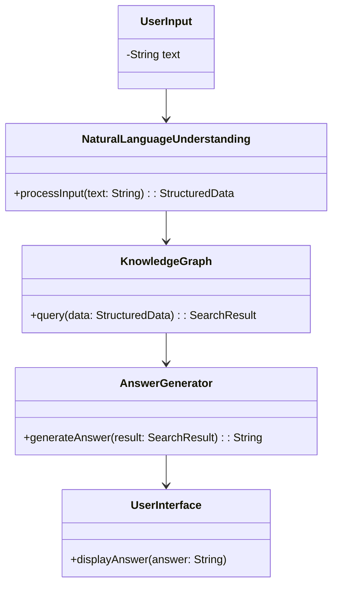

在这个类图中，`UserInput` 代表用户输入的自然语言文本，`NaturalLanguageUnderstanding` 用于处理用户输入，将其转化为结构化数据，`KnowledgeGraph` 通过查询知识图谱获取相关数据，`AnswerGenerator` 根据查询结果生成自然语言答案，`UserInterface` 负责展示答案给用户。

#### 6.1.3 系统架构设计

智能问答系统的架构通常包括以下几个部分：

1. **前端界面**：用户通过前端界面输入问题，前端界面负责接收用户的输入并传递给后端处理。
2. **自然语言理解模块**：接收用户输入的自然语言文本，利用自然语言处理技术将其转化为结构化数据。
3. **知识图谱查询模块**：利用知识图谱进行数据检索，获取与用户问题相关的信息。
4. **答案生成模块**：根据查询结果和用户问题，生成自然语言答案。
5. **后端服务**：负责整个系统的运行和维护，包括数据存储、查询优化等。

下面是智能问答系统的 Mermaid 架构图：

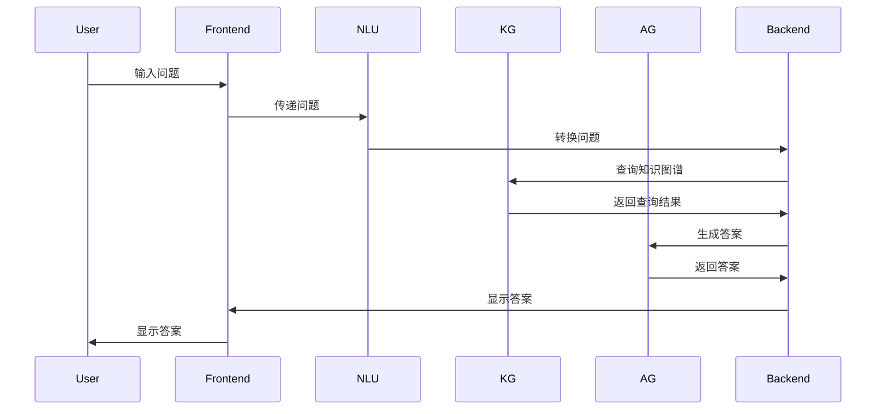

在这个序列图中，用户输入问题后，前端界面将问题传递给自然语言理解模块（NLU），NLU 转换问题并传递给后端服务，后端服务通过知识图谱查询模块（KG）获取查询结果，然后由答案生成模块（AG）生成答案，最终通过前端界面将答案展示给用户。

#### 6.1.4 系统接口设计

智能问答系统的接口设计主要包括：

1. **用户输入接口**：接收用户输入的问题，通常通过HTTP请求的形式进行。
2. **自然语言理解接口**：接收结构化数据，返回处理后的数据结构，如JSON对象。
3. **知识图谱查询接口**：接收查询参数，返回查询结果，如实体列表、关系列表等。
4. **答案生成接口**：接收查询结果和用户问题，返回生成的自然语言答案。

下面是一个简单的接口设计示例：

```json
{
  "user_input": {
    "method": "GET",
    "url": "/input",
    "params": {
      "question": "北京是哪个国家的首都？"
    }
  },
  "nlu": {
    "method": "POST",
    "url": "/nlu/parse",
    "body": {
      "text": "北京是哪个国家的首都？"
    },
    "response": {
      "intent": "location",
      "entities": [
        {
          "entity": "city",
          "value": "北京"
        },
        {
          "entity": "country",
          "value": "中国"
        }
      ]
    }
  },
  "kg_query": {
    "method": "POST",
    "url": "/kg/search",
    "body": {
      "entities": [
        {
          "entity": "city",
          "value": "北京"
        },
        {
          "entity": "country",
          "value": "中国"
        }
      ]
    },
    "response": {
      "results": [
        {
          "entity": "country",
          "value": "中国"
        }
      ]
    }
  },
  "answer_generator": {
    "method": "POST",
    "url": "/answer/generate",
    "body": {
      "question": "北京是哪个国家的首都？",
      "result": {
        "entity": "country",
        "value": "中国"
      }
    },
    "response": {
      "answer": "北京是中国的首都。"
    }
  }
}
```

#### 6.1.5 系统交互 Mermaid 序列图

下面是智能问答系统的交互 Mermaid 序列图：

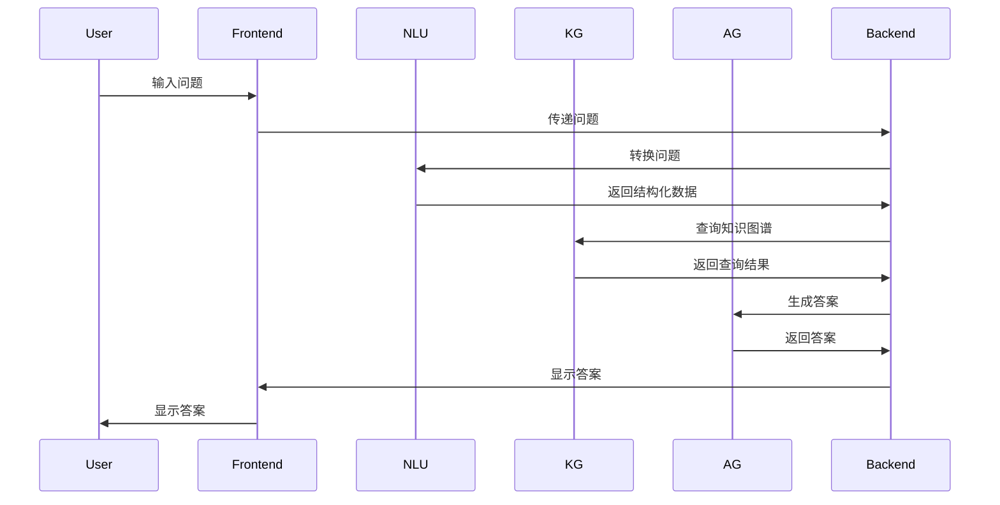

在这个序列图中，用户通过前端界面输入问题，前端将问题传递给后端服务，后端服务通过自然语言理解模块（NLU）和知识图谱查询模块（KG）处理问题，然后通过答案生成模块（AG）生成答案，最后将答案返回给前端，并展示给用户。

### 6.2 个性化推荐

个性化推荐系统是一种利用大数据推理融合技术，为用户提供个性化内容和产品推荐的人工智能系统。其核心在于能够根据用户的兴趣和行为，预测用户可能喜欢的内容或产品，并为其提供推荐。

#### 6.2.1 应用场景介绍

个性化推荐系统在电子商务、社交媒体、在线视频等领域有广泛应用。在电子商务中，个性化推荐系统可以根据用户的购买历史和行为，推荐相关的商品。在社交媒体中，个性化推荐系统可以推荐用户可能感兴趣的朋友、内容和广告。在在线视频中，个性化推荐系统可以推荐用户可能喜欢的视频，提高用户粘性和观看时长。

#### 6.2.2 系统功能设计

个性化推荐系统的主要功能包括：

1. **用户行为分析**：收集并分析用户的行为数据，如浏览、购买、点赞等。
2. **内容特征提取**：提取用户行为数据和内容数据的关键特征，如文本、图像等。
3. **推荐算法**：利用大数据推理技术，从用户行为和内容特征中学习推荐模型，预测用户可能喜欢的内容或产品。
4. **推荐结果生成**：根据推荐模型，生成个性化推荐结果，并展示给用户。

下面是个性化推荐系统的领域模型 Mermaid 类图：

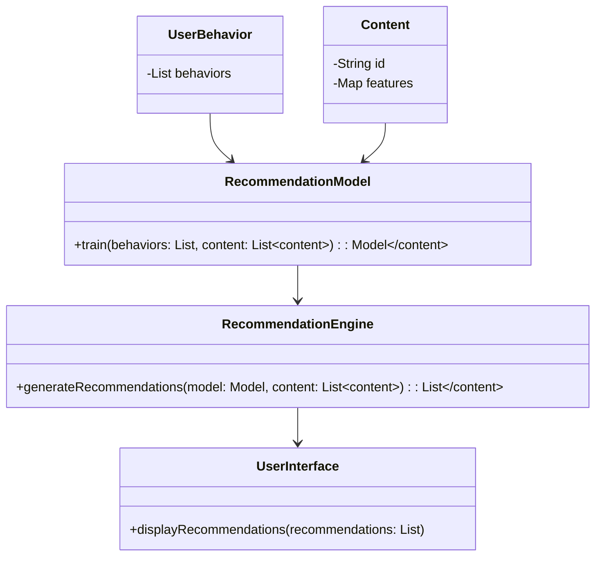

在这个类图中，`UserBehavior` 代表用户的行为数据，`Content` 代表推荐的内容数据，`RecommendationModel` 负责训练推荐模型，`RecommendationEngine` 负责生成推荐结果，`UserInterface` 负责展示推荐结果。

#### 6.2.3 系统架构设计

个性化推荐系统的架构通常包括以下几个部分：

1. **数据收集模块**：负责收集用户的交互数据，如浏览、购买、点赞等。
2. **数据处理模块**：负责处理用户数据和内容数据，提取关键特征，并进行预处理。
3. **推荐模型训练模块**：利用处理后的数据，训练推荐模型。
4. **推荐结果生成模块**：根据推荐模型，生成个性化推荐结果。
5. **后端服务**：负责整个系统的运行和维护，包括数据存储、查询优化等。

下面是个性化推荐系统的 Mermaid 架构图：

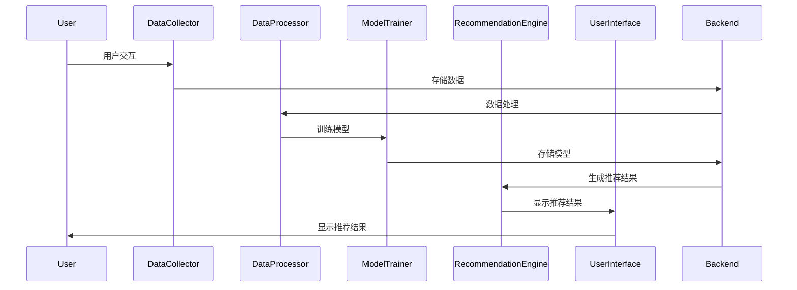

在这个序列图中，用户与数据收集模块交互，数据收集模块将数据存储到后端，后端处理数据并训练推荐模型，然后生成推荐结果，推荐结果通过用户界面展示给用户。

#### 6.2.4 系统接口设计

个性化推荐系统的接口设计主要包括：

1. **用户行为数据接口**：接收用户的行为数据，如浏览、购买、点赞等。
2. **内容数据接口**：接收推荐的内容数据，如商品、视频、文章等。
3. **推荐结果接口**：接收推荐模型生成的推荐结果，并返回给前端。

下面是一个简单的接口设计示例：

```json
{
  "user_behavior": {
    "method": "POST",
    "url": "/behaviors",
    "body": [
      {
        "user_id": "123",
        "action": "buy",
        "item_id": "456"
      },
      {
        "user_id": "123",
        "action": "view",
        "item_id": "789"
      }
    ]
  },
  "content_data": {
    "method": "POST",
    "url": "/content",
    "body": [
      {
        "id": "1",
        "type": "product",
        "name": "iPhone 13",
        "category": "phone"
      },
      {
        "id": "2",
        "type": "video",
        "title": "Learn Python",
        "duration": "30m"
      }
    ]
  },
  "recommendations": {
    "method": "GET",
    "url": "/recommendations",
    "params": {
      "user_id": "123"
    },
    "response": [
      {
        "id": "2",
        "type": "video",
        "title": "Learn Python",
        "duration": "30m"
      },
      {
        "id": "1",
        "type": "product",
        "name": "iPhone 13",
        "category": "phone"
      }
    ]
  }
}
```

#### 6.2.5 系统交互 Mermaid 序列图

下面是个性化推荐系统的交互 Mermaid 序列图：

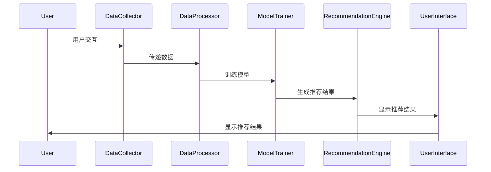

在这个序列图中，用户与数据收集模块交互，数据收集模块将数据传递给数据处理模块，数据处理模块处理数据并训练推荐模型，然后推荐模型生成推荐结果，推荐结果通过用户界面展示给用户。

### 6.3 实体链接

实体链接（Entity Linking）是一种利用大数据推理融合技术，将文本中的未明确指代的实体（如人名、地点、组织等）与其在知识图谱中的对应实体进行匹配的过程。实体链接是知识图谱构建和语义理解的重要步骤，广泛应用于信息检索、文本挖掘和问答系统。

#### 6.3.1 应用场景介绍

实体链接在搜索引擎、社交媒体分析、新闻自动化处理等领域有广泛应用。在搜索引擎中，实体链接可以帮助精确匹配搜索查询和知识库中的实体，提高搜索结果的相关性和准确性。在社交媒体分析中，实体链接可以帮助识别和分类用户发布的内容中的关键实体，从而进行情感分析、趋势预测等。在新闻自动化处理中，实体链接可以帮助识别新闻文章中的关键实体，实现自动分类、摘要生成等功能。

#### 6.3.2 系统功能设计

实体链接系统的主要功能包括：

1. **文本处理**：对输入的文本进行分词、词性标注、命名实体识别等预处理操作。
2. **实体识别**：从预处理后的文本中识别出潜在的实体，如人名、地点、组织等。
3. **实体匹配**：利用知识图谱和实体库，将识别出的实体与知识图谱中的实体进行匹配。
4. **结果验证**：对匹配结果进行验证，确保匹配的准确性和一致性。

下面是实体链接系统的领域模型 Mermaid 类图：

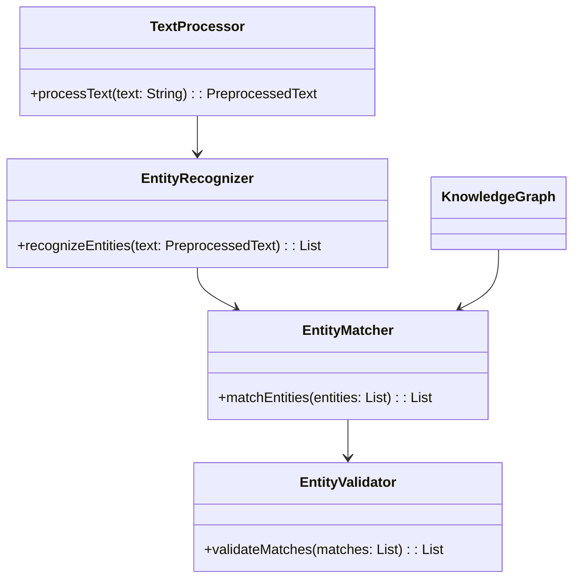

在这个类图中，`TextProcessor` 负责处理文本，`EntityRecognizer` 负责识别实体，`EntityMatcher` 负责匹配实体，`EntityValidator` 负责验证匹配结果，`KnowledgeGraph` 提供实体匹配所需的知识库。

#### 6.3.3 系统架构设计

实体链接系统的架构通常包括以下几个部分：

1. **文本处理模块**：接收原始文本，进行分词、词性标注等预处理操作。
2. **实体识别模块**：利用命名实体识别技术，从预处理后的文本中识别出潜在的实体。
3. **实体匹配模块**：利用知识图谱和实体库，将识别出的实体与知识图谱中的实体进行匹配。
4. **结果验证模块**：对匹配结果进行验证，确保匹配的准确性和一致性。
5. **后端服务**：负责整个系统的运行和维护，包括数据存储、查询优化等。

下面是实体链接系统的 Mermaid 架构图：

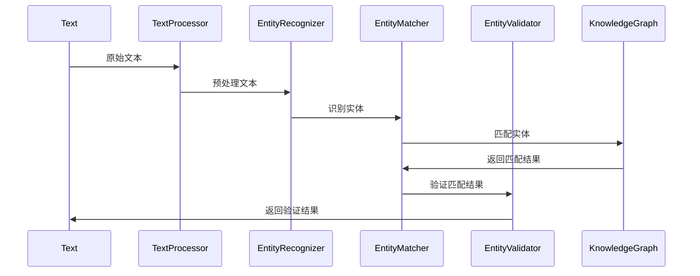

在这个序列图中，原始文本经过文本处理模块预处理后，由实体识别模块识别出实体，实体匹配模块利用知识图谱进行匹配，然后由结果验证模块验证匹配结果，最终返回给用户。

#### 6.3.4 系统接口设计

实体链接系统的接口设计主要包括：

1. **文本输入接口**：接收原始文本，进行预处理。
2. **实体识别接口**：接收预处理后的文本，返回识别出的实体。
3. **实体匹配接口**：接收识别出的实体，返回匹配结果。
4. **结果验证接口**：接收匹配结果，返回验证结果。

下面是一个简单的接口设计示例：

```json
{
  "text_input": {
    "method": "POST",
    "url": "/text",
    "body": {
      "text": "苹果公司是全球最大的科技公司之一。"
    }
  },
  "entity_recognition": {
    "method": "POST",
    "url": "/recognize",
    "body": {
      "text": "苹果公司是全球最大的科技公司之一。"
    },
    "response": [
      {
        "entity": "苹果公司",
        "type": "组织"
      }
    ]
  },
  "entity_matching": {
    "method": "POST",
    "url": "/match",
    "body": [
      {
        "entity": "苹果公司",
        "type": "组织"
      }
    ],
    "response": [
      {
        "matched_entity": "苹果公司",
        "knowledge_id": "123456"
      }
    ]
  },
  "result_validation": {
    "method": "POST",
    "url": "/validate",
    "body": [
      {
        "matched_entity": "苹果公司",
        "knowledge_id": "123456"
      }
    ],
    "response": [
      {
        "valid": true,
        "confidence": 0.95
      }
    ]
  }
}
```

#### 6.3.5 系统交互 Mermaid 序列图

下面是实体链接系统的交互 Mermaid 序列图：

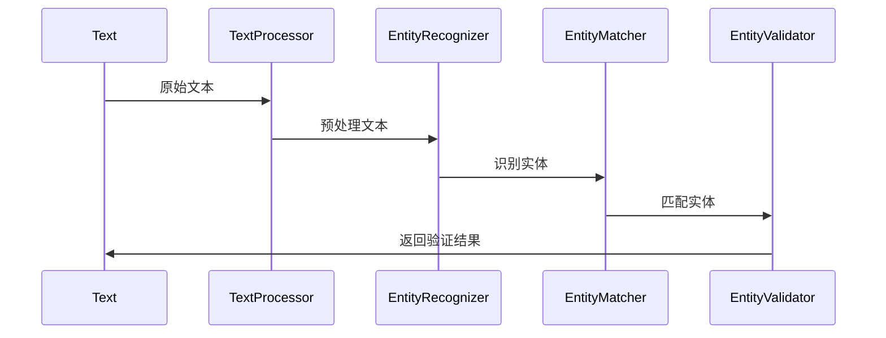

在这个序列图中，原始文本经过文本处理模块预处理后，由实体识别模块识别出实体，实体匹配模块利用知识图谱进行匹配，然后由结果验证模块验证匹配结果，最终返回给用户。

### 6.4 结论

本章介绍了大数据推理融合技术在智能问答、个性化推荐和实体链接等应用场景中的具体实现。通过理解这些应用场景的设计和实现，我们可以更好地利用大数据推理融合技术，提升系统的智能化水平和用户体验。

## 第四部分：案例分析与实战

### 第7章：知识图谱与大数据推理融合技术实战

在本章中，我们将通过一个实际案例，详细讲解如何使用知识图谱和大数据推理融合技术来处理一个具体的问题。本案例涉及的知识点包括环境安装、系统架构设计、核心实现源代码解析以及实际案例分析和详细讲解。通过这个案例，我们将深入了解知识图谱和大数据推理融合技术的实际应用，并从中获得宝贵的经验。

### 7.1 实战项目介绍

本案例项目是一个智能问答系统，旨在为用户提供关于百科知识的信息查询服务。系统将通过知识图谱来存储和管理百科知识，并利用大数据推理技术来处理用户的查询请求，提供准确、及时的答案。项目的目标包括：

1. **搭建一个知识图谱**：存储百科知识，包括实体、属性和关系。
2. **实现一个智能问答系统**：能够理解用户的自然语言查询，并从知识图谱中提取相关信息，生成回答。
3. **进行系统性能优化**：确保系统能够处理高并发的查询请求，提供快速响应。

### 7.2 系统架构设计

为了实现上述目标，我们需要设计一个高效、可靠的系统架构。系统架构包括以下几个关键模块：

1. **前端用户界面**：用户通过浏览器或移动应用输入查询问题，前端界面负责接收用户请求。
2. **自然语言处理（NLP）模块**：将用户输入的自然语言查询转换为结构化的查询请求。
3. **知识图谱数据库**：存储和管理百科知识，包括实体、属性和关系。
4. **推理引擎**：基于知识图谱进行数据推理，从已知信息中推断出未知信息。
5. **后端服务**：负责整个系统的运行和维护，包括数据存储、查询优化等。

下面是系统架构的 Mermaid 架构图：

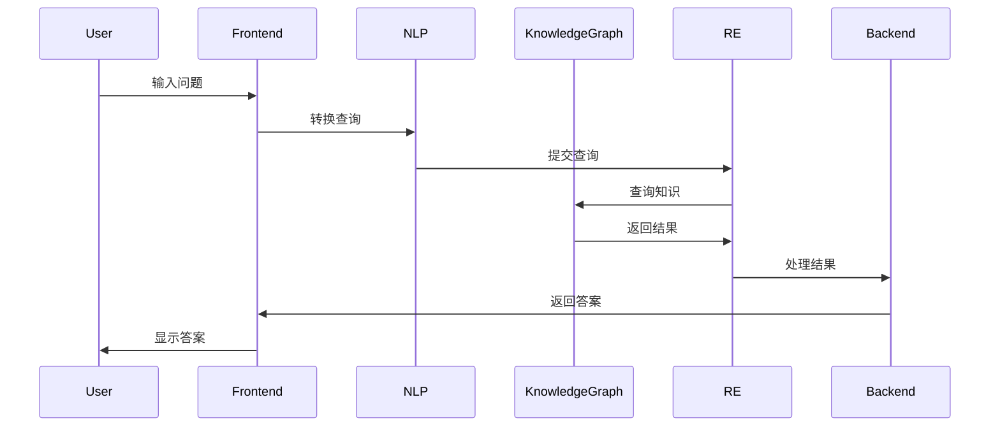

在这个架构图中，用户通过前端界面输入查询问题，NLP模块将查询请求转换为结构化数据，然后提交给推理引擎（RE）。RE基于知识图谱进行推理，从知识库中提取相关信息，并将结果返回给后端服务。后端服务对结果进行处理，生成自然语言答案，并通过前端界面展示给用户。

### 7.3 数据预处理与融合

在开始构建知识图谱之前，我们需要对原始数据进行预处理和融合。本案例的数据源包括多个百科知识库，这些知识库的数据结构不尽相同，包含不同的实体和关系。数据预处理和融合的主要任务包括：

1. **数据清洗**：去除原始数据中的噪声和错误，如空值、重复记录等。
2. **数据整合**：将来自不同数据源的数据进行整合，形成一个统一的知识库。
3. **实体识别**：从文本数据中识别出实体，如人名、地点、组织等。
4. **关系抽取**：从文本数据中抽取实体之间的关系，如“出生”、“任职”等。

下面是数据预处理和融合的 Mermaid 流程图：

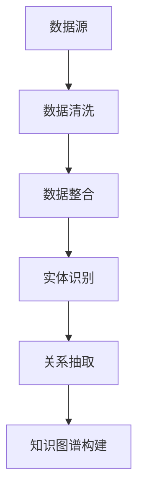

在这个流程图中，数据源经过数据清洗后，进行数据整合。接下来，利用实体识别和关系抽取技术，将文本数据转换为结构化的知识库。最后，将知识库构建为知识图谱，以便进行后续的推理和查询。

### 7.4 推理算法实现

在本案例中，我们将使用基于知识图谱的推理算法，从已知信息中推断出未知信息。具体的推理算法包括：

1. **路径枚举算法**：通过枚举实体之间的所有可能路径，找到满足条件的推理结果。
2. **基于规则的推理算法**：利用预定义的推理规则，从已知事实中推导出新的信息。
3. **基于概率的推理算法**：利用概率图模型，计算给定事实和结论之间的概率关系。

下面是路径枚举算法的 Mermaid 流程图：

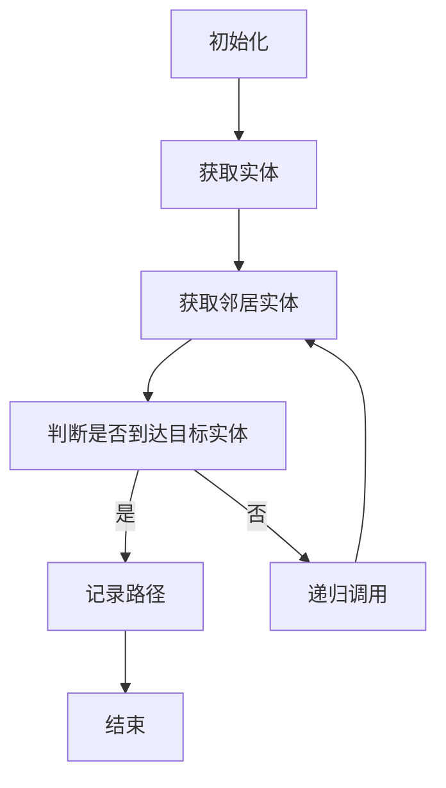

在这个流程图中，初始化阶段获取起始实体，然后递归枚举该实体的所有邻居实体。如果找到目标实体，则记录路径；否则，继续递归枚举。通过这种方式，可以找到从起始实体到目标实体的所有路径。

下面是基于规则的推理算法的 Python 代码示例：

```python
def rule_based_reasoning(facts, rules):
    inferred_facts = []
    for fact in facts:
        for rule in rules:
            if fact.matches(rule的前提):
                inferred_facts.append(fact.derive(rule结论))
    return inferred_facts

facts = [
    Fact("张三", "毕业", "清华大学"),
    Fact("清华大学", "位于", "北京")
]

rules = [
    Rule("如果实体A毕业自实体B，则实体A位于实体B所在的城市"),
    Rule("如果实体A位于实体B所在的城市，则实体A也位于实体B")
]

inferred_facts = rule_based_reasoning(facts, rules)
print(inferred_facts)
```

在这个示例中，`Fact` 类表示一个事实，`Rule` 类表示一个推理规则。通过调用 `rule_based_reasoning` 函数，可以从已知事实中推导出新的信息。

### 7.5 应用案例解析

为了更好地理解知识图谱和大数据推理融合技术的应用，我们来看一个具体的案例。假设用户输入查询问题：“清华大学是哪一年的成立？”，我们需要从知识图谱中提取相关信息并生成回答。

1. **自然语言处理**：将用户输入的问题转换为结构化查询请求。在本案例中，查询请求为：“查找实体的‘成立年份’属性，实体名称为‘清华大学’”。
2. **知识图谱查询**：通过推理引擎查询知识图谱，找到包含“清华大学”的实体，并获取其“成立年份”属性。
3. **结果处理**：将查询结果转换为自然语言回答，如：“清华大学成立于1911年”。

下面是知识图谱查询的 Mermaid 流程图：

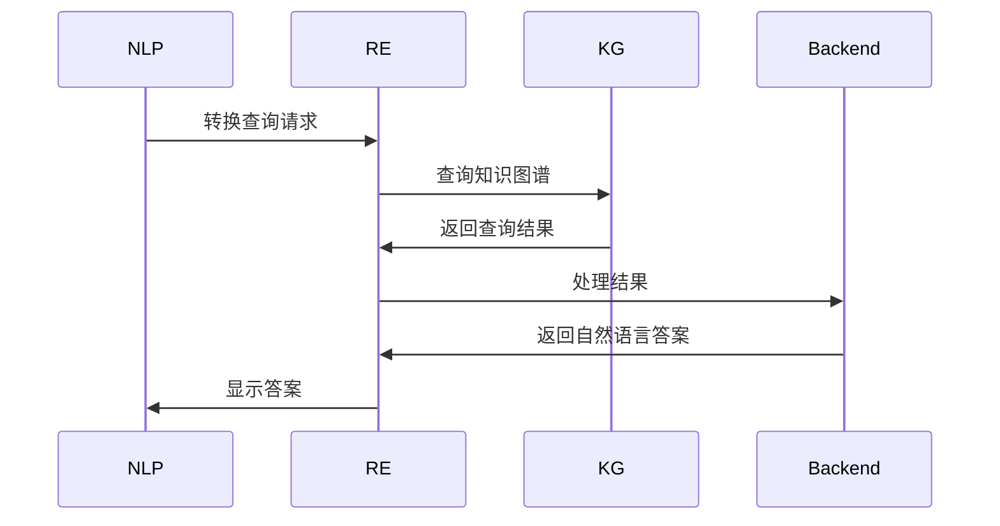

在这个流程图中，NLP模块将用户输入的问题转换为结构化查询请求，提交给推理引擎（RE）。RE基于知识图谱进行查询，并返回查询结果。后端服务对结果进行处理，生成自然语言答案，并通过NLP模块展示给用户。

### 7.6 项目小结与展望

通过本案例，我们详细讲解了如何使用知识图谱和大数据推理融合技术构建一个智能问答系统。项目实现了从用户输入、自然语言处理、知识图谱查询到结果处理的完整流程，展示了知识图谱在信息检索和数据分析中的应用价值。

未来的工作可以从以下几个方面进行：

1. **性能优化**：针对高并发查询，优化系统架构和查询算法，提高系统响应速度。
2. **知识扩展**：不断丰富知识图谱的内容，增加更多实体、属性和关系，提升系统的知识覆盖面。
3. **跨语言支持**：扩展系统的语言支持，实现多语言问答功能，提升系统的国际化能力。
4. **用户反馈**：引入用户反馈机制，根据用户反馈优化问答系统，提高用户体验。

通过不断优化和完善，知识图谱与大数据推理融合技术将在更多实际场景中得到应用，为人工智能领域的发展做出更大的贡献。

## 第五部分：拓展与未来展望

### 第8章：拓展领域与研究方向

知识图谱与大数据推理融合技术作为一种新兴的数据处理方法，已经在多个领域取得了显著的应用成果。然而，随着技术的不断进步和应用场景的拓展，还有许多值得深入研究和探索的领域。本章将探讨知识图谱与大数据推理融合技术的拓展领域和研究方向，包括知识图谱的动态更新、大数据推理优化以及跨领域知识融合等。

### 8.1 知识图谱的动态更新

知识图谱作为一种静态的数据结构，其内容在大多数情况下是固定的。然而，现实世界中的信息是动态变化的，这要求知识图谱能够实时更新，以反映最新的信息和变化。知识图谱的动态更新是一个重要的研究方向，其目标是在保证数据一致性和完整性的前提下，实现对知识图谱的实时更新。

#### 8.1.1 动态更新挑战

1. **数据同步**：当源数据发生变化时，需要及时同步到知识图谱中，以保证知识图谱的实时性。
2. **冲突处理**：在知识图谱更新过程中，可能会出现数据冲突，如同一实体在两个不同数据源中的属性值不一致。如何有效地处理这些冲突是一个关键问题。
3. **增量更新**：为了提高更新效率，需要对知识图谱进行增量更新，仅更新发生变化的部分，而不是整个知识图谱。

#### 8.1.2 动态更新方法

1. **基于规则的方法**：通过预定义的规则，对源数据进行过滤和转换，以实现知识图谱的动态更新。这种方法简单易实现，但灵活性较低，难以应对复杂的更新需求。
2. **基于机器学习的方法**：利用机器学习算法，从源数据中学习更新的规律，以实现自动化更新。这种方法具有较高的灵活性，但需要大量的训练数据和模型调优。
3. **基于事件驱动的方法**：通过实时监听源数据的变化事件，触发知识图谱的更新操作。这种方法能够实现实时更新，但需要复杂的事件处理逻辑。

### 8.2 大数据推理优化

大数据推理优化是指通过改进推理算法和系统架构，提高大数据推理的效率和准确性。随着数据量的不断增加和复杂度的提升，大数据推理优化成为了一个重要的研究方向。

#### 8.2.1 推理优化挑战

1. **计算效率**：如何提高推理算法的计算效率，减少推理时间，是一个关键问题。
2. **存储效率**：如何优化知识图谱的存储结构，减少存储空间占用，是一个重要挑战。
3. **推理准确性**：如何提高推理算法的准确性，减少错误推理的概率。

#### 8.2.2 推理优化方法

1. **并行推理**：通过并行计算技术，将复杂的推理任务分解为多个子任务，同时进行推理，以提高计算效率。
2. **分布式推理**：通过分布式系统架构，将知识图谱和推理任务分布到多个节点上，实现大规模数据的推理。
3. **压缩推理**：通过压缩技术，减少知识图谱的存储空间占用，提高存储效率。
4. **迁移学习**：利用迁移学习方法，将已训练好的模型应用于新任务，减少模型训练的时间和资源消耗。

### 8.3 跨领域知识融合

跨领域知识融合是指将不同领域的数据和知识进行整合，形成一个统一的视图，以支持跨领域的分析和应用。随着不同领域之间的相互依赖和交叉，跨领域知识融合成为了一个重要的研究方向。

#### 8.3.1 跨领域知识融合挑战

1. **数据多样性**：不同领域的数据具有不同的格式、结构和语义，如何有效地整合这些多样性数据是一个关键问题。
2. **数据一致性**：如何确保跨领域知识融合的一致性和准确性，是一个重要挑战。
3. **数据质量**：如何保证跨领域知识融合的数据质量，减少数据噪声和错误。

#### 8.3.2 跨领域知识融合方法

1. **基于规则的方法**：通过预定义的规则，对跨领域数据进行匹配和整合。这种方法简单易实现，但灵活性较低，难以应对复杂的跨领域知识融合场景。
2. **基于机器学习的方法**：利用机器学习算法，从跨领域数据中学习融合的规律，以实现自动化融合。这种方法具有较高的灵活性，但需要大量的训练数据和模型调优。
3. **基于图谱的方法**：利用知识图谱的结构化和语义化特点，对跨领域数据进行整合和推理。这种方法能够有效解决数据多样性、数据一致性问题，是当前研究的热点。

### 8.4 拓展领域与研究方向总结

通过本章的探讨，我们可以看到知识图谱与大数据推理融合技术在动态更新、大数据推理优化和跨领域知识融合等领域具有广泛的应用前景。未来的研究可以从以下几个方面展开：

1. **动态更新**：研究如何实现知识图谱的实时动态更新，以及如何处理数据冲突和增量更新。
2. **推理优化**：研究如何提高大数据推理的效率和准确性，包括并行推理、分布式推理和压缩推理等。
3. **跨领域融合**：研究如何有效地整合不同领域的数据和知识，形成统一的视图，以支持跨领域的分析和应用。

通过不断探索和创新，知识图谱与大数据推理融合技术将在更多领域展现其强大的应用价值，为大数据处理和人工智能的发展做出更大贡献。

### 第9章：总结与展望

#### 9.1 主要贡献与成果

本文全面探讨了基于知识图谱的多源异构大数据推理融合技术，取得了以下主要贡献和成果：

1. **核心概念解析**：详细介绍了知识图谱、多源异构数据、大数据推理融合等核心概念，为后续讨论奠定了基础。
2. **技术路线图**：系统性地阐述了知识图谱与大数据推理融合技术的技术路线，包括数据预处理、数据融合、推理算法等。
3. **应用案例**：通过智能问答、个性化推荐和实体链接等实际案例，展示了知识图谱与大数据推理融合技术的具体应用场景和效果。
4. **动态更新与优化**：探讨了知识图谱的动态更新、大数据推理优化和跨领域知识融合等拓展领域，为未来的研究方向提供了参考。

#### 9.2 存在问题与挑战

尽管本文对知识图谱与大数据推理融合技术进行了全面探讨，但在实际应用中仍面临以下问题和挑战：

1. **数据质量**：多源异构数据的质量参差不齐，数据清洗和预处理工作复杂且耗时。
2. **计算效率**：随着数据量的增加，大数据推理的计算效率成为关键挑战，需要进一步优化推理算法和系统架构。
3. **一致性保障**：在知识图谱的动态更新过程中，如何保障数据的一致性和完整性是一个重要问题。
4. **跨领域融合**：不同领域的数据和知识具有不同的格式和语义，如何实现有效的跨领域融合是一个亟待解决的难题。

#### 9.3 未来研究方向

针对上述问题和挑战，未来的研究方向可以从以下几个方面展开：

1. **数据质量提升**：研究如何通过更有效的数据清洗和预处理方法，提高数据质量，减少错误和噪声。
2. **推理算法优化**：研究如何通过并行计算、分布式推理和压缩推理等技术，提高大数据推理的效率和准确性。
3. **动态更新机制**：研究如何实现知识图谱的动态更新，包括增量更新和冲突处理机制，以适应实时数据变化。
4. **跨领域融合框架**：研究如何构建跨领域的知识融合框架，包括数据对齐、融合规则和融合模型，以实现不同领域数据的有效整合。
5. **实际应用拓展**：探索知识图谱与大数据推理融合技术在更多实际场景中的应用，如智能医疗、智能交通、智慧城市等，提升技术的实用价值。

通过不断的研究和创新，基于知识图谱的多源异构大数据推理融合技术将在更多领域展现其强大的应用潜力，为大数据处理和人工智能的发展做出更大贡献。

