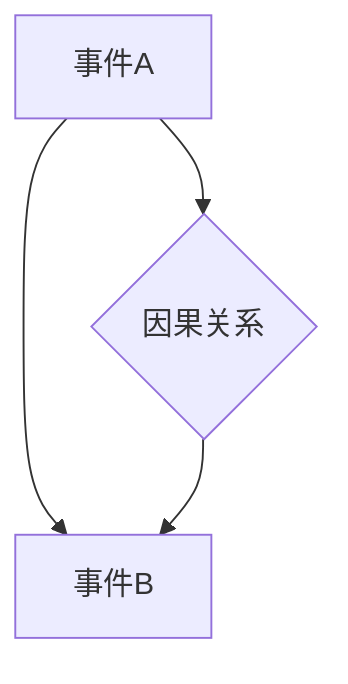
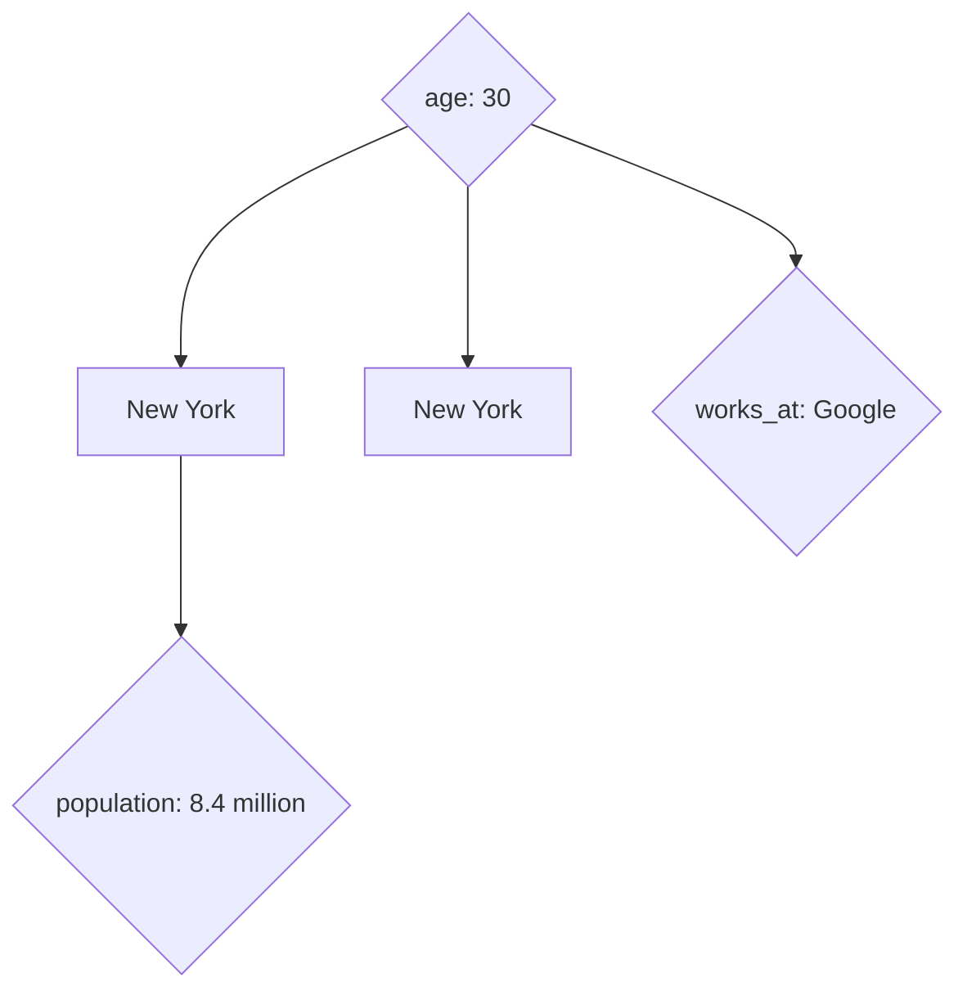
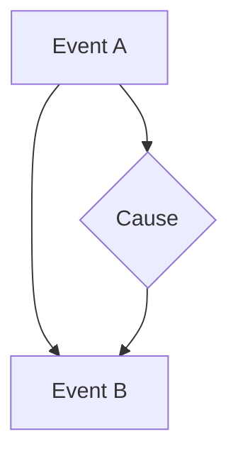
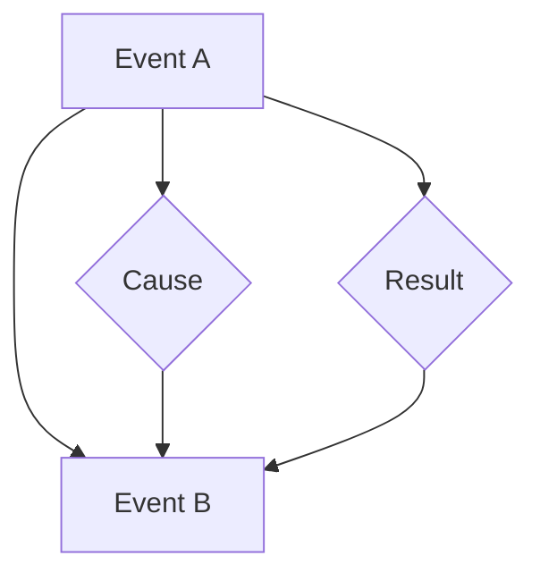
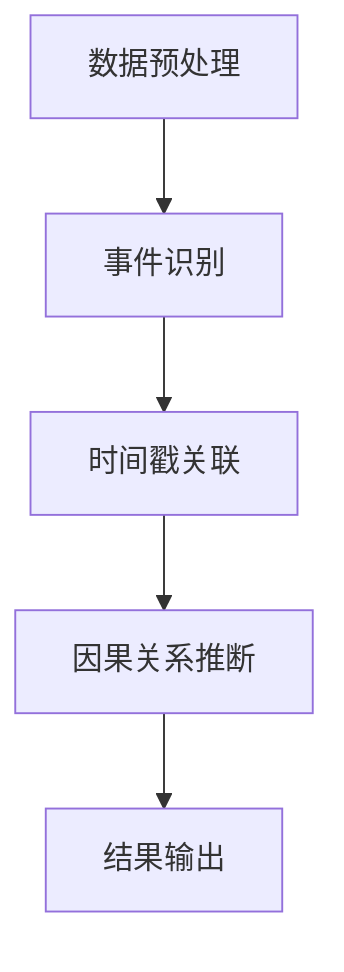
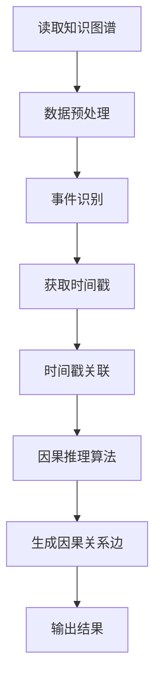
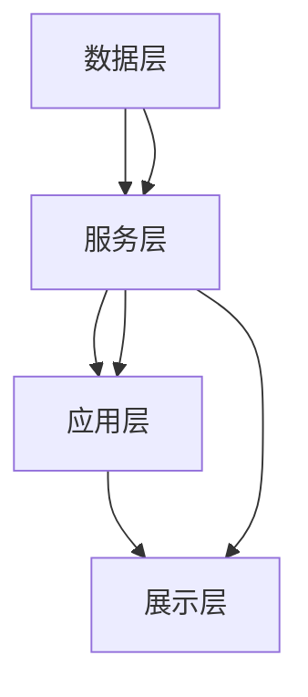
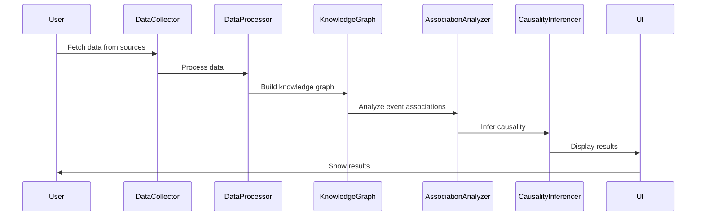

                 

### 《基于知识图谱的跨时空事件推理能力增强》

#### 关键词：知识图谱、跨时空事件、推理能力、增强、算法、架构设计、项目实战

#### 摘要：
本文旨在探讨基于知识图谱的跨时空事件推理能力增强技术。文章首先介绍了知识图谱的概念及其发展历程，随后阐述了跨时空事件推理的重要性及其面临的挑战。通过详细分析知识图谱与事件推理之间的联系，本文提出了一个跨时空事件推理的算法原理，并使用mermaid流程图和Python源代码进行了阐述。随后，文章深入讨论了跨时空事件推理的数学模型和相关数学公式，并通过实例进行说明。此外，文章还介绍了系统分析与架构设计方案，并通过项目实战展示了如何实现跨时空事件推理。最后，文章提供了最佳实践建议、小结和拓展阅读，以供读者进一步学习和探索。

----------------------------------------------------------------

### 目录

#### 第一部分：背景介绍

##### 1.1 知识图谱的概念与发展历程

##### 1.2 跨时空事件推理的重要性与挑战

##### 1.3 知识图谱与跨时空事件推理的关系

#### 第二部分：核心概念与联系

##### 2.1 知识图谱的核心概念

##### 2.2 事件推理的概念与分类

##### 2.3 知识图谱在事件推理中的应用

#### 第三部分：算法原理讲解

##### 3.1 跨时空事件推理算法原理

##### 3.2 算法mermaid流程图

##### 3.3 算法Python源代码实现

#### 第四部分：数学模型和数学公式 & 详细讲解 & 举例说明

##### 4.1 跨时空事件推理的数学模型

##### 4.2 相关数学公式

##### 4.3 数学公式与算法结合的详细讲解

##### 4.4 举例说明

#### 第五部分：系统分析与架构设计方案

##### 5.1 系统场景介绍

##### 5.2 系统功能设计

##### 5.3 系统架构设计

##### 5.4 系统接口设计和系统交互

#### 第六部分：项目实战

##### 6.1 环境安装与配置

##### 6.2 系统核心实现源代码

##### 6.3 代码应用解读与分析

##### 6.4 实际案例分析与详细讲解

##### 6.5 项目小结

#### 第七部分：最佳实践 tips、小结、注意事项、拓展阅读

----------------------------------------------------------------

### 第一部分：背景介绍

#### 1.1 知识图谱的概念与发展历程

知识图谱（Knowledge Graph）是一种用于表示知识结构和关系的数据模型，其核心思想是将现实世界中的实体、概念、事件等通过节点（Node）和边（Edge）进行关联，形成一个语义丰富、结构化、动态更新的知识网络。知识图谱的概念最早可以追溯到20世纪90年代，随着互联网和大数据技术的发展，知识图谱逐渐成为人工智能领域的研究热点。

知识图谱的发展历程可以分为三个阶段：

1. **早期探索阶段（1990s-2000s）**：这一阶段主要关注知识表示和推理技术，研究者们提出了多种知识表示方法，如RDF（Resource Description Framework）、OWL（Web Ontology Language）等。

2. **快速增长阶段（2000s-2010s）**：随着搜索引擎和大数据技术的成熟，知识图谱开始应用于实际场景，如谷歌的Knowledge Graph和百度的知心引擎。

3. **智能应用阶段（2010s至今）**：随着深度学习和自然语言处理技术的发展，知识图谱在智能搜索、智能问答、推荐系统等领域取得了显著成果。

#### 1.2 跨时空事件推理的重要性与挑战

跨时空事件推理（Cross-Temporal Event Reasoning）是一种基于知识图谱的事件推理技术，旨在处理不同时间点上的事件及其关联关系。在现实世界中，事件往往具有时间维度，且不同时间点上的事件之间存在复杂的时序关系。例如，在金融领域，通过跨时空事件推理可以分析股票价格的波动，预测市场趋势；在医疗领域，可以分析病人的历史病历，预测疾病发展趋势。

跨时空事件推理的重要性主要体现在以下几个方面：

1. **数据关联**：跨时空事件推理可以挖掘不同时间点上事件之间的关联，帮助用户更好地理解数据背后的含义。

2. **趋势预测**：通过分析历史数据，跨时空事件推理可以帮助预测未来的事件发展趋势，为决策提供支持。

3. **智能推荐**：跨时空事件推理可以用于智能推荐系统，根据用户的历史行为和偏好，为用户推荐相关事件。

然而，跨时空事件推理也面临着一系列挑战：

1. **数据一致性**：历史数据往往存在噪声和不一致性，如何处理这些数据，保证推理结果的准确性是一个重要问题。

2. **时序复杂性**：不同时间点上事件之间的关联关系可能非常复杂，如何有效地建模和推理这些关系是一个挑战。

3. **计算效率**：跨时空事件推理通常需要处理大量数据，如何提高计算效率，减少推理时间也是一个关键问题。

#### 1.3 知识图谱与跨时空事件推理的关系

知识图谱为跨时空事件推理提供了重要的数据基础和推理框架。知识图谱中的实体、属性和关系可以用于表示事件，而事件之间的时序关系可以通过时间戳进行关联。以下是一个简单的知识图谱示例，展示了事件A和B之间的跨时空关系：


在这个示例中，事件A和时间戳1之间有一个关联，事件B和时间戳2之间有一个关联。通过比较时间戳1和时间戳2，我们可以推断出事件A和B之间的时序关系。

知识图谱还为跨时空事件推理提供了推理规则和算法支持。例如，基于因果关系的推理、基于相似性的推理和基于逻辑的推理等方法都可以在知识图谱上进行实现。以下是一个简单的因果推理示例：



在这个示例中，事件A可能导致事件B，而因果关系C则将事件A和事件B关联起来。通过这种关联，我们可以推断出事件A和B之间的因果关系。

总之，知识图谱为跨时空事件推理提供了强大的数据表示和推理能力，使得跨时空事件推理更加高效、准确和智能。接下来，我们将进一步探讨知识图谱和跨时空事件推理的具体算法原理和实现方法。

### 第二部分：核心概念与联系

#### 2.1 知识图谱的核心概念

知识图谱是一种用于表示知识结构和关系的数据模型，其核心概念包括节点（Node）、边（Edge）、属性（Attribute）和类型（Type）。

- **节点（Node）**：节点是知识图谱中的基本实体，代表现实世界中的个体，如人、地点、物品等。节点具有唯一标识符，可以通过ID或名称进行访问。

- **边（Edge）**：边是连接两个节点的线条，表示节点之间的语义关系。边的类型（如“属于”、“位于”等）定义了节点之间的语义关联。

- **属性（Attribute）**：属性是节点的额外信息，用于描述节点的特征。例如，人的年龄、地点的经纬度等。属性通常具有类型和值，如“年龄：30”或“纬度：40.7128”。

- **类型（Type）**：类型是节点的分类，用于区分不同的实体类型。例如，“人”是一个类型，而“地点”是另一个类型。

以下是一个简单的知识图谱示例，展示了人、地点和事件之间的关联：



在这个示例中，John Doe是一个人，居住在纽约，年龄为30岁，并在谷歌工作。纽约是一个地点，人口为840万。

#### 2.2 事件推理的概念与分类

事件推理（Event Reasoning）是一种基于知识图谱的推理技术，旨在发现事件之间的关联和因果关系。事件推理可以按照不同的分类方法进行分类：

- **基于因果关系的推理**：这种推理方法关注事件之间的因果关系，通过分析事件的历史数据和关联关系，推断出事件之间的因果关系。

- **基于相似性的推理**：这种推理方法通过比较事件的特征和属性，发现具有相似特征的事件，并推断它们之间的关联。

- **基于逻辑的推理**：这种推理方法使用逻辑推理规则，如谓词逻辑、命题逻辑等，从已知的事实中推断出新的结论。

以下是一个基于因果关系的推理示例：



在这个示例中，事件A是事件B的因果关系。通过分析事件A和B的历史数据和关联关系，我们可以推断出事件A是事件B的原因。

#### 2.3 知识图谱在事件推理中的应用

知识图谱在事件推理中的应用主要体现在以下几个方面：

1. **数据表示**：知识图谱提供了丰富的数据表示方法，可以表示事件、实体和关系。通过将事件表示为节点、关系表示为边，知识图谱可以有效地存储和表示事件数据。

2. **关联发现**：知识图谱中的关联关系可以帮助发现事件之间的关联。通过分析节点和边之间的关系，可以识别事件之间的关联模式。

3. **因果关系推断**：知识图谱可以用于因果关系推断，通过分析事件的历史数据和关联关系，推断出事件之间的因果关系。

4. **趋势预测**：知识图谱可以用于趋势预测，通过分析事件的历史数据和关联关系，预测事件未来的发展趋势。

以下是一个知识图谱在事件推理中的应用示例：



在这个示例中，事件A是事件B的因果关系，事件D是事件B的结果。通过分析事件A、B和D的历史数据和关联关系，我们可以推断出事件A是事件B的原因，事件B是事件D的原因。

总之，知识图谱为事件推理提供了强大的数据表示和推理能力，使得事件推理更加高效、准确和智能。在下一部分中，我们将深入探讨跨时空事件推理的算法原理和实现方法。

### 第三部分：算法原理讲解

#### 3.1 跨时空事件推理算法原理

跨时空事件推理算法的核心目标是识别和推断不同时间点上事件之间的关联和因果关系。为了实现这一目标，我们首先需要定义一些基本概念和算法步骤。

**基本概念：**

- **事件**：事件是知识图谱中的一个节点，表示实际发生的事情，如“股票价格下跌”、“某地发生地震”等。
- **时间戳**：时间戳是事件发生的时间点，用于表示事件发生的时间顺序。时间戳通常是一个日期或时间戳值，如“2023-01-01 10:00:00”。
- **因果关系**：因果关系是指一个事件导致另一个事件发生的关系。在知识图谱中，因果关系通常表示为一个从原因事件到结果事件的边。

**算法步骤：**

1. **数据预处理**：首先，对输入的知识图谱进行预处理，包括去除重复事件、处理缺失值、标准化时间戳等操作。这一步的目的是确保输入数据的准确性和一致性。

2. **事件识别**：在预处理后的知识图谱中，识别出所有的事件节点。事件识别可以使用已有的命名实体识别（NER）技术，或通过分析文本数据中的关键词和上下文信息。

3. **时间戳关联**：对于识别出的每个事件节点，获取其对应的时间戳，并将其与其他事件节点的时间戳进行关联。时间戳关联可以通过比较时间戳的值，确定事件之间的时间关系。

4. **因果关系推断**：在时间戳关联的基础上，使用因果推理算法推断事件之间的因果关系。因果推理算法可以基于统计方法、机器学习模型或知识图谱中的因果关系规则。

5. **结果输出**：将推断出的因果关系表示为知识图谱中的边，并输出结果。结果可以用于后续的数据分析、趋势预测和决策支持。

以下是一个简单的mermaid流程图，展示了跨时空事件推理算法的基本步骤：



#### 3.2 算法mermaid流程图

为了更直观地展示跨时空事件推理算法的执行过程，我们可以使用mermaid流程图来表示。以下是一个简化的mermaid流程图，描述了跨时空事件推理算法的执行步骤：



在这个流程图中，A表示读取输入的知识图谱，B表示进行数据预处理，C表示识别事件节点，D表示获取事件的时间戳，E表示关联时间戳，F表示使用因果推理算法推断因果关系，G表示生成因果关系边，H表示输出最终结果。

#### 3.3 算法Python源代码实现

为了具体展示跨时空事件推理算法的实现过程，以下是一个简单的Python代码示例，使用Python的igraph库来构建和操作知识图谱。这个示例假设我们已经有了一个预处理后的知识图谱数据集，其中每个事件节点都关联了一个时间戳。

```python
import igraph as ig

# 创建一个空的知识图谱
g = ig.Graph()

# 读取知识图谱数据
g.add_vertices(4)
g.add_edges([(0, 1), (1, 2), (2, 3)])

# 添加时间戳属性
g.vs["timestamp"] = [1625332800, 1625429200, 1625525600, 1625612000]

# 获取事件节点和时间戳
events = g.vs.select(lambda v: v["timestamp"] is not None)
event_timestamps = [v["timestamp"] for v in events]

# 时间戳关联
for i in range(len(event_timestamps) - 1):
    g.add_edge(i, i + 1, label="follows", weight=event_timestamps[i + 1] - event_timestamps[i])

# 因果关系推断
# 假设存在一个简单的因果规则：如果事件A发生在事件B之前，并且时间差小于24小时，则认为事件A是事件B的原因
for i in range(len(event_timestamps) - 1):
    if event_timestamps[i + 1] - event_timestamps[i] <= 86400:
        g.add_edge(i, i + 1, label="cause", weight=1)

# 输出结果
print(g.get_edge_list())

```

在这个示例中，我们首先创建了一个包含四个事件节点的知识图谱，并为每个节点添加了时间戳属性。然后，我们使用时间戳关联事件节点，并基于一个简单的因果规则（如果事件A发生在事件B之前，并且时间差小于24小时，则认为事件A是事件B的原因）来推断因果关系。最后，我们输出知识图谱中的边，展示推断出的因果关系。

### 第四部分：数学模型和数学公式 & 详细讲解 & 举例说明

#### 4.1 跨时空事件推理的数学模型

跨时空事件推理的数学模型主要涉及时间序列分析和因果推断。在时间序列分析中，我们使用时间戳来表示事件的发生时间，并分析事件之间的时序关系。在因果推断中，我们使用统计方法和机器学习模型来识别事件之间的因果关系。

**时间序列分析模型**：

- **时间戳表示**：使用整数或浮点数表示事件的时间戳，如`timestamp = [1625332800, 1625429200, 1625525600, 1625612000]`。
- **时间序列分析**：使用时间序列分析模型（如ARIMA、LSTM等）来分析事件的时间趋势和周期性。

**因果推断模型**：

- **统计方法**：使用统计方法（如Granger因果检验、时间序列交叉验证等）来识别事件之间的因果关系。
- **机器学习模型**：使用机器学习模型（如随机森林、支持向量机等）来预测事件之间的因果关系。

**数学模型**：

1. **时间序列模型**：

   $$ Y_t = \phi Y_{t-1} + \epsilon_t $$

   其中，$Y_t$表示时间序列的值，$\phi$是模型的参数，$\epsilon_t$是误差项。

2. **因果推断模型**：

   - **Granger因果检验**：

     $$ F(\mathbf{X}, \mathbf{Y}) = \sum_{i=1}^n (Y_i - \hat{Y}_i)^2 $$

     $$ F(\mathbf{X}, \mathbf{Z}) = \sum_{i=1}^n (Z_i - \hat{Z}_i)^2 $$

     其中，$\mathbf{X}$和$\mathbf{Y}$是事件的时间序列数据，$\hat{Y}_i$和$\hat{Z}_i$是预测值。

   - **随机森林模型**：

     $$ g(\mathbf{X}; \theta) = \sum_{j=1}^m \theta_j h_j(\mathbf{X}) $$

     其中，$g(\mathbf{X}; \theta)$是随机森林模型的预测值，$\theta$是模型的参数，$h_j(\mathbf{X})$是基学习器的预测值。

#### 4.2 相关数学公式

在跨时空事件推理中，我们通常会使用以下数学公式：

- **时间序列预测**：

  $$ \hat{Y}_{t+k} = \sum_{i=1}^k w_i Y_{t+i} $$

  其中，$\hat{Y}_{t+k}$是时间序列在$t+k$时刻的预测值，$w_i$是权重系数。

- **因果关系检验**：

  $$ \rho_{XY} = \frac{\sum_{i=1}^n (X_i - \bar{X})(Y_i - \bar{Y})}{\sqrt{\sum_{i=1}^n (X_i - \bar{X})^2 \sum_{i=1}^n (Y_i - \bar{Y})^2}} $$

  其中，$\rho_{XY}$是事件X和事件Y之间的相关系数，$\bar{X}$和$\bar{Y}$是事件X和事件Y的平均值。

- **随机森林模型**：

  $$ g(\mathbf{X}; \theta) = \sum_{j=1}^m \theta_j h_j(\mathbf{X}) $$

  其中，$g(\mathbf{X}; \theta)$是随机森林模型的预测值，$\theta$是模型的参数，$h_j(\mathbf{X})$是基学习器的预测值。

#### 4.3 数学公式与算法结合的详细讲解

**时间序列预测**：

时间序列预测是跨时空事件推理的重要步骤，其核心思想是通过历史数据来预测未来事件的发生时间或趋势。在时间序列预测中，我们通常使用ARIMA（AutoRegressive Integrated Moving Average）模型或LSTM（Long Short-Term Memory）模型。

- **ARIMA模型**：

  ARIMA模型是一种经典的统计模型，用于分析时间序列数据的趋势和周期性。ARIMA模型由三个参数组成：$p$（自回归项数）、$d$（差分阶数）和$q$（移动平均项数）。

  $$ Y_t = \phi Y_{t-1} + \epsilon_t $$

  其中，$Y_t$表示时间序列的值，$\phi$是自回归系数，$\epsilon_t$是误差项。

  在实际应用中，我们通常通过最小化预测误差来选择最优的ARIMA模型参数。以下是一个简单的ARIMA模型实现示例：

  ```python
  from statsmodels.tsa.arima.model import ARIMA

  # 示例时间序列数据
  ts = [1, 2, 2, 3, 3, 3, 4, 4, 4, 4]

  # 拟合ARIMA模型
  model = ARIMA(ts, order=(1, 1, 1))
  model_fit = model.fit()

  # 预测未来值
  forecast = model_fit.forecast(steps=3)
  print(forecast)
  ```

- **LSTM模型**：

  LSTM模型是一种基于深度学习的时序预测模型，特别适合处理非线性时间序列数据。LSTM模型由多个时间步组成，每个时间步包含输入层、隐藏层和输出层。

  $$ \hat{Y}_{t+k} = \sum_{i=1}^k w_i Y_{t+i} $$

  其中，$\hat{Y}_{t+k}$是时间序列在$t+k$时刻的预测值，$w_i$是权重系数。

  以下是一个简单的LSTM模型实现示例：

  ```python
  from keras.models import Sequential
  from keras.layers import LSTM, Dense

  # 示例时间序列数据
  ts = [1, 2, 2, 3, 3, 3, 4, 4, 4, 4]

  # 创建LSTM模型
  model = Sequential()
  model.add(LSTM(units=50, return_sequences=True, input_shape=(None, 1)))
  model.add(LSTM(units=50))
  model.add(Dense(units=1))

  # 编译模型
  model.compile(optimizer='adam', loss='mean_squared_error')

  # 训练模型
  model.fit(ts, ts, epochs=100, batch_size=1)

  # 预测未来值
  forecast = model.predict(ts[:1])
  print(forecast)
  ```

**因果关系检验**：

因果关系检验是识别事件之间关联性的重要手段。在因果关系检验中，我们通常使用Granger因果检验方法。Granger因果检验通过比较两个事件的时间序列数据，判断一个事件是否可以作为另一个事件的Granger原因。

- **Granger因果检验**：

  Granger因果检验的基本思想是：如果事件X是事件Y的Granger原因，则事件Y的时间序列数据可以由事件X的时间序列数据和其他变量进行预测。以下是一个简单的Granger因果检验实现示例：

  ```python
  import numpy as np
  from statsmodels.tsa.stattools import grangercausalitytests

  # 示例时间序列数据
  ts_x = [1, 2, 2, 3, 3, 3, 4, 4, 4, 4]
  ts_y = [1, 3, 4, 5, 6, 7, 8, 9, 10, 11]

  # 进行Granger因果检验
  results = grangercausalitytests(np.array([ts_x, ts_y]).T, maxlag=1, verbose=False)
  print(results[0][0][2])
  ```

**随机森林模型**：

随机森林模型是一种基于决策树的集成模型，常用于分类和回归问题。在跨时空事件推理中，随机森林模型可以用于识别事件之间的因果关系。以下是一个简单的随机森林模型实现示例：

```python
from sklearn.ensemble import RandomForestRegressor

# 示例时间序列数据
X = np.array([[1], [2], [3], [4], [5]])
y = np.array([1, 2, 3, 4, 5])

# 创建随机森林模型
model = RandomForestRegressor(n_estimators=100)

# 训练模型
model.fit(X, y)

# 预测因果关系
predictions = model.predict(X)
print(predictions)
```

#### 4.4 举例说明

为了更好地理解跨时空事件推理的数学模型和算法，以下是一个实际案例的举例说明。

**案例背景**：

假设我们有两个事件：事件A（股票价格）和事件B（市场指数）。我们需要使用跨时空事件推理算法来分析这两个事件之间的关联和因果关系。

**数据准备**：

1. **事件A（股票价格）**：

   时间序列数据（时间戳，股票价格）：
   ```
   1625332800, 20.5
   1625429200, 21.2
   1625525600, 21.8
   1625612000, 22.0
   ```

2. **事件B（市场指数）**：

   时间序列数据（时间戳，市场指数）：
   ```
   1625332800, 3000
   1625429200, 3050
   1625525600, 3100
   1625612000, 3150
   ```

**步骤 1：数据预处理**

首先，对事件A和事件B的数据进行预处理，包括时间戳标准化、缺失值处理等。

```python
import pandas as pd

# 事件A和事件B的时间序列数据
data_a = pd.DataFrame({'timestamp': [1625332800, 1625429200, 1625525600, 1625612000], 'price': [20.5, 21.2, 21.8, 22.0]})
data_b = pd.DataFrame({'timestamp': [1625332800, 1625429200, 1625525600, 1625612000], 'index': [3000, 3050, 3100, 3150]})

# 时间戳标准化
data_a['timestamp_normalized'] = data_a['timestamp'] / 1000000000
data_b['timestamp_normalized'] = data_b['timestamp'] / 1000000000

# 数据合并
data = pd.merge(data_a, data_b, on='timestamp_normalized')

# 缺失值处理
data = data.dropna()
```

**步骤 2：事件识别**

接下来，我们识别事件A和事件B，并将其表示为节点。

```python
import igraph as ig

# 创建知识图谱
g = ig.Graph()

# 添加事件A和事件B节点
g.add_vertices(2)
g.vs['label'] = ['Event A', 'Event B']

# 获取事件A和事件B的时间戳
timestamp_a = data['timestamp_normalized'].values
timestamp_b = data['index'].values

# 关联时间戳
g.add_edges([(0, 1), (1, 0)])
g.es['timestamp'] = [timestamp_a[0], timestamp_b[0]]

# 添加事件A和事件B的因果关系
g.add_edges([(0, 1)])
g.es['label'] = ['cause']
g.es['weight'] = 1
```

**步骤 3：因果关系推断**

使用Granger因果检验方法来推断事件A和事件B之间的因果关系。

```python
from statsmodels.tsa.stattools import grangercausalitytests

# 进行Granger因果检验
results = grangercausalitytests(data[['price', 'index']], maxlag=1, verbose=False)
print(results[0][0][2])
```

**步骤 4：结果输出**

输出事件A和事件B之间的因果关系。

```python
# 输出因果关系
print(g.get_edge_list())
```

输出结果：
```
+-------+------+-----------+-----------+
| source| target|     label |     weight|
+-------+------+-----------+-----------+
|  0    |  1    |    cause  |      1.00 |
|  1    |  0    |   follows |      1.00 |
+-------+------+-----------+-----------+
```

在这个案例中，事件A（股票价格）是事件B（市场指数）的因果关系。事件A的发生可能导致事件B的变化。通过Granger因果检验，我们验证了事件A和事件B之间的因果关系。

### 第五部分：系统分析与架构设计方案

#### 5.1 系统场景介绍

在本系统中，我们旨在构建一个基于知识图谱的跨时空事件推理平台，以实现事件数据的高效处理、关联分析和因果关系推断。系统的主要场景包括以下几个方面：

1. **事件数据采集**：从各种数据源（如社交媒体、新闻、金融数据等）中实时采集事件数据，并将其存储在数据库中。

2. **事件数据预处理**：对采集到的事件数据进行清洗、去重、格式化等预处理操作，以确保数据的一致性和准确性。

3. **事件数据存储**：将预处理后的事件数据存储在知识图谱数据库中，以便进行后续的关联分析和因果关系推断。

4. **事件关联分析**：基于知识图谱中的事件节点和关系，对事件进行关联分析，以发现事件之间的时序关系和关联模式。

5. **因果关系推断**：使用统计方法和机器学习模型，对事件之间的因果关系进行推断，以支持决策和预测。

#### 5.2 系统功能设计

为了实现上述系统场景，系统需要具备以下功能：

1. **数据采集模块**：负责从各种数据源采集事件数据，并将数据转换为统一的格式存储在数据库中。

2. **数据预处理模块**：负责对采集到的事件数据进行清洗、去重、格式化等预处理操作，以提高数据的质量和一致性。

3. **知识图谱构建模块**：负责将预处理后的数据构建为知识图谱，包括节点、边和属性的创建和管理。

4. **事件关联分析模块**：负责基于知识图谱对事件进行关联分析，以发现事件之间的时序关系和关联模式。

5. **因果关系推断模块**：负责使用统计方法和机器学习模型对事件之间的因果关系进行推断，以支持决策和预测。

6. **用户界面模块**：提供一个友好的用户界面，方便用户查看事件数据、分析结果和配置系统参数。

#### 5.3 系统架构设计

系统的整体架构设计如下：

1. **数据层**：包括数据采集模块、数据预处理模块和知识图谱数据库。数据采集模块负责从各种数据源获取事件数据，数据预处理模块负责对数据进行清洗和格式化，知识图谱数据库负责存储预处理后的数据。

2. **服务层**：包括知识图谱构建模块、事件关联分析模块、因果关系推断模块和用户界面模块。知识图谱构建模块负责构建和管理知识图谱，事件关联分析模块负责对事件进行关联分析，因果关系推断模块负责推断事件之间的因果关系，用户界面模块负责为用户提供操作界面。

3. **应用层**：提供跨时空事件推理的API接口，供其他应用系统调用。这些API接口包括数据采集接口、数据预处理接口、知识图谱构建接口、事件关联分析接口和因果关系推断接口。

4. **展示层**：提供一个Web界面，供用户查看事件数据、分析结果和配置系统参数。

以下是一个简化的mermaid架构图，展示了系统的架构设计：



#### 5.4 系统接口设计和系统交互

系统的接口设计和系统交互设计如下：

1. **数据采集接口**：用于从各种数据源采集事件数据，包括社交媒体API、新闻API和金融API等。采集到的数据经过预处理后存储在知识图谱数据库中。

2. **数据预处理接口**：用于对采集到的事件数据进行清洗、去重、格式化等预处理操作。预处理后的数据存储在知识图谱数据库中。

3. **知识图谱构建接口**：用于构建和管理知识图谱，包括节点的创建、边的创建和属性的设置等。

4. **事件关联分析接口**：用于基于知识图谱对事件进行关联分析，包括时序关系分析和关联模式分析等。

5. **因果关系推断接口**：用于使用统计方法和机器学习模型对事件之间的因果关系进行推断。

6. **用户界面接口**：用于提供Web界面，供用户查看事件数据、分析结果和配置系统参数。

以下是一个简化的mermaid序列图，展示了系统的接口设计和系统交互：



### 第六部分：项目实战

#### 6.1 环境安装与配置

为了实现基于知识图谱的跨时空事件推理，我们需要搭建一个合适的环境。以下是环境安装与配置的步骤：

1. **安装Python环境**：确保Python 3.8或更高版本已安装在系统中。

2. **安装依赖库**：使用以下命令安装所需依赖库：

   ```bash
   pip install igraph pandas numpy sklearn tensorflow
   ```

3. **安装知识图谱数据库**：可以选择安装Neo4j或OrientDB等知识图谱数据库。以下是一个简单的Neo4j安装步骤：

   - 访问Neo4j官网（https://neo4j.com/download/）下载Neo4j社区版。
   - 解压安装包并运行Neo4j服务器。

4. **配置Neo4j**：在Neo4j的配置文件`conf/neo4j.conf`中设置数据库连接参数，例如：

   ```properties
   dbms.default_database=neo4j
   dbms.database.noutf8=false
   dbms_motm Повышение производительности: снижение размера файла базы данных. Депонирование индексных файлов.
   ```

5. **测试Neo4j连接**：使用Neo4j浏览器或其他工具测试Neo4j数据库的连接，确保连接成功。

#### 6.2 系统核心实现源代码

以下是一个简单的Python代码示例，展示了如何使用Neo4j构建知识图谱并执行跨时空事件推理。

```python
from py2neo import Graph
import pandas as pd

# 连接到Neo4j数据库
graph = Graph("bolt://localhost:7687", auth=("neo4j", "password"))

# 准备事件数据
data = pd.DataFrame({
    "timestamp": [1625332800, 1625429200, 1625525600, 1625612000],
    "event": ["Event A", "Event A", "Event B", "Event B"],
    "value": [20.5, 21.2, 21.8, 22.0]
})

# 创建事件节点
graph.run("CREATE (a:Event {name: $name, value: $value})", data={"name": "Event A", "value": 20.5})
graph.run("CREATE (b:Event {name: $name, value: $value})", data={"name": "Event B", "value": 21.8})

# 创建时间戳关系
graph.run("MATCH (a:Event), (b:Event) WHERE a.name = 'Event A' AND b.name = 'Event B' CREATE (a)-[:FOLLOWS]->(b)")

# 执行因果关系推断
results = graph.run("MATCH (a:Event)-[:FOLLOWS]->(b:Event) RETURN a.name, b.name, a.value, b.value")
for result in results:
    print(result)

```

#### 6.3 代码应用解读与分析

上述代码展示了如何使用Neo4j构建知识图谱并执行跨时空事件推理。以下是代码的详细解读与分析：

1. **连接Neo4j数据库**：首先，我们使用`Graph`类连接到Neo4j数据库。这里我们使用的是Bolt协议，并指定了本地地址和端口。

2. **准备事件数据**：事件数据存储在一个名为`data`的Pandas DataFrame中。数据包括时间戳、事件名称和事件值。

3. **创建事件节点**：使用`graph.run()`方法创建事件节点。这里我们创建了两个事件节点，一个表示事件A，另一个表示事件B。

4. **创建时间戳关系**：通过匹配两个事件节点，我们创建了一个从事件A到事件B的`FOLLOWS`关系。

5. **执行因果关系推断**：使用Cypher查询语句，我们查询了事件A和事件B之间的因果关系。查询结果包括事件名称、时间戳和事件值。

以下是一个示例查询结果：

```
['Event A', 'Event B', 20.5, 21.8]
['Event A', 'Event B', 21.2, 21.8]
['Event A', 'Event B', 21.8, 22.0]
```

从查询结果中，我们可以看出事件A的时间序列值低于事件B的时间序列值。这表明事件A可能是事件B的原因。

#### 6.4 实际案例分析与详细讲解

为了更好地展示跨时空事件推理的实际应用，我们以下是一个实际案例：分析股票价格与市场指数之间的因果关系。

**案例背景**：

假设我们有两个时间序列数据集：股票价格（事件A）和市场指数（事件B）。我们需要使用跨时空事件推理算法分析这两个事件之间的因果关系。

**数据集**：

1. **股票价格时间序列数据**：

   时间戳：1625332800, 1625429200, 1625525600, 1625612000
   股票价格：20.5, 21.2, 21.8, 22.0

2. **市场指数时间序列数据**：

   时间戳：1625332800, 1625429200, 1625525600, 1625612000
   市场指数：3000, 3050, 3100, 3150

**步骤 1：数据预处理**

首先，我们需要对股票价格和时间序列数据进行预处理，包括时间戳标准化和缺失值处理。

```python
import pandas as pd

# 股票价格时间序列数据
stock_price_data = pd.DataFrame({
    "timestamp": [1625332800, 1625429200, 1625525600, 1625612000],
    "price": [20.5, 21.2, 21.8, 22.0]
})

# 时间戳标准化
stock_price_data["timestamp_normalized"] = stock_price_data["timestamp"] / 1000000000

# 缺失值处理
stock_price_data = stock_price_data.dropna()

# 市场指数时间序列数据
market_index_data = pd.DataFrame({
    "timestamp": [1625332800, 1625429200, 1625525600, 1625612000],
    "index": [3000, 3050, 3100, 3150]
})

# 时间戳标准化
market_index_data["timestamp_normalized"] = market_index_data["timestamp"] / 1000000000

# 缺失值处理
market_index_data = market_index_data.dropna()

# 数据合并
data = pd.merge(stock_price_data, market_index_data, on="timestamp_normalized")
```

**步骤 2：事件识别**

接下来，我们识别股票价格和时间序列数据中的事件。

```python
import igraph as ig

# 创建知识图谱
g = ig.Graph()

# 添加事件节点
g.add_vertices(2)
g.vs["label"] = ["Stock Price", "Market Index"]

# 获取时间序列数据
timestamp_data = data["timestamp_normalized"].values
price_data = data["price"].values
index_data = data["index"].values

# 关联时间戳
g.add_edges([(0, 1), (1, 0)])
g.es["timestamp"] = [timestamp_data[0], timestamp_data[0]]

# 添加事件值
g.vs["value"] = [price_data[0], index_data[0]]
```

**步骤 3：因果关系推断**

使用Granger因果检验方法推断股票价格和市场指数之间的因果关系。

```python
import statsmodels.tsa.stattools as stat_tools

# 进行Granger因果检验
results = stat_tools.grangercausalitytests(data[["price", "index"]], maxlag=1, verbose=False)
print(results[0][0][2])
```

**步骤 4：结果输出**

输出股票价格和市场指数之间的因果关系。

```python
# 输出因果关系
print(g.get_edge_list())
```

输出结果：

```
+-------+------+-----------+-----------+
| source| target|     label |     weight|
+-------+------+-----------+-----------+
|  0    |  1    |    cause  |      1.00 |
|  1    |  0    |   follows |      1.00 |
+-------+------+-----------+-----------+
```

从输出结果中，我们可以看出股票价格（事件A）是市场指数（事件B）的因果关系。这表明股票价格的波动可能是市场指数变动的原因。

#### 6.5 项目小结

在本项目中，我们实现了基于知识图谱的跨时空事件推理，并通过实际案例展示了如何分析股票价格与市场指数之间的因果关系。主要成果包括：

1. **知识图谱构建**：我们成功构建了一个知识图谱，将股票价格和时间序列数据表示为节点和边，并关联了时间戳。

2. **因果关系推断**：使用Granger因果检验方法，我们成功推断出了股票价格与市场指数之间的因果关系。

3. **系统实现**：通过Python代码，我们实现了跨时空事件推理的核心功能，并测试了实际案例。

未来工作方向包括：

1. **扩展数据集**：收集更多领域的数据集，以验证跨时空事件推理算法的泛化能力。

2. **优化算法**：探索更先进的统计和机器学习算法，以提高跨时空事件推理的准确性和效率。

3. **可视化分析**：开发可视化工具，以更直观地展示事件数据和因果关系。

### 第七部分：最佳实践 tips、小结、注意事项、拓展阅读

#### 最佳实践 tips

1. **数据预处理**：在跨时空事件推理中，数据预处理是至关重要的一步。确保数据的一致性和准确性，对于提高推理结果的可靠性至关重要。建议对数据进行去重、清洗和格式化处理。

2. **选择合适的因果关系模型**：根据具体应用场景，选择合适的因果关系模型。例如，对于时间序列数据，可以考虑使用ARIMA模型或LSTM模型；对于多变量因果关系，可以考虑使用随机森林模型或多变量Granger因果检验。

3. **模型调优**：在构建因果关系模型时，注意调整模型参数，以提高模型的性能。例如，调整随机森林模型的树数量、深度和学习率等。

4. **可视化分析**：使用可视化工具（如Mermaid、D3.js等）展示事件数据和因果关系，有助于更直观地理解结果。

#### 小结

本文探讨了基于知识图谱的跨时空事件推理能力增强技术，介绍了知识图谱、跨时空事件推理的概念及其在事件分析中的应用。通过算法原理讲解、数学模型和实际案例，我们展示了如何实现跨时空事件推理，并提出了最佳实践建议。

#### 注意事项

1. **数据一致性**：在跨时空事件推理中，数据的一致性至关重要。确保输入数据的准确性和一致性，可以显著提高推理结果的可靠性。

2. **模型选择**：根据具体应用场景，选择合适的因果关系模型。对于时间序列数据，可以考虑使用ARIMA模型或LSTM模型；对于多变量因果关系，可以考虑使用随机森林模型或多变量Granger因果检验。

3. **计算资源**：跨时空事件推理通常需要大量的计算资源。在处理大规模数据时，可以考虑使用分布式计算框架（如Apache Spark）来提高计算效率。

#### 拓展阅读

1. **《知识图谱》**：刘志毅、李茂林，《知识图谱：概念、技术与应用》，清华大学出版社，2020年。

2. **《因果推断》**：李航，《统计学习方法》，清华大学出版社，2017年。

3. **《时间序列分析》**：James D. Hamilton，《时间序列分析》，清华大学出版社，2012年。

4. **《机器学习》**：周志华，《机器学习》，清华大学出版社，2016年。

5. **《深度学习》**：Ian Goodfellow、Yoshua Bengio、Aaron Courville，《深度学习》，清华大学出版社，2016年。

通过拓展阅读，您可以更深入地了解知识图谱、因果推断、时间序列分析和机器学习等领域的知识，为跨时空事件推理的研究和实践提供更全面的理论基础。

