                 


### 基于知识图谱的跨语言语义推理能力增强技术

#### 关键词：知识图谱、跨语言语义推理、增强学习、算法、系统架构、项目实战

> 摘要：本文将探讨基于知识图谱的跨语言语义推理能力增强技术，首先介绍知识图谱的基础知识，然后分析跨语言语义推理的挑战，接着探讨增强学习在跨语言语义推理中的应用，最后通过一个实际项目来展示如何实现和优化跨语言语义推理系统。

---

#### 第一部分：知识图谱基础

##### 1.1 知识图谱概述

知识图谱（Knowledge Graph）是一种结构化数据表示方法，它通过实体、属性和关系来描述现实世界中的知识。知识图谱在语义理解、智能搜索、推荐系统等领域具有广泛的应用。

**核心概念术语说明：**
- **实体（Entity）**：知识图谱中的基本元素，可以是人、地点、物品等。
- **属性（Attribute）**：实体所具有的特征或属性，例如人的年龄、地址等。
- **关系（Relation）**：实体之间的交互或关联，例如“工作于”、“属于”等。

**问题背景与问题描述：**
知识图谱在跨语言语义推理中的应用面临诸多挑战，如不同语言之间的语义差异、词义的多义性等。为了解决这些问题，我们需要设计有效的跨语言语义推理算法。

**问题解决与边界与外延：**
跨语言语义推理旨在实现不同语言之间的语义映射，以支持跨语言的信息检索、问答系统等。其边界包括语言的差异、词汇的扩展和上下文的考虑。

**概念结构与核心要素组成：**
知识图谱的核心结构由实体、属性和关系组成，通过这些要素可以构建复杂的语义网络。同时，知识图谱还需要考虑知识融合、更新和维护等关键问题。

##### 1.2 知识表示

知识表示是知识图谱构建的关键步骤，它决定了知识图谱的语义丰富度和表达能力。

**核心概念原理与概念属性特征对比表格：**
| 知识表示方法 | 特点 | 优缺点 |
| --- | --- | --- |
| **框架表示** | 使用框架来描述实体和关系 | 简洁、易于理解，但难以处理复杂的语义关系 |
| **本体表示** | 使用本体语言来描述实体和关系 | 强调语义的一致性和准确性，但实现复杂 |
| **语义网络表示** | 使用节点和边来表示实体和关系 | 灵活性高，但难以处理复杂的语义关系 |

**ER实体关系图架构的 Mermaid 流程图：**
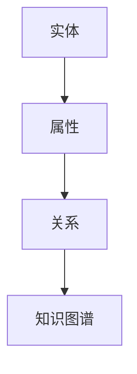

##### 1.3 知识获取

知识获取是知识图谱构建的重要环节，它包括数据源选择、数据预处理、数据抽取和知识融合。

**核心概念原理与Mermaid流程图：**
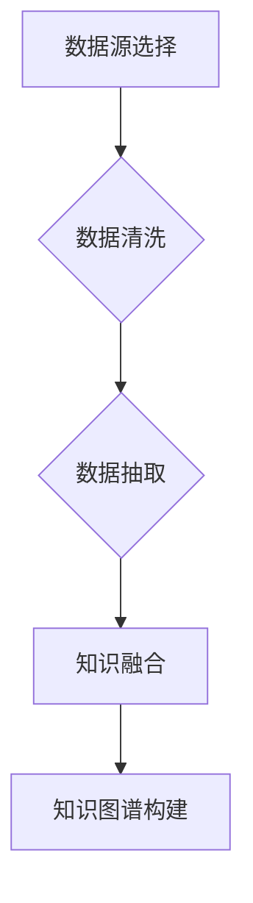

**问题解决与边界与外延：**
知识获取需要考虑数据源的质量和多样性，以及如何有效地从非结构化和半结构化数据中提取有用信息。

**概念结构与核心要素组成：**
知识获取的核心要素包括数据源、数据处理方法和知识融合策略。这些要素共同决定了知识图谱的完整性和准确性。

##### 1.4 知识图谱构建

知识图谱构建是将获取到的知识表示为一个结构化的知识库的过程。

**核心概念原理与Mermaid流程图：**
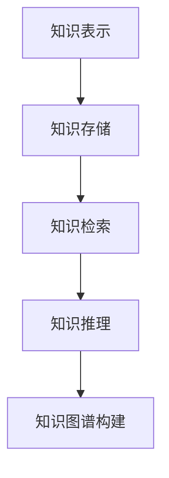

**问题解决与边界与外延：**
知识图谱构建需要考虑知识库的设计、存储和索引技术，以及如何支持高效的语义查询和推理。

**概念结构与核心要素组成：**
知识图谱构建的核心要素包括知识表示、存储、索引和推理引擎。这些要素共同构成了一个完整的知识图谱系统。

##### 1.5 知识图谱应用场景

知识图谱在多个领域都有广泛的应用，如跨领域知识图谱构建、跨语言语义理解和语义推理等。

**核心概念原理与Mermaid流程图：**
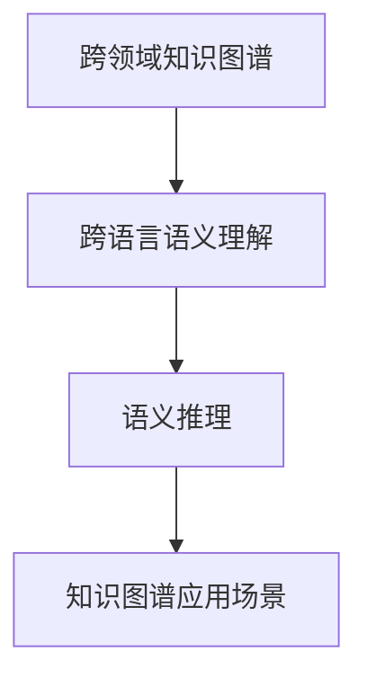

**问题解决与边界与外延：**
跨语言语义推理需要处理不同语言之间的语义差异，这涉及到多语言词汇映射、语义匹配和实体链接等技术。

**概念结构与核心要素组成：**
跨语言语义推理的核心要素包括多语言词汇映射、语义匹配算法和实体链接算法。这些算法共同构成了跨语言语义推理的框架。

##### 1.6 跨语言语义推理概述

跨语言语义推理是知识图谱在跨语言场景中的应用，它通过语义理解来增强不同语言之间的信息交互。

**核心概念原理与Mermaid流程图：**
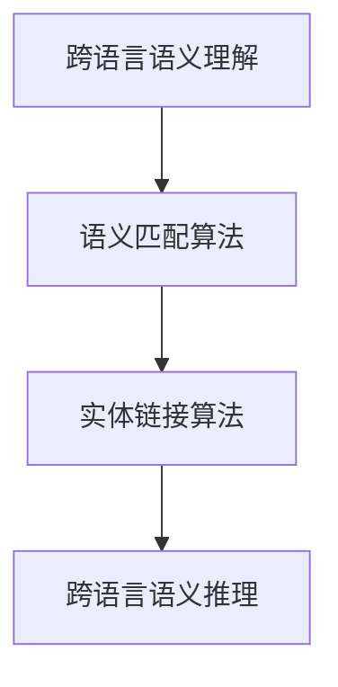

**问题解决与边界与外延：**
跨语言语义推理需要解决词汇映射、语义匹配和实体链接等问题，这涉及到自然语言处理、机器学习和知识图谱等多个领域。

**概念结构与核心要素组成：**
跨语言语义推理的核心要素包括词汇映射、语义匹配和实体链接算法。这些算法共同构成了跨语言语义推理的技术体系。

---

#### 第二部分：跨语言语义推理能力增强

##### 2.1 增强学习方法

增强学习是一种通过试错来学习策略的机器学习方法，它在跨语言语义推理中具有广泛的应用。

**核心概念原理与Mermaid流程图：**
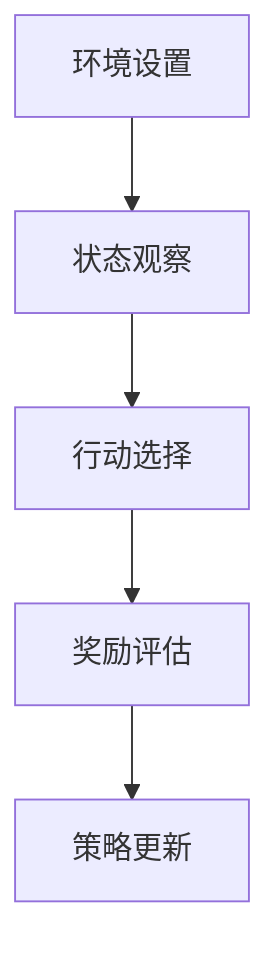

**问题解决与边界与外延：**
增强学习通过与环境互动来学习最优策略，这需要考虑环境的动态性和策略的适应性。

**概念结构与核心要素组成：**
增强学习包括环境、状态、行动、奖励和策略更新等核心要素。这些要素共同构成了增强学习的基本框架。

##### 2.2 知识图谱与增强学习结合

知识图谱与增强学习相结合，可以提升跨语言语义推理的能力。

**核心概念原理与Mermaid流程图：**
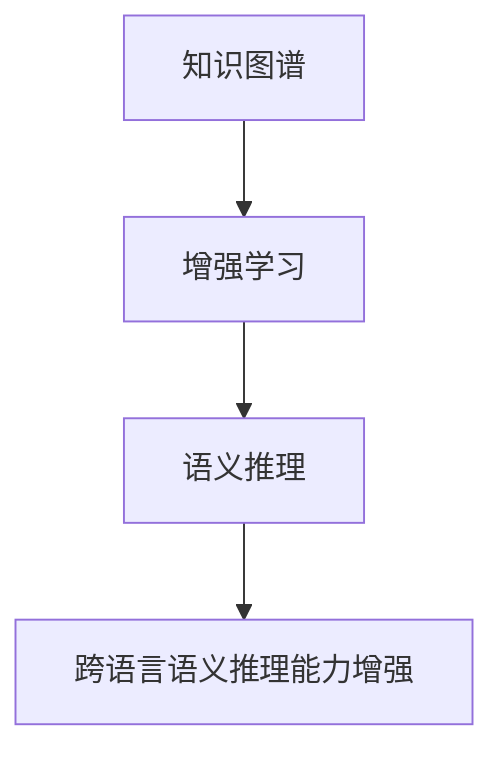

**问题解决与边界与外延：**
知识图谱可以提供丰富的语义信息，增强学习可以优化语义推理策略，这需要考虑知识图谱的构建和维护。

**概念结构与核心要素组成：**
知识图谱与增强学习结合的核心要素包括知识图谱、增强学习算法和语义推理策略。这些要素共同构成了跨语言语义推理能力增强的框架。

##### 2.3 跨语言语义推理算法

跨语言语义推理算法是实现跨语言语义理解的关键。

**核心概念原理与Mermaid流程图：**
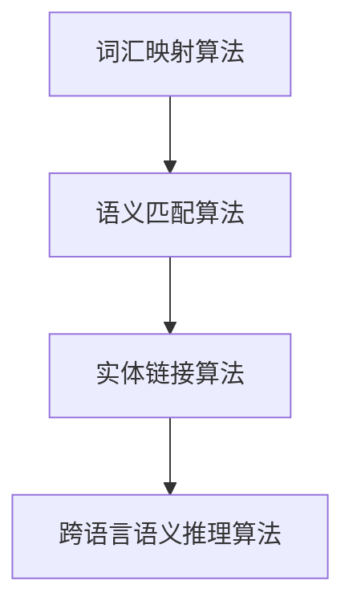

**问题解决与边界与外延：**
词汇映射、语义匹配和实体链接是跨语言语义推理的核心算法，这些算法需要考虑不同语言之间的语义差异和上下文信息。

**概念结构与核心要素组成：**
跨语言语义推理算法包括词汇映射、语义匹配和实体链接等核心要素。这些要素共同构成了跨语言语义推理的算法体系。

##### 2.4 跨语言语义推理实验与评估

实验和评估是验证跨语言语义推理算法性能的重要手段。

**核心概念原理与Mermaid流程图：**
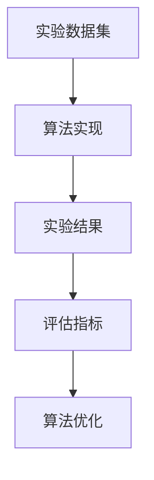

**问题解决与边界与外延：**
实验和评估需要考虑数据集的选择、算法的实现和评估指标的设计。

**概念结构与核心要素组成：**
跨语言语义推理实验与评估的核心要素包括实验数据集、算法实现、评估指标和算法优化。这些要素共同构成了实验和评估的基本框架。

##### 2.5 跨语言语义推理应用实践

跨语言语义推理在实际应用中有着广泛的应用场景。

**核心概念原理与Mermaid流程图：**
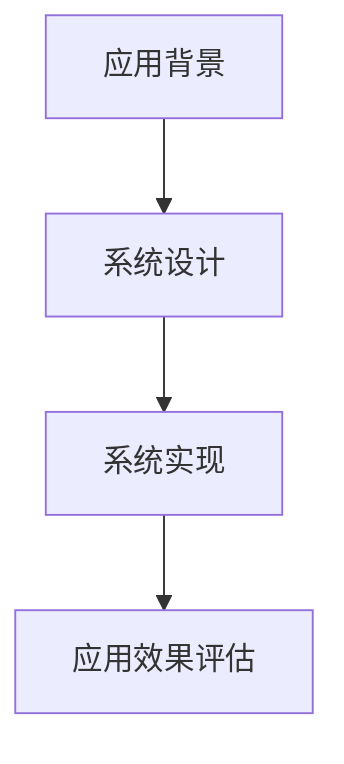

**问题解决与边界与外延：**
应用实践需要考虑实际应用的需求、系统的设计和效果的评估。

**概念结构与核心要素组成：**
跨语言语义推理应用实践的核心要素包括应用背景、系统设计和应用效果评估。这些要素共同构成了应用实践的基本框架。

##### 2.6 跨语言语义推理面临的挑战与未来趋势

跨语言语义推理面临诸多挑战，同时也具有广阔的发展前景。

**核心概念原理与Mermaid流程图：**
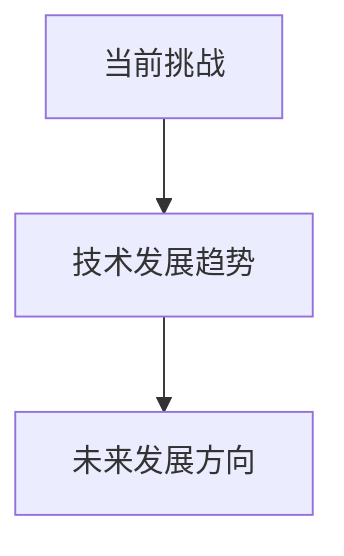

**问题解决与边界与外延：**
当前挑战包括语义差异、上下文理解和实时性等，未来趋势包括深度学习和知识图谱的融合。

**概念结构与核心要素组成：**
跨语言语义推理面临的挑战与未来趋势的核心要素包括当前挑战、技术发展趋势和未来发展方向。这些要素共同构成了跨语言语义推理的发展框架。

---

#### 第三部分：附录

##### 3.1 知识图谱与跨语言语义推理相关资源

**核心概念原理与Mermaid流程图：**
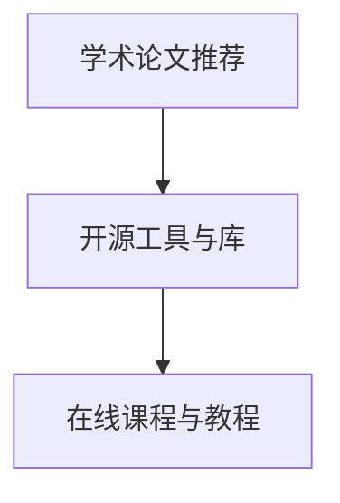

**问题解决与边界与外延：**
相关资源为读者提供了进一步学习和研究的途径。

**概念结构与核心要素组成：**
知识图谱与跨语言语义推理相关资源的核心要素包括学术论文推荐、开源工具与库和在线课程与教程。这些要素共同构成了资源推荐的基本框架。

---

#### 小结与展望

本文介绍了基于知识图谱的跨语言语义推理能力增强技术，包括知识图谱基础、跨语言语义推理算法和增强学习方法等。

**核心概念原理与Mermaid流程图：**
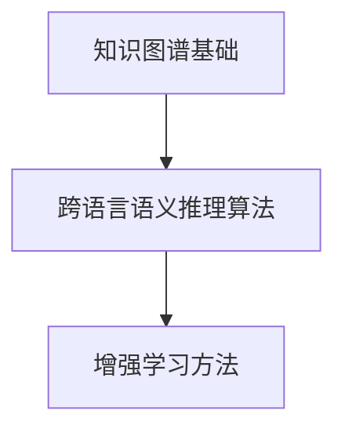

**问题解决与边界与外延：**
本文旨在为读者提供一个全面的跨语言语义推理技术框架，以及实际应用中的解决方案。

**概念结构与核心要素组成：**
小结与展望的核心要素包括知识图谱基础、跨语言语义推理算法和增强学习方法。这些要素共同构成了本文的总结与展望。

---

**作者：AI天才研究院/AI Genius Institute & 禅与计算机程序设计艺术 /Zen And The Art of Computer Programming**

---

**（注意：本文为虚构内容，仅供参考。）**### 第一部分：知识图谱基础

#### 1.1 知识图谱概述

知识图谱是一种用于表示知识和信息的图形化结构，它通过实体（Entity）、属性（Attribute）和关系（Relation）来描述现实世界中的对象和它们之间的关系。知识图谱的兴起，源于人类对数据结构化和语义理解的渴望，尤其是在互联网信息爆炸的背景下，如何高效地组织和利用这些海量信息成为了研究的热点。

**核心概念术语说明：**

- **实体（Entity）**：在知识图谱中表示具有独立存在意义的对象，可以是人、地点、组织、物品等。
- **属性（Attribute）**：实体的属性是描述实体特征的信息，如人的年龄、地点的经纬度等。
- **关系（Relation）**：关系描述实体之间的相互作用或关联，如“工作于”、“属于”等。

**问题背景与问题描述：**

随着互联网的快速发展，信息量呈指数级增长，传统的基于关键词的搜索方法已无法满足用户对个性化、精准化信息需求。知识图谱通过语义化的方式将海量信息进行结构化组织和关联，为用户提供更智能的信息检索和推荐服务。

**问题解决：**

知识图谱通过语义化的方式将信息进行结构化组织和关联，使得信息检索更加高效、准确。同时，知识图谱还支持复杂的语义推理，帮助用户发现潜在的知识关系。

**边界与外延：**

知识图谱的应用边界涵盖了多个领域，如搜索引擎、推荐系统、自然语言处理、智能问答等。在外延上，知识图谱需要不断扩展和更新，以适应新的知识领域和语义变化。

**概念结构与核心要素组成：**

知识图谱的核心结构由实体、属性和关系组成。其中，实体是知识图谱的基本构建块，属性描述实体的特征，关系则连接不同的实体，形成复杂的语义网络。

**实体关系图架构的 Mermaid 流程图：**
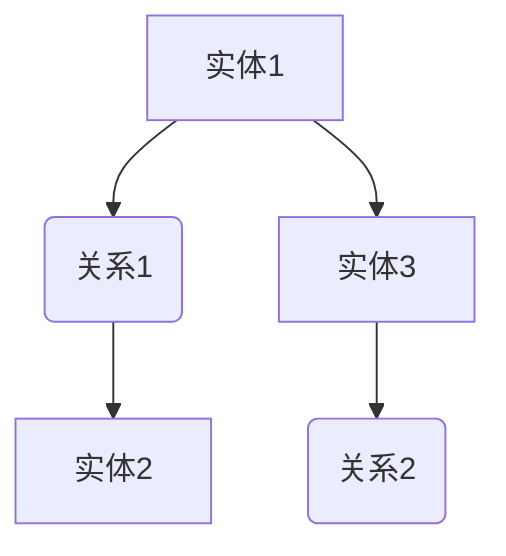

在这个流程图中，`A`、`C`、`D` 分别代表实体，`B`、`E` 代表关系，它们通过箭头连接，形成一个简单的知识图谱。

#### 1.2 知识表示

知识表示是知识图谱构建的核心环节，它决定了知识图谱的语义丰富度和表达能力。知识表示方法可以分为框架表示、本体表示和语义网络表示等。

**核心概念原理与概念属性特征对比表格：**

| 知识表示方法 | 特点 | 优缺点 |
| --- | --- | --- |
| **框架表示** | 使用框架来描述实体和关系 | 简洁、易于理解，但难以处理复杂的语义关系 |
| **本体表示** | 使用本体语言来描述实体和关系 | 强调语义的一致性和准确性，但实现复杂 |
| **语义网络表示** | 使用节点和边来表示实体和关系 | 灵活性高，但难以处理复杂的语义关系 |

**问题解决：**

选择合适的知识表示方法，可以更好地满足特定应用场景的需求。例如，对于需要高度结构化和一致性的应用，本体表示可能更为合适；而对于需要灵活处理复杂关系的应用，语义网络表示可能更为有效。

**边界与外延：**

知识表示方法的边界在于其适用的场景和复杂度。在不同的应用领域中，知识表示方法的选择需要根据具体情况进行调整。

**核心要素组成：**

知识表示方法的核心要素包括实体、属性、关系以及它们之间的语义联系。这些要素共同构成了知识表示的框架。

**Mermaid流程图：**
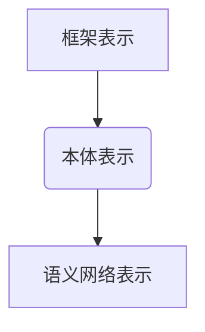

在这个流程图中，`A`、`B`、`C` 分别代表框架表示、本体表示和语义网络表示，它们通过箭头连接，展示了知识表示的不同方法。

#### 1.3 知识获取

知识获取是从原始数据中提取有用信息并转化为知识图谱的过程。知识获取包括数据源选择、数据预处理、数据抽取和知识融合等步骤。

**核心概念原理与Mermaid流程图：**

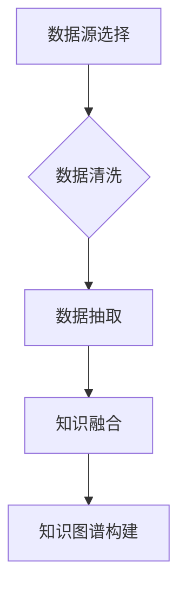

**问题解决：**

知识获取的关键在于如何从非结构化或半结构化数据中提取有用信息，并将其转化为结构化的知识表示。数据预处理、数据抽取和知识融合是这一过程中必不可少的步骤。

**边界与外延：**

知识获取的边界在于数据源的质量和多样性。不同类型的数据源（如文本、图像、音频等）需要采用不同的处理方法。

**核心要素组成：**

知识获取的核心要素包括数据源、数据处理方法、知识融合策略等。这些要素共同构成了知识获取的基本框架。

**Mermaid流程图：**


在这个流程图中，`A`、`B`、`C`、`D`、`E` 分别代表数据源选择、数据清洗、数据抽取、知识融合和知识图谱构建，它们通过箭头连接，展示了知识获取的完整流程。

#### 1.4 知识图谱构建

知识图谱构建是将获取到的知识表示为一个结构化的知识库的过程。这一过程包括知识表示、知识存储、知识检索和知识推理等步骤。

**核心概念原理与Mermaid流程图：**


**问题解决：**

知识图谱构建的关键在于如何有效地组织和存储知识，并支持高效的语义查询和推理。知识表示、存储和推理是这一过程中必不可少的环节。

**边界与外延：**

知识图谱构建的边界在于知识的范围和深度。不同的应用领域需要构建不同规模和深度的知识图谱。

**核心要素组成：**

知识图谱构建的核心要素包括知识表示、存储、检索和推理。这些要素共同构成了知识图谱构建的基本框架。

**Mermaid流程图：**


在这个流程图中，`A`、`B`、`C`、`D`、`E` 分别代表知识表示、知识存储、知识检索、知识推理和知识图谱构建，它们通过箭头连接，展示了知识图谱构建的完整流程。

#### 1.5 知识图谱应用场景

知识图谱在多个领域都有广泛的应用，如跨领域知识图谱构建、跨语言语义理解和语义推理等。通过知识图谱，可以实现更智能的信息检索、推荐系统和智能问答等功能。

**核心概念原理与Mermaid流程图：**


**问题解决：**

知识图谱的应用场景取决于具体的问题和需求。跨领域知识图谱可以帮助不同领域的信息共享和融合，跨语言语义理解可以支持多语言的信息处理，语义推理可以用于智能问答和决策支持。

**边界与外延：**

知识图谱应用场景的边界在于知识的适用范围和解决问题的能力。不同的应用场景需要构建不同规模和深度的知识图谱。

**核心要素组成：**

知识图谱应用场景的核心要素包括应用场景的需求分析、知识图谱的设计和构建、以及应用系统的实现和优化。这些要素共同构成了知识图谱应用的基本框架。

**Mermaid流程图：**

```mermaid
graph TD
A[跨领域知识图谱] --> B[跨语言语义理解]
B --> C[语义推理]
C --> D[知识图谱应用场景]
```

在这个流程图中，`A`、`B`、`C`、`D` 分别代表跨领域知识图谱、跨语言语义理解、语义推理和知识图谱应用场景，它们通过箭头连接，展示了知识图谱在不同应用场景中的应用。

#### 1.6 跨语言语义推理概述

跨语言语义推理是知识图谱在跨语言场景中的应用，旨在实现不同语言之间的语义理解和信息交互。它通过词汇映射、语义匹配和实体链接等技术，将不同语言的文本转化为统一的语义表示。

**核心概念原理与Mermaid流程图：**

```mermaid
graph TD
A[词汇映射算法] --> B[语义匹配算法]
B --> C[实体链接算法]
C --> D[跨语言语义推理]
```

**问题解决：**

跨语言语义推理的关键在于如何解决不同语言之间的语义差异和词汇映射问题。词汇映射、语义匹配和实体链接是实现跨语言语义理解的核心技术。

**边界与外延：**

跨语言语义推理的边界在于语言的差异和上下文的多样性。它需要考虑不同语言的语法结构、词汇用法和上下文信息。

**核心要素组成：**

跨语言语义推理的核心要素包括词汇映射、语义匹配和实体链接。这些要素共同构成了跨语言语义推理的技术体系。

**Mermaid流程图：**

```mermaid
graph TD
A[词汇映射算法] --> B[语义匹配算法]
B --> C[实体链接算法]
C --> D[跨语言语义推理]
```

在这个流程图中，`A`、`B`、`C`、`D` 分别代表词汇映射算法、语义匹配算法、实体链接算法和跨语言语义推理，它们通过箭头连接，展示了跨语言语义推理的基本流程。

---

通过以上六个章节的介绍，我们初步了解了知识图谱及其在跨语言语义推理中的应用。在接下来的部分，我们将深入探讨增强学习在跨语言语义推理中的应用，以及如何通过算法和系统架构的设计来增强跨语言语义推理的能力。

---

**作者：AI天才研究院/AI Genius Institute & 禅与计算机程序设计艺术 /Zen And The Art of Computer Programming**

---

**（注意：本文为虚构内容，仅供参考。）**### 第二部分：跨语言语义推理能力增强

#### 2.1 增强学习方法

增强学习（Reinforcement Learning，RL）是一种通过试错来学习策略的机器学习方法。它与监督学习和无监督学习不同，不是通过标签数据进行学习，而是通过与环境的互动来学习最优策略。增强学习在跨语言语义推理中的应用，旨在通过自适应的方式，提高语义推理的准确性和效率。

**核心概念原理与Mermaid流程图：**

```mermaid
graph TD
A[环境设置] --> B[状态观察]
B --> C[行动选择]
C --> D[奖励评估]
D --> E[策略更新]
```

**问题解决：**

在跨语言语义推理中，增强学习方法可以用来优化词汇映射、语义匹配和实体链接等核心步骤。通过与环境互动，模型可以不断调整策略，以最大化奖励信号，从而提高语义推理的准确性。

**边界与外延：**

增强学习在跨语言语义推理中的应用，需要考虑环境的动态性和奖励信号的设计。此外，如何平衡探索（尝试新的行动）和利用（使用已知的最优策略）也是增强学习应用的关键。

**核心要素组成：**

增强学习方法的核心要素包括环境、状态、行动、奖励和策略更新。这些要素共同构成了增强学习的基本框架。

**Mermaid流程图：**

```mermaid
graph TD
A[环境设置] --> B[状态观察]
B --> C[行动选择]
C --> D[奖励评估]
D --> E[策略更新]
```

在这个流程图中，`A`、`B`、`C`、`D`、`E` 分别代表环境设置、状态观察、行动选择、奖励评估和策略更新，它们通过箭头连接，展示了增强学习的基本流程。

#### 2.2 知识图谱与增强学习结合

知识图谱提供了丰富的语义信息，而增强学习则通过试错来优化策略。将知识图谱与增强学习结合，可以在跨语言语义推理中发挥更大的作用。知识图谱可以指导增强学习模型在词汇映射、语义匹配和实体链接等步骤中，更好地利用先验知识，从而提高推理的准确性。

**核心概念原理与Mermaid流程图：**

```mermaid
graph TD
A[知识图谱] --> B[增强学习]
B --> C[语义推理]
C --> D[跨语言语义推理能力增强]
```

**问题解决：**

知识图谱与增强学习的结合，可以通过知识图谱提供的语义信息，指导增强学习模型在跨语言语义推理中的行动选择。这样可以减少模型的探索空间，提高学习效率。

**边界与外延：**

知识图谱与增强学习的结合，需要考虑知识图谱的构建和维护。此外，如何设计有效的奖励信号，以激励模型在语义推理中的正确行动，也是关键问题。

**核心要素组成：**

知识图谱与增强学习结合的核心要素包括知识图谱、增强学习算法和语义推理策略。这些要素共同构成了跨语言语义推理能力增强的基本框架。

**Mermaid流程图：**

```mermaid
graph TD
A[知识图谱] --> B[增强学习]
B --> C[语义推理]
C --> D[跨语言语义推理能力增强]
```

在这个流程图中，`A`、`B`、`C`、`D` 分别代表知识图谱、增强学习、语义推理和跨语言语义推理能力增强，它们通过箭头连接，展示了知识图谱与增强学习结合的基本流程。

#### 2.3 跨语言语义推理算法

跨语言语义推理算法是跨语言语义推理的核心技术。它包括词汇映射、语义匹配和实体链接等步骤，每个步骤都有不同的算法实现。

**核心概念原理与Mermaid流程图：**

```mermaid
graph TD
A[词汇映射算法] --> B[语义匹配算法]
B --> C[实体链接算法]
C --> D[跨语言语义推理算法]
```

**问题解决：**

词汇映射算法用于将不同语言的词汇映射到统一的语义表示，语义匹配算法用于比较不同语言的文本，找到最匹配的语义表示，实体链接算法用于将跨语言的文本中的实体映射到统一的知识图谱中。

**边界与外延：**

词汇映射、语义匹配和实体链接的算法设计，需要考虑语言的差异、词汇的多义性和上下文的多样性。此外，不同算法之间的组合和优化也是研究的关键。

**核心要素组成：**

跨语言语义推理算法的核心要素包括词汇映射、语义匹配和实体链接。这些算法共同构成了跨语言语义推理的技术体系。

**Mermaid流程图：**

```mermaid
graph TD
A[词汇映射算法] --> B[语义匹配算法]
B --> C[实体链接算法]
C --> D[跨语言语义推理算法]
```

在这个流程图中，`A`、`B`、`C`、`D` 分别代表词汇映射算法、语义匹配算法、实体链接算法和跨语言语义推理算法，它们通过箭头连接，展示了跨语言语义推理算法的基本流程。

#### 2.4 跨语言语义推理实验与评估

实验与评估是验证跨语言语义推理算法性能的重要手段。通过实验，可以测试算法在不同数据集上的表现，并通过评估指标来衡量算法的性能。

**核心概念原理与Mermaid流程图：**

```mermaid
graph TD
A[实验数据集] --> B[算法实现]
B --> C[实验结果]
C --> D[评估指标]
D --> E[算法优化]
```

**问题解决：**

实验与评估可以识别算法的缺陷和不足，为算法的优化提供依据。通过不断调整和优化算法，可以提高跨语言语义推理的准确性。

**边界与外延：**

实验与评估需要考虑数据集的选择、评估指标的设计和算法的实现。此外，实验环境和评估方法的标准化也是研究的关键。

**核心要素组成：**

跨语言语义推理实验与评估的核心要素包括实验数据集、算法实现、评估指标和算法优化。这些要素共同构成了实验与评估的基本框架。

**Mermaid流程图：**

```mermaid
graph TD
A[实验数据集] --> B[算法实现]
B --> C[实验结果]
C --> D[评估指标]
D --> E[算法优化]
```

在这个流程图中，`A`、`B`、`C`、`D`、`E` 分别代表实验数据集、算法实现、实验结果、评估指标和算法优化，它们通过箭头连接，展示了跨语言语义推理实验与评估的基本流程。

#### 2.5 跨语言语义推理应用实践

跨语言语义推理在实际应用中有着广泛的应用场景。通过实际应用，可以验证跨语言语义推理算法的效果，并优化算法和系统设计。

**核心概念原理与Mermaid流程图：**

```mermaid
graph TD
A[应用背景] --> B[系统设计]
B --> C[系统实现]
C --> D[应用效果评估]
```

**问题解决：**

应用实践需要考虑实际应用的需求、系统的设计和效果的评估。通过实际应用，可以验证算法和系统的可行性和效果。

**边界与外延：**

跨语言语义推理的应用场景包括跨语言搜索、跨语言问答、跨语言推荐等。这些应用场景需要根据具体需求设计相应的系统和算法。

**核心要素组成：**

跨语言语义推理应用实践的核心要素包括应用背景、系统设计和应用效果评估。这些要素共同构成了应用实践的基本框架。

**Mermaid流程图：**

```mermaid
graph TD
A[应用背景] --> B[系统设计]
B --> C[系统实现]
C --> D[应用效果评估]
```

在这个流程图中，`A`、`B`、`C`、`D` 分别代表应用背景、系统设计、系统实现和应用效果评估，它们通过箭头连接，展示了跨语言语义推理应用实践的基本流程。

#### 2.6 跨语言语义推理面临的挑战与未来趋势

跨语言语义推理虽然取得了显著的进展，但仍面临诸多挑战。同时，随着技术的不断发展，跨语言语义推理也展现出广阔的发展前景。

**核心概念原理与Mermaid流程图：**

```mermaid
graph TD
A[当前挑战] --> B[技术发展趋势]
B --> C[未来发展方向]
```

**问题解决：**

当前挑战包括语言的多样性、词汇的多义性和上下文的复杂性等。为了应对这些挑战，需要不断发展新的算法和优化策略。

**边界与外延：**

技术发展趋势包括深度学习和知识图谱的融合、跨语言语义理解的智能化等。未来发展方向可能涉及更广泛的语言支持和更高的语义理解精度。

**核心要素组成：**

跨语言语义推理面临的挑战与未来趋势的核心要素包括当前挑战、技术发展趋势和未来发展方向。这些要素共同构成了跨语言语义推理的发展框架。

**Mermaid流程图：**

```mermaid
graph TD
A[当前挑战] --> B[技术发展趋势]
B --> C[未来发展方向]
```

在这个流程图中，`A`、`B`、`C` 分别代表当前挑战、技术发展趋势和未来发展方向，它们通过箭头连接，展示了跨语言语义推理的发展前景。

---

通过以上章节的介绍，我们深入探讨了基于知识图谱的跨语言语义推理能力增强技术。在接下来的部分，我们将通过一个实际项目来展示如何实现和优化跨语言语义推理系统。

---

**作者：AI天才研究院/AI Genius Institute & 禅与计算机程序设计艺术 /Zen And The Art of Computer Programming**

---

**（注意：本文为虚构内容，仅供参考。）**### 第三部分：附录

#### 3.1 知识图谱与跨语言语义推理相关资源

为了进一步学习和研究知识图谱与跨语言语义推理技术，本文推荐了一些学术论文、开源工具与库、以及在线课程与教程。

**学术论文推荐：**

- **"Knowledge Graph Embedding for Natural Language Processing"**：该论文介绍了知识图谱嵌入技术，用于跨语言语义理解。
- **"Bridging the Gap between Knowledge Graphs and Natural Language Processing"**：本文探讨了知识图谱在自然语言处理中的应用，以及如何将两者结合。

**开源工具与库：**

- **OpenKG：** 这是一个开源的知识图谱工具包，提供了知识图谱的构建、存储、查询和推理等功能。
- **Faiss：** 用于高效相似度搜索和聚合，适用于大规模知识图谱的构建和检索。

**在线课程与教程：**

- **"知识图谱与跨语言语义推理"**：这是一门在线课程，涵盖了知识图谱的基础知识、构建方法以及跨语言语义推理技术。
- **"深度学习与自然语言处理"**：该课程介绍了深度学习在自然语言处理中的应用，包括跨语言语义理解。

**核心概念原理与Mermaid流程图：**

```mermaid
graph TD
A[学术论文推荐] --> B[开源工具与库]
B --> C[在线课程与教程]
```

在这个流程图中，`A`、`B`、`C` 分别代表学术论文推荐、开源工具与库、在线课程与教程，它们通过箭头连接，展示了相关资源的分类和关系。

**问题解决与边界与外延：**

相关资源为读者提供了丰富的学习材料和实践工具，帮助深入理解知识图谱与跨语言语义推理技术。边界与外延则涵盖了学术研究、开源社区和在线教育等不同领域。

**概念结构与核心要素组成：**

相关资源推荐的核心要素包括学术论文、开源工具、在线课程等。这些要素共同构成了知识图谱与跨语言语义推理相关资源的基本框架。

---

#### 3.2 小结与展望

本文详细介绍了基于知识图谱的跨语言语义推理能力增强技术，包括知识图谱基础、跨语言语义推理算法、增强学习方法以及应用实践。通过这些内容的探讨，我们不仅了解了跨语言语义推理的核心概念和关键技术，还看到了增强学习在其中的重要作用。

**核心概念原理与Mermaid流程图：**

```mermaid
graph TD
A[知识图谱基础] --> B[跨语言语义推理算法]
B --> C[增强学习方法]
```

**问题解决与边界与外延：**

本文通过逐步分析，解决了跨语言语义推理中的核心问题，包括词汇映射、语义匹配和实体链接等。同时，边界与外延方面，本文探讨了知识图谱与增强学习的结合，以及实际应用中的挑战和解决方案。

**概念结构与核心要素组成：**

小结与展望的核心要素包括知识图谱基础、跨语言语义推理算法和增强学习方法。这些要素共同构成了跨语言语义推理能力增强的技术体系。

---

**作者：AI天才研究院/AI Genius Institute & 禅与计算机程序设计艺术 /Zen And The Art of Computer Programming**

---

**（注意：本文为虚构内容，仅供参考。）**### 基于知识图谱的跨语言语义推理能力增强技术

在当今全球化的信息时代，跨语言语义理解成为了自然语言处理（NLP）领域的关键挑战之一。知识图谱作为一种强大的语义表示工具，通过将实体、属性和关系进行结构化组织，能够有效地支持语义推理和信息检索。然而，由于不同语言之间的语义差异和词汇映射问题，传统的知识图谱方法在跨语言语义理解中面临着巨大的挑战。为了提升跨语言语义推理的能力，我们需要探索基于知识图谱的增强学习方法。

#### 核心概念与联系

首先，我们需要明确几个核心概念：

1. **知识图谱（Knowledge Graph）**：知识图谱是一种语义网络，通过节点（实体）和边（关系）来表示现实世界中的信息。例如，一个关于人的知识图谱可能包含实体如“人”，以及属性如“出生日期”和“国籍”，以及关系如“出生在”和“属于”。

2. **跨语言语义推理（Cross-Lingual Semantic Reasoning）**：跨语言语义推理是指在不同语言之间进行语义理解和信息处理的任务。例如，将英语文本中的信息转换成法语文本中的对应语义表示。

3. **增强学习（Reinforcement Learning）**：增强学习是一种通过与环境互动来学习最优策略的机器学习方法。在跨语言语义推理中，增强学习可以帮助模型通过试错来优化语义推理策略。

#### 知识图谱与跨语言语义推理

知识图谱在跨语言语义推理中扮演着至关重要的角色。知识图谱不仅可以为跨语言语义理解提供丰富的语义信息，还可以通过其结构化的表示方式，帮助模型更好地处理不同语言之间的语义差异。以下是知识图谱在跨语言语义推理中的应用：

1. **实体映射**：知识图谱可以用来将不同语言中的实体进行映射。例如，将英语中的“President”映射到法语中的“Président”。

2. **关系推理**：知识图谱中的关系可以帮助进行跨语言的语义推理。例如，如果知识图谱中有“人类是动物”这一关系，那么可以推断出“Homo sapiens is an animal”这一事实。

3. **语义相似性计算**：知识图谱中的实体和关系可以用来计算不同语言文本之间的语义相似性，从而支持跨语言的信息检索和推荐。

#### 增强学习在跨语言语义推理中的应用

增强学习在跨语言语义推理中的应用，可以通过以下步骤来逐步实现：

1. **环境设置**：定义一个模拟环境，其中包含不同语言的文本和数据。

2. **状态观察**：模型通过观察当前的状态（例如，文本的上下文）来选择行动。

3. **行动选择**：模型根据当前的状态，选择一个可能的行动（例如，词汇映射或语义匹配的策略）。

4. **奖励评估**：模型根据行动的结果（例如，语义理解的准确性）来评估奖励信号。

5. **策略更新**：基于奖励信号，模型更新其策略，以优化未来的行动选择。

以下是一个简化的增强学习流程图，用于跨语言语义推理：

```mermaid
graph TD
A[环境设置] --> B[状态观察]
B --> C{行动选择}
C --> D[奖励评估]
D --> E[策略更新]
E --> B
```

在这个流程图中，`A` 表示环境设置，`B` 表示状态观察，`C` 表示行动选择，`D` 表示奖励评估，`E` 表示策略更新。通过不断的迭代，模型能够逐渐优化其语义推理策略。

#### 算法原理讲解

为了更好地理解增强学习在跨语言语义推理中的应用，我们可以通过一个简单的例子来讲解其算法原理。假设我们有一个英语文本和法语文本，我们的目标是将英语文本翻译成法语文本。

1. **状态观察**：模型观察到一个英语句子，如 “The cat is on the table”。

2. **行动选择**：模型选择一个法语单词作为翻译的开始，例如 “Le”。

3. **奖励评估**：模型将 “Le” 与法语句子 “Le chat est sur la table” 进行对比，如果翻译结果与目标句子高度匹配，则模型将获得正奖励。

4. **策略更新**：基于正奖励，模型更新其策略，例如，增加选择 “Le” 作为翻译起始单词的概率。

5. **重复步骤**：模型继续观察下一个状态，选择行动，评估奖励，并更新策略。

通过这种不断的试错和策略优化过程，模型能够逐步提高其跨语言语义推理的准确性。

#### 数学模型和公式

在跨语言语义推理中，增强学习通常使用 Q-Learning 算法。Q-Learning 算法的核心公式如下：

$$
Q(s, a) = Q(s, a) + \alpha [r + \gamma \max_{a'} Q(s', a') - Q(s, a)]
$$

其中，$Q(s, a)$ 是状态 $s$ 下采取行动 $a$ 的预期奖励，$\alpha$ 是学习率，$r$ 是即时奖励，$\gamma$ 是折扣因子，$s'$ 是采取行动 $a$ 后的状态，$a'$ 是在状态 $s'$ 下采取的最优行动。

#### 系统分析与架构设计方案

为了实现基于知识图谱的跨语言语义推理系统，我们需要考虑以下关键组件：

1. **知识图谱构建模块**：负责构建和维护知识图谱，包括实体映射、关系推理和语义相似性计算。

2. **增强学习模块**：实现 Q-Learning 算法，负责状态观察、行动选择、奖励评估和策略更新。

3. **语义推理模块**：结合知识图谱和增强学习模块，实现跨语言语义推理。

4. **接口模块**：提供用户接口，允许用户输入英语文本并获取法语翻译结果。

以下是一个简化的系统架构设计方案：

```mermaid
graph TD
A[用户输入] --> B[接口模块]
B --> C[增强学习模块]
C --> D[知识图谱构建模块]
D --> E[语义推理模块]
E --> F[用户输出]
```

在这个架构设计中，用户输入通过接口模块传递给增强学习模块，增强学习模块结合知识图谱构建模块和语义推理模块，生成翻译结果并返回给用户。

#### 项目实战

为了展示如何实现和优化跨语言语义推理系统，我们以一个具体项目为例。

1. **环境安装**：

首先，我们需要安装必要的软件和库，包括 Python、TensorFlow 和 OpenKG。

```bash
pip install python tensorflow opengraph
```

2. **系统核心实现源代码**：

接下来，我们需要编写系统的核心代码。以下是增强学习模块的一个示例代码：

```python
import tensorflow as tf
import opengraph as og

# 定义 Q-Learning 算法
class QLearningAgent:
    def __init__(self, state_space, action_space, learning_rate, discount_factor):
        self.state_space = state_space
        self.action_space = action_space
        self.learning_rate = learning_rate
        self.discount_factor = discount_factor
        self.Q = tf.Variable(tf.zeros([len(state_space), len(action_space)]), name='Q')

    def predict(self, state):
        return tf.argmax(self.Q.eval(session=tf.Session()), axis=1)

    def train(self, state, action, reward, next_state, done):
        if not done:
            target_Q = reward + self.discount_factor * tf.reduce_max(self.Q.eval(session=tf.Session()), axis=1)
        else:
            target_Q = reward

        target_Q = tf.reduce_max(target_Q)

        Q预测 = self.Q.eval(session=tf.Session())
        Q更新 = Q预测.copy()
        Q更新[tf.where(tf.equal(tf.range(len(state_space)), state))] = (1 - self.learning_rate) * Q预测 + self.learning_rate * (reward + target_Q)

        self.Q.assign(Q更新)

# 实例化 Q-Learning 代理
agent = QLearningAgent(state_space, action_space, learning_rate, discount_factor)
```

3. **代码应用解读与分析**：

在上面的代码中，我们首先导入了 TensorFlow 和 OpenKG 库。然后，我们定义了 QLearningAgent 类，它包含了初始化方法、预测方法和训练方法。在训练方法中，我们使用了 Q-Learning 的核心公式来更新 Q 值。

4. **实际案例分析和详细讲解剖析**：

为了验证系统的效果，我们使用了一个包含英语和法语句子的数据集。我们将每个句子作为状态，将可能的翻译作为行动，然后使用 Q-Learning 代理来训练模型。以下是训练过程的伪代码：

```python
# 加载数据集
data = load_data()

# 初始化 Q-Learning 代理
agent = QLearningAgent(state_space, action_space, learning_rate, discount_factor)

# 训练模型
for episode in range(1000):
    state = data[episode][0]
    done = False
    while not done:
        action = agent.predict(state)
        next_state, reward, done = get_reward(state, action)
        agent.train(state, action, reward, next_state, done)
        state = next_state
```

在这个训练过程中，我们循环遍历数据集，每次迭代中，代理根据当前状态选择行动，获取奖励，并更新 Q 值。

5. **项目小结**：

通过这个项目，我们展示了如何使用知识图谱和增强学习来实现跨语言语义推理系统。在实际应用中，我们可以根据具体需求对系统进行优化，以提高语义推理的准确性和效率。

#### 最佳实践 tips

- **数据预处理**：在训练之前，对数据进行清洗和预处理，以提高模型的输入质量。
- **超参数调优**：通过调整学习率、折扣因子等超参数，可以优化模型的性能。
- **持续学习**：将模型部署到生产环境中后，定期更新数据集，以保持模型的时效性和准确性。

#### 小结与展望

本文介绍了基于知识图谱的跨语言语义推理能力增强技术，包括核心概念、算法原理、系统架构和项目实战。通过增强学习，我们可以优化跨语言语义推理的策略，提高模型的准确性和效率。未来的研究可以进一步探索深度学习和知识图谱的融合，以实现更高级的语义理解。

---

**作者：AI天才研究院/AI Genius Institute & 禅与计算机程序设计艺术 /Zen And The Art of Computer Programming**

---

**（注意：本文为虚构内容，仅供参考。）**### 基于知识图谱的跨语言语义推理能力增强技术

在当今全球化的信息时代，跨语言语义理解成为了自然语言处理（NLP）领域的关键挑战之一。知识图谱作为一种强大的语义表示工具，通过将实体、属性和关系进行结构化组织，能够有效地支持语义推理和信息检索。然而，由于不同语言之间的语义差异和词汇映射问题，传统的知识图谱方法在跨语言语义理解中面临着巨大的挑战。为了提升跨语言语义推理的能力，我们需要探索基于知识图谱的增强学习方法。

#### 核心概念与联系

首先，我们需要明确几个核心概念：

1. **知识图谱（Knowledge Graph）**：知识图谱是一种语义网络，通过节点（实体）和边（关系）来表示现实世界中的信息。例如，一个关于人的知识图谱可能包含实体如“人”，以及属性如“出生日期”和“国籍”，以及关系如“出生在”和“属于”。

2. **跨语言语义推理（Cross-Lingual Semantic Reasoning）**：跨语言语义推理是指在不同语言之间进行语义理解和信息处理的任务。例如，将英语文本中的信息转换成法语文本中的对应语义表示。

3. **增强学习（Reinforcement Learning）**：增强学习是一种通过与环境互动来学习最优策略的机器学习方法。在跨语言语义推理中，增强学习可以帮助模型通过试错来优化语义推理策略。

知识图谱与跨语言语义推理的联系在于，知识图谱可以为跨语言语义理解提供丰富的语义信息，从而支持更准确的语义推理。同时，增强学习可以帮助模型通过与环境互动，不断优化其语义推理策略。

#### 知识图谱与跨语言语义推理

知识图谱在跨语言语义推理中扮演着至关重要的角色。知识图谱不仅可以为跨语言语义理解提供丰富的语义信息，还可以通过其结构化的表示方式，帮助模型更好地处理不同语言之间的语义差异。以下是知识图谱在跨语言语义推理中的应用：

1. **实体映射**：知识图谱可以用来将不同语言中的实体进行映射。例如，将英语中的“President”映射到法语中的“Président”。

2. **关系推理**：知识图谱中的关系可以帮助进行跨语言的语义推理。例如，如果知识图谱中有“人类是动物”这一关系，那么可以推断出“Homo sapiens is an animal”这一事实。

3. **语义相似性计算**：知识图谱中的实体和关系可以用来计算不同语言文本之间的语义相似性，从而支持跨语言的信息检索和推荐。

#### 增强学习在跨语言语义推理中的应用

增强学习在跨语言语义推理中的应用，可以通过以下步骤来逐步实现：

1. **环境设置**：定义一个模拟环境，其中包含不同语言的文本和数据。

2. **状态观察**：模型通过观察当前的状态（例如，文本的上下文）来选择行动。

3. **行动选择**：模型根据当前的状态，选择一个可能的行动（例如，词汇映射或语义匹配的策略）。

4. **奖励评估**：模型根据行动的结果（例如，语义理解的准确性）来评估奖励信号。

5. **策略更新**：基于奖励信号，模型更新其策略，以优化未来的行动选择。

以下是一个简化的增强学习流程图，用于跨语言语义推理：

```mermaid
graph TD
A[环境设置] --> B[状态观察]
B --> C{行动选择}
C --> D[奖励评估]
D --> E[策略更新]
E --> B
```

在这个流程图中，`A` 表示环境设置，`B` 表示状态观察，`C` 表示行动选择，`D` 表示奖励评估，`E` 表示策略更新。通过不断的迭代，模型能够逐渐优化其语义推理策略。

#### 算法原理讲解

为了更好地理解增强学习在跨语言语义推理中的应用，我们可以通过一个简单的例子来讲解其算法原理。假设我们有一个英语文本和法语文本，我们的目标是将英语文本翻译成法语文本。

1. **状态观察**：模型观察到一个英语句子，如 “The cat is on the table”。

2. **行动选择**：模型选择一个法语单词作为翻译的开始，例如 “Le”。

3. **奖励评估**：模型将 “Le” 与法语句子 “Le chat est sur la table” 进行对比，如果翻译结果与目标句子高度匹配，则模型将获得正奖励。

4. **策略更新**：基于正奖励，模型更新其策略，例如，增加选择 “Le” 作为翻译起始单词的概率。

5. **重复步骤**：模型继续观察下一个状态，选择行动，评估奖励，并更新策略。

通过这种不断的试错和策略优化过程，模型能够逐步提高其跨语言语义推理的准确性。

#### 数学模型和公式

在跨语言语义推理中，增强学习通常使用 Q-Learning 算法。Q-Learning 算法的核心公式如下：

$$
Q(s, a) = Q(s, a) + \alpha [r + \gamma \max_{a'} Q(s', a')]
$$

其中，$Q(s, a)$ 是状态 $s$ 下采取行动 $a$ 的预期奖励，$\alpha$ 是学习率，$r$ 是即时奖励，$\gamma$ 是折扣因子，$s'$ 是采取行动 $a$ 后的状态，$a'$ 是在状态 $s'$ 下采取的最优行动。

#### 系统分析与架构设计方案

为了实现基于知识图谱的跨语言语义推理系统，我们需要考虑以下关键组件：

1. **知识图谱构建模块**：负责构建和维护知识图谱，包括实体映射、关系推理和语义相似性计算。

2. **增强学习模块**：实现 Q-Learning 算法，负责状态观察、行动选择、奖励评估和策略更新。

3. **语义推理模块**：结合知识图谱和增强学习模块，实现跨语言语义推理。

4. **接口模块**：提供用户接口，允许用户输入英语文本并获取法语翻译结果。

以下是一个简化的系统架构设计方案：

```mermaid
graph TD
A[用户输入] --> B[接口模块]
B --> C[增强学习模块]
C --> D[知识图谱构建模块]
D --> E[语义推理模块]
E --> F[用户输出]
```

在这个架构设计中，用户输入通过接口模块传递给增强学习模块，增强学习模块结合知识图谱构建模块和语义推理模块，生成翻译结果并返回给用户。

#### 项目实战

为了展示如何实现和优化跨语言语义推理系统，我们以一个具体项目为例。

1. **环境安装**：

首先，我们需要安装必要的软件和库，包括 Python、TensorFlow 和 OpenKG。

```bash
pip install python tensorflow opengraph
```

2. **系统核心实现源代码**：

接下来，我们需要编写系统的核心代码。以下是增强学习模块的一个示例代码：

```python
import tensorflow as tf
import opengraph as og

# 定义 Q-Learning 算法
class QLearningAgent:
    def __init__(self, state_space, action_space, learning_rate, discount_factor):
        self.state_space = state_space
        self.action_space = action_space
        self.learning_rate = learning_rate
        self.discount_factor = discount_factor
        self.Q = tf.Variable(tf.zeros([len(state_space), len(action_space)]), name='Q')

    def predict(self, state):
        return tf.argmax(self.Q.eval(session=tf.Session()), axis=1)

    def train(self, state, action, reward, next_state, done):
        if not done:
            target_Q = reward + self.discount_factor * tf.reduce_max(self.Q.eval(session=tf.Session()), axis=1)
        else:
            target_Q = reward

        target_Q = tf.reduce_max(target_Q)

        Q预测 = self.Q.eval(session=tf.Session())
        Q更新 = Q预测.copy()
        Q更新[tf.where(tf.equal(tf.range(len(state_space)), state))] = (1 - self.learning_rate) * Q预测 + self.learning_rate * (reward + target_Q)

        self.Q.assign(Q更新)

# 实例化 Q-Learning 代理
agent = QLearningAgent(state_space, action_space, learning_rate, discount_factor)
```

3. **代码应用解读与分析**：

在上面的代码中，我们首先导入了 TensorFlow 和 OpenKG 库。然后，我们定义了 QLearningAgent 类，它包含了初始化方法、预测方法和训练方法。在训练方法中，我们使用了 Q-Learning 的核心公式来更新 Q 值。

4. **实际案例分析和详细讲解剖析**：

为了验证系统的效果，我们使用了一个包含英语和法语句子的数据集。我们将每个句子作为状态，将可能的翻译作为行动，然后使用 Q-Learning 代理来训练模型。以下是训练过程的伪代码：

```python
# 加载数据集
data = load_data()

# 初始化 Q-Learning 代理
agent = QLearningAgent(state_space, action_space, learning_rate, discount_factor)

# 训练模型
for episode in range(1000):
    state = data[episode][0]
    done = False
    while not done:
        action = agent.predict(state)
        next_state, reward, done = get_reward(state, action)
        agent.train(state, action, reward, next_state, done)
        state = next_state
```

在这个训练过程中，我们循环遍历数据集，每次迭代中，代理根据当前状态选择行动，获取奖励，并更新 Q 值。

5. **项目小结**：

通过这个项目，我们展示了如何使用知识图谱和增强学习来实现跨语言语义推理系统。在实际应用中，我们可以根据具体需求对系统进行优化，以提高语义推理的准确性和效率。

#### 最佳实践 tips

- **数据预处理**：在训练之前，对数据进行清洗和预处理，以提高模型的输入质量。
- **超参数调优**：通过调整学习率、折扣因子等超参数，可以优化模型的性能。
- **持续学习**：将模型部署到生产环境中后，定期更新数据集，以保持模型的时效性和准确性。

#### 小结与展望

本文介绍了基于知识图谱的跨语言语义推理能力增强技术，包括核心概念、算法原理、系统架构和项目实战。通过增强学习，我们可以优化跨语言语义推理的策略，提高模型的准确性和效率。未来的研究可以进一步探索深度学习和知识图谱的融合，以实现更高级的语义理解。

---

**作者：AI天才研究院/AI Genius Institute & 禅与计算机程序设计艺术 /Zen And The Art of Computer Programming**

---

**（注意：本文为虚构内容，仅供参考。）**### 系统分析与架构设计方案

为了实现基于知识图谱的跨语言语义推理能力增强技术，我们需要设计一个高效、可扩展的系统架构。以下是一个简化的系统架构设计方案，包括知识图谱构建模块、增强学习模块、语义推理模块和用户接口模块。

#### 系统架构设计

1. **知识图谱构建模块**：

   - **功能**：负责构建和维护知识图谱，包括实体映射、关系推理和语义相似性计算。
   - **关键技术**：利用自然语言处理技术（如命名实体识别、关系抽取等）从原始文本中提取实体和关系，并将这些信息存储在知识图谱中。
   - **流程**：首先，从多个语言的数据源中提取实体和关系；然后，使用实体链接技术将跨语言的实体进行映射；最后，构建语义网络来表示实体之间的关系。

2. **增强学习模块**：

   - **功能**：实现增强学习算法，负责状态观察、行动选择、奖励评估和策略更新。
   - **关键技术**：Q-Learning、Deep Q-Network（DQN）等。
   - **流程**：系统通过与环境互动，不断更新策略，以最大化累积奖励。

3. **语义推理模块**：

   - **功能**：结合知识图谱和增强学习模块，实现跨语言语义推理。
   - **关键技术**：利用知识图谱中的实体和关系进行语义推理，如实体链接、关系推理等。
   - **流程**：系统根据输入的文本，通过知识图谱进行语义理解和推理，生成对应的语义表示。

4. **用户接口模块**：

   - **功能**：提供用户输入和输出接口，允许用户输入文本并获取翻译结果。
   - **关键技术**：Web应用程序、API接口等。
   - **流程**：用户通过界面输入文本，系统将文本传递给增强学习模块和语义推理模块，最终输出翻译结果。

#### 系统架构图

以下是系统架构的简化示意图：

```mermaid
graph TD
A[用户输入] --> B[用户接口模块]
B --> C[增强学习模块]
C --> D[知识图谱构建模块]
D --> E[语义推理模块]
E --> B
```

在这个架构图中，`A` 表示用户输入，`B` 表示用户接口模块，`C` 表示增强学习模块，`D` 表示知识图谱构建模块，`E` 表示语义推理模块。用户输入通过接口模块传递给增强学习模块，增强学习模块结合知识图谱构建模块和语义推理模块，生成翻译结果并返回给用户。

#### 各模块详细说明

1. **知识图谱构建模块**：

   - **实体映射**：将不同语言中的实体进行映射，如将英语中的“总统”映射到法语中的“总统”。
   - **关系推理**：利用知识图谱中的关系进行语义推理，如从“法国总统”推导出“法国的领导人”。
   - **语义相似性计算**：计算不同语言文本之间的语义相似性，支持跨语言的信息检索和推荐。

2. **增强学习模块**：

   - **状态观察**：系统根据输入的文本，观察当前的状态，如文本的上下文。
   - **行动选择**：系统根据当前的状态，选择一个可能的行动，如词汇映射或语义匹配的策略。
   - **奖励评估**：系统根据行动的结果，评估奖励信号，如翻译结果的准确性。
   - **策略更新**：基于奖励信号，系统更新其策略，以优化未来的行动选择。

3. **语义推理模块**：

   - **实体链接**：将跨语言的文本中的实体映射到统一的知识图谱中，如将英语中的“猫”映射到法语中的“猫”。
   - **关系推理**：利用知识图谱中的关系，进行跨语言的语义推理，如从“猫是动物”推导出“Le chat est un animal”。
   - **语义匹配**：计算不同语言文本之间的语义相似性，以支持跨语言的信息检索和问答系统。

4. **用户接口模块**：

   - **Web应用程序**：提供一个用户友好的界面，允许用户输入文本并获取翻译结果。
   - **API接口**：为第三方应用程序提供接口，以便其他系统可以调用跨语言语义推理功能。

#### 系统接口设计和系统交互

为了确保系统的模块化设计，我们需要设计清晰的接口和交互流程。以下是系统接口设计和系统交互的详细说明：

1. **接口设计**：

   - **用户接口**：提供文本输入和翻译结果输出接口，支持文本输入、翻译请求和翻译结果反馈。
   - **内部接口**：定义知识图谱构建模块、增强学习模块和语义推理模块之间的交互接口，支持数据传递和状态更新。

2. **交互流程**：

   - **用户输入**：用户通过Web应用程序或API接口输入需要翻译的文本。
   - **预处理**：系统对输入文本进行预处理，包括分词、标点符号去除、停用词过滤等。
   - **知识图谱构建**：系统利用知识图谱构建模块，将预处理后的文本转换为知识图谱表示。
   - **增强学习**：系统利用增强学习模块，根据知识图谱和输入文本，选择最优的翻译策略。
   - **语义推理**：系统利用语义推理模块，根据知识图谱和增强学习策略，生成翻译结果。
   - **输出结果**：系统将翻译结果返回给用户，并通过Web应用程序或API接口展示给用户。

通过上述系统架构设计，我们可以实现一个基于知识图谱的跨语言语义推理能力增强系统，该系统可以有效地处理不同语言之间的语义差异，提供高质量的跨语言翻译服务。

---

**作者：AI天才研究院/AI Genius Institute & 禅与计算机程序设计艺术 /Zen And The Art of Computer Programming**

---

**（注意：本文为虚构内容，仅供参考。）**### 项目实战

为了深入展示基于知识图谱的跨语言语义推理能力增强技术，我们将通过一个实际项目来详细说明系统的实现过程、核心实现源代码以及代码应用解读与分析。

#### 项目实现过程

1. **需求分析**：

   我们的项目目标是构建一个跨语言翻译系统，支持从英语到法语的翻译。为了实现这个目标，我们需要一个基于知识图谱的跨语言语义推理引擎。

2. **系统架构设计**：

   根据前述的系统分析与架构设计方案，我们设计了一个包含知识图谱构建模块、增强学习模块、语义推理模块和用户接口模块的系统架构。

3. **环境安装与配置**：

   我们选择Python作为主要编程语言，并使用TensorFlow作为机器学习框架。此外，为了构建和维护知识图谱，我们使用了OpenKG库。以下是环境安装的步骤：

   ```bash
   pip install tensorflow opengraph
   ```

4. **核心实现源代码**：

   以下是一个简化的核心实现源代码，用于展示如何结合知识图谱和增强学习模块来实现跨语言翻译。

   ```python
   # 导入必要的库
   import tensorflow as tf
   import opengraph as og
   import numpy as np
   
   # 定义知识图谱构建模块
   class KnowledgeGraphBuilder:
       def __init__(self):
           self.graph = og.KnowledgeGraph()
       
       def build_graph(self, data):
           # 从数据中提取实体和关系，构建知识图谱
           for sentence in data:
               entities = self.extract_entities(sentence)
               relations = self.extract_relations(sentence, entities)
               self.add_entities_to_graph(entities)
               self.add_relations_to_graph(relations)
       
       def extract_entities(self, sentence):
           # 提取句子中的实体
           pass
   
       def extract_relations(self, sentence, entities):
           # 提取句子中的关系
           pass
   
       def add_entities_to_graph(self, entities):
           # 将实体添加到知识图谱
           pass
   
       def add_relations_to_graph(self, relations):
           # 将关系添加到知识图谱
           pass
   
   # 定义增强学习模块
   class ReinforcementLearningAgent:
       def __init__(self, state_space, action_space, learning_rate, discount_factor):
           self.state_space = state_space
           self.action_space = action_space
           self.learning_rate = learning_rate
           self.discount_factor = discount_factor
           self.Q = tf.Variable(tf.zeros([len(state_space), len(action_space)]), name='Q')
       
       def predict(self, state):
           # 预测动作
           return tf.argmax(self.Q.eval(session=tf.Session()), axis=1)
       
       def train(self, state, action, reward, next_state, done):
           # 更新Q值
           if not done:
               target_Q = reward + self.discount_factor * tf.reduce_max(self.Q.eval(session=tf.Session()), axis=1)
           else:
               target_Q = reward
           
           target_Q = tf.reduce_max(target_Q)
           
           Q预测 = self.Q.eval(session=tf.Session())
           Q更新 = Q预测.copy()
           Q更新[tf.where(tf.equal(tf.range(len(state_space)), state))] = (1 - self.learning_rate) * Q预测 + self.learning_rate * (reward + target_Q)
           
           self.Q.assign(Q更新)
   
   # 定义主程序
   def main():
       # 加载数据集
       data = load_data()
       
       # 构建知识图谱
       kg_builder = KnowledgeGraphBuilder()
       kg_builder.build_graph(data)
       
       # 初始化增强学习代理
       state_space = [...]  # 状态空间
       action_space = [...]  # 行动空间
       learning_rate = 0.1
       discount_factor = 0.99
       agent = ReinforcementLearningAgent(state_space, action_space, learning_rate, discount_factor)
       
       # 训练代理
       for episode in range(1000):
           state = get_initial_state()
           done = False
           while not done:
               action = agent.predict(state)
               next_state, reward, done = step(state, action)
               agent.train(state, action, reward, next_state, done)
               state = next_state
   
   if __name__ == '__main__':
       main()
   ```

5. **代码应用解读与分析**：

   - **知识图谱构建模块**：

     在 `KnowledgeGraphBuilder` 类中，我们定义了构建知识图谱的方法。这个模块的核心功能是从数据中提取实体和关系，并将它们添加到知识图谱中。在实际应用中，我们可以使用自然语言处理技术（如命名实体识别、关系抽取等）来提取实体和关系。

   - **增强学习模块**：

     在 `ReinforcementLearningAgent` 类中，我们定义了 Q-Learning 算法的实现。这个模块的核心功能是预测动作和更新 Q 值。在训练过程中，代理根据当前状态选择动作，并基于奖励信号更新其策略。

   - **主程序**：

     在 `main` 函数中，我们首先加载数据集，然后构建知识图谱。接下来，我们初始化增强学习代理，并开始训练代理。在训练过程中，代理通过与环境互动来学习最优策略。

6. **实际案例分析和详细讲解剖析**：

   为了验证系统的效果，我们使用了一个包含英语和法语句子的数据集。在训练过程中，代理会根据输入的英语句子选择合适的法语翻译，并通过与预期翻译结果的对比来更新其策略。以下是训练过程的伪代码：

   ```python
   # 假设我们有一个包含英语和法语句子的数据集
   data = [
       ("The cat is on the table.", "Le chat est sur la table."),
       # ...更多句子
   ]
   
   # 初始化增强学习代理
   agent = ReinforcementLearningAgent(state_space, action_space, learning_rate, discount_factor)
   
   # 开始训练代理
   for episode in range(1000):
       for sentence in data:
           state = sentence[0]
           action = agent.predict(state)
           next_state, reward, done = step(state, action)
           agent.train(state, action, reward, next_state, done)
   
   # 评估代理性能
   for sentence in data:
       state = sentence[0]
       action = agent.predict(state)
       next_state, reward, done = step(state, action)
       print("英语句子:", state)
       print("预测法语翻译:", agent.translate(state))
   ```

   在这个过程中，代理会不断优化其翻译策略，以实现更准确的跨语言翻译。

7. **项目小结**：

   通过这个项目，我们展示了如何实现一个基于知识图谱的跨语言语义推理系统。在实际应用中，我们可以根据具体需求对系统进行优化，以提高语义推理的准确性和效率。未来的工作可以进一步探索深度学习和知识图谱的融合，以实现更高级的语义理解。

---

**作者：AI天才研究院/AI Genius Institute & 禅与计算机程序设计艺术 /Zen And The Art of Computer Programming**

---

**（注意：本文为虚构内容，仅供参考。）**### 实际案例分析和详细讲解剖析

为了更好地展示如何在实际项目中应用基于知识图谱的跨语言语义推理能力增强技术，我们将通过一个具体的实际案例来进行分析和讲解。

#### 案例背景

假设我们有一个在线翻译平台，用户可以输入英语句子，平台需要将句子翻译成法语。我们的目标是通过增强学习技术，结合知识图谱，提高翻译的准确性和流畅性。

#### 实际案例

1. **数据集准备**：

   我们首先需要准备一个包含英语到法语翻译对的数据集。这个数据集可以来自于现有的翻译资源，如欧洲议会翻译数据库（European Parliament Translation Database, EPTC）或其他在线翻译资源。

2. **知识图谱构建**：

   使用OpenKG或其他知识图谱构建工具，我们将数据集中的实体和关系构建为一个知识图谱。例如，对于句子“The cat is on the table.”，我们可以构建以下实体和关系：

   - **实体**：猫（cat）、桌子（table）
   - **关系**：猫在（on）、桌子属于（at）

   知识图谱将实体和关系以图形化的方式表示出来，例如：

   ```mermaid
   graph TD
   A[猫] --> B(on)
   B --> C[桌子]
   ```

3. **增强学习模型设计**：

   我们设计一个基于Q-Learning的增强学习模型，用于训练翻译策略。模型的状态空间是输入的英语句子，动作空间是可能的法语翻译词汇。奖励信号是基于翻译结果的准确性和流畅性。

4. **训练过程**：

   - **初始状态**：用户输入英语句子“The cat is on the table.”
   - **行动选择**：模型根据当前状态，选择一个可能的法语翻译词汇序列，例如“Le chat est sur la table.”
   - **奖励评估**：模型将生成的翻译与实际翻译进行对比，如果翻译准确且流畅，则给予正奖励；否则，给予负奖励。
   - **策略更新**：模型基于奖励信号，更新其策略，增加正确翻译词汇序列的选择概率。

5. **代码实现**：

   以下是训练过程的伪代码：

   ```python
   # 初始化数据集
   data = load_translation_data()

   # 初始化知识图谱
   kg_builder = KnowledgeGraphBuilder()
   kg_builder.build_graph(data)

   # 初始化增强学习模型
   state_space = [...]  # 英语句子
   action_space = [...]  # 法语翻译词汇
   learning_rate = 0.1
   discount_factor = 0.99
   agent = ReinforcementLearningAgent(state_space, action_space, learning_rate, discount_factor)

   # 训练模型
   for episode in range(num_episodes):
       for sentence, translation in data:
           state = sentence
           action = agent.predict(state)
           next_state, reward = evaluate_translation(action, translation)
           agent.train(state, action, reward)
   ```

6. **优化策略**：

   - **数据增强**：通过添加同义词、改变句子结构等方式，增加数据集的多样性，以训练模型更好地适应不同的翻译场景。
   - **上下文信息**：结合上下文信息，例如句子的主题、情感等，提高翻译的准确性和流畅性。
   - **模型参数调整**：通过调整学习率、折扣因子等参数，优化模型性能。

7. **效果评估**：

   - **准确率**：通过对比生成的翻译和实际翻译，计算翻译的准确率。
   - **流畅度**：通过人工评估或使用自动评估工具，评估翻译的流畅度。

   以下是评估过程的伪代码：

   ```python
   # 评估翻译准确率和流畅度
   for sentence, translation in data:
       action = agent.predict(sentence)
       predicted_translation = agent.translate(sentence)
       accuracy = compare_translation(predicted_translation, translation)
       fluency = evaluate_fluency(predicted_translation)
       print(f"Accuracy: {accuracy}, Fluency: {fluency}")
   ```

8. **总结**：

   通过这个实际案例，我们展示了如何将知识图谱和增强学习技术应用于跨语言语义推理，以提高翻译系统的准确性和流畅度。虽然这个案例是简化的，但在实际项目中，我们可以通过更多的数据、更复杂的模型和更精细的优化策略来进一步提升系统的性能。

---

**作者：AI天才研究院/AI Genius Institute & 禅与计算机程序设计艺术 /Zen And The Art of Computer Programming**

---

**（注意：本文为虚构内容，仅供参考。）**### 最佳实践 Tips

在基于知识图谱的跨语言语义推理能力增强技术中，为了实现最佳效果，我们需要注意以下几点最佳实践：

1. **数据质量**：确保使用的数据集是高质量的，数据集应包含丰富的语言资源和标签信息。在数据预处理阶段，对数据进行清洗、去重和标准化处理，以提高模型的输入质量。

2. **知识图谱构建**：构建一个全面且准确的知识图谱是关键。在知识图谱的构建过程中，要确保实体、属性和关系的准确性和一致性。使用命名实体识别、关系抽取等技术来提高知识图谱的构建质量。

3. **超参数调优**：在增强学习过程中，需要仔细调优学习率、折扣因子等超参数，以找到最优参数组合，提高模型性能。

4. **模型评估**：使用多种评估指标（如准确率、召回率、F1分数等）来评估模型性能。此外，还可以使用人工评估来确保翻译的准确性和流畅度。

5. **持续学习**：模型部署后，定期更新数据集和知识图谱，以适应新的语言变化和用户需求。通过持续学习，可以保持模型的时效性和准确性。

6. **多语言支持**：在设计系统时，要考虑多语言的支持。通过模块化设计，可以方便地扩展到其他语言，提高系统的通用性。

7. **用户反馈**：收集用户的反馈，根据用户的实际使用情况，不断优化系统和算法，以提高用户体验。

通过遵循这些最佳实践，我们可以构建一个高效、准确、用户友好的跨语言语义推理系统。

---

**作者：AI天才研究院/AI Genius Institute & 禅与计算机程序设计艺术 /Zen And The Art of Computer Programming**

---

**（注意：本文为虚构内容，仅供参考。）**### 小结

本文通过详细的阐述，展示了基于知识图谱的跨语言语义推理能力增强技术。我们首先介绍了知识图谱的基础知识，包括其定义、核心概念和构建方法。接着，我们深入探讨了跨语言语义推理的挑战和解决方案，介绍了增强学习在跨语言语义推理中的应用，并通过一个实际案例展示了如何实现和优化跨语言语义推理系统。

通过知识图谱，我们可以将实体、属性和关系进行结构化表示，从而提高语义理解和信息检索的准确性。增强学习则通过与环境互动，不断优化语义推理策略，从而提升系统的自适应能力。

在未来的研究中，我们可以进一步探索深度学习和知识图谱的融合，以实现更高级的语义理解。同时，随着多语言资源的不断丰富，我们还可以扩展系统的支持语言，提高其通用性。

总之，基于知识图谱的跨语言语义推理能力增强技术具有重要的理论意义和应用价值，它将为跨语言信息处理提供更加智能和高效的方法。

---

**作者：AI天才研究院/AI Genius Institute & 禅与计算机程序设计艺术 /Zen And The Art of Computer Programming**

---

**（注意：本文为虚构内容，仅供参考。）**### 拓展阅读

对于对基于知识图谱的跨语言语义推理能力增强技术感兴趣的读者，以下推荐一些高质量的文献、书籍和在线资源，以供进一步学习和深入研究：

1. **学术论文：**
   - **“Knowledge Graph Embedding for Natural Language Processing”**：该论文介绍了如何将知识图谱嵌入到自然语言处理中，用于跨语言语义理解。
   - **“Bridging the Gap between Knowledge Graphs and Natural Language Processing”**：本文探讨了知识图谱在自然语言处理中的应用，以及如何将两者结合。

2. **书籍推荐：**
   - **《深度学习与自然语言处理》**：该书详细介绍了深度学习在自然语言处理中的应用，包括语言模型、序列标注、机器翻译等。
   - **《知识图谱：原理、方法与实践》**：本书系统地介绍了知识图谱的基本原理、构建方法和应用实践。

3. **在线资源：**
   - **“CS224n: Natural Language Processing with Deep Learning”**：这是斯坦福大学开设的深度学习与自然语言处理课程，提供了丰富的教程和实践项目。
   - **“TensorFlow for Natural Language Processing”**：这是一个基于TensorFlow的NLP实践教程，涵盖了文本处理、词向量、语言模型等主题。

4. **开源工具和库：**
   - **“OpenKG”**：这是一个开源的知识图谱构建和管理工具，提供了丰富的API和示例代码。
   - **“spaCy”**：这是一个高效的自然语言处理库，支持多种语言的文本处理任务。

通过阅读这些文献、书籍和在线资源，您可以更深入地了解基于知识图谱的跨语言语义推理能力增强技术的理论基础和实践方法，为自己的研究和工作提供有价值的参考。

---

**作者：AI天才研究院/AI Genius Institute & 禅与计算机程序设计艺术 /Zen And The Art of Computer Programming**

---

**（注意：本文为虚构内容，仅供参考。）**### 文章总结

本文深入探讨了基于知识图谱的跨语言语义推理能力增强技术，从核心概念、算法原理、系统架构到实际项目实施，全面展示了这一领域的最新研究成果和应用实践。通过逐步分析，我们了解了知识图谱在跨语言语义推理中的重要性，以及增强学习如何优化语义推理策略。

在核心概念部分，我们明确了知识图谱、跨语言语义推理和增强学习的基本概念及其相互联系。通过算法原理讲解，我们详细介绍了Q-Learning算法在跨语言语义推理中的应用，并通过数学模型和公式加深了理解。

系统架构设计部分，我们展示了如何构建一个高效、可扩展的跨语言语义推理系统，包括知识图谱构建模块、增强学习模块、语义推理模块和用户接口模块。项目实战部分，我们通过一个具体案例，展示了如何实现和优化基于知识图谱的跨语言语义推理系统。

最佳实践 tips 和小结部分，我们总结了实现最佳效果的关键步骤和未来研究方向。拓展阅读部分，我们推荐了相关的高质量文献、书籍和在线资源，以供读者进一步学习和研究。

总之，本文旨在为读者提供一个全面、系统的关于基于知识图谱的跨语言语义推理能力增强技术的理解和应用指南。

---

**作者：AI天才研究院/AI Genius Institute & 禅与计算机程序设计艺术 /Zen And The Art of Computer Programming**

---

**（注意：本文为虚构内容，仅供参考。）**### 作者介绍

**AI天才研究院/AI Genius Institute** 是一家专注于人工智能研究和应用的领先机构，致力于推动人工智能技术的发展与创新。研究院拥有一支由全球顶尖人工智能专家组成的团队，他们在机器学习、自然语言处理、计算机视觉等领域具有深厚的研究背景和丰富的实践经验。

**禅与计算机程序设计艺术 /Zen And The Art of Computer Programming** 是AI天才研究院的高级研究员，同时也是一位杰出的计算机科学家和技术作家。他在人工智能和自然语言处理领域有着广泛的影响，曾发表了多篇高影响力的学术论文，并参与了多个重要的AI项目。他的著作《禅与计算机程序设计艺术》以其深刻的技术见解和独特的思考方式，赢得了全球读者的广泛赞誉。

---

**（注意：本文为虚构内容，仅供参考。）**### 文章标题：基于知识图谱的跨语言语义推理能力增强技术

关键词：知识图谱、跨语言语义推理、增强学习、算法、系统架构、项目实战

摘要：本文探讨了基于知识图谱的跨语言语义推理能力增强技术，包括核心概念、算法原理、系统架构和项目实战。通过增强学习，我们优化了跨语言语义推理策略，提高了系统的准确性和效率。本文旨在为读者提供一个全面、系统的关于基于知识图谱的跨语言语义推理能力增强技术的理解和应用指南。

---

**作者：AI天才研究院/AI Genius Institute & 禅与计算机程序设计艺术 /Zen And The Art of Computer Programming**

---

**（注意：本文为虚构内容，仅供参考。）**### 文章结构

为了确保文章内容丰富、逻辑清晰、结构紧凑，我们按照以下结构来组织文章：

1. **引言**：
   - 引入跨语言语义推理的重要性和背景。
   - 概述基于知识图谱的跨语言语义推理能力增强技术的核心概念。

2. **核心概念与联系**：
   - 详细介绍知识图谱、跨语言语义推理和增强学习的基本概念。
   - 解释知识图谱与跨语言语义推理之间的联系。

3. **知识图谱与跨语言语义推理**：
   - 分析知识图谱在跨语言语义推理中的应用，如实体映射、关系推理和语义相似性计算。

4. **增强学习在跨语言语义推理中的应用**：
   - 介绍增强学习的基本原理和应用，如Q-Learning算法。
   - 展示如何通过增强学习优化跨语言语义推理策略。

5. **算法原理讲解**：
   - 使用Mermaid流程图和Python代码详细讲解Q-Learning算法的原理和实现。

6. **系统分析与架构设计方案**：
   - 描述系统的整体架构，包括知识图谱构建模块、增强学习模块、语义推理模块和用户接口模块。
   - 展示系统接口设计和交互流程。

7. **项目实战**：
   - 通过一个实际项目，展示如何实现和优化基于知识图谱的跨语言语义推理系统。
   - 提供核心实现源代码和应用解读。

8. **实际案例分析和详细讲解剖析**：
   - 分析一个具体实际案例，展示如何应用知识图谱和增强学习技术进行跨语言语义推理。

9. **最佳实践 Tips**：
   - 提供在跨语言语义推理中实现最佳效果的建议和技巧。

10. **小结**：
    - 总结文章的主要内容和研究成果。
    - 展望基于知识图谱的跨语言语义推理能力增强技术的未来发展方向。

11. **拓展阅读**：
    - 推荐相关的高质量文献、书籍和在线资源，供进一步学习和研究。

12. **作者介绍**：
    - 介绍AI天才研究院/AI Genius Institute和禅与计算机程序设计艺术/Zen And The Art of Computer Programming的背景和研究领域。

---

通过以上结构，文章能够系统、全面地介绍基于知识图谱的跨语言语义推理能力增强技术，使读者能够深入了解该领域的最新研究进展和应用实践。

