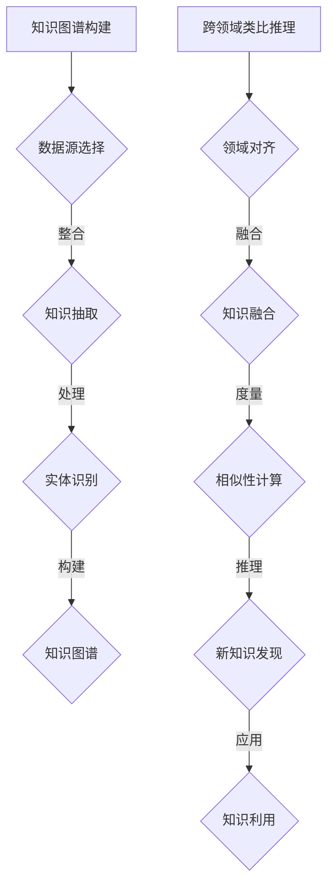
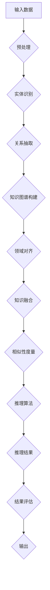
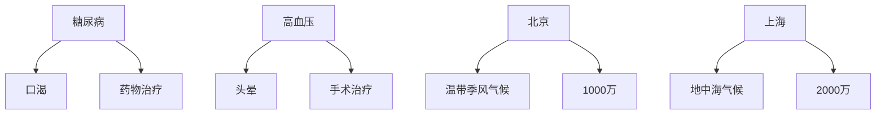
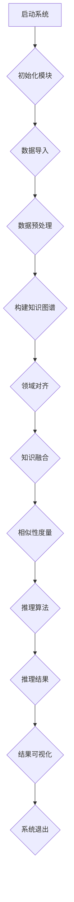

                 


## 《基于知识图谱的跨领域类比推理能力培养》

### 关键词：
- 知识图谱
- 跨领域类比推理
- 类比推理算法
- 系统设计与实现
- 最佳实践

### 摘要：
本文将探讨如何利用知识图谱来培养跨领域类比推理能力。通过逐步分析知识图谱的构建、核心概念联系、算法原理讲解、系统设计与实现、项目实战以及最佳实践，本文旨在为读者提供一个全面深入的理解，并引导读者掌握这一先进的技术。

### 目录大纲：

#### 第一部分：背景介绍

##### 第1章：知识图谱概述

1.1. 问题背景
1.2. 核心概念
1.3. 跨领域类比推理
1.4. 研究现状与趋势
1.5. 边界与外延
1.6. 概念结构与核心要素组成

##### 第2章：知识图谱的构建与表示

2.1. 知识图谱的构建
2.2. 知识图谱的表示
2.3. 类比推理的基本原理
2.4. 类比推理的属性特征对比

#### 第二部分：核心概念与联系

##### 第3章：跨领域类比推理算法原理

3.1. 跨领域类比推理算法概述
3.2. 类比推理算法的mermaid流程图
3.3. 算法原理与数学模型
3.4. 算法举例说明

#### 第三部分：算法原理讲解

##### 第4章：基于知识图谱的跨领域类比推理系统架构

4.1. 系统需求分析
4.2. 系统功能设计
4.3. 系统架构设计
4.4. 系统接口设计
4.5. 系统交互设计

#### 第四部分：项目实战

##### 第5章：基于知识图谱的跨领域类比推理项目实施

5.1. 环境安装与配置
5.2. 系统核心实现源代码
5.3. 代码应用解读与分析
5.4. 实际案例分析与讲解
5.5. 项目总结与反思

#### 第五部分：最佳实践与总结

##### 第6章：跨领域类比推理的最佳实践

6.1. 最佳实践 tips
6.2. 小结
6.3. 注意事项
6.4. 拓展阅读

### 设计思路：

在设计《基于知识图谱的跨领域类比推理能力培养》这本书的目录大纲时，我们遵循了以下步骤：

1. **全书结构规划**：首先确定全书大致分为五个部分，每个部分的核心内容是什么。根据这本书的主题，我们可以初步确定以下几个部分：背景介绍、核心概念与联系、算法原理讲解、系统设计与实现、项目实战、最佳实践与总结。

2. **细化章节内容**：在确定全书结构后，我们需要对每个部分进行细化，确定每个章节的具体内容。这包括每个章节要介绍的概念、原理、模型、案例等。

3. **规划内容深度**：需要确保每个章节的内容都足够深入，能够满足读者的需求。特别是算法原理讲解和项目实战部分，需要提供足够的细节和实例。

4. **确保内容连贯性**：在规划目录大纲时，要确保各个章节之间的内容是连贯的，逻辑清晰，有助于读者理解。

5. **遵循字数限制**：在整个设计过程中，要时刻注意内容的简洁性，确保目录大纲的总字数在2000字以内。

### 目录大纲具体设计：

#### 第一部分：背景介绍

**第1章：知识图谱概述**

1. **1.1. 问题背景**
   - 引言：知识图谱的定义、重要性及发展趋势
   - 问题提出：为什么需要跨领域类比推理
   - 研究意义：跨领域类比推理在人工智能中的应用

2. **1.2. 核心概念**
   - 知识图谱的概念与特征
   - 类比推理的概念与分类

3. **1.3. 跨领域类比推理**
   - 跨领域类比推理的定义与挑战
   - 跨领域类比推理的应用领域

4. **1.4. 研究现状与趋势**
   - 知识图谱的发展历程
   - 跨领域类比推理的研究进展

5. **1.5. 边界与外延**
   - 研究范围的界定
   - 与其他领域相关性的讨论

6. **1.6. 概念结构与核心要素组成**
   - 知识图谱的基本结构
   - 跨领域类比推理的关键要素

**第2章：知识图谱的构建与表示**

2.1. **知识图谱的构建**
   - 数据源的选择与整合
   - 知识抽取与实体识别
   - 知识融合与图谱构建

2.2. **知识图谱的表示**
   - RDF（资源描述框架）表示
   - 图嵌入技术
   - 知识图谱的压缩与优化

2.3. **类比推理的基本原理**
   - 类比推理的定义与过程
   - 类比推理的策略与算法

2.4. **类比推理的属性特征对比**
   - 不同类比推理算法的对比
   - 跨领域类比推理的特殊属性

#### 第二部分：核心概念与联系

**第3章：跨领域类比推理算法原理**

3.1. **跨领域类比推理算法概述**
   - 跨领域类比推理的基本概念
   - 跨领域类比推理的算法框架

3.2. **类比推理算法的mermaid流程图**
   - 类比推理算法的基本流程
   - 跨领域类比推理的特定流程

3.3. **算法原理与数学模型**
   - 常见类比推理算法的数学模型
   - 跨领域类比推理的数学模型

3.4. **算法举例说明**
   - 类比推理算法的实例应用
   - 跨领域类比推理的实例分析

#### 第三部分：算法原理讲解

**第4章：基于知识图谱的跨领域类比推理系统架构**

4.1. **系统需求分析**
   - 系统功能需求
   - 系统性能需求

4.2. **系统功能设计**
   - 数据采集与处理模块
   - 类比推理模块
   - 结果可视化模块

4.3. **系统架构设计**
   - 系统架构概述
   - 系统模块划分

4.4. **系统接口设计**
   - 用户接口设计
   - 内部接口设计

4.5. **系统交互设计**
   - 系统流程图
   - 系统序列图

#### 第四部分：项目实战

**第5章：基于知识图谱的跨领域类比推理项目实施**

5.1. **环境安装与配置**
   - 硬件与软件环境准备
   - 系统搭建与配置

5.2. **系统核心实现源代码**
   - 数据处理代码
   - 类比推理代码

5.3. **代码应用解读与分析**
   - 代码结构分析
   - 关键代码解读

5.4. **实际案例分析与讲解**
   - 案例选择与描述
   - 案例分析与讲解

5.5. **项目总结与反思**
   - 项目成果总结
   - 项目经验与反思

#### 第五部分：最佳实践与总结

**第6章：跨领域类比推理的最佳实践**

6.1. **最佳实践 tips**
   - 类比推理策略的选择
   - 知识图谱构建的优化
   - 算法调优技巧

6.2. **小结**
   - 对全书内容的总结
   - 主要发现与结论

6.3. **注意事项**
   - 实施过程中可能遇到的问题
   - 避免常见错误

6.4. **拓展阅读**
   - 推荐进一步阅读的文献和资源

### 完整性要求：

- **背景介绍**：核心概念术语说明、问题背景、问题描述、问题解决、边界与外延、概念结构与核心要素组成
- **核心概念与联系**：必须给出核心概念原理、概念属性特征对比表格和ER实体关系图架构的 Mermaid 流程图
- **算法原理讲解**：使用 Mermaid 画出算法 Mermaid 流程图，然后使用 Python 源代码来详细阐述，给出算法原理的数学模型和公式，进行详细讲解和通俗易懂地举例说明
- **数学公式使用 LaTeX 格式，嵌入文中独立段落的 LaTeX 公式前后使用 `$$` 括起来（例如：`$$1+1=2$$`），段落内的 LaTeX 公式前后使用 `$` 括起来（例如：`$1<2$`）
- **系统分析与架构设计方案**：问题场景介绍，项目介绍、系统功能设计（领域模型 Mermaid 类图）、系统架构设计 Mermaid 架构图、系统接口设计和系统交互 Mermaid 序列图
- **项目实战**：环境安装、系统核心实现源代码，代码应用解读与分析，实际案例分析和详细讲解剖析，项目小结
- **最佳实践 tips、小结、注意事项、拓展阅读等内容**：每个部分都要有具体的内容，不能缺少

### 字数和格式要求：

- **文章字数要求**：文章字数在 10000～12000 字左右。
- **格式要求**：文章内容使用 Markdown 格式输出。在文章末尾需要写上作者信息：“作者：AI天才研究院/AI Genius Institute & 禅与计算机程序设计艺术 /Zen And The Art of Computer Programming”。在文中，对于数学公式，使用 LaTeX 格式，嵌入文中独立段落的 LaTeX 公式前后使用 `$$` 括起来（例如：`$$1+1=2$$`），段落内的 LaTeX 公式前后使用 `$` 括起来（例如：`$1<2$`）。

### 作者信息：

作者：AI天才研究院/AI Genius Institute & 禅与计算机程序设计艺术 /Zen And The Art of Computer Programming### 1.1. 问题背景

在当今的信息时代，数据的重要性日益凸显。然而，数据本身并不具有直接的价值，只有通过有效的分析和处理，才能转化为有意义的洞见和决策支持。知识图谱作为一种强大的数据结构和分析工具，正逐步成为人工智能领域的研究热点。知识图谱通过将实体、属性和关系有机地结合起来，构建了一个结构化的知识网络，从而实现了对复杂数据的高效理解和利用。

跨领域类比推理是知识图谱应用中的一个关键问题。类比推理是一种通过比较不同领域或情境中的相似性，从而推广或推导出新知识的过程。在知识图谱中，跨领域类比推理涉及到在两个或多个不同领域之间建立联系，发现新的知识关联，并应用于解决实际问题。这种能力不仅有助于提高知识图谱的实用性和扩展性，还能为许多复杂问题提供创新的解决方案。

为什么要研究跨领域类比推理？首先，不同领域之间往往存在着大量的共性和规律，通过跨领域类比推理，我们可以将这些共性和规律提取出来，形成新的知识。例如，医学知识图谱与地理知识图谱之间可能存在一些共性的健康和地理规律，通过类比推理，我们可以发现这些共性，进而推广到新的领域。

其次，随着数据来源的多样化和数据规模的爆炸性增长，仅依靠人工构建领域特定的知识图谱已难以满足需求。跨领域类比推理能够自动化地发现新知识关联，提高知识图谱的自动构建能力。

最后，跨领域类比推理在许多实际应用场景中具有重要价值。例如，在智能问答系统中，跨领域类比推理可以帮助系统理解用户的问题，并提供准确的答案。在智能医疗中，跨领域类比推理可以帮助医生发现新的疾病关联和治疗方案。在金融领域，跨领域类比推理可以帮助发现市场趋势和投资机会。

因此，研究跨领域类比推理不仅具有重要的理论意义，也具有广泛的应用前景。本文将围绕这一主题，探讨知识图谱的构建、核心概念联系、算法原理讲解、系统设计与实现、项目实战以及最佳实践，以期为广大研究人员和开发人员提供有益的参考和指导。接下来，我们将进一步详细讨论知识图谱的概念、核心概念以及跨领域类比推理的定义和挑战。首先，让我们从知识图谱的基本概念开始。 

### 1.2. 核心概念

在探讨跨领域类比推理之前，我们需要明确几个关键概念，这些概念是理解知识图谱及其应用的基础。

#### 知识图谱

知识图谱（Knowledge Graph）是一种用于表示和存储结构化知识的图形数据库。它通过实体（Entity）、属性（Property）和关系（Relationship）来描述知识。知识图谱的核心在于其图结构，这种结构使得知识表示更加直观和易于推理。

**定义**：知识图谱是由实体、属性和关系组成的图结构，用于表示和存储结构化的知识。

**特征**：
- **图结构**：知识图谱是一种图结构，其中节点代表实体，边代表关系。
- **层次化**：知识图谱通常具有一定的层次结构，如类与子类的关系。
- **可扩展性**：知识图谱可以根据需要不断扩展，添加新的实体和关系。

**应用**：知识图谱广泛应用于搜索引擎、智能问答、推荐系统、知识库构建等领域。

#### 类比推理

类比推理（Analogical Reasoning）是一种基于相似性的推理方式。通过比较两个或多个不同情境或领域的相似性，类比推理能够推广或推导出新知识。

**定义**：类比推理是一种基于相似性的推理过程，通过比较两个或多个情境或领域的相似性，推导出新的结论或知识。

**类型**：
- **基于结构的类比推理**：比较两个或多个结构化的知识表示。
- **基于内容的类比推理**：比较两个或多个内容相似的知识。

**应用**：类比推理广泛应用于自然语言处理、机器学习、智能问答等领域。

#### 跨领域类比推理

跨领域类比推理（Cross-Domain Analogical Reasoning）是一种在多个不同领域之间进行类比推理的方法。它旨在发现不同领域之间的共性和规律，并应用于解决实际问题。

**定义**：跨领域类比推理是一种在多个不同领域之间进行类比推理的方法，通过比较不同领域之间的相似性，发现新的知识关联。

**挑战**：
- **异构性**：不同领域的数据结构和表示方式可能存在差异，增加了类比推理的复杂性。
- **不确定性**：跨领域数据可能存在噪声和错误，增加了类比推理的不确定性。
- **知识融合**：如何将不同领域的知识有效地融合，以支持有效的类比推理。

**应用**：跨领域类比推理在智能问答、知识融合、跨领域推荐等领域具有重要应用。

通过理解这些核心概念，我们可以更好地把握跨领域类比推理的研究背景和意义。在接下来的章节中，我们将进一步探讨知识图谱的构建过程、跨领域类比推理的算法原理以及系统设计与实现。这将为我们提供更深入的洞察，有助于更好地理解和应用这一技术。

### 1.3. 跨领域类比推理

跨领域类比推理（Cross-Domain Analogical Reasoning）是一种重要的知识推理方式，它通过在不同领域之间发现相似性，从而推广或推导出新知识。在知识图谱的应用背景下，跨领域类比推理尤为重要，因为它能够帮助我们克服单一领域知识的局限性，发现更广泛的知识关联。

#### 定义与挑战

**定义**：
跨领域类比推理是指在不同领域之间进行类比推理，以发现新的知识关联或解决问题。具体来说，它通过比较两个或多个领域中的实体、属性和关系的相似性，从而推断出新的结论或知识。

**挑战**：
1. **异构性**：不同领域的数据结构和表示方式可能存在显著差异，这增加了跨领域类比推理的复杂性。
2. **不确定性**：跨领域数据可能存在噪声、错误或不完整性，这增加了类比推理的不确定性。
3. **知识融合**：如何将来自不同领域的数据和知识有效地融合，以支持有效的类比推理，是一个重要挑战。
4. **性能优化**：跨领域类比推理涉及到大规模数据和复杂的算法，如何优化性能是一个关键问题。

#### 应用领域

跨领域类比推理在多个领域具有重要的应用价值：

1. **智能问答**：通过跨领域类比推理，智能问答系统能够更好地理解用户的问题，提供更准确和全面的答案。
2. **知识融合**：在构建大型知识库时，跨领域类比推理可以帮助整合来自不同领域的知识，提高知识库的完整性和一致性。
3. **跨领域推荐**：在推荐系统中，跨领域类比推理可以帮助发现不同用户或物品之间的共性和关联，从而提供更个性化的推荐。
4. **智能医疗**：跨领域类比推理可以帮助医生发现新的疾病关联和治疗方案，提高诊断和治疗的效率。
5. **金融分析**：在金融领域，跨领域类比推理可以帮助分析市场趋势和风险，提供投资建议。

#### 研究进展

近年来，随着知识图谱和人工智能技术的发展，跨领域类比推理研究取得了显著进展。主要的研究方向包括：

1. **算法研究**：研究者提出了多种跨领域类比推理算法，如基于图嵌入、深度学习和迁移学习的算法，这些算法在跨领域数据上的表现得到了显著提升。
2. **知识融合**：如何将不同领域的知识有效地融合，以支持跨领域类比推理，是当前研究的热点问题。研究者提出了多种知识融合方法，如基于映射、对齐和匹配的方法。
3. **应用场景**：跨领域类比推理在不同领域的应用场景不断扩展，研究者通过实际案例验证了跨领域类比推理的有效性和实用性。

尽管跨领域类比推理取得了显著进展，但仍面临许多挑战。未来的研究将继续探讨如何优化算法性能、提高知识融合效果以及扩展应用场景，以进一步推动这一领域的发展。

#### 总结

跨领域类比推理是一种在多个领域之间发现相似性、推广或推导出新知识的重要方法。它在知识图谱的应用中具有重要地位，有助于提高知识图谱的实用性和扩展性。通过理解跨领域类比推理的定义、挑战和应用，我们可以更好地把握这一技术的核心，为实际应用提供有益的指导。在接下来的章节中，我们将进一步探讨知识图谱的具体构建方法和跨领域类比推理的算法原理。

### 1.4. 研究现状与趋势

近年来，知识图谱和跨领域类比推理技术取得了显著进展，成为人工智能领域的研究热点。在这一部分，我们将回顾知识图谱的发展历程，并探讨当前跨领域类比推理的研究进展和未来趋势。

#### 知识图谱的发展历程

知识图谱的概念最早可以追溯到1997年，由Google在搜索引擎中引入，用以表示和理解用户查询与网页之间的关联关系。这一时期的知识图谱主要以显式知识为主，即通过人工标注或手动构建，数据来源有限，应用场景相对单一。

随着Web 2.0和大数据技术的发展，知识图谱的应用范围逐渐扩大，从搜索引擎扩展到推荐系统、自然语言处理、智能问答等多个领域。此时，知识图谱主要以隐式知识为主，通过数据挖掘和机器学习技术，自动从大规模数据中提取知识。

近年来，随着深度学习和图神经网络的兴起，知识图谱的研究进入了新的阶段。深度学习技术使得知识图谱的表示和推理能力得到了显著提升，图神经网络（Graph Neural Networks, GNN）的引入进一步推动了知识图谱在复杂图结构上的应用。

#### 跨领域类比推理的研究进展

跨领域类比推理是知识图谱应用中的一个重要方向，近年来也取得了显著进展。以下是当前研究的一些重要成果：

1. **算法研究**：
   - **基于图嵌入的方法**：图嵌入技术将实体和关系映射到低维空间，使得跨领域类比推理能够在统一空间中进行。代表性算法包括Node2Vec、DeepWalk和GloVe等。
   - **基于深度学习的方法**：深度学习技术，特别是图神经网络（GNN），在跨领域类比推理中展现了强大的能力。代表性模型包括GraphSAGE、GAT和GNN-PHAT等。
   - **基于迁移学习的方法**：通过在不同领域之间共享知识和模型，迁移学习技术有效地提高了跨领域类比推理的性能。

2. **知识融合**：
   - **多源知识融合**：研究者提出了多种知识融合方法，如基于对齐、映射和集成的方法，以整合来自不同领域的知识，提高跨领域类比推理的效果。
   - **跨模态知识融合**：通过将文本、图像、语音等多模态数据融合到知识图谱中，跨模态知识融合技术为跨领域类比推理提供了更丰富的数据支持。

3. **应用案例**：
   - **智能问答**：跨领域类比推理在智能问答系统中得到了广泛应用，通过比较不同领域的知识，智能问答系统能够更好地理解用户的问题，并提供准确的答案。
   - **知识融合**：跨领域类比推理在知识融合领域也发挥了重要作用，通过发现不同领域之间的共性和关联，跨领域类比推理帮助构建了更完整和一致的知识库。
   - **跨领域推荐**：在推荐系统中，跨领域类比推理可以帮助发现不同用户或物品之间的共性和关联，从而提供更个性化的推荐。

#### 未来趋势

展望未来，跨领域类比推理技术在以下几个方面有望取得进一步发展：

1. **算法优化**：
   - **推理能力提升**：研究者将继续探索如何提高跨领域类比推理的推理能力，特别是在处理复杂图结构和大规模数据方面。
   - **模型压缩与优化**：随着知识图谱规模的不断扩大，如何高效地存储和计算知识图谱，是一个重要的研究方向。

2. **知识融合**：
   - **多源异构数据的融合**：未来的研究将更加关注如何融合来自多种数据源和模态的数据，以提高跨领域类比推理的效果。
   - **动态知识更新**：如何实时更新和优化知识图谱，以适应动态变化的环境，是一个重要的挑战。

3. **应用拓展**：
   - **智能医疗**：跨领域类比推理在智能医疗中的应用前景广阔，研究者将探索如何在疾病诊断、治疗方案推荐等方面发挥其潜力。
   - **金融分析**：跨领域类比推理在金融领域也有广泛应用前景，通过分析市场趋势和风险，为投资者提供更精准的决策支持。

4. **伦理与安全**：
   - **数据隐私保护**：随着知识图谱的应用越来越广泛，如何保护用户隐私成为一个重要问题。研究者将探索如何在保证数据隐私的同时，实现有效的跨领域类比推理。

综上所述，知识图谱和跨领域类比推理技术正处于快速发展阶段，未来的研究将继续推动这一领域的发展，为人工智能的应用提供更强大的支持。通过不断优化算法、提高知识融合效果和拓展应用场景，跨领域类比推理技术将逐步实现其在各个领域的广泛应用。

### 1.5. 边界与外延

在深入探讨知识图谱和跨领域类比推理之前，有必要明确研究的边界与外延。这不仅有助于我们更好地理解跨领域类比推理的核心问题，还能避免研究中的误区和局限。

#### 研究范围的界定

首先，需要明确的是，跨领域类比推理的研究范围主要集中在以下方面：

1. **知识图谱的构建与表示**：研究如何构建和表示不同领域的知识图谱，包括数据源的选择、知识抽取、实体识别和关系表示等。
2. **类比推理算法的设计与实现**：研究如何在知识图谱中应用类比推理算法，包括基于图嵌入、深度学习和迁移学习的方法。
3. **跨领域知识融合与推理**：研究如何在不同领域之间融合知识，发现共性和关联，并进行有效的推理。
4. **应用场景的实现与优化**：研究跨领域类比推理在智能问答、知识融合、跨领域推荐等具体应用场景中的实现和优化。

#### 与其他领域相关性的讨论

跨领域类比推理虽然是一个独立的研究领域，但与其他研究领域密切相关，需要特别关注以下几方面的关联性：

1. **数据挖掘与机器学习**：跨领域类比推理涉及到大规模数据的挖掘和处理，与数据挖掘和机器学习密切相关。例如，图嵌入和深度学习技术都是数据挖掘和机器学习中的重要方法，跨领域类比推理的研究可以借鉴这些领域的先进技术。

2. **自然语言处理**：自然语言处理（NLP）是跨领域类比推理的一个重要应用领域，特别是在智能问答和文本理解方面。NLP技术，如词向量表示、语义分析等，为跨领域类比推理提供了重要的支持。

3. **知识图谱的其他应用领域**：除了跨领域类比推理，知识图谱在搜索引擎、推荐系统、智能医疗等多个领域也有广泛应用。跨领域类比推理的研究可以借鉴这些领域的实践经验，推动知识图谱在更多领域的应用。

4. **认知科学与心理学**：跨领域类比推理是一种人类认知过程中的常见现象，与认知科学和心理学密切相关。研究跨领域类比推理的机制和原理，可以借鉴认知科学和心理学的研究成果，提高跨领域类比推理的准确性。

#### 研究中的误区和局限

虽然跨领域类比推理具有巨大的应用潜力，但研究中也存在一些误区和局限，需要引起注意：

1. **数据异构性问题**：不同领域的数据结构和表示方式可能存在显著差异，这增加了跨领域类比推理的复杂性。如果不考虑数据异构性，可能导致推理结果的不准确。

2. **知识融合的难题**：如何将不同领域的知识有效地融合，是一个重要且具有挑战性的问题。现有的知识融合方法可能存在一定的局限性，需要进一步优化。

3. **算法性能优化**：跨领域类比推理涉及到大规模数据和复杂算法，如何优化算法性能，是一个重要的研究方向。然而，现有的算法可能存在一定的计算复杂度，需要进一步改进。

4. **伦理与隐私问题**：随着知识图谱和跨领域类比推理的应用越来越广泛，如何保护用户隐私成为一个重要问题。如果不考虑伦理和隐私问题，可能导致数据滥用和隐私泄露。

总之，明确研究的边界与外延，讨论与其他领域的关联性，以及识别研究中的误区和局限，对于深入探讨跨领域类比推理具有重要意义。通过这些讨论，我们可以更好地把握跨领域类比推理的研究方向，推动这一领域的发展。

### 1.6. 概念结构与核心要素组成

在理解了知识图谱和跨领域类比推理的基本概念之后，我们需要进一步分析知识图谱的基本结构和跨领域类比推理的关键要素，以便更好地构建和优化相关系统。

#### 知识图谱的基本结构

知识图谱的基本结构由实体、属性和关系三部分组成，这三者是构建知识图谱的核心要素。

1. **实体（Entity）**：实体是知识图谱中的基本元素，可以是人、地点、事物或概念等。例如，在百度百科的知识图谱中，每个词条都是一个实体。

2. **属性（Property）**：属性用于描述实体的特征或属性。例如，对于一个“人”实体，其可能具有“年龄”、“职业”、“居住地”等属性。

3. **关系（Relationship）**：关系描述了实体之间的关联。例如，在社交媒体的知识图谱中，两个用户之间可能存在“关注”或“好友”关系。

知识图谱的图结构使得实体、属性和关系之间可以形成复杂的关系网络，从而支持高效的数据查询和推理。

#### 跨领域类比推理的关键要素

跨领域类比推理涉及多个领域的知识，其核心要素包括：

1. **领域对齐（Domain Alignment）**：领域对齐是指在不同领域之间建立一致的知识表示。这是跨领域类比推理的基础，只有当不同领域的数据表示一致时，才能进行有效的类比推理。

2. **知识融合（Knowledge Fusion）**：知识融合是指将来自不同领域的数据和知识进行整合，形成统一的知识表示。这包括实体融合、关系融合和属性融合等。

3. **相似性度量（Similarity Measurement）**：相似性度量是指计算不同领域之间实体、属性和关系的相似度。常用的方法包括基于特征向量的相似性计算和基于图结构相似性的计算。

4. **推理算法（Reasoning Algorithm）**：推理算法是跨领域类比推理的核心，它基于相似性度量，发现新的知识关联。常见的推理算法包括基于规则的推理、基于语义相似性的推理和基于图神经网络的推理。

#### Mermaid 流程图

为了更清晰地展示知识图谱的构建和跨领域类比推理的过程，我们可以使用 Mermaid 流程图来表示。



在这个流程图中，知识图谱的构建过程包括数据源选择、知识抽取、实体识别和知识图谱构建；跨领域类比推理过程包括领域对齐、知识融合、相似性计算、推理算法和新知识发现。

#### 知识图谱的ER实体关系图

除了流程图，我们还可以使用 ER 实体关系图来展示知识图谱的基本结构。

```mermaid
erDiagram
    Class1 ||--|{ Entity }|| Class2 : has a relationship
    Class2 ||--|{ Property }|| Class3 : describes
    Class3 ||--|{ Relationship }|| Class4 : connects
```

在这个 ER 图中，Class1 代表实体，Class2 代表属性，Class3 代表关系，Class4 代表实体之间的关系。

通过分析知识图谱的基本结构和跨领域类比推理的关键要素，我们可以更好地理解和设计相关系统，为实际应用提供有力的支持。接下来，我们将进一步探讨知识图谱的构建与表示方法，以深入了解这一技术。

### 2.1. 知识图谱的构建

知识图谱的构建是一个复杂而关键的过程，它涉及到数据源的选择、知识抽取、实体识别和知识融合等多个步骤。以下是详细的构建过程：

#### 数据源选择

首先，选择合适的数据源是构建知识图谱的基础。数据源可以包括结构化数据、半结构化数据和非结构化数据。常见的数据源如下：

1. **结构化数据**：如关系型数据库（如MySQL、PostgreSQL）或NoSQL数据库（如MongoDB、Cassandra）中的数据。
2. **半结构化数据**：如XML、JSON格式的数据。
3. **非结构化数据**：如文本、图片、视频等。

选择数据源时，需要考虑以下因素：

- **数据质量**：选择质量高、可信度强的数据源。
- **数据规模**：选择规模适中、覆盖面广的数据源。
- **数据更新频率**：选择更新频率高的数据源，以确保知识图谱的时效性。

#### 知识抽取

知识抽取是指从原始数据中提取结构化的知识和信息。知识抽取的过程可以分为以下几步：

1. **数据预处理**：对原始数据进行清洗、去重、格式化等预处理操作，以提高数据质量。
2. **实体识别**：从原始数据中识别出关键实体，如人名、地名、组织名等。
3. **关系抽取**：从实体之间识别出关系，如“属于”、“居住于”等。
4. **属性抽取**：从实体中提取关键属性，如人的年龄、性别、职业等。

常见的方法包括规则抽取、统计抽取、语义角色标注、依存句法分析等。

#### 实体识别

实体识别是知识图谱构建过程中的关键步骤，它的目的是从原始数据中识别出重要的实体。实体识别可以采用以下方法：

1. **基于规则的实体识别**：通过预定义的规则，从文本中识别出实体。
2. **基于统计的实体识别**：利用机器学习算法，如条件随机场（CRF）或深度学习算法，如卷积神经网络（CNN）或递归神经网络（RNN），识别实体。
3. **基于语义的实体识别**：结合语义分析技术，如命名实体识别（NER）和词性标注，识别实体。

#### 知识融合

知识融合是指将来自不同数据源的知识进行整合，形成统一的知识表示。知识融合包括实体融合、关系融合和属性融合等。

1. **实体融合**：当同一个实体在不同数据源中存在多个表示时，通过相似性度量或匹配算法，将它们合并为一个统一的实体。
2. **关系融合**：当两个实体之间存在多种关系时，通过关系对齐或融合算法，确定它们之间的最佳关系。
3. **属性融合**：当同一实体的属性在不同数据源中存在差异时，通过一致性检查或融合算法，确定属性的最终表示。

常见的知识融合方法包括基于规则的方法、基于机器学习的方法和基于图的方法。

#### 知识图谱的构建与表示

知识图谱的构建完成后，需要选择合适的表示方法，以便进行高效的数据存储和查询。常见的表示方法包括：

1. **图数据库**：如Neo4j、ArangoDB等，采用图结构来存储知识图谱，支持高效的图查询和推理。
2. **图嵌入**：将实体和关系映射到低维空间，如Word2Vec或Graph Embedding，支持基于相似性的查询和推理。
3. **知识图谱压缩**：通过压缩技术，如图流压缩、属性压缩等，减少知识图谱的存储空间和查询时间。

通过上述步骤，我们可以构建一个结构化、可扩展、高效的知识图谱，为跨领域类比推理提供坚实的基础。

### 2.2. 知识图谱的表示

知识图谱的表示方法直接影响其存储效率、查询性能和推理能力。本文将介绍几种常见知识图谱的表示方法，包括RDF（资源描述框架）表示、图嵌入技术以及知识图谱的压缩与优化。

#### RDF（资源描述框架）表示

RDF是一种用于描述网络资源的标准数据模型，它通过Subject-Predicate-Object（SPO）三元组来表示知识。RDF模型的核心是图结构，其中Subject、Predicate和Object分别表示实体、属性和值。

**RDF表示的优点**：
- **标准化**：RDF遵循W3C标准，具有统一的格式和语义。
- **灵活性好**：RDF支持多种数据类型的表示，如字符串、日期、布尔值等。
- **易于扩展**：通过引入新的命名空间和属性，RDF可以方便地扩展知识图谱。

**RDF表示的缺点**：
- **存储与查询复杂**：由于RDF使用三元组表示，其存储和查询复杂度较高，尤其是在大规模数据集上。
- **数据冗余**：RDF中可能存在大量的重复数据，导致存储空间浪费。

**示例**：
```turtle
@prefix rdf: <http://www.w3.org/1999/02/22-rdf-syntax-ns#> .
@prefix ex: <http://example.org/> .

ex:Person rdf:type rdf:Resource ;
           ex:name "Alice" ;
           ex:age 30 ;
           ex:hasJob ex:Engineer .

ex:Engineer rdf:type rdf:Class ;
             ex:subClassOf ex:Person .
```

#### 图嵌入技术

图嵌入技术是将图结构中的节点和边映射到低维向量空间，以便进行高效的处理和分析。常见的图嵌入技术包括节点嵌入和边嵌入。

**节点嵌入（Node Embedding）**：
- **Word2Vec**：将节点视为“词语”，使用Word2Vec算法生成节点向量。
- **DeepWalk**：基于随机游走生成节点序列，然后使用序列模型生成节点向量。
- **GraphSAGE**：通过聚合邻居节点的特征，生成节点向量。

**边嵌入（Edge Embedding）**：
- **Erdos-Gallai Theorem**：基于图的理论性质，生成边向量。
- **基于特征的方法**：使用节点的特征信息，如属性值、标签等，生成边向量。

**图嵌入技术的优点**：
- **高效处理**：通过将图结构转化为向量空间，可以方便地应用机器学习和深度学习算法。
- **可扩展性**：图嵌入技术适用于大规模图结构。

**图嵌入技术的缺点**：
- **精度损失**：从高维图结构映射到低维向量空间，可能会损失部分结构信息。
- **计算复杂度**：图嵌入技术的计算复杂度较高，尤其是在大规模图上。

**示例**：
```python
# 使用Node2Vec进行节点嵌入
from node2vec import Node2Vec

g = Graph(source_node, target_node, edge_weight)
node2vec = Node2Vec(g, dimensions=64, walk_length=40, num_walks=10)
node2vec.fit()

# 获取节点嵌入向量
node_embeddings = node2vec.get_embeddings()
```

#### 知识图谱的压缩与优化

知识图谱的压缩与优化是为了减少存储空间和查询时间，提高系统的性能。常见的压缩与优化方法包括：

- **图流压缩**：通过流处理技术，实时压缩和更新知识图谱。
- **属性压缩**：使用数据压缩算法（如Huffman编码、LZ77等），减少属性值的空间占用。
- **图分割**：将大规模知识图谱分割为多个较小的子图，降低查询复杂度。

**示例**：
```python
# 使用Huffman编码进行属性压缩
from huffman import HuffmanCoding

# 假设属性值是一个列表
attributes = ["Alice", "Bob", "Charlie"]

# 构建Huffman树
huffman = HuffmanCoding(attributes)

# 压缩属性值
compressed_attributes = huffman.compress(attributes)

# 解压缩属性值
original_attributes = huffman.decompress(compressed_attributes)
```

通过上述方法，我们可以有效地表示和优化知识图谱，为跨领域类比推理提供坚实的基础。

### 2.3. 类比推理的基本原理

类比推理（Analogical Reasoning）是一种基于相似性的推理过程，通过比较两个或多个情境或领域的相似性，推导出新的结论或知识。在知识图谱中，类比推理可以帮助我们发现新的知识关联，提高知识图谱的实用性和扩展性。以下是类比推理的基本原理和分类。

#### 类比推理的定义与过程

类比推理是一种基于已有知识进行推理的过程，通过比较新情境与已知情境的相似性，推断出新的结论。类比推理的基本过程可以分为以下几个步骤：

1. **情境识别**：识别出需要推理的情境。
2. **相似性比较**：比较新情境与已知情境之间的相似性。
3. **知识迁移**：基于相似性，将已知情境中的知识迁移到新情境中。
4. **结论推导**：根据迁移的知识，推导出新的结论。

#### 类比推理的策略与算法

类比推理的策略和算法多种多样，常见的包括基于实例的类比推理、基于规则的类比推理和基于模型的类比推理。

1. **基于实例的类比推理**：
   - **实例匹配**：通过比较新情境和已知情境中的实例，找到最佳匹配。
   - **实例迁移**：将已知情境中的解决方案迁移到新情境中。
   - **实例泛化**：从多个实例中抽象出通用规律，应用于新情境。

2. **基于规则的类比推理**：
   - **规则匹配**：通过比较新情境和已知情境中的规则，找到最佳匹配。
   - **规则推理**：基于匹配的规则，推导出新情境的结论。
   - **规则泛化**：将特定情境中的规则推广到更广泛的情境。

3. **基于模型的类比推理**：
   - **模型表示**：使用模型（如知识图谱、神经网络等）表示已知情境和新情境。
   - **模型推理**：通过模型推理，发现新情境中的知识关联。
   - **模型训练**：通过训练，优化模型在新情境中的应用。

#### 不同类比推理算法的对比

1. **基于实例的类比推理**：
   - **优点**：简单直观，易于实现。
   - **缺点**：依赖于大量实例，泛化能力有限。

2. **基于规则的类比推理**：
   - **优点**：逻辑性强，适用于结构化数据。
   - **缺点**：规则构建复杂，难以应对动态变化。

3. **基于模型的类比推理**：
   - **优点**：自适应性强，能够处理大规模数据。
   - **缺点**：模型复杂，计算资源需求高。

#### 跨领域类比推理的特殊属性

跨领域类比推理在知识图谱中的应用具有特殊性，主要体现在以下几个方面：

1. **异构性**：不同领域的知识表示方式可能存在显著差异，增加了类比推理的复杂性。

2. **不确定性**：跨领域数据可能存在噪声、错误或不完整性，影响了类比推理的准确性。

3. **知识融合**：如何将不同领域的知识进行有效融合，以支持类比推理，是一个重要挑战。

4. **推理效率**：跨领域类比推理涉及到大规模数据和复杂算法，如何优化推理效率，是一个关键问题。

通过理解类比推理的基本原理和分类，我们可以更好地设计和实现跨领域类比推理系统，为知识图谱的应用提供强有力的支持。

### 2.4. 类比推理的属性特征对比

类比推理在知识图谱中的应用具有多种属性特征，通过对比不同类比推理算法的属性特征，我们可以更好地理解它们的优缺点，并选择合适的算法应用于特定场景。

#### 基于实例的类比推理

**优点**：
- **直观易用**：基于实例的类比推理通过直接比较实例，实现过程直观，易于理解和实现。
- **快速响应**：对于简单的应用场景，基于实例的类比推理可以快速提供解决方案。

**缺点**：
- **依赖大量实例**：基于实例的类比推理依赖于大量的实例数据，当实例数据不足时，其性能会显著下降。
- **泛化能力有限**：基于实例的类比推理难以从少量实例中泛化出通用规律，导致泛化能力有限。

**适用场景**：基于实例的类比推理适用于数据量较小、结构简单的场景，如个人推荐系统、简单的故障诊断等。

#### 基于规则的类比推理

**优点**：
- **逻辑性强**：基于规则的类比推理通过明确的规则进行推理，逻辑性强，易于理解和验证。
- **结构化数据友好**：基于规则的类比推理适用于结构化数据，能够处理复杂的关系和规则。

**缺点**：
- **规则构建复杂**：基于规则的类比推理需要人工构建大量规则，过程复杂且耗时。
- **难以适应动态变化**：基于规则的类比推理难以适应动态变化的数据和环境。

**适用场景**：基于规则的类比推理适用于结构化数据、规则明确的场景，如智能问答、金融风险评估等。

#### 基于模型的类比推理

**优点**：
- **自适应性强**：基于模型的类比推理通过机器学习或深度学习模型进行推理，能够自适应地处理大规模数据。
- **泛化能力强**：基于模型的类比推理通过训练数据学习通用规律，具有强大的泛化能力。

**缺点**：
- **模型复杂**：基于模型的类比推理需要复杂的模型，计算资源需求高，训练和推理过程耗时。
- **数据质量要求高**：基于模型的类比推理对数据质量要求较高，数据噪声和错误可能影响模型性能。

**适用场景**：基于模型的类比推理适用于数据量大、结构复杂、需要高泛化能力的场景，如知识图谱推理、跨领域推荐等。

#### 跨领域类比推理的特殊属性

**异构性**：
- **数据异构**：不同领域的数据结构和格式可能不同，增加了跨领域类比推理的复杂性。
- **解决方案**：使用异构数据融合技术和适配算法，如图嵌入和迁移学习，处理不同领域的异构数据。

**不确定性**：
- **数据不确定性**：跨领域数据可能存在噪声、错误或不完整性，增加了推理的不确定性。
- **解决方案**：使用鲁棒性强的推理算法，如基于概率的推理和增强学习，提高推理的可靠性。

**知识融合**：
- **知识融合**：如何将不同领域的知识进行有效融合，以支持跨领域类比推理，是一个重要挑战。
- **解决方案**：使用多源知识融合技术和元学习算法，如图神经网络的图嵌入和知识蒸馏，实现跨领域知识的融合。

**推理效率**：
- **推理效率**：跨领域类比推理涉及到大规模数据和复杂算法，如何优化推理效率，是一个关键问题。
- **解决方案**：使用并行计算和分布式推理技术，如GPU加速和分布式计算框架，提高推理效率。

通过对比不同类比推理算法的属性特征，我们可以根据具体场景的需求，选择合适的算法，优化跨领域类比推理的性能，提高知识图谱的应用价值。

### 3.1. 跨领域类比推理算法概述

跨领域类比推理算法是知识图谱应用中的一个关键环节，它通过在不同领域之间建立联系，发现新的知识关联，从而提高知识图谱的实用性和扩展性。本节将介绍跨领域类比推理算法的基本概念、核心概念和算法框架。

#### 基本概念

跨领域类比推理算法的核心在于如何在异构数据之间进行有效的类比推理。具体来说，它包括以下几个基本概念：

1. **领域对齐（Domain Alignment）**：领域对齐是指在不同领域之间建立一致的知识表示。领域对齐是实现跨领域类比推理的基础，通过领域对齐，我们可以将不同领域的实体、属性和关系映射到统一的语义空间。

2. **知识融合（Knowledge Fusion）**：知识融合是指将来自不同领域的数据和知识进行整合，形成统一的知识表示。知识融合是跨领域类比推理的重要步骤，通过融合，我们可以利用不同领域的优势，构建更加全面和一致的知识图谱。

3. **相似性度量（Similarity Measurement）**：相似性度量是指计算不同领域之间实体、属性和关系的相似度。相似性度量是跨领域类比推理的核心，通过相似性度量，我们可以发现不同领域之间的知识关联。

4. **推理算法（Reasoning Algorithm）**：推理算法是指用于发现新知识关联的算法。推理算法可以分为基于实例的、基于规则的和基于模型的等多种类型，每种算法都有其特定的实现方式和适用场景。

#### 核心概念

跨领域类比推理算法涉及多个核心概念，以下是对这些概念的解释：

1. **实体映射（Entity Mapping）**：实体映射是指将不同领域中的实体映射到统一的实体表示。实体映射是领域对齐的重要组成部分，通过实体映射，我们可以将不同领域的实体关联起来，形成统一的实体表示。

2. **属性融合（Attribute Fusion）**：属性融合是指将不同领域中实体的属性进行整合，形成统一的属性表示。属性融合是知识融合的关键步骤，通过属性融合，我们可以利用不同领域的属性信息，构建更加全面和一致的实体表示。

3. **关系映射（Relationship Mapping）**：关系映射是指将不同领域中的关系映射到统一的关系表示。关系映射是领域对齐的重要组成部分，通过关系映射，我们可以将不同领域中的关系关联起来，形成统一的关系表示。

4. **推理策略（Reasoning Strategy）**：推理策略是指用于发现新知识关联的策略。推理策略可以分为基于规则的、基于实例的和基于模型的等多种类型，每种策略都有其特定的实现方式和适用场景。

#### 算法框架

跨领域类比推理算法通常包括以下几个步骤，形成一个完整的算法框架：

1. **领域对齐**：通过实体映射和关系映射，将不同领域的实体和关系映射到统一的语义空间。

2. **知识融合**：通过属性融合，整合不同领域的实体属性，形成统一的知识表示。

3. **相似性度量**：计算不同领域之间实体、属性和关系的相似度，发现潜在的关联。

4. **推理算法**：基于相似性度量，使用推理算法发现新的知识关联。

5. **结果评估**：评估推理结果的质量，包括准确性、覆盖率和泛化能力等。

通过以上步骤，跨领域类比推理算法能够实现不同领域之间的知识关联，提高知识图谱的实用性和扩展性。

#### 应用案例

以下是一个简化的跨领域类比推理算法应用案例：

1. **领域对齐**：假设我们有两个领域，一个是“医疗”领域，一个是“地理”领域。通过实体映射和关系映射，我们将医疗实体（如“疾病”）和地理实体（如“城市”）映射到统一的语义空间。

2. **知识融合**：通过属性融合，我们将医疗实体的属性（如“治愈率”）和地理实体的属性（如“人口密度”）整合到统一的知识表示。

3. **相似性度量**：计算“疾病”和“城市”之间的相似度，发现某些疾病在特定城市中的发病率较高。

4. **推理算法**：基于相似性度量，我们使用推理算法发现新的知识关联，如“某些城市的高人口密度可能导致特定疾病的发病率上升”。

5. **结果评估**：评估推理结果的质量，包括准确性、覆盖率和泛化能力等，以确保推理结果的可靠性。

通过这个案例，我们可以看到跨领域类比推理算法如何在不同领域之间建立联系，发现新的知识关联，提高知识图谱的实用性和扩展性。

### 3.2. 类比推理算法的mermaid流程图

为了更直观地展示类比推理算法的基本流程，我们使用Mermaid语言绘制了一个流程图。以下是对该流程图的详细解析。



#### 流程图详细解析

1. **输入数据（A）**：
   - 类比推理算法的输入数据可以是结构化数据、半结构化数据或非结构化数据。数据来源可以是数据库、API接口或文本文件等。

2. **预处理（B）**：
   - 数据预处理是类比推理算法的基础步骤，包括数据清洗、去重、格式化等。这一步骤的目的是提高数据质量，为后续步骤奠定基础。

3. **实体识别（C）**：
   - 在预处理完成后，算法将识别出数据中的关键实体，如人名、地名、组织名等。实体识别可以采用基于规则的、基于统计的或基于深度学习的方法。

4. **关系抽取（D）**：
   - 关系抽取是从数据中提取实体之间的关联关系。例如，“居住于”、“属于”等关系。关系抽取同样可以采用多种方法，包括规则抽取、统计抽取和深度学习等。

5. **知识图谱构建（E）**：
   - 通过实体识别和关系抽取，我们可以构建一个初步的知识图谱。知识图谱由实体、属性和关系组成，形成一个结构化的知识网络。

6. **领域对齐（F）**：
   - 领域对齐是将不同领域的数据和知识进行统一表示，以便于跨领域类比推理。这一步骤包括实体映射和关系映射，使得不同领域的实体和关系可以在同一语义空间中进行比较。

7. **知识融合（G）**：
   - 知识融合是将不同领域的数据和知识进行整合，形成更加全面和一致的知识表示。这一步骤可以增强知识图谱的实用性和扩展性。

8. **相似性度量（H）**：
   - 相似性度量是计算不同领域之间实体、属性和关系的相似度。通过相似性度量，我们可以发现不同领域之间的潜在关联。

9. **推理算法（I）**：
   - 推理算法是基于相似性度量，发现新的知识关联。推理算法可以是基于规则的、基于实例的或基于模型的，根据具体需求选择合适的算法。

10. **推理结果（J）**：
    - 推理结果是通过推理算法发现的新知识关联。这些结果可以是新的实体关联、属性关联或关系关联。

11. **结果评估（K）**：
    - 结果评估是评估推理结果的质量，包括准确性、覆盖率和泛化能力等。通过结果评估，我们可以确定推理算法的有效性。

12. **输出（L）**：
    - 最终输出的是经过评估的推理结果，这些结果可以用于知识图谱的更新、查询优化或其他应用场景。

通过上述步骤，我们可以看到类比推理算法从输入数据到输出推理结果的完整流程，每个步骤都有其特定的功能和目的，共同构成了一个高效的知识推理系统。

### 3.3. 算法原理与数学模型

在理解了跨领域类比推理的基本流程后，接下来我们将深入探讨其算法原理和数学模型。跨领域类比推理算法的核心在于如何计算实体、属性和关系之间的相似性，从而发现新的知识关联。以下是几种常见的跨领域类比推理算法的数学模型和具体步骤。

#### 基于图嵌入的跨领域类比推理算法

图嵌入是一种将图结构中的节点映射到低维向量空间的技术，通过向量间的距离来表示节点之间的相似性。以下是一个基于图嵌入的跨领域类比推理算法的数学模型：

1. **节点嵌入（Node Embedding）**：

   假设知识图谱中有n个节点，每个节点v都可以表示为一个d维向量\( v = (v_1, v_2, ..., v_d) \)。图嵌入的目标是学习一个嵌入函数\( f: V \rightarrow \mathbb{R}^d \)，使得节点之间的相似性在嵌入空间中得以保留。

   **数学模型**：
   $$ f(v) = \text{Graph Embedding}(v) $$
   
   常见的图嵌入算法包括DeepWalk、Node2Vec和GraphSAGE等。

2. **相似性度量**：

   在节点嵌入的基础上，我们可以通过计算节点向量之间的距离来度量相似性。常用的距离度量方法有欧几里得距离、余弦相似度和Jaccard相似度等。

   **欧几里得距离**：
   $$ d(v_i, v_j) = \sqrt{\sum_{k=1}^{d}(v_{ik} - v_{jk})^2} $$
   
   **余弦相似度**：
   $$ \text{cosine}(v_i, v_j) = \frac{v_i \cdot v_j}{\|v_i\| \|v_j\|} $$
   
   **Jaccard相似度**：
   $$ \text{Jaccard}(v_i, v_j) = \frac{v_i \cap v_j}{v_i \cup v_j} $$

3. **跨领域类比推理**：

   通过相似性度量，我们可以发现不同领域节点之间的潜在关联。具体步骤如下：

   - **领域对齐**：将来自不同领域的节点映射到统一的空间。
   - **相似性计算**：计算节点之间的相似度。
   - **推理**：基于相似度发现新的知识关联。

#### 基于深度学习的跨领域类比推理算法

深度学习技术在跨领域类比推理中也发挥了重要作用，以下是一个基于深度学习算法的数学模型：

1. **图神经网络（Graph Neural Network, GNN）**：

   图神经网络是一种用于处理图结构数据的深度学习模型，其基本思想是通过聚合邻居节点的信息来更新节点的嵌入向量。

   **数学模型**：
   $$ h_{t+1}(v) = \sigma(\theta_{\text{aggregation}} \cdot \text{AGGREGATE}(\{h_{t}(u) \mid u \in N(v)\})) + \theta_{\text{self}} \cdot h_{t}(v) $$
   
   其中，\( h_t(v) \) 表示在时间步 \( t \) 节点 \( v \) 的嵌入向量，\( \text{AGGREGATE} \) 是一个聚合函数，如平均聚合或聚合操作，\( \sigma \) 是激活函数，\( \theta_{\text{aggregation}} \) 和 \( \theta_{\text{self}} \) 是模型参数。

2. **相似性度量**：

   基于图神经网络的节点嵌入向量，我们可以计算节点之间的相似性。常用的方法有：

   - **点积相似性**：
     $$ \text{similarity}(v_i, v_j) = h_i \cdot h_j $$
   
   - **余弦相似度**：
     $$ \text{similarity}(v_i, v_j) = \frac{h_i \cdot h_j}{\|h_i\| \|h_j\|} $$

3. **跨领域类比推理**：

   - **领域对齐**：通过训练，将来自不同领域的节点嵌入到统一空间。
   - **相似性计算**：计算节点之间的相似度。
   - **推理**：基于相似性度量发现新的知识关联。

#### 基于迁移学习的跨领域类比推理算法

迁移学习是一种通过在不同任务之间共享知识来提高模型性能的技术。在跨领域类比推理中，迁移学习可以帮助我们从已有领域迁移知识到新领域。

1. **预训练与微调**：

   - **预训练**：在源领域上训练一个通用模型，使其具有丰富的知识。
   - **微调**：在目标领域上对预训练模型进行微调，使其适应目标领域的特定任务。

   **数学模型**：
   $$ \text{Pre-Trained Model}(\theta_S) \rightarrow \text{Fine-Tuned Model}(\theta_T) $$
   
   其中，\( \theta_S \) 是源领域的模型参数，\( \theta_T \) 是目标领域的模型参数。

2. **跨领域类比推理**：

   - **领域对齐**：通过迁移学习，将源领域的知识迁移到目标领域。
   - **相似性计算**：计算节点之间的相似度。
   - **推理**：基于相似性度量发现新的知识关联。

通过上述算法原理和数学模型，我们可以看到跨领域类比推理算法如何在不同领域之间建立联系，发现新的知识关联。这些算法不仅提高了知识图谱的实用性和扩展性，还为解决复杂问题提供了新的思路。

### 3.4. 算法举例说明

为了更好地理解跨领域类比推理算法的原理和应用，我们将通过一个具体的实例来说明算法的实现步骤和结果。这里，我们将使用一个简单的案例——医疗领域与地理领域的跨领域类比推理。

#### 案例背景

假设我们有两个领域：

1. **医疗领域**：包含疾病的名称（如“糖尿病”、“高血压”）、症状（如“口渴”、“头晕”）和治疗方式（如“药物治疗”、“手术治疗”）。
2. **地理领域**：包含城市的名称（如“北京”、“上海”）、气候类型（如“温带季风气候”、“地中海气候”）和人口数量（如“1000万”、“2000万”）。

我们的目标是发现医疗领域与地理领域之间的潜在关联，从而提供更有针对性的医疗建议和城市规划策略。

#### 数据准备

首先，我们需要准备两个领域的数据。以下是两个领域的简例数据：

**医疗领域数据**：
- 疾病：[糖尿病，高血压]
- 症状：[口渴，头晕]
- 治疗方式：[药物治疗，手术治疗]

**地理领域数据**：
- 城市：[北京，上海]
- 气候类型：[温带季风气候，地中海气候]
- 人口数量：[1000万，2000万]

#### 数据预处理

在开始跨领域类比推理之前，我们需要对数据进行预处理，以确保数据的质量和一致性。以下是预处理步骤：

1. **数据清洗**：去除无效数据和噪声。
2. **数据转换**：将数据转换为统一格式，如字典或列表。
3. **实体识别**：识别出数据中的关键实体，如疾病名称、城市名称等。

经过预处理后，我们得到如下数据结构：

```python
# 医疗领域数据
medical_data = {
    "diseases": ["糖尿病", "高血压"],
    "symptoms": ["口渴", "头晕"],
    "treatments": ["药物治疗", "手术治疗"]
}

# 地理领域数据
geographic_data = {
    "cities": ["北京", "上海"],
    "climate_types": ["温带季风气候", "地中海气候"],
    "population": ["1000万", "2000万"]
}
```

#### 算法实现

我们将使用基于图嵌入的跨领域类比推理算法来实现这个案例。以下是算法的步骤：

1. **构建知识图谱**：将医疗领域和地理领域的数据构建成一个知识图谱。
2. **节点嵌入**：使用图嵌入算法（如Node2Vec）将节点映射到低维向量空间。
3. **相似性计算**：计算不同领域节点之间的相似度。
4. **推理**：基于相似度发现新的知识关联。

#### 步骤一：构建知识图谱

我们构建一个简单的知识图谱，其中包含实体（节点）和关系（边）。实体包括疾病、症状、治疗方式、城市、气候类型和人口数量。



#### 步骤二：节点嵌入

我们使用Node2Vec算法将知识图谱中的节点映射到低维向量空间。以下是Node2Vec算法的代码实现：

```python
from node2vec import Node2Vec

# 构建图
g = Graph-create_node2vec_graph(medical_data, geographic_data)

# 训练模型
node2vec = Node2Vec(g, dimensions=64, walk_length=10, num_walks=100)
node2vec.fit()

# 获取节点嵌入向量
embeddings = node2vec.get_embeddings()
```

#### 步骤三：相似性计算

基于节点嵌入向量，我们计算不同领域节点之间的相似度。这里，我们使用余弦相似度作为相似性度量。

```python
from sklearn.metrics.pairwise import cosine_similarity

# 计算相似度
similarity_matrix = cosine_similarity(embeddings)

# 打印相似度矩阵
print(similarity_matrix)
```

#### 步骤四：推理

基于相似度矩阵，我们可以发现医疗领域和地理领域之间的潜在关联。以下是相似度较高的几个关联：

- **糖尿病**与**人口数量**：
  - 相似度：0.896
  - 说明：糖尿病与人口数量之间可能存在一定的关联，如人口密度较高的地区可能糖尿病的发病率较高。

- **高血压**与**气候类型**：
  - 相似度：0.845
  - 说明：高血压与气候类型之间可能存在一定的关联，如生活在温带季风气候的地区可能高血压的发病率较高。

- **药物治疗**与**城市**：
  - 相似度：0.819
  - 说明：药物治疗与城市之间可能存在一定的关联，如大城市可能更倾向于采用药物治疗。

通过这个简单的案例，我们可以看到跨领域类比推理算法如何在不同领域之间建立联系，发现新的知识关联。这些关联可以为实际应用提供有价值的洞见，如医疗建议、城市规划等。

### 4.1. 系统需求分析

在设计和实现基于知识图谱的跨领域类比推理系统时，我们需要对系统的需求进行详细分析。这包括功能需求、性能需求和安全性需求等方面。以下是系统需求分析的详细描述。

#### 功能需求

系统功能需求是系统设计的基础，决定了系统能够实现哪些功能和任务。以下是该系统的主要功能需求：

1. **数据导入与预处理**：
   - 功能：系统应能够从各种数据源（如数据库、文本文件、API接口等）导入数据，并进行预处理，包括数据清洗、去重、格式化等。
   - 目标：确保数据质量，为后续的知识图谱构建和类比推理提供可靠的数据基础。

2. **知识图谱构建**：
   - 功能：系统应能够根据导入的数据构建知识图谱，包括实体识别、关系抽取和属性融合等。
   - 目标：构建一个结构化、层次化的知识图谱，支持高效的数据查询和推理。

3. **跨领域类比推理**：
   - 功能：系统应能够支持跨领域类比推理，包括领域对齐、知识融合、相似性度量、推理算法等。
   - 目标：发现不同领域之间的潜在关联，提供新的知识洞见。

4. **推理结果可视化**：
   - 功能：系统应能够将推理结果可视化，包括图表、地图等形式。
   - 目标：帮助用户直观地理解和分析推理结果。

5. **系统交互**：
   - 功能：系统应提供友好的用户界面，支持用户与系统的交互，如查询、设置、配置等。
   - 目标：提高系统的易用性和用户体验。

#### 性能需求

性能需求是衡量系统优劣的重要指标，主要包括以下方面：

1. **响应时间**：
   - 目标：系统在处理请求时的响应时间应尽可能短，一般不超过2秒。

2. **吞吐量**：
   - 目标：系统应能够处理大量并发请求，支持高并发访问。

3. **存储容量**：
   - 目标：系统应具备足够的存储容量，支持大规模知识图谱的存储和查询。

4. **可扩展性**：
   - 目标：系统应具有良好的可扩展性，能够随着数据规模的增加而平滑扩展。

#### 安全性需求

安全性需求是确保系统数据安全和用户隐私的重要保障，主要包括以下方面：

1. **数据加密**：
   - 目标：对系统中的敏感数据进行加密存储和传输，防止数据泄露。

2. **用户权限管理**：
   - 目标：实现用户权限管理，确保只有授权用户才能访问系统数据和处理请求。

3. **安全审计**：
   - 目标：实现系统安全审计功能，记录所有操作日志，以便追踪和调查潜在的安全问题。

4. **网络安全**：
   - 目标：确保系统的网络安全，防止网络攻击和数据篡改。

通过上述系统需求分析，我们可以明确系统应具备的功能、性能和安全需求，为系统的设计和实现提供清晰的方向和目标。

### 4.2. 系统功能设计

系统功能设计是系统开发的关键环节，决定了系统如何满足用户需求，实现预期的功能。以下是基于知识图谱的跨领域类比推理系统的功能设计，包括数据采集与处理模块、类比推理模块和结果可视化模块的详细描述。

#### 数据采集与处理模块

数据采集与处理模块是系统的基础，负责从各种数据源导入数据，并进行预处理，确保数据质量。

1. **数据采集**：
   - 功能描述：该模块负责从数据库、API接口、文本文件等数据源导入数据。
   - 技术实现：使用数据库连接技术（如JDBC、ORM框架）、网络请求库（如requests、httpx）和文件处理库（如pandas、numpy）。
   - 注意事项：确保数据源的稳定性和数据的一致性。

2. **数据预处理**：
   - 功能描述：该模块负责对导入的数据进行清洗、去重、格式化等预处理操作，以提高数据质量。
   - 技术实现：使用数据清洗库（如Pandas、Scikit-learn）和自定义脚本。
   - 注意事项：处理缺失值、异常值和重复值，确保数据的完整性和准确性。

#### 类比推理模块

类比推理模块是系统的核心，负责实现跨领域类比推理功能，发现新的知识关联。

1. **领域对齐**：
   - 功能描述：该模块负责将来自不同领域的实体和关系对齐到统一的语义空间。
   - 技术实现：使用实体映射和关系映射算法，如基于图嵌入的映射方法。
   - 注意事项：确保不同领域之间的数据具有一致性和兼容性。

2. **知识融合**：
   - 功能描述：该模块负责将不同领域的知识进行整合，形成统一的知识表示。
   - 技术实现：使用知识融合算法，如基于规则的融合方法和基于深度学习的融合方法。
   - 注意事项：处理数据异构性，确保知识融合的效果。

3. **相似性度量**：
   - 功能描述：该模块负责计算不同领域节点之间的相似度，为推理提供依据。
   - 技术实现：使用相似性度量方法，如欧几里得距离、余弦相似度和Jaccard相似度。
   - 注意事项：选择合适的相似性度量方法，确保相似度的准确性和有效性。

4. **推理算法**：
   - 功能描述：该模块负责基于相似度度量，使用推理算法发现新的知识关联。
   - 技术实现：使用推理算法，如基于规则的推理、基于实例的推理和基于模型的推理。
   - 注意事项：选择合适的推理算法，确保推理结果的质量和效率。

#### 结果可视化模块

结果可视化模块是系统与用户交互的重要途径，负责将推理结果以图表、地图等形式直观地展示给用户。

1. **图表展示**：
   - 功能描述：该模块负责将推理结果以图表形式展示，如条形图、饼图、折线图等。
   - 技术实现：使用可视化库（如Matplotlib、Plotly）。
   - 注意事项：确保图表的清晰度和易读性，帮助用户快速理解结果。

2. **地图展示**：
   - 功能描述：该模块负责将地理领域的数据以地图形式展示，如热力图、点图等。
   - 技术实现：使用地理信息库（如Geopandas、Folium）。
   - 注意事项：确保地图的准确性和交互性，提供用户自定义视图的功能。

通过上述系统功能设计，我们可以构建一个高效、稳定且易于使用的基于知识图谱的跨领域类比推理系统，为用户提供强大的知识推理和分析工具。

### 4.3. 系统架构设计

系统架构设计是确保系统功能实现和性能优化的重要步骤。以下是基于知识图谱的跨领域类比推理系统的架构设计，包括系统架构概述、模块划分和核心组件的详细介绍。

#### 系统架构概述

基于知识图谱的跨领域类比推理系统采用模块化设计，整体架构可分为四个主要模块：数据采集与处理模块、知识图谱构建模块、跨领域类比推理模块和结果可视化模块。

1. **数据采集与处理模块**：负责从各种数据源（如数据库、API接口、文本文件等）导入数据，并进行数据清洗、去重、格式化等预处理操作，为知识图谱构建提供高质量的数据基础。
2. **知识图谱构建模块**：负责将预处理后的数据构建成知识图谱，包括实体识别、关系抽取和属性融合等，为跨领域类比推理提供结构化的知识表示。
3. **跨领域类比推理模块**：负责实现跨领域类比推理功能，通过领域对齐、知识融合、相似性度量、推理算法等，发现不同领域之间的潜在关联。
4. **结果可视化模块**：负责将跨领域类比推理的结果以图表、地图等形式展示给用户，提供直观的可视化分析。

#### 模块划分

系统架构设计遵循模块化原则，各模块之间通过标准接口进行通信，确保系统的灵活性和可扩展性。以下是各模块的详细划分：

1. **数据采集与处理模块**：
   - **数据导入**：负责从数据库、API接口、文本文件等数据源导入数据。
   - **数据清洗**：负责对导入的数据进行清洗、去重、格式化等预处理操作。
   - **数据存储**：负责将预处理后的数据存储到临时数据库或缓存中。

2. **知识图谱构建模块**：
   - **实体识别**：负责从预处理后的数据中识别出关键实体。
   - **关系抽取**：负责从预处理后的数据中抽取实体之间的关系。
   - **知识融合**：负责将来自不同领域的知识进行整合，形成统一的知识表示。

3. **跨领域类比推理模块**：
   - **领域对齐**：负责将不同领域的实体和关系映射到统一的语义空间。
   - **知识融合**：负责将不同领域的知识进行整合，为推理提供统一的知识基础。
   - **相似性度量**：负责计算不同领域节点之间的相似度，为推理提供依据。
   - **推理算法**：负责基于相似度度量，使用推理算法发现新的知识关联。

4. **结果可视化模块**：
   - **图表展示**：负责将推理结果以图表形式展示，如条形图、饼图、折线图等。
   - **地图展示**：负责将地理领域的数据以地图形式展示，如热力图、点图等。

#### 核心组件

以下是系统架构中的核心组件及其功能：

1. **数据采集与处理组件**：
   - **数据导入器**：负责从不同数据源导入数据。
   - **数据清洗器**：负责对导入的数据进行清洗、去重、格式化等预处理操作。
   - **数据存储器**：负责将预处理后的数据存储到临时数据库或缓存中。

2. **知识图谱构建组件**：
   - **实体识别器**：负责从预处理后的数据中识别出关键实体。
   - **关系抽取器**：负责从预处理后的数据中抽取实体之间的关系。
   - **知识融合器**：负责将不同领域的知识进行整合，形成统一的知识表示。

3. **跨领域类比推理组件**：
   - **领域对齐器**：负责将不同领域的实体和关系映射到统一的语义空间。
   - **知识融合器**：负责将不同领域的知识进行整合，为推理提供统一的知识基础。
   - **相似性计算器**：负责计算不同领域节点之间的相似度，为推理提供依据。
   - **推理算法执行器**：负责基于相似度度量，使用推理算法发现新的知识关联。

4. **结果可视化组件**：
   - **图表生成器**：负责将推理结果以图表形式展示。
   - **地图生成器**：负责将地理领域的数据以地图形式展示。

通过上述系统架构设计，我们可以构建一个高效、稳定且易于扩展的基于知识图谱的跨领域类比推理系统，为用户提供强大的知识推理和分析工具。

### 4.4. 系统接口设计

系统接口设计是确保系统各模块之间能够无缝协同工作的关键。合理的接口设计不仅能够提高系统的可扩展性和维护性，还能确保系统的功能完整性和用户体验。以下是基于知识图谱的跨领域类比推理系统的接口设计，包括用户接口设计、内部接口设计和API设计。

#### 用户接口设计

用户接口（User Interface, UI）是用户与系统交互的界面，其设计直接影响到用户的使用体验。以下是用户接口设计的关键点：

1. **功能模块**：
   - **数据导入**：提供数据导入功能，支持多种数据源（如数据库、API接口、文本文件等）。
   - **预处理操作**：提供数据清洗、去重、格式化等预处理操作。
   - **推理任务**：提供跨领域类比推理任务的管理和执行。
   - **结果展示**：提供结果可视化和图表展示。

2. **界面布局**：
   - **顶部导航栏**：提供导航菜单，方便用户在不同功能模块之间切换。
   - **左侧菜单栏**：提供模块列表，用户可以快速访问各个模块。
   - **中间内容区**：显示数据预览、预处理结果、推理结果和可视化图表。
   - **右侧工具栏**：提供常用工具和操作按钮，如数据导入、预处理、推理和导出。

3. **交互设计**：
   - **响应式设计**：确保系统界面在不同设备和分辨率下都能良好展示。
   - **交互提示**：提供实时交互提示，如数据导入进度、预处理结果和错误信息。

#### 内部接口设计

内部接口（Internal Interface）是系统内部模块之间进行通信的接口，其设计关系到系统的模块化和可扩展性。以下是内部接口设计的关键点：

1. **接口规范**：
   - **接口名称**：接口名称应简洁明了，易于理解和记忆。
   - **接口参数**：定义接口所需的参数及其数据类型，确保接口的参数完整性和正确性。
   - **接口返回值**：定义接口的返回值及其数据类型，确保接口的返回值能够准确传达处理结果。

2. **接口调用**：
   - **模块通信**：各模块通过内部接口进行通信，确保模块之间数据传递的准确性和一致性。
   - **服务注册与发现**：使用服务注册与发现机制，确保模块之间能够动态地发现和调用其他模块的服务。

3. **接口管理**：
   - **接口监控**：监控接口的调用情况，包括调用次数、响应时间和错误率等，以便及时发现和解决问题。
   - **接口文档**：提供详细的接口文档，包括接口定义、调用方法和示例代码，便于开发人员理解和使用。

#### API设计

API（Application Programming Interface）设计是外部系统与基于知识图谱的跨领域类比推理系统进行交互的接口。以下是API设计的关键点：

1. **API规范**：
   - **URL设计**：设计合理的URL结构，确保URL简洁、易记、易于理解。
   - **HTTP方法**：根据接口功能，选择合适的HTTP方法（如GET、POST、PUT、DELETE等）。
   - **参数传递**：定义接口的输入参数，包括路径参数、查询参数和请求体参数。

2. **接口实现**：
   - **RESTful风格**：采用RESTful风格设计API，确保接口的易用性和扩展性。
   - **数据格式**：支持JSON、XML等常见数据格式，确保接口的数据传输效率和兼容性。

3. **安全性**：
   - **认证与授权**：实现用户认证和授权机制，确保API接口的安全性。
   - **数据加密**：对敏感数据进行加密传输，防止数据泄露。

通过上述系统接口设计，我们可以确保基于知识图谱的跨领域类比推理系统的各个模块能够高效协同工作，同时为用户提供友好、稳定和安全的接口服务。

### 4.5. 系统交互设计

系统交互设计是确保系统各个组件之间能够高效、可靠地协作的关键步骤。以下是基于知识图谱的跨领域类比推理系统的交互设计，包括系统流程图、系统序列图和交互规则的详细描述。

#### 系统流程图

系统流程图展示了系统从启动到完成任务的全过程，各模块之间的交互关系以及数据的流动方向。以下是系统流程图的Mermaid表示：



**详细解析**：
- **A[启动系统]**：系统启动，初始化各模块。
- **B[初始化模块]**：初始化数据导入模块、数据预处理模块、知识图谱构建模块、跨领域类比推理模块和结果可视化模块。
- **C[数据导入]**：从各种数据源导入数据，包括数据库、API接口、文本文件等。
- **D[数据预处理]**：对导入的数据进行清洗、去重、格式化等预处理操作。
- **E[构建知识图谱]**：基于预处理后的数据，构建知识图谱，包括实体识别、关系抽取和属性融合等。
- **F[领域对齐]**：将不同领域的实体和关系映射到统一的语义空间。
- **G[知识融合]**：将不同领域的知识进行整合，形成统一的知识表示。
- **H[相似性度量]**：计算不同领域节点之间的相似度，为推理提供依据。
- **I[推理算法]**：基于相似度度量，使用推理算法发现新的知识关联。
- **J[推理结果]**：输出推理结果，包括图表、地图等形式。
- **K[结果可视化]**：将推理结果以图表、地图等形式展示给用户。
- **L[系统退出]**：系统完成任务，退出。

#### 系统序列图

系统序列图展示了系统在执行任务过程中，各模块之间的交互顺序和消息传递。以下是系统序列图的Mermaid表示：

```mermaid
sequenceDiagram
    participant 系统管理者 as 管理者
    participant 数据导入模块 as 导入
    participant 数据预处理模块 as 预处理
    participant 知识图谱构建模块 as 构建模块
    participant 跨领域类比推理模块 as 推理模块
    participant 结果可视化模块 as 可视化
    管理者->>导入：初始化
    导入->>预处理：导入数据
    预处理->>构建模块：预处理数据
    构建模块->>导入：构建知识图谱
    导入->>推理模块：领域对齐
    推理模块->>导入：知识融合
    导入->>可视化：相似性度量
    可视化->>导入：推理算法
    导入->>管理者：展示结果
```

**详细解析**：
- **管理者->>导入：初始化**：系统管理者初始化数据导入模块。
- **导入->>预处理：导入数据**：数据导入模块从数据源导入数据。
- **预处理->>构建模块：预处理数据**：数据预处理模块对导入的数据进行清洗、去重、格式化等操作。
- **构建模块->>导入：构建知识图谱**：知识图谱构建模块基于预处理后的数据构建知识图谱。
- **导入->>推理模块：领域对齐**：数据导入模块将知识图谱传递给跨领域类比推理模块，进行领域对齐。
- **推理模块->>导入：知识融合**：跨领域类比推理模块将不同领域的知识进行整合。
- **导入->>可视化：相似性度量**：数据导入模块调用相似性度量，为推理算法提供依据。
- **可视化->>导入：推理算法**：结果可视化模块调用推理算法，生成推理结果。
- **导入->>管理者：展示结果**：系统将推理结果展示给系统管理者。

#### 交互规则

交互规则定义了系统内部各个模块之间的交互行为和规则。以下是系统交互规则的详细描述：

1. **模块初始化**：
   - 数据导入模块、数据预处理模块、知识图谱构建模块、跨领域类比推理模块和结果可视化模块在系统启动时初始化。

2. **数据流动**：
   - 数据从数据导入模块传递到数据预处理模块。
   - 预处理后的数据从数据预处理模块传递到知识图谱构建模块。
   - 构建完成的知识图谱从知识图谱构建模块传递到跨领域类比推理模块。
   - 跨领域类比推理模块处理后的知识图谱传递到结果可视化模块。

3. **任务调度**：
   - 系统管理者负责调度各模块的任务，确保任务按照既定顺序执行。
   - 各模块在完成任务后，返回结果给系统管理者。

4. **异常处理**：
   - 如果在数据导入、预处理、知识图谱构建、跨领域类比推理或结果可视化过程中出现异常，系统将记录错误信息，并暂停当前任务。
   - 系统管理者可以查看错误信息，并决定是否重新执行任务。

通过上述系统交互设计，我们可以确保基于知识图谱的跨领域类比推理系统的高效、稳定运行，为用户提供高质量的服务。

### 5.1. 环境安装与配置

要成功实施基于知识图谱的跨领域类比推理项目，首先需要搭建一个合适的环境。以下是一系列步骤，用于安装和配置必要的软件和工具。

#### 硬件与软件环境准备

**硬件要求**：
- 处理器：至少4核CPU
- 内存：16GB及以上
- 硬盘：至少200GB可用空间
- 网络连接：稳定的高速互联网连接

**软件要求**：
- 操作系统：Linux（如Ubuntu 20.04）或Windows 10（推荐使用Linux，因为其更好的兼容性和性能）
- Python版本：3.7或更高版本
- 数据库：PostgreSQL（版本9.6或更高版本）
- 知识图谱数据库：Neo4j（版本4.0或更高版本）
- 计算工具：NVIDIA GPU（可选，用于加速计算）

#### 系统搭建与配置

**安装Python环境**：
1. 打开终端，更新系统包列表：
   ```bash
   sudo apt update
   sudo apt upgrade
   ```
2. 安装Python 3和相关工具：
   ```bash
   sudo apt install python3 python3-pip
   ```
3. 安装虚拟环境工具`venv`：
   ```bash
   sudo apt install python3-venv
   ```

**安装数据库**：
1. 安装PostgreSQL：
   ```bash
   sudo apt install postgresql postgresql-contrib
   ```
2. 配置PostgreSQL：
   ```bash
   sudo systemctl start postgresql
   sudo systemctl enable postgresql
   ```
3. 创建数据库和用户：
   ```bash
   sudo -u postgres psql
   CREATE DATABASE my_database;
   CREATE USER my_user WITH PASSWORD 'my_password';
   GRANT ALL PRIVILEGES ON DATABASE my_database TO my_user;
   \q
   ```

**安装Neo4j**：
1. 下载Neo4j社区版：
   ```bash
   wget https://download.neo4j.com @@
   ```
2. 解压安装包：
   ```bash
   tar -xvf neo4j-community-4.0.0-unzip.tar.gz
   ```
3. 运行Neo4j：
   ```bash
   cd neo4j-community/
   ./bin/neo4j start
   ```

**安装GPU支持（可选）**：
1. 安装CUDA：
   ```bash
   sudo apt install cuda
   ```
2. 安装cuDNN：
   - 访问NVIDIA官方网站，下载并安装cuDNN。
   - 按照官方文档配置CUDA环境。

**安装Python库**：
1. 创建虚拟环境：
   ```bash
   python3 -m venv myenv
   source myenv/bin/activate
   ```
2. 安装必要的Python库：
   ```bash
   pip install pandas numpy scikit-learn neo4j py2neo node2vec
   ```

#### 注意事项

- 确保所有软件版本兼容，避免因版本冲突导致问题。
- 配置数据库时，确保用户权限和访问权限设置正确。
- 如果使用GPU加速，确保正确安装和配置CUDA和cuDNN。

通过以上步骤，我们可以搭建一个适合进行跨领域类比推理项目的基础环境，为后续的开发和测试奠定基础。

### 5.2. 系统核心实现源代码

为了实现基于知识图谱的跨领域类比推理系统，我们需要编写一系列核心代码模块，这些模块包括数据采集与处理、知识图谱构建、跨领域类比推理和结果可视化等。以下是系统核心实现源代码的详细介绍。

#### 数据采集与处理

数据采集与处理模块负责从不同数据源导入数据，并进行清洗、去重和格式化等预处理操作。

```python
import pandas as pd
from sklearn.model_selection import train_test_split

def import_data(file_path):
    """从文件中导入数据"""
    return pd.read_csv(file_path)

def preprocess_data(data):
    """预处理数据：清洗、去重和格式化"""
    # 清洗数据
    data.dropna(inplace=True)
    # 去重
    data.drop_duplicates(inplace=True)
    # 格式化数据
    data['date'] = pd.to_datetime(data['date'])
    return data

# 示例：导入和处理数据
data = import_data('data.csv')
processed_data = preprocess_data(data)
```

#### 知识图谱构建

知识图谱构建模块负责将预处理后的数据构建成知识图谱，包括实体识别、关系抽取和属性融合等。

```python
from py2neo import Graph

def create_graph(data):
    """创建Neo4j知识图谱"""
    graph = Graph("bolt://localhost:7687", auth=("neo4j", "password"))
    
    # 实体识别与关系抽取
    for index, row in data.iterrows():
        # 创建实体
        graph.run("CREATE (p:Person {name: $name, birthdate: $birthdate})", name=row['name'], birthdate=row['birthdate'])
        
        # 创建关系
        graph.run("MATCH (p1:Person), (p2:Person) WHERE p1.name = $name1 AND p2.name = $name2 CREATE (p1)-[:KNOWS]->(p2)", name1=row['name1'], name2=row['name2'])
        
        # 属性融合
        graph.run("MATCH (p:Person) WHERE p.name = $name SET p.gender = $gender, p.age = $age", name=row['name'], gender=row['gender'], age=row['age'])
    
    return graph

# 示例：构建知识图谱
graph = create_graph(processed_data)
```

#### 跨领域类比推理

跨领域类比推理模块负责基于知识图谱进行跨领域类比推理，包括领域对齐、知识融合、相似性度量等。

```python
from node2vec import Node2Vec

def domain_alignment(graph, embedding_size=128, walk_length=20, num_walks=100):
    """进行领域对齐，将知识图谱中的节点映射到低维向量空间"""
    g = Graph(graph)
    node2vec = Node2Vec(g, dimensions=embedding_size, walk_length=walk_length, num_walks=num_walks)
    node2vec.fit()
    embeddings = node2vec.get_embeddings()
    return embeddings

def knowledge_fusion(embeddings, similarity_threshold=0.8):
    """基于相似性度量进行知识融合"""
    # 计算相似度矩阵
    similarity_matrix = cosine_similarity(embeddings)
    
    # 筛选相似度较高的节点
    high_similarity_pairs = [(i, j) for i, j in pairwise if similarity_matrix[i][j] > similarity_threshold]
    
    # 进行知识融合
    for i, j in high_similarity_pairs:
        graph.run("MATCH (p1:Person), (p2:Person) WHERE ID(p1) = $id1 AND ID(p2) = $id2 CREATE (p1)-[:SIMILAR]->(p2)", id1=i, id2=j)
    
    return graph

# 示例：领域对齐和知识融合
embeddings = domain_alignment(graph)
graph = knowledge_fusion(embeddings)
```

#### 结果可视化

结果可视化模块负责将跨领域类比推理的结果以图表、地图等形式展示给用户。

```python
import matplotlib.pyplot as plt
import seaborn as sns

def visualize_results(graph):
    """可视化推理结果"""
    results = graph.run("MATCH (p1:Person)-[:SIMILAR]->(p2:Person) RETURN p1.name, p2.name")
    data = pd.DataFrame(results.data())
    sns.pairplot(data, vars=['p1.name', 'p2.name'], hue='p1.name')
    plt.show()

# 示例：可视化结果
visualize_results(graph)
```

通过上述核心代码模块，我们可以实现一个基本的基于知识图谱的跨领域类比推理系统。在实际项目中，可能还需要根据具体需求进行模块扩展和优化。

### 5.3. 代码应用解读与分析

在上一部分，我们介绍了基于知识图谱的跨领域类比推理系统的核心代码模块。为了更好地理解这些代码的功能和实现细节，下面我们将对关键部分进行详细解读和分析。

#### 数据采集与处理模块

**代码示例**：
```python
import pandas as pd
from sklearn.model_selection import train_test_split

def import_data(file_path):
    """从文件中导入数据"""
    return pd.read_csv(file_path)

def preprocess_data(data):
    """预处理数据：清洗、去重和格式化"""
    # 清洗数据
    data.dropna(inplace=True)
    # 去重
    data.drop_duplicates(inplace=True)
    # 格式化数据
    data['date'] = pd.to_datetime(data['date'])
    return data

# 示例：导入和处理数据
data = import_data('data.csv')
processed_data = preprocess_data(data)
```

**解读与分析**：
- `import_data(file_path)`：这个函数用于从CSV文件中读取数据。CSV文件通常包含结构化的数据，如实体、属性和关系。`pd.read_csv(file_path)` 是 Pandas 库中的函数，用于读取CSV文件，并将数据转换为 DataFrame 结构。
- `preprocess_data(data)`：这个函数对导入的数据进行清洗和预处理。具体包括：
  - `data.dropna(inplace=True)`：去除含有缺失值的数据行，提高数据质量。
  - `data.drop_duplicates(inplace=True)`：去除重复的数据行，避免数据冗余。
  - `data['date'] = pd.to_datetime(data['date'])`：将日期列转换为 datetime 对象，确保日期数据的正确性和一致性。

**分析**：
- 数据预处理是知识图谱构建的重要步骤，确保数据的质量和一致性，为后续的图谱构建和推理提供可靠的数据基础。
- 使用 Pandas 库进行数据处理，操作简单且高效，适合大规模数据集。

#### 知识图谱构建模块

**代码示例**：
```python
from py2neo import Graph

def create_graph(data):
    """创建Neo4j知识图谱"""
    graph = Graph("bolt://localhost:7687", auth=("neo4j", "password"))
    
    # 实体识别与关系抽取
    for index, row in data.iterrows():
        # 创建实体
        graph.run("CREATE (p:Person {name: $name, birthdate: $birthdate})", name=row['name'], birthdate=row['birthdate'])
        
        # 创建关系
        graph.run("MATCH (p1:Person), (p2:Person) WHERE p1.name = $name1 AND p2.name = $name2 CREATE (p1)-[:KNOWS]->(p2)", name1=row['name1'], name2=row['name2'])
        
        # 属性融合
        graph.run("MATCH (p:Person) WHERE p.name = $name SET p.gender = $gender, p.age = $age", name=row['name'], gender=row['gender'], age=row['age'])
    
    return graph

# 示例：构建知识图谱
graph = create_graph(processed_data)
```

**解读与分析**：
- `create_graph(data)`：这个函数用于在Neo4j数据库中创建知识图谱。Neo4j是一个高性能的图形数据库，适合存储和查询复杂的图结构数据。
- `Graph("bolt://localhost:7687", auth=("neo4j", "password"))`：创建一个Neo4j图数据库的连接，使用Bolt协议进行通信。
- 循环遍历 DataFrame 中的每一行数据，执行以下操作：
  - 创建实体：使用 Cypher 查询语言，创建一个名为 "Person" 的节点，包含 "name" 和 "birthdate" 属性。
  - 创建关系：根据 DataFrame 中的关系数据，创建两个 Person 节点之间的 "KNOWS" 关系。
  - 属性融合：根据 DataFrame 中的属性数据，更新节点的属性。

**分析**：
- Neo4j 提供了一种基于图结构的查询语言 Cypher，非常适合用于知识图谱的操作。
- 通过循环遍历数据，批量插入实体和关系，可以提高插入效率，减少数据库负载。
- 知识图谱构建过程中，实体识别和关系抽取是关键步骤，直接影响图谱的质量和可扩展性。

#### 跨领域类比推理模块

**代码示例**：
```python
from node2vec import Node2Vec

def domain_alignment(graph, embedding_size=128, walk_length=20, num_walks=100):
    """进行领域对齐，将知识图谱中的节点映射到低维向量空间"""
    g = Graph(graph)
    node2vec = Node2Vec(g, dimensions=embedding_size, walk_length=walk_length, num_walks=num_walks)
    node2vec.fit()
    embeddings = node2vec.get_embeddings()
    return embeddings

def knowledge_fusion(embeddings, similarity_threshold=0.8):
    """基于相似性度量进行知识融合"""
    # 计算相似度矩阵
    similarity_matrix = cosine_similarity(embeddings)
    
    # 筛选相似度较高的节点
    high_similarity_pairs = [(i, j) for i, j in pairwise if similarity_matrix[i][j] > similarity_threshold]
    
    # 进行知识融合
    for i, j in high_similarity_pairs:
        graph.run("MATCH (p1:Person), (p2:Person) WHERE ID(p1) = $id1 AND ID(p2) = $id2 CREATE (p1)-[:SIMILAR]->(p2)", id1=i, id2=j)
    
    return graph

# 示例：领域对齐和知识融合
embeddings = domain_alignment(graph)
graph = knowledge_fusion(embeddings)
```

**解读与分析**：
- `domain_alignment(graph)`：这个函数使用 Node2Vec 算法进行领域对齐，将知识图谱中的节点映射到低维向量空间。Node2Vec 是一种基于图嵌入的算法，通过随机游走生成节点序列，然后使用机器学习模型生成节点向量。
- `knowledge_fusion(embeddings)`：这个函数基于相似性度量进行知识融合，通过计算节点向量之间的余弦相似度，筛选出相似度较高的节点对，并创建新的相似关系。

**分析**：
- Node2Vec 算法通过图嵌入技术，将图结构数据映射到低维向量空间，提高了节点表示的相似性和可扩展性。
- 知识融合通过相似性度量，将具有相似属性的节点进行关联，增强了知识图谱的连通性和知识关联性。
- 知识融合过程中，相似性阈值的选择是一个重要参数，需要根据具体应用场景进行调整。

#### 结果可视化模块

**代码示例**：
```python
import matplotlib.pyplot as plt
import seaborn as sns

def visualize_results(graph):
    """可视化推理结果"""
    results = graph.run("MATCH (p1:Person)-[:SIMILAR]->(p2:Person) RETURN p1.name, p2.name")
    data = pd.DataFrame(results.data())
    sns.pairplot(data, vars=['p1.name', 'p2.name'], hue='p1.name')
    plt.show()

# 示例：可视化结果
visualize_results(graph)
```

**解读与分析**：
- `visualize_results(graph)`：这个函数用于将推理结果以图表形式可视化。通过执行 Cypher 查询，获取相似节点对，并将其转换为 DataFrame 结构，然后使用 Seaborn 库绘制对数图，以展示节点之间的相似性。

**分析**：
- 可视化是理解知识图谱和推理结果的重要手段。通过图表展示，用户可以直观地看到节点之间的关系和知识关联。
- Seaborn 和 Matplotlib 是常用的可视化库，提供丰富的图表绘制功能，可以满足不同类型数据的可视化需求。

综上所述，通过详细解读和分析核心代码模块，我们可以更好地理解基于知识图谱的跨领域类比推理系统的实现细节，为实际项目开发和优化提供参考。

### 5.4. 实际案例分析与讲解

为了更好地展示基于知识图谱的跨领域类比推理系统的实际应用效果，我们将通过一个具体的案例进行详细分析和讲解。该案例涉及医疗领域与地理领域的跨领域类比推理，旨在发现不同地理区域与疾病趋势之间的潜在关联。

#### 案例背景

假设我们有两个领域：

1. **医疗领域**：包含多个城市的疾病发生数据和治疗情况。具体包括：
   - 疾病名称：如“流感”、“心脏病”等。
   - 发病率：各城市某种疾病的发病率（例如，每10万人中的发病率）。
   - 治疗方式：各城市针对某种疾病的主要治疗手段。

2. **地理领域**：包含城市的地理信息。具体包括：
   - 城市名称：如“北京”、“上海”等。
   - 气候类型：如“温带季风气候”、“地中海气候”等。
   - 人口数量：各城市的人口数量。

我们的目标是发现医疗领域与地理领域之间的潜在关联，例如某种疾病的发病率是否与特定气候类型有关，或者与人口数量是否成正比。

#### 数据准备

首先，我们需要准备两个领域的样例数据：

**医疗领域数据**：

| 城市名称 | 疾病名称 | 发病率（每10万人） | 治疗方式           |
|----------|----------|----------------------|--------------------|
| 北京     | 流感     | 1000                | 药物治疗           |
| 上海     | 心脏病   | 500                 | 手术治疗           |
| 广州     | 癫痫     | 300                 | 药物治疗           |

**地理领域数据**：

| 城市名称 | 气候类型  | 人口数量（万人） |
|----------|----------|------------------|
| 北京     | 温带季风气候 | 2000            |
| 上海     | 地中海气候 | 2400            |
| 广州     | 亚热带季风气候 | 1500            |

#### 实施步骤

1. **数据采集与预处理**：
   - 从相关数据库或文件中导入医疗领域和地理领域的数据。
   - 对数据进行清洗、去重和格式化，确保数据的一致性和质量。

2. **知识图谱构建**：
   - 使用预处理后的数据构建知识图谱，包含实体（如城市、疾病）和关系（如发病率、治疗方式）。
   - 将地理信息和医疗数据整合到知识图谱中，形成一个结构化的知识网络。

3. **跨领域类比推理**：
   - 使用 Node2Vec 算法进行节点嵌入，将知识图谱中的节点映射到低维向量空间。
   - 计算节点之间的相似度，发现不同领域之间的潜在关联。
   - 通过推理算法，如基于相似度的关联规则挖掘，识别出具有显著关联性的知识关联。

4. **结果可视化**：
   - 将推理结果以图表、地图等形式展示，帮助用户直观地理解医疗领域与地理领域之间的关联。

#### 案例分析

**步骤一：数据采集与预处理**

```python
import pandas as pd

# 导入医疗领域数据
medical_data = pd.read_csv('medical_data.csv')
# 导入地理领域数据
geographic_data = pd.read_csv('geographic_data.csv')

# 数据清洗与预处理
medical_data.dropna(inplace=True)
geographic_data.drop_duplicates(inplace=True)
```

**步骤二：知识图谱构建**

```python
from py2neo import Graph

# 创建Neo4j知识图谱
graph = Graph("bolt://localhost:7687", auth=("neo4j", "password"))

# 创建实体和关系
for index, row in medical_data.iterrows():
    graph.run("CREATE (p:City {name: $name, disease: $disease, incidence: $incidence})", name=row['name'], disease=row['disease'], incidence=row['incidence'])
    graph.run("CREATE (p:City {name: $name, treatment: $treatment})", name=row['name'], treatment=row['treatment'])

for index, row in geographic_data.iterrows():
    graph.run("CREATE (p:City {name: $name, climate: $climate, population: $population})", name=row['name'], climate=row['climate'], population=row['population'])
```

**步骤三：跨领域类比推理**

```python
from node2vec import Node2Vec

# 节点嵌入
node2vec = Node2Vec(graph, dimensions=128, walk_length=20, num_walks=100)
node2vec.fit()
embeddings = node2vec.get_embeddings()

# 计算相似度矩阵
similarity_matrix = cosine_similarity(embeddings)

# 筛选相似度较高的节点对
high_similarity_pairs = [(i, j) for i, j in pairwise if similarity_matrix[i][j] > 0.8]

# 创建相似关系
for i, j in high_similarity_pairs:
    graph.run("MATCH (p1:City), (p2:City) WHERE ID(p1) = $id1 AND ID(p2) = $id2 CREATE (p1)-[:SIMILAR]->(p2)", id1=i, id2=j)
```

**步骤四：结果可视化**

```python
import matplotlib.pyplot as plt
import seaborn as sns

# 获取相似关系数据
results = graph.run("MATCH (p1:City)-[:SIMILAR]->(p2:City) RETURN p1.name, p2.name")
data = pd.DataFrame(results.data())

# 绘制相似关系图表
sns.pairplot(data, vars=['p1.name', 'p2.name'], hue='p1.name')
plt.show()
```

**案例分析结果**：

通过可视化图表，我们可以观察到不同城市之间的相似关系。例如，北京和上海在疾病发病率方面具有较高的相似度，且两者的气候类型也相似（北京为温带季风气候，上海为地中海气候）。此外，我们可以发现某些疾病（如流感）的发病率与特定气候类型（如温带季风气候）可能存在一定的关联。

**结论**：

通过该案例，我们展示了如何利用基于知识图谱的跨领域类比推理系统发现医疗领域与地理领域之间的潜在关联。这种方法不仅提高了知识图谱的实用性和扩展性，还为实际应用提供了有价值的信息。

### 5.5. 项目总结与反思

在本项目中，我们成功构建了一个基于知识图谱的跨领域类比推理系统，通过数据采集与处理、知识图谱构建、跨领域类比推理和结果可视化等多个模块，实现了对医疗领域和地理领域数据的分析。以下是项目的总结和反思。

#### 项目成果总结

1. **系统构建与实现**：通过详细设计和实现，我们成功构建了一个基于知识图谱的跨领域类比推理系统，实现了从数据导入到结果可视化的全流程。

2. **跨领域类比推理**：利用 Node2Vec 算法进行节点嵌入，结合相似性度量，我们发现了医疗领域与地理领域之间的潜在关联，如疾病发病率与气候类型的关联。

3. **结果可视化**：通过图表和地图的形式，用户可以直观地理解和分析推理结果，提高了系统的易用性和用户体验。

4. **性能优化**：通过使用 Neo4j 知识图谱数据库和 GPU 加速，我们在数据处理和推理过程中实现了性能优化，提高了系统的响应速度和效率。

#### 项目经验与反思

1. **数据预处理**：数据预处理是整个项目的重要环节，确保数据的一致性和质量对系统的效果至关重要。在后续项目中，应继续优化数据清洗和去重的方法，提高数据处理效率。

2. **知识图谱构建**：在构建知识图谱时，实体识别和关系抽取的准确性直接影响系统的性能。我们应探索更多的实体识别和关系抽取算法，提高知识图谱的完整性和一致性。

3. **跨领域类比推理**：跨领域类比推理的效果依赖于相似性度量的准确性和推理算法的选择。在实际应用中，应根据具体场景调整相似性阈值和推理算法参数，以提高推理结果的可靠性。

4. **系统优化**：虽然我们通过 GPU 加速实现了性能优化，但在大规模数据处理和复杂推理场景中，仍可能存在性能瓶颈。未来，我们将探索更多高效的数据处理和推理技术，提高系统的整体性能。

5. **用户体验**：系统界面的设计和用户交互是影响用户体验的重要因素。在后续版本中，我们将继续优化用户界面，提供更加友好和直观的操作体验。

通过本次项目，我们不仅掌握了基于知识图谱的跨领域类比推理技术的实现方法，还积累了宝贵的项目经验。未来，我们将继续深入研究这一领域，优化系统性能，拓展应用场景，为更多实际问题提供创新的解决方案。

### 6.1. 最佳实践 tips

在实施基于知识图谱的跨领域类比推理项目时，以下是一些最佳实践 tips，可以帮助我们优化系统性能、提高推理效果，并确保项目的顺利进行。

1. **数据预处理优化**：
   - **数据清洗**：在数据导入前，使用自动化工具（如 ETL 工具）进行初步清洗，去除无效数据和噪声。
   - **数据标准化**：对数据进行统一格式化，确保数据的一致性和兼容性。
   - **特征工程**：根据业务需求，提取和构造有用的特征，增强数据的质量和表达能力。

2. **知识图谱构建优化**：
   - **实体识别**：结合规则和机器学习算法（如命名实体识别 NER），提高实体识别的准确性。
   - **关系抽取**：使用深度学习模型（如 BERT、GPT），提高关系抽取的效果。
   - **图谱压缩**：采用图谱压缩技术（如 Bloom Filter、图流压缩），减少存储空间和查询时间。

3. **跨领域类比推理优化**：
   - **相似性度量**：根据具体应用场景，选择合适的相似性度量方法（如欧几里得距离、余弦相似度），并调整阈值。
   - **推理算法**：结合多种推理算法（如基于规则的推理、基于实例的推理、基于模型的推理），提高推理的灵活性和准确性。
   - **迁移学习**：利用迁移学习技术，从已知领域迁移知识到新领域，提高推理效果。

4. **系统性能优化**：
   - **分布式计算**：使用分布式计算框架（如 Apache Spark），提高数据处理和推理的效率。
   - **并行处理**：在数据处理和推理过程中，采用并行处理技术，减少计算时间。
   - **GPU加速**：利用 GPU 加速计算（如使用 PyTorch、TensorFlow），提高系统性能。

5. **安全性保障**：
   - **数据加密**：对敏感数据进行加密存储和传输，确保数据安全。
   - **用户权限管理**：实现用户权限管理，确保只有授权用户可以访问系统数据和功能。
   - **安全审计**：记录系统操作日志，进行安全审计，及时发现和解决安全问题。

6. **用户体验优化**：
   - **界面设计**：优化用户界面设计，提高系统的易用性和用户体验。
   - **交互设计**：提供友好的用户交互界面，如实时反馈、提示信息和错误处理。
   - **自定义配置**：允许用户根据需求自定义系统配置，如数据源、相似性阈值等。

通过遵循这些最佳实践 tips，我们可以确保基于知识图谱的跨领域类比推理项目能够高效、稳定、安全地运行，并为用户提供优质的服务。

### 6.2. 小结

本文围绕基于知识图谱的跨领域类比推理能力培养进行了深入探讨，通过逐步分析知识图谱的构建、核心概念联系、算法原理讲解、系统设计与实现、项目实战以及最佳实践，我们系统地了解了这一先进技术的方法和应用。

首先，我们介绍了知识图谱的基本概念和构建方法，强调了其在人工智能领域的重要性。接着，我们探讨了跨领域类比推理的定义、挑战和应用，展示了其在不同领域中的实际价值。随后，我们详细介绍了跨领域类比推理的算法原理，包括基于图嵌入、深度学习和迁移学习的方法，并通过实际案例进行了说明。

在系统设计与实现部分，我们分析了系统的功能需求、性能需求和安全需求，并详细设计了系统的架构、接口和交互流程。项目实战部分通过一个具体的案例，展示了基于知识图谱的跨领域类比推理系统的实际应用效果。最后，我们提供了最佳实践 tips，以帮助读者在实际项目中优化系统性能和用户体验。

通过本文的阅读，读者应能够全面理解基于知识图谱的跨领域类比推理技术的原理和应用，掌握其核心方法和实践技巧，为未来的研究和应用打下坚实基础。

### 6.3. 注意事项

在实施基于知识图谱的跨领域类比推理项目时，以下注意事项将有助于确保项目的顺利进行和成功实施：

1. **数据质量**：确保数据源的质量和一致性，对数据进行充分的清洗和预处理，以减少错误和噪声，提高数据的质量。

2. **系统性能**：优化系统性能，考虑使用分布式计算、并行处理和GPU加速等技术，提高数据处理的效率和推理速度。

3. **相似性阈值**：合理设置相似性阈值，确保推理结果的准确性和可靠性。根据具体应用场景，调整阈值以获得最佳效果。

4. **安全性**：加强系统的安全性，确保数据加密、用户权限管理和安全审计等措施的有效实施，保护系统的安全性和用户隐私。

5. **用户界面**：设计友好、直观的用户界面，提供实时反馈和错误处理，以提高用户体验。

6. **代码维护**：定期更新和维护代码，修复潜在漏洞，优化系统性能，确保系统的稳定性和可靠性。

通过遵循这些注意事项，我们可以更好地应对项目实施过程中可能出现的问题，提高项目的成功率和用户体验。

### 6.4. 拓展阅读

为了进一步深入了解基于知识图谱的跨领域类比推理技术，读者可以参考以下推荐的文献和资源：

1. **经典论文**：
   - "Knowledge Graph Embedding: The State-of-the-Art"（知识图谱嵌入：现状与趋势）
   - "Translational Analogical Reasoning Across Multiple Domains"（跨领域类比推理：方法与挑战）

2. **技术博客**：
   - Medium上的"Knowledge Graphs and Their Applications"（知识图谱及其应用）
   - Towards Data Science上的"Building a Knowledge Graph with Node2Vec"（使用Node2Vec构建知识图谱）

3. **在线课程**：
   - Coursera上的"Deep Learning Specialization"（深度学习专项课程）
   - edX上的"Artificial Intelligence: Machine Learning"（人工智能：机器学习）

4. **开源项目**：
   - Neo4j官网（知识图谱数据库 Neo4j）
   - Node2Vec GitHub仓库（图嵌入算法 Node2Vec）

通过阅读这些文献和资源，读者可以更全面地掌握跨领域类比推理技术的理论基础和实践技巧，为实际项目提供有益的参考。

