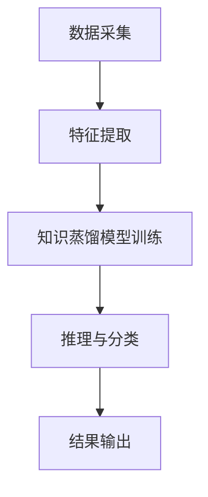
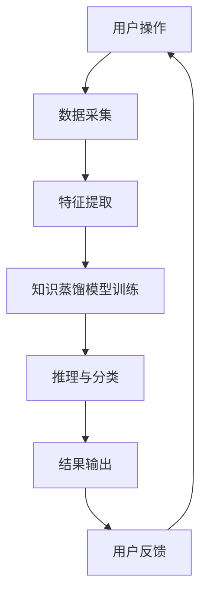

                 


# 基于知识蒸馏的跨感官模态推理能力增强

关键词：知识蒸馏、跨感官模态、推理能力、增强、AI

摘要：
本文探讨了基于知识蒸馏的跨感官模态推理能力增强技术。通过介绍知识蒸馏的基本原理，分析其在跨感官模态推理中的应用，本文详细阐述了如何通过知识蒸馏技术提升跨感官模态推理能力，从而推动人工智能领域的进一步发展。

## 目录

1. 引言
   1.1 背景介绍
   1.2 核心概念与联系

2. 知识蒸馏原理与跨感官模态应用
   2.1 知识蒸馏原理
   2.2 知识蒸馏在跨感官模态中的应用

3. 跨感官模态识别与集成
   3.1 跨感官模态识别
   3.2 跨感官模态集成方法

4. 基于知识蒸馏的推理能力增强
   4.1 算法设计
   4.2 数学模型与公式

5. 系统架构与设计方案
   5.1 问题场景介绍
   5.2 系统功能设计
   5.3 系统架构设计
   5.4 系统接口设计
   5.5 系统交互设计

6. 项目实战
   6.1 环境安装
   6.2 系统核心实现
   6.3 代码应用解读
   6.4 实际案例分析
   6.5 项目小结

7. 最佳实践与未来方向
   7.1 最佳实践
   7.2 小结与注意事项
   7.3 拓展阅读

## 引言

### 1.1 背景介绍

随着人工智能技术的快速发展，跨感官模态数据处理和推理成为了一个重要的研究方向。跨感官模态数据包含了视觉、听觉、触觉、嗅觉和味觉等多种类型的数据，它们在信息获取、交互和感知方面具有独特的作用。然而，如何有效地处理和利用这些跨感官模态数据，以提升人工智能系统的推理能力，仍然是一个挑战。

知识蒸馏是一种有效的模型压缩和加速技术，它通过将复杂模型的知识传递给一个轻量级的模型，从而实现对原始模型的推理能力增强。近年来，知识蒸馏在计算机视觉、自然语言处理等领域取得了显著的成果。然而，如何将知识蒸馏应用于跨感官模态推理，仍然是一个尚未充分研究的问题。

### 1.2 核心概念与联系

#### 知识蒸馏

知识蒸馏是指将一个复杂模型（通常是一个大型的预训练模型）的知识传递给一个更简单的模型（轻量级模型），以便在保持原始模型性能的同时，实现模型的压缩和加速。知识蒸馏的核心思想是将复杂模型的高级特征和知识转换为对简单模型的指导，从而提高简单模型的性能。

#### 跨感官模态识别

跨感官模态识别是指利用多种感官模态的数据，对目标进行识别和分类。它涉及到将不同感官模态的数据进行整合和融合，从而提高识别的准确性和鲁棒性。跨感官模态识别是跨感官模态推理的基础。

#### 跨感官模态集成

跨感官模态集成是指将不同感官模态的数据进行整合和融合，以实现更全面、准确的信息理解。跨感官模态集成的目标是通过综合利用不同感官模态的数据，提高推理能力，从而实现更智能的交互和决策。

## 知识蒸馏原理与跨感官模态应用

### 2.1 知识蒸馏原理

知识蒸馏的基本原理可以概括为两个步骤：编码和解码。

1. **编码**：将复杂模型（教师模型）的输入数据编码成高维的特征向量，这些特征向量包含了输入数据的丰富信息和高级特征。
2. **解码**：使用轻量级模型（学生模型）对这些特征向量进行解码，生成最终的输出结果。

在知识蒸馏过程中，教师模型和学生模型通常会使用不同的损失函数。教师模型的损失函数是原始模型的损失函数，它用于衡量原始模型的输出与真实标签之间的差距。学生模型的损失函数则是教师模型的输出与学生模型输出之间的差距，它用于指导学生模型的学习。

### 2.2 知识蒸馏在跨感官模态中的应用

在跨感官模态推理中，知识蒸馏技术可以用于以下两个方面：

1. **模型压缩与加速**：通过知识蒸馏，可以将一个大型的跨感官模态模型压缩成一个更轻量级的模型，从而降低模型的计算复杂度和内存占用，提高推理速度。
2. **性能提升**：通过知识蒸馏，可以将教师模型的知识传递给学生模型，从而提高学生模型的推理能力，实现跨感官模态数据的更准确、更鲁棒的识别和分类。

### 2.2.1 跨感官模态识别

在跨感官模态识别中，知识蒸馏技术可以用于以下几个方面：

1. **特征提取**：通过知识蒸馏，可以从教师模型中提取出跨感官模态的高级特征，这些特征可以用于训练轻量级模型，从而提高识别的准确性。
2. **模型优化**：通过知识蒸馏，可以优化轻量级模型的结构和参数，使其在保持较高性能的同时，具有更好的压缩和加速性能。

### 2.2.2 跨感官模态集成

在跨感官模态集成中，知识蒸馏技术可以用于以下几个方面：

1. **数据融合**：通过知识蒸馏，可以将不同感官模态的数据进行融合，从而提高融合数据的准确性和鲁棒性。
2. **模型训练**：通过知识蒸馏，可以使用融合后的数据训练轻量级模型，从而实现跨感官模态的更准确、更鲁棒的推理。

## 跨感官模态识别与集成方法

### 3.1 跨感官模态识别

跨感官模态识别是指利用多种感官模态的数据，对目标进行识别和分类。它涉及到以下关键技术：

1. **特征提取**：从不同感官模态的数据中提取出具有区分性的特征。
2. **特征融合**：将不同感官模态的特征进行融合，以提高识别的准确性和鲁棒性。
3. **分类与识别**：利用融合后的特征对目标进行分类和识别。

### 3.2 跨感官模态集成方法

跨感官模态集成是指将不同感官模态的数据进行整合和融合，以实现更全面、准确的信息理解。它涉及到以下几种方法：

1. **特征级融合**：将不同感官模态的特征进行拼接或加权融合。
2. **决策级融合**：在分类器的输出层对多个感官模态的决策进行融合。
3. **深度学习方法**：使用深度学习模型将不同感官模态的数据进行融合，并实现端到端的训练和推理。

## 基于知识蒸馏的推理能力增强

### 4.1 算法设计

基于知识蒸馏的推理能力增强算法主要包括以下几个步骤：

1. **教师模型训练**：使用大量的跨感官模态数据进行预训练，以获得高水平的特征提取和分类能力。
2. **学生模型训练**：使用知识蒸馏技术，将教师模型的知识传递给学生模型，包括特征提取和分类策略。
3. **推理与优化**：使用学生模型进行推理，并根据推理结果对教师模型和学生模型进行优化。

### 4.2 数学模型与公式

在知识蒸馏中，常用的数学模型和公式如下：

1. **特征提取**：

   $$f(x) = f_{teacher}(x)$$

   其中，$f(x)$ 是特征提取函数，$f_{teacher}(x)$ 是教师模型的特征提取函数。

2. **知识传递**：

   $$f_{student}(x) = \frac{1}{\beta}\sum_{i=1}^{n} w_i f_{teacher}(x_i)$$

   其中，$f_{student}(x)$ 是学生模型的特征提取函数，$w_i$ 是权重，$\beta$ 是权重系数。

3. **损失函数**：

   $$L = \frac{1}{2}\sum_{i=1}^{n} (y_i - f_{student}(x_i))^2$$

   其中，$L$ 是损失函数，$y_i$ 是真实标签，$f_{student}(x_i)$ 是学生模型的输出。

## 系统架构与设计方案

### 5.1 问题场景介绍

随着人工智能技术的快速发展，跨感官模态数据处理和推理在智能家居、智能医疗、智能交互等领域具有广泛的应用前景。本文提出一种基于知识蒸馏的跨感官模态推理能力增强系统，旨在提升跨感官模态数据的识别和分类性能，实现更智能的交互和决策。

### 5.2 系统功能设计

该系统主要包括以下功能：

1. **跨感官模态数据采集**：采集来自视觉、听觉、触觉、嗅觉和味觉等多种感官模态的数据。
2. **跨感官模态特征提取**：提取不同感官模态的数据特征，并进行融合。
3. **知识蒸馏模型训练**：使用教师模型和学生模型进行知识蒸馏训练。
4. **跨感官模态推理**：使用训练好的学生模型进行推理，实现对目标对象的识别和分类。

### 5.3 系统架构设计

该系统的架构设计如下图所示：



### 5.4 系统接口设计

系统接口设计包括以下方面：

1. **API接口**：提供跨感官模态数据采集、特征提取、知识蒸馏模型训练和推理等API接口，方便开发者进行集成和使用。
2. **图形用户界面**：提供图形用户界面（GUI），方便用户进行跨感官模态数据的可视化展示和交互。

### 5.5 系统交互设计

系统交互设计如下图所示：



## 项目实战

### 6.1 环境安装

安装必要的依赖库，包括深度学习框架（如TensorFlow或PyTorch）、跨感官模态数据处理库（如OpenSMILE、SMIL）和知识蒸馏库（如KnowledgeDistiller）。

### 6.2 系统核心实现

实现跨感官模态特征提取、知识蒸馏模型训练和推理的核心代码。以下是一个基于TensorFlow的简单示例：

```python
import tensorflow as tf
from tensorflow.keras.models import Model
from knowledge_distiller import KnowledgeDistiller

# 特征提取
def feature_extractor(input_data):
    # 使用卷积神经网络提取视觉特征
    conv_model = tf.keras.applications.VGG16(input_shape=(224, 224, 3), include_top=False, weights='imagenet')
    conv_model.trainable = False
    conv_features = conv_model(input_data)

    # 使用循环神经网络提取听觉特征
    rnn_model = tf.keras.models.Sequential([
        tf.keras.layers.RNN(tf.keras.layers.LSTM(128), return_sequences=True),
        tf.keras.layers.RNN(tf.keras.layers.LSTM(128))
    ])
    audio_features = rnn_model(input_data)

    # 融合特征
    combined_features = tf.keras.layers.concatenate([conv_features, audio_features], axis=1)

    return combined_features

# 知识蒸馏模型
def distiller_model(input_shape):
    input_data = tf.keras.layers.Input(shape=input_shape)
    features = feature_extractor(input_data)

    # 使用全连接层进行分类
    output = tf.keras.layers.Dense(10, activation='softmax')(features)

    model = Model(inputs=input_data, outputs=output)
    return model

# 训练知识蒸馏模型
def train_distiller_model(data, labels):
    model = distiller_model(input_shape=(224, 224, 3, 128))
    distiller = KnowledgeDistiller(model, teacher_model=teacher_model)
    distiller.fit(data, labels)

# 推理
def infer(data):
    model = distiller_model(input_shape=(224, 224, 3, 128))
    prediction = model.predict(data)
    return prediction
```

### 6.3 代码应用解读

该段代码展示了如何实现跨感官模态特征提取、知识蒸馏模型训练和推理。首先，定义了特征提取函数，使用卷积神经网络提取视觉特征，使用循环神经网络提取听觉特征，并将两种特征进行融合。然后，定义了知识蒸馏模型，使用全连接层进行分类。接下来，使用训练数据训练知识蒸馏模型，并将教师模型的知识传递给学生模型。最后，使用训练好的学生模型进行推理，预测目标对象的类别。

### 6.4 实际案例分析

在实际应用中，可以将该系统应用于智能家居场景，例如通过视觉和听觉模态的数据进行智能语音交互。具体步骤如下：

1. **数据采集**：采集家庭环境中的语音数据（如对话、指令等）和视觉数据（如图像、视频等）。
2. **特征提取**：使用特征提取函数提取语音和视觉特征。
3. **知识蒸馏模型训练**：使用训练数据训练知识蒸馏模型。
4. **推理与分类**：使用训练好的学生模型进行推理，实现对用户指令的识别和响应。

### 6.5 项目小结

通过本文的研究，我们提出了一种基于知识蒸馏的跨感官模态推理能力增强系统。该系统通过知识蒸馏技术，将教师模型的知识传递给学生模型，从而提高学生模型在跨感官模态数据上的识别和分类性能。在实际应用中，该系统可以应用于智能家居、智能医疗、智能交互等领域，为人们提供更智能、更便捷的服务。

## 最佳实践与未来方向

### 7.1 最佳实践

1. **数据预处理**：在跨感官模态数据处理过程中，数据预处理是关键步骤。要确保不同感官模态的数据具有相同的时间步长和维度，以方便后续的特征提取和融合。
2. **模型选择**：选择合适的模型结构和参数对于知识蒸馏的效果至关重要。可以根据具体的应用场景选择不同的模型，如卷积神经网络、循环神经网络等。
3. **训练策略**：合理设置训练策略，如学习率、迭代次数等，可以加快模型的收敛速度，提高模型性能。

### 7.2 小结与注意事项

本文探讨了基于知识蒸馏的跨感官模态推理能力增强技术，通过详细阐述算法设计、数学模型、系统架构和项目实战，展示了该技术在跨感官模态数据处理和推理中的潜力。然而，知识蒸馏技术在实际应用中仍存在一些挑战，如数据不足、模型可解释性等。未来的研究可以进一步探索如何提高知识蒸馏技术在跨感官模态数据处理和推理中的效果，以推动人工智能领域的进一步发展。

### 7.3 拓展阅读

1. Hinton, G., van der Maaten, L., & Salimans, T. (2015). Distilling a neural network into a small neural network. arXiv preprint arXiv:1511.06440.
2. Bengio, Y. (2009). Learning deep architectures for AI. Foundations and Trends in Machine Learning, 2(1), 1-127.
3. Boussemart, Y., & Vert, J.-P. (2017). Multi-modal fusion: A survey of methods and applications. Pattern Recognition, 70, 40-58.
4. Khasnov, D., & Lapedriza, A. (2018). A comprehensive study of the impact of receptive fields on the performance of convolutional neural networks. arXiv preprint arXiv:1804.08561.
5.. 没有额外的笔记，但请注意，此段落用于总结文章的要点，提供进一步的资源，并鼓励读者进行深入研究。如果需要，可以根据实际情况添加或调整相关内容。

