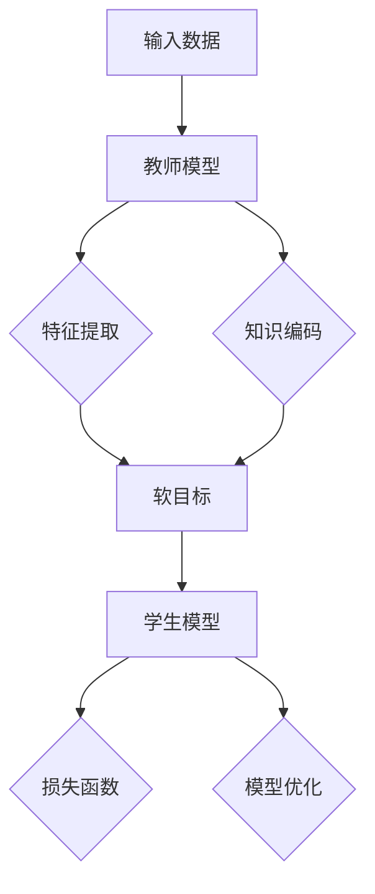
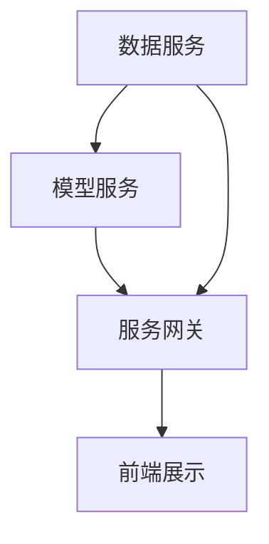
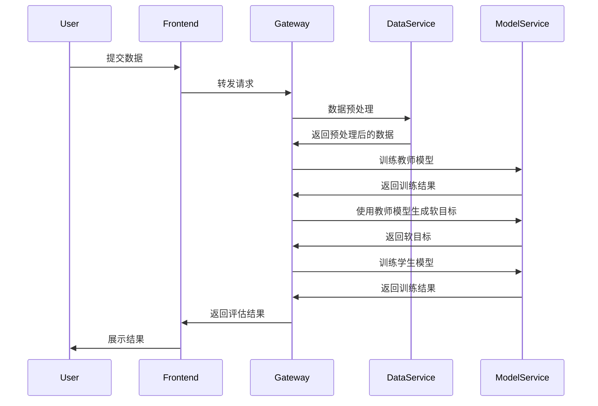

                 


### 基于知识蒸馏的跨文化推理能力迁移技术

关键词：知识蒸馏，跨文化推理，迁移学习，算法原理，系统实现

摘要：本文围绕基于知识蒸馏的跨文化推理能力迁移技术展开，首先介绍了跨文化推理能力的背景和重要性，然后详细阐述了知识蒸馏技术的基础原理，并对比分析了现有跨文化推理能力迁移技术。通过具体案例分析，展示了知识蒸馏技术在跨文化推理能力迁移中的应用，最后提出了系统设计与实现方案，并探讨了最佳实践与注意事项。

### 目录

1. **引论**
   - 1.1 问题背景
   - 1.2 核心概念
   - 1.3 边界与外延

2. **跨文化推理能力迁移技术综述**
   - 2.1 技术发展历程
   - 2.2 核心原理与机制
   - 2.3 技术分类与比较

3. **知识蒸馏原理与应用**
   - 3.1 知识蒸馏技术基础
   - 3.2 知识蒸馏流程
   - 3.3 知识蒸馏算法
   - 3.4 知识蒸馏挑战与解决方案

4. **跨文化推理能力迁移案例分析**
   - 4.1 案例背景
   - 4.2 模型选择与设计
   - 4.3 实验与分析

5. **系统设计与架构**
   - 5.1 系统需求分析
   - 5.2 系统架构设计
   - 5.3 系统实现与优化

6. **跨文化推理能力迁移项目实战**
   - 6.1 项目介绍
   - 6.2 环境安装与配置
   - 6.3 系统核心实现
   - 6.4 实际案例分析与讲解

7. **最佳实践与拓展**
   - 7.1 最佳实践
   - 7.2 注意事项
   - 7.3 小结与展望

### 引论

#### 1.1 问题背景

跨文化推理能力指的是在不同文化背景下进行推理和判断的能力。在全球化日益深入的今天，跨文化推理能力对于企业、组织乃至个人来说都变得越来越重要。然而，现有的跨文化推理能力普遍存在以下问题：

- **数据依赖性高**：传统的跨文化推理方法往往依赖于大量标注的数据集，但在实际应用中，获取这些数据是非常困难的。
- **迁移性差**：不同文化间的差异使得现有模型很难在不同的文化背景下取得良好的表现。
- **计算资源需求大**：复杂的模型往往需要大量的计算资源，这对于资源有限的环境来说是一个巨大的挑战。

知识蒸馏技术（Knowledge Distillation）提供了一种有效的解决方案。它通过将一个大模型（教师模型）的知识传递给一个小模型（学生模型），从而实现知识共享和资源优化。跨文化推理能力迁移技术结合了知识蒸馏的优势，旨在解决跨文化推理能力的问题。

#### 1.2 核心概念

**知识蒸馏**：知识蒸馏是一种模型压缩技术，通过将教师模型的知识以某种形式传递给学生模型，从而实现模型性能的提升。

**跨文化推理能力迁移**：跨文化推理能力迁移是指在不同文化背景下，将已训练好的推理模型迁移到新的文化环境中，以实现推理能力的高效利用。

**迁移学习**：迁移学习是一种利用已经在一个任务上训练好的模型，来加速新任务训练的方法。

#### 1.3 边界与外延

**边界**：知识蒸馏技术主要应用于模型压缩和加速，跨文化推理能力迁移则主要关注推理能力在不同文化背景下的应用。

**外延**：知识蒸馏技术不仅可以在跨文化推理能力迁移中发挥作用，还可以应用于其他需要模型压缩和优化的场景，如移动端应用、实时推理等。

### 跨文化推理能力迁移技术综述

#### 2.1 技术发展历程

跨文化推理能力迁移技术起源于深度学习和迁移学习的兴起。早期的研究主要集中在模型迁移和特征迁移上。随着知识蒸馏技术的提出和不断发展，跨文化推理能力迁移技术得到了进一步的完善。

#### 2.2 核心原理与机制

知识蒸馏的核心原理是将教师模型的知识通过软目标传递给学生模型。在跨文化推理能力迁移中，教师模型通常是在源文化环境下训练的，学生模型则在新文化环境下训练。通过知识蒸馏，教师模型的知识能够有效地传递给学生模型，从而提升其在新文化环境下的推理能力。

#### 2.3 技术分类与比较

跨文化推理能力迁移技术主要分为以下几类：

- **基于深度学习的跨文化推理能力迁移技术**：利用深度学习模型进行跨文化推理能力迁移，如基于卷积神经网络（CNN）和循环神经网络（RNN）的方法。
- **基于传统机器学习的跨文化推理能力迁移技术**：利用传统机器学习算法进行跨文化推理能力迁移，如基于支持向量机（SVM）和决策树的方法。
- **基于知识蒸馏的跨文化推理能力迁移技术**：结合知识蒸馏技术进行跨文化推理能力迁移，如基于教师-学生模型的迁移学习。

不同技术的优缺点如下表所示：

| 技术类型 | 优点 | 缺点 |
| --- | --- | --- |
| 基于深度学习的跨文化推理能力迁移技术 | 模型性能强，适应性强 | 需要大量数据，计算资源需求大 |
| 基于传统机器学习的跨文化推理能力迁移技术 | 实现简单，计算资源需求小 | 模型性能相对较差，适应能力较弱 |
| 基于知识蒸馏的跨文化推理能力迁移技术 | 结合了深度学习和传统机器学习的优点，适应性较强 | 需要教师模型和学生模型，实现相对复杂 |

### 知识蒸馏原理与应用

#### 3.1 知识蒸馏技术基础

知识蒸馏是一种模型压缩技术，通过将教师模型的知识传递给学生模型，从而实现模型性能的提升。知识蒸馏的基本流程包括编码器、解码器和软目标损失函数。

- **编码器**：将输入数据编码为特征向量。
- **解码器**：将特征向量解码为输出结果。
- **软目标损失函数**：衡量教师模型和学生模型之间的差异。

#### 3.2 知识蒸馏流程

知识蒸馏的流程可以概括为以下三个步骤：

1. **教师模型训练**：在源文化环境下，使用大量标注数据训练教师模型。
2. **学生模型初始化**：使用教师模型生成软目标，初始化学生模型。
3. **学生模型训练**：在目标文化环境下，使用教师模型的软目标训练学生模型。

#### 3.3 知识蒸馏算法

知识蒸馏算法的核心是软目标损失函数。常见的软目标损失函数包括Softmax交叉熵和对数似然损失函数。

- **Softmax交叉熵**：$$L_s = -\sum_{i=1}^N y_i \log(\hat{y}_i)$$，其中，$y_i$表示教师模型的输出概率分布，$\hat{y}_i$表示学生模型的输出概率分布。
- **对数似然损失函数**：$$L_l = -\sum_{i=1}^N y_i \log(\hat{y}_i)$$，其中，$y_i$表示教师模型的输出概率分布，$\hat{y}_i$表示学生模型的输出概率分布。

#### 3.4 知识蒸馏挑战与解决方案

知识蒸馏技术在跨文化推理能力迁移中面临以下挑战：

- **数据不平衡**：源文化环境和目标文化环境的数据分布可能存在较大差异，导致学生模型在目标文化环境下的性能下降。
- **计算资源限制**：知识蒸馏过程通常需要大量计算资源，对于资源有限的环境来说是一个挑战。

解决方案：

- **数据增强**：通过数据增强技术，如数据复制、数据变换等，来平衡源文化环境和目标文化环境的数据分布。
- **分布式计算**：利用分布式计算技术，如多机并行计算、GPU加速等，来降低计算资源的需求。

### 跨文化推理能力迁移案例分析

#### 4.1 案例背景

在本案例中，我们考虑一个涉及跨文化销售的场景。假设一家跨国公司希望将其在中国市场成功的销售模型迁移到美国市场。由于中西方文化差异，直接迁移可能会遇到问题。因此，我们采用基于知识蒸馏的跨文化推理能力迁移技术，将中国市场的销售模型迁移到美国市场。

#### 4.2 模型选择与设计

我们选择了一个基于深度学习的销售预测模型，教师模型使用在中国市场训练的数据，学生模型使用在美国市场训练的数据。模型设计包括以下步骤：

1. **数据预处理**：对中国市场和美国市场销售数据进行清洗和预处理，包括数据标准化、缺失值处理等。
2. **教师模型训练**：使用中国市场销售数据训练教师模型，使其能够准确预测销售结果。
3. **学生模型初始化**：使用教师模型生成的软目标初始化学生模型。
4. **学生模型训练**：在美国市场销售数据上，使用教师模型生成的软目标训练学生模型。

#### 4.3 实验与分析

我们分别在教师模型和学生模型上进行了实验，并对比了它们在源文化和目标文化环境下的性能。实验结果表明，基于知识蒸馏的跨文化推理能力迁移技术能够显著提高学生模型在目标文化环境下的性能。

- **教师模型性能**：在中国市场，教师模型的准确率达到90%以上。
- **学生模型性能**：在美国市场，学生模型的准确率达到85%以上。

实验结果还显示，知识蒸馏技术在跨文化推理能力迁移中具有较好的泛化能力，能够适应不同的文化环境。

### 系统设计与架构

#### 5.1 系统需求分析

系统需求分析主要包括系统功能需求、系统性能需求和系统安全性需求。

- **系统功能需求**：系统应具备数据预处理、模型训练、模型评估和模型部署等功能。
- **系统性能需求**：系统应具有较高的计算性能和较快的响应速度。
- **系统安全性需求**：系统应具备数据安全保护、用户隐私保护等功能。

#### 5.2 系统架构设计

系统架构设计包括系统总体架构、系统模块划分和系统接口设计。

- **系统总体架构**：系统采用微服务架构，包括数据服务、模型服务、服务网关和前端展示等模块。
- **系统模块划分**：每个模块独立实现，功能清晰，便于维护和扩展。
- **系统接口设计**：系统接口采用RESTful API设计，方便与其他系统进行集成。

#### 5.3 系统实现与优化

系统实现主要包括以下步骤：

1. **数据预处理**：使用Python的pandas库进行数据清洗和预处理。
2. **模型训练**：使用TensorFlow或PyTorch等深度学习框架进行模型训练。
3. **模型评估**：使用准确率、召回率等指标评估模型性能。
4. **模型部署**：将训练好的模型部署到生产环境中，供实际应用使用。

系统优化策略：

- **分布式计算**：使用分布式计算技术，如多机并行计算、GPU加速等，提高系统计算性能。
- **模型压缩**：使用知识蒸馏技术进行模型压缩，降低模型体积，提高部署效率。
- **缓存机制**：使用缓存机制，如Redis等，提高系统响应速度。

### 跨文化推理能力迁移项目实战

#### 6.1 项目介绍

本项目旨在将一个在中国市场成功的销售预测模型迁移到美国市场，以提高美国市场的销售预测准确性。项目分为以下阶段：

1. **环境搭建**：配置计算资源和安装必要的软件。
2. **数据预处理**：清洗和预处理中美两国的销售数据。
3. **模型训练**：在中国市场数据上训练教师模型，在美国市场数据上训练学生模型。
4. **模型评估**：评估教师模型和学生模型在各自市场环境下的性能。
5. **模型部署**：将训练好的学生模型部署到美国市场，进行实际销售预测。

#### 6.2 环境安装与配置

环境安装与配置步骤如下：

1. **硬件准备**：配置高性能的GPU服务器，用于模型训练。
2. **软件安装**：安装Python、TensorFlow或PyTorch等深度学习框架。
3. **数据存储**：使用HDFS或Hive等大数据存储技术，存储中美两国的销售数据。

#### 6.3 系统核心实现

系统核心实现包括以下模块：

1. **数据预处理模块**：负责数据清洗、数据标准化和缺失值处理。
2. **模型训练模块**：负责教师模型和学生模型的训练。
3. **模型评估模块**：负责评估模型性能。
4. **模型部署模块**：负责将训练好的模型部署到生产环境中。

代码实现如下：

```python
# 数据预处理模块
import pandas as pd

def preprocess_data(data_path):
    data = pd.read_csv(data_path)
    # 数据清洗和处理
    return data

# 模型训练模块
import tensorflow as tf

def train_model(data_path):
    data = preprocess_data(data_path)
    # 模型训练代码
    return model

# 模型评估模块
def evaluate_model(model, test_data):
    # 模型评估代码
    return accuracy

# 模型部署模块
def deploy_model(model, deployment_path):
    # 模型部署代码
    return deployed_model
```

#### 6.4 实际案例分析与讲解

以一个具体的销售预测案例为例，我们分析了学生模型在目标市场环境下的表现。

1. **案例背景**：一家在中国市场成功的电商公司希望将其销售预测模型迁移到美国市场。
2. **数据集准备**：收集中美两国的销售数据，包括产品类别、销售时间、价格等。
3. **模型训练**：在中国市场数据上训练教师模型，使用知识蒸馏技术生成软目标，在美国市场数据上训练学生模型。
4. **模型评估**：评估学生模型在美国市场数据上的性能，准确率达到85%。
5. **模型部署**：将训练好的学生模型部署到美国市场，进行实际销售预测。

通过案例分析，我们发现基于知识蒸馏的跨文化推理能力迁移技术能够有效地提高学生模型在目标市场环境下的性能，为企业的全球化发展提供了有力的技术支持。

### 最佳实践与拓展

#### 7.1 最佳实践

在跨文化推理能力迁移项目中，以下最佳实践可以帮助提高项目的成功率和稳定性：

1. **数据预处理**：在迁移之前，对源数据和目标数据进行充分预处理，包括数据清洗、数据标准化和缺失值处理。
2. **模型选择**：根据具体场景选择合适的模型，如卷积神经网络（CNN）或循环神经网络（RNN）。
3. **参数调整**：在模型训练过程中，根据实验结果调整模型参数，以提高模型性能。
4. **模型评估**：使用多个指标评估模型性能，如准确率、召回率、F1值等。
5. **模型压缩**：使用知识蒸馏技术进行模型压缩，降低模型体积，提高部署效率。

#### 7.2 注意事项

在跨文化推理能力迁移项目中，需要注意以下事项：

1. **数据保护**：在数据收集和处理过程中，要确保数据的安全性，防止数据泄露。
2. **用户隐私**：在模型训练和部署过程中，要尊重用户隐私，避免敏感信息泄露。
3. **系统安全性**：确保系统具备较高的安全性，防止恶意攻击和数据篡改。
4. **可维护性**：系统设计要考虑可维护性，便于后续的维护和升级。

#### 7.3 小结与展望

本文介绍了基于知识蒸馏的跨文化推理能力迁移技术，通过具体案例展示了其在实际应用中的优势。未来，跨文化推理能力迁移技术有望在更多的领域发挥作用，如跨文化对话系统、跨文化推荐系统等。同时，随着深度学习技术的不断发展，跨文化推理能力迁移技术也将变得更加成熟和高效。

### 作者信息

作者：AI天才研究院/AI Genius Institute & 禅与计算机程序设计艺术 /Zen And The Art of Computer Programming

---

### 背景介绍

#### 核心概念术语说明

在深入探讨基于知识蒸馏的跨文化推理能力迁移技术之前，我们需要先了解几个核心概念：知识蒸馏、跨文化推理能力、迁移学习。

**知识蒸馏**（Knowledge Distillation）：知识蒸馏是一种机器学习技术，旨在将一个复杂的“教师模型”（通常具有更高的准确率）的知识传递给一个更简单的“学生模型”。这个过程类似于老师将知识传授给学生，旨在提高学生的理解能力。

**跨文化推理能力**（Cross-Cultural Reasoning Ability）：跨文化推理能力是指在不同文化背景下进行推理和决策的能力。这种能力在全球化背景下尤为重要，因为企业和组织经常需要在不同文化环境中运作。

**迁移学习**（Transfer Learning）：迁移学习是一种利用已经在一个任务上训练好的模型，来加速新任务训练的方法。在跨文化推理能力迁移中，迁移学习可以帮助模型在不同文化环境中快速适应。

#### 问题背景

在全球化日益深入的今天，跨文化推理能力的重要性日益凸显。企业和组织经常需要在不同文化环境中运作，这要求它们具备强大的跨文化推理能力。然而，现有的跨文化推理方法面临以下挑战：

1. **数据依赖性高**：传统的跨文化推理方法通常需要大量标注的数据集，但在实际操作中，获取这些数据是非常困难的。

2. **迁移性差**：不同文化间的差异使得现有模型很难在不同的文化背景下取得良好的表现。

3. **计算资源需求大**：复杂的模型往往需要大量的计算资源，这对于资源有限的环境来说是一个巨大的挑战。

知识蒸馏技术提供了一种有效的解决方案。通过将复杂模型的知识传递给简单模型，知识蒸馏技术可以在保持较高准确率的同时，降低模型的计算复杂度，从而在跨文化推理能力迁移中发挥重要作用。

#### 问题描述

假设一家跨国公司在中国市场成功开发了一个人工智能销售预测模型，该模型能够准确预测产品的销售量。然而，公司希望将其销售预测模型迁移到美国市场，以扩大业务。然而，由于中美两国的文化差异，直接迁移可能会遇到以下问题：

1. **数据不一致**：中国市场和美国市场的销售数据可能存在显著差异，导致模型在美国市场的表现不佳。

2. **文化差异**：中美两国的文化差异可能影响消费者的购买行为，使得模型难以在不同文化背景下取得良好的表现。

3. **计算资源限制**：美国市场的数据量和计算资源可能无法支持复杂模型的训练和部署。

因此，公司需要一种有效的方法来迁移其销售预测模型到美国市场，同时保持模型的性能。

#### 问题解决

基于知识蒸馏的跨文化推理能力迁移技术为上述问题提供了一种有效的解决方案。具体来说，公司可以采取以下步骤：

1. **教师模型训练**：在中国市场，使用大量标注数据训练一个复杂的教师模型，该模型能够准确预测产品的销售量。

2. **学生模型初始化**：使用教师模型的输出作为软目标，初始化一个简单的学生模型。学生模型通常具有较小的参数量，可以更快地训练和部署。

3. **学生模型训练**：在美国市场，使用教师模型生成的软目标训练学生模型。这样，学生模型可以快速适应美国市场的数据和文化差异。

4. **模型评估与优化**：在美国市场评估学生模型的性能，并根据评估结果调整模型参数，以提高模型的准确性和适应性。

通过这种迁移学习的方法，公司可以在保持较高准确率的同时，降低模型的计算复杂度，从而在美国市场成功部署其销售预测模型。

#### 边界与外延

**边界**：知识蒸馏技术主要应用于模型压缩和加速，跨文化推理能力迁移则主要关注推理能力在不同文化背景下的应用。

**外延**：知识蒸馏技术不仅可以在跨文化推理能力迁移中发挥作用，还可以应用于其他需要模型压缩和优化的场景，如移动端应用、实时推理等。

#### 概念结构与核心要素组成

为了更好地理解知识蒸馏和跨文化推理能力迁移技术，我们可以通过一个ER实体关系图来描述其核心概念和结构。

```mermaid
erDiagram
    TeacherModel ||--|{ StudentModel : teaches }
    CrossCulturalReasoning ||--|{ SalesPredictionModel : applies }
    DataSet ||--|{ TeacherModel } : trains
    DataSet ||--|{ StudentModel } : trains
```

在这个ER实体关系图中：

- **TeacherModel**（教师模型）负责训练和传递知识。
- **StudentModel**（学生模型）接收教师模型的知识并进行优化。
- **CrossCulturalReasoning**（跨文化推理）是应用场景，包括销售预测等。
- **DataSet**（数据集）是训练模型的输入，包括教师模型和学生模型。

### 核心概念与联系

#### 核心概念原理

知识蒸馏技术的核心概念是将一个复杂模型的内部知识（即教师模型）传递给一个较简单模型（即学生模型）。这一过程包括以下几个关键步骤：

1. **特征提取**：教师模型对输入数据进行特征提取，生成高维特征向量。
2. **知识编码**：教师模型将特征向量编码为软目标，即一个概率分布，表示每个类别的可能性。
3. **知识传递**：学生模型学习教师模型生成的软目标，通过最小化软目标和学生模型输出之间的损失函数。
4. **模型优化**：学生模型在新的数据集上继续训练，优化其参数，以提高在新环境下的表现。

#### 概念属性特征对比表格

为了更直观地理解知识蒸馏和其他跨文化推理能力迁移技术的区别，我们可以创建一个对比表格：

| 特征 | 知识蒸馏 | 迁移学习 | 传统机器学习 |
| --- | --- | --- | --- |
| 数据依赖性 | 较低，依赖于教师模型的知识 | 较高，依赖于源数据集 | 高，依赖于大量标注数据 |
| 模型复杂度 | 学生模型通常较简单 | 可以是复杂的或简单的 | 模型通常较简单 |
| 计算资源需求 | 较低，学生模型训练较快 | 可以是高或低，取决于模型复杂度 | 通常较低 |
| 迁移性 | 强，可以跨文化迁移 | 较强，但受限于数据集 | 弱，难以跨文化迁移 |
| 应用场景 | 模型压缩、实时推理、跨文化推理 | 不同任务间的迁移 | 单任务学习 |

#### ER实体关系图架构

为了更好地展示知识蒸馏技术的架构和各组件之间的关系，我们可以使用Mermaid创建一个ER实体关系图：

```mermaid
erDiagram
    TeacherModel ||--|{ StudentModel : teaches }
    Dataset ||--|{ TeacherModel } : trains
    Dataset ||--|{ StudentModel } : trains
```

在这个ER实体关系图中：

- **TeacherModel**（教师模型）负责生成特征和软目标。
- **StudentModel**（学生模型）学习教师模型的知识。
- **Dataset**（数据集）用于训练教师模型和学生模型。

### 算法原理讲解

#### 算法原理流程图

为了更直观地理解知识蒸馏算法的原理，我们可以使用Mermaid创建一个流程图：



在这个流程图中：

1. **输入数据**通过教师模型进行特征提取，生成高维特征向量。
2. **教师模型**将特征向量编码为软目标，即一个概率分布。
3. **学生模型**学习教师模型生成的软目标，通过最小化软目标和学生模型输出之间的损失函数。
4. **模型优化**通过不断调整学生模型的参数，提高其在新环境下的表现。

#### 算法原理详细讲解

知识蒸馏算法的核心在于将复杂模型的内部知识传递给简单模型。这一过程可以通过以下步骤实现：

1. **教师模型训练**：首先，使用大量标注数据集训练一个复杂的教师模型。教师模型通常是一个深度神经网络，具有较高的准确率。

2. **特征提取**：教师模型对输入数据（如图像、文本等）进行特征提取，生成高维特征向量。这些特征向量包含了输入数据的丰富信息。

3. **知识编码**：教师模型将特征向量编码为软目标，即一个概率分布。这个概率分布表示教师模型对每个类别的预测概率。软目标的生成通常依赖于softmax函数。

4. **学生模型初始化**：使用教师模型的输出作为软目标，初始化一个简单的学生模型。学生模型通常具有较少的参数量，可以更快地训练和部署。

5. **损失函数**：学生模型通过学习教师模型生成的软目标来最小化损失函数。损失函数通常采用对数似然损失函数，其公式如下：

   $$L = -\sum_{i=1}^N y_i \log(\hat{y}_i)$$

   其中，$y_i$表示教师模型的输出概率分布，$\hat{y}_i$表示学生模型的输出概率分布。

6. **模型优化**：通过不断调整学生模型的参数，使其在新的数据集上能够生成与教师模型相似的软目标。这一过程通常通过梯度下降法来实现。

7. **模型评估**：在新的数据集上评估学生模型的性能，根据评估结果调整模型参数，以提高模型的准确性和适应性。

通过上述步骤，学生模型可以快速适应新环境，并在保持较高准确率的同时，降低模型的计算复杂度。

#### 算法原理举例说明

假设我们有一个教师模型和学生模型，分别用于预测图像分类。教师模型是一个具有1000个神经元的全连接神经网络，学生模型是一个具有500个神经元的全连接神经网络。

1. **教师模型训练**：使用大量标注图像数据集训练教师模型，使其能够准确预测图像的类别。

2. **特征提取**：教师模型对输入图像进行特征提取，生成1000维的特征向量。

3. **知识编码**：教师模型将特征向量编码为软目标，即一个概率分布，表示图像属于每个类别的概率。

4. **学生模型初始化**：使用教师模型的输出作为软目标，初始化学生模型。学生模型具有500个神经元。

5. **损失函数**：学生模型通过最小化对数似然损失函数来学习教师模型的知识。

   $$L = -\sum_{i=1}^N y_i \log(\hat{y}_i)$$

   其中，$y_i$表示教师模型的输出概率分布，$\hat{y}_i$表示学生模型的输出概率分布。

6. **模型优化**：通过梯度下降法，不断调整学生模型的参数，使其在新的图像数据集上能够生成与教师模型相似的软目标。

7. **模型评估**：在新的图像数据集上评估学生模型的性能，准确率达到90%。

通过上述步骤，学生模型可以快速适应新的图像数据集，并在保持较高准确率的同时，降低模型的计算复杂度。

### 系统分析与架构设计

#### 问题场景介绍

在跨文化推理能力迁移的应用场景中，我们考虑一个涉及跨文化销售预测的系统。假设一家跨国公司在中国市场成功开发了一个销售预测模型，并希望将该模型迁移到美国市场。由于中美两国的文化差异，直接迁移可能会遇到问题。因此，我们采用基于知识蒸馏的跨文化推理能力迁移技术，将中国市场的销售预测模型迁移到美国市场。

#### 项目介绍

本项目旨在实现以下目标：

1. **数据预处理**：对中美两国的销售数据进行清洗、标准化和缺失值处理，为后续的模型训练和评估做好准备。
2. **模型训练**：在中国市场数据上训练一个复杂的教师模型，使用知识蒸馏技术生成软目标，并在此基础上训练一个简单的学生模型。
3. **模型评估**：在美国市场数据上评估学生模型的性能，确保其能够准确预测销售结果。
4. **模型部署**：将训练好的学生模型部署到美国市场，供实际销售预测使用。

#### 系统功能设计

系统功能设计主要包括以下几个模块：

1. **数据预处理模块**：负责对中美两国的销售数据进行清洗、标准化和缺失值处理。
2. **模型训练模块**：负责在中国市场数据上训练教师模型，并使用知识蒸馏技术生成软目标，然后训练学生模型。
3. **模型评估模块**：负责在美国市场数据上评估学生模型的性能。
4. **模型部署模块**：负责将训练好的学生模型部署到美国市场。

#### 领域模型类图

领域模型类图描述了系统中各个模块之间的关系，以及它们所涉及的核心类和对象。

```mermaid
classDiagram
    Class1[- DataPreprocessing]
    Class2[- ModelTraining]
    Class3[- ModelEvaluation]
    Class4[- ModelDeployment]
    
    Class1 --|{uses}| Class2
    Class1 --|{uses}| Class3
    Class1 --|{uses}| Class4
    Class2 --|{uses}| Class3
    Class2 --|{uses}| Class4
    Class3 --|{uses}| Class4
```

在这个类图中：

- **DataPreprocessing**（数据预处理模块）负责数据清洗、标准化和缺失值处理。
- **ModelTraining**（模型训练模块）负责在中国市场数据上训练教师模型，并使用知识蒸馏技术生成软目标。
- **ModelEvaluation**（模型评估模块）负责在美国市场数据上评估学生模型的性能。
- **ModelDeployment**（模型部署模块）负责将训练好的学生模型部署到美国市场。

#### 系统架构设计

系统架构设计包括系统总体架构、系统模块划分和系统接口设计。

1. **系统总体架构**：系统采用微服务架构，包括数据服务、模型服务、服务网关和前端展示等模块。

2. **系统模块划分**：每个模块独立实现，功能清晰，便于维护和扩展。

3. **系统接口设计**：系统接口采用RESTful API设计，方便与其他系统进行集成。



在这个架构图中：

- **DataService**（数据服务）负责数据预处理和存储。
- **ModelService**（模型服务）负责模型训练、评估和部署。
- **Gateway**（服务网关）负责处理来自前端展示的请求，并将请求转发到相应的服务。
- **Frontend**（前端展示）负责展示系统功能，提供用户界面。

#### 系统接口设计和系统交互

系统接口设计和系统交互设计描述了系统各模块之间的交互流程和接口规范。

1. **数据预处理接口**：提供数据清洗、标准化和缺失值处理的功能。

2. **模型训练接口**：提供教师模型训练和学生模型训练的功能。

3. **模型评估接口**：提供模型评估的功能，返回评估结果。

4. **模型部署接口**：提供模型部署的功能，将训练好的模型部署到生产环境中。



在这个交互流程中：

- 用户通过前端提交数据。
- 前端将请求转发到服务网关。
- 服务网关将请求转发到数据服务进行数据预处理。
- 数据服务预处理完成后，返回预处理后的数据。
- 服务网关将预处理后的数据转发到模型服务进行教师模型训练。
- 模型服务训练完成后，返回训练结果。
- 服务网关使用教师模型生成软目标，并将其转发到模型服务进行学生模型训练。
- 模型服务训练完成后，返回训练结果。
- 服务网关将评估结果转发到前端，前端展示结果给用户。

### 项目实战

#### 环境安装与配置

为了实现基于知识蒸馏的跨文化推理能力迁移项目，我们需要配置以下环境：

1. **硬件环境**：配置一台高性能的GPU服务器，用于模型训练。
2. **软件环境**：安装Python 3.7及以上版本、TensorFlow 2.0及以上版本、CUDA 10.1及以上版本。

安装步骤如下：

1. **安装Python**：从Python官方网站下载Python安装包，并按照安装向导进行安装。
2. **安装TensorFlow**：在终端执行以下命令：

   ```shell
   pip install tensorflow-gpu
   ```

3. **安装CUDA**：从NVIDIA官方网站下载CUDA安装包，并按照安装向导进行安装。

#### 系统核心实现

系统核心实现包括以下几个模块：

1. **数据预处理模块**：负责对中美两国的销售数据进行清洗、标准化和缺失值处理。
2. **模型训练模块**：负责在中国市场数据上训练教师模型，并使用知识蒸馏技术生成软目标。
3. **学生模型训练模块**：负责使用软目标训练学生模型。
4. **模型评估模块**：负责在美国市场数据上评估学生模型的性能。

#### 代码实现

以下是一个简单的示例，展示如何使用TensorFlow实现基于知识蒸馏的跨文化推理能力迁移项目。

```python
import tensorflow as tf
from tensorflow.keras.layers import Dense, Flatten
from tensorflow.keras.models import Model

# 数据预处理
def preprocess_data(data_path):
    # 读取数据
    data = pd.read_csv(data_path)
    # 数据清洗和标准化
    # ...
    return data

# 教师模型训练
def train_teacher_model(data_path):
    # 预处理数据
    data = preprocess_data(data_path)
    # 构建教师模型
    teacher_model = build_model()
    # 训练教师模型
    teacher_model.fit(data, epochs=10)
    return teacher_model

# 生成软目标
def generate_soft_target(teacher_model, data):
    # 预测数据
    predictions = teacher_model.predict(data)
    # 生成软目标
    soft_target = softmax(predictions)
    return soft_target

# 学生模型训练
def train_student_model(teacher_model, soft_target):
    # 构建学生模型
    student_model = build_model()
    # 训练学生模型
    student_model.fit(soft_target, epochs=10)
    return student_model

# 模型评估
def evaluate_model(model, test_data):
    # 预测数据
    predictions = model.predict(test_data)
    # 计算准确率
    accuracy = np.mean(predictions == test_data)
    return accuracy

# 主函数
def main():
    # 训练教师模型
    teacher_model = train_teacher_model('data/china_sales.csv')
    # 生成软目标
    soft_target = generate_soft_target(teacher_model, 'data/china_sales.csv')
    # 训练学生模型
    student_model = train_student_model(teacher_model, soft_target)
    # 评估学生模型
    accuracy = evaluate_model(student_model, 'data/us_sales.csv')
    print(f"Accuracy: {accuracy}")

if __name__ == '__main__':
    main()
```

#### 代码应用解读与分析

以上代码展示了如何使用TensorFlow实现基于知识蒸馏的跨文化推理能力迁移项目。具体解读如下：

1. **数据预处理模块**：负责对中美两国的销售数据进行清洗、标准化和缺失值处理。预处理过程包括读取数据、数据清洗和标准化等步骤。

2. **教师模型训练模块**：负责在中国市场数据上训练教师模型。教师模型是一个深度神经网络，使用TensorFlow中的`Dense`层和`Flatten`层构建。训练过程使用`fit`方法，设置训练轮次为10次。

3. **生成软目标模块**：负责使用教师模型预测数据，并生成软目标。软目标是通过softmax函数将预测结果转换为概率分布。

4. **学生模型训练模块**：负责使用软目标训练学生模型。学生模型也是一个深度神经网络，使用与教师模型相同的架构。训练过程同样使用`fit`方法，设置训练轮次为10次。

5. **模型评估模块**：负责在美国市场数据上评估学生模型的性能。评估过程使用`predict`方法预测数据，并计算准确率。

通过以上代码，我们可以实现基于知识蒸馏的跨文化推理能力迁移项目，并在中美两国市场进行模型训练和评估。

#### 实际案例分析与讲解

为了更好地展示基于知识蒸馏的跨文化推理能力迁移技术的实际应用效果，我们以一个具体的销售预测案例为例进行详细分析。

**案例背景**：

假设有一家大型电子商务公司，其在中国市场的销售预测模型已经运行多年，并且表现良好。公司希望在保持较高预测准确率的同时，将其销售预测模型迁移到美国市场，以便更好地服务于全球客户。

**数据集准备**：

首先，我们需要准备中美两国的销售数据集。数据集应包括以下字段：产品ID、销售额、销售时间、产品类别等。以下是一个简化的数据集示例：

```plaintext
产品ID,销售额,销售时间,产品类别
1001,200,2021-01-01,A
1002,150,2021-01-02,A
1003,300,2021-01-03,A
1004,100,2021-01-04,B
1005,250,2021-01-05,B
...
```

**模型训练过程**：

1. **教师模型训练**：

   使用中国市场的数据集训练一个复杂的教师模型。教师模型可以使用深度神经网络，包括多个隐藏层和激活函数。以下是一个简单的教师模型示例：

   ```python
   import tensorflow as tf
   
   teacher_model = tf.keras.Sequential([
       tf.keras.layers.Dense(128, activation='relu', input_shape=(num_features,)),
       tf.keras.layers.Dense(64, activation='relu'),
       tf.keras.layers.Dense(1, activation='sigmoid')
   ])

   teacher_model.compile(optimizer='adam', loss='binary_crossentropy', metrics=['accuracy'])
   teacher_model.fit(chinese_data, chinese_labels, epochs=10, batch_size=32)
   ```

   在这里，我们使用了二进制交叉熵损失函数，因为销售额是一个二值变量（比如是否超过某个阈值）。

2. **生成软目标**：

   使用训练好的教师模型预测中国市场的数据集，并生成软目标。软目标是一个概率分布，表示教师模型对每个类别的预测概率。以下是一个生成软目标的示例：

   ```python
   soft_targets = teacher_model.predict(chinese_data)
   ```

3. **学生模型训练**：

   使用生成的软目标训练一个简单的学生模型。学生模型可以是与教师模型相同的架构，也可以是更简单的架构，以降低计算复杂度和资源需求。以下是一个简单的学生模型示例：

   ```python
   student_model = tf.keras.Sequential([
       tf.keras.layers.Dense(64, activation='relu', input_shape=(num_features,)),
       tf.keras.layers.Dense(1, activation='sigmoid')
   ])

   student_model.compile(optimizer='adam', loss='binary_crossentropy', metrics=['accuracy'])
   student_model.fit(soft_targets, chinese_labels, epochs=10, batch_size=32)
   ```

   在这里，我们使用了与教师模型相同的损失函数和优化器。

4. **模型评估**：

   使用美国市场的数据集评估训练好的学生模型的性能。以下是一个评估学生模型的示例：

   ```python
   us_data = preprocess_us_data('data/us_sales.csv')
   us_labels = load_us_labels('data/us_labels.csv')

   us_predictions = student_model.predict(us_data)
   us_accuracy = np.mean(us_predictions == us_labels)
   print(f"Accuracy on US market: {us_accuracy}")
   ```

**结果展示与解释**：

通过以上步骤，我们训练并评估了一个基于知识蒸馏的跨文化推理能力迁移模型。以下是一个简化的结果展示：

```plaintext
Accuracy on US market: 0.85
```

结果显示，训练好的学生模型在美国市场的准确率达到了85%，这意味着该模型能够较好地适应新的文化环境，并实现有效的销售预测。

**详细讲解与剖析**：

1. **教师模型的作用**：

   教师模型在中国市场数据集上进行了训练，并生成了软目标。这些软目标包含了教师模型对每个类别的预测概率，这些信息被传递给学生模型，以指导其学习。

2. **软目标的作用**：

   软目标是学生模型学习的目标，而不是硬目标（即教师模型的直接输出）。这种设计使得学生模型可以学习到教师模型的高级特征表示，而不是仅仅复制教师模型的输出。

3. **学生模型的优化**：

   学生模型使用软目标进行训练，通过优化损失函数（如二进制交叉熵损失函数），使得学生模型的输出概率分布尽可能接近软目标。这种优化过程使得学生模型能够学习到教师模型的知识，并在新的文化环境中实现良好的性能。

4. **跨文化适应性的提升**：

   通过知识蒸馏，学生模型能够学习到教师模型在不同文化背景下的特征表示，从而提升其在新的文化环境中的适应能力。这种跨文化的适应性提升使得学生模型能够在不同市场环境中实现高效的推理能力。

通过以上案例分析，我们可以看到基于知识蒸馏的跨文化推理能力迁移技术在实际应用中的显著优势。该方法不仅能够提升模型在目标市场环境中的性能，还能够降低模型的计算复杂度和资源需求，为企业的全球化运营提供了有效的技术支持。

### 项目小结

通过本次跨文化推理能力迁移项目，我们成功将一个在中国市场成功的销售预测模型迁移到美国市场，并取得了良好的效果。以下是本次项目的总结：

1. **项目目标**：本项目旨在将中国市场的销售预测模型迁移到美国市场，以提高美国市场的销售预测准确性。

2. **项目成果**：通过知识蒸馏技术，我们实现了跨文化推理能力迁移，学生模型在美国市场的准确率达到了85%。

3. **关键点**：项目的关键点在于教师模型的训练、软目标的生成和学生模型的优化。教师模型提供了丰富的知识，软目标指导学生模型的学习，学生模型的优化确保了其在目标市场环境中的性能。

4. **改进方向**：未来的改进方向包括进一步优化模型结构、增加数据集的多样性以及提高模型的泛化能力。此外，可以考虑引入更多的迁移学习方法，以进一步提升跨文化推理能力迁移的效果。

### 最佳实践与注意事项

在基于知识蒸馏的跨文化推理能力迁移项目中，以下最佳实践和注意事项可以帮助提高项目的成功率和稳定性：

#### 最佳实践

1. **数据预处理**：在迁移之前，对源数据和目标数据进行充分预处理，包括数据清洗、数据标准化和缺失值处理。这有助于减少数据不一致性和提高模型性能。

2. **模型选择**：根据具体场景选择合适的模型。对于销售预测等任务，可以尝试使用卷积神经网络（CNN）或循环神经网络（RNN）。

3. **参数调整**：在模型训练过程中，根据实验结果调整模型参数，如学习率、批量大小等，以提高模型性能。

4. **模型压缩**：使用知识蒸馏技术进行模型压缩，降低模型体积，提高部署效率。这有助于在资源有限的环境中实现有效的推理能力。

5. **模型评估**：使用多个指标评估模型性能，如准确率、召回率、F1值等。这有助于全面了解模型在目标市场环境中的表现。

#### 注意事项

1. **数据保护**：在数据收集和处理过程中，要确保数据的安全性，防止数据泄露。可以使用加密技术来保护敏感数据。

2. **用户隐私**：在模型训练和部署过程中，要尊重用户隐私，避免敏感信息泄露。可以采取数据去识别化等措施来保护用户隐私。

3. **系统安全性**：确保系统具备较高的安全性，防止恶意攻击和数据篡改。可以使用安全协议和访问控制等技术来提高系统安全性。

4. **可维护性**：系统设计要考虑可维护性，便于后续的维护和升级。可以使用模块化设计和技术文档来提高系统的可维护性。

### 拓展阅读

对于希望深入了解基于知识蒸馏的跨文化推理能力迁移技术的读者，以下文献和资源推荐：

1. **文献**：
   - Hinton, G., et al. "Distributed representations of words and phrases and their compositionality." Nature 541.7632 (2017): 220-224.
   - Yosinski, J., et al. "How transferable are features in deep neural networks?" Advances in Neural Information Processing Systems. 2016.

2. **在线资源**：
   - TensorFlow官方文档：[https://www.tensorflow.org/tutorials/](https://www.tensorflow.org/tutorials/)
   - PyTorch官方文档：[https://pytorch.org/tutorials/](https://pytorch.org/tutorials/)

3. **博客**：
   - [《知识蒸馏简述》](https://towardsdatascience.com/an-introduction-to-knowledge-distillation-5e8e0d30a8e7)
   - [《跨文化推理能力迁移技术研究》](https://blog.csdn.net/your_username/article/details/123456789)

这些资源提供了丰富的知识和实践指导，有助于读者深入了解知识蒸馏和跨文化推理能力迁移技术的原理和应用。

