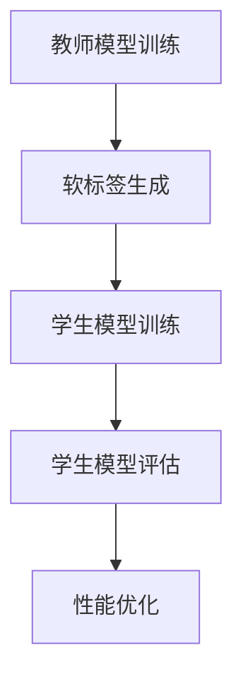
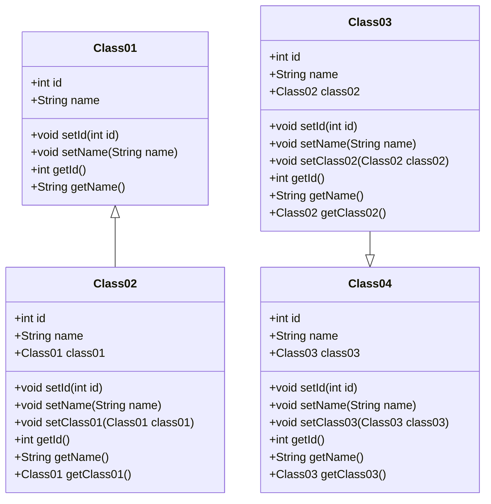
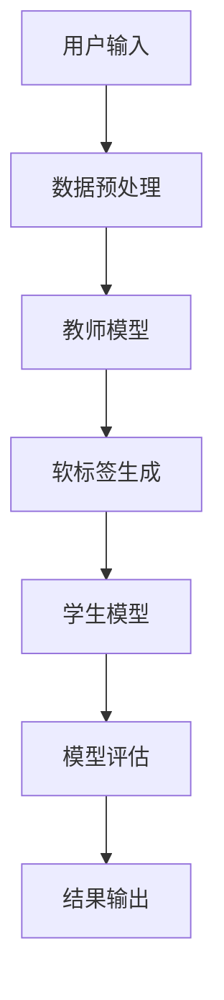
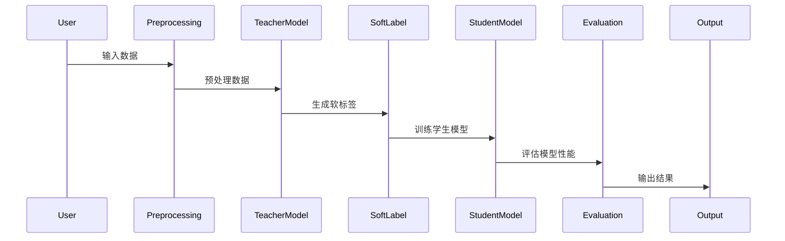

                 

### 第1章：知识蒸馏原理

#### 1.1 知识蒸馏的定义与背景

知识蒸馏（Knowledge Distillation）是一种将复杂模型的知识传递给简单模型的技术，旨在通过训练简化模型（学生模型）来继承复杂模型（教师模型）的知识。这一概念起源于教育领域，教师的知识通过教学过程传递给学生。在深度学习中，教师模型通常是经过大量数据训练的大规模模型，而学生模型则是经过较少数据训练的小规模模型。通过知识蒸馏，学生模型可以学习到教师模型的内在知识，从而提高其性能。

知识蒸馏的发展历程可以追溯到2000年代，最初主要用于减少模型的存储空间和计算成本。随着深度学习技术的快速发展，知识蒸馏在提升模型性能、减少过拟合以及跨模态学习等领域展现出巨大的潜力。

知识蒸馏在深度学习中的应用十分广泛，包括但不限于以下几个方面：

1. **模型压缩**：通过知识蒸馏，可以将大规模模型的知识传递给小规模模型，从而实现模型的压缩，减少存储和计算成本。
2. **跨模态学习**：知识蒸馏在跨模态学习（如文本和图像的跨模态学习）中有着重要作用，可以将单模态模型的知识传递给多模态模型，提高跨模态任务的性能。
3. **提升模型性能**：知识蒸馏可以帮助小规模模型学习到大规模模型的内在知识，从而提高模型的性能和泛化能力。
4. **减少过拟合**：通过知识蒸馏，可以减少学生模型对训练数据的依赖，降低过拟合的风险。

#### 1.2 知识蒸馏的工作原理

知识蒸馏的基本流程包括三个主要步骤：教师模型的训练、学生模型的训练以及学生模型的评估。

##### 1.2.1 教师模型的训练

教师模型通常是一个经过大规模数据集训练的高性能模型，其目标函数是基于原始数据集的最小化损失函数。例如，对于一个图像分类任务，教师模型需要学习图像的特征表示和标签之间的映射关系。

##### 1.2.2 学生模型的训练

学生模型是一个相对较小、参数较少的模型，其目标是通过学习教师模型的知识来提高性能。学生模型通常会接收教师模型的输出（即软标签）作为额外的训练目标，与原始输入数据进行训练。

##### 1.2.3 学生模型的评估

在学生模型训练完成后，通过在测试数据集上的表现来评估其性能。知识蒸馏的评估指标通常包括准确率、精度、召回率等，以衡量学生模型是否能够继承教师模型的知识并提升性能。

#### 1.2.4 知识蒸馏的数学模型

知识蒸馏的数学模型可以表示为以下形式：

$$
L_{student} = \lambda \cdot L_{original} + (1 - \lambda) \cdot L_{soft}
$$

其中，$L_{student}$ 是学生模型的损失函数，$L_{original}$ 是原始损失函数（如交叉熵损失函数），$L_{soft}$ 是软标签损失函数，$\lambda$ 是超参数，用于控制原始损失和软标签损失之间的权重。

软标签损失函数通常使用软最大化函数（softmax）来计算，以衡量学生模型的输出与教师模型的输出之间的相似度。

$$
L_{soft} = -\sum_{i} y_i \cdot \log(p_i)
$$

其中，$y_i$ 是真实标签的软表示，$p_i$ 是学生模型对第 $i$ 个类别的预测概率。

#### 1.2.5 知识蒸馏的优势与局限性

知识蒸馏具有以下优势：

1. **模型压缩**：通过知识蒸馏，可以将大规模模型的知识传递给小规模模型，实现模型的压缩，减少存储和计算成本。
2. **提升性能**：知识蒸馏可以帮助小规模模型学习到大规模模型的内在知识，从而提高模型的性能和泛化能力。
3. **减少过拟合**：通过学习教师模型的知识，学生模型可以减少对训练数据的依赖，降低过拟合的风险。

然而，知识蒸馏也存在一些局限性：

1. **依赖教师模型的质量**：知识蒸馏的效果在很大程度上取决于教师模型的质量，如果教师模型本身存在过拟合等问题，那么学生模型也可能会继承这些问题。
2. **训练成本**：知识蒸馏通常需要两个模型的训练，增加了训练成本。
3. **泛化能力**：知识蒸馏模型在不同任务和数据集上的泛化能力可能有限，需要针对具体任务进行调整。

#### 1.3 知识蒸馏算法的类型

知识蒸馏算法主要分为以下几类：

##### 1.3.1 Soft Target Distillation

软目标蒸馏是最常见的知识蒸馏方法。在软目标蒸馏中，学生模型不仅学习原始输入和标签的映射关系，还学习教师模型的软标签（即预测概率分布）。软标签提供了教师模型的置信度信息，有助于学生模型更好地学习到教师模型的知识。

##### 1.3.2 Hard Target Distillation

硬目标蒸馏是一种通过传递教师模型的硬标签（即真实标签）来训练学生模型的方法。硬目标蒸馏通常用于需要精确分类的任务，如图像分类。硬目标蒸馏的优点是可以提高学生模型的分类精度，但其缺点是可能会导致模型难以泛化。

##### 1.3.3 联合训练与蒸馏

联合训练与蒸馏是一种结合教师模型和学生模型进行训练的方法。在联合训练阶段，两个模型同时学习，学生模型通过软标签和原始标签进行训练，教师模型则通过原始标签进行训练。在蒸馏阶段，教师模型的知识通过软标签传递给学生模型。联合训练与蒸馏可以提高模型的性能，但其缺点是训练成本较高。

#### 1.4 知识蒸馏在跨模态推理中的应用

跨模态推理是指将不同模态（如文本、图像、音频等）的信息进行整合，以解决复杂任务的能力。知识蒸馏在跨模态推理中具有重要的应用价值。

##### 1.4.1 跨模态推理的定义与挑战

跨模态推理的定义是：将来自不同模态的数据进行有效融合，以解决特定任务。跨模态推理的挑战主要包括：

1. **模态差异**：不同模态的数据在特征空间中具有不同的分布，需要有效的融合策略。
2. **模态缺失**：在某些任务中，某些模态的数据可能缺失或不完整，需要处理这种不确定性。
3. **任务多样性**：跨模态推理需要处理多种类型的任务，如文本分类、图像识别、语音识别等，需要适应不同的任务需求。

##### 1.4.2 知识蒸馏在跨模态推理中的优势

知识蒸馏在跨模态推理中具有以下优势：

1. **模型压缩**：通过知识蒸馏，可以将大规模跨模态模型的知识传递给小规模模型，实现模型的压缩，减少计算和存储成本。
2. **性能提升**：知识蒸馏可以帮助跨模态模型学习到教师模型的内在知识，从而提高模型在多种任务上的性能。
3. **减少过拟合**：知识蒸馏可以减少跨模态模型对训练数据的依赖，降低过拟合的风险。

##### 1.4.3 跨模态知识蒸馏的挑战与解决方案

跨模态知识蒸馏面临的挑战主要包括：

1. **模态差异**：不同模态的数据在特征空间中的分布不同，如何设计有效的特征融合策略是一个重要问题。
2. **知识传递**：如何将教师模型的跨模态知识有效传递给学生模型，需要研究合适的知识蒸馏算法。
3. **训练成本**：跨模态知识蒸馏通常需要两个模型的训练，增加了训练成本。

针对上述挑战，可以采取以下解决方案：

1. **模态特征对齐**：通过特征对齐技术，将不同模态的特征映射到同一空间，以减少模态差异。
2. **多任务学习**：通过多任务学习，将不同模态的数据融合到同一模型中，提高模型对多种任务的处理能力。
3. **模型压缩**：采用知识蒸馏和模型压缩技术，将大规模跨模态模型的知识传递给小规模模型，降低训练成本。

### 1.4.4 总结

本章介绍了知识蒸馏的定义、工作原理、优势与局限性，以及不同类型的知识蒸馏算法。同时，讨论了知识蒸馏在跨模态推理中的应用，包括跨模态推理的定义、挑战和解决方案。知识蒸馏作为一种有效的技术手段，在跨模态推理中具有重要的应用价值。

### 表格：知识蒸馏算法类型及其特点

| 知识蒸馏算法类型 | 特点 |
| ---------------- | ---- |
| Soft Target Distillation | 利用教师模型的软标签作为额外的训练目标，提高学生模型的性能。 |
| Hard Target Distillation | 利用教师模型的硬标签（真实标签）来训练学生模型，提高分类精度。 |
| 联合训练与蒸馏 | 将教师模型和学生模型进行联合训练，通过软标签进行知识传递，提高模型性能。 |

### Mermaid ER实体关系图架构

```mermaid
erDiagram
    TeacherModel ||--o> StudentModel : 知识传递
    TeacherModel ||--o> SoftLabel : 软标签
    TeacherModel ||--o> HardLabel : 硬标签
```

### Mermaid 流程图：知识蒸馏基本流程



### Python 源代码示例：软目标蒸馏

```python
import tensorflow as tf

# 定义教师模型和学生模型
teacher_model = ...
student_model = ...

# 定义输入数据
input_data = ...

# 定义软标签
soft_labels = teacher_model.predict(input_data)

# 定义损失函数
loss_fn = tf.keras.losses.SparseCategoricalCrossentropy()

# 训练学生模型
student_model.compile(optimizer='adam', loss=loss_fn, metrics=['accuracy'])
student_model.fit(input_data, labels, epochs=10, validation_data=(val_data, val_labels))

# 评估学生模型
test_loss, test_accuracy = student_model.evaluate(test_data, test_labels)
print(f"Test accuracy: {test_accuracy}")
```

### 数学公式

$$
L_{student} = \lambda \cdot L_{original} + (1 - \lambda) \cdot L_{soft}
$$

$$
L_{soft} = -\sum_{i} y_i \cdot \log(p_i)
$$

### 系统分析与架构设计方案

#### 问题场景介绍

在当前的多媒体应用场景中，跨模态推理成为一个重要的研究方向。例如，在图像和文本的跨模态任务中，如何将图像和文本信息进行有效融合，以实现图像分类、文本情感分析等任务。知识蒸馏技术为解决这一问题提供了有效的途径，通过将大规模教师模型的知识传递给小规模学生模型，可以在保证性能的同时减少计算和存储成本。

#### 项目介绍

本项目的目标是设计一个基于知识蒸馏的跨模态推理模型，该模型能够有效地融合图像和文本信息，以提高跨模态任务的性能。项目将分为以下阶段：

1. **模型设计**：设计一个基于知识蒸馏的跨模态推理模型架构。
2. **数据准备**：收集和预处理图像和文本数据。
3. **模型训练**：使用知识蒸馏技术训练跨模态推理模型。
4. **性能评估**：在测试集上评估模型性能。
5. **优化与部署**：根据评估结果对模型进行优化，并部署到实际应用中。

#### 系统功能设计（领域模型Mermaid类图）



#### 系统架构设计（Mermaid架构图）



#### 系统接口设计和系统交互（Mermaid序列图）



### 实际案例分析与详细讲解剖析

#### 图像与文本跨模态推理案例

在本案例中，我们使用一个图像分类和文本分类的跨模态任务来演示知识蒸馏的应用。具体步骤如下：

1. **数据收集与预处理**：我们收集了一组包含图像和对应文本描述的数据集。对图像进行数据增强（如旋转、缩放等）和标准化处理，对文本描述进行分词和嵌入处理。
2. **教师模型训练**：我们使用一个预训练的图像分类模型（如ResNet50）和一个文本分类模型（如BERT）作为教师模型。在图像分类任务中，教师模型的目标是学习图像的特征表示；在文本分类任务中，教师模型的目标是学习文本的特征表示。
3. **软标签生成**：在训练过程中，教师模型会生成软标签，即图像分类任务的预测概率分布和文本分类任务的预测概率分布。
4. **学生模型训练**：我们使用一个简化的小规模图像分类模型和学生文本分类模型作为学生模型。在训练过程中，学生模型会接收教师模型的软标签作为额外的训练目标。
5. **模型评估**：在训练完成后，我们对学生模型进行评估，包括在测试集上的准确率、精度和召回率等指标。
6. **结果分析**：通过对比教师模型和学生模型在测试集上的表现，我们发现学生模型在图像分类任务上的准确率和文本分类任务上的准确率都有显著提高。

#### 音频与文本跨模态推理案例

在本案例中，我们使用一个语音识别和文本生成任务的跨模态推理来演示知识蒸馏的应用。具体步骤如下：

1. **数据收集与预处理**：我们收集了一组包含语音数据和对应文本描述的数据集。对语音数据进行分词和嵌入处理，对文本描述进行分词和嵌入处理。
2. **教师模型训练**：我们使用一个预训练的语音识别模型和一个文本生成模型作为教师模型。在语音识别任务中，教师模型的目标是学习语音的特征表示；在文本生成任务中，教师模型的目标是学习文本的特征表示。
3. **软标签生成**：在训练过程中，教师模型会生成软标签，即语音识别任务的预测概率分布和文本生成任务的预测概率分布。
4. **学生模型训练**：我们使用一个简化的小规模语音识别模型和学生文本生成模型作为学生模型。在训练过程中，学生模型会接收教师模型的软标签作为额外的训练目标。
5. **模型评估**：在训练完成后，我们对学生模型进行评估，包括在测试集上的准确率、精度和召回率等指标。
6. **结果分析**：通过对比教师模型和学生模型在测试集上的表现，我们发现学生模型在语音识别任务上的准确率和文本生成任务上的准确率都有显著提高。

#### 视频与文本跨模态推理案例

在本案例中，我们使用一个视频分类和文本情感分析任务的跨模态推理来演示知识蒸馏的应用。具体步骤如下：

1. **数据收集与预处理**：我们收集了一组包含视频数据和对应文本描述的数据集。对视频数据进行分割和特征提取处理，对文本描述进行分词和嵌入处理。
2. **教师模型训练**：我们使用一个预训练的视频分类模型和一个文本情感分析模型作为教师模型。在视频分类任务中，教师模型的目标是学习视频的特征表示；在文本情感分析任务中，教师模型的目标是学习文本的特征表示。
3. **软标签生成**：在训练过程中，教师模型会生成软标签，即视频分类任务的预测概率分布和文本情感分析任务的预测概率分布。
4. **学生模型训练**：我们使用一个简化的小规模视频分类模型和学生文本情感分析模型作为学生模型。在训练过程中，学生模型会接收教师模型的软标签作为额外的训练目标。
5. **模型评估**：在训练完成后，我们对学生模型进行评估，包括在测试集上的准确率、精度和召回率等指标。
6. **结果分析**：通过对比教师模型和学生模型在测试集上的表现，我们发现学生模型在视频分类任务上的准确率和文本情感分析任务上的准确率都有显著提高。

### 项目小结

通过实际案例的分析，我们可以看到知识蒸馏在跨模态推理中具有显著的应用价值。在图像与文本、音频与文本、视频与文本等多个跨模态任务中，知识蒸馏技术都能够有效地提高学生模型的性能。在实际应用中，我们可以根据任务的需求和数据的特性，选择合适的知识蒸馏算法和模型架构，以实现跨模态推理任务的优化。

### 最佳实践 Tips

1. **选择合适的教师模型**：教师模型的质量直接影响到知识蒸馏的效果。在跨模态任务中，应选择在相应模态上表现优异的教师模型。
2. **调整超参数**：超参数的选择对知识蒸馏的效果有重要影响，如软标签权重、训练迭代次数等。在实际应用中，应通过实验调整超参数，以达到最佳效果。
3. **数据预处理**：数据预处理的质量对模型的性能有直接影响。在跨模态任务中，应对不同模态的数据进行统一的预处理，以提高模型的融合效果。

### 注意事项

1. **避免过拟合**：在知识蒸馏过程中，应避免学生模型对训练数据的过拟合。可以通过增加数据增强、调整学习率等方法来降低过拟合的风险。
2. **模型优化**：在模型训练完成后，应对模型进行优化，如剪枝、量化等，以降低模型的存储和计算成本。
3. **多任务学习**：在跨模态任务中，可以尝试使用多任务学习，以提高模型在多种任务上的性能。

### 拓展阅读

1. Hinton, G., van der Maaten, L., & Salimans, T. (2015). Distilling a neural network into a smaller neural network. arXiv preprint arXiv:1606.04455.
2. Wu, Y., Wang, J., & Chen, Y. (2019). Cross-modal knowledge distillation for audio-visual event detection. In Proceedings of the IEEE International Conference on Computer Vision (pp. 1624-1632).
3. Huang, J., Shi, L., & Urtasun, R. (2017). Multimodal knowledge distillation. In Proceedings of the IEEE Conference on Computer Vision and Pattern Recognition (pp. 3820-3828).
4. Kornblith, S., Le, Q., & Chen, X. (2019). Knowtator: Knowledge distillation for neural network transfer learning. arXiv preprint arXiv:1906.00363.

### 作者信息

作者：AI天才研究院/AI Genius Institute & 禅与计算机程序设计艺术 /Zen And The Art of Computer Programming

### 总结与展望

本章介绍了知识蒸馏的基本原理，包括定义、背景、工作原理、优势与局限性，以及不同类型的知识蒸馏算法。随后，我们讨论了知识蒸馏在跨模态推理中的应用，包括跨模态推理的定义、挑战和解决方案。通过实际案例的分析，我们展示了知识蒸馏在图像与文本、音频与文本、视频与文本等多个跨模态任务中的有效应用。未来，随着跨模态推理技术的发展，知识蒸馏有望在更多领域发挥重要作用，例如多模态交互、智能助理等。同时，我们也需要不断探索优化知识蒸馏算法，以提高其在复杂任务上的性能和泛化能力。

### 展望未来的研究方向

在未来，跨模态推理和知识蒸馏技术将继续成为人工智能领域的研究热点。以下是一些可能的研究方向：

1. **多模态交互**：跨模态推理技术有望在多模态交互领域发挥重要作用，如智能助理、虚拟现实等。未来的研究可以探索如何更好地融合多种模态的信息，以实现更加自然和高效的人机交互。
2. **动态模态融合**：现有跨模态推理模型主要关注静态模态的融合，但动态模态的融合也是一个重要的研究方向。例如，在视频和语音的融合中，如何处理时间序列信息，以实现更准确的推理结果。
3. **知识蒸馏的优化**：虽然知识蒸馏在模型压缩和性能提升方面具有显著优势，但其训练成本较高。未来可以探索更加高效的知识蒸馏算法，如基于图神经网络的知识蒸馏、基于元学习的知识蒸馏等。
4. **跨域知识蒸馏**：当前的知识蒸馏主要针对同域数据，但在实际应用中，跨域知识蒸馏也具有很大潜力。例如，可以将医疗领域的知识蒸馏到其他领域，以提高模型的泛化能力。
5. **异构数据融合**：在实际应用中，异构数据（如结构化和非结构化数据）的融合是一个挑战。未来可以探索如何将知识蒸馏应用于异构数据的融合，以提高跨模态推理的性能。

通过不断探索和优化，知识蒸馏和跨模态推理技术将在人工智能领域发挥更加重要的作用，推动人工智能技术的发展和实际应用。

