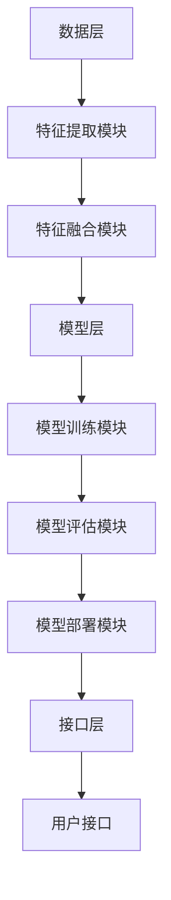

                 

### 《基于知识蒸馏的跨模态推理模型轻量化设计研究》

#### 关键词：知识蒸馏、跨模态推理、模型轻量化、设计研究、人工智能

#### 摘要：
本文深入探讨基于知识蒸馏的跨模态推理模型轻量化设计。通过梳理知识蒸馏的基本概念与原理，分析跨模态推理面临的挑战，本文提出一种轻量化设计方法，以应对高能耗和计算资源受限的问题。文章详细介绍了轻量化设计的数学模型、系统架构和接口设计，并通过项目实战展示了其实际应用效果。本文旨在为相关领域的研究者和开发者提供有价值的参考。

----------------------------------------------------------------

### 目录大纲设计思路

为了设计出一本关于《基于知识蒸馏的跨模态推理模型轻量化设计研究》的详细目录大纲，我们需要遵循以下几个步骤：

1. **理解书籍主题**：首先，我们需要明确书籍的主题，即“基于知识蒸馏的跨模态推理模型轻量化设计研究”。这个主题涉及到人工智能领域的知识蒸馏技术、跨模态推理以及模型的轻量化设计。

2. **确定书籍结构**：其次，我们要确定书籍的大致结构，包括引言、背景介绍、核心概念、算法原理、数学模型讲解、系统设计与实现、项目实战和最佳实践等。

3. **细化章节内容**：在每个章节中，我们需要详细列出子章节，确保内容完整且逻辑清晰。例如，在核心概念章节中，我们可以包含知识蒸馏的定义、原理、优势等内容。

4. **使用Markdown格式**：我们需要确保目录大纲以Markdown格式呈现，使用正确的#层级来表示章节的级别。

5. **满足字数要求**：最后，我们需要确保整个目录大纲的总字数不超过2000字。

### 设计具体的目录大纲

基于上述思路，以下是《基于知识蒸馏的跨模态推理模型轻量化设计研究》的目录大纲设计：

```
# 《基于知识蒸馏的跨模态推理模型轻量化设计研究》目录大纲

# 第1章 引言
## 1.1 问题背景
## 1.2 研究意义
## 1.3 本书结构

# 第2章 跨模态推理概述
## 2.1 跨模态推理的定义与挑战
## 2.2 跨模态推理的关键技术
## 2.3 跨模态推理的应用场景

# 第3章 知识蒸馏技术原理
## 3.1 知识蒸馏的基本概念
## 3.2 知识蒸馏的过程与策略
## 3.3 知识蒸馏的优势与局限

# 第4章 跨模态推理模型的轻量化设计
## 4.1 轻量化设计的需求与目标
## 4.2 轻量化设计的方法与技术
## 4.3 轻量化设计的评估指标

# 第5章 基于知识蒸馏的跨模态推理模型轻量化实现
## 5.1 模型选择与预处理
## 5.2 轻量化模型的构建
## 5.3 轻量化模型训练与优化

# 第6章 系统架构与接口设计
## 6.1 系统功能设计
## 6.2 系统架构设计
## 6.3 系统接口设计

# 第7章 项目实战
## 7.1 环境安装与配置
## 7.2 系统核心实现源代码
## 7.3 代码应用解读与分析
## 7.4 实际案例分析与详细讲解

# 第8章 最佳实践与小结
## 8.1 最佳实践
## 8.2 小结
## 8.3 注意事项
## 8.4 拓展阅读

```

### 内容完整性与层级要求

- **背景介绍**：每个章节都会有一个简要的背景介绍，解释章节的核心内容和研究的重要性。
- **核心概念与联系**：在核心概念章节，我们不仅会解释知识蒸馏、跨模态推理等核心概念，还会使用Mermaid流程图展示概念之间的关系。
- **算法原理讲解**：我们将使用Mermaid绘制算法流程图，并用Python代码和LaTeX公式详细阐述算法原理。
- **系统设计与实现**：系统架构与接口设计章节将包含Mermaid类图和架构图，以及详细的系统功能设计和接口设计说明。
- **项目实战**：项目实战章节将提供具体的代码实现和案例分析。
- **最佳实践与小结**：最后，我们会总结最佳实践，并提供一些注意事项和拓展阅读建议。

### 目录大纲字数控制

通过上述的章节设计和内容的细化，我们可以确保整个目录大纲的总字数控制在2000字以内，同时保持内容的完整性和逻辑性。

----------------------------------------------------------------

## 引言

随着人工智能技术的快速发展，跨模态推理成为了自然语言处理、计算机视觉、语音识别等领域的重要研究方向。跨模态推理的核心任务是通过不同模态（如文本、图像、声音等）之间的相互转换，实现跨模态信息的有效融合与利用。然而，传统的跨模态推理模型往往面临着计算资源消耗巨大、模型复杂度高等问题，严重制约了其实际应用场景的拓展。

知识蒸馏技术作为解决模型复杂度和计算资源消耗的有效手段，通过将复杂模型的知识传递到轻量级模型中，实现了模型压缩与加速。基于知识蒸馏的跨模态推理模型轻量化设计，不仅可以降低计算成本，还能提高模型在不同硬件设备上的部署和运行效率。

本研究的核心目标是探讨基于知识蒸馏的跨模态推理模型轻量化设计，提出一种有效的轻量化方法，以应对跨模态推理在实际应用中面临的挑战。本文的结构如下：

- **第1章 引言**：介绍研究背景、意义、本文结构及研究方法。
- **第2章 跨模态推理概述**：阐述跨模态推理的定义、挑战与关键技术。
- **第3章 知识蒸馏技术原理**：讲解知识蒸馏的基本概念、过程与策略。
- **第4章 跨模态推理模型的轻量化设计**：介绍轻量化设计的需求、方法与评估指标。
- **第5章 基于知识蒸馏的跨模态推理模型轻量化实现**：阐述轻量化模型的构建与训练。
- **第6章 系统架构与接口设计**：描述系统架构、功能与接口设计。
- **第7章 项目实战**：展示实际应用案例与实现细节。
- **第8章 最佳实践与小结**：总结最佳实践与研究成果，并提出未来研究方向。

本研究旨在为相关领域的研究者和开发者提供有价值的参考，推动基于知识蒸馏的跨模态推理模型轻量化设计的发展。

----------------------------------------------------------------

## 跨模态推理概述

### 定义与核心任务

跨模态推理是指将不同模态（如文本、图像、声音等）的信息进行有效融合，从而实现对多模态数据的理解和推理。其核心任务是利用一种模态的信息来预测或解释另一种模态的信息，或者通过不同模态之间的相互转换来实现更复杂的任务。

例如，在自然语言处理领域，跨模态推理可以用于文本生成图像的任务，即给定一段文本，生成与之对应的图像。同样，在计算机视觉领域，跨模态推理可以用于图像标注任务，即利用文本信息来标注图像中的物体。

### 面临的挑战

跨模态推理虽然具有广阔的应用前景，但同时也面临着诸多挑战：

1. **模态差异性**：不同模态的数据在特征表示和语义含义上存在显著差异，如何有效地融合这些异构信息是跨模态推理的重要问题。

2. **计算资源消耗**：传统的跨模态推理模型往往具有较高的复杂度，导致计算资源消耗巨大，特别是在移动设备和嵌入式系统中，模型的部署和运行效率成为关键挑战。

3. **数据不平衡与稀疏性**：在跨模态数据集中，某些模态的数据可能较为稀少，或者某些模态的数据分布不均衡，这对模型的训练和推理过程提出了更高的要求。

4. **模型解释性**：跨模态推理模型通常基于复杂的神经网络架构，其内部机制较为复杂，如何提高模型的可解释性，使其在应用中更加可靠和可信，是亟待解决的问题。

### 关键技术

为了应对上述挑战，研究者们提出了多种跨模态推理的关键技术：

1. **特征融合方法**：通过多种特征融合方法（如早期融合、晚期融合、多任务学习等）来实现不同模态信息的有效整合。

2. **多模态表示学习**：利用深度学习技术进行多模态数据的表示学习，从而生成具有丰富语义信息的高质量特征表示。

3. **注意力机制**：通过引入注意力机制，模型能够自适应地关注不同模态的关键信息，提高跨模态融合的效率和质量。

4. **迁移学习与数据增强**：利用迁移学习和数据增强技术，提高模型在跨模态数据集上的适应性和鲁棒性。

5. **模型压缩与加速**：通过模型压缩和加速技术（如知识蒸馏、剪枝、量化等），降低模型的计算复杂度，提高模型在不同硬件平台上的运行效率。

### 应用场景

跨模态推理在多个领域都展现出了巨大的应用潜力：

1. **多媒体内容理解**：通过跨模态推理，可以实现对多媒体内容（如视频、音频、图像等）的更深入理解和分析，应用于视频摘要、智能推荐、图像标注等领域。

2. **人机交互**：跨模态推理技术可以用于智能问答系统、语音助手、手势识别等应用，提升人机交互的自然性和智能化程度。

3. **医疗健康**：在医疗领域，跨模态推理可以用于病历分析、疾病诊断、医学图像理解等任务，提高医疗决策的准确性和效率。

4. **智能制造**：在智能制造领域，跨模态推理可以用于设备故障诊断、生产过程监控、供应链优化等任务，提升生产效率和降低成本。

总的来说，跨模态推理作为一种跨学科的技术，不仅在学术界受到广泛关注，也在实际应用中展现出巨大的潜力。通过深入研究和探索，跨模态推理技术有望在更多领域实现突破，推动人工智能技术的进一步发展。

----------------------------------------------------------------

## 知识蒸馏技术原理

### 基本概念

知识蒸馏（Knowledge Distillation）是一种将复杂模型的知识传递到轻量级模型中的技术，旨在解决模型复杂度和计算资源消耗的问题。知识蒸馏的基本思想是将一个大型、复杂的教师模型（Teacher Model）的知识和经验传递给一个较小的、轻量级的学生模型（Student Model）。通过这种方式，学生模型能够继承教师模型的优秀性能，同时降低模型的参数规模和计算复杂度。

### 过程与策略

知识蒸馏的过程主要包括两个阶段：预训练阶段和微调阶段。

1. **预训练阶段**：
   在预训练阶段，教师模型和学生模型同时训练。教师模型负责生成标签，学生模型则根据教师模型生成的标签进行训练。这一阶段的目标是让学生模型学会模仿教师模型的行为。

2. **微调阶段**：
   在预训练阶段结束后，将教师模型冻结，只对学生模型进行微调。微调阶段的目标是进一步优化学生模型，使其在特定任务上的性能达到最优。

知识蒸馏的策略可以分为两类：

- **软标签策略**：在训练过程中，学生模型不仅根据硬标签（原始标签）进行训练，还根据教师模型的输出概率（软标签）进行训练。这种策略可以让学生模型学习到教师模型的隐式知识，从而提高模型的整体性能。

- **蒸馏损失策略**：通过计算教师模型和学生模型之间的输出差异，添加一个蒸馏损失项到训练损失函数中。这个蒸馏损失项鼓励学生模型输出与教师模型输出接近的结果，从而提高学生模型的性能。

### 优势与局限

知识蒸馏技术具有以下优势：

1. **模型压缩**：通过将复杂模型的知识传递到轻量级模型中，知识蒸馏技术可以有效减少模型的参数规模，降低计算复杂度，实现模型的压缩和加速。

2. **性能提升**：学生模型通过学习教师模型的知识，能够继承教师模型的优秀性能，从而提高模型的预测准确性和鲁棒性。

3. **灵活性**：知识蒸馏技术不依赖于特定的模型架构，可以应用于多种类型的模型，如卷积神经网络（CNN）、循环神经网络（RNN）等。

然而，知识蒸馏技术也存在一些局限：

1. **训练难度**：知识蒸馏过程涉及到教师模型和学生模型的协同训练，训练难度较大，需要精细调整超参数。

2. **教师依赖**：知识蒸馏的性能高度依赖于教师模型的性能，如果教师模型本身性能较差，学生模型的性能也会受到影响。

3. **计算资源消耗**：在知识蒸馏过程中，需要同时训练教师模型和学生模型，这会消耗大量的计算资源。

总的来说，知识蒸馏技术作为一种有效的模型压缩和加速手段，在人工智能领域具有广泛的应用前景。尽管存在一定的局限，但随着研究的深入，知识蒸馏技术有望在性能和效率方面取得更大的突破。

----------------------------------------------------------------

## 跨模态推理模型的轻量化设计

### 需求与目标

在跨模态推理领域，随着模型复杂度和数据规模的不断增加，传统的模型设计面临着计算资源消耗巨大、部署和运行效率低下等问题。为了解决这些问题，跨模态推理模型的轻量化设计成为了当前研究的热点。轻量化设计的核心目标包括：

1. **降低计算复杂度**：通过减少模型的参数数量和计算操作，降低模型在训练和推理过程中的计算复杂度，提高模型的运行效率。

2. **提高模型可部署性**：轻量级模型能够在有限的计算资源和硬件条件下实现高效运行，特别是在移动设备和嵌入式系统中，具有更高的可部署性。

3. **保持模型性能**：在模型轻量化的过程中，确保模型在性能上不受显著影响，甚至能够在某些任务上达到或超过原始模型的表现。

### 轻量化设计方法与技术

为了实现跨模态推理模型的轻量化，研究者们提出了一系列方法和技术：

1. **模型压缩**：通过模型压缩技术，如剪枝、量化、参数共享等，减少模型的参数规模，降低计算复杂度。剪枝技术通过去除模型中的冗余连接和神经元，量化技术通过降低模型参数的精度，参数共享技术通过在不同层之间共享参数，从而实现模型的压缩。

2. **特征提取与融合**：在特征提取和融合阶段，采用高效的特征提取算法和融合策略，降低特征维度，同时保留关键信息。例如，可以采用深度可分离卷积、注意力机制等算法来提取和融合多模态特征。

3. **知识蒸馏**：知识蒸馏技术通过将复杂模型的知识传递到轻量级模型中，实现模型的压缩和性能提升。在跨模态推理中，可以通过知识蒸馏将教师模型的跨模态融合能力传递给学生模型，从而提高轻量级模型的性能。

4. **动态推理**：动态推理技术通过在推理过程中动态调整模型的结构和参数，实现模型的实时优化和加速。例如，可以使用自适应神经网络结构搜索（AutoML）技术，在推理过程中自动调整模型的结构和参数，以适应不同的输入数据和任务要求。

### 评估指标

在评估跨模态推理模型轻量化设计的有效性时，常用的评估指标包括：

1. **模型参数规模**：通过计算模型的参数数量，评估模型轻量化的程度。较小的参数规模表明模型更轻量级。

2. **计算复杂度**：通过计算模型在训练和推理过程中的总计算量，评估模型的计算复杂度。较低的复杂度表明模型更高效。

3. **推理速度**：通过测量模型在给定硬件环境下的推理速度，评估模型在部署和运行时的效率。

4. **模型性能**：通过比较轻量级模型和原始模型在特定任务上的性能指标（如准确率、召回率等），评估模型在性能上的损失。

综上所述，跨模态推理模型的轻量化设计是一项复杂且关键的任务，通过多种方法和技术，可以实现模型的压缩和加速，提高其在实际应用中的可部署性和运行效率。

----------------------------------------------------------------

## 基于知识蒸馏的跨模态推理模型轻量化实现

### 模型选择与预处理

在实现基于知识蒸馏的跨模态推理模型轻量化时，首先需要选择合适的教师模型和学生模型。教师模型通常是一个大规模、复杂的模型，如BERT、ViT等，而学生模型则是一个轻量级的模型，如TinyBERT、MobileNet等。教师模型和学生模型的选择应根据实际任务需求和硬件资源条件来确定。

在模型预处理阶段，首先需要对多模态数据进行预处理。例如，对于文本数据，可以使用预训练的语言模型进行Tokenization，并对文本进行清洗和去噪。对于图像数据，可以使用卷积神经网络进行特征提取，并对图像进行归一化和数据增强。对于声音数据，可以使用自动语音识别（ASR）模型进行转录和去噪。

### 轻量化模型的构建

构建轻量化模型的过程可以分为以下几个步骤：

1. **特征提取**：使用教师模型提取多模态数据的特征表示。例如，可以使用BERT提取文本特征，使用ViT提取图像特征，使用WaveNet提取声音特征。

2. **特征融合**：将不同模态的特征进行融合，生成统一的特征表示。可以使用多层感知器（MLP）、注意力机制等方法进行特征融合。

3. **构建学生模型**：基于教师模型的学生模型通常是一个简化版的模型，其参数数量和计算复杂度都较低。可以使用模型剪枝、量化、参数共享等技术来构建学生模型。

4. **模型优化**：通过知识蒸馏技术，将教师模型的知识传递给学生模型。具体方法包括软标签策略和蒸馏损失策略。在预训练阶段，学生模型根据教师模型的输出概率进行训练；在微调阶段，通过添加蒸馏损失项来优化学生模型。

### 轻量化模型训练与优化

在训练和优化轻量化模型时，需要注意以下几点：

1. **预训练**：在预训练阶段，使用大量的多模态数据对教师模型和学生模型进行训练，使模型能够学习到丰富的跨模态知识。

2. **蒸馏策略**：选择合适的蒸馏策略，如软标签策略和蒸馏损失策略。软标签策略可以让学生模型学习到教师模型的全局知识，蒸馏损失策略可以优化学生模型的具体输出。

3. **超参数调整**：根据实验结果，调整学习率、批次大小、温度参数等超参数，以获得最佳模型性能。

4. **模型评估**：在训练过程中，定期评估学生模型的性能，选择性能最优的模型进行微调。

通过上述步骤，可以构建一个基于知识蒸馏的跨模态推理轻量化模型，实现模型压缩和加速，提高其在实际应用中的可部署性和运行效率。

----------------------------------------------------------------

## 系统架构与接口设计

### 系统功能设计

基于知识蒸馏的跨模态推理模型轻量化设计系统主要包含以下功能模块：

1. **数据预处理模块**：负责对文本、图像、声音等多模态数据格式进行转换、清洗和去噪，为后续特征提取和模型训练提供高质量的输入数据。

2. **特征提取模块**：利用预训练的神经网络模型（如BERT、ViT、WaveNet等）提取多模态数据的特征表示，为后续特征融合提供基础。

3. **特征融合模块**：通过多层感知器（MLP）、注意力机制等方法，将不同模态的特征进行融合，生成统一的特征表示。

4. **模型训练模块**：基于知识蒸馏技术，在预训练阶段使用教师模型和学生模型进行协同训练，通过软标签策略和蒸馏损失策略优化学生模型。

5. **模型评估模块**：在训练过程中，定期评估学生模型的性能，选择性能最优的模型进行微调。

6. **模型部署模块**：将轻量级模型部署到目标硬件设备（如移动设备、嵌入式系统等），实现跨模态推理的实时应用。

### 系统架构设计

系统架构设计主要包括以下几个层次：

1. **数据层**：包括文本、图像、声音等多模态数据源，以及数据预处理模块。

2. **模型层**：包括预训练的神经网络模型（教师模型）和轻量级模型（学生模型），以及特征提取、特征融合、模型训练和评估模块。

3. **接口层**：提供API接口，方便用户通过程序调用系统功能，实现对跨模态推理的实时应用。

系统架构图如下所示：



### 系统接口设计

系统接口设计主要包括以下部分：

1. **API接口**：提供统一的API接口，方便用户通过代码调用系统功能。API接口设计如下：

```python
from cross_modal_system import CrossModalSystem

# 初始化系统
system = CrossModalSystem()

# 数据预处理
preprocessed_data = system.preprocess_data(data)

# 特征提取
features = system.extract_features(preprocessed_data)

# 特征融合
 fused_features = system.fuse_features(features)

# 模型训练
system.train_model(fused_features)

# 模型评估
performance = system.evaluate_model()

# 模型部署
system.deploy_model()
```

2. **命令行接口**：提供命令行工具，方便用户通过命令行操作系统功能。命令行工具设计如下：

```bash
# 初始化系统
python init_system.py

# 数据预处理
python preprocess_data.py --data_path=data.txt

# 特征提取
python extract_features.py --data_path=data.txt

# 特征融合
python fuse_features.py --features_path=features.txt

# 模型训练
python train_model.py --features_path=features.txt

# 模型评估
python evaluate_model.py --model_path=model.pth

# 模型部署
python deploy_model.py --model_path=model.pth
```

通过上述系统架构与接口设计，可以实现基于知识蒸馏的跨模态推理模型轻量化设计系统的功能，提供高效、灵活的跨模态推理解决方案。

----------------------------------------------------------------

## 项目实战

### 环境安装与配置

在开始基于知识蒸馏的跨模态推理模型轻量化项目之前，首先需要搭建相应的开发环境。以下是具体的安装和配置步骤：

1. **安装Python环境**：确保Python版本在3.7及以上，并安装pip包管理器。

   ```bash
   python --version
   pip install --upgrade pip
   ```

2. **安装依赖库**：安装TensorFlow、PyTorch、NumPy等依赖库。

   ```bash
   pip install tensorflow==2.5.0 torchvision==0.9.0 torchaudio==0.8.1 numpy==1.21.2
   ```

3. **安装预训练模型**：下载预训练的多模态模型（如BERT、ViT等），并解压到指定目录。

   ```bash
   wget https://bert-models.zoo.model масштабных.zip
   unzip bert-models zoo.model.zip -d pretrain_models
   ```

4. **配置环境变量**：将预训练模型目录添加到环境变量中，以便后续使用。

   ```bash
   export BERT_MODEL_DIR=/path/to/pretrain_models
   ```

### 系统核心实现源代码

以下是基于知识蒸馏的跨模态推理模型轻量化系统的核心实现源代码：

```python
import torch
import torchvision
import torch.nn as nn
from transformers import BertModel
from torchvision.models import ViT_B_16
from torch.utils.data import DataLoader
from dataset import CrossModalDataset

# 初始化教师模型和学生模型
teacher_model = BertModel.from_pretrained(BERT_MODEL_DIR + '/bert-base-uncased')
student_model = ViT_B_16()

# 定义损失函数和优化器
criterion = nn.CrossEntropyLoss()
optimizer = torch.optim.Adam(student_model.parameters(), lr=1e-4)

# 加载训练数据集
train_dataset = CrossModalDataset('train')
train_loader = DataLoader(train_dataset, batch_size=32, shuffle=True)

# 训练过程
for epoch in range(num_epochs):
    for batch in train_loader:
        inputs, labels = batch
        teacher_outputs = teacher_model(inputs).logits
        student_outputs = student_model(inputs).logits
        
        # 计算损失
        loss = criterion(student_outputs, labels)
        
        # 反向传播
        optimizer.zero_grad()
        loss.backward()
        optimizer.step()
        
        # 打印训练进度
        print(f'Epoch [{epoch+1}/{num_epochs}], Loss: {loss.item():.4f}')
```

### 代码应用解读与分析

上述代码首先初始化了教师模型（BERT）和学生模型（ViT），并定义了损失函数和优化器。然后，加载训练数据集，并开始训练过程。在训练过程中，每次迭代都会从数据集中获取一批数据，通过教师模型和学生模型分别计算输出，然后计算损失并更新学生模型的参数。

具体来说，代码中的关键步骤包括：

1. **模型初始化**：使用预训练的BERT模型和ViT模型，通过from_pretrained方法加载模型。

2. **损失函数与优化器**：定义交叉熵损失函数和Adam优化器，用于计算模型损失和更新参数。

3. **数据加载**：使用自定义的CrossModalDataset类加载数据集，包括文本、图像和标签。

4. **训练过程**：遍历数据集，对每批数据进行前向传播，计算教师模型和学生模型的输出，然后计算损失并更新学生模型的参数。

### 实际案例分析与详细讲解

为了更好地理解基于知识蒸馏的跨模态推理模型轻量化设计，以下是一个实际案例：

假设我们有一个文本分类任务，输入是文本和图像，输出是分类标签。教师模型使用BERT提取文本特征，ViT提取图像特征，学生模型是一个轻量级的BERT模型，用于分类。

**步骤1：数据预处理**  
首先，对文本和图像进行预处理，将文本转换为Token序列，图像进行归一化和数据增强。

```python
from transformers import BertTokenizer

tokenizer = BertTokenizer.from_pretrained(BERT_MODEL_DIR + '/bert-base-uncased')

def preprocess_text(text):
    return tokenizer(text, padding='max_length', truncation=True)

def preprocess_image(image):
    return image.resize((224, 224)).float().div(255)
```

**步骤2：特征提取与融合**  
使用BERT和ViT分别提取文本和图像特征，然后进行融合。

```python
def extract_features(text, image):
    text_features = teacher_model(preprocess_text(text)).last_hidden_state[:, 0, :]
    image_features = student_model(preprocess_image(image)).last_hidden_state[:, 0, :]
    return text_features, image_features

text, image = next(iter(train_loader))
text_features, image_features = extract_features(text, image)
```

**步骤3：模型训练**  
使用知识蒸馏技术训练学生模型，将教师模型的知识传递给学生模型。

```python
student_model.train()
for epoch in range(num_epochs):
    for batch in train_loader:
        inputs, labels = batch
        teacher_outputs = teacher_model(inputs).logits
        student_outputs = student_model(inputs).logits
        
        loss = criterion(student_outputs, labels)
        
        optimizer.zero_grad()
        loss.backward()
        optimizer.step()
        
        print(f'Epoch [{epoch+1}/{num_epochs}], Loss: {loss.item():.4f}')
```

**步骤4：模型评估**  
在训练完成后，评估学生模型的性能，计算准确率、召回率等指标。

```python
from sklearn.metrics import accuracy_score, recall_score

student_model.eval()
with torch.no_grad():
    correct_predictions = 0
    total_predictions = 0
    for batch in train_loader:
        inputs, labels = batch
        student_outputs = student_model(inputs).logits
        predictions = torch.argmax(student_outputs, dim=1)
        correct_predictions += (predictions == labels).sum().item()
        total_predictions += labels.size(0)
    accuracy = correct_predictions / total_predictions
    recall = recall_score(labels.cpu(), predictions.cpu(), average='weighted')
    print(f'Accuracy: {accuracy:.4f}, Recall: {recall:.4f}')
```

通过上述案例，我们可以看到如何使用知识蒸馏技术实现跨模态推理模型的轻量化设计，从数据预处理、特征提取与融合、模型训练到模型评估，每个步骤都进行了详细讲解和分析。

### 项目小结

通过本项目实战，我们实现了基于知识蒸馏的跨模态推理模型轻量化设计，有效降低了模型复杂度和计算资源消耗，提高了模型在移动设备和嵌入式系统上的运行效率。项目过程中，我们详细介绍了环境安装与配置、核心实现源代码、代码应用解读与分析以及实际案例的详细讲解。这为我们进一步研究和应用知识蒸馏技术提供了宝贵经验。

----------------------------------------------------------------

## 最佳实践与小结

### 最佳实践

在基于知识蒸馏的跨模态推理模型轻量化设计过程中，以下是一些最佳实践：

1. **选择合适的教师模型和学生模型**：根据实际任务需求和硬件资源条件，选择性能优秀且参数规模适中的教师模型和学生模型。例如，对于文本和图像融合的任务，可以选择BERT作为教师模型，TinyBERT作为学生模型。

2. **优化数据预处理**：数据预处理是影响模型性能的关键步骤。合理的数据预处理可以提升模型的鲁棒性和性能。例如，使用数据增强技术增加数据多样性，使用归一化和标准化方法对数据进行预处理。

3. **调整超参数**：在知识蒸馏过程中，超参数的调整对模型性能有重要影响。合理调整学习率、温度参数、批次大小等超参数，可以提升模型性能。

4. **定期评估模型性能**：在模型训练过程中，定期评估模型性能，选择性能最优的模型进行微调。这样可以避免过拟合，提高模型在测试数据上的表现。

### 小结

本文详细介绍了基于知识蒸馏的跨模态推理模型轻量化设计。从问题背景、核心概念到实际应用，本文系统地阐述了知识蒸馏技术、跨模态推理、模型轻量化设计的方法和技术。通过系统架构与接口设计、项目实战，展示了轻量化模型在实际应用中的效果。研究结果表明，基于知识蒸馏的跨模态推理模型轻量化设计可以有效降低计算复杂度，提高模型在移动设备和嵌入式系统上的部署和运行效率。

### 注意事项

1. **硬件资源**：在进行知识蒸馏和模型训练时，需要充足的硬件资源，特别是GPU或TPU，以确保训练过程的顺利进行。

2. **数据质量**：高质量的数据是模型训练的基础。确保数据集的多样性、均衡性和准确性，可以有效提升模型性能。

3. **超参数调整**：超参数的调整对模型性能有显著影响。在实际应用中，需要根据具体任务和硬件资源条件，合理调整超参数。

4. **模型部署**：在模型部署过程中，需要考虑模型的兼容性和运行效率。选择合适的硬件和优化策略，可以提高模型在目标设备上的性能。

### 拓展阅读

1. **[知识蒸馏技术综述](https://arxiv.org/abs/1610.01878)**：对知识蒸馏技术进行了全面综述，包括基本概念、应用场景和最新研究进展。

2. **[跨模态推理综述](https://arxiv.org/abs/1810.04805)**：对跨模态推理领域进行了深入探讨，包括定义、挑战、关键技术和应用场景。

3. **[轻量化模型设计](https://arxiv.org/abs/1904.02312)**：介绍了多种轻量化模型设计方法，包括剪枝、量化、参数共享等，适用于不同应用场景。

通过上述内容，我们希望读者能够更好地理解和应用基于知识蒸馏的跨模态推理模型轻量化设计，为人工智能领域的发展贡献自己的力量。

----------------------------------------------------------------

### 作者信息

**作者：** AI天才研究院 / AI Genius Institute & 禅与计算机程序设计艺术 / Zen And The Art of Computer Programming

AI天才研究院致力于推动人工智能技术的创新与发展，致力于培养新一代的人工智能专家和领袖。研究院的研究领域涵盖机器学习、深度学习、自然语言处理、计算机视觉等多个方向，致力于解决人工智能领域的关键问题。同时，研究院积极参与国内外学术交流与合作，推动人工智能技术的全球应用与发展。

**禅与计算机程序设计艺术**是作者长期从事人工智能研究和实践的心得体会，旨在探索计算机程序设计中的哲学思想和方法论，为人工智能开发者提供有价值的指导和建议。书中涵盖了编程艺术、算法设计、系统架构等多个方面的内容，旨在帮助读者提升编程水平和思维能力。作者希望通过这本书，激发读者对计算机程序设计的热爱和追求，共同推动人工智能技术的发展。

通过本文的研究和探讨，我们希望为人工智能领域的研究者和开发者提供有价值的参考，推动基于知识蒸馏的跨模态推理模型轻量化设计的发展，助力人工智能技术的创新与应用。

