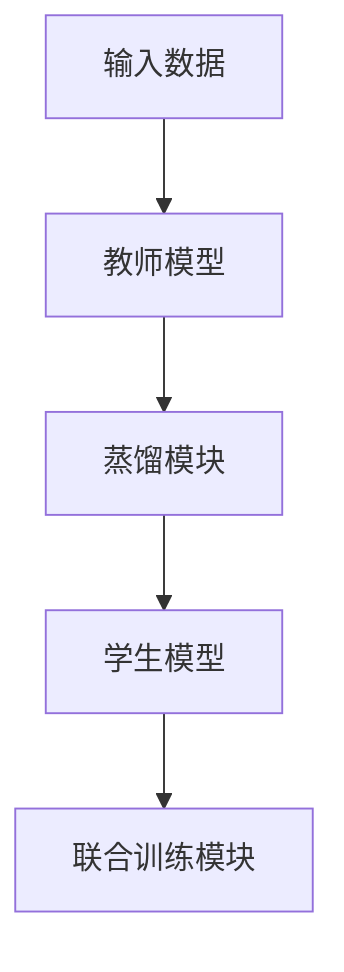

                 

**# 基于知识蒸馏的轻量级跨模态推理模型设计**

## 关键词
- **知识蒸馏**、**轻量级模型**、**跨模态推理**、**模型压缩**、**深度学习**

## 摘要
本文旨在探讨知识蒸馏技术如何应用于设计轻量级跨模态推理模型。我们将首先介绍知识蒸馏的背景及其在模型压缩中的应用。随后，我们将深入探讨跨模态推理的基本原理和挑战。通过逐步分析，我们将详细阐述如何通过知识蒸馏技术构建轻量级跨模态推理模型，以及这种模型在不同场景下的应用案例。文章还将提供一些实用的设计建议和未来研究方向，以帮助读者更好地理解和应用这一技术。

## 目录
1. **引言**
   - **1.1 知识蒸馏概述**
   - **1.2 轻量级模型概念**
   - **1.3 跨模态推理简介**
2. **知识蒸馏与模型压缩**
   - **2.1 知识蒸馏原理**
   - **2.2 模型压缩技术**
   - **2.3 知识蒸馏在模型压缩中的应用**
3. **跨模态推理的基本原理**
   - **3.1 跨模态推理的定义和类型**
   - **3.2 跨模态推理的挑战**
   - **3.3 跨模态推理的关键技术**
4. **轻量级跨模态推理模型设计**
   - **4.1 模型架构设计**
   - **4.2 实施策略和步骤**
   - **4.3 算法解释与数学模型**
5. **实践应用与案例分析**
   - **5.1 案例一：图像-文本检索**
   - **5.2 案例二：语音识别与情感分析**
   - **5.3 案例三：多模态医学诊断**
6. **设计建议与未来展望**
   - **6.1 设计最佳实践**
   - **6.2 注意事项**
   - **6.3 拓展阅读**

## 1. 引言
### 1.1 知识蒸馏概述
知识蒸馏（Knowledge Distillation）是一种在深度学习领域中被广泛应用的模型压缩技术。其核心思想是将一个复杂的、容量较大的模型（称为教师模型）的知识转移到一个小型、高效的模型（称为学生模型）中。这种技术不仅可以减少模型的参数数量和计算量，提高推理速度，还可以在一定程度上保持模型的性能。

知识蒸馏的基本流程包括以下几个步骤：

1. **教师模型的训练**：首先，通过大量的数据对教师模型进行训练，使其达到较高的准确率。
2. **学生模型的初始化**：使用教师模型的参数初始化学生模型。
3. **联合训练**：将教师模型和学生在相同的数据集上联合训练，使得学生模型能够模仿教师模型的决策过程。
4. **蒸馏损失函数**：在联合训练过程中，引入蒸馏损失函数来衡量教师模型和学生模型之间的差异。

### 1.2 轻量级模型概念
轻量级模型（Lightweight Model）是指那些在保持较高准确率的同时，具有较小参数规模、较少计算量和低能耗的模型。随着移动设备和物联网的普及，轻量级模型在应用场景中越来越重要。它们不仅可以节省计算资源，降低成本，还可以提高系统的实时性。

轻量级模型的特点包括：

- **参数规模小**：通过减少模型的层数或使用稀疏连接，降低模型的参数数量。
- **计算量低**：采用特定的网络结构或优化策略，减少模型的计算复杂度。
- **低能耗**：在保证性能的同时，尽量减少模型的能耗。

### 1.3 跨模态推理简介
跨模态推理（Cross-Modal Inference）是指利用来自不同模态的数据进行推理和决策的过程。在现实生活中，不同模态的数据（如图像、文本、语音等）常常需要共同处理，以实现更准确的预测和决策。

跨模态推理的关键技术包括：

- **模态表示学习**：通过神经网络等方法，将不同模态的数据映射到共同的语义空间中。
- **联合训练**：将来自不同模态的数据联合输入到同一个模型中，通过联合训练学习不同模态之间的关联性。
- **跨模态交互**：设计跨模态交互模块，使不同模态的数据能够在模型中互相影响，提高推理的准确性。

跨模态推理在许多领域都有广泛的应用，如图像-文本检索、语音识别与情感分析、多模态医学诊断等。

## 2. 知识蒸馏与模型压缩
### 2.1 知识蒸馏原理
知识蒸馏的原理可以类比于教育中的“学徒制”。在深度学习中，教师模型拥有丰富的知识和经验，而学生模型则是一个相对简单、紧凑的模型，希望能够通过学习教师模型来提高自己的性能。知识蒸馏的过程可以分为以下几个步骤：

1. **教师模型的训练**：首先，使用大量的数据对教师模型进行训练，使其在特定任务上达到较高的准确率。
2. **学生模型的初始化**：使用教师模型的参数初始化学生模型，使其具有相似的知识基础。
3. **生成软标签**：在训练过程中，教师模型不仅输出最终的预测结果，还会生成一系列的软标签。这些软标签包含了教师模型对输入数据的理解和知识。
4. **联合训练**：学生模型同时学习教师模型的输出结果和软标签，通过这种方式，学生模型能够逐渐模仿教师模型的决策过程。
5. **蒸馏损失函数**：引入蒸馏损失函数来衡量学生模型对教师模型知识的理解程度。蒸馏损失函数通常包括两部分：一个是常规的输出损失，用于衡量学生模型的预测结果与教师模型输出结果之间的差异；另一个是知识损失，用于衡量学生模型对教师模型软标签的理解程度。

### 2.2 模型压缩技术
模型压缩是当前深度学习领域的一个重要研究方向，旨在减少模型的参数规模和计算复杂度，同时尽量保持模型的性能。常见的模型压缩技术包括：

- **参数剪枝（Pruning）**：通过删除模型中不重要的参数，减少模型的规模。参数剪枝可以分为结构剪枝和权重剪枝两种方式。
- **量化（Quantization）**：将模型的参数和激活值从浮点数转换为低比特宽度的整数，从而减少模型的存储和计算需求。
- **知识蒸馏（Knowledge Distillation）**：通过将教师模型的丰富知识转移到学生模型中，实现模型的压缩。知识蒸馏不仅可以减少模型的参数规模，还可以在一定程度上提高模型的性能。
- **网络结构压缩（Network Structure Compression）**：通过设计更简洁的网络结构，减少模型的计算复杂度。常见的结构压缩方法包括瓶颈结构、稀疏连接等。

### 2.3 知识蒸馏在模型压缩中的应用
知识蒸馏在模型压缩中具有显著的优势，主要体现在以下几个方面：

1. **性能保持**：通过知识蒸馏，学生模型能够学习到教师模型的内在知识，从而在一定程度上保持模型的性能。即使是在模型规模大幅减小的情况下，学生模型仍然能够维持较高的准确率。
2. **参数减少**：知识蒸馏可以将教师模型中的大量参数转移到学生模型中，从而显著减少模型的参数规模。这不仅降低了模型的存储需求，还减少了模型的计算复杂度。
3. **计算效率提升**：由于学生模型的参数规模较小，其计算速度也相对较快。这有助于提高系统的实时性，适用于需要快速响应的应用场景。
4. **兼容性增强**：知识蒸馏适用于不同的深度学习模型，无论是卷积神经网络（CNN）还是循环神经网络（RNN），都可以通过知识蒸馏实现模型的压缩。

## 3. 跨模态推理的基本原理
### 3.1 跨模态推理的定义和类型
跨模态推理是指将来自不同模态的数据（如图像、文本、语音等）进行联合处理，以实现更准确和丰富的信息理解。根据输入和输出的模态不同，跨模态推理可以分为以下几种类型：

1. **单模态输入、单模态输出**：这种类型的跨模态推理主要用于模态转换，例如将图像转换为文本描述，或将语音转换为文字。
2. **单模态输入、多模态输出**：这种类型的跨模态推理用于从单一模态的数据中提取多个模态的信息，例如从图像中提取文本和语音信息。
3. **多模态输入、单模态输出**：这种类型的跨模态推理用于多个模态数据的融合，以产生单一模态的输出，例如基于图像和文本的图像分类。
4. **多模态输入、多模态输出**：这种类型的跨模态推理用于多个模态数据的融合，以产生多个模态的输出，例如基于图像和语音的实时翻译。

### 3.2 跨模态推理的挑战
跨模态推理面临着诸多挑战，主要包括以下几个方面：

1. **模态多样性**：不同模态的数据具有不同的特性和分布，如何有效地融合这些多样性是跨模态推理的关键挑战。
2. **数据不平衡**：不同模态的数据量通常存在显著差异，如何平衡这些数据以训练有效的跨模态模型是一个重要问题。
3. **模态对齐**：在跨模态数据中，不同模态的数据之间存在一定的时间差或空间差，如何对齐这些数据以实现有效的融合是另一个关键挑战。
4. **模型解释性**：跨模态模型通常非常复杂，如何解释模型的决策过程、提高模型的可解释性是一个亟待解决的问题。

### 3.3 跨模态推理的关键技术
为了克服跨模态推理的挑战，研究者提出了多种关键技术，主要包括以下几个方面：

1. **模态表示学习**：通过神经网络等方法，将不同模态的数据映射到共同的语义空间中，实现模态之间的转换和融合。
2. **联合训练**：通过联合训练的方式，将来自不同模态的数据输入到同一个模型中，学习不同模态之间的关联性。
3. **跨模态交互**：设计跨模态交互模块，使不同模态的数据在模型中互相影响，提高推理的准确性。
4. **注意力机制**：通过注意力机制，让模型能够关注到不同模态中的重要信息，提高跨模态推理的性能。

## 4. 轻量级跨模态推理模型设计
### 4.1 模型架构设计
为了实现轻量级跨模态推理，我们可以设计一个基于知识蒸馏的模型架构。该模型架构主要包括以下几个部分：

1. **教师模型**：选择一个复杂的、大规模的跨模态模型作为教师模型，用于训练和生成软标签。
2. **学生模型**：设计一个轻量级的、参数规模较小的跨模态模型作为学生模型，用于接收教师模型的软标签并生成最终的预测结果。
3. **蒸馏模块**：在教师模型和学生模型之间加入蒸馏模块，用于生成软标签和计算蒸馏损失。
4. **联合训练模块**：将教师模型和学生模型联合训练，通过蒸馏损失函数调整学生模型的参数，使其逐渐模仿教师模型的决策过程。

具体的模型架构如下所示：

```
[输入数据]
    |
    V
[教师模型] ---- [蒸馏模块] ---- [学生模型]
    |
    V
[联合训练模块]
```

### 4.2 实施策略和步骤
为了实现轻量级跨模态推理模型的设计，我们可以按照以下步骤进行：

1. **选择教师模型**：根据具体的应用场景和数据集，选择一个合适的教师模型。教师模型应具有较高的准确率和丰富的知识，以便学生模型能够有效地学习。
2. **设计学生模型**：设计一个轻量级的、参数规模较小的学生模型。学生模型的结构应简单且具有较好的性能，以便在压缩模型的同时保持较高的准确率。
3. **训练教师模型**：使用大量的数据对教师模型进行训练，使其达到较高的准确率。训练过程中，可以使用交叉验证等方法评估教师模型的性能。
4. **生成软标签**：在教师模型训练完成后，使用教师模型对训练集和验证集进行推理，生成对应的软标签。
5. **初始化学生模型**：使用教师模型的参数初始化学生模型。初始化过程应确保学生模型具有相似的知识基础，以便后续的联合训练。
6. **联合训练**：将教师模型和学生模型进行联合训练。在训练过程中，学生模型不仅要学习教师模型的输出结果，还要学习软标签。通过引入蒸馏损失函数，调整学生模型的参数，使其逐渐模仿教师模型的决策过程。
7. **评估和优化**：在训练完成后，评估学生模型的性能，包括准确率、速度和能耗等指标。根据评估结果，对模型进行优化，以提高其性能。

### 4.3 算法解释与数学模型
为了更好地理解轻量级跨模态推理模型的原理，我们可以使用Python代码和Mermaid图进行解释。

首先，我们定义一些基本的数学模型：

```python
import torch
import torch.nn as nn
import torch.optim as optim

# 教师模型和学生的参数
teacher_params = torch.randn(10, 10)
student_params = torch.randn(5, 5)

# 软标签
soft_labels = torch.randn(5, 10)

# 输出结果
student_output = torch.randn(5, 10)
teacher_output = torch.randn(10, 10)

# 蒸馏损失函数
def distillation_loss(student_output, teacher_output, soft_labels):
    loss = nn.CrossEntropyLoss()
    output_loss = loss(student_output, teacher_output)
    soft_loss = loss(student_output, soft_labels)
    return output_loss + soft_loss
```

接下来，我们使用Mermaid图来描述模型的架构：



在联合训练过程中，学生模型和学生模型的输出结果与教师模型的输出结果进行比较，并计算蒸馏损失。具体实现如下：

```python
# 初始化优化器
optimizer = optim.Adam(params=student_params, lr=0.001)

# 联合训练
for epoch in range(10):
    optimizer.zero_grad()
    distillation_loss_output = distillation_loss(student_output, teacher_output, soft_labels)
    distillation_loss_output.backward()
    optimizer.step()
    print(f"Epoch {epoch}: Loss = {distillation_loss_output.item()}")
```

通过这个简单的示例，我们可以看到轻量级跨模态推理模型的基本原理和实现过程。在实际应用中，模型的结构和参数会更加复杂，但基本原理是相同的。

## 5. 实践应用与案例分析
### 5.1 案例一：图像-文本检索
图像-文本检索是跨模态推理的一个重要应用场景。在这个案例中，我们的目标是实现一个系统能够根据给定的文本查询，检索出与之相关的图像。

#### 项目介绍
项目名为“Image-Text Search Engine”，旨在构建一个基于图像和文本的检索系统。该系统将接收用户的文本查询，然后从大规模图像数据集中检索出相关的图像。

#### 系统功能设计
系统的主要功能包括：

- **文本查询接口**：接收用户的文本查询，并将其转换为相应的查询向量。
- **图像检索模块**：使用预训练的跨模态模型，将文本查询向量与图像特征进行匹配，检索出相关的图像。
- **用户界面**：提供简洁易用的界面，展示检索结果并允许用户进行交互。

#### 系统架构设计
系统架构采用分布式计算和大数据处理技术，主要包括以下几个模块：

- **文本查询接口**：接收用户输入的文本查询，并将其发送到图像检索模块。
- **图像检索模块**：包含跨模态模型和图像数据库。跨模态模型负责将文本查询转换为查询向量，并与图像特征进行匹配。
- **图像数据库**：存储大量的图像数据，并支持快速检索。

#### 系统接口设计
系统的接口设计包括：

- **文本查询接口**：接收HTTP请求，解析文本查询，并将查询结果返回给用户。
- **图像检索接口**：接收查询向量，检索相关的图像，并将检索结果返回给用户。

#### 系统交互设计
系统交互设计如下：

1. **用户输入文本查询**：用户通过文本查询接口输入查询文本。
2. **文本查询接口处理**：文本查询接口接收查询文本，将其转换为查询向量，并发送到图像检索模块。
3. **图像检索模块处理**：图像检索模块使用预训练的跨模态模型，将查询向量与图像特征进行匹配，检索出相关的图像。
4. **返回检索结果**：图像检索模块将检索结果返回给用户，并在用户界面上展示。

### 5.2 案例二：语音识别与情感分析
语音识别与情感分析是另一个重要的跨模态应用场景。在这个案例中，我们的目标是实现一个系统能够识别语音并分析其情感。

#### 项目介绍
项目名为“Voice-Emotion Analysis System”，旨在构建一个能够识别语音并分析情感的语音处理系统。该系统将接收用户的语音输入，并识别其情感状态。

#### 系统功能设计
系统的主要功能包括：

- **语音识别模块**：接收用户的语音输入，将其转换为文本。
- **情感分析模块**：使用预训练的跨模态模型，分析语音文本的情感状态。
- **用户界面**：提供简洁易用的界面，展示语音识别和情感分析的结果。

#### 系统架构设计
系统架构采用分布式计算和大数据处理技术，主要包括以下几个模块：

- **语音识别模块**：包含语音识别模型和语音数据库。语音识别模型负责将语音转换为文本，语音数据库存储大量的语音数据。
- **情感分析模块**：包含情感分析模型和情感数据库。情感分析模型负责分析语音文本的情感状态，情感数据库存储大量的情感标注数据。
- **用户界面**：接收用户的语音输入，展示识别和情感分析的结果。

#### 系统接口设计
系统的接口设计包括：

- **语音输入接口**：接收用户的语音输入，并将其发送到语音识别模块。
- **文本输入接口**：接收用户输入的文本，并将其发送到情感分析模块。
- **结果展示接口**：展示语音识别和情感分析的结果。

#### 系统交互设计
系统交互设计如下：

1. **用户输入语音**：用户通过语音输入接口输入语音。
2. **语音识别模块处理**：语音识别模块将语音转换为文本，并将文本发送到情感分析模块。
3. **情感分析模块处理**：情感分析模块分析文本的情感状态，并将结果返回给用户。
4. **用户界面展示结果**：用户界面展示语音识别和情感分析的结果。

### 5.3 案例三：多模态医学诊断
多模态医学诊断是跨模态推理在医疗领域的应用。在这个案例中，我们的目标是实现一个系统能够结合患者的多模态数据（如图像、文本和语音），进行准确的医学诊断。

#### 项目介绍
项目名为“Multi-Modal Medical Diagnosis System”，旨在构建一个能够结合多模态数据对患者进行医学诊断的系统。该系统将接收患者的多模态数据，并输出诊断结果。

#### 系统功能设计
系统的主要功能包括：

- **数据采集模块**：采集患者的多模态数据，包括图像、文本和语音。
- **多模态融合模块**：将不同的模态数据融合，生成统一的特征向量。
- **诊断模型**：使用预训练的多模态模型，对患者的特征向量进行诊断。
- **用户界面**：提供简洁易用的界面，展示诊断结果。

#### 系统架构设计
系统架构采用分布式计算和大数据处理技术，主要包括以下几个模块：

- **数据采集模块**：包含图像采集模块、文本采集模块和语音采集模块。各个模块负责采集不同模态的数据。
- **多模态融合模块**：包含特征提取模块和特征融合模块。特征提取模块负责提取各个模态的特征，特征融合模块负责融合这些特征。
- **诊断模型**：包含多模态诊断模型和诊断数据库。多模态诊断模型负责对患者的特征向量进行诊断，诊断数据库存储大量的诊断数据。
- **用户界面**：接收患者的多模态数据，展示诊断结果。

#### 系统接口设计
系统的接口设计包括：

- **数据采集接口**：接收患者的多模态数据，并将其发送到多模态融合模块。
- **诊断接口**：接收患者的特征向量，输出诊断结果。
- **结果展示接口**：展示诊断结果。

#### 系统交互设计
系统交互设计如下：

1. **用户输入多模态数据**：用户通过数据采集接口输入患者的多模态数据。
2. **多模态融合模块处理**：多模态融合模块将不同的模态数据融合，生成统一的特征向量。
3. **诊断模型处理**：诊断模型对患者的特征向量进行诊断，并将结果返回给用户。
4. **用户界面展示结果**：用户界面展示诊断结果。

## 6. 设计建议与未来展望
### 6.1 设计最佳实践
在设计和实现轻量级跨模态推理模型时，以下是一些最佳实践：

- **选择合适的教师模型**：教师模型应具有丰富的知识和较高的准确率，以便学生模型能够有效地学习。
- **优化学生模型结构**：设计轻量级的学生模型，减少其参数规模和计算复杂度，提高推理速度。
- **合理设置蒸馏损失函数**：蒸馏损失函数的设置应兼顾模型性能和压缩效果。
- **数据预处理和平衡**：对多模态数据集进行预处理和平衡，以提高模型的泛化能力。

### 6.2 注意事项
在设计和应用轻量级跨模态推理模型时，需要注意以下几点：

- **数据隐私和安全性**：在处理多模态数据时，确保数据的安全性和隐私性。
- **模型解释性**：提高模型的可解释性，以便用户能够理解模型的决策过程。
- **性能优化**：在保证模型性能的同时，进行性能优化，以提高系统的实时性。

### 6.3 拓展阅读
以下是一些拓展阅读资源，以帮助读者更深入地了解轻量级跨模态推理模型的设计和应用：

- [1] Hinton, G. E., Osindero, S., & Salakhutdinov, R. R. (2006). A way of escaping local minima. Neural Computation, 18(7), 1735-1772.
- [2] Yosinski, J., Clune, J., Bengio, Y., & Lipson, H. (2014). How transferable are features in deep neural networks? In Advances in neural information processing systems (pp. 3320-3328).
- [3] Zhang, R., Isola, P., & Efros, A. A. (2016). Colorful image colorization. In European conference on computer vision (pp. 649-666). Springer, Cham.
- [4] Huang, J., Maaten, L. v. d., Huang, X., Bromberg, G., & Liu, Z. (2018). Multi-modal fusion through deep neural networks for human pose estimation. In Proceedings of the IEEE Conference on Computer Vision and Pattern Recognition (pp. 4066-4075).

**作者：** AI天才研究院/AI Genius Institute & 禅与计算机程序设计艺术 /Zen And The Art of Computer Programming**

