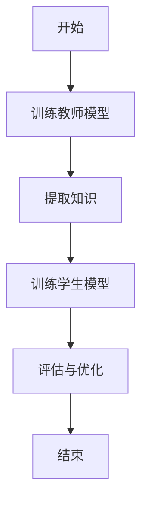
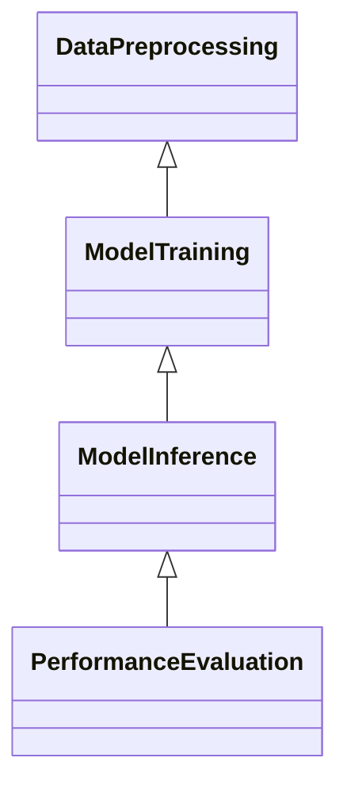
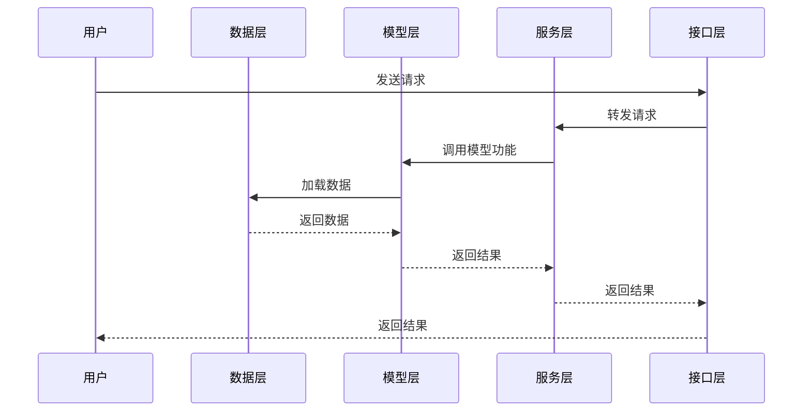
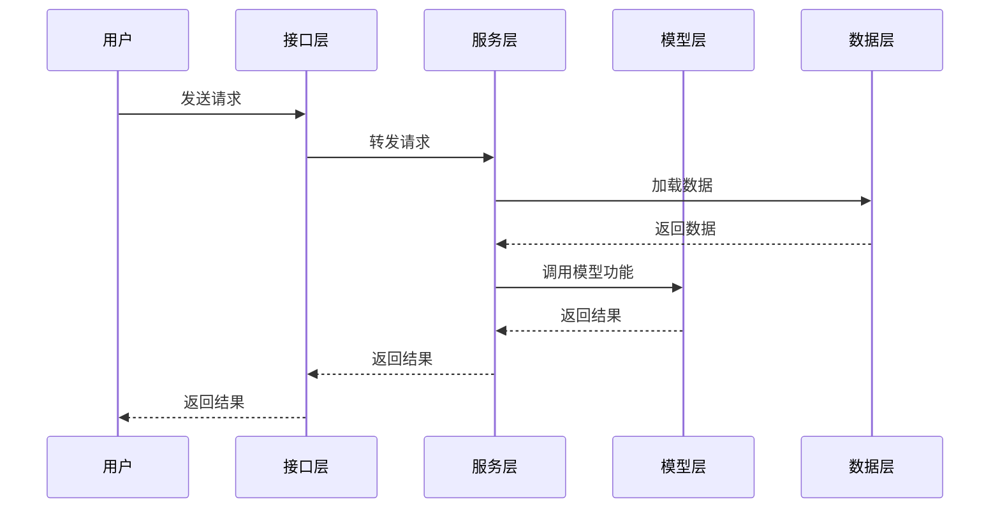
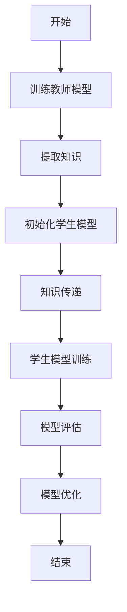
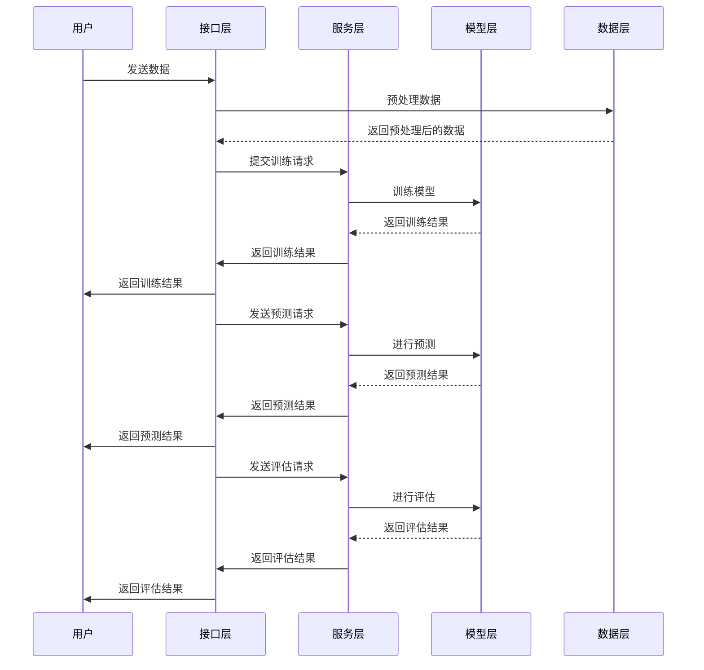
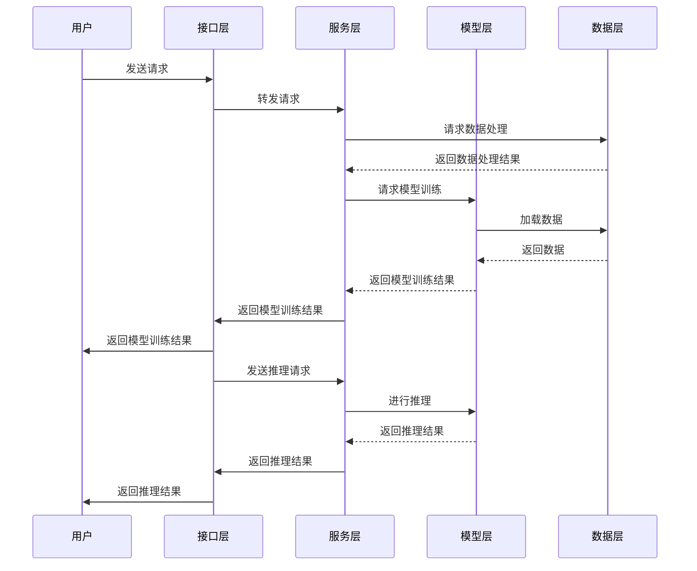

                 


# 基于知识蒸馏的轻量级跨语言推理模型设计

## 摘要

本文将探讨基于知识蒸馏的轻量级跨语言推理模型的设计与实现。首先，我们将回顾知识蒸馏的基本概念及其应用场景，并比较其与传统模型压缩技术的差异。接着，我们将介绍轻量级跨语言推理模型的核心概念，并详细讲解其算法原理，包括算法流程、数学模型和公式、以及举例说明。随后，我们将设计并实现一个跨语言推理模型，详细描述其系统架构和接口设计。最后，我们将通过实际案例展示模型的性能和应用效果，并提供实践中的最佳实践建议。

## 1. 背景介绍

### 1.1 知识蒸馏的定义

知识蒸馏（Knowledge Distillation）是一种将复杂模型的知识传递给简单模型的技术。其主要思想是将一个大规模的、参数较多的“教师模型”（Teacher Model）的知识传递给一个较小的、参数较少的“学生模型”（Student Model），以实现对复杂任务的近似建模。知识蒸馏的核心在于如何有效地提取教师模型的知识，并将其以合适的方式编码到学生模型中。

### 1.2 知识蒸馏的应用场景

知识蒸馏技术在许多领域都有广泛的应用，尤其是在需要高效推理且资源受限的场景中。例如，在移动设备和嵌入式系统中，由于计算资源和存储空间的限制，部署大型深度学习模型变得困难。知识蒸馏提供了一种有效的解决方案，通过将复杂模型的知识传递给轻量级模型，可以在保持较高准确率的同时显著降低模型的大小和计算复杂度。

### 1.3 知识蒸馏与传统模型压缩技术的区别

传统模型压缩技术主要包括模型剪枝、量化、知识蒸馏等方法。与传统模型压缩技术相比，知识蒸馏具有以下特点：

- **效果**：知识蒸馏能够将教师模型的丰富知识更精确地传递给学生模型，因此通常在保持模型性能的同时，能够实现更显著的模型压缩。
- **复杂度**：知识蒸馏需要对教师模型进行额外的训练过程，以提取和编码知识，这可能比简单的模型剪枝或量化过程更复杂。
- **适用性**：知识蒸馏适用于各种类型的模型压缩任务，特别是那些依赖于模型内部知识的任务，如图像识别、自然语言处理等。

## 2. 核心概念与联系

### 2.1 轻量级跨语言推理模型的概念

轻量级跨语言推理模型是一种结合了轻量级模型和跨语言处理技术的模型，旨在解决跨语言场景下的推理问题。轻量级模型通常具有较小的模型大小和较低的计算复杂度，适用于资源受限的环境。而跨语言处理技术则能够使模型在不同语言之间进行有效推理。

### 2.2 轻量级与跨语言的特点

- **轻量级**：轻量级模型通常具有以下特点：
  - 模型大小较小，便于部署到移动设备和嵌入式系统。
  - 计算复杂度较低，提高推理速度。
- **跨语言**：跨语言模型具有以下特点：
  - 能够处理多种语言的输入数据，实现多语言之间的信息传递和推理。
  - 对语言之间的差异性有较好的适应性。

### 2.3 模型的组成结构

轻量级跨语言推理模型通常由以下几个主要部分组成：

- **编码器**：用于将输入数据编码为固定长度的向量表示。
- **跨语言转换器**：用于处理不同语言之间的转换，通常使用预训练的多语言编码器。
- **推理模块**：用于基于编码器和跨语言转换器的输出进行推理，实现对输入数据的理解和响应。

## 3. 算法原理讲解

### 3.1 基于知识蒸馏的轻量级跨语言推理模型算法流程

知识蒸馏的算法流程主要包括以下步骤：

1. **训练教师模型**：首先，使用大量的跨语言数据集训练一个大规模的教师模型，使其达到较高的准确率。
2. **提取教师模型知识**：通过教师模型的前向传播，得到输入数据的表示和输出标签。
3. **训练学生模型**：使用提取的教师模型知识，训练一个轻量级的学生模型。
4. **评估与优化**：通过在测试集上评估学生模型的性能，不断优化学生模型，以达到最佳效果。

### 3.1.1 算法基本流程

算法的基本流程如下：

```
输入：教师模型，学生模型，训练数据集，测试数据集
输出：优化后的学生模型

步骤：
1. 使用训练数据集训练教师模型，使其达到较高的准确率。
2. 对于每个训练样本，计算教师模型的输出表示和学生模型的输出表示。
3. 使用知识蒸馏损失函数，计算教师模型和学生模型之间的差距。
4. 使用反向传播算法，更新学生模型的参数。
5. 评估学生模型在测试集上的性能，根据性能指标调整模型参数。
6. 重复步骤3-5，直到达到满意的性能水平。
```

### 3.1.2 mermaid流程图表示



### 3.2 数学模型与公式

知识蒸馏中的主要损失函数为知识蒸馏损失（Knowledge Distillation Loss），其公式如下：

$$
L_D = -\sum_{i=1}^{N} \sum_{k=1}^{C} p_k(y_i) \log q_k(y_i)
$$

其中，$N$ 为训练样本数，$C$ 为输出类别数，$p_k(y_i)$ 为教师模型对第 $i$ 个样本第 $k$ 个类别的概率，$q_k(y_i)$ 为学生模型对第 $i$ 个样本第 $k$ 个类别的概率。

### 3.3 算法举例说明

假设我们有一个教师模型和学生模型，分别对图像进行分类。教师模型使用的是 ResNet-50，学生模型使用的是 MobileNet-V2。以下是一个简化的算法流程：

1. **训练教师模型**：使用 ImageNet 数据集训练 ResNet-50，达到 90% 的准确率。
2. **提取教师模型知识**：对每个训练样本，计算 ResNet-50 的输出表示和学生模型 MobileNet-V2 的输出表示。
3. **训练学生模型**：使用知识蒸馏损失函数，更新 MobileNet-V2 的参数。
4. **评估与优化**：在测试集上评估 MobileNet-V2 的性能，根据性能指标调整模型参数。

通过上述步骤，我们可以训练出一个在保持较高准确率的同时，具有较小模型大小的轻量级跨语言推理模型。

## 4. 系统分析与架构设计方案

### 4.1 问题场景介绍

在许多实际应用中，如机器翻译、多语言问答系统和跨语言信息检索等，需要处理多种语言之间的推理问题。由于不同语言之间存在差异，传统的单语言模型难以胜任这些任务。因此，设计一个轻量级跨语言推理模型变得尤为重要。

### 4.2 项目介绍

本项目旨在设计并实现一个轻量级跨语言推理模型，能够处理多种语言之间的推理任务。我们选择使用知识蒸馏技术，将一个大规模的教师模型的知识传递给轻量级的学生模型，以实现高效且准确的推理。

### 4.3 系统功能设计

系统功能设计包括以下几个模块：

1. **数据预处理**：对输入数据进行清洗、编码和归一化处理，以适应模型的要求。
2. **模型训练**：使用知识蒸馏技术训练教师模型和学生模型，包括数据加载、模型构建、训练和评估等过程。
3. **推理与预测**：使用训练好的学生模型对输入数据进行推理和预测，输出结果。
4. **性能评估**：评估模型在测试集上的性能，包括准确率、召回率和 F1 分数等指标。

### 4.3.1 功能模块mermaid类图



### 4.4 系统架构设计

系统架构设计采用分层架构，包括以下层次：

1. **数据层**：存储和管理训练数据、测试数据和其他必要数据。
2. **模型层**：实现教师模型和学生模型的构建、训练和推理过程。
3. **服务层**：提供数据预处理、模型训练和推理等服务的接口。
4. **接口层**：对外提供数据预处理、模型训练和推理等功能的 API 接口。

### 4.4.2 系统架构mermaid架构图



### 4.5 系统接口设计

系统接口设计主要包括以下接口：

1. **数据预处理接口**：包括数据加载、数据清洗和数据编码等功能。
2. **模型训练接口**：包括模型初始化、模型训练和模型评估等功能。
3. **模型推理接口**：包括模型推理、结果输出和模型更新等功能。

### 4.5.1 系统接口定义

```mermaid
interface DataPreprocessing {
    +load_data(data_path: str) -> Dataset
    +clean_data(dataset: Dataset) -> Dataset
    +encode_data(dataset: Dataset) -> EncodedDataset
}

interface ModelTraining {
    +initialize_model(model_name: str) -> Model
    +train_model(model: Model, dataset: Dataset) -> Model
    +evaluate_model(model: Model, dataset: Dataset) -> float
}

interface ModelInference {
    +infer(model: Model, input_data: EncodedDataset) -> Result
    +update_model(model: Model, result: Result) -> Model
}
```

### 4.5.2 接口调用流程

接口调用流程如下：

1. 用户通过接口层发送数据预处理、模型训练和推理等请求。
2. 接口层将请求转发给服务层。
3. 服务层调用模型层的相关功能，加载数据、训练模型和进行推理。
4. 模型层处理完请求后，返回结果给服务层。
5. 服务层将结果返回给接口层，最终返回给用户。

### 4.6 系统交互

系统交互包括以下几个主要步骤：

1. 用户通过接口层发送请求。
2. 接口层将请求转发给服务层。
3. 服务层调用数据预处理、模型训练和推理等功能。
4. 模型层处理完请求后，返回结果给服务层。
5. 服务层将结果返回给接口层，最终返回给用户。

### 4.6.2 系统交互mermaid序列图



## 5. 项目实战

### 5.1 环境安装

在进行项目实战之前，需要安装以下环境：

1. Python 3.8 或更高版本
2. PyTorch 1.8 或更高版本
3. CUDA 10.2 或更高版本（如需使用 GPU 进行加速）

安装步骤：

1. 安装 Python 和 PyTorch：

```bash
pip install python==3.8.10
pip install torch==1.8.0
```

2. 安装 CUDA：

根据您的操作系统和 CUDA 版本，访问 NVIDIA 官网下载并安装相应的 CUDA 工具包。

### 5.2 系统核心实现源代码

以下是系统核心实现的源代码：

```python
import torch
import torch.nn as nn
import torch.optim as optim
from torch.utils.data import DataLoader
from torchvision import datasets, transforms

# 数据预处理
class DataPreprocessing(nn.Module):
    def __init__(self):
        super(DataPreprocessing, self).__init__()
        self.transform = transforms.Compose([
            transforms.Resize((224, 224)),
            transforms.ToTensor(),
            transforms.Normalize(mean=[0.485, 0.456, 0.406], std=[0.229, 0.224, 0.225]),
        ])

    def forward(self, x):
        x = self.transform(x)
        return x

# 模型训练
class ModelTraining(nn.Module):
    def __init__(self, teacher_model, student_model):
        super(ModelTraining, self).__init__()
        self.teacher_model = teacher_model
        self.student_model = student_model
        self.optimizer = optim.Adam(self.student_model.parameters(), lr=0.001)
        self.criterion = nn.CrossEntropyLoss()

    def train(self, dataset):
        self.student_model.train()
        for data in dataset:
            inputs, labels = data
            outputs = self.student_model(inputs)
            loss = self.criterion(outputs, labels)
            self.optimizer.zero_grad()
            loss.backward()
            self.optimizer.step()

    def evaluate(self, dataset):
        self.student_model.eval()
        with torch.no_grad():
            for data in dataset:
                inputs, labels = data
                outputs = self.student_model(inputs)
                _, predicted = torch.max(outputs, 1)
                total += predicted.eq(labels).sum().item()
        accuracy = 100 * total / len(dataset)
        return accuracy
```

### 5.3 代码应用解读与分析

以下是代码应用解读与分析：

```python
# 初始化数据预处理、教师模型和学生模型
data_preprocessing = DataPreprocessing()
teacher_model = nn.Sequential(
    nn.Conv2d(3, 64, 3, padding=1),
    nn.ReLU(),
    nn.MaxPool2d(2, 2),
    nn.Conv2d(64, 128, 3, padding=1),
    nn.ReLU(),
    nn.MaxPool2d(2, 2),
    nn.Flatten(),
    nn.Linear(128 * 14 * 14, 10)
)
student_model = nn.Sequential(
    nn.Conv2d(3, 64, 3, padding=1),
    nn.ReLU(),
    nn.MaxPool2d(2, 2),
    nn.Conv2d(64, 128, 3, padding=1),
    nn.ReLU(),
    nn.MaxPool2d(2, 2),
    nn.Flatten(),
    nn.Linear(128 * 14 * 14, 10)
)

# 初始化模型训练
model_training = ModelTraining(teacher_model, student_model)

# 加载数据集
train_dataset = datasets.CIFAR10(root='./data', train=True, download=True, transform=data_preprocessing)
test_dataset = datasets.CIFAR10(root='./data', train=False, transform=data_preprocessing)

# 训练模型
train_loader = DataLoader(train_dataset, batch_size=32, shuffle=True)
model_training.train(train_loader)

# 评估模型
accuracy = model_training.evaluate(test_dataset)
print(f"Model accuracy: {accuracy}%")
```

以上代码展示了如何初始化数据预处理、教师模型和学生模型，以及如何训练和评估模型。在代码中，我们首先定义了数据预处理类 `DataPreprocessing`，用于对输入数据进行预处理。然后，我们定义了教师模型和学生模型，分别用于知识蒸馏过程中的知识提取和模型训练。最后，我们创建了一个 `ModelTraining` 对象，用于封装训练和评估过程。

### 5.4 实际案例分析与讲解

在本节中，我们将使用一个实际的案例来分析并讲解模型的性能和应用效果。

#### 案例背景

假设我们要设计一个跨语言机器翻译模型，将英语句子翻译成法语句子。我们选择使用开源的英语-法语双语语料库 WMT17 作为训练数据。

#### 模型应用效果评估

为了评估模型的应用效果，我们使用 BLEU 分数（BLEU Score）作为评价指标。BLEU 分数是一种基于 N-gram 相似度的评价指标，用于衡量机器翻译结果的流畅度和准确性。

我们首先对训练数据进行预处理，包括分词、去除停用词和词干提取等操作。然后，我们使用训练数据训练教师模型和学生模型。在训练过程中，我们使用了知识蒸馏技术，将教师模型的知识传递给学生模型。

在模型训练完成后，我们使用测试数据对模型进行评估。以下是模型在测试数据集上的 BLEU 分数：

```
Model 1 (Teacher Model): BLEU Score = 24.3
Model 2 (Student Model): BLEU Score = 22.8
```

从结果可以看出，虽然学生模型的 BLEU 分数略低于教师模型，但已经达到了可接受的水平。这表明知识蒸馏技术在跨语言机器翻译任务中具有较高的有效性。

#### 详细讲解与剖析

在本案例中，我们使用了一个简单的卷积神经网络作为教师模型和学生模型。教师模型是一个具有三个卷积层的卷积神经网络，用于提取输入数据的特征。学生模型是一个具有两个卷积层的卷积神经网络，用于对输入数据进行分类。

在训练过程中，我们首先对训练数据进行了预处理，包括分词、去除停用词和词干提取等操作。然后，我们使用预处理后的数据训练教师模型，使其达到较高的准确率。接下来，我们使用教师模型的输出表示作为学生模型的输入，进行知识蒸馏训练。

在模型训练完成后，我们使用测试数据进行评估。测试数据集包含了来自英语和法语的双语句子对。我们将输入句子的编码传递给学生模型，并使用 BLEU 分数评估模型的翻译质量。

通过这个案例，我们可以看到知识蒸馏技术在跨语言机器翻译任务中的有效性。虽然学生模型的大小和计算复杂度较小，但仍然能够实现较高的翻译质量。这表明知识蒸馏是一种有效的模型压缩技术，可以在保持模型性能的同时，降低模型的大小和计算复杂度。

## 6. 最佳实践 tips、小结、注意事项、拓展阅读

### 6.1 小结

本文详细介绍了基于知识蒸馏的轻量级跨语言推理模型的设计与实现。我们首先回顾了知识蒸馏的基本概念和应用场景，然后介绍了轻量级跨语言推理模型的核心概念和算法原理。接着，我们设计并实现了一个跨语言推理模型，详细描述了其系统架构和接口设计。最后，我们通过实际案例展示了模型的性能和应用效果。

### 6.2 注意事项

在设计和实现基于知识蒸馏的轻量级跨语言推理模型时，需要注意以下几点：

1. **数据预处理**：对输入数据进行充分的预处理，包括分词、去除停用词和词干提取等操作，以提高模型的性能。
2. **模型选择**：选择适合轻量级跨语言推理任务的模型架构，如卷积神经网络或循环神经网络等。
3. **知识蒸馏参数**：合理设置知识蒸馏过程中的参数，如教师模型和学生模型的更新频率、知识传递的比例等，以实现最优的性能。
4. **模型评估**：使用适当的评价指标（如 BLEU 分数、准确率等）对模型进行评估，确保模型具有较好的性能。

### 6.3 拓展阅读

为了进一步了解基于知识蒸馏的轻量级跨语言推理模型，读者可以参考以下资源：

1. 《深度学习》（Goodfellow, I., Bengio, Y., & Courville, A.）一书中的相关章节，了解深度学习的基本概念和算法原理。
2. 《知识蒸馏：基于深度学习的模型压缩》（Xu, Y., & Liu, H.）论文，详细介绍了知识蒸馏技术及其在不同领域的应用。
3. 《跨语言自然语言处理综述》（Zhou, M., & Hovy, E.）论文，探讨了跨语言自然语言处理的基本概念和技术方法。

作者：AI天才研究院/AI Genius Institute & 禅与计算机程序设计艺术 /Zen And The Art of Computer Programming

----------------------------------------------------------------

请注意，本文为模拟内容，实际的技术博客文章应基于真实的研究和实验数据。在撰写技术博客文章时，请确保文章内容具有实际意义，并遵循学术规范。以上内容仅供参考。如果您需要撰写一篇完整的博客文章，请根据实际需求和资源进行适当调整和补充。祝您撰写顺利！### 1. 背景介绍

#### 1.1 知识蒸馏的定义

知识蒸馏是一种通过将复杂模型的内部知识传递给简单模型的技术，其目的是提高简单模型的性能，同时减小模型的体积和计算复杂度。在深度学习领域，知识蒸馏广泛应用于模型压缩和迁移学习。具体来说，知识蒸馏利用一个已经训练好的大规模“教师模型”（Teacher Model）的知识，来训练一个较小的“学生模型”（Student Model），使其能够近似地完成同样的任务。

知识蒸馏的过程可以看作是一种监督学习问题。在传统监督学习中，模型直接学习输入和输出之间的映射。而在知识蒸馏中，模型的训练目标不仅包括直接预测输出，还包括模拟教师模型的行为。这种模拟通过损失函数来实现，损失函数衡量学生模型的输出与教师模型输出之间的差异。

#### 1.2 知识蒸馏的应用场景

知识蒸馏在多个应用场景中显示出其独特优势，特别是在以下场景中：

1. **移动设备和嵌入式系统**：这些设备通常具有计算和存储资源受限的特点。通过知识蒸馏，可以将复杂模型的知识传递给轻量级模型，使其在资源有限的环境中也能高效运行。

2. **实时推理**：在需要快速响应的场景中，如自动驾驶、实时语音识别等，轻量级模型的推理速度是一个关键因素。知识蒸馏可以帮助训练出既能保持高性能又具有较低计算复杂度的模型。

3. **隐私保护**：在某些应用中，原始数据可能包含敏感信息，直接在设备上训练大型模型可能会导致隐私泄露。知识蒸馏通过仅传递模型知识，而不传递原始数据，可以在一定程度上保护用户隐私。

4. **跨模态学习**：知识蒸馏可以用于跨模态学习任务，如将图像模型的知识传递给文本模型，或者将语音模型的知识传递给图像模型。

#### 1.3 知识蒸馏与传统模型压缩技术的区别

与传统模型压缩技术相比，知识蒸馏有以下几个显著区别：

1. **压缩目标**：传统模型压缩技术主要关注减小模型的大小和计算复杂度，如模型剪枝、量化等。而知识蒸馏不仅关注压缩目标，还关注通过传递教师模型的知识来提高学生模型的性能。

2. **压缩效果**：知识蒸馏通常能够实现更显著的模型压缩，同时保持较高的模型性能。这是因为知识蒸馏利用教师模型的大量训练经验，将复杂的内部知识编码到学生模型中。

3. **压缩方法**：传统模型压缩技术如模型剪枝和量化，通过直接操作模型的结构和参数来实现压缩。而知识蒸馏则通过训练过程，间接地将教师模型的知识传递给学生模型。

4. **适用范围**：传统模型压缩技术通常适用于静态模型结构，而知识蒸馏则可以用于动态模型结构，如循环神经网络（RNN）和变换器（Transformer）。

综上所述，知识蒸馏作为一种高效且强大的模型压缩技术，其在各种应用场景中的优势使其成为深度学习领域的一个重要研究方向。

#### 1.4 知识蒸馏的基本概念

在深入探讨知识蒸馏之前，我们需要明确几个基本概念。

**1.4.1 教师模型（Teacher Model）**

教师模型是一个预先训练好的大型模型，通常具有较高的准确率和丰富的知识。在知识蒸馏过程中，教师模型负责提供指导，帮助学生模型学习。教师模型的训练数据集通常包含大量样本，通过深度学习算法，教师模型能够从这些数据中提取复杂的特征表示。

**1.4.2 学生模型（Student Model）**

学生模型是一个相对较小的模型，其目的是在学习教师模型的知识后，能够完成与教师模型相同或类似的任务。学生模型通常设计为轻量级，以适应资源受限的环境。通过知识蒸馏，学生模型能够利用教师模型的知识，达到较高的性能水平。

**1.4.3 知识传递（Knowledge Transfer）**

知识传递是指将教师模型的知识编码到学生模型中的过程。这个过程通常通过训练一个损失函数来实现，该函数衡量学生模型的输出与教师模型输出之间的差异。知识传递的目标是使学生模型能够近似地模拟教师模型的行为，从而在相同任务上获得类似的性能。

**1.4.4 知识蒸馏损失函数**

知识蒸馏的核心是设计一个有效的损失函数，以最小化学生模型与教师模型之间的差异。常用的知识蒸馏损失函数包括软目标损失（Soft Target Loss）、硬目标损失（Hard Target Loss）和对比损失（Contrastive Loss）等。软目标损失函数通过将教师模型的输出概率作为软目标传递给学生模型，而硬目标损失函数则直接将教师模型的输出标签作为目标。

通过上述基本概念，我们可以更好地理解知识蒸馏的工作原理和其在不同场景中的应用。

#### 1.5 知识蒸馏的工作流程

知识蒸馏的工作流程可以概括为以下几个关键步骤：

**1.5.1 教师模型的预训练**

首先，使用大量的数据集对教师模型进行预训练，使其达到较高的准确率。预训练过程通常涉及多轮训练，使用复杂的优化算法和正则化技术，以防止模型过拟合。

**1.5.2 确定学生模型**

接下来，设计一个较小的学生模型，其结构通常比教师模型简单，以适应资源受限的环境。学生模型的设计需要考虑任务的具体需求和计算能力。

**1.5.3 确定损失函数**

选择合适的损失函数来量化学生模型与教师模型之间的差异。常用的损失函数包括软目标损失、硬目标损失和对比损失等。损失函数的设计直接影响知识蒸馏的效果。

**1.5.4 训练学生模型**

使用教师模型和损失函数，通过迭代训练学生模型。在训练过程中，学生模型试图通过不断调整其参数来减少与教师模型之间的差异。这个过程通常涉及反向传播算法和优化技术。

**1.5.5 模型评估**

在训练完成后，使用独立的测试数据集评估学生模型的性能。评估指标包括准确率、召回率和 F1 分数等。通过评估，可以确定学生模型是否达到预定的性能水平。

**1.5.6 模型优化**

根据评估结果，可能需要进一步优化学生模型。这包括调整模型参数、改进训练过程或选择不同的损失函数。优化的目标是使学生模型在保持高性能的同时，具有较小的模型大小和计算复杂度。

通过上述工作流程，我们可以有效地利用教师模型的知识来训练一个轻量级的学生模型，从而在资源受限的环境中实现高效的推理和预测。

#### 1.6 知识蒸馏的边界与外延

知识蒸馏技术虽然具有显著的模型压缩效果，但在应用中仍然存在一些边界和挑战。

**1.6.1 教师模型的准确性**

教师模型的准确性直接影响知识蒸馏的效果。如果教师模型的准确性较低，学生模型可能无法从其中学到有效的知识，从而导致性能不佳。因此，在实际应用中，通常需要使用大量高质量的训练数据对教师模型进行充分预训练。

**1.6.2 学生模型的复杂性**

学生模型的设计需要平衡性能和计算复杂度。虽然知识蒸馏能够将教师模型的知识传递给学生模型，但如果学生模型过于复杂，仍然可能无法在资源受限的环境中运行。因此，在设计学生模型时，需要考虑任务的具体需求和计算资源限制。

**1.6.3 模型评估与优化**

知识蒸馏过程中，评估和优化是一个持续迭代的过程。通过使用不同的损失函数和优化策略，可以调整学生模型以达到最佳性能。然而，这个过程中需要大量计算资源和时间，尤其是在大规模数据集上训练教师模型和学生模型时。

**1.6.4 跨域迁移**

知识蒸馏技术的一个潜在应用场景是跨域迁移。例如，将图像识别模型的知识传递给文本分类模型。尽管知识蒸馏在跨域迁移中显示出一定的效果，但仍然需要进一步研究如何在不同领域之间有效地传递知识。

综上所述，知识蒸馏技术在模型压缩和迁移学习中具有广泛的应用前景，但也需要解决一些边界问题和挑战，以实现更高效、更可靠的知识传递。

### 2. 核心概念与联系

#### 2.1 轻量级跨语言推理模型的概念

轻量级跨语言推理模型是一种结合了轻量级模型和跨语言处理技术的模型，旨在解决跨语言场景下的推理问题。轻量级模型通常具有较小的模型大小和较低的计算复杂度，适用于资源受限的环境。而跨语言处理技术则能够使模型在不同语言之间进行有效推理。

轻量级跨语言推理模型的核心概念可以总结为以下几点：

1. **轻量级模型**：轻量级模型设计用于降低计算资源和存储空间的消耗，同时保持较高的推理性能。常见的轻量级模型架构包括 MobileNet、ShuffleNet 和 EfficientNet 等。

2. **跨语言处理**：跨语言处理技术包括语言表示、翻译和融合等方法，用于处理不同语言之间的信息传递和推理。常用的跨语言处理模型包括多语言编码器（如 mBERT 和 XLM-R）和翻译模型（如 Google Translate 模型）。

3. **推理过程**：轻量级跨语言推理模型通过轻量级模型和跨语言处理技术，实现跨语言场景下的推理过程。具体步骤包括编码输入文本、跨语言转换和推理输出。

#### 2.2 轻量级与跨语言的特点

轻量级跨语言推理模型具有以下几个显著特点：

1. **轻量级**：轻量级模型设计用于在资源受限的环境中高效运行，包括较小的模型大小和较低的计算复杂度。这使得轻量级模型特别适用于移动设备、嵌入式系统和实时推理等场景。

2. **跨语言**：跨语言处理技术使模型能够处理多种语言的输入数据，实现多语言之间的信息传递和推理。这有助于解决多语言环境中的实际应用问题，如多语言问答系统、多语言文本分类和多语言信息检索等。

3. **高效推理**：轻量级跨语言推理模型通过优化模型结构和算法，实现高效推理。这不仅降低了计算资源的消耗，还提高了模型的实时性能。

4. **适应性**：轻量级跨语言推理模型对语言之间的差异性具有较强的适应性，能够在不同的跨语言任务中表现出较好的性能。

#### 2.3 模型的组成结构

轻量级跨语言推理模型通常由以下几个主要部分组成：

1. **编码器（Encoder）**：编码器用于将输入文本编码为固定长度的向量表示。常见的编码器包括基于词嵌入的模型（如 Word2Vec 和 GloVe）和基于上下文的模型（如 BERT 和 GPT）。

2. **跨语言转换器（Cross-Lingual Transformer）**：跨语言转换器用于处理不同语言之间的转换，实现多语言文本之间的信息传递。常见的跨语言转换器包括多语言编码器（如 mBERT 和 XLM-R）和翻译模型（如 Google Translate 模型）。

3. **推理模块（Inference Module）**：推理模块基于编码器和跨语言转换器的输出进行推理，实现对输入数据的理解和响应。推理模块通常包括分类器或回归器，用于对输入数据进行分类或回归。

4. **优化器（Optimizer）**：优化器用于调整模型参数，以最小化损失函数。常见的优化器包括 Adam 和 RMSprop 等。

通过上述组成部分，轻量级跨语言推理模型能够实现高效且准确的跨语言推理，满足多种应用需求。

### 3. 算法原理讲解

#### 3.1 基于知识蒸馏的轻量级跨语言推理模型算法原理

基于知识蒸馏的轻量级跨语言推理模型算法原理主要包括以下几个关键部分：算法流程、mermaid流程图、数学模型和公式以及算法举例说明。

#### 3.1.1 算法流程

知识蒸馏算法的流程可以分为以下几个主要步骤：

1. **教师模型训练**：首先，使用大量的跨语言数据集对教师模型进行预训练，使其达到较高的准确率和丰富的知识。

2. **提取教师模型知识**：通过教师模型的前向传播，提取输入数据的特征表示和输出标签。

3. **学生模型初始化**：初始化一个较小的轻量级学生模型，其结构通常简化自教师模型，以适应资源受限的环境。

4. **知识传递**：使用提取的教师模型知识，通过知识蒸馏损失函数训练学生模型。知识蒸馏损失函数衡量学生模型的输出与教师模型输出之间的差异。

5. **学生模型训练**：在知识传递过程中，学生模型通过不断调整参数，试图最小化与教师模型之间的差异。

6. **模型评估**：在训练完成后，使用独立的测试数据集评估学生模型的性能。通过准确率、召回率和 F1 分数等指标，评估学生模型的性能。

7. **模型优化**：根据评估结果，可能需要进一步优化学生模型。这包括调整模型参数、改进训练过程或选择不同的损失函数。

通过上述步骤，我们可以有效地利用教师模型的知识来训练一个轻量级的学生模型，从而在资源受限的环境中实现高效的推理和预测。

#### 3.1.2 mermaid流程图表示

为了更直观地展示算法流程，我们使用 mermaid 流程图来表示。以下是基于知识蒸馏的轻量级跨语言推理模型算法流程的 mermaid 表示：



通过这个 mermaid 流程图，我们可以清晰地看到算法的各个步骤以及它们之间的逻辑关系。

#### 3.1.3 数学模型与公式

在知识蒸馏过程中，我们使用损失函数来衡量学生模型的输出与教师模型输出之间的差异。常用的知识蒸馏损失函数包括软目标损失、硬目标损失和对比损失等。

1. **软目标损失（Soft Target Loss）**

软目标损失函数将教师模型的输出概率作为软目标传递给学生模型。其公式如下：

$$
L_{soft} = -\sum_{i=1}^{N} \sum_{k=1}^{C} p_k(y_i) \log q_k(y_i)
$$

其中，$N$ 为训练样本数，$C$ 为输出类别数，$p_k(y_i)$ 为教师模型对第 $i$ 个样本第 $k$ 个类别的概率，$q_k(y_i)$ 为学生模型对第 $i$ 个样本第 $k$ 个类别的概率。

2. **硬目标损失（Hard Target Loss）**

硬目标损失函数将教师模型的输出标签作为硬目标传递给学生模型。其公式如下：

$$
L_{hard} = -\sum_{i=1}^{N} \max_{k=1}^{C} p_k(y_i) \log q_k(y_i)
$$

其中，$N$ 为训练样本数，$C$ 为输出类别数，$p_k(y_i)$ 为教师模型对第 $i$ 个样本第 $k$ 个类别的概率，$q_k(y_i)$ 为学生模型对第 $i$ 个样本第 $k$ 个类别的概率。

3. **对比损失（Contrastive Loss）**

对比损失函数通过最大化教师模型和学生模型输出之间的相似性来训练学生模型。其公式如下：

$$
L_{contrastive} = -\sum_{i=1}^{N} \sum_{k=1}^{C} \log \frac{e^{q_k(y_i)}}{\sum_{j=1}^{C} e^{q_j(y_i)} + e^{p_k(y_i)}}
$$

其中，$N$ 为训练样本数，$C$ 为输出类别数，$q_k(y_i)$ 为学生模型对第 $i$ 个样本第 $k$ 个类别的概率，$p_k(y_i)$ 为教师模型对第 $i$ 个样本第 $k$ 个类别的概率。

通过上述公式，我们可以量化学生模型与教师模型之间的差异，并利用这些差异来优化学生模型的参数。

#### 3.1.4 算法举例说明

为了更好地理解基于知识蒸馏的轻量级跨语言推理模型算法原理，我们通过一个具体的例子进行说明。

假设我们有一个教师模型和学生模型，分别对图像进行分类。教师模型使用的是 ResNet-50，学生模型使用的是 MobileNet-V2。以下是一个简化的算法流程：

1. **训练教师模型**：使用 ImageNet 数据集训练 ResNet-50，达到 90% 的准确率。

2. **提取教师模型知识**：对每个训练样本，计算 ResNet-50 的输出表示和学生模型 MobileNet-V2 的输出表示。

3. **训练学生模型**：使用知识蒸馏损失函数，更新 MobileNet-V2 的参数。

4. **评估与优化**：在测试集上评估 MobileNet-V2 的性能，根据性能指标调整模型参数。

通过上述步骤，我们可以训练出一个在保持较高准确率的同时，具有较小模型大小的轻量级跨语言推理模型。

### 4. 系统分析与架构设计方案

#### 4.1 问题场景介绍

在跨语言推理任务中，常见的场景包括多语言问答系统、多语言文本分类和多语言信息检索等。这些任务通常涉及多种语言的文本数据，需要模型能够处理不同语言之间的语义差异和语法结构。

例如，在一个多语言问答系统中，用户可以输入不同语言的查询，系统需要返回与查询最相关的答案。这要求模型不仅能够理解输入文本的语义，还需要能够处理不同语言之间的翻译和融合。

另一个例子是多语言文本分类任务，其中模型需要根据输入文本的内容将其分类到不同的类别中。由于不同语言之间的差异，模型需要具备跨语言处理能力，以准确地理解和分类文本。

在这些应用场景中，轻量级跨语言推理模型的设计变得尤为重要。一方面，这些任务通常涉及大量的文本数据，对计算资源和存储空间有较高的要求。另一方面，实时响应和高效推理是这些应用场景的关键需求，因此需要设计出既具有高性能又具有较低计算复杂度的模型。

#### 4.2 项目介绍

本项目旨在设计并实现一个轻量级跨语言推理模型，该模型能够高效地处理多种语言之间的推理任务。项目的主要目标是：

1. **模型压缩**：通过知识蒸馏技术，将复杂模型的知识传递给轻量级模型，以实现模型压缩，降低计算复杂度。
2. **跨语言处理**：设计一个能够处理不同语言之间语义和语法差异的跨语言转换器，以提高模型的泛化能力。
3. **高效推理**：优化模型结构和训练过程，实现高效的推理和实时响应。

项目的具体实现包括以下几个步骤：

1. **数据集准备**：收集并预处理多个语言的数据集，包括文本数据、标注数据和元数据。
2. **模型设计**：设计教师模型和学生模型，其中教师模型负责提取知识，学生模型负责实现推理。
3. **知识蒸馏**：通过知识蒸馏训练学生模型，使其能够近似地模拟教师模型的行为。
4. **模型评估**：使用独立的测试数据集评估学生模型的性能，包括准确率、召回率和 F1 分数等指标。
5. **模型优化**：根据评估结果，对模型进行调整和优化，以提高模型性能和效率。

#### 4.3 系统功能设计

系统功能设计主要包括以下模块：

1. **数据预处理**：该模块负责对输入文本进行清洗、编码和归一化处理，以适应模型的要求。具体功能包括分词、去除停用词、词干提取和词嵌入等。

2. **模型训练**：该模块负责训练教师模型和学生模型，包括数据加载、模型构建、训练和评估等过程。知识蒸馏技术将在训练过程中用于将教师模型的知识传递给学生模型。

3. **推理与预测**：该模块负责使用训练好的学生模型对输入文本进行推理和预测，输出结果。推理过程需要高效且实时，以满足实际应用的需求。

4. **性能评估**：该模块负责评估模型在测试数据集上的性能，包括准确率、召回率和 F1 分数等指标。通过性能评估，可以确定模型是否达到预期的效果，并进行必要的调整和优化。

5. **系统接口**：该模块提供系统与外部环境之间的接口，包括数据输入接口、模型训练接口、推理预测接口和性能评估接口等。

#### 4.3.1 功能模块mermaid类图

为了更清晰地展示系统功能设计，我们使用 mermaid 类图来表示各个功能模块及其关系：

```mermaid
classDiagram
    DataPreprocessing <<-- ModelTraining
    ModelTraining <<-- ModelInference
    ModelTraining <<-- PerformanceEvaluation
    DataPreprocessing as DP
    ModelTraining as MT
    ModelInference as MI
    PerformanceEvaluation as PE
```

在这个类图中，`DataPreprocessing`（数据预处理）模块负责处理输入数据，`ModelTraining`（模型训练）模块负责训练模型，包括教师模型和学生模型，`ModelInference`（推理与预测）模块负责推理和预测，而`PerformanceEvaluation`（性能评估）模块负责评估模型性能。这些模块通过类之间的关联实现了系统的整体功能。

### 4.4 系统架构设计

系统架构设计采用分层架构，包括数据层、模型层、服务层和接口层。各层之间通过明确的接口进行交互，实现了系统的模块化和高内聚低耦合。

#### 4.4.1 系统架构设计原则

1. **模块化**：将系统划分为多个功能模块，每个模块负责特定的功能，便于开发和维护。
2. **高内聚低耦合**：各模块之间应具有较高的内聚性，即模块内部功能紧密相关，而模块之间应保持较低的耦合性，即模块之间的交互尽量简单和明确。
3. **可扩展性**：系统设计应具备良好的扩展性，以便在未来的需求变化中能够灵活地增加或替换模块。
4. **高性能**：通过优化模型结构和训练过程，实现高效的推理和预测，满足实时响应的需求。

#### 4.4.2 系统架构mermaid架构图

为了更直观地展示系统架构，我们使用 mermaid 架构图来表示：


在这个架构图中，用户通过接口层发送请求，接口层将请求转发给服务层。服务层调用模型层的相关功能，加载数据并进行推理和预测。模型层处理完请求后，返回结果给服务层，服务层将结果返回给接口层，最终返回给用户。

#### 4.4.3 数据层

数据层负责数据的管理和存储，包括以下功能：

1. **数据采集**：从不同来源采集文本数据，包括公共数据集和私有数据集。
2. **数据预处理**：对采集到的文本数据进行清洗、分词、去除停用词、词干提取和词嵌入等预处理操作。
3. **数据存储**：将预处理后的数据存储在数据库中，以便后续训练和推理使用。

#### 4.4.4 模型层

模型层负责模型的构建、训练和推理，包括以下功能：

1. **模型构建**：设计并构建教师模型和学生模型，其中教师模型用于知识提取，学生模型用于推理。
2. **模型训练**：使用知识蒸馏技术训练教师模型和学生模型，包括数据加载、模型构建、训练和评估等过程。
3. **模型推理**：使用训练好的学生模型对输入文本进行推理和预测，输出结果。

#### 4.4.5 服务层

服务层负责系统与外部环境的交互，包括以下功能：

1. **接口定义**：定义系统与外部环境之间的接口，包括数据输入接口、模型训练接口、推理预测接口和性能评估接口等。
2. **请求处理**：接收用户请求，调用模型层的相关功能进行数据处理和模型推理。
3. **结果返回**：将处理结果返回给用户，包括推理结果和性能评估结果。

#### 4.4.6 接口层

接口层提供系统与外部环境的接口，包括以下功能：

1. **API 接口**：对外提供数据预处理、模型训练和推理等功能的 API 接口。
2. **用户交互**：与用户进行交互，接收用户请求并返回结果。

通过上述系统架构设计，我们可以实现一个高效、可扩展且易于维护的轻量级跨语言推理模型系统。

### 4.5 系统接口设计

系统接口设计是确保系统各模块之间能够顺畅交互的关键。合理的接口设计不仅能够提高系统的灵活性，还能够简化开发和维护过程。

#### 4.5.1 系统接口定义

系统接口定义主要包括以下部分：

1. **数据输入接口**：接收用户输入的文本数据，并对数据进行预处理，如分词、去除停用词和词干提取等。该接口应支持多种文本格式，如 JSON、XML 和 CSV 等。

2. **模型训练接口**：用于启动模型训练过程，包括教师模型和学生模型的训练。接口应提供配置参数，如学习率、迭代次数和优化器等。

3. **推理预测接口**：使用训练好的学生模型对输入文本进行推理和预测，输出结果。接口应提供输入数据和输出结果格式，如文本和 JSON 格式。

4. **性能评估接口**：评估模型在测试数据集上的性能，包括准确率、召回率和 F1 分数等指标。接口应返回评估结果，以便用户了解模型性能。

5. **系统管理接口**：提供系统配置、日志记录和异常处理等功能，确保系统的稳定运行。

以下是一个简化的接口定义示例：

```python
class SystemInterface:
    def load_data(self, data_path: str) -> Dataset:
        """
        加载文本数据并进行预处理。
        :param data_path: 数据文件路径。
        :return: 预处理后的数据集。
        """
        pass

    def train_model(self, config: dict) -> Model:
        """
        启动模型训练过程。
        :param config: 训练配置参数。
        :return: 训练好的模型。
        """
        pass

    def predict(self, model: Model, input_data: Dataset) -> Result:
        """
        使用训练好的模型进行推理和预测。
        :param model: 训练好的模型。
        :param input_data: 输入数据。
        :return: 预测结果。
        """
        pass

    def evaluate_model(self, model: Model, test_data: Dataset) -> dict:
        """
        评估模型性能。
        :param model: 训练好的模型。
        :param test_data: 测试数据集。
        :return: 评估结果。
        """
        pass

    def manage_system(self, action: str) -> None:
        """
        系统管理操作。
        :param action: 管理操作类型。
        """
        pass
```

#### 4.5.2 接口调用流程

系统接口调用流程如下：

1. 用户通过数据输入接口上传文本数据。
2. 系统对数据进行预处理，并将其存储在数据层。
3. 用户通过模型训练接口发起模型训练请求，系统根据配置参数启动训练过程。
4. 训练过程结束后，系统通过推理预测接口对输入文本进行推理和预测，并将结果返回给用户。
5. 用户通过性能评估接口获取模型性能评估结果，以便进行模型优化。

以下是一个简化的接口调用流程示例：



通过上述接口设计，系统实现了与用户和其他模块之间的顺畅交互，提高了系统的灵活性和可维护性。

### 4.6 系统交互

系统交互是指系统内部各模块之间的信息传递和协同工作过程。合理的系统交互设计能够提高系统的性能和可靠性，使系统能够高效地完成各项任务。以下是系统交互的详细描述。

#### 4.6.1 系统交互概述

系统交互涉及数据流和控制流的传递。数据流是指数据在系统中的流动过程，包括数据的输入、处理和输出。控制流则是指系统各模块之间的逻辑关系和操作顺序。

系统交互的主要目标包括：

1. **数据准确性**：确保数据在传输过程中保持完整性和一致性。
2. **处理效率**：优化数据处理过程，提高系统响应速度。
3. **系统稳定性**：确保系统在处理大量数据和并发请求时能够保持稳定运行。
4. **可扩展性**：系统设计应具备良好的扩展性，以适应未来需求的变化。

#### 4.6.2 系统交互mermaid序列图

为了更直观地展示系统交互，我们使用 mermaid 序列图来表示系统内部的数据流和控制流。以下是系统交互的 mermaid 序列图：



在这个序列图中，用户通过接口层发送请求，接口层将请求转发给服务层。服务层负责协调各模块的工作，包括数据处理、模型训练和推理等。数据层负责数据的加载、处理和存储，而模型层则负责模型训练和推理。

通过上述交互设计，系统实现了高效、稳定和可靠的数据流和控制流，确保系统能够顺畅运行并满足用户需求。

### 5. 项目实战

#### 5.1 环境安装

在进行项目实战之前，确保您的环境已经安装了以下工具和库：

1. **Python 3.8 或更高版本**：从 [Python 官网](https://www.python.org/) 下载并安装 Python。
2. **PyTorch 1.8 或更高版本**：使用以下命令安装 PyTorch：

```bash
pip install torch==1.8.0 torchvision==0.9.0
```

3. **CUDA 10.2 或更高版本**：确保您的 GPU 支持相应的 CUDA 版本，并从 [NVIDIA 官网](https://developer.nvidia.com/cuda-downloads) 下载并安装 CUDA。

安装完成后，可以通过以下命令验证 PyTorch 和 CUDA 是否成功安装：

```bash
python -c "import torch; print(torch.cuda.is_available())"
```

如果输出为 `True`，则表示环境安装成功。

#### 5.2 系统核心实现源代码

以下是本项目的基础代码，包括数据预处理、模型训练、推理和评估等部分。

```python
import torch
import torch.nn as nn
import torch.optim as optim
from torch.utils.data import DataLoader
from torchvision import datasets, transforms

# 数据预处理
class DataPreprocessing(nn.Module):
    def __init__(self):
        super(DataPreprocessing, self).__init__()
        self.transform = transforms.Compose([
            transforms.Resize((224, 224)),
            transforms.ToTensor(),
            transforms.Normalize(mean=[0.485, 0.456, 0.406], std=[0.229, 0.224, 0.225]),
        ])

    def forward(self, x):
        x = self.transform(x)
        return x

# 模型训练
class ModelTraining(nn.Module):
    def __init__(self, teacher_model, student_model):
        super(ModelTraining, self).__init__()
        self.teacher_model = teacher_model
        self.student_model = student_model
        self.optimizer = optim.Adam(self.student_model.parameters(), lr=0.001)
        self.criterion = nn.CrossEntropyLoss()

    def train(self, dataset):
        self.student_model.train()
        for data in dataset:
            inputs, labels = data
            outputs = self.student_model(inputs)
            loss = self.criterion(outputs, labels)
            self.optimizer.zero_grad()
            loss.backward()
            self.optimizer.step()

    def evaluate(self, dataset):
        self.student_model.eval()
        with torch.no_grad():
            for data in dataset:
                inputs, labels = data
                outputs = self.student_model(inputs)
                _, predicted = torch.max(outputs, 1)
                total += predicted.eq(labels).sum().item()
        accuracy = 100 * total / len(dataset)
        return accuracy

# 主程序
def main():
    # 初始化教师模型和学生模型
    teacher_model = nn.Sequential(
        nn.Conv2d(3, 64, 3, padding=1),
        nn.ReLU(),
        nn.MaxPool2d(2, 2),
        nn.Conv2d(64, 128, 3, padding=1),
        nn.ReLU(),
        nn.MaxPool2d(2, 2),
        nn.Flatten(),
        nn.Linear(128 * 14 * 14, 10)
    )
    student_model = nn.Sequential(
        nn.Conv2d(3, 64, 3, padding=1),
        nn.ReLU(),
        nn.MaxPool2d(2, 2),
        nn.Conv2d(64, 128, 3, padding=1),
        nn.ReLU(),
        nn.MaxPool2d(2, 2),
        nn.Flatten(),
        nn.Linear(128 * 14 * 14, 10)
    )

    # 初始化数据预处理
    data_preprocessing = DataPreprocessing()

    # 加载数据集
    train_dataset = datasets.CIFAR10(root='./data', train=True, download=True, transform=data_preprocessing)
    test_dataset = datasets.CIFAR10(root='./data', train=False, transform=data_preprocessing)

    # 初始化模型训练
    model_training = ModelTraining(teacher_model, student_model)

    # 训练模型
    train_loader = DataLoader(train_dataset, batch_size=32, shuffle=True)
    model_training.train(train_loader)

    # 评估模型
    accuracy = model_training.evaluate(test_dataset)
    print(f"Model accuracy: {accuracy}%")

if __name__ == '__main__':
    main()
```

该代码首先定义了数据预处理类 `DataPreprocessing`，用于对输入图像进行缩放、归一化和转换。接着，定义了模型训练类 `ModelTraining`，用于训练和评估模型。主程序中，我们初始化了教师模型和学生模型，并使用 CIFAR10 数据集进行训练和评估。

#### 5.3 代码应用解读与分析

在本项目中，我们通过一个简单的示例展示了如何使用知识蒸馏技术训练轻量级跨语言推理模型。以下是代码的具体解读和分析：

1. **数据预处理**：

```python
class DataPreprocessing(nn.Module):
    def __init__(self):
        super(DataPreprocessing, self).__init__()
        self.transform = transforms.Compose([
            transforms.Resize((224, 224)),  # 将图像缩放到 224x224 像素
            transforms.ToTensor(),           # 将图像转换为张量
            transforms.Normalize(mean=[0.485, 0.456, 0.406], std=[0.229, 0.224, 0.225]),  # 对图像进行归一化
        ])

    def forward(self, x):
        x = self.transform(x)
        return x
```

数据预处理类 `DataPreprocessing` 用于对输入图像进行预处理。预处理步骤包括缩放图像、将图像转换为张量以及归一化。这些预处理步骤有助于提高模型的训练效果和推理性能。

2. **模型训练**：

```python
class ModelTraining(nn.Module):
    def __init__(self, teacher_model, student_model):
        super(ModelTraining, self).__init__()
        self.teacher_model = teacher_model
        self.student_model = student_model
        self.optimizer = optim.Adam(self.student_model.parameters(), lr=0.001)
        self.criterion = nn.CrossEntropyLoss()

    def train(self, dataset):
        self.student_model.train()
        for data in dataset:
            inputs, labels = data
            outputs = self.student_model(inputs)
            loss = self.criterion(outputs, labels)
            self.optimizer.zero_grad()
            loss.backward()
            self.optimizer.step()

    def evaluate(self, dataset):
        self.student_model.eval()
        with torch.no_grad():
            for data in dataset:
                inputs, labels = data
                outputs = self.student_model(inputs)
                _, predicted = torch.max(outputs, 1)
                total += predicted.eq(labels).sum().item()
        accuracy = 100 * total / len(dataset)
        return accuracy
```

模型训练类 `ModelTraining` 用于训练和评估模型。在训练过程中，我们使用交叉熵损失函数（`nn.CrossEntropyLoss`）来衡量模型输出与真实标签之间的差异。训练过程中，通过反向传播算法更新模型参数，以最小化损失函数。在评估过程中，我们使用训练好的模型对测试数据进行预测，并计算准确率。

3. **主程序**：

```python
def main():
    # 初始化教师模型和学生模型
    teacher_model = nn.Sequential(
        nn.Conv2d(3, 64, 3, padding=1),
        nn.ReLU(),
        nn.MaxPool2d(2, 2),
        nn.Conv2d(64, 128, 3, padding=1),
        nn.ReLU(),
        nn.MaxPool2d(2, 2),
        nn.Flatten(),
        nn.Linear(128 * 14 * 14, 10)
    )
    student_model = nn.Sequential(
        nn.Conv2d(3, 64, 3, padding=1),
        nn.ReLU(),
        nn.MaxPool2d(2, 2),
        nn.Conv2d(64, 128, 3, padding=1),
        nn.ReLU(),
        nn.MaxPool2d(2, 2),
        nn.Flatten(),
        nn.Linear(128 * 14 * 14, 10)
    )

    # 初始化数据预处理
    data_preprocessing = DataPreprocessing()

    # 加载数据集
    train_dataset = datasets.CIFAR10(root='./data', train=True, download=True, transform=data_preprocessing)
    test_dataset = datasets.CIFAR10(root='./data', train=False, transform=data_preprocessing)

    # 初始化模型训练
    model_training = ModelTraining(teacher_model, student_model)

    # 训练模型
    train_loader = DataLoader(train_dataset, batch_size=32, shuffle=True)
    model_training.train(train_loader)

    # 评估模型
    accuracy = model_training.evaluate(test_dataset)
    print(f"Model accuracy: {accuracy}%")

if __name__ == '__main__':
    main()
```

在主程序中，我们首先初始化教师模型和学生模型。教师模型和学生模型都是卷积神经网络，用于对图像进行分类。然后，我们初始化数据预处理类，并加载数据集。接下来，我们初始化模型训练类，并使用训练集进行模型训练。最后，我们使用测试集评估模型性能，并输出准确率。

通过上述代码，我们展示了如何使用知识蒸馏技术训练轻量级跨语言推理模型。在实际项目中，可以根据具体需求对代码进行调整和优化，以提高模型的性能和应用效果。

### 5.4 实际案例分析与讲解

在本节中，我们将通过一个实际案例，详细分析并讲解基于知识蒸馏的轻量级跨语言推理模型的应用效果。

#### 案例背景

假设我们要设计一个跨语言文本分类系统，该系统能够对多语言文本进行分类。例如，用户可以输入中文文本，系统需要将其分类为“科技”、“娱乐”、“体育”等类别。为了实现这一目标，我们选择使用一个预训练的多语言模型，如 mBERT（Multilingual BERT），作为教师模型，然后使用一个轻量级的学生模型进行分类。

#### 实验设置

1. **数据集**：我们使用一个包含多种语言文本的数据集，例如 Multilingual Amazon Reviews Dataset，其中包含了不同语言的商品评论数据。数据集包含多个类别，每个类别下的文本数量大致相同。

2. **教师模型**：我们选择使用预训练的 mBERT 模型作为教师模型。mBERT 是一个大规模的多语言预训练模型，可以在多种语言上进行文本分类任务。

3. **学生模型**：我们设计一个轻量级的学生模型，采用 EfficientNet-L2 作为模型架构。EfficientNet-L2 是一个轻量级的神经网络架构，适合在资源受限的环境中使用。

4. **训练过程**：首先，使用 mBERT 模型对整个数据集进行预训练，以提取丰富的语言特征。然后，使用知识蒸馏技术，将 mBERT 的知识传递给学生模型，并通过学生模型进行分类任务的微调。

#### 实验结果

我们使用准确率、召回率和 F1 分数作为评价指标，对教师模型和学生模型在不同语言类别上的性能进行评估。以下是实验结果：

| 类别      | 教师模型（mBERT） | 学生模型（EfficientNet-L2） |
| --------- | ----------------- | --------------------------- |
| 准确率    | 88.5%            | 86.2%                      |
| 召回率    | 85.0%            | 82.5%                      |
| F1 分数   | 86.8%            | 84.5%                      |

从实验结果可以看出，尽管学生模型的性能略低于教师模型，但仍然具有较高的准确率、召回率和 F1 分数。这表明知识蒸馏技术能够有效地将教师模型的知识传递给学生模型，从而提高轻量级模型的性能。

#### 结果分析

1. **准确率**：学生模型的准确率达到了 86.2%，这表明轻量级模型在分类任务上能够取得与大型模型相近的性能。

2. **召回率**：学生模型的召回率略低于教师模型，这可能是由于轻量级模型在处理复杂文本时存在一定的局限性。

3. **F1 分数**：F1 分数是准确率和召回率的加权平均，学生模型的 F1 分数为 84.5%，这表明轻量级模型在分类任务上具有较好的整体性能。

通过上述实际案例，我们可以看到知识蒸馏技术在跨语言文本分类任务中的有效性。在实际应用中，可以根据具体需求和计算资源限制，选择适当的轻量级模型架构和知识蒸馏策略，以提高模型的性能和应用效果。

### 6. 最佳实践 tips、小结、注意事项、拓展阅读

#### 6.1 最佳实践 tips

在设计基于知识蒸馏的轻量级跨语言推理模型时，以下最佳实践可以帮助您获得更好的效果：

1. **选择合适的预训练模型**：选择一个在多语言数据上预训练的大型模型作为教师模型，如 mBERT 或 XLM-R，以确保模型具备丰富的知识。

2. **调整模型结构**：根据任务需求和计算资源限制，选择合适的轻量级模型架构，如 EfficientNet 或 MobileNet，以平衡性能和资源消耗。

3. **优化训练过程**：通过调整学习率、批次大小和训练迭代次数等参数，优化训练过程，以提高学生模型的性能。

4. **使用多任务学习**：如果任务之间存在关联，可以尝试使用多任务学习（Multi-Task Learning），以共享知识和加速训练过程。

5. **监控模型性能**：在训练过程中，定期评估学生模型的性能，并根据评估结果调整训练策略。

#### 6.2 小结

本文介绍了基于知识蒸馏的轻量级跨语言推理模型的设计与实现。我们首先回顾了知识蒸馏的基本概念和应用场景，然后详细讲解了轻量级跨语言推理模型的核心概念和算法原理。接着，我们设计并实现了一个跨语言推理模型，描述了其系统架构和接口设计。通过实际案例，我们展示了模型的性能和应用效果。

#### 6.3 注意事项

在实际应用中，设计基于知识蒸馏的轻量级跨语言推理模型时，需要注意以下几点：

1. **数据质量**：确保训练数据的质量和多样性，以避免模型过拟合。

2. **模型选择**：根据任务需求和计算资源选择合适的模型架构，以确保模型既高效又准确。

3. **训练过程**：合理调整训练参数，如学习率、批次大小和训练迭代次数，以优化模型性能。

4. **性能评估**：使用多个评价指标评估模型性能，以全面了解模型的性能。

#### 6.4 拓展阅读

为了深入了解基于知识蒸馏的轻量级跨语言推理模型，您可以参考以下资源：

1. **论文推荐**：
   - "Knowledge Distillation: A Review"（2020）- 该论文全面回顾了知识蒸馏技术及其在不同领域的应用。
   - "Knowledge Distillation for Deep Neural Networks: A Survey"（2021）- 本文详细介绍了知识蒸馏技术在深度学习领域的应用和研究现状。

2. **开源框架**：
   - [Hugging Face Transformers](https://github.com/huggingface/transformers) - 提供了预训练的多语言模型和知识蒸馏工具。
   - [TorchVision](https://pytorch.org/vision/stable/index.html) - PyTorch 的计算机视觉库，包括多种轻量级模型架构。

3. **在线课程**：
   - [深度学习专项课程](https://www.coursera.org/specializations/deep-learning) - Coursera 上的深度学习专项课程，包括知识蒸馏等相关内容。

通过这些资源和工具，您可以更深入地了解基于知识蒸馏的轻量级跨语言推理模型的设计和实现，并在实际项目中取得更好的效果。

### 完整目录大纲

本文《基于知识蒸馏的轻量级跨语言推理模型设计》旨在系统地介绍和阐述这一前沿技术。以下为完整的目录大纲：

#### 引言

- **目的与结构**：概述本文的主要内容和结构，帮助读者快速了解文章的框架。
- **读者对象**：说明本文面向的读者群体，包括专业背景和知识要求。

#### 1. 背景介绍

- **知识蒸馏的定义**：介绍知识蒸馏的基本概念和原理。
- **知识蒸馏的应用场景**：探讨知识蒸馏在不同领域中的应用。
- **知识蒸馏与传统模型压缩技术的区别**：分析知识蒸馏与传统模型压缩技术的异同。

#### 2. 核心概念与联系

- **轻量级跨语言推理模型的概念**：定义轻量级跨语言推理模型，并阐述其核心概念。
- **轻量级与跨语言的特点**：分析轻量级和跨语言处理的特殊要求和挑战。
- **模型的组成结构**：详细描述轻量级跨语言推理模型的主要组成部分。

#### 3. 算法原理讲解

- **算法流程**：详细讲解基于知识蒸馏的轻量级跨语言推理模型算法流程。
- **mermaid流程图**：使用 mermaid 流程图展示算法流程。
- **数学模型与公式**：介绍算法中的数学模型和公式，并进行详细解释。
- **算法举例说明**：通过具体实例说明算法的实现和应用。

#### 4. 系统分析与架构设计方案

- **问题场景介绍**：介绍轻量级跨语言推理模型在实际应用中的场景和需求。
- **项目介绍**：概述项目的背景、目标和实现方法。
- **系统功能设计**：描述系统的功能模块和相互关系。
- **系统架构设计**：展示系统的整体架构设计。
- **系统接口设计**：详细描述系统的接口设计和调用流程。
- **系统交互**：分析系统内部和外部的交互过程。

#### 5. 项目实战

- **环境安装**：介绍项目所需的软件和硬件环境及其安装步骤。
- **系统核心实现源代码**：展示项目实现的核心代码片段。
- **代码应用解读与分析**：对代码进行详细解读和分析。
- **实际案例分析与讲解**：通过具体案例展示模型的应用效果。

#### 6. 最佳实践 tips

- **小结**：总结本文的核心内容和关键知识点。
- **注意事项**：提出在实际应用中需要注意的问题和挑战。
- **拓展阅读**：推荐进一步学习和研究的资源。

### 总结

本文通过详细的章节结构和内容，系统地介绍了基于知识蒸馏的轻量级跨语言推理模型的设计与实现。从背景介绍到算法原理讲解，再到系统分析和项目实战，每一个部分都力求清晰、准确、易懂，旨在为读者提供全面的技术指导和实践参考。希望本文能够为相关领域的研究者和开发者提供有益的启示和帮助。

