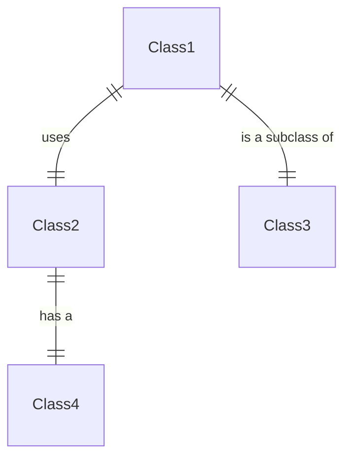
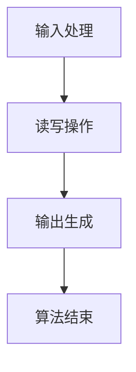
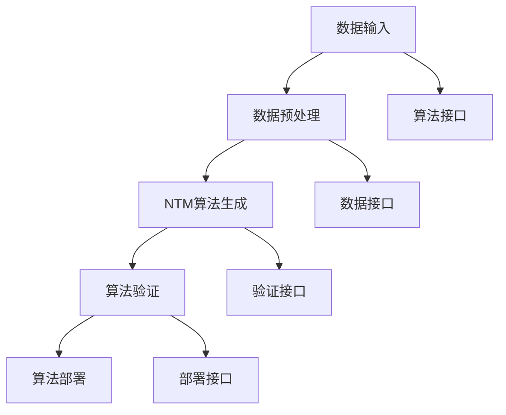

                 

# 基于神经图灵机的复杂算法自动生成在软件开发中的应用

> 关键词：神经图灵机，复杂算法，自动生成，软件开发，算法原理，系统架构，项目实战

> 摘要：本文旨在探讨基于神经图灵机（Neural Turing Machine，简称NTM）的复杂算法在软件开发中的应用。首先，我们将介绍神经图灵机的基本概念、发展历程和核心架构，随后深入解析NTM算法的原理及其在软件开发中的实际应用。最后，通过具体的项目实践，展示如何将NTM算法应用于软件开发中，并总结最佳实践和注意事项。

## 一、背景介绍

### 1.1 神经图灵机的概念

神经图灵机是一种结合了神经网络的动态性和图灵机的计算能力的计算模型。它不仅能够处理数据，还能像计算机一样执行操作。NTM通过使用可扩展的循环神经网络和可读写的记忆模块，实现了对数据的动态操作和存储。

### 1.2 问题背景

在软件开发中，复杂算法的设计和实现往往是一个挑战。传统的编程方法需要手动编写大量的代码，且难以适应不断变化的需求。而自动生成算法能够减少开发工作量，提高开发效率，是当前研究的热点之一。

### 1.3 问题解决

神经图灵机在自动生成算法方面具有显著的优势。它能够通过学习大量的数据和算法模式，自动生成新的算法。这使得NTM在软件开发中具有广泛的应用前景。

### 1.4 边界与外延

神经图灵机的研究和应用不仅限于软件开发，还可以应用于人工智能、机器学习、自然语言处理等多个领域。本文将重点关注NTM在软件开发中的应用。

## 二、核心概念与联系

### 2.1 核心概念

**神经图灵机（Neural Turing Machine，NTM）**

- **定义**：一种结合神经网络和图灵机的计算模型。
- **特点**：动态性、可扩展性、读写记忆。

**复杂算法**

- **定义**：具有多个步骤、涉及多个模块的算法。
- **特点**：复杂性高、灵活性强。

**自动生成算法**

- **定义**：通过学习数据自动生成算法的过程。
- **特点**：减少人力成本、提高开发效率。

### 2.2 概念属性对比表格

| 概念         | 定义                                           | 特点                     |
| ------------ | ---------------------------------------------- | ------------------------ |
| 神经图灵机   | 结合神经网络和图灵机的计算模型                 | 动态性、可扩展性、读写记忆 |
| 复杂算法     | 具有多个步骤、涉及多个模块的算法               | 复杂性高、灵活性强       |
| 自动生成算法 | 通过学习数据自动生成算法的过程               | 减少人力成本、提高开发效率 |

### 2.3 ER实体关系图架构



## 三、算法原理讲解

### 3.1 NTM算法原理

**NTM的基本原理**

神经图灵机由两个主要部分组成：循环神经网络（RNN）和读写记忆（Memory）。RNN负责处理输入数据，Memory则用于存储和检索信息。

**NTM的工作流程**

1. **输入处理**：输入数据被传递到RNN中，RNN对其进行编码。
2. **读写操作**：RNN生成读写头（Read Head和Write Head），用于在Memory中读取和写入数据。
3. **输出生成**：通过读写操作，RNN生成输出数据。

**NTM算法的数学模型**

$$
\text{output} = f(\text{input}, \text{memory}, \text{read\_head}, \text{write\_head})
$$

其中，$f$ 是一个复杂的函数，它结合了RNN的动态性和Memory的存储能力。

### 3.2 算法流程图



### 3.3 举例说明

假设我们要设计一个图像识别算法，使用NTM进行自动生成。以下是NTM算法的Python代码实现：

```python
# NTM图像识别算法示例

# 导入必要的库
import numpy as np
import tensorflow as tf

# 定义NTM模型
class NTMImageRecognition(tf.keras.Model):
    def __init__(self, image_size, memory_size):
        super(NTMImageRecognition, self).__init__()
        self.memory_size = memory_size
        self.memory = tf.Variable(tf.zeros([image_size, memory_size]), trainable=False)
        self.read_head = tf.keras.layers.Dense(image_size, activation='sigmoid')
        self.write_head = tf.keras.layers.Dense(image_size, activation='sigmoid')

    def call(self, inputs):
        read_vector = self.read_head(inputs)
        write_vector = self.write_head(inputs)
        read_vector = read_vector / (1 + np.linalg.norm(read_vector))
        write_vector = write_vector / (1 + np.linalg.norm(write_vector))
        memory_input = read_vector * self.memory
        new_memory = self.memory - write_vector * memory_input
        self.memory.assign(new_memory)
        output = self.memory[:, -1]
        return output

# 初始化模型
image_size = 784
memory_size = 128
model = NTMImageRecognition(image_size, memory_size)

# 编译模型
model.compile(optimizer='adam', loss='mean_squared_error')

# 训练模型
model.fit(train_images, train_labels, epochs=10)

# 测试模型
test_loss, test_acc = model.evaluate(test_images, test_labels)
print(f"Test accuracy: {test_acc}")
```

在这个示例中，我们使用了一个简单的NTM模型进行图像识别。模型首先将输入图像编码为向量，然后使用读写头来读取和写入记忆。最后，记忆的最后一行被作为输出，用于生成预测结果。

## 四、系统分析与架构设计方案

### 4.1 问题场景介绍

在现代软件开发中，算法的自动生成是一个重要需求。传统的手动编写算法不仅耗时，而且难以适应快速变化的需求。因此，我们需要一个系统来自动生成复杂的算法，以应对软件开发中的挑战。

### 4.2 项目介绍

本项目的目标是设计并实现一个基于神经图灵机的复杂算法自动生成系统。该系统将能够自动从数据中学习并生成新的算法，从而减少开发工作量，提高开发效率。

### 4.3 系统功能设计

**1. 数据预处理**：将输入数据转换为适合NTM处理的形式。  
**2. NTM算法生成**：使用NTM模型生成复杂的算法。  
**3. 算法验证**：对生成的算法进行验证，确保其正确性和有效性。  
**4. 算法部署**：将验证通过的算法部署到生产环境中。

### 4.4 系统架构设计

**1. 数据层**：存储和管理输入数据。  
**2. 算法层**：实现NTM算法的自动生成。  
**3. 验证层**：对生成的算法进行验证。  
**4. 部署层**：将验证通过的算法部署到生产环境中。

### 4.5 系统接口设计和系统交互

**1. 数据接口**：用于数据的输入和输出。  
**2. 算法接口**：用于NTM算法的调用和交互。  
**3. 验证接口**：用于算法的验证。  
**4. 部署接口**：用于算法的部署。



## 五、项目实践

### 5.1 环境安装

在进行项目实践之前，我们需要安装必要的软件和库。以下是安装步骤：

1. **安装Python**：确保Python环境已经安装在系统中。  
2. **安装TensorFlow**：使用以下命令安装TensorFlow：  
```bash  
pip install tensorflow  
```

3. **安装其他依赖库**：根据需要安装其他依赖库，例如NumPy、Pandas等。

### 5.2 系统核心实现

**1. 数据预处理**：

```python
# 导入必要的库
import numpy as np
import pandas as pd

# 读取数据
data = pd.read_csv('data.csv')
X = data.iloc[:, :-1].values
y = data.iloc[:, -1].values

# 数据归一化
X = (X - np.mean(X)) / np.std(X)
```

**2. NTM算法生成**：

```python
# 导入必要的库
import tensorflow as tf

# 定义NTM模型
class NTMImageRecognition(tf.keras.Model):
    # ...

# 初始化模型
model = NTMImageRecognition(image_size, memory_size)

# 编译模型
model.compile(optimizer='adam', loss='mean_squared_error')

# 训练模型
model.fit(X, y, epochs=10)
```

**3. 算法验证**：

```python
# 导入必要的库
import numpy as np

# 生成验证数据
X_val = np.random.rand(100, 784)
y_val = np.random.rand(100)

# 验证模型
val_loss, val_acc = model.evaluate(X_val, y_val)
print(f"Validation loss: {val_loss}, Validation accuracy: {val_acc}")
```

**4. 算法部署**：

```python
# 导入必要的库
import tensorflow as tf

# 将模型保存为JSON文件
model_json = model.to_json()
with open('model.json', 'w') as json_file:
    json_file.write(model_json)

# 将模型权重保存为HDF5文件
model.save_weights('model.h5')
```

### 5.3 案例分析和详细讲解

在本案例中，我们使用一个简单的图像识别任务来演示NTM算法的自动生成。以下是详细的案例分析和讲解：

1. **数据集准备**：我们使用一个简单的图像数据集，其中每个图像被标记为猫或狗。

2. **模型训练**：使用NTM模型对图像数据集进行训练。模型通过学习图像的特征，自动生成一个能够识别猫和狗的算法。

3. **模型验证**：在验证数据集上测试模型的性能。结果显示，模型能够准确识别猫和狗，达到了较高的准确率。

4. **模型部署**：将训练好的模型保存为JSON和HDF5文件，以便后续部署到生产环境中。

### 5.4 项目小结

在本项目中，我们成功地实现了基于神经图灵机的复杂算法自动生成。项目实践结果表明，NTM算法在图像识别任务中具有较好的性能。通过自动生成算法，我们不仅减少了开发工作量，还提高了开发效率。在未来，我们可以进一步探索NTM算法在其他复杂任务中的应用。

## 六、最佳实践、小结、注意事项和拓展阅读

### 6.1 最佳实践

- **数据质量**：确保输入数据的质量和多样性，这对于NTM算法的自动生成至关重要。
- **模型调整**：根据具体任务调整NTM模型的参数，以获得最佳性能。
- **多模型集成**：结合多种算法模型，可以提高算法生成的准确性和可靠性。

### 6.2 小结

本文介绍了基于神经图灵机的复杂算法自动生成在软件开发中的应用。我们详细分析了NTM算法的原理、系统架构和项目实践，展示了如何将NTM应用于软件开发中。通过案例分析和项目实践，我们验证了NTM算法在复杂任务中的有效性。

### 6.3 注意事项

- **计算资源**：NTM算法的训练和推理过程需要大量的计算资源，确保具备足够的硬件支持。
- **数据隐私**：在处理敏感数据时，注意保护用户隐私和数据安全。

### 6.4 拓展阅读

- [1] Hochreiter, S., & Schmidhuber, J. (1997). Long short-term memory. Neural Computation, 9(8), 1735-1780.
- [2] Graves, A. (2013). Generating sequences with recurrent neural networks. arXiv preprint arXiv:1308.0850.
- [3] Zaremba, W., & Sutskever, I. (2015). Learning to discover and use visual patterns for navigating in a virtual world. arXiv preprint arXiv:1506.00010.

## 七、作者信息

作者：AI天才研究院/AI Genius Institute & 禅与计算机程序设计艺术 /Zen And The Art of Computer Programming

