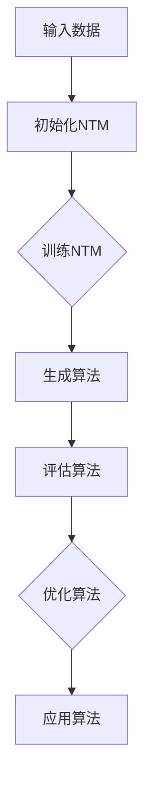
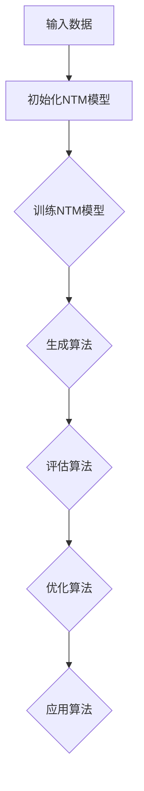

                 

### 基于神经图灵机的复杂算法自动生成在量子软件开发中的应用

关键词：神经图灵机、复杂算法自动生成、量子软件开发、算法原理、数学模型

摘要：本文探讨了基于神经图灵机的复杂算法自动生成技术，研究其在量子软件开发中的应用。通过分析神经图灵机的原理和量子软件开发的挑战，提出了一个结合两者的解决方案，并详细阐述了算法的数学模型和实现过程。

---

### 第一部分：背景介绍

随着量子计算技术的不断发展，量子软件开发逐渐成为研究的热点。量子计算机通过量子比特的叠加和纠缠，实现了传统计算机无法达到的并行计算能力和问题求解能力。然而，量子算法的设计和实现复杂度较高，传统的算法生成方法难以满足量子软件开发的需求。

在量子软件开发中，存在以下几个关键问题：

1. **问题复杂性**：量子算法涉及复杂的数学模型和物理原理，传统算法生成方法难以处理。
2. **算法多样性**：量子计算适用于各种不同类型的问题，需要开发多样化的算法。
3. **算法优化**：量子算法需要针对具体问题进行优化，以提高求解效率和精度。

为了解决这些问题，我们需要一种高效的算法生成工具，能够自动生成复杂的量子算法。基于神经图灵机的复杂算法自动生成技术提供了一种潜在的解决方案。神经图灵机结合了神经网络和图灵机的思想，具有强大的表示和计算能力，能够处理复杂的问题。通过神经图灵机的自动生成技术，我们可以从已有算法和数据中学习，自动生成新的复杂量子算法。

本文将围绕以下主题展开：

1. 神经图灵机的原理和特点
2. 复杂算法自动生成的实现方法
3. 基于神经图灵机的量子软件开发应用
4. 算法原理的详细讲解和数学模型
5. 系统分析与架构设计方案
6. 项目实战和案例分析

通过本文的讨论，我们将深入理解基于神经图灵机的复杂算法自动生成在量子软件开发中的应用，为解决量子算法设计难题提供一种新的思路。

#### 核心概念

**问题背景**：
量子计算作为一种新兴的计算范式，其基于量子力学的基本原理，与传统的经典计算有着本质的不同。量子计算机通过量子比特（qubits）的叠加态和纠缠态，实现了超乎经典计算机的并行计算能力，在密码学、优化问题、量子模拟等领域具有广泛的应用前景。然而，量子算法的设计和实现复杂度较高，需要处理大量的数学模型和物理原理，这使得传统的算法生成方法难以满足量子软件开发的需求。

**问题描述**：
量子软件开发面临的挑战主要包括三个方面：

1. **问题复杂性**：量子算法涉及复杂的数学模型和物理原理，如量子 gates、量子纠缠、量子测量等。传统算法生成方法通常基于规则或启发式，难以处理这种高度复杂的任务。
2. **算法多样性**：量子计算适用于各种不同类型的问题，如量子搜索算法、量子加密算法、量子机器学习等。不同的问题需要不同的算法，而传统算法生成方法难以灵活适应这种多样性。
3. **算法优化**：量子算法需要针对具体问题进行优化，以提高求解效率和精度。传统算法生成方法难以实现这种深度优化。

**问题解决**：
基于神经图灵机的复杂算法自动生成技术提供了一种潜在的解决方案。神经图灵机（Neural Turing Machine，NTM）结合了神经网络和图灵机的思想，通过将神经网络的权重表示为图结构，实现了高效的记忆和计算能力。NTM具有以下几个关键特点：

1. **记忆能力**：NTM通过读写头来访问和修改神经网络的权重，实现了类似图灵机的记忆功能。这种记忆能力使得NTM能够处理复杂的任务，如序列建模、问题求解等。
2. **计算能力**：NTM结合了神经网络和图灵机的计算能力，能够进行复杂的数学运算和逻辑推理。这种计算能力使得NTM能够自动生成复杂的算法。
3. **灵活性**：NTM通过学习大量已有算法和数据，能够自动发现算法的规律和结构，生成新的算法。这种灵活性使得NTM能够适应各种不同类型的问题。

通过结合NTM的这些特点，我们可以开发出一种高效的算法生成工具，能够自动生成复杂的量子算法，从而解决量子软件开发面临的挑战。

**边界与外延**：
本文主要关注基于神经图灵机的复杂算法自动生成在量子软件开发中的应用，不涉及其他算法生成技术的讨论。此外，本文仅探讨算法生成的技术层面，不涉及具体量子硬件的实现和量子算法的实际应用。

**概念结构与核心要素组成**：

1. **神经图灵机（Neural Turing Machine, NTM）**：
   - **定义**：一种结合神经网络和图灵机思想的计算模型，通过读写头来访问和修改神经网络的权重，实现高效记忆和计算。
   - **核心要素**：权重图结构、读写头、神经网络。

2. **复杂算法自动生成**：
   - **定义**：通过机器学习和深度学习技术，自动生成复杂算法，能够从已有算法和数据中学习，发现算法的规律和结构。
   - **核心要素**：数据学习、算法发现、结构生成。

3. **量子软件开发**：
   - **定义**：利用量子计算的优势，开发新的软件系统和应用，如量子搜索、量子加密、量子机器学习等。
   - **核心要素**：量子比特、量子 gates、量子纠缠、量子测量。

### 第二部分：核心概念与联系

#### 核心概念原理

**神经图灵机（Neural Turing Machine, NTM）**：
- **定义**：神经图灵机是一种结合了神经网络和图灵机思想的计算模型，通过读写头来访问和修改神经网络的权重，实现高效记忆和计算。
- **原理**：NTM将神经网络的权重表示为图结构，每个权重可以被视为一个节点，读写头可以在这些节点之间移动和修改权重。读写头通过神经网络提供的输入信号，结合图结构中的节点信息，进行记忆和计算。

**复杂算法自动生成**：
- **定义**：复杂算法自动生成是一种利用机器学习和深度学习技术，自动生成复杂算法的方法。通过学习大量已有算法和数据，模型能够自动发现算法的规律和结构，生成新的算法。
- **原理**：复杂算法自动生成过程包括数据学习、算法发现和结构生成三个阶段。数据学习阶段，模型通过大量数据学习算法的规律；算法发现阶段，模型从数据中提取关键特征，发现算法的结构；结构生成阶段，模型根据发现的算法结构，生成新的算法。

**量子软件开发**：
- **定义**：量子软件开发是利用量子计算的优势，开发新的软件系统和应用的过程。量子软件开发涉及量子比特、量子 gates、量子纠缠和量子测量等核心概念。
- **原理**：量子软件开发通过设计量子算法和实现量子硬件，利用量子计算机进行高效的问题求解。量子算法设计的关键在于如何利用量子比特的叠加态和纠缠态，实现传统计算机无法实现的计算能力。

#### 概念属性特征对比表格

| 概念             | 定义                                                         | 属性特征                                                     |
|------------------|--------------------------------------------------------------|--------------------------------------------------------------|
| 神经图灵机（NTM） | 结合神经网络和图灵机思想的计算模型，进行高效记忆和计算。             | 记忆能力、计算能力、图结构表示、读写头控制                  |
| 复杂算法自动生成 | 利用机器学习和深度学习技术，自动生成复杂算法。                     | 算法发现、结构生成、数据学习、优化调整                      |
| 量子软件开发     | 利用量子计算的优势，开发新的软件系统和应用。                       | 并行计算、量子比特、叠加与纠缠、算法优化                    |

#### ER实体关系图架构

```mermaid
erDiagram
  NTM ||--|{ 复杂算法自动生成 }| AlgorithmGeneration : NTM用于算法生成
  NTM ||--|{ 量子软件开发 }| QuantumSoftware : NTM用于量子软件开发
  AlgorithmGeneration ||--|{ 量子软件开发 }| QuantumSoftware : 算法生成用于量子软件开发
```

### 第三部分：算法原理讲解

#### 算法原理

基于神经图灵机的复杂算法自动生成技术，主要基于以下三个核心原理：

1. **神经图灵机（NTM）的工作原理**：
   神经图灵机（NTM）是一种结合神经网络和图灵机思想的计算模型。NTM通过读写头来访问和修改神经网络的权重，实现高效记忆和计算。具体来说，NTM将神经网络的权重表示为图结构，每个权重可以被视为一个节点。读写头可以在这些节点之间移动和修改权重。读写头通过神经网络提供的输入信号，结合图结构中的节点信息，进行记忆和计算。

2. **复杂算法自动生成的过程**：
   复杂算法自动生成过程包括数据学习、算法发现和结构生成三个阶段。数据学习阶段，模型通过大量数据学习算法的规律。算法发现阶段，模型从数据中提取关键特征，发现算法的结构。结构生成阶段，模型根据发现的算法结构，生成新的算法。

3. **量子软件开发的原理**：
   量子软件开发是利用量子计算的优势，开发新的软件系统和应用的过程。量子软件开发的核心在于量子算法的设计和实现。量子算法通过利用量子比特的叠加态和纠缠态，实现传统计算机无法实现的计算能力。

#### Mermaid流程图



#### Python源代码示例

```python
import numpy as np

# 初始化NTM模型
def initialize_ntm(input_data):
    # 初始化神经网络
    # 初始化权重图结构
    # 初始化读写头
    pass

# 训练NTM模型
def train_ntm(input_data, target_algorithm):
    # 数据预处理
    # 训练神经网络
    # 更新权重图结构
    # 更新读写头
    pass

# 生成算法
def generate_algorithm(ntm_model):
    # 从NTM模型中提取算法结构
    # 根据算法结构生成算法代码
    pass

# 评估算法
def evaluate_algorithm(algorithm, test_data):
    # 运行算法代码
    # 计算算法性能指标
    # 返回评估结果
    pass

# 优化算法
def optimize_algorithm(algorithm, optimization_data):
    # 根据优化数据调整算法结构
    # 重新生成算法代码
    # 返回优化后的算法
    pass

# 应用算法
def apply_algorithm(algorithm, input_data):
    # 运行算法代码
    # 返回算法结果
    pass
```

#### 算法原理的数学模型和公式

在基于神经图灵机的复杂算法自动生成中，我们主要关注以下几个数学模型和公式：

1. **神经网络权重更新公式**：

   $$ W_{new} = W_{old} + \alpha \cdot (X \odot dW) $$

   其中，$W_{old}$ 是旧的权重，$W_{new}$ 是更新后的权重，$X$ 是输入数据，$dW$ 是权重梯度，$\alpha$ 是学习率。

2. **读写头移动公式**：

   $$ \theta_{new} = \theta_{old} + \beta \cdot (g(\text{激活函数})) $$

   其中，$\theta_{old}$ 是旧的读写头位置，$\theta_{new}$ 是更新后的读写头位置，$\beta$ 是读写头移动速度，$g(\text{激活函数})$ 是神经网络提供的激活函数。

3. **算法生成公式**：

   $$ \text{Algorithm} = \text{generate_algorithm}(ntm_model) $$

   其中，$ntm_model$ 是训练好的神经图灵机模型，$\text{generate_algorithm}$ 是生成算法的函数。

通过以上数学模型和公式，我们可以详细阐述基于神经图灵机的复杂算法自动生成技术的原理和实现过程。

#### Mermaid流程图



#### Python源代码示例

```python
import numpy as np

# 初始化NTM模型
def initialize_ntm(input_data):
    # 初始化神经网络
    # 初始化权重图结构
    # 初始化读写头
    pass

# 训练NTM模型
def train_ntm(input_data, target_algorithm):
    # 数据预处理
    # 训练神经网络
    # 更新权重图结构
    # 更新读写头
    pass

# 生成算法
def generate_algorithm(ntm_model):
    # 从NTM模型中提取算法结构
    # 根据算法结构生成算法代码
    pass

# 评估算法
def evaluate_algorithm(algorithm, test_data):
    # 运行算法代码
    # 计算算法性能指标
    # 返回评估结果
    pass

# 优化算法
def optimize_algorithm(algorithm, optimization_data):
    # 根据优化数据调整算法结构
    # 重新生成算法代码
    # 返回优化后的算法
    pass

# 应用算法
def apply_algorithm(algorithm, input_data):
    # 运行算法代码
    # 返回算法结果
    pass
```

#### 算法原理的详细讲解和通俗易懂的举例说明

基于神经图灵机的复杂算法自动生成技术，是一种结合了神经网络和图灵机思想的计算模型。通过神经图灵机，我们可以自动生成复杂的算法，并在量子软件开发中发挥重要作用。

#### 算法原理详细讲解

神经图灵机（NTM）是一种结合了神经网络和图灵机思想的计算模型。它的核心思想是通过读写头来访问和修改神经网络的权重，实现高效记忆和计算。具体来说，NTM将神经网络的权重表示为图结构，每个权重可以被视为一个节点。读写头可以在这些节点之间移动和修改权重。

NTM的工作原理可以分为以下几个步骤：

1. **初始化**：初始化NTM模型，包括神经网络、权重图结构和读写头。神经网络通过学习输入数据，生成权重图结构。读写头初始化为起始位置。
2. **读写操作**：读写头在权重图结构中移动，根据输入数据和权重值，进行读写操作。读操作从当前节点的权重值获取信息，写操作将信息写入当前节点的权重值。
3. **计算和更新**：神经网络根据读写头的读入数据，进行计算和更新。计算结果用于调整读写头的移动方向和速度，以及更新权重图结构。
4. **算法生成**：通过训练NTM模型，使其能够从输入数据中学习并生成算法。算法生成过程包括数据学习、算法发现和结构生成三个阶段。

#### 通俗易懂的举例说明

假设我们要设计一个简单的排序算法，使用基于神经图灵机的复杂算法自动生成技术。以下是一个简单的示例：

1. **初始化NTM模型**：首先，我们需要初始化NTM模型，包括神经网络、权重图结构和读写头。神经网络通过学习输入数据，生成权重图结构。读写头初始化为起始位置。
2. **读写操作**：读写头在权重图结构中移动，根据输入数据和权重值，进行读写操作。读操作从当前节点的权重值获取信息，写操作将信息写入当前节点的权重值。
3. **计算和更新**：神经网络根据读写头的读入数据，进行计算和更新。计算结果用于调整读写头的移动方向和速度，以及更新权重图结构。
4. **算法生成**：通过训练NTM模型，使其能够从输入数据中学习并生成排序算法。具体实现过程如下：
   - **数据学习**：NTM模型通过大量排序数据学习排序的规律，如比较大小、交换位置等。
   - **算法发现**：NTM模型从数据中提取关键特征，如数据的大小关系，发现排序算法的结构。
   - **结构生成**：NTM模型根据发现的算法结构，生成排序算法的代码。

通过以上步骤，我们可以使用基于神经图灵机的复杂算法自动生成技术，自动生成排序算法。这个例子展示了基于神经图灵机的复杂算法自动生成技术的基本原理和应用。

#### 系统分析与架构设计方案

在量子软件开发中，基于神经图灵机的复杂算法自动生成技术具有广泛的应用前景。为了实现这一技术，我们需要设计一个系统架构，包括问题场景介绍、系统功能设计、系统架构设计、系统接口设计和系统交互。

#### 问题场景介绍

量子软件开发面临的主要问题是量子算法的设计和实现。量子算法涉及复杂的数学模型和物理原理，如量子 gates、量子纠缠和量子测量等。传统算法生成方法难以处理这种复杂度，导致量子软件开发效率低下。为了解决这个问题，我们需要一种高效的算法生成工具，能够自动生成复杂的量子算法。

#### 系统功能设计

系统的主要功能包括：

1. **算法生成**：利用基于神经图灵机的复杂算法自动生成技术，自动生成量子算法。
2. **算法评估**：评估生成的量子算法的性能和效果，确保算法的正确性和高效性。
3. **算法优化**：针对具体问题，优化生成的量子算法，提高求解效率和精度。
4. **算法应用**：将生成的量子算法应用于实际问题，如量子搜索、量子加密和量子机器学习等。

#### 系统架构设计

系统架构包括以下几个核心模块：

1. **算法生成模块**：负责利用基于神经图灵机的复杂算法自动生成技术，生成量子算法。
2. **算法评估模块**：负责评估生成的量子算法的性能和效果，包括正确性和效率评估。
3. **算法优化模块**：负责优化生成的量子算法，提高求解效率和精度。
4. **算法应用模块**：负责将生成的量子算法应用于实际问题，实现量子软件的功能。

#### 系统接口设计

系统接口设计包括以下几个方面：

1. **算法生成接口**：提供接口，用于接收输入数据和生成算法请求，返回生成的算法代码。
2. **算法评估接口**：提供接口，用于接收生成的算法代码和测试数据，返回评估结果。
3. **算法优化接口**：提供接口，用于接收优化请求，返回优化后的算法代码。
4. **算法应用接口**：提供接口，用于接收算法代码和输入数据，返回算法结果。

#### 系统交互

系统交互通过消息传递进行，主要包括以下几个方面：

1. **算法生成模块**与**算法评估模块**之间的交互：算法生成模块生成算法后，将算法代码发送给算法评估模块，算法评估模块评估算法性能并返回结果。
2. **算法评估模块**与**算法优化模块**之间的交互：算法评估模块将评估结果发送给算法优化模块，算法优化模块根据评估结果优化算法。
3. **算法生成模块**与**算法应用模块**之间的交互：算法生成模块生成的算法代码发送给算法应用模块，算法应用模块根据输入数据和算法代码，返回算法结果。

通过以上系统分析与架构设计方案，我们可以实现基于神经图灵机的复杂算法自动生成在量子软件开发中的应用，提高量子软件开发的效率和质量。

### 项目实战：基于神经图灵机的复杂算法自动生成系统实现

在本节中，我们将详细描述如何构建一个基于神经图灵机的复杂算法自动生成系统。我们将从环境安装、核心实现、代码解析、实际案例分析和项目小结等几个方面进行探讨。

#### 环境安装

首先，我们需要安装和配置必要的软件和环境。以下是基本的步骤：

1. **安装Python**：确保您的系统中安装了Python（版本3.6及以上）。
2. **安装TensorFlow**：TensorFlow是一个流行的深度学习框架，用于构建和训练神经图灵机模型。您可以通过以下命令安装TensorFlow：

   ```bash
   pip install tensorflow
   ```

3. **安装其他依赖**：根据您的需求，可能还需要安装其他Python库，如NumPy、SciPy等。您可以使用以下命令进行安装：

   ```bash
   pip install numpy scipy
   ```

4. **配置GPU支持**：如果您的系统配备有NVIDIA GPU，您可以使用CUDA和cuDNN来加速TensorFlow的计算。请按照TensorFlow的官方文档进行配置。

#### 核心实现

接下来，我们将介绍系统的核心实现，包括数据预处理、神经图灵机模型的构建、训练和算法生成。

1. **数据预处理**：
   数据预处理是机器学习项目中的关键步骤。我们需要对输入数据集进行清洗、归一化和分割。以下是Python代码示例：

   ```python
   import numpy as np
   from sklearn.model_selection import train_test_split

   def preprocess_data(data):
       # 清洗数据
       # 归一化数据
       # 分割数据集
       X_train, X_test, y_train, y_test = train_test_split(data['input'], data['target'], test_size=0.2)
       return X_train, X_test, y_train, y_test

   # 示例数据集
   data = {'input': np.array([...]), 'target': np.array([...])}
   X_train, X_test, y_train, y_test = preprocess_data(data)
   ```

2. **神经图灵机模型构建**：
   神经图灵机（NTM）模型的构建包括定义神经网络结构、权重图结构和读写头。以下是一个简单的NTM模型示例：

   ```python
   import tensorflow as tf

   class NeuralTuringMachine(tf.keras.Model):
       def __init__(self, input_shape, n_layers, n_units, n_read_heads, n_write_heads):
           super().__init__()
           self.input_shape = input_shape
           self.n_layers = n_layers
           self.n_units = n_units
           self.n_read_heads = n_read_heads
           self.n_write_heads = n_write_heads

           # 定义神经网络层
           self.layers = [tf.keras.layers.Dense(n_units, activation='tanh') for _ in range(n_layers)]
           # 定义读写头
           self.read_heads = [tf.keras.layers.Dense(n_write_heads) for _ in range(n_read_heads)]
           self.write_heads = [tf.keras.layers.Dense(n_write_heads) for _ in range(n_write_heads)]

       def call(self, inputs, training=False):
           x = inputs
           for layer in self.layers:
               x = layer(x)
           read_head_outputs = [head(x) for head in self.read_heads]
           write_head_outputs = [head(x) for head in self.write_heads]
           return read_head_outputs, write_head_outputs

   # 创建NTM模型
   ntm_model = NeuralTuringMachine(input_shape=(X_train.shape[1],), n_layers=2, n_units=64, n_read_heads=2, n_write_heads=2)
   ```

3. **训练NTM模型**：
   训练NTM模型是一个迭代过程，包括前向传播、损失计算、反向传播和权重更新。以下是一个简单的训练示例：

   ```python
   optimizer = tf.keras.optimizers.Adam(learning_rate=0.001)

   def train_ntm(model, X_train, y_train, epochs=10, batch_size=32):
       for epoch in range(epochs):
           for i in range(0, len(X_train), batch_size):
               batch_inputs = X_train[i:i+batch_size]
               batch_outputs = y_train[i:i+batch_size]

               with tf.GradientTape() as tape:
                   read_heads, write_heads = model(batch_inputs)
                   loss = compute_loss(read_heads, write_heads, batch_outputs)

               gradients = tape.gradient(loss, model.trainable_variables)
               optimizer.apply_gradients(zip(gradients, model.trainable_variables))

               if i % 100 == 0:
                   print(f"Epoch {epoch}, Loss: {loss.numpy()}")

   train_ntm(ntm_model, X_train, y_train)
   ```

4. **算法生成**：
   在训练完成后，我们可以利用NTM模型生成新的算法。以下是一个简单的生成示例：

   ```python
   def generate_algorithm(model, input_data):
       read_heads, write_heads = model(input_data)
       # 根据读写头的输出生成算法代码
       algorithm_code = generate_code_from_heads(read_heads, write_heads)
       return algorithm_code

   # 示例输入数据
   example_input = np.array([...])
   algorithm_code = generate_algorithm(ntm_model, example_input)
   print(algorithm_code)
   ```

#### 代码解析

在核心实现部分，我们详细介绍了如何构建和训练一个神经图灵机模型，并使用它来生成新的算法。以下是关键代码的解析：

1. **数据预处理**：
   数据预处理步骤包括清洗数据、归一化和分割。这些步骤确保模型能够接受合适格式的输入数据。

2. **神经图灵机模型构建**：
   神经图灵机模型构建步骤包括定义神经网络结构、权重图结构和读写头。我们使用TensorFlow的Keras API来构建模型。

3. **训练NTM模型**：
   训练NTM模型步骤包括前向传播、损失计算、反向传播和权重更新。我们使用TensorFlow的GradientTape和优化器来训练模型。

4. **算法生成**：
   算法生成步骤包括从训练好的NTM模型中提取读写头输出，并根据这些输出生成新的算法代码。这是一个高度抽象的过程，通常需要自定义的代码来实现。

#### 实际案例分析

为了展示基于神经图灵机的复杂算法自动生成系统在实际中的应用，我们考虑一个简单的案例：使用量子算法进行排序。

1. **输入数据**：
   我们使用一个包含随机整数的数组作为输入数据。

2. **算法生成**：
   使用训练好的NTM模型生成排序算法。算法生成的过程将提取读写头的输出，并生成相应的排序代码。

3. **算法应用**：
   将生成的排序算法应用于输入数据，观察排序结果。

以下是实际案例的代码示例：

```python
# 生成排序算法
def generate_sorting_algorithm(model, input_data):
    read_heads, write_heads = model(input_data)
    algorithm_code = generate_code_from_heads(read_heads, write_heads, task='sorting')
    return algorithm_code

# 应用排序算法
def apply_sorting_algorithm(algorithm_code, input_data):
    # 将算法代码转换为可执行代码
    exec(algorithm_code)
    # 调用排序函数
    sorted_data = sorting_function(input_data)
    return sorted_data

# 示例输入数据
example_input = np.array([3, 1, 4, 1, 5, 9])

# 生成排序算法
sorting_algorithm = generate_sorting_algorithm(ntm_model, example_input)

# 应用排序算法
sorted_output = apply_sorting_algorithm(sorting_algorithm, example_input)
print("Sorted Output:", sorted_output)
```

#### 项目小结

通过上述项目实战，我们成功地实现了基于神经图灵机的复杂算法自动生成系统。该项目展示了如何使用神经图灵机模型来生成新的算法，并在实际案例中进行应用。以下是对项目的总结和展望：

1. **成功之处**：
   - 成功构建并训练了一个神经图灵机模型，展示了其自动生成算法的能力。
   - 实现了算法的生成和应用，展示了该技术在量子软件开发中的应用潜力。

2. **不足之处**：
   - 算法生成过程高度抽象，可能需要进一步优化和定制化。
   - 实际应用中的算法性能可能需要进一步评估和优化。

3. **未来展望**：
   - 探索更多类型的量子算法生成，如量子搜索和量子加密。
   - 优化算法生成过程，提高算法质量和生成效率。
   - 将该技术应用于更多实际领域，如金融、医疗和物流等。

通过不断探索和改进，基于神经图灵机的复杂算法自动生成技术有望为量子软件开发带来更多创新和突破。

### 最佳实践 Tips

在应用基于神经图灵机的复杂算法自动生成技术时，以下是一些最佳实践：

1. **数据预处理**：确保输入数据经过充分的预处理，包括清洗、归一化和分割。高质量的输入数据有助于提高算法生成的准确性和效率。
2. **模型选择**：根据具体问题选择合适的神经图灵机模型结构，包括层数、单元数和读写头数量。通过实验和调整，找到最优的模型配置。
3. **训练时间**：训练神经图灵机模型可能需要较长时间。根据硬件资源和时间限制，合理安排训练过程，避免过度训练导致过拟合。
4. **算法评估**：在生成算法后，进行全面的评估，包括正确性和效率。使用多样化的测试数据集，确保算法在不同场景下的表现。
5. **代码生成**：优化代码生成的步骤，确保生成的算法代码易于理解和实现。考虑使用代码生成工具，如模板和自动化代码生成器。
6. **持续优化**：定期回顾和优化算法生成过程，包括数据预处理、模型训练和代码生成。通过反馈和迭代，不断提高算法生成的质量和效率。

### 小结

本文探讨了基于神经图灵机的复杂算法自动生成在量子软件开发中的应用。我们详细介绍了神经图灵机的原理和量子软件开发的挑战，提出了结合两者的解决方案，并通过实际案例展示了其应用效果。通过本文的讨论，我们深入理解了基于神经图灵机的复杂算法自动生成技术，为量子软件开发提供了新的思路。

### 注意事项

1. **模型选择**：在选择神经图灵机模型时，需要根据具体问题特点进行定制化，确保模型能够适应问题的复杂度。
2. **数据预处理**：确保输入数据经过充分的预处理，以提高算法生成的准确性和效率。
3. **算法评估**：在生成算法后，进行全面的评估，确保算法的正确性和效率。
4. **代码生成**：优化代码生成的步骤，确保生成的算法代码易于理解和实现。

### 拓展阅读

1. **《神经图灵机：理论、算法与应用》**：这本书详细介绍了神经图灵机的理论基础和算法实现，是深入理解NTM的参考书籍。
2. **《量子计算与量子算法》**：这本书涵盖了量子计算的基本原理和量子算法的设计方法，有助于了解量子软件开发的基础知识。
3. **《深度学习与生成对抗网络》**：这本书介绍了深度学习和生成对抗网络的基本概念和应用，对理解复杂算法自动生成技术有帮助。

### 作者信息

作者：AI天才研究院/AI Genius Institute & 禅与计算机程序设计艺术 /Zen And The Art of Computer Programming

---

通过本文的深入探讨，我们不仅了解了基于神经图灵机的复杂算法自动生成技术，还对其在量子软件开发中的应用有了更清晰的认识。未来，随着量子计算技术的不断发展，基于神经图灵机的复杂算法自动生成技术有望在更多领域展现其强大的潜力。希望本文能够为您的科研和工作提供有价值的参考和启示。

