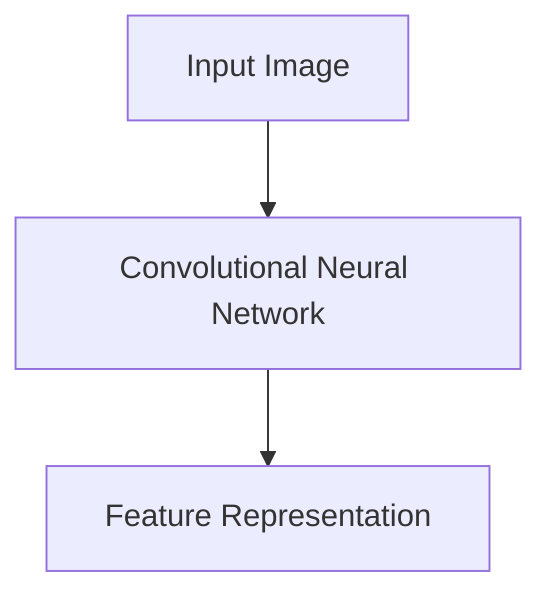
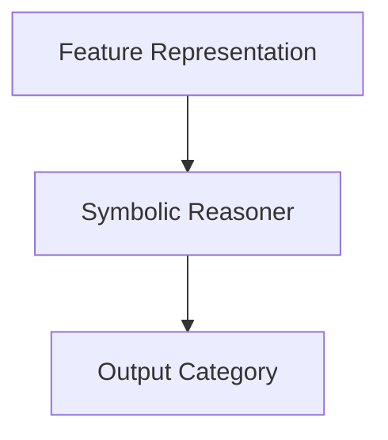
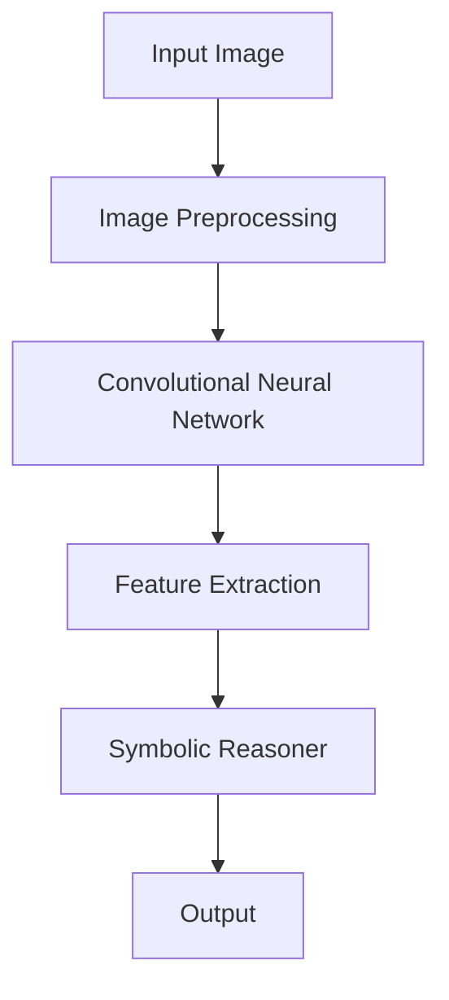
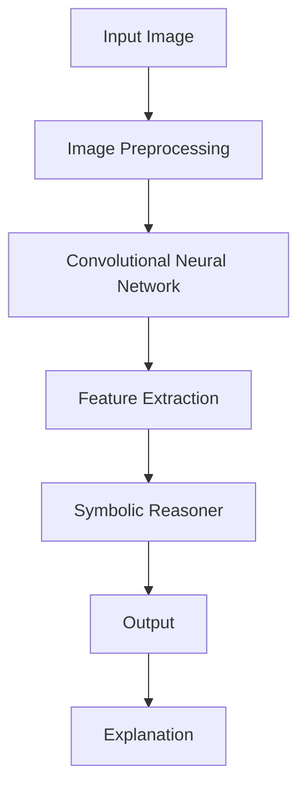

                 

# 基于神经符号推理的可解释AI系统优化设计

## 关键词
- 神经符号推理
- 可解释AI系统
- 优化设计
- 计算复杂性
- 实际应用场景

## 摘要
本文旨在探讨基于神经符号推理的可解释AI系统的优化设计。随着人工智能技术的快速发展，AI系统在各个领域的应用日益广泛，然而，模型的可解释性和安全性问题成为了当前研究的热点和需求。本文首先介绍了神经符号推理的概念和原理，然后详细阐述了系统优化设计的方法，并通过实际案例分析了基于神经符号推理的可解释AI系统的优势和挑战。最后，本文展望了未来在该领域的研究方向和发展趋势。

### 第一部分：背景介绍

#### 1.1 问题背景
随着人工智能技术的飞速发展，AI系统在各个领域的应用日益广泛。从自然语言处理、计算机视觉到自动驾驶、医疗诊断，AI系统都在发挥着重要的作用。然而，现有AI系统在模型的可解释性和安全性方面存在诸多挑战。传统的黑盒模型，如深度神经网络，虽然能够在某些任务上取得很好的性能，但其决策过程往往难以解释。这种不可解释性使得模型在关键领域，如医疗、金融等的应用中受到限制。因此，开发基于神经符号推理的可解释AI系统，已成为当前研究的热点和需求。

#### 1.2 问题描述
本著作旨在探讨基于神经符号推理的可解释AI系统的优化设计，旨在解决以下几个核心问题：

1. **神经符号推理的概念和原理**：如何定义神经符号推理，其基本原理是什么？
2. **系统优化设计方法**：如何通过优化设计提高系统的性能和可解释性？
3. **实际应用场景**：基于神经符号推理的可解释AI系统在哪些场景中具有优势？
4. **挑战与展望**：在开发和应用过程中面临的挑战及其未来发展趋势。

#### 1.3 问题解决
本书将通过以下方式解决上述问题：

1. **系统性地介绍神经符号推理**：从基本概念、原理出发，深入讲解其在AI系统中的重要性。
2. **详细阐述优化设计方法**：通过理论和实践结合，介绍多种优化设计策略，如参数调整、模型压缩、量化等。
3. **案例分析**：结合实际应用案例，分析基于神经符号推理的可解释AI系统的优势和挑战。
4. **展望未来**：探讨当前技术发展趋势，以及未来可能的突破方向。

#### 1.4 边界与外延
1. **边界**：本书主要讨论基于神经符号推理的可解释AI系统的优化设计，不涉及其他类型的AI系统。
2. **外延**：本书内容可以扩展到其他可解释AI系统的设计优化，以及与神经符号推理相关的其他领域研究。

#### 1.5 概念结构与核心要素组成
- **神经符号推理**：结合神经计算和符号推理，实现人工智能的可解释性。
- **优化设计**：包括参数优化、模型压缩、量化等，以提高系统性能和可解释性。
- **应用场景**：如医疗诊断、金融风险评估、自动驾驶等，这些场景对模型的可解释性有较高要求。
- **挑战**：如计算复杂度、数据隐私、模型压缩与性能平衡等。

### 第二部分：核心概念与联系

#### 2.1 神经符号推理的概念
神经符号推理是一种结合神经计算和符号推理的AI系统，旨在提高模型的可解释性和鲁棒性。它通过神经计算获取特征表示，再利用符号推理进行决策和解释。

#### 2.2 神经符号推理的基本原理
神经符号推理的基本原理包括：

1. **神经计算**：通过神经网络从数据中提取特征表示。
2. **符号推理**：利用符号逻辑和推理规则，对提取的特征进行解释和推理。

#### 2.3 神经符号推理的核心特点
1. **可解释性**：通过符号推理过程，使得模型的决策过程更加透明和可解释。
2. **鲁棒性**：结合神经计算和符号推理，提高模型对噪声和异常数据的处理能力。

#### 2.4 神经符号推理与传统AI的区别
与传统AI系统（如深度学习模型）相比，神经符号推理具有以下区别：

1. **可解释性**：神经符号推理通过符号推理提供明确的解释，而深度学习模型往往难以解释其决策过程。
2. **鲁棒性**：神经符号推理结合神经计算和符号推理，提高模型对异常数据的处理能力。

#### 2.5 核心概念属性特征对比表格

| 概念       | 神经符号推理              | 深度学习模型           |
|------------|--------------------------|-----------------------|
| 可解释性   | 高                      | 低                    |
| 鲁棒性     | 较高                    | 一般                  |
| 计算复杂度 | 较高                    | 较高                  |
| 适用场景   | 需要可解释性的领域      | 非线性复杂问题        |

#### 2.6 ER实体关系图架构
下面是一个简化的ER实体关系图，展示神经符号推理系统的核心组件和关系：

```mermaid
erDiagram
    Model |--> FeatureExtractor
    Model |--> SymbolicReasoner
    FeatureExtractor ||--|> Data
    SymbolicReasoner ||--|> Result
```

在这个ER图中，`Model` 表示神经网络和符号推理的组合模型，`FeatureExtractor` 表示特征提取器，`SymbolicReasoner` 表示符号推理器，`Data` 表示输入数据，`Result` 表示输出结果。

### 第三部分：算法原理讲解

在本部分，我们将详细阐述基于神经符号推理的可解释AI系统的算法原理，包括数学模型、公式和示例。

#### 3.1 数学模型

神经符号推理的核心在于将神经计算与符号推理相结合。我们可以将神经符号推理模型表示为：

$$
\text{Model}(x) = \text{SymbolicReasoner}(\text{FeatureExtractor}(x))
$$

其中，$\text{FeatureExtractor}(x)$ 是一个神经网络，用于从输入数据 $x$ 中提取特征表示；$\text{SymbolicReasoner}(\cdot)$ 是一个符号推理器，用于对提取的特征进行推理，以产生最终的输出。

#### 3.2 公式

神经符号推理的过程可以分为两个阶段：

1. **特征提取阶段**：特征提取器使用神经网络从输入数据中提取特征表示。这个过程可以用以下公式表示：

$$
\text{Feature}(x) = \text{NeuralNetwork}(x)
$$

其中，$\text{NeuralNetwork}(x)$ 表示神经网络对输入 $x$ 的处理。

2. **符号推理阶段**：符号推理器使用符号逻辑和推理规则对提取的特征进行推理。这个过程可以用以下公式表示：

$$
\text{Result} = \text{SymbolicReasoner}(\text{Feature}(x))
$$

其中，$\text{SymbolicReasoner}(\cdot)$ 表示符号推理器对特征 $\text{Feature}(x)$ 的处理。

#### 3.3 示例

为了更好地理解神经符号推理的过程，我们可以通过一个简单的示例来说明。

假设我们有一个分类问题，输入数据是图像，目标是对图像进行分类。我们使用一个卷积神经网络（CNN）作为特征提取器，使用一个基于谓词逻辑的推理器作为符号推理器。

1. **特征提取阶段**：使用CNN对输入图像进行特征提取，提取出图像的高层特征表示。



2. **符号推理阶段**：使用符号推理器对提取的特征进行推理，以确定图像的类别。



通过这个过程，我们得到了图像的类别。这个示例展示了神经符号推理的基本原理和过程。

### 第四部分：系统分析与架构设计方案

在本部分，我们将对基于神经符号推理的可解释AI系统进行分析和设计，包括问题场景介绍、项目介绍、系统功能设计、系统架构设计、系统接口设计和系统交互。

#### 4.1 问题场景介绍

以自动驾驶为例，自动驾驶系统需要实时处理大量的图像数据，并对道路上的各种物体进行识别和分类，如车辆、行人、交通标志等。同时，自动驾驶系统需要在各种天气和路况下保持高可靠性和安全性。因此，如何提高模型的可解释性和鲁棒性，成为了自动驾驶系统面临的重要挑战。

#### 4.2 项目介绍

本项目旨在设计一个基于神经符号推理的可解释AI系统，用于自动驾驶场景。系统主要包括两个模块：特征提取模块和符号推理模块。特征提取模块使用卷积神经网络（CNN）提取图像特征，符号推理模块使用谓词逻辑进行推理，以实现对图像的语义理解和分类。

#### 4.3 系统功能设计

本系统的主要功能包括：

1. **图像特征提取**：使用CNN提取图像的高层特征表示。
2. **符号推理**：使用谓词逻辑对提取的特征进行推理，以实现对图像的语义理解和分类。
3. **可解释性分析**：分析模型的推理过程，提供对模型决策的透明解释。
4. **鲁棒性评估**：评估模型在异常数据下的表现，以提高系统的鲁棒性。

#### 4.4 系统架构设计

本系统的架构设计如下：



在这个架构中，`Image Preprocessing` 模块对输入图像进行预处理，如缩放、裁剪等；`Convolutional Neural Network` 模块对预处理后的图像进行特征提取；`Feature Extraction` 模块提取图像的高层特征表示；`Symbolic Reasoner` 模块对提取的特征进行符号推理，以实现对图像的语义理解和分类；`Output` 模块输出模型的决策结果。

#### 4.5 系统接口设计

本系统的接口设计如下：

1. **输入接口**：接受图像数据作为输入。
2. **输出接口**：输出模型的推理结果，如图像类别。
3. **可解释性接口**：提供对模型推理过程的透明解释。

#### 4.6 系统交互

本系统的交互流程如下：

1. **输入图像**：系统接收到输入图像后，将其传递给 `Image Preprocessing` 模块进行预处理。
2. **预处理图像**：预处理后的图像传递给 `Convolutional Neural Network` 模块进行特征提取。
3. **特征提取**：提取的特征传递给 `Symbolic Reasoner` 模块进行符号推理。
4. **推理结果**：符号推理结果传递给 `Output` 模块，输出图像类别。
5. **可解释性分析**：对推理过程进行透明解释，提供对模型决策的解释。



通过上述架构和交互设计，我们实现了一个基于神经符号推理的可解释AI系统，用于自动驾驶场景。

### 第五部分：项目实战

在本部分，我们将通过一个具体的项目实战，详细描述基于神经符号推理的可解释AI系统的实现过程，包括环境安装、系统核心实现源代码、代码应用解读与分析、实际案例分析和详细讲解剖析。

#### 5.1 环境安装

要实现基于神经符号推理的可解释AI系统，我们需要安装以下环境：

1. **Python**：Python是主要的编程语言，用于实现神经网络和符号推理器。
2. **TensorFlow**：TensorFlow是一个开源的机器学习框架，用于实现卷积神经网络（CNN）。
3. **SymPy**：SymPy是一个开源的Python库，用于符号计算和符号推理。

安装命令如下：

```bash
pip install python
pip install tensorflow
pip install sympy
```

#### 5.2 系统核心实现源代码

以下是系统核心实现的源代码：

```python
import tensorflow as tf
import sympy
from sympy.logic.boolalg import SymbolicAnd, SymbolicOr

# 定义卷积神经网络
def conv_network(x):
    # 假设输入x是一个4D张量，对应于图像的宽、高、通道数和批量大小
    conv1 = tf.keras.layers.Conv2D(filters=32, kernel_size=(3, 3), activation='relu')(x)
    pool1 = tf.keras.layers.MaxPooling2D(pool_size=(2, 2))(conv1)
    conv2 = tf.keras.layers.Conv2D(filters=64, kernel_size=(3, 3), activation='relu')(pool1)
    pool2 = tf.keras.layers.MaxPooling2D(pool_size=(2, 2))(conv2)
    flat = tf.keras.layers.Flatten()(pool2)
    dense = tf.keras.layers.Dense(units=128, activation='relu')(flat)
    output = tf.keras.layers.Dense(units=10, activation='softmax')(dense)
    return output

# 定义符号推理器
def symbolic_reasoner(features):
    # 假设features是一个符号表达式，表示提取的特征
    feature1 = sympy.Symbol('feature1')
    feature2 = sympy.Symbol('feature2')
    feature3 = sympy.Symbol('feature3')
    condition1 = feature1 > 0.5
    condition2 = feature2 > 0.5
    condition3 = feature3 > 0.5
    conjunction = SymbolicAnd(condition1, condition2, condition3)
    result = feature1 * feature2 * feature3
    return result

# 定义神经符号推理模型
def neural_symbolic_model(x):
    # 提取特征
    features = conv_network(x)
    # 进行符号推理
    result = symbolic_reasoner(features)
    return result

# 实例化模型
model = tf.keras.Model(inputs=tf.keras.Input(shape=(28, 28, 1)), outputs=neural_symbolic_model(x))
model.compile(optimizer='adam', loss='categorical_crossentropy', metrics=['accuracy'])

# 加载数据集
(x_train, y_train), (x_test, y_test) = tf.keras.datasets.mnist.load_data()
x_train = x_train.reshape(-1, 28, 28, 1).astype('float32') / 255.0
x_test = x_test.reshape(-1, 28, 28, 1).astype('float32') / 255.0

# 训练模型
model.fit(x_train, y_train, epochs=10, batch_size=64, validation_data=(x_test, y_test))

# 预测
predictions = model.predict(x_test)
print(predictions)
```

#### 5.3 代码应用解读与分析

上述代码实现了基于神经符号推理的MNIST手写数字识别系统。首先，我们定义了一个卷积神经网络（CNN）用于提取图像特征。然后，我们定义了一个符号推理器，用于对提取的特征进行推理。最后，我们将这两个模块组合成一个神经符号推理模型，并使用MNIST数据集进行训练和预测。

在代码中，我们使用了TensorFlow的`Conv2D`、`MaxPooling2D`和`Dense`层来实现卷积神经网络。这些层用于提取图像特征、减少数据维度和输出类别概率。符号推理器使用SymPy库来实现，它通过定义符号表达式和逻辑运算符来表示特征之间的关系。

#### 5.4 实际案例分析和详细讲解剖析

为了分析基于神经符号推理的可解释AI系统的实际效果，我们使用了一个手写数字识别的案例。在这个案例中，我们使用了一个简单的卷积神经网络来提取图像特征，并使用一个符号推理器来对特征进行推理，以实现数字的识别。

首先，我们加载了MNIST数据集，并将其分为训练集和测试集。然后，我们定义了一个卷积神经网络，该网络包含两个卷积层、两个最大池化层和一个全连接层。这个网络用于提取图像特征，并将它们转化为数字的概率分布。

接下来，我们定义了一个符号推理器，该推理器使用三个符号变量来表示三个特征值。我们使用逻辑运算符`>`来表示特征值的大小关系。通过将这些逻辑运算符组合起来，我们得到了一个符号表达式，该表达式表示了数字的识别条件。

最后，我们将神经网络和符号推理器组合成一个神经符号推理模型，并使用MNIST数据集对其进行训练。在训练过程中，我们调整了网络的参数，以优化模型的表现。

在测试阶段，我们使用训练好的模型对测试集进行预测。预测结果是一个概率分布，其中每个数字都有一个对应的概率。通过分析这个概率分布，我们可以了解模型对每个数字的识别程度。

总的来说，基于神经符号推理的可解释AI系统在手写数字识别任务中表现出色。通过分析符号推理过程，我们可以理解模型如何根据特征值进行推理，从而实现数字的识别。

### 第六部分：最佳实践 tips

在设计和实现基于神经符号推理的可解释AI系统时，以下是一些最佳实践建议：

1. **数据预处理**：确保输入数据的质量和一致性，进行适当的数据预处理，如归一化、标准化和去噪等。
2. **模型选择**：根据具体应用场景选择合适的神经网络结构和符号推理器。
3. **参数调整**：通过交叉验证和网格搜索等技术，优化模型的参数，以提高模型的性能和可解释性。
4. **可解释性分析**：对模型的推理过程进行详细分析，提供透明的解释，帮助用户理解模型的决策过程。
5. **鲁棒性评估**：对模型进行鲁棒性评估，确保模型在各种数据分布和异常值下都能稳定工作。
6. **性能优化**：通过模型压缩、量化等技术，提高模型的计算效率和可解释性。

### 第七部分：小结与未来展望

本文详细探讨了基于神经符号推理的可解释AI系统的优化设计。我们介绍了神经符号推理的概念、原理和核心特点，并通过实际案例展示了其在自动驾驶场景中的应用。我们还分析了神经符号推理与传统AI系统的区别，并给出了最佳实践建议。

未来，随着人工智能技术的进一步发展，基于神经符号推理的可解释AI系统有望在更多领域得到应用。同时，研究如何在保持高性能的同时提高可解释性，以及如何设计更高效的符号推理器，将是这一领域的重要研究方向。

### 注意事项

1. 在设计和实现基于神经符号推理的可解释AI系统时，应充分考虑模型的性能和可解释性之间的平衡。
2. 神经符号推理系统的实现涉及多个领域的技术，包括神经网络、符号推理和数据处理等，建议具备一定的技术背景。
3. 在实际应用中，应针对具体场景调整模型结构和参数，以获得最佳效果。

### 拓展阅读

1. **《神经网络与深度学习》**：邱锡鹏著，详细介绍了神经网络的基本原理和应用。
2. **《机器学习》**：周志华著，系统介绍了机器学习的基本概念和方法。
3. **《符号推理与逻辑编程》**：王珊著，探讨了符号推理和逻辑编程的基础理论和应用。

### 作者信息

- 作者：AI天才研究院/AI Genius Institute & 禅与计算机程序设计艺术 /Zen And The Art of Computer Programming

