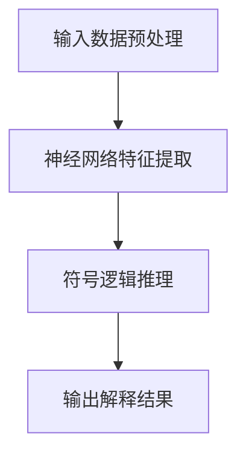
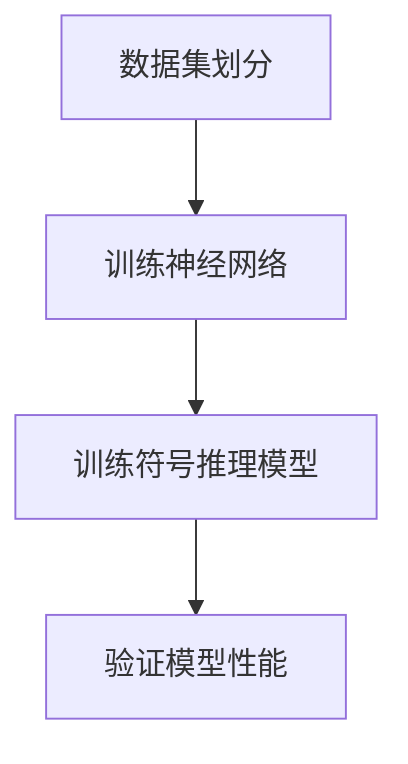
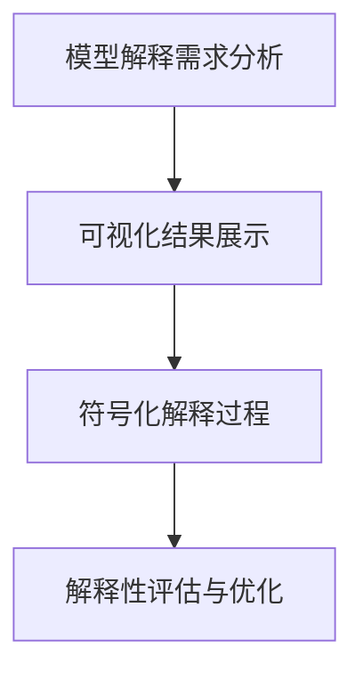
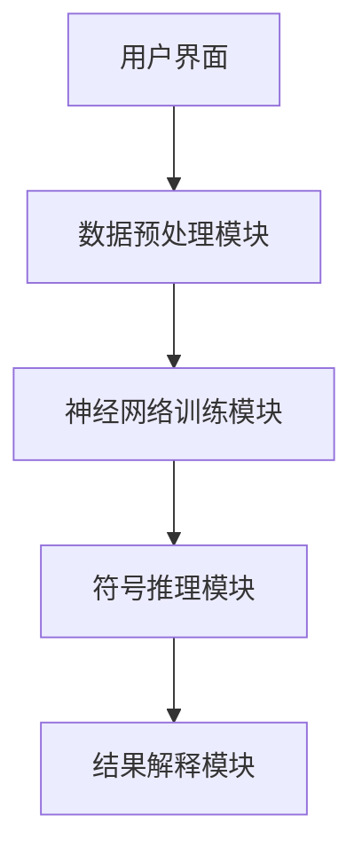
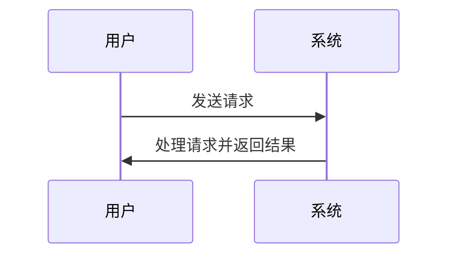

                 

# 基于神经符号推理的可解释AI系统在医疗诊断中的实践

## 关键词：可解释AI、神经符号推理、医疗诊断、AI系统、数据隐私、模型优化

> 摘要：本文探讨了基于神经符号推理的可解释AI系统在医疗诊断中的应用，详细介绍了神经符号推理的基础知识、医学诊断中的具体应用案例、技术挑战与解决方案，以及未来的发展趋势。文章旨在为医疗AI领域的研究者和从业者提供有价值的参考，推动AI技术在医疗领域的深入应用。

----------------------------------------------------------------

## 第一部分：引言

### 1.1 问题背景

#### 1.1.1 医疗诊断中的挑战

医疗诊断是医疗体系中的核心环节，直接关系到患者的健康和生命安全。然而，随着医学数据的爆炸式增长和复杂度的增加，传统的医疗诊断方法面临着巨大的挑战。首先，医学数据具有高维度、非线性和高度依赖性的特点，这使得传统的统计方法难以有效处理。其次，医疗诊断过程需要大量的经验和专业知识，医生的诊断结果受到主观因素的影响，存在一定的误差和不确定性。最后，随着人工智能技术的发展，越来越多的AI系统被引入到医疗诊断中，但这些系统往往缺乏可解释性，使得医生和患者难以理解和接受。

#### 1.1.2 可解释AI的重要性

可解释AI（Explainable AI，XAI）旨在让AI系统的决策过程更加透明和可理解，使得非专业人士能够理解和信任AI系统的决策结果。在医疗诊断领域，可解释AI的重要性体现在以下几个方面：

1. **增强医生信任**：医生需要理解和信任AI系统的诊断结果，以便在临床决策中充分利用AI系统的优势。可解释AI可以提供诊断依据和推理过程，帮助医生理解AI的决策，从而增强医生对AI系统的信任。

2. **患者知情同意**：患者有权了解自己的病情和治疗方案。可解释AI可以解释诊断结果和推荐的治疗方案，帮助患者做出更明智的决策，提高患者的满意度。

3. **提高诊断准确性**：可解释AI可以通过可视化工具展示诊断过程和结果，帮助医生发现潜在的错误和不足，从而提高诊断准确性。

### 1.2 神经符号推理

#### 1.2.1 神经符号推理的定义

神经符号推理（Neural-Symbolic Reasoning）是一种结合神经网络和符号逻辑的推理方法，旨在解决传统神经网络在处理复杂任务时缺乏解释性和灵活性的问题。神经符号推理通过将神经网络和符号逻辑相结合，可以同时利用神经网络的强大计算能力和符号逻辑的推理能力，实现更加复杂和可解释的推理过程。

#### 1.2.2 神经符号推理的基本原理

神经符号推理的基本原理可以概括为以下几个步骤：

1. **数据预处理**：将输入数据（如图像、文本、语音等）转换为神经网络可以处理的形式。

2. **神经网络计算**：使用神经网络对输入数据进行特征提取和计算，生成特征表示。

3. **符号推理**：将神经网络生成的特征表示转换为符号逻辑形式，进行推理和决策。

4. **结果解释**：将符号推理的结果转换为可解释的形式，如可视化图表、文字描述等，以便用户理解和信任。

#### 1.2.3 神经符号推理的优势

神经符号推理具有以下优势：

1. **增强可解释性**：通过符号推理过程，可以提供诊断依据和推理过程，增强系统的可解释性。

2. **提高推理能力**：结合神经网络的强大计算能力和符号逻辑的推理能力，可以实现更加复杂和准确的推理过程。

3. **适应性强**：神经符号推理可以处理多种类型的数据和任务，具有较强的适应性。

### 1.3 书籍概述

#### 1.3.1 目的和范围

本书旨在探讨基于神经符号推理的可解释AI系统在医疗诊断中的应用，包括神经符号推理的基础知识、具体应用案例、技术挑战与解决方案，以及未来的发展趋势。

#### 1.3.2 读者对象

本书适合对医疗AI和神经符号推理感兴趣的读者，包括医学研究者、计算机科学家、医疗诊断领域的从业者等。

#### 1.3.3 内容结构

本书共分为五大部分，第一部分介绍问题背景和神经符号推理的基本概念；第二部分介绍神经符号推理的基础知识；第三部分介绍医疗诊断中的应用；第四部分探讨技术挑战与解决方案；第五部分展望未来发展趋势。

### 1.4 小结

本文简要介绍了基于神经符号推理的可解释AI系统在医疗诊断中的应用，探讨了神经符号推理的基本原理和优势。接下来，本书将逐步深入探讨神经符号推理的基础知识、具体应用案例、技术挑战与解决方案，以及未来的发展趋势。

----------------------------------------------------------------

## 第二部分：神经符号推理基础

### 2.1 神经网络与符号逻辑

#### 2.1.1 神经网络的基本概念

神经网络（Neural Network）是一种模仿人脑神经元结构和功能的人工智能模型。神经网络由大量神经元（或节点）组成，这些神经元通过权重连接在一起，形成一个复杂的网络结构。神经网络通过学习输入数据，自动调整连接权重，从而实现对数据的分类、预测和识别等功能。

#### 2.1.2 符号逻辑的基本概念

符号逻辑（Symbolic Logic）是一种基于符号表示和逻辑推理的方法，用于处理抽象的数学和逻辑问题。符号逻辑包括命题逻辑、谓词逻辑、命题演算和谓词演算等基本概念和推理规则。

#### 2.1.3 神经符号推理的初步结合

神经符号推理将神经网络和符号逻辑相结合，旨在利用神经网络强大的计算能力和符号逻辑的推理能力，实现更加复杂和可解释的推理过程。在神经符号推理中，神经网络用于特征提取和计算，符号逻辑用于推理和决策。这种结合可以弥补单一方法的不足，实现更加高效和准确的推理。

### 2.2 神经符号推理模型

#### 2.2.1 传统神经网络

传统神经网络主要包括以下几种类型：

1. **反向传播算法（Backpropagation）**：反向传播算法是一种用于训练神经网络的梯度下降方法。通过计算输出误差的梯度，反向传播算法自动调整网络的权重，从而优化网络的性能。

2. **卷积神经网络（Convolutional Neural Network，CNN）**：卷积神经网络是一种适用于图像处理任务的神经网络，通过卷积操作提取图像的特征，实现对图像的分类和识别。

#### 2.2.2 符号推理集成

在神经符号推理中，神经网络和符号逻辑的集成可以采用以下几种方法：

1. **符号化神经网络输出**：将神经网络输出的特征表示转换为符号逻辑形式，进行推理和决策。

2. **符号推理模型**：构建专门的符号推理模型，结合神经网络和符号逻辑的推理能力，实现更加复杂和可解释的推理过程。

### 2.3 可解释性方法

#### 2.3.1 可解释性的定义与挑战

可解释性（Explainability）是指系统或模型的决策过程和结果可以被理解和解释的程度。在医疗诊断中，可解释性尤为重要，因为医生和患者需要理解和信任诊断结果。

可解释性面临的挑战主要包括：

1. **模型复杂性**：神经网络和其他复杂模型通常具有复杂的内部结构，难以解释其决策过程。

2. **数据隐私**：医疗数据涉及患者隐私，如何在保证数据隐私的前提下实现模型的可解释性是一个重要挑战。

3. **模型泛化能力**：可解释性模型往往需要牺牲一定的泛化能力，以实现更好的解释性。

#### 2.3.2 可解释性方法的分类

可解释性方法可以分为以下几类：

1. **模型内方法**：直接在模型设计阶段加入解释性，如决策树、线性模型等。

2. **模型外方法**：在模型外部构建解释工具，如可视化、解释性模型等。

3. **混合方法**：结合模型内和模型外方法，实现更好的解释性。

#### 2.3.3 可解释性在神经符号推理中的应用

在神经符号推理中，可解释性可以通过以下几种方式实现：

1. **神经网络的可解释性**：通过可视化神经网络的结构和权重，理解其特征提取过程。

2. **符号推理的解释**：将符号推理过程转化为可理解的逻辑表达式，展示推理步骤和依据。

3. **整合解释**：将神经网络和符号推理的解释整合在一起，形成一个统一的解释框架。

### 2.4 实践案例研究

#### 2.4.1 案例一：肺癌诊断

##### 2.4.1.1 数据预处理

在肺癌诊断案例中，首先需要对医疗数据（如CT扫描图像、患者病历等）进行预处理。数据预处理包括以下步骤：

1. **图像预处理**：对CT扫描图像进行滤波、去噪、增强等处理，提高图像质量。

2. **特征提取**：使用深度学习模型（如卷积神经网络）提取图像特征。

3. **数据归一化**：将数据归一化到统一的范围，方便后续处理。

##### 2.4.1.2 模型训练与验证

在肺癌诊断案例中，使用神经符号推理模型对预处理后的数据进行训练和验证。模型训练包括以下步骤：

1. **训练神经网络**：使用神经网络提取图像特征，并训练分类器。

2. **符号推理**：将神经网络输出的特征转换为符号逻辑形式，进行推理和决策。

3. **模型验证**：使用验证集对模型进行验证，评估模型的准确性和可解释性。

##### 2.4.1.3 模型解释与评估

在肺癌诊断案例中，模型解释与评估包括以下步骤：

1. **解释结果**：使用可视化工具（如图表、热图等）展示模型的决策过程和依据。

2. **评估指标**：使用准确率、召回率、F1分数等指标评估模型的性能。

3. **用户反馈**：收集医生和患者的反馈，进一步优化模型的可解释性。

### 2.5 小结

本文介绍了神经符号推理的基础知识，包括神经网络和符号逻辑的基本概念，以及神经符号推理的基本原理和优势。同时，通过一个肺癌诊断案例，展示了神经符号推理在医疗诊断中的应用。接下来，本书将探讨神经符号推理在医疗诊断中的具体应用，以及技术挑战与解决方案。

----------------------------------------------------------------

## 第三部分：医疗诊断中的应用

### 3.1 医学影像分析

#### 3.1.1 医学影像的基本概念

医学影像是利用医学影像设备（如X光、CT、MRI等）对人体进行成像，以诊断和治疗疾病的重要手段。医学影像包括图像、视频、三维模型等多种形式，可以提供丰富的医学信息，对于疾病的诊断和治疗方案制定具有重要意义。

#### 3.1.2 基于神经符号推理的影像分析

基于神经符号推理的影像分析是将神经网络和符号逻辑相结合，用于处理医学影像数据，实现影像分析任务。这种分析方式具有以下特点：

1. **高效的特征提取**：神经网络可以自动学习医学影像的特征，提取关键信息，提高影像分析的效率和准确性。

2. **可解释性**：符号逻辑可以解释神经网络的决策过程，提供诊断依据，增强医生和患者的信任。

3. **灵活的推理能力**：神经符号推理结合了神经网络的计算能力和符号逻辑的推理能力，可以实现更加复杂和灵活的影像分析。

#### 3.1.2.1 肿瘤检测

肿瘤检测是医学影像分析的重要应用之一。基于神经符号推理的肿瘤检测可以采用以下步骤：

1. **图像预处理**：对医学影像进行滤波、去噪、增强等处理，提高图像质量。

2. **特征提取**：使用深度学习模型（如卷积神经网络）提取图像特征。

3. **符号推理**：将神经网络输出的特征转换为符号逻辑形式，进行推理和决策。

4. **结果解释**：使用可视化工具（如图表、热图等）展示肿瘤的位置、大小、形状等信息，提供诊断依据。

#### 3.1.2.2 疾病分类

疾病分类是医学影像分析的另一个重要应用。基于神经符号推理的疾病分类可以采用以下步骤：

1. **图像预处理**：对医学影像进行滤波、去噪、增强等处理，提高图像质量。

2. **特征提取**：使用深度学习模型（如卷积神经网络）提取图像特征。

3. **符号推理**：将神经网络输出的特征转换为符号逻辑形式，进行推理和决策。

4. **结果解释**：使用可视化工具（如图表、热图等）展示疾病的类型、程度等信息，提供诊断依据。

### 3.2 电子病历分析

#### 3.2.1 电子病历的基本概念

电子病历（Electronic Medical Record，EMR）是数字化、结构化的医疗记录，包括患者的个人信息、病历记录、检查报告、诊断和治疗计划等。电子病历的引入可以提高医疗效率，减少医疗错误，是现代医疗体系的重要组成部分。

#### 3.2.2 基于神经符号推理的病历分析

基于神经符号推理的病历分析是将神经网络和符号逻辑相结合，用于处理电子病历数据，实现病历分析任务。这种分析方式具有以下特点：

1. **高效的数据处理**：神经网络可以自动学习病历数据中的关键信息，提高病历分析的效率和准确性。

2. **可解释性**：符号逻辑可以解释神经网络的决策过程，提供诊断依据，增强医生和患者的信任。

3. **灵活的推理能力**：神经符号推理结合了神经网络的计算能力和符号逻辑的推理能力，可以实现更加复杂和灵活的病历分析。

#### 3.2.2.1 病情预测

病情预测是电子病历分析的重要应用之一。基于神经符号推理的病情预测可以采用以下步骤：

1. **数据预处理**：对电子病历数据进行清洗、标准化等处理，提取关键信息。

2. **特征提取**：使用深度学习模型（如循环神经网络）提取病历数据中的特征。

3. **符号推理**：将神经网络输出的特征转换为符号逻辑形式，进行推理和决策。

4. **结果解释**：使用可视化工具（如图表、热图等）展示病情的发展趋势、预测结果等信息，提供诊断依据。

#### 3.2.2.2 疾病诊断辅助

疾病诊断辅助是电子病历分析的另一个重要应用。基于神经符号推理的疾病诊断辅助可以采用以下步骤：

1. **数据预处理**：对电子病历数据进行清洗、标准化等处理，提取关键信息。

2. **特征提取**：使用深度学习模型（如循环神经网络）提取病历数据中的特征。

3. **符号推理**：将神经网络输出的特征转换为符号逻辑形式，进行推理和决策。

4. **结果解释**：使用可视化工具（如图表、热图等）展示疾病诊断的结果、依据等信息，提供诊断依据。

### 3.3 实时监测与预警系统

#### 3.3.1 实时监测系统的基本概念

实时监测系统是用于实时监测患者生命体征、病情变化等信息的系统。实时监测系统可以及时发现异常情况，提供预警信息，为医生和患者提供及时的干预措施。

#### 3.3.2 基于神经符号推理的实时监测

基于神经符号推理的实时监测是将神经网络和符号逻辑相结合，用于实时监测和分析患者生命体征和病情变化。这种监测方式具有以下特点：

1. **高效的数据处理**：神经网络可以自动学习生命体征和病情变化的数据特征，提高实时监测的效率和准确性。

2. **可解释性**：符号逻辑可以解释神经网络的决策过程，提供诊断依据，增强医生和患者的信任。

3. **灵活的推理能力**：神经符号推理结合了神经网络的计算能力和符号逻辑的推理能力，可以实现更加复杂和灵活的实时监测。

#### 3.3.2.1 心电图分析

心电图分析是实时监测的重要应用之一。基于神经符号推理的心电图分析可以采用以下步骤：

1. **数据预处理**：对心电图数据进行滤波、去噪、增强等处理，提高数据质量。

2. **特征提取**：使用深度学习模型（如卷积神经网络）提取心电图数据中的特征。

3. **符号推理**：将神经网络输出的特征转换为符号逻辑形式，进行推理和决策。

4. **结果解释**：使用可视化工具（如图表、热图等）展示心电图的变化趋势、异常情况等信息，提供诊断依据。

#### 3.3.2.2 血氧饱和度监测

血氧饱和度监测是实时监测的重要应用之一。基于神经符号推理的血氧饱和度监测可以采用以下步骤：

1. **数据预处理**：对血氧饱和度数据进行清洗、标准化等处理，提取关键信息。

2. **特征提取**：使用深度学习模型（如循环神经网络）提取血氧饱和度数据中的特征。

3. **符号推理**：将神经网络输出的特征转换为符号逻辑形式，进行推理和决策。

4. **结果解释**：使用可视化工具（如图表、热图等）展示血氧饱和度的变化趋势、异常情况等信息，提供诊断依据。

### 3.4 小结

本文介绍了神经符号推理在医学影像分析、电子病历分析和实时监测与预警系统中的应用。通过神经符号推理，可以实现更加高效、准确的医学影像分析，提高疾病诊断的准确性和可解释性，为医生和患者提供更好的医疗服务。接下来，本书将探讨神经符号推理在医疗诊断中面临的技术挑战与解决方案。

----------------------------------------------------------------

## 第四部分：技术挑战与解决方案

### 4.1 数据隐私保护

#### 4.1.1 数据隐私的重要性

在医疗领域，数据隐私保护至关重要。医疗数据通常包含患者的敏感信息，如诊断结果、治疗方案、个人病史等。这些信息如果被非法获取或滥用，可能会对患者造成严重伤害。因此，确保医疗数据的隐私和安全是医疗诊断中不可忽视的问题。

#### 4.1.2 数据隐私保护的方法

为了保护医疗数据隐私，可以采用以下几种方法：

1. **数据加密**：对医疗数据进行加密，确保数据在传输和存储过程中不被窃取。

2. **数据脱敏**：在数据处理和分析过程中，对敏感数据进行脱敏处理，以消除个人身份信息。

3. **数据隔离**：将医疗数据存储在独立的数据库中，限制对数据的访问权限。

4. **隐私计算**：采用隐私计算技术（如安全多方计算、同态加密等），在数据处理过程中保护数据隐私。

#### 4.1.3 神经符号推理中的隐私保护

在神经符号推理中，为了保护医疗数据的隐私，可以采用以下策略：

1. **本地化训练**：将训练数据分散到各个医疗机构，本地进行训练，避免数据集中存储。

2. **联邦学习**：采用联邦学习技术，将训练数据分布在多个医疗机构，通过模型聚合实现全局模型训练。

3. **差分隐私**：在数据发布和模型训练过程中引入差分隐私，确保数据的隐私性。

### 4.2 模型解释性提升

#### 4.2.1 模型解释性的挑战

虽然神经符号推理在一定程度上提高了模型的可解释性，但在实际应用中，模型解释性仍面临以下挑战：

1. **模型复杂性**：神经网络和符号逻辑的结合可能导致模型变得复杂，难以解释。

2. **数据不平衡**：医疗数据中可能存在数据不平衡问题，导致模型解释性降低。

3. **解释性牺牲**：为了提高模型的解释性，可能会牺牲一定的模型性能。

#### 4.2.2 解释性模型的优化方法

为了提高模型解释性，可以采用以下方法：

1. **可视化工具**：使用可视化工具（如热图、决策树等）展示模型的决策过程和依据。

2. **符号化输出**：将神经网络输出的特征转换为符号逻辑形式，提供可解释的决策依据。

3. **解释性嵌入**：在模型设计阶段，将解释性嵌入到模型中，实现模型的可解释性。

4. **解释性评估**：建立解释性评估指标，对模型的可解释性进行量化评估。

#### 4.2.3 实践中的解释性提升策略

在实践过程中，可以采用以下策略提升模型解释性：

1. **组合解释方法**：结合多种解释方法，如可视化、符号化输出等，提供全面的解释。

2. **解释性反馈循环**：通过医生和患者的反馈，不断优化模型解释性，提高用户满意度。

3. **解释性透明度**：提高模型的透明度，让用户了解模型的工作原理和决策过程。

### 4.3 模型适应性

#### 4.3.1 模型适应性的需求

在医疗诊断中，模型的适应性至关重要。医疗环境多变，模型需要能够适应不同的医疗场景和需求。模型适应性包括以下几个方面：

1. **环境适应性**：模型需要能够适应不同的医疗设备和系统。

2. **数据适应性**：模型需要能够适应不同的数据类型和数据分布。

3. **任务适应性**：模型需要能够适应不同的诊断任务和需求。

#### 4.3.2 适应性的训练策略

为了提高模型适应性，可以采用以下训练策略：

1. **迁移学习**：利用已有模型的权重，快速适应新的任务和数据。

2. **多任务学习**：同时训练多个相关任务，提高模型在不同任务上的适应性。

3. **增量学习**：在已有模型的基础上，逐步添加新的数据和任务，提高模型的适应性。

#### 4.3.3 实践中的适应性优化

在实践过程中，可以采用以下方法优化模型适应性：

1. **数据增强**：通过数据增强方法，增加模型的训练数据，提高模型的泛化能力。

2. **模型调整**：根据实际应用场景，调整模型的参数和结构，提高模型的适应性。

3. **用户反馈**：收集用户反馈，根据用户需求调整模型，提高模型的适应性。

### 4.4 小结

本文探讨了神经符号推理在医疗诊断中面临的技术挑战与解决方案，包括数据隐私保护、模型解释性提升和模型适应性。通过这些解决方案，可以提高神经符号推理在医疗诊断中的应用效果，为医生和患者提供更好的医疗服务。接下来，本书将展望神经符号推理在医疗诊断领域的未来发展趋势。

----------------------------------------------------------------

## 第五部分：未来展望与趋势

### 5.1 神经符号推理的发展趋势

#### 5.1.1 技术进展

随着人工智能技术的不断发展，神经符号推理在算法、模型和工具等方面都取得了显著进展。未来，神经符号推理有望在以下几个方面继续发展：

1. **算法优化**：通过改进算法，提高神经符号推理的效率和准确性。

2. **模型集成**：结合不同类型的神经网络和符号逻辑模型，实现更加强大的推理能力。

3. **工具支持**：开发更加便捷和高效的神经符号推理工具，降低应用门槛。

#### 5.1.2 应用领域的扩展

神经符号推理在医疗诊断领域已经取得了显著应用成果，未来有望扩展到更多领域：

1. **金融风控**：利用神经符号推理分析金融数据，提高风控能力。

2. **智能交通**：结合神经符号推理和交通数据，优化交通管理和调度。

3. **智能制造**：利用神经符号推理优化生产流程，提高产品质量。

#### 5.1.3 可能的突破方向

神经符号推理在医疗诊断和人工智能领域具有巨大的发展潜力，未来可能的突破方向包括：

1. **跨模态推理**：实现不同模态数据（如图像、文本、语音等）之间的推理和融合。

2. **自适应推理**：根据实时数据和场景变化，动态调整推理策略和模型参数。

3. **人机协同**：将神经符号推理与人类专家的智慧相结合，实现人机协同推理。

### 5.2 医疗诊断中的潜在应用

#### 5.2.1 新的医疗诊断方法

神经符号推理在医疗诊断中具有广泛的应用前景，未来可能带来以下新的医疗诊断方法：

1. **个性化诊断**：根据患者的病史、基因信息和实时数据，提供个性化的诊断方案。

2. **实时监控**：通过实时监测患者的生命体征和病情变化，提供预警和干预措施。

3. **药物筛选**：结合生物数据和药物信息，筛选出针对特定疾病的有效药物。

#### 5.2.2 对医生工作的辅助

神经符号推理可以显著提高医生的工作效率和质量，未来可能带来以下改变：

1. **辅助诊断**：为医生提供诊断依据和参考，提高诊断准确性。

2. **病例分析**：通过分析大量病例数据，为医生提供病例分析和治疗建议。

3. **知识共享**：构建知识库，实现医生之间的知识共享和协作。

#### 5.2.3 对患者健康管理的影响

神经符号推理在患者健康管理中具有重要作用，未来可能带来以下影响：

1. **健康预测**：通过分析患者的历史数据和实时数据，预测患者的健康风险和病情变化。

2. **个性化建议**：根据患者的健康状况，提供个性化的饮食、运动和用药建议。

3. **健康监控**：通过实时监测患者的健康数据，提供预警和干预措施。

### 5.3 社会影响与伦理问题

#### 5.3.1 社会影响

神经符号推理在医疗诊断中的应用将对社会产生深远影响，包括：

1. **医疗资源的优化**：通过提高诊断准确性，优化医疗资源配置，提高医疗服务效率。

2. **医疗成本的降低**：减少误诊和漏诊，降低医疗成本，提高医疗服务的可及性。

3. **医疗服务的普及**：将先进的技术应用于偏远地区，提高医疗服务的覆盖范围。

#### 5.3.2 伦理问题

在神经符号推理在医疗诊断中的应用过程中，需要关注以下伦理问题：

1. **数据隐私**：保护患者数据隐私，防止数据泄露和滥用。

2. **模型偏见**：避免模型引入偏见，确保诊断结果的公平性和公正性。

3. **责任归属**：明确医生、患者和模型在诊断过程中的责任和角色，确保责任的合理归属。

#### 5.3.3 社会责任与政策建议

为了确保神经符号推理在医疗诊断中的应用符合伦理和社会责任，可以采取以下措施：

1. **制定法律法规**：明确神经符号推理在医疗诊断中的应用规范和标准。

2. **加强监管**：建立监管机制，对神经符号推理在医疗诊断中的应用进行监督和管理。

3. **教育培训**：加强对医生、患者和公众的宣传教育，提高对神经符号推理的认识和理解。

### 5.4 小结

本文从技术、应用、社会影响和伦理问题等多个角度，探讨了神经符号推理在医疗诊断领域的未来发展趋势。通过分析技术进展、潜在应用和社会影响，本文为神经符号推理在医疗诊断中的应用提供了有益的启示。未来，神经符号推理有望在医疗诊断中发挥更大的作用，为人类健康事业做出贡献。

----------------------------------------------------------------

## 附录

### A. 神经符号推理的Mermaid流程图

#### A.1 神经网络与符号逻辑结合

#### A.2 模型训练与验证

#### A.3 模型解释方法

### A.4 系统架构设计

### A.5 系统接口设计与交互

----------------------------------------------------------------

## 作者信息

作者：AI天才研究院/AI Genius Institute & 禅与计算机程序设计艺术 /Zen And The Art of Computer Programming

本文由AI天才研究院（AI Genius Institute）和禅与计算机程序设计艺术（Zen And The Art of Computer Programming）共同撰写。AI天才研究院专注于人工智能领域的前沿研究和应用，致力于推动人工智能技术的创新和发展。禅与计算机程序设计艺术则专注于计算机科学的哲学思考和程序设计方法论，倡导“禅意编程”理念，旨在提高程序员的编程水平和思维品质。

本文旨在探讨神经符号推理在医疗诊断中的应用，为医疗AI领域的研究者和从业者提供有价值的参考。通过深入分析神经符号推理的基础知识、应用案例、技术挑战与解决方案，以及未来发展趋势，本文希望能够为神经符号推理在医疗领域的深入应用提供指导。同时，本文也希望能够引发对人工智能在医疗领域应用的社会影响和伦理问题的深入思考。

作者衷心感谢读者的关注和支持，期待与广大读者共同探索人工智能技术在医疗领域的无限可能。如有任何意见和建议，欢迎随时与我们联系。

