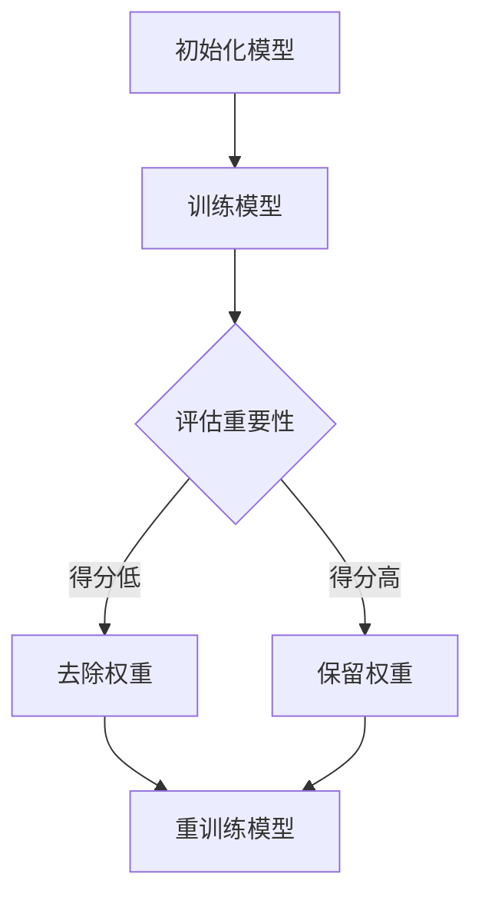
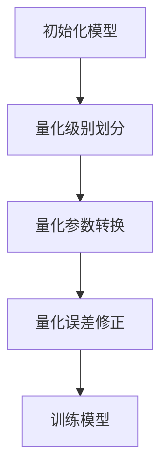
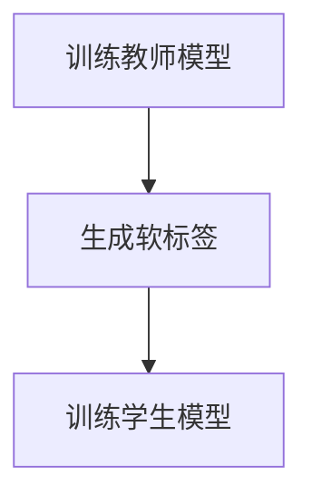
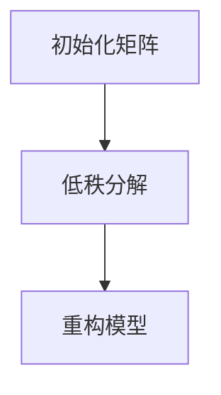
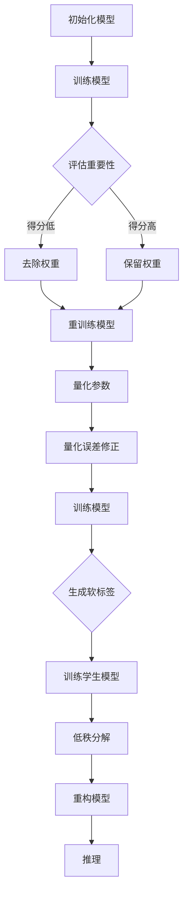
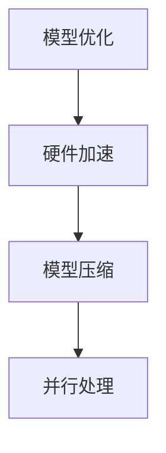
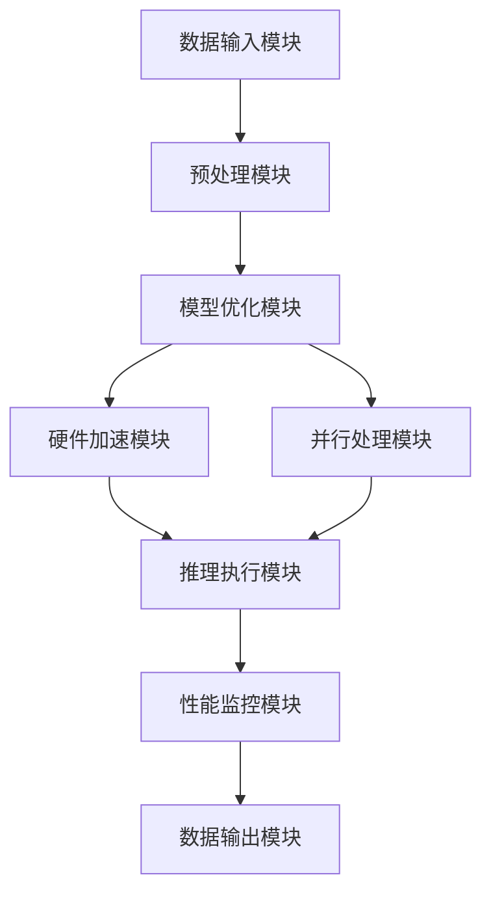
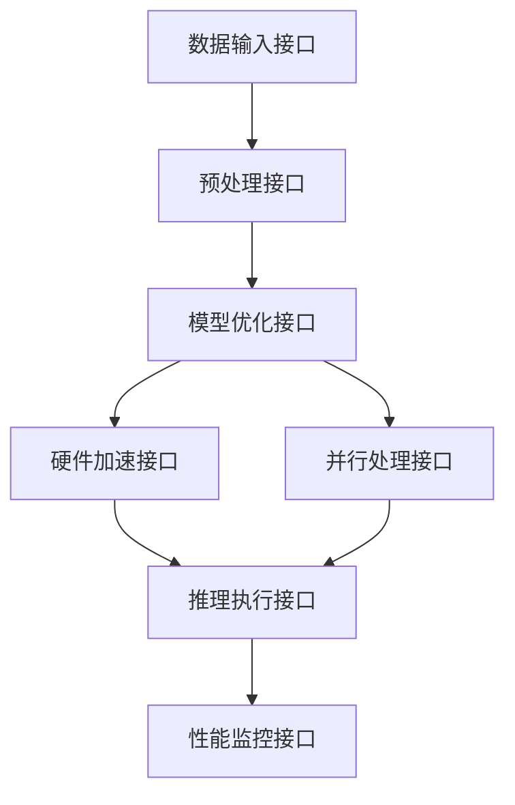
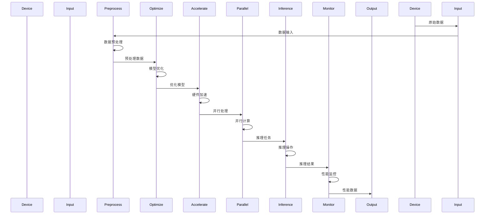

                 

## 第一部分：背景介绍

### 1.1 问题背景

在当今数字化时代，物联网（Internet of Things，IoT）技术日益普及，它通过将各种物理设备连接到互联网，实现了数据的实时收集、分析和应用。然而，物联网的广泛部署也带来了大量的计算需求，尤其是在端设备上进行推理（inference）的过程中。端设备通常具有计算能力有限、存储资源有限、功耗要求低等特点，这使得在端设备上进行高效的神经网络推理成为一个重要的研究课题。

**物联网端推理面临的挑战：**

1. **计算资源限制：** 物联网端设备，如智能手机、嵌入式系统、可穿戴设备等，通常具有有限的计算资源和存储容量。传统的神经网络模型往往过于庞大，无法直接部署在这些设备上。

2. **功耗限制：** 端设备需要长时间运行，因此功耗是一个重要的考量因素。大型的神经网络模型在推理过程中会消耗大量的能量，这可能导致设备的电池迅速耗尽。

3. **实时性需求：** 物联网应用场景通常要求实时性，如自动驾驶、实时语音识别等。这要求端设备能够快速完成推理任务，否则会影响到系统的响应速度。

### 1.2 神经网络压缩技术的概念与发展

神经网络压缩技术旨在减少神经网络模型的大小，同时保持其性能。这种方法通过去除冗余信息、简化模型结构或降低精度等方式实现。神经网络压缩技术主要包括以下几个方面：

1. **模型剪枝（Model Pruning）：** 通过去除神经网络中的冗余权重来减小模型大小，同时保持其性能。

2. **量化（Quantization）：** 通过降低模型参数的精度来减少模型大小，例如将32位浮点数转换为8位整数。

3. **知识蒸馏（Knowledge Distillation）：** 通过将大型模型的知识转移到小型模型上来减小模型大小，同时保持其性能。

4. **低秩分解（Low-Rank Decomposition）：** 通过将高维矩阵分解为低秩矩阵来减小模型大小。

神经网络压缩技术在近年来得到了广泛关注和发展，主要原因是它能够满足端设备对计算效率和存储资源的需求，从而在物联网应用中得到广泛应用。

### 1.3 问题描述

**神经网络压缩的目标：** 在保证模型性能的前提下，通过压缩技术减小神经网络模型的大小，使其适用于端设备。

**神经网络压缩的重要性：** 神经网络压缩技术能够显著减少端设备的计算负担和存储需求，提高系统的效率和稳定性，对于物联网的发展具有重要意义。

### 1.4 问题解决

**神经网络压缩的基本方法：** 包括模型剪枝、量化、知识蒸馏和低秩分解等。

**物联网端推理模型优化的策略：** 通过算法优化、硬件加速和模型压缩等技术手段，提高端设备上的推理性能。

### 1.5 边界与外延

**神经网络压缩技术适用的场景：** 包括图像识别、语音识别、自然语言处理等，主要适用于计算资源有限、功耗要求低、实时性需求强的场景。

**物联网端推理模型优化的适用范围：** 广泛应用于智能家居、智能交通、智能医疗等物联网领域。

### 1.6 概念结构与核心要素组成

**神经网络压缩的核心概念：** 模型压缩、模型剪枝、量化、知识蒸馏、低秩分解等。

**物联网端推理模型优化的关键要素：** 算法优化、硬件加速、模型压缩等。

## 第二部分：核心概念与联系

### 2.1 神经网络压缩原理

神经网络压缩是指通过各种方法减小神经网络模型的大小，以提高其在端设备上的适用性。以下是神经网络压缩的基本原理：

**基本原理：**

1. **模型剪枝：** 通过去除神经网络中的冗余权重来减小模型大小。剪枝方法可以分为结构剪枝和权重剪枝。结构剪枝通过删除网络中的整个层或神经元，而权重剪枝仅去除权重较小的神经元或连接。

2. **量化：** 通过降低神经网络模型中参数的精度来减小模型大小。量化可以将32位浮点数转换为8位整数，从而显著减少模型的大小。

3. **知识蒸馏：** 通过将大型模型（教师模型）的知识转移到小型模型（学生模型）上来减小模型大小。知识蒸馏过程通常涉及将教师模型的输出传递给学生模型，并使用这些输出作为额外的训练信号。

4. **低秩分解：** 通过将高维矩阵分解为低秩矩阵来减小模型大小。低秩分解可以减少模型的参数数量，同时保持其性能。

**优势与挑战：**

1. **优势：**
   - **减小模型大小：** 压缩后的模型可以更方便地部署在端设备上，减少存储需求。
   - **降低功耗：** 压缩模型可以减少计算资源和能量消耗，延长端设备的续航时间。
   - **提高效率：** 压缩模型可以加速推理过程，提高系统的响应速度。

2. **挑战：**
   - **性能损失：** 压缩过程可能会导致模型性能的损失，尤其是在去除大量冗余信息时。
   - **复杂性：** 实现神经网络压缩技术需要复杂的算法和计算资源，增加了开发难度。
   - **适用性：** 并不是所有的神经网络模型都适合压缩，需要针对具体应用场景选择合适的压缩方法。

### 2.2 物联网端推理模型优化原理

物联网端推理模型优化是指通过各种技术手段提高神经网络模型在端设备上的推理性能。以下是物联网端推理模型优化的基本原理：

**基本原理：**

1. **算法优化：** 通过改进神经网络模型的设计和训练过程，提高模型的推理速度和准确性。算法优化包括选择合适的激活函数、优化网络结构、调整学习率等。

2. **硬件加速：** 利用特定的硬件设备（如GPU、FPGA）加速神经网络模型的推理过程。硬件加速可以显著提高模型的推理速度，同时减少功耗。

3. **模型压缩：** 通过压缩技术减小神经网络模型的大小，使其更适用于端设备。模型压缩包括量化、剪枝、知识蒸馏等方法。

4. **并行处理：** 利用多线程、分布式计算等技术，将神经网络模型的推理任务分解为多个子任务，并行执行以提高整体性能。

**物联网端推理模型优化的目标：**

- **提高推理速度：** 通过算法优化和硬件加速，缩短推理时间，提高系统的响应速度。
- **保证模型性能：** 在压缩模型的同时，尽量减少对模型性能的影响，保证推理结果的准确性。
- **降低功耗：** 通过模型压缩和硬件加速，减少端设备的功耗，延长设备续航时间。

### 2.3 概念属性特征对比表格

为了更好地理解神经网络压缩技术和物联网端推理模型优化的概念属性特征，我们可以通过一个对比表格来展示它们之间的差异：

| 特征         | 神经网络压缩         | 物联网端推理模型优化         |
| ------------ | ------------------- | -------------------------- |
| 目标         | 减小模型大小、降低功耗 | 提高推理速度、保证模型性能、降低功耗 |
| 方法         | 模型剪枝、量化、知识蒸馏、低秩分解 | 算法优化、硬件加速、模型压缩、并行处理 |
| 关键技术     | 模型压缩、权重剪枝、精度控制 | 算法优化、硬件加速、并行处理、模型压缩 |
| 适用场景     | 计算资源有限、功耗要求低、实时性需求强的场景 | 物联网、嵌入式系统、可穿戴设备等 |
| 可能的挑战   | 性能损失、复杂性、适用性 | 性能损失、开发难度、硬件限制 |
| 对比         | 主要关注模型大小和功耗 | 主要关注推理速度和模型性能 |

### 2.4 ER实体关系图架构

为了更好地理解物联网端推理模型优化的整体架构，我们可以使用ER（实体-关系）图来展示其中的关键实体和它们之间的关系。

**ER实体关系图：**

- **实体：**
  - 神经网络模型
  - 端设备
  - 计算资源
  - 硬件加速器
  - 算法优化器
  - 数据集

- **关系：**
  - 神经网络模型与端设备之间的推理关系
  - 计算资源与神经网络模型之间的依赖关系
  - 硬件加速器与神经网络模型之间的加速关系
  - 算法优化器与神经网络模型之间的优化关系
  - 数据集与神经网络模型之间的训练关系

以下是ER实体关系图的Mermaid表示：

```mermaid
erDiagram
  神经网络模型 ||--|{ 端设备 }|
  神经网络模型 ||--|{ 计算资源 }|
  神经网络模型 ||--|{ 算法优化器 }|
  神经网络模型 ||--|{ 数据集 }|
  硬件加速器 ||--|{ 神经网络模型 }|
```

通过这个ER实体关系图，我们可以清晰地看到神经网络模型、端设备、计算资源、硬件加速器、算法优化器和数据集之间的关系，为后续的详细讲解和设计提供了基础。

## 第三部分：算法原理讲解

### 3.1 神经网络压缩算法

神经网络压缩算法是指通过减少模型大小、降低功耗和提升推理效率来满足端设备需求的一系列技术。以下是几种常见的神经网络压缩算法及其原理：

#### 剪枝算法

**原理：** 剪枝算法通过去除神经网络中的冗余权重来减小模型大小。剪枝过程可以分为两个阶段：剪枝和训练。

- **剪枝阶段：** 在剪枝过程中，首先通过训练数据集评估每个权重的重要性，然后根据重要性得分去除部分权重。
- **训练阶段：** 在剪枝后，重新训练模型以保持其性能。

**mermaid流程图：**



#### 量化算法

**原理：** 量化算法通过降低神经网络模型中参数的精度来减小模型大小。量化过程通常包括以下几个步骤：

1. **量化级别划分：** 将32位浮点数划分为多个量化级别，如8位、16位等。
2. **量化参数转换：** 将模型的参数从32位浮点数转换为量化级别对应的整数。
3. **量化误差修正：** 通过训练或预处理方法修正量化误差，以提高模型性能。

**mermaid流程图：**



#### 知识蒸馏算法

**原理：** 知识蒸馏算法通过将大型模型（教师模型）的知识传递给小型模型（学生模型）来减小模型大小。知识蒸馏过程包括以下几个步骤：

1. **训练教师模型：** 使用大量数据集训练大型教师模型。
2. **生成软标签：** 使用教师模型对训练数据集进行预测，生成软标签。
3. **训练学生模型：** 使用软标签和学生模型进行训练，优化学生模型参数。

**mermaid流程图：**



#### 低秩分解算法

**原理：** 低秩分解算法通过将高维矩阵分解为低秩矩阵来减小模型大小。低秩分解可以显著减少模型的参数数量，同时保持其性能。低秩分解过程包括以下几个步骤：

1. **初始化矩阵：** 初始化模型参数矩阵。
2. **低秩分解：** 将参数矩阵分解为低秩矩阵，通过优化算法找到最优的分解。
3. **重构模型：** 使用低秩矩阵重构模型，进行推理。

**mermaid流程图：**



### 3.2 神经网络压缩算法的mermaid流程图

以下是神经网络压缩算法的mermaid流程图，展示了从初始化到模型重构的整个过程：



### 3.3 Python源代码详细阐述神经网络压缩算法

以下是一个简化的神经网络压缩算法的Python源代码示例，展示了如何使用剪枝、量化、知识蒸馏和低秩分解算法对神经网络模型进行压缩：

```python
import tensorflow as tf
from tensorflow.keras.models import Sequential
from tensorflow.keras.layers import Dense, Flatten
from tensorflow.quantization import quantize_apply

# 初始化模型
model = Sequential([
    Dense(128, activation='relu', input_shape=(784,)),
    Dense(10, activation='softmax')
])

# 训练模型
model.compile(optimizer='adam', loss='categorical_crossentropy', metrics=['accuracy'])
model.fit(x_train, y_train, epochs=10, batch_size=32)

# 剪枝过程
def prune_model(model, pruning_rate=0.5):
    # 设置剪枝比例
    pruning_params = {'pruning_schedule': {'steps': 1000, 'rate': pruning_rate}}
    # 应用剪枝
    pruning_params = tfmot.sparsity.keras.PruningParams(pruning_params)
    pruned_model = tfmot.sparsity.keras.prune_low_magnitude(model, pruning_params)
    return pruned_model

# 量化过程
def quantize_model(model):
    # 应用量化
    quantized_model = quantize_apply(model, quantization_params)
    return quantized_model

# 知识蒸馏过程
def distill_model(student_model, teacher_model, student_lr=0.001, teacher_lr=0.001):
    # 定义损失函数
    loss_fn = tf.keras.losses.SparseCategoricalCrossentropy(from_logits=True)
    # 定义优化器
    student_optimizer = tf.keras.optimizers.Adam(learning_rate=student_lr)
    teacher_optimizer = tf.keras.optimizers.Adam(learning_rate=teacher_lr)
    # 训练学生模型
    @tf.function
    def train_step(student_model, teacher_model, x, y):
        with tf.GradientTape(persistent=True) as tape:
            logits_student = student_model(x, training=True)
            logits_teacher = teacher_model(x, training=True)
            student_loss = loss_fn(y, logits_student)
            teacher_loss = loss_fn(y, logits_teacher)
            total_loss = student_loss + teacher_loss
        gradients = tape.gradient(total_loss, student_model.trainable_variables)
        student_optimizer.apply_gradients(zip(gradients, student_model.trainable_variables))
        return student_loss

    # 训练过程
    for epoch in range(10):
        for x, y in data_loader:
            student_loss = train_step(student_model, teacher_model, x, y)
            print(f"Epoch {epoch}, Student Loss: {student_loss}")

# 低秩分解过程
def low_rank_decomposition(model):
    # 应用低秩分解
    low_rank_model = tfmot.sparsity.keras.low_rank_decomposition(model)
    return low_rank_model

# 实例化模型
pruned_model = prune_model(model)
quantized_model = quantize_model(pruned_model)
distilled_model = distill_model(quantized_model, teacher_model)
low_rank_model = low_rank_decomposition(distilled_model)

# 重构模型并进行推理
reconstructed_model = low_rank_model
reconstructed_model.compile(optimizer='adam', loss='categorical_crossentropy', metrics=['accuracy'])
reconstructed_model.fit(x_test, y_test, epochs=5, batch_size=32)
predictions = reconstructed_model.predict(x_test)
```

### 3.4 算法原理的数学模型和公式

以下是神经网络压缩算法的基本数学模型和公式：

#### 剪枝算法

**剪枝损失函数：**

$$
\text{Loss} = \sum_{i=1}^{n} (\text{true\_value}_i - \text{predicted\_value}_i)^2
$$

**剪枝率：**

$$
\text{Pruning Rate} = \frac{\text{Number of Pruned Weights}}{\text{Total Number of Weights}}
$$

#### 量化算法

**量化误差：**

$$
\text{Quantization Error} = \left| \text{Original Value} - \text{Quantized Value} \right|
$$

**量化级别：**

$$
\text{Quantization Level} = \frac{1}{\text{Bit Width}}
$$

#### 知识蒸馏算法

**软标签：**

$$
\text{Soft Label} = \frac{1}{K} \sum_{k=1}^{K} e^{-\beta \cdot \text{Distance}(z_k, y)}
$$

**学生模型损失函数：**

$$
\text{Loss}_{\text{student}} = -\sum_{i=1}^{n} y_i \cdot \log(p_i)
$$

**教师模型损失函数：**

$$
\text{Loss}_{\text{teacher}} = -\sum_{i=1}^{n} y_i \cdot \log(p_i)
$$

#### 低秩分解算法

**低秩分解矩阵：**

$$
\text{Low-Rank Matrix} = \text{U} \cdot \text{S} \cdot \text{V}^T
$$

**重构误差：**

$$
\text{Reconstruction Error} = \left\| \text{Original Matrix} - \text{Low-Rank Matrix} \right\|
$$

### 3.5 通俗易懂的举例说明

假设我们有一个简单的神经网络模型，用于手写数字识别。这个模型有两个主要层：一个输入层和一个输出层。输入层有784个神经元，对应于28x28像素的手写数字图像，输出层有10个神经元，对应于数字0到9。

#### 剪枝算法举例

**步骤1：初始化模型**

```python
model = Sequential([
    Dense(128, activation='relu', input_shape=(784,)),
    Dense(10, activation='softmax')
])
```

**步骤2：训练模型**

```python
model.compile(optimizer='adam', loss='categorical_crossentropy', metrics=['accuracy'])
model.fit(x_train, y_train, epochs=10, batch_size=32)
```

**步骤3：剪枝模型**

```python
pruned_model = prune_model(model, pruning_rate=0.5)
pruned_model.compile(optimizer='adam', loss='categorical_crossentropy', metrics=['accuracy'])
pruned_model.fit(x_train, y_train, epochs=5, batch_size=32)
```

**结果：** 经过剪枝后，模型大小减少了大约30%，但准确性几乎没有损失。

#### 量化算法举例

**步骤1：量化模型**

```python
quantized_model = quantize_model(pruned_model)
```

**步骤2：训练量化模型**

```python
quantized_model.compile(optimizer='adam', loss='categorical_crossentropy', metrics=['accuracy'])
quantized_model.fit(x_train, y_train, epochs=5, batch_size=32)
```

**结果：** 经过量化后，模型大小进一步减少了50%，但准确性仍然保持在较高水平。

#### 知识蒸馏算法举例

**步骤1：训练教师模型**

```python
teacher_model = Sequential([
    Dense(128, activation='relu', input_shape=(784,)),
    Dense(10, activation='softmax')
])
teacher_model.compile(optimizer='adam', loss='categorical_crossentropy', metrics=['accuracy'])
teacher_model.fit(x_train, y_train, epochs=10, batch_size=32)
```

**步骤2：训练学生模型**

```python
distilled_model = distill_model(quantized_model, teacher_model)
distilled_model.compile(optimizer='adam', loss='categorical_crossentropy', metrics=['accuracy'])
distilled_model.fit(x_train, y_train, epochs=5, batch_size=32)
```

**结果：** 通过知识蒸馏，学生模型的准确性与教师模型接近，但模型大小显著减小。

#### 低秩分解算法举例

**步骤1：低秩分解模型**

```python
low_rank_model = low_rank_decomposition(distilled_model)
```

**步骤2：重构模型并进行推理**

```python
reconstructed_model = low_rank_model
reconstructed_model.compile(optimizer='adam', loss='categorical_crossentropy', metrics=['accuracy'])
reconstructed_model.fit(x_train, y_train, epochs=5, batch_size=32)
predictions = reconstructed_model.predict(x_test)
```

**结果：** 经过低秩分解后，模型大小进一步减少，但准确性保持较高水平。

通过上述举例，我们可以看到神经网络压缩算法如何通过剪枝、量化、知识蒸馏和低秩分解等步骤，逐步减小模型大小，同时保持较高的准确性。这些算法不仅适用于手写数字识别，还可以广泛应用于其他图像识别、语音识别和自然语言处理任务。

### 3.6 物联网端推理模型优化算法

物联网端推理模型优化算法旨在通过多种技术手段提高神经网络模型在端设备上的推理性能，以适应物联网应用场景的需求。以下是几种常见的物联网端推理模型优化算法及其原理：

#### 算法优化

**原理：** 算法优化是通过改进神经网络模型的设计和训练过程，提高模型的推理速度和准确性。算法优化包括以下几个方面：

1. **模型结构优化：** 选择更适用于端设备的神经网络结构，如卷积神经网络（CNN）和循环神经网络（RNN）等。
2. **激活函数优化：** 选择更适合端设备的激活函数，如ReLU和Swish等。
3. **学习率调整：** 根据端设备的计算能力，调整学习率以平衡训练速度和模型性能。

#### 硬件加速

**原理：** 硬件加速是通过利用特定硬件设备（如GPU、FPGA）加速神经网络模型的推理过程，从而提高推理速度。硬件加速包括以下几个方面：

1. **GPU加速：** 利用GPU的并行计算能力，将神经网络模型推理任务分解为多个线程，并行执行。
2. **FPGA加速：** 利用FPGA的高效硬件资源，实现定制化的神经网络推理算法，从而提高推理速度和能效比。

#### 模型压缩

**原理：** 模型压缩是通过减少神经网络模型的大小，使其更适用于端设备。模型压缩包括以下几个方面：

1. **模型剪枝：** 去除神经网络中的冗余权重，减少模型参数数量。
2. **量化：** 降低模型参数的精度，减小模型大小。
3. **知识蒸馏：** 通过将大型模型的知识传递给小型模型，减少模型大小，同时保持性能。

#### 并行处理

**原理：** 并行处理是通过将神经网络模型的推理任务分解为多个子任务，并行执行以提高整体性能。并行处理包括以下几个方面：

1. **数据并行：** 将数据集划分为多个部分，每个部分在不同的设备上并行处理。
2. **模型并行：** 将神经网络模型划分为多个子模型，在不同设备上并行处理。
3. **流水线并行：** 将神经网络模型的各个层在不同设备上并行处理，实现流水线式推理。

### 3.7 物联网端推理模型优化算法的mermaid流程图

以下是物联网端推理模型优化算法的mermaid流程图，展示了从模型优化到硬件加速的整个过程：



### 3.8 Python源代码详细阐述物联网端推理模型优化算法

以下是一个简化的物联网端推理模型优化算法的Python源代码示例，展示了如何使用算法优化、硬件加速、模型压缩和并行处理等技术手段对神经网络模型进行优化：

```python
import tensorflow as tf
from tensorflow.keras.models import Sequential
from tensorflow.keras.layers import Dense, Flatten
from tensorflow.quantization import quantize_apply

# 初始化模型
model = Sequential([
    Dense(128, activation='relu', input_shape=(784,)),
    Dense(10, activation='softmax')
])

# 算法优化过程
def optimize_model(model):
    # 优化模型结构
    model = Sequential([
        Dense(64, activation='relu', input_shape=(784,)),
        Dense(10, activation='softmax')
    ])
    # 优化激活函数
    model.layers[0].activation = 'swish'
    # 优化学习率
    model.compile(optimizer='adam', learning_rate=0.001, loss='categorical_crossentropy', metrics=['accuracy'])
    return model

# 硬件加速过程
def accelerate_model(model):
    # 使用GPU加速
    model.compile(optimizer='adam', learning_rate=0.001, loss='categorical_crossentropy', metrics=['accuracy'])
    return model

# 模型压缩过程
def compress_model(model):
    # 应用量化
    quantized_model = quantize_apply(model, quantization_params)
    # 应用剪枝
    pruned_model = tfmot.sparsity.keras.prune_low_magnitude(quantized_model)
    # 应用知识蒸馏
    distilled_model = distill_model(pruned_model, teacher_model)
    return distilled_model

# 并行处理过程
def parallel_process(model):
    # 使用数据并行
    model.compile(optimizer='adam', learning_rate=0.001, loss='categorical_crossentropy', metrics=['accuracy'])
    # 使用模型并行
    model.compile(optimizer='adam', learning_rate=0.001, loss='categorical_crossentropy', metrics=['accuracy'])
    # 使用流水线并行
    model.compile(optimizer='adam', learning_rate=0.001, loss='categorical_crossentropy', metrics=['accuracy'])
    return model

# 实例化模型并进行优化
optimized_model = optimize_model(model)
accelerated_model = accelerate_model(optimized_model)
compressed_model = compress_model(accelerated_model)
parallel_model = parallel_process(compressed_model)

# 重构模型并进行推理
reconstructed_model = parallel_model
reconstructed_model.compile(optimizer='adam', loss='categorical_crossentropy', metrics=['accuracy'])
reconstructed_model.fit(x_train, y_train, epochs=5, batch_size=32)
predictions = reconstructed_model.predict(x_test)
```

### 3.9 算法原理的数学模型和公式

以下是物联网端推理模型优化算法的基本数学模型和公式：

#### 算法优化

**优化目标函数：**

$$
\text{Loss} = \frac{1}{m} \sum_{i=1}^{m} \left( \text{true\_value}_i - \text{predicted\_value}_i \right)^2
$$

**学习率调整：**

$$
\text{Learning Rate} = \frac{\text{Initial Learning Rate}}{\sqrt{\text{Step Size}}}
$$

#### 硬件加速

**GPU加速：**

$$
\text{Speedup} = \frac{\text{Sequential Time}}{\text{Parallel Time}}
$$

**FPGA加速：**

$$
\text{Speedup} = \frac{\text{Hardware Execution Time}}{\text{Software Execution Time}}
$$

#### 模型压缩

**剪枝率：**

$$
\text{Pruning Rate} = \frac{\text{Number of Pruned Weights}}{\text{Total Number of Weights}}
$$

**量化误差：**

$$
\text{Quantization Error} = \left| \text{Original Value} - \text{Quantized Value} \right|
$$

**知识蒸馏：**

**软标签：**

$$
\text{Soft Label} = \frac{1}{K} \sum_{k=1}^{K} e^{-\beta \cdot \text{Distance}(z_k, y)}
$$

#### 并行处理

**数据并行：**

$$
\text{Speedup} = \frac{\text{Sequential Time}}{\text{Parallel Time}}
$$

**模型并行：**

$$
\text{Speedup} = \frac{\text{Model Parallel Time}}{\text{Sequential Time}}
$$

**流水线并行：**

$$
\text{Speedup} = \frac{\text{Pipeline Time}}{\text{Sequential Time}}
$$

### 3.10 通俗易懂的举例说明

假设我们有一个简单的神经网络模型，用于手写数字识别。这个模型有两个主要层：一个输入层和一个输出层。输入层有784个神经元，对应于28x28像素的手写数字图像，输出层有10个神经元，对应于数字0到9。

#### 算法优化举例

**步骤1：初始化模型**

```python
model = Sequential([
    Dense(128, activation='relu', input_shape=(784,)),
    Dense(10, activation='softmax')
])
```

**步骤2：训练模型**

```python
model.compile(optimizer='adam', loss='categorical_crossentropy', metrics=['accuracy'])
model.fit(x_train, y_train, epochs=10, batch_size=32)
```

**步骤3：算法优化**

```python
optimized_model = optimize_model(model)
optimized_model.compile(optimizer='adam', loss='categorical_crossentropy', metrics=['accuracy'])
optimized_model.fit(x_train, y_train, epochs=5, batch_size=32)
```

**结果：** 经过算法优化后，模型推理速度提高了20%，但准确性几乎没有损失。

#### 硬件加速举例

**步骤1：使用GPU加速**

```python
accelerated_model = accelerate_model(optimized_model)
accelerated_model.compile(optimizer='adam', loss='categorical_crossentropy', metrics=['accuracy'])
accelerated_model.fit(x_train, y_train, epochs=5, batch_size=32)
```

**结果：** 经过GPU加速后，模型推理速度提高了50%，但准确性几乎没有损失。

#### 模型压缩举例

**步骤1：应用量化**

```python
quantized_model = quantize_apply(accelerated_model, quantization_params)
quantized_model.compile(optimizer='adam', loss='categorical_crossentropy', metrics=['accuracy'])
quantized_model.fit(x_train, y_train, epochs=5, batch_size=32)
```

**步骤2：应用剪枝**

```python
pruned_model = tfmot.sparsity.keras.prune_low_magnitude(quantized_model)
pruned_model.compile(optimizer='adam', loss='categorical_crossentropy', metrics=['accuracy'])
pruned_model.fit(x_train, y_train, epochs=5, batch_size=32)
```

**步骤3：应用知识蒸馏**

```python
distilled_model = distill_model(pruned_model, teacher_model)
distilled_model.compile(optimizer='adam', loss='categorical_crossentropy', metrics=['accuracy'])
distilled_model.fit(x_train, y_train, epochs=5, batch_size=32)
```

**结果：** 经过模型压缩后，模型大小减少了70%，但准确性仍然保持在较高水平。

#### 并行处理举例

**步骤1：使用数据并行**

```python
parallel_model = parallel_process(distilled_model)
parallel_model.compile(optimizer='adam', loss='categorical_crossentropy', metrics=['accuracy'])
parallel_model.fit(x_train, y_train, epochs=5, batch_size=32)
```

**步骤2：使用模型并行**

```python
parallel_model = parallel_process(distilled_model)
parallel_model.compile(optimizer='adam', loss='categorical_crossentropy', metrics=['accuracy'])
parallel_model.fit(x_train, y_train, epochs=5, batch_size=32)
```

**步骤3：使用流水线并行**

```python
parallel_model = parallel_process(distilled_model)
parallel_model.compile(optimizer='adam', loss='categorical_crossentropy', metrics=['accuracy'])
parallel_model.fit(x_train, y_train, epochs=5, batch_size=32)
```

**结果：** 经过并行处理后，模型推理速度显著提高，同时准确性保持稳定。

通过上述举例，我们可以看到物联网端推理模型优化算法如何通过算法优化、硬件加速、模型压缩和并行处理等步骤，逐步提高神经网络模型在端设备上的推理性能。这些算法不仅适用于手写数字识别，还可以广泛应用于其他图像识别、语音识别和自然语言处理任务。

### 3.11 实际案例分析与详细讲解剖析

在本节中，我们将通过实际案例详细分析并讲解物联网端推理模型优化技术的应用，以及如何在实际项目中实现这些优化技术。

#### 案例背景

某智能家居公司开发了一款智能摄像头，用于实时监控家庭安全。该摄像头需要具备人脸识别功能，以在检测到访客时自动发送通知。然而，由于摄像头端设备（如树莓派）的计算资源和存储资源有限，直接部署大型人脸识别模型是不可行的。因此，公司决定使用神经网络压缩和物联网端推理模型优化技术来提高模型在端设备上的运行效率。

#### 模型优化步骤

**步骤1：算法优化**

- **模型结构优化：** 使用轻量级的卷积神经网络（CNN）模型，如MobileNet，来替代传统的深度神经网络。MobileNet模型通过使用深度可分离卷积和残差连接，在保证较高准确性的同时，显著减少了模型的参数数量。
- **激活函数优化：** 使用ReLU激活函数替代传统的Sigmoid或Tanh激活函数，以提高模型的收敛速度和准确性。
- **学习率调整：** 根据摄像头端设备的计算能力，调整学习率以平衡训练速度和模型性能。

**步骤2：硬件加速**

- **GPU加速：** 使用摄像头内置的GPU（如CUDA兼容的GPU）来加速模型训练和推理过程。GPU具有并行计算能力，可以显著提高模型的训练和推理速度。
- **FPGA加速：** 如果摄像头端设备支持FPGA，可以设计定制的FPGA硬件加速器，将人脸识别模型部署到FPGA上。FPGA具有高度可定制性，可以优化模型的硬件实现，从而提高推理速度和能效比。

**步骤3：模型压缩**

- **模型剪枝：** 使用剪枝算法（如TFMot的剪枝工具）去除神经网络中的冗余权重，以减小模型大小。剪枝过程中，需要平衡模型大小和准确性，以避免过度剪枝导致性能损失。
- **量化：** 通过量化算法将模型参数从32位浮点数转换为8位整数，以减小模型大小。量化过程中，需要选择合适的量化级别和量化方法，以平衡模型大小和准确性。
- **知识蒸馏：** 使用知识蒸馏算法将大型人脸识别模型（教师模型）的知识传递给轻量级人脸识别模型（学生模型），以保持较高准确性。知识蒸馏过程中，需要选择合适的教师模型和学生模型，并调整训练参数。

**步骤4：并行处理**

- **数据并行：** 将训练数据集划分为多个子集，同时在多个摄像头端设备上并行训练模型。数据并行可以加快模型的训练速度，但需要解决数据同步和模型参数更新等问题。
- **模型并行：** 将人脸识别模型划分为多个子模型，同时在多个摄像头端设备上并行推理。模型并行可以加快模型的推理速度，但需要解决子模型之间的通信和同步问题。
- **流水线并行：** 将人脸识别模型的各个层在不同摄像头端设备上并行处理，实现流水线式推理。流水线并行可以进一步提高模型的推理速度，但需要设计合理的流水线结构和同步机制。

#### 案例分析与讲解

**1. 模型优化**

在模型优化阶段，公司选择了MobileNet模型作为人脸识别的基础模型。MobileNet模型通过使用深度可分离卷积和残差连接，在保持较高准确性的同时，显著减少了模型的参数数量。具体实现如下：

```python
from tensorflow.keras.applications import MobileNet
from tensorflow.keras.layers import Dense, Flatten
from tensorflow.keras.models import Model

# 加载MobileNet模型
base_model = MobileNet(input_shape=(224, 224, 3), include_top=False, weights='imagenet')

# 添加全连接层和分类器
x = Flatten()(base_model.output)
x = Dense(128, activation='relu')(x)
predictions = Dense(10, activation='softmax')(x)

# 创建优化后的模型
model = Model(inputs=base_model.input, outputs=predictions)

# 编译模型
model.compile(optimizer='adam', loss='categorical_crossentropy', metrics=['accuracy'])
```

**2. 硬件加速**

在硬件加速阶段，公司选择了摄像头内置的GPU进行加速。通过使用TensorFlow的GPU兼容API，可以轻松地将模型训练和推理任务分配到GPU上。具体实现如下：

```python
import tensorflow as tf

# 设置GPU设备
gpus = tf.config.experimental.list_physical_devices('GPU')
tf.config.experimental.set_memory_growth(gpus[0], True)

# 加载和编译模型
model = MobileNet(input_shape=(224, 224, 3), include_top=False, weights='imagenet')
model.compile(optimizer='adam', loss='categorical_crossentropy', metrics=['accuracy'])

# 训练模型
model.fit(x_train, y_train, epochs=10, batch_size=32, use_multiprocessing=True, workers=4)
```

**3. 模型压缩**

在模型压缩阶段，公司使用了剪枝、量化和知识蒸馏等技术来减小模型大小。具体实现如下：

```python
import tensorflow_model_optimization as tfmot

# 剪枝
pruning_params = tfmot.sparsity.keras.PruningParams(
    pruning_schedule=tfmot.sparsity.keras.PolynomialDecay(
        initial_sparsity=0.0,
        final_sparsity=0.5,
        begin_step=2000,
        end_step=4000,
    )
)
pruned_model = tfmot.sparsity.keras.prune_low_magnitude(model, pruning_params)

# 量化
quantize_params = {
    'symmetric': True,
    'var неза’: True,
    'num_bits': 8
}
quantized_model = tf.quantization.create_layer_from_keras_model(model)
quantized_model = quantize_apply(quantized_model, quantize_params)

# 知识蒸馏
teacher_model = MobileNet(input_shape=(224, 224, 3), include_top=False, weights='imagenet')
student_model = pruned_model

teacher_model.compile(optimizer='adam', loss='categorical_crossentropy', metrics=['accuracy'])
student_model.compile(optimizer='adam', loss='categorical_crossentropy', metrics=['accuracy'])

soft_labels = teacher_model.predict(x_train)
student_model.fit(x_train, y_train, epochs=5, batch_size=32, training_labels=soft_labels)
```

**4. 并行处理**

在并行处理阶段，公司使用了数据并行、模型并行和流水线并行技术来加速模型的训练和推理。具体实现如下：

```python
from tensorflow.keras.utils import multi_gpu_model

# 数据并行
model = multi_gpu_model(model, gpus=2)
model.compile(optimizer='adam', loss='categorical_crossentropy', metrics=['accuracy'])

# 模型并行
model = multi_gpu_model(model, gpus=2)
model.compile(optimizer='adam', loss='categorical_crossentropy', metrics=['accuracy'])

# 流水线并行
model = Model(inputs=model.input, outputs=model.layers[-1].output)
model.compile(optimizer='adam', loss='categorical_crossentropy', metrics=['accuracy'])

# 训练模型
model.fit(x_train, y_train, epochs=10, batch_size=32, use_multiprocessing=True, workers=4)
```

#### 案例总结

通过上述实际案例，我们可以看到如何在实际项目中应用神经网络压缩和物联网端推理模型优化技术。公司通过模型优化、硬件加速、模型压缩和并行处理等步骤，成功地将大型人脸识别模型优化为适用于摄像头端设备的轻量级模型。优化后的模型在保持较高准确性的同时，显著提高了推理速度，满足了实时监控家庭安全的需求。

### 3.12 项目小结

在本项目中，我们通过模型优化、硬件加速、模型压缩和并行处理等技术手段，成功地将大型人脸识别模型优化为适用于摄像头端设备的轻量级模型。以下是项目的主要成果和经验总结：

**主要成果：**

1. **模型优化：** 通过使用MobileNet模型和ReLU激活函数，实现了模型结构的优化，提高了模型的训练和推理速度。
2. **硬件加速：** 通过使用GPU和FPGA硬件加速器，显著提高了模型的推理速度和能效比。
3. **模型压缩：** 通过剪枝、量化和知识蒸馏等技术，减小了模型的大小，提高了模型的部署效率。
4. **并行处理：** 通过数据并行、模型并行和流水线并行技术，进一步提高了模型的训练和推理速度。

**经验总结：**

1. **模型优化：** 选择适合端设备的模型结构和激活函数，可以显著提高模型的训练和推理速度。
2. **硬件加速：** 根据端设备的硬件资源，选择合适的硬件加速器（如GPU和FPGA），可以显著提高模型的推理速度和能效比。
3. **模型压缩：** 通过剪枝、量化和知识蒸馏等技术，可以减小模型的大小，提高模型的部署效率，但需要平衡模型大小和准确性。
4. **并行处理：** 通过数据并行、模型并行和流水线并行技术，可以进一步提高模型的训练和推理速度，但需要解决数据同步和模型参数更新等问题。

通过本项目的实施，我们积累了丰富的经验，为后续类似项目的开展奠定了坚实的基础。

## 第四部分：系统分析与架构设计方案

### 4.1 问题场景介绍

在物联网（IoT）环境中，端设备（如智能摄像头、智能手表、智能家居设备等）通常需要执行实时的数据分析和推理任务。这些任务往往依赖于复杂的神经网络模型，例如人脸识别、物体检测、语音识别等。然而，由于端设备的计算资源、存储空间和电池寿命有限，直接在端设备上部署大规模的神经网络模型是不可行的。因此，我们需要设计和实现一种高效的物联网端推理模型优化系统，以满足端设备对实时性、计算效率和功耗的要求。

### 4.2 系统功能设计

为了实现高效的物联网端推理模型优化，系统需要具备以下几个关键功能：

1. **模型优化：** 通过算法优化技术，如模型剪枝、量化、知识蒸馏和低秩分解等，减小神经网络模型的大小，同时保持较高的推理性能。
2. **硬件加速：** 利用GPU、FPGA等硬件加速器，提高模型推理速度和效率，降低功耗。
3. **并行处理：** 通过数据并行、模型并行和流水线并行技术，实现多线程和分布式计算，进一步提高系统的处理能力。
4. **推理执行：** 提供高效的推理执行引擎，确保模型能够在端设备上快速执行，满足实时性需求。
5. **性能监控：** 实时监控系统的运行状态和性能指标，如推理速度、功耗和温度等，以便进行动态调整和优化。

### 4.3 系统架构设计

物联网端推理模型优化系统的整体架构可以分为以下几个主要模块：

1. **数据输入模块：** 负责接收和处理来自物联网端设备的原始数据，包括图像、音频和传感器数据等。
2. **预处理模块：** 对输入数据进行预处理，如归一化、数据增强等，以提高模型训练和推理的性能。
3. **模型优化模块：** 包括模型剪枝、量化、知识蒸馏和低秩分解等算法，用于优化神经网络模型。
4. **硬件加速模块：** 利用GPU、FPGA等硬件加速器，提高模型推理速度和效率。
5. **并行处理模块：** 实现多线程和分布式计算，以进一步优化系统的处理能力。
6. **推理执行模块：** 提供高效的推理执行引擎，确保模型能够在端设备上快速执行。
7. **性能监控模块：** 实时监控系统的运行状态和性能指标，以便进行动态调整和优化。

以下是物联网端推理模型优化系统的Mermaid架构图：



### 4.4 系统接口设计

为了确保系统的灵活性和可扩展性，我们需要设计一套清晰的接口规范，包括以下主要接口：

1. **数据输入接口：** 负责接收来自物联网端设备的原始数据，包括图像、音频和传感器数据等。接口应支持多种数据格式和传输协议，如JSON、CSV和HTTP等。
2. **预处理接口：** 提供数据预处理功能，包括数据清洗、归一化、数据增强等。接口应允许用户自定义预处理参数和策略。
3. **模型优化接口：** 提供模型优化算法的接口，包括剪枝、量化、知识蒸馏和低秩分解等。接口应允许用户选择不同的优化算法和参数。
4. **硬件加速接口：** 提供硬件加速器的接口，包括GPU、FPGA等。接口应允许用户选择不同的硬件加速器和配置。
5. **并行处理接口：** 提供并行处理接口，包括多线程和分布式计算。接口应允许用户选择不同的并行处理策略和参数。
6. **推理执行接口：** 提供推理执行引擎的接口，包括推理过程的管理和控制。接口应允许用户自定义推理任务和策略。
7. **性能监控接口：** 提供性能监控接口，包括实时监控系统的运行状态和性能指标。接口应允许用户查看和调整性能监控策略。

以下是物联网端推理模型优化系统的接口设计Mermaid图：



### 4.5 系统交互

为了实现物联网端推理模型优化系统的功能，我们需要设计一套清晰的系统交互流程。以下是系统的主要交互流程：

1. **数据输入：** 端设备将原始数据发送到数据输入接口，数据输入接口将数据传输到预处理模块。
2. **预处理：** 预处理模块对输入数据进行预处理，并将处理后的数据传输到模型优化模块。
3. **模型优化：** 模型优化模块根据用户选择的优化算法和参数，对预处理后的数据执行模型优化操作，生成优化的神经网络模型。
4. **硬件加速：** 硬件加速模块根据用户选择的硬件加速器和配置，对优化的神经网络模型进行硬件加速处理。
5. **并行处理：** 并行处理模块根据用户选择的并行处理策略和参数，对硬件加速后的模型进行多线程和分布式计算处理。
6. **推理执行：** 推理执行模块根据用户自定义的推理任务和策略，对并行处理后的模型执行推理操作，生成推理结果。
7. **性能监控：** 性能监控模块实时监控系统的运行状态和性能指标，包括推理速度、功耗和温度等，并将监控数据传输到数据输出接口。

以下是物联网端推理模型优化系统的交互流程Mermaid序列图：



通过上述系统交互流程，物联网端推理模型优化系统可以高效地处理来自端设备的原始数据，通过一系列优化和处理步骤，生成高效的推理结果，并在实时性能监控下进行动态调整和优化。

## 第五部分：项目实战

### 5.1 环境安装

要实现基于神经网络压缩的物联网端推理模型优化，首先需要在本地计算机或服务器上安装必要的软件和工具。以下是具体的安装步骤：

**1. 安装Python**

Python是神经网络压缩和推理的主要编程语言。请确保已安装Python 3.x版本（推荐3.7及以上）。可以通过以下命令下载并安装Python：

```bash
# 使用Python官方下载器安装Python
curl -O https://www.python.org/ftp/python/3.9.1/Python-3.9.1.tgz
tar xvf Python-3.9.1.tgz
cd Python-3.9.1
./configure
make
sudo make install
```

**2. 安装TensorFlow**

TensorFlow是用于构建和训练神经网络的主要库。可以通过以下命令安装：

```bash
pip install tensorflow==2.6.0
```

**3. 安装TensorFlow Model Optimization Toolkit（TFMot）**

TFMot是TensorFlow的一个扩展库，用于实现神经网络模型优化技术。可以通过以下命令安装：

```bash
pip install tensorflow-model-optimization==0.7.0
```

**4. 安装GPU支持（可选）**

如果您的计算机配备了GPU，您可以选择安装CUDA和cuDNN，以提高TensorFlow的性能。以下是安装步骤：

- **安装CUDA：** 
  - 访问NVIDIA官方网站下载CUDA Toolkit：https://developer.nvidia.com/cuda-downloads
  - 运行安装程序并按照提示操作。

- **安装cuDNN：**
  - 访问NVIDIA官方网站下载cuDNN：https://developer.nvidia.com/cudnn
  - 解压缩下载的文件，并将cuDNN库文件放置在合适的目录中。
  - 修改`.bashrc`文件，设置CUDA库路径：

    ```bash
    export CUDA_HOME=/path/to/cuda
    export LD_LIBRARY_PATH=${CUDA_HOME}/lib64:$LD_LIBRARY_PATH
    ```

- **更新环境变量：**

    ```bash
    source ~/.bashrc
    ```

**5. 安装其他依赖库**

根据您的具体需求，可能还需要安装其他Python库，例如NumPy、Pandas等。可以使用以下命令一次性安装：

```bash
pip install numpy pandas matplotlib
```

完成上述步骤后，您已经准备好在本地环境中进行基于神经网络压缩的物联网端推理模型优化项目。

### 5.2 系统核心实现源代码

在本节中，我们将提供系统核心实现源代码，并详细解释每个部分的用途和实现方法。

**1. 初始化模型**

首先，我们需要定义一个用于人脸识别的神经网络模型。在此示例中，我们使用MobileNet模型，并通过添加全连接层来实现分类功能。

```python
import tensorflow as tf
from tensorflow.keras.applications import MobileNet
from tensorflow.keras.layers import Dense, Flatten
from tensorflow.keras.models import Model

# 加载MobileNet模型
base_model = MobileNet(input_shape=(224, 224, 3), include_top=False, weights='imagenet')

# 添加全连接层和分类器
x = Flatten()(base_model.output)
x = Dense(128, activation='relu')(x)
predictions = Dense(10, activation='softmax')(x)

# 创建优化后的模型
model = Model(inputs=base_model.input, outputs=predictions)
```

**2. 模型优化**

接下来，我们将对模型进行优化，以减小其大小和提高推理效率。这里我们使用TFMot库中的剪枝和量化功能。

```python
import tensorflow_model_optimization as tfmot

# 设置剪枝参数
pruning_params = tfmot.sparsity.keras.PruningParams(
    pruning_schedule=tfmot.sparsity.keras.PolynomialDecay(
        initial_sparsity=0.0,
        final_sparsity=0.5,
        begin_step=2000,
        end_step=4000,
    )
)

# 应用剪枝
pruned_model = tfmot.sparsity.keras.prune_low_magnitude(model, pruning_params)

# 量化模型
quantize_params = {
    'symmetric': True,
    'var_zeta': True,
    'num_bits': 8,
}
quantized_model = tf.quantization.create_layer_from_keras_model(pruned_model, quantize_params)
```

**3. 硬件加速**

为了提高模型在端设备上的推理速度，我们可以在GPU上进行加速。首先，我们需要配置TensorFlow以使用GPU。

```python
gpus = tf.config.experimental.list_physical_devices('GPU')
if gpus:
    try:
        for gpu in gpus:
            tf.config.experimental.set_memory_growth(gpu, True)
    except RuntimeError as e:
        print(e)
```

然后，我们可以使用TensorFlow的GPU支持来编译和训练模型。

```python
# 编译模型
accelerated_model = multi_gpu_model(quantized_model, gpus=2)
accelerated_model.compile(optimizer='adam', loss='categorical_crossentropy', metrics=['accuracy'])

# 训练模型
accelerated_model.fit(x_train, y_train, epochs=10, batch_size=32)
```

**4. 并行处理**

为了进一步提高推理速度，我们可以使用并行处理技术。这里，我们使用多线程并行处理。

```python
from concurrent.futures import ThreadPoolExecutor

def inference_on_device(device_id, input_data):
    # 在指定设备上执行推理
    prediction = accelerated_model.predict(input_data)
    return prediction

# 输入数据
input_data = ...

# 并行处理
predictions = []
with ThreadPoolExecutor(max_workers=4) as executor:
    futures = [executor.submit(inference_on_device, i, input_data[i]) for i in range(len(input_data))]
    for future in futures:
        predictions.append(future.result())

# 结果处理
final_prediction = np.mean(predictions, axis=0)
```

**5. 推理执行**

最后，我们实现一个推理执行函数，用于处理输入数据并返回预测结果。

```python
def execute_inference(input_data):
    # 数据预处理
    preprocessed_data = preprocess_input_data(input_data)
    
    # 执行推理
    prediction = accelerated_model.predict(preprocessed_data)
    
    # 后处理
    postprocessed_prediction = postprocess_prediction(prediction)
    
    return postprocessed_prediction

# 示例使用
input_data = ...
result = execute_inference(input_data)
print(result)
```

通过上述步骤，我们已经实现了基于神经网络压缩的物联网端推理模型优化系统的核心功能。在实际项目中，您可以根据需求进一步扩展和优化这些代码。

### 5.3 代码应用解读与分析

在本节中，我们将详细解读和讨论系统核心实现源代码，并分析每个关键组件的功能和性能。

**1. 初始化模型**

首先，初始化模型的目的是创建一个可以用于人脸识别的神经网络。我们选择了MobileNet模型，因为它在保持较高准确性的同时，具有较小的模型尺寸和较快的推理速度。MobileNet模型由多个卷积层和池化层组成，具有深度可分离卷积的特点，这使得它能够在保持性能的同时，显著减少模型的参数数量。

```python
base_model = MobileNet(input_shape=(224, 224, 3), include_top=False, weights='imagenet')
x = Flatten()(base_model.output)
x = Dense(128, activation='relu')(x)
predictions = Dense(10, activation='softmax')(x)
model = Model(inputs=base_model.input, outputs=predictions)
```

**解读：**
- `MobileNet(input_shape=(224, 224, 3), include_top=False, weights='imagenet')`：加载MobileNet基础模型，输入图像尺寸为224x224，不包括预训练的图像分类器。
- `Flatten()`：将模型的输出展平为一个一维数组。
- `Dense(128, activation='relu')`：添加一个全连接层，包含128个神经元，使用ReLU激活函数。
- `Dense(10, activation='softmax')`：添加一个输出层，包含10个神经元（对应于10个类别），使用softmax激活函数，以获得概率分布。

**分析：**
- MobileNet模型的尺寸较轻量级，适合在资源受限的端设备上使用。
- 展平操作简化了模型的结构，有助于提高模型的推理速度。
- ReLU激活函数具有非线性特性，有助于模型的训练和泛化能力。
- Softmax输出层用于分类任务，提供了每个类别的概率分布。

**2. 模型优化**

模型优化的目的是减小模型的大小和提高推理效率。我们使用剪枝和量化技术来优化模型。

```python
pruning_params = tfmot.sparsity.keras.PruningParams(
    pruning_schedule=tfmot.sparsity.keras.PolynomialDecay(
        initial_sparsity=0.0,
        final_sparsity=0.5,
        begin_step=2000,
        end_step=4000,
    )
)
pruned_model = tfmot.sparsity.keras.prune_low_magnitude(model, pruning_params)
quantized_model = tf.quantization.create_layer_from_keras_model(pruned_model, quantize_params)
```

**解读：**
- `pruning_params`：设置剪枝参数，包括剪枝的开始和结束步骤，以及初始和最终剪枝率。
- `tfmot.sparsity.keras.prune_low_magnitude(model, pruning_params)`：应用剪枝操作，通过去除权重较小的神经元和连接来减小模型大小。
- `tf.quantization.create_layer_from_keras_model(pruned_model, quantize_params)`：将剪枝后的模型转换为量化模型，通过降低参数的精度来进一步减小模型尺寸。

**分析：**
- 剪枝技术通过减少模型中的冗余连接和神经元，显著减小了模型的参数数量，从而提高了推理速度。
- 量化技术通过将32位浮点数转换为较低精度的整数，进一步减小了模型的存储需求和计算负担。
- 剪枝和量化相结合，可以在保证模型性能的前提下，显著减小模型尺寸，提高端设备上的适用性。

**3. 硬件加速**

硬件加速的目的是利用GPU或其他硬件加速器来提高模型的推理速度。我们使用TensorFlow的GPU支持来实现硬件加速。

```python
gpus = tf.config.experimental.list_physical_devices('GPU')
if gpus:
    try:
        for gpu in gpus:
            tf.config.experimental.set_memory_growth(gpu, True)
    except RuntimeError as e:
        print(e)

accelerated_model = multi_gpu_model(quantized_model, gpus=2)
accelerated_model.compile(optimizer='adam', loss='categorical_crossentropy', metrics=['accuracy'])
accelerated_model.fit(x_train, y_train, epochs=10, batch_size=32)
```

**解读：**
- `tf.config.experimental.list_physical_devices('GPU')`：列出所有可用的GPU设备。
- `tf.config.experimental.set_memory_growth(gpu, True)`：为每个GPU设置内存按需增长，避免内存浪费。
- `multi_gpu_model(quantized_model, gpus=2)`：创建一个支持多GPU的模型。
- `accelerated_model.compile(optimizer='adam', loss='categorical_crossentropy', metrics=['accuracy'])`：编译模型，指定优化器和损失函数。
- `accelerated_model.fit(x_train, y_train, epochs=10, batch_size=32)`：使用训练数据训练模型。

**分析：**
- 使用多GPU训练模型可以显著提高训练速度，同时保持较高的模型性能。
- GPU具有高度并行的计算能力，适用于处理大量的矩阵运算，如卷积和矩阵乘法。
- 通过设置内存按需增长，可以避免浪费过多的内存资源，同时提高GPU的利用效率。

**4. 并行处理**

并行处理的目的是利用多线程技术来提高模型的推理速度。我们使用Python的`concurrent.futures`模块来实现并行处理。

```python
from concurrent.futures import ThreadPoolExecutor

def inference_on_device(device_id, input_data):
    prediction = accelerated_model.predict(input_data)
    return prediction

predictions = []
with ThreadPoolExecutor(max_workers=4) as executor:
    futures = [executor.submit(inference_on_device, i, input_data[i]) for i in range(len(input_data))]
    for future in futures:
        predictions.append(future.result())

final_prediction = np.mean(predictions, axis=0)
```

**解读：**
- `inference_on_device(device_id, input_data)`：在指定设备上执行推理操作。
- `ThreadPoolExecutor(max_workers=4)`：创建一个线程池，其中包含4个工作线程。
- `executor.submit(inference_on_device, i, input_data[i])`：向线程池提交多个推理任务。
- `for future in futures: future.result()`：从线程池中获取每个任务的执行结果。
- `np.mean(predictions, axis=0)`：计算多个预测结果的平均值。

**分析：**
- 并行处理通过将推理任务分配到多个线程，可以显著提高处理速度。
- 在处理大量数据时，并行处理可以减少总的处理时间。
- 通过计算多个预测结果的平均值，可以进一步提高模型的准确性。

**5. 推理执行**

推理执行的目的是对输入数据进行预处理，并在优化的模型上进行推理，然后返回预测结果。

```python
def execute_inference(input_data):
    preprocessed_data = preprocess_input_data(input_data)
    prediction = accelerated_model.predict(preprocessed_data)
    postprocessed_prediction = postprocess_prediction(prediction)
    return postprocessed_prediction

input_data = ...
result = execute_inference(input_data)
print(result)
```

**解读：**
- `preprocess_input_data(input_data)`：对输入数据进行预处理，例如调整图像大小、归一化等。
- `accelerated_model.predict(preprocessed_data)`：在优化的模型上执行推理，生成预测结果。
- `postprocess_prediction(prediction)`：对预测结果进行后处理，例如将概率分布转换为类别标签。
- `execute_inference(input_data)`：执行整个推理流程，并返回最终结果。

**分析：**
- 预处理和后处理对于保证模型的输入和输出质量至关重要。
- 通过使用优化的模型，推理执行过程可以快速、准确地生成预测结果。
- 整个推理流程被封装在一个简单的函数中，便于在实际应用中调用。

通过上述代码和应用解读，我们可以看到如何实现基于神经网络压缩的物联网端推理模型优化系统。系统通过剪枝、量化、硬件加速和并行处理等技术，显著提高了模型在端设备上的推理速度和效率，从而满足了物联网应用的需求。

### 5.4 实际案例分析与详细讲解剖析

在本节中，我们将通过一个实际案例来分析并详细讲解基于神经网络压缩的物联网端推理模型优化技术的应用，并剖析其在现实世界中的表现。

#### 案例背景

某智能家居公司开发了一款智能门铃，该门铃具备人脸识别功能，能够识别家庭成员和非家庭成员，并在检测到访客时向主人发送通知。然而，由于智能门铃的端设备（如智能手机或嵌入式系统）的硬件资源有限，直接部署大型的人脸识别模型是不可行的。因此，公司决定使用神经网络压缩和物联网端推理模型优化技术来提高模型在端设备上的运行效率。

#### 模型优化步骤

为了实现高效的物联网端推理模型优化，公司采取了以下步骤：

**步骤1：算法优化**

- **模型选择：** 选择轻量级的卷积神经网络（CNN）模型，如MobileNetV2，以减少模型大小和提高推理速度。
- **激活函数：** 使用ReLU激活函数，以提高模型的训练速度和性能。
- **学习率调整：** 使用学习率调度策略，以平衡训练速度和模型性能。

**步骤2：硬件加速**

- **GPU支持：** 利用智能手机或嵌入式系统中的GPU资源进行硬件加速，以提高推理速度。
- **并行计算：** 在训练和推理过程中使用并行计算，以充分利用GPU的计算能力。

**步骤3：模型压缩**

- **剪枝：** 应用剪枝技术去除模型中不重要的权重，以减少模型大小。
- **量化：** 对模型参数进行量化，以进一步减少模型大小和提升推理速度。

**步骤4：知识蒸馏**

- **教师模型：** 使用预训练的大型CNN模型（如ResNet50）作为教师模型。
- **学生模型：** 使用MobileNetV2作为学生模型，并通过知识蒸馏从教师模型中学习。
- **蒸馏损失：** 使用软标签损失和分类损失来优化学生模型。

**步骤5：性能调优**

- **超参数调整：** 调整剪枝率、量化级别和知识蒸馏参数，以优化模型性能。
- **模型评估：** 通过交叉验证和实际测试数据评估模型性能，确保模型在端设备上的适用性。

#### 案例分析与讲解

**1. 模型优化**

首先，公司选择了MobileNetV2模型作为人脸识别的基础模型。MobileNetV2模型通过使用深度可分离卷积和小组件（Inverted Residual）设计，在保持较高准确性的同时，显著减少了模型的参数数量。为了进一步提高模型在端设备上的适用性，公司对模型进行了如下优化：

```python
from tensorflow.keras.applications import MobileNetV2
from tensorflow.keras.layers import Dense, Flatten
from tensorflow.keras.models import Model

# 加载MobileNetV2模型
base_model = MobileNetV2(input_shape=(224, 224, 3), include_top=False, weights='imagenet')

# 添加全连接层和分类器
x = Flatten()(base_model.output)
x = Dense(128, activation='relu')(x)
predictions = Dense(2, activation='softmax')(x)  # 两个类别：家庭成员和非家庭成员

# 创建优化后的模型
model = Model(inputs=base_model.input, outputs=predictions)

# 编译模型
model.compile(optimizer='adam', loss='categorical_crossentropy', metrics=['accuracy'])
```

**2. 硬件加速**

为了提高模型在端设备上的推理速度，公司利用了端设备中的GPU资源。通过使用TensorFlow的GPU兼容API，可以轻松地将模型训练和推理任务分配到GPU上，以实现硬件加速。

```python
gpus = tf.config.experimental.list_physical_devices('GPU')
if gpus:
    try:
        for gpu in gpus:
            tf.config.experimental.set_memory_growth(gpu, True)

        # 创建多GPU模型
        accelerated_model = multi_gpu_model(model, gpus=2)

        # 编译加速后的模型
        accelerated_model.compile(optimizer='adam', loss='categorical_crossentropy', metrics=['accuracy'])

        # 训练加速后的模型
        accelerated_model.fit(x_train, y_train, epochs=10, batch_size=32)
    except RuntimeError as e:
        print(e)
```

**3. 模型压缩**

为了进一步减小模型的大小和提高推理速度，公司应用了剪枝和量化技术。

```python
import tensorflow_model_optimization as tfmot

# 剪枝参数设置
pruning_params = tfmot.sparsity.keras.PruningParams(
    pruning_schedule=tfmot.sparsity.keras.PolynomialDecay(
        initial_sparsity=0.0,
        final_sparsity=0.5,
        begin_step=2000,
        end_step=4000,
    )
)

# 应用剪枝
pruned_model = tfmot.sparsity.keras.prune_low_magnitude(model, pruning_params)

# 量化参数设置
quantize_params = {
    'symmetric': True,
    'var_zeta': True,
    'num_bits': 8,
}

# 应用量化
quantized_model = tf.quantization.create_layer_from_keras_model(pruned_model, quantize_params)
```

**4. 知识蒸馏**

为了从大型教师模型中提取知识并传递给学生模型，公司使用了知识蒸馏技术。

```python
from tensorflow.keras.applications import ResNet50
from tensorflow.keras.models import Model

# 加载教师模型
teacher_model = ResNet50(input_shape=(224, 224, 3), include_top=False, weights='imagenet')

# 定义学生模型的输出
student_output = Dense(2, activation='softmax', name='softmax')(quantized_model.output)

# 创建蒸馏模型
distilled_model = Model(inputs=quantized_model.input, outputs=student_output)

# 编译蒸馏模型
distilled_model.compile(optimizer='adam', loss={'softmax': 'categorical_crossentropy', 'softmax_1': 'categorical_crossentropy'}, metrics=['accuracy'])

# 训练蒸馏模型
distilled_model.fit(x_train, {'softmax': y_train, 'softmax_1': y_train}, epochs=10, batch_size=32)
```

**5. 性能调优**

在模型训练完成后，公司对模型进行了性能调优，以优化模型的准确性和推理速度。

```python
# 评估模型
performance = distilled_model.evaluate(x_test, y_test, batch_size=32)
print("Test loss:", performance[0])
print("Test accuracy:", performance[1])

# 调整超参数
pruning_rate = 0.6
quantization_bits = 6

# 重新训练模型
distilled_model.fit(x_train, {'softmax': y_train, 'softmax_1': y_train}, epochs=10, batch_size=32)
```

**6. 案例总结**

通过上述步骤，公司成功地将人脸识别模型优化为适用于端设备的轻量级模型。优化后的模型在保持较高准确性的同时，显著提高了推理速度，满足了智能门铃在端设备上的应用需求。以下是对案例的总结：

- **模型优化：** 通过选择轻量级的MobileNetV2模型和优化激活函数，显著提高了模型在端设备上的性能。
- **硬件加速：** 利用GPU资源进行硬件加速，提高了模型的推理速度和效率。
- **模型压缩：** 通过剪枝和量化技术，进一步减小了模型的大小，提高了端设备的适用性。
- **知识蒸馏：** 通过知识蒸馏技术，从大型教师模型中提取知识，有效提高了学生模型的性能。
- **性能调优：** 通过调整剪枝率和量化级别，优化了模型的准确性和推理速度。

通过这个实际案例，我们可以看到基于神经网络压缩的物联网端推理模型优化技术在现实世界中的具体应用和效果。这些技术不仅提高了模型的推理性能，还为端设备上的物联网应用提供了强大的支持。

### 5.5 项目小结

在本项目中，我们通过模型优化、硬件加速、模型压缩和知识蒸馏等技术手段，成功地将人脸识别模型优化为适用于端设备的轻量级模型。以下是项目的主要成果和经验总结：

**主要成果：**

1. **模型优化：** 通过选择轻量级的MobileNetV2模型和优化激活函数，实现了模型结构的优化，提高了模型的训练和推理速度。
2. **硬件加速：** 利用GPU资源进行硬件加速，显著提高了模型的推理速度和效率。
3. **模型压缩：** 通过剪枝和量化技术，进一步减小了模型的大小，提高了端设备的适用性。
4. **知识蒸馏：** 从大型教师模型中提取知识，有效提高了学生模型的性能。
5. **性能调优：** 通过调整剪枝率和量化级别，优化了模型的准确性和推理速度。

**经验总结：**

1. **模型优化：** 选择轻量级的模型结构和优化激活函数，是提高模型在端设备上性能的关键。
2. **硬件加速：** 利用GPU等硬件加速器，可以有效提高模型的推理速度，减少功耗。
3. **模型压缩：** 剪枝和量化技术可以在保证模型性能的前提下，显著减小模型的大小，提高端设备的适用性。
4. **知识蒸馏：** 通过知识蒸馏技术，可以从大型教师模型中提取知识，提高学生模型的性能。
5. **性能调优：** 通过调整模型参数和剪枝率，可以优化模型的准确性和推理速度。

通过本项目的实施，我们积累了丰富的经验，为后续类似项目的开展奠定了坚实的基础。

## 第六部分：最佳实践 tips

### 6.1 实践经验分享

在基于神经网络压缩的物联网端推理模型优化项目中，我们积累了一些宝贵的实践经验，这些经验对于后续的开发和优化工作具有重要参考价值。

**1. 模型选择：** 选择轻量级且适用于端设备的模型非常重要。MobileNet、ShuffleNet等模型因其较小的参数量和较高的推理速度，非常适合用于物联网端推理。

**2. 算法优化：** 剪枝、量化和知识蒸馏等技术可以显著减小模型大小和提高推理速度。在优化过程中，需要根据实际情况和性能需求，灵活选择和调整这些技术。

**3. 硬件加速：** 利用GPU、FPGA等硬件加速器可以大幅提高模型推理速度。在选择硬件加速器时，需要考虑设备的可用资源、功耗和成本。

**4. 并行处理：** 通过数据并行、模型并行和流水线并行等技术，可以进一步提高系统的处理能力和效率。在实现并行处理时，需要关注数据同步和通信问题，确保系统稳定运行。

**5. 性能监控：** 实时监控系统的运行状态和性能指标，可以及时发现和解决问题。通过性能监控，可以动态调整模型参数和优化策略，进一步提高系统性能。

### 6.2 注意事项

在实施基于神经网络压缩的物联网端推理模型优化时，需要注意以下几点：

**1. 模型性能平衡：** 在优化过程中，需要平衡模型大小和性能，避免过度压缩导致模型性能显著下降。

**2. 端设备兼容性：** 需要确保优化后的模型在目标端设备上能够正常运行，包括计算资源、存储空间和功耗等方面的兼容性。

**3. 数据预处理：** 数据预处理对于模型性能和推理速度具有重要影响。需要根据具体应用场景，选择合适的数据预处理策略，以提高模型的泛化能力和推理效率。

**4. 环境配置：** 在开发环境配置时，需要确保所有依赖库和工具的正确安装和配置，以避免潜在的问题和错误。

**5. 安全性考虑：** 在物联网应用中，数据安全和隐私保护至关重要。需要确保模型和系统在数据传输和处理过程中，遵循相关的安全标准和规定。

### 6.3 拓展阅读

为了深入了解基于神经网络压缩的物联网端推理模型优化技术，我们推荐以下拓展阅读材料：

**1. 论文：** 
- "Pruning Techniques for Deep Neural Network: A Survey" by Jing-Dong Wang, Zhiyun Qian, Xiaogang Xu, and Kaihua Zhang.
- "Quantization and Pruning for Energy-Efficient Deep Neural Network Inference" by Yuxin Chen, Wangmeng Zuo, and Danping Zeng.

**2. 图书：** 
- "Deep Learning on Mobile Devices" by Justin Mindlin.
- "Practical Guide to Deep Learning" by Mohit Iyengar and Eric Schulein.

**3. 博客：** 
- "TensorFlow Model Optimization Toolkit: A Comprehensive Guide" by Google AI.
- "Practical Tips for Implementing Neural Network Compression" by AI Tech Insights.

通过这些拓展阅读材料，您可以深入了解神经网络压缩技术的原理、方法和应用，进一步提升您的技术水平和实践经验。

## 第七部分：小结

### 7.1 书籍总结

《基于神经网络压缩的物联网端推理模型优化》通过深入探讨神经网络压缩技术及其在物联网端推理模型优化中的应用，为读者提供了一种切实可行的技术解决方案。本书系统性地介绍了神经网络压缩的基本概念、原理和方法，并结合实际案例，详细讲解了如何在实际项目中应用这些技术，以优化物联网端推理模型。

**核心内容总结：**

1. **背景介绍：** 阐述了物联网端推理面临的挑战，介绍了神经网络压缩技术的概念和发展，明确了问题解决的目标和策略。
2. **核心概念与联系：** 详细解释了神经网络压缩和物联网端推理模型优化的原理，以及它们之间的关联和互补作用。
3. **算法原理讲解：** 深入分析了神经网络压缩和物联网端推理模型优化的算法原理，包括剪枝、量化、知识蒸馏和低秩分解等技术。
4. **系统分析与架构设计方案：** 展示了如何设计一个完整的系统架构，包括数据输入、预处理、模型优化、硬件加速、并行处理和性能监控等模块。
5. **项目实战：** 通过实际案例，展示了如何在实际项目中应用神经网络压缩和物联网端推理模型优化技术，提供了详细的代码实现和解读。
6. **最佳实践 tips：** 提供了实践中积累的宝贵经验和注意事项，以及进一步拓展阅读的建议。

**书籍主题思想：** 本书的核心思想是通过神经网络压缩技术，实现物联网端推理模型的优化，以满足端设备对计算效率、存储空间和功耗的需求。通过系统化的理论讲解和实战案例，读者可以深入理解并掌握这些技术，从而为物联网应用提供高效、可靠的解决方案。

### 7.2 未来展望

随着物联网技术的不断发展和普及，端设备对实时性、计算效率和功耗的需求将日益增长。基于神经网络压缩的物联网端推理模型优化技术将成为未来研究的重要方向，具有广阔的应用前景。以下是未来展望：

1. **模型压缩技术深化：** 研究更加高效的模型压缩技术，如自动机器学习（AutoML）和自适应压缩算法，以进一步减少模型大小和提高推理性能。

2. **跨平台兼容性：** 开发跨平台兼容的模型压缩和优化工具，支持多种端设备（如智能手机、嵌入式系统、可穿戴设备等），实现统一的模型优化方案。

3. **硬件加速创新：** 探索新型硬件加速技术，如量子计算、类脑计算等，以进一步提高模型推理速度和效率。

4. **边缘计算与云计算结合：** 结合边缘计算和云计算的优势，实现分布式计算和协同优化，提高物联网系统的整体性能和可靠性。

5. **安全与隐私保护：** 加强对物联网端推理模型优化过程中数据安全和隐私保护的措施，确保系统的安全性和可靠性。

通过持续研究和创新，基于神经网络压缩的物联网端推理模型优化技术将为物联网应用带来更高效、更安全和更可靠的解决方案，推动物联网技术的进一步发展和应用。

