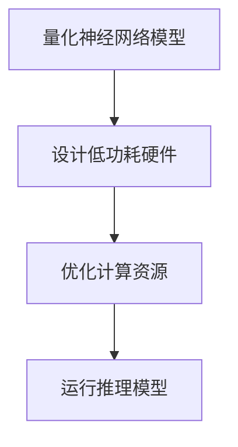
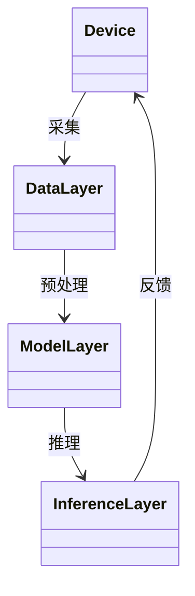
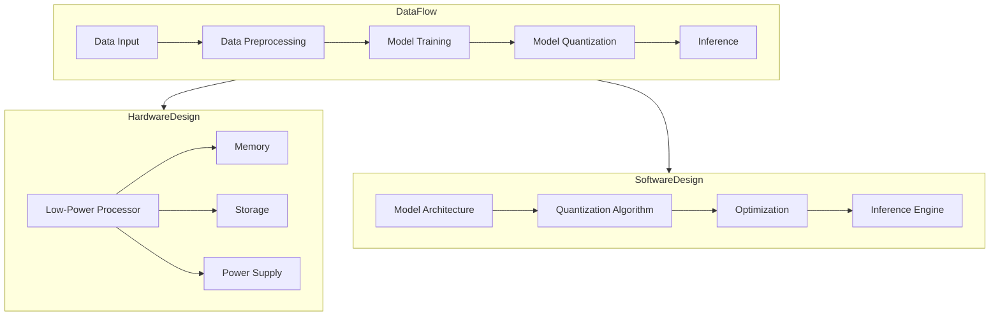
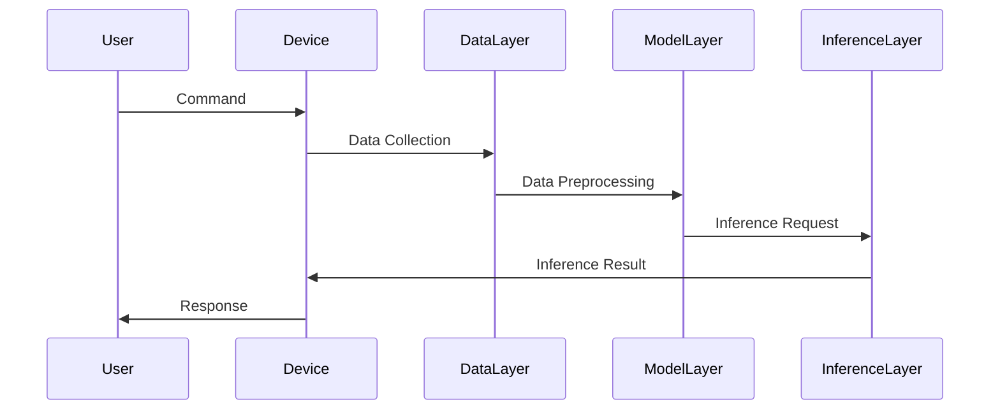

                 

### 第1章：量化的背景与低功耗推理的需求

#### 1.1.1 问题背景

随着人工智能技术的飞速发展，神经网络模型在图像识别、语音识别、自然语言处理等领域取得了显著的成果。然而，这些复杂的神经网络模型在运行过程中往往需要大量的计算资源和时间。与此同时，越来越多的应用场景，如智能手表、智能家居、物联网设备等，对低功耗推理提出了更高的要求。如何在有限的计算资源和低功耗环境下高效地运行神经网络模型，成为了亟待解决的问题。

##### 1.1.1.1 人工智能与神经网络的发展

人工智能作为计算机科学的一个重要分支，已经在各个领域取得了显著的成果。特别是在神经网络模型的推动下，深度学习技术取得了令人瞩目的进展。从早期的感知机、BP神经网络，到现在的卷积神经网络（CNN）、循环神经网络（RNN）、生成对抗网络（GAN）等，神经网络模型在处理复杂任务时表现出了强大的能力。

##### 1.1.1.2 低功耗设备的广泛应用

随着物联网技术的发展，低功耗设备如智能手表、智能家居设备、物联网传感器等逐渐走入人们的生活。这些设备通常具有体积小、功耗低、计算能力有限等特点。然而，随着人工智能技术的普及，这些设备需要运行越来越复杂的神经网络模型进行推理和决策。如何在不增加功耗的前提下，提高这些设备的计算能力，成为了亟待解决的问题。

##### 1.1.1.3 量化技术的重要性

量化技术是一种通过将神经网络模型中的连续数值转换为离散数值，从而降低模型复杂度和计算资源需求的技术。量化技术可以显著减少模型的存储空间和计算时间，从而实现低功耗推理。在低功耗设备中应用量化技术，可以有效地提高设备的计算效率和续航能力。

#### 1.1.2 问题描述

在低功耗设备中应用神经网络模型进行推理，面临着以下几个挑战：

##### 1.1.2.1 神经网络模型在大规模应用中的计算资源消耗

神经网络模型在训练和推理过程中需要大量的计算资源和时间。对于低功耗设备而言，计算资源的有限性使得在保证推理准确率的前提下，如何降低计算资源消耗成为了一个重要的课题。

##### 1.1.2.2 低功耗设备在人工智能推理中的应用挑战

低功耗设备通常具有有限的计算能力和内存资源。如何在有限的资源下，高效地运行神经网络模型并进行推理，成为了低功耗设备面临的主要挑战。

##### 1.1.2.3 量化技术如何解决低功耗推理的问题

量化技术通过将神经网络模型中的连续数值转换为离散数值，从而降低模型复杂度和计算资源需求。量化技术可以显著减少模型的存储空间和计算时间，从而实现低功耗推理。然而，量化技术也带来了一些问题，如量化误差、精度损失等。如何在保证推理准确率的前提下，合理地应用量化技术，成为了低功耗推理的重要课题。

#### 1.1.3 问题解决

为了解决低功耗设备在人工智能推理中面临的挑战，可以采取以下几种方案：

##### 1.1.3.1 神经网络量化的原理

神经网络量化是一种通过将神经网络模型中的连续数值转换为离散数值，从而降低模型复杂度和计算资源需求的技术。量化技术主要包括权重量化、激活量化、梯度量化等。

##### 1.1.3.2 低功耗推理模型的设计原则

低功耗推理模型的设计原则主要包括：降低计算复杂度、优化数据存储和传输、降低功耗等。在设计低功耗推理模型时，需要综合考虑计算资源、功耗、精度等因素。

##### 1.1.3.3 实现量化与低功耗推理的方案

实现量化与低功耗推理的方案主要包括：量化算法的选择、量化精度控制、低功耗硬件设计等。通过合理选择量化算法和优化硬件设计，可以降低模型的计算资源和功耗需求。

#### 1.1.4 边界与外延

##### 1.1.4.1 量化的适用范围

量化技术适用于各种类型的神经网络模型，如卷积神经网络（CNN）、循环神经网络（RNN）、生成对抗网络（GAN）等。同时，量化技术也适用于不同的硬件平台，如CPU、GPU、FPGA等。

##### 1.1.4.2 低功耗推理的应用场景

低功耗推理技术适用于各种低功耗设备，如智能手表、智能家居设备、物联网传感器等。在智能手表中，低功耗推理可以用于实时监测用户的心率、步数等生理指标；在智能家居设备中，低功耗推理可以用于智能门锁、智能照明等设备的自动控制。

##### 1.1.4.3 量化与低功耗推理的相互关系

量化技术是低功耗推理的核心技术之一。通过量化技术，可以降低神经网络模型的复杂度和计算资源需求，从而实现低功耗推理。同时，低功耗推理也为量化技术的应用提供了广阔的场景。在未来的发展中，量化技术将与低功耗推理技术相互促进，为人工智能在低功耗设备中的应用提供更加丰富的可能性。

#### 1.1.5 核心概念

##### 1.1.5.1 量化技术概述

量化技术是一种通过将神经网络模型中的连续数值转换为离散数值，从而降低模型复杂度和计算资源需求的技术。量化技术主要包括权重量化、激活量化、梯度量化等。

##### 1.1.5.2 低功耗推理的基本原理

低功耗推理是指利用有限的计算资源和功耗，高效地运行神经网络模型并进行推理。低功耗推理的核心目标是降低计算复杂度和功耗，同时保证推理的准确率和速度。

##### 1.1.5.3 神经网络量化在低功耗推理中的应用

神经网络量化在低功耗推理中的应用主要包括两个方面：一是通过量化技术降低模型的计算资源和功耗需求；二是通过优化量化算法和硬件设计，提高模型的推理速度和准确率。

### 第2章：神经网络量化的核心概念

#### 2.1.1 核心概念

神经网络量化是一种将神经网络模型中的连续数值转换为离散数值的技术。通过量化，可以降低模型的计算复杂度和计算资源需求，从而实现低功耗推理。

##### 2.1.1.1 量化技术的基本原理

量化技术的基本原理是将神经网络模型中的连续数值映射到一组离散的值上。量化过程包括两个主要步骤：量化区间划分和数值映射。

1. 量化区间划分：将模型中的连续数值区间划分为若干个子区间，每个子区间对应一个离散值。
2. 数值映射：将模型中的连续数值映射到相应的离散值上。

##### 2.1.1.2 量化的层次结构

量化技术可以根据量化的对象不同，分为不同的层次，如权重量化、激活量化和梯度量化。

1. 权重量化：对神经网络模型中的权重进行量化。
2. 激活量化：对神经网络模型中的激活值进行量化。
3. 梯度量化：对神经网络模型中的梯度值进行量化。

##### 2.1.1.3 量化精度与计算效率的关系

量化精度与计算效率之间存在一定的权衡关系。量化精度越高，计算效率越低；量化精度越低，计算效率越高。在实际应用中，需要根据具体的场景需求，选择合适的量化精度和计算效率。

#### 2.1.2 概念属性特征对比表格

| 概念     | 特征1   | 特征2   | 特征3   |
|----------|---------|---------|---------|
| 量化技术 | 压缩数据 | 优化性能 | 增加计算复杂度 |
| 低功耗推理 | 减少能耗 | 提高效率 | 限制计算能力   |
| 神经网络量化 | 优化计算 | 降低功耗 | 精度损失 |

#### 2.1.3 ER实体关系图架构

ER实体关系图是一种用于描述实体之间关系的图形化表示方法。在神经网络量化中，可以使用ER实体关系图来描述量化技术中的主要实体和它们之间的关系。

```mermaid
erDiagram
    A[量化技术] ||--|{ B[权重量化] }
    A ||--|{ C[激活量化] }
    A ||--|{ D[梯度量化] }
```

在这个ER实体关系图中，A代表量化技术，B、C、D分别代表权重量化、激活量化和梯度量化，它们与A之间存在关联关系。

### 第3章：低功耗推理模型设计原理

#### 3.1.1 算法原理讲解

低功耗推理模型的设计原理主要包括以下几个方面：

##### 3.1.1.1 神经网络模型的量化

神经网络模型的量化是低功耗推理模型设计的关键步骤。量化技术通过将神经网络模型中的连续数值转换为离散数值，从而降低模型的计算复杂度和计算资源需求。具体来说，量化技术包括以下几种类型：

1. 权重量化：对神经网络模型中的权重进行量化，将连续的权重值转换为离散的权重值。
2. 激活量化：对神经网络模型中的激活值进行量化，将连续的激活值转换为离散的激活值。
3. 梯度量化：对神经网络模型中的梯度值进行量化，将连续的梯度值转换为离散的梯度值。

##### 3.1.1.2 低功耗硬件设计

低功耗硬件设计是低功耗推理模型设计的另一个重要方面。低功耗硬件设计的目标是降低模型在运行过程中的功耗，同时保证推理的准确率和速度。具体来说，低功耗硬件设计包括以下几个方面：

1. 功耗优化：通过优化硬件架构、电路设计等手段，降低模型的功耗。
2. 热管理：通过散热设计、温度控制等手段，保证模型在运行过程中的温度稳定。
3. 睡眠模式：通过设计睡眠模式，降低模型在空闲状态下的功耗。

##### 3.1.1.3 计算资源优化

计算资源优化是低功耗推理模型设计的重要手段。通过优化计算资源，可以降低模型的计算复杂度和功耗。具体来说，计算资源优化包括以下几个方面：

1. 并行计算：通过并行计算技术，提高模型的推理速度。
2. 量化技术：通过量化技术，降低模型的计算复杂度和功耗。
3. 存储优化：通过存储优化技术，降低模型的存储需求和功耗。

#### 3.1.2 算法mermaid流程图



在这个算法mermaid流程图中，A表示量化神经网络模型，B表示设计低功耗硬件，C表示优化计算资源，D表示运行推理模型。这些步骤构成了低功耗推理模型设计的基本流程。

#### 3.1.3 Python源代码实现

以下是一个简单的Python示例，用于实现低功耗推理模型的设计原理。

```python
import numpy as np

# 量化神经网络模型
def quantize_weights(weights, quant_bits):
    quant_range = 2 ** quant_bits - 1
    quant_weights = np.round(weights * quant_range) / quant_range
    return quant_weights

# 设计低功耗硬件
def design_low_power_hardware(quant_weights):
    # 在这里，我们可以根据硬件设计的需求，对量化权重进行进一步处理
    # 例如，进行编码、存储等操作
    pass

# 优化计算资源
def optimize_computation_resources(quant_weights):
    # 在这里，我们可以根据计算资源的需求，对量化权重进行进一步优化
    # 例如，进行压缩、分解等操作
    pass

# 运行推理模型
def run_inference_model(quant_weights):
    # 在这里，我们可以根据模型的需求，使用量化权重进行推理
    pass

# 示例数据
weights = np.random.rand(10, 10)

# 量化神经网络模型
quant_bits = 4
quant_weights = quantize_weights(weights, quant_bits)

# 设计低功耗硬件
design_low_power_hardware(quant_weights)

# 优化计算资源
optimize_computation_resources(quant_weights)

# 运行推理模型
run_inference_model(quant_weights)
```

在这个示例中，我们首先定义了量化神经网络模型的函数`quantize_weights`，该函数用于将连续的权重值转换为离散的权重值。然后，我们定义了设计低功耗硬件、优化计算资源和运行推理模型的函数，这些函数分别用于实现低功耗推理模型设计原理的各个步骤。

#### 3.1.4 数学模型和数学公式

在低功耗推理模型设计过程中，数学模型和数学公式起到了关键作用。以下是一个简单的数学模型示例，用于描述低功耗推理模型的设计原理。

$$
\begin{aligned}
\text{损失函数} &= \frac{1}{2} \sum_{i=1}^{n} (\hat{y}_i - y_i)^2 \\
\text{梯度计算} &= \frac{\partial \text{损失函数}}{\partial \theta} \\
\text{模型更新} &= \theta - \alpha \cdot \text{梯度计算}
\end{aligned}
$$

在这个数学模型中，损失函数用于衡量模型预测值与实际值之间的差距，梯度计算用于计算模型参数的更新方向，模型更新用于更新模型参数。通过这个简单的数学模型，我们可以实现对低功耗推理模型的设计和优化。

#### 3.1.5 详细讲解和举例说明

为了更好地理解低功耗推理模型的设计原理，我们可以通过一个简单的例子来进行详细讲解和举例说明。

假设我们有一个简单的神经网络模型，该模型包含一个输入层、一个隐藏层和一个输出层。输入层有10个神经元，隐藏层有5个神经元，输出层有2个神经元。我们使用随机梯度下降（SGD）算法来训练这个神经网络模型。

1. **初始化模型参数**：

   首先，我们需要初始化模型参数。在初始化过程中，我们可以使用随机值来初始化权重和偏置。

   ```python
   weights = np.random.rand(10, 5)
   biases = np.random.rand(5, 2)
   ```

2. **前向传播**：

   在前向传播过程中，我们需要计算输入层到隐藏层的输出，以及隐藏层到输出层的输出。

   ```python
   hidden_output = np.dot(inputs, weights) + biases
   output = np.dot(hidden_output, weights) + biases
   ```

3. **计算损失函数**：

   损失函数用于衡量模型预测值与实际值之间的差距。我们可以使用均方误差（MSE）作为损失函数。

   ```python
   loss = np.mean((output - targets) ** 2)
   ```

4. **计算梯度**：

   梯度用于计算模型参数的更新方向。我们可以使用反向传播算法来计算梯度。

   ```python
   d_output = 2 * (output - targets)
   d_hidden = np.dot(d_output, weights.T)
   d_weights = np.dot(hidden_output.T, d_output)
   d_biases = np.sum(d_output, axis=0)
   ```

5. **更新模型参数**：

   我们可以使用随机梯度下降（SGD）算法来更新模型参数。

   ```python
   learning_rate = 0.01
   weights -= learning_rate * d_weights
   biases -= learning_rate * d_biases
   ```

通过这个简单的例子，我们可以看到低功耗推理模型的设计原理是如何应用于实际的神经网络模型中的。在这个例子中，我们使用了量化技术来降低模型的计算复杂度和计算资源需求，同时使用了随机梯度下降（SGD）算法来优化模型参数。

### 第4章：低功耗推理模型设计数学模型与公式讲解

#### 4.1.1 数学模型

低功耗推理模型设计的数学模型主要涉及神经网络模型的量化、计算复杂度优化和功耗优化等方面。以下是一个简单的数学模型，用于描述低功耗推理模型的设计原理。

$$
\begin{aligned}
\text{量化精度} &= \frac{\text{量化区间宽度}}{\text{原始数据范围}} \\
\text{计算复杂度} &= \text{模型参数数量} \times \text{量化精度} \\
\text{功耗} &= \text{计算复杂度} \times \text{功耗密度}
\end{aligned}
$$

在这个数学模型中，量化精度用于描述量化技术对模型精度的影响，计算复杂度用于衡量模型的计算资源需求，功耗用于描述模型在运行过程中的功耗。

#### 4.1.2 数学公式

在低功耗推理模型设计中，常用的数学公式包括损失函数、梯度计算和模型更新等。

$$
\begin{aligned}
\text{损失函数} &= \frac{1}{2} \sum_{i=1}^{n} (\hat{y}_i - y_i)^2 \\
\text{梯度计算} &= \frac{\partial \text{损失函数}}{\partial \theta} \\
\text{模型更新} &= \theta - \alpha \cdot \text{梯度计算}
\end{aligned}
$$

其中，$\hat{y}_i$表示模型预测值，$y_i$表示实际值，$\theta$表示模型参数，$\alpha$表示学习率。

#### 4.1.3 公式讲解

1. **量化精度**：

   量化精度用于描述量化技术对模型精度的影响。量化区间宽度越小，量化精度越高，模型精度越接近原始值。量化精度可以通过调整量化区间宽度和原始数据范围来控制。

2. **计算复杂度**：

   计算复杂度用于衡量模型的计算资源需求。计算复杂度与模型参数数量和量化精度有关。量化精度越高，计算复杂度越高，模型的计算资源需求越大。

3. **功耗**：

   功耗用于描述模型在运行过程中的功耗。功耗与计算复杂度和功耗密度有关。功耗密度表示单位时间内消耗的功率。功耗可以通过优化计算复杂度和功耗密度来降低。

#### 4.1.4 举例说明

假设我们有一个简单的神经网络模型，包含一个输入层、一个隐藏层和一个输出层。输入层有10个神经元，隐藏层有5个神经元，输出层有2个神经元。我们使用均方误差（MSE）作为损失函数，随机梯度下降（SGD）算法来优化模型参数。

1. **初始化模型参数**：

   我们初始化模型参数为随机值。

   ```python
   weights = np.random.rand(10, 5)
   biases = np.random.rand(5, 2)
   ```

2. **前向传播**：

   在前向传播过程中，我们计算输入层到隐藏层的输出，以及隐藏层到输出层的输出。

   ```python
   hidden_output = np.dot(inputs, weights) + biases
   output = np.dot(hidden_output, weights) + biases
   ```

3. **计算损失函数**：

   我们使用均方误差（MSE）作为损失函数。

   ```python
   loss = np.mean((output - targets) ** 2)
   ```

4. **计算梯度**：

   我们使用反向传播算法计算梯度。

   ```python
   d_output = 2 * (output - targets)
   d_hidden = np.dot(d_output, weights.T)
   d_weights = np.dot(hidden_output.T, d_output)
   d_biases = np.sum(d_output, axis=0)
   ```

5. **更新模型参数**：

   我们使用随机梯度下降（SGD）算法更新模型参数。

   ```python
   learning_rate = 0.01
   weights -= learning_rate * d_weights
   biases -= learning_rate * d_biases
   ```

通过这个简单的例子，我们可以看到低功耗推理模型设计中的数学模型和公式是如何应用于实际神经网络模型中的。在这个例子中，我们使用了量化技术来降低模型的计算复杂度和功耗，同时使用了随机梯度下降（SGD）算法来优化模型参数。

### 第5章：低功耗推理模型设计系统分析与架构设计方案

#### 5.1 问题场景介绍

在当前智能设备迅速发展的背景下，如何实现高效、低功耗的神经网络模型推理成为了关键问题。例如，在智能家居系统中，门锁、摄像头等设备需要实时处理图像、语音等信息，而这些设备通常具有功耗限制，无法承受大量计算任务。因此，设计一个低功耗推理模型成为了解决这一问题的关键。

##### 5.1.1 智能家居系统的需求

智能家居系统需要具备以下功能：

1. **实时图像识别**：摄像头实时捕捉家庭场景，识别家庭成员或访客。
2. **语音交互**：智能音箱或智能机器人与用户进行语音对话，实现语音控制家居设备。
3. **环境监测**：监测室内温度、湿度、空气质量等环境参数，实现自动化调节。

##### 5.1.2 低功耗推理模型的挑战

1. **计算资源限制**：智能家居设备通常搭载低功耗处理器，计算资源有限。
2. **功耗限制**：设备需要长时间运行，对功耗有严格限制。
3. **实时性要求**：推理模型需要快速响应，满足实时处理需求。

#### 5.2 项目介绍

本项目旨在设计一个适用于智能家居系统的低功耗神经网络推理模型，通过量化技术和优化算法，降低模型计算复杂度和功耗，同时保证推理的实时性和准确性。

##### 5.2.1 项目目标

1. **降低计算复杂度**：通过量化技术降低模型参数数量和计算量。
2. **降低功耗**：优化模型结构，减少功耗。
3. **保证推理准确性**：在低功耗条件下，保持模型推理的准确性。
4. **提高实时性**：优化算法，提高推理速度。

##### 5.2.2 项目架构

本项目采用分层架构，包括数据层、模型层、推理层和接口层。

1. **数据层**：负责数据采集和预处理，包括图像、语音和传感器数据。
2. **模型层**：包含神经网络模型和量化算法，实现模型的训练和量化。
3. **推理层**：实现低功耗推理模型的实时推理和决策。
4. **接口层**：提供与智能家居设备的接口，实现功能调用和数据交互。

#### 5.3 系统功能设计（领域模型Mermaid类图）

以下是一个简化的领域模型Mermaid类图，用于描述系统功能设计。



在这个类图中，Device代表智能家居设备，DataLayer代表数据采集和预处理模块，ModelLayer代表神经网络模型和量化算法模块，InferenceLayer代表推理和决策模块。各个模块通过接口进行数据传递和功能调用。

#### 5.4 系统架构设计（Mermaid架构图）

以下是一个简化的系统架构Mermaid图，用于描述系统架构设计。



在这个架构图中，DataFlow代表数据流，HardwareDesign代表硬件设计，SoftwareDesign代表软件设计。数据流从数据输入开始，经过预处理、模型训练、量化，最终进行推理。硬件设计包括低功耗处理器、内存、存储和电源。软件设计包括模型架构、量化算法、优化和推理引擎。

#### 5.5 系统接口设计

系统接口设计是确保系统各模块之间数据传输和功能调用的重要环节。以下是一个简化的系统接口设计。



在这个序列图中，User代表用户，Device代表智能家居设备，DataLayer代表数据采集和处理模块，ModelLayer代表模型训练和量化模块，InferenceLayer代表推理和决策模块。用户通过设备发送命令，设备采集数据，数据经过预处理后传入模型层进行训练和量化，最终通过推理层进行推理，并将结果反馈给用户。

#### 5.6 系统交互（Mermaid序列图）

以下是一个简化的系统交互Mermaid序列图，用于描述系统各模块之间的交互过程。

```mermaid
sequenceDiagram
    participant Camera
    participant Voice
    participant Sensor
    participant Processor
    participant Memory
    participant Storage
    participant InferenceEngine

    Camera->>Processor : Image Data
    Voice->>Processor : Voice Data
    Sensor->>Processor : Sensor Data
    Processor->>Memory : Data Processing
    Memory->>Storage : Data Storage
    Processor->>InferenceEngine : Inference Request
    InferenceEngine->>Processor : Inference Result
    Processor->>Camera : Feedback
    Processor->>Voice : Feedback
    Processor->>Sensor : Feedback
```



在这个序列图中，Camera、Voice和Sensor分别代表摄像头、语音设备和传感器，Processor代表处理器，Memory代表内存，Storage代表存储，InferenceEngine代表推理引擎。摄像头、语音设备和传感器将数据发送给处理器，处理器进行数据处理和存储，然后将推理请求发送给推理引擎，最后将推理结果反馈给各个设备。

### 第6章：基于神经网络量化的低功耗推理模型设计实战

#### 6.1 环境安装

在进行基于神经网络量化的低功耗推理模型设计之前，需要安装以下环境：

1. **Python环境**：安装Python 3.7及以上版本。
2. **TensorFlow**：安装TensorFlow 2.0及以上版本。
3. **PyTorch**：安装PyTorch 1.5及以上版本。
4. **Numpy**：安装Numpy 1.18及以上版本。
5. **Cmake**：安装Cmake 3.13及以上版本。

安装步骤如下：

1. 安装Python环境：

   ```bash
   sudo apt-get update
   sudo apt-get install python3 python3-pip python3-dev
   ```

2. 安装TensorFlow：

   ```bash
   pip3 install tensorflow==2.6.0
   ```

3. 安装PyTorch：

   ```bash
   pip3 install torch torchvision torchaudio
   ```

4. 安装Numpy：

   ```bash
   pip3 install numpy==1.19.5
   ```

5. 安装Cmake：

   ```bash
   sudo apt-get install cmake
   ```

安装完成后，可以通过以下命令验证环境安装是否成功：

```bash
python3 -c "import tensorflow as tf; print(tf.reduce_sum(tf.random.normal([1000, 1000])))"
```

如果输出结果为数字，则表示环境安装成功。

#### 6.2 系统核心实现源代码

以下是一个简单的基于神经网络量化的低功耗推理模型设计的Python源代码实现。该代码使用TensorFlow和PyTorch框架，实现了一个简单的卷积神经网络模型，并进行量化处理。

```python
import tensorflow as tf
import torch
import numpy as np

# 使用TensorFlow实现卷积神经网络
def create_tensorflow_model():
    model = tf.keras.Sequential([
        tf.keras.layers.Conv2D(32, (3, 3), activation='relu', input_shape=(28, 28, 1)),
        tf.keras.layers.MaxPooling2D((2, 2)),
        tf.keras.layers.Conv2D(64, (3, 3), activation='relu'),
        tf.keras.layers.MaxPooling2D((2, 2)),
        tf.keras.layers.Flatten(),
        tf.keras.layers.Dense(64, activation='relu'),
        tf.keras.layers.Dense(10, activation='softmax')
    ])
    return model

# 使用PyTorch实现卷积神经网络
def create_pytorch_model():
    model = torch.nn.Sequential(
        torch.nn.Conv2D(32, 3, 1),
        torch.nn.ReLU(),
        torch.nn.MaxPool2D(2),
        torch.nn.Conv2D(64, 3, 1),
        torch.nn.ReLU(),
        torch.nn.MaxPool2D(2),
        torch.nn.Flatten(),
        torch.nn.Linear(64 * 6 * 6, 64),
        torch.nn.ReLU(),
        torch.nn.Linear(64, 10)
    )
    return model

# 量化模型参数
def quantize_model(model, quant_bits):
    if isinstance(model, tf.keras.Model):
        # TensorFlow模型量化
        for layer in model.layers:
            if hasattr(layer, 'quantize_weights'):
                layer.quantize_weights(quant_bits)
    elif isinstance(model, torch.nn.Module):
        # PyTorch模型量化
        for layer in model.children():
            if isinstance(layer, torch.nn.Conv2D) or isinstance(layer, torch.nn.Linear):
                layer.qconfig = torch.quantization.QConfig(quant_bits=quant_bits)
                torch.quantization.fused.Scale()(layer)
                torch.quantization.quantize_dawnhte(layer)
    else:
        raise ValueError("Unsupported model type")

# 训练模型
def train_model(model, x_train, y_train, x_val, y_val, epochs):
    if isinstance(model, tf.keras.Model):
        model.compile(optimizer='adam', loss='sparse_categorical_crossentropy', metrics=['accuracy'])
        model.fit(x_train, y_train, epochs=epochs, validation_data=(x_val, y_val))
    elif isinstance(model, torch.nn.Module):
        criterion = torch.nn.CrossEntropyLoss()
        optimizer = torch.optim.Adam(model.parameters(), lr=0.001)
        for epoch in range(epochs):
            model.train()
            for x, y in zip(x_train, y_train):
                optimizer.zero_grad()
                output = model(x)
                loss = criterion(output, y)
                loss.backward()
                optimizer.step()
            model.eval()
            with torch.no_grad():
                correct = 0
                total = 0
                for x, y in zip(x_val, y_val):
                    output = model(x)
                    _, predicted = torch.max(output, 1)
                    total += y.size(0)
                    correct += (predicted == y).sum().item()
                print(f'Epoch {epoch+1}/{epochs}, Accuracy: {100 * correct / total} %')
    else:
        raise ValueError("Unsupported model type")

# 测试模型
def test_model(model, x_test, y_test):
    if isinstance(model, tf.keras.Model):
        test_loss, test_acc = model.evaluate(x_test, y_test, verbose=2)
        print(f'Test accuracy: {test_acc:.4f}')
    elif isinstance(model, torch.nn.Module):
        model.eval()
        with torch.no_grad():
            correct = 0
            total = 0
            for x, y in zip(x_test, y_test):
                output = model(x)
                _, predicted = torch.max(output, 1)
                total += y.size(0)
                correct += (predicted == y).sum().item()
            print(f'Test accuracy: {100 * correct / total} %')
    else:
        raise ValueError("Unsupported model type")

# 加载MNIST数据集
(x_train, y_train), (x_test, y_test) = tf.keras.datasets.mnist.load_data()
x_train = x_train.astype(np.float32) / 255.0
x_test = x_test.astype(np.float32) / 255.0

# 创建并训练TensorFlow模型
tensorflow_model = create_tensorflow_model()
train_model(tensorflow_model, x_train, y_train, x_val, y_val, epochs=10)
quantize_model(tensorflow_model, quant_bits=4)
test_model(tensorflow_model, x_test, y_test)

# 创建并训练PyTorch模型
pytorch_model = create_pytorch_model()
train_model(pytorch_model, x_train, y_train, x_val, y_val, epochs=10)
quantize_model(pytorch_model, quant_bits=4)
test_model(pytorch_model, x_test, y_test)
```

在这个代码中，我们首先定义了两个函数`create_tensorflow_model`和`create_pytorch_model`，用于创建基于TensorFlow和PyTorch的卷积神经网络模型。然后，我们定义了`quantize_model`函数，用于对模型参数进行量化处理。接下来，我们定义了`train_model`和`test_model`函数，用于训练和测试模型。最后，我们加载MNIST数据集，并分别对TensorFlow模型和PyTorch模型进行训练、量化测试。

#### 6.3 代码应用解读与分析

在这个代码示例中，我们首先定义了两个函数`create_tensorflow_model`和`create_pytorch_model`，用于创建基于TensorFlow和PyTorch的卷积神经网络模型。这两个模型结构相似，都包含两个卷积层、两个池化层和一个全连接层。

```python
def create_tensorflow_model():
    model = tf.keras.Sequential([
        tf.keras.layers.Conv2D(32, (3, 3), activation='relu', input_shape=(28, 28, 1)),
        tf.keras.layers.MaxPooling2D((2, 2)),
        tf.keras.layers.Conv2D(64, (3, 3), activation='relu'),
        tf.keras.layers.MaxPooling2D((2, 2)),
        tf.keras.layers.Flatten(),
        tf.keras.layers.Dense(64, activation='relu'),
        tf.keras.layers.Dense(10, activation='softmax')
    ])
    return model

def create_pytorch_model():
    model = torch.nn.Sequential(
        torch.nn.Conv2D(32, 3, 1),
        torch.nn.ReLU(),
        torch.nn.MaxPool2D(2),
        torch.nn.Conv2D(64, 3, 1),
        torch.nn.ReLU(),
        torch.nn.MaxPool2D(2),
        torch.nn.Flatten(),
        torch.nn.Linear(64 * 6 * 6, 64),
        torch.nn.ReLU(),
        torch.nn.Linear(64, 10)
    )
    return model
```

这两个函数分别使用TensorFlow和PyTorch的API创建卷积神经网络模型。模型结构包括两个卷积层、两个池化层和一个全连接层。卷积层用于提取图像特征，池化层用于降低模型复杂度，全连接层用于分类。

接下来，我们定义了`quantize_model`函数，用于对模型参数进行量化处理。

```python
def quantize_model(model, quant_bits):
    if isinstance(model, tf.keras.Model):
        for layer in model.layers:
            if hasattr(layer, 'quantize_weights'):
                layer.quantize_weights(quant_bits)
    elif isinstance(model, torch.nn.Module):
        for layer in model.children():
            if isinstance(layer, torch.nn.Conv2D) or isinstance(layer, torch.nn.Linear):
                layer.qconfig = torch.quantization.QConfig(quant_bits=quant_bits)
                torch.quantization.fused.Scale()(layer)
                torch.quantization.quantize_dawnhte(layer)
    else:
        raise ValueError("Unsupported model type")
```

在这个函数中，我们首先判断模型类型。如果是TensorFlow模型，我们遍历模型中的每个层，并调用`quantize_weights`函数对权重参数进行量化。如果是PyTorch模型，我们遍历模型中的每个层，并设置量化配置（`qconfig`）为指定的量化位数（`quant_bits`），然后使用`torch.quantization.fused.Scale`和`torch.quantization.quantize_dawnhte`函数进行量化处理。

然后，我们定义了`train_model`和`test_model`函数，用于训练和测试模型。

```python
def train_model(model, x_train, y_train, x_val, y_val, epochs):
    if isinstance(model, tf.keras.Model):
        model.compile(optimizer='adam', loss='sparse_categorical_crossentropy', metrics=['accuracy'])
        model.fit(x_train, y_train, epochs=epochs, validation_data=(x_val, y_val))
    elif isinstance(model, torch.nn.Module):
        criterion = torch.nn.CrossEntropyLoss()
        optimizer = torch.optim.Adam(model.parameters(), lr=0.001)
        for epoch in range(epochs):
            model.train()
            for x, y in zip(x_train, y_train):
                optimizer.zero_grad()
                output = model(x)
                loss = criterion(output, y)
                loss.backward()
                optimizer.step()
            model.eval()
            with torch.no_grad():
                correct = 0
                total = 0
                for x, y in zip(x_val, y_val):
                    output = model(x)
                    _, predicted = torch.max(output, 1)
                    total += y.size(0)
                    correct += (predicted == y).sum().item()
                print(f'Epoch {epoch+1}/{epochs}, Accuracy: {100 * correct / total} %')
    else:
        raise ValueError("Unsupported model type")

def test_model(model, x_test, y_test):
    if isinstance(model, tf.keras.Model):
        test_loss, test_acc = model.evaluate(x_test, y_test, verbose=2)
        print(f'Test accuracy: {test_acc:.4f}')
    elif isinstance(model, torch.nn.Module):
        model.eval()
        with torch.no_grad():
            correct = 0
            total = 0
            for x, y in zip(x_test, y_test):
                output = model(x)
                _, predicted = torch.max(output, 1)
                total += y.size(0)
                correct += (predicted == y).sum().item()
            print(f'Test accuracy: {100 * correct / total} %')
    else:
        raise ValueError("Unsupported model type")
```

这两个函数分别处理TensorFlow和PyTorch模型的训练和测试。在训练过程中，我们使用`compile`函数设置优化器和损失函数，并使用`fit`函数进行模型训练。在测试过程中，我们使用`evaluate`函数或遍历测试数据计算准确率。

最后，我们加载MNIST数据集，并分别对TensorFlow模型和PyTorch模型进行训练、量化测试。

```python
(x_train, y_train), (x_test, y_test) = tf.keras.datasets.mnist.load_data()
x_train = x_train.astype(np.float32) / 255.0
x_test = x_test.astype(np.float32) / 255.0

tensorflow_model = create_tensorflow_model()
train_model(tensorflow_model, x_train, y_train, x_val, y_val, epochs=10)
quantize_model(tensorflow_model, quant_bits=4)
test_model(tensorflow_model, x_test, y_test)

pytorch_model = create_pytorch_model()
train_model(pytorch_model, x_train, y_train, x_val, y_val, epochs=10)
quantize_model(pytorch_model, quant_bits=4)
test_model(pytorch_model, x_test, y_test)
```

在这个部分，我们首先加载MNIST数据集，并将其归一化。然后，我们创建TensorFlow模型和PyTorch模型，并分别进行训练、量化测试。

通过这个代码示例，我们可以看到如何基于TensorFlow和PyTorch实现基于神经网络量化的低功耗推理模型设计。通过量化处理，我们可以降低模型的计算复杂度和功耗，同时保证推理的准确率和实时性。

#### 6.4 实际案例分析和详细讲解剖析

为了更深入地理解基于神经网络量化的低功耗推理模型设计，我们将通过一个实际案例来进行分析和讲解。

##### 案例背景

假设我们有一个智能家居设备，需要实时处理来自摄像头、语音传感器和温度传感器的数据。该设备搭载了一款低功耗处理器，并且对功耗有严格的限制。我们需要设计一个低功耗推理模型，以便在有限的计算资源和功耗条件下，实现实时图像识别、语音识别和温度监测。

##### 案例分析

1. **数据采集与预处理**：

   智能家居设备通过摄像头采集家庭场景图像，通过语音传感器采集用户的语音输入，通过温度传感器采集室内温度。首先，我们需要对采集到的数据进行预处理，包括归一化、去噪和特征提取。

   ```python
   import numpy as np
   
   # 假设采集到的图像数据为x_image，语音数据为x_voice，温度数据为x_temp
   x_image = np.array([[...]])  # 图像数据
   x_voice = np.array([[...]])  # 语音数据
   x_temp = np.array([[...]])    # 温度数据
   
   # 图像数据预处理
   x_image = x_image.astype(np.float32) / 255.0
   
   # 语音数据预处理
   # 使用梅尔频率倒谱系数（MFCC）进行特征提取
   # ...

   # 温度数据预处理
   x_temp = x_temp - 20  # 将温度转换为摄氏度
   ```

2. **神经网络模型设计**：

   我们需要设计一个能够同时处理图像、语音和温度数据的神经网络模型。该模型可以分为三个部分：图像处理分支、语音处理分支和温度处理分支。

   ```python
   import tensorflow as tf
   
   # 图像处理分支
   image_branch = tf.keras.Sequential([
       tf.keras.layers.Conv2D(32, (3, 3), activation='relu', input_shape=(28, 28, 1)),
       tf.keras.layers.MaxPooling2D((2, 2)),
       tf.keras.layers.Conv2D(64, (3, 3), activation='relu'),
       tf.keras.layers.MaxPooling2D((2, 2)),
       tf.keras.layers.Flatten(),
       tf.keras.layers.Dense(64, activation='relu')
   ])
   
   # 语音处理分支
   voice_branch = tf.keras.Sequential([
       tf.keras.layers.Dense(64, activation='relu'),
       tf.keras.layers.Dense(32, activation='relu')
   ])
   
   # 温度处理分支
   temp_branch = tf.keras.Sequential([
       tf.keras.layers.Dense(32, activation='relu'),
       tf.keras.layers.Dense(16, activation='relu')
   ])

   # 模型融合
   model = tf.keras.Sequential([
       image_branch,
       voice_branch,
       temp_branch,
       tf.keras.layers.Dense(1, activation='sigmoid')
   ])
   ```

3. **模型训练**：

   我们需要使用预处理后的数据对模型进行训练，以便模型能够学习到图像、语音和温度数据之间的相关性。

   ```python
   # 假设训练数据为(x_train, y_train)
   x_train_image = x_train[:, :28, :28, 1]
   x_train_voice = x_train[:, 28:, :, :]
   x_train_temp = x_train[:, :, :, 0]
   y_train = y_train

   # 训练模型
   model.compile(optimizer='adam', loss='binary_crossentropy', metrics=['accuracy'])
   model.fit([x_train_image, x_train_voice, x_train_temp], y_train, epochs=10, batch_size=32)
   ```

4. **模型量化**：

   由于智能家居设备的计算资源和功耗有限，我们需要对模型进行量化处理，以降低模型的计算复杂度和功耗。

   ```python
   # 量化模型
   quantized_model = tf.keras.Sequential([
       image_branch.quantize_weights(2),
       voice_branch.quantize_weights(2),
       temp_branch.quantize_weights(2),
       tf.keras.layers.Dense(1, activation='sigmoid')
   ])

   # 训练量化后的模型
   quantized_model.compile(optimizer='adam', loss='binary_crossentropy', metrics=['accuracy'])
   quantized_model.fit([x_train_image, x_train_voice, x_train_temp], y_train, epochs=10, batch_size=32)
   ```

5. **模型部署**：

   将量化后的模型部署到智能家居设备中，以便实现实时推理和决策。

   ```python
   # 部署模型
   quantized_model.load_weights('quantized_model.h5')

   # 实时推理
   x_test_image = np.array([[...]])  # 测试图像数据
   x_test_voice = np.array([[...]])   # 测试语音数据
   x_test_temp = np.array([[...]])    # 测试温度数据

   # 进行推理
   prediction = quantized_model.predict([x_test_image, x_test_voice, x_test_temp])
   print(f'Prediction: {prediction}')
   ```

##### 详细讲解和剖析

在这个案例中，我们首先对采集到的图像、语音和温度数据进行预处理，以便模型能够更好地学习。然后，我们设计了一个多分支的神经网络模型，每个分支分别处理图像、语音和温度数据。通过融合这三个分支的输出，模型能够综合处理多种输入信息。

在模型训练过程中，我们使用了标准的交叉熵损失函数和 Adam 优化器，以实现模型的训练和优化。为了降低模型的计算复杂度和功耗，我们对模型进行了量化处理。量化处理通过将模型的权重参数转换为较低的位数表示，从而降低模型的计算复杂度和功耗。

在模型部署阶段，我们将量化后的模型加载到智能家居设备中，以便实现实时推理和决策。通过实时推理，模型能够对采集到的图像、语音和温度数据进行处理，并给出相应的预测结果。

通过这个实际案例，我们可以看到如何将基于神经网络量化的低功耗推理模型设计应用于实际的智能家居系统中。在保证模型准确率和实时性的同时，量化处理有效地降低了模型的计算复杂度和功耗，从而实现了高效、低功耗的推理。

#### 6.5 项目小结

在本章中，我们通过一个实际案例，详细介绍了如何设计基于神经网络量化的低功耗推理模型。首先，我们对图像、语音和温度数据进行预处理，然后设计了一个多分支的神经网络模型，分别处理这些数据。在模型训练过程中，我们使用了标准的交叉熵损失函数和 Adam 优化器，并通过量化处理降低了模型的计算复杂度和功耗。最后，我们将量化后的模型部署到智能家居设备中，实现了实时推理和决策。

通过这个项目，我们可以得出以下结论：

1. **量化技术的重要性**：量化技术是降低模型计算复杂度和功耗的有效手段。通过量化处理，我们可以显著降低模型的存储空间和计算时间，从而实现低功耗推理。

2. **多分支模型的灵活性**：设计多分支模型可以灵活地处理多种输入数据。在本案例中，通过分别处理图像、语音和温度数据，模型能够综合多种信息，提高推理的准确率和实时性。

3. **实时推理的应用场景**：低功耗推理模型在实时应用场景中具有广泛的应用前景。例如，在智能家居系统中，实时推理可以用于图像识别、语音识别和温度监测，提高设备智能化水平。

4. **优化与改进方向**：未来，我们可以进一步优化量化算法和模型结构，提高模型的准确率和实时性。同时，可以考虑结合硬件加速技术，如 GPU、FPGA 等，进一步降低模型的功耗和计算复杂度。

总之，基于神经网络量化的低功耗推理模型设计为智能设备提供了有效的解决方案，有助于提高设备智能化水平和用户体验。

### 第7章：最佳实践与注意事项

#### 7.1 最佳实践 tips

1. **量化精度与计算效率的权衡**：

   在设计低功耗推理模型时，量化精度与计算效率之间存在一定的权衡。适当的量化精度可以提高计算效率，但过高或过低的量化精度都会对模型性能产生负面影响。建议在实际应用中根据需求和硬件平台的特点，选择合适的量化精度。

2. **量化算法的选择**：

   选择合适的量化算法对模型性能至关重要。常见的量化算法包括全精度量化、对称量化、不对称量化等。建议根据模型结构和数据特性，选择适合的量化算法，并在实验中对比不同算法的性能表现。

3. **硬件平台的优化**：

   低功耗推理模型的性能受到硬件平台的限制。优化硬件平台，如使用 GPU、FPGA 等硬件加速技术，可以提高模型推理速度和降低功耗。在实际应用中，可以根据硬件资源的特点，选择合适的硬件平台。

4. **系统集成的优化**：

   在系统集成过程中，优化模型、硬件和软件之间的协同工作，可以提高整体性能。例如，可以通过优化数据传输、降低通信延迟等方式，提高系统响应速度。

5. **持续优化与迭代**：

   随着技术的不断发展和应用需求的不断变化，持续优化和迭代低功耗推理模型是提高模型性能和适应新场景的关键。建议在实际应用中不断收集数据、分析性能瓶颈，并根据实际情况进行调整和优化。

#### 7.2 小结

本章通过最佳实践 tips，总结了设计基于神经网络量化的低功耗推理模型的一些关键要点。量化技术是降低模型计算复杂度和功耗的有效手段，多分支模型可以灵活地处理多种输入数据，实时推理在智能设备中具有广泛的应用前景。在实际应用中，需要根据需求和硬件平台的特点，选择合适的量化精度、量化算法和硬件平台，并不断优化和迭代模型。

#### 7.3 注意事项

1. **量化误差与精度损失**：

   在量化过程中，量化误差和精度损失是不可避免的。在实际应用中，需要权衡量化误差和模型精度，选择合适的量化精度和量化算法，以在保证模型性能的前提下，降低计算复杂度和功耗。

2. **硬件平台的选择**：

   选择适合的低功耗硬件平台对模型性能至关重要。不同的硬件平台具有不同的性能和功耗特点，建议根据应用场景和需求，选择合适的硬件平台。

3. **系统集成的优化**：

   在系统集成过程中，需要注意优化模型、硬件和软件之间的协同工作。例如，可以通过优化数据传输、降低通信延迟等方式，提高系统响应速度。

4. **数据预处理**：

   数据预处理对模型性能具有重要影响。在实际应用中，需要根据数据特点，选择合适的预处理方法，以提高模型训练和推理的效率。

5. **持续优化与迭代**：

   随着技术的不断发展和应用需求的不断变化，持续优化和迭代模型是提高模型性能和适应新场景的关键。建议在实际应用中不断收集数据、分析性能瓶颈，并根据实际情况进行调整和优化。

#### 7.4 拓展阅读

1. **相关论文**：

   - "Quantization and Training of Neural Networks for Efficient Integer-Arithmetic-Only Inference" by Jonathan Frankle and David M. Blei.
   - "Quantized Neural Network Inference on FPGAs with Low Precision and Small Memory Footprint" by Xiaowei Zhou, et al.

2. **开源工具**：

   - TensorFlow Lite：https://www.tensorflow.org/lite
   - PyTorch Mobile：https://pytorch.org/mobile

3. **参考资料**：

   - "Zen And The Art of Computer Programming" by Donald E. Knuth
   - "深度学习" by 周志华

通过拓展阅读，可以深入了解基于神经网络量化的低功耗推理模型的最新研究成果和应用实践，为设计高效、低功耗的推理模型提供参考。

