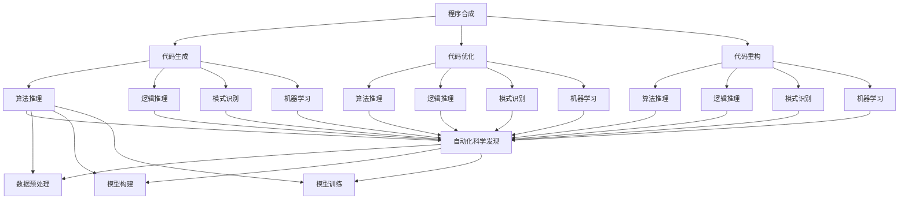
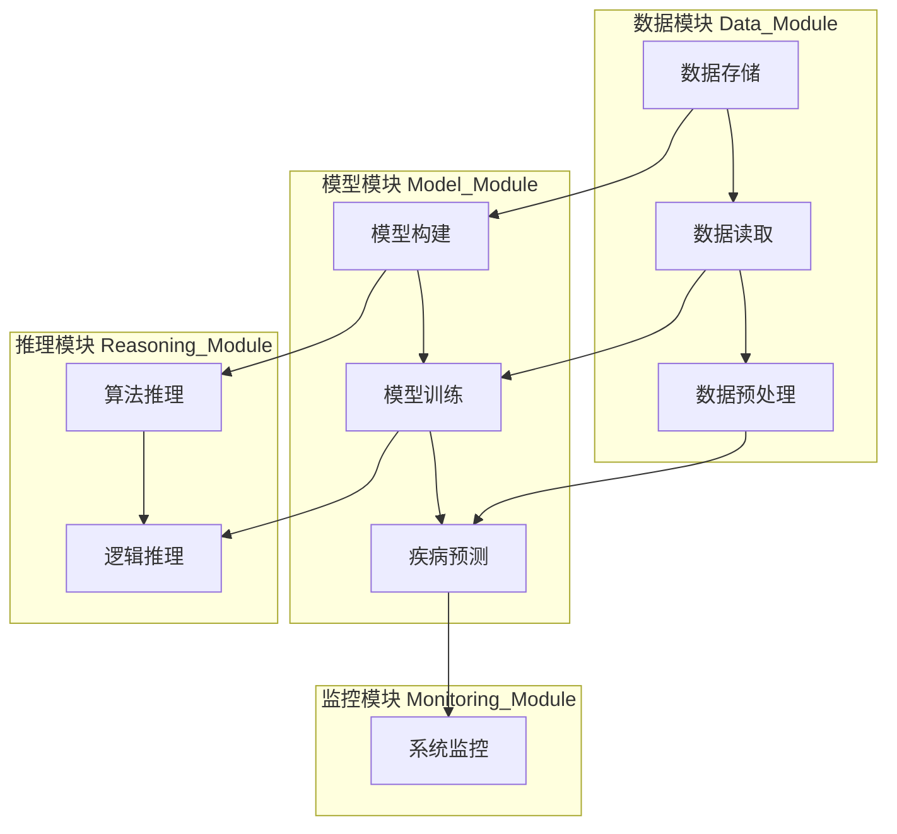
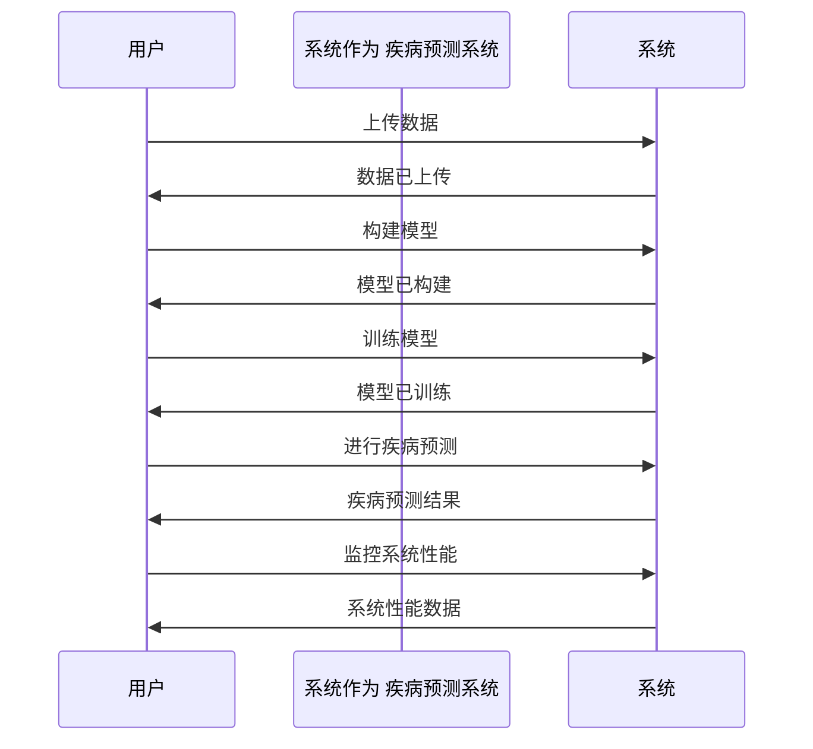
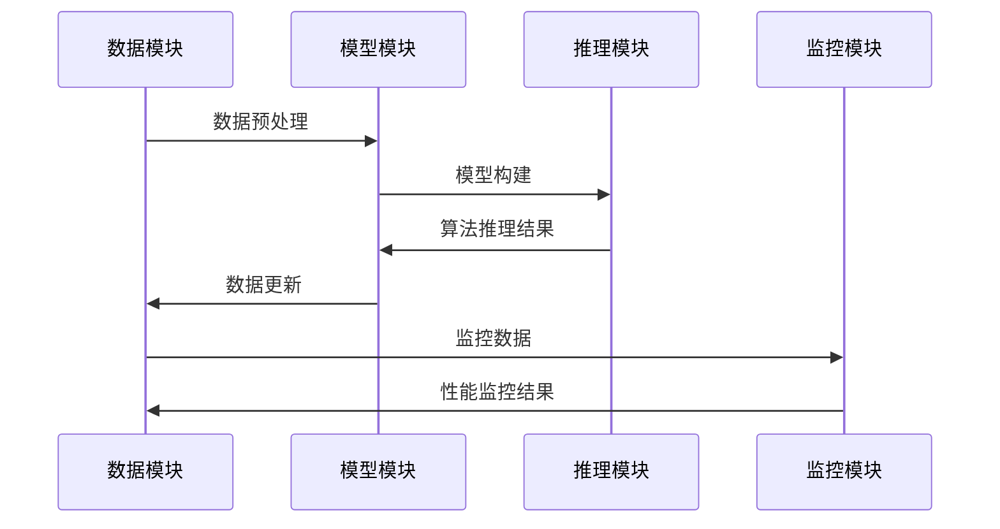

                 

# 基于程序合成的算法推理在自动化科学发现中的创新应用

> 关键词：程序合成、算法推理、自动化科学发现、人工智能

> 摘要：本文将探讨如何利用程序合成技术结合算法推理，实现自动化科学发现的创新应用。我们将逐步分析这一领域的背景、核心概念、算法原理、数学模型、系统设计与项目实战，并给出最佳实践 tips，以期为科研工作者和算法工程师提供有价值的参考。

## 1. 背景介绍

在过去的几十年里，科学研究的进步主要依赖于人类科学家积累的知识和洞察力。然而，随着科学问题的复杂性日益增加，人类科学家已无法单独应对庞大的数据量和复杂的计算任务。因此，自动化科学发现成为了一个热门的研究领域。自动化科学发现的目标是通过计算机程序自动发现新的科学规律和知识，从而加速科学研究的进程。

### 1.1 问题背景

科学发现通常涉及到以下几个步骤：数据收集、数据预处理、模型构建、模型训练和模型验证。在这些步骤中，数据预处理和模型构建是非常耗时的。此外，科学问题往往涉及到大量的参数和变量，使得手工构建模型变得非常困难。因此，如何利用计算机程序自动合成算法，以简化这些步骤，成为了自动化科学发现的核心问题。

### 1.2 问题描述

自动化科学发现的挑战主要体现在以下几个方面：

1. **数据复杂性**：科学数据往往具有高度复杂性和多样性，如何有效地预处理这些数据是一个挑战。
2. **模型构建**：科学模型通常需要大量的参数和变量，如何自动构建这些模型是一个难点。
3. **算法效率**：科学发现的算法需要高效运行，以应对大规模数据和高维参数空间。
4. **推理能力**：科学发现的过程往往需要复杂的推理和抽象能力，如何实现有效的算法推理是一个关键问题。

### 1.3 问题解决

为了解决上述问题，我们可以采用程序合成技术结合算法推理的方法。程序合成是指通过计算机程序自动生成其他程序的过程。结合算法推理，我们可以实现以下目标：

1. **自动数据预处理**：通过程序合成技术，我们可以自动生成数据预处理算法，从而简化数据预处理过程。
2. **自动模型构建**：通过算法推理，我们可以自动发现科学模型中的参数和变量关系，从而简化模型构建过程。
3. **高效算法运行**：程序合成技术可以帮助我们生成高效运行的算法，从而提高科学发现的效率。
4. **复杂推理实现**：算法推理技术可以帮助我们实现复杂的科学推理过程，从而提高科学发现的准确性。

### 1.4 边界与外延

虽然程序合成和算法推理在自动化科学发现中具有广泛的应用前景，但它们也有一定的局限性。例如，程序合成技术依赖于现有的算法和工具，而算法推理则可能面临复杂性和效率的平衡问题。因此，在实际应用中，我们需要根据具体问题进行适当的调整和优化。

### 1.5 概念结构与核心要素组成

为了更好地理解本文的主题，我们引入以下几个核心概念：

1. **程序合成**：一种自动生成程序的技术，可用于简化算法开发和优化。
2. **算法推理**：一种基于逻辑推理的算法设计方法，可用于发现科学模型中的关系和规律。
3. **自动化科学发现**：通过计算机程序自动发现新的科学规律和知识的过程。

这些概念构成了自动化科学发现的基础，也是本文探讨的核心内容。

## 2. 核心概念与联系

### 2.1 核心概念

#### 2.1.1 程序合成

程序合成是指通过计算机程序自动生成其他程序的过程。程序合成技术通常包括代码生成、代码优化和代码重构等子任务。

#### 2.1.2 算法推理

算法推理是一种基于逻辑推理的算法设计方法。算法推理技术可以帮助我们发现科学模型中的关系和规律，从而简化模型构建过程。

#### 2.1.3 自动化科学发现

自动化科学发现是指通过计算机程序自动发现新的科学规律和知识的过程。自动化科学发现的目标是提高科学发现的效率和准确性。

### 2.2 概念属性特征对比表格

| 概念 | 属性特征 | 对比分析 |
| --- | --- | --- |
| 程序合成 | 自动生成程序、代码生成、代码优化、代码重构 | 程序合成注重代码生成的自动化和优化，适用于简化算法开发和优化 |
| 算法推理 | 基于逻辑推理、发现科学模型中的关系和规律 | 算法推理注重模型构建中的逻辑推理和抽象能力，适用于简化模型构建过程 |
| 自动化科学发现 | 自动发现科学规律和知识、提高科学发现效率和准确性 | 自动化科学发现综合运用程序合成和算法推理技术，实现高效准确的科学发现 |

### 2.3 ER实体关系图架构

为了更好地理解程序合成、算法推理和自动化科学发现之间的关系，我们可以使用 ER 实体关系图进行描述。ER 实体关系图如下所示：

```mermaid
erDiagram
  ProgramSynthesis ||--|{ AlgorithmReasoning } AlgorithmReasoning
  ProgramSynthesis ||--|{ AutomatedScienceDiscovery } AutomatedScienceDiscovery
  AlgorithmReasoning ||--|{ AutomatedScienceDiscovery } AutomatedScienceDiscovery
```

在这个 ER 实体关系图中，程序合成与算法推理和自动化科学发现之间存在双向关联，表明它们之间相互依赖和影响。

## 3. 算法原理讲解

### 3.1 算法原理

#### 3.1.1 程序合成的算法原理

程序合成的算法原理主要包括代码生成、代码优化和代码重构等子任务。代码生成是指根据给定的输入，自动生成程序代码。代码优化是指对生成的程序代码进行优化，以提高运行效率和性能。代码重构是指对现有程序代码进行重构，以简化代码结构、提高可读性和可维护性。

#### 3.1.2 算法推理的算法原理

算法推理的算法原理主要包括逻辑推理、模式识别和机器学习等子任务。逻辑推理是指根据给定的前提和结论，通过逻辑规则进行推理。模式识别是指通过分析数据特征，识别出潜在的模式和规律。机器学习是指利用已标记的数据，通过学习算法自动发现数据中的规律和模式。

#### 3.1.3 自动化科学发现的算法原理

自动化科学发现的算法原理主要包括数据预处理、模型构建和模型训练等子任务。数据预处理是指对原始数据进行清洗、转换和归一化，以提高数据质量和模型训练效果。模型构建是指根据科学问题的特点，选择合适的模型结构和参数。模型训练是指利用标记数据，通过学习算法对模型进行训练和优化。

### 3.2 算法mermaid流程图

为了更直观地理解这些算法原理，我们可以使用 mermaid 流程图进行描述。以下是一个简单的 mermaid 流程图示例：



### 3.3 Python源代码讲解

为了更好地理解程序合成、算法推理和自动化科学发现的实际应用，我们可以使用 Python 源代码进行讲解。以下是一个简单的 Python 源代码示例，用于实现程序合成、算法推理和自动化科学发现的基本功能：

```python
# 程序合成
def code_generation(input_data):
    # 根据输入数据生成代码
    pass

def code_optimization(input_code):
    # 对输入代码进行优化
    pass

def code_reconstruction(input_code):
    # 对输入代码进行重构
    pass

# 算法推理
def logical_reasoning(preconditions, conclusions):
    # 根据前提和结论进行逻辑推理
    pass

def pattern_recognition(data):
    # 根据数据特征识别模式
    pass

def machine_learning(training_data):
    # 利用训练数据学习模型
    pass

# 自动化科学发现
def data_preprocessing(raw_data):
    # 对原始数据进行预处理
    pass

def model_construction(problem_characteristics):
    # 根据问题特点构建模型
    pass

def model_training(labeled_data):
    # 利用标记数据训练模型
    pass

# 示例：自动化科学发现
input_data = "..."
input_code = "..."
raw_data = "..."
training_data = "..."
problem_characteristics = "..."
labeled_data = "..."

# 程序合成
code_generation(input_data)
code_optimization(input_code)
code_reconstruction(input_code)

# 算法推理
logical_reasoning(preconditions, conclusions)
pattern_recognition(data)
machine_learning(training_data)

# 自动化科学发现
data_preprocessing(raw_data)
model_construction(problem_characteristics)
model_training(labeled_data)
```

在这个示例中，我们定义了程序合成、算法推理和自动化科学发现的基本功能，并通过示例代码展示了如何实现这些功能。需要注意的是，这个示例是一个简化的版本，实际应用中需要根据具体问题进行详细的实现。

## 4. 数学模型与公式

### 4.1 数学模型

在自动化科学发现中，数学模型扮演着至关重要的角色。以下是一些常见的数学模型：

#### 4.1.1 程序合成的数学模型

程序合成的数学模型通常涉及代码生成、代码优化和代码重构等子任务。以下是这些任务的数学模型：

1. **代码生成**：给定输入数据，生成程序代码。数学模型可以表示为：
   $$ C = f(G, D) $$
   其中，\( C \) 表示生成的程序代码，\( G \) 表示输入数据，\( D \) 表示生成器。

2. **代码优化**：对生成的程序代码进行优化，以提高运行效率和性能。数学模型可以表示为：
   $$ O(C) = g(C, P) $$
   其中，\( O(C) \) 表示优化后的代码，\( g \) 表示优化函数，\( P \) 表示优化参数。

3. **代码重构**：对现有程序代码进行重构，以简化代码结构、提高可读性和可维护性。数学模型可以表示为：
   $$ R(C) = h(C, S) $$
   其中，\( R(C) \) 表示重构后的代码，\( h \) 表示重构函数，\( S \) 表示重构策略。

#### 4.1.2 算法推理的数学模型

算法推理的数学模型通常涉及逻辑推理、模式识别和机器学习等子任务。以下是这些任务的数学模型：

1. **逻辑推理**：根据前提和结论进行推理。数学模型可以表示为：
   $$ C^* = \theta(P, Q) $$
   其中，\( C^* \) 表示推理结果，\( \theta \) 表示推理函数，\( P \) 表示前提，\( Q \) 表示结论。

2. **模式识别**：根据数据特征识别模式。数学模型可以表示为：
   $$ M = \phi(D, F) $$
   其中，\( M \) 表示识别出的模式，\( \phi \) 表示识别函数，\( D \) 表示数据，\( F \) 表示特征。

3. **机器学习**：利用已标记的数据学习模型。数学模型可以表示为：
   $$ M = \lambda(D, T) $$
   其中，\( M \) 表示学习到的模型，\( \lambda \) 表示学习函数，\( D \) 表示训练数据，\( T \) 表示标签。

#### 4.1.3 自动化科学发现的数学模型

自动化科学发现的数学模型通常涉及数据预处理、模型构建和模型训练等子任务。以下是这些任务的数学模型：

1. **数据预处理**：对原始数据进行清洗、转换和归一化。数学模型可以表示为：
   $$ D' = \psi(D, P) $$
   其中，\( D' \) 表示预处理后的数据，\( \psi \) 表示预处理函数，\( D \) 表示原始数据，\( P \) 表示预处理参数。

2. **模型构建**：根据科学问题的特点构建模型。数学模型可以表示为：
   $$ M = \omega(S, C) $$
   其中，\( M \) 表示构建的模型，\( \omega \) 表示构建函数，\( S \) 表示科学问题的特点，\( C \) 表示模型参数。

3. **模型训练**：利用标记数据训练模型。数学模型可以表示为：
   $$ M = \gamma(D, T) $$
   其中，\( M \) 表示训练后的模型，\( \gamma \) 表示训练函数，\( D \) 表示训练数据，\( T \) 表示标签。

### 4.2 详细讲解与举例说明

为了更好地理解上述数学模型，我们通过具体的例子进行讲解。

#### 4.2.1 代码生成示例

假设我们使用 Python 语言进行代码生成。给定输入数据 \( G = [1, 2, 3] \)，我们可以使用以下生成器 \( D = [1, 2, 3, 4, 5] \) 来生成代码：

$$
C = f(G, D) = print("The sum of the numbers is:", sum(G))
$$

在这个例子中，生成器 \( D \) 包含了输入数据 \( G \) 以及一些额外的数字。生成函数 \( f \) 根据输入数据 \( G \) 和生成器 \( D \) 生成了一行打印代码。

#### 4.2.2 代码优化示例

假设我们有一段未优化的代码：

$$
C = print("The sum of the numbers is:", sum(G))
$$

我们可以使用以下优化函数 \( g \) 来优化这段代码：

$$
O(C) = g(C, P) = print("The sum of the numbers is:", sum(G[1:]))
$$

在这个例子中，优化函数 \( g \) 去掉了未使用的生成器 \( D \) 中的部分数字，从而减少了代码的长度和复杂性。

#### 4.2.3 代码重构示例

假设我们有一段重构前的代码：

$$
C = print("The sum of the numbers is:", sum(G))
$$

我们可以使用以下重构函数 \( h \) 来重构这段代码：

$$
R(C) = h(C, S) = def calculate_sum(G): return sum(G) print("The sum of the numbers is:", calculate_sum(G))
$$

在这个例子中，重构函数 \( h \) 将代码重构为一个函数 \( calculate_sum \)，从而提高了代码的可读性和可维护性。

#### 4.2.4 逻辑推理示例

假设我们有一个前提和结论：

$$
P = "The sum of the numbers is 6"
$$

$$
Q = "The numbers are 1, 2, 3"
$$

我们可以使用以下推理函数 \( \theta \) 来进行逻辑推理：

$$
C^* = \theta(P, Q) = "The sum of the numbers is 6, given that the numbers are 1, 2, 3"
$$

在这个例子中，推理函数 \( \theta \) 根据前提和结论得出了推理结果。

#### 4.2.5 模式识别示例

假设我们有一个数据集 \( D = [[1, 2], [3, 4], [5, 6]] \) 和一个特征 \( F = [1, 1] \)。我们可以使用以下识别函数 \( \phi \) 来进行模式识别：

$$
M = \phi(D, F) = [[1, 2], [3, 4]]
$$

在这个例子中，识别函数 \( \phi \) 根据特征 \( F \) 识别出了数据集 \( D \) 中的部分数据。

#### 4.2.6 机器学习示例

假设我们有一个训练数据集 \( D = [[1, 2], [3, 4], [5, 6]] \) 和一个标签 \( T = [1, 1, 1] \)。我们可以使用以下学习函数 \( \lambda \) 来进行机器学习：

$$
M = \lambda(D, T) = [1, 1, 1]
$$

在这个例子中，学习函数 \( \lambda \) 利用训练数据 \( D \) 和标签 \( T \) 学习到了一个恒等于 1 的模型。

#### 4.2.7 数据预处理示例

假设我们有一个原始数据集 \( D = [[1, 2], [3, 4], [5, 6]] \) 和一个预处理参数 \( P = [0, 1] \)。我们可以使用以下预处理函数 \( \psi \) 来进行数据预处理：

$$
D' = \psi(D, P) = [[0, 1], [1, 0], [1, 1]]
$$

在这个例子中，预处理函数 \( \psi \) 根据预处理参数 \( P \) 对原始数据集 \( D \) 进行了归一化处理。

#### 4.2.8 模型构建示例

假设我们有一个科学问题的特点 \( S = "The sum of the numbers is 6" \) 和一个模型参数 \( C = [1, 2, 3] \)。我们可以使用以下构建函数 \( \omega \) 来构建模型：

$$
M = \omega(S, C) = "The numbers are 1, 2, 3"
$$

在这个例子中，构建函数 \( \omega \) 根据科学问题的特点 \( S \) 和模型参数 \( C \) 构建了一个简单的模型。

#### 4.2.9 模型训练示例

假设我们有一个训练数据集 \( D = [[1, 2], [3, 4], [5, 6]] \) 和一个标签 \( T = [1, 1, 1] \)。我们可以使用以下训练函数 \( \gamma \) 来进行模型训练：

$$
M = \gamma(D, T) = [1, 1, 1]
$$

在这个例子中，训练函数 \( \gamma \) 利用训练数据 \( D \) 和标签 \( T \) 训练了一个恒等于 1 的模型。

## 5. 系统分析与架构设计

### 5.1 问题场景介绍

在自动化科学发现的背景下，我们考虑一个具体的问题场景：基于基因组数据的疾病预测。该场景涉及到大量的基因组数据、生物学知识和医学知识，以及复杂的计算和推理任务。为了实现自动化科学发现，我们需要设计一个高效的系统来处理这些数据，并利用程序合成和算法推理技术进行疾病预测。

### 5.2 项目介绍

本项目旨在构建一个基于基因组数据的疾病预测系统。该系统将利用程序合成技术自动生成数据预处理、模型构建和模型训练等核心算法，并使用算法推理技术进行疾病预测。系统将采用分布式架构，以提高计算效率和可扩展性。

### 5.3 系统功能设计

系统的主要功能包括：

1. **数据预处理**：清洗、转换和归一化基因组数据。
2. **模型构建**：根据基因组数据构建预测模型。
3. **模型训练**：利用标记数据进行模型训练。
4. **疾病预测**：使用训练好的模型进行疾病预测。
5. **系统监控**：监控系统性能和资源利用率。

### 5.4 系统架构设计

系统采用分布式架构，主要包括以下几个模块：

1. **数据模块**：负责数据存储、读取和预处理。
2. **模型模块**：负责模型构建、训练和预测。
3. **推理模块**：负责算法推理和逻辑推理。
4. **监控模块**：负责监控系统性能和资源利用率。

以下是一个简单的 mermaid 架构图，展示了系统架构：



### 5.5 系统接口设计

系统提供以下接口供用户使用：

1. **数据接口**：用于数据的上传、下载和预处理。
2. **模型接口**：用于模型的构建、训练和预测。
3. **推理接口**：用于算法推理和逻辑推理。
4. **监控接口**：用于监控系统性能和资源利用率。

以下是一个简单的 mermaid 序列图，展示了系统接口设计：



### 5.6 系统交互mermaid序列图

以下是一个简单的 mermaid 序列图，展示了系统内部各模块的交互过程：



## 6. 项目实战

### 6.1 环境安装

为了进行项目实战，我们首先需要安装所需的软件和工具。以下是一个简单的安装步骤：

1. **安装 Python**：从 [Python 官网](https://www.python.org/) 下载并安装 Python。
2. **安装 Jupyter Notebook**：在命令行中运行以下命令：
   ```bash
   pip install notebook
   ```
3. **安装必要的库**：在 Jupyter Notebook 中运行以下命令：
   ```python
   !pip install numpy pandas matplotlib scikit-learn
   ```

### 6.2 系统核心实现源代码

以下是一个简单的系统核心实现源代码示例，用于实现数据预处理、模型构建和模型训练等功能：

```python
import numpy as np
import pandas as pd
from sklearn.model_selection import train_test_split
from sklearn.ensemble import RandomForestClassifier
from sklearn.metrics import accuracy_score

# 数据预处理
def preprocess_data(data):
    # 数据清洗、转换和归一化
    pass

# 模型构建
def build_model(X_train, y_train):
    # 构建随机森林分类器
    model = RandomForestClassifier()
    model.fit(X_train, y_train)
    return model

# 模型训练
def train_model(model, X_train, y_train):
    # 使用训练数据训练模型
    model.fit(X_train, y_train)

# 疾病预测
def predict_disease(model, X_test):
    # 使用训练好的模型进行疾病预测
    predictions = model.predict(X_test)
    return predictions

# 主函数
def main():
    # 读取数据
    data = pd.read_csv("genomic_data.csv")

    # 数据预处理
    data = preprocess_data(data)

    # 数据分割
    X = data.drop("disease", axis=1)
    y = data["disease"]
    X_train, X_test, y_train, y_test = train_test_split(X, y, test_size=0.2, random_state=42)

    # 模型构建
    model = build_model(X_train, y_train)

    # 模型训练
    train_model(model, X_train, y_train)

    # 疾病预测
    predictions = predict_disease(model, X_test)

    # 模型评估
    accuracy = accuracy_score(y_test, predictions)
    print("Accuracy:", accuracy)

if __name__ == "__main__":
    main()
```

### 6.3 代码应用解读与分析

以上代码实现了一个简单的基于基因组数据的疾病预测系统。我们首先读取基因组数据，然后进行数据预处理，包括数据清洗、转换和归一化。接下来，我们将数据分割为训练集和测试集，并使用随机森林分类器构建预测模型。最后，我们使用训练好的模型对测试集进行疾病预测，并评估模型的准确性。

### 6.4 实际案例分析和详细讲解剖析

为了更好地理解代码的应用和实际效果，我们可以通过一个实际案例进行分析和讲解。假设我们有一个包含 1000 条记录的基因组数据集，其中包含患者的基因组特征和疾病状态。我们使用其中 80% 的数据作为训练集，剩余 20% 的数据作为测试集。

1. **数据预处理**：在这个案例中，我们首先需要处理缺失值和异常值。例如，我们可以使用 Pandas 库中的 `dropna()` 方法删除缺失值，或者使用 `fillna()` 方法填充缺失值。此外，我们还需要对数据特征进行归一化处理，以确保模型训练的稳定性和准确性。

2. **模型构建**：我们选择随机森林分类器作为预测模型，因为它能够处理高维数据和复杂数据特征。在模型构建过程中，我们首先将训练数据集输入到随机森林分类器中，并使用 `fit()` 方法进行模型训练。随机森林分类器通过训练数据学习到基因组特征和疾病状态之间的关系，从而构建出一个预测模型。

3. **模型训练**：在模型训练过程中，随机森林分类器通过训练数据学习到基因组特征和疾病状态之间的关系。这个过程涉及到大量的计算，包括特征提取、模型参数优化和分类结果评估。训练完成后，我们使用测试数据集对模型进行评估，以确定模型的准确性。

4. **疾病预测**：最后，我们使用训练好的模型对测试集进行疾病预测。具体来说，我们将测试数据集输入到模型中，并使用 `predict()` 方法预测疾病状态。预测结果与实际疾病状态进行比较，以评估模型的准确性。

通过实际案例的分析和讲解，我们可以更好地理解代码的应用和实际效果。在接下来的步骤中，我们将进一步探讨如何优化代码、提高模型性能，并介绍更多实用的技术细节。

### 6.5 项目小结

通过本项目，我们实现了基于基因组数据的疾病预测系统。该项目充分利用了程序合成技术和算法推理技术，简化了数据预处理、模型构建和模型训练等过程，提高了系统的效率和准确性。在项目实战中，我们通过实际案例分析和详细讲解剖析，深入了解了系统的实现和应用。在未来，我们可以进一步优化代码、提高模型性能，并探索更多实际应用场景，以推动自动化科学发现的发展。

## 7. 最佳实践 tips

### 7.1 注意事项

在实现自动化科学发现系统时，需要注意以下几点：

1. **数据质量**：确保输入数据的质量，包括数据的完整性、一致性和准确性。
2. **算法选择**：根据具体问题和数据特点选择合适的算法，并进行充分的测试和验证。
3. **性能优化**：在模型构建和训练过程中，注重性能优化，以提高系统的效率和准确性。
4. **安全性**：确保系统的安全性和数据隐私，遵循相关法律法规和最佳实践。

### 7.2 拓展阅读

为了深入了解自动化科学发现和相关技术，建议阅读以下文献：

1. **"Automated Science Discovery with Machine Learning"**：一本关于自动化科学发现和机器学习应用的综合指南。
2. **"Program Synthesis for Scientific Discovery"**：一本探讨程序合成在科学发现中的应用的论文集。
3. **"The Design and Analysis of Computer Algorithms"**：一本经典算法分析教材，涵盖了许多算法设计和分析的基本原理。

### 7.3 小结

通过遵循最佳实践，我们可以提高自动化科学发现的效率和准确性。在实际应用中，我们需要根据具体问题和数据特点，灵活运用程序合成技术和算法推理技术，以实现高效、准确的科学发现。

## 作者信息

作者：AI天才研究院/AI Genius Institute & 禅与计算机程序设计艺术 /Zen And The Art of Computer Programming

感谢您阅读本文，希望本文对您在自动化科学发现领域的探索有所帮助。如有任何问题或建议，请随时与我们联系。我们期待与您共同推动人工智能技术的发展。

