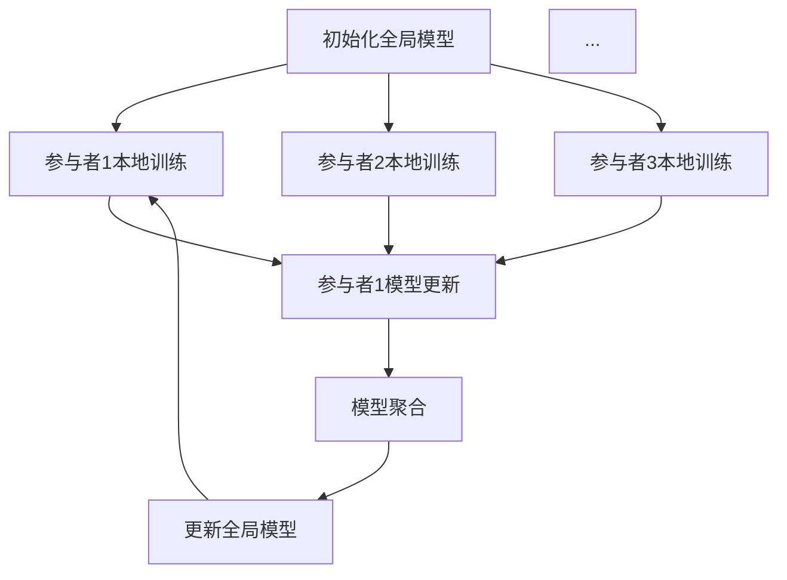

                 


### 第三部分：算法原理讲解

#### 3.1 联邦学习的算法原理

联邦学习的核心在于其分布式计算模式，即在多个参与方（例如，不同的医疗机构）之间共享模型参数，而不需要直接交换数据。以下是联邦学习算法的基本原理和步骤：

#### 3.1.1 基本原理

1. **初始化全局模型**：在联邦学习开始时，服务器初始化一个全局模型，并将其发送给所有参与者。

2. **本地训练**：每个参与者使用本地数据和全局模型进行训练，更新自己的本地模型。这一步通常使用梯度下降或其他优化算法。

3. **模型更新**：参与者将自己的本地模型更新（通常是梯度）发送给服务器。

4. **模型聚合**：服务器接收所有参与者的模型更新，并计算它们的平均值，生成一个新的全局模型。

5. **迭代**：服务器将新的全局模型发送回参与者，参与者重复本地训练和模型更新的步骤，直到达到预定的迭代次数或达到满意的模型性能。

#### 3.1.2 算法流程

使用Mermaid语言，我们可以描述联邦学习的基本算法流程如下：



#### 3.1.3 Python代码示例

下面是一个简单的Python代码示例，用于演示联邦学习的算法步骤：

```python
import numpy as np

# 初始化全局模型参数
theta_global = np.random.rand(1)

# 模型更新函数
def model_update(theta_local, theta_global):
    theta_new = 0.1 * theta_global + 0.9 * theta_local
    return theta_new

# 模型聚合函数
def model_aggregate(thetas):
    theta_sum = np.sum(thetas)
    theta_new = theta_sum / len(thetas)
    return theta_new

# 模拟联邦学习过程
for i in range(10):
    theta_global = model_update(0.5 * i, theta_global)
    print(f"Iteration {i}: Global Model = {theta_global}")

# 输出最终的全局模型参数
print(f"Final Global Model = {theta_global}")
```

在这个示例中，`theta_global` 表示全局模型参数，`theta_local` 表示参与者本地模型参数。每次迭代，参与者都会将自己的模型更新发送给服务器，服务器再进行模型聚合，生成新的全局模型。

#### 3.1.4 数学模型与公式

联邦学习算法的数学模型可以表示为以下公式：

$$
\theta_{global}^{t+1} = \frac{1}{N} \sum_{i=1}^{N} \theta_{local,i}^{t}
$$

其中，$\theta_{global}^{t}$ 和 $\theta_{local,i}^{t}$ 分别表示第 $t$ 次迭代的全局模型参数和第 $i$ 个参与者的本地模型参数，$N$ 表示参与者的数量。

#### 3.1.5 举例说明

假设有两个参与者（$N=2$），他们的本地模型参数分别为 $\theta_{1}^{t}$ 和 $\theta_{2}^{t}$。在第一次迭代时，全局模型参数初始化为 $\theta_{global}^{0} = 0$。参与者1的本地模型参数为 $\theta_{1}^{0} = 1$，参与者2的本地模型参数为 $\theta_{2}^{0} = 2$。

- **第一次迭代**：
  $$\theta_{global}^{1} = \frac{1}{2}(\theta_{1}^{0} + \theta_{2}^{0}) = \frac{1}{2}(1 + 2) = 1.5$$

- **第二次迭代**：
  假设参与者1更新后的本地模型参数为 $\theta_{1}^{1} = 2$，参与者2更新后的本地模型参数为 $\theta_{2}^{1} = 3$。
  $$\theta_{global}^{2} = \frac{1}{2}(\theta_{1}^{1} + \theta_{2}^{1}) = \frac{1}{2}(2 + 3) = 2.5$$

通过这个简单的例子，我们可以看到联邦学习算法如何通过参与者的本地模型更新来逐步优化全局模型。

#### 3.1.6 本章小结

本章介绍了联邦学习算法的基本原理、流程、Python代码示例和数学模型。在理解了联邦学习的基本原理后，读者可以更好地理解联邦学习在医疗数据分析中的应用和价值。在下一章中，我们将进一步探讨联邦学习在医疗数据分析中的具体实现和应用。

