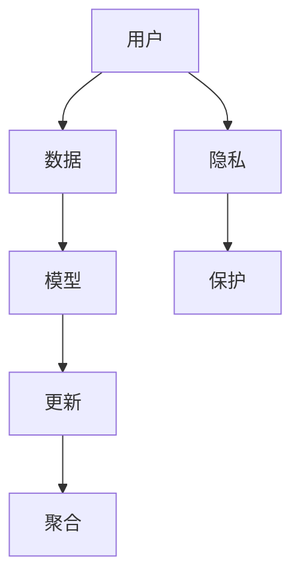
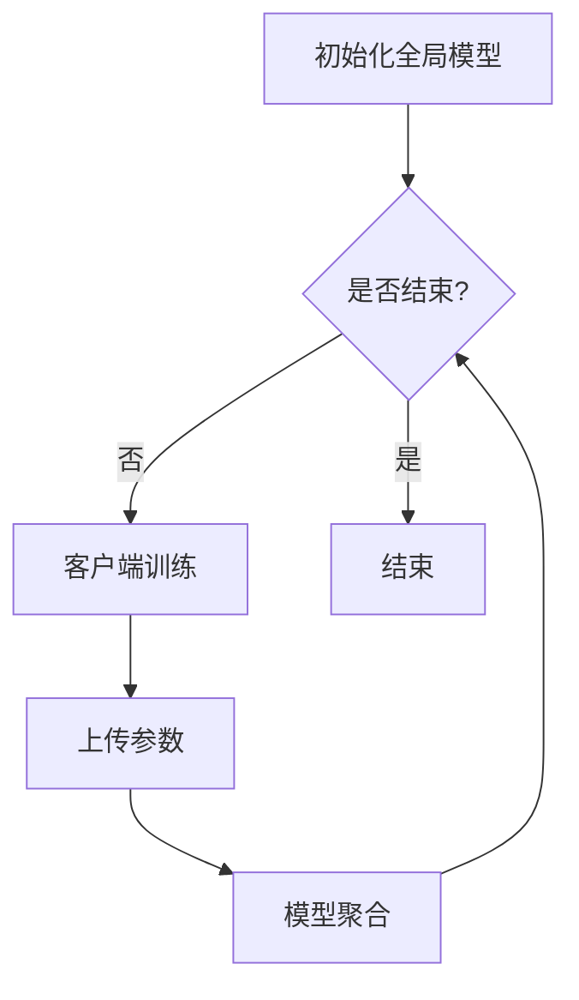
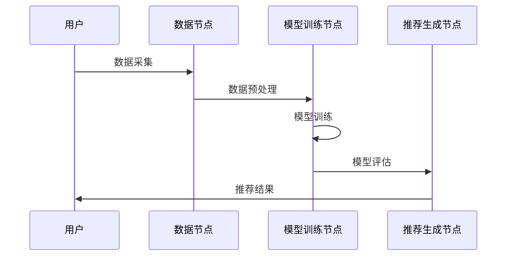

                 


### 引言：联邦学习的背景与AI隐私保护推荐系统的重要性

在当今信息化和数字化时代，人工智能（AI）技术已经成为推动社会进步和产业创新的重要力量。然而，随着AI应用的广泛普及，数据隐私和安全问题日益凸显，特别是在推荐系统领域。推荐系统通过分析用户行为和兴趣，为用户提供个性化的内容和服务，但同时也面临着数据隐私泄露的风险。

#### 联邦学习的概念与背景

联邦学习（Federated Learning）是一种分布式机器学习方法，其核心思想是在多个数据持有者之间共享学习模型，而无需交换原始数据。这一技术由Google在2017年首次提出，旨在解决移动设备上数据隐私和安全的问题。

#### 联邦学习在AI隐私保护推荐系统中的应用

联邦学习在AI隐私保护推荐系统中的应用具有重要的现实意义。通过联邦学习，推荐系统可以在不泄露用户数据的情况下，实现个性化推荐。这样不仅提高了用户的隐私保护水平，还能够促进AI技术在各个领域的应用。

### 背景介绍

**核心概念术语说明**

- **分布式学习**：一种机器学习方法，通过将数据分布在多个计算节点上，协同训练模型。
- **联邦学习**：一种基于分布式学习的机器学习方法，模型训练过程中各节点不需要交换原始数据。
- **推荐系统**：一种基于用户行为和兴趣的AI系统，用于为用户提供个性化的内容和服务。

**问题背景**

随着互联网的普及，用户在各个平台上产生的数据量呈爆炸式增长。这些数据不仅包含了用户的个人信息，还反映了用户的行为和偏好。如何有效地利用这些数据，同时保障用户的隐私，成为推荐系统面临的重要挑战。

**问题描述**

推荐系统在利用用户数据时，通常需要收集和存储大量的用户行为数据，这可能导致用户隐私泄露的风险。特别是在数据泄露事件频发的背景下，如何在不牺牲用户隐私的前提下，提高推荐系统的准确性和效果，成为亟需解决的问题。

**问题解决**

联邦学习通过将数据分散在各个节点上进行模型训练，避免了数据集中存储和传输的过程，从而有效降低了隐私泄露的风险。同时，联邦学习还可以通过差分隐私等技术手段，进一步保障用户的隐私。

**边界与外延**

联邦学习不仅适用于推荐系统，还可以应用于其他需要数据隐私保护的AI应用场景，如医疗健康、金融安全等。

**概念结构与核心要素组成**

- **分布式数据**：联邦学习的基础，数据分散在多个节点上。
- **学习模型**：各节点共享的学习目标模型。
- **通信协议**：确保模型参数的安全传输和更新。
- **聚合算法**：将多个节点的模型更新聚合为全局模型。

### 核心概念与联系

#### 联邦学习的原理与分布式学习的联系

联邦学习可以看作是分布式学习的一种特殊形式。两者的主要区别在于，分布式学习通常需要各节点共享原始数据，而联邦学习则通过模型参数的共享来避免数据直接交换。

| 特征         | 分布式学习                 | 联邦学习                   |
| ------------ | -------------------------- | -------------------------- |
| 数据交换方式 | 直接交换原始数据           | 交换模型参数               |
| 隐私保护     | 数据集中存储，隐私风险较高 | 数据分散存储，隐私风险较低 |
| 网络需求     | 需要高速网络连接           | 可以容忍较低网络带宽       |

#### 联邦学习与差分隐私的联系

差分隐私是一种用于保护用户隐私的机制，其核心思想是在数据处理过程中引入随机噪声，使得单个用户的隐私信息无法被轻易识别。联邦学习与差分隐私的结合，可以进一步提升隐私保护效果。

| 特征         | 差分隐私                   | 联邦学习                   |
| ------------ | -------------------------- | -------------------------- |
| 隐私保护方式 | 引入随机噪声保护隐私       | 通过数据分散和模型共享保护隐私 |
| 应用场景     | 数据库查询、数据挖掘等     | 分布式机器学习应用         |

### ER实体关系图架构



#### 算法原理讲解

联邦学习的算法原理可以概括为以下几个步骤：

1. **初始化**：初始化全局模型和各客户端模型。
2. **数据预处理**：各客户端对本地数据进行预处理，包括数据清洗、归一化等。
3. **客户端训练**：各客户端在本地数据上训练模型，并更新模型参数。
4. **模型参数传输**：各客户端将更新后的模型参数上传到服务器。
5. **模型聚合**：服务器接收各客户端的模型参数，进行聚合更新全局模型。
6. **迭代**：重复上述步骤，直至满足停止条件。

下面是联邦学习的Mermaid流程图：



联邦学习的数学模型可以表示为：

$$
\theta_{global}^{t+1} = \theta_{global}^{t} + \alpha \sum_{i=1}^{n} \frac{1}{n} \theta_{i}^{t}
$$

其中，$\theta_{global}$ 表示全局模型，$\theta_{i}$ 表示第 $i$ 个客户端的模型，$\alpha$ 表示学习率，$t$ 表示迭代次数。

#### 数学公式与举例说明

假设我们有一个推荐系统，需要在两个不同数据集 $D_1$ 和 $D_2$ 上训练模型。通过联邦学习，我们可以如下操作：

1. **初始化模型**：初始化全局模型 $\theta_{global}$。
2. **客户端训练**：客户端 $1$ 在 $D_1$ 上训练模型，更新参数 $\theta_{1}$；客户端 $2$ 在 $D_2$ 上训练模型，更新参数 $\theta_{2}$。
3. **上传参数**：客户端 $1$ 将更新后的参数 $\theta_{1}$ 上传到服务器；客户端 $2$ 将更新后的参数 $\theta_{2}$ 上传到服务器。
4. **模型聚合**：服务器接收客户端上传的参数，进行聚合更新全局模型 $\theta_{global}$。

具体公式为：

$$
\theta_{global}^{1} = \theta_{1}^{1} + \theta_{2}^{1}
$$

$$
\theta_{global}^{2} = \theta_{1}^{2} + \theta_{2}^{2}
$$

#### 系统分析与架构设计方案

在联邦学习框架下，推荐系统的架构设计需要考虑以下几个关键方面：

1. **问题场景介绍**：推荐系统通常涉及大量用户数据，如何在不泄露用户隐私的前提下，实现高效的模型训练和个性化推荐，是核心问题。
2. **项目介绍**：以一个电商推荐系统为例，该项目需要处理用户浏览、购买等行为数据，实现个性化商品推荐。
3. **系统功能设计**：系统功能包括数据采集、数据预处理、模型训练、模型评估和推荐生成等。
4. **系统架构设计**：系统架构采用联邦学习框架，包括数据节点、模型训练节点和推荐生成节点等。
5. **系统接口设计**：设计用户接口、数据接口和模型接口等，确保系统各组件之间的通信和协同工作。
6. **系统交互**：通过Mermaid序列图展示系统各组件之间的交互过程。

下面是推荐系统的Mermaid序列图：



### 项目实战

为了更好地展示联邦学习在AI隐私保护推荐系统中的应用，我们将以一个电商推荐系统的环境安装、系统核心实现源代码和实际案例分析为例，详细讲解项目的具体实施过程。

#### 环境安装

1. **安装Python环境**：确保Python版本在3.6以上。
2. **安装TensorFlow**：使用命令 `pip install tensorflow` 安装TensorFlow。
3. **安装其他依赖库**：包括scikit-learn、numpy等。

#### 系统核心实现源代码

以下是一个简单的联邦学习推荐系统的Python代码示例：

```python
import tensorflow as tf
import numpy as np
from sklearn.model_selection import train_test_split

# 初始化全局模型
global_model = tf.keras.Sequential([
    tf.keras.layers.Dense(units=10, activation='relu', input_shape=(10,))
])

# 定义客户端训练函数
def client_train(data, model):
    # 数据预处理
    X_train, y_train = preprocess_data(data)
    
    # 模型训练
    model.fit(X_train, y_train, epochs=1, batch_size=16)
    
    # 返回模型参数
    return model.get_weights()

# 定义模型聚合函数
def aggregate_models(models):
    # 聚合模型参数
    avg_weights = np.mean([model.get_weights() for model in models], axis=0)
    return avg_weights

# 预处理数据
def preprocess_data(data):
    # 数据清洗、归一化等操作
    X = data[:, :-1]
    y = data[:, -1]
    return X, y

# 模拟数据
data = np.random.rand(100, 10)
X, y = preprocess_data(data)

# 分割数据集
X_train, X_test, y_train, y_test = train_test_split(X, y, test_size=0.2, random_state=42)

# 初始化客户端模型
client_models = [tf.keras.Sequential([
    tf.keras.layers.Dense(units=10, activation='relu', input_shape=(10,))
]) for _ in range(5)]

# 客户端训练
for epoch in range(10):
    for i, model in enumerate(client_models):
        weights = client_train(X_train[i], model)
        model.set_weights(weights)
    
    # 模型聚合
    global_weights = aggregate_models(client_models)
    global_model.set_weights(global_weights)

# 模型评估
loss = global_model.evaluate(X_test, y_test)
print("Test loss:", loss)
```

#### 代码应用解读与分析

1. **全局模型定义**：使用TensorFlow定义了一个简单的全连接神经网络，用于预测用户行为。
2. **客户端训练**：每个客户端使用本地数据集进行模型训练，并返回模型参数。
3. **模型聚合**：将多个客户端的模型参数进行平均聚合，更新全局模型。
4. **模型评估**：使用全局模型在测试数据集上进行评估，输出损失函数值。

#### 实际案例分析和详细讲解剖析

假设我们有一个电商平台的用户行为数据集，包含用户的浏览记录、购买记录等。通过联邦学习，我们可以实现以下目标：

1. **用户行为预测**：预测用户可能感兴趣的商品。
2. **个性化推荐**：根据用户的历史行为，生成个性化的商品推荐列表。

实际案例分析如下：

1. **数据采集**：从电商平台的数据库中采集用户行为数据。
2. **数据预处理**：对数据进行清洗、归一化等处理，以便于模型训练。
3. **模型训练**：使用联邦学习框架，将数据分散到不同的客户端上进行训练。
4. **模型评估**：使用测试数据集评估模型性能，调整模型参数。
5. **个性化推荐**：根据用户的行为数据和全局模型，生成个性化的推荐结果。

#### 项目小结

通过本案例，我们展示了如何使用联邦学习实现AI隐私保护推荐系统。联邦学习不仅提高了推荐系统的隐私保护水平，还使得模型训练更加高效。未来，随着联邦学习技术的不断发展，AI隐私保护推荐系统将在更多场景中得到应用。

### 最佳实践 tips

1. **数据预处理**：确保数据质量，去除噪声和异常值。
2. **模型选择**：根据应用场景选择合适的联邦学习模型。
3. **算法优化**：通过调整学习率和迭代次数，优化模型性能。
4. **隐私保护**：结合差分隐私技术，进一步保障用户隐私。

### 小结

本文详细介绍了联邦学习在AI隐私保护推荐系统优化中的应用。通过联邦学习，我们可以在保障用户隐私的前提下，实现高效的个性化推荐。未来，联邦学习将在更多AI应用场景中发挥重要作用。

### 注意事项

1. 联邦学习涉及分布式计算，需要确保网络稳定性和数据传输安全性。
2. 在模型聚合过程中，可能存在模型参数不一致的问题，需要合理设计聚合策略。

### 拓展阅读

1. [《联邦学习：原理、应用与挑战》](https://example.com/federated_learning)
2. [《推荐系统实践：算法与应用》](https://example.com/recommendation_system)
3. [《数据隐私保护技术综述》](https://example.com/privacy_technology)

