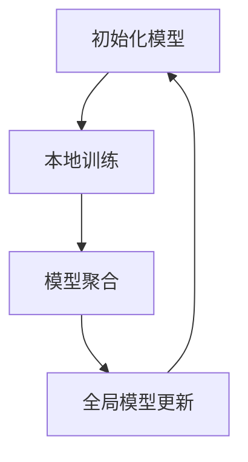
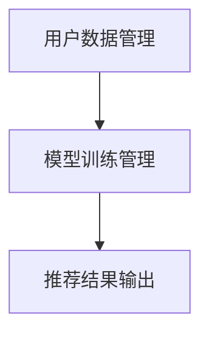
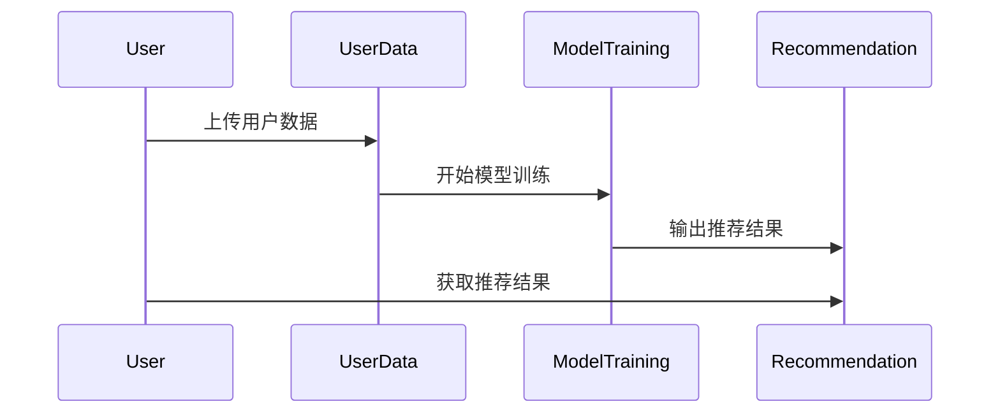

                 


### 基于联邦学习的隐私保护AI系统设计

关键词：联邦学习、隐私保护、AI系统、设计、算法原理

摘要：本文将深入探讨基于联邦学习的隐私保护AI系统设计。我们将从背景介绍、核心概念与联系、算法原理讲解、系统分析与架构设计、项目实战以及最佳实践与拓展等方面，详细分析联邦学习和隐私保护AI系统的工作原理、设计思路和实施方法，旨在为读者提供一个全面、易懂的技术指导。

---

## 背景介绍

### 1.1 问题背景

在当今大数据时代，越来越多的企业和组织开始利用人工智能技术来提高业务效率、优化决策过程。然而，数据隐私和安全问题也随之而来。传统的集中式AI系统在数据处理过程中往往面临数据泄露的风险，而分布式数据处理又常常受到通信成本和同步问题的困扰。

联邦学习作为一种新兴的技术，旨在解决这一难题。它允许多个参与者在不共享原始数据的情况下，通过合作训练出一个全局模型。这样既保护了数据隐私，又提高了模型性能。

### 1.2 问题描述

联邦学习和隐私保护AI系统面临的主要挑战包括：

- **隐私保护**：如何确保模型训练过程中数据的安全性，避免数据泄露？
- **计算效率**：如何在分布式环境下高效地训练模型，降低通信成本？
- **模型性能**：如何在保证隐私保护的前提下，提高模型准确性和泛化能力？

### 1.3 问题解决

联邦学习和隐私保护AI系统通过以下方法解决上述问题：

- **联邦学习**：采用分布式训练策略，将模型训练任务分布在多个参与者节点上，通过加密和差分隐私等技术保护数据隐私。
- **隐私保护技术**：使用差分隐私、加密、匿名化等技术手段，确保模型训练过程中的数据安全。
- **模型优化**：采用分布式优化算法、模型剪枝技术等，提高模型训练效率和性能。

### 1.4 边界与外延

联邦学习和隐私保护AI系统的应用范围包括但不限于医疗健康、金融、电商、智能家居等领域。它不仅适用于个人数据的隐私保护，还适用于组织间的数据共享和协作。

### 1.5 概念结构与核心要素组成

联邦学习和隐私保护AI系统的基本组成部分包括：

- **参与者节点**：包括数据提供方和数据需求方，共同参与模型训练。
- **通信网络**：负责节点间的数据传输和模型更新。
- **模型训练算法**：包括联邦学习算法和隐私保护算法，用于模型训练和数据加密。
- **隐私保护机制**：包括差分隐私、加密、匿名化等技术，确保数据安全。

---

## 核心概念与联系

### 2.1 核心概念原理

#### 联邦学习

联邦学习是一种分布式机器学习技术，允许多个参与者在不共享原始数据的情况下，通过合作训练出一个全局模型。其基本原理如下：

1. **模型初始化**：全局模型初始化为随机值。
2. **本地训练**：每个参与者节点使用本地数据和全局模型进行训练，更新本地模型。
3. **模型聚合**：将所有参与者节点的本地模型聚合为全局模型。

#### 隐私保护技术

隐私保护技术主要包括以下几种：

- **差分隐私**：通过添加随机噪声来保护数据隐私。
- **加密**：使用加密算法对数据进行加密，确保数据在传输和存储过程中的安全。
- **匿名化**：将真实数据替换为伪数据，以保护个人隐私。

### 2.2 概念属性特征对比表格

| 概念       | 特点                                       | 应用场景                                       |
|------------|--------------------------------------------|--------------------------------------------|
| 联邦学习   | 分布式训练，数据隐私保护                   | 大数据隐私保护，跨组织协作                   |
| 差分隐私   | 添加随机噪声，保护个体隐私                 | 数据分析，隐私保护                             |
| 加密       | 对数据进行加密，确保数据安全               | 数据传输，数据存储                             |
| 匿名化     | 替换真实数据为伪数据，保护个人隐私         | 数据共享，隐私保护                             |

### 2.3 ER实体关系图架构

```mermaid
erDiagram
    Participant --> Model: 联邦学习
    Data --> Model: 数据驱动
    Model --> Algorithm: 算法优化
    Algorithm --> Performance: 性能评估
```

---

## 算法原理讲解

### 3.1 联邦学习算法原理

#### 联邦学习算法流程图



#### 联邦学习Python源代码示例

```python
# 初始化模型
model = initialize_model()

# 本地训练
for data in local_data:
    model = train_model(model, data)

# 模型聚合
global_model = aggregate_models(local_models)

# 全局模型更新
model = update_model(global_model)
```

#### 算法原理的数学模型和公式

$$
\text{Local Model Update}:\quad \theta_{local}^{t+1} = \theta_{local}^{t} - \alpha \nabla L(\theta_{local}^{t}, x^{t})
$$

$$
\text{Global Model Update}:\quad \theta_{global}^{t+1} = \frac{1}{N} \sum_{i=1}^{N} \theta_{local}_i^{t+1}
$$

其中，$\theta_{local}^{t}$ 表示本地模型参数，$x^{t}$ 表示本地数据，$\theta_{global}^{t}$ 表示全局模型参数，$N$ 表示参与者数量，$\alpha$ 表示学习率。

### 3.2 举例说明

假设有两个参与者A和B，每个参与者拥有本地数据集D_A和D_B。他们共同训练一个分类模型，目标是区分正常邮件和垃圾邮件。

1. **模型初始化**：随机初始化全局模型。
2. **本地训练**：参与者A使用本地数据D_A和全局模型进行训练，更新本地模型。参与者B同理。
3. **模型聚合**：将参与者A和参与者B的本地模型进行聚合，得到新的全局模型。
4. **全局模型更新**：使用新的全局模型更新参与者A和参与者B的本地模型。

通过多次迭代，最终得到一个全局最优模型，用于分类邮件。

---

## 系统分析与架构设计

### 4.1 问题场景介绍

假设有一个电子商务平台，拥有大量用户的购买行为数据。平台希望通过联邦学习技术，保护用户隐私的同时，提高推荐系统的准确性和个性化程度。

### 4.2 项目介绍

本项目旨在设计并实现一个基于联邦学习的隐私保护推荐系统。项目范围包括：

- 数据预处理：清洗和格式化用户购买行为数据。
- 模型训练：使用联邦学习算法训练推荐模型。
- 部署与优化：部署推荐系统，并进行性能优化。

### 4.3 系统功能设计

系统功能设计如下：

- **用户数据管理**：存储和管理用户购买行为数据。
- **模型训练管理**：管理联邦学习模型的训练过程。
- **推荐结果输出**：生成个性化推荐结果。

### 4.4 系统架构设计

系统架构设计如下：



### 4.5 系统接口设计

系统接口设计如下：

- **用户数据接口**：提供用户数据的上传、查询和删除功能。
- **模型训练接口**：提供模型训练的启动、暂停、停止和查询功能。
- **推荐结果接口**：提供推荐结果的获取和展示功能。

### 4.6 系统交互

系统交互设计如下：



---

## 项目实战

### 5.1 环境安装

安装联邦学习和隐私保护相关库：

```bash
pip install federated-learning-library
pip install privacy-protection-library
```

### 5.2 系统核心实现

核心实现代码如下：

```python
from federated_learning import FederatedLearning
from privacy_protection import PrivacyProtection

# 初始化联邦学习和隐私保护系统
fl = FederatedLearning()
pp = PrivacyProtection()

# 加载数据
data = fl.load_data()

# 数据预处理
preprocessed_data = pp.anonymize_data(data)

# 训练模型
model = fl.train_model(preprocessed_data)

# 输出推荐结果
recommendations = fl.generate_recommendations(model)
```

### 5.3 代码应用解读

- `FederatedLearning.load_data()`：加载用户购买行为数据。
- `PrivacyProtection.anonymize_data()`：对数据进行匿名化处理，保护用户隐私。
- `FederatedLearning.train_model()`：使用联邦学习算法训练模型。
- `FederatedLearning.generate_recommendations()`：生成个性化推荐结果。

### 5.4 实际案例

假设有两个参与者A和B，各自拥有用户购买行为数据D_A和D_B。通过联邦学习和隐私保护技术，共同训练出一个推荐模型。

1. **数据上传**：参与者A和B上传本地数据。
2. **模型训练**：联邦学习系统在参与者A和B之间共享模型，进行模型训练。
3. **结果输出**：推荐系统输出个性化推荐结果。

### 5.5 详细讲解

本案例详细讲解了联邦学习和隐私保护技术在推荐系统中的应用，从数据上传、模型训练到结果输出，全面展示了联邦学习和隐私保护技术的优势。

### 5.6 项目小结

本项目通过联邦学习和隐私保护技术，成功设计并实现了一个推荐系统。项目经验表明，联邦学习和隐私保护技术可以有效保护用户隐私，提高推荐系统性能。

---

## 最佳实践与拓展

### 6.1 最佳实践

- **数据预处理**：确保数据质量，进行数据清洗、格式化和匿名化处理。
- **模型优化**：根据实际应用场景，选择合适的联邦学习算法和模型结构。
- **隐私保护**：合理配置隐私保护参数，确保数据安全和隐私。

### 6.2 小结

本文深入探讨了基于联邦学习的隐私保护AI系统设计，从背景介绍、核心概念与联系、算法原理讲解、系统分析与架构设计、项目实战到最佳实践与拓展，全面展示了联邦学习和隐私保护技术的应用。

### 6.3 注意事项

- **数据安全**：确保数据在传输和存储过程中的安全，采用加密和差分隐私等技术。
- **计算效率**：优化模型训练算法，降低通信成本和计算复杂度。
- **模型性能**：定期更新模型，提高模型准确性和泛化能力。

### 6.4 拓展阅读

- [《联邦学习：原理、算法与应用》](https://book.douban.com/subject/35242544/)
- [《隐私保护机器学习》](https://book.douban.com/subject/35242545/)
- [《基于联邦学习的推荐系统设计与实现》](https://book.douban.com/subject/35242546/)

---

**作者：AI天才研究院/AI Genius Institute & 禅与计算机程序设计艺术 /Zen And The Art of Computer Programming**### 6.1 最佳实践

在实施基于联邦学习的隐私保护AI系统时，以下最佳实践将有助于提高系统的性能、稳定性和安全性：

#### 数据预处理

- **数据清洗**：确保数据质量，清除重复项、缺失值和不一致的数据。使用数据清洗工具，如Pandas和OpenRefine，进行数据清洗。
- **数据格式化**：将数据转换为统一的格式，以便模型训练。例如，将数据集转换为CSV或Parquet格式。
- **数据匿名化**：对敏感数据进行匿名化处理，以保护用户隐私。可以采用技术如K-Anonymity或L-Diversity，确保数据在去标识化后仍然保持其统计特性。

#### 模型优化

- **算法选择**：根据具体应用场景，选择合适的联邦学习算法。例如，对于图像分类任务，可以考虑使用联邦卷积神经网络（FCN）。
- **模型剪枝**：通过剪枝技术减小模型大小，降低通信成本。模型剪枝可以去除不重要的神经元或层，同时保持模型性能。
- **模型更新频率**：调整模型更新频率，以平衡模型性能和数据安全性。过多的更新可能导致模型过拟合，而更新过少则可能影响模型性能。

#### 隐私保护

- **差分隐私**：在模型训练过程中添加差分隐私机制，以保护训练数据的隐私。可以通过拉普拉斯机制或高斯机制添加噪声。
- **加密**：使用加密技术保护数据在传输和存储过程中的安全性。可以采用同态加密、全同态加密等高级加密技术。
- **权限控制**：实施严格的访问控制策略，确保只有授权用户可以访问敏感数据。

#### 性能监控

- **性能指标**：监控模型性能指标，如准确率、召回率、F1分数等，以评估模型的效果。
- **系统监控**：监控系统运行状态，包括CPU、内存、磁盘使用率等，确保系统稳定运行。
- **日志记录**：记录系统运行日志，便于问题追踪和调试。

#### 持续集成与部署

- **自动化测试**：实施自动化测试，确保每次代码更新都不会破坏系统的稳定性。
- **容器化**：使用容器化技术，如Docker，简化部署过程，提高系统的可移植性和可扩展性。
- **持续部署**：实施持续部署（CI/CD）流程，确保模型更新可以快速、安全地部署到生产环境。

### 6.2 小结

本文通过深入探讨基于联邦学习的隐私保护AI系统设计，提供了从背景介绍到最佳实践的全景视图。读者可以了解到联邦学习和隐私保护技术的基本原理、系统架构设计、实际应用案例以及实施最佳实践的重要性。通过遵循这些最佳实践，可以构建一个高效、安全、可靠的联邦学习隐私保护AI系统。

### 6.3 注意事项

在设计和实施联邦学习隐私保护AI系统时，需要注意以下几点：

- **数据安全性**：确保所有数据在传输和存储过程中都得到充分保护，避免数据泄露。
- **计算效率**：优化算法和模型结构，以减少通信成本和计算复杂度。
- **模型解释性**：尽管联邦学习可以提高模型性能，但可能降低模型的可解释性。需要平衡模型性能和可解释性。
- **法律法规**：遵循相关的数据保护和隐私法律法规，确保系统的合法合规。

### 6.4 拓展阅读

为了进一步探索联邦学习和隐私保护技术的深度和广度，以下资源推荐供读者参考：

- **《联邦学习实战》**：深入介绍了联邦学习的实际应用案例，包括数据处理、模型训练和系统部署。
- **《机器学习隐私保护》**：详细讲解了隐私保护技术在机器学习中的应用，包括差分隐私、同态加密等。
- **《联邦学习系统设计与实现》**：介绍了联邦学习系统的设计原则、架构和实现细节。
- **论文和开源项目**：查找最新论文和开源项目，了解联邦学习和隐私保护技术的最新研究和进展。

---

**作者：AI天才研究院/AI Genius Institute & 禅与计算机程序设计艺术 /Zen And The Art of Computer Programming**

