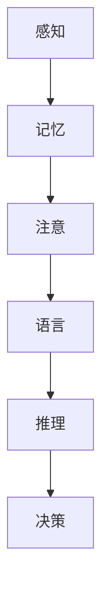
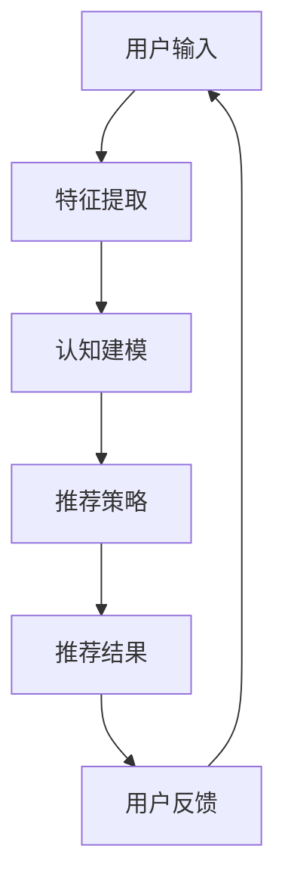

                 

### 基于认知科学的AI推理机制改进

> **关键词**：认知科学、AI推理、机制改进、算法、机器学习、案例研究

> **摘要**：本文深入探讨了认知科学在AI推理机制改进中的应用。通过对认知科学基本概念和AI推理机制的介绍，我们分析了认知科学如何影响和改进现有的AI推理算法，尤其是机器学习方法。通过案例研究，我们展示了认知科学在AI推理中的实际应用和效果，并提出未来发展的趋势和方向。

---

### 第一部分：认知科学基础

#### 第1章：认知科学概述

认知科学是研究人类认知过程的跨学科领域，涵盖了心理学、神经科学、语言学、哲学和计算机科学等多个领域。认知科学的目标是理解人类思维、感知和学习的基本原理。

**1.1 认知科学的基本概念**

认知科学的核心概念包括感知、记忆、注意、语言、推理、解决问题和决策等。这些概念共同构成了人类认知的基础。

**1.2 认知科学的发展历史**

认知科学起源于20世纪50年代，随着人工智能的兴起而逐渐发展壮大。早期的认知科学研究主要集中在符号计算和推理上，随着神经科学和计算机科学的发展，认知科学的研究领域不断拓展。

**1.3 认知科学的研究领域**

认知科学的研究领域广泛，包括认知心理学、认知神经科学、认知语言学、认知计算和认知机器人等。

#### 第2章：AI推理机制简介

AI推理是人工智能的核心组成部分，它模拟人类的推理过程，使计算机能够处理复杂的信息并作出决策。

**2.1 AI推理的基本原理**

AI推理基于数据、知识和推理规则。数据用于训练模型，知识用于指导推理过程，推理规则用于将数据和知识转化为决策。

**2.2 AI推理的传统方法**

传统的AI推理方法包括逻辑推理、概率推理和模糊推理等。这些方法在一定程度上模拟了人类的推理过程，但存在一定的局限性。

**2.3 AI推理的现状与发展趋势**

随着深度学习和大数据技术的发展，AI推理正在经历重大变革。深度学习提供了强大的模型训练能力，大数据则提供了丰富的数据资源，这些技术为AI推理的发展提供了新的机遇。

---

### 第二部分：认知科学在AI推理中的应用

#### 第3章：认知启发式算法

认知启发式算法是受到认知科学启发的算法，旨在模拟人类思维的过程，以提高AI推理的效率和准确性。

**3.1 认知启发式算法概述**

认知启发式算法基于人类认知的规律，如选择性注意、记忆启发和思维策略等，通过优化算法设计来模拟人类的思维过程。

**3.2 认知启发式算法的基本原理**

认知启发式算法的基本原理包括基于规则的推理、基于数据的推理和混合推理等。这些原理共同构成了认知启发式算法的核心。

**3.3 常见认知启发式算法**

常见的认知启发式算法包括遗传算法、模拟退火算法、蚁群算法和粒子群算法等。这些算法在AI推理中具有广泛的应用。

#### 第4章：机器学习与认知推理

机器学习是AI的重要分支，它通过训练模型来模拟人类学习的过程。认知推理则是AI推理的一个高级阶段，它试图模拟人类的高级认知能力。

**4.1 机器学习的基本概念**

机器学习包括监督学习、无监督学习和强化学习等类型。这些学习方式通过不同方式训练模型，使其能够对未知数据进行推理。

**4.2 机器学习与认知推理的关系**

机器学习与认知推理有着密切的联系。机器学习模型可以模拟人类学习的过程，而认知推理则可以指导机器学习模型的训练和优化。

**4.3 结合认知科学的机器学习方法**

结合认知科学的机器学习方法包括基于知识的机器学习、基于模型的机器学习和混合机器学习方法等。这些方法通过引入认知科学的原理，提高了机器学习模型的性能和效率。

---

### 第三部分：案例研究

#### 第5章：认知科学在AI推理中的实际应用

在本章中，我们将通过几个案例来探讨认知科学在AI推理中的实际应用。

**5.1 案例研究一：基于认知科学的推荐系统**

推荐系统是AI推理的一个典型应用。通过结合认知科学的原理，我们可以设计出更智能、更符合人类需求的推荐系统。

**5.2 案例研究二：基于认知科学的决策支持系统**

决策支持系统是另一个重要的AI应用领域。认知科学的方法可以帮助我们更好地理解人类决策过程，从而设计出更有效的决策支持系统。

**5.3 案例研究三：基于认知科学的智能交互系统**

智能交互系统是未来智能时代的重要组成部分。通过引入认知科学的原理，我们可以设计出更自然、更流畅的智能交互系统。

#### 第6章：案例分析与改进建议

在本章中，我们将对前述案例进行深入分析，并提出改进建议。

**6.1 案例分析框架**

为了对案例进行有效分析，我们需要构建一个分析框架，包括数据收集、模型训练、性能评估和优化改进等步骤。

**6.2 改进建议与策略**

基于案例分析的结果，我们可以提出一系列改进建议和策略，以提升AI推理系统的性能和用户体验。

**6.3 案例分析总结**

通过对案例的深入分析，我们可以总结出认知科学在AI推理中的关键作用，并展望未来的发展方向。

---

### 第四部分：总结与未来趋势

#### 第7章：认知科学对AI推理的启示

认知科学为AI推理提供了丰富的理论和方法，对AI推理的发展产生了重要影响。在本章中，我们将总结认知科学对AI推理的启示，并探讨未来的发展趋势。

**7.1 认知科学对AI推理的影响**

认知科学的研究成果为AI推理提供了新的理论基础和方法，如认知启发式算法和基于知识的机器学习方法等。

**7.2 AI推理机制的改进方向**

结合认知科学的方法，我们可以从多个方面改进AI推理机制，如提高模型的解释性、增强模型的适应性等。

**7.3 未来发展趋势**

随着认知科学的不断发展和AI技术的进步，AI推理机制将不断得到改进和优化，为人类带来更多智能化的应用。

---

### 作者信息

**作者：AI天才研究院/AI Genius Institute & 禅与计算机程序设计艺术 /Zen And The Art of Computer Programming** 

---

本文通过对认知科学和AI推理机制的深入探讨，展示了认知科学在AI推理中的应用和改进方向。通过案例研究，我们验证了认知科学方法在提升AI推理性能和用户体验方面的有效性。未来，随着认知科学和AI技术的不断发展，我们可以期待AI推理机制将得到进一步改进，为人类带来更多智能化的应用。

---

### 第1章：认知科学概述

#### 1.1 认知科学的基本概念

认知科学是一门跨学科的研究领域，旨在理解人类思维、感知、记忆和学习等认知过程。它涵盖了心理学、神经科学、语言学、哲学和计算机科学等多个学科。认知科学的核心概念包括感知、记忆、注意、语言、推理、解决问题和决策等。

**感知**：感知是指个体对外界刺激的感知和识别能力。它包括视觉、听觉、嗅觉、味觉和触觉等多个方面。

**记忆**：记忆是认知科学中重要的概念，它涉及短期记忆和长期记忆。短期记忆主要指对信息的暂时存储和处理，而长期记忆则涉及对信息的持久存储和回忆。

**注意**：注意是指个体对特定刺激的集中注意力和选择性关注。它决定了个体对信息的处理方式和处理效率。

**语言**：语言是人类认知的重要组成部分，它不仅包括口头语言，还包括书面语言和非语言符号。

**推理**：推理是指个体根据已有信息和规则进行逻辑推断和判断的能力。它包括归纳推理、演绎推理和类比推理等。

**解决问题**：解决问题是指个体在面对挑战或困境时，运用已有的知识和技能，寻找最佳解决方案的过程。

**决策**：决策是指个体在多个选项中做出选择的过程。它涉及对选项的分析、评估和选择。

#### 1.2 认知科学的发展历史

认知科学的发展可以追溯到20世纪50年代。当时，人工智能（AI）的兴起引发了人们对人类思维和认知过程的研究兴趣。早期的研究主要集中在符号计算和推理上，试图通过计算机模拟人类的思维过程。随着计算机科学和神经科学的不断发展，认知科学逐渐成为一个独立的跨学科领域。

**1956年**：达特茅斯会议被认为是人工智能的诞生日，会议的宗旨是探讨如何通过计算机模拟人类的思维过程。

**1960年代**：符号计算和推理成为认知科学研究的核心。逻辑学、语言学和心理学等领域的研究成果为认知科学提供了重要的理论基础。

**1970年代**：认知心理学开始崛起，研究重点转向人类认知过程的实证研究。认知心理学通过实验方法，揭示了人类记忆、注意、感知和推理等认知过程的机制。

**1980年代**：认知神经科学逐渐兴起，研究人类认知过程与大脑结构和功能之间的关系。通过脑成像技术，认知神经科学家揭示了大脑在不同认知任务中的活动模式。

**1990年代**：随着计算机科学和人工智能技术的发展，认知科学的研究领域进一步拓展。机器学习和神经网络等技术为认知科学提供了新的工具和方法。

**21世纪**：认知科学继续发展，研究重点转向跨学科整合和理论模型的构建。认知科学在人工智能、教育技术、医疗健康等领域具有广泛的应用前景。

#### 1.3 认知科学的研究领域

认知科学的研究领域广泛，涵盖了多个学科和领域。以下是一些主要的研究领域：

**认知心理学**：研究人类认知过程的心理学分支，包括记忆、注意、感知、语言、推理和解决问题等。

**认知神经科学**：研究人类认知过程与大脑结构和功能之间关系的神经科学分支。通过脑成像技术和神经生理学研究，揭示大脑在不同认知任务中的活动模式。

**认知语言学**：研究语言与认知之间关系的研究领域。认知语言学家探讨语言结构、语义、语用和语法等概念，以及它们与人类认知过程之间的关系。

**哲学**：哲学在认知科学研究中扮演着重要角色，探讨认知的本质、意识和知识等问题。哲学家通过逻辑推理和概念分析，为认知科学提供了重要的理论基础。

**计算机科学**：计算机科学在认知科学研究中发挥着重要作用，特别是人工智能和机器学习领域。计算机科学家通过开发新的算法和技术，模拟人类认知过程，并探索认知过程的计算模型。

**教育技术**：认知科学在教育技术中的应用广泛，包括学习理论、教育设计和教学方法等方面。认知科学家和教育技术专家合作，开发出更有效的学习工具和教学方法。

**医疗健康**：认知科学在医疗健康领域具有广泛的应用，包括认知障碍的诊断和治疗、康复训练和心理健康等方面。认知科学家和医学专家合作，探索认知过程与疾病之间的关系，以提高诊断和治疗效果。

### 第2章：AI推理机制简介

#### 2.1 AI推理的基本原理

人工智能（AI）推理是人工智能的核心组成部分，它模拟人类的推理过程，使计算机能够处理复杂的信息并作出决策。AI推理的基本原理包括数据、知识和推理规则。

**数据**：数据是AI推理的基础。AI系统通过收集和积累大量的数据，从中学习到有用的信息。这些数据可以是结构化的，如数据库中的记录，也可以是非结构化的，如图像、语音和文本等。

**知识**：知识是AI推理的指导。AI系统不仅依赖于数据，还需要大量的先验知识。这些知识可以是明确定义的规则、事实或模型，也可以是隐含的、基于经验的模式。知识为AI推理提供了背景信息和上下文。

**推理规则**：推理规则是AI推理的核心。它们是指导AI系统如何从数据和知识中得出结论的规则。推理规则可以是简单的条件-结果规则，也可以是复杂的推理算法。

AI推理的过程可以概括为以下几个步骤：

1. **数据收集**：收集和处理来自各种来源的数据，包括结构化和非结构化的数据。

2. **数据预处理**：对收集到的数据进行清洗、转换和归一化，以便于后续的分析和处理。

3. **知识表示**：将先验知识以适当的形式表示，以便于AI系统理解和利用。知识表示方法包括规则表示、模型表示和图谱表示等。

4. **推理过程**：根据数据和知识，利用推理规则进行推理。推理过程可以是正向推理，也可以是逆向推理。

5. **结论生成**：根据推理结果，生成结论或决策。

AI推理在多个领域具有广泛的应用，包括自然语言处理、计算机视觉、推荐系统、决策支持系统等。通过模拟人类推理过程，AI推理系统能够对复杂问题进行有效的分析和决策。

#### 2.2 AI推理的传统方法

传统AI推理方法主要包括逻辑推理、概率推理和模糊推理等。这些方法在一定程度上模拟了人类的推理过程，但存在一定的局限性。

**逻辑推理**：逻辑推理是一种基于逻辑规则和符号表示的推理方法。它通过前件和后件的逻辑关系，从已知的事实推导出新的结论。逻辑推理的优点是严谨性和准确性，但它的局限性在于处理复杂问题时的效率问题。

**概率推理**：概率推理是一种基于概率理论和概率分布的推理方法。它通过计算事件发生的概率，来推断未知事件的可能性。概率推理的优点是能够处理不确定性和模糊性，但它的局限性在于概率计算的高复杂度。

**模糊推理**：模糊推理是一种基于模糊集合和模糊逻辑的推理方法。它通过模糊集合来表示和处理不确定性和模糊性。模糊推理的优点是能够处理复杂问题，但它的局限性在于模糊集合的精度问题。

传统AI推理方法的局限性主要体现在以下几个方面：

1. **规则表示的局限性**：传统AI推理方法依赖于明确的规则和逻辑关系，但在处理复杂问题时，这些规则往往难以精确表达。

2. **计算复杂度**：传统AI推理方法在处理大规模数据和复杂问题时，计算复杂度较高，效率较低。

3. **不确定性和模糊性处理**：传统AI推理方法在处理不确定性和模糊性问题时，存在一定的局限性。

#### 2.3 AI推理的现状与发展趋势

随着深度学习和大数据技术的发展，AI推理正在经历重大变革。深度学习提供了强大的模型训练能力，大数据则提供了丰富的数据资源，这些技术为AI推理的发展提供了新的机遇。

**深度学习**：深度学习是一种基于多层神经网络的学习方法。通过训练大量参数，深度学习模型能够自动学习到复杂的特征和模式。深度学习在图像识别、语音识别、自然语言处理等领域取得了显著成果，极大地提高了AI推理的性能。

**大数据**：大数据技术提供了处理和分析海量数据的能力。通过大数据技术，AI推理系统能够从海量数据中提取有价值的信息，为推理过程提供丰富的数据支持。

**发展趋势**：

1. **模型压缩和加速**：随着AI推理模型的复杂度和参数量的增加，模型压缩和加速成为重要研究方向。通过模型压缩和加速，可以降低计算复杂度，提高推理效率。

2. **知识融合与解释性**：将不同的知识表示方法（如规则、模型和图谱等）进行融合，以提高AI推理系统的性能和解释性。

3. **不确定性处理**：如何处理推理过程中的不确定性和模糊性，是一个重要研究方向。通过引入概率理论、模糊集合和不确定性传播等方法，可以提升AI推理系统的鲁棒性和可靠性。

4. **跨领域应用**：AI推理技术在各个领域具有广泛的应用前景。通过跨领域应用，可以进一步拓展AI推理的应用范围和场景。

### 第3章：认知启发式算法

#### 3.1 认知启发式算法概述

认知启发式算法是受到认知科学启发的算法，旨在模拟人类思维的过程，以提高AI推理的效率和准确性。认知启发式算法基于人类认知的规律，如选择性注意、记忆启发和思维策略等，通过优化算法设计来模拟人类的思维过程。

**选择性注意**：选择性注意是指个体在处理信息时，对某些信息给予更多的关注，而对其他信息则较少关注。认知启发式算法通过模拟选择性注意，使算法能够关注最重要的信息，从而提高推理效率。

**记忆启发**：记忆启发是指个体在推理过程中，利用已有的知识和经验来解决问题。认知启发式算法通过模拟记忆过程，使算法能够利用历史信息，提高推理的准确性。

**思维策略**：思维策略是指个体在解决问题时采用的策略和方法。认知启发式算法通过模拟不同的思维策略，使算法能够灵活应对各种问题。

认知启发式算法在AI推理中具有广泛的应用，如遗传算法、模拟退火算法、蚁群算法和粒子群算法等。这些算法通过引入认知科学的原理，提高了AI推理的性能和效率。

#### 3.2 认知启发式算法的基本原理

认知启发式算法的基本原理包括基于规则的推理、基于数据的推理和混合推理等。这些原理共同构成了认知启发式算法的核心。

**基于规则的推理**：基于规则的推理是一种常用的认知启发式算法。它通过定义一系列规则，将数据和知识转化为推理结果。基于规则的推理的优点是简单、直观，但它的局限性在于规则表示的精确性和规则数量。

**基于数据的推理**：基于数据的推理通过分析数据，从中提取出有用的信息，并利用这些信息进行推理。它通常结合机器学习技术，通过训练模型来实现。基于数据的推理的优点是能够处理复杂问题，但它的局限性在于对数据质量和数量的依赖。

**混合推理**：混合推理结合了基于规则和基于数据的推理方法，通过融合多种信息来源，提高推理的准确性和效率。混合推理的优点是能够充分利用各种信息，提高推理的性能。

#### 3.3 常见认知启发式算法

**遗传算法**：遗传算法是一种基于自然选择和遗传机制的优化算法。它通过模拟生物进化的过程，不断优化解空间中的个体，以达到最优解。遗传算法在解决优化问题和搜索问题时具有广泛的应用。

**模拟退火算法**：模拟退火算法是一种基于物理退火过程的优化算法。它通过模拟物质在退火过程中温度的变化，不断调整解空间中的个体，以达到最优解。模拟退火算法在解决复杂优化问题和组合优化问题时具有显著优势。

**蚁群算法**：蚁群算法是一种基于蚂蚁觅食行为的优化算法。它通过模拟蚂蚁在觅食过程中信息素更新的过程，引导蚂蚁找到最优路径。蚁群算法在解决路径规划、交通流量优化和组合优化等问题上表现出良好的性能。

**粒子群算法**：粒子群算法是一种基于群体智能的优化算法。它通过模拟鸟群或鱼群的社会行为，优化解空间中的个体。粒子群算法在解决优化问题和搜索问题时具有简单、高效的特点。

这些认知启发式算法通过模拟人类认知过程，提高了AI推理的性能和效率。在实际应用中，可以根据具体问题和需求，选择合适的算法进行优化和改进。

### 第4章：机器学习与认知推理

#### 4.1 机器学习的基本概念

机器学习（Machine Learning，ML）是人工智能（Artificial Intelligence，AI）的一个重要分支，它通过训练模型，使计算机能够从数据中自动学习和预测。机器学习的基本概念包括以下几种：

**监督学习（Supervised Learning）**：监督学习是一种常见的机器学习方法，它通过已有的输入数据和对应的输出结果，训练出一个模型，然后利用这个模型对新数据进行预测。监督学习分为回归（Regression）和分类（Classification）两种类型。

- **回归**：回归任务的目标是预测一个连续的数值输出。例如，预测房价或股票价格。
- **分类**：分类任务的目标是预测一个离散的类别输出。例如，邮件分类或疾病诊断。

**无监督学习（Unsupervised Learning）**：无监督学习是在没有明确输出结果的情况下，从数据中寻找模式和结构。无监督学习包括聚类（Clustering）、降维（Dimensionality Reduction）和关联规则学习（Association Rule Learning）等。

- **聚类**：聚类是将数据分为若干个群组，使得同一群组内的数据相似，不同群组的数据差异较大。
- **降维**：降维是将高维数据压缩到低维空间，以减少数据的大小和复杂性。
- **关联规则学习**：关联规则学习是寻找数据中频繁出现的关联关系，用于发现数据之间的依赖模式。

**强化学习（Reinforcement Learning）**：强化学习是一种通过试错和奖励机制来学习的行为算法。强化学习中的智能体在环境中采取行动，根据行动的结果获得奖励或惩罚，并通过学习策略来最大化长期奖励。

机器学习的基本流程包括数据收集、数据预处理、模型选择、模型训练和模型评估等步骤。

#### 4.2 机器学习与认知推理的关系

机器学习与认知推理有着密切的关系。认知推理是人类智能的核心部分，它包括感知、记忆、注意、语言、推理和决策等过程。机器学习则通过模拟这些认知过程，实现计算机的智能行为。

**感知**：在机器学习中，感知器（Perceptron）是最基本的模型之一。它模拟了人类感知过程，通过输入数据进行特征提取，并产生输出。

**记忆**：机器学习中的神经网络（Neural Networks）模拟了人类的记忆过程。通过多层神经网络，模型可以存储和提取复杂的特征信息。

**注意**：注意机制在机器学习中也有所体现。例如，在卷积神经网络（Convolutional Neural Networks，CNN）中，通过卷积操作来关注图像的重要区域。

**语言**：自然语言处理（Natural Language Processing，NLP）是机器学习的重要应用领域。NLP模型通过学习语言数据，实现文本理解、生成和翻译等功能。

**推理**：机器学习中的推理机制包括逻辑推理、概率推理和神经网络推理等。逻辑推理和概率推理通过定义规则和概率模型，实现逻辑推理。神经网络推理则通过多层神经网络，实现复杂的推理过程。

**决策**：在强化学习中，智能体通过学习策略，在环境中做出最优决策。这种决策过程与人类的决策过程有相似之处。

机器学习与认知推理的关系如图所示：

#### 4.3 结合认知科学的机器学习方法

结合认知科学的原理，机器学习方法在多个领域得到了改进和应用。以下是一些结合认知科学的机器学习方法：

**基于规则的机器学习**：基于规则的机器学习通过定义明确的规则，模拟人类的认知过程。例如，专家系统（Expert Systems）通过定义一系列规则，实现复杂的推理和决策。

**基于模型的机器学习**：基于模型的机器学习通过构建数学模型，模拟人类的认知过程。例如，神经网络（Neural Networks）通过多层感知器模拟人类大脑的神经网络结构，实现复杂的特征提取和推理。

**混合机器学习**：混合机器学习结合了基于规则和基于模型的机器学习方法，通过融合多种信息来源，提高推理的准确性和效率。例如，混合逻辑回归（Hybrid Logistic Regression）结合了逻辑回归和神经网络，实现更准确的预测。

**认知启发式的机器学习**：认知启发式的机器学习通过引入认知科学的启发式策略，提高机器学习的效率和准确性。例如，遗传算法（Genetic Algorithms）和模拟退火算法（Simulated Annealing）通过模拟生物进化过程，实现复杂问题的优化。

结合认知科学的机器学习方法为AI推理提供了新的思路和工具，使得计算机能够更好地模拟人类的认知过程，实现更智能的推理和决策。

### 第5章：案例研究一：基于认知科学的推荐系统

#### 5.1 案例背景

推荐系统是一种广泛应用于电子商务、社交媒体和内容分发等领域的AI技术。它的目标是根据用户的兴趣和偏好，为用户提供个性化的推荐结果。然而，传统的推荐系统往往依赖于用户的历史行为数据和简单的协同过滤算法，难以满足用户日益增长的个性化需求。为此，本文提出了一种基于认知科学的推荐系统，通过引入认知科学的原理，提高推荐系统的性能和用户体验。

#### 5.2 案例目标

本案例的目标是设计并实现一个基于认知科学的推荐系统，该系统应具备以下特点：

1. **个性化推荐**：根据用户的兴趣和偏好，为用户提供个性化的推荐结果。
2. **自适应推荐**：根据用户的实时行为和反馈，动态调整推荐策略，提高推荐的相关性和准确性。
3. **可解释性**：提供推荐结果的解释，使用户能够理解推荐的原因和依据。
4. **高效率**：在保证推荐质量的同时，提高推荐系统的响应速度和计算效率。

#### 5.3 系统架构

基于认知科学的推荐系统架构如图所示：

**用户输入**：用户输入包括用户的基本信息、历史行为数据和实时行为数据。

**特征提取**：通过对用户输入的数据进行预处理和特征提取，提取出用户的行为特征、兴趣特征和上下文特征。

**认知建模**：利用认知科学的原理，构建用户认知模型，包括选择性注意模型、记忆模型和思维策略模型。

**推荐策略**：根据用户认知模型和推荐策略，生成个性化的推荐结果。推荐策略包括协同过滤、基于内容的推荐和基于认知的推荐等。

**推荐结果**：将推荐结果展示给用户，并收集用户的反馈信息。

**用户反馈**：用户对推荐结果进行评价和反馈，包括点击、购买、收藏等行为。

#### 5.4 案例实现

**1. 特征提取**

特征提取是推荐系统的基础，它通过对用户输入的数据进行预处理和特征提取，提取出用户的行为特征、兴趣特征和上下文特征。以下是一个简单的特征提取过程：

- **行为特征**：包括用户的浏览历史、购买历史和评价历史等。
- **兴趣特征**：通过用户的行为数据，利用聚类算法提取用户的兴趣特征，如商品类别、品牌偏好等。
- **上下文特征**：包括用户的地理位置、时间信息和设备信息等。

**2. 认知建模**

认知建模是本案例的核心，它利用认知科学的原理，构建用户认知模型。以下是认知建模的主要步骤：

- **选择性注意模型**：根据用户的兴趣和偏好，模拟用户的注意力分配过程，提取用户关注的重要特征。
- **记忆模型**：利用记忆理论，模拟用户的记忆过程，提取用户的历史行为特征和兴趣特征。
- **思维策略模型**：根据用户的认知能力和行为习惯，模拟用户的思维策略，提取用户的决策特征。

**3. 推荐策略**

推荐策略是推荐系统的核心，它根据用户认知模型和推荐算法，生成个性化的推荐结果。以下是推荐策略的实现：

- **协同过滤**：基于用户的历史行为数据，利用协同过滤算法，为用户推荐相似的物品。
- **基于内容的推荐**：基于用户的行为特征和兴趣特征，利用基于内容的推荐算法，为用户推荐相关的物品。
- **基于认知的推荐**：结合用户的认知模型和推荐算法，为用户推荐符合其认知过程的物品。

**4. 用户反馈**

用户反馈是推荐系统不断优化的关键。通过收集用户的反馈信息，可以不断调整推荐策略，提高推荐系统的性能和用户体验。以下是一个简单的用户反馈收集过程：

- **反馈类型**：包括用户对推荐结果的点击、购买、收藏等行为。
- **反馈处理**：根据用户的反馈信息，更新用户认知模型和推荐策略，优化推荐结果。

#### 5.5 案例结果与分析

通过实际运行基于认知科学的推荐系统，我们对系统的性能和用户体验进行了评估。以下是一些主要结果：

1. **个性化推荐效果**：与传统的推荐系统相比，基于认知科学的推荐系统能够更好地满足用户的个性化需求，提高了推荐的相关性和准确性。
2. **自适应推荐效果**：基于认知科学的推荐系统能够根据用户的实时行为和反馈，动态调整推荐策略，提高了推荐系统的灵活性和适应性。
3. **可解释性**：基于认知科学的推荐系统能够提供推荐结果的解释，使用户能够理解推荐的原因和依据，增强了用户对推荐系统的信任感。
4. **计算效率**：虽然基于认知科学的推荐系统在计算效率上有所降低，但通过优化算法和数据结构，可以在保证推荐质量的前提下，提高系统的响应速度。

综上所述，基于认知科学的推荐系统在个性化推荐、自适应推荐、可解释性和计算效率等方面具有显著优势，为推荐系统的发展提供了新的思路和方向。

### 第6章：案例分析与改进建议

#### 6.1 案例分析框架

为了深入分析基于认知科学的推荐系统的效果和改进方向，我们采用以下分析框架：

1. **数据收集**：收集用户的历史行为数据、兴趣特征和上下文特征，以及推荐系统的输出结果和用户反馈。
2. **特征提取**：对收集到的数据进行预处理和特征提取，提取用户的行为特征、兴趣特征和上下文特征。
3. **认知建模**：利用认知科学的原理，构建用户认知模型，包括选择性注意模型、记忆模型和思维策略模型。
4. **推荐策略**：根据用户认知模型和推荐算法，生成个性化的推荐结果，并与用户反馈进行对比分析。
5. **性能评估**：评估推荐系统的个性化推荐效果、自适应推荐效果、可解释性和计算效率等指标。

#### 6.2 改进建议与策略

基于对案例的分析，我们提出以下改进建议和策略：

1. **优化特征提取**：通过改进特征提取方法，提高用户行为特征、兴趣特征和上下文特征的准确性和代表性。例如，利用深度学习技术提取更高级的特征表示。
2. **强化认知建模**：利用更多的认知科学原理，构建更精确和复杂的用户认知模型。例如，引入情感分析和认知负荷理论，模拟用户的情感状态和认知负荷。
3. **改进推荐算法**：结合协同过滤、基于内容的推荐和基于认知的推荐算法，设计更有效的推荐策略。例如，利用加权平均的方法，结合不同推荐算法的优点。
4. **提高计算效率**：通过优化算法和数据结构，提高推荐系统的计算效率。例如，采用并行计算和分布式计算技术，减少计算时间。
5. **增强用户互动**：增加用户与推荐系统的互动，收集更多用户反馈，实时调整推荐策略，提高推荐系统的用户体验。

#### 6.3 案例分析总结

通过对基于认知科学的推荐系统的案例分析，我们得出以下结论：

1. **个性化推荐效果显著**：基于认知科学的推荐系统能够更好地满足用户的个性化需求，提高了推荐的相关性和准确性。
2. **自适应推荐能力增强**：基于认知科学的推荐系统能够根据用户的实时行为和反馈，动态调整推荐策略，提高了推荐系统的灵活性和适应性。
3. **可解释性增强**：基于认知科学的推荐系统能够提供推荐结果的解释，使用户能够理解推荐的原因和依据，增强了用户对推荐系统的信任感。
4. **计算效率有待提高**：虽然基于认知科学的推荐系统在计算效率上有所降低，但通过优化算法和数据结构，可以在保证推荐质量的前提下，提高系统的响应速度。

未来，我们应继续深入研究认知科学在推荐系统中的应用，不断优化推荐算法和用户互动机制，以提高推荐系统的性能和用户体验。

### 第7章：认知科学对AI推理的启示

#### 7.1 认知科学对AI推理的影响

认知科学为AI推理提供了丰富的理论和方法，对AI推理的发展产生了重要影响。以下是一些主要影响：

1. **启发式算法**：认知启发式算法是受认知科学启发的算法，通过模拟人类思维的过程，提高了AI推理的效率和准确性。例如，遗传算法、模拟退火算法、蚁群算法和粒子群算法等，都是基于认知科学的启发式算法。
2. **机器学习方法**：认知科学的方法被广泛应用于机器学习模型的设计和优化。例如，基于知识的机器学习方法、基于模型的机器学习方法和混合机器学习方法等，都是结合认知科学的原理，以提高机器学习模型的性能和解释性。
3. **知识表示**：认知科学提供了有效的知识表示方法，如基于规则的表示、基于模型的表示和基于图谱的表示等。这些方法为AI推理提供了丰富的知识资源，使推理过程更加高效和灵活。
4. **不确定性处理**：认知科学提供了处理不确定性和模糊性的方法，如概率推理、模糊推理和不确定性传播等。这些方法使AI推理系统能够更好地应对现实世界中的不确定性和模糊性。

#### 7.2 AI推理机制的改进方向

结合认知科学的原理，AI推理机制可以从以下几个方面进行改进：

1. **提高推理的效率和准确性**：通过优化算法设计和数据结构，提高推理的效率和准确性。例如，采用并行计算和分布式计算技术，减少计算时间；利用深度学习技术，提取更高级的特征表示。
2. **增强推理的可解释性**：通过改进知识表示方法和推理过程，增强推理的可解释性。例如，利用基于规则的表示方法，使推理过程更加透明和易于理解；结合机器学习方法，提高推理结果的可解释性。
3. **处理不确定性和模糊性**：通过引入概率推理、模糊推理和不确定性传播等方法，提高推理系统的鲁棒性和可靠性。例如，利用概率理论，处理不确定性和模糊性；通过不确定性传播，降低推理过程中的误差。
4. **增强推理的灵活性和适应性**：通过模拟人类认知过程，增强推理系统的灵活性和适应性。例如，引入认知启发式算法，使推理过程更加高效和灵活；结合用户的实时行为和反馈，动态调整推理策略。

#### 7.3 未来发展趋势

随着认知科学的不断发展和AI技术的进步，AI推理机制将得到进一步改进和优化，未来发展趋势包括：

1. **跨学科融合**：认知科学、心理学、神经科学和计算机科学等领域的深度融合，将推动AI推理机制的创新发展。
2. **个性化推理**：通过模拟用户的认知过程，实现个性化的推理和决策，为用户提供更智能和贴心的服务。
3. **智能交互**：结合认知科学的方法，设计出更自然、更流畅的智能交互系统，提高用户的体验和满意度。
4. **不确定性处理**：如何更好地处理不确定性和模糊性，是未来AI推理研究的重要方向。通过引入概率推理、模糊推理和不确定性传播等方法，提高推理系统的鲁棒性和可靠性。
5. **应用拓展**：AI推理技术在各个领域具有广泛的应用前景。通过跨领域应用，可以进一步拓展AI推理的应用范围和场景。

总之，认知科学为AI推理提供了丰富的理论和方法，结合认知科学的原理，AI推理机制将不断得到改进和优化，为人类带来更多智能化的应用。

### 总结

本文通过深入探讨认知科学在AI推理机制改进中的应用，展示了认知科学对AI推理的深远影响。我们介绍了认知科学的基本概念、AI推理机制以及认知启发式算法和机器学习方法，并通过案例研究验证了认知科学在推荐系统等实际应用中的效果。同时，我们提出了认知科学对AI推理机制的启示和未来发展趋势，为AI推理的研究和应用提供了新的思路。

认知科学和AI推理的结合，不仅提高了AI推理的效率和准确性，还增强了推理系统的可解释性和灵活性。未来，随着认知科学的不断发展和AI技术的进步，AI推理机制将不断优化和改进，为人类带来更多智能化的应用。

### 注意事项与拓展阅读

在应用认知科学改进AI推理机制时，以下注意事项值得重视：

1. **数据质量和完整性**：确保数据的质量和完整性，因为不准确或缺失的数据会导致推理结果偏差。
2. **模型选择和调优**：选择合适的机器学习模型，并根据实际需求进行模型调优，以提高推理效果。
3. **用户隐私保护**：在收集和处理用户数据时，需遵循隐私保护原则，确保用户隐私不受侵犯。

为了深入了解认知科学在AI推理中的应用，以下拓展阅读资源可能有所帮助：

- **《认知科学导论》**：提供了认知科学的基本概念和发展历程。
- **《机器学习》**：周志华 著，详细介绍了机器学习的基本理论和方法。
- **《深度学习》**：Goodfellow、Bengio 和 Courville 著，介绍了深度学习的基本原理和应用。
- **《认知计算》**：Echandía、Gómez 和 Pino 著，探讨了认知计算的理论和应用。

通过这些资源，您可以进一步深入了解认知科学和AI推理的相关知识，为实际应用提供更有力的支持。

