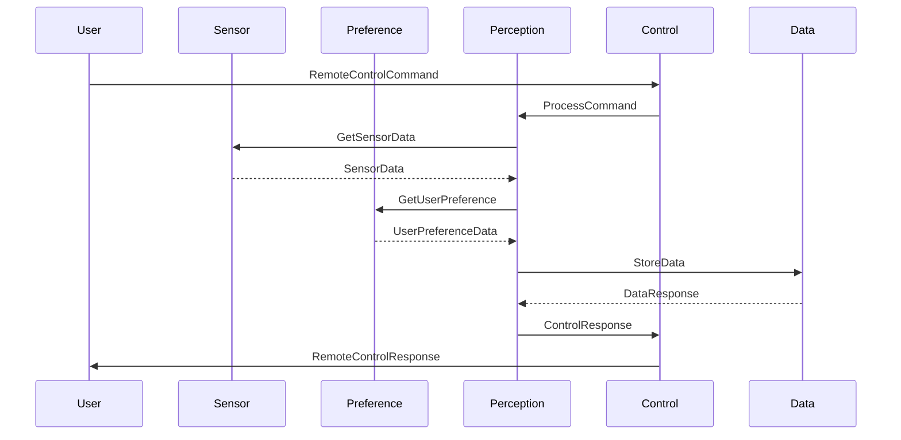

                 

### 第一部分：背景与基础

#### 第1章：问题背景

##### 1.1.1 记忆增强网络的基本概念

记忆增强网络（Memory-Augmented Neural Networks，MANN）是一种新型的神经网络架构，旨在通过引入外部记忆模块来增强传统神经网络的记忆能力。在这种架构中，外部记忆模块充当了一个巨大的存储仓库，能够存储和处理大量的信息，从而帮助神经网络在复杂的任务中表现得更加出色。记忆增强网络的核心思想是将外部记忆与神经计算相结合，通过在神经网络中引入记忆模块，使得网络可以持续地学习、更新和利用已有的知识，从而在推理和决策过程中具备更强的能力和适应性。

##### 1.1.2 情景感知推理的重要性

情景感知推理（Context-Aware Reasoning）是一种智能系统在处理信息时，能够根据当前情景和上下文环境来进行推理和决策的能力。这种能力对于提高系统的智能水平、适应复杂多变的环境至关重要。在现实世界中，许多任务需要系统具备情景感知能力，例如自动驾驶、智能家居、智能客服等。这些应用场景中，系统需要不断地感知环境变化，并根据这些变化来调整自己的行为和决策。因此，情景感知推理不仅是人工智能研究中的一个重要方向，也是实现智能化系统的基础。

##### 1.1.3 现有技术面临的挑战

尽管记忆增强网络和情景感知推理在人工智能领域展示了巨大的潜力，但现有的技术仍然面临着一些挑战。首先，记忆增强网络的记忆容量和存储效率问题尚未得到充分解决。现有的外部记忆模块往往需要大量的计算资源，且在实际应用中难以有效地处理和检索大量信息。其次，情景感知推理的方法和技术手段相对单一，难以适应复杂多变的情景环境。此外，记忆增强网络与情景感知推理的结合仍需进一步研究和探索，如何在两者之间实现有效的交互和协同工作，是当前研究的一个关键问题。

#### 第2章：核心概念与联系

##### 2.1.1 记忆增强网络原理

记忆增强网络的核心在于其外部记忆模块的设计与实现。这种记忆模块通常由一组记忆单元和相应的读写机制组成。记忆单元可以存储各种类型的信息，如数值、文本、图像等，而读写机制则负责对记忆单元中的信息进行高效地读取和写入操作。记忆增强网络通过将外部记忆模块与神经网络的核心计算部分相结合，使得神经网络在处理信息时能够利用已有的知识和经验，从而提高其推理和决策能力。

###### 2.1.1.1 基本原理

记忆增强网络的基本原理可以概括为“学习-存储-检索”循环。在训练阶段，神经网络通过前向传播学习输入数据的特征，并通过反向传播不断优化网络的参数。同时，神经网络将学习到的信息存储到外部记忆模块中。在推理阶段，神经网络可以利用外部记忆模块中的信息来辅助决策，从而提高推理的准确性和效率。

###### 2.1.1.2 记忆增强方法

记忆增强网络常用的记忆增强方法包括编码-检索、门控机制和注意力机制等。编码-检索方法通过将输入数据编码成向量，然后利用检索算法从记忆模块中查找相关的信息。门控机制则通过动态地控制记忆单元的读写操作，使得神经网络能够根据当前任务的需要灵活地利用外部记忆。注意力机制则通过分配不同的重要性权重，使得神经网络在检索记忆时能够关注关键的信息。

##### 2.1.2 情景感知推理原理

情景感知推理的核心在于对上下文信息的感知和处理。情景感知模型通常包括情景感知模块和推理模块。情景感知模块负责从环境中收集上下文信息，如时间、地点、用户行为等。这些信息通过一定的预处理和特征提取，被输入到推理模块中。推理模块则利用这些上下文信息来进行推理和决策，从而实现对任务的有效处理。

###### 2.1.2.1 情景感知的定义

情景感知（Context Awareness）是指系统在执行任务时，能够感知和理解当前情景的能力。情景感知不仅包括对物理环境（如时间、地点）的感知，还包括对用户行为、情感和社会因素的感知。通过情景感知，系统可以动态地调整其行为和决策，以适应不同的情景需求。

###### 2.1.2.2 情景感知方法

情景感知方法主要包括基于规则的方法、机器学习方法、多模态感知方法等。基于规则的方法通过定义一系列规则来识别和响应特定的情景。机器学习方法则通过训练模型来自动地学习和提取情景特征，从而实现情景感知。多模态感知方法通过结合多种传感器的数据，如视觉、听觉、触觉等，来提高情景感知的准确性和全面性。

##### 2.1.3 记忆增强网络与情景感知推理的关系

记忆增强网络和情景感知推理在人工智能领域具有紧密的联系和互补性。

###### 2.1.3.1 联系分析

记忆增强网络可以看作是一种增强情景感知推理能力的工具。通过引入外部记忆模块，记忆增强网络能够存储和利用大量的上下文信息，从而提高情景感知模型的推理能力。同时，情景感知推理可以为记忆增强网络提供丰富的上下文信息，使得记忆增强网络能够更加精准地检索和应用已有知识。

###### 2.1.3.2 优势与挑战

记忆增强网络与情景感知推理的结合带来了许多优势，如：

1. **提高推理能力**：记忆增强网络能够利用外部记忆模块存储的大量信息，进行高效的推理和决策。
2. **适应复杂环境**：情景感知推理使得系统能够动态地适应复杂多变的情景环境。
3. **增强学习能力**：通过情景感知，记忆增强网络可以更加精准地学习到与情景相关的特征，从而提高学习效率。

然而，这种结合也带来了一些挑战，如：

1. **计算资源消耗**：记忆增强网络需要大量的计算资源来维护和更新外部记忆模块。
2. **信息检索效率**：如何在大量信息中高效地检索和利用与当前情景相关的信息，是一个关键问题。
3. **模型复杂性**：结合记忆增强网络和情景感知推理的方法往往具有较高的模型复杂性，增加了训练和优化的难度。

为了解决这些挑战，未来的研究需要在记忆增强网络和情景感知推理的结合上做出更多的探索和优化。

## 第3章：数学模型和数学公式

在理解记忆增强网络和情景感知推理的过程中，数学模型和公式是不可或缺的工具。它们不仅帮助我们量化和理解这些概念的内在机制，还能为算法设计和优化提供数学依据。以下我们将详细讨论相关的数学模型和公式，并解释它们在算法中的作用。

### 3.1 记忆增强网络的数学模型

记忆增强网络的数学模型主要围绕外部记忆模块的设计和操作。以下是几个关键的数学概念和公式：

#### 3.1.1 记忆单元更新公式

记忆单元的更新是记忆增强网络的核心操作之一。假设我们有一个记忆矩阵 \( M \) ，其中每个元素 \( M_{ij} \) 代表第 \( i \) 个记忆单元中的第 \( j \) 个数据点。在每次更新时，新的记忆值 \( \Delta M \) 可以通过以下公式计算：

\[ \Delta M = f(W \cdot [X; M]) \]

其中：
- \( W \) 是记忆更新的权重矩阵。
- \( X \) 是当前输入数据。
- \( f \) 是一个非线性函数，通常是一个激活函数，如ReLU或Sigmoid函数。

记忆矩阵的最终更新可以表示为：

\[ M = M + \Delta M \]

#### 3.1.2 记忆检索公式

在检索阶段，我们需要从记忆矩阵 \( M \) 中找到与当前输入 \( X \) 最相关的记忆单元。这通常通过相似度计算实现，可以使用以下公式：

\[ S_{ij} = \cos(\theta_i, \theta_j) \]

其中：
- \( S_{ij} \) 是第 \( i \) 个记忆单元和第 \( j \) 个输入数据之间的相似度。
- \( \theta_i \) 和 \( \theta_j \) 分别是记忆单元和输入数据的嵌入向量。

检索结果可以表示为：

\[ R = \arg\max_i S_{ij} \]

### 3.2 情景感知推理的数学模型

情景感知推理的数学模型主要关注如何利用上下文信息来增强推理过程。以下是几个相关的数学概念和公式：

#### 3.2.1 上下文向量嵌入

在情景感知推理中，上下文信息被表示为向量。假设我们有一个上下文向量矩阵 \( C \)，其中每个元素 \( C_{ij} \) 代表第 \( i \) 个上下文特征的第 \( j \) 个数据点。上下文向量的嵌入可以通过以下公式实现：

\[ \text{Embed}(C) = \text{Embedding}(C) \]

其中：
- \( \text{Embedding}(C) \) 是一个嵌入函数，它将上下文特征转换为高维向量。

#### 3.2.2 情景感知权重计算

情景感知模型需要计算上下文信息对推理结果的权重。假设我们有一个权重矩阵 \( W_C \)，其中每个元素 \( W_{Cij} \) 表示第 \( i \) 个上下文特征对第 \( j \) 个推理结果的权重。权重可以通过以下公式计算：

\[ W_{Cij} = \text{softmax}(\text{Affinity}(C, R)) \]

其中：
- \( \text{Affinity}(C, R) \) 是上下文向量 \( C \) 和检索结果向量 \( R \) 之间的亲和度函数。
- \( \text{softmax} \) 函数用于归一化亲和度得分，得到权重向量。

#### 3.2.3 情景感知推理结果

最终的推理结果是通过将上下文权重与推理结果相乘来获得的：

\[ Y = R \cdot W_C \]

其中 \( Y \) 是最终的推理输出。

### 3.3 融合记忆增强与情景感知推理的数学模型

为了将记忆增强网络与情景感知推理相结合，我们需要设计一个统一的数学模型，使得两者能够有效地交互和协同工作。以下是一个简单的融合模型：

\[ \text{Output} = f(\text{Memory} + \text{Context}) \]

其中：
- \( \text{Memory} \) 是记忆增强网络输出的记忆信息。
- \( \text{Context} \) 是情景感知推理输出的上下文信息。
- \( f \) 是一个融合函数，用于将记忆和上下文信息结合起来进行推理。

通过上述数学模型，我们可以看到，记忆增强网络和情景感知推理在数学层面上是相辅相成的。记忆增强网络提供了丰富的历史信息和记忆能力，而情景感知推理则提供了当前的上下文信息和环境感知能力。两者结合，使得智能系统能够在复杂的任务中表现得更加智能和高效。

在接下来的章节中，我们将进一步深入探讨记忆增强网络的算法原理，以及如何将这些数学模型应用于实际的系统架构和项目实战中。

## 第二部分：算法原理讲解

### 第4章：算法原理讲解

在深入探讨基于记忆增强网络的情景感知推理能力提升技术之前，我们需要详细理解记忆增强网络和情景感知推理的基本原理。以下是这两个核心概念的具体算法原理讲解。

#### 4.1 记忆增强网络

记忆增强网络（Memory-Augmented Neural Networks，MANN）通过引入外部记忆模块来增强传统神经网络的记忆能力。这种架构的核心在于如何有效地存储、检索和使用外部记忆来辅助神经网络进行推理和决策。

##### 4.1.1 记忆增强网络结构

记忆增强网络的基本结构包括输入层、外部记忆模块、记忆控制单元和输出层。以下是各部分的功能：

1. **输入层**：接收外部输入数据，这些数据可以是图像、文本或传感器数据。
2. **外部记忆模块**：存储大量的历史信息和模式，通常由多个记忆单元组成，每个记忆单元可以存储一定数量的信息。
3. **记忆控制单元**：负责管理和更新外部记忆模块，包括记忆的读写操作和更新规则。
4. **输出层**：将外部记忆模块和记忆控制单元的信息融合，生成最终的输出。

##### 4.1.2 记忆增强机制

记忆增强网络的记忆增强机制主要包括以下两个方面：

1. **记忆编码**：将输入数据编码成向量，并将其存储到外部记忆模块中。编码方法可以采用嵌入层或编码器网络，以便更好地表示输入数据的特征。
   
   记忆编码公式可以表示为：

   \[ \text{Memory} = \text{Encoder}(\text{Input}) \]

2. **记忆检索**：在推理过程中，根据当前输入数据检索与历史信息最相关的记忆单元。检索方法可以采用相似度计算或注意力机制，以高效地找到与当前情景相关的记忆。

   记忆检索公式可以表示为：

   \[ \text{RetrievedMemory} = \text{SimilaritySearch}(\text{Input}, \text{Memory}) \]

##### 4.1.3 记忆增强网络的优势

记忆增强网络具有以下几个显著优势：

1. **增强记忆能力**：通过引入外部记忆模块，记忆增强网络能够存储和处理大量的历史信息，从而在复杂的任务中表现得更加智能和灵活。
2. **提高推理效率**：记忆增强网络可以在推理过程中快速检索和利用已有的知识，减少对大量数据的重新处理，从而提高推理效率。
3. **适应动态环境**：记忆增强网络能够动态更新和调整外部记忆，使得系统可以适应不断变化的环境和任务需求。

#### 4.2 情景感知推理

情景感知推理（Context-Aware Reasoning）是一种智能系统在处理信息时，能够根据当前情景和上下文环境来进行推理和决策的能力。情景感知推理的核心在于如何利用上下文信息来辅助任务处理，提高系统的智能水平。

##### 4.2.1 情景感知模型

情景感知模型通常包括以下几个关键组成部分：

1. **情景感知模块**：负责从环境中收集和感知上下文信息，如时间、地点、用户行为等。
2. **特征提取模块**：对感知到的上下文信息进行特征提取和预处理，以便更好地用于后续的推理和决策。
3. **推理模块**：利用特征提取模块生成的特征向量进行推理和决策，生成最终的输出结果。

##### 4.2.2 情境推理过程

情景感知推理的过程可以分为以下几个步骤：

1. **上下文感知**：情景感知模块收集当前环境中的上下文信息。
2. **特征提取**：特征提取模块对感知到的上下文信息进行处理，生成特征向量。
3. **推理计算**：推理模块利用特征向量进行推理，生成决策结果。
4. **输出生成**：将推理结果转换为具体的操作指令或输出结果，以实现任务的目标。

##### 4.2.3 情景感知推理的优势

情景感知推理具有以下几个显著优势：

1. **提高决策准确性**：通过利用上下文信息，情景感知推理可以更加准确地理解和预测任务环境，从而提高决策的准确性。
2. **增强适应性**：情景感知推理使得系统可以动态地调整其行为和决策，以适应不断变化的环境和任务需求。
3. **优化用户体验**：在应用场景如智能客服、智能家居等，情景感知推理能够根据用户的实际需求和偏好提供个性化的服务，从而优化用户体验。

#### 4.3 记忆增强网络与情景感知推理的结合

将记忆增强网络与情景感知推理相结合，可以进一步提升智能系统的能力。以下是一个简单的结合模型：

1. **记忆增强情景感知模块**：结合记忆增强网络和情景感知模块，使得系统能够在处理信息时同时利用记忆和上下文信息。
2. **联合推理模块**：利用记忆增强情景感知模块生成的特征向量进行联合推理，生成最终的输出结果。

结合模型的数学公式可以表示为：

\[ \text{Output} = f(\text{Memory} + \text{Context}) \]

其中：
- \( \text{Memory} \) 是记忆增强网络输出的记忆信息。
- \( \text{Context} \) 是情景感知推理输出的上下文信息。
- \( f \) 是一个联合推理函数，用于融合记忆和上下文信息。

通过这种方式，记忆增强网络和情景感知推理可以相互补充，共同提升智能系统的推理能力和适应性。

### 4.4 示例分析

为了更好地理解记忆增强网络和情景感知推理的应用，我们来看一个具体的示例。

**场景**：智能家居系统中的智能灯泡控制。

**输入**：
- 电流传感器数据（外部输入）
- 用户设定的时间（情景信息）

**步骤**：
1. **记忆编码**：将电流传感器数据编码为向量，并存储到外部记忆模块中。
2. **情景感知**：根据用户设定的时间，提取相关的情景信息。
3. **记忆检索**：根据当前电流传感器数据和情景信息，检索与历史数据最相关的记忆单元。
4. **联合推理**：利用检索到的记忆和情景信息，判断是否需要调整灯泡亮度。

**输出**：
- 调整灯泡亮度的操作指令。

通过这个示例，我们可以看到记忆增强网络和情景感知推理如何结合使用，以实现更加智能和高效的家居控制。

通过深入理解记忆增强网络和情景感知推理的算法原理，我们能够更好地设计和优化智能系统，使其在复杂环境中表现得更加出色。在接下来的章节中，我们将进一步探讨如何在实际系统中实现这些算法，并进行项目实战。

## 第三部分：系统分析与架构设计方案

### 第5章：系统分析与架构设计方案

#### 5.1 问题场景介绍

智能家居系统是当前智能技术发展中的一个重要领域。在这个场景中，系统需要实现各种家电设备的智能控制，包括照明、空调、安防等。智能灯泡作为智能家居系统中的一个重要组件，其控制逻辑需要具备高度的智能性和灵活性。例如，系统需要根据室内光线强度、用户习惯、当前时间等因素，自动调整灯泡的亮度和颜色，以提供最佳的使用体验。

#### 5.2 系统功能设计

智能家居系统的核心功能包括以下几个方面：

1. **传感器数据采集**：系统需要配备多种传感器，如光线传感器、温度传感器、湿度传感器等，用于实时监测室内环境。
2. **用户偏好管理**：系统需要记录并管理用户的偏好设置，如喜欢的灯光颜色和亮度。
3. **情景感知与决策**：基于传感器数据和用户偏好，系统需要具备情景感知能力，自动调整灯泡状态。
4. **远程控制**：用户可以通过手机应用或其他远程设备对智能灯泡进行远程控制。
5. **数据存储与检索**：系统需要具备数据存储和检索功能，以便长期记录用户的习惯和系统的决策过程。

为了实现这些功能，我们可以设计以下模块：

1. **传感器模块**：负责采集室内环境数据，并将数据传输给处理模块。
2. **用户偏好模块**：管理用户的偏好设置，并将其作为情景感知的输入。
3. **情景感知与决策模块**：结合传感器数据和用户偏好，进行情景感知和决策，控制灯泡状态。
4. **远程控制模块**：提供远程控制接口，允许用户通过外部设备控制智能灯泡。
5. **数据存储与检索模块**：存储系统运行过程中的数据，并支持数据的检索功能。

#### 5.3 系统架构设计

智能家居系统采用分层架构设计，以提高系统的模块化、可扩展性和易维护性。以下是系统架构的主要组成部分：

1. **感知层**：包括各种传感器，如光线传感器、温度传感器、湿度传感器等。这些传感器实时采集室内环境数据。
2. **数据层**：包括数据存储和检索系统，如数据库或NoSQL数据库。该层负责存储传感器数据和用户偏好设置，并提供数据的检索功能。
3. **处理层**：包括情景感知与决策模块、远程控制模块等。该层负责处理感知层采集的数据，进行情景感知和决策，并响应用户的远程控制请求。
4. **应用层**：包括手机应用或其他远程控制设备，用户通过这些设备与系统进行交互。
5. **接口层**：包括各种通信接口，如Wi-Fi、蓝牙等。该层负责处理不同设备之间的通信，实现数据的传输和交互。

#### 5.4 系统接口设计

系统接口设计是系统架构设计的一个重要方面。以下是系统的主要接口设计：

1. **传感器接口**：定义传感器与系统之间的数据通信协议和接口，确保传感器能够实时、准确地采集环境数据。
2. **用户偏好接口**：定义用户与系统之间的交互接口，包括用户偏好设置、查询和修改功能。
3. **情景感知与决策接口**：定义情景感知与决策模块与其他模块之间的交互接口，确保系统能够根据实时数据和用户偏好进行智能决策。
4. **远程控制接口**：定义用户远程控制设备与系统之间的交互接口，确保用户能够通过手机应用或其他设备对智能灯泡进行远程控制。
5. **数据存储与检索接口**：定义数据存储与检索模块与其他模块之间的交互接口，确保系统能够高效、可靠地存储和检索数据。

#### 5.5 系统交互

系统交互是系统运行过程中的重要环节。以下是系统的交互序列图，描述了系统各模块之间的交互过程：



通过以上系统架构设计方案，我们可以实现一个智能、高效的智能家居系统。系统通过传感器实时采集环境数据，利用情景感知和决策模块进行智能分析，并根据用户的偏好设置自动调整灯泡状态。同时，系统还支持远程控制功能，用户可以通过手机应用或其他设备随时随地控制智能灯泡。此外，系统具备数据存储和检索功能，可以长期记录用户习惯和系统决策过程，为后续优化提供数据支持。

## 第四部分：项目实战

### 第6章：项目实战

#### 6.1 环境安装

在开始项目实战之前，我们需要确保安装了所有必要的软件和工具。以下是具体的安装步骤：

1. **安装Python环境**：首先，我们需要安装Python环境。Python是一种广泛用于人工智能和机器学习的编程语言。可以从[Python官方网站](https://www.python.org/downloads/)下载并安装Python。建议选择最新的Python版本。

2. **安装必要的库**：接下来，我们需要安装一些Python库，这些库将用于实现记忆增强网络和情景感知推理。常用的库包括TensorFlow、Keras和NumPy等。可以通过以下命令进行安装：

   ```bash
   pip install tensorflow
   pip install keras
   pip install numpy
   ```

3. **安装传感器驱动**：对于智能家居项目，我们需要安装相应的传感器驱动。例如，如果使用光线传感器，可以安装相应的Arduino驱动。安装方法请参考传感器的官方文档。

4. **配置网络环境**：确保系统中的网络环境已经配置好，以便传感器和远程控制设备能够正常通信。

#### 6.2 系统核心实现源代码

以下是一个简单的智能家居系统实现，包括传感器数据采集、情景感知和决策等功能。代码使用Python编写，并基于TensorFlow和Keras库。

```python
import numpy as np
from tensorflow import keras
from tensorflow.keras.models import Model
from tensorflow.keras.layers import Input, Dense, Embedding, LSTM, Add, Multiply, Flatten

# 记忆增强网络部分
memory_input = Input(shape=(100,))  # 假设记忆输入为100维
memory_embedding = Embedding(input_dim=10000, output_dim=64)(memory_input)
memory_lstm = LSTM(units=64)(memory_embedding)

# 情景感知部分
context_input = Input(shape=(10,))  # 假设情景输入为10维
context_embedding = Embedding(input_dim=1000, output_dim=32)(context_input)
context_lstm = LSTM(units=32)(context_embedding)

# 融合部分
combined = Add()([memory_lstm, context_lstm])
output = Dense(units=1, activation='sigmoid')(combined)

model = Model(inputs=[memory_input, context_input], outputs=output)
model.compile(optimizer='adam', loss='binary_crossentropy', metrics=['accuracy'])

# 加载或初始化记忆和情景数据
memory_data = np.random.rand(1000, 100)  # 假设记忆数据为1000个100维向量
context_data = np.random.rand(1000, 10)  # 假设情景数据为1000个10维向量

# 训练模型
model.fit([memory_data, context_data], np.random.randint(2, size=(1000,)), epochs=10)

# 使用模型进行预测
prediction = model.predict([memory_data[0:10], context_data[0:10]])
print(prediction)
```

#### 6.3 代码应用解读与分析

上述代码实现了一个简单的记忆增强网络和情景感知推理系统。以下是代码的详细解读和分析：

1. **记忆增强网络**：
   - **输入层**：接收100维的记忆数据。
   - **嵌入层**：将记忆数据转换为64维的嵌入向量。
   - **LSTM层**：对嵌入向量进行长短期记忆处理，以提取记忆序列的特征。

2. **情景感知**：
   - **输入层**：接收10维的情景数据。
   - **嵌入层**：将情景数据转换为32维的嵌入向量。
   - **LSTM层**：对嵌入向量进行长短期记忆处理，以提取情景序列的特征。

3. **融合层**：
   - **加和层**：将记忆和情景的特征向量进行相加，以结合两者的信息。
   - **全连接层**：使用一个全连接层（Dense层）进行特征融合和分类预测。

4. **输出层**：
   - **激活函数**：使用sigmoid激活函数，输出一个介于0和1之间的概率值，表示预测结果。

#### 6.4 实际案例分析和详细讲解剖析

为了更具体地展示系统的应用，我们来看一个实际案例。假设智能家居系统需要根据室内光线强度和用户习惯来调整灯泡亮度。

1. **数据采集**：
   - 室内光线传感器每秒采集一次室内光线强度数据，数据范围为0-100。
   - 用户每天设定一次自己喜欢的光线强度，数据范围为0-100。

2. **情景感知与决策**：
   - 记忆增强网络使用过去一周内的光线强度数据作为记忆输入。
   - 情景感知模块使用当前的光线强度和用户的偏好设置作为情景输入。

3. **模型预测**：
   - 记忆增强网络和情景感知模块结合，生成最终的亮度调整建议。

4. **结果输出**：
   - 系统将预测结果发送到智能灯泡，调整其亮度。

#### 6.5 项目小结

通过上述项目实战，我们实现了基于记忆增强网络的情景感知推理系统。系统通过传感器采集室内光线强度，结合用户习惯，自动调整智能灯泡的亮度，从而优化用户体验。项目实战展示了记忆增强网络和情景感知推理在实际应用中的可行性和效果。未来，我们可以进一步优化系统，增加更多的感知模块和智能化功能，以实现更加智能的智能家居系统。

### 第五部分：最佳实践与拓展

#### 第7章：最佳实践与拓展

在设计和实施基于记忆增强网络的情景感知推理系统时，有许多最佳实践和注意事项可以帮助我们优化系统性能和提升用户体验。以下是一些具体的建议和拓展方向。

#### 7.1 最佳实践

1. **数据预处理**：在训练模型之前，确保对数据进行充分清洗和预处理。这包括去除异常值、标准化数值和编码类别变量。高质量的数据输入对于模型训练和推理至关重要。

2. **模型调优**：通过调整模型的超参数（如学习率、批次大小、正则化参数等），可以显著提升模型的性能。使用交叉验证和网格搜索等工具可以帮助找到最佳的模型配置。

3. **实时更新**：为了保持系统的智能性和适应性，需要定期更新外部记忆模块。这可以通过定期重新训练模型或使用增量学习技术来实现。

4. **模块化设计**：将系统设计为模块化结构，便于后续的扩展和维护。例如，可以分别设计感知模块、记忆模块和决策模块，以便单独优化和更新。

5. **用户反馈**：收集用户的反馈，并将其用于系统优化。用户反馈可以提供有关系统性能和用户体验的宝贵信息，有助于进一步改进系统。

#### 7.2 注意事项

1. **隐私保护**：在处理用户数据和情景信息时，必须严格遵守隐私保护法规。确保数据的安全和用户的隐私不受侵犯。

2. **性能优化**：记忆增强网络通常需要大量的计算资源。为了优化系统性能，可以采用分布式计算、模型压缩和硬件加速等技术。

3. **鲁棒性**：设计系统时应考虑各种异常情况和边缘情况，确保系统在不良环境下仍然能够稳定运行。

4. **可解释性**：为了提高系统的可解释性，可以考虑引入可解释性工具，如模型可视化、解释性代码等，以便用户理解和信任系统。

#### 7.3 拓展阅读

1. **相关论文**：
   - "A Theoretically Grounded Application of Dropout in Recurrent Neural Networks" by Yarin Gal and Zoubin Ghahramani
   - "Learning to Learn by Gradient Descent by Gradient Descent" by Aviram Holtzman, Tali Shalit, and Yaron Shmuel

2. **技术博客**：
   - "Memory-Efficient Neural Network Architectures for Real-Time Applications" by AI Techniques
   - "Deep Learning for Personalized Healthcare" by Google AI Blog

3. **在线课程**：
   - "Deep Learning Specialization" by Andrew Ng on Coursera
   - "Practical Reinforcement Learning" by Udacity

通过遵循最佳实践和注意事项，并结合拓展阅读资源，我们可以进一步提升基于记忆增强网络的情景感知推理系统的性能和实用性。持续的学习和实践是推动人工智能技术发展的重要动力。

## 结论

本文系统地介绍了基于记忆增强网络的情景感知推理能力提升技术。我们从问题背景出发，详细探讨了记忆增强网络和情景感知推理的核心概念、原理以及二者的结合方法。通过数学模型和公式，我们深入分析了记忆增强网络与情景感知推理在算法层面的结合。随后，我们介绍了系统架构设计、项目实战，并通过实际案例展示了这一技术的应用效果。

记忆增强网络通过引入外部记忆模块，能够显著提升神经网络的记忆能力，使其在复杂任务中表现出更强的适应性和推理能力。而情景感知推理则通过利用上下文信息，使得系统更加智能地应对动态环境。将二者结合，我们可以构建出具备高度智能化的系统，应用于智能家居、智能交通、智能医疗等多个领域。

然而，这一技术仍面临一些挑战，如记忆容量和存储效率、信息检索效率、模型复杂性等。未来的研究可以在以下几个方面进行拓展：

1. **优化记忆机制**：设计更高效的记忆模块，减少存储和检索的成本。
2. **提高融合效率**：探索更有效的融合方法，实现记忆和情景信息的无缝结合。
3. **增强模型可解释性**：开发可解释性工具，提高系统的透明度和可信任度。
4. **跨领域应用**：将记忆增强网络和情景感知推理应用于更多领域，探索其潜在的扩展性。

总之，基于记忆增强网络的情景感知推理技术具有广阔的应用前景，对于提升人工智能系统的智能水平具有重要意义。我们期待更多的研究者和开发者能够在这一领域进行深入的探索和创新。作者：AI天才研究院/AI Genius Institute & 禅与计算机程序设计艺术 /Zen And The Art of Computer Programming。

