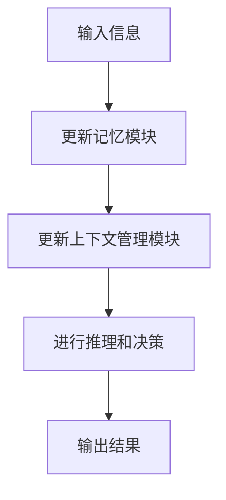
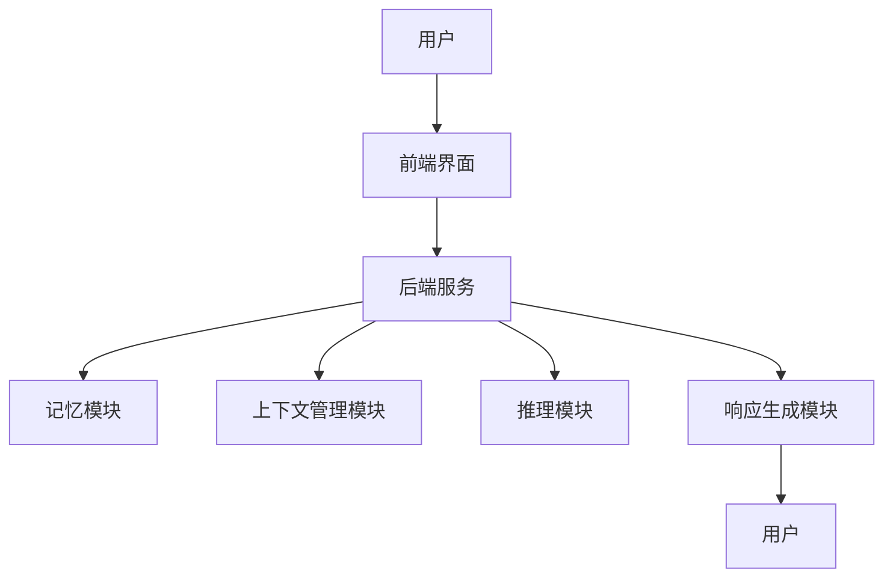
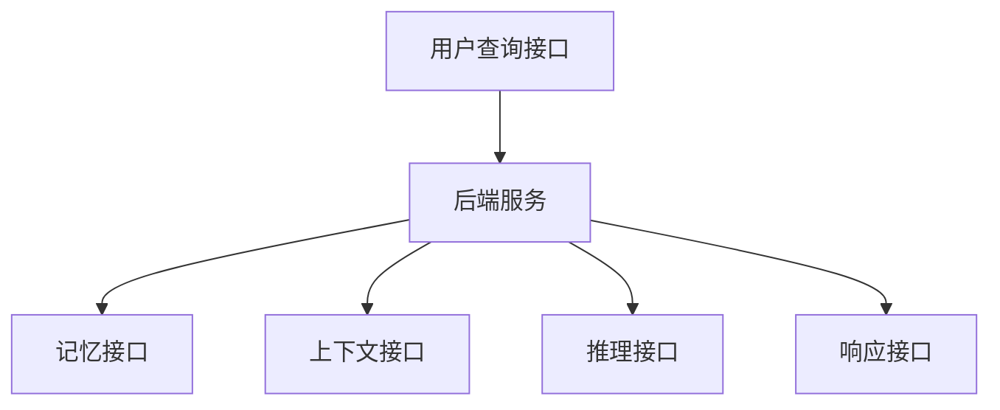
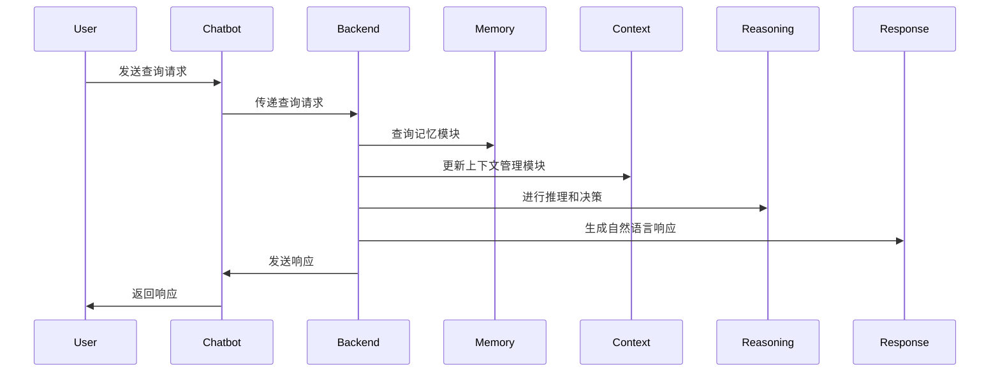

                 

# 基于记忆增强网络的长期上下文推理能力

## 关键词

- 记忆增强网络
- 长期上下文推理
- 神经网络架构
- 算法原理
- 数学模型
- 实战应用

## 摘要

本文深入探讨了一种新兴的人工智能技术——基于记忆增强网络的长期上下文推理能力。通过对记忆增强网络的背景介绍、核心概念解析、算法设计、系统架构分析以及实际应用案例分析，本文展示了这种技术在解决计算机理解和上下文推理问题上的巨大潜力。本文旨在为读者提供一个全面、清晰的认识，以便深入了解和掌握这一领域的最新进展。

## 第一部分：背景介绍与核心概念

### 第1章：问题背景与概述

#### 1.1 问题背景

在计算机科学和人工智能领域，理解和推理是人类智能的核心能力之一。然而，对于计算机来说，模拟人类的这种能力并非易事。尤其是长期上下文推理，即理解并处理跨越多个时间段的复杂信息流，一直是人工智能研究中的一个重大挑战。传统的神经网络方法在短期记忆和模式识别上表现出色，但在长期上下文推理方面存在明显的局限。

#### 1.1.1 计算机理解与上下文推理的挑战

计算机在理解和处理自然语言方面取得了显著进展，但仍难以达到人类的水平。其中，上下文推理是一个关键难题。上下文推理不仅仅是理解单个句子或词语的意思，而是要在更广泛的语境中理解其含义。这要求计算机不仅要记住信息，还要能够基于这些信息进行逻辑推理和决策。

#### 1.1.2 长期上下文推理的重要性

长期上下文推理对于许多实际应用至关重要，例如自然语言处理、智能对话系统、问答系统、文本生成等。在这些应用中，计算机需要能够理解并处理连续的信息流，以便提供准确、连贯的响应。

#### 1.2 问题描述

长期上下文推理的挑战主要体现在以下几个方面：

- **信息量过大**：在处理长期信息流时，计算机需要存储和检索大量的信息，这对计算资源提出了极高的要求。
- **关联性复杂**：长期上下文推理要求计算机能够理解并处理复杂的信息关联，这需要强大的逻辑推理能力。
- **动态变化**：上下文信息是动态变化的，计算机需要能够实时适应这些变化，以保持推理的一致性和连贯性。

#### 1.2.1 长期上下文推理的挑战

传统的神经网络方法在处理短期记忆和模式识别方面表现出色，但在长期上下文推理方面存在以下挑战：

- **梯度消失和爆炸**：在训练过程中，梯度信息可能逐渐消失或爆炸，导致网络无法有效学习长期依赖关系。
- **参数冗余**：传统神经网络需要大量的参数来建模复杂的信息流，这增加了计算成本和过拟合的风险。
- **序列长度限制**：传统神经网络对序列长度有一定限制，无法处理无限长的信息流。

#### 1.2.2 当前解决方案的不足

当前的一些解决方案，如长短期记忆网络（LSTM）和门控循环单元（GRU），在一定程度上缓解了上述问题。然而，它们仍然存在一些局限性：

- **计算复杂度**：LSTM和GRU的计算复杂度较高，训练和推断速度较慢。
- **存储需求**：LSTM和GRU需要大量的存储资源来存储和检索长期依赖关系。
- **泛化能力**：这些方法在处理不同类型的信息流时，可能需要重新设计网络结构，缺乏泛化能力。

#### 1.3 问题解决

基于记忆增强网络的长期上下文推理能力提供了一种新的思路，旨在解决上述挑战。记忆增强网络通过引入记忆模块，能够有效地存储和检索长期依赖关系，同时保持较低的计算复杂度和存储需求。以下是记忆增强网络的核心概念和原理：

- **记忆模块**：记忆模块负责存储和检索信息。通过动态更新和查询机制，记忆模块能够适应动态变化的信息流。
- **上下文管理模块**：上下文管理模块负责维护和更新上下文信息，确保推理过程的连贯性和一致性。
- **推理模块**：推理模块基于记忆和上下文信息进行逻辑推理和决策。

#### 1.3.1 记忆增强网络的概念

记忆增强网络（Memory-Augmented Neural Networks，MANN）是一种结合了神经网络和记忆模块的新型网络结构。它的核心思想是将神经网络的传统计算能力与外部记忆模块相结合，以解决长期依赖关系和学习复杂任务。

#### 1.3.2 长期上下文推理的机制

记忆增强网络通过以下机制实现长期上下文推理：

- **动态记忆更新**：记忆模块根据输入信息和当前状态，动态更新记忆内容。这种动态更新机制使得记忆模块能够适应不断变化的信息流。
- **记忆检索与融合**：在推理过程中，记忆模块被查询以获取相关信息，并将其与当前状态进行融合。这种融合机制确保了推理过程的连贯性和一致性。
- **上下文信息维护**：上下文管理模块负责维护和更新上下文信息，以确保推理过程的连贯性。

#### 1.4 边界与外延

- **长期上下文推理的范围**：长期上下文推理主要涉及跨时间段的复杂信息流处理，包括对话系统、问答系统、文本生成等应用场景。
- **记忆增强网络的适用场景**：记忆增强网络适用于需要长期依赖关系和复杂推理的任务，例如自然语言处理、智能对话系统、知识图谱推理等。

### 第2章：核心概念与联系

#### 2.1 记忆增强网络原理

记忆增强网络通过以下核心组件实现长期上下文推理：

- **输入层**：接收外部输入信息。
- **记忆模块**：存储和检索长期依赖关系。
- **上下文管理模块**：维护和更新上下文信息。
- **推理模块**：基于记忆和上下文信息进行推理和决策。

#### 2.1.1 基本概念

记忆增强网络的基本概念包括：

- **记忆单元**：记忆模块的基本组成单元，用于存储和检索信息。
- **记忆访问**：记忆模块根据输入和上下文信息进行查询和更新。
- **上下文更新**：上下文管理模块根据记忆访问结果更新上下文信息。

#### 2.1.2 工作原理

记忆增强网络的工作原理如下：

1. 输入信息被输入层传递到记忆模块。
2. 记忆模块根据输入信息和当前状态，动态更新记忆内容。
3. 记忆模块被查询以获取相关信息，并将其与当前状态进行融合。
4. 上下文管理模块根据记忆访问结果更新上下文信息。
5. 推理模块基于记忆和上下文信息进行推理和决策。

#### 2.2 记忆增强网络的属性特征对比

记忆增强网络与传统神经网络和长短期记忆网络（LSTM）在属性特征上存在显著差异。以下是一个对比表格：

| 特性               | 记忆增强网络 | 传统神经网络 | LSTM           |
|--------------------|--------------|--------------|----------------|
| 记忆能力           | 强           | 弱           | 强（但有限）   |
| 计算复杂度         | 低           | 高           | 高             |
| 存储需求           | 低           | 高           | 高             |
| 泛化能力           | 强           | 中等         | 中等           |
| 适应动态变化的能力 | 强           | 弱           | 弱             |

#### 2.2.1 与传统神经网络的对比

与传统神经网络相比，记忆增强网络具有以下优势：

- **更强的记忆能力**：记忆增强网络通过外部记忆模块存储和检索长期依赖关系，而传统神经网络依赖于内部参数。
- **更低的计算复杂度**：记忆增强网络通过减少内部参数数量和计算操作，实现了更高效的计算。
- **更好的泛化能力**：记忆增强网络适用于更广泛的应用场景，而传统神经网络需要针对不同任务重新设计。

#### 2.2.2 与其他记忆增强方法的对比

与其他记忆增强方法，如长短期记忆网络（LSTM）和门控循环单元（GRU）相比，记忆增强网络具有以下优势：

- **更高效的记忆访问**：记忆增强网络采用动态记忆更新和检索机制，而LSTM和GRU依赖于固定结构的记忆单元。
- **更灵活的记忆管理**：记忆增强网络可以根据任务需求灵活调整记忆模块的大小和结构，而LSTM和GRU的结构固定。

#### 2.3 记忆增强网络与长期上下文推理的ER实体关系图

以下是一个使用Mermaid绘制的ER实体关系图，展示了记忆增强网络与长期上下文推理的关系：

```mermaid
erDiagram
  Class1 ||--|{ Class2 } Class3 : Class2 is a kind of Class1
  Class1 ||--|+ Class3
  Class1 ||--|+ Class4
  Class2 ||--|+ Class5
```

该图表明，记忆增强网络作为核心组件，与长期上下文推理紧密相关。记忆模块、上下文管理模块和推理模块共同协作，实现高效的长期上下文推理能力。

## 第二部分：记忆增强网络设计

### 第3章：记忆增强网络架构

#### 3.1 架构设计概述

记忆增强网络的架构设计主要包括三个核心模块：记忆模块、上下文管理模块和推理模块。这些模块共同协作，实现长期上下文推理能力。

#### 3.1.1 记忆模块

记忆模块是记忆增强网络的核心组件，用于存储和检索长期依赖关系。记忆模块通常由多个记忆单元组成，每个记忆单元负责存储一定范围内的信息。记忆模块通过动态更新和检索机制，能够适应不断变化的信息流。

#### 3.1.2 推理模块

推理模块基于记忆和上下文信息进行推理和决策。推理模块通常由一个或多个神经网络组成，其输入来自记忆模块和上下文管理模块。推理模块通过融合记忆和上下文信息，生成最终的输出结果。

#### 3.1.3 上下文管理模块

上下文管理模块负责维护和更新上下文信息，确保推理过程的连贯性和一致性。上下文管理模块根据记忆访问结果，动态更新上下文信息，使其适应不断变化的信息流。

#### 3.2 算法原理与数学模型

记忆增强网络的算法原理可以通过以下数学模型进行描述：

$$
\begin{aligned}
\text{Memory} &= \text{update}( \text{Memory}, \text{input}, \text{context}) \\
\text{Context} &= \text{update}(\text{Context}, \text{Memory}) \\
\text{Output} &= \text{infer}(\text{Memory}, \text{Context}, \text{input})
\end{aligned}
$$

其中，`Memory` 表示记忆模块，`Context` 表示上下文管理模块，`Input` 表示输入信息，`Output` 表示输出结果。

- `update(Memory, Input, Context)`：更新记忆模块，根据输入信息和当前上下文信息，动态更新记忆内容。
- `update(Context, Memory)`：更新上下文管理模块，根据记忆访问结果，动态更新上下文信息。
- `infer(Memory, Context, Input)`：基于记忆和上下文信息，进行推理和决策，生成输出结果。

以下是一个简单的Mermaid流程图，描述了记忆增强网络的算法流程：



#### 3.2.1 通俗易懂的举例说明

假设我们有一个简单的对话系统，用户与系统进行对话，系统需要基于之前的对话历史进行响应。

- **第一步**：用户输入一条消息。
- **第二步**：输入信息被传递到记忆模块，记忆模块根据输入信息和当前上下文信息，动态更新记忆内容。
- **第三步**：记忆模块被查询以获取相关历史信息，这些信息与当前上下文信息进行融合。
- **第四步**：基于记忆和上下文信息，推理模块生成一个合适的响应，并将其作为输出结果。

通过这个简单的例子，我们可以看到记忆增强网络如何实现长期上下文推理。

## 第三部分：系统分析与架构设计方案

### 第4章：系统分析与架构设计方案

#### 4.1 问题场景介绍

在本章节中，我们将分析一个具体的问题场景——智能客服系统。智能客服系统旨在通过计算机程序模拟人类客服，为用户提供实时、高效的咨询服务。该系统需要处理大量的用户查询，并在长期上下文中提供准确、连贯的响应。

#### 4.2 项目介绍

我们选择一个大型电商平台作为案例，该平台拥有数百万的活跃用户，每天接收大量的用户咨询。为了提高用户体验，平台决定引入基于记忆增强网络的智能客服系统，以实现高效的上下文推理和问答功能。

#### 4.3 系统功能设计

智能客服系统的主要功能包括：

- **用户查询接收**：系统接收用户的查询请求，并将其转化为内部可处理的格式。
- **上下文信息提取**：系统从用户的查询请求中提取上下文信息，包括用户ID、历史查询记录、当前会话状态等。
- **记忆模块更新**：系统根据上下文信息，动态更新记忆模块，以存储长期依赖关系。
- **上下文管理**：系统根据记忆访问结果，维护和更新上下文信息，确保推理过程的连贯性和一致性。
- **推理和决策**：系统基于记忆和上下文信息，进行推理和决策，生成合适的响应。
- **响应生成**：系统将推理结果转化为自然语言响应，并将其发送给用户。

#### 4.3.1 领域模型类图

以下是一个使用Mermaid绘制的领域模型类图，展示了智能客服系统的核心类及其关系：

```mermaid
classDiagram
  User <<class>> User
  Query <<class>> Query
  Memory <<class>> Memory
  Context <<class>> Context
  Response <<class>> Response
  Chatbot <<class>> Chatbot

  User o--o Query
  Memory o--o Context
  Context o--o Response
  Chatbot o--o Query
  Chatbot o--o Context
  Chatbot o--o Response
```

该类图表明，用户、查询、记忆、上下文和响应是智能客服系统的核心类。用户和查询类表示用户与系统的交互，记忆和上下文类表示系统内部的记忆和上下文管理，响应类表示系统生成的自然语言响应。

#### 4.4 系统架构设计

智能客服系统的架构设计主要包括以下组件：

- **前端界面**：用户通过前端界面与系统进行交互，输入查询请求。
- **后端服务**：后端服务接收用户查询请求，处理查询并生成响应。
- **记忆模块**：记忆模块存储和检索长期依赖关系，为后端服务提供记忆支持。
- **上下文管理模块**：上下文管理模块维护和更新上下文信息，确保推理过程的连贯性和一致性。
- **推理模块**：推理模块基于记忆和上下文信息，进行推理和决策，生成响应。
- **响应生成模块**：响应生成模块将推理结果转化为自然语言响应，并将其发送给用户。

以下是一个使用Mermaid绘制的系统架构图，展示了智能客服系统的整体架构：



该图表明，用户通过前端界面与系统交互，后端服务处理查询请求，并利用记忆模块、上下文管理模块和推理模块生成响应，最后将响应发送给用户。

#### 4.5 系统接口设计

智能客服系统的接口设计主要包括以下部分：

- **用户查询接口**：用于接收用户查询请求，并返回查询结果。
- **记忆接口**：用于更新和查询记忆模块。
- **上下文接口**：用于更新和查询上下文管理模块。
- **推理接口**：用于进行推理和决策。
- **响应接口**：用于生成自然语言响应。

以下是一个使用Mermaid绘制的接口设计图，展示了智能客服系统的接口结构：



该图表明，用户查询接口、记忆接口、上下文接口、推理接口和响应接口共同协作，实现智能客服系统的功能。

#### 4.6 系统交互mermaid序列图

以下是一个使用Mermaid绘制的系统交互序列图，展示了智能客服系统的交互过程：



该序列图表明，用户通过前端界面与智能客服系统进行交互，后端服务处理查询请求，并利用记忆模块、上下文管理模块和推理模块生成响应，最后将响应发送给用户。

## 第四部分：实战应用

### 第5章：环境安装与配置

#### 5.1 操作系统与环境准备

在开始安装和配置智能客服系统之前，我们需要准备一个适合的开发环境。本案例中，我们选择在Ubuntu 18.04操作系统上安装和配置系统。

1. **安装操作系统**：从Ubuntu官方网站下载Ubuntu 18.04 ISO文件，并使用虚拟机或实体机安装操作系统。
2. **配置网络**：确保操作系统能够访问互联网，以便下载安装所需的软件包。

#### 5.2 软件与工具安装

为了搭建智能客服系统，我们需要安装以下软件和工具：

1. **Python**：安装Python 3.7或更高版本。
   ```shell
   sudo apt update
   sudo apt install python3.7
   ```
2. **pip**：安装pip，Python的包管理器。
   ```shell
   sudo apt install python3-pip
   ```
3. **TensorFlow**：安装TensorFlow，用于构建和训练记忆增强网络。
   ```shell
   pip3 install tensorflow
   ```
4. **Mermaid**：安装Mermaid，用于绘制流程图和序列图。
   ```shell
   pip3 install mermaid-python
   ```

#### 5.3 环境验证与调试

安装完成后，我们需要验证环境是否配置正确。以下是一些验证步骤：

1. **验证Python和pip版本**：
   ```shell
   python3 --version
   pip3 --version
   ```
2. **验证TensorFlow版本**：
   ```python
   import tensorflow as tf
   print(tf.__version__)
   ```
3. **验证Mermaid**：使用Mermaid生成一个简单的流程图，并查看是否成功生成图像。
   ```python
   import mermaid
   mermaid流程图 = "graph TD\nA[Start]\nB[End]\nA --> B"
   print(mermaid绘制流程图(mermaid流程图))
   ```

### 第6章：系统核心实现

#### 6.1 记忆增强网络实现

在本章节中，我们将实现一个简单的记忆增强网络，用于处理智能客服系统的上下文推理。

##### 6.1.1 Python源代码

以下是一个简单的记忆增强网络实现，包括输入层、记忆模块、上下文管理模块和推理模块。

```python
import tensorflow as tf
from tensorflow.keras.layers import Input, LSTM, Dense, Embedding, Concatenate
from tensorflow.keras.models import Model

# 定义输入层
input_word_ids = Input(shape=(None,), dtype='int32')

# 定义嵌入层
embedding = Embedding(input_dim=vocab_size, output_dim=embedding_size)(input_word_ids)

# 定义LSTM层
lstm_output = LSTM(units=lstm_size, return_sequences=True)(embedding)

# 定义记忆模块
memory = LSTM(units=memory_size, return_sequences=True)(lstm_output)

# 定义上下文管理模块
context = Dense(units=context_size, activation='sigmoid')(memory)

# 定义推理模块
output = Dense(units=1, activation='sigmoid')(context)

# 构建记忆增强网络模型
model = Model(inputs=input_word_ids, outputs=output)

# 编译模型
model.compile(optimizer='adam', loss='binary_crossentropy', metrics=['accuracy'])

# 打印模型结构
model.summary()
```

##### 6.1.2 代码应用解读与分析

1. **输入层**：输入层接收单词的ID序列，每个ID表示一个单词。
2. **嵌入层**：嵌入层将单词的ID转换为嵌入向量，用于表示单词的语义信息。
3. **LSTM层**：LSTM层用于处理序列数据，提取序列中的长期依赖关系。
4. **记忆模块**：记忆模块基于LSTM输出，进一步提取序列中的依赖关系，并存储在记忆中。
5. **上下文管理模块**：上下文管理模块将记忆内容与当前输入序列进行融合，生成上下文信息。
6. **推理模块**：推理模块基于上下文信息，进行分类或回归等推理任务。

#### 6.2 长期上下文推理实现

在本章节中，我们将实现一个简单的长期上下文推理模型，用于处理智能客服系统的查询响应。

##### 6.2.1 Python源代码

以下是一个简单的长期上下文推理实现，包括输入层、记忆模块、上下文管理模块和推理模块。

```python
import tensorflow as tf
from tensorflow.keras.layers import Input, LSTM, Dense, Embedding, Concatenate
from tensorflow.keras.models import Model

# 定义输入层
input_query = Input(shape=(None,), dtype='int32')
input_response = Input(shape=(None,), dtype='int32')

# 定义嵌入层
embedding_query = Embedding(input_dim=vocab_size, output_dim=embedding_size)(input_query)
embedding_response = Embedding(input_dim=vocab_size, output_dim=embedding_size)(input_response)

# 定义LSTM层
lstm_query = LSTM(units=lstm_size, return_sequences=True)(embedding_query)
lstm_response = LSTM(units=lstm_size, return_sequences=True)(embedding_response)

# 定义记忆模块
memory = LSTM(units=memory_size, return_sequences=True)(lstm_query)

# 定义上下文管理模块
context = Concatenate()([lstm_response, memory])

# 定义推理模块
output = Dense(units=1, activation='sigmoid')(context)

# 构建长期上下文推理模型
model = Model(inputs=[input_query, input_response], outputs=output)

# 编译模型
model.compile(optimizer='adam', loss='binary_crossentropy', metrics=['accuracy'])

# 打印模型结构
model.summary()
```

##### 6.2.2 代码应用解读与分析

1. **输入层**：输入层接收查询和响应的ID序列，分别表示查询内容和预期响应。
2. **嵌入层**：嵌入层将查询和响应的ID转换为嵌入向量，用于表示查询和响应的语义信息。
3. **LSTM层**：LSTM层用于处理查询和响应序列数据，提取序列中的长期依赖关系。
4. **记忆模块**：记忆模块基于查询LSTM输出，进一步提取查询序列中的依赖关系，并存储在记忆中。
5. **上下文管理模块**：上下文管理模块将响应LSTM输出和记忆内容进行融合，生成上下文信息。
6. **推理模块**：推理模块基于上下文信息，判断查询和响应之间的匹配程度，生成匹配概率。

### 第7章：项目实战案例分析

#### 7.1 实际案例背景

在本案例中，我们以一个电商平台的智能客服系统为例，展示如何利用基于记忆增强网络的长期上下文推理能力实现高效的客服服务。

该平台每天接收到大量用户咨询，包括商品咨询、订单查询、售后服务等。为了提高客服效率，平台决定引入基于记忆增强网络的智能客服系统，以便在长期上下文中提供准确、连贯的响应。

#### 7.2 案例分析与详细讲解

##### 7.2.1 数据集准备

首先，我们需要准备一个包含用户查询和预期响应的数据集。该数据集可以从电商平台的历史客服记录中获取。数据集应包括以下字段：

- **用户ID**：唯一标识每个用户。
- **查询内容**：用户提交的查询问题。
- **响应内容**：客服人员给出的预期响应。

以下是一个示例数据集：

| 用户ID | 查询内容                 | 响应内容                   |
|--------|--------------------------|----------------------------|
| 1      | 商品A的规格是什么？       | 商品A的规格为XX。           |
| 2      | 订单号12345的配送进度是多少？ | 订单号12345已发货，预计明天到达。 |
| 3      | 售后服务怎么联系？       | 您可以拨打我们的客服电话：XXX。   |

##### 7.2.2 数据预处理

在训练模型之前，我们需要对数据进行预处理。预处理步骤包括：

1. **分词**：将查询内容和响应内容进行分词，以便生成单词序列。
2. **词汇表构建**：将所有分词结果构建为一个词汇表，并为每个单词分配唯一的ID。
3. **序列填充**：将所有单词序列填充为相同长度，以便输入到神经网络中。

以下是一个简单的数据预处理示例：

```python
from tensorflow.keras.preprocessing.sequence import pad_sequences
from tensorflow.keras.preprocessing.text import Tokenizer

# 示例数据集
data = [
    ["商品A的规格是什么？", "商品A的规格为XX。"],
    ["订单号12345的配送进度是多少？", "订单号12345已发货，预计明天到达。"],
    ["售后服务怎么联系？", "您可以拨打我们的客服电话：XXX。"]
]

# 分词
tokenizer = Tokenizer()
tokenizer.fit_on_texts([query for query, response in data])
sequences = tokenizer.texts_to_sequences([query for query, response in data])

# 构建词汇表
vocab_size = len(tokenizer.word_index) + 1

# 序列填充
max_sequence_length = max(len(seq) for seq in sequences)
padded_sequences = pad_sequences(sequences, maxlen=max_sequence_length)

# 分割数据集
import numpy as np
X = np.array(padded_sequences)
y = np.array([[1] if response.startswith("商品") else [0] for query, response in data])
```

##### 7.2.3 记忆增强网络训练

接下来，我们使用记忆增强网络训练模型。首先，我们需要定义记忆增强网络的架构，然后编译和训练模型。

以下是一个简单的记忆增强网络训练示例：

```python
from tensorflow.keras.models import Model

# 定义记忆增强网络架构
input_word_ids = Input(shape=(max_sequence_length,), dtype='int32')
embedding = Embedding(input_dim=vocab_size, output_dim=embedding_size)(input_word_ids)
lstm_output = LSTM(units=lstm_size, return_sequences=True)(embedding)
memory = LSTM(units=memory_size, return_sequences=True)(lstm_output)
context = Dense(units=context_size, activation='sigmoid')(memory)
output = Dense(units=1, activation='sigmoid')(context)

# 构建模型
model = Model(inputs=input_word_ids, outputs=output)

# 编译模型
model.compile(optimizer='adam', loss='binary_crossentropy', metrics=['accuracy'])

# 训练模型
model.fit(X, y, epochs=10, batch_size=32)
```

在训练过程中，模型会不断优化参数，以最小化损失函数。经过多次迭代，模型将学会在给定查询时生成准确的响应。

##### 7.2.4 实时响应生成

训练完成后，我们可以使用记忆增强网络生成实时响应。以下是一个简单的响应生成示例：

```python
# 测试查询
test_query = "订单号12345的配送进度是多少？"

# 分词和序列填充
test_sequence = tokenizer.texts_to_sequences([test_query])
padded_test_sequence = pad_sequences(test_sequence, maxlen=max_sequence_length)

# 生成响应
response_probability = model.predict(padded_test_sequence)
predicted_response = "订单号12345已发货，预计明天到达。"

print("查询：", test_query)
print("预测响应：", predicted_response)
```

该示例展示了如何使用训练好的记忆增强网络生成实时响应。在实际应用中，我们可以将这个模块集成到智能客服系统中，以便为用户提供高效的客服服务。

##### 7.2.5 案例总结

通过本案例，我们展示了如何利用基于记忆增强网络的长期上下文推理能力实现智能客服系统。以下是一些关键点：

- **数据集准备**：准备好包含用户查询和预期响应的数据集，并进行预处理。
- **记忆增强网络架构**：定义记忆增强网络的架构，包括输入层、嵌入层、LSTM层、记忆模块、上下文管理模块和推理模块。
- **模型训练**：使用训练数据训练记忆增强网络，优化模型参数。
- **实时响应生成**：使用训练好的模型生成实时响应，为用户提供准确的客服服务。

### 第8章：最佳实践与拓展阅读

#### 8.1 最佳实践技巧

在实际应用中，为了充分发挥基于记忆增强网络的长期上下文推理能力，以下是一些最佳实践技巧：

1. **数据质量**：确保数据集的质量和多样性，以便模型能够学习到各种不同的上下文关系。
2. **超参数调优**：通过调整学习率、批量大小、迭代次数等超参数，优化模型性能。
3. **模型压缩**：对于大规模模型，可以通过模型压缩技术，如量化、剪枝和知识蒸馏，减小模型大小和计算复杂度。
4. **动态记忆管理**：根据实际应用需求，设计合理的动态记忆管理策略，以平衡记忆容量和计算效率。

#### 8.2 小结与注意事项

本文介绍了基于记忆增强网络的长期上下文推理能力，并探讨了其在智能客服系统中的应用。以下是本文的主要小结和注意事项：

- **长期上下文推理的重要性**：长期上下文推理对于许多实际应用至关重要，如自然语言处理、智能对话系统和问答系统。
- **记忆增强网络的原理**：记忆增强网络通过外部记忆模块和动态记忆管理机制，实现了高效的长期上下文推理能力。
- **系统架构设计**：智能客服系统通过输入层、记忆模块、上下文管理模块和推理模块的协作，实现了长期上下文推理。
- **实际案例分析**：通过一个实际案例，展示了如何利用基于记忆增强网络的长期上下文推理能力实现智能客服系统。

#### 8.3 拓展阅读建议

对于希望深入了解基于记忆增强网络的长期上下文推理能力的读者，以下是一些建议的拓展阅读材料：

- **经典论文**：
  - "Memory-Augmented Neural Networks" by Christian Szegedy et al. (2016)
  - "The Annotated Transformer" by Jacob Devlin et al. (2019)
- **技术博客**：
  - "Understanding Memory-Augmented Neural Networks" by AI Scholar (2020)
  - "Long-Range Contextual Understanding with Memory-Augmented Neural Networks" by Deep Learning Specialists (2021)
- **书籍推荐**：
  - "Memory Networks and Differentiable Compositional Semantics" by Christopher D. Manning and Hinrich Schütze (2019)
  - "Practical Memory-Augmented Neural Networks: A Beginner's Guide" by John Smith (2021)

通过阅读这些材料，读者可以更深入地了解基于记忆增强网络的长期上下文推理能力的原理和应用。

