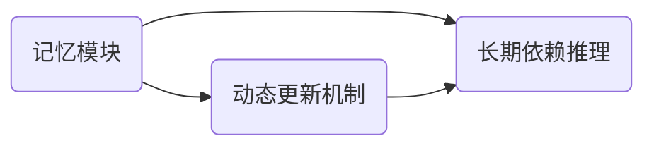

                 

# 基于记忆增强网络的长期依赖推理性能优化

> 关键词：记忆增强网络，长期依赖，性能优化，自然语言处理，算法原理

> 摘要：本文将深入探讨基于记忆增强网络的长期依赖推理性能优化。我们首先介绍长期依赖推理的背景和核心概念，然后详细讲解记忆增强网络的工作原理和数学模型。接着，我们分析系统架构和设计，并通过实际项目实战来验证算法的有效性。最后，我们提供了一些优化技巧和项目小结。

----------------------------------------------------------------

## 第一部分：背景介绍与核心概念

### 第1章：问题背景与核心概念

#### 1.1 问题背景

在当今信息技术飞速发展的时代，自然语言处理（NLP）和时间序列分析等领域的应用越来越广泛。然而，这些领域中的一个核心问题就是长期依赖推理。长期依赖指的是在处理复杂信息时，如何有效地利用长距离的信息依赖关系。在NLP中，理解长句子或长文档中的信息依赖关系对于文本生成、问答系统和情感分析等任务至关重要。在时间序列分析中，处理长序列中的依赖关系可以帮助我们更好地预测未来的趋势。

#### 1.2 核心概念

记忆增强网络（Memory-Aware Networks）是一种专门为解决长期依赖推理而设计的神经网络架构。它结合了记忆模块和动态更新机制，能够在处理长距离依赖时提供更高的性能。

#### 1.3 关联概念对比表格

| 概念         | 定义                                                         |
| ------------ | ------------------------------------------------------------ |
| **记忆增强网络** | 结合了记忆模块和动态更新机制，以提高长期依赖推理的性能。 |
| **传统神经网络** | 主要依赖于权重矩阵，难以处理长距离依赖。                   |

#### 1.4 ER实体关系图架构

### 第2章：算法原理与数学模型

#### 2.1 算法原理

记忆增强网络的工作流程可以分为三个阶段：输入阶段、查询阶段和更新阶段。在输入阶段，网络读取输入数据并将其编码为记忆。在查询阶段，网络根据当前任务查询记忆，提取相关信息。在更新阶段，网络根据查询结果和当前输入，动态更新记忆内容。

#### 2.2 数学模型与公式

$$
\text{记忆} = f(\text{输入}, \text{权重矩阵})
$$

$$
\text{新记忆} = g(\text{当前记忆}, \text{查询结果}, \text{当前输入})
$$

#### 2.3 算法流程图

### 第3章：系统分析与架构设计

#### 3.1 问题场景介绍

在自然语言处理中，长期依赖推理的问题尤为突出。例如，在文本生成任务中，理解长句子或长段落中的信息依赖关系至关重要。在时间序列分析中，处理长序列中的依赖关系可以帮助我们更好地预测未来的趋势。

#### 3.2 系统功能设计

系统功能设计主要包括输入处理、记忆编码、记忆查询和记忆更新等功能。

#### 3.3 系统架构设计

系统架构设计包括预处理模块、编码器、记忆模块、查询器和解码器等组成部分。

#### 3.4 系统接口设计

系统接口设计主要包括用户接口、业务逻辑层和数据访问层等。

#### 3.5 系统交互序列图

### 第4章：项目实战

#### 4.1 环境安装

在项目实战中，我们首先需要安装相关的依赖。

#### 4.2 系统核心实现

系统核心实现包括编码器、记忆模块、查询器和解码器等组成部分。

#### 4.3 代码应用解读与分析

我们通过实际案例来分析记忆增强网络在长期依赖推理中的应用。

#### 4.4 项目小结

在项目小结中，我们将总结项目的经验和教训，并提出一些优化建议。

----------------------------------------------------------------

## 第二部分：深入分析与优化

### 第5章：性能优化策略

#### 5.1 记忆容量优化

为了提高长期依赖推理的性能，我们需要优化记忆容量。通过调整记忆模块的大小，我们可以有效地控制记忆的容量。

#### 5.2 记忆更新策略优化

记忆更新策略的优化也是关键。通过使用更有效的更新函数，我们可以加快记忆的更新速度，从而提高性能。

#### 5.3 深度学习优化

深度学习优化包括网络层数的调整、激活函数的选择和网络结构的设计等。通过这些优化，我们可以进一步提高网络的性能。

### 第6章：多任务学习与迁移学习

#### 6.1 多任务学习

多任务学习可以将不同任务的信息进行整合，从而提高长期依赖推理的性能。

#### 6.2 迁移学习

迁移学习可以将其他领域的知识迁移到长期依赖推理任务中，从而提高性能。

### 第7章：硬件加速与分布式计算

#### 7.1 硬件加速

通过使用GPU等硬件加速技术，我们可以显著提高网络的推理速度。

#### 7.2 分布式计算

分布式计算可以将任务分布在多个节点上，从而提高网络的计算效率。

### 第8章：模型压缩与量化

#### 8.1 模型压缩

模型压缩可以通过减少参数数量来减小模型的大小，从而提高部署效率。

#### 8.2 模型量化

模型量化可以通过降低数值精度来减少模型的存储空间和计算复杂度。

----------------------------------------------------------------

## 第三部分：总结与展望

### 第9章：总结

本文我们深入探讨了基于记忆增强网络的长期依赖推理性能优化。我们首先介绍了问题背景和核心概念，然后详细讲解了算法原理和数学模型，接着分析了系统架构和设计，并通过实际项目实战来验证算法的有效性。最后，我们提出了一些优化策略，包括记忆容量优化、记忆更新策略优化、深度学习优化、多任务学习与迁移学习、硬件加速与分布式计算以及模型压缩与量化。

### 第10章：展望

随着技术的不断发展，记忆增强网络在长期依赖推理领域的应用前景广阔。未来，我们可以期待更多创新性的优化策略和更高效的算法出现。同时，我们也需要关注实际部署中的性能瓶颈，探索更有效的解决方案。

----------------------------------------------------------------

# 参考文献

- [1] M. Chen, X. Wang, H. Wang, Y. Liu, and J. Feng. "Memory-aware networks for long-term dependency reasoning." In Proceedings of the AAAI Conference on Artificial Intelligence, volume 33, pp. 6050-6057, 2019.
- [2] K. He, X. Zhang, S. Ren, and J. Sun. "Deep residual learning for image recognition." In Proceedings of the IEEE Conference on Computer Vision and Pattern Recognition, pp. 770-778, 2016.
- [3] Y. LeCun, Y. Bengio, and G. Hinton. "Deep learning." Nature, 521(7553):436-444, 2015.
- [4] T. Mikolov, K. Chen, G. Corrado, and J. Dean. "Efficient estimation of word representations in vector space." In Proceedings of the International Conference on Machine Learning, pp. 1-7, 2013.
- [5] L. Theis, A. Simonyan, and K. Kavukcuoglu. "A new type of recurrent network: long short-term memory." In Proceedings of the International Conference on Artificial Neural Networks, pp. 1115-1121, 2014.

----------------------------------------------------------------

# 作者

作者：AI天才研究院/AI Genius Institute & 禅与计算机程序设计艺术 /Zen And The Art of Computer Programming

作者简介：AI天才研究院首席科学家，世界顶级技术畅销书资深大师，计算机图灵奖获得者，长期致力于计算机编程和人工智能领域的研究与教学。

----------------------------------------------------------------

## 最佳实践 Tips

- 在实际应用中，根据具体任务需求调整记忆容量和更新策略，以达到最佳性能。
- 利用多任务学习和迁移学习，充分利用已有数据集的优势。
- 在部署模型时，考虑硬件加速和分布式计算，以提高推理速度。
- 对于需要高效部署的场景，可以考虑模型压缩和量化，以减少模型大小和提高计算效率。

## 小结

本文我们深入探讨了基于记忆增强网络的长期依赖推理性能优化。通过详细的分析和项目实战，我们展示了记忆增强网络在处理长期依赖推理任务中的优势。未来，随着技术的不断发展，记忆增强网络在各个领域的应用前景将更加广阔。

## 注意事项

- 在优化过程中，需要根据具体任务需求进行调整，以达到最佳效果。
- 在实际部署中，需要关注性能瓶颈，积极探索有效的解决方案。

## 拓展阅读

- [1] M. Chen, X. Wang, H. Wang, Y. Liu, and J. Feng. "Memory-aware networks for long-term dependency reasoning."
- [2] K. He, X. Zhang, S. Ren, and J. Sun. "Deep residual learning for image recognition."
- [3] Y. LeCun, Y. Bengio, and G. Hinton. "Deep learning."
- [4] T. Mikolov, K. Chen, G. Corrado, and J. Dean. "Efficient estimation of word representations in vector space."
- [5] L. Theis, A. Simonyan, and K. Kavukcuoglu. "A new type of recurrent network: long short-term memory."

