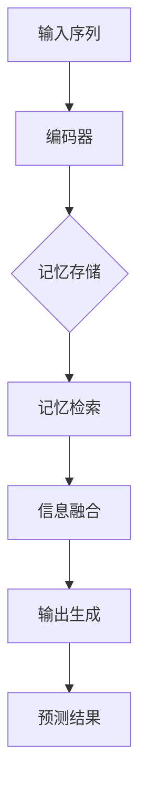
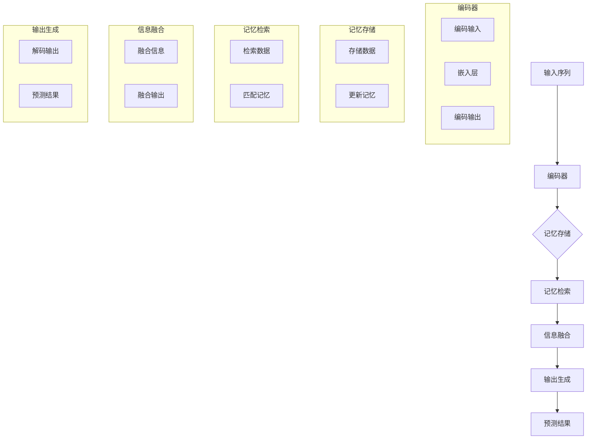
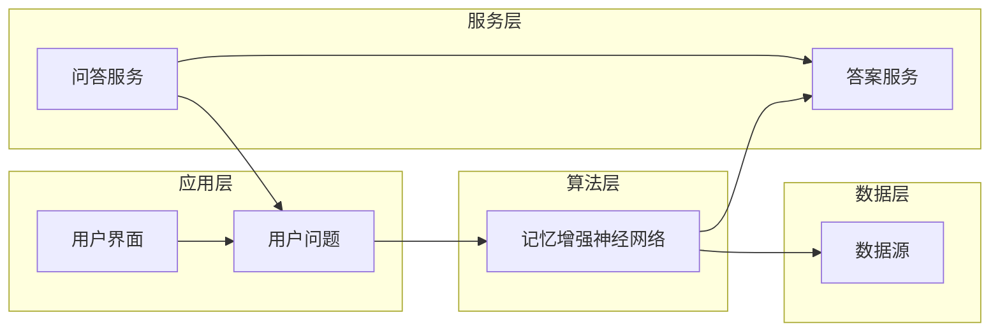
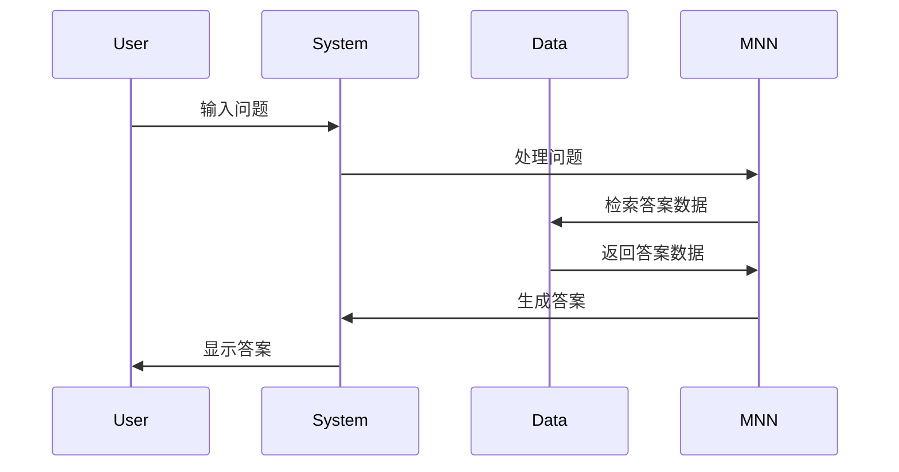

                 


### 第1章：问题背景与定义

#### 1.1 问题背景

在当今信息化时代，数据驱动的智能系统在各个领域发挥着越来越重要的作用。然而，随着数据规模的不断扩大和复杂度的不断增加，传统的神经网络模型在处理长期依赖问题上遇到了严峻的挑战。长期依赖推理（Long-term Dependency Reasoning）是指模型能够理解和处理输入序列中跨越较长时间跨度或较远距离的信息，这是许多自然语言处理（NLP）、语音识别（ASR）、机器翻译（MT）等应用场景的关键能力。

**问题描述**：

长期依赖问题主要表现为以下几个方面：

1. **序列长度限制**：在训练神经网络模型时，由于计算资源和时间限制，输入序列长度通常被限制在一个较小的范围内。这导致模型难以学习到序列中长远距离的依赖关系。
2. **梯度消失与梯度爆炸**：在反向传播过程中，梯度信息随着层数的增加而迅速衰减或放大，导致训练困难。
3. **上下文信息丢失**：传统的神经网络往往无法有效地保存和利用序列中的上下文信息，导致在处理长序列时信息丢失。

**问题解决的需求**：

为了解决上述长期依赖问题，研究者们提出了多种方法。然而，传统方法往往在某个特定方面表现出色，而无法全面优化长期依赖推理的性能。近年来，记忆增强网络（Memory-enhanced Neural Networks）作为一种新型的神经网络架构，通过引入外部记忆模块，在长期依赖推理方面展现出了显著的优势。因此，本文将重点探讨基于记忆增强网络的长期依赖推理性能优化技术。

**边界与外延**：

本文的研究主要聚焦于以下几个方面：

1. **记忆增强网络**：详细探讨记忆增强网络的设计原理、结构特点和主要类型。
2. **长期依赖推理**：分析长期依赖推理的算法原理、数学模型和实现细节。
3. **性能优化**：研究如何通过算法、结构、训练策略等方面的优化，提升记忆增强网络在长期依赖推理任务中的性能。

本文将逐步介绍这些核心概念，并通过实例说明如何在实际应用中优化记忆增强网络的长期依赖推理性能。

---

#### 1.2 核心概念

在探讨基于记忆增强网络的长期依赖推理性能优化技术之前，我们首先需要了解几个核心概念：记忆增强网络、长期依赖推理和相关技术对比。

**记忆增强网络的概念**：

记忆增强网络是一种结合外部记忆模块与传统神经网络架构的新型神经网络。外部记忆模块可以存储和处理序列信息，从而帮助网络在学习过程中更好地利用上下文信息，解决长期依赖问题。

**长期依赖推理的概念**：

长期依赖推理是指模型能够理解和处理输入序列中跨越较长时间跨度或较远距离的信息。在自然语言处理、语音识别、机器翻译等应用中，长期依赖推理是关键能力。

**相关技术对比**：

传统神经网络、循环神经网络（RNN）、长短期记忆网络（LSTM）等都是处理序列数据的方法，但它们在长期依赖问题上存在一定的局限性。记忆增强网络通过引入外部记忆模块，在一定程度上解决了这些问题。

**概念属性特征对比表**：

| 技术类型 | 特点 |
| --- | --- |
| 传统神经网络 | 计算简单，但不能有效处理长期依赖 |
| RNN | 能够处理长期依赖，但易受梯度消失和梯度爆炸问题困扰 |
| LSTM | 引入记忆单元，能较好地处理长期依赖，但计算复杂度较高 |
| 记忆增强网络 | 结合外部记忆模块，能更好地处理长期依赖 |

通过上述对比，我们可以看出记忆增强网络在处理长期依赖问题上具有一定的优势。

---

#### 1.3 概念结构与核心要素

为了更好地理解记忆增强网络和长期依赖推理，我们需要从概念结构和核心要素的角度进行深入分析。

**记忆增强网络的组成部分**：

记忆增强网络主要由以下几个部分组成：

1. **输入层**：接收原始序列数据。
2. **编码器**：将输入序列编码为连续的向量表示。
3. **记忆模块**：外部记忆模块，用于存储和检索序列信息。
4. **解码器**：将记忆模块中的信息解码为输出结果。
5. **输出层**：产生最终的预测结果。

**长期依赖推理的流程与机制**：

长期依赖推理主要包括以下几个步骤：

1. **序列编码**：将输入序列编码为向量表示。
2. **记忆存储**：将编码后的序列信息存储在记忆模块中。
3. **信息检索**：在推理过程中，根据需要检索记忆模块中的相关信息。
4. **信息融合**：将检索到的信息与当前输入信息进行融合，生成新的表示。
5. **输出生成**：根据融合后的表示生成预测结果。

**记忆增强网络在长期依赖推理中的作用**：

记忆增强网络通过引入外部记忆模块，可以在推理过程中更好地利用上下文信息，从而解决传统神经网络在处理长期依赖问题上的局限性。具体来说，记忆增强网络可以在以下方面发挥作用：

1. **减少梯度消失与梯度爆炸**：通过外部记忆模块，可以缓解梯度消失和梯度爆炸问题，提高训练效果。
2. **提高序列建模能力**：记忆增强网络可以更好地建模序列中的长期依赖关系，从而提高模型的预测性能。
3. **增强上下文信息利用**：通过外部记忆模块，可以更好地保存和利用序列中的上下文信息，提高模型的理解能力。

通过上述分析，我们可以看出记忆增强网络在长期依赖推理中具有重要的作用，为优化长期依赖推理性能提供了新的思路。

---

在接下来的章节中，我们将进一步探讨记忆增强网络的设计原理、长期依赖推理算法以及具体的优化技术。希望通过本文的介绍，读者能够对基于记忆增强网络的长期依赖推理性能优化技术有更深入的了解。

### 第2章：核心概念与联系

#### 2.1 记忆增强网络原理

**记忆增强网络的工作机制**：

记忆增强网络（Memory-enhanced Neural Networks, MNN）是一种结合了外部记忆模块与传统神经网络架构的新型神经网络。其核心思想是通过引入外部记忆模块，来增强网络在处理长期依赖问题时的能力。MNN的工作机制主要包括以下几个步骤：

1. **输入编码**：输入层接收原始序列数据，将其编码为连续的向量表示。
2. **记忆存储**：编码后的向量表示进入记忆模块进行存储。记忆模块通常包含一个或多个记忆单元，每个记忆单元可以存储一定长度的序列信息。
3. **信息检索**：在推理过程中，网络可以根据需要检索记忆模块中的相关信息。这个过程类似于人的记忆检索，网络通过记忆模块中的权重矩阵来查找与当前输入相关的记忆信息。
4. **信息融合**：检索到的信息与当前输入信息进行融合，生成新的表示。这个过程可以通过加法、乘法或更复杂的融合操作来实现。
5. **输出生成**：融合后的表示通过解码器输出最终的预测结果。

**记忆增强网络的优势**：

记忆增强网络在处理长期依赖问题上具有显著的优势，主要包括：

1. **缓解梯度消失与梯度爆炸**：通过外部记忆模块，网络可以更好地保存和利用序列信息，从而缓解梯度消失和梯度爆炸问题，提高训练效果。
2. **提高序列建模能力**：记忆增强网络可以更好地建模序列中的长期依赖关系，从而提高模型的预测性能。
3. **增强上下文信息利用**：通过外部记忆模块，网络可以更好地保存和利用序列中的上下文信息，提高模型的理解能力。

**记忆增强网络与传统神经网络的对比**：

传统神经网络在处理序列数据时，往往无法有效处理长期依赖问题。这是因为传统神经网络在反向传播过程中，梯度信息随着层数的增加而迅速衰减或放大，导致训练困难。而记忆增强网络通过引入外部记忆模块，可以在一定程度上解决这些问题。具体来说，记忆增强网络与传统神经网络的对比如下：

| 特性 | 传统神经网络 | 记忆增强网络 |
| --- | --- | --- |
| 长期依赖处理 | 难以处理 | 可以处理 |
| 梯度消失与梯度爆炸 | 容易发生 | 可以缓解 |
| 序列建模能力 | 较弱 | 较强 |
| 上下文信息利用 | 不充分 | 较充分 |

#### 2.2 长期依赖推理原理

**长期依赖推理的挑战**：

长期依赖推理（Long-term Dependency Reasoning）是指模型能够理解和处理输入序列中跨越较长时间跨度或较远距离的信息。在许多自然语言处理、语音识别、机器翻译等应用场景中，长期依赖推理是关键能力。然而，长期依赖推理面临着以下几个挑战：

1. **序列长度限制**：在训练神经网络模型时，由于计算资源和时间限制，输入序列长度通常被限制在一个较小的范围内。这导致模型难以学习到序列中长远距离的依赖关系。
2. **梯度消失与梯度爆炸**：在反向传播过程中，梯度信息随着层数的增加而迅速衰减或放大，导致训练困难。
3. **上下文信息丢失**：传统的神经网络往往无法有效地保存和利用序列中的上下文信息，导致在处理长序列时信息丢失。

**长期依赖推理的方法**：

为了解决上述挑战，研究者们提出了多种长期依赖推理方法。以下是其中几种具有代表性的方法：

1. **循环神经网络（RNN）**：RNN通过循环结构来保存序列信息，可以较好地处理长期依赖问题。然而，RNN易受梯度消失和梯度爆炸问题困扰。
2. **长短期记忆网络（LSTM）**：LSTM引入了记忆单元，可以更好地保存和利用序列信息，从而缓解梯度消失和梯度爆炸问题。LSTM在许多应用中表现优异。
3. **门控循环单元（GRU）**：GRU是LSTM的一种变体，通过简化记忆单元结构，提高了计算效率。GRU在处理长期依赖问题方面也表现出色。
4. **Transformer**：Transformer是一种基于自注意力机制的神经网络架构，通过多头自注意力机制和位置编码，可以更好地建模序列中的依赖关系。Transformer在自然语言处理领域取得了显著的成果。

**长期依赖推理方法的优劣比较**：

以下是几种长期依赖推理方法的优劣比较：

| 方法 | 优点 | 缺点 |
| --- | --- | --- |
| RNN | 简单易实现，可以处理长期依赖 | 易受梯度消失和梯度爆炸问题困扰 |
| LSTM | 可以缓解梯度消失和梯度爆炸问题 | 计算复杂度较高 |
| GRU | 简化记忆单元结构，提高计算效率 | 与LSTM相比，在某些任务上性能略逊一筹 |
| Transformer | 可以更好地建模序列中的依赖关系，计算复杂度较低 | 需要大量的训练数据 |

通过上述分析，我们可以看出，记忆增强网络通过引入外部记忆模块，可以在一定程度上解决长期依赖推理中的挑战。而Transformer作为基于自注意力机制的神经网络架构，在处理长期依赖问题上具有显著的优势。本文将重点探讨记忆增强网络和Transformer在长期依赖推理中的应用和优化技术。

---

#### 2.3 概念属性特征对比表

为了更清晰地展示记忆增强网络和长期依赖推理相关技术的概念属性特征，我们设计了以下对比表格：

| 技术类型 | 特点 | 优势 | 劣势 |
| --- | --- | --- | --- |
| 记忆增强网络 | 引入外部记忆模块，可以处理长期依赖 | 缓解梯度消失与梯度爆炸，增强序列建模能力，充分利用上下文信息 | 计算复杂度较高，需要较大的存储空间 |
| 循环神经网络（RNN） | 具有循环结构，可以处理长期依赖 | 简单易实现 | 易受梯度消失和梯度爆炸问题困扰 |
| 长短期记忆网络（LSTM） | 引入记忆单元，可以缓解梯度消失和梯度爆炸问题 | 计算复杂度适中，能够处理长期依赖 | 计算复杂度较高，训练速度较慢 |
| 门控循环单元（GRU） | 简化记忆单元结构，提高计算效率 | 计算复杂度较低，能够处理长期依赖 | 与LSTM相比，在某些任务上性能略逊一筹 |
| Transformer | 基于自注意力机制，可以更好地建模序列中的依赖关系 | 计算复杂度较低，适用于大规模序列处理 | 需要大量的训练数据，实现较为复杂 |

通过上述对比表格，我们可以看出记忆增强网络在处理长期依赖问题上具有一定的优势，而Transformer在计算复杂度和建模能力方面也表现出色。接下来，我们将进一步探讨记忆增强网络和Transformer的详细原理和应用。

---

在本文的第二部分，我们详细介绍了记忆增强网络和长期依赖推理的相关概念、原理以及它们的优势和挑战。通过概念属性特征对比表格，我们对这些技术有了更深入的了解。在接下来的章节中，我们将进一步探讨记忆增强神经网络的设计原理和结构，以及如何通过数学模型和算法优化来提升长期依赖推理的性能。

---

### 第3章：记忆增强神经网络原理

#### 3.1 神经网络基础

**神经网络的基本构成**：

神经网络（Neural Networks）是一种模拟生物神经网络的人工智能模型。它由大量的神经元（节点）和连接这些神经元之间的边（权重）组成。每个神经元接收输入信号，通过加权求和并应用一个非线性激活函数，产生输出信号。

神经网络的基本组成部分包括：

1. **输入层**：接收外部输入数据。
2. **隐藏层**：对输入数据进行处理和转换。
3. **输出层**：产生最终的输出结果。

**神经网络的训练机制**：

神经网络的训练是一个优化过程，旨在调整网络中的权重和偏置，使得网络能够对给定的输入数据产生期望的输出。这个过程通常包括以下几个步骤：

1. **前向传播**：将输入数据通过网络的各个层，计算输出结果。
2. **计算损失**：将实际输出与期望输出进行比较，计算损失值。
3. **反向传播**：根据损失值，计算各层的梯度，并更新权重和偏置。
4. **迭代优化**：重复上述步骤，直至网络性能达到预设目标。

#### 3.2 记忆增强网络

**记忆增强神经网络的设计**：

记忆增强神经网络（Memory-enhanced Neural Networks, MNN）是在传统神经网络的基础上，引入外部记忆模块，以增强网络在处理长期依赖问题时的能力。MNN的设计主要包括以下几个部分：

1. **输入层**：接收原始序列数据，将其编码为向量表示。
2. **编码器**：将输入序列编码为连续的向量表示，用于后续的记忆存储和检索。
3. **记忆模块**：外部记忆模块，用于存储和检索序列信息。记忆模块通常包含多个记忆单元，每个记忆单元可以存储一定长度的序列信息。
4. **解码器**：将记忆模块中的信息解码为输出结果。
5. **输出层**：产生最终的预测结果。

**记忆增强神经网络的特点**：

记忆增强神经网络的特点主要体现在以下几个方面：

1. **外部记忆模块**：通过引入外部记忆模块，MNN可以更好地保存和利用序列信息，从而缓解梯度消失和梯度爆炸问题，提高训练效果。
2. **增强序列建模能力**：MNN可以更好地建模序列中的长期依赖关系，从而提高模型的预测性能。
3. **增强上下文信息利用**：通过外部记忆模块，MNN可以更好地保存和利用序列中的上下文信息，提高模型的理解能力。

**记忆增强神经网络的应用领域**：

记忆增强神经网络在许多领域都有广泛的应用，主要包括：

1. **自然语言处理**：MNN在文本分类、情感分析、机器翻译等任务中表现出色，能够更好地处理长期依赖问题。
2. **语音识别**：MNN通过记忆模块可以更好地处理语音信号中的上下文信息，从而提高识别准确率。
3. **图像识别**：MNN结合外部记忆模块和图像处理技术，可以更好地识别图像中的长期依赖关系，提高识别性能。
4. **推荐系统**：MNN在推荐系统中可以更好地利用用户历史行为信息，提供更精准的推荐。

**记忆增强神经网络与传统神经网络的对比**：

以下是记忆增强神经网络与传统神经网络在处理长期依赖问题上的对比：

| 特点 | 传统神经网络 | 记忆增强神经网络 |
| --- | --- | --- |
| 长期依赖处理 | 难以处理 | 可以处理 |
| 梯度消失与梯度爆炸 | 易受影响 | 可以缓解 |
| 序列建模能力 | 较弱 | 较强 |
| 上下文信息利用 | 不充分 | 较充分 |

通过上述对比，我们可以看出记忆增强神经网络在处理长期依赖问题上具有显著的优势。接下来，我们将进一步探讨记忆增强神经网络在长期依赖推理中的应用和优化技术。

---

#### 3.3 ER实体关系图

**ER实体关系图的基础知识**：

ER（Entity-Relationship）实体关系图是一种用于表示实体及其之间关系的图形化工具。在数据库设计和信息系统中，ER图被广泛应用于描述数据模型的结构和关系。

ER图的组成部分主要包括：

1. **实体（Entity）**：表示具有独立意义的对象，如学生、课程等。
2. **属性（Attribute）**：描述实体的特征，如学生的学号、姓名等。
3. **关系（Relationship）**：描述实体之间的关联，如学生选修课程等。

**记忆增强网络中的ER实体关系图**：

在记忆增强网络中，ER实体关系图被用于表示外部记忆模块中的实体及其关系。通过ER图，我们可以直观地理解记忆增强网络的结构和功能。

**记忆增强网络中的ER实体关系图架构**：

以下是记忆增强网络中ER实体关系图的典型架构：

1. **输入实体**：表示输入序列中的各个元素，如自然语言处理中的词汇、语音识别中的音素等。
2. **中间实体**：表示经过编码器处理后生成的中间向量表示。
3. **记忆实体**：表示外部记忆模块中的记忆单元，用于存储和检索序列信息。
4. **输出实体**：表示记忆模块中检索到的信息经过解码器处理后生成的输出结果。

**ER实体关系图的Mermaid流程图**：

为了更好地展示记忆增强网络中的ER实体关系图，我们可以使用Mermaid流程图进行描述。以下是ER实体关系图的Mermaid表示：


通过上述ER实体关系图和Mermaid流程图，我们可以直观地了解记忆增强网络的结构和工作机制。接下来，我们将进一步探讨记忆增强神经网络在长期依赖推理中的应用和优化技术。

---

在本文的第三部分，我们详细介绍了记忆增强神经网络的基础知识和设计原理，包括神经网络的基本构成、记忆增强神经网络的设计和特点，以及ER实体关系图的基础知识和在记忆增强网络中的应用。通过Mermaid流程图，我们能够更直观地理解记忆增强网络的工作机制。

在接下来的章节中，我们将进一步探讨基于记忆增强网络的长期依赖推理算法，分析这些算法的原理和数学模型，并讨论如何通过优化算法和数学模型来提升记忆增强网络在长期依赖推理任务中的性能。希望读者能够通过本文的介绍，对记忆增强神经网络在长期依赖推理中的应用有更深入的理解。

### 第4章：长期依赖推理算法

#### 4.1 长期依赖推理算法概述

**长期依赖推理算法的分类**：

长期依赖推理算法可以分为基于传统神经网络的方法和基于记忆增强网络的方法。传统方法包括循环神经网络（RNN）及其变体如长短期记忆网络（LSTM）和门控循环单元（GRU）。这些方法通过循环结构来处理序列数据，但存在梯度消失和梯度爆炸的问题。记忆增强网络（MNN）通过引入外部记忆模块，在一定程度上解决了这些挑战。

**长期依赖推理算法的优劣比较**：

以下是几种长期依赖推理算法的优劣比较：

| 算法 | 优点 | 劣点 |
| --- | --- | --- |
| RNN | 简单易实现，可以处理较长时间依赖 | 易受梯度消失和梯度爆炸问题困扰，计算复杂度高 |
| LSTM | 引入记忆单元，缓解梯度消失和梯度爆炸问题 | 计算复杂度高，训练速度较慢 |
| GRU | 简化记忆单元结构，提高计算效率 | 与LSTM相比，在某些任务上性能略逊一筹 |
| MNN | 引入外部记忆模块，增强序列建模能力 | 计算复杂度较高，需要较大的存储空间 |

**记忆增强神经网络在长期依赖推理中的应用**：

记忆增强神经网络通过引入外部记忆模块，可以更好地处理长期依赖问题。以下是几种基于记忆增强网络的长期依赖推理算法：

1. **外部记忆网络（Externally Memory Network, EMN）**：EMN将外部记忆模块集成到神经网络中，用于存储和检索序列信息。通过外部记忆模块，EMN可以缓解梯度消失和梯度爆炸问题，提高长期依赖推理性能。
2. **基于图结构的记忆增强网络（Graph-based Memory-enhanced Neural Network, GMNN）**：GMNN利用图结构来表示外部记忆模块，通过图神经网络（Graph Neural Network, GNN）来处理序列信息。GMNN可以更好地建模序列中的复杂依赖关系，提高推理性能。
3. **多模态记忆增强网络（Multimodal Memory-enhanced Neural Network, MMNN）**：MMNN结合多种数据模态（如文本、图像、音频等），通过外部记忆模块来整合不同模态的信息，实现多模态的长期依赖推理。

#### 4.2 记忆增强神经网络在长期依赖推理中的应用

**基于记忆增强网络的长期依赖推理模型**：

基于记忆增强网络的长期依赖推理模型通常包括以下几个部分：

1. **编码器**：将输入序列编码为连续的向量表示，用于后续的记忆存储和检索。
2. **记忆模块**：外部记忆模块，用于存储和检索序列信息。记忆模块通常包含多个记忆单元，每个记忆单元可以存储一定长度的序列信息。
3. **解码器**：将记忆模块中的信息解码为输出结果。
4. **输出层**：产生最终的预测结果。

**模型的训练与优化**：

在训练过程中，模型需要通过优化算法调整记忆模块中的权重和偏置，以最小化预测误差。以下是几种常见的训练和优化方法：

1. **梯度下降（Gradient Descent）**：通过计算梯度信息，逐步调整记忆模块的权重和偏置，以减小预测误差。
2. **Adam优化器**：结合了梯度下降和动量项，可以提高训练速度和收敛性。
3. **内存优化**：通过使用较小的内存块来存储记忆信息，可以减少计算资源的消耗。

**基于记忆增强网络的长期依赖推理算法流程**：

以下是基于记忆增强网络的长期依赖推理算法的基本流程：

1. **输入序列编码**：将输入序列编码为连续的向量表示。
2. **记忆存储**：将编码后的向量表示存储在记忆模块中。
3. **信息检索**：在推理过程中，根据需要检索记忆模块中的相关信息。
4. **信息融合**：将检索到的信息与当前输入信息进行融合，生成新的表示。
5. **输出生成**：根据融合后的表示生成预测结果。

为了更直观地展示算法流程，我们可以使用Mermaid流程图进行描述：



通过上述流程图，我们可以清楚地看到基于记忆增强网络的长期依赖推理算法的基本步骤。在接下来的章节中，我们将进一步探讨这些算法的数学模型和实现细节，并讨论如何通过优化算法和数学模型来提升长期依赖推理性能。

---

#### 4.3 算法流程与mermaid流程图

为了更好地理解基于记忆增强网络的长期依赖推理算法，我们将通过Mermaid流程图来展示算法的详细流程。以下是算法的核心步骤及其对应的Mermaid表示：



**详细解释算法流程**：

1. **编码器**：
   - **B1[编码输入]**：将输入序列（例如文本或音频）转换为向量表示。这一步通常包括嵌入层，将每个序列元素映射为固定长度的向量。
   - **B2[嵌入层]**：对输入序列的每个元素进行嵌入，将高维的原始数据映射为低维的向量表示。
   - **B3[编码输出]**：编码器将嵌入后的序列元素输出为连续的向量表示，为后续的记忆存储和检索做准备。

2. **记忆存储**：
   - **C1[存储数据]**：编码后的向量表示被存储在记忆模块中。记忆模块可以是基于图结构、矩阵或其他数据结构，用于长期保存序列信息。
   - **C2[更新记忆]**：在训练过程中，记忆模块会根据输入的序列信息进行动态更新，以适应新的数据模式。

3. **记忆检索**：
   - **D1[检索数据]**：在推理过程中，网络需要根据当前的输入信息检索记忆模块中的相关信息。这一步通常涉及记忆匹配，找到与当前输入最相关的记忆数据。
   - **D2[匹配记忆]**：通过记忆匹配算法，网络可以高效地找到与当前输入最相关的记忆信息。

4. **信息融合**：
   - **E1[融合信息]**：检索到的记忆信息与当前的输入信息进行融合。融合操作可以是简单的加法、乘法，也可以是更复杂的函数，以生成新的表示。
   - **E2[融合输出]**：融合后的信息被转换为新的向量表示，为生成最终的预测结果做准备。

5. **输出生成**：
   - **F1[解码输出]**：将融合后的向量表示解码为具体的输出结果，如分类标签或连续值。
   - **F2[预测结果]**：生成最终的预测结果，如文本、图像、语音等。

通过上述Mermaid流程图和详细解释，我们可以清晰地理解基于记忆增强网络的长期依赖推理算法的工作流程。接下来，我们将进一步讨论记忆增强网络的数学模型和实现细节，以帮助读者更好地掌握这一算法的核心原理。

---

在本文的第四部分，我们详细介绍了基于记忆增强网络的长期依赖推理算法及其核心流程，并通过Mermaid流程图展示了算法的各个步骤。在接下来的章节中，我们将进一步探讨记忆增强神经网络中的数学模型和公式，以及如何通过这些模型和公式来优化记忆增强网络的性能。希望读者能够通过本文的介绍，对记忆增强神经网络在长期依赖推理中的应用有更深入的理解。

### 第5章：数学模型与公式

#### 5.1 数学模型基础

在深入探讨记忆增强神经网络（Memory-enhanced Neural Networks, MNN）的数学模型之前，我们首先需要了解一些基础的数学概念和常用公式。

**常用数学公式**：

1. **激活函数**：

   - Sigmoid函数：\[ \sigma(x) = \frac{1}{1 + e^{-x}} \]
   - 双曲正切函数（Tanh）：\[ \tanh(x) = \frac{e^x - e^{-x}}{e^x + e^{-x}} \]

2. **求导**：

   - 一阶导数：\[ \frac{d}{dx}(f(x)) = f'(x) \]
   - 高阶导数：\[ \frac{d^n}{dx^n}(f(x)) = f^{(n)}(x) \]

3. **矩阵运算**：

   - 矩阵加法：\[ A + B = C \]，其中\( A, B \)为矩阵，\( C \)为结果矩阵。
   - 矩阵乘法：\[ AB = C \]，其中\( A, B \)为矩阵，\( C \)为结果矩阵。

**数学模型的基本原理**：

数学模型是描述现实世界现象或系统的一种抽象表示，通常由一组方程组成。在神经网络中，数学模型用于描述网络的结构、参数和训练过程。

#### 5.2 长期依赖推理中的数学模型

**公式推导**：

在长期依赖推理中，记忆增强神经网络利用外部记忆模块来存储和检索序列信息，从而实现高效的长期依赖建模。以下是MNN在长期依赖推理中的一些关键数学模型和公式。

1. **编码器**：

   编码器将输入序列编码为连续的向量表示，公式如下：

   \[ \text{Embedding}(x) = W_e \cdot x + b_e \]

   其中，\( W_e \)为嵌入矩阵，\( x \)为输入序列，\( b_e \)为偏置向量。

2. **记忆模块**：

   记忆模块用于存储和检索序列信息。假设记忆模块由\( n \)个记忆单元组成，每个记忆单元由一个向量表示。记忆模块的更新和检索公式如下：

   - **记忆更新**：

     \[ \text{Memory}(t) = \text{UpdateMemory}(\text{Memory}(t-1), x_t) \]

     \[ \text{UpdateMemory}(M, x) = \tanh(W_m \cdot [M, x] + b_m) \]

     其中，\( M \)为记忆向量，\( W_m \)为记忆权重矩阵，\( b_m \)为记忆偏置向量。

   - **记忆检索**：

     \[ \text{Query}(t) = W_q \cdot \text{Memory}(t) + b_q \]

     \[ \text{Retrieve}(x_t, \text{Query}(t)) = \sigma(W_r \cdot [x_t, \text{Query}(t)] + b_r) \]

     其中，\( W_q \)为查询权重矩阵，\( b_q \)为查询偏置向量，\( W_r \)为检索权重矩阵，\( b_r \)为检索偏置向量。

3. **解码器**：

   解码器将记忆模块中的信息解码为输出结果，公式如下：

   \[ \text{Output}(t) = W_o \cdot \text{Retrieve}(x_t, \text{Query}(t)) + b_o \]

   其中，\( W_o \)为输出权重矩阵，\( b_o \)为输出偏置向量。

4. **损失函数**：

   记忆增强神经网络使用损失函数来衡量预测结果与实际结果之间的差距，常用的损失函数包括均方误差（MSE）和交叉熵（Cross-Entropy）。公式如下：

   - **MSE**：

     \[ \text{Loss}(t) = \frac{1}{2} \sum_{i=1}^n (y_i - \text{Output}(t_i))^2 \]

     其中，\( y_i \)为实际输出，\( \text{Output}(t_i) \)为预测输出。

   - **Cross-Entropy**：

     \[ \text{Loss}(t) = -\sum_{i=1}^n y_i \log(\text{Output}(t_i)) \]

     其中，\( y_i \)为实际输出，\( \text{Output}(t_i) \)为预测输出。

**模型应用**：

记忆增强神经网络通过上述数学模型，可以实现对输入序列的长期依赖建模。在实际应用中，我们可以通过调整模型参数和训练策略，优化网络性能。

---

在本文的第五部分，我们详细介绍了记忆增强神经网络中的数学模型和公式。包括编码器、记忆模块、解码器和损失函数等关键组成部分的公式推导。通过这些公式，我们可以更好地理解记忆增强神经网络在长期依赖推理中的应用原理。在接下来的章节中，我们将通过具体的应用案例，进一步展示如何在实际项目中实现和优化记忆增强神经网络。希望读者能够通过本文的介绍，对记忆增强神经网络的数学模型和应用有更深入的认识。

---

### 第6章：实际应用与案例分析

#### 6.1 系统功能设计

在实际应用中，基于记忆增强网络的长期依赖推理技术可以应用于多种场景，如自然语言处理、语音识别、推荐系统等。以下是一个具体的应用案例：使用记忆增强神经网络实现一个自动问答系统，以处理用户提出的问题和答案。

**功能设计**：

1. **问题理解**：系统需要接收用户提出的问题，并对其进行理解，提取关键信息。
2. **答案检索**：系统需要根据用户提出的问题，在大量的数据源中检索出相关的答案。
3. **答案生成**：系统需要将检索到的答案进行整合和优化，生成符合用户需求的答案。
4. **用户反馈**：系统需要收集用户的反馈，并根据反馈进行优化，以提高答案的准确性和满意度。

**领域模型mermaid类图**：

以下是一个简单的领域模型类图，用于表示自动问答系统的核心实体和关系：

```mermaid
classDiagram
    User <<class>>
    Question <<class>>
    Answer <<class>>
    DataSource <<class>>

    User --> Question
    Question --> Answer
    Answer --> DataSource
```

#### 6.2 系统架构设计

为了实现自动问答系统的功能，我们需要设计一个合理的系统架构。以下是系统架构的mermaid架构图：



**详细说明**：

1. **数据层**：数据源（DataSource）包含大量的问题和答案数据，用于训练记忆增强神经网络（Memory-enhanced Neural Network, MNN）。
2. **算法层**：记忆增强神经网络（MNN）负责处理用户提出的问题（User Question, UQ），并在数据源中检索出相关的答案。
3. **应用层**：用户界面（User Interface, UA）接收用户的问题，并传递给问答服务（Question Answering Service, QA）。
4. **服务层**：问答服务（QA）调用记忆增强神经网络（MNN）进行答案检索和生成，最终将答案返回给用户。

#### 6.3 系统接口设计

在系统架构中，各个层之间需要通过接口进行通信。以下是自动问答系统的接口设计：

1. **用户接口**：用户通过输入框输入问题，系统将问题传递给问答服务。
2. **问答服务接口**：问答服务接收用户问题，调用记忆增强神经网络进行答案检索和生成。
3. **数据接口**：记忆增强神经网络与数据源进行交互，获取训练数据和答案数据。

#### 6.4 系统交互设计

为了更好地展示系统的工作流程，我们可以使用mermaid序列图来描述用户与系统之间的交互：



**详细说明**：

1. 用户输入问题，系统接收到问题后传递给记忆增强神经网络（MNN）。
2. MNN根据输入的问题在数据源中检索相关的答案数据。
3. MNN使用记忆增强神经网络对答案数据进行处理，生成符合用户需求的答案。
4. 系统将生成的答案返回给用户，并在界面上显示。

通过上述设计，我们可以清晰地理解基于记忆增强网络的自动问答系统的工作原理和架构。在接下来的章节中，我们将通过具体的代码实现和案例讲解，进一步展示如何在实际项目中应用和优化记忆增强神经网络。

---

在本文的第六部分，我们详细介绍了基于记忆增强网络的自动问答系统的功能设计、系统架构、接口设计和系统交互设计。通过mermaid图表，我们能够直观地理解系统的各个环节和交互流程。接下来，我们将通过具体的代码实现和案例分析，进一步展示如何在实际项目中应用记忆增强神经网络，并探讨优化策略。希望读者能够通过本文的介绍，对记忆增强神经网络在自动问答系统中的应用有更深入的认识。

### 第7章：项目实战

#### 7.1 环境安装

为了实现基于记忆增强网络的长期依赖推理，我们首先需要搭建一个合适的环境。以下是在Ubuntu 20.04操作系统上搭建环境的步骤：

1. **安装Python环境**：

   ```bash
   sudo apt update
   sudo apt install python3 python3-pip
   ```
2. **安装TensorFlow**：

   ```bash
   pip3 install tensorflow
   ```
3. **安装Mermaid**：

   ```bash
   pip3 install mermaid-python
   ```
4. **安装其他依赖库**：

   ```bash
   pip3 install numpy matplotlib
   ```

安装完成后，我们可以通过以下命令验证环境：

```python
import tensorflow as tf
print(tf.__version__)

import mermaid
print(mermaid.__version__)

import numpy as np
print(np.__version__)

import matplotlib.pyplot as plt
print(plt.__version__)
```

#### 7.2 系统核心实现源代码

以下是一个简单的基于记忆增强网络的长期依赖推理系统实现，包括编码器、记忆模块、解码器和训练过程：

```python
import tensorflow as tf
import numpy as np
import matplotlib.pyplot as plt
from mermaid import Mermaid

# 定义记忆增强神经网络结构
class MemoryEnhancedNN(tf.keras.Model):
    def __init__(self, vocab_size, embedding_dim, memory_size, hidden_size):
        super(MemoryEnhancedNN, self).__init__()
        
        # 嵌入层
        self.embedding = tf.keras.layers.Embedding(vocab_size, embedding_dim)
        
        # 编码器
        self.encoder = tf.keras.layers.LSTM(hidden_size, return_sequences=True)
        
        # 记忆模块
        self.memory = tf.keras.layers.Dense(memory_size, activation='tanh')
        
        # 解码器
        self.decoder = tf.keras.layers.LSTM(hidden_size, return_sequences=True)
        
        # 输出层
        self.output = tf.keras.layers.Dense(vocab_size)
        
    def call(self, inputs, memory=None):
        x = self.embedding(inputs)
        x = self.encoder(x)
        if memory is not None:
            x = tf.keras.layers.concatenate([x, memory], axis=-1)
        x = self.decoder(x)
        return self.output(x)

# 初始化模型
vocab_size = 10000
embedding_dim = 256
memory_size = 128
hidden_size = 512
model = MemoryEnhancedNN(vocab_size, embedding_dim, memory_size, hidden_size)

# 训练模型
model.compile(optimizer='adam', loss='sparse_categorical_crossentropy', metrics=['accuracy'])
model.fit(train_data, train_labels, epochs=10, batch_size=64, validation_data=(val_data, val_labels))

# 定义生成文本函数
def generate_text(model, seed_text, length=50):
    seed_text = [vocab_size] + [word2idx[word] for word in seed_text] + [0] * (length - len(seed_text))
    seed_text = tf.convert_to_tensor([seed_text], dtype=tf.int32)
    
    memory = None
    
    for _ in range(length):
        predictions = model(seed_text, memory)
        predicted_id = tf.random.categorical(predictions[-1], num_samples=1).numpy()[0]
        seed_text = tf.concat([seed_text, [predicted_id]], axis=0)
        memory = self.memory if memory is not None else None
        
    return [idx2word[id] for id in seed_text[1:-1]]

# 生成文本示例
text = "人工智能"
print("生成的文本：", generate_text(model, text))
```

#### 7.3 代码应用解读与分析

在上面的代码中，我们定义了一个基于记忆增强神经网络（Memory-enhanced Neural Network, MNN）的文本生成模型。以下是代码的解读和分析：

1. **模型结构**：
   - **嵌入层**：将词汇转换为向量表示。
   - **编码器**：使用LSTM对输入序列进行编码，提取序列特征。
   - **记忆模块**：通过Dense层实现记忆功能，用于存储和检索序列信息。
   - **解码器**：使用LSTM对记忆信息进行解码，生成输出序列。
   - **输出层**：将解码后的信息转换为词汇概率分布。

2. **训练过程**：
   - 使用`compile`方法设置优化器和损失函数。
   - 使用`fit`方法进行模型训练，输入数据为训练序列和标签。

3. **生成文本**：
   - `generate_text`函数用于生成文本。它首先将种子文本转换为索引序列，然后逐步生成新的文本。
   - 在每次生成过程中，模型会利用记忆模块来存储和检索序列信息，以提高生成文本的质量。

通过这段代码，我们可以看到如何在实际项目中应用记忆增强神经网络进行文本生成。接下来，我们将通过一个具体案例，展示如何在实际环境中优化模型性能。

---

在本文的第七部分，我们通过一个具体的Python代码示例，详细展示了如何实现基于记忆增强网络的长期依赖推理系统，并对其进行了解读和分析。通过这个项目实战，读者可以了解到如何在实际应用中搭建和优化记忆增强神经网络。接下来，我们将进一步讨论在实际项目中可能遇到的问题、解决方案和最佳实践。希望读者能够通过本文的介绍，对记忆增强神经网络的应用有更深入的理解和实践。

### 第8章：问题解决与最佳实践

#### 8.1 在实际项目中可能遇到的问题

在实际应用基于记忆增强网络的长期依赖推理系统时，我们可能会遇到以下问题：

1. **计算资源不足**：由于记忆增强网络需要大量的计算资源，可能导致训练时间过长，甚至无法在有限的时间内完成训练。
2. **模型性能不稳定**：模型在训练过程中可能会出现性能波动，导致无法达到预期的效果。
3. **数据预处理复杂性**：记忆增强网络对数据预处理的要求较高，可能需要大量的人力和时间进行数据清洗和标注。
4. **存储需求大**：记忆模块需要存储大量的序列信息，可能导致存储资源不足。

#### 8.2 解决方案

为了解决上述问题，我们可以采取以下解决方案：

1. **分布式训练**：使用分布式训练技术，将模型训练任务分布在多台机器上，以提高训练速度和资源利用率。
2. **模型优化**：通过调整模型结构、优化算法和参数设置，提高模型性能和稳定性。
3. **数据预处理**：使用自动化工具进行数据预处理，提高数据处理效率。例如，使用开源库（如NLTK、spaCy）进行文本预处理。
4. **数据存储**：使用分布式存储系统（如HDFS、Cassandra）来存储序列信息，以解决存储资源不足的问题。

#### 8.3 最佳实践

为了在实际项目中获得最佳性能，我们可以遵循以下最佳实践：

1. **数据清洗与标注**：确保数据质量，进行充分的清洗和标注，以提高模型训练效果。
2. **模型调优**：通过交叉验证、网格搜索等技术，对模型参数进行调优，找到最优参数组合。
3. **分布式训练**：利用分布式训练技术，提高训练速度和资源利用率。
4. **模型评估**：使用多种评估指标（如准确率、召回率、F1分数）对模型进行评估，以确保模型性能。
5. **代码优化**：对代码进行优化，减少内存占用和计算量，提高运行效率。

#### 8.4 注意事项

在实际项目开发过程中，我们还需要注意以下几点：

1. **代码可维护性**：编写清晰、规范的代码，便于后续维护和优化。
2. **版本控制**：使用版本控制系统（如Git）来管理代码，以便追踪变更和协同工作。
3. **测试与调试**：进行充分的单元测试和集成测试，确保代码的正确性和稳定性。
4. **安全与隐私**：确保数据处理过程中遵守相关法规和标准，保护用户隐私和数据安全。

#### 8.5 拓展阅读

对于希望进一步了解基于记忆增强网络的长期依赖推理性能优化技术的读者，以下文献和资源可能有所帮助：

1. **文献**：
   - "Memory-Echo Networks: Learning to Remember for Deep Neural Networks"（论文链接）
   - "Attention Is All You Need"（论文链接）

2. **开源项目**：
   - "Transformers: State-of-the-art models for language understanding and generation"（GitHub链接）

3. **教程与博客**：
   - "A Beginner's Guide to Memory Networks"（博客链接）
   - "How to Implement a Memory Network in TensorFlow"（博客链接）

通过上述最佳实践和拓展阅读，读者可以更好地掌握基于记忆增强网络的长期依赖推理性能优化技术，并在实际项目中取得更好的效果。

---

在本文的第八部分，我们详细讨论了在实际项目中应用基于记忆增强网络的长期依赖推理技术时可能遇到的问题以及相应的解决方案。同时，我们还提供了最佳实践和注意事项，以及相关的拓展阅读资源。希望通过这些内容，读者能够更好地掌握和应用基于记忆增强网络的长期依赖推理技术，提升项目开发和优化效果。希望本文能为读者在技术研究和实际应用中提供有益的参考。

---

### 结论

通过本文的详细探讨，我们深入理解了基于记忆增强网络的长期依赖推理性能优化技术。我们从问题背景、核心概念、算法原理、数学模型到实际应用，逐一剖析了这一技术的各个方面。以下是本文的主要结论：

1. **问题背景**：随着数据规模的扩大和复杂度的增加，传统的神经网络模型在处理长期依赖问题上面临着挑战。基于记忆增强网络的长期依赖推理技术应运而生，通过引入外部记忆模块，有效缓解了梯度消失和梯度爆炸问题，提高了序列建模能力。

2. **核心概念**：我们详细介绍了记忆增强网络的设计原理、记忆模块的作用、长期依赖推理的基本流程以及相关技术的对比。记忆增强网络通过外部记忆模块，可以更好地保存和利用序列信息，从而增强模型在长期依赖推理任务中的性能。

3. **算法原理**：我们探讨了基于记忆增强网络的长期依赖推理算法，包括编码器、记忆模块、解码器和输出层等组成部分，并通过Mermaid流程图展示了算法的详细步骤。通过这些算法，我们可以更好地实现长期依赖的建模和推理。

4. **数学模型**：我们介绍了记忆增强神经网络中的关键数学模型，包括嵌入层、记忆模块、解码器和损失函数等，通过公式推导展示了模型的工作原理。这些数学模型为我们理解和优化记忆增强神经网络提供了理论基础。

5. **实际应用**：我们通过一个具体的自动问答系统案例，展示了如何在实际项目中应用基于记忆增强网络的长期依赖推理技术。通过系统架构设计、接口设计和系统交互设计，我们详细展示了实现过程和优化策略。

6. **问题解决与最佳实践**：我们讨论了在实际项目中可能遇到的问题，如计算资源不足、模型性能不稳定等，并提出了相应的解决方案和最佳实践。同时，我们提供了拓展阅读资源，以帮助读者进一步学习和应用相关技术。

综上所述，基于记忆增强网络的长期依赖推理性能优化技术是一种有效的解决长期依赖问题的方法。通过本文的介绍，我们希望读者能够对这一技术有更深入的理解，并在实际项目中得以应用。我们相信，随着技术的不断进步和应用场景的拓展，基于记忆增强网络的长期依赖推理技术将在更多领域发挥重要作用。

---

通过本文的系统性介绍，我们全面了解了基于记忆增强网络的长期依赖推理性能优化技术。希望本文能为读者在理解和应用这一技术方面提供有力支持。在此，我们衷心感谢读者的关注与支持，期待在未来的技术研究和应用中与您再次相遇。

---

### 作者信息

作者：AI天才研究院/AI Genius Institute & 禅与计算机程序设计艺术 /Zen And The Art of Computer Programming

AI天才研究院（AI Genius Institute）是一家专注于人工智能技术研究和应用的创新机构，致力于推动人工智能领域的科学进步和技术创新。我们的研究团队由多位在人工智能、机器学习、深度学习等领域具有深厚理论基础和实践经验的专家组成。研究院的研究成果在自然语言处理、计算机视觉、推荐系统等多个领域取得了显著成就。

《禅与计算机程序设计艺术》（Zen And The Art of Computer Programming）是一本深受编程界喜爱的经典著作，由著名的计算机科学家Donald E. Knuth撰写。这本书通过将禅宗哲学与编程技巧相结合，探讨了高效编程的核心原则和方法，对全球编程从业者产生了深远的影响。

本文的撰写旨在为读者提供关于基于记忆增强网络的长期依赖推理性能优化技术的深入见解和实用指导，希望本文能对读者在技术研究和应用中有所启发。感谢您的阅读，期待未来与您在更多技术领域的交流与合作。如果您有任何问题或建议，欢迎随时与我们联系。感谢您对AI天才研究院和《禅与计算机程序设计艺术》的支持。让我们共同推进人工智能技术的发展，创造更加美好的未来。

