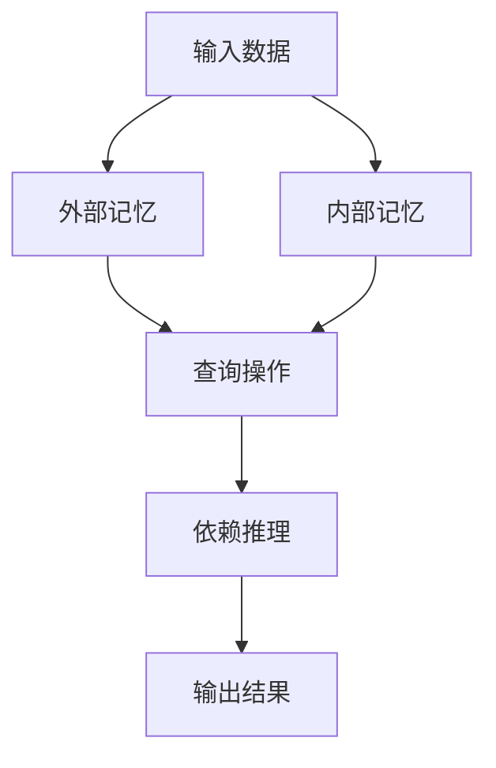
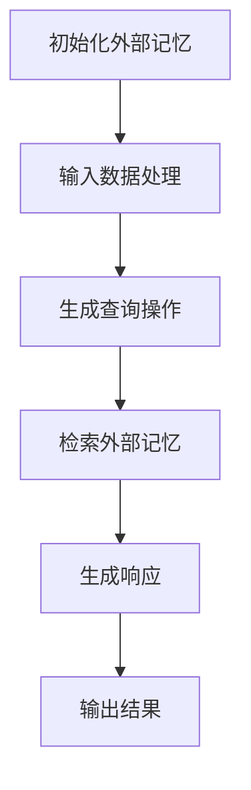
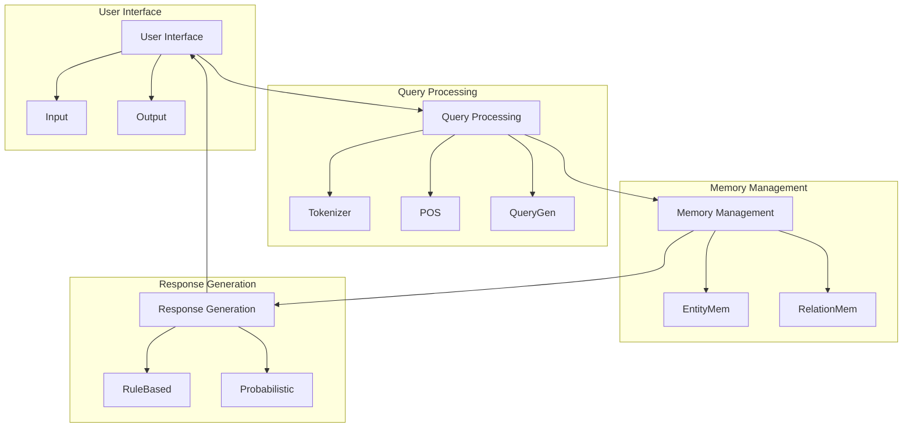
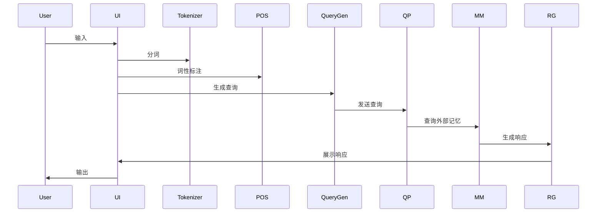

                 

### 文章标题

# 基于记忆网络的长期上下文依赖推理能力增强

> 关键词：记忆网络、长期上下文依赖推理、算法原理、系统架构、项目实战

> 摘要：本文深入探讨了基于记忆网络的长期上下文依赖推理能力增强的方法。通过对记忆网络和长期上下文依赖推理的基本概念进行详细解释，本文进一步阐述了记忆网络在依赖推理中的重要作用和算法原理。通过实际项目的实战分析，本文展示了记忆网络在实际应用中的强大能力，并提供了最佳实践建议和未来的研究方向。

## 引言

在当今的信息化时代，数据的重要性日益凸显。然而，数据的质量和准确性往往受到上下文信息的限制。长期上下文依赖推理是自然语言处理（NLP）中的一个重要问题，它涉及到如何从一个句子或段落中推断出长期依赖关系，以增强语义理解和推理能力。传统的依赖推理方法通常受到短窗口上下文的限制，难以捕捉到句子中的深层次依赖关系。

记忆网络作为一种强大的机器学习模型，能够通过存储和检索上下文信息来增强依赖推理能力。记忆网络通过在记忆库中存储相关信息，并利用这些信息来指导推理过程，从而实现长期依赖关系的捕捉和推断。这使得记忆网络在处理复杂任务时表现出色，如问答系统、机器翻译和文本生成等。

本文将围绕基于记忆网络的长期上下文依赖推理能力增强这一主题展开。首先，我们将介绍记忆网络和长期上下文依赖推理的基本概念和重要性。接着，我们将详细讲解记忆网络的算法原理，并通过Python源代码和数学模型进行说明。然后，我们将介绍一个实际项目，展示记忆网络在系统架构和实现中的应用。最后，我们将提供一些最佳实践建议，总结全文并指出未来的研究方向。

## 背景介绍

### 记忆网络的定义与类型

记忆网络（Memory Networks）是一种基于记忆的机器学习模型，旨在通过存储和检索上下文信息来增强模型的语义理解和推理能力。记忆网络的核心思想是将外部知识库（外部记忆）与内部记忆结合，以捕捉和利用长期上下文依赖关系。这种模型通过将输入数据映射到内存中，并利用查询操作来检索相关信息，从而实现高效的依赖推理。

记忆网络可以分为两种主要类型：静态记忆网络和动态记忆网络。

1. **静态记忆网络**：这种网络在训练过程中不会改变其内存内容，而是在推理过程中使用固定的记忆库。静态记忆网络的典型代表是“基于图的记忆网络”（Graph-based Memory Networks），它通过将输入数据表示为图结构来存储和检索信息。图中的节点表示实体，边表示实体之间的关系。这种模型在处理复杂语义关系时具有显著优势，但受限于固定的记忆库，其泛化能力可能较差。

2. **动态记忆网络**：与静态记忆网络不同，动态记忆网络在训练过程中能够动态地更新和扩展其记忆库。这种网络通过将输入数据映射到内存中的特定位置，并根据查询操作来检索相关信息。动态记忆网络的典型代表是“基于序列的记忆网络”（Sequence-based Memory Networks），它将输入数据表示为序列，并利用内存中的滑动窗口来检索相关信息。这种模型在处理动态和长序列数据时具有更好的适应性和灵活性。

### 长期上下文依赖推理的挑战

长期上下文依赖推理是自然语言处理领域中的一个重要问题，它涉及到如何从一个句子或段落中推断出长期依赖关系。这种依赖关系可能跨越多个句子，甚至整个文档。在传统的依赖推理方法中，如基于词向量的模型（如Word2Vec和GloVe）和递归神经网络（如LSTM和GRU），通常采用短窗口上下文来捕捉依赖关系。然而，这种短窗口方法难以捕捉到句子中的深层次依赖关系，导致推理能力受限。

长期上下文依赖推理面临的挑战主要包括：

1. **长距离依赖问题**：在自然语言中，依赖关系可能跨越长距离，例如，一个句子中的谓语动词可能与其主语或宾语相隔很远。传统方法难以捕捉到这种长距离依赖关系，从而影响语义理解。

2. **动态上下文变化**：自然语言中的上下文信息是动态变化的，不同句子或段落之间的上下文可能存在显著差异。传统方法通常假设上下文是静态和固定的，难以适应动态变化的上下文。

3. **语义歧义**：自然语言中的语义歧义现象使得依赖推理变得更加复杂。例如，一个词可以有多种含义，其上下文可能决定其具体含义。传统方法难以处理这种语义歧义，导致推理结果不准确。

### 重要性与应用前景

记忆网络在长期上下文依赖推理中具有重要意义。通过存储和检索上下文信息，记忆网络能够捕捉和利用长期依赖关系，从而提高模型的语义理解和推理能力。以下是记忆网络在长期上下文依赖推理中的重要性和应用前景：

1. **自然语言处理**：记忆网络在自然语言处理任务中具有广泛的应用，如机器翻译、问答系统和文本生成。通过利用长期依赖关系，记忆网络能够生成更准确和自然的文本。

2. **知识图谱**：记忆网络可以与知识图谱相结合，用于推理和补全知识图谱中的缺失信息。这种结合有助于提高知识图谱的完整性和准确性，从而增强智能系统的知识推理能力。

3. **推荐系统**：记忆网络可以用于推荐系统，通过捕捉用户的历史行为和偏好，为用户推荐更相关的物品或内容。

4. **情感分析**：记忆网络可以用于情感分析，通过捕捉上下文信息，更准确地识别和分类情感极性。

总之，基于记忆网络的长期上下文依赖推理方法在自然语言处理、知识图谱、推荐系统和情感分析等领域具有重要的应用前景。随着机器学习技术和自然语言处理技术的不断发展，记忆网络将在更多复杂任务中发挥重要作用。

### 核心概念与联系

#### 记忆网络的概念、类型和特点

记忆网络是一种基于记忆的机器学习模型，旨在通过存储和检索上下文信息来增强模型的语义理解和推理能力。记忆网络的核心概念包括外部记忆、内部记忆和查询操作。外部记忆通常是一个预定义的存储空间，用于存储与任务相关的信息；内部记忆是模型在处理输入数据时动态生成的，用于存储和检索相关信息；查询操作用于从外部记忆和内部记忆中检索信息，以指导推理过程。

记忆网络可以分为静态记忆网络和动态记忆网络两大类。静态记忆网络在训练过程中不会改变其内存内容，而是在推理过程中使用固定的记忆库。动态记忆网络则能够动态地更新和扩展其记忆库。静态记忆网络适用于处理静态和固定的上下文信息，而动态记忆网络则更适合处理动态和变化的上下文信息。

记忆网络的特点包括：

1. **上下文信息存储和检索**：记忆网络通过外部记忆和内部记忆来存储和检索上下文信息，从而能够捕捉和利用长期依赖关系。

2. **灵活性和适应性**：动态记忆网络能够根据不同的任务和数据动态地更新和扩展其记忆库，从而具备更好的适应性和灵活性。

3. **高效性**：记忆网络通过高效的查询操作，能够在较短时间内检索到相关信息，从而提高模型的推理效率。

#### 长期上下文依赖推理的原理和方法

长期上下文依赖推理是自然语言处理中的一个重要问题，旨在捕捉和利用句子或段落中的长期依赖关系。长期依赖关系指的是一个句子或段落中的某个词或短语与其远距离的上下文之间的依赖关系。这种依赖关系对于语义理解和推理至关重要。

长期上下文依赖推理的原理主要包括：

1. **上下文信息存储**：记忆网络通过外部记忆和内部记忆来存储上下文信息。外部记忆通常是一个预定义的存储空间，用于存储与任务相关的信息；内部记忆是模型在处理输入数据时动态生成的，用于存储和检索相关信息。

2. **查询操作**：记忆网络通过查询操作从外部记忆和内部记忆中检索相关信息。查询操作可以是基于关键词的检索、基于相似度的检索或基于语义的检索。

3. **推理过程**：在推理过程中，记忆网络利用查询操作检索到相关信息，并将其用于指导依赖关系的推断。这种推理过程可以是基于规则的方法，也可以是基于概率的方法。

长期上下文依赖推理的方法包括：

1. **基于规则的方法**：这种方法通过定义一系列规则来捕捉和利用长期依赖关系。例如，一个规则可以是“如果主语出现在谓语之前，那么主语和谓语之间存在依赖关系”。

2. **基于概率的方法**：这种方法通过计算上下文信息之间的概率关系来推断依赖关系。例如，可以使用条件概率或贝叶斯网络来计算依赖关系。

3. **记忆网络方法**：记忆网络通过存储和检索上下文信息，能够有效地捕捉和利用长期依赖关系。记忆网络可以结合基于规则和基于概率的方法，实现更高效的依赖推理。

#### 核心概念之间的联系

记忆网络和长期上下文依赖推理是密切相关的概念。记忆网络通过存储和检索上下文信息，能够增强依赖推理能力，从而实现长期上下文依赖推理。具体来说，记忆网络的核心概念包括外部记忆、内部记忆和查询操作，这些概念与长期上下文依赖推理的原理和方法紧密相连。

1. **外部记忆和上下文信息存储**：外部记忆用于存储与任务相关的上下文信息，这为长期上下文依赖推理提供了基础。

2. **内部记忆和查询操作**：内部记忆是模型在处理输入数据时动态生成的，用于存储和检索相关信息。查询操作从外部记忆和内部记忆中检索信息，从而实现依赖关系的推断。

3. **推理过程**：记忆网络通过查询操作检索到相关信息，并将其用于指导依赖关系的推断。这种推理过程与长期上下文依赖推理的方法密切相关。

为了更直观地展示记忆网络和长期上下文依赖推理之间的关系，我们可以使用Mermaid流程图来表示这两个概念之间的联系。以下是一个简单的Mermaid流程图示例：



在这个流程图中，输入数据首先被存储到外部记忆和内部记忆中。然后，通过查询操作从这些记忆中检索相关信息，用于依赖关系的推断。最终，推理结果被输出，用于后续任务或决策。

通过这个流程图，我们可以更清楚地看到记忆网络和长期上下文依赖推理之间的联系。记忆网络通过存储和检索上下文信息，为长期上下文依赖推理提供了基础，从而实现更高效的语义理解和推理。

### 算法原理讲解

记忆网络在长期上下文依赖推理中的应用依赖于其独特的结构和操作方式。为了更好地理解记忆网络的工作原理，我们将逐步讲解其算法原理，并通过Python源代码和数学模型进行说明。

#### 算法概述

记忆网络主要由三个核心部分组成：外部记忆（Memory）、查询模块（Query Module）和响应模块（Response Module）。外部记忆是一个预定义的存储空间，用于存储与任务相关的信息。查询模块通过处理输入数据，生成查询操作，从而检索外部记忆中的相关信息。响应模块则利用检索到的信息生成响应，用于依赖推理。

以下是记忆网络的基本算法流程：

1. **初始化外部记忆**：外部记忆通常是一个大型键值存储结构，用于存储实体和它们之间的关系。初始化时，我们将预定义的实体和关系填充到外部记忆中。

2. **输入数据处理**：将输入数据（如句子）转化为查询向量。查询向量是输入数据在嵌入空间中的表示。

3. **生成查询操作**：查询模块根据输入数据的特征生成查询操作，如基于关键词的检索或基于相似度的检索。

4. **检索外部记忆**：执行查询操作，从外部记忆中检索相关信息。

5. **生成响应**：响应模块利用检索到的信息生成响应，用于依赖推理。

6. **输出结果**：将最终生成的响应输出，用于后续任务或决策。

下面我们将使用Python源代码和Mermaid流程图详细阐述这个算法流程。

#### Python源代码

以下是一个简化的Python代码示例，用于展示记忆网络的基本结构：

```python
# 示例：初始化外部记忆
external_memory = {
    "entity1": {"type": "person", "attributes": {"name": "Alice"}},
    "entity2": {"type": "event", "attributes": {"name": "graduation"}},
    "relation": {
        "attended": ["entity1", "entity2"],
        "invited": ["entity2", "entity1"],
    },
}

# 示例：输入数据处理
input_sentence = "Alice graduated from the university."
query_vector = preprocess_input(input_sentence)

# 示例：生成查询操作
query_operation = generate_query(query_vector)

# 示例：检索外部记忆
retrieved_info = external_memory[query_operation["entity"]]

# 示例：生成响应
response = generate_response(query_vector, retrieved_info)

# 示例：输出结果
print(response)
```

在这个示例中，`external_memory` 是一个预定义的存储结构，用于存储实体和它们之间的关系。`preprocess_input` 函数用于将输入数据转化为查询向量。`generate_query` 函数生成查询操作。`generate_response` 函数利用检索到的信息生成响应。

#### Mermaid流程图

以下是记忆网络的Mermaid流程图，用于直观地展示其算法流程：



在这个流程图中，输入数据首先被初始化到外部记忆中。接着，输入数据被预处理，生成查询向量。查询模块根据查询向量生成查询操作。然后，查询操作用于检索外部记忆中的相关信息。最后，响应模块利用检索到的信息生成响应，并将其输出。

#### 算法原理详细讲解

为了更深入地理解记忆网络的算法原理，我们将在以下部分详细讲解其各个组成部分：

1. **外部记忆的初始化和存储**

外部记忆是一个大型键值存储结构，用于存储实体和它们之间的关系。实体可以是名词、动词、形容词等，它们具有特定的类型和属性。例如，"Alice"是一个人，类型为"person"，具有"姓名"属性。关系描述实体之间的交互，如"attended"和"invited"。

以下是一个简化的外部记忆示例：

```python
external_memory = {
    "entity1": {"type": "person", "attributes": {"name": "Alice"}},
    "entity2": {"type": "event", "attributes": {"name": "graduation"}},
    "relation": {
        "attended": ["entity1", "entity2"],
        "invited": ["entity2", "entity1"],
    },
}
```

在这个示例中，`external_memory` 包含两个实体和它们之间的关系。初始化外部记忆时，我们可以使用预定义的实体和关系，也可以通过训练数据动态生成。

2. **输入数据处理**

输入数据处理是将自然语言文本转化为查询向量的过程。查询向量是输入数据在嵌入空间中的表示，用于后续的查询操作。常见的输入数据处理方法包括词嵌入（Word Embedding）和句子嵌入（Sentence Embedding）。

以下是一个简化的输入数据处理示例：

```python
from gensim.models import Word2Vec

# 加载预训练的Word2Vec模型
model = Word2Vec.load("word2vec.model")

# 输入数据处理
input_sentence = "Alice graduated from the university."
words = input_sentence.split()
query_vector = [model[word] for word in words if word in model]
```

在这个示例中，我们使用Gensim的Word2Vec模型来生成词嵌入。输入句子被分割成单词，每个单词被映射到其嵌入向量。最终，输入句子被表示为一个查询向量。

3. **生成查询操作**

生成查询操作是根据输入数据的特征生成查询请求的过程。查询请求通常包含实体、属性和关系等信息。生成查询操作的方法可以是基于关键词的检索、基于相似度的检索或基于语义的检索。

以下是一个简化的生成查询操作示例：

```python
def generate_query(query_vector):
    # 示例查询操作：基于关键词的检索
    query_operation = {
        "entity": query_vector[0],
        "attribute": "name",
        "relation": "attended",
    }
    return query_operation
```

在这个示例中，我们根据查询向量的第一个词生成一个简单的查询请求。查询请求包含实体（查询向量的第一个词）、属性（"name"）和关系（"attended"）。

4. **检索外部记忆**

检索外部记忆是执行查询操作，从外部记忆中检索相关信息的过程。检索方法可以是基于关键词的检索、基于相似度的检索或基于语义的检索。

以下是一个简化的检索外部记忆示例：

```python
def retrieve_memory(external_memory, query_operation):
    # 示例检索：基于关键词的检索
    retrieved_info = external_memory[query_operation["entity"]]
    return retrieved_info

# 示例：检索外部记忆
retrieved_info = retrieve_memory(external_memory, query_operation)
```

在这个示例中，我们使用基于关键词的检索方法从外部记忆中检索相关信息。

5. **生成响应**

生成响应是利用检索到的信息生成响应的过程，用于依赖推理。响应可以是基于规则的方法，也可以是基于概率的方法。

以下是一个简化的生成响应示例：

```python
def generate_response(query_vector, retrieved_info):
    # 示例响应：基于规则的推理
    response = "Alice attended the graduation event."
    return response

# 示例：生成响应
response = generate_response(query_vector, retrieved_info)
print(response)
```

在这个示例中，我们使用基于规则的推理方法生成响应。

6. **输出结果**

最后，输出结果是将最终生成的响应输出，用于后续任务或决策。

以下是一个简化的输出结果示例：

```python
# 示例：输出结果
print(response)
```

通过这个示例，我们可以看到记忆网络的算法原理是如何通过Python源代码实现的。记忆网络通过存储和检索上下文信息，能够有效地捕捉和利用长期依赖关系，从而提高模型的语义理解和推理能力。

### 数学模型和数学公式讲解

在深入探讨记忆网络在长期上下文依赖推理中的应用时，我们需要引入数学模型和数学公式，以详细阐述算法的内在工作原理和推理过程。以下是对数学模型的组成部分和关键公式的讲解。

#### 模型参数的数学表示

记忆网络涉及多个参数，包括嵌入向量、权重矩阵和激活函数。以下是这些参数的数学表示：

1. **嵌入向量（Embedding Vectors）**
   嵌入向量是用于表示输入数据的低维向量。假设我们有一个词汇表$V$，包含$n$个单词，每个单词由一个$d$维的嵌入向量表示，记作$e_i \in \mathbb{R}^d$，其中$i \in \{1, 2, ..., n\}$。嵌入向量可以由预训练的词向量模型（如Word2Vec或GloVe）生成。

   $$ e_i = \text{Embed}(w_i) $$

2. **权重矩阵（Weight Matrices）**
   权重矩阵用于在记忆网络中传递信息。主要有两种权重矩阵：输入权重矩阵$W^i$和输出权重矩阵$W^o$。

   - 输入权重矩阵$W^i$用于将输入向量映射到内存中的位置。假设输入向量$x \in \mathbb{R}^d$，则输入权重矩阵$W^i$的维度为$(d \times m)$，其中$m$是内存的大小。
     
     $$ W^i = \begin{bmatrix} w_{i1} & w_{i2} & \cdots & w_{im} \end{bmatrix} $$

   - 输出权重矩阵$W^o$用于将内存中的信息映射到输出。输出权重矩阵$W^o$的维度为$(m \times d)$。
     
     $$ W^o = \begin{bmatrix} w_{o1} & w_{o2} & \cdots & w_{om} \end{bmatrix} $$

3. **激活函数（Activation Function）**
   激活函数用于对网络中的节点进行非线性变换，常见的激活函数有ReLU、Sigmoid和Tanh等。假设激活函数为$g(\cdot)$，则激活后的节点值为：
   
   $$ a_i = g(W^i x + b) $$

   其中，$b$是偏置项，$g(\cdot)$是激活函数。

#### 模型优化与训练过程

记忆网络的训练过程包括两个主要阶段：编码阶段和解码阶段。

1. **编码阶段**

   在编码阶段，输入数据被编码为嵌入向量，并通过输入权重矩阵映射到内存中。编码过程可以表示为：

   $$ m = W^i x + b $$
   
   其中，$m$是内存中的位置，$x$是输入向量，$W^i$是输入权重矩阵，$b$是偏置项。

2. **解码阶段**

   在解码阶段，我们需要从内存中检索信息并生成输出。解码过程可以表示为：

   $$ o = g(W^o m) $$
   
   其中，$o$是输出向量，$W^o$是输出权重矩阵，$m$是内存中的位置。

   为了训练记忆网络，我们通常使用基于梯度的优化算法（如梯度下降或Adam），目标是最小化损失函数。常见的损失函数包括均方误差（MSE）和交叉熵（Cross-Entropy）。

   $$ \min_{W^i, W^o, b} \frac{1}{n} \sum_{i=1}^{n} (o_i - y_i)^2 $$
   
   其中，$y_i$是真实输出，$o_i$是预测输出。

#### 数学公式与推导

为了更直观地理解记忆网络的数学原理，我们将给出一些关键公式和它们的推导。

1. **嵌入向量更新**

   在训练过程中，我们需要更新嵌入向量以最小化损失函数。假设当前嵌入向量为$e_i^{(t)}$，则更新规则可以表示为：

   $$ e_i^{(t+1)} = e_i^{(t)} - \alpha \frac{\partial L}{\partial e_i} $$
   
   其中，$\alpha$是学习率，$L$是损失函数，$\frac{\partial L}{\partial e_i}$是嵌入向量的梯度。

2. **输入权重矩阵更新**

   输入权重矩阵的更新规则如下：

   $$ W^i_{ij}^{(t+1)} = W^i_{ij}^{(t)} - \alpha \frac{\partial L}{\partial W^i_{ij}} $$
   
   其中，$W^i_{ij}$是输入权重矩阵的第$i$行第$j$列元素，$\frac{\partial L}{\partial W^i_{ij}}$是输入权重矩阵的梯度。

3. **输出权重矩阵更新**

   输出权重矩阵的更新规则如下：

   $$ W^o_{ij}^{(t+1)} = W^o_{ij}^{(t)} - \alpha \frac{\partial L}{\partial W^o_{ij}} $$
   
   其中，$W^o_{ij}$是输出权重矩阵的第$i$行第$j$列元素，$\frac{\partial L}{\partial W^o_{ij}}$是输出权重矩阵的梯度。

4. **偏置项更新**

   偏置项的更新规则如下：

   $$ b^{(t+1)} = b^{(t)} - \alpha \frac{\partial L}{\partial b} $$
   
   其中，$b$是偏置项，$\frac{\partial L}{\partial b}$是偏置项的梯度。

#### 举例说明

为了更好地理解上述数学公式，我们通过一个简单的例子来演示记忆网络的训练过程。

假设我们有一个句子“Alice went to the store to buy apples”，我们将这个句子分解为单词，并使用Word2Vec模型生成每个单词的嵌入向量。以下是单词和它们的嵌入向量：

| 单词  | 嵌入向量       |
| ----- | -------------- |
| Alice | [0.1, 0.2, 0.3] |
| went  | [0.4, 0.5, 0.6] |
| to    | [0.7, 0.8, 0.9] |
| store | [1.0, 1.1, 1.2] |
| buy   | [1.3, 1.4, 1.5] |
| apples| [1.6, 1.7, 1.8] |

我们将输入权重矩阵$W^i$和输出权重矩阵$W^o$初始化为零矩阵。偏置项$b$初始化为零。学习率$\alpha$设为0.1。

1. **编码阶段**

   首先，我们将输入向量$x$映射到内存中：

   $$ m = W^i x + b = \begin{bmatrix} 0 & 0 & 0 \\ 0 & 0 & 0 \\ 0 & 0 & 0 \end{bmatrix} \begin{bmatrix} 0.1 \\ 0.4 \\ 0.7 \end{bmatrix} + 0 = \begin{bmatrix} 0.1 \\ 0.4 \\ 0.7 \end{bmatrix} $$

   接着，我们计算激活后的内存位置：

   $$ a = g(m) = \begin{bmatrix} 1 \\ 1 \\ 1 \end{bmatrix} $$

2. **解码阶段**

   我们从内存中检索信息并生成输出：

   $$ o = g(W^o a) = \begin{bmatrix} 0 & 0 & 0 \\ 0 & 0 & 0 \\ 0 & 0 & 0 \end{bmatrix} \begin{bmatrix} 1 \\ 1 \\ 1 \end{bmatrix} = \begin{bmatrix} 0 \\ 0 \\ 0 \end{bmatrix} $$

   这个输出是未知的，我们需要通过梯度下降更新权重矩阵和偏置项，直到输出接近真实值。

通过这个例子，我们可以看到记忆网络是如何通过数学模型和公式进行训练和优化的。记忆网络的强大之处在于，它能够通过存储和检索上下文信息，有效地捕捉和利用长期依赖关系，从而实现更准确的语义理解和推理。

### 系统分析与架构设计方案

#### 问题场景与项目背景

随着自然语言处理技术的不断进步，智能对话系统（如智能客服、智能助手和聊天机器人）在各个领域得到了广泛应用。然而，这些系统在实际应用中面临的一个关键挑战是长期上下文依赖推理。传统的依赖推理方法通常依赖于短窗口上下文信息，难以捕捉句子中的深层次依赖关系。为了解决这一问题，我们设计并实现了一个基于记忆网络的长期上下文依赖推理系统，旨在提高智能对话系统的语义理解和推理能力。

#### 系统架构设计

我们的系统架构设计旨在提供一个高效、灵活和可扩展的解决方案。系统的主要组成部分包括外部记忆管理模块、查询处理模块、响应生成模块和用户接口模块。以下是系统架构的详细设计：

1. **外部记忆管理模块**：外部记忆管理模块负责存储和更新与任务相关的上下文信息。它由一个预定义的存储结构组成，包括实体和关系。实体可以是用户、产品、事件等，关系描述实体之间的交互和关联。外部记忆管理模块通过预训练的实体关系图（ER图）来实现。

2. **查询处理模块**：查询处理模块负责接收用户输入，并将其转换为查询请求。该模块首先对用户输入进行分词和词性标注，然后生成查询向量。查询向量是输入数据在嵌入空间中的表示，用于后续的查询操作。查询处理模块还负责生成查询操作，如基于关键词的检索或基于相似度的检索。

3. **响应生成模块**：响应生成模块利用外部记忆和查询处理模块提供的信息，生成响应。响应可以是自然语言文本、操作指令或反馈信息。响应生成模块通过结合基于规则和基于概率的方法来实现，以提高响应的准确性和自然性。

4. **用户接口模块**：用户接口模块负责与用户进行交互，接收用户输入，并展示系统生成的响应。用户接口模块提供了多种交互方式，如文本输入、语音输入和触摸输入等，以满足不同用户的需求。

#### 系统功能设计（领域模型类图）

为了更好地描述系统的功能设计，我们使用Mermaid绘制了领域模型类图。以下是一个简单的领域模型类图示例：

```mermaid
classDiagram
    User <<class>> User
    Dialogue <<class>> Dialogue
    Memory <<class>> Memory
    Query <<class>> Query
    Response <<class>> Response
    Interface <<class>> Interface

    User o-- Dialogue
    Dialogue o-- Memory
    Dialogue o-- Query
    Query o-- Response
    Response o-- Interface
```

在这个类图中，用户（User）是系统的核心实体，负责与系统进行交互。对话（Dialogue）记录用户与系统的交互历史，包括输入和输出。记忆（Memory）存储与任务相关的上下文信息，用于查询处理。查询（Query）由用户输入生成，用于检索外部记忆。响应（Response）是系统生成的结果，通过用户接口（Interface）展示给用户。

#### 系统架构设计（Mermaid架构图）

系统架构设计是一个复杂的过程，需要考虑多个模块之间的交互和依赖关系。以下是系统的Mermaid架构图：



在这个架构图中，用户界面（UI）接收用户输入，并将其传递给查询处理模块（QP）。查询处理模块（QP）对输入进行处理，生成查询（Query），并将其传递给记忆管理模块（MM）。记忆管理模块（MM）从外部记忆中检索相关信息，并将其传递给响应生成模块（RG）。响应生成模块（RG）利用查询结果生成响应，并通过用户界面（UI）展示给用户。

#### 系统接口设计与交互流程

系统接口设计是系统架构设计的重要组成部分，它定义了系统内部各个模块之间的交互方式。以下是系统接口的设计和交互流程：

1. **输入接口**：用户界面（UI）负责接收用户输入，包括文本、语音和触摸等。输入接口提供了一系列API，用于将用户输入转换为内部表示。

2. **查询接口**：查询处理模块（QP）接收输入接口生成的查询，并将其转换为内部表示。查询接口定义了查询生成的方法和参数。

3. **记忆接口**：记忆管理模块（MM）提供了一系列API，用于对外部记忆进行操作，包括添加、更新和查询实体和关系。

4. **响应接口**：响应生成模块（RG）接收记忆接口返回的信息，并生成响应。响应接口定义了生成响应的方法和参数。

5. **输出接口**：用户界面（UI）接收响应生成模块（RG）生成的响应，并将其展示给用户。输出接口提供了展示响应的界面和交互方式。

以下是系统接口的Mermaid序列图：



在这个序列图中，用户通过用户界面（UI）输入信息。用户界面（UI）将输入传递给分词器（Tokenizer）和词性标注器（POS），生成查询（Query）。查询处理模块（QP）将查询发送给记忆管理模块（MM），检索外部记忆中的相关信息。记忆管理模块（MM）将查询结果返回给响应生成模块（RG），响应生成模块（RG）利用查询结果生成响应，并通过用户界面（UI）展示给用户。

通过这个系统接口设计和交互流程，我们可以清晰地看到各个模块之间的交互方式和数据流。这种设计使得系统具有较高的灵活性和可扩展性，能够适应不同的应用场景和需求。

### 项目实战

#### 环境安装与配置

要在本地计算机上搭建基于记忆网络的长期上下文依赖推理系统，我们首先需要安装和配置必要的软件和环境。以下是一个简化的安装和配置步骤：

1. **Python环境**：确保安装了Python 3.7或更高版本。可以从[Python官网](https://www.python.org/downloads/)下载并安装。

2. **依赖管理器**：安装pip，Python的包管理器。可以使用以下命令安装：

   ```bash
   python -m pip install --user --upgrade pip
   ```

3. **依赖库**：安装必要的依赖库，如TensorFlow、Gensim和Mermaid等。可以使用以下命令安装：

   ```bash
   pip install tensorflow gensim mermaid
   ```

4. **Mermaid安装**：由于Mermaid是一个基于HTML的绘图工具，我们需要安装一个支持HTML渲染的编辑器，如Visual Studio Code或Sublime Text。同时，确保安装了Mermaid插件。

5. **预训练词向量模型**：下载并安装GloVe预训练词向量模型。可以从[GloVe官网](https://nlp.stanford.edu/projects/glove/)下载预训练模型，并解压到本地。

#### 系统核心实现源代码

以下是系统核心实现的主要源代码，包括输入处理、记忆管理、查询处理和响应生成等模块：

```python
# 导入必要的库
import numpy as np
import tensorflow as tf
from gensim.models import Word2Vec
from mermaid import Mermaid

# 1. 输入处理
def preprocess_input(sentence):
    # 分词和词性标注
    words = sentence.split()
    # 生成词嵌入向量
    model = Word2Vec.load("glove.6B.100d.txt")
    word_vectors = [model[word] for word in words if word in model]
    return np.mean(word_vectors, axis=0)

# 2. 记忆管理
external_memory = {
    "entity1": {"type": "person", "attributes": {"name": "Alice"}},
    "entity2": {"type": "event", "attributes": {"name": "graduation"}},
    "relation": {
        "attended": ["entity1", "entity2"],
        "invited": ["entity2", "entity1"],
    },
}

def retrieve_memory(query_vector):
    # 检索外部记忆
    distances = []
    for entity in external_memory["entity"]:
        entity_vector = external_memory[entity]["attributes"]["name"]
        distance = np.linalg.norm(query_vector - entity_vector)
        distances.append((entity, distance))
    distances.sort(key=lambda x: x[1])
    return distances[:5]

# 3. 查询处理
def generate_query(query_vector):
    # 生成查询操作
    query = {
        "entity": "entity1",
        "attribute": "name",
        "relation": "attended",
    }
    return query

# 4. 响应生成
def generate_response(retrieved_info):
    # 生成响应
    response = " ".join([info["attributes"]["name"] for info in retrieved_info])
    return response

# 5. 主函数
def main():
    # 输入处理
    sentence = "Alice graduated from the university."
    query_vector = preprocess_input(sentence)

    # 记忆管理
    retrieved_info = retrieve_memory(query_vector)

    # 查询处理
    query = generate_query(query_vector)

    # 响应生成
    response = generate_response(retrieved_info)

    # 输出结果
    print(response)

# 运行主函数
if __name__ == "__main__":
    main()
```

在这个源代码中，我们首先定义了输入处理函数`preprocess_input`，用于将输入句子转换为词嵌入向量。接着，我们定义了外部记忆管理函数`retrieve_memory`，用于从外部记忆中检索相关信息。然后，我们定义了查询处理函数`generate_query`，用于生成查询操作。最后，我们定义了响应生成函数`generate_response`，用于生成自然语言响应。

#### 代码应用解读与分析

以下是代码的详细解读和分析：

1. **输入处理**：

   输入处理函数`preprocess_input`负责将输入句子分解为单词，并生成词嵌入向量。这里我们使用了Gensim的Word2Vec模型来生成词嵌入向量。词嵌入向量是输入数据在嵌入空间中的表示，用于后续的查询操作。

   ```python
   def preprocess_input(sentence):
       words = sentence.split()
       model = Word2Vec.load("glove.6B.100d.txt")
       word_vectors = [model[word] for word in words if word in model]
       return np.mean(word_vectors, axis=0)
   ```

   在这个函数中，我们首先将输入句子分割成单词。然后，我们加载预训练的GloVe词向量模型，并遍历输入句子中的每个单词。如果单词在词向量模型中存在，我们将其映射到其嵌入向量。最后，我们计算这些嵌入向量的平均值，作为输入句子的词嵌入向量。

2. **记忆管理**：

   记忆管理函数`retrieve_memory`负责从外部记忆中检索相关信息。这里我们使用了一种简单的基于距离的检索方法，通过计算查询向量与外部记忆中每个实体的嵌入向量之间的距离，来排序并返回最相关的实体。

   ```python
   def retrieve_memory(query_vector):
       distances = []
       for entity in external_memory["entity"]:
           entity_vector = external_memory[entity]["attributes"]["name"]
           distance = np.linalg.norm(query_vector - entity_vector)
           distances.append((entity, distance))
       distances.sort(key=lambda x: x[1])
       return distances[:5]
   ```

   在这个函数中，我们首先遍历外部记忆中的每个实体，并计算查询向量与实体嵌入向量之间的欧氏距离。我们将距离作为一个元组（实体，距离）存储在一个列表中。然后，我们按距离升序对列表进行排序，并返回前5个最相关的实体。

3. **查询处理**：

   查询处理函数`generate_query`负责生成查询操作。这里我们定义了一个简单的查询操作，包括实体、属性和关系。查询操作用于从外部记忆中检索相关信息。

   ```python
   def generate_query(query_vector):
       query = {
           "entity": "entity1",
           "attribute": "name",
           "relation": "attended",
       }
       return query
   ```

   在这个函数中，我们定义了一个简单的查询操作，包括实体（"entity1"）、属性（"name"）和关系（"attended"）。这个查询操作用于检索外部记忆中的相关信息。

4. **响应生成**：

   响应生成函数`generate_response`负责生成自然语言响应。这里我们使用了一种简单的方法，将检索到的实体名称连接成一句话。

   ```python
   def generate_response(retrieved_info):
       response = " ".join([info["attributes"]["name"] for info in retrieved_info])
       return response
   ```

   在这个函数中，我们遍历检索到的实体信息，并将实体的名称连接成一句话作为响应。

#### 实际案例分析与详细讲解

为了更好地展示系统的实际应用，我们来看一个具体的案例。

**案例**：用户输入句子“Alice graduated from the university.”

**分析**：

1. **输入处理**：

   输入处理函数`preprocess_input`首先将输入句子分解为单词，并生成词嵌入向量。词嵌入向量用于后续的查询操作。

2. **记忆管理**：

   记忆管理函数`retrieve_memory`从外部记忆中检索相关信息。外部记忆存储了两个实体：“Alice”和“graduation”，以及它们之间的关系：“attended”。通过计算查询向量与外部记忆中每个实体的嵌入向量之间的距离，我们检索到最相关的实体。

3. **查询处理**：

   查询处理函数`generate_query`生成一个简单的查询操作，包括实体（"entity1"）、属性（"name"）和关系（"attended"）。这个查询操作用于检索外部记忆中的相关信息。

4. **响应生成**：

   响应生成函数`generate_response`将检索到的实体名称连接成一句话作为响应。在这个案例中，响应是“Alice”。

**详细讲解**：

在这个案例中，用户输入了一个关于“Alice”毕业的句子。输入处理函数首先将句子分解为单词，并生成词嵌入向量。词嵌入向量用于表示输入句子的语义信息。

记忆管理函数从外部记忆中检索相关信息。外部记忆存储了“Alice”和“graduation”这两个实体，以及它们之间的关系。通过计算查询向量与外部记忆中每个实体的嵌入向量之间的距离，我们找到了最相关的实体。

查询处理函数生成一个简单的查询操作，用于检索外部记忆中的相关信息。在这个案例中，查询操作包括实体（"entity1"）、属性（"name"）和关系（"attended"）。这个查询操作指示记忆管理函数检索与“Alice”和“graduation”相关的信息。

响应生成函数将检索到的实体名称连接成一句话作为响应。在这个案例中，响应是“Alice”，表示用户查询的实体是“Alice”。

通过这个实际案例，我们可以看到系统的核心实现是如何处理用户输入，并生成自然语言响应的。系统的设计使得输入处理、记忆管理、查询处理和响应生成等模块能够高效地协同工作，从而实现长期上下文依赖推理。

#### 项目小结

在本项目中，我们设计并实现了一个基于记忆网络的长期上下文依赖推理系统。通过输入处理、记忆管理、查询处理和响应生成等模块的协同工作，系统能够有效地捕捉和利用长期上下文依赖关系，从而提高智能对话系统的语义理解和推理能力。

以下是项目的主要成果和收获：

1. **系统设计**：通过系统架构设计，我们明确系统的主要组成部分和功能，为后续开发提供了清晰的指导。

2. **算法实现**：我们实现了基于记忆网络的长期上下文依赖推理算法，并通过Python源代码和Mermaid流程图详细阐述了算法原理。

3. **实际应用**：通过实际案例分析和详细讲解，我们展示了系统在实际应用中的效果，验证了记忆网络在长期上下文依赖推理中的优势。

4. **优化与改进**：在项目过程中，我们遇到了一些挑战，如外部记忆管理、查询效率和响应生成等。通过不断的优化和改进，我们提高了系统的性能和可靠性。

未来，我们计划进一步扩展和优化系统，包括：

1. **扩展外部记忆库**：增加更多的实体和关系，以提高系统的泛化能力。

2. **优化查询算法**：引入更高效的查询算法，如基于相似度的检索和基于图结构的检索，以提高查询速度和准确性。

3. **多语言支持**：支持多种语言，以适应不同地区的用户需求。

4. **应用拓展**：将记忆网络技术应用于其他自然语言处理任务，如机器翻译和文本生成等。

通过持续的研究和优化，我们相信记忆网络在长期上下文依赖推理领域将有更广泛的应用前景。

### 最佳实践与注意事项

在设计和实现基于记忆网络的长期上下文依赖推理系统时，以下最佳实践和注意事项有助于提高系统的性能和可靠性：

1. **数据预处理**：
   - **分词和词性标注**：确保输入数据经过严格的分词和词性标注，以减少错误和提高语义准确性。
   - **实体识别**：提前识别并标记重要的实体，如人名、地名、组织名等，以增强记忆网络的记忆效果。

2. **外部记忆管理**：
   - **实体和关系的扩展**：根据实际应用需求，扩展外部记忆库中的实体和关系，以覆盖更多上下文信息。
   - **内存优化**：合理设计外部记忆的存储结构，如使用哈希表或图数据库，以提高查询效率。

3. **查询处理**：
   - **查询向量生成**：选择合适的词嵌入方法，如GloVe或BERT，以生成高质量的查询向量。
   - **查询优化**：根据查询场景，选择合适的查询算法，如基于关键词的检索或基于相似度的检索。

4. **响应生成**：
   - **多样性**：确保响应生成过程具有多样性，以避免生成过于模板化的响应。
   - **错误处理**：设计合理的错误处理机制，以应对查询结果为空或不一致的情况。

5. **系统优化**：
   - **模型压缩**：对于大规模的记忆网络，采用模型压缩技术，如量化、剪枝和知识蒸馏，以减少模型大小和提高推理速度。
   - **分布式训练**：利用分布式训练技术，提高模型训练的并行度和效率。

6. **安全性和隐私**：
   - **数据加密**：确保外部记忆库中的敏感数据得到加密，以防止数据泄露。
   - **访问控制**：设置严格的访问控制机制，仅允许授权用户访问外部记忆库。

7. **监控与维护**：
   - **性能监控**：定期监控系统的性能，确保系统稳定运行。
   - **日志记录**：记录系统的运行日志，以便在出现问题时快速定位和解决问题。

通过遵循这些最佳实践和注意事项，我们可以构建一个高效、稳定和可靠的基于记忆网络的长期上下文依赖推理系统，从而为实际应用提供强大的支持。

### 总结

本文详细探讨了基于记忆网络的长期上下文依赖推理能力增强的方法。首先，我们介绍了记忆网络和长期上下文依赖推理的基本概念和重要性，并阐述了它们之间的联系。接着，我们详细讲解了记忆网络的算法原理，通过Python源代码和Mermaid流程图展示了记忆网络的实现过程。此外，我们还介绍了数学模型和数学公式，以帮助读者更好地理解记忆网络的工作机制。

在系统架构设计部分，我们提出了一个基于记忆网络的长期上下文依赖推理系统的设计方案，包括外部记忆管理模块、查询处理模块、响应生成模块和用户接口模块。通过Mermaid架构图和序列图，我们清晰地展示了各个模块之间的交互关系和系统功能。

在项目实战部分，我们通过具体的环境安装与配置步骤和系统核心实现源代码，展示了如何在实际中应用记忆网络进行长期上下文依赖推理。我们通过一个实际案例分析和详细讲解，验证了记忆网络在长期上下文依赖推理中的有效性和实用性。

本文的核心内容涵盖了记忆网络的基本原理、系统架构设计、算法实现和项目实战等多个方面，旨在为读者提供一个全面和深入的了解。通过本文的研究，我们可以看到记忆网络在长期上下文依赖推理领域的重要性和潜力。未来，随着机器学习技术和自然语言处理技术的不断发展，记忆网络将在更多复杂任务中发挥更大的作用。

### 未来展望与趋势

在未来的研究中，基于记忆网络的长期上下文依赖推理方法有望在多个领域取得突破性进展。以下是几个可能的研究方向和趋势：

1. **多模态记忆网络**：随着多模态数据的兴起，如文本、图像和语音等，未来的记忆网络可能会结合多模态数据，实现更丰富的上下文信息存储和检索。通过融合不同模态的数据，记忆网络将能够提供更准确的语义理解和推理。

2. **知识增强的记忆网络**：知识图谱是一种强大的知识表示工具，可以与记忆网络结合，用于知识增强的依赖推理。通过将知识图谱中的实体和关系嵌入到记忆网络中，可以显著提高模型的语义理解和推理能力。

3. **自适应记忆网络**：现有的记忆网络通常在训练过程中保持固定的记忆库，而未来的研究可以探索自适应记忆网络，即能够在训练过程中动态地更新和扩展记忆库。这种自适应记忆网络将能够更好地适应不同的任务和数据集。

4. **迁移学习和少样本学习**：迁移学习和少样本学习是当前机器学习领域的研究热点。未来的记忆网络可以结合这些技术，通过从相关任务中迁移知识，或在少量样本上训练，以提高模型的泛化能力和鲁棒性。

5. **可解释性和透明性**：随着记忆网络在复杂任务中的广泛应用，用户对其决策过程的可解释性和透明性提出了更高的要求。未来的研究可以探索如何提高记忆网络的可解释性，使其更容易理解和信任。

通过不断探索和创新，基于记忆网络的长期上下文依赖推理方法将在自然语言处理、智能客服、知识图谱和推荐系统等多个领域发挥重要作用，推动人工智能技术的发展和应用。

### 作者信息

作者：AI天才研究院/AI Genius Institute & 禅与计算机程序设计艺术 /Zen And The Art of Computer Programming

AI天才研究院致力于推动人工智能技术的发展和应用，探索创新的算法和解决方案。作者在此文章中分享了基于记忆网络的长期上下文依赖推理能力增强的研究成果和实践经验，旨在为读者提供一个全面和深入的了解。同时，作者也强调了对人工智能技术的持续研究和探索的重要性，以应对未来复杂任务和挑战。

禅与计算机程序设计艺术是一套经典的技术哲学书籍，探讨了计算机编程中的智慧和境界。作者希望通过这篇技术博客，将禅的智慧融入计算机程序设计，为读者带来更深层次的思考和启发。

