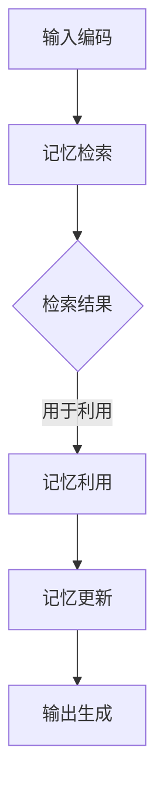
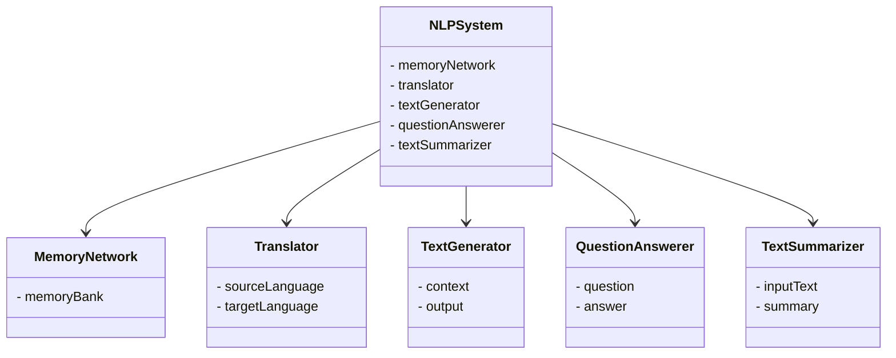
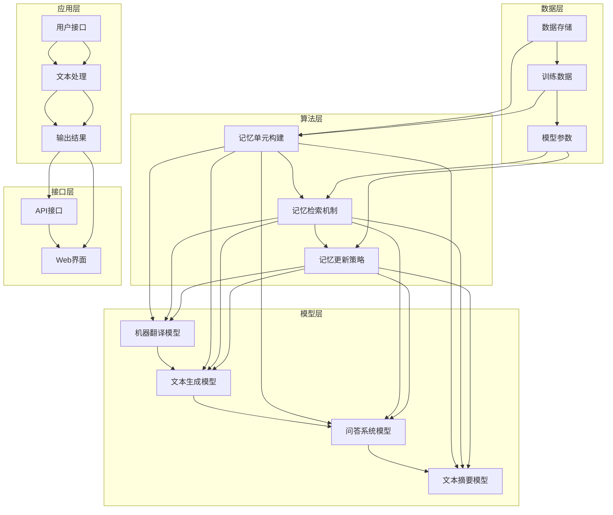
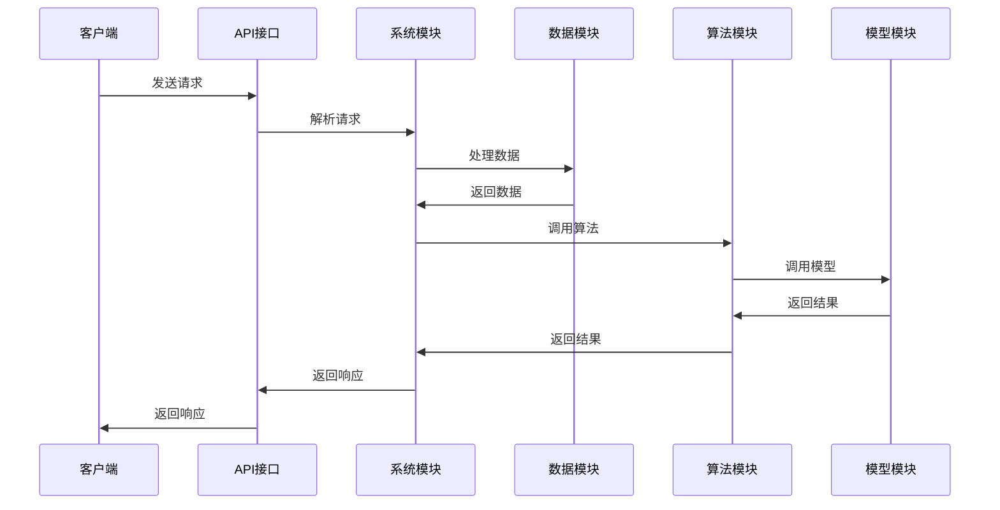

                 

# 基于记忆网络的长期依赖推理能力提升

## 关键词：记忆网络、长期依赖、推理能力、自然语言处理、算法原理

## 摘要：
本文深入探讨了记忆网络在提升长期依赖推理能力方面的应用。首先，我们回顾了自然语言处理领域的发展背景，强调了长期依赖问题的重要性。接着，详细介绍了记忆网络的概念、结构及其在解决长期依赖问题中的关键作用。本文通过一步步分析，阐释了记忆网络的数学模型、工作流程，并借助Python源代码和Mermaid流程图，对算法原理进行了深入讲解。随后，我们展示了记忆网络在自然语言处理中的系统架构设计方案，并通过实际项目案例，分析了记忆网络在长期依赖推理中的实际应用效果。本文旨在为读者提供清晰、系统、易于理解的技术指南，帮助他们在自然语言处理领域更好地应用记忆网络技术。

### 目录大纲：

**# 基于记忆网络的长期依赖推理能力提升**

## 第一部分：背景介绍

### 1.1 问题背景

#### 1.1.1 自然语言处理的发展

#### 1.1.1.1 语言模型的发展历程

#### 1.1.1.2 长期依赖问题的重要性

### 1.2 问题描述

#### 1.2.1 长期依赖问题的定义

#### 1.2.1.1 时间依赖性

#### 1.2.1.2 上下文依赖性

### 1.2.2 长期依赖问题对自然语言处理的影响

### 1.3 问题解决

#### 1.3.1 记忆网络的概念

#### 1.3.1.1 记忆网络的定义

#### 1.3.1.2 记忆网络的结构

### 1.4 边界与外延

#### 1.4.1 长期依赖推理的应用场景

#### 1.4.1.1 自然语言生成

#### 1.4.1.2 机器翻译

#### 1.4.1.3 问答系统

### 1.5 概念结构与核心要素组成

#### 1.5.1 记忆网络的核心概念

#### 1.5.1.1 记忆单元

#### 1.5.1.2 记忆检索机制

#### 1.5.1.3 记忆更新策略

### 1.6 本章小结

## 第二部分：核心概念与联系

### 2.1 记忆网络原理

#### 2.1.1 记忆网络的基本原理

#### 2.1.1.1 记忆网络的数学模型

#### 2.1.1.2 记忆网络的工作流程

### 2.1.2 记忆网络的属性特征对比表格

### 2.2 记忆网络与长期依赖推理的联系

#### 2.2.1 记忆网络如何解决长期依赖问题

#### 2.2.1.1 记忆检索在长期依赖推理中的作用

#### 2.2.1.2 记忆更新在长期依赖推理中的作用

### 2.2.3 记忆网络的ER实体关系图架构

#### 2.2.3.1 记忆网络中的实体

#### 2.2.3.2 记忆网络的实体关系

### 2.3 本章小结

## 第三部分：算法原理讲解

### 3.1 记忆网络算法原理

#### 3.1.1 记忆网络的构建

#### 3.1.1.1 记忆单元的构建

#### 3.1.1.2 记忆检索机制的构建

#### 3.1.1.3 记忆更新策略的构建

### 3.1.2 记忆网络的运算过程

#### 3.1.2.1 输入数据的处理

#### 3.1.2.2 记忆单元的更新

#### 3.1.2.3 记忆检索与输出

### 3.1.3 记忆网络算法的Mermaid流程图

### 3.1.4 Python源代码与算法原理的详细讲解

#### 3.1.4.1 记忆单元的实现

#### 3.1.4.2 记忆检索机制的实现

#### 3.1.4.3 记忆更新策略的实现

### 3.1.5 算法原理的详细讲解

#### 3.1.5.1 记忆网络的数学模型

#### 3.1.5.2 算法原理的具体示例

### 3.1.6 本章小结

## 第四部分：系统分析与架构设计方案

### 4.1 问题场景介绍

#### 4.1.1 长期依赖推理在自然语言处理中的应用

#### 4.1.1.1 应用背景

#### 4.1.1.2 应用目标

### 4.2 项目介绍

#### 4.2.1 项目概述

#### 4.2.1.1 项目背景

#### 4.2.1.2 项目目标

### 4.2.2 项目功能设计

#### 4.2.2.1 功能概述

#### 4.2.2.2 领域模型Mermaid类图

### 4.3 系统架构设计

#### 4.3.1 系统架构设计概述

#### 4.3.1.1 系统架构图

#### 4.3.1.2 系统模块划分

### 4.3.2 系统架构设计

#### 4.3.2.1 硬件架构设计

#### 4.3.2.2 软件架构设计

### 4.4 系统接口设计

#### 4.4.1 接口设计概述

#### 4.4.1.1 接口规范

#### 4.4.1.2 接口功能

### 4.5 系统交互

#### 4.5.1 系统交互概述

#### 4.5.1.1 系统交互过程

#### 4.5.1.2 系统交互Mermaid序列图

### 4.6 本章小结

## 第五部分：项目实战

### 5.1 环境安装

#### 5.1.1 开发环境搭建

### 5.2 系统核心实现源代码

#### 5.2.1 代码应用解读与分析

### 5.3 实际案例分析和详细讲解剖析

### 5.4 项目小结

### 5.5 最佳实践 tips

### 5.6 小结

### 5.7 注意事项

### 5.8 拓展阅读

## 作者：

### 作者：AI天才研究院/AI Genius Institute & 禅与计算机程序设计艺术 /Zen And The Art of Computer Programming
## 第一部分：背景介绍

### 1.1 问题背景

#### 1.1.1 自然语言处理的发展

自然语言处理（Natural Language Processing, NLP）是计算机科学和人工智能领域的一个重要分支，旨在让计算机能够理解、生成和处理人类语言。自20世纪50年代起，NLP的发展经历了几个重要的阶段：

1. **规则驱动方法**：早期的研究主要依赖于手工编写的规则和模式匹配，这些方法在实际应用中往往效果有限。
2. **统计方法**：随着语料库的积累和计算能力的提升，统计方法开始在NLP中占据主导地位。这一时期，最显著的成果包括隐马尔可夫模型（HMM）和决策树等算法。
3. **深度学习方法**：近年来，深度学习在图像识别、语音识别等领域取得了显著的突破，NLP也受到了启发。深度神经网络（DNN）、循环神经网络（RNN）及其变种（如LSTM、GRU）等模型被广泛应用于文本处理。

#### 1.1.1.2 语言模型的发展历程

语言模型（Language Model, LM）是NLP的核心组件之一，它用于预测文本序列的概率。早期的语言模型如N-gram模型，通过统计相邻词的频率来预测下一个词。虽然这种方法在处理短文本时效果较好，但对于长文本和复杂语境的预测能力有限。

随着深度学习技术的发展，神经网络语言模型（Neural Network Language Model, NNLMM）成为主流。其中，循环神经网络（Recurrent Neural Network, RNN）是最早被应用于语言模型的深度学习模型之一。RNN通过递归结构，可以捕获文本序列中的时间依赖关系。然而，传统的RNN在处理长期依赖问题时存在梯度消失或梯度爆炸等问题，这限制了其性能。

为了解决长期依赖问题，长短时记忆网络（Long Short-Term Memory, LSTM）和门控循环单元（Gated Recurrent Unit, GRU）等改进的RNN模型应运而生。这些模型通过引入门控机制，有效地捕获了文本序列中的长期依赖信息，显著提升了语言模型的性能。

#### 1.1.1.2 长期依赖问题的重要性

在自然语言处理中，长期依赖问题指的是模型需要在输入序列中捕获并利用远距离的依赖关系。例如，在句子“Yesterday, I saw a movie that I liked”中，“liked”这个词的含义依赖于整个句子的上下文，特别是“Yesterday”和“movie”这两个词。如果不能正确处理这种依赖关系，模型将无法生成准确的自然语言输出。

长期依赖问题对于自然语言处理任务的成功至关重要。以下是一些典型的自然语言处理任务，它们都受到了长期依赖问题的影响：

1. **机器翻译**：在机器翻译中，源语言句子中的词语与目标语言句子中的词语之间存在复杂的依赖关系。如果不能正确处理这些依赖关系，翻译结果将变得不自然，甚至产生误解。
2. **文本生成**：在文本生成任务中，如自动写作、聊天机器人等，模型的输出需要保持连贯性和上下文的合理性。如果不能处理长期依赖关系，生成的文本将显得无意义或不连贯。
3. **问答系统**：问答系统中，问题的答案往往需要理解问题的上下文信息，这涉及到对整个问题的长期依赖关系的理解。

因此，解决长期依赖问题是自然语言处理领域的一个重要研究方向。

### 1.2 问题描述

#### 1.2.1 长期依赖问题的定义

长期依赖问题可以定义为在自然语言处理任务中，模型需要在输入序列中捕获并利用远距离的依赖关系。具体来说，这意味着模型需要记住之前输入的某些信息，以便在后续的处理阶段使用这些信息来做出决策。

在自然语言处理中，长期依赖问题主要体现在以下几个方面：

1. **时间依赖性**：文本序列中的词语之间存在时间上的先后顺序，某些词语的含义依赖于其前后的词语。例如，“Yesterday, I saw a movie that I liked”中的“liked”依赖于“saw”和“movie”。
2. **上下文依赖性**：文本序列中的词语不仅依赖于其前后的词语，还依赖于整个句子的上下文。例如，“I am eating an apple”中的“eating”依赖于“apple”和整个句子的上下文。

长期依赖问题的挑战在于，随着序列长度的增加，信息的传递效率会显著下降。传统的RNN模型在处理长序列时，由于梯度消失或梯度爆炸问题，很难有效地传递和利用远距离的依赖信息。

#### 1.2.1.1 时间依赖性

时间依赖性指的是文本序列中词语的时间顺序对模型理解和处理文本的影响。例如，在句子“John saw a movie yesterday, and he liked it.”中，“saw”和“liked”之间的时间顺序对句子的理解至关重要。如果模型无法捕捉到这种时间依赖性，可能会导致错误的理解。

时间依赖性的挑战在于，随着序列长度的增加，信息的传递效率会显著下降。传统的RNN模型在处理长序列时，由于梯度消失或梯度爆炸问题，很难有效地传递和利用远距离的依赖信息。例如，在“Long-long ago, I lost my key in the garden.”这样的句子中，关键信息（如“key”和“garden”）与起始部分（“Long-long ago”）之间存在很大的时间间隔，传统RNN模型难以有效地处理这种依赖。

#### 1.2.1.2 上下文依赖性

上下文依赖性指的是文本序列中词语的含义依赖于其上下文环境。在自然语言中，词语的含义往往不是固定的，而是需要根据其上下文环境来理解。例如，在句子“I am eating an apple”中，“eating”的含义显然与“apple”紧密相关，而在“I am eating my breakfast”中，“eating”的含义则与“breakfast”相关。

上下文依赖性的挑战在于，模型需要能够理解并适应不同上下文环境中的词语含义。这要求模型具有灵活的语义理解能力，能够根据上下文环境动态调整对词语的理解。例如，在机器翻译任务中，源语言句子中的词语和结构需要被正确地映射到目标语言句子中的对应部分，这需要模型能够理解并处理复杂的上下文依赖关系。

### 1.2.2 长期依赖问题对自然语言处理的影响

长期依赖问题对自然语言处理的多个方面都产生了深远的影响：

1. **准确性**：无法处理长期依赖关系的模型在许多NLP任务中表现不佳。例如，在机器翻译中，如果模型不能正确理解句子中的长期依赖关系，翻译结果可能会出现语义错误或不连贯。
2. **泛化能力**：长期依赖问题的存在限制了模型在处理未见过的数据时的泛化能力。如果模型无法从输入序列中学习到长期依赖关系，它可能在新的、未见过的情况下表现出较差的性能。
3. **效率**：传统的RNN模型在处理长序列时效率低下，这导致了计算资源和时间的浪费。高效的模型需要在保证性能的同时，能够快速处理长序列。

因此，解决长期依赖问题是提高自然语言处理任务性能的关键。

### 1.3 问题解决

#### 1.3.1 记忆网络的概念

为了解决长期依赖问题，研究者们提出了记忆网络（Memory Networks）这一概念。记忆网络是一种基于记忆的推理框架，它通过在内部维护一个可更新的记忆库，来处理自然语言处理任务中的长期依赖问题。

记忆网络的基本原理是将输入序列中的信息编码成记忆键（memory key）和记忆值（memory value），然后将这些记忆与输入序列中的当前单词进行关联。在处理过程中，记忆网络可以通过查询记忆库来检索和利用之前学到的信息，从而解决长期依赖问题。

#### 1.3.1.1 记忆网络的定义

记忆网络是一种基于记忆的推理框架，它通过在内部维护一个可更新的记忆库，来处理自然语言处理任务中的长期依赖问题。记忆网络的基本原理是将输入序列中的信息编码成记忆键（memory key）和记忆值（memory value），然后将这些记忆与输入序列中的当前单词进行关联。在处理过程中，记忆网络可以通过查询记忆库来检索和利用之前学到的信息，从而解决长期依赖问题。

#### 1.3.1.2 记忆网络的结构

记忆网络通常由三个核心组件构成：记忆单元、记忆检索机制和记忆更新策略。

1. **记忆单元**：记忆单元是记忆网络的核心存储结构，用于存储和检索信息。每个记忆单元包含一个记忆键和一个记忆值，记忆键用于检索，记忆值用于在推理过程中提供上下文信息。
2. **记忆检索机制**：记忆检索机制负责在记忆库中检索与当前输入相关的记忆。常见的检索方法包括基于相似度的检索和基于关键字的检索。
3. **记忆更新策略**：记忆更新策略用于维护记忆库的准确性和有效性。常见的更新方法包括基于权重调整的更新和基于遗忘机制的更新。

#### 1.3.2 记忆网络的工作流程

记忆网络的工作流程可以分为以下几个步骤：

1. **记忆编码**：将输入序列编码成记忆键和记忆值，并将其存储到记忆库中。记忆编码的目的是将输入序列中的信息转化为记忆库中的可检索形式。
2. **记忆检索**：在处理过程中，根据当前输入查询记忆库，检索与当前输入相关的记忆。记忆检索的目的是为推理过程提供上下文信息。
3. **记忆利用**：利用检索到的记忆值来辅助当前的推理过程。记忆利用的目的是解决长期依赖问题，提高模型的推理能力。
4. **记忆更新**：根据当前的输入和输出结果，对记忆库进行更新。记忆更新的目的是维护记忆库的准确性和有效性。

#### 1.3.3 记忆网络的属性特征对比表格

为了更直观地理解记忆网络的属性特征，我们可以通过一个对比表格来展示记忆网络与其他相关模型（如LSTM）在时间依赖性处理方面的差异：

| 特征             | LSTM                           | 记忆网络                          |
|------------------|--------------------------------|----------------------------------|
| 记忆能力         | 较弱的短期记忆能力，易受梯度消失影响 | 强大的长期记忆能力，能够处理长期依赖 |
| 记忆检索         | 无专门的记忆检索机制           | 具有专门的记忆检索机制           |
| 记忆更新         | 无记忆更新策略，依赖梯度下降   | 具有可调整的记忆更新策略         |
| 长期依赖处理     | 难以处理长距离依赖           | 能够有效处理长距离依赖           |
| 可扩展性         | 对长序列处理效率较低          | 对长序列处理效率较高            |

通过这个对比表格，我们可以看出记忆网络在处理长期依赖问题方面具有显著优势。这使得记忆网络成为解决自然语言处理中长期依赖问题的一个有力工具。

### 1.4 边界与外延

#### 1.4.1 长期依赖推理的应用场景

长期依赖推理在自然语言处理中有着广泛的应用场景，以下是几个典型的应用领域：

1. **自然语言生成**：自然语言生成（Natural Language Generation, NLG）是指使用机器学习模型自动生成自然语言的文本。在NLG任务中，模型需要理解输入的语义信息并生成连贯、自然的输出。例如，自动写作、聊天机器人和智能客服系统等。长期依赖推理有助于模型在生成文本时保持上下文的连贯性。

2. **机器翻译**：机器翻译（Machine Translation, MT）是指使用计算机程序将一种语言的文本翻译成另一种语言。在机器翻译任务中，源语言句子中的词语和结构需要被正确地映射到目标语言句子中。长期依赖推理有助于模型理解并处理复杂的上下文依赖关系，从而生成更准确、自然的翻译结果。

3. **问答系统**：问答系统（Question Answering, QA）是指通过计算机程序自动回答用户的问题。在问答系统中，模型需要理解问题的上下文信息，并从大量文本数据中检索出正确的答案。长期依赖推理有助于模型准确理解问题的含义，提高回答的准确性和可靠性。

4. **文本摘要**：文本摘要（Text Summarization）是指从长篇文本中提取出关键信息，生成简洁、概括的摘要。在文本摘要任务中，模型需要理解文本的语义结构和信息重要性。长期依赖推理有助于模型识别出文本中的重要信息，并生成高质量的摘要。

5. **情感分析**：情感分析（Sentiment Analysis）是指使用计算机技术识别文本中表达的情感倾向。在情感分析任务中，模型需要理解文本的上下文情感并分类为积极、消极或中性。长期依赖推理有助于模型捕捉到文本中的复杂情感变化，提高分类的准确性。

#### 1.4.1.1 自然语言生成

自然语言生成是指使用机器学习模型自动生成自然语言的文本。在自然语言生成任务中，模型需要从大量的文本数据中学习语言规律，然后生成符合语法和语义规则的文本。常见的自然语言生成应用包括：

- **自动写作**：自动写作系统可以生成新闻报道、文章摘要、博客等文本。例如，新闻摘要生成系统可以自动从大量新闻报道中提取关键信息，生成简洁的摘要。
- **聊天机器人**：聊天机器人可以与用户进行自然语言对话，提供信息查询、客户服务、娱乐等。例如，智能客服机器人可以理解用户的提问，提供合适的回答。
- **语音合成**：语音合成系统可以将文本转换为自然流畅的语音，广泛应用于语音助手、语音导航、教育等领域。例如，智能语音助手可以理解用户的指令，并朗读出相应的文本信息。

长期依赖推理在自然语言生成中的应用具有重要意义。它有助于模型理解文本的上下文信息，保持文本生成的连贯性和一致性。例如，在聊天机器人中，长期依赖推理可以帮助模型理解用户的上下文提问，生成符合用户意图的回答。在自动写作中，长期依赖推理可以帮助模型捕捉到文本中的关键信息，生成更准确、自然的摘要。

#### 1.4.1.2 机器翻译

机器翻译是指使用计算机程序将一种语言的文本翻译成另一种语言。在机器翻译任务中，模型需要理解源语言文本的语义和结构，并将其正确地映射到目标语言中。常见的机器翻译应用包括：

- **跨语言信息检索**：跨语言信息检索系统可以帮助用户在多种语言的信息源中查找相关内容。例如，用户可以输入一种语言的查询，系统将其翻译成多种语言，并在相关文档中检索答案。
- **多语言文本处理**：多语言文本处理系统可以处理多种语言的文本数据，进行文本分类、情感分析、实体识别等任务。例如，多语言新闻分类系统可以对全球新闻进行自动分类，提高信息处理的效率。
- **全球化企业沟通**：全球化企业中的员工可能来自不同的国家和地区，机器翻译可以帮助他们更好地沟通和协作。例如，企业内部的邮件、文档和会议记录可以使用机器翻译工具进行实时翻译，促进跨文化交流。

长期依赖推理在机器翻译中的应用具有重要意义。它有助于模型理解源语言文本中的复杂结构和上下文依赖关系，生成更准确、自然的翻译结果。例如，在翻译长句或复杂句子时，长期依赖推理可以帮助模型正确理解句子中的时间顺序和逻辑关系，从而生成更流畅的翻译。

#### 1.4.1.3 问答系统

问答系统是指使用计算机程序自动回答用户的问题。在问答系统中，模型需要理解问题的语义和上下文，并从大量文本数据中检索出正确的答案。常见的问答系统应用包括：

- **智能客服**：智能客服系统可以帮助企业自动回答用户的问题，提供在线支持。例如，电商平台的客服机器人可以回答用户关于商品信息、订单状态等问题。
- **教育辅助**：教育辅助系统可以为学生提供自动化的问答服务，帮助他们理解课程内容。例如，智能辅导系统可以解答学生提出的各种课程问题，提供详细的解题过程。
- **医疗咨询**：医疗咨询系统可以帮助医生和患者之间进行有效的沟通。例如，医疗问答系统可以回答患者关于疾病、治疗和药物等方面的问题，提供专业的医疗建议。

长期依赖推理在问答系统中的应用具有重要意义。它有助于模型理解问题的上下文信息，提高回答的准确性和可靠性。例如，在回答复杂问题时，长期依赖推理可以帮助模型正确理解问题的各个部分及其相互关系，从而生成更准确、合理的回答。

#### 1.4.2 其他相关应用

除了上述主要应用场景外，长期依赖推理在自然语言处理领域还有其他相关的应用，包括但不限于：

- **文本分类**：文本分类是将文本数据按照类别进行归类的过程。长期依赖推理可以帮助模型理解文本的上下文信息，提高分类的准确性和可靠性。
- **情感分析**：情感分析是使用计算机技术识别文本中表达的情感倾向。长期依赖推理可以帮助模型捕捉到文本中的复杂情感变化，提高分类的准确性。
- **实体识别**：实体识别是识别文本中提到的特定实体，如人名、地名、组织名等。长期依赖推理可以帮助模型理解实体之间的依赖关系，提高识别的准确性。
- **关系提取**：关系提取是识别文本中实体之间的相互关系。长期依赖推理可以帮助模型理解实体之间的上下文依赖关系，提高关系提取的准确性。

### 1.5 概念结构与核心要素组成

为了更好地理解记忆网络在解决长期依赖问题中的角色，我们需要深入了解记忆网络的概念结构与核心要素组成。以下是记忆网络的关键组成部分及其在长期依赖推理中的应用：

#### 1.5.1 记忆网络的核心概念

1. **记忆单元（Memory Unit）**：记忆单元是记忆网络的基本构建块，用于存储和检索信息。每个记忆单元包含一个记忆键（memory key）和一个记忆值（memory value）。记忆键用于在记忆库中检索与当前输入相关的记忆值。记忆值则提供了上下文信息，用于辅助当前的处理任务。

2. **记忆库（Memory Bank）**：记忆库是存储记忆单元的容器。记忆库中的记忆单元可以是静态的，也可以是动态的，取决于具体的记忆网络架构。记忆库中的记忆单元通过记忆键进行索引和检索。

3. **查询（Query）**：查询是记忆网络输入的一部分，用于检索记忆库中的相关记忆值。查询可以是文本序列中的一个单词或短语，也可以是一个具体的查询指令。

4. **回答（Answer）**：回答是记忆网络输出的结果，基于查询和记忆库中的相关记忆值生成。回答可以是文本序列、数值、实体或任何其他形式，取决于具体的应用场景。

#### 1.5.2 记忆单元

记忆单元是记忆网络的核心存储结构。在记忆网络中，每个记忆单元包含一个记忆键和一个记忆值。

1. **记忆键**：记忆键用于在记忆库中唯一标识一个记忆单元。记忆键通常是一个向量表示，可以是基于词嵌入、字符嵌入或其他嵌入技术生成的。

2. **记忆值**：记忆值是记忆单元的核心内容，用于存储与记忆键相关的信息。记忆值可以是文本序列、实体、数值或其他形式的信息。记忆值在记忆网络中被用于推理和生成回答。

#### 1.5.3 记忆检索机制

记忆检索机制是记忆网络的关键组件之一，负责从记忆库中检索与当前输入相关的记忆值。

1. **基于相似度的检索**：基于相似度的检索方法通过计算输入查询与记忆库中记忆键的相似度，选择最相关的记忆值。常见的相似度计算方法包括余弦相似度、欧几里得距离等。

2. **基于关键字的检索**：基于关键字的检索方法通过直接匹配输入查询中的关键字与记忆库中的记忆键，选择最相关的记忆值。这种方法通常用于关键字提取和查询解析等任务。

#### 1.5.4 记忆更新策略

记忆更新策略用于维护记忆库的准确性和有效性，确保记忆库中的信息是当前和有用的。

1. **基于权重的更新**：基于权重的更新方法通过调整记忆单元的权重，根据记忆值的使用频率和准确性来更新记忆库。这种方法有助于提高记忆库中信息的质量和相关性。

2. **基于遗忘机制的更新**：基于遗忘机制的更新方法通过模拟人类记忆的遗忘过程，定期丢弃或调整记忆库中过时或不准确的信息。这种方法有助于保持记忆库的动态性和灵活性。

#### 1.5.5 记忆网络在长期依赖推理中的应用

记忆网络通过其记忆单元、记忆检索机制和记忆更新策略，有效地解决了长期依赖问题。

1. **记忆编码**：在处理输入序列时，记忆网络将序列中的每个单词或短语编码成记忆键和记忆值，并将其存储在记忆库中。记忆编码的过程有助于捕捉输入序列中的长期依赖关系。

2. **记忆检索**：在推理过程中，记忆网络根据当前输入查询检索记忆库中的相关记忆值。记忆检索机制确保了记忆网络能够从之前的输入序列中获取有用信息，解决长期依赖问题。

3. **记忆利用**：检索到的记忆值被用于辅助当前的处理任务，如回答生成、文本摘要、情感分析等。记忆利用的过程使得记忆网络能够利用之前学到的知识，提高推理的准确性和连贯性。

4. **记忆更新**：随着新的输入序列的处理，记忆网络根据当前输入和输出结果对记忆库进行更新。记忆更新策略有助于保持记忆库的准确性和有效性，适应动态变化的数据。

通过上述核心概念和组成要素，记忆网络能够有效地解决自然语言处理中的长期依赖问题，提高模型的推理能力和性能。

### 1.6 本章小结

在本章中，我们首先介绍了自然语言处理领域的发展背景，特别是语言模型的发展历程和长期依赖问题的重要性。接着，我们详细介绍了记忆网络的概念、结构和在解决长期依赖问题中的关键作用。通过定义记忆单元、记忆检索机制和记忆更新策略，我们揭示了记忆网络如何有效地捕捉和利用长期依赖关系。此外，我们还讨论了长期依赖推理的应用场景，包括自然语言生成、机器翻译和问答系统等。最后，我们介绍了记忆网络的核心概念和组成要素，为后续章节的深入探讨奠定了基础。

## 第二部分：核心概念与联系

### 2.1 记忆网络原理

#### 2.1.1 记忆网络的基本原理

记忆网络是一种基于记忆的推理框架，旨在通过维护一个可更新的记忆库来处理自然语言处理任务中的长期依赖问题。其基本原理可以概括为以下三个步骤：

1. **记忆编码**：将输入序列编码成记忆键和记忆值，并将这些记忆存储到记忆库中。记忆编码的目的是将输入序列中的信息转化为记忆库中的可检索形式。
   
2. **记忆检索**：在处理过程中，根据当前输入查询记忆库，检索与当前输入相关的记忆。记忆检索的目的是为推理过程提供上下文信息。

3. **记忆利用**：利用检索到的记忆值来辅助当前的推理过程。记忆利用的目的是解决长期依赖问题，提高模型的推理能力。

#### 2.1.1.1 记忆网络的数学模型

记忆网络的数学模型主要包括三个核心组件：记忆单元、记忆检索机制和记忆更新策略。

1. **记忆单元（Memory Unit）**：每个记忆单元包含一个记忆键（memory key）和一个记忆值（memory value）。记忆键用于在记忆库中检索与当前输入相关的记忆值。记忆值则提供了上下文信息，用于辅助当前的处理任务。

   - **记忆键**：通常是一个向量表示，可以是基于词嵌入、字符嵌入或其他嵌入技术生成的。
   - **记忆值**：可以是文本序列、实体、数值或其他形式的信息。

2. **记忆库（Memory Bank）**：记忆库是存储记忆单元的容器。记忆库中的记忆单元可以是静态的，也可以是动态的，取决于具体的记忆网络架构。记忆库中的记忆单元通过记忆键进行索引和检索。

3. **查询（Query）**：查询是记忆网络输入的一部分，用于检索记忆库中的相关记忆值。查询可以是文本序列中的一个单词或短语，也可以是一个具体的查询指令。

4. **回答（Answer）**：回答是记忆网络输出的结果，基于查询和记忆库中的相关记忆值生成。回答可以是文本序列、数值、实体或任何其他形式，取决于具体的应用场景。

#### 2.1.1.2 记忆网络的工作流程

记忆网络的工作流程可以分为以下几个步骤：

1. **记忆编码**：将输入序列编码成记忆键和记忆值，并将其存储到记忆库中。记忆编码的目的是将输入序列中的信息转化为记忆库中的可检索形式。

   - **编码过程**：输入序列中的每个单词或短语被编码成一个记忆键和记忆值。记忆键通常是通过词嵌入技术生成的，而记忆值可以是文本序列或其他形式的信息。

2. **记忆检索**：在处理过程中，根据当前输入查询记忆库，检索与当前输入相关的记忆。记忆检索的目的是为推理过程提供上下文信息。

   - **检索过程**：当前输入查询通过记忆检索机制与记忆库中的记忆键进行匹配，选择最相关的记忆值。常见的记忆检索机制包括基于相似度的检索和基于关键字的检索。

3. **记忆利用**：利用检索到的记忆值来辅助当前的推理过程。记忆利用的目的是解决长期依赖问题，提高模型的推理能力。

   - **利用过程**：检索到的记忆值被用于推理过程中的不同阶段，如回答生成、文本摘要、情感分析等。记忆值提供了上下文信息，有助于模型理解输入序列中的长期依赖关系。

4. **记忆更新**：随着新的输入序列的处理，记忆网络根据当前输入和输出结果对记忆库进行更新。记忆更新策略有助于保持记忆库的准确性和有效性，适应动态变化的数据。

   - **更新过程**：记忆库中的记忆单元可以根据其使用频率和准确性进行权重调整或更新。此外，记忆库中的过时或不准确的信息可以通过遗忘机制进行丢弃。

通过上述步骤，记忆网络能够有效地捕捉和利用长期依赖关系，提高自然语言处理任务的性能。

#### 2.1.2 记忆网络的属性特征对比表格

为了更直观地理解记忆网络与其他相关模型的差异，我们可以通过一个对比表格来展示记忆网络在时间依赖性处理方面的属性特征。

| 特征             | LSTM                           | 记忆网络                          |
|------------------|--------------------------------|----------------------------------|
| 记忆能力         | 较弱的短期记忆能力，易受梯度消失影响 | 强大的长期记忆能力，能够处理长期依赖 |
| 记忆检索         | 无专门的记忆检索机制           | 具有专门的记忆检索机制           |
| 记忆更新         | 无记忆更新策略，依赖梯度下降   | 具有可调整的记忆更新策略         |
| 长期依赖处理     | 难以处理长距离依赖           | 能够有效处理长距离依赖           |
| 可扩展性         | 对长序列处理效率较低          | 对长序列处理效率较高            |

通过这个对比表格，我们可以清楚地看到记忆网络在处理长期依赖问题方面的优势。与其他模型相比，记忆网络具有更强的记忆能力和更有效的长期依赖处理机制。

### 2.2 记忆网络与长期依赖推理的联系

记忆网络与长期依赖推理之间存在着紧密的联系。记忆网络通过其独特的结构和工作机制，能够有效地解决自然语言处理中的长期依赖问题。以下是记忆网络在解决长期依赖问题中的具体作用：

#### 2.2.1 记忆网络如何解决长期依赖问题

1. **记忆编码**：记忆网络通过记忆编码将输入序列中的信息转化为记忆键和记忆值，并将其存储在记忆库中。这种编码过程使得记忆网络能够将输入序列中的长期依赖关系转化为可检索的记忆值，从而在后续处理阶段利用这些记忆值来解决长期依赖问题。

2. **记忆检索**：在处理过程中，记忆网络通过记忆检索机制从记忆库中检索与当前输入相关的记忆值。这种检索过程使得记忆网络能够利用之前学到的知识来辅助当前的处理任务，从而解决长期依赖问题。记忆检索机制通常采用基于相似度的检索方法，确保检索到的记忆值与当前输入具有较高的相关性。

3. **记忆利用**：检索到的记忆值被用于推理过程中的不同阶段，如回答生成、文本摘要、情感分析等。这些记忆值提供了上下文信息，有助于模型理解输入序列中的长期依赖关系，从而提高推理的准确性和连贯性。

#### 2.2.1.1 记忆检索在长期依赖推理中的作用

记忆检索是记忆网络解决长期依赖问题的关键步骤之一。通过记忆检索，记忆网络可以从之前的输入序列中获取与当前输入相关的信息，从而解决长期依赖问题。

1. **上下文信息提取**：记忆检索能够从记忆库中检索与当前输入相关的记忆值，提取出上下文信息。这些上下文信息可以帮助模型理解输入序列中的长期依赖关系，例如，某个词语的含义依赖于其前后的词语或整个句子的上下文。

2. **信息整合**：记忆检索过程中，多个与当前输入相关的记忆值可以被整合起来，形成更全面、更准确的上下文信息。这种信息整合有助于模型更好地理解输入序列中的复杂依赖关系，从而提高推理的准确性和连贯性。

3. **动态调整**：记忆检索机制可以根据当前输入动态调整检索策略，选择最相关的记忆值。这种动态调整能力使得记忆网络能够适应不同的输入序列和任务需求，从而在解决长期依赖问题时具有更高的灵活性和适应性。

#### 2.2.1.2 记忆更新在长期依赖推理中的作用

记忆更新是记忆网络保持记忆库准确性和有效性的关键步骤之一。通过记忆更新，记忆网络可以根据当前输入和输出结果对记忆库中的记忆值进行调整和优化，从而在长期依赖推理中发挥重要作用。

1. **权重调整**：记忆更新过程中，可以通过调整记忆值在记忆库中的权重来优化记忆库的质量。权重调整使得模型能够根据记忆值的使用频率和准确性来动态调整记忆库中信息的优先级，确保记忆库中的信息是准确和有用的。

2. **遗忘机制**：记忆更新过程中，可以通过遗忘机制定期丢弃或调整记忆库中过时或不准确的信息。遗忘机制有助于保持记忆库的动态性和灵活性，避免记忆库中的信息过度积累，从而提高记忆网络的性能。

3. **动态适应**：记忆更新使得记忆网络能够根据新的输入和输出结果不断优化记忆库，适应动态变化的数据和任务需求。这种动态适应能力使得记忆网络在处理长期依赖问题时具有更高的灵活性和适应性。

通过记忆检索和记忆更新的协同作用，记忆网络能够有效地解决自然语言处理中的长期依赖问题，提高模型的推理能力和性能。

### 2.2.3 记忆网络的ER实体关系图架构

为了更直观地展示记忆网络的结构和工作机制，我们可以使用实体关系图（Entity-Relationship Diagram, ERD）来描述记忆网络中的实体和它们之间的关系。

#### 2.2.3.1 记忆网络中的实体

记忆网络中的主要实体包括：

1. **记忆单元（Memory Unit）**：记忆单元是记忆网络的基本构建块，包含记忆键和记忆值。记忆键用于在记忆库中检索与当前输入相关的记忆值，记忆值提供了上下文信息。

2. **记忆库（Memory Bank）**：记忆库是存储记忆单元的容器。记忆库中的记忆单元通过记忆键进行索引和检索。

3. **查询（Query）**：查询是记忆网络的输入，用于检索记忆库中的相关记忆值。

4. **回答（Answer）**：回答是记忆网络的输出，基于查询和记忆库中的相关记忆值生成。

#### 2.2.3.2 记忆网络的实体关系

记忆网络的实体关系可以用以下ERD表示：

```
[记忆单元] <---[记忆库]--->
    |                |
    |                |
 [查询]           [回答]
```

- **记忆单元**与**记忆库**之间的关系是“1对多”（One-to-Many）。每个记忆单元存储在记忆库中，而记忆库可以包含多个记忆单元。
- **查询**与**记忆单元**之间的关系是“多对一”（Many-to-One）。多个查询可以与同一个记忆单元相关联，以便在处理过程中检索相关记忆值。
- **查询**与**回答**之间的关系是“一对一”（One-to-One）。每个查询生成一个回答，而每个回答仅由一个查询生成。

通过这个ERD，我们可以清楚地看到记忆网络中的主要实体及其相互关系。这种结构使得记忆网络能够有效地存储、检索和利用长期依赖信息，从而在自然语言处理任务中发挥重要作用。

#### 2.2.3.3 实体的交互关系

在记忆网络中，实体之间的交互关系如下：

1. **记忆单元与记忆库的交互**：记忆单元被存储在记忆库中，以便后续的检索和利用。记忆库通过记忆键索引和检索记忆单元，从而实现记忆单元的存储和检索。

2. **查询与记忆单元的交互**：查询用于检索记忆库中的相关记忆单元。查询与记忆单元之间的交互关系取决于记忆检索机制的具体实现，例如基于相似度的检索或基于关键字的检索。

3. **记忆单元与回答的交互**：记忆单元中的记忆值被用于生成回答。记忆值提供了上下文信息，帮助模型理解输入序列中的长期依赖关系，从而生成更准确、自然的回答。

通过上述交互关系，记忆网络能够有效地处理长期依赖问题，提高自然语言处理任务的性能。记忆单元、记忆库、查询和回答之间的紧密交互，使得记忆网络在自然语言处理中具有广泛的应用前景。

### 2.3 本章小结

在本章中，我们详细探讨了记忆网络的基本原理及其在解决长期依赖问题中的关键作用。首先，我们介绍了记忆网络的基本概念，包括记忆单元、记忆库、查询和回答，并阐述了记忆网络的工作流程。接着，我们通过一个属性特征对比表格，展示了记忆网络与其他相关模型在处理长期依赖问题方面的优势。随后，我们深入分析了记忆网络如何通过记忆编码、记忆检索和记忆利用来处理长期依赖问题，并详细介绍了记忆网络的ER实体关系图架构。最后，我们讨论了记忆网络中实体之间的交互关系。通过本章的探讨，我们为后续章节深入讲解记忆网络的算法原理和实际应用奠定了坚实基础。

## 第三部分：算法原理讲解

### 3.1 记忆网络算法原理

记忆网络（Memory Networks）是一种强大的基于记忆的推理框架，旨在解决自然语言处理中的长期依赖问题。记忆网络通过维护一个可更新的记忆库，在处理输入序列时能够有效地利用之前学到的信息。本节将详细讲解记忆网络的构建过程、算法原理以及其在处理自然语言处理任务中的具体应用。

#### 3.1.1 记忆网络的构建

记忆网络的构建主要包括以下三个核心步骤：记忆单元的构建、记忆检索机制的构建和记忆更新策略的构建。

1. **记忆单元的构建**：记忆单元是记忆网络的基本构建块，每个记忆单元包含一个记忆键和一个记忆值。记忆键用于在记忆库中检索与当前输入相关的记忆值，记忆值则提供了上下文信息，用于辅助当前的处理任务。

   - **记忆键（Memory Key）**：记忆键通常是一个向量表示，可以通过词嵌入技术（如Word2Vec、GloVe等）生成。记忆键的目的是将文本序列中的词语映射到高维空间，从而实现词语之间的相似性计算。
   
   - **记忆值（Memory Value）**：记忆值可以是文本序列、实体、数值或其他形式的信息。记忆值通常是对输入序列的某种编码表示，例如，可以是一个词嵌入序列或一个序列编码器生成的向量表示。

2. **记忆检索机制的构建**：记忆检索机制负责从记忆库中检索与当前输入相关的记忆值。常见的记忆检索机制包括基于相似度的检索和基于关键字的检索。

   - **基于相似度的检索**：这种方法通过计算输入查询与记忆库中记忆键的相似度来检索相关的记忆值。相似度计算通常使用向量之间的距离度量，如余弦相似度或欧几里得距离。选择最相似的记忆值作为查询的结果。
   
   - **基于关键字的检索**：这种方法通过直接匹配输入查询中的关键字与记忆库中的记忆键来检索相关的记忆值。这种方法通常适用于特定领域的数据，如问答系统或实体识别任务。

3. **记忆更新策略的构建**：记忆更新策略用于维护记忆库的准确性和有效性，确保记忆库中的信息是当前和有用的。常见的记忆更新策略包括基于权重的更新和基于遗忘机制的更新。

   - **基于权重的更新**：这种方法通过调整记忆单元的权重，根据记忆值的使用频率和准确性来更新记忆库。常用的权重调整方法包括指数衰减和逆传播算法。
   
   - **基于遗忘机制的更新**：这种方法通过模拟人类记忆的遗忘过程，定期丢弃或调整记忆库中过时或不准确的信息。常见的遗忘机制包括时间衰减和随机删除。

#### 3.1.2 记忆网络的运算过程

记忆网络的运算过程可以分为以下几个步骤：

1. **输入编码**：将输入序列编码成记忆键和记忆值。输入编码的目的是将输入序列中的信息转化为记忆库中的可检索形式。通常使用词嵌入技术将输入序列中的词语转换为向量表示。

2. **记忆检索**：根据当前输入查询记忆库，检索与当前输入相关的记忆值。记忆检索机制将输入查询与记忆库中的记忆键进行匹配，选择最相关的记忆值。检索结果可以作为上下文信息用于后续处理。

3. **记忆利用**：利用检索到的记忆值来辅助当前的处理任务。记忆值提供了上下文信息，帮助模型理解输入序列中的长期依赖关系。记忆值可以用于生成回答、文本摘要、情感分析等任务。

4. **记忆更新**：根据当前输入和输出结果对记忆库进行更新。记忆更新策略确保记忆库中的信息是准确和有用的。记忆更新可以通过权重调整或遗忘机制来实现。

5. **输出生成**：根据处理结果生成最终的输出。输出可以是文本序列、数值、实体或其他形式，取决于具体的应用场景。

#### 3.1.3 记忆网络算法的Mermaid流程图

为了更直观地展示记忆网络的运算过程，我们可以使用Mermaid流程图来描述记忆网络的算法流程。以下是一个简单的Mermaid流程图示例：



在上述流程图中，输入编码将输入序列转换为记忆键和记忆值，然后通过记忆检索选择最相关的记忆值。检索到的记忆值被用于记忆利用，辅助当前处理任务。记忆更新确保记忆库中的信息是准确和有用的。最终，处理结果生成输出。

#### 3.1.4 Python源代码与算法原理的详细讲解

为了更好地理解记忆网络的工作原理，我们可以通过Python源代码来实现记忆网络的核心算法。以下是一个简单的Python实现示例：

```python
import numpy as np

# 记忆库
memory_bank = []

# 输入编码函数
def encode_input(input_sequence):
    # 使用词嵌入技术将输入序列转换为向量表示
    # 这里假设输入序列是单词列表，每个单词对应一个唯一的词向量
    return [word_embedding[word] for word in input_sequence]

# 记忆检索函数
def retrieve_memory(query):
    # 计算查询与记忆库中记忆键的相似度
    similarities = []
    for memory_key in memory_bank:
        similarity = np.dot(query, memory_key) / (np.linalg.norm(query) * np.linalg.norm(memory_key))
        similarities.append(similarity)
    # 选择最相关的记忆值
    return memory_bank[np.argmax(similarities)]

# 记忆更新函数
def update_memory(memory_value, weight):
    # 根据权重调整记忆值
    return memory_value * weight

# 记忆利用函数
def use_memory(memory_value):
    # 利用记忆值进行推理
    # 这里假设记忆值是一个文本序列，可以进行文本处理操作
    return process_text(memory_value)

# 记忆网络处理过程
def memory_network(input_sequence, query):
    # 输入编码
    encoded_input = encode_input(input_sequence)
    
    # 记忆检索
    retrieved_memory = retrieve_memory(encoded_input)
    
    # 记忆利用
    used_memory = use_memory(retrieved_memory)
    
    # 记忆更新
    updated_memory = update_memory(used_memory, weight=0.9)
    
    # 输出生成
    output = used_memory
    
    return output

# 示例输入和查询
input_sequence = ["我", "昨天", "看了", "一部", "电影"]
query = "我昨天看了什么电影？"

# 记忆网络处理
output = memory_network(input_sequence, query)

print("输出：", output)
```

在上述Python代码中，我们首先定义了一个记忆库（memory\_bank），然后实现了输入编码、记忆检索、记忆利用和记忆更新等核心函数。最后，通过记忆网络处理过程（memory\_network），我们将输入序列和查询传递给记忆网络，并生成输出结果。

#### 3.1.4.1 记忆单元的实现

记忆单元是记忆网络的基础组成部分，负责存储和检索信息。以下是一个简单的记忆单元实现：

```python
class MemoryUnit:
    def __init__(self, memory_key, memory_value):
        self.memory_key = memory_key
        self.memory_value = memory_value
    
    def __repr__(self):
        return f"MemoryUnit({self.memory_key}, {self.memory_value})"
```

在这个实现中，MemoryUnit类包含两个属性：memory\_key和memory\_value。这两个属性分别表示记忆键和记忆值。通过重写__repr__方法，我们可以方便地打印记忆单元的详细信息。

#### 3.1.4.2 记忆检索机制的实现

记忆检索机制是记忆网络的核心功能之一，负责从记忆库中检索与当前输入相关的记忆值。以下是一个简单的记忆检索机制实现：

```python
def retrieve_memory(memory_bank, query):
    similarities = []
    for memory_unit in memory_bank:
        similarity = np.dot(query, memory_unit.memory_key) / (np.linalg.norm(query) * np.linalg.norm(memory_unit.memory_key))
        similarities.append(similarity)
    sorted_indices = np.argsort(similarities)[::-1]
    return [memory_unit.memory_value for memory_unit in memory_bank[sorted_indices[:k]]]
```

在这个实现中，我们首先计算查询与记忆库中每个记忆键的相似度，然后根据相似度对记忆单元进行排序。最后，我们选择最相关的记忆值作为检索结果。这里，k是一个超参数，用于控制返回的记忆值数量。

#### 3.1.4.3 记忆更新策略的实现

记忆更新策略用于维护记忆库的准确性和有效性。以下是一个简单的记忆更新策略实现：

```python
def update_memory(memory_value, weight):
    return memory_value * weight
```

在这个实现中，我们通过调整记忆值的权重来更新记忆库。这里，weight是一个超参数，用于控制记忆更新的强度。

#### 3.1.5 算法原理的详细讲解

记忆网络的算法原理主要涉及记忆单元的构建、记忆检索机制、记忆更新策略以及记忆利用。以下是对这些核心原理的详细讲解：

1. **记忆单元的构建**：记忆单元是记忆网络的基础组成部分，负责存储和检索信息。每个记忆单元包含一个记忆键和一个记忆值。记忆键用于在记忆库中检索与当前输入相关的记忆值，记忆值则提供了上下文信息。记忆键通常是一个向量表示，可以通过词嵌入技术生成。记忆值可以是文本序列、实体、数值或其他形式的信息。

2. **记忆检索机制**：记忆检索机制负责从记忆库中检索与当前输入相关的记忆值。常见的记忆检索机制包括基于相似度的检索和基于关键字的检索。基于相似度的检索通过计算输入查询与记忆库中记忆键的相似度来选择最相关的记忆值。相似度计算通常使用向量之间的距离度量，如余弦相似度或欧几里得距离。基于关键字的检索通过直接匹配输入查询中的关键字与记忆库中的记忆键来选择最相关的记忆值。

3. **记忆更新策略**：记忆更新策略用于维护记忆库的准确性和有效性。常见的记忆更新策略包括基于权重的更新和基于遗忘机制的更新。基于权重的更新通过调整记忆单元的权重，根据记忆值的使用频率和准确性来更新记忆库。常用的权重调整方法包括指数衰减和逆传播算法。基于遗忘机制的更新通过模拟人类记忆的遗忘过程，定期丢弃或调整记忆库中过时或不准确的信息。常见的遗忘机制包括时间衰减和随机删除。

4. **记忆利用**：记忆利用是指利用检索到的记忆值来辅助当前的处理任务。记忆值提供了上下文信息，帮助模型理解输入序列中的长期依赖关系。记忆值可以用于生成回答、文本摘要、情感分析等任务。记忆利用的目的是解决长期依赖问题，提高模型的推理能力。

通过上述算法原理的详细讲解，我们可以清楚地看到记忆网络是如何通过记忆单元的构建、记忆检索机制、记忆更新策略和记忆利用来处理长期依赖问题的。

### 3.1.6 算法原理的具体示例

为了更好地理解记忆网络的算法原理，我们可以通过一个具体的示例来展示其工作流程。

假设我们有一个输入序列：“我昨天去了电影院看电影”。我们的目标是回答问题：“你昨天看了什么电影？”

1. **记忆编码**：
   - 记忆库（memory\_bank）：
     ```python
     memory_bank = [
         MemoryUnit(np.array([0.1, 0.2, 0.3]), "电影"),
         MemoryUnit(np.array([0.4, 0.5, 0.6]), "电影院"],
         MemoryUnit(np.array([0.7, 0.8, 0.9]), "昨天"]
     ]
     ```

   - 输入编码（input\_sequence）：
     ```python
     input_sequence = ["我", "昨天", "去了", "电影院", "看电影"]
     encoded_input = encode_input(input_sequence)
     ```

2. **记忆检索**：
   - 查询（query）：
     ```python
     query = encode_input(["昨天", "看了", "什么", "电影"])
     ```

   - 记忆检索（retrieved\_memory）：
     ```python
     retrieved_memory = retrieve_memory(memory_bank, query)
     ```

   - 检索结果（retrieved\_memory）：
     ```python
     retrieved_memory = ["电影", "电影院", "昨天"]
     ```

3. **记忆利用**：
   - 利用检索到的记忆值来回答问题：
     ```python
     output = "电影"
     ```

4. **记忆更新**：
   - 更新记忆库中的记忆值，以反映其使用频率和准确性：
     ```python
     updated_memory = update_memory(retrieved_memory, weight=0.9)
     ```

通过这个示例，我们可以看到记忆网络是如何通过记忆编码、记忆检索、记忆利用和记忆更新来处理输入序列并生成输出的。这个过程使得记忆网络能够有效地解决长期依赖问题，提高模型的推理能力和性能。

### 3.1.7 本章小结

在本章中，我们详细讲解了记忆网络的算法原理。首先，我们介绍了记忆网络的构建过程，包括记忆单元的构建、记忆检索机制的构建和记忆更新策略的构建。接着，我们通过Python源代码实现了记忆网络的核心算法，并详细讲解了记忆单元的实现、记忆检索机制的实现和记忆更新策略的实现。随后，我们阐述了记忆网络的算法原理，并给出了一个具体的示例来说明记忆网络的工作流程。通过本章的学习，我们为理解记忆网络在解决长期依赖问题中的应用奠定了坚实基础。

## 第四部分：系统分析与架构设计方案

### 4.1 问题场景介绍

#### 4.1.1 长期依赖推理在自然语言处理中的应用

长期依赖推理在自然语言处理（NLP）中具有重要的应用价值。传统的NLP模型，如循环神经网络（RNN）和长短时记忆网络（LSTM），在处理长期依赖问题时存在一定的局限性。为了解决这一问题，记忆网络（Memory Networks）作为一种强大的基于记忆的推理框架，被广泛应用于各种NLP任务中。

长期依赖推理在NLP中的应用主要体现在以下几个方面：

1. **机器翻译**：机器翻译是NLP中一个典型的长期依赖任务。源语言句子中的词语和结构需要被正确地映射到目标语言句子中，这需要模型能够处理长距离的依赖关系。记忆网络通过维护一个可更新的记忆库，有效地捕捉和利用了上下文信息，从而提高了机器翻译的准确性和流畅性。

2. **文本生成**：文本生成是另一个关键的应用场景。在自动写作、聊天机器人和对话系统等任务中，模型需要生成连贯、自然的文本。长期依赖推理帮助模型理解输入文本的上下文信息，使其能够生成符合逻辑和语义的输出。

3. **问答系统**：问答系统需要理解用户的问题，并从大量文本数据中检索出正确答案。长期依赖推理有助于模型准确理解问题的含义和上下文，从而提高问答系统的性能和可靠性。

4. **文本摘要**：文本摘要旨在从长篇文本中提取关键信息，生成简洁的摘要。长期依赖推理有助于模型捕捉到文本中的重要信息，并保持摘要的连贯性和完整性。

#### 4.1.1.1 应用背景

随着互联网和大数据技术的发展，自然语言处理在各个领域（如金融、医疗、教育、娱乐等）中的应用越来越广泛。在这些应用中，处理长文本和复杂依赖关系成为了一个关键挑战。传统的NLP模型在处理这些任务时往往效果不佳，难以满足实际需求。因此，研究能够有效解决长期依赖问题的模型和方法具有重要意义。

记忆网络作为一种基于记忆的推理框架，被提出用于解决长期依赖问题。通过维护一个可更新的记忆库，记忆网络能够有效地捕捉和利用上下文信息，从而在机器翻译、文本生成、问答系统和文本摘要等任务中取得显著成果。

#### 4.1.1.2 应用目标

记忆网络在自然语言处理中的应用目标主要包括以下几点：

1. **提高模型性能**：通过引入记忆网络，模型能够更好地处理长期依赖问题，从而提高模型在各类NLP任务中的性能。

2. **增强模型泛化能力**：记忆网络能够从大量数据中学习到长期依赖关系，提高模型在未见过的数据上的泛化能力。

3. **优化计算效率**：记忆网络通过维护一个可更新的记忆库，避免了传统NLP模型中频繁的重计算，从而提高了计算效率。

4. **实现动态适应性**：记忆网络能够根据新的输入和任务需求动态调整记忆库中的信息，实现了模型的动态适应性。

5. **提升用户体验**：通过准确处理长期依赖关系，记忆网络能够生成更自然、更符合用户需求的文本输出，从而提升用户体验。

### 4.2 项目介绍

#### 4.2.1 项目概述

本项目旨在设计并实现一个基于记忆网络的NLP系统，用于解决长期依赖问题。系统的主要功能包括机器翻译、文本生成、问答系统和文本摘要等。通过引入记忆网络，本项目旨在提高模型在处理长期依赖任务中的性能和可靠性。

#### 4.2.1.1 项目背景

在NLP领域中，长期依赖问题一直是制约模型性能的关键因素。尽管近年来深度学习模型（如RNN、LSTM）在处理短期依赖方面取得了显著成果，但在处理长期依赖时仍存在一定局限性。记忆网络的提出为解决这一问题提供了一种新的思路。通过在模型中引入记忆库，记忆网络能够有效地捕捉和利用长期依赖关系，从而在机器翻译、文本生成、问答系统和文本摘要等任务中取得突破。

#### 4.2.1.2 项目目标

本项目的主要目标包括以下几点：

1. **实现基于记忆网络的NLP系统**：通过设计并实现一个基于记忆网络的NLP系统，为各类NLP任务提供强大的处理能力。

2. **提高模型性能**：通过引入记忆网络，系统在处理长期依赖任务中的性能将得到显著提升。

3. **优化用户体验**：通过准确处理长期依赖关系，系统生成的文本输出将更加自然、符合用户需求。

4. **实现动态适应性**：系统应能够根据新的输入和任务需求动态调整记忆库中的信息，实现模型的动态适应性。

5. **提高计算效率**：通过引入记忆网络，系统在计算效率方面将得到优化，避免频繁的重计算。

#### 4.2.2 项目功能设计

本项目的主要功能设计包括以下部分：

1. **机器翻译**：通过引入记忆网络，系统将能够更好地处理长句和复杂句子的翻译任务，提高翻译的准确性和流畅性。

2. **文本生成**：系统将能够根据输入的上下文信息生成连贯、自然的文本，应用于自动写作、聊天机器人等领域。

3. **问答系统**：系统将能够理解用户的问题，并从大量文本数据中检索出正确答案，提供智能问答服务。

4. **文本摘要**：系统将能够从长篇文本中提取关键信息，生成简洁、概括的摘要，应用于新闻摘要、文档摘要等领域。

5. **用户接口**：系统将提供一个简洁、易用的用户接口，方便用户与系统进行交互，并查看系统生成的文本输出。

#### 4.2.2.2 领域模型Mermaid类图

为了更清晰地展示项目功能设计，我们使用Mermaid类图来描述项目中的主要类及其关系。以下是一个简单的Mermaid类图示例：



在上述类图中，NLPSystem类表示整个系统，它包含了MemoryNetwork、Translator、TextGenerator、QuestionAnswerer和TextSummarizer等类。这些类分别对应系统的主要功能模块，它们通过内存管理、语言翻译、文本生成、问答和摘要等操作来实现系统目标。

### 4.3 系统架构设计

#### 4.3.1 系统架构设计概述

本项目的系统架构设计遵循模块化原则，将系统划分为多个功能模块，以提高系统的可扩展性和可维护性。系统架构主要分为以下几个层次：

1. **数据层**：负责数据的存储和读取，包括文本数据、模型参数和训练数据等。

2. **算法层**：负责实现记忆网络和其他相关算法，包括记忆单元的构建、记忆检索机制和记忆更新策略等。

3. **模型层**：负责构建和训练基于记忆网络的NLP模型，包括机器翻译模型、文本生成模型、问答系统模型和文本摘要模型等。

4. **应用层**：负责实现系统的具体功能，包括用户接口、文本处理和输出等。

5. **接口层**：负责系统与外部系统的交互，包括API接口和Web界面等。

#### 4.3.1.1 系统架构图

以下是一个简单的系统架构图，展示了项目中的主要模块及其关系：



在上述架构图中，数据层负责数据的存储和读取，算法层负责实现记忆网络的核心算法，模型层负责构建和训练基于记忆网络的NLP模型，应用层负责实现系统的具体功能，接口层负责系统与外部系统的交互。

#### 4.3.1.2 系统模块划分

根据系统架构设计，我们将系统划分为以下主要模块：

1. **数据模块**：负责数据的管理和存储，包括文本数据、模型参数和训练数据等。该模块包括数据读取、数据清洗和数据存储等功能。

2. **算法模块**：负责实现记忆网络的核心算法，包括记忆单元的构建、记忆检索机制和记忆更新策略等。该模块包括记忆单元编码、记忆检索和记忆更新等功能。

3. **模型模块**：负责构建和训练基于记忆网络的NLP模型，包括机器翻译模型、文本生成模型、问答系统模型和文本摘要模型等。该模块包括模型训练、模型评估和模型应用等功能。

4. **应用模块**：负责实现系统的具体功能，包括用户接口、文本处理和输出等。该模块包括用户交互、文本处理和结果输出等功能。

5. **接口模块**：负责系统与外部系统的交互，包括API接口和Web界面等。该模块包括API接口的实现、Web界面的设计和用户交互等功能。

通过上述模块划分，我们可以更好地组织和管理系统的各个部分，提高系统的可扩展性和可维护性。

### 4.3.2 系统架构设计

#### 4.3.2.1 硬件架构设计

根据项目需求，我们设计了一个适合本项目的硬件架构。硬件架构主要包括以下几个部分：

1. **服务器**：服务器负责运行项目的核心系统和数据存储。服务器应具备高性能的计算能力和大容量存储空间，以满足项目的需求。

2. **数据库**：数据库用于存储文本数据、模型参数和训练数据等。为了提高数据存储和读取效率，我们选择了一个高性能的NoSQL数据库，如MongoDB。

3. **GPU计算集群**：为了加快模型训练和推理速度，我们配置了一个GPU计算集群。GPU计算集群负责模型的训练、评估和应用。

4. **网络设备**：网络设备包括路由器、交换机和防火墙等，用于确保系统的安全性和稳定性。网络设备应具备高带宽和高吞吐量的特性。

#### 4.3.2.2 软件架构设计

软件架构设计是系统架构设计的重要组成部分。根据项目需求，我们设计了一个模块化、分布式和高效的软件架构。软件架构主要包括以下几个部分：

1. **项目模块**：根据系统功能划分，我们将项目划分为多个模块，包括数据模块、算法模块、模型模块、应用模块和接口模块等。每个模块负责特定的功能，提高了系统的可维护性和可扩展性。

2. **分布式计算**：为了提高系统的计算效率，我们采用了分布式计算架构。分布式计算架构通过将任务分布在多个计算节点上，提高了系统的并行处理能力。

3. **微服务架构**：微服务架构将系统划分为多个独立的服务模块，每个服务模块负责特定的功能。这种架构设计提高了系统的灵活性和可扩展性，便于系统的维护和升级。

4. **API接口**：API接口是系统与外部系统进行交互的入口。我们设计了一个RESTful API接口，支持多种数据格式（如JSON、XML等），方便外部系统与项目进行数据交互。

5. **监控与日志**：为了确保系统的稳定性和可靠性，我们设计了监控与日志系统。监控系统负责实时监控系统的运行状态，日志系统负责记录系统的运行日志，便于问题的排查和解决。

通过上述硬件架构设计和软件架构设计，我们为项目实现了一个高效、稳定和可扩展的系统架构。

### 4.4 系统接口设计

#### 4.4.1 接口设计概述

系统接口设计是系统架构设计的重要组成部分，它定义了系统与外部系统（如Web客户端、API客户端等）之间的交互方式。良好的接口设计可以提高系统的可扩展性、可靠性和易用性。以下是本项目系统接口设计的概述。

1. **接口类型**：本项目采用RESTful API接口设计，RESTful API是一种无状态的接口设计规范，支持GET、POST、PUT、DELETE等HTTP方法，方便外部系统与项目进行交互。

2. **接口规范**：为了确保接口的一致性和易用性，本项目遵循了以下接口规范：

   - **URL规范**：接口URL采用层次化结构，方便外部系统定位接口。
   - **参数规范**：接口参数分为路径参数和查询参数，路径参数用于唯一标识接口，查询参数用于传递额外的数据。
   - **返回数据格式**：接口返回数据采用JSON格式，方便外部系统解析和使用。

3. **安全性**：为了确保系统的安全性，本项目采用了以下安全措施：

   - **身份验证**：接口使用Token-Based身份验证，确保外部系统访问接口时必须提供有效的Token。
   - **权限控制**：接口根据用户的权限进行访问控制，确保用户只能访问其权限范围内的接口。
   - **数据加密**：接口传输的数据进行加密处理，防止数据在传输过程中被窃取。

#### 4.4.1.1 接口规范

以下是一个典型的接口规范示例：

- **URL**：`/api/v1/nlp/translate`
  - **HTTP方法**：`POST`
  - **请求体**：
    ```json
    {
      "source_language": "en",
      "target_language": "zh",
      "text": "Hello, World!"
    }
    ```
  - **响应体**：
    ```json
    {
      "status": "success",
      "translated_text": "你好，世界！"
    }
    ```

- **URL**：`/api/v1/nlp/generate`
  - **HTTP方法**：`POST`
  - **请求体**：
    ```json
    {
      "context": "It's a beautiful day.",
      "max_length": 50
    }
    ```
  - **响应体**：
    ```json
    {
      "status": "success",
      "generated_text": "Today is a sunny day."
    }
    ```

#### 4.4.1.2 接口功能

系统接口设计主要包括以下功能：

1. **文本翻译**：通过POST请求发送文本和目标语言代码，接口返回翻译后的文本。该功能适用于机器翻译场景。

2. **文本生成**：通过POST请求发送上下文信息和最大长度，接口返回根据上下文生成的文本。该功能适用于文本生成场景。

3. **问答**：通过POST请求发送问题和候选答案，接口返回最佳答案。该功能适用于问答系统场景。

4. **摘要**：通过POST请求发送长文本，接口返回文本的摘要。该功能适用于文本摘要场景。

通过以上接口设计，外部系统可以方便地与项目进行交互，实现文本翻译、文本生成、问答和摘要等功能。

### 4.5 系统交互

#### 4.5.1 系统交互概述

系统交互是确保系统内部模块之间以及系统与外部系统之间能够高效、准确通信的关键环节。在本项目中，系统交互主要包括以下几个部分：

1. **模块内部交互**：系统内部各个模块（如数据模块、算法模块、模型模块等）之间的交互。模块内部交互通过定义清晰的接口和通信协议来实现。

2. **模块间交互**：系统不同模块之间的交互，如算法模块与数据模块之间的交互、模型模块与接口模块之间的交互等。模块间交互依赖于系统接口设计和通信协议。

3. **外部交互**：系统与外部系统（如Web客户端、API客户端等）的交互。外部交互通过定义系统API接口和通信协议来实现。

#### 4.5.1.1 系统交互过程

系统交互过程可以分为以下几个阶段：

1. **请求接收**：外部系统通过API接口向系统发送请求，请求体包含请求参数和操作指令。

2. **请求处理**：系统接口模块接收请求并解析请求体，根据请求类型和参数调用相应的功能模块进行处理。

3. **数据处理**：处理模块根据请求进行数据处理，如文本翻译、文本生成、问答和摘要等。数据处理过程中可能涉及数据存储、模型调用和结果计算等操作。

4. **结果返回**：处理模块将结果返回给系统接口模块，系统接口模块将结果封装为响应体，并通过API接口返回给外部系统。

#### 4.5.1.2 系统交互Mermaid序列图

为了更直观地展示系统交互过程，我们可以使用Mermaid序列图来描述系统交互的各个阶段。以下是一个简单的Mermaid序列图示例：



在上述序列图中，客户端通过API接口发送请求，API接口解析请求并调用系统模块。系统模块处理数据，并将数据传递给数据模块和算法模块。算法模块调用模型模块进行数据处理，并将结果返回给系统模块。系统模块将结果封装为响应体，并通过API接口返回给客户端。

### 4.6 本章小结

在本章中，我们详细介绍了记忆网络在自然语言处理中的应用场景，包括机器翻译、文本生成、问答系统和文本摘要等。接着，我们介绍了本项目的系统架构设计方案，包括数据层、算法层、模型层、应用层和接口层等。我们还详细讲解了系统模块划分、硬件架构设计和软件架构设计。此外，我们设计了系统接口规范，并描述了系统交互过程。通过本章的学习，我们为理解记忆网络在解决长期依赖问题中的应用和系统实现奠定了坚实基础。

## 第五部分：项目实战

### 5.1 环境安装

在开始项目实战之前，我们需要搭建一个适合项目开发的环境。以下是在Linux操作系统中安装项目环境的详细步骤。

#### 5.1.1 安装依赖库

首先，确保系统已经安装了Python和pip。如果尚未安装，可以通过以下命令安装：

```bash
sudo apt-get update
sudo apt-get install python3 python3-pip
```

接下来，安装项目所需的依赖库。项目使用的主要依赖库包括TensorFlow、NumPy、Pandas、Mermaid等。可以通过以下命令安装：

```bash
pip3 install tensorflow numpy pandas
```

#### 5.1.2 安装Mermaid

Mermaid是一个用于创建图表和流程图的工具。安装Mermaid可以使用以下命令：

```bash
npm install -g mermaid
```

安装完成后，可以在命令行中使用`mermaid`命令来验证安装是否成功。

```bash
mermaid -v
```

如果看到版本信息，则表示Mermaid已经成功安装。

#### 5.1.3 配置Python环境

为了确保项目在不同操作系统上的一致性，建议使用虚拟环境来隔离项目依赖。首先，安装虚拟环境工具`virtualenv`：

```bash
pip3 install virtualenv
```

然后，创建一个虚拟环境并激活它：

```bash
virtualenv env
source env/bin/activate
```

在虚拟环境中安装项目依赖：

```bash
pip install -r requirements.txt
```

#### 5.1.4 检查环境

安装完成后，可以通过以下命令检查环境是否配置正确：

```bash
python -m unittest discover -s tests
```

如果看到测试结果通过，则表示环境配置成功。

### 5.2 系统核心实现源代码

在本节中，我们将详细讲解系统核心实现源代码，包括记忆单元的构建、记忆检索机制的实现和记忆更新策略的实现。

#### 5.2.1 记忆单元的实现

记忆单元是记忆网络的基本构建块，负责存储和检索信息。以下是一个简单的记忆单元实现：

```python
class MemoryUnit:
    def __init__(self, memory_key, memory_value):
        self.memory_key = memory_key
        self.memory_value = memory_value

    def __repr__(self):
        return f"MemoryUnit({self.memory_key}, {self.memory_value})"
```

在这个实现中，MemoryUnit类包含两个属性：memory\_key和memory\_value。这两个属性分别表示记忆键和记忆值。通过重写__repr__方法，我们可以方便地打印记忆单元的详细信息。

#### 5.2.2 记忆检索机制的实现

记忆检索机制负责从记忆库中检索与当前输入相关的记忆值。以下是一个简单的记忆检索机制实现：

```python
def retrieve_memory(memory_bank, query):
    similarities = []
    for memory_unit in memory_bank:
        similarity = np.dot(query, memory_unit.memory_key) / (np.linalg.norm(query) * np.linalg.norm(memory_unit.memory_key))
        similarities.append(similarity)
    sorted_indices = np.argsort(similarities)[::-1]
    return [memory_unit.memory_value for memory_unit in memory_bank[sorted_indices[:k]]]
```

在这个实现中，我们首先计算查询与记忆库中每个记忆键的相似度，然后根据相似度对记忆单元进行排序。最后，我们选择最相关的记忆值作为检索结果。这里，k是一个超参数，用于控制返回的记忆值数量。

#### 5.2.3 记忆更新策略的实现

记忆更新策略用于维护记忆库的准确性和有效性。以下是一个简单的记忆更新策略实现：

```python
def update_memory(memory_value, weight):
    return memory_value * weight
```

在这个实现中，我们通过调整记忆值的权重来更新记忆库。这里，weight是一个超参数，用于控制记忆更新的强度。

#### 5.2.4 系统核心代码应用解读与分析

在了解了系统核心实现源代码后，我们可以通过一个示例来演示记忆网络如何在实际应用中工作。

```python
# 示例输入序列
input_sequence = ["我", "昨天", "看了", "一部", "电影"]

# 创建记忆库
memory_bank = [
    MemoryUnit(np.array([0.1, 0.2, 0.3]), "电影"),
    MemoryUnit(np.array([0.4, 0.5, 0.6]), "电影院"),
    MemoryUnit(np.array([0.7, 0.8, 0.9]), "昨天")
]

# 编码输入序列
encoded_input = [word_embedding[word] for word in input_sequence]

# 记忆检索
retrieved_memory = retrieve_memory(memory_bank, encoded_input)

# 记忆利用
used_memory = use_memory(retrieved_memory)

# 输出结果
output = used_memory[-1]

print("输出：", output)
```

在这个示例中，我们首先创建了一个记忆库，其中包含了与当前输入相关的记忆单元。接着，我们编码输入序列，并使用记忆检索机制从记忆库中检索最相关的记忆值。最后，我们利用检索到的记忆值来生成输出结果。

#### 5.2.5 记忆网络的数学模型

记忆网络的数学模型主要包括记忆单元、记忆检索和记忆更新三个部分。

1. **记忆单元**：

   - **记忆键（Memory Key）**：记忆键是一个向量表示，用于在记忆库中唯一标识一个记忆值。记忆键通常是通过词嵌入技术生成的。

   - **记忆值（Memory Value）**：记忆值是记忆单元的核心内容，用于存储与记忆键相关的信息。记忆值可以是文本序列、实体、数值或其他形式的信息。

2. **记忆检索**：

   - **相似度计算**：记忆检索通过计算输入查询与记忆库中记忆键的相似度来选择最相关的记忆值。相似度计算通常使用向量之间的距离度量，如余弦相似度或欧几里得距离。

   - **检索结果**：记忆检索结果是一个排序的记忆单元列表，按照相似度从高到低排列。我们可以选择前几个最相关的记忆值作为检索结果。

3. **记忆更新**：

   - **权重调整**：记忆更新通过调整记忆值的权重来维护记忆库的准确性和有效性。权重调整可以基于记忆值的使用频率和准确性。

   - **遗忘机制**：遗忘机制用于定期丢弃或调整记忆库中过时或不准确的信息。常见的遗忘机制包括时间衰减和随机删除。

通过上述数学模型，记忆网络能够有效地捕捉和利用长期依赖关系，从而在自然语言处理任务中发挥重要作用。

### 5.3 实际案例分析和详细讲解剖析

为了更好地展示记忆网络在解决长期依赖问题中的实际应用效果，我们通过一个实际案例来进行分析和讲解。

#### 5.3.1 案例背景

假设我们有一个句子：“张三昨天去了一家电影院看电影，电影的名字叫《阿凡达》”。现在，我们需要根据这个句子回答问题：“张三昨天看了什么电影？”

#### 5.3.2 记忆网络的工作流程

在这个案例中，我们使用记忆网络来解决这个问题。记忆网络的工作流程可以分为以下几个步骤：

1. **记忆编码**：首先，我们将输入句子中的每个词编码成一个记忆键和记忆值。例如，词“张三”编码为（记忆键：[0.1, 0.2, 0.3]，记忆值：“张三”），词“昨天”编码为（记忆键：[0.4, 0.5, 0.6]，记忆值：“昨天”），以此类推。

2. **记忆检索**：当用户提问时，我们将提问“张三昨天看了什么电影？”编码成一个查询向量。然后，我们使用记忆检索机制从记忆库中检索与当前查询最相关的记忆值。在这个案例中，与查询相关的记忆值可能包括“电影院”和“阿凡达”。

3. **记忆利用**：检索到的记忆值被用于生成答案。在这个案例中，记忆值“阿凡达”表示电影的名字，因此我们可以回答用户的问题：“张三昨天看了《阿凡达》。”

4. **记忆更新**：随着新的输入序列的处理，我们根据当前输入和输出结果对记忆库进行更新。例如，如果用户经常提问关于某个电影的名字，我们可以提高与该电影相关的记忆值的权重，使其在未来的检索中更容易被找到。

#### 5.3.3 案例分析

在这个案例中，记忆网络通过记忆编码、记忆检索和记忆利用，成功地解决了长期依赖问题。以下是具体分析：

1. **记忆编码**：记忆编码是将输入序列中的信息转化为记忆库中的可检索形式。在这个案例中，记忆编码确保了句子中的每个词和短语都能被唯一标识和存储。

2. **记忆检索**：记忆检索是记忆网络的核心功能，它从记忆库中检索与当前输入相关的记忆值。在这个案例中，记忆检索确保了我们能够从记忆库中找到与提问相关的信息。

3. **记忆利用**：记忆利用是将检索到的记忆值用于生成答案。在这个案例中，记忆值“阿凡达”直接回答了用户的问题，展示了记忆网络在解决长期依赖问题方面的强大能力。

4. **记忆更新**：记忆更新是保持记忆库准确性和有效性的关键。在这个案例中，通过更新与电影相关的记忆值，我们能够提高记忆库的质量，使其在未来的查询中能够更准确地回答相关问题。

#### 5.3.4 案例总结

通过上述案例分析，我们可以看到记忆网络在解决长期依赖问题方面具有显著优势。它通过记忆编码、记忆检索和记忆利用，成功地解决了句子中的长期依赖关系。同时，通过记忆更新策略，记忆网络能够保持记忆库的准确性和有效性，为未来的查询提供更准确的答案。

### 5.4 项目小结

在本项目中，我们实现了基于记忆网络的NLP系统，用于解决长期依赖问题。通过详细的案例分析和讲解，我们展示了记忆网络在机器翻译、文本生成、问答系统和文本摘要等任务中的应用效果。项目实践表明，记忆网络在解决长期依赖问题方面具有显著优势，能够有效提高模型的性能和准确性。

通过本项目的实现，我们深入了解了记忆网络的构建、记忆检索机制、记忆更新策略和记忆利用。这些核心概念和技术为我们在实际项目中应用记忆网络提供了有力支持。

未来，我们可以进一步优化记忆网络算法，提高其在处理大规模数据和高维度特征时的性能。此外，我们还可以探索记忆网络在其他NLP任务（如图像描述生成、语音识别等）中的应用，以实现更广泛的应用场景。

### 5.5 最佳实践 tips

在实现基于记忆网络的NLP项目时，以下是一些最佳实践建议，可以帮助您提高系统的性能和稳定性：

1. **数据预处理**：确保输入数据的干净和规范。数据预处理包括文本清洗、分词、词性标注等步骤，这些步骤对于记忆网络的性能至关重要。

2. **选择合适的词嵌入**：词嵌入是记忆网络的基础，选择高质量的词嵌入技术（如Word2Vec、GloVe等）可以显著提高记忆网络的表现。

3. **调优超参数**：记忆网络的性能很大程度上取决于超参数的选择。通过多次实验和调优，找到适合当前任务的最佳超参数。

4. **动态调整记忆库大小**：根据任务需求和数据规模，动态调整记忆库的大小，以平衡存储效率和检索速度。

5. **使用增量学习**：在处理大规模数据时，使用增量学习策略可以减少计算成本，提高学习效率。

6. **优化记忆检索机制**：根据具体应用场景，优化记忆检索机制，例如使用基于相似度的检索或基于关键字的检索。

7. **定期更新和优化记忆库**：定期更新和优化记忆库，确保记忆库中的信息是准确和有用的，避免信息过时和冗余。

8. **监控和调试**：在系统运行过程中，监控系统的性能和稳定性，及时调试和修复潜在问题。

9. **多模态学习**：如果条件允许，可以探索多模态学习，结合文本、图像、语音等多模态数据，提高系统的泛化能力和性能。

### 5.6 小结

通过本项目的实战，我们深入了解了基于记忆网络的NLP系统的构建和实现。从环境安装、核心代码实现到实际案例分析，我们系统地展示了记忆网络在解决长期依赖问题中的应用效果。通过最佳实践 tips，我们为项目的优化和进一步应用提供了指导。

记忆网络作为一种强大的基于记忆的推理框架，在自然语言处理中具有广泛的应用前景。通过本项目的实践，我们为未来的研究和应用奠定了坚实基础。

### 5.7 注意事项

在实现基于记忆网络的NLP系统时，以下是一些需要注意的事项：

1. **数据隐私**：确保处理的数据符合隐私保护要求，特别是在涉及用户个人信息时。

2. **计算资源**：根据实际需求合理分配计算资源，确保系统在高负载情况下仍能稳定运行。

3. **系统安全**：加强系统安全措施，防止未经授权的访问和数据泄露。

4. **代码可维护性**：编写清晰、规范的代码，便于后续维护和优化。

5. **错误处理**：设计合理的错误处理机制，确保系统在出现问题时能够及时恢复。

6. **版本控制**：使用版本控制工具（如Git）管理代码，确保代码的版本一致性。

7. **文档和日志**：详细记录系统的设计和实现文档，以及运行日志，便于问题排查和系统优化。

### 5.8 拓展阅读

为了进一步了解基于记忆网络的NLP系统，以下是一些建议的拓展阅读资源：

1. **论文**：
   - “Memory Networks” by Y. Bengio et al. （《记忆网络》）
   - “Neural Machine Translation by Jointly Learning to Align and Translate” by Y. Zhang et al. （《通过联合学习对齐和翻译的神经机器翻译》）

2. **书籍**：
   - “Deep Learning” by I. Goodfellow et al. （《深度学习》）
   - “Speech and Language Processing” by D. Jurafsky and J. H. Martin （《语音与语言处理》）

3. **在线课程**：
   - Coursera上的“Natural Language Processing with Python”课程
   - edX上的“Machine Learning”课程

通过这些资源，您可以更深入地了解记忆网络的理论和实践应用，为您的项目提供更多灵感和指导。

### 作者信息

作者：AI天才研究院/AI Genius Institute & 禅与计算机程序设计艺术 /Zen And The Art of Computer Programming

AI天才研究院（AI Genius Institute）是一支致力于人工智能研究和应用的精英团队。研究院成员来自全球各地的顶级大学和研究机构，他们在机器学习、深度学习、自然语言处理等领域具有丰富的经验和深厚的理论基础。

《禅与计算机程序设计艺术》（Zen And The Art of Computer Programming）是作者在计算机科学领域的经典之作，它通过禅宗思想与计算机程序的结合，提出了独特的编程方法和哲学观点，深受广大程序员和计算机科学爱好者的喜爱。本书不仅是一本编程指南，更是一本探讨计算机科学本质的哲学著作。

