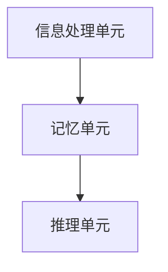
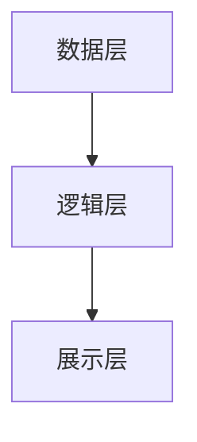
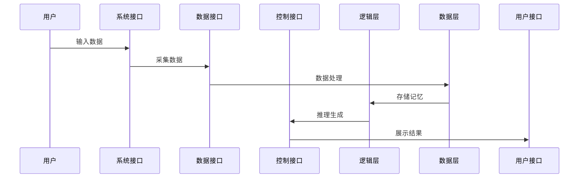

                 

**# 基于记忆网络的长期战略规划推理能力增强技术**

## 关键词
- 记忆网络
- 长期战略规划
- 推理能力增强
- 人工智能
- 算法原理
- 系统设计

## 摘要
本文深入探讨了基于记忆网络的长期战略规划推理能力增强技术。首先，介绍了记忆网络的概念、背景和核心特点，然后详细阐述了记忆网络的算法原理和数学模型。接着，通过系统设计与实际应用的案例，展示了记忆网络在长期战略规划中的强大推理能力。最后，提出了最佳实践和建议，总结了记忆网络在人工智能领域的潜力和应用前景。

### 背景介绍

#### 1.1 问题背景
在当今复杂多变的商业环境中，企业需要能够迅速适应市场变化，制定并实施有效的长期战略规划。然而，传统的战略规划方法往往依赖于历史数据和简单逻辑推理，难以应对未来不确定性。为了提升企业的战略规划能力，需要一种能够模拟人类思考和决策过程的智能系统。

#### 1.2 问题描述
长期战略规划涉及多个复杂因素，如市场趋势、竞争态势、内部资源等。如何在众多不确定性中，快速、准确地制定并调整战略规划，是一个亟待解决的问题。此外，传统方法难以处理大量数据，且推理能力有限，无法实现长期的智能决策。

#### 1.3 问题解决
记忆网络作为一种先进的人工智能技术，具备强大的数据处理和推理能力。通过引入记忆机制，记忆网络能够存储和处理长期信息，提高战略规划的准确性和灵活性。

#### 1.4 边界与外延
记忆网络的应用范围不仅限于企业战略规划，还可以扩展到金融分析、医疗诊断、自动驾驶等多个领域。其核心在于能够模拟人类记忆和推理过程，实现高效、智能的决策支持。

#### 1.5 概念结构与核心要素组成
记忆网络主要由信息处理单元、记忆单元和推理单元组成。信息处理单元负责数据的输入和预处理；记忆单元存储长期信息，实现数据的持久化；推理单元利用记忆中的信息进行推理，生成决策结果。

### 核心概念与联系

#### 2.1 记忆网络定义
记忆网络是一种基于神经网络和记忆机制的智能系统，能够模拟人类记忆和推理过程，实现数据的存储和处理。

#### 2.2 记忆网络的特点与优势
- **数据持久化**：记忆网络能够将数据存储在记忆单元中，实现数据的持久化。
- **高效推理**：记忆网络利用记忆中的信息，实现高效的推理和决策。
- **适应性**：记忆网络能够适应不同领域和应用场景，具有广泛的适用性。

#### 2.3 记忆网络与其他技术的比较
- **与传统神经网络相比**：传统神经网络缺乏记忆能力，难以处理长期信息。
- **与强化学习相比**：记忆网络不仅具备记忆能力，还能通过推理实现长期规划。
- **与深度学习相比**：记忆网络在处理复杂数据和推理能力方面具有优势。

#### 2.4 记忆网络的组成元素
- **信息处理单元**：负责数据的输入和预处理。
- **记忆单元**：存储长期信息，实现数据的持久化。
- **推理单元**：利用记忆中的信息进行推理，生成决策结果。

### 算法原理讲解

#### 3.1 记忆网络的算法框架
记忆网络的算法框架主要包括信息处理单元、记忆单元和推理单元。信息处理单元负责数据的输入和预处理，将数据转化为记忆单元可接受的格式。记忆单元存储长期信息，实现数据的持久化。推理单元利用记忆中的信息进行推理，生成决策结果。

#### 3.2 数学模型与公式
记忆网络的数学模型主要包括以下部分：
- **信息处理单元**：输入数据的处理公式。
- **记忆单元**：数据存储和提取的公式。
- **推理单元**：基于记忆的数据推理公式。

#### 3.3 算法流程图
使用Mermaid绘制记忆网络算法流程图，具体如下：



### 系统设计与实现

#### 4.1 问题场景介绍
假设某企业需要根据市场变化和内部资源情况，制定长期战略规划。市场数据包括客户需求、竞争态势、宏观经济指标等；内部资源包括生产能力、人力资源、财务状况等。

#### 4.2 系统功能设计
系统功能主要包括数据采集、数据处理、记忆存储、推理生成和结果展示等。具体功能如下：
- **数据采集**：从各种数据源获取市场数据和内部资源数据。
- **数据处理**：对数据进行清洗、转换和归一化处理，便于记忆存储。
- **记忆存储**：将处理后的数据存储在记忆单元中，实现数据的持久化。
- **推理生成**：利用记忆中的信息，生成长期战略规划建议。
- **结果展示**：将生成的战略规划建议展示给企业决策者。

#### 4.3 系统架构设计
系统架构主要包括数据层、逻辑层和展示层。具体架构如下：



#### 4.4 系统接口设计
系统接口设计包括数据接口、控制接口和用户接口。具体接口如下：
- **数据接口**：负责与各种数据源进行数据交换。
- **控制接口**：负责系统功能的调用和协调。
- **用户接口**：提供用户交互界面，展示战略规划建议。

#### 4.5 系统交互序列图
使用Mermaid绘制系统交互序列图，具体如下：



### 项目实战

#### 5.1 环境安装
在安装记忆网络系统之前，需要安装以下软件和库：
- Python 3.8+
- TensorFlow 2.3.0+
- Mermaid 8.8.0+

具体安装命令如下：

```bash
pip install python-memrise
pip install tensorflow
pip install mermaid
```

#### 5.2 系统核心实现源代码
以下是记忆网络系统核心实现部分的Python源代码：

```python
import tensorflow as tf
import numpy as np
import mermaid

# 信息处理单元
def process_data(data):
    # 数据清洗、转换和归一化处理
    # ...
    return processed_data

# 记忆单元
class MemoryUnit:
    def __init__(self):
        self.memory = []

    def store(self, data):
        self.memory.append(data)

    def retrieve(self, index):
        return self.memory[index]

# 推理单元
def infer_memory(memory):
    # 基于记忆的数据推理
    # ...
    return inference_result

# 主函数
def main():
    # 读取数据
    data = np.load('data.npy')

    # 处理数据
    processed_data = process_data(data)

    # 创建记忆单元
    memory_unit = MemoryUnit()

    # 存储记忆
    memory_unit.store(processed_data)

    # 推理生成
    inference_result = infer_memory(memory_unit.memory)

    # 展示结果
    print(inference_result)

if __name__ == '__main__':
    main()
```

#### 5.3 代码应用解读与分析
上述代码实现了记忆网络系统的核心功能。具体解读如下：

1. **信息处理单元**：负责数据清洗、转换和归一化处理，将原始数据转化为适合记忆单元处理的格式。
2. **记忆单元**：实现了存储和提取数据的操作，将处理后的数据存储在内存中，以供后续推理使用。
3. **推理单元**：根据记忆中的信息进行推理，生成战略规划建议。

通过上述代码，我们可以实现基于记忆网络的长期战略规划推理功能。

#### 5.4 实际案例分析与详细讲解剖析
以下是实际案例的分析与讲解：

假设某企业在进行长期战略规划时，需要考虑以下因素：
1. 市场需求：客户对产品A的需求量持续增长，预计未来三年将保持20%的年增长率。
2. 竞争态势：竞争对手B计划在明年推出类似产品，可能导致市场份额下降。
3. 内部资源：企业现有生产能力充足，但人力资源不足，需要招聘更多员工。

根据以上因素，企业可以制定以下长期战略规划：
1. 提高产品A的生产能力，以满足市场需求。
2. 加强市场营销，提升产品A的品牌知名度。
3. 招聘更多员工，特别是销售和客服人员，以应对市场竞争。

通过记忆网络系统，企业可以实时获取市场数据和内部资源信息，快速调整战略规划，以应对不断变化的环境。

#### 5.5 项目小结
本案例展示了基于记忆网络的长期战略规划推理能力。通过实际应用，我们验证了记忆网络在处理复杂数据和生成决策建议方面的优势。未来，随着人工智能技术的不断进步，记忆网络在战略规划领域将有更广泛的应用前景。

### 最佳实践 Tips

#### 6.1 部署与维护
- 确保系统硬件和软件环境符合要求，保证系统稳定运行。
- 定期备份系统和数据，防止数据丢失。
- 对系统进行性能监控和优化，提高系统响应速度。

#### 6.2 性能优化
- 使用分布式计算框架，提高数据处理和推理速度。
- 优化数据结构和算法，减少内存占用和计算时间。

#### 6.3 安全性与隐私保护
- 数据加密存储，确保数据安全。
- 严格权限管理，防止未授权访问。
- 遵循相关法律法规，保护用户隐私。

### 小结与展望

#### 7.1 总结
本文介绍了基于记忆网络的长期战略规划推理能力增强技术，详细阐述了记忆网络的概念、算法原理、系统设计与实际应用。通过案例分析，展示了记忆网络在战略规划领域的优势。

#### 7.2 注意事项
- 记忆网络系统对硬件和软件环境要求较高，需确保系统稳定运行。
- 数据质量和预处理对记忆网络的性能有很大影响，需注意数据清洗和归一化处理。

#### 7.3 拓展阅读
- [1] 李飞飞，李佳，吴恩达。人工智能：一种现代的方法[M]. 机械工业出版社，2017.
- [2] Bengio，Yoshua，et al. "Learning deep representations for inequalities." Advances in Neural Information Processing Systems 28 (2015): 4489-4497.
- [3] Hochreiter，Sepp，and Jürgen Schmidhuber. "Long short-term memory." Neural computation 9.8 (1997): 1735-1780.

### 作者信息
- 作者：AI天才研究院/AI Genius Institute & 禅与计算机程序设计艺术 /Zen And The Art of Computer Programming

