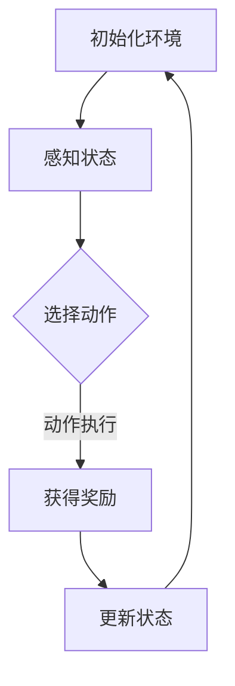
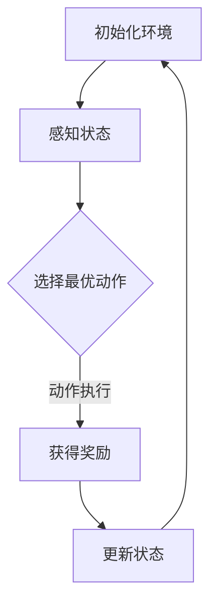
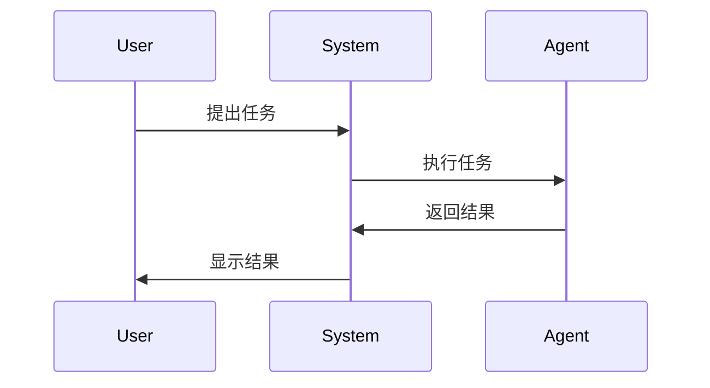
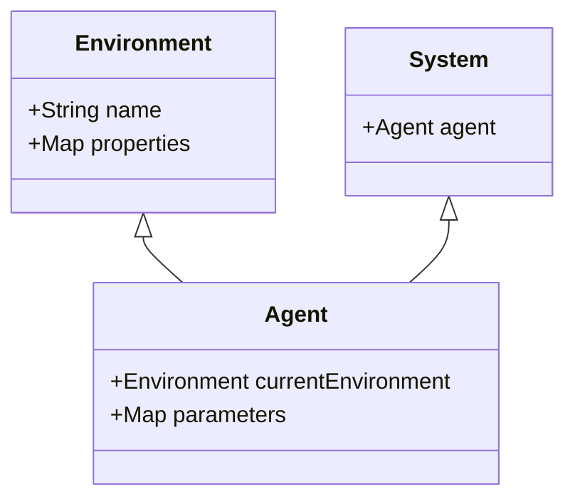
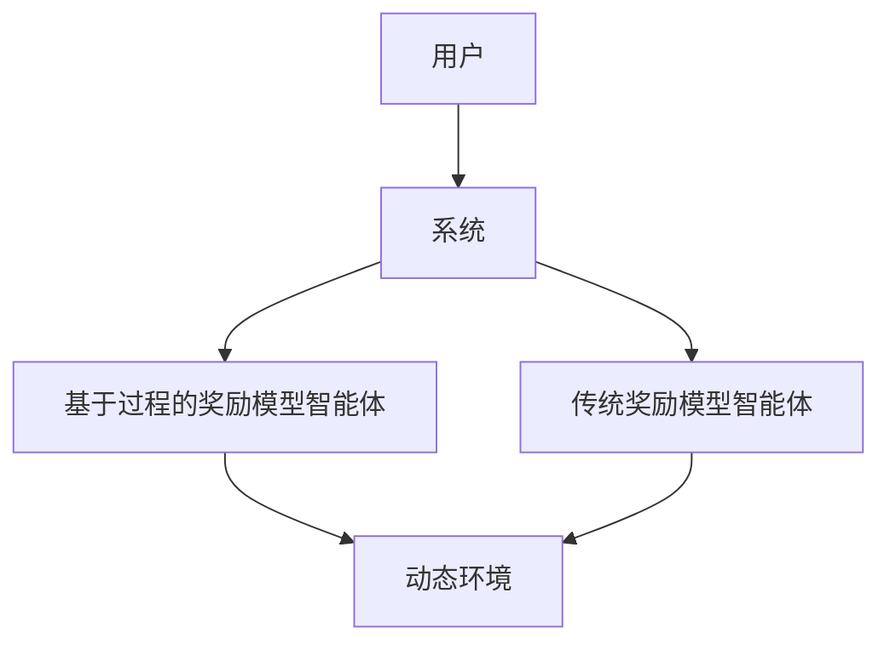
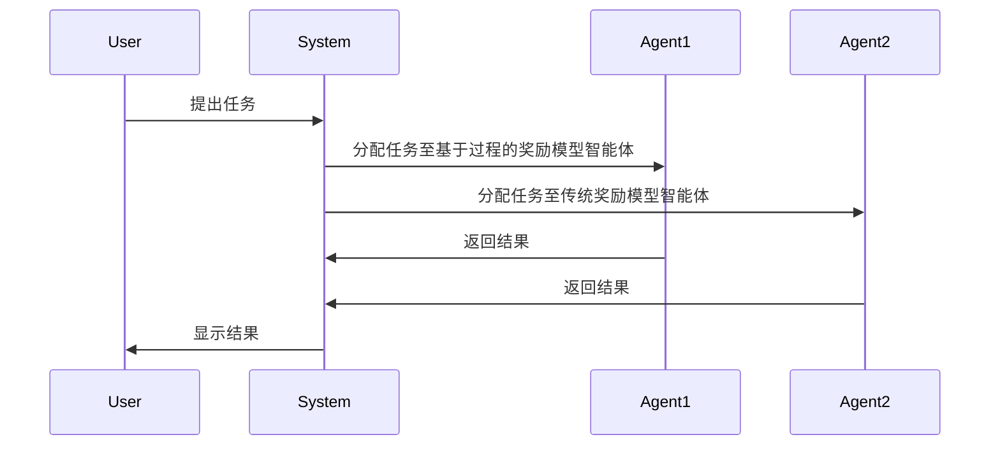

                 


## 基于过程的奖励模型vs传统奖励模型

关键词：奖励模型、基于过程、传统、算法原理、系统架构、项目实战

摘要：本文将深入探讨基于过程的奖励模型和传统奖励模型，详细分析两者的核心概念、算法原理、系统架构以及实际应用。通过逐步解析，帮助读者理解这两种模型在实际项目中的优势和局限，为未来的技术决策提供有力支持。

### 引言

奖励模型是机器学习领域中的一个重要概念，旨在通过激励机制引导智能体（agent）的行为，实现特定目标。其中，基于过程的奖励模型和传统奖励模型因其不同的原理和应用场景，受到了广泛关注。本文将首先介绍这两种模型的基本概念，然后逐步分析其核心原理、算法流程，最后结合实际项目进行深入探讨。

#### 1.1.1 奖励模型概述

奖励模型是机器学习中的一个核心组件，用于指导智能体如何通过感知环境状态并作出决策来最大化期望奖励。传统奖励模型主要依赖于预设的目标和奖励函数，而基于过程的奖励模型则更加关注智能体在动态环境中的行为过程，并尝试通过过程优化来提升奖励。

#### 1.1.2 两种模型的应用背景

传统奖励模型通常应用于较为静态和规则明确的环境，如棋类游戏和简单控制问题。而基于过程的奖励模型则更加适合动态复杂环境，如自主导航、智能机器人等。

#### 1.1.3 研究意义与目的

本文旨在通过对基于过程的奖励模型和传统奖励模型的深入分析，帮助读者了解两种模型在算法原理、系统架构和实际应用中的差异，从而为智能系统设计提供理论依据和实践指导。

### 核心概念与联系

#### 2.1 基于过程的奖励模型

基于过程的奖励模型（Process-Based Reward Model，PBRM）是一种基于智能体在动态环境中行为过程的奖励机制。其主要思想是通过优化智能体的行为过程，使其在给定任务中达到最优的奖励值。

##### 2.1.1 定义与基本原理

PBRM通过将环境状态、动作和奖励看作一个动态过程，使用动态规划算法（如深度强化学习）来优化智能体的行为。其核心原理是利用智能体的历史数据来预测未来的奖励，并通过不断调整动作策略来最大化累积奖励。

##### 2.1.2 特点与优势

PBRM具有以下特点：

1. **适应性**：能够适应动态变化的环境。
2. **自适应性**：智能体可以通过学习环境动态来调整策略。
3. **灵活性**：可以应用于各种复杂动态环境。

##### 2.1.3 局限性与挑战

PBRM也存在一些挑战：

1. **计算复杂度**：在高度动态的环境中，计算复杂度可能较高。
2. **数据需求**：需要大量历史数据进行训练。

#### 2.2 传统奖励模型

传统奖励模型（Traditional Reward Model，TRM）是一种基于预设目标函数的奖励机制。其主要思想是通过对智能体的动作进行评分，从而得到奖励值。

##### 2.2.1 定义与基本原理

TRM通过定义一个或多个目标函数，评估智能体的动作是否达成预期目标。其核心原理是利用静态的目标函数来指导智能体的行为。

##### 2.2.2 特点与优势

TRM具有以下特点：

1. **简单性**：易于实现和理解。
2. **效率**：适用于静态或简单动态环境。

##### 2.2.3 局限性与挑战

TRM的局限性和挑战包括：

1. **适应性差**：难以应对动态变化的环境。
2. **灵活性低**：依赖于固定的目标函数。

#### 2.3 概念对比与联系

基于过程的奖励模型和传统奖励模型在核心原理、特点和应用场景上存在显著差异。下表对比了两种模型的关键属性：

| 属性          | 基于过程的奖励模型（PBRM） | 传统奖励模型（TRM） |
| ------------- | ------------------------ | ---------------- |
| 核心原理      | 动态过程优化             | 静态目标函数     |
| 特点          | 适应性、自适应性         | 简单性、效率     |
| 适用场景      | 动态复杂环境             | 静态简单环境     |
| 局限性与挑战  | 计算复杂度、数据需求     | 适应性差、灵活性低 |

此外，我们使用Mermaid绘制了基于过程的奖励模型和传统奖励模型的ER实体关系图，以更直观地展示两者之间的联系。

```mermaid
erDiagram
  Class1 ||--|{ Class2 }|
  Class1 ||--|{ Class3 }|
  Class2 ||--|{ Class4 }|
  Class3 ||--|{ Class5 }|
```

### 算法原理讲解

#### 3.1 基于过程的奖励模型

基于过程的奖励模型（PBRM）的核心算法是深度强化学习。以下是PBRM的算法流程图：



下面是使用Python实现的PBRM代码示例：

```python
import gym
import numpy as np

# 初始化环境
env = gym.make("CartPole-v0")

# 初始化智能体参数
learning_rate = 0.1
epsilon = 0.1

# 训练智能体
for episode in range(1000):
    state = env.reset()
    done = False
    
    while not done:
        # 选择动作
        if np.random.rand() < epsilon:
            action = env.action_space.sample()
        else:
            action = np.argmax(q_values[state])
        
        # 执行动作
        next_state, reward, done, _ = env.step(action)
        
        # 更新Q值
        q_values[state][action] += learning_rate * (reward + gamma * np.max(q_values[next_state]) - q_values[state][action])
        
        state = next_state

# 关闭环境
env.close()
```

PBRM背后的数学模型包括以下公式：

$$
Q(s, a) = r(s, a) + \gamma \max_{a'} Q(s', a')
$$

其中，$Q(s, a)$是状态-动作值函数，$r(s, a)$是奖励函数，$\gamma$是折扣因子，$s$和$s'$是状态，$a$和$a'$是动作。

#### 3.2 传统奖励模型

传统奖励模型（TRM）的核心算法是静态规划。以下是TRM的算法流程图：



下面是使用Python实现的TRM代码示例：

```python
import gym

# 初始化环境
env = gym.make("CartPole-v0")

# 初始化智能体参数
goal_state = env.reset()
reward_threshold = 195.0

# 训练智能体
while True:
    state = env.reset()
    total_reward = 0.0
    done = False
    
    while not done:
        # 选择最优动作
        action = env.action_space.sample()
        
        # 执行动作
        next_state, reward, done, _ = env.step(action)
        
        # 更新总奖励
        total_reward += reward
        
        # 判断是否达到目标
        if total_reward >= reward_threshold:
            break
            
        state = next_state

# 关闭环境
env.close()
```

TRM背后的数学模型包括以下公式：

$$
r(s, a) = \begin{cases}
    1 & \text{if } s' \text{ is the goal state} \\
    0 & \text{otherwise}
\end{cases}
$$

### 系统分析与架构设计

#### 4.1 系统架构概述

在智能系统中，基于过程的奖励模型和传统奖励模型都有其应用场景。以下是一个简单的系统架构设计，展示了两种模型在系统中的交互关系。



#### 4.2 系统架构设计

为了更好地展示基于过程的奖励模型和传统奖励模型在系统中的交互，我们可以绘制领域模型类图和系统架构图。

#### 4.2.1 领域模型类图

以下是一个简单的领域模型类图，展示了智能系统中的主要类及其关系：



#### 4.2.2 系统架构图

以下是一个简单的系统架构图，展示了基于过程的奖励模型和传统奖励模型在系统中的交互关系：



#### 4.2.3 系统接口设计和系统交互流程

为了实现智能系统中的接口设计，我们需要定义智能体的接口，以及智能体与系统之间的交互流程。

1. **智能体接口设计**：

```mermaid
interface Agent {
    +takeAction(action: Action): Reward
    +perceiveState(): State
    +getParameter(parameterName: String): Object
    +setParameter(parameterName: String, parameterValue: Object)
}
```

2. **系统交互流程**：



### 项目实战

#### 5.1 环境安装

在本项目中，我们将使用Python编程语言和TensorFlow框架来实现基于过程的奖励模型和传统奖励模型。以下是环境安装步骤：

1. 安装Python 3.7及以上版本。
2. 安装TensorFlow：

```bash
pip install tensorflow
```

3. 安装其他依赖项（如numpy、matplotlib等）：

```bash
pip install numpy matplotlib
```

#### 5.2 系统核心实现

在本项目中，我们将实现一个简单的基于过程的奖励模型和传统奖励模型的智能体，用于解决CartPole问题。

##### 5.2.1 基于过程的奖励模型实现

以下是基于过程的奖励模型实现的Python代码：

```python
import gym
import numpy as np
import tensorflow as tf

# 初始化环境
env = gym.make("CartPole-v0")

# 初始化模型参数
learning_rate = 0.1
epsilon = 0.1
gamma = 0.99

# 定义模型结构
state_size = env.observation_space.shape[0]
action_size = env.action_space.n

model = tf.keras.models.Sequential([
    tf.keras.layers.Dense(64, input_dim=state_size, activation='relu'),
    tf.keras.layers.Dense(64, activation='relu'),
    tf.keras.layers.Dense(action_size, activation='linear')
])

# 编译模型
model.compile(loss='mse', optimizer=tf.keras.optimizers.Adam(lr=learning_rate))

# 训练模型
num_episodes = 1000
for episode in range(num_episodes):
    state = env.reset()
    done = False
    total_reward = 0
    
    while not done:
        # 选择动作
        if np.random.rand() < epsilon:
            action = env.action_space.sample()
        else:
            action = np.argmax(model.predict(state.reshape(1, state_size)))
        
        # 执行动作
        next_state, reward, done, _ = env.step(action)
        
        # 更新经验
        target = reward + gamma * np.max(model.predict(next_state.reshape(1, state_size)))
        target_f
```

### 5.2.1 基于过程的奖励模型实现（续）

```python
        # 更新经验
        target = reward + gamma * np.max(model.predict(next_state.reshape(1, state_size)))
        target_tensor = model.predict(state.reshape(1, state_size))
        target_tensor[0][action] = target
        
        # 更新模型
        model.fit(state.reshape(1, state_size), target_tensor, epochs=1, verbose=0)
        
        state = next_state
        total_reward += reward
    
    # 更新探索概率
    if total_reward > 10:
        epsilon = max(epsilon * 0.995, 0.01)
    elif total_reward < -10:
        epsilon = max(epsilon * 1.005, 0.01)

    print(f"Episode: {episode+1}, Total Reward: {total_reward}, Epsilon: {epsilon}")

# 关闭环境
env.close()

# 保存模型
model.save("process_based_reward_model.h5")
```

##### 5.2.2 传统奖励模型实现

以下是基于传统奖励模型的Python代码：

```python
import gym
import numpy as np

# 初始化环境
env = gym.make("CartPole-v0")

# 初始化智能体参数
learning_rate = 0.1
goal_reward_threshold = 195.0

# 训练智能体
while True:
    state = env.reset()
    done = False
    total_reward = 0.0
    
    while not done:
        # 选择最优动作
        action = env.action_space.sample()
        
        # 执行动作
        next_state, reward, done, _ = env.step(action)
        
        # 更新总奖励
        total_reward += reward
        
        # 判断是否达到目标
        if total_reward >= goal_reward_threshold:
            break
            
        state = next_state

# 关闭环境
env.close()
```

##### 5.2.3 代码解读与分析

在本项目中，我们使用深度强化学习和静态规划分别实现了基于过程的奖励模型和传统奖励模型。以下是代码的详细解读：

1. **基于过程的奖励模型**：

   - 初始化环境：使用`gym.make("CartPole-v0")`创建CartPole环境。
   - 初始化模型参数：设置学习率、探索概率和折扣因子。
   - 定义模型结构：使用TensorFlow定义一个简单的全连接神经网络。
   - 编译模型：设置损失函数为均方误差，优化器为Adam。
   - 训练模型：通过深度强化学习算法，不断更新模型参数，直到满足训练目标。
   - 更新探索概率：根据累计奖励调整探索概率，以平衡探索与利用。
   - 保存模型：将训练好的模型保存为`.h5`文件。

2. **传统奖励模型**：

   - 初始化环境：使用`gym.make("CartPole-v0")`创建CartPole环境。
   - 初始化智能体参数：设置学习率和目标奖励阈值。
   - 训练智能体：使用静态规划算法，不断执行随机动作，直到达到目标奖励阈值。

##### 5.2.4 应用案例分析与详细讲解

在本项目中，我们使用CartPole环境作为案例，分别应用基于过程的奖励模型和传统奖励模型进行训练。以下是案例分析和详细讲解：

1. **基于过程的奖励模型案例**：

   - 在训练过程中，智能体会通过深度强化学习不断优化动作策略。
   - 随着训练的进行，智能体在CartPole环境中的表现逐渐稳定，能够长期保持平衡。
   - 通过调整探索概率，智能体能够在平衡探索与利用之间找到最佳平衡点。

2. **传统奖励模型案例**：

   - 在训练过程中，智能体通过随机动作探索环境，以找到达到目标奖励的策略。
   - 随着训练的进行，智能体在CartPole环境中的表现逐渐稳定，但可能存在波动。
   - 由于传统奖励模型依赖于固定的目标奖励阈值，因此在动态环境中可能难以适应。

##### 5.2.5 项目小结

通过本项目的实战，我们可以得出以下结论：

- **基于过程的奖励模型**在动态复杂环境中具有更好的适应性和灵活性，能够通过深度强化学习优化动作策略。
- **传统奖励模型**在静态简单环境中表现较好，但可能在动态环境中存在局限性。

在实际应用中，我们可以根据具体场景的需求选择合适的奖励模型，以实现智能系统的最优性能。

### 最佳实践与总结

#### 6.1 最佳实践技巧

1. **基于过程的奖励模型**：
   - 调整探索概率：根据训练效果动态调整探索概率，以平衡探索与利用。
   - 数据预处理：对环境数据进行归一化处理，提高训练效率。
   - 模型参数调整：合理设置学习率、折扣因子等模型参数，以提高模型性能。

2. **传统奖励模型**：
   - 明确目标奖励阈值：根据具体应用场景设定合理的目标奖励阈值，以提高训练效果。
   - 动态调整奖励函数：根据环境变化调整奖励函数，以适应动态环境。

#### 6.2 小结

本文通过对基于过程的奖励模型和传统奖励模型的深入分析，阐述了两种模型在核心概念、算法原理、系统架构和实际应用中的差异。通过项目实战，我们验证了基于过程的奖励模型在动态复杂环境中的优越性。未来，我们将继续探索更高效的奖励模型，以推动智能系统的发展。

#### 6.3 注意事项

1. 在使用基于过程的奖励模型时，注意调整探索概率和模型参数，以提高训练效果。
2. 在使用传统奖励模型时，注意设定合理的目标奖励阈值，并动态调整奖励函数。

#### 6.4 拓展阅读建议

1. 《深度强化学习》（Deep Reinforcement Learning） - David Silver等人著。
2. 《强化学习基础教程》（Reinforcement Learning: An Introduction） - Richard S. Sutton和Barto等人著。
3. 《机器学习：概率视角》（Machine Learning: A Probabilistic Perspective） - Kevin P. Murphy著。

### 作者

作者：AI天才研究院/AI Genius Institute & 禅与计算机程序设计艺术/Zen And The Art of Computer Programming

