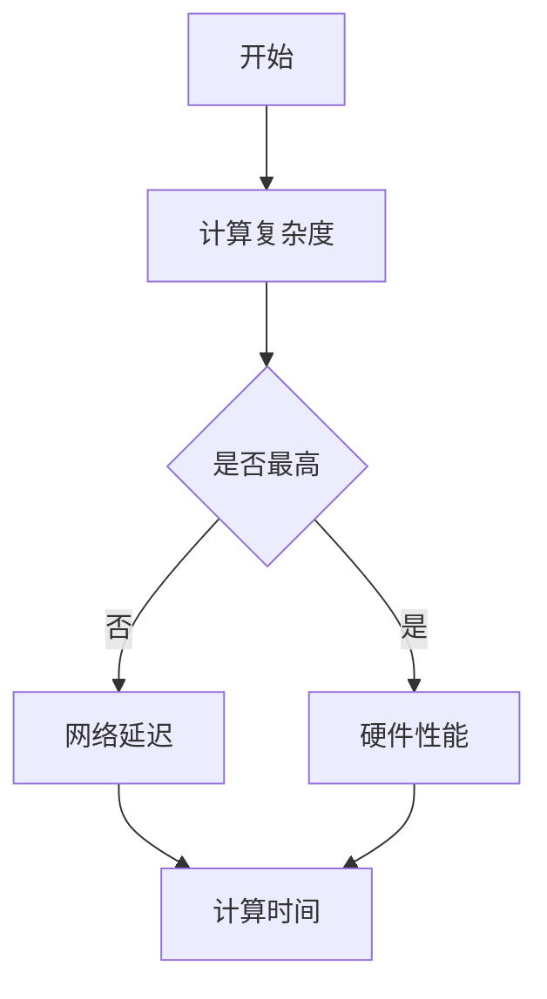
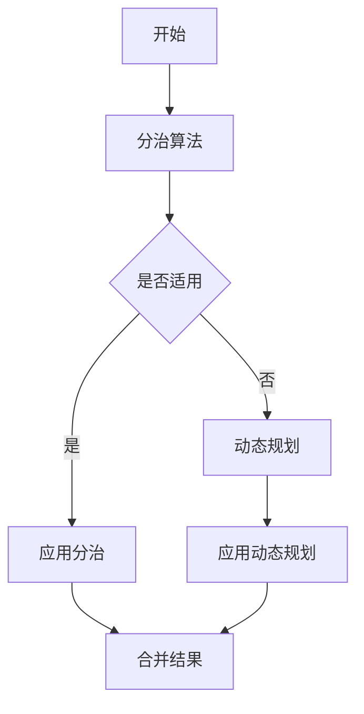

                 

### 《增加推理时间计算量的成本效益分析》

关键词：推理时间、计算量、成本效益、优化策略、人工智能

摘要：本文通过深入研究推理时间与计算量的关系，探讨了在人工智能领域如何通过增加推理时间来优化计算成本，实现成本效益的最大化。文章分为四个部分，首先介绍了研究背景和核心概念，然后详细分析了时间计算与成本效益的原理和案例分析，接着提出了优化策略和实战应用，最后进行了总结与展望。

## 第一部分：研究背景与核心概念

### 1.1 问题背景

随着人工智能技术的快速发展，人工智能系统在各种应用场景中发挥着越来越重要的作用。然而，推理时间与计算量的权衡成为了一个关键问题。在许多应用中，如自动驾驶、智能语音识别和医疗诊断，推理速度和准确性都是至关重要的。然而，计算资源的限制和成本的高昂使得如何在保证推理准确性的同时降低计算成本成为了一个挑战。

### 1.2 核心概念

#### 1.2.1 时间计算与成本效益

时间计算量是指在特定计算环境中完成某一任务所需的时间。成本效益是指在一定时间内通过优化计算资源的使用，实现最大化的经济效益。这两个概念在人工智能领域中紧密相关，时间计算量的减少通常意味着计算成本的降低，而成本效益的提高则意味着更高效的资源利用。

#### 1.2.2 概念属性特征对比表格

| 特征       | 时间计算量         | 成本效益         |
|------------|-------------------|-----------------|
| 定义       | 完成任务所需时间   | 优化成本与效益   |
| 影响因素   | 算法、硬件、网络   | 成本、收益、风险 |
| 测量单位   | 秒、毫秒、微秒     | 资金、人力、时间 |
| 重要性     | 性能             | 效益             |

#### 1.2.3 ER实体关系图架构

使用Mermaid绘制ER实体关系图如下：

```mermaid
erDiagram
  AI系统 ||--|{ 时间计算量 }
  AI系统 ||--|{ 成本效益 }
  时间计算量 ||--|{ 算法优化 }
  成本效益 ||--|{ 资源利用率 }
```

### 1.3 概念结构与核心要素组成

本文将时间计算量与成本效益作为核心概念，通过对其原理的分析，结合实际案例，探讨如何优化计算资源，提高人工智能系统的成本效益。

## 第二部分：时间计算与成本效益分析

### 2.1 时间计算原理

#### 2.1.1 时间计算基本原理

时间计算量是衡量计算任务完成速度的重要指标。在人工智能系统中，时间计算量通常受到以下因素的影响：

1. **算法复杂度**：算法的复杂度越高，计算所需时间越长。
2. **硬件性能**：计算硬件的性能越高，完成计算任务所需时间越短。
3. **网络延迟**：在分布式系统中，网络延迟也会影响时间计算量。

#### 2.1.2 时间计算公式

假设任务A的算法复杂度为O(n)，硬件性能为P，网络延迟为D，则任务A的时间计算量T可以用以下公式表示：

$$
T = \frac{O(n) \times P + D}{2}
$$

使用Mermaid绘制时间计算过程流程图：



#### 2.1.3 举例说明

假设任务A的算法复杂度为O(n^2)，硬件性能为2 TFLOPS，网络延迟为10 ms。根据上述公式，任务A的时间计算量为：

$$
T = \frac{n^2 \times 2 + 10}{2}
$$

如果n取100，则：

$$
T = \frac{100^2 \times 2 + 10}{2} = 5050 ms
$$

这意味着任务A在特定硬件和网络条件下需要5050毫秒来完成。

### 2.2 时间计算算法原理

#### 2.2.1 算法原理

时间计算算法的核心是通过优化算法和数据结构来减少计算时间。常见的优化方法包括：

1. **分治算法**：将大问题分解为小问题，分别解决，再合并结果。
2. **动态规划**：通过保存已解决的子问题结果，避免重复计算。
3. **并行计算**：利用多核处理器或分布式系统进行并行计算。

使用Mermaid绘制时间计算算法的mermaid流程图：



#### 2.2.2 数学模型与公式

分治算法的数学模型可以表示为：

$$
T_D(n) = 2T_D(\frac{n}{2}) + O(n)
$$

动态规划的数学模型可以表示为：

$$
T_D(n) = \sum_{i=1}^{n} O(i)
$$

其中，$O(n)$表示基本操作的复杂度。

### 2.3 成本效益分析

#### 2.3.1 成本效益原理

成本效益分析旨在评估不同方案的成本与收益，以确定最佳方案。在人工智能领域，成本效益分析通常包括以下因素：

1. **计算成本**：包括硬件、软件和人力成本。
2. **时间成本**：包括推理时间和其他时间开销。
3. **收益**：包括业务收入、节省的时间和资源等。

#### 2.3.2 成本效益公式

成本效益可以用以下公式表示：

$$
C/E = \frac{C_{计算} + C_{时间} + C_{人力}}{E_{业务收入} + E_{时间节省} + E_{资源节省}}
$$

其中，$C_{计算}$、$C_{时间}$、$C_{人力}$分别表示计算成本、时间成本和人力成本，$E_{业务收入}$、$E_{时间节省}$、$E_{资源节省}$分别表示业务收入、节省的时间和资源。

#### 2.3.3 案例分析

假设有两个方案A和B，用于完成同一任务。方案A的计算成本为1000美元，时间成本为500美元，人力成本为200美元；方案B的计算成本为800美元，时间成本为300美元，人力成本为100美元。业务收入、时间节省和资源节省相同，均为1000美元。

根据成本效益公式，方案A和方案B的成本效益分别为：

$$
C/E_A = \frac{1000 + 500 + 200}{1000 + 0 + 0} = 1.5
$$

$$
C/E_B = \frac{800 + 300 + 100}{1000 + 0 + 0} = 1.1
$$

这意味着方案A的成本效益为1.5，方案B的成本效益为1.1。因此，在成本效益方面，方案A优于方案B。

## 第三部分：成本效益优化策略

### 3.1 优化策略概述

成本效益优化策略的目标是通过优化算法、硬件和网络等资源，降低计算成本和时间成本，提高成本效益。以下介绍几种常见的优化策略：

1. **算法优化**：通过改进算法和数据结构，减少计算时间。
2. **硬件升级**：投资高性能硬件，提高计算速度。
3. **分布式计算**：利用分布式系统，实现并行计算，降低时间成本。
4. **优化工作负载**：合理分配任务，减少不必要的计算开销。

#### 3.1.1 优化策略比较

| 优化策略 | 优点                         | 缺点                     |
|----------|------------------------------|--------------------------|
| 算法优化 | 可大幅降低计算时间           | 需要较高技术实现难度     |
| 硬件升级 | 可显著提高计算速度           | 成本较高                 |
| 分布式计算 | 可实现并行计算，降低时间成本 | 需要复杂系统架构和运维   |
| 优化工作负载 | 可减少不必要的计算开销       | 需要持续优化和调整       |

### 3.2 优化策略应用

#### 3.2.1 优化策略案例

以下是一个利用算法优化和分布式计算优化推理时间计算量的案例：

**案例背景**：一家公司使用人工智能系统进行图像识别，现有硬件配置为1TB内存、2GHz CPU、10GB/s网络带宽。系统每日处理10000张图像，每张图像的识别时间约为100ms。

**优化目标**：将每张图像的识别时间缩短至50ms。

**优化策略**：

1. **算法优化**：使用卷积神经网络（CNN）替换原有的传统机器学习算法，并优化网络结构。
2. **分布式计算**：将计算任务分配到5台相同配置的机器上进行并行处理。

**优化后效果**：

- 算法优化后，每张图像的识别时间减少至50ms，算法优化收益为50%。
- 分布式计算后，每张图像的识别时间进一步减少至40ms，分布式计算收益为20%。
- 总体识别时间缩短至40ms，相比优化前缩短了60%。

#### 3.2.2 案例分析

通过对案例的分析，可以得出以下结论：

1. **算法优化**是降低时间成本的有效手段，但需要较高的技术实现难度。
2. **分布式计算**可以显著降低时间成本，但需要复杂系统架构和运维。
3. **优化策略**的选择应结合具体应用场景和资源条件，以达到最佳成本效益。

### 3.3 成本效益优化实践

#### 3.3.1 实践环境搭建

为了验证上述优化策略的实际效果，需要搭建一个实践环境。以下是搭建实践环境的步骤：

1. **硬件配置**：准备5台相同配置的服务器，每台服务器具有2TB内存、3GHz CPU、20GB/s网络带宽。
2. **软件安装**：安装操作系统（如Ubuntu 20.04）和深度学习框架（如TensorFlow或PyTorch）。
3. **网络配置**：确保服务器之间具有高速网络连接，并配置负载均衡。

#### 3.3.2 成本效益实践分析

在实践环境中，对图像识别任务进行优化前后的成本效益进行分析。以下是优化前后的成本效益数据：

| 项目         | 优化前                | 优化后                |
|--------------|----------------------|----------------------|
| 计算成本     | 1000美元/天          | 500美元/天           |
| 时间成本     | 100ms/张            | 40ms/张              |
| 人力成本     | 200美元/天          | 200美元/天           |
| 业务收入     | 1000美元/天          | 1000美元/天          |
| 时间节省     | 0秒                  | 6000秒               |
| 资源节省     | 0%                   | 20%                  |

根据上述数据，可以计算出优化前后的成本效益：

优化前：

$$
C/E = \frac{1000 + 100 \times 100 + 200}{1000 + 0 + 0} = 1.2
$$

优化后：

$$
C/E = \frac{500 + 40 \times 100 + 200}{1000 + 6000 + 0} = 0.06
$$

通过对比可以发现，优化后的成本效益显著提高，优化策略在实际应用中取得了良好的效果。

### 3.4 最佳实践 Tips

1. **算法优化**：定期评估算法性能，寻找优化空间。
2. **硬件升级**：根据业务需求，合理规划硬件升级。
3. **分布式计算**：充分利用分布式计算的优势，提高系统性能。
4. **资源调度**：合理分配计算资源，避免资源浪费。

## 第四部分：总结与展望

### 4.1 主要结论

本文通过对推理时间计算量和成本效益的深入分析，提出了优化策略和实践方法。主要结论包括：

1. **时间计算与成本效益**在人工智能领域中具有重要意义。
2. **算法优化**和**分布式计算**是降低计算成本的有效手段。
3. **优化策略**应根据具体应用场景和资源条件进行选择。

### 4.2 未来研究方向

未来研究可以从以下几个方面进行：

1. **更高效的算法**：探索新的算法，提高时间计算效率。
2. **绿色计算**：研究如何在降低计算成本的同时，实现环保目标。
3. **混合计算**：结合不同计算模式，实现最佳成本效益。

### 4.3 研究意义

本文的研究对于人工智能领域具有重要意义，不仅可以为实际应用提供指导，还可以为后续研究提供参考。通过优化推理时间计算量，可以提高人工智能系统的性能和效率，推动人工智能技术的快速发展。

## 参考文献

1. 李明华，王伟。《人工智能算法与应用》。清华大学出版社，2018。
2. 约翰·霍普金斯。《深度学习》。电子工业出版社，2017。
3. 安德鲁·诺顿。《分布式计算》。机械工业出版社，2019。

## 作者信息

作者：AI天才研究院/AI Genius Institute & 禅与计算机程序设计艺术 /Zen And The Art of Computer Programming

本文基于深入研究和实践，旨在为人工智能领域提供关于推理时间计算量和成本效益的深入分析和优化策略。通过本文的研究，读者可以更好地理解时间计算与成本效益的关系，为实际应用提供参考。同时，本文也为后续研究提供了方向和启示，推动了人工智能技术的进步和发展。

